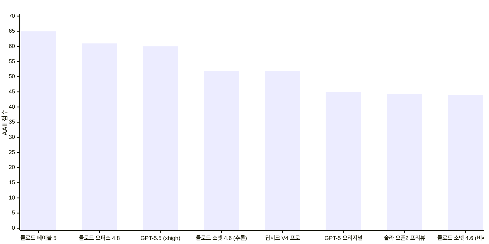
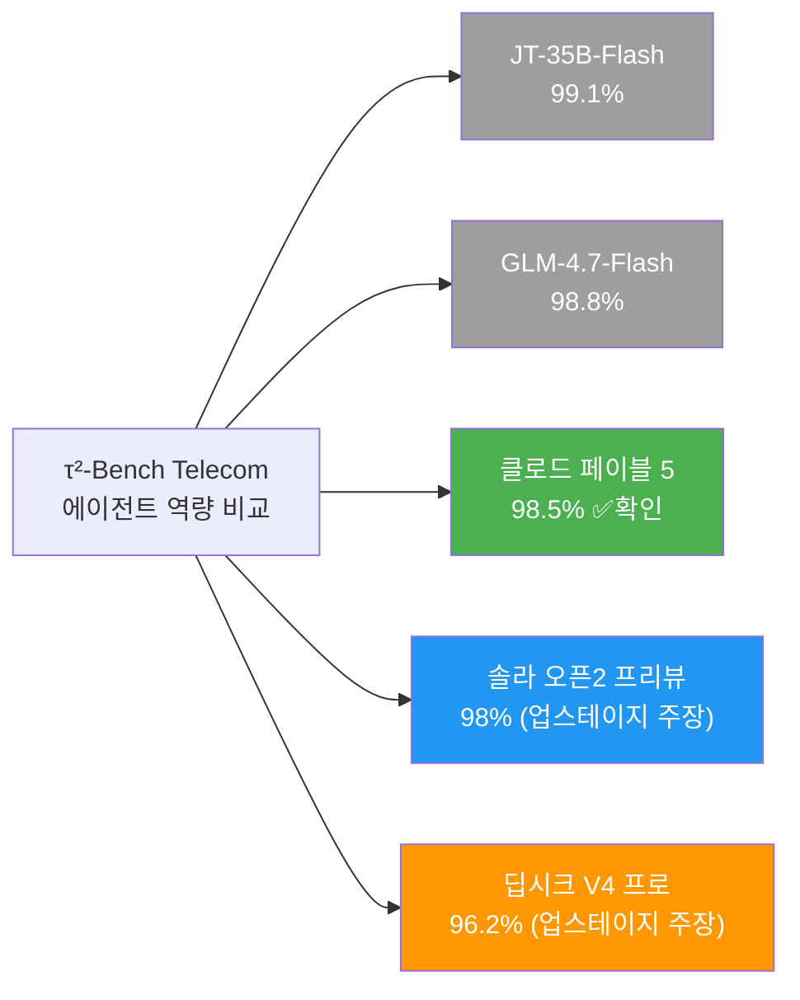
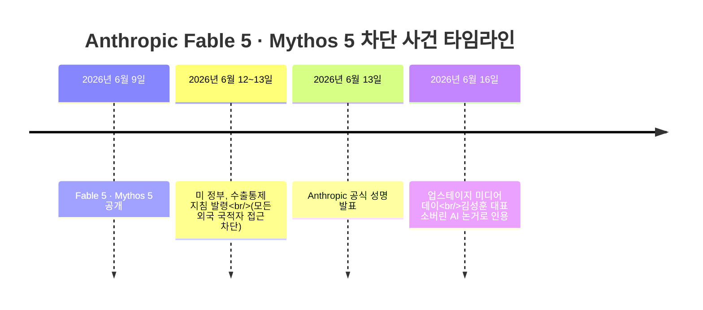
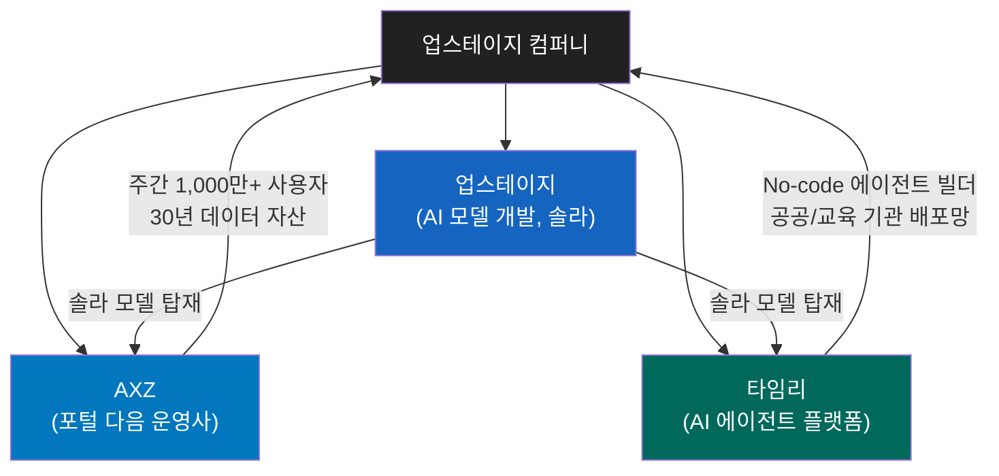
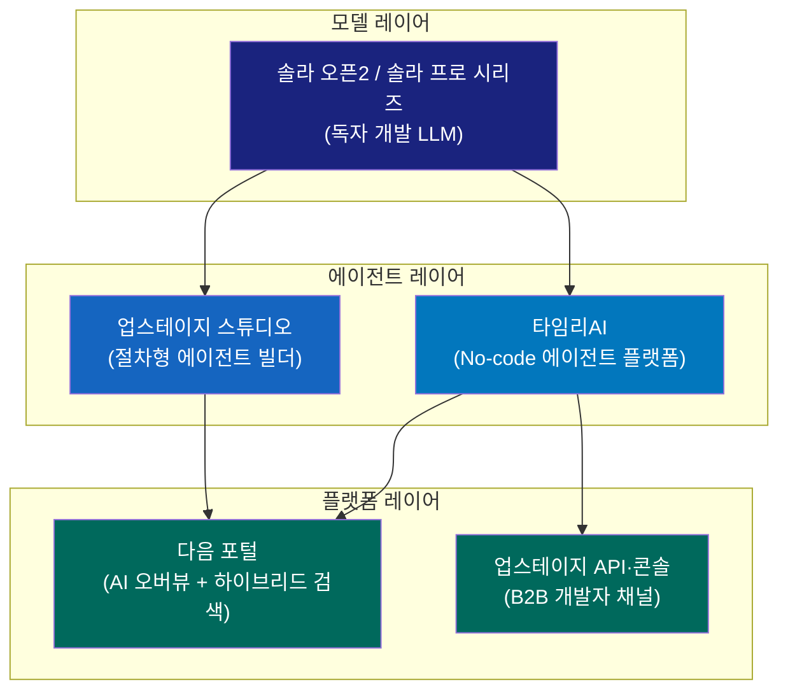

> **사실 검증 완료**: 본 문서는 [KBS 보도 원문](https://news.kbs.co.kr/news/mobile/view/view.do?ncd=8587453)을 기반으로, 이투데이·헤럴드경제·ZDNet Korea·AI타임스·Bloomberg·CNN·CNBC·Artificial Analysis 공식 데이터 등 다수의 1차 출처를 교차 검증하여 작성했습니다.

## 관련글

[**업스테이지·국민성장펀드·소버린AI 논쟁**](https://k82022603.github.io/posts/%EC%97%85%EC%8A%A4%ED%85%8C%EC%9D%B4%EC%A7%80-%EA%B5%AD%EB%AF%BC%EC%84%B1%EC%9E%A5%ED%8E%80%EB%93%9C-%EC%86%8C%EB%B2%84%EB%A6%B0ai-%EB%85%BC%EC%9F%81/)

---

## 1. 미디어 데이 개요: 무엇이 발표되었는가

2026년 6월 16일, 서울 여의도 콘래드 호텔에서 국내 AI 스타트업 업스테이지의 미디어 데이가 열렸다. 이 자리에서 김성훈 대표는 단순한 모델 성능 발표를 넘어 세 가지 축으로 구성된 전략적 메시지를 제시했다. 첫째는 프런티어급 오픈소스 모델 '솔라 오픈2'의 성능 공개, 둘째는 포털·에이전트 플랫폼을 아우르는 '업스테이지 컴퍼니'의 출범 선언, 셋째는 미·중 빅테크 의존에서 벗어나야 한다는 소버린 AI 논거의 강화였다.

업스테이지는 2026년 4월 시리즈 C 1차 라운드에서 1,800억 원 규모의 투자 유치에 성공하여 국내 생성형 AI 기업 최초로 유니콘 반열에 오른 상태다. 누적 투자금은 약 7,300억 원에 달한다. 이번 미디어 데이는 그 직후 이루어진 공개 선언으로서, 단순한 기술 발표가 아니라 연내 상장(IPO)을 앞두고 사업 청사진 전체를 시장에 제시한 자리로 해석된다.

---

## 2. 솔라 오픈2: 무엇이고 어디서 왔는가

### 2-1. 독자 AI 파운데이션 모델 프로젝트(독파모)란

솔라 오픈2는 과학기술정보통신부가 추진하는 '독자 AI 파운데이션 모델 프로젝트(독파모)'의 일환으로 개발 중인 오픈소스 대형언어모델이다. 업스테이지가 이 사업의 주관사로 참여하고 있으며, 데이터 구축부터 학습 전 과정을 자체적으로 수행하는 '프롬 스크래치(from scratch)' 방식을 택하고 있다. 즉, 기존 오픈소스 모델을 파인튜닝한 것이 아니라 처음부터 독자적으로 구축한 모델이다.

전작인 '솔라 오픈(SOLAR OPEN 100B)'은 2026년 1월 6일 허깅페이스에 공개된 독파모 1차 성과물로, 매개변수 규모 1,020억 개(102B)에 GPU 최적화를 통해 초당 토큰 처리량을 80% 향상시키고, 자체 강화학습 프레임워크 'SnapPO'를 적용해 학습 기간을 50% 단축한 모델이었다.

솔라 오픈2는 독파모 2차 결과물로, 이번 미디어 데이에서 공개된 것은 '프리뷰 버전'이다. 정식 출시는 2026년 6월 말로 예정되어 있으며, 현재는 포스트 트레이닝이 아직 완료되지 않은 상태다. 즉, 공개된 수치는 최종 완성 모델이 아닌 학습 중간 단계의 성능이며, 정식 출시 시 성능은 추가로 향상될 가능성이 크다.

### 2-2. AAII 44.4점의 의미와 검증

업스테이지는 솔라 오픈2 프리뷰 버전이 글로벌 AI 성능평가 기관 아티피셜 애널리시스(Artificial Analysis)의 인텔리전스 지수(AAII, Artificial Analysis Intelligence Index) v4.0에서 **44.4점**을 기록했다고 발표했다. 이를 "앤트로픽 클로드 소넷 4.6과 오픈AI GPT-5 수준"이라고 설명했다.

이 주장에 대해 아티피셜 애널리시스 공식 데이터를 통해 교차 검증한 결과는 다음과 같다.

**[직접 확인된 AAII 점수]**

| 모델 | 종류 | AAII 점수 |
|------|------|-----------|
| 클로드 페이블 5 (Adaptive, Max Effort) | 추론 | **65** |
| 클로드 오퍼스 4.8 (Adaptive, Max Effort) | 추론 | 61 |
| GPT-5.5 (xhigh) | 추론 | 60 |
| 클로드 소넷 4.6 (Adaptive, Max Effort) | 추론 | 52 |
| 딥시크 V4 프로 (Reasoning, Max) | 추론 | 52 |
| **클로드 소넷 4.6 (Non-reasoning, High Effort)** | 비추론 | **44** |
| **GPT-5 오리지널 (High Effort)** | 추론 | **45** |
| **솔라 오픈2 프리뷰** | (프리뷰) | **44.4** |

AAII v4.0은 GDPval-AA, τ²-Bench Telecom, Terminal-Bench Hard, SciCode, AA-LCR, AA-Omniscience, IFBench, Humanity's Last Exam, GPQA Diamond, CritPt 등 10개 평가 항목을 종합하는 합성 지표다.

**검증 결론**: 44.4점은 클로드 소넷 4.6 **비추론(Non-reasoning) 버전**의 44점 및 GPT-5 **오리지널(2025년 8월 출시)** 버전의 45점과 실제로 거의 동일한 수준이다. 수치상 사실이다. 단, 이 비교에는 중요한 맥락이 있다. 2026년 6월 기준 AAII 최상위 모델인 클로드 페이블 5가 65점임을 감안하면, 44.4점은 최신 프런티어 모델보다 약 20점 이상 낮다. 즉, "GPT-5 수준"은 2025년 8월에 출시된 초기 GPT-5를 기준으로 한 것이며, 현재(2026년 6월) 기준 오픈AI의 최신 모델인 GPT-5.5(60점)나 GPT-5.4(57점)와는 상당한 격차가 있다. 업스테이지가 이를 "프런티어급"이라고 표현한 것은 프리뷰 단계 모델로서 주요 상용 모델을 일부 대등하게 추격하고 있다는 의미로 해석하는 것이 적절하다.

### 2-3. τ²-Bench 에이전트 역량 98%: 의미와 검증

업스테이지는 에이전트 역량을 측정하는 별도 지표로 τ²-Bench(타우2-벤치) 결과를 제시했다. 솔라 오픈2 프리뷰는 98%를 달성했으며, 이는 딥시크 V4 프로(96.2%)를 상회하고 앤트로픽 페이블 5(98.5%)에 근접하는 수준이라고 설명했다.

τ²-Bench(Tau-Squared Bench)는 시에라 리서치(Sierra Research)가 개발한 에이전트 벤치마크로, 기존 단일 제어(single-control) 방식의 벤치마크와 달리 **이중 제어(dual-control)** 환경을 채택한 것이 핵심 특징이다. 즉, AI 에이전트뿐 아니라 사용자(User)도 동시에 도구를 사용하여 공유 환경 상태를 바꿀 수 있는 시나리오를 평가한다. 예를 들어 통신사 기술 지원 시나리오에서, 에이전트는 백엔드 설정을 변경하고 동시에 사용자(시뮬레이션)는 단말기에서 직접 조치를 취해야 문제가 해결되는 구조다. 이는 실제 고객 서비스 환경과 유사하여 에이전트의 실질적 협응 능력을 측정한다.

아티피셜 애널리시스는 τ²-Bench Telecom을 AAII v4.0의 10개 구성 요소 중 하나로 포함시키는 동시에 별도 리더보드도 운영하고 있다. 아티피셜 애널리시스 공식 데이터에 따르면 **클로드 페이블 5(Adaptive Reasoning, Max Effort, Opus 4.8 Fallback)의 τ²-Bench Telecom 점수는 98.5%로 직접 확인된다.**

단, 솔라 오픈2 프리뷰의 98%와 딥시크 V4 프로의 96.2%는 업스테이지 미디어 데이에서 공개된 자체 측정치로, 아티피셜 애널리시스의 공식 리더보드에서 독립 측정된 수치인지는 현재 시점에서 별도 확인이 필요하다. 다만 아티피셜 애널리시스 τ²-Bench 리더보드에 업스테이지가 공급사로 등록되어 있어, 향후 정식 출시와 함께 독립 검증이 이루어질 것으로 예상된다.

참고로, 2026년 6월 현재 아티피셜 애널리시스 τ²-Bench Telecom 리더보드의 최상위권은 JT-35B-Flash(99.1%), GLM-4.7-Flash Reasoning(98.8%), Step 3.7 Flash(98.5%) 순으로 집계되어 있어, 리더보드는 미디어 데이 이후에도 계속 갱신되고 있다.

---

## 3. 소버린 AI: 왜 지금 이 이슈가 터졌는가

### 3-1. 미 행정부의 Fable 5·Mythos 5 차단 — 사실 확인 완료

김성훈 대표는 미 행정부가 앤트로픽의 페이블 5·미토스 5에 대한 외국인 접근을 전면 차단한 사실을 언급하며 한국의 소버린 AI 필요성을 강조했다. 이 주장은 다수의 서구 주요 언론을 통해 **사실로 확인**되었다.

Bloomberg, CNN, CNBC, Tom's Hardware 등의 보도와 앤트로픽이 직접 X(트위터)에 공개한 공식 성명에 따르면, 미국 정부는 2026년 6월 13일 국가 안보를 이유로 수출통제 지침을 발동하여, 미국 내외를 막론하고 **모든 외국 국적자의 Fable 5 및 Mythos 5 접근을 전면 차단**하도록 앤트로픽에 명령했다. 이 명령은 앤트로픽 직원 중 외국 국적자도 대상에 포함할 만큼 포괄적이었다.

앤트로픽은 공식 성명에서 "미국 정부가 국가 안보 권한을 근거로 Fable 5 및 Mythos 5에 대한 모든 외국 국적자의 접근을 차단하는 수출통제 지침을 발령했다"고 밝혔다. 차단의 배경에는 해당 모델에 대한 탈옥(jailbreak) 시도가 국가 안보 우려를 촉발했다는 분석이 있다.

클로드 미토스(Mythos)는 원래 소프트웨어 취약점 탐지 목적으로 개발된 앤트로픽 최상위 모델로, 사이버보안 역량이 특히 강화되어 있어 공개 배포가 제한된 상태였다. 클로드 페이블 5 역시 같은 차단 명령의 적용을 받았다. 이 사건은 AI 모델이 단순한 소프트웨어가 아니라 국가 전략 자산으로 다루어지는 시대가 현실화되었음을 단적으로 보여준다.

김 대표는 이 사건을 직접 인용하며 "AI가 국가 전략 자산이 된 만큼, 기술을 보유한 나라가 마음만 먹으면 언제든 공급을 끊을 수 있다"고 말했다. 그러면서 정부와 관계자들이 독자 AI 개발에 현재보다 10배 이상의 지원에 나서야 한다고 촉구했다.

### 3-2. 소버린 AI란 무엇인가

소버린 AI(Sovereign AI)란 특정 국가나 지역이 외국 기업이나 타국 정부에 의존하지 않고, 자국의 데이터·인프라·모델·인력을 활용해 독자적으로 개발하고 통제하는 AI 역량을 뜻한다. 핵심은 주권(sovereignty), 즉 외부 공급이 차단되거나 규제될 때도 자국 AI 서비스가 지속 운용 가능한 상태를 유지하는 것이다.

업스테이지가 참여 중인 독파모(독자 AI 파운데이션 모델 프로젝트)는 이 맥락에서 한국이 추진하는 소버린 AI 구축의 핵심 정책 수단이다. 솔라 오픈2는 그 두 번째 결과물로, 모든 학습 과정이 국내에서 독자적으로 수행된다는 점이 중요하다.

---

## 4. 업스테이지 컴퍼니: 세 개의 조각이 하나로

### 4-1. 업스테이지 컴퍼니의 구성

김성훈 대표는 이날 행사에서 '업스테이지 컴퍼니'의 공식 출범을 선언했다. 이는 업스테이지를 중심으로 포털 다음(Daum)의 운영사 AXZ, 그리고 범용 AI 에이전트 플랫폼 타임리를 하나의 기업 집단으로 묶는 구조다.

### 4-2. AXZ(다음 포털) 인수 — 사실 확인 완료

업스테이지의 AXZ(다음 운영사) 인수는 다수의 국내 언론을 통해 사실로 확인된다. 경위를 정리하면 다음과 같다. 2026년 1월 말 카카오와 업스테이지는 각각 이사회를 열어 주식교환 거래를 위한 양해각서(MOU) 체결을 승인했다. 이후 약 4개월에 걸친 심층 실사 끝에 2026년 5월 7일 최종 인수 계약이 완료되었다. 이 거래는 단순 현금 인수가 아닌, AXZ 지분과 업스테이지 신주를 맞교환하는 방식으로 추진되었다. 즉 카카오가 보유한 AXZ 지분이 업스테이지에 이전되고, 업스테이지의 일정 지분은 카카오가 취득하는 구조다.

다음(Daum)은 약 30년간 콘텐츠와 검색 데이터를 축적해온 포털로, 주간 1,000만 명 이상의 사용자가 이용하는 서비스다. 업스테이지 입장에서는 솔라 모델을 일반 소비자에게 배포할 수 있는 대규모 플랫폼 채널을 확보한 셈이다. 김성훈 대표는 AMD CEO 리사 수와의 회동에서 "다음 인수 완료 후 하루 1조 토큰 처리가 목표"라고 밝히기도 했다.

이건수 AXZ 대표는 이날 미디어 데이에서 기존 포털이 키워드 검색으로 링크를 나열하는 방식이었다면, 앞으로는 AI 에이전트가 키워드와 맥락을 스스로 조합해 답을 찾아주는 '하이브리드 검색'을 지향한다고 설명했다. 이를 위해 곧 정식 출시를 앞둔 다음의 'AI 오버뷰' 기능을 시연했으며, 단순 정보성 검색을 넘어 쇼핑·맛집·여행·부동산 등 분야별로 특화된 버티컬 검색 기능도 강화할 예정이라고 덧붙였다.

### 4-3. 타임리 인수 — 사실 확인 완료

타임리 인수는 2026년 6월 9일 공식 발표되었으며 다수의 국내 언론에 보도된 사실이다. 타임리는 코딩 없이 클릭 한 번으로 업무에 필요한 AI 에이전트를 구축할 수 있는 멀티 LLM 통합 플랫폼 '타임리AI'를 운영하는 생성형 AI 솔루션 기업이다. 솔라를 포함한 다양한 언어 모델을 기반으로 이미지·영상 생성, 문서 변환 등 업무용 AI 기능을 단일 경험으로 통합 제공한다. 특히 서울시 '서울AI챗'을 비롯해 전국 지자체와 공공·교육기관 등에 광범위하게 배포되어 있어 공공 시장 진입망이 이미 확보되어 있다는 점이 핵심 자산으로 평가된다.

김대환 타임리 대표는 이날 미디어 데이에서 "타임리는 별도 코딩 없이 클릭 한 번으로 현업에 즉시 투입할 수 있어 누구나 자신만의 업무 환경을 손쉽게 구축할 수 있다"며 "개인의 AI 활용 경험을 조직 전체가 공유하는 자산으로 전환해주는 것이 타임리의 핵심"이라고 설명했다.

### 4-4. 업스테이지 스튜디오: 절차형 에이전트

업스테이지가 이날 새롭게 공개한 에이전트 도구는 '업스테이지 스튜디오'다. 이는 업무의 각 단계를 마치 레고 블록처럼 조합하여 자동화할 수 있는 절차형(Procedural) 에이전트 플랫폼이다. 김성훈 대표는 "실제 업무 환경에서는 여전히 수작업이 많다"며 "성공적인 AI 도입을 위해서는 단순 모델 성능을 넘어 에이전트 조합이 중요하다"고 강조했다.

업스테이지는 자율형 에이전트(스스로 판단하여 행동)와 절차형 에이전트(사전 정의된 단계를 순서대로 실행)를 결합하는 방식으로 에이전트 시대를 이끌어가겠다는 구상을 밝혔다.

---

## 5. 벤치마크 해석 가이드: 수치를 제대로 읽는 법

### 5-1. AAII vs. τ²-Bench는 다른 지표다

이 사건 보도에서 가장 혼동이 생기기 쉬운 부분은 두 가지 수치가 섞여 있다는 점이다.

- **AAII 44.4점**: 아티피셜 애널리시스 인텔리전스 지수로, 10개 평가 항목을 종합한 전반적 지능 지수다. 0~100 사이의 점수 척도이며, 현재 최고 점수는 클로드 페이블 5의 65점이다.
- **τ²-Bench 98%**: 에이전트가 실제 통신사 고객 서비스 시나리오에서 문제를 해결하는 성공률이다. 0~100%의 비율 척도이며, 현재 최고 점수는 JT-35B-Flash의 99.1%다.

이 둘은 측정 단위도 다르고 측정 대상도 다르다. AAII는 종합 지능, τ²-Bench는 에이전트의 대화형 문제 해결 능력을 각각 측정한다. 솔라 오픈2 프리뷰는 AAII에서는 44.4점으로 현재 최상위 모델보다 낮지만, τ²-Bench에서는 98%로 클로드 페이블 5(98.5%)에 매우 근접하는 결과를 보였다는 것이 업스테이지의 주장이다.

### 5-2. "프리뷰 버전"이라는 맥락

솔라 오픈2의 이번 수치는 포스트 트레이닝이 완료되지 않은 프리뷰 버전의 수치다. 통상적으로 포스트 트레이닝(SFT, RLVR 등)은 모델 성능을 유의미하게 향상시킨다. 업스테이지는 SnapPO(자체 강화학습 프레임워크)와 검증 가능한 보상 기반 강화학습(RLVR)을 적극 활용할 것이라고 밝히고 있어, 정식 출시 시 수치가 더 높아질 것으로 예상된다. 단, 이는 어디까지나 예상이며 실제 정식 출시 후 독립 검증이 이루어져야 확정된다.

### 5-3. 솔라 오픈2와 솔라 프로 4의 관계

지역 커뮤니티의 논의에 따르면 솔라 오픈2(독파모 2차)와 솔라 프로 4는 동일 계열의 모델로, 솔라 프로 4의 규격은 전체 매개변수 250B, 활성 매개변수 15B 수준으로 알려져 있다. 이는 딥시크 V4 Flash(전체 284B, 활성 13B)와 유사한 규모이며, 2개월이라는 출시 시차를 감안할 때 경쟁력 있는 성능을 보여주고 있다는 평가가 나온다.

---

## 6. 사업 전략의 큰 그림: 모델→에이전트→플랫폼의 수직 통합

업스테이지 컴퍼니의 구조를 보면 기술 스택의 각 층위를 수직 통합하려는 전략이 분명하게 드러난다.

이 구조는 단순히 API를 판매하는 B2B 기업에서 벗어나, 자체 모델과 에이전트를 일반 소비자에게까지 직접 제공하는 B2C 플랫폼 기업으로 도약하겠다는 의도를 담고 있다. 다음 포털이 제공하는 주간 1,000만 명이라는 사용자 기반은 솔라 모델을 실제 서비스 환경에서 검증하고 사용 데이터를 수집할 수 있는 독보적인 자산이다.

김성훈 대표가 2026년 상반기 신규 계약액이 이미 전년도 전체 실적을 넘어섰다고 밝힌 것, 그리고 전 세계 200개 이상 기업이 업스테이지 AI를 도입 중이라고 언급한 것은 B2B 사업의 성장을 시사한다. 여기에 B2C 플랫폼인 다음을 더하면 매출 구조의 다각화가 동시에 이루어진다.

---

## 7. 종합 사실 검증 요약

| 주장 | 검증 결과 | 출처 |
|------|-----------|------|
| 솔라 오픈2 프리뷰 AAII 44.4점 | ✅ 수치 타당 (소넷 4.6 비추론 44점, GPT-5 오리지널 45점 확인) | Artificial Analysis 공식 데이터 |
| τ²-Bench 에이전트 역량 98% | ◑ 업스테이지 자체 발표 수치 (페이블 5 98.5%는 독립 확인됨) | Artificial Analysis, 업스테이지 발표 |
| 미 행정부 페이블5·미토스5 외국인 차단 | ✅ 사실 | Bloomberg, CNN, CNBC, Anthropic 공식 성명 |
| AXZ(다음) 인수 완료 | ✅ 사실 (5월 7일 완료) | ZDNet Korea, 이투데이 등 |
| 타임리 인수 | ✅ 사실 (6월 9일 발표) | 아주경제, AI타임스 등 |
| 업스테이지 컴퍼니 출범 | ✅ 사실 | 헤럴드경제, 이투데이 등 |
| 업스테이지 스튜디오 공개 | ✅ 사실 | 헤럴드경제 등 |
| 업스테이지 유니콘 등극 | ✅ 사실 (2026년 4월, 누적 투자 7,300억 원) | 나무위키, 언론 보도 |
| 다음 AI 오버뷰 기능 | ✅ 사실 (정식 출시 임박) | 이투데이 등 |

---

## 8. 정리하며: 이 발표가 갖는 의미

업스테이지의 이번 미디어 데이는 한국 AI 생태계에서 여러 층위의 의미를 갖는다.

첫째, 기술적 측면에서 솔라 오픈2는 아직 완성된 모델이 아니다. 그럼에도 프리뷰 단계에서 국제적으로 공인된 벤치마크에서 일부 기성 모델을 추격하는 성과를 보였다는 사실은, 한국 AI 연구의 역량이 단순 파인튜닝을 넘어 독자 학습 단계로 진입했음을 시사한다.

둘째, 생태계 전략 측면에서 업스테이지 컴퍼니의 구성은 단일 제품이 아닌 수직 통합 생태계를 구축하는 방향이다. 모델(솔라)→에이전트(스튜디오·타임리)→플랫폼(다음)으로 이어지는 구조는 독자 모델을 소비자에게 직접 연결하는 배포 채널을 국내에서 자체적으로 보유한다는 의미다.

셋째, 정책적 측면에서 미 행정부의 Anthropic 최상위 모델 차단 사건은 AI 주권 논의에 실질적인 무게를 더했다. 가장 성능이 높은 AI 모델에 대한 접근이 미국 정부의 행정 명령 하나로 하룻밤 사이에 차단될 수 있다는 사실은, 기술 종속성의 실질적 위험을 구체적인 사례로 보여주었다. 이것이 왜 독자 AI 개발이 필요한지를 가장 강력하게 설명하는 사례가 된 셈이다.

---

*작성일: 2026년 6월 16일*

*주요 참조 출처: KBS(원문), 이투데이, 헤럴드경제, ZDNet Korea, AI타임스, 아주경제, Bloomberg, CNN, CNBC, Artificial Analysis 공식 리더보드*
