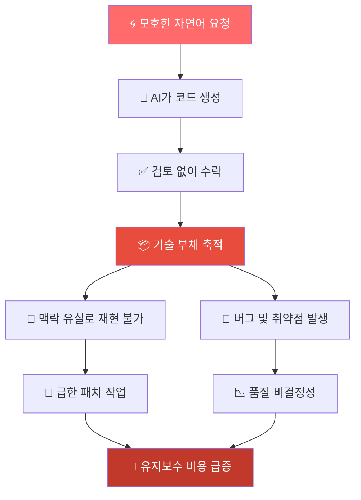
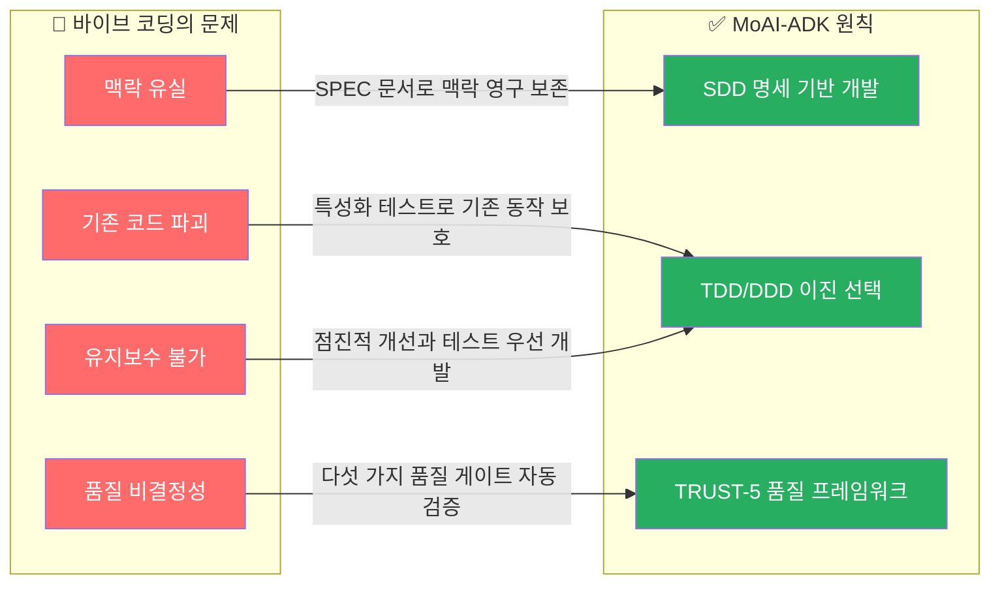
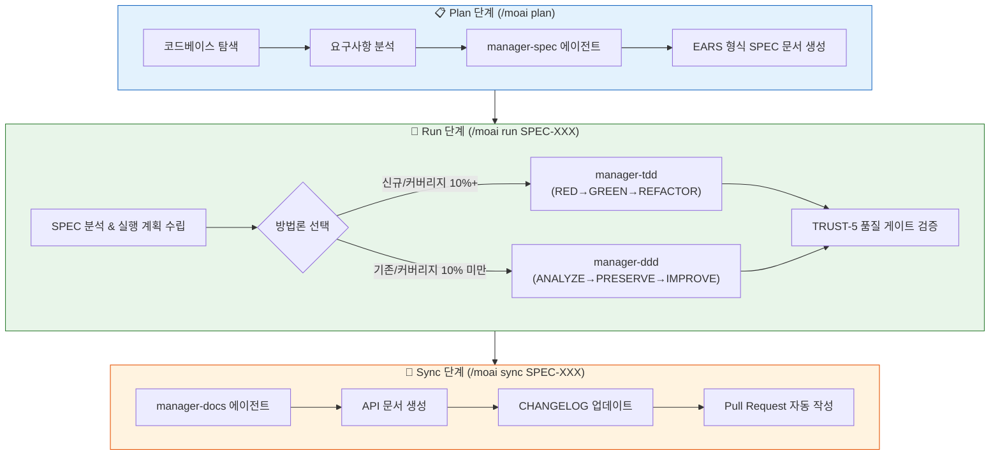
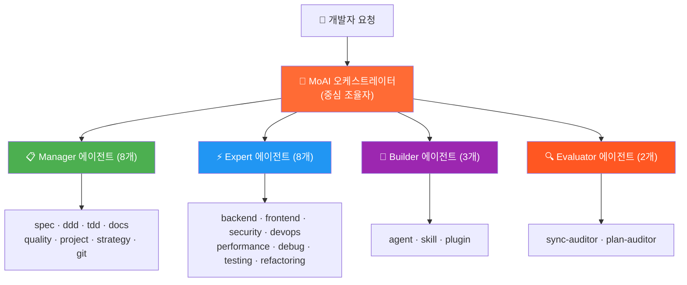
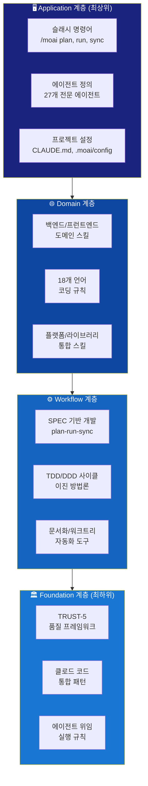
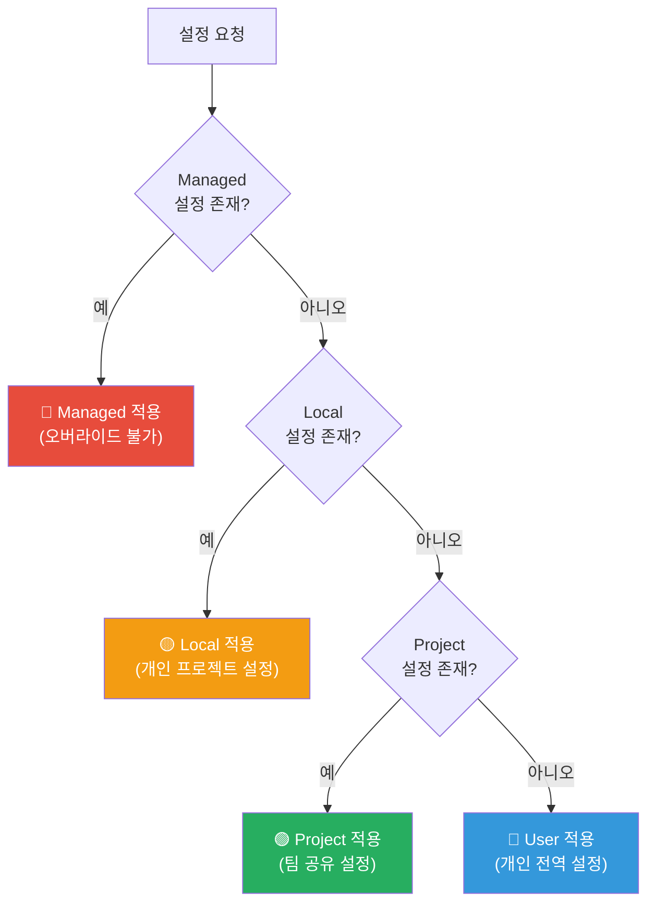
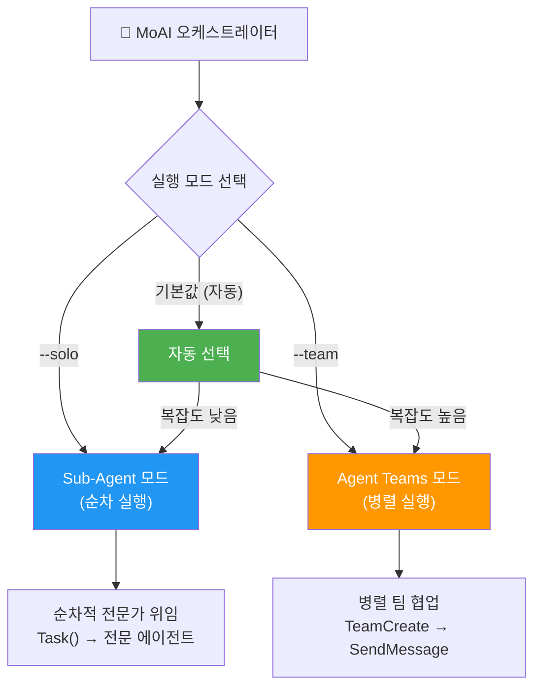
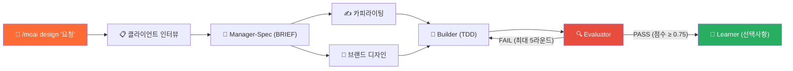
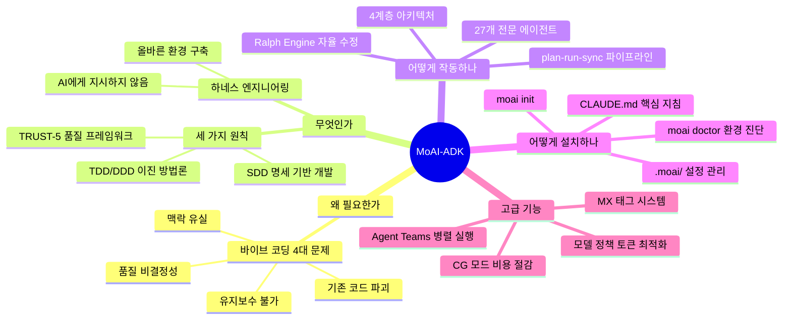

> **이 문서는** 책 ["클로드 코드로 시작하는 실전 에이전틱 코딩"](https://www.yes24.com/product/goods/189211422) Chapter 08의 내용과 MoAI-ADK 공식 GitHub (https://github.com/modu-ai/moai-adk) 문서, 최신 웹 자료를 종합하여 작성되었습니다.  
> **작성 기준일**: 2026년 6월 기준 | **MoAI-ADK 버전**: Go Edition v2.7.x  
> **제작사**: 모두의AI (modu-ai) | **라이선스**: Apache-2.0

## 관련글

[**MoAI-ADK v3.0 & GEARS: AI 코딩 시대의 명세 중심 개발**](https://k82022603.github.io/posts/moai-adk-v3.0-&-gears-ai-%EC%BD%94%EB%94%A9-%EC%8B%9C%EB%8C%80%EC%9D%98-%EB%AA%85%EC%84%B8-%EC%A4%91%EC%8B%AC-%EA%B0%9C%EB%B0%9C/)

---

## 목차

1. [장(章) 개요](#1-장-개요)
2. [8-1. 하네스 엔지니어링과 MoAI-ADK](#2-8-1-하네스-엔지니어링과-moai-adk)
   - [바이브 코딩의 등장과 정의](#21-바이브-코딩의-등장과-정의)
   - [바이브 코딩의 네 가지 구조적 문제](#22-바이브-코딩의-네-가지-구조적-문제)
   - [MoAI-ADK란 무엇인가](#23-moai-adk란-무엇인가)
   - [세 가지 핵심 원칙](#24-세-가지-핵심-원칙)
   - [하네스 엔지니어링](#25-하네스-엔지니어링)
   - [7개 구성 요소](#26-7개-구성-요소)
   - [plan-run-sync 파이프라인](#27-plan-run-sync-파이프라인)
   - [에이전트 오케스트레이션 시스템](#28-에이전트-오케스트레이션-시스템)
   - [MoAI-ADK 실행 엔진](#29-moai-adk-실행-엔진)
3. [8-2. 설치와 초기 설정](#3-8-2-설치와-초기-설정)
   - [시스템 요구사항](#31-시스템-요구사항)
   - [설치 방법](#32-설치-방법)
   - [설치 후 오류 해결](#33-설치-후-오류-해결)
   - [프로젝트 초기화](#34-프로젝트-초기화-moai-init)
   - [생성되는 파일 구조](#35-생성되는-파일-구조)
   - [설정 파일 상세](#36-설정-파일-상세)
   - [환경 진단과 업데이트](#37-환경-진단과-업데이트)
4. [8-3. 아키텍처](#4-8-3-아키텍처)
   - [4계층 구조](#41-4계층-구조)
   - [CLAUDE.md — MoAI의 지침 파일](#42-claudemd--moai의-지침-파일)
   - [Rules 시스템](#43-rules-시스템)
   - [settings.json 네 단계 스코프 시스템](#44-settingsjson-네-단계-스코프-시스템)
   - [.mcp.json MCP 서버 구성](#45-mcpjson-mcp-서버-구성)
5. [심화: 핵심 고급 기능](#5-심화-핵심-고급-기능)
   - [이중 실행 모드](#51-이중-실행-모드-sub-agent와-agent-teams)
   - [자율 품질 관리 루프 (Ralph Engine)](#52-자율-품질-관리-루프-ralph-engine)
   - [@MX 태그 시스템](#53-mx-태그-시스템)
   - [모델 정책과 토큰 최적화](#54-모델-정책과-토큰-최적화)
   - [디자인 시스템 (/moai design)](#55-디자인-시스템-moai-design)
   - [CG 모드: Claude + GLM 하이브리드](#56-cg-모드-claude--glm-하이브리드)
6. [전체 명령어 레퍼런스](#6-전체-명령어-레퍼런스)
7. [핵심 요약](#7-핵심-요약)

---

## 1. 장(章) 개요

이 장에서는 AI 코딩의 구조적 문제를 해결하기 위해 설계된 **MoAI-ADK**를 소개한다. MoAI-ADK가 왜 필요한지, 어떻게 설치하고 초기화하는지, CLAUDE.md와 에이전트 시스템이 어떻게 작동하는지, TDD와 DDD를 어떻게 자동으로 적용하고 에이전트끼리 어떻게 협업하는지를 순서대로 살펴본다.

MoAI-ADK는 **모두의AI(modu-ai)** 가 제작한 클로드 코드(Claude Code) 전용 에이전틱 개발 키트(Agentic Development Kit)이다. 이름에서 'MoAI'는 "모두의 AI(Modu-ui AI, AI for Everyone)"를 뜻하며, 'ADK'는 에이전트 개발 키트(Agentic Development Kit)의 약자이다. 핵심 철학은 단순하다: **"빠른 생산성이 아니라 코드 품질이 목적이다."**

---

## 2. 8-1. 하네스 엔지니어링과 MoAI-ADK

### 2.1 바이브 코딩의 등장과 정의

2025년 2월, AI 연구자이자 전 테슬라 AI 디렉터인 **안드레이 카파시(Andrej Karpathy)** 는 '바이브 코딩(Vibe Coding)'이라는 개념을 공식 정의했다. 그의 정의에 따르면 바이브 코딩은 AI가 코드를 생성하는 동안 개발자는 방향만 제시하며, 생성된 코드를 직접 검토하거나 편집하지 않고 실행 결과만으로 코드를 평가하는 방식이다. 즉, AI에게 "이런 기능을 만들어줘"라고 말하고 결과물만 보는 것이다.

바이브 코딩은 마치 설계도 없이 집을 짓는 일과 같다. 방 하나짜리 작은 구조물이라면 문제없이 올라간다. 그러나 층을 올리는 순간, 내력벽이 어디 있는지나 배관이 어디를 지나는지 아무도 모른다는 사실이 발목을 잡는다. 바이브 코딩도 마찬가지다. 작은 규모의 프로토타입에서는 인상적인 속도를 보여 주지만, 프로젝트가 복잡해지는 간 다음과 같은 구조적 문제가 드러난다.

흥미롭게도 2025년 10월에는 안드레이 카파시 본인도 이 한계를 인정했다. 그의 최신 프로젝트인 **nanochat**은 바이브 코딩이 아니라 '기본적으로 전부 손으로 작성'한 것이었다. AI 에이전트를 몇 번 사용해 보려 했지만 "전혀 잘 작동하지 않았다"라는 고백은 시사하는 바가 크다. 바이브 코딩은 빠른 프로토타이핑에는 유용하지만, 실제 프로덕션 소프트웨어를 만드는 방법론은 아닌 것이다.

### 2.2 바이브 코딩의 네 가지 구조적 문제

책은 바이브 코딩이 내포하는 구조적 문제를 네 가지로 정리한다.

**첫 번째 문제: 맥락 유실(Context Loss)**

AI는 세션 기반으로만 기억하므로 새 세션을 열면 기존 대화를 기억하지 못한다. 대화 과정에서는 처음 결정 사항과 다른 결론에 도달하거나 세부 사항이 변경될 수 있다. 설계 의도, 트레이드오프 결정, 이전에 시도했다가 포기한 방법 등이 모두 사라진다.

**두 번째 문제: 품질의 비결정성(Quality Non-determinism)**

같은 요청을 두 번 하면 AI는 다른 코드를 생성한다. 어떤 때는 유의 사항을 따르는 깔끔한 코드가 나오고, 어떤 때는 SQL 인젝션 취약점이 포함된 코드가 나온다. 이 문제는 보안 측면에서 심각한데, 조지타운 대학의 연구에 따르면 5개의 LLM을 대상으로 생성한 코드 중 50% 가까이에 보안 버그가 있었다. 바이브 코딩 방식에서는 이러한 보안 문제가 있는 코드가 그대로 배포될 위험이 있다.

**세 번째 문제: 기존 코드의 파괴(Code Destruction)**

AI에 부분 수정을 요청했을 때 AI는 수정 요청한 부분만이 아니라 관련 코드까지 변경하는 일이 잦다. 다른 기능이 해당 코드에 의존하고 있다면, 하나를 고치려다 열 개가 망가지는 상황이 발생할 수 있다. 이는 설계도 없이 집을 리모델링하다가 내력벽을 부수는 것과 같은 결과다.

**네 번째 문제: 유지보수 불가능(Unmaintainability)**

GitClear의 연구에 따르면, AI 코딩 도구가 보편화된 이후 2021년 8.3%였던 코드 중복 비율이 2024년 12.3%로 증가했고, 리팩터링 활동은 25%에서 10% 미만으로 급감했다. AI가 기존 코드를 재사용 가능한 모듈로 통합하기보다 매번 새로운 코드를 생성하기 때문이다. 이렇게 축적된 기술 부채는 프로젝트의 유지보수 비용을 기하급수적으로 증가시킨다.



*바이브 코딩의 악순환 구조: 모호한 요청이 검토 없이 수락되면 기술 부채가 누적되고, 결국 유지보수 비용이 폭발적으로 증가한다.*

### 2.3 MoAI-ADK란 무엇인가

MoAI-ADK는 클로드 코드 내에서 에이전트가 상호작용을 통해 에이전트 코딩을 수행하는 **Agentic Development Kit(ADK)** 으로, 세 가지 핵심 원칙으로 바이브 코딩의 문제를 해결하는 **에이전트 하네스(Agent Harness)** 이다.

하네스(Harness)라는 단어는 원래 말의 마구(馬具)를 뜻한다. 기수가 고삐와 안장이라는 장구(harness)로 말의 힘을 원하는 방향으로 이끄는 것처럼, MoAI-ADK는 AI 에이전트의 능력을 소프트웨어 공학 원칙 안에서 발휘하도록 유도하는 장구 역할을 한다.

하네스 엔지니어링(Harness Engineering)은 2026년 2월, HashiCorp의 공동 창업자이자 Terraform과 Ghostty의 제작자인 **Mitchell Hashimoto**가 다음과 같이 정의하면서 업계 용어로 자리잡았다:

> *"에이전트가 실수를 할 때마다, 그 에이전트가 동일한 실수를 다시는 하지 못하도록 환경 자체를 개선하는 데 시간을 투자하는 것."*

같은 해 4월, 소프트웨어 아키텍처 권위자인 마틴 파울러(Martin Fowler)도 하네스 엔지니어링에 관한 글을 발표했으며, 이 개념은 2026년 AI 에이전트 개발의 핵심 패러다임으로 자리잡았다.

MoAI-ADK는 바이브 코딩이 AI 에이전트에게 무엇을 할지 지시하는 것에 의존하는 대신, AI 에이전트가 올바른 방법으로 만들 수밖에 없는 환경을 구성한다.

### 2.4 세 가지 핵심 원칙

MoAI-ADK는 바이브 코딩의 네 가지 문제를 해결하기 위해 세 가지 핵심 원칙을 적용한다.

#### 원칙 1: SDD (Spec-Driven Development, 명세 기반 개발)

SDD는 코드를 작성하기 전에 **SPEC 문서를 먼저 완성하고** 문서에 정의된 범위 내에서만 개발을 진행하는 방법론이다. SPEC 문서는 AI와 나눈 대화를 파일로 영구 보존하는 역할을 한다. 세션이 끊겨도, 토큰 한도를 초과하더라도, SPEC 문서만 있으면 언제든지 이어서 작업할 수 있다.

SPEC 문서는 **EARS(Easy Approach to Requirements Syntax) 형식**으로 작성된다. EARS는 "시스템은 [조건]이 되면 [행동]을 수행한다"와 같은 명확하고 검증 가능한 형식으로 요구 사항을 표현하는 방법이다. 이 명확한 형식 덕분에 AI가 구현해야 할 것과 구현하지 말아야 할 것의 경계가 분명해진다.

SDD는 바이브 코딩의 **맥락 유실 문제**를 해결한다.

#### 원칙 2: TDD/DDD 이진 방법론

신규 프로젝트에는 **TDD(Test-Driven Development)** 를, 기존에 만들어진 프로젝트에는 **DDD(Domain-Driven Development)** 를 적용한다. 이 이진(二進) 방법론은 바이브 코딩의 **기존 코드 파괴 문제**와 **유지보수 불가능 문제**를 해결한다.

**TDD (신규 프로젝트 기본값)** 는 RED → GREEN → REFACTOR 사이클로 진행된다:
- **RED**: 실패하는 테스트를 먼저 작성한다 — 예상 동작을 정의한다
- **GREEN**: 테스트를 통과시키는 최소한의 코드를 작성한다
- **REFACTOR**: 테스트가 통과된 상태를 유지하면서 코드 품질을 개선한다. `/simplify` 명령이 REFACTOR 완료 후 자동으로 실행된다

**DDD (기존 프로젝트, 테스트 커버리지 10% 미만)** 는 ANALYZE → PRESERVE → IMPROVE 사이클로 진행된다:
- **ANALYZE**: 기존 코드와 의존성을 분석하고 도메인 경계를 식별한다
- **PRESERVE**: 특성화 테스트(Characterization Test)를 작성하고 현재 동작 스냅샷을 캡처한다
- **IMPROVE**: 테스트 보호 아래 점진적으로 개선한다

> MoAI-ADK v2.5.0 이후에는 이 두 가지 방법론만 지원하며, 이전에 있던 하이브리드 모드는 명확성과 일관성을 위해 제거되었다.

TDD 사이클과 DDD 사이클의 개념은 책의 2-1절에서 자세히 다뤘다. MoAI-ADK에서는 이 두 사이클이 `/moai run` 실행 시 `manager-tdd`, `manager-ddd` 에이전트에 의해 자동 수행된다는 점이 다르다.

#### 원칙 3: TRUST-5 품질 프레임워크

TRUST-5는 모든 코드 변경이 통과해야 하는 다섯 가지 품질 기준이다. TRUST-5는 바이브 코딩의 **품질 비결정성 문제**를 해결한다.

| 기준 | 영어 | 의미 | 검증 방법 |
|------|------|------|-----------|
| **T**ested | 테스트됨 | 85% 이상의 코드 커버리지, 유닛 테스트 통과 | 자동 테스트 실행 |
| **R**eadable | 읽기 쉬움 | 명확한 네이밍, 일관된 코드 스타일, 린트 오류 0 | LSP + 린터 |
| **U**nified | 통일됨 | 일관된 포맷, 임포트 순서, 프로젝트 구조 준수 | 포맷터 자동 실행 |
| **S**ecured | 안전함 | OWASP 준수, 입력 유효성 검사, 보안 경고 0 | OWASP 스캐너 |
| **T**rackable | 추적 가능함 | Conventional Commits, 이슈 참조, 구조화된 로깅 | 깃 훅 |



이 세 가지 원칙은 독립적으로도 가치가 있지만, 서로 유기적으로 결합할 때 시너지를 발휘한다. SPEC이 명확해야 테스트를 설계할 수 있고, 테스트가 있어야 안전하게 리팩터링할 수 있으며, TRUST-5 원칙이 전체 과정의 품질을 보장해야 장기적인 유지보수성이 확보된다.

### 2.5 하네스 엔지니어링

MoAI-ADK는 AI 에이전트가 직접 코드를 작성하는 대신, **에이전트가 작동할 환경을 설계하는 하네스 엔지니어링(Harness Engineering)** 을 구현한다. 바이브 코딩이 AI에 코드 작성을 요청하는 것이라면 하네스 엔지니어링은 AI가 올바르게 작동할 수밖에 없는 환경을 구축하는 것이다.

하네스 엔지니어링의 핵심 원칙은 실수의 재발을 구조적으로 차단하는 데 있다. 에이전트가 잘못된 동작을 보일 때마다 그 문제를 단발성으로 수정하고 끝내는 것이 아니라, 에이전트가 동일한 실수를 두 번 다시 할 수 없도록 **환경 자체를 개선**하는 것이다.

이는 두 가지 형태로 구현된다.

**1. 암묵적 프롬팅의 정교화**

`CLAUDE.md`와 `.claude/rules` 디렉터리의 에이전트 지침 파일에 잘못된 동작 패턴을 명시하여, 에이전트가 처음부터 잘못된 명령어나 API를 선택하지 않도록 사전에 차단한다. 각 지침 항목은 추상적인 규칙이 아니라 실제로 관찰된 오작동 사례로부터 도출된다.

**2. 검증 도구 직접 제작**

에이전트가 스스로 결과를 검증할 수 있는 도구를 개발자가 직접 만들어 에이전트에게 제공한다. 에이전트가 빠르고 정확한 피드백 루프 안에서 작동할수록 첫 번째 시도에 올바른 결과를 내놓을 확률이 높아지고, 인간의 개입 비용이 줄어든다.

이러한 관점에서 하네스 엔지니어링은 단순한 프롬프트 최적화를 넘어, 소프트웨어 엔지니어링 수준의 설계 행위다. 개발자는 AI에게 무엇을 할지 지시하는 역할에서 벗어나, AI가 올바른 판단과 검증을 스스로 수행할 수 있는 실행 환경을 설계하는 역할로 전환된다.

### 2.6 7개 구성 요소

하네스 엔지니어링은 다음 7개의 구성 요소로 구분할 수 있으며, 각 구성 요소는 MoAI-ADK의 구체적인 명령어와 대응한다.

| 구성 요소 | 설명 | 대응 명령어 |
|-----------|------|-------------|
| **자기 검증 루프** | 에이전트가 코드 작성 → 테스트 실행 → 실패 확인 → 수정 → 통과 사이클을 자율적으로 반복한다. | `/moai loop` |
| **컨텍스트 맵** | 코드베이스 아키텍처 맵과 문서를 에이전트에게 항상 제공하여 맥락 단절 없이 작업을 이어간다. | `/moai codemaps` |
| **세션 지속성** | `progress.md`가 완료된 단계를 세션 간에 추적하여 중단된 작업을 자동으로 재개한다. | `/moai run SPEC-XXX` |
| **실패 체크리스트** | 실행 시작 시 모든 인수 조건을 대기 작업으로 등록하고 구현 완료 시 순차적으로 완료 처리한다. | `/moai run SPEC-XXX` |
| **언어 독립성** | 16개 언어를 지원하며 언어별 LSP, 린터, 테스트, 커버리지 도구를 자동으로 감지하여 선택한다. | 모든 워크플로 |
| **가비지 컬렉션** | 죽은 코드, AI Slop, 미사용 임포트를 주기적으로 검색하여 자동으로 제거한다. | `/moai clean` |
| **스캐폴딩 우선** | 구현 전에 빈 파일 스텁(stub)을 먼저 생성하여 점진적 코드 엔트로피를 원천 차단한다. | `/moai run SPEC-XXX` |

이 7개 구성 요소가 통합되면 개발자는 에이전트에게 무엇을 만들지 지시하는 대신, 에이전트가 올바른 방법으로 만들 수밖에 없는 환경을 구성하게 된다. 하네스 엔지니어링의 결과물이 바로 MoAI-ADK 원칙과 자동화된 파이프라인이다.

### 2.7 plan-run-sync 파이프라인

MoAI-ADK의 핵심 워크플로는 명세에서 구현 그리고 문서화로 이어지는 **plan-run-sync 파이프라인**이다. 개발자가 원칙을 일일이 기억하고 수동으로 적용할 필요가 없다. 시스템이 원칙의 준수를 강제하고, 전문화된 에이전트가 각 단계를 자동으로 수행한다.



세 단계를 좀 더 상세히 살펴보면:

- **plan**: `/moai plan` 명령어를 실행하면 `manager-spec` 에이전트가 개발자의 자연어 요청을 EARS 형식의 SPEC 문서로 변환한다. SPEC 문서는 `.moai/specs/` 디렉터리에 저장되며, 이후 모든 작업의 기준점이 된다.

- **run**: `/moai run SPEC-XXX` 명령어로 `manager-tdd` 또는 `manager-ddd` 에이전트가 SPEC에 정의된 요구 사항을 TDD/DDD 방법론에 따라 구현한다. 구현 중 `progress.md`가 진척 상황을 추적하여 세션이 끊겨도 이어서 작업할 수 있다.

- **sync**: `/moai sync SPEC-XXX` 명령어로 `manager-docs` 에이전트가 API 문서를 생성하고 CHANGELOG를 업데이트하며, 풀 리퀘스트(Pull Request)를 작성한다.

### 2.8 에이전트 오케스트레이션 시스템

파이프라인에서 핵심적인 역할을 하는 것이 **에이전트 자동 위임 시스템**이다. **MoAI**는 중심 오케스트레이터(조율자) 역할을 수행하며, 개발자의 요청을 분석해서 가장 적합한 전문 에이전트에게 작업을 위임한다.



개발자가 에이전트를 선택할 필요 없이 MoAI가 요청의 복잡도와 도메인을 분석하여 최적의 에이전트를 자동으로 선택한다. 에이전트별 역할을 살펴보면:

| 카테고리 | 개수 | 주요 에이전트 | 역할 |
|---------|------|--------------|------|
| **Manager** | 8개 | spec, ddd, tdd, docs, quality, project, strategy, git | 워크플로 조율, SPEC 생성, 품질 관리 |
| **Expert** | 8개 | backend, frontend, security, devops, performance, debug, testing, refactoring | 도메인 전문 구현, 분석, 최적화 |
| **Builder** | 3개 | agent, skill, plugin | 새로운 MoAI 구성 요소 생성 |
| **Evaluator** | 2개 | sync-auditor, plan-auditor | 독립적인 품질 평가, 문서 감사 |

MoAI-ADK에는 동적 팀원 에이전트(researcher, analyst, architect, implementer, tester, designer, reviewer)도 있는데, 이는 정적 에이전트 정의가 아니라 런타임에 역할 프로파일에 따라 생성된다.

**품질 게이트 자동 검증** 또한 MoAI-ADK의 핵심 기능이다. `run` 단계에서 코드가 생성되면 TRUST-5의 다섯 가지 기준이 자동으로 검증된다. 테스트 커버리지가 85% 미만이면 코드를 머지할 수 없고, 보안 취약점이 발견되면 수정이 완료될 때까지 진행이 차단된다. 이 과정이 자동화되어 있기 때문에 개발자가 품질 검사를 깜빡하는 실수가 구조적으로 불가능하다.

### 2.9 MoAI-ADK 실행 엔진

MoAI-ADK 원칙과 4계층 아키텍처는 모두 **`moai`** 라는 Go 언어로 작성된 CLI 바이너리를 통해 실행된다. `moai`는 MoAI-ADK의 실제 런타임이다.

Go 언어로 작성된 이유는 단일 바이너리 배포의 편의성 때문이다. 파이썬이나 Node.js처럼 런타임 의존성이 필요하지 않으며 다운로드 후 바로 실행할 수 있다. 또한 Go의 강력한 동시성 모델은 여러 에이전트를 병렬로 실행하는 MoAI-ADK의 아키텍처에 적합하다.

MoAI-ADK는 원래 Python으로 작성되었으나(약 73,000줄), 이후 Go로 완전히 재작성되었다. Go 에디션과 Python 에디션을 비교하면:

| 항목 | Python 에디션 | Go 에디션 |
|------|--------------|-----------|
| 배포 방식 | pip + venv + 의존성 설치 | **단일 바이너리**, 의존성 없음 |
| 시작 시간 | 약 800ms (인터프리터 부팅) | **약 5ms** (네이티브 실행) |
| 동시성 | asyncio / threading | **네이티브 고루틴** |
| 타입 안전성 | 런타임 (mypy 선택적) | **컴파일 타임 강제** |
| 크로스 플랫폼 | Python 런타임 필요 | **사전 빌드 바이너리** |
| 훅 실행 | Shell 래퍼 + Python | **컴파일된 바이너리**, JSON 프로토콜 |

Go 에디션의 주요 수치:
- **38,700줄 이상**의 Go 코드, **38개** 패키지
- **85~100%** 테스트 커버리지
- **27개** 전문 AI 에이전트 + **47개** 스킬
- **18개** 프로그래밍 언어 지원
- **27개** 클로드 코드 훅 이벤트

`moai`가 생성하는 프로젝트 구조는 다음과 같다:

```
my-project/
├── CLAUDE.md           # MoAI 오케스트레이터 실행 지침서
├── .claude/
│   ├── agents/         # 에이전트 정의
│   ├── commands/       # 커스텀 슬래시 커맨드
│   ├── skills/         # 스킬 모듈
│   ├── hooks/          # 훅 스크립트
│   └── settings.json   # 코딩 규칙 및 권한
├── .moai/
│   ├── specs/          # SPEC 문서
│   ├── config/         # 프로젝트 설정
│   ├── project/        # 프로젝트 문서
│   └── logs/           # 실행 로그
└── src/                # 프로젝트 소스 코드
```

개발자가 `moai init my-project`를 실행하면, `moai`가 프로젝트의 기술 스택을 분석하고, 적절한 에이전트 정의, 스킬 모듈, 품질 설정 파일을 자동으로 생성한다. 이 과정에서 451개의 내장 템플릿 중 프로젝트에 필요한 것만 선별적으로 배포된다.

---

## 3. 8-2. 설치와 초기 설정

이제 MoAI-ADK를 시스템에 설치하고 프로젝트를 초기화할 차례다. CLI 바이너리 설치부터 인터랙티브 마법사를 통한 프로젝트 초기화, 생성되는 파일 구조, 설정 파일의 역할, 프레임워크 업데이트와 환경 진단까지 살펴보자.

MoAI-ADK는 클로드 코드 위에서 동작하며 SPEC 워크플로, 브랜치 전략, 커밋 관리 등 MoAI-ADK의 핵심 기능은 깃(Git)에 의존하므로 **먼저 클로드 코드와 깃이 설치되어 있어야 한다**.

### 3.1 시스템 요구사항

| 항목 | 내용 |
|------|------|
| 운영체제 | macOS, 리눅스, 윈도우(파워셸 7.x 이상, Git Bash, WSL) |
| 메모리 | 최소 4GB |
| 디스크 여유 공간 | 100MB 이상 |

> **중요**: 윈도우에서 명령 프롬프트(cmd.exe)는 지원하지 않는다. 반드시 파워셸 7.x 이상, Git Bash, 또는 WSL을 사용해야 한다.

### 3.2 설치 방법

MoAI-ADK는 빠른 설치 스크립트를 사용하여 쉽게 설치할 수 있다. 터미널에서 명령어 한 줄만 입력하면 플랫폼 자동 감지, 깃허브에서의 사전 빌드 바이너리 다운로드, SHA256 체크섬 검증, PATH 설정까지 모두 자동으로 처리된다.

**macOS / 리눅스 / WSL / Git Bash:**
```bash
curl -fsSL https://raw.githubusercontent.com/modu-ai/moai-adk/main/install.sh | bash
```

**윈도우 파워셸:**
```powershell
irm https://raw.githubusercontent.com/modu-ai/moai-adk/main/install.ps1 | iex
```

설치가 완료되면 반드시 `moai version` 명령으로 정상 설치를 확인해야 한다. 이 명령은 바이너리 버전, 커밋 해시, 빌드 시간을 출력한다:
```
moai-adk 2.7.1
commit: 25e0046e  built: 2026-03-02T19:42:11Z
```

**특정 버전 설치** 또는 **커스텀 디렉터리 설치**도 가능하다:
```bash
# 특정 버전 설치 (예: 2.0.0)
curl -fsSL https://raw.githubusercontent.com/modu-ai/moai-adk/main/install.sh | bash -s -- --version 2.0.0

# 커스텀 디렉터리 설치
curl -fsSL https://raw.githubusercontent.com/modu-ai/moai-adk/main/install.sh | bash -s -- --install-dir /usr/local/bin
```

**소스에서 직접 빌드**하는 방법도 제공된다. Go 1.26 이상의 개발 환경이 갖추어져 있다면 리포지토리를 클론한 후 `make build` 명령으로 바이너리를 생성할 수 있다:
```bash
git clone https://github.com/modu-ai/moai-adk.git
cd moai-adk
make build
cp ./bin/moai ~/.local/bin/
```

설치 스크립트는 기본적으로 macOS와 리눅스에서는 `$GOBIN`, `$GOPATH/bin`, `~/.local/bin` 순으로, 윈도우에서는 `%LOCALAPPDATA%\Programs\moai` 경로에 바이너리를 배치한다.

### 3.3 설치 후 오류 해결

설치 후 흔히 발생하는 오류와 해결 방법을 정리한다.

**`command not found: moai` 오류** 발생 시 세 가지를 순서대로 확인한다:
1. 셸 프로파일이 갱신되지 않았을 가능성이 높으므로 터미널을 재시작한다.
2. `echo $PATH` 명령으로 바이너리 설치 경로가 PATH에 포함되어 있는지 확인한다.
3. `which moai` 명령으로 바이너리의 실제 위치를 직접 확인한다.

**macOS나 리눅스에서 `Permission denied` 오류**가 발생하면 `chmod +x ~/.local/bin/moai` 명령으로 바이너리에 실행 권한을 부여해야 한다.

**윈도우에서 한국어 사용자명으로 인한 EINVAL 오류**: 윈도우 계정을 '홍길동'과 같은 한글로 지정했을 때 일부 Go 런타임과 Node.js 하위 프로세스에서 한글 디렉터리 형태를 처리하지 못하고 EINVAL 오류를 발생시킨다. 세 가지 방법으로 우회할 수 있다:

1. `MOAI_TEMP_DIR` 환경 변수를 ASCII 문자로만 구성된 경로로 설정한다 (`$env:MOAI_TEMP_DIR = "C:\moai-temp"`).
2. 짧은 파일명 생성을 활성화한다 (관리자 권한 파워셸에서 `fsutil 8dot3name set 1`).
3. 윈도우 사용자 계정을 ASCII 문자로만 구성된 이름으로 새로 생성한다.

### 3.4 프로젝트 초기화 (moai init)

설치를 완료했으면 프로젝트를 초기화할 차례다. `moai init` 명령은 인터랙티브 마법사를 실행하여 프로젝트 환경을 구성한다.

```bash
# 새로운 프로젝트 생성
moai init my-project

# 기존 프로젝트에 MoAI-ADK 적용
cd existing-project
moai init .
```

`moai init`을 실행하면 시스템의 로케일 설정을 자동으로 감지하여 `conversation_language`를 추론하고, 이후 감지된 언어로 UI를 표시한다. 한국어 환경이라면 마법사의 질문과 선택지가 모두 한국어로 표시된다.

초기화 단계는 다음 9단계로 진행된다:

| 단계 | 항목 | 설명 |
|------|------|------|
| 1 | **대화 언어** | 한국어, 영어, 일본어, 중국어 중 선택하며, 로케일 감지 결과가 기본값으로 제시된다. |
| 2 | **개발자 이름** | 이 이름은 깃 커밋 메시지의 Co-Authored-By 태그에 사용된다. |
| 3 | **프로젝트 기본 이름** | 프로젝트명을 입력한다. |
| 4 | **깃 전략** | 수동 제어 모드 `manual`, 개인용 자동화 모드 `personal`, 팀 협업용 PR 워크플로 모드 `team`이 있다. |
| 5 | **깃허브/깃랩 사용자명** | `gh auth status` 명령으로 gh CLI의 인증 상태를 자동 감지하므로, 이미 gh CLI로 로그인되어 있다면 입력 질문이 생략된다. |
| 6 | **커밋 메시지 언어** | 언어를 선택한다. |
| 7 | **코드 주석 언어** | 코드 주석은 영어를 기본값으로 권장한다. |
| 8 | **문서 생성 언어** | 대화 언어와 같게 설정하는 것이 일반적이다. |
| 9 | **개발 방법론** | TDD(기본값, 신규 프로젝트)와 DDD(기존 프로젝트) 중 선택한다. |

모든 초기화 단계가 끝나면 `.moai/` 디렉터리와 `.claude/` 디렉터리에 설정 파일이 생성된다.

### 3.5 생성되는 파일 구조

초기화가 완료되면 프로젝트 루트에 디렉터리 2개와 설정 파일 여러 개가 생성된다. 생성되는 파일은 크게 **클로드 코드 확장 영역**(.claude/ 디렉터리)과 **MoAI-ADK 고유 영역**(.moai/ 디렉터리), **프로젝트 루트의 메타 파일**(CLAUDE.md, .mcp.json)로 나뉜다.

```
프로젝트 루트/
├── CLAUDE.md                  # 핵심 지시 파일 (MoAI 오케스트레이터 지침)
├── .mcp.json                  # MCP 서버 설정
│
├── .claude/                   # 클로드 코드 공식 확장 포인트
│   ├── commands/moai/         # 슬래시 명령어 정의
│   ├── agents/moai/           # 에이전트 정의 (20개 이상)
│   ├── skills/moai-*/         # 스킬 파일 (52개 이상)
│   ├── output-styles/moai/    # 출력 스타일
│   ├── hooks/moai/            # 생애 주기 훅 스크립트
│   ├── rules/moai/            # Core, Development, Workflow, Languages 규칙
│   └── settings.json          # 도구 권한, 환경 변수, MCP 서버 활성화
│
└── .moai/                     # MoAI-ADK 고유 설정 및 런타임 데이터
    ├── config/sections/       # YAML 설정 파일 (10개)
    ├── specs/                 # SPEC 문서
    ├── project/               # 프로젝트 문서 (codemaps 등)
    └── logs/                  # 실행 로그
```

**CLAUDE.md**는 프로젝트 루트에 위치하는 핵심 지시 파일로, 클로드 코드가 세션 시작 시 가장 먼저 읽는다. MoAI-ADK의 전체 동작 원칙, 에이전트 리스트, 워크플로 정의, 품질 게이트 규칙 등을 담고 있으며, 상세한 규칙은 `.claude/rules/moai/` 디렉터리로 분리하고 자동 참조되어 사용한다.

MoAI-ADK 전용 지침과 설정을 사용자 작성 파일과 구별하고자 모두 `moai`로 구분해 두었다. `moai update` 시 `.moai/` 디렉터리의 모든 지침을 덮어쓰므로, CLAUDE.md와 settings.json은 `CLAUDE.local.md`, `settings.local.json`으로 별도로 추가해서 사용하도록 한다.

### 3.6 설정 파일 상세

`.moai/config/sections/`에 있는 YAML 파일들을 살펴보자. 각 파일은 독립적인 관심사를 담당하며, 하나의 거대한 설정 파일 대신 분리된 구조를 채택함으로써 설정 변경의 영향 범위를 최소화한다. 이 설계 원칙은 단일 책임 원칙(Single Responsibility Principle)의 설정 파일 버전이라 할 수 있다.

**project.yaml**: 프로젝트의 기본 정보를 담는다. 프로젝트 이름, 설명, 타입, 생성일, 초기화 상태, 깃허브 프로젝트 필명 등이 포함된다. 프레임워크가 프로젝트를 식별하고 관련 설정을 로드하는 기준점 역할을 한다.

**quality.yaml**: TRUST-5 품질 프레임워크의 상세 설정이다. 개발 방법론, 테스트 커버리지 목표(기본 85%), DDD 설정(특성화 테스트, 동작 스냅샷), TDD 설정(커밋당 최소 커버리지), LSP 품질 게이트 임곗값 그리고 TRUST-5 각 원칙에 대한 LSP 통합 규칙이 정의된다. 10개의 파일 중 가장 복잡하고 상세한 설정을 포함한다.

**system.yaml**: 시스템 수준 설정이다. 문서 관리 정책(디렉터리 구조, 캐시 보존 기간, 로그와 문서의 분리 정책), 깃허브 통합 설정(자동 브랜치 삭제, TRUST-5 활성화), MoAI-ADK 자체의 버전 정보와 업데이트 확인 주기가 포함된다.

**language.yaml**: 다국어 설정이다. 대화 언어, 에이전트 프롬프트 언어, 깃 커밋 메시지 언어, 코드 주석 언어, 문서 언어, 에러 메시지 언어를 각각 설정할 수 있다.

**git-strategy.yaml**: 깃 워크플로 전략의 상세 설정을 정의한다. `manual`, `personal`, `team` 세 가지 모드 각각에 대해 자동 커밋, 자동 푸시, 자동 PR, 브랜치 생성 규칙, 커밋 스타일, 훅 정책 등을 개별적으로 지정한다.

**workflow.yaml**: SPEC 워크플로의 실행 설정을 관리한다. 각 워크플로(plan, run, sync)의 실행 모드(autonomous 또는 interactive), 완료 마커(Completion Markers), 루프 방지 설정이 포함된다. 에이전트 팀 모드의 활성화 여부도 이 파일에서 제어한다.

**user.yaml**: 개발자의 개인 정보를 저장한다. 이름, 깃허브 사용자명 등 간결한 정보만 포함하며, 커밋 메시지의 Co-Authored-By 태그 생성에 활용된다.

**llm.yaml**: LLM 모델 설정이다. GLM API의 base URL, 모델별 매핑(haiku, sonnet, opus에 대응하는 GLM 모델명), API 키 환경 변수명 등이 정의된다.

**ralph.yaml**: Ralph Loop 품질 엔진의 설정을 관리한다. LSP 자동 시작, AST-grep 규칙 경로, 훅 기반 품질 검사(Write/Edit 도구 실행 후 자동 LSP 진단), 자율 루프(Auto Loop) 설정이 포함된다. Ralph Loop는 MoAI-ADK의 자율 품질 관리 엔진으로 코드 변경 시 자동으로 오류를 감지하고 수정을 시도한다.

### 3.7 환경 진단과 업데이트

**환경 진단: `moai doctor`**

프레임워크 설치와 설정이 올바르게 완료되었는지 확인하려면 시스템 환경을 진단하는 `moai doctor` 명령을 사용한다. 진단 항목에는 깃 설치 여부, 클로드 코드 CLI 버전 호환성, 프로젝트 구조(`.moai/` 디렉터리 존재 여부), 설정 파일 유효성(`.moai/config/config.yaml` 및 sections 하위 파일), MCP 서버 연결 상태 등이 포함된다. 각 항목은 통과(pass) 또는 실패(fail) 상태로 표시되며, 실패 항목에 대해서는 구체적인 해결 방법을 안내한다.

```
$ moai doctor
Running system diagnostics...
+------------------------------------+---------+
| Check                              | Status  |
+------------------------------------+---------+
| Git installed                      | OK      |
| 클로드 코드 CLI                    | OK      |
| Project structure (.moai/)         | OK      |
| Config file (.moai/config.yaml)    | OK      |
| MCP servers                        | OK      |
+------------------------------------+---------+
All checks passed
```

`moai doctor`는 단순히 설치 직후에만 실행하는 명령이 아니다. 이후에 설명할 `moai update` 이후에도 실행하여 업데이트가 정상적으로 되었는지 확인할 수 있고, 팀 프로젝트에 새로운 개발자가 합류했을 때 환경 설정이 올바른지 검증하는 용도로도 활용된다.

**업데이트: `moai update`**

`moai update` 명령은 3단계로 바이너리, 설정 스키마, 템플릿을 순서대로 갱신한다. 업데이트 시에 `moai-` 접두사를 가진 스킬과 `moai/` 하위 디렉터리의 에이전트만 업데이트하며, 개발자가 별도로 생성한 `CLAUDE.local.md`와 `.claude/settings.local.json`에는 영향을 주지 않는다.

먼저 현재 설치된 바이너리 버전과 최신 릴리스 버전을 비교하여 업데이트 가능 여부를 판단한다. `moai update --check-only` 명령으로 실제 업데이트 없이 확인만 할 수도 있다. 다음으로 설정 버전 비교다. 설정 파일의 스키마가 변경되었는지 검사하고, 호환성 문제가 발견되면 자동 백업 후 마이그레이션을 수행한다. 새로운 버전에서 추가된 설정 항목은 기본값으로 채워지며, 기존 설정값은 보존된다. 끝으로 템플릿을 동기화한다. `.claude/agents/moai/`, `.claude/skills/moai-*/`, `.claude/hooks/moai/`, `.claude/rules/moai/` 경로의 파일이 최신 버전으로 갱신되며, 이 과정에서 개발자가 직접 수정한 파일이 감지되면 병합 옵션을 제시한다.

`moai update --binary` 명령으로 바이너리만 업데이트하고 템플릿은 건드리지 않을 수 있고, `moai update --templates-only`는 반대로 템플릿만 동기화한다.

---

## 4. 8-3. 아키텍처

MoAI-ADK는 스킬, 에이전트, 언어별 규칙이 하나의 통합된 체계 안에서 작동하는 프레임워크다. 이 절에서는 MoAI-ADK를 구성하는 4계층 아키텍처와 핵심 구성 파일의 역할을 분석한다.

### 4.1 4계층 구조

MoAI-ADK는 4계층 아키텍처로 설계되어 있다. 계층별 책임은 명확하며 하위 계층은 상위 계층에 서비스를 제공한다.



**Foundation 계층 (최하위)** 는 MoAI-ADK의 기반을 형성한다. Core(SPEC 시스템·TRUST-5), Claude(클로드 코드 오케스트레이션 패턴), Context(프로젝트 분석·컨텍스트 관리), Quality(품질 게이트·LSP 통합), Philosopher(인지 편향 방지·의사결정 프레임워크) 5개 스킬로 구성되며, 프로젝트의 프로그래밍 언어와 관계없이 항상 적용된다.

**Workflow 계층 (두 번째)** 는 개발 워크플로를 정의한다. Spec, DDD, TDD, Loop, Templates, Worktree, Testing 7개 스킬이 속하며, plan-run-sync 3단계 파이프라인의 구체적인 실행 절차가 여기에서 정의된다.

**Domain 계층 (세 번째)** 은 기술 도메인별 전문 지식을 제공한다. Backend, Frontend, Database, UI/UX의 4개 도메인 스킬과 파이썬, 타입스크립트, Go, 러스트 등 프로그래밍 언어별 스킬이 포함된다. 각 언어 스킬은 해당 언어의 관용적 패턴, 린터 설정, 테스트 프레임워크 권장 사항을 담으며, 프로젝트의 기술 스택에 맞게 자동으로 로드된다.

**Application 계층 (최상위)** 은 개발자가 직접 사용하는 인터페이스다. `/moai plan`, `/moai run`, `/moai sync` 등의 슬래시 명령어, 에이전트 정의, 프로젝트 설정 외에 Library(Mermaid, Nextra, shadcn/ui 등), Platform(인증, 데이터베이스, 클라우드, 배포 등), Tool(AST-grep, SVG 등) 카테고리별 스킬이 배치된다.

이 4계층 구조의 장점은 **관심사의 분리**에 있다. Foundation 계층의 품질 원칙을 변경하지 않고도 Domain 계층에 새로운 프로그래밍 언어 스킬을 추가할 수 있다. Workflow 계층의 파이프라인을 수정하지 않고도 Application 계층에서 새로운 명령어를 정의할 수 있다. 각 계층이 독립적으로 확장 가능하기 때문에, MoAI-ADK는 프로젝트의 규모와 요구 사항에 맞게 유연하게 구성할 수 있다.

### 4.2 CLAUDE.md — MoAI의 지침 파일

CLAUDE.md는 단연코 MoAI-ADK에서 가장 중요한 파일이다. 클로드 코드가 세션 시작 시 가장 먼저 읽으며, MoAI-ADK의 전체 동작 원칙을 담고 있다.

MoAI-ADK의 CLAUDE.md는 15개 섹션으로 구성된다:

1. **핵심 정체성(Core Identity)**: MoAI 오케스트레이터의 역할과 8개 HARD 규칙을 선언한다.
2. **요청 처리 파이프라인(Request Processing Pipeline)**: 분석, 라우팅, 실행, 보고의 4단계를 정의한다.
3. **명령어 참조(Command Reference)**: `/moai` 하위 명령어 체계를 기술한다.
4. **에이전트 카탈로그(Agent Catalog)**: Manager 8개, Expert 8개, Builder 3개, Team 8개 에이전트의 역할과 선택 기준을 제시한다.
5. **SPEC 워크플로**: plan-run-sync 파이프라인의 상세 실행 절차를 정의한다.
6. **품질 게이트**: TRUST-5 자동 검증 방법을 기술한다.
7. **안전한 개발 프로토콜**: 코드 변경 시 따라야 할 안전 절차를 정의한다.
8. **사용자 상호작용 아키텍처**: 사용자와 AI 에이전트 간의 상호작용 방식을 정의한다.
9. **구성 참조**: 설정 파일 위치와 우선순위를 안내한다.
10. **웹 검색 프로토콜**: Context7 MCP를 통한 문서 조회 방법을 정의한다.
11. **오류 처리**: 에러 유형별 대응 방법을 기술한다.
12. **MCP 서버 통합**: 사용 가능한 MCP 서버와 활용 방법을 안내한다.
13. **점진적 공개 시스템(Progressive Disclosure System)**: 복잡도에 따라 스킬을 점진적으로 로드하는 방식을 정의한다.
14. **병렬 실행 안전장치**: 여러 에이전트가 동시에 작동할 때의 충돌 방지 규칙을 정의한다.
15. **에이전트 팀 실험 기능**: Agent Teams 모드의 활성화와 동작 방식을 정의한다.

**CLAUDE.local.md**는 개인용 지침 파일이다. `.gitignore`에 포함되어 깃 추적 대상에서 제외되며, MoAI-ADK 업데이트 시에도 수정되지 않는다. 개발자는 이 파일에 프로젝트별 개인 규칙, 코딩 선호 사항, 팀과 공유하지 않을 메모를 기록할 수 있다. CLAUDE.md가 팀 전체의 지침이라면, CLAUDE.local.md는 개인의 업무 수첩에 해당한다.

### 4.3 Rules 시스템

CLAUDE.md가 프레임워크의 지침이라면 `.claude/rules/moai/` 디렉터리는 하위 규칙에 해당한다. 이 디렉터리에는 4개 카테고리의 규칙 파일이 체계적으로 배치된다.

**Core 카테고리**에는 5개의 규칙 파일이 존재한다:
- `moai-constitution.md`: TRUST-5 프레임워크와 병렬 실행, 보안 경계 등 항상 적용되는 핵심 원칙을 정의한다.
- `hooks-system.md`: Hook 이벤트 시스템의 전체 명세를 담는다.
- `agent-hooks.md`: 에이전트별 Hook 구성을 담는다.
- `mcp-integration.md`: MCP 서버 통합 규칙을 담는다.
- `settings-management.md`: 설정 파일 관리 정책을 기술한다.

**Development 카테고리**에는 3개의 규칙 파일이 배치된다:
- `agent-authoring.md`: 새 에이전트를 정의하는 가이드라인을 담는다.
- `skill-authoring.md`: 스킬 작성의 YAML 프런트매터(이하 프런트매터) 스키마를 담는다.
- `coding-standards.md`: MoAI 고유의 코딩 표준을 제공한다.

**Workflow 카테고리**에는 다음 파일이 배치된다:
- `spec-workflow.md`: plan-run-sync 3단계 워크플로를 담는다.
- `workflow-modes.md`: TDD, DDD 이진 개발 방법론을 담는다.
- `file-reading-optimization.md`: 파일 읽기 최적화 전략을 정의한다.

**Languages 카테고리**는 16개의 프로그래밍 언어별 규칙 파일을 포함한다. 파이썬, 타입스크립트, Go, 러스트, 자바, 코틀린, 스위프트, C++, C#, 루비, 스칼라, 엘릭서, PHP, R, 플러터가 지원된다. 각 언어 규칙 파일에는 해당 언어의 포맷터 설정, 타입 힌트 정책, 테스트 프레임워크 권장 사항이 기술된다.

이 규칙 시스템의 핵심 특징은 **조건부 로딩**이다. `paths` 필드를 통한 조건부 로딩 방식은 6장에서 다루었다. 예를 들어 Python 프로젝트에서는 Python 언어 규칙만 로드되고, Go 프로젝트에서는 Go 언어 규칙만 로드된다. 이는 컨텍스트 창의 불필요한 낭비를 방지한다.

### 4.4 settings.json 네 단계 스코프 시스템

`settings.json` 설정은 2-2절에서 다루었다. MoAI-ADK는 여기에 Local 스코프(`.claude/settings.local.json`)를 추가로 활용하며, `moai update` 시에도 덮어쓰이지 않는다. 총 4단계 우선순위 체계를 갖는다.



우선순위 순서는 Managed > Local > Project > User이며, 상위 스코프로 갈수록 우선순위가 높아진다:

- **Managed (최우선)**: 기업 환경에서 IT 관리자가 설정하는 정책으로, 하위 스코프에서 오버라이드할 수 없다.
- **Local**: `.claude/settings.local.json`에 저장되는 개인 프로젝트별 설정으로, `moai update` 시 덮어쓰이지 않는다.
- **Project**: `.claude/settings.json`에 저장되는 팀 공유 설정이다.
- **User (최저 우선순위)**: 전역 사용자 설정이다.

MoAI-ADK의 `settings.json`에서는 권한 설정이 특히 중요하다. `allow`, `ask`, `deny` 세 목록 간에 `deny`가 `ask`보다, `ask`가 `allow`보다 우선하는 명확한 우선순위가 존재한다. MCP 서버 도구는 `mcp__서버명__도구명` 형식으로 참조하여 `permissions.allow`에 등록해야 사용할 수 있다.

### 4.5 .mcp.json MCP 서버 구성

MCP(Model Context Protocol) 서버의 역할과 전송 방식은 7-3절에서 다루었다. MoAI-ADK가 기본 제공하는 `.mcp.json`에는 네 가지 서버가 사전 구성된다.

**Context7**: 라이브러리 공식 문서를 실시간으로 조회하는 MCP 서버다. 클로드 코드의 학습 데이터에는 특정 시점까지의 정보만 포함되어 있으므로, React 19나 Next.js 16 같은 최신 버전의 API를 정확하게 참조하려면 외부 문서 조회가 필수적이다. Context7은 `resolve-library-id`와 `get-library-docs` 두 가지 도구를 제공한다. 먼저 라이브러리 ID를 조회한 뒤, 해당 라이브러리의 특정 주제에 대한 문서를 검색하는 두 단계 프로세스로 동작한다.

**Sequential Thinking**: 복잡한 문제를 단계적으로 분석하는 MCP 서버다. 이전 단계의 결론을 재검토하고 수정하는 구조적 사고 프로세스를 제공하며 MoAI-ADK에서는 `--deepthink` 플래그로 이 기능을 활성화할 수 있다. 아키텍처 결정, 기술 선택 비교, 트레이드오프 분석 등 여러 경로를 탐색해야 하는 복잡한 의사결정에서 활용된다.

**Pencil**: `.pen` 파일 기반의 UI/UX 디자인 편집을 제공하는 MCP 서버다.

**claude-in-chrome**: Chrome 브라우저 자동화를 제공하는 MCP 서버다. 각 MCP 서버의 도구는 `settings.json`의 `permissions.allow`에 등록해야 사용할 수 있으며, `mcp__서버명__도구명` 형식으로 참조된다.

---

## 5. 심화: 핵심 고급 기능

### 5.1 이중 실행 모드: Sub-Agent와 Agent Teams

MoAI-ADK는 **Sub-Agent**와 **Agent Teams** 두 가지 실행 모드를 모두 지원한다.



**Sub-Agent 모드 (`--solo`)**: 클로드 코드의 `Task()` API를 사용하는 순차적 에이전트 위임 방식이다. 단계별로 Manager → Expert → Quality로 진행하며, 단순하고 예측 가능한 워크플로에 적합하다.

**Agent Teams 모드 (`--team`)**: 병렬 팀 기반 개발 방식이다. 여러 에이전트가 동시에 작업하며 공유 태스크 목록을 통해 조율한다. `TeamCreate`, `SendMessage`, `TaskList`를 통한 실시간 조율이 이루어진다. 대규모 기능 개발과 다중 도메인 태스크에 적합하다.

**자동 선택**: 기본 모드는 자동 선택이며, MoAI-ADK가 프로젝트 복잡도를 분석하여 최적의 실행 모드를 선택한다:

| 조건 | 선택 모드 | 이유 |
|------|-----------|------|
| 3개 이상의 도메인 관련 | Agent Teams | 다중 도메인 조율 |
| 10개 이상의 영향받는 파일 | Agent Teams | 대규모 변경 |
| 복잡도 점수 7 이상 | Agent Teams | 높은 복잡도 |
| 그 외 | Sub-Agent | 단순하고 예측 가능 |

Agent Teams는 세 가지 실행 환경을 지원한다:

| 환경 | 명령어 | 리더 | 워커 | 적합한 경우 |
|------|--------|------|------|------------|
| Claude 전용 | `moai cc` | Claude | Claude | 최고 품질 |
| GLM 전용 | `moai glm` | GLM | GLM | 최대 비용 절감 |
| CG (하이브리드) | `moai cg` | Claude | GLM | 품질 + 비용 균형 |

> v2.7.1부터 CG 모드가 기본 팀 모드가 되었다. `--team` 사용 시 명시적으로 변경하지 않으면 CG 모드로 동작한다.

### 5.2 자율 품질 관리 루프 (Ralph Engine)

**Ralph Engine**은 LSP 진단과 AST-grep을 결합한 자율 오류 수정 엔진이다.

```bash
/moai fix    # 단일 패스: 스캔 → 분류 → 수정 → 검증
/moai loop   # 반복 수정: 완료 마커 감지까지 반복 (최대 100회)
```

Ralph Engine의 작동 방식:
1. **병렬 스캔**: LSP 진단 + AST-grep + 린터를 동시에 실행한다.
2. **자동 분류**: 오류를 Level 1(자동 수정)부터 Level 4(사용자 개입 필요)까지 분류한다.
3. **수렴 감지**: 동일 오류가 반복되면 대안 전략을 적용한다.
4. **완료 기준**: 오류 0, 타입 오류 0, 커버리지 85% 이상.

MoAI-ADK v2.6.0 이후에는 두 가지 Claude Code 네이티브 스킬이 자동으로 통합된다:

- **`/simplify`**: TDD REFACTOR와 DDD IMPROVE 단계 완료 후 자동 실행된다. 병렬 에이전트가 변경된 코드의 재사용 기회, 품질 문제, 효율성, CLAUDE.md 준수 여부를 검토하고 자동 수정한다.
- **`/batch`**: 태스크 복잡도가 임계값을 초과하면 자동 트리거된다. 격리된 깃 워크트리에서 수십 개의 에이전트를 병렬로 실행하며, 각 에이전트가 테스트를 실행하고 결과를 보고하면 MoAI가 병합한다.

### 5.3 @MX 태그 시스템

MoAI-ADK는 **@MX 코드 수준 주석 시스템**을 사용하여 AI 에이전트 간의 컨텍스트, 불변 조건, 위험 구역을 전달한다.


```go
// @MX:ANCHOR: [AUTO] Hook registry dispatch - 5+ callers
// @MX:REASON: [AUTO] Central entry point for all hook events, changes have wide impact
func DispatchHook(event string, data []byte) error {
    // ...
}

// @MX:WARN: [AUTO] Goroutine executes without context.Context
// @MX:REASON: [AUTO] Cannot cancel goroutine, potential resource leak
func processAsync() {
    go func() {
        // ...
    }()
}
```


| 태그 | 목적 | 설명 |
|------|------|------|
| `@MX:ANCHOR` | 중요한 계약 | fan_in >= 3인 함수, 변경 시 광범위한 영향 |
| `@MX:WARN` | 위험 구역 | 고루틴, 복잡도 >= 15, 전역 상태 변경 |
| `@MX:NOTE` | 컨텍스트 | 매직 상수, godoc 누락, 비즈니스 규칙 |
| `@MX:TODO` | 미완성 작업 | 테스트 누락, 미구현 기능 |

핵심 원칙은 **모든 코드에 태그를 붙이지 않는다**는 것이다. @MX 태그 시스템은 "AI가 가장 먼저 주목해야 하는 가장 위험하거나 중요한 코드만 표시"하도록 설계되었다. 모든 코드에 태그를 붙이면 소음이 증가하여 중요한 태그를 찾기 어려워진다.

코드베이스 스캔은 다음 명령어로 실행한다:
```bash
/moai mx --all        # 전체 코드베이스 스캔 (Go 프로젝트)
/moai mx --dry        # 미리보기만 (파일 수정 없음)
/moai mx --priority P1 # P1 우선순위만 스캔
```

### 5.4 모델 정책과 토큰 최적화

MoAI-ADK는 각 에이전트에게 Claude Code 구독 플랜에 따라 최적의 AI 모델을 할당한다. 이를 통해 플랜의 속도 제한(rate limit) 내에서 품질을 극대화한다.

| 정책 | 플랜 | 🟣 Opus | 🔵 Sonnet | 🟡 Haiku | 적합한 경우 |
|------|------|---------|-----------|---------|------------|
| **High** | Max $200/월 | 16개 | 5개 | 3개 | 최고 품질, 최대 처리량 |
| **Medium** | Max $100/월 | 3개 | 17개 | 4개 | 품질과 비용 균형 |
| **Low** | Plus $20/월 | 0개 | 13개 | 11개 | 예산 친화적, Opus 없음 |

Plus $20 플랜은 Opus 접근을 포함하지 않는다. `Low`로 설정하면 모든 에이전트가 Sonnet과 Haiku만 사용하여 속도 제한 오류를 방지한다. 상위 플랜은 중요한 에이전트(보안, 전략, 아키텍처)에 Opus를 사용하고 일상적인 태스크에 Sonnet/Haiku를 활용한다.

에이전트 카테고리별 모델 할당 원칙:
- **Manager-spec, Manager-strategy**: 핵심 설계 결정 → High에서 Opus
- **Expert-security**: 보안은 절대 타협하지 않음 → High, Medium에서 Opus
- **Manager-quality, Manager-git**: 반복적 품질 검사 → 항상 Haiku
- **Expert-backend, Expert-frontend**: 도메인 구현 → High에서 Opus, Low에서 Sonnet

### 5.5 디자인 시스템 (/moai design)

MoAI-ADK v3.2에는 웹사이트와 웹 애플리케이션 자율 생산을 위한 특수 하네스인 **통합 디자인 시스템**이 포함되어 있다. `/moai "설명"`이 전체 개발 워크플로를 실행하는 것처럼, `/moai design "설명"`은 브리프(brief)에서 배포 코드까지 전체 창의적 생산 파이프라인을 실행한다.

```bash
/moai design "AI 개발자 도구 스타트업을 위한 SaaS 랜딩 페이지"
```

이 단일 명령어는 다음 자율 워크플로를 트리거한다:



**GAN 루프**: Evaluator는 기본적으로 회의적이다 — 결함을 찾도록 조정되어 있다. 품질 점수가 0.75 미만이면 Builder-Evaluator가 최대 5라운드 반복하며 코드를 개선한다. 3라운드 동안 개선이 없으면(정체 감지) 사용자에게 에스컬레이션한다.

**평가 4개 차원** (필수 통과 임계값: 0.75):
- 디자인 품질 (30%): 시각적 완성도, 간격, 타이포그래피, 색상 조화
- 독창성 (25%): 독특한 브랜드 표현, 비템플릿 느낌
- 완성도 (25%): 모든 섹션 포함, 반응형, 인터랙티브 요소
- 기능성 (20%): 작동하는 링크, 폼, 애니메이션, Lighthouse 점수

기본 기술 스택: Next.js + App Router, TypeScript(strict), Tailwind CSS v4, shadcn/ui, Vitest + Playwright, Vercel

### 5.6 CG 모드: Claude + GLM 하이브리드

CG 모드는 **리더가 Claude API를 사용하고 워커가 GLM API를 사용**하는 하이브리드 모드다. tmux 세션 수준의 환경 변수 격리를 통해 구현된다.

```
moai cg 실행
    │
    ├── 1. tmux 세션 환경에 GLM 설정 주입
    │      (ANTHROPIC_AUTH_TOKEN, BASE_URL, MODEL_* 변수)
    │
    ├── 2. settings.local.json에서 GLM 환경 제거
    │      → 리더 패널은 Claude API 사용
    │
    ├── 3. CLAUDE_CODE_TEAMMATE_DISPLAY=tmux 설정
    │      → 워커들은 새 패널에서 GLM 환경 상속
    │
    └── 4. Claude Code 실행 (현재 프로세스 대체)
```

| 명령어 | 리더 | 워커 | tmux 필요 | 비용 절감 | 용도 |
|--------|------|------|-----------|-----------|------|
| `moai cc` | Claude | Claude | 불필요 | - | 최고 품질 |
| `moai glm` | GLM | GLM | 권장 | ~70% | 비용 최적화 |
| `moai cg` | Claude | GLM | **필수** | **~60%** | 품질 + 비용 균형 |

GLM 모델과 가격 비교 (Claude 모델 매핑):
| Claude 모델 | GLM 모델 | 입력 (100만 토큰당) | 출력 (100만 토큰당) |
|------------|---------|-------------------|-------------------|
| Opus | GLM-5.1 | $2.00 | $8.00 |
| Sonnet | GLM-4.7 | $0.60 | $2.20 |
| Haiku | GLM-4.5-Air | $0.20 | $1.10 |

---

## 6. 전체 명령어 레퍼런스

### 핵심 워크플로 명령어

| 명령어 (슬래시) | 별칭 | 목적 | 주요 플래그 |
|----------------|------|------|------------|
| `/moai plan` | `spec` | SPEC 문서 생성 (EARS 형식) | `--worktree`, `--branch`, `--resume SPEC-XXX`, `--team` |
| `/moai run SPEC-XXX` | `impl` | DDD/TDD 방법론으로 SPEC 구현 | `--resume SPEC-XXX`, `--team`, `--solo` |
| `/moai sync SPEC-XXX` | `docs`, `pr` | 문서 동기화 및 PR 생성 | `--merge`, `--skip-mx` |

### 품질 & 테스트 명령어

| 명령어 | 별칭 | 목적 | 주요 플래그 |
|--------|------|------|------------|
| `/moai fix` | — | LSP 오류, 린팅, 타입 오류 자동 수정 (단일 패스) | `--dry`, `--seq`, `--level N` |
| `/moai loop` | — | 완료까지 반복 자동 수정 (최대 100회) | `--max N`, `--auto-fix` |
| `/moai review` | `code-review` | 코드 리뷰 (보안 및 @MX 태그 준수 확인) | `--staged`, `--branch`, `--security` |
| `/moai coverage` | `test-coverage` | 테스트 커버리지 분석 및 갭 채우기 | `--target N`, `--file PATH`, `--report` |
| `/moai clean` | `refactor-clean` | 죽은 코드 식별 및 안전한 제거 | `--dry`, `--safe-only` |

### 문서화 & 코드베이스 명령어

| 명령어 | 별칭 | 목적 | 주요 플래그 |
|--------|------|------|------------|
| `/moai project` | `init` | 프로젝트 문서 생성 (product.md, structure.md, tech.md) | — |
| `/moai mx` | — | 코드베이스 스캔 및 @MX 주석 추가 | `--all`, `--dry`, `--priority P1-P4` |
| `/moai codemaps` | `update-codemaps` | 아키텍처 문서 생성 | `--force`, `--area AREA` |
| `/moai design` | — | 웹 창의적 생산 파이프라인 | `brief`, `build`, `import` |
| `/moai db` | — | 데이터베이스 메타데이터 관리 | `init`, `refresh`, `verify`, `list` |

### CLI 명령어

| 명령어 | 설명 |
|--------|------|
| `moai init` | 인터랙티브 프로젝트 설정 (언어/프레임워크/방법론 자동 감지) |
| `moai doctor` | 시스템 건강 진단 및 환경 검증 |
| `moai status` | 프로젝트 상태 요약 (깃 브랜치, 품질 지표 등) |
| `moai update` | 최신 버전으로 업데이트 (자동 롤백 지원) |
| `moai update --check` | 업데이트 확인 (설치 없이) |
| `moai worktree new <name>` | 새 깃 워크트리 생성 (병렬 브랜치 개발) |
| `moai worktree list` | 활성 워크트리 목록 |
| `moai worktree go <name>` | 워크트리 디렉터리로 이동 |
| `moai hook <event>` | 클로드 코드 훅 디스패처 |
| `moai glm <api-key>` | GLM API 키 저장 |
| `moai cc` | Claude 전용 모드로 Claude Code 시작 |
| `moai cg` | CG 모드 실행 (Claude 리더 + GLM 워커, tmux 필요) |
| `moai version` | 버전, 커밋 해시, 빌드 날짜 표시 |

---

## 7. 핵심 요약



MoAI-ADK의 핵심 철학을 한 문장으로 요약하면 다음과 같다:

> **"인간이 방향을 제시하고, 에이전트가 실행한다."**
> *"Human steers, agents execute."*

개발자의 역할은 코드를 작성하는 것에서, SPECs와 품질 게이트, 피드백 루프를 설계하는 것으로 전환된다. 하네스를 잘 설계할수록 AI 에이전트는 더 적은 개입으로 더 좋은 코드를 생산한다.

---

## 참고 자료

- **공식 문서**: https://adk.mo.ai.kr
- **GitHub 저장소**: https://github.com/modu-ai/moai-adk
- **설치 가이드**: https://adk.mo.ai.kr/ko/getting-started/installation
- **초기 설정**: https://adk.mo.ai.kr/ko/getting-started/init-wizard
- **Agent Harness란?**: https://aakashgupta.medium.com/2025-was-agents-2026-is-agent-harnesses-heres-why-that-changes-everything-073e9877655e
- **MoAI-ADK란?**: https://adk.mo.ai.kr/ko/core-concepts/what-is-moai-adk
- **AI가 생성한 코드의 사이버 보안 위험**: https://cset.georgetown.edu/publication/cybersecurity-risks-of-ai-generated-code/
- **AI Copilot 코드 품질: 2025년까지의 전망**: https://www.gitclear.com/ai_assistant_code_quality_2025_research
- **Harness Engineering (Martin Fowler)**: https://martinfowler.com/articles/harness-engineering.html
- **nanochat (Andrej Karpathy)**: https://github.com/karpathy/nanochat

---

*이 문서는 책 Chapter 08과 MoAI-ADK GitHub 공식 README(2026년 6월 기준)를 바탕으로 작성되었습니다.*
