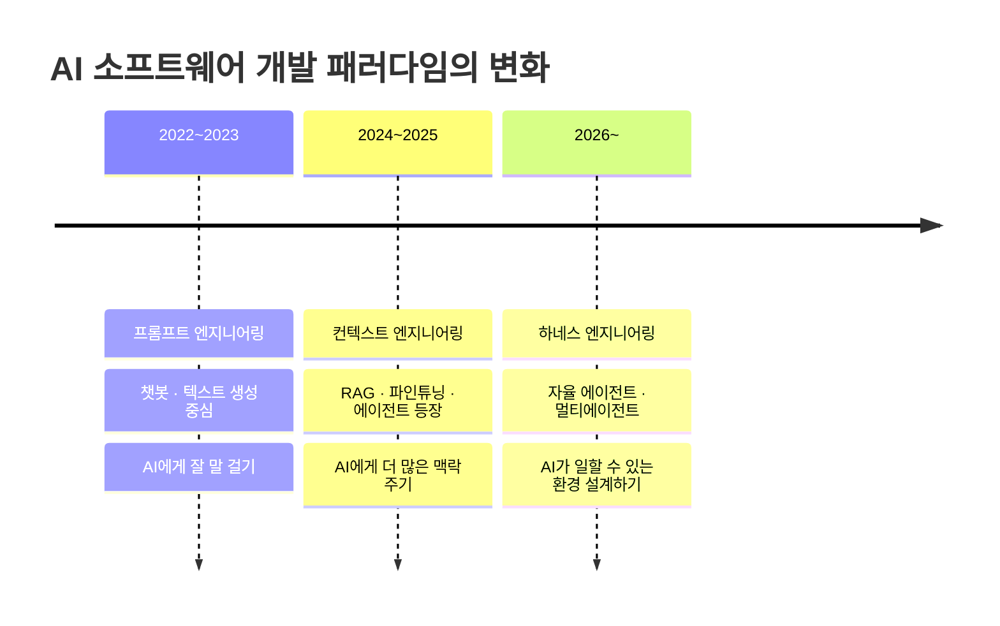
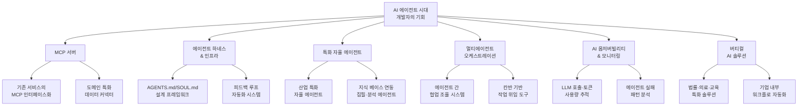
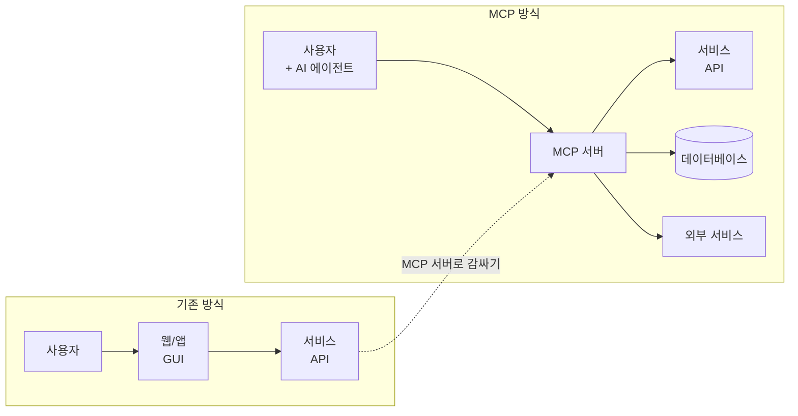
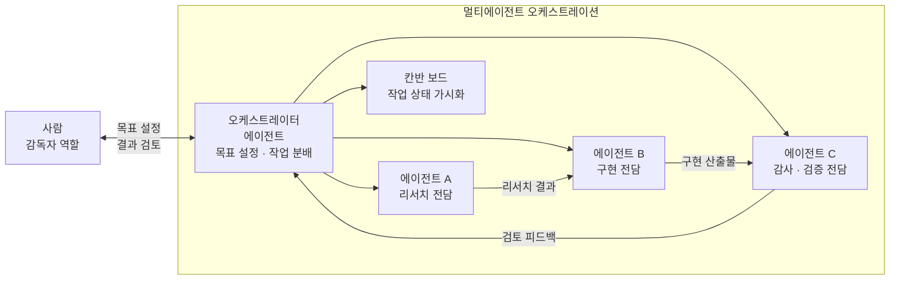
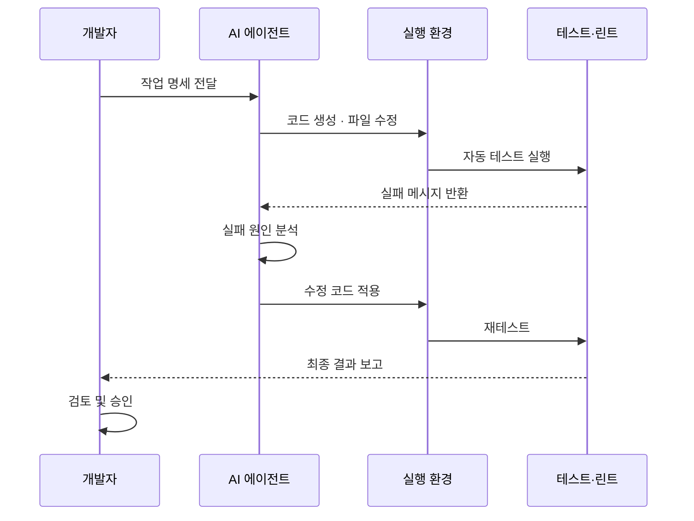
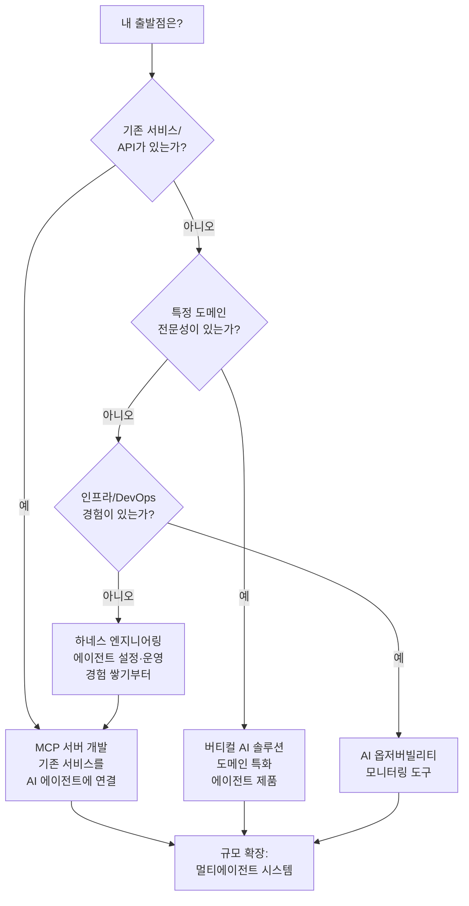
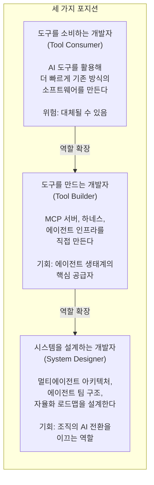

> 2026년, 소프트웨어 개발의 본질이 바뀌고 있다. 코드를 타이핑하던 손이 에이전트를 설계하는 손으로 바뀌는 전환점에서, 무엇을 만들고 어떻게 만들 것인가를 정리한다.

## 관련글

[**헤르메스 에이전트로 책 한 권을 쓰다: 설치부터 자율 집필까지**](https://k82022603.github.io/posts/%ED%97%A4%EB%A5%B4%EB%A9%94%EC%8A%A4-%EC%97%90%EC%9D%B4%EC%A0%84%ED%8A%B8%EB%A1%9C-%EC%B1%85-%ED%95%9C-%EA%B6%8C%EC%9D%84-%EC%93%B0%EB%8B%A4-%EC%84%A4%EC%B9%98%EB%B6%80%ED%84%B0-%EC%9E%90%EC%9C%A8-%EC%A7%91%ED%95%84%EA%B9%8C%EC%A7%80/)

---

## 1. 지금 무슨 일이 벌어지고 있는가

### 1-1. 패러다임 전환의 신호들

2026년 2월, OpenAI Codex 팀은 조용하지만 충격적인 실험 결과를 공개했다. 엔지니어 3명이 5개월 동안 코드를 단 한 줄도 직접 타이핑하지 않고, 약 100만 줄 규모의 프로덕션 애플리케이션을 완성했다는 내용이었다. 1,500개의 PR을 머지하면서 엔지니어 1인당 하루 평균 3.5개의 PR을 처리했고, 수작업 대비 약 10분의 1 시간에 완성했다. 더 중요한 것은, 핵심이 "더 좋은 모델"이 아니었다는 점이다. 이들이 집중한 것은 에이전트가 실수하지 않도록 감싸는 시스템, 즉 '하네스(harness)'를 설계하는 일이었다.

같은 시기, LangChain은 코딩 에이전트 벤치마크 Terminal Bench 2.0에서 모델을 바꾸지 않고 하네스만 개선해 30위권에서 5위권으로 25단계를 뛰어올랐다. 토스(Toss) 테크팀 역시 모델 전환 없이 하네스 개선만으로 Terminal Bench 2.0 성적을 52.8%에서 66.5%로 끌어올렸다.

이 세 가지 사례가 공통적으로 가리키는 방향은 하나다. 개발자의 경쟁력이 "얼마나 코드를 잘 짜는가"에서 "AI 에이전트가 일을 잘할 수 있는 환경을 얼마나 잘 설계하는가"로 이동하고 있다.

### 1-2. 시장이 보여주는 수치

시장 수치도 같은 방향을 가리킨다. 글로벌 시장조사기관 Omdia에 따르면, 기업용 AI 에이전트 소프트웨어 시장은 2025년 15억 달러(약 2조 2,000억 원)에서 2030년 418억 달러(약 61조 원)로 5년 만에 28배 성장할 전망이며, 연평균 성장률(CAGR)은 175%로 생성형 AI 초기 성장률의 두 배에 달한다.

MCP(Model Context Protocol) 생태계도 폭발적이다. 2024년 11월 SDK 다운로드 월 10만 건이었던 것이 2026년에는 월 9,700만 건을 기록하고 있다. 서버 수는 4,100개를 넘어섰다. 카카오는 PlayMCP 플랫폼을 런칭해 MCP 기반 개발 공모전을 개최했고, AWS·Google Cloud·Microsoft Azure가 모두 MCP를 지원하기 시작했다. 가트너는 2026년 최우선 전략 기술로 다중 에이전트 시스템(Multi-Agent System)을 꼽았다.

### 1-3. 개발자 역할의 재정의

코드를 직접 타이핑하는 시간은 줄어들고 있다. AI 에이전트가 일할 수 있는 환경을 설계하고, 결과를 검증하고, 운영 상태를 감시하는 시간이 늘어나고 있다. 소프트웨어 엔지니어의 역할이 '코드 작성자'에서 '환경 설계자'로 바뀌는 것이다.

이는 개발자가 필요 없어진다는 뜻이 아니다. 반대다. 에이전트에게 무엇을 맡길지 판단하는 능력, 에이전트의 실수를 잡아내는 능력, 여러 에이전트가 협력하는 시스템을 설계하는 능력이 새롭게 요구되는 핵심 역량이 된다.

---

## 2. 무엇을 만들면 좋을까

지금 이 시점에서 개발자가 집중할 수 있는 제품 카테고리는 크게 여섯 가지로 나눌 수 있다. 각 카테고리는 독립적이기보다 서로 연결되며, 개발자의 배경과 관심사에 따라 진입점이 달라진다.

### 2-1. MCP 서버: 가장 즉각적인 기회

MCP(Model Context Protocol)는 AI 에이전트가 외부 도구와 데이터에 연결하는 방식을 표준화한 통신 규약이다. Claude, ChatGPT, Cursor, VS Code 등 주요 AI 도구들이 모두 MCP를 지원하면서, MCP 서버는 AI 생태계의 "USB 포트"가 됐다. 한 번 만들어두면 수십 개의 AI 클라이언트에서 재사용할 수 있다.

MCP 서버 개발이 왜 지금 가장 즉각적인 기회인가? 이미 준비된 API가 있다면 MCP 서버를 개발하는 일은 상당히 단순하다. 기존 서비스의 API를 MCP 인터페이스로 감싸는 작업이기 때문이다. MCP가 적용된 에이전트는 실시간 데이터를 제공해 환각 발생률을 줄이고 복잡한 시나리오에서 작업 완료 정확도를 40% 이상 향상시킨다는 채택 지표도 있다.

**구체적으로 만들 수 있는 것들:**

기업 내부 서비스의 MCP 서버화가 첫 번째 방향이다. 사내 데이터베이스, 그룹웨어, ERP, CRM 등을 AI 에이전트가 자연어로 접근할 수 있도록 MCP 인터페이스를 만드는 것이다. 이미 API가 있다면 개발 난이도가 크지 않으면서, 기업 내 활용 가치는 매우 높다.

도메인 특화 데이터 커넥터도 기회다. 부동산 공공 데이터, 법원 판례, 특허청 데이터, 주식 시세, 날씨·환경 데이터 등 특정 도메인의 데이터를 AI 에이전트가 실시간으로 활용할 수 있게 연결하는 MCP 서버는, 해당 도메인 전문 지식이 있는 개발자만이 잘 만들 수 있다.

MCP 마켓플레이스에 등록된 서버는 Claude, Cursor, Cline 등의 AI 에이전트가 사용할 때마다 개발자에게 수익이 발생하는 새로운 수익 모델을 열어주고 있다.

**MCP 서버 설계 시 핵심 원칙:**

도구(tool) 설계에서 중요한 것은 설명문이다. "이 도구는 X를 합니다"보다 "사용자가 Y를 요청했고 Z가 필요할 때 호출하세요"처럼 맥락을 담은 설명이 에이전트의 도구 선택 정확도를 높인다. 선택 가능한 인자가 많을수록 AI가 잘못된 값을 넣을 가능성이 높아지므로, 옵션 3개 이상이면 도구를 분리하는 편이 낫다. 도구가 실패했을 때 "Error 500" 같은 단순 메시지가 아니라 "rate limit에 걸렸으니 60초 후 재시도 권장" 같은 회복 힌트를 함께 반환하면 에이전트의 자가 복구율이 올라간다.

### 2-2. 에이전트 하네스 & 인프라: 경쟁력의 진짜 원천

하네스 엔지니어링(Harness Engineering)은 AI 에이전트가 소프트웨어를 자율적으로 구축·유지보수할 수 있도록, 에이전트를 감싸는 외부 환경과 피드백 루프 전체를 설계하는 방법론이다. 2026년 초 OpenAI가 공식 블로그에서 정리하고, Martin Fowler가 관련 글을 쓰면서 업계 전체로 퍼진 개념이다.

하네스는 마치 자동차의 브레이크와 같다. 엔진(모델)이 아무리 좋아도 브레이크(하네스)가 없으면 위험하다. 개발 조직이 "왜 우리 에이전트는 잘 안 되지?"라고 묻는 상황의 대부분은 모델 문제가 아니라 하네스 문제다.

하네스 관련 제품 기회는 두 갈래다. 하나는 하네스 설계 프레임워크나 템플릿을 만드는 것이고, 다른 하나는 기업의 하네스 구성을 도와주는 서비스를 만드는 것이다.

**하네스의 핵심 구성 요소:**

| 구성 요소 | 역할 | 예시 |
|---|---|---|
| 컨텍스트 파일 | 에이전트의 작업 규칙과 금지 사항 정의 | CLAUDE.md, AGENTS.md, SOUL.md |
| 피드백 루프 | 에이전트 작업 결과의 자동 검증 | 테스트 자동 실행, 린트 체크 |
| 도구 제한 | 에이전트가 사용할 수 있는 도구 목록 | command_allowlist 관리 |
| 체크포인트 | 사람의 승인이 필요한 지점 정의 | HumanLayer 패턴 |
| 옵저버빌리티 | 에이전트 행동의 실시간 가시성 | LLM 호출 추적, 토큰 모니터링 |

컨텍스트 파일 설계에서 흔한 실수는 CLAUDE.md나 AGENTS.md를 너무 길게 작성하는 것이다. 문서가 길어질수록 에이전트는 중요한 내용을 놓치기 쉽고(컨텍스트 오염), 모델 간 성능 비교도 어려워진다. "절대 하지 말 것 3가지"부터 시작하는 최소한의 설정이 처음엔 더 효과적이다. 구체적인 실패 패턴이 발생했을 때 규칙을 추가하는 방식(L1→L5 점진적 에스컬레이션)이 처음부터 많은 규칙을 넣는 것보다 안정적이다.

### 2-3. 특화 자율 에이전트: "스스로 일하는 AI 직원"

앞선 헤르메스 에이전트 책쓰기 사례에서 확인한 것처럼, AI 에이전트는 이제 특정 도메인의 지식 베이스를 읽고 스스로 구조를 만들어 작업을 완료하는 수준에 도달했다. 이 능력을 특정 산업의 반복 작업에 연결하면 독립적인 제품이 된다.

에이전트 시대에 "특화 자율 에이전트 제품"이 가치 있는 이유는, 일반 목적(general-purpose) 에이전트보다 특정 도메인에 깊이 최적화된 에이전트가 실무에서 더 안정적이고 신뢰할 수 있기 때문이다. 법률 문서 검토 에이전트, 코드 보안 감사 에이전트, 재무 보고서 분석 에이전트, 고객 응대 에이전트 등이 그 예다.

특화 에이전트를 만들 때 핵심은 세 가지다. 첫째, 도메인 전문성이 있는 지식 베이스(LLM WIKI 혹은 RAG 시스템)를 잘 구성하는 것. 둘째, 도메인에 맞는 도구 집합을 정확히 정의하는 것. 셋째, 에이전트가 틀렸을 때 전문가가 빠르게 수정할 수 있는 검토 인터페이스를 만드는 것이다.

모든 것을 혼자 처리하는 만능 비서형 에이전트는 컨텍스트 오염과 역할 혼선으로 불안정해진다. 역할이 명확히 분리된 전문 에이전트가 협력하는 구조가 실무에서 더 강건하다.

### 2-4. 멀티에이전트 오케스트레이션 도구

가트너가 2026년 최우선 전략 기술로 꼽은 것이 바로 다중 에이전트 시스템이다. 단일 에이전트가 혼자 모든 것을 처리하는 시대에서, 여러 에이전트가 실제 팀처럼 역할을 나눠 협력하는 구조로 진화하고 있다. 업계 전문가들은 2026년부터 실제 기업 환경에서 10개 이상의 에이전트가 협업하는 시스템이 보편화될 것으로 전망한다.

이 흐름에서 개발자가 만들 수 있는 것은 크게 두 가지다. 하나는 오케스트레이터(orchestrator) 에이전트와 구현 에이전트 사이의 작업 위임과 결과 통합을 처리하는 미들웨어다. 다른 하나는 칸반(kanban) 스타일의 에이전트 작업 관리 보드로, 어느 에이전트가 어떤 카드를 맡았는지, 현재 상태가 어떤지를 가시화하는 도구다.

멀티에이전트 시스템에서 가장 어려운 문제는 "누가 언제 무엇을 해야 하는지"의 조율이다. 여기에 명확한 역할 페르소나, 회사 컨텍스트 주입, 마일스톤 설정을 결합하면 "AI 팀"이 실제 업무를 자율적으로 진행할 수 있게 된다.

### 2-5. AI 옵저버빌리티 & 모니터링

에이전트 시스템이 복잡해질수록 "왜 저 에이전트는 그렇게 행동했는가"를 추적하는 것이 점점 어려워진다. 기존 APM(Application Performance Monitoring) 도구는 에이전트의 행동을 제대로 추적하지 못한다. 이 격차에서 새로운 도구 기회가 생긴다.

AI 에이전트 운영 환경에서 옵저버빌리티가 다뤄야 하는 것은 모델 호출과 토큰 사용량 추적, 에이전트의 도구 호출과 실패 패턴 분석, GPU와 인프라 리소스 사용률 모니터링, 그리고 이 모든 것을 한 화면에서 보는 통합 뷰다. 와탭랩스(WhaTap Labs) 같은 국내 기업도 이미 이 방향으로 움직이고 있다.

하네스가 자동차의 브레이크라면, 모니터링은 계기판이다. 브레이크가 있어도 속도와 상태를 볼 수 없다면 안전하게 운전하기 어렵다.

MCP 서버 관점에서도 모니터링이 중요하다. MCP 서버가 죽으면 "에이전트가 갑자기 바보가 된" 것처럼 보이는데, 대응은 사람이 실시간으로 하기 어렵기 때문에 헬스체크 엔드포인트와 외부 모니터링 자동화가 필수다.

### 2-6. 버티컬 AI 솔루션: 도메인 전문성의 희소가치

AI 모델의 성능은 빠르게 상향 평준화되고 있다. 앞으로 기업의 경쟁력은 단순히 "누가 더 좋은 모델을 쓰느냐"보다, "누가 모델을 더 안정적으로 통제하고 자기 업무에 연결할 수 있는 시스템을 갖췄느냐"에서 갈릴 가능성이 크다.

이 점에서 특정 산업이나 도메인에 깊은 이해가 있는 개발자는 독특한 강점을 가진다. 법률, 의료, 회계, 제조, 유통, 교육 등 각 산업의 규정, 용어, 워크플로를 잘 아는 개발자는 범용 AI 도구가 해결하지 못하는 지점을 정확히 파악하고, 그 지점을 채우는 솔루션을 만들 수 있다.

2026년 1월부터 시행된 AI 기본법은 '고영향 인공지능'에 대한 신뢰성 확보 의무를 명문화했다. 규제 준수(compliance)를 지원하는 도구, 즉 AI 시스템의 결정 과정을 설명가능하게(explainable) 만들거나, 사람의 최종 승인 절차를 자동화하는 도구에도 기회가 있다.

---

## 3. 어떻게 만들면 좋을까

무엇을 만들지 방향이 잡혔다면, 이제 어떻게 만들 것인가의 방법론이 필요하다. 도구와 접근법이 이전과 달라졌기 때문이다.

### 3-1. AI 코딩 에이전트를 동료로 활용하기

2026년 현재 Claude Code, OpenAI Codex, Cursor, Cline, Gemini CLI 등 AI 코딩 에이전트는 단순 보조 도구를 넘어 실질적인 개발 파트너 수준에 도달해 있다. 이 도구들을 효과적으로 활용하는 것 자체가 이제 개발자의 핵심 역량이다.

효과적인 활용을 위한 원칙들이 있다. 먼저 작업을 독립적인 단위로 명확히 분리해야 한다. 에이전트에게 "이 기능 전체를 만들어줘"보다, "이 API 엔드포인트 하나를 만들고, 테스트를 먼저 작성한 뒤 구현해줘"가 더 일관된 결과를 낸다.

Git worktree를 활용해 여러 작업을 병렬로 진행하는 것도 생산성을 크게 높인다. 에이전트 A는 브랜치 A에서 기능 개발을 하는 동안, 에이전트 B는 브랜치 B에서 리팩토링을 진행하는 방식이다.

에이전트의 출력물은 반드시 검토해야 한다. "AI가 만들었으니 맞겠지"는 매우 위험한 가정이다. 에이전트는 그럴듯하지만 틀린 코드를 자신 있게 작성하는 경향이 있다. 테스트 자동화, 린트, 타입 체크 같은 피드백 루프를 강화할수록 에이전트의 실수가 빠르게 드러난다.

### 3-2. SPEC-First 접근법

"먼저 명세를 작성하고, AI가 그 명세대로 구현하게 한다"는 원칙이다. 코드를 먼저 작성하는 것보다 무엇을 만들지를 먼저 정확히 기술하는 것이 AI 시대 개발에서 더 중요해졌다.

명세를 명확히 작성할수록 AI 에이전트의 구현 정확도가 높아진다. 특히 다음 내용을 명세에 포함하면 효과적이다. 무엇을 만드는지(기능), 어떻게 동작해야 하는지(동작 명세), 무엇을 하면 안 되는지(제약), 성공의 기준이 무엇인지(테스트 조건). 이 네 가지가 명확할수록 에이전트의 첫 구현 품질이 높아지고 재작업이 줄어든다.

### 3-3. 점진적 빌드: 작게 만들고, 검증하고, 확장하라

이번 헤르메스 에이전트 설치 사례에서도 드러났듯이, 복잡한 시스템을 한 번에 구성하려는 시도는 실패 지점을 찾기 어렵게 만든다. 작게 나누어 각 단계를 검증하면서 진행하는 방식이 결국 전체 완료 속도도 빠르다.

MCP 서버를 만들 때도 같은 원칙이 적용된다. 도구 하나부터 시작해 로컬 테스트를 통과하면, 그다음 도구를 추가한다. 모든 도구를 한꺼번에 구현하고 배포하는 것보다, 하나씩 검증하면서 쌓아가는 쪽이 안전하다.

에이전트 메모리 시스템도 마찬가지다. 개인 볼트 전체를 에이전트에게 노출하기보다, 전용 폴더를 만들어 그 범위 안에서 먼저 테스트한 뒤 범위를 확장하는 것이 권장되는 방식이다.

### 3-4. 피드백 루프 설계: 에이전트가 스스로 고칠 수 있는 환경

가장 효과적인 하네스는 에이전트가 실수했을 때 외부 피드백 없이도 스스로 인지하고 수정할 수 있는 환경을 갖추는 것이다. 코드 변경 후 자동으로 테스트가 실행되고, 실패 메시지가 에이전트의 컨텍스트로 돌아오는 구조가 이에 해당한다.

피드백 루프가 촘촘할수록 에이전트의 자율 수정 능력이 높아진다. 반대로 피드백이 없는 환경에서는 에이전트가 같은 실수를 반복하거나, 틀린 방향으로 계속 나아가는 경향이 있다.

### 3-5. 도구 설계의 원칙

MCP 서버든 에이전트 스킬이든, 에이전트가 사용할 도구를 설계할 때 공통적으로 적용되는 원칙이 있다.

도구 설명은 에이전트가 읽는 프롬프트다. "이 도구는 사용자 정보를 조회합니다"보다 "사용자가 자신의 계정 정보를 물어볼 때 호출하세요. user_id 파라미터가 필요합니다. 인증된 요청에서만 작동합니다"가 훨씬 효과적이다.

JSON 덩어리를 그대로 반환하면 토큰만 낭비된다. "결과 5개 중 3개를 추렸고, 가장 관련 높은 건 X입니다"처럼 사전 가공해 반환하면 에이전트의 정확도가 높아진다.

오류 메시지에 회복 힌트를 담아야 한다. 에이전트는 "Error 500"을 받으면 어떻게 해야 할지 모른다. "rate limit에 걸렸으니 60초 후 재시도 권장" 또는 "인증 토큰이 만료됐습니다. 재로그인 후 시도하세요" 같은 명확한 힌트가 에이전트의 자가 복구를 가능하게 한다.

---

## 4. 전략적 우선순위: 어디서 시작할 것인가

모든 기회를 동시에 추구할 수는 없다. 현재 위치와 강점에 따라 진입점을 달리해야 한다.

**초보자 권장 순서:**

에이전트를 처음 다루는 개발자라면, 먼저 헤르메스나 Claude Code 같은 에이전트를 직접 설치하고 사용해보는 것이 첫걸음이다. 사용자 입장에서 에이전트의 작동 방식을 이해해야 만드는 사람의 입장을 가질 수 있다.

그다음은 AGENTS.md 또는 CLAUDE.md를 직접 작성해 에이전트의 행동을 조율하는 경험을 쌓는 것이다. 이 경험이 하네스 엔지니어링의 실제 감각을 키운다.

그 위에, 이미 가진 기술 스택과 도메인 지식을 활용해 작은 MCP 서버 하나를 만들어보는 것이 좋은 출발점이다. 완성도 높은 제품이 아니어도 된다. 실제로 에이전트가 자신이 만든 도구를 호출해 작업을 완수하는 경험이 다음 스텝을 위한 기반이 된다.

**현업 개발자 권장 접근:**

이미 현업에서 서비스를 운영하고 있다면, 기존 서비스에 MCP 인터페이스를 추가하는 것이 가장 빠른 AI 시대 진입 방법이다. 이미 검증된 API 로직이 있으므로 MCP 래퍼(wrapper)를 작성하는 것이 새 서비스를 처음부터 만드는 것보다 훨씬 빠르다.

팀 단위라면 각자의 역할을 에이전트의 역할과 매핑해보는 것도 좋다. "이 반복 작업은 에이전트가 처리하고, 사람은 검토만 한다"는 구조로 팀 생산성을 높이면서, 동시에 에이전트 시스템 설계 경험을 쌓을 수 있다.

---

## 5. 반드시 알아야 할 함정

### 5-1. 모델만 바꾸면 된다는 착각

많은 팀이 에이전트 성능이 기대에 못 미치면 반사적으로 더 비싼 모델로 전환한다. 그러나 LangChain의 Terminal Bench 2.0 사례가 보여주듯, 모델 교체보다 하네스 개선이 더 효과적인 경우가 많다. 모델을 탓하기 전에 CLAUDE.md 파일에 뭘 넣었는지, 어떤 도구를 연결했는지, 피드백 루프가 존재하는지, 컨텍스트가 효율적으로 관리되고 있는지를 먼저 점검해야 한다.

### 5-2. 만능 에이전트의 함정

모든 것을 처리하는 만능 비서형 에이전트는 매력적으로 보이지만, 실무에서는 불안정하다. 다양한 역할이 하나의 에이전트에 쌓일수록 컨텍스트 오염이 심해지고 응답의 일관성이 떨어진다. 역할을 명확히 분리한 전문 에이전트들이 협력하는 구조가 더 강건하다.

### 5-3. 지식 베이스 없는 자율 에이전트

에이전트가 아무리 강력해도, 그 에이전트가 참조할 수 있는 지식 베이스가 빈약하거나 부정확하면 출력물도 그 한계를 벗어나지 못한다. 헤르메스 에이전트로 책 한 권을 쓸 수 있었던 것은 에이전트의 능력만이 아니라 55개의 위키 문서와 6개의 근거 카드로 구성된 양질의 지식 베이스 덕분이었다. "Garbage In, Garbage Out" 원칙은 AI 에이전트에도 그대로 적용된다.

### 5-4. 보안과 권한 제어의 간과

MCP 서버를 처음 만들 때 보안을 간과하는 경우가 많다. 공개 MCP 서버라면 레이트 리미트, 스코프 기반 권한 제어, 로그 마스킹이 모두 갖춰져야 한다. 에이전트가 MCP 서버를 통해 데이터베이스에 접근하거나 외부 서비스를 호출할 때, 입력값 검증과 접근 제어를 반드시 구현해야 한다. MCP 스펙은 "모든 도구 입력을 검증하고, 적절한 접근 제어를 구현하라"고 명시하고 있다.

---

## 6. 요약: 개발자에게 주어진 세 가지 선택

지금 이 순간, 가장 안전한 포지션은 세 역할을 모두 경험하는 것이다. 도구를 써보고, 도구를 만들어보고, 시스템 수준에서 생각해보는 경험이 쌓일수록 AI 에이전트 시대에서 개발자의 가치는 높아진다.

"AI가 코드를 짜는 시대에 개발자는 무엇을 해야 하는가"라는 질문의 답은, 결국 "AI가 더 잘 일할 수 있는 환경을 만드는 사람"이다. 그 환경을 설계하고 운영하는 능력이 2026년 이후 소프트웨어 개발자의 핵심 역량이다.

---

*작성일: 2026년 6월 17일*
