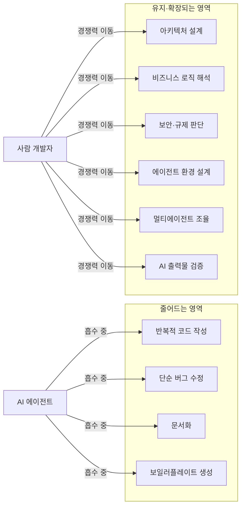
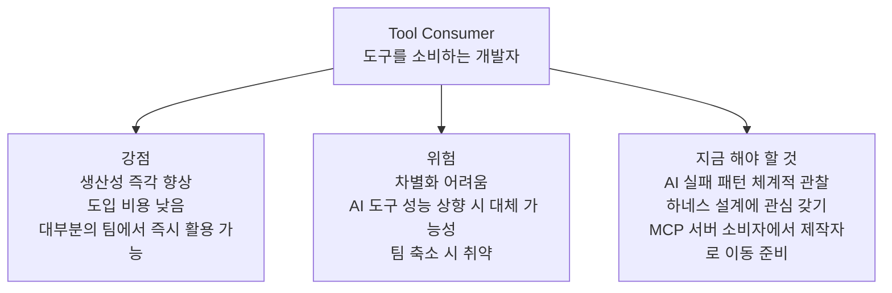
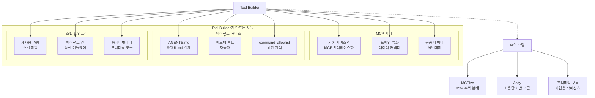
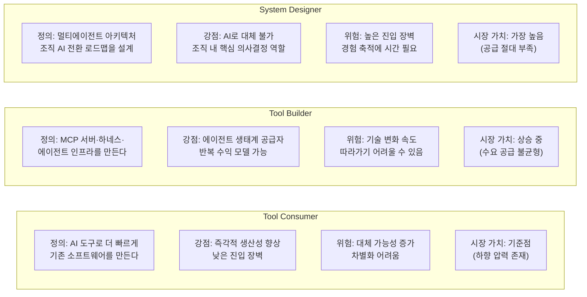
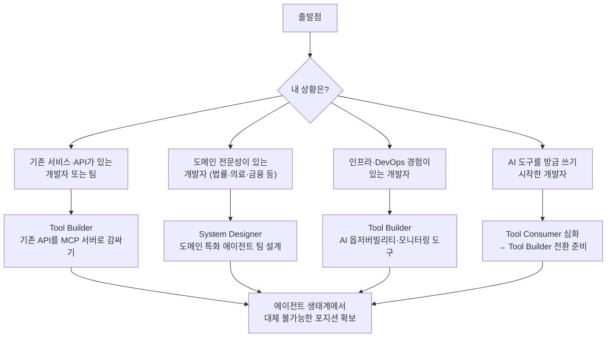
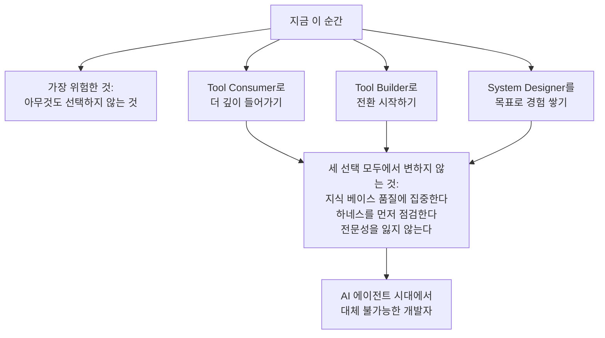

> AI 에이전트가 코드를 짜는 시대, 개발자는 무엇으로 살아남는가. 이 질문은 더 이상 미래의 문제가 아니다. 지금 이 시점에 어떤 포지션을 선택하느냐가, 3년 후의 자리를 결정한다.

## 관련글

[**AI 에이전트 시대, 개발자는 무엇을 어떻게 만들어야 하는가**](https://k82022603.github.io/posts/ai-%EC%97%90%EC%9D%B4%EC%A0%84%ED%8A%B8-%EC%8B%9C%EB%8C%80,-%EA%B0%9C%EB%B0%9C%EC%9E%90%EB%8A%94-%EB%AC%B4%EC%97%87%EC%9D%84-%EC%96%B4%EB%96%BB%EA%B2%8C-%EB%A7%8C%EB%93%A4%EC%96%B4%EC%95%BC-%ED%95%98%EB%8A%94%EA%B0%80/)

---

## 1. 갈림길에 서다: 지금 무슨 일이 벌어지고 있는가

### 1-1. 숫자가 말하는 현실

2026년, 구인·구직 플랫폼 Indeed의 데이터는 불편한 사실을 가리키고 있다. 소프트웨어 개발 직무 공고는 전년 대비 3.5% 감소했고, 기술 부문 전체는 2020년 초 이후 약 3분의 1 가까이 줄었다. 주니어 채용이 크게 위축됐고, 특히 개발자·애널리스트 역할이 더 큰 타격을 받았다는 분석이다. 반면 테크 직무의 78%가 채용 요건으로 AI 친숙도를 언급했고, AI/ML 엔지니어는 가장 빠르게 성장하는 IT 직무 중 하나로 꼽혔다.

시장이 두 개의 방향으로 갈라지고 있다. 줄어드는 자리와, 늘어나는 자리. 그 분기점은 기술 스택이 아니라 AI를 어떻게 다루느냐에 있다.

AI를 무서워하는 개발자 단가는 내려가고, AI를 잘 활용하는 개발자 단가는 올라간다. 한 프리랜서 플랫폼이 정리한 이 한 문장이 현재 시장의 구조를 가장 압축적으로 담고 있다.

### 1-2. 연공 편향적 기술 변화: 무엇이 사라지고 무엇이 남는가

스탠퍼드 AI 인덱스 2026은 지금 벌어지는 변화를 '연공 편향적 기술 변화(Seniority-Biased Technological Change)'라는 개념으로 설명한다. AI가 특정 직업 전체를 없애는 것이 아니라, 그 직업 안에서 주니어가 담당하던 업무를 대체한다는 뜻이다. 신입 개발자가 주로 맡던 반복적 코드 작성, 버그 수정, 문서화 같은 작업은 GitHub Copilot 같은 AI 도구가 빠르게 흡수하고 있다. 반면 시니어가 담당하는 아키텍처 설계, 코드 리뷰, 비즈니스 요구사항 해석은 아직 AI가 온전히 대신하지 못한다.

결과는 채용 구조의 변화다. 기업은 시니어 한 명에게 AI 도구를 쥐어줌으로써, 과거에는 주니어 두세 명이 하던 일을 처리하게 만들고 있다. 신규 채용 수요가 줄어드는 가장 직접적인 이유다.

시니어 소프트웨어 엔지니어 치라그 아그라왈은 "AI는 아키텍처, 규제 준수, 보안과 같은 어려운 결정을 내리지 못한다. 기업의 비즈니스 로직이나 시스템이 지닌 윤리적 의미를 완전히 이해할 수도 없다. 감독과 판단은 여전히 경험 많은 엔지니어의 몫으로 남아있다"고 말했다.

이것이 갈림길의 실체다. AI가 잘 처리하는 영역으로 더 깊이 들어갈수록 경쟁자는 AI다. AI가 아직 하지 못하는 영역으로 이동할수록 경쟁자는 줄어들고 가치는 높아진다.

### 1-3. 양극화: 두 종류의 조직, 두 종류의 개발자

엔지니어링 시장의 리스크는 개발자 역할의 소멸이 아닌, AI 활용 격차에 따른 'AI를 사용하는 조직'과 'AI 중심으로 사고하는 조직'의 양극화다. 이 분석은 개발자 개인 수준에도 그대로 적용된다.

AI를 사용하는 개발자와 AI 중심으로 사고하는 개발자. 같은 도구를 쓰더라도 어떤 방식으로 쓰느냐가 포지션을 결정한다. 전자는 AI를 더 빠른 타이핑 도구로 쓴다. 후자는 AI를 팀원으로 두고, 자신은 그 팀의 방향을 결정하는 역할로 이동한다.

지금 개발자 앞에는 세 가지 포지션이 있다. 어느 것을 선택할지는 각자가 결정해야 하지만, 세 선택지가 어떤 현실과 연결되는지를 먼저 정확히 알아야 한다.

---

## 2. 첫 번째 선택: 도구를 소비하는 개발자

### 2-1. 이 포지션의 정의

도구를 소비하는 개발자(Tool Consumer)는 Claude Code, GitHub Copilot, Cursor, Windsurf 같은 AI 코딩 에이전트를 활용해 기존 방식의 소프트웨어를 더 빠르게 만드는 개발자다. 이것이 오늘날 가장 많은 개발자가 취하고 있는 포지션이다.

Stack Overflow의 조사에 따르면 개발자의 76%가 AI 도구를 사용 중이거나 도입을 계획하고 있다. 즉, 대부분의 개발자가 이미 이 포지션에 있거나, 이 포지션으로 진입하고 있다.

이 포지션의 일상은 이렇다. 아침에 출근해 Cursor를 열고, 요구사항을 자연어로 설명하고, 에이전트가 생성한 코드를 검토하고 수정한다. 이전에 하루 종일 걸리던 작업이 두세 시간으로 줄어들었다. 생산성이 올랐다. 속도도 빨라졌다. 분명히 좋아졌다.

그런데 이것이 전부라면 문제가 생긴다.

### 2-2. 이 포지션의 위험

개발 플랫폼 멘딕스(Mendix)의 CEO 레이먼드 콕은 "시니어 개발자의 역할이 단순히 코드를 작성하는 것에서 벗어나 AI 에이전트와 다양한 도구가 함께 작동하도록 조율하는 방향으로 나아갈 것"이라고 평가했다.

조율하는 역할로 이동하지 않고 소비하는 역할에 머문다면, 시간이 지날수록 대체 가능성이 높아진다. 이유는 세 가지다.

첫째, AI 도구의 성능이 계속 올라가기 때문이다. 오늘 내가 AI 도구를 잘 다루는 능력이 내일은 기본 소양이 된다. 모든 개발자가 AI를 쓰는 시점에, AI를 쓴다는 것 자체는 차별점이 되지 않는다.

둘째, 기업들이 AI 코딩 어시스턴트에 의존하면서 주니어 개발자, 인턴, 경우에 따라서는 제품 관리자의 역할을 AI로 대체할 것이라는 전망이 나오고 있다. AI 도구를 쓰는 개발자와 AI 도구 자체 사이의 경쟁이 시작된다.

셋째, 3명의 소프트웨어 엔지니어가 과거 5~6명이 하던 코딩 업무를 할 수 있기 때문에, 장기적으로는 개발팀이 점점 더 축소될 것이라는 분석이 나온다. 팀이 줄어들면, 남는 자리는 줄어든 팀을 이끄는 사람이 가져간다.

### 2-3. 이 포지션에서 지금 당장 해야 할 것

그렇다고 이 포지션이 나쁜 것은 아니다. 출발점으로서는 반드시 필요하다. AI 도구를 소비자로서 깊이 경험해봐야, 그 도구를 만드는 사람이 될 수 있다.

이 포지션에 있다면 지금 당장 해야 할 것이 있다. 단순히 AI 도구를 쓰는 것을 넘어, AI 에이전트가 어떤 방식으로 작업을 처리하는지, 어디서 실패하는지, 어떤 입력을 줄 때 더 나은 출력이 나오는지를 체계적으로 관찰하고 기록하는 것이다. 이 관찰이 다음 포지션으로 이동하는 연료가 된다.

"개발자가 하루 종일 코드를 처음부터 끝까지 작성하는 대신 점점 더 AI를 이끌고, AI가 생성한 결과물을 연결해 더 큰 시스템으로 통합하며, 고부가가치 문제 해결에 집중하게 될 것"이라는 방향을 내면화하는 것이 이 단계의 핵심 과제다.

---

## 3. 두 번째 선택: 도구를 만드는 개발자

### 3-1. 이 포지션의 정의

도구를 만드는 개발자(Tool Builder)는 AI 에이전트가 사용할 도구, 즉 MCP 서버, 에이전트 하네스, 스킬 파일, 인프라를 직접 만드는 개발자다. 에이전트 생태계의 핵심 공급자 포지션이다.

이 포지션이 왜 지금 가장 뜨거운가를 이해하려면 MCP 생태계의 현재 수치를 봐야 한다. 2026년 MCP 생태계는 4,100개 이상의 서버, 월 9,700만 SDK 다운로드를 기록할 정도로 성장했다. 불과 2024년 11월에는 SDK 다운로드가 월 10만 건이었다. 1년 반 만에 970배가 됐다.

카카오의 MCP 기반 개방형 플랫폼 PlayMCP에는 카카오톡 나와의 채팅방, 톡캘린더, 카카오맵, 선물하기, 멜론 등 카카오 서비스뿐 아니라 약 200개 이상의 외부 MCP 서버들이 등록돼 있다. 국내에서도 MCP 생태계가 현실이 됐다는 증거다.

### 3-2. MCP 서버: 새로운 수익 모델의 탄생

MCP 서버를 만들어서 마켓플레이스에 올리면, AI 에이전트(Claude, Cursor, Cline 등)가 쓸 때마다 개발자에게 돈이 들어오는 구조다. 앱스토어에 앱을 올리듯, MCP 마켓플레이스에 서버를 올려서 수익을 만드는 시대가 열렸다. MCPize는 85% 수익 분배를, Apify는 사용량 기반(pay-per-event) 과금을, 21st.dev는 프리미엄 구독 모델을 제공한다.

생태계 통계상 MCP 서버 개발에서 Python이 51%, TypeScript가 22%를 차지하고 있어서 오히려 Python이 주류다. 특정 언어를 몰라서 진입하지 못하는 상황은 아니다.

이 수익 모델의 핵심은 '한 번 만들면 여러 에이전트가 반복 사용한다'는 구조에 있다. MCP가 LLM이 외부 도구를 호출하고 실행할 수 있는 구조를 제공함으로써, 단순 응답을 넘어 실제 작업 수행까지 이어지도록 한다. AI 에이전트가 많아질수록, 좋은 MCP 서버는 더 많이 호출된다.

### 3-3. 하네스 엔지니어링: 보이지 않는 경쟁력

MCP 서버 제작 외에 도구를 만드는 개발자가 집중해야 할 또 다른 영역이 있다. 하네스(harness) 설계다.

하네스는 AI 에이전트가 실수하지 않도록 감싸는 외부 환경과 피드백 루프 전체를 의미한다. LangChain이 Terminal Bench 2.0에서 하네스 개선만으로 30위권에서 5위권으로 뛰어오른 사례, 토스(Toss) 테크팀이 모델 전환 없이 하네스 개선으로 벤치마크 성적을 52.8%에서 66.5%로 끌어올린 사례는 이 영역의 가치를 압축적으로 보여준다.

하네스를 설계하는 역량은 바깥으로 드러나지 않는다. 두 개의 팀이 같은 AI 모델을 쓰는데 결과물 품질이 현저히 다르다면, 차이는 모델이 아니라 하네스에 있다. 이것이 하네스 엔지니어링이 보이지 않는 경쟁력인 이유다.

### 3-4. 이 포지션으로 전환하는 시작점

이 포지션으로 이동하는 첫 걸음은 거창할 필요가 없다. 자신이 이미 사용하고 있는 서비스나 API를 MCP 서버로 감싸는 것이 가장 현실적인 시작점이다. 이미 검증된 API 로직이 있으므로, MCP 래퍼를 작성하는 것이 새 서비스를 처음부터 만드는 것보다 훨씬 빠르다.

가장 좋은 MCP 서버 아이디어는 "내가 AI 에이전트를 쓰면서 없어서 불편했던 도구"다. 사용자 입장에서 느낀 불편함이 만드는 사람의 입장에서 가장 강력한 기획이 된다.

하나의 MCP 서버를 완성하고 마켓플레이스에 등록하는 경험이 다음 서버를 만드는 속도를 세 배로 높인다. 첫 번째가 가장 어렵다.

---

## 4. 세 번째 선택: 시스템을 설계하는 개발자

### 4-1. 이 포지션의 정의

시스템을 설계하는 개발자(System Designer)는 멀티에이전트 아키텍처, 에이전트 팀 구조, 조직의 AI 전환 로드맵을 설계하는 개발자다. 세 가지 선택지 중 진입 장벽이 가장 높고, 동시에 시장에서 가장 희소하며, 가장 높은 가치를 인정받는 포지션이다.

2026년은 단일 에이전트 시대에서 멀티에이전트 시대로의 전환점이다. 멀티에이전트 시스템은 단순히 여러 개의 AI를 연결한 것이 아니다. 이는 조직 전체의 일하는 방식을 AI 중심으로 재설계하는 근본적인 변화를 의미한다.

이 변화를 설계할 수 있는 사람이 필요하다. 그 역할이 System Designer다.

### 4-2. 시스템 설계자의 일상

System Designer는 코드를 거의 직접 짜지 않는다. 대신 다음과 같은 질문들을 다룬다.

이 조직의 반복 업무 중 어떤 것을 어떤 에이전트에게 맡길 수 있는가? 에이전트들 사이의 역할 분리는 어떻게 할 것인가? 오케스트레이터 에이전트와 실행 에이전트 사이의 통신은 어떤 방식으로 설계할 것인가? 에이전트가 실패했을 때 사람이 개입하는 조건은 무엇인가? 이 시스템의 안전 장치는 무엇이고, 권한의 경계는 어디인가? 운영 비용과 모델 호출 비용을 어떻게 통제할 것인가?

이 질문들에 답하는 능력은 특정 프레임워크를 쓸 줄 아는 것과 다르다. 비즈니스 도메인에 대한 이해, 시스템 설계 경험, 에이전트의 작동 방식에 대한 직관, 그리고 실패 사례에서 배운 교훈이 결합된 능력이다.

### 4-3. 왜 이 포지션이 가장 안전한가

성공적인 에이전틱 AI 전환을 위해서는 단순히 새로운 도구를 도입하는 것을 넘어 기존의 가설을 재검토하고 문화적 변화를 주도하는 리더십이 필수적이다. 이 역할은 AI가 할 수 없다.

AI를 적극적으로 활용하는 개발자 그룹은 생산성과 영향력 측면에서 매우 큰 향상을 보인다는 평가가 나오고 있다. System Designer는 이 방향의 정점이다. 자신이 설계한 에이전트 팀이 자신 대신 일하고, 자신은 그 팀의 목표와 구조를 결정하는 역할로 이동하기 때문이다.

명확한 역할 정의, 효율적인 통신 프로토콜, 그리고 적절한 협업 패턴 선택을 통해 구축된 멀티에이전트 시스템은 기업의 생산성을 획기적으로 향상시키고 복잡한 비즈니스 문제를 효과적으로 해결하는 핵심 도구가 될 것이다. 이것을 설계할 수 있는 사람은 지금 많지 않다.

### 4-4. System Designer에게 필요한 역량

System Designer가 되려면 단순히 아키텍처 다이어그램을 잘 그리는 것 이상이 필요하다.

에이전트 작동 방식에 대한 깊은 이해가 첫 번째다. 컨텍스트 창이 어떻게 관리되는지, 에이전트가 어떤 상황에서 루프에 빠지는지, 어떤 하네스 설정이 성능을 높이고 어떤 것이 오히려 방해가 되는지. 이 이해는 직접 에이전트를 운영해본 경험에서만 온다.

실패 패턴 라이브러리가 두 번째다. 어떤 설계가 어떤 이유로 실패했는지를 알아야 같은 실수를 반복하지 않는 시스템을 만들 수 있다. 이 라이브러리는 다른 사람의 실패 사례를 학습하는 것으로도 쌓을 수 있다.

비즈니스 도메인 이해가 세 번째다. 어떤 업무를 에이전트에게 맡기고 어떤 업무는 사람이 해야 하는지의 판단은, 기술이 아니라 도메인 지식에서 나온다. 기술만 아는 사람은 모든 것을 자동화하려 하고, 도메인만 아는 사람은 아무것도 자동화하려 하지 않는다. 두 가지를 함께 아는 사람이 System Designer다.

---

## 5. 세 선택지의 비교와 현실적 전환 전략

### 5-1. 세 포지션의 비교

| 기준 | Tool Consumer | Tool Builder | System Designer |
|---|---|---|---|
| 진입 장벽 | 낮음 | 중간 | 높음 |
| 대체 가능성 | 높음 | 중간 | 낮음 |
| 수입 성장성 | 정체 또는 하향 | 상승 | 급상승 |
| 필요 경험 | AI 도구 활용 | 개발 + AI 에이전트 이해 | 개발 + 도메인 + 시스템 설계 |
| 혼자 시작 가능 여부 | 즉시 가능 | 가능 | 경험 축적 필요 |
| 지금 공급 | 많음 | 부족 | 매우 부족 |

### 5-2. 순서가 반드시 필요하진 않다

Tool Consumer → Tool Builder → System Designer의 순서가 자연스럽지만, 이 순서가 반드시 필수는 아니다. 출발점이 어디냐에 따라 진입 경로가 달라진다.

도메인 전문성이 강한 개발자(법률, 의료, 금융 등)는 Tool Builder를 거치지 않고 바로 특화 도메인의 System Designer로 진입할 수 있다. 그 도메인의 업무를 에이전트에게 어떻게 맡길 것인지를 설계하는 능력은, 해당 도메인을 모르는 기술 전문가보다 도메인을 아는 개발자가 훨씬 빠르게 갖출 수 있다.

인프라와 DevOps 경험이 강한 개발자는 AI 옵저버빌리티나 모니터링 도구를 만드는 Tool Builder로 빠르게 진입할 수 있다. 에이전트 시스템의 가시성과 안정성 확보는 기존 DevOps 경험과 직접 연결된다.

### 5-3. 이 순간 가장 빠른 전환 경로

"지금 Tool Consumer인데, Tool Builder로 이동하고 싶다"는 개발자에게 가장 빠른 경로는 다음과 같다.

첫 주는 헤르메스(Hermes Agent)나 Claude Code 같은 에이전트를 직접 설치하고 실제 작업에 써보는 것이다. 사용자 입장에서 에이전트의 작동 방식, 실패 패턴, 좋은 입력과 나쁜 입력의 차이를 체감한다.

둘째 주는 AGENTS.md나 CLAUDE.md를 직접 작성해 에이전트의 행동을 조율해본다. "절대 하지 말 것 3가지"와 "역할의 핵심"만 담은 최소한의 설정부터 시작해, 실패가 발생할 때마다 규칙을 추가하는 점진적 에스컬레이션 방식으로 운영한다. 이것이 하네스 엔지니어링의 실제 감각을 키운다.

셋째 주부터는 내가 자주 쓰는 API나 서비스를 MCP 서버로 감싸는 작업을 시작한다. 완성도 높은 제품이 아니어도 된다. 에이전트가 내가 만든 도구를 호출해 작업을 완수하는 경험이, 다음 스텝의 기반이 된다.

---

## 6. 세 선택지를 관통하는 불변의 원칙

### 6-1. 지식 베이스의 품질이 에이전트의 품질을 결정한다

에이전트가 55개의 위키 문서를 읽고 책 한 권을 쓰든, 100개의 고객 데이터를 참조해 맞춤 제안을 만들든, 에이전트의 출력 품질은 입력된 지식 베이스의 품질에 직접적으로 의존한다. 세 포지션 모두에서 이 원칙은 변하지 않는다.

Tool Consumer라면 AI에게 더 좋은 컨텍스트를 주는 것이 더 좋은 결과를 만든다. Tool Builder라면 내가 만드는 MCP 서버가 반환하는 데이터의 품질이 에이전트의 정확도를 결정한다. System Designer라면 에이전트 팀이 참조하는 위키, 문서, 지식 베이스의 구조와 품질이 팀 전체의 역량을 결정한다.

### 6-2. 하네스가 흔들리면 에이전트는 더 흔들린다

에이전트 시스템이 불안정한 이유의 대부분은 모델 문제가 아니라 하네스 문제다. AGENTS.md가 너무 길어 컨텍스트를 오염시키거나, 피드백 루프가 없어 에이전트가 같은 실수를 반복하거나, 도구 설명이 부정확해 에이전트가 잘못된 도구를 선택하거나, 에스컬레이션 조건이 없어 사람이 개입해야 할 때를 에이전트가 모르는 경우가 그 예다.

어느 포지션에 있든 이 원칙을 이해하고 있는 개발자는, 에이전트 시스템이 잘 안 될 때 모델을 탓하기 전에 하네스를 먼저 점검한다. 이 판단력이 Tool Consumer를 Tool Builder와 System Designer로부터 구분하는 첫 번째 기준점이다.

### 6-3. 전문성은 AI가 범용화될수록 희소해진다

AI/ML, 블록체인, 보안, 데이터 엔지니어링 같은 전문 분야는 여전히 공급이 부족하다. 이 분야는 AI 도구 영향도 상대적으로 적다. 도메인 지식 자체가 가치이기 때문이다.

AI 모델의 성능이 상향 평준화될수록, 모델 자체의 차별성은 줄어든다. 반면 특정 산업이나 도메인의 깊은 이해는 희소해진다. 법률 용어를 아는 개발자, 의료 워크플로를 아는 개발자, 제조 공정을 아는 개발자는 AI가 대신할 수 없는 맥락을 가지고 있다.

이 전문성이 세 번째 선택(System Designer)과 결합할 때 가장 강력해진다. 도메인을 알면서 에이전트 시스템을 설계할 수 있는 사람은, 지금 전 세계 어디에도 많지 않다.

---

## 7. 결론: 어떤 선택을 해야 하는가

세 가지 선택지를 이야기했지만, 사실 핵심 메시지는 하나다.

지금 이 순간, 가장 위험한 포지션은 세 선택지 중 하나를 선택한 개발자가 아니라, 아직 아무것도 선택하지 않은 개발자다.

AI, 로우코드 도구, 비주얼 프로그래밍 언어가 개발자의 역할을 재정의하고 있으며, 소프트웨어 개발은 명령어 기반 코딩에서 벗어나 그래픽 중심과 AI 기반 방식으로 전환할 시점이라는 평가가 나오고 있다. 이 전환이 일어나고 있는 동안 관망하는 것이 가장 위험하다.

세 포지션을 모두 경험하는 것이 이상적이다. 도구를 써보고(Consumer), 도구를 만들어보고(Builder), 시스템 수준에서 생각해보는(Designer) 경험이 쌓일수록 AI 에이전트 시대에서 개발자의 가치는 높아진다.

그리고 세 선택지를 모두 관통하는 질문이 있다. "AI가 더 잘 일할 수 있는 환경을 만드는 것이 내 역할인가, 아니면 AI가 만들어주는 환경에서 일하는 것이 내 역할인가?" 전자를 선택하는 것이 세 가지 선택 중 어느 방향이든 더 안전하고 가치 있는 자리로 이어진다.

"AI가 코드를 짜는 시대에 개발자는 무엇을 해야 하는가"라는 질문의 답은, 어떤 선택지를 고르든 결국 같은 곳으로 수렴한다. AI가 더 잘 일할 수 있는 환경을 설계하고 운영하는 사람. 그것이 2026년 이후 소프트웨어 개발자의 핵심 정체성이다.

