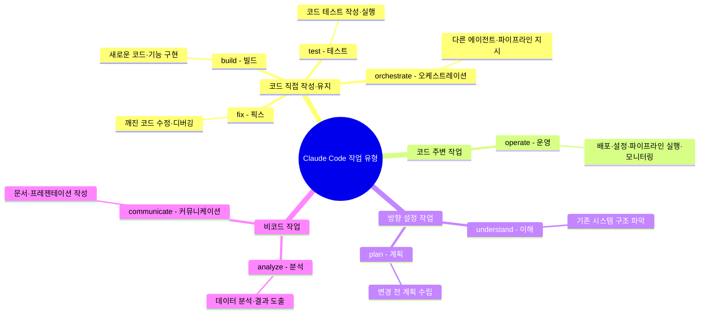
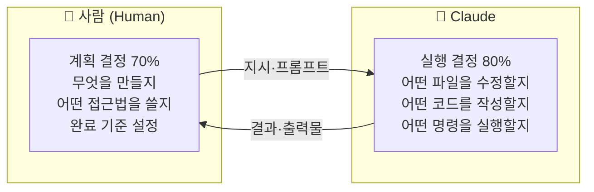
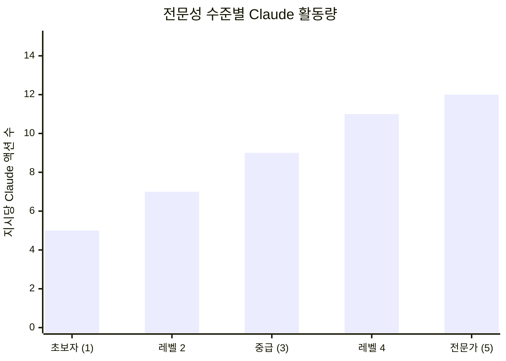
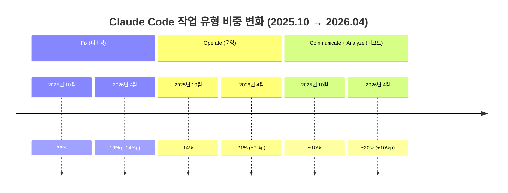
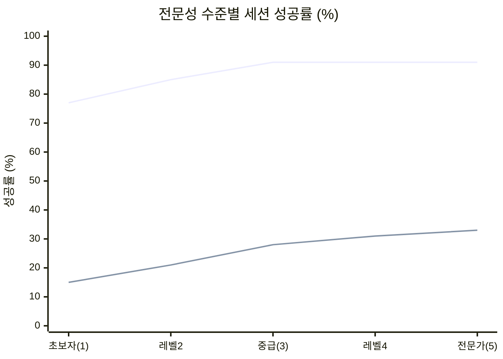
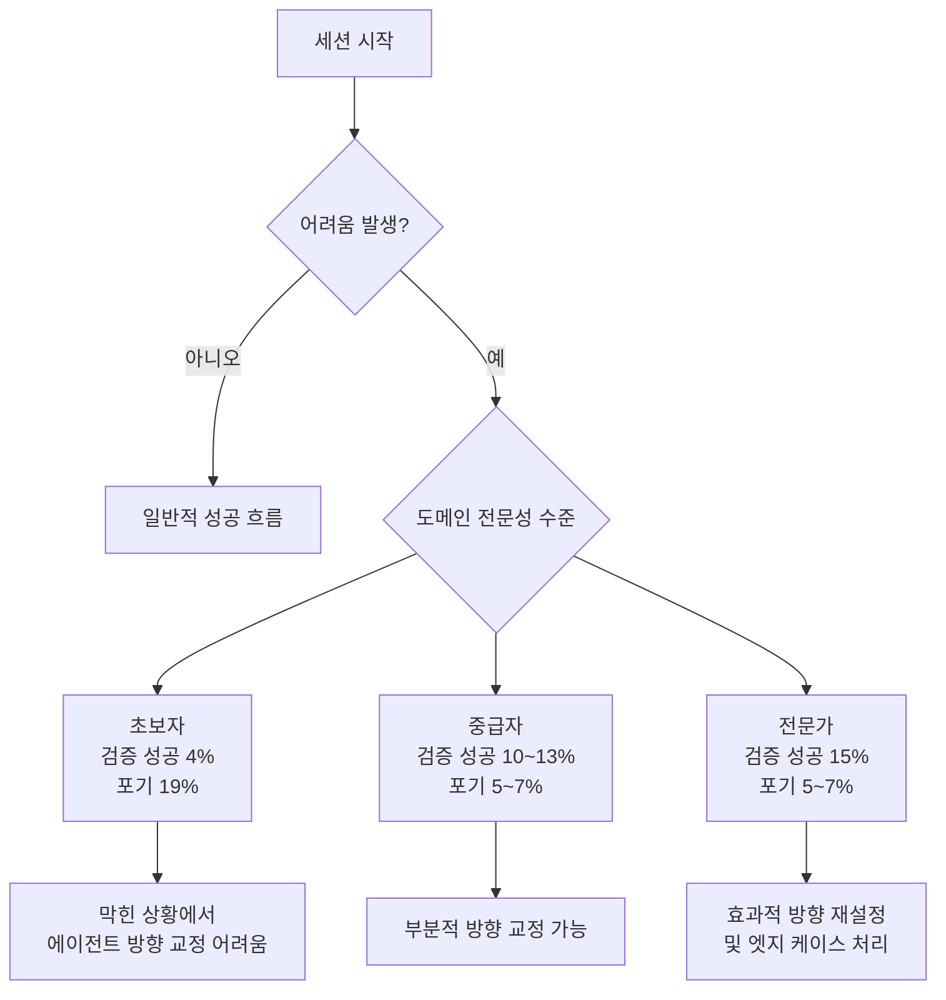
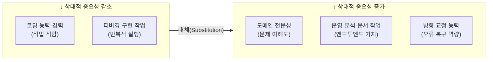

## 앤트로픽 경제 연구 보고서 상세 해설

> **원문 출처:** Anthropic Economic Research, 2026년 6월 16일 발표  
> **원문 URL:** https://www.anthropic.com/research/claude-code-expertise  
> **저자:** Zoe Hitzig, Maxim Massenkoff, Eva Lyubich, Ryan Heller, Peter McCrory

## 관련글

[**7개월 사이, 사람들이 디버깅에 쓰는 세션이 절반 가까이 줄었습니다**](https://www.threads.com/@aicoffeechat/post/DZrKgitDW05)

---

## 1. 보고서가 나온 배경과 목적

2025년 말을 기점으로 AI 코딩 에이전트의 확산 속도는 눈에 띄게 빨라졌다. GitHub 공개 저장소 약 12만 8천 개를 분석한 연구에 따르면, 2025년 10월 말 기준으로 전체 프로젝트의 16~23%에서 코딩 에이전트 활동이 감지됐고, 그 이후에 생성된 프로젝트들을 대상으로 한 후속 연구에서는 채택률이 두 배 이상으로 뛰었다. Claude Code 사용자들은 평균적으로 주당 20시간을 이 도구에 쏟고 있는 것으로 나타났다.

이 흐름 속에서 앤트로픽 연구진은 자연스럽게 두 가지 핵심 질문에 맞닥뜨렸다. 첫째, 정식 코딩 교육을 받지 않은 사람도 에이전트를 통해 복잡한 기술 작업을 성공적으로 수행할 수 있는가? 둘째, 이 도구들의 빠른 확산과 성능 향상이 지식 노동 시장 전반에 어떤 변화를 가져올 것인가?

이 질문들에 완전한 답을 내놓기 위한 출발점으로, 연구팀은 Claude Code 실제 사용 데이터를 분석하는 방법을 택했다. 결과물이 바로 이 보고서다.

---

## 2. 분석에 사용된 데이터와 방법론

### 2-1. 데이터 규모

이 연구는 앤트로픽이 자체 개발한 프라이버시 보존 분석 도구인 CLIO(Claude for Large-scale Interaction Observation)를 활용해, **2025년 10월부터 2026년 4월까지 7개월간** 이루어진 Claude Code 인터랙티브 세션 약 **40만 개**를 분석했다. 이 세션들은 약 **23만 5천 명**의 사용자로부터 수집됐다. CLI(명령줄 인터페이스), Claude.ai 웹 인터페이스, Claude Code 데스크톱 앱을 통한 사용이 모두 포함됐다.

### 2-2. 세션 분류: 9가지 작업 유형

연구팀은 각 세션이 어떤 종류의 일을 하고 있는지 파악하기 위해, 모든 세션을 **9가지 작업 유형(Work Mode)** 중 하나로 분류하는 분류기를 구축했다. 분류기는 세션 전체 대화 내용을 읽고 그 세션의 핵심 목적을 하나로 규정한다.

분석 결과, 전체 세션의 약 56%는 코드를 직접 쓰거나 유지하는 작업(빌드 25%, 픽스 26%, 테스트·오케스트레이션 5%)이었다. 소프트웨어 운영이 17%, 계획이나 탐색이 14%, 데이터 분석과 문서 작성이 13%를 차지했다.

분류기의 신뢰도는 텔레메트리 데이터와 교차 검증으로 확인됐다. 예를 들어 분류기가 "코드 생성 또는 수정" 세션으로 분류한 경우의 90% 이상에서 실제 코드 변경 기록이 텔레메트리에서 확인됐다.

---

## 3. 누가 무엇을 결정하는가: 역할 분담의 구조

### 3-1. 계획 vs. 실행의 분리

에이전트 코딩에서 가장 근본적인 질문 중 하나는 "자율성을 어떻게 측정할 것인가"이다. 연구팀은 두 가지 축으로 이 문제에 접근했다.

첫째는 **의사결정의 귀속(decision attribution)** 이다. 세션의 모든 의미 있는 결정을 계획 결정(무엇을 할지, 어떤 접근법을 택할지, 완료 기준을 어떻게 정할지)과 실행 결정(어떤 파일을 수정할지, 어떤 코드를 작성할지, 어떤 언어를 쓸지, 어떤 명령을 실행할지)으로 구분하고, 각각을 Claude 또는 사용자에게 귀속시켰다.

평균적으로 **사람이 계획 결정의 약 70%를 내리고**, **Claude가 실행 결정의 약 80%를 담당**했다. 한마디로 말하면, 사람은 "무엇을 만들지"를 결정하고 에이전트는 "어떻게 만들지"를 결정한다. 에이전트 코딩의 역할 분담이 이미 뚜렷한 구조로 자리 잡은 셈이다.

둘째는 **세션의 구조적 흐름(action delegation)** 이다. 전형적인 세션에서 사람과 Claude는 약 4번의 왕복 대화를 주고받는다. 사람이 프롬프트 하나를 보내면 Claude는 평균 10개의 액션을 연쇄적으로 수행하고(경우에 따라 100개 이상), 평균 2,400단어의 출력물을 생성한다.

사용자가 실행 결정을 80% 이상 유지하는 경우 Claude는 턴당 약 8개의 액션을 취하지만, Claude가 계획 결정을 80% 이상 가져가는 경우에는 턴당 약 16개의 액션을 취한다.

---

## 4. 전문성 수준: 어떻게 측정하고, 왜 중요한가

### 4-1. 전문성 측정 방식

연구팀은 세션 대화 내용을 기반으로 사용자의 **해당 작업에 대한 도메인 전문성**을 1~5점 척도(초보자~전문가)로 평가하는 분류기를 개발했다. 이때 중요한 것은, 이 전문성이 **직업 직함이나 일반적 능력이 아닌, 해당 특정 작업에 대한 도메인 이해도**를 측정한다는 점이다.

분류기가 주목하는 세 가지 신호는 다음과 같다.

- 사용자가 지시를 얼마나 정확하게 표현하는가
- 사용자가 Claude에게 어떤 항목을 검증해달라고 요청하는가
- 사용자가 Claude를 교정하는가, 아니면 Claude가 사용자를 교정하는가

예를 들어 Rust 프로그래밍을 처음 접하는 시니어 엔지니어는 Rust에 대해서는 초보자다. 반면 Python을 한 번도 써본 적 없는 회계사라도, Python 스크립트가 반드시 구현해야 할 회계 조정 규칙을 정확히 지시하고 월말 결산에서 처리 누락이 생긴 엣지 케이스를 직접 잡아낸다면, 그 작업에 대해서는 전문가로 분류된다. **전문성은 코딩 능력이 아니라 문제에 대한 이해도**다.

### 4-2. 전문성에 따른 Claude의 출력량 차이

전문성이 높을수록 Claude는 지시 하나당 훨씬 더 많은 일을 한다. 초보자 세션에서는 프롬프트 하나가 Claude 액션 약 5개와 출력 약 600단어를 유발하지만, 전문가 세션에서는 같은 프롬프트 하나가 Claude 액션 약 12개(2.4배)와 출력 약 3,200단어(5.3배)를 유발한다. 이 차이는 작업 유형과 작업 가치 구간을 통제한 후에도 통계적으로 유의하게 유지됐다(p < 0.001).

이 수치는 "도메인 전문가가 에이전트를 더 멀리 끌고 갈 수 있다"는 직관적인 이해를 데이터로 뒷받침한다. 전문가는 더 구체적인 지시와 명확한 검증 기준을 제공하기 때문에, Claude가 그 지시 하나만으로도 훨씬 광범위한 작업을 자율적으로 수행할 수 있다.

---

## 5. 7개월 동안 무엇이 달라졌는가

### 5-1. 작업 유형 구성의 변화

2025년 10월부터 2026년 4월까지 Claude Code에서 이루어지는 작업의 구성이 뚜렷하게 바뀌었다.

**가장 크게 줄어든 것: 디버깅(Fix)**

깨진 코드를 고치는 세션의 비중이 전체의 **33%에서 19%로** 떨어졌다. 7개월 만에 거의 반토막이 난 것이다. 이는 AI가 처음부터 더 적게 실수하거나, 막힌 문제를 더 빠르게 해결하게 됐다는 신호로 해석할 수 있다.

**크게 늘어난 것 1: 소프트웨어 운영(Operate)**

소프트웨어를 실제로 배포하고, 설정을 구성하고, 파이프라인을 실행하고, 시스템 상태를 모니터링하는 작업의 비중이 **14%에서 21%로** 증가했다. 코드를 '쓰는' 단계를 넘어, 만든 것을 '돌리는' 단계까지 Claude에게 맡기기 시작했다는 뜻이다.

**크게 늘어난 것 2: 글쓰기 및 데이터 분석(Communicate + Analyze)**

코드가 아닌 문서를 작성하거나, 데이터를 분석해 결과를 도출하는 세션이 합산 기준 약 **10%에서 20%로** 두 배 가까이 늘었다.

앤트로픽 연구팀은 이 흐름을 **"엔드투엔드 에이전트 사용의 확대"** 로 표현했다. 코드 한 조각을 보조하는 수준을 벗어나, 배포·운영·분석·문서 작성까지 처음부터 끝까지 맡기는 방향으로 무게 중심이 이동하고 있는 것이다.

### 5-2. 작업의 경제적 가치 변화

작업의 성격이 바뀐 것뿐만 아니라, 각 세션에서 다루는 일의 **경제적 가치**도 함께 올랐다.

연구팀은 각 세션의 경제적 가치를 추정하기 위해 프리랜서 구인 시장의 실제 공고 데이터를 활용했다. "이 작업을 프리랜서 마켓플레이스에 올린다면 얼마의 비용이 들겠는가"를 공개 데이터셋으로 보정해 산출한 것이다. 이 기준으로 **평균 세션의 추정 가치가 2025년 10월 대비 2026년 4월에 약 27% 상승**했다.

상승폭은 특정 작업 유형에 국한되지 않았다.

| 작업 유형 | 추정 가치 상승률 |
|-----------|-----------------|
| 빌드(Build) | +43% |
| 운영(Operate) | +34% |
| 픽스(Fix) | +32% |
| 전체 평균 | +27% |
| 커뮤니케이션(Communicate) | +2% (소폭 상승) |

단, 연구팀은 이 가격 추정치가 거칠다는 점을 명시했다. 이 수치는 정확한 금액을 나타내는 것이 아니라, 시간의 흐름에 따른 작업 간 상대적 가치 변화를 비교하기 위한 지표로 사용해야 한다.

데이터가 가리키는 방향은 하나다. **모델이 성능이 향상될수록, 사람들은 Claude에게 더 어렵고 더 가치 있는 일을 맡긴다.**

---

## 6. 성공을 가르는 것은 무엇인가

### 6-1. 성공의 정의

연구팀은 세션의 성공 여부를 판단하기 위해 두 가지 측정 방식을 병행했다. 실제 결과를 직접 관찰하거나 사용자에게 물어볼 수 없기 때문에, 대화 내용 분석에 의존하는 두 가지 보완적 지표를 사용했다.

**판단 성공(Judged Success):** 대화 전체를 읽은 분류기가 "이 사람이 하려고 했던 일을 달성했는가"를 평가한다. 성공, 부분 성공, 실패, 명확한 목표 없음으로 분류한다.

**검증된 성공(Verified Success):** 성공 증거의 강도를 별도 분류기로 평가한다. git 커밋이나 풀 리퀘스트처럼 코드 반영 기록, 테스트 통과 기록, 사용자의 명시적 확인 등 검증 가능한 하드 시그널이 존재할 경우에만 "검증된 성공"으로 인정된다.

또한 실패 신호 분류기는 에러, 실패한 테스트, 동일 작업 반복 시도, 사용자의 결과 불만 표현 등을 추적해 "어려움에 봉착한 세션"을 식별한다.

### 6-2. 전문성과 성공률의 관계

모든 성공 측정 방식에서 **전문성이 높을수록 성공률이 높다**는 패턴이 일관되게 나타났다.

- **부분 성공 이상(All sessions):** 초보자 77% → 전문가 91%
- **검증된 성공(Verified success):** 초보자 15% → 전문가 33%

성공률 향상폭은 **초보자에서 중급자로 올라가는 구간에서 가장 크고**, 중급자에서 전문가로 올라가는 구간에서는 상대적으로 완만해진다. 이는 중요한 시사점을 담고 있다. 최고 수준의 전문성이 아니라도, **해당 분야에 대한 실용적인 이해만 갖추면 전문가와 거의 비슷한 수준으로 Claude를 활용할 수 있다**는 것이다.

### 6-3. 어려움에 봉착했을 때의 차이

세션이 어려움에 봉착했을 때 전문성의 차이는 더욱 극명하게 드러난다.

어려움을 겪는 세션 중 **검증된 성공으로 마무리되는 비율**이 초보자는 4%에 불과한 반면, 전문가는 15%에 달한다. 부분 성공 기준으로는 초보자 60%, 중급 이상 80~81%로 나타났다.

**세션 포기율(Abandoned)** 의 차이는 특히 충격적이다. 어려움에 봉착한 세션 중 코드 변경이 0줄인 채 실패로 끝나는 세션, 즉 사실상 포기한 세션의 비율이 **초보자는 19%인 반면, 중급자 이상은 5~7%** 에 그쳤다.

이 차이가 의미하는 바는 분명하다. 전문성의 가치는 단순히 처음부터 더 잘 지시하는 데 그치지 않는다. **에이전트가 막혔을 때 방향을 올바르게 바로잡는 능력**이야말로 전문성의 핵심 가치다.

---

## 7. 직업과 성공률: 코딩 경력이 결정적이지 않다

### 7-1. 사용자 직업 분포

연구팀은 세션 대화 내용에서 사용자의 직업을 추론해 미국 노동통계국(Bureau of Labor Statistics)의 표준 직업 분류(SOC) 체계의 23개 주요 직업군으로 분류했다. 이때 중요한 방법론적 결정이 있었다. 분류기는 "코딩을 한다"는 사실 자체를 소프트웨어 관련 직업의 증거로 삼지 않도록 명시적으로 지시받았다. 변호사가 계약서 폴더에서 누락 조항을 자동으로 탐지하는 스크립트를 만드는 세션은, 그 작업 대부분이 소프트웨어라 하더라도 법률직으로 분류된다.

전체 세션의 약 70%에서 직업을 추론할 수 있었다. 가장 큰 비중은 예상대로 컴퓨터·수학 직종이었으며, 그 다음으로 경영·재무, 예술·디자인·미디어, 관리직, 생명·물리·사회과학 순이었다. **가장 빠르게 성장하고 있는 비소프트웨어 직종은 관리직, 영업직, 법률직**이었다.

### 7-2. 직업에 따른 성공률 비교

코드를 작성하는 세션(최소 1줄 이상 코드를 추가하거나 변경한 세션)을 기준으로 분석했을 때, 소프트웨어 관련 직종의 검증된 성공률은 약 **34%**, 기타 직종은 약 **29%** 였다. 5%포인트의 차이는 매우 작다.

부분 성공 이상을 기준으로 하면 격차는 더 줄어들어, 소프트웨어 직종 89%, 기타 직종 88%로 사실상 동일한 수준이다.

가장 규모가 큰 10개 직업군을 비교했을 때, **모든 직업군이 소프트웨어 엔지니어 대비 검증된 성공률 7%포인트 이내**에 들었다. 흥미롭게도 관리직이 소프트웨어 직종을 소폭 상회하는 검증 성공률을 보였다. 이에 대해 연구팀은 에이전트 방향 지시에 유리한 관리 역량이 전이됐을 가능성과, 관리직이 성공했을 때 이를 명시적으로 확인하는 경향이 높다는 측정 방법상의 특성이 복합적으로 작용했을 가능성을 모두 제시했다.

이 7개월 동안 성공률 격차는 넓어지지도, 좁아지지도 않았다. 두 그룹 모두의 성공률이 함께 올라가는 가운데 그 차이는 안정적으로 유지됐다.

**코딩 배경 없이도 거의 같은 성공률을 달성할 수 있다.** 이것이 이 데이터가 보내는 가장 강력한 메시지 중 하나다.

---

## 8. 핵심 발견의 종합: 전문성은 어떻게 남는가

이 보고서의 모든 데이터 포인트는 하나의 방향을 가리킨다.

에이전트 코딩 도구는 코딩 배경의 필요성을 낮추는 동시에, **도메인 전문성의 가치는 오히려 높이고 있다.** 두 가지 변화가 동시에 일어나고 있는 것이다.

이 구조가 성립하는 이유는 역할 분담의 본질에 있다. 사람이 결정하는 70%의 계획 결정 — 무엇을 만들고, 어떤 접근법을 택하고, 무엇을 완료 기준으로 삼을지 — 은 코딩 능력이 아니라 해당 분야에 대한 이해에서 나온다. 특정 회계 규칙이 어떻게 작동해야 하는지, 특정 법률 계약서에서 어떤 조항이 누락됐는지, 특정 데이터셋에서 어떤 이상 패턴을 잡아야 하는지 — 이런 판단은 코딩 능력이 아닌 도메인 지식에서 온다.

**"이익은 주로 역량(competence)에서 오지, 숙달(mastery)에서 오지 않는다."** 도메인에 대한 실용적 이해만 갖춰도 이 도구의 혜택 대부분을 누릴 수 있으며, 최고 수준의 전문성이 추가로 가져다주는 이점은 생각보다 크지 않다. 이것이 이 보고서가 강조하는 또 하나의 핵심 메시지다.

---

## 9. 미래 전망: 지식 노동의 예고편

연구팀은 Claude Code에서 관찰되는 이 변화들이 **지식 노동 전반의 예고편**일 수 있다고 전망한다. 에이전트가 코딩 이외의 업무에도 본격적으로 투입되면, "디버깅이 줄고 운영·분석·문서까지 맡긴다"는 흐름이 다른 직군에서도 비슷하게 반복될 가능성이 있다.

연구팀이 향후 모니터링할 핵심 지표로 제시한 것은 두 가지다.

**① 전문성 수익의 감소 시점**  
전문성에 따른 성공률 격차가 시간이 지남에 따라 줄어들기 시작한다면, 그것은 모델이 사용자가 현재 제공하는 핵심 판단력을 스스로 공급하기 시작했다는 신호다. 이 도구의 혜택이 도메인 전문가를 넘어 더 넓은 계층으로 확산되는 전환점이 될 것이다.

**② 비소프트웨어 직종의 성공률 성장 지속 여부**  
소프트웨어 직종 이외 사용자의 코딩 세션 성공률이 계속 성장한다면, 소프트웨어 생산이 단일 직종의 전유물에서 벗어나 모든 분야의 일상적 업무가 되고 있음을 의미한다.

### 연구의 한계

연구팀은 이 결과가 예비적(preliminary)이라는 점을 명시했다. 세션에서 작성된 코드가 실제로 사용되는지 혹은 폐기되는지, 경제적으로 가치 있는 결과물을 생산하는지는 관찰할 수 없었다. 비인터랙티브 사용(예: CI/CD 파이프라인에서의 자동 실행)은 상당한 비중을 차지함에도 이 분석에 포함되지 못했다. 모든 분류는 모델이 대화 기록을 읽어 내린 판단에 의존하므로, 대규모 검증에는 본질적인 어려움이 따른다.

---

## 10. 요약

이 보고서는 에이전트 코딩 도구가 실제 사용 현장에서 어떻게 쓰이고 있는지, 그리고 그 패턴이 7개월 사이에 어떻게 변화했는지를 대규모 데이터로 처음 체계적으로 분석한 연구다.

핵심은 세 문장으로 요약된다.

첫째, **코딩 실력보다 도메인 전문성이 성공을 가른다.** Claude Code 세션의 성공은 코딩 배경이 아닌, 해결하려는 문제를 얼마나 정확하게 이해하느냐에 달려 있다.

둘째, **사람들은 AI에게 점점 더 어렵고 가치 있는 일을 맡기고 있다.** 디버깅 같은 반복적 구현 작업은 AI가 흡수하고, 그 자리를 운영·분석·문서화처럼 더 복합적인 작업이 채우고 있다.

셋째, **전문성의 가치는 사라지는 것이 아니라 더 중요해지고 있다.** 에이전트 코딩은 코딩 배경을 덜 중요하게 만드는 동시에, 어떤 분야든 해당 분야를 잘 아는 사람이 AI를 통해 훨씬 더 많은 것을 달성할 수 있도록 만든다.

---

*작성일: 2026년 6월 17일*
