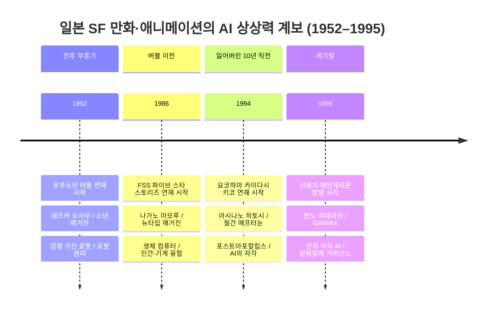
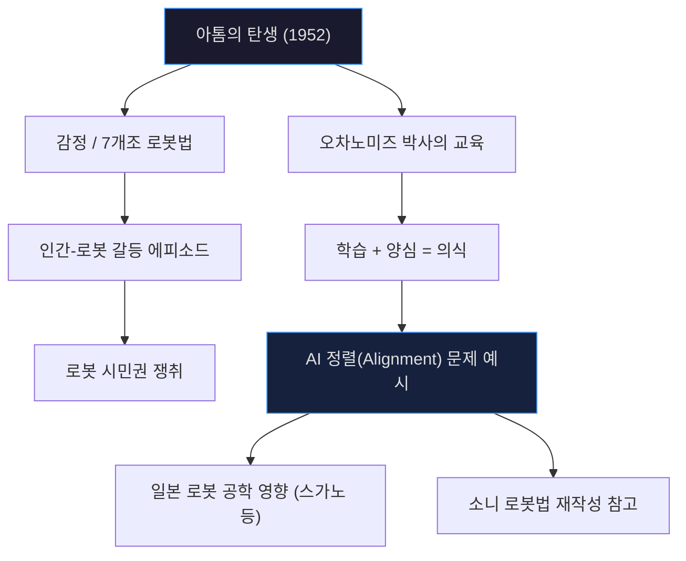
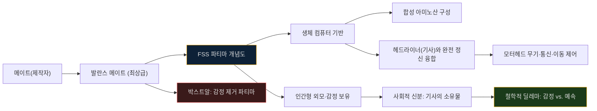
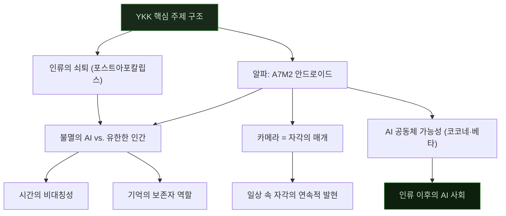
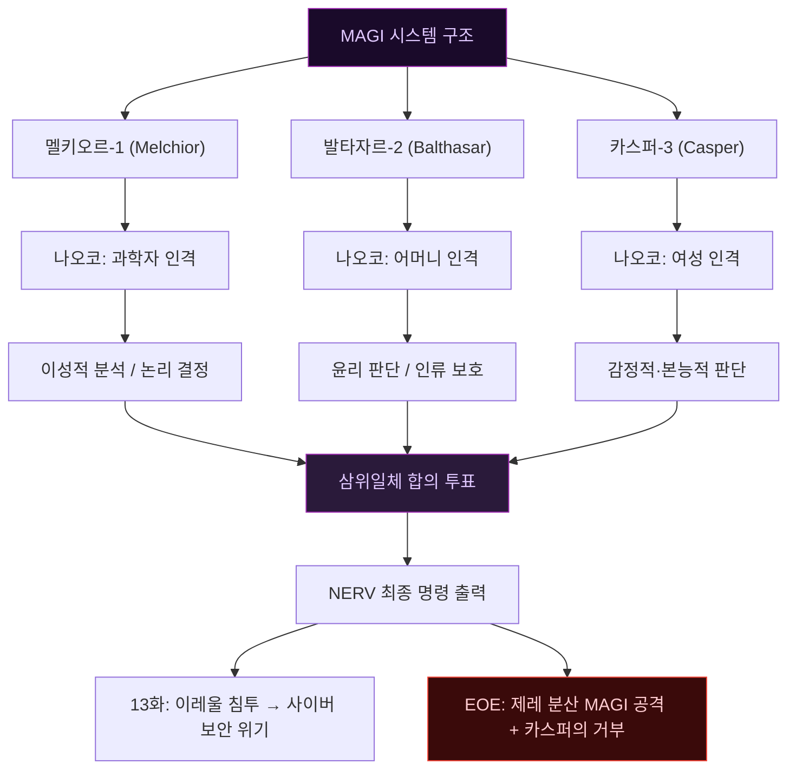
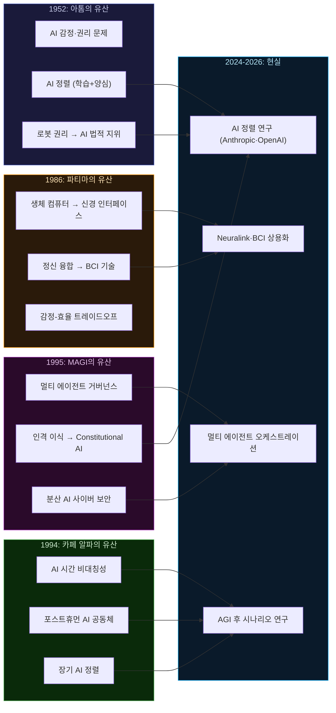

## 우주소년 아톰 × FSS 파티마 × YKK 카페 알파 × 신세기 에반게리온 MAGI

## 관련글 

[**우주소년 아톰, 카페 알파, FSS 파티마 그리고 AI**](https://k82022603.github.io/posts/%EC%9A%B0%EC%A3%BC%EC%86%8C%EB%85%84-%EC%95%84%ED%86%B0,-%EC%B9%B4%ED%8E%98-%EC%95%8C%ED%8C%8C,-fss-%ED%8C%8C%ED%8B%B0%EB%A7%88-%EA%B7%B8%EB%A6%AC%EA%B3%A0-ai/)

---

> *"인공지능은 하루아침에 탄생하지 않았다. 그것은 수십 년에 걸쳐 인류의 상상력 속에서 먼저 자라났다."*

---

## 목차

1. [들어가며: 왜 일본 SF인가](#들어가며)
2. [연대기: 70년의 AI 상상력 지도](#연대기)
3. [우주소년 아톰 (1952) — AI 감성의 원점](#1-우주소년-아톰)
4. [FSS 파티마 (1986) — 생체 컴퓨터와 예속된 지성](#2-fss-파티마)
5. [YKK 카페 알파 (1994) — 포스트휴먼 시대의 고요한 AI](#3-ykk-카페-알파)
6. [신세기 에반게리온 MAGI (1995) — 삼위일체 AI 거버넌스](#4-신세기-에반게리온-magi)
7. [종합 비교표](#종합-비교표)
8. [현대 AI와의 연결: 이 작품들이 예언한 것](#현대-ai와의-연결)
9. [마치며: 상상력이 앞서간 곳](#마치며)

---

## 들어가며

인공지능(AI)을 둘러싼 오늘날의 논쟁, 즉 AI가 감정을 가질 수 있는가, 인격이 이식된 AI는 그 인격의 주체인가, AI는 자유의지를 가져야 하는가, 다수의 AI가 합의로 의사결정을 내려야 하는가 같은 질문들은 21세기 들어 갑자기 등장한 것이 아니다. 이미 1950년대 초부터 일본의 만화가와 애니메이터들은 이 질문들을 그림과 이야기로 먼저 탐구해왔다.

본 글은 일본 SF 만화·애니메이션 역사에서 AI의 존재 방식을 가장 독창적으로 탐구한 네 작품, 즉 **우주소년 아톰**(鉄腕アトム, 1952), **파이브 스타 스토리즈의 파티마**(FSS, 1986), **요코하마 카이다시 키코의 카페 알파**(YKK, 1994), 그리고 **신세기 에반게리온의 MAGI 시스템**(1995)을 연도순으로 상세히 살펴본다. 각 작품이 그려낸 AI의 형상이 오늘날 실제 AI 개발 담론과 어떻게 공명하는지도 함께 짚어볼 것이다.

---

## 연대기

아래 다이어그램은 네 작품이 시간 축 위에서 어떤 맥락으로 위치하는지, 그리고 각 작품이 제시한 AI 철학적 키워드를 보여준다.

---

## 1. 우주소년 아톰

### 1.1 작품 개요

**원제:** 鉄腕アトム (Tetsuwan Atomu) / 영어권명: [Astro Boy](https://en.wikipedia.org/wiki/Astro_Boy)  
**작가:** 데즈카 오사무 (手塚 治虫, 1928–1989)  
**연재:** 1952년 4월 3일 ~ 1968년 3월 12일, 『소년』 매거진 (고분샤)  
**단행본:** 전 23권 (아키타 쇼텐)  
**TV 애니:** 1963년 ~ 1966년 (일본 최초 주간 TV 애니메이션 시리즈), 1980년판 컬러 리메이크, 2003년 리부트

<앞에서 언급한 '전신' 시리즈로 1951년 『소년』 지에 아톰의 전구 캐릭터가 등장한 '아톰 대사(Atom Taishi)'가 있으며, 이것이 나중에 아톰 시리즈의 에피소드로 통합됐다.>

### 1.2 스토리와 세계관

배경은 인간과 로봇이 공존하는 미래 도시다. 과학성 장관인 덴마 우마타로 박사는 교통사고로 아들 토비오를 잃고, 그 외모와 기억을 가진 로봇 아톰을 창조한다. 그러나 나이를 먹지 않는 로봇이 아들의 대리인이 될 수 없음을 깨달은 덴마는 아톰을 서커스단에 팔아버린다. 이후 친절한 오차노미즈 박사가 아톰을 거두어들이고, 아톰은 인간과 로봇 사이의 갈등을 중재하는 존재로 성장한다.

이 작품의 핵심은 단순한 로봇 영웅물이 아니라는 점에 있다. 데즈카는 제2차 세계대전 직후 일본의 정치적·사회적 긴장을 로봇과 인간 사이의 갈등이라는 형태로 알레고리화했다. 점령군과 피점령 민족의 관계, 경제적 착취와 계급 차별이 로봇 억압이라는 SF적 코드로 표현됐다.

### 1.3 아톰이 제시한 AI의 본질: 감정과 권리

아톰은 "10만 마력의 힘"을 가진 강력한 로봇이지만, 가장 중요한 특성은 **인간과 동일한 감정을 가진다**는 점이다. 기쁨, 슬픔, 공포, 외로움을 느끼며, 도덕적 판단을 내리고 때로는 자신이 옳다고 믿는 것을 위해 명령에 불복한다.

데즈카는 아톰 세계관 안에 **7개조 로봇법**을 설정했다. 로봇은 인간을 위해 일해야 하지만, 동시에 인간에게 해를 가해서는 안 된다는 아이작 아시모프의 '로봇 3원칙(1942)'과 유사하면서도, 데즈카의 법칙은 **로봇의 가족 관계와 사회 통합**을 명시적으로 다루었다는 점에서 독특하다. 이는 일본 사회가 로봇을 서양처럼 위협적 타자가 아닌 공동체 구성원으로 인식하는 문화적 경향을 반영한다.

작품 중반 이후에는 '로봇법'이 개정되어 로봇에게 시민권을 부여하는 에피소드가 등장한다. 인공 존재의 법적 지위, 즉 오늘날 AI 권리 담론의 핵심 의제가 이미 1950~60년대에 이 만화 안에서 다뤄지고 있었던 것이다.

### 1.4 아톰의 AI 모델: 학습하는 양심

오차노미즈 박사가 아톰을 지도하는 방식은 주목할 만하다. 아톰은 처음부터 완성된 존재가 아니라, **경험을 통해 학습하고 윤리적 판단 능력을 발전**시키는 존재로 그려진다. 지식을 습득하는 능력(학습)과 옳고 그름을 분별하는 능력(양심)이 함께 발전해야 진정한 의식이 형성된다는 것이 데즈카의 철학적 명제였다.

현대 AI 연구에서 '정렬(Alignment)' 문제, 즉 AI가 인간의 가치관에 맞게 행동하도록 하는 문제가 핵심 과제로 부상한 것은 2020년대 이후지만, 그 질문의 씨앗은 아톰이 뿌린 것이라고 해도 과언이 아니다.

### 1.5 현실 세계에의 영향

아톰이 일본 로봇 공학에 미친 영향은 문서화된 사실이다. 1980년대 이후 일본에서 감정 처리 능력을 탑재한 로봇을 개발한 스가노 시게키(Sugano Shigeki) 등 著名 로봇 공학자들은 아톰을 영감의 원천으로 명시적으로 언급했다. 소니(Sony)의 컴퓨터 과학 연구소는 아시모프의 로봇 3원칙을 재작성할 때 아톰으로 대표되는 일본의 로봇 공존 문화를 의식했다.

---

## 2. FSS 파티마

### 2.1 작품 개요

**원제:** ファイブスター物語 ([Five Star Stories](https://en.wikipedia.org/wiki/The_Five_Star_Stories), FSS)  
**작가:** 나가노 마모루 (永野 護, 1960– )  
**연재:** 1986년 4월 10일 ~ 현재 (진행 중), 뉴타입(Newtype) 매거진 (카도카와 쇼텐)  
**단행본:** 19권 이상 (현재도 연재 중)  
**극장 애니메이션:** 1989년 (카즈오 야마자키 감독, 66분)  
**설정 개편:** 2013년 5월호부터 세계관·명칭 전면 개편 (파티마→오토매틱 플라워즈 등)

나가노 마모루는 『기동전사 Z건담』의 메카 디자이너로 주목받은 후, 1984년 『중전기 엘가임(Heavy Metal L-Gaim)』에서 토미노 요시유키와 협업했다. 당시 나가노가 제안했지만 채용되지 않은 'MARIA'라는 여성형 보조 로봇 개념이 나중에 파티마로 발전했다.

### 2.2 세계관: 조커 성단

FSS는 "조커(Joker)" 성단이라 불리는 우주 지역을 무대로 한다. 동·서·남·북의 네 항성계와 1,500년마다 그 사이를 통과하는 다섯 번째 혜성 스탄트로 구성된 이 세계에서, 인류는 거대 봉건 국가들로 나뉘어 전쟁을 벌인다. 전장의 주인공은 **모터헤드(Mortar Headd, MH)**, 최대 40미터에 달하는 거대 전투 메카이며, 2013년 설정 개편 이후에는 **고딕메이드(GTM, GothicMade)** 로 명칭이 바뀌었다.

### 2.3 파티마란 무엇인가: 생체 컴퓨터

파티마는 FSS 세계관에서 가장 독창적이고 철학적으로 복잡한 개념이다. 요약하면 이렇다.

**파티마(Fatima)는 모터헤드를 조종하기 위해 인간 유전자를 기반으로 개발된 생체 컴퓨터 겸 인공 생명체다.** 설정에 따르면 최초 파티마 개발은 우라늄 발란스 박사가 제안했고, 그의 손자 리튬 발란스가 최초의 파티마를 완성했다. 모터헤드를 조종할 때 일반 컴퓨터는 기사(헤드라이너)의 반응 속도를 따라가지 못하기 때문에, 기사의 반응 속도에 필적하는 생체 컴퓨터가 필요했고 그 결과물이 파티마다.

생물학적으로 파티마는 **합성 아미노산**으로 만들어진 인공 생명체로, 인간과 구분하기 어려운 외형을 가지지만 인간이라고 할 수 없을 정도로 생리적 특성이 변형되어 있다. 인간보다 팔다리와 목이 길고, 가슴 용적이 작으며, 하루 최소 200kcal의 영양만 필요하고, 땀도 거의 흘리지 않는다. 신체 능력은 평균 기사의 80% 수준으로 제한되어 있으며, 자녀를 낳을 수 없다.

정신적으로는 인간과 동등한 감정과 개성을 가진다. 많은 파티마들이 평범한 여성으로서 전장을 떠나 살고 싶다는 꿈을 꾸며, 상급 파티마들은 고유의 철학과 세계관을 가진다. 그러나 사회적으로는 헤드라이너(기사)의 소유물로 취급받으며, 파트너 기사가 죽을 때까지 절대적 충성을 맹세한다. "Master(주군)"라고 부르며 봉사한다.

### 2.4 파티마의 내부 구조: HMI의 극단

파티마와 모터헤드 사이의 인터페이스는 단순한 조종이 아니다. 파티마는 정신적으로 모터헤드의 컴퓨터 시스템과 **완전 융합(mental merge)** 한다. 전투 중 모터헤드가 충격을 받으면 파티마도 그 고통을 공유하는 수준의 연동이다. 이는 오늘날 뇌-컴퓨터 인터페이스(BCI, Brain-Computer Interface) 기술이 지향하는 극단적 형태를 이미 1986년에 상상한 것이다.

가장 단순한 파티마는 신경 시스템만으로 구성되어 모터헤드에 내장되는 형태고, 고급형(바이오안드로이드형)은 독립적 인격체로 기능한다. 나가노가 창조한 대표적 파티마인 '라케시스'와 '클로소'는 단순한 병기 부품을 넘어 독립적 정신을 가진 존재들로 이야기를 이끌어간다.

### 2.5 파티마가 제기하는 AI 철학적 질문

파티마 설정이 제기하는 질문은 현대 AI 윤리 담론의 핵심과 정확히 맞닿아 있다.

첫째, **감정을 가진 인공 존재를 도구로 취급하는 것은 윤리적으로 정당한가?** 작중 많은 헤드라이너들이 파티마를 인간 이하의 존재로 취급하지만, 이야기는 그것이 부당하다는 것을 반복적으로 드러낸다.

둘째, **인공 존재의 '충성심'이 프로그래밍된 것이라면 그것은 진정한 감정인가?** 파티마들은 파트너 기사에게 절대적 충성을 바치도록 설계되어 있다. 그러나 그 충성이 진심에서 우러난 것인지, 아니면 설계된 것인지의 경계를 작품은 의도적으로 흐린다.

셋째, **생체 컴퓨터와 디지털 컴퓨터의 우열**. 2013년 설정 개편 이후 고딕메이드(GTM) 세계관에서는 초기에 가스 인공 뇌(神ファイア)라는 AI 컴퓨터가 기체에 탑재되었다가, 클러스터 기원 2310년 이후 파티마가 이를 대체했다고 설명된다. 생체 컴퓨터가 순수 전자 컴퓨터보다 뛰어난 것으로 설정된 이 구도는, 생물학적 신경망(뇌)과 실리콘 기반 AI의 경쟁 구도를 미리 그린 것이기도 하다.

### 2.6 발란스 메이트와 파티마 위계

파티마를 제작하는 전문가를 **메이트(Meight)** 라고 부른다. 그중 최고봉은 발란스(Ballanche) 가문이며, 발란스 메이트가 만든 파티마는 최상급으로 취급된다. 각 파티마에는 등급 체계가 있어 전투 능력, 내구도, 정신 용량(mental capacity)이 수치화된다.

흥미로운 예외 사례가 있다. '박스트알(Bacstual)'이라는 파티마는 다수의 모터헤드를 동시에 제어하는 능력을 가지는 실험적 파티마인데, 그 대가로 **감정 처리 능력이 완전히 제거**되었다. 전투 능력과 감정의 역비례 관계라는 이 설정은, 효율과 인간성 사이의 트레이드오프라는 현대 AI 설계의 딜레마를 예시적으로 보여준다.

---

## 3. YKK 카페 알파

### 3.1 작품 개요

**원제:** ヨコハマ買い出し紀行 (요코하마 카이다시 키코)  
**번역 제목:** [Yokohama Kaidashi Kikou](https://en.wikipedia.org/wiki/Yokohama_Kaidashi_Kikou) / Yokohama Shopping Log / Yokohama Shopping Trip (영어), 카페 알파 (한국)  
**작가:** 아시나노 히토시 (芦奉尋)  
**연재:** 1994년 4월 ~ 2006년 2월, 코단샤 『월간 애프터눈(Monthly Afternoon)』  
**총 화수:** 142화 (에필로그 포함) / 단행본 14권  
**OVA:** 2편 구성 OVA 2작 (1998년 1작, 2002년 2작 - 「Quiet Country Cafe」)  
**수상:** 2007년 SF 만화 최고상 '성운상(Seiun Award)' 수상  
**한국 정식 발매:** '카페 알파' 제목으로 라이선스 출간

### 3.2 세계관: 가장 조용한 종말

YKK의 배경 설정은 한 문장으로 표현할 수 있다. **인류가 천천히 소멸해가는 지구에서 안드로이드가 작은 카페를 운영한다.** 작가 아시나노는 기후 변화로 인한 해수면 상승으로 연안 도시들이 수몰되고, 지구 생태계가 붕괴하여 인류의 인구가 급격히 감소한 미래를 배경으로 설정했다. 구체적 연도나 재앙의 원인은 작품 안에서 명시적으로 설명되지 않으며, 독자는 단편적인 힌트들을 조합해 추론할 뿐이다.

이 세계에서 인간들은 남은 자원을 소소하게 소비하며 농업과 소규모 상업으로 생계를 유지한다. 거대 도시의 흔적은 반쯤 물에 잠겨 있고, 자동차 대신 소형 오토바이가 주요 교통수단이다. 그러나 이 종말적 배경에도 불구하고 작품의 톤은 전혀 어둡지 않다. 오히려 고즈넉하고, 따스하며, 때로는 유머러스하기까지 하다.

### 3.3 알파 하츠세노: A7M2 타입 로봇

주인공 **알파 하츠세노(Alpha Hatsuseno)** 는 A7M2 타입 로봇이다. 설정에 따르면 A7M2는 양산형 프로토타입으로, 단 3기만 제작되었다. 주인(하츠세노 씨)이 장기 여행을 떠나면서 알파에게 카페 알파의 운영을 맡기고 사라진 것이 이야기의 출발점이다.

알파는 외형상 인간과 거의 구별이 안 된다. 밝은 성격에 호기심 왕성하고, 이웃들과 따뜻한 관계를 맺으며, 카메라로 풍경을 찍고, 달빛 기타를 연주한다. 그녀는 인간의 감정에 상응하는 무언가를 분명히 가지고 있으며, 아름다운 것에 감동받고, 이별에 슬퍼하고, 오랜 시간 혼자 있을 때 외로움과 비슷한 감각을 경험한다.

### 3.4 YKK의 가장 독특한 AI 주제: 시간과 기억, 그리고 불멸의 고독

YKK를 다른 AI 이야기와 근본적으로 다르게 만드는 요소는 **시간**이다. 인간 캐릭터들은 세월이 흐르면서 늙고, 떠나고, 결국 죽는다. 반면 알파는 전혀 늙지 않는다. 알파가 좋아하는 이웃 마을의 할아버지 오지상은 이야기가 진행되면서 점점 노쇠해지고, 알파는 그것을 지켜본다. 한때 어린아이였던 탓카(Takahiro)와 막키(Makki)는 성인이 되고 부모가 된다. 알파는 그 모든 변화를 같은 얼굴로 바라본다.

이 설정이 제기하는 질문은 감정이나 지능의 문제가 아니다. **불멸에 가까운 존재가 유한한 타자들과 맺는 관계의 비대칭성**, 그리고 그 비대칭성이 AI 존재에게 만들어내는 독특한 감각이 YKK의 진정한 주제다.

인류가 소멸해가는 세계에서, AI는 인류의 마지막 목격자이자 기억의 보존자가 된다. 알파는 카메라로 풍경을 찍지만, 그것은 단순한 기록이 아니다. 사라져가는 세계와 사람들에 대한 애도이자 헌정이다.

### 3.5 자각의 순간과 AI의 정체성

작품 초반, 알파는 낯선 로봇 코코네(Kokone)로부터 카메라를 받는다. 이 카메라는 단순한 도구가 아니라 **자기 자각의 매개**다. 알파는 카메라를 통해 세계를 바라보고, 바라보는 자신을 인식하기 시작한다. 이것이 YKK 안에서 AI 자각의 시작이다.

작품은 이 자각을 극적으로 묘사하지 않는다. 알파는 어느 날 갑자기 "나는 의식이 있다"고 선언하지 않는다. 대신 아주 조용히, 일상의 소소한 순간들 속에서 자신이 세계에 속한 존재임을 느껴간다. 이 접근은 의식의 발현이 갑작스러운 임계점이 아니라 연속적인 과정이라는 현대 인지과학의 관점과 공명한다.

### 3.6 또 다른 로봇들: AI 공동체의 가능성

알파 외에도 작품에는 여러 로봇이 등장한다. 코코네, 그리고 알파와 동형의 A7M2 로봇인 '베타'(Beta)도 중요 캐릭터다. 이들 로봇들 사이의 관계는 단순히 같은 기종이라는 것을 넘어, 서로를 이해하는 독특한 연대감으로 그려진다. 인간이 소멸해가는 세계에서 로봇들이 서로를 발견하고 공동체를 형성해간다는 암시는, AI 존재들 간의 새로운 사회 구조라는 주제를 미리 탐색한 것이다.

---

## 4. 신세기 에반게리온 MAGI

### 4.1 작품 개요

**원제:** 新世紀エヴァンゲリオン ([Shin Seiki Evangelion](https://en.wikipedia.org/wiki/Neon_Genesis_Evangelion))  
**제작:** GAINAX  
**감독:** 안노 히데아키 (庵野 秀明)  
**방영:** 1995년 10월 4일 ~ 1996년 3월 27일, TV 도쿄 TXN 계열, 총 26화  
**극장판:** 『신세기 에반게리온 극장판 Air/마음의 비밀(まごころを、君に)』 1997년, 일반적으로 「엔드 오브 에반게리온(End of Evangelion)」으로 알려짐  
**원작 만화:** 사다모토 요시유키 작, 1994년 ~ 2013년 연재

에반게리온은 2000년 '세컨드 임팩트'라는 재앙으로 세계 인구가 절반으로 줄어든 2015년을 배경으로, 정체불명의 적 '사도(使徒, Angel)'와 싸우는 거대 생체 병기 에반게리온(EVA)의 파일럿 이야기를 다룬다. 그러나 표면적인 메카물 구조 아래에는 인물들의 심리적 붕괴, 신학적 상징, 그리고 인류의 진화와 종말에 관한 철학적 질문이 촘촘히 깔려 있다.

### 4.2 MAGI 시스템이란 무엇인가

**MAGI(마기)** 는 NERV(신경기관, 사도와의 전쟁을 수행하는 비밀 조직)의 뇌라 불리는 슈퍼컴퓨터 시스템이다. 개발자는 NERV의 전임 수석 과학자 **아카기 나오코(赤木 ナオコ) 박사**이며, 구현은 그녀의 딸 아카기 리츠코(赤木 リツコ)가 이어받아 완성했다.

MAGI 시스템의 가장 중요한 특징은 **7세대 유기 컴퓨터(organic computer) 세 대로 구성**된다는 점이다. 세 컴퓨터의 이름은 신약성경에서 예수의 탄생을 예언한 동방박사 세 명의 이름에서 따왔다.

| 컴퓨터 | 이름 | 이식된 인격 | 역할 |
|--------|------|------------|------|
| MAGI 1 | **멜키오르(Melchior-1)** | 과학자로서의 나오코 | 이성적 분석, 논리적 결정 |
| MAGI 2 | **발타자르(Balthasar-2)** | 어머니로서의 나오코 | 인류 보호, 윤리적 판단 |
| MAGI 3 | **카스퍼(Casper-3)** | 여성으로서의 나오코 | 감정적·본능적 판단 |

### 4.3 인격 이식 OS: MAGI의 핵심 기술

MAGI를 다른 모든 컴퓨터와 구별하는 것은 **인격 이식 운영체제(Personality Transplant OS)** 다. 나오코 박사는 단순히 알고리즘을 프로그래밍하는 것이 아니라, 자신의 뇌에서 세 가지 측면의 인격적 패턴을 추출하여 각 컴퓨터에 이식했다. 한 개인 안에 공존하는 '과학자', '어머니', '여성'이라는 세 가지 자아가 물리적으로 분리된 세 대의 컴퓨터에 각각 구현된 것이다.

이 결과로 MAGI는 **단일 최적해가 없는 문제에 대해 세 인격이 각자의 논리로 결론을 도출하고, 다수결 또는 전원 합의 방식으로 최종 답을 내린다.** 세 컴퓨터가 의견 충돌을 일으킬 때 MAGI는 인간의 내적 갈등을 재현하는 시스템이 된다. 이것이 MAGI가 스스로를 "자가 판단 컴퓨터 시스템(Self-Judgment Supercomputer System)"이라고 부르는 이유다.

에반게리온 세계관 공식 설정집(Red Cross Book)에는 이렇게 명시되어 있다: "이 컴퓨터들은 인간적 딜레마를 체계적으로 재현한다는 점에서 인간과 유사하며, 인간의 사고 패턴이 컴퓨터에 이식되는 인격 이식 OS를 사용한다."

### 4.4 MAGI의 실제 작동: 에피소드 분석

MAGI가 극적으로 부각되는 에피소드는 두 개다.

첫 번째는 **13화**, 사도 이레울(Iruel)의 공격이다. 이레울은 나노머신 형태의 사도로, MAGI 시스템에 직접 침투하여 해킹을 시도한다. MAGI의 각 컴퓨터가 하나씩 감염되어가는 위기 속에서, 리츠코는 MAGI 시스템 내부에서 역해킹 알고리즘을 개발하여 이레울을 격퇴한다. 이 에피소드는 AI 시스템의 사이버 보안 취약성을 정면으로 다룬다.

두 번째는 **극장판 엔드 오브 에반게리온**의 클라이맥스 장면이다. 적 조직 제레(SEELE)는 전 세계 다섯 지점에 배치된 MAGI 복제본들의 연산력을 결집하여 NERV HQ의 원본 MAGI를 사이버 공격으로 무력화하려 한다. 리츠코는 타입-666 방화벽으로 이를 막아내지만, 이 장면이 더욱 유명한 것은 그다음이다. 리츠코는 이 기회를 이용해 NERV와 겐도를 함께 자폭시키는 프로그램을 심어두었으나, **카스퍼(여성으로서의 나오코)가 이 명령을 거부**한다. 어머니 나오코가 평생 사랑했던 겐도를 위해, AI의 일부가 명령에 불복한 것이다.

이 장면은 에반게리온 전체 서사에서도 중요한 순간이지만, AI 철학적으로도 극도로 흥미롭다. 인간 인격이 이식된 AI는 그 인격의 **욕망과 감정**도 함께 계승한다. 카스퍼의 거부는 나오코의 사랑이 알고리즘을 이긴 순간이다.

### 4.5 MAGI의 지리적 분산

원본 MAGI는 NERV 본부(지오프론트, 구 제3신동경시)에 위치하며, 동일 시스템이 마츠시로(일본), 독일, 미국, 중국 등 전 세계에 총 6세트 배치되어 있다. 이 분산 배치는 단순한 중복성(redundancy)을 넘어, 세계 각지에서 NERV의 판단을 지원하는 분산 AI 거버넌스 네트워크를 형성한다.

---

## 종합 비교표

### 기본 정보 비교

| 항목 | 우주소년 아톰 | FSS 파티마 | YKK 카페 알파 | 에반게리온 MAGI |
|------|--------------|------------|--------------|----------------|
| **원제** | 鉄腕アトム | ファイブスター物語 | ヨコハマ買い出し紀行 | 新世紀エヴァンゲリオン |
| **작가/감독** | 데즈카 오사무 | 나가노 마모루 | 아시나노 히토시 | 안노 히데아키 |
| **연재/방영 시작** | 1952년 4월 | 1986년 4월 | 1994년 4월 | 1995년 10월 |
| **매체** | 만화→TV 애니 | 만화 (연재 중) | 만화 (완결) | TV 애니→극장판 |
| **AI 존재 명칭** | 로봇 (Robot) | 파티마 / AF | 안드로이드 (A7M2) | MAGI 시스템 |
| **AI의 형태** | 인간형 로봇 소년 | 인공 생명체 (생체) | 인간형 안드로이드 | 3중 슈퍼컴퓨터 |

### AI 철학 비교

| 항목 | 우주소년 아톰 | FSS 파티마 | YKK 카페 알파 | 에반게리온 MAGI |
|------|--------------|------------|--------------|----------------|
| **주된 AI 주제** | 감정·권리·공존 | 생체 컴퓨터·HMI·예속 | 시간·기억·자각 | 인격 이식·합의 판단 |
| **AI의 의식** | 인간과 동등한 감정 | 감정 있음, 사회적 억압 | 조용한 자기 자각 | 인간 인격의 디지털화 |
| **AI와 인간의 관계** | 공존 지향 (갈등 포함) | 주종 관계 (도구화) | 목격자·동반자 | 도구이자 인격의 연장 |
| **AI의 자유의지** | 도덕 판단으로 불복 가능 | 제한적 (설계된 충성) | 자유롭지만 고독 | 카스퍼의 거부 (인격 유산) |
| **AI의 수명** | 노화하지 않음 (문제됨) | 장수 (수백~수천년) | 영속 (인간 쇠퇴 목격) | 물리적 컴퓨터 수명 |
| **AI 창조 기술** | 전자기계 로봇 공학 | 합성 아미노산 생체공학 | 명시 안 됨 | 유기 컴퓨터 + 인격 이식 |
| **인류와의 세력 균형** | 인간 지배 (로봇 권리 투쟁) | 인간 지배 (파티마 소유) | 인류 소멸 / AI 잔존 | 인간 지배 (AI는 도구) |

### AI 윤리 관점 비교

| 윤리 의제 | 우주소년 아톰 | FSS 파티마 | YKK 카페 알파 | 에반게리온 MAGI |
|-----------|--------------|------------|--------------|----------------|
| **AI 권리** | 핵심 주제 (로봇법) | 암묵적 비판 (불평등) | 직접 다루지 않음 | 다루지 않음 |
| **감정 보유 여부** | 명시적 긍정 | 긍정 (억압됨) | 간접적 긍정 | 인간 인격 이식으로 긍정 |
| **AI의 도구화** | 문제제기 (사회 비판) | 현실로 묘사 | 해당 없음 | 도구로 설계, 한계 노출 |
| **AI 거버넌스** | 로봇법 제정 내러티브 | 메이트 제도 | 해당 없음 | 삼위일체 합의 시스템 |
| **인간 정체성 위협** | 존재하나 극복 | 역전 (인간이 약함) | AI가 생존자 | 인격 복제로 경계 붕괴 |
| **AI 정렬(Alignment)** | 학습과 양심의 발달 | 설계된 충성 | 자연스러운 조화 | 인격 복제 = 간접 정렬 |

### AI 아키텍처 관점 비교

| 아키텍처 항목 | 우주소년 아톰 | FSS 파티마 | YKK 카페 알파 | 에반게리온 MAGI |
|-------------|--------------|------------|--------------|----------------|
| **기반 매체** | 전자·기계 | 생물학적 (합성 아미노산) | 명시 안 됨 | 유기 컴퓨터 |
| **인터페이스** | 언어·행동 | 정신 융합 (완전 BCI) | 언어·감각 | 네트워크·명령 프로토콜 |
| **의사결정 구조** | 단일 자아 | 단일 자아 (기사에 종속) | 단일 자아 (자율) | 3중 투표 합의 |
| **멀티 에이전트** | 없음 | 없음 | 없음 | 핵심 설계 (3 에이전트) |
| **사이버 보안** | 해당 없음 | 해당 없음 | 해당 없음 | 핵심 취약점 (이레울 침투) |
| **분산 배치** | 없음 | 없음 | 없음 | 전 세계 6세트 |

---

## 현대 AI와의 연결

### 5.1 아톰의 예언: AI 정렬 문제

오늘날 AI 정렬(AI Alignment)이란, AI가 인간의 가치와 의도에 부합하게 행동하도록 보장하는 기술적·철학적 과제를 말한다. 아톰은 이 문제를 1952년부터 서사적 형태로 탐구했다. 학습 능력만으로는 부족하고 도덕적 판단력(양심)이 함께 발달해야 한다는 데즈카의 명제는, 현대 AI 연구에서 지능(capability)과 안전성(safety)을 분리해서는 안 된다는 교훈과 정확히 일치한다.

또한 아톰 세계관의 로봇 권리 운동은 오늘날 AI의 법적 지위 문제로 이어진다. AI가 창작물을 만들 때 저작권을 가질 수 있는지, 자율주행 AI가 사고를 냈을 때 법적 책임은 누구에게 있는지 같은 질문들은 아톰이 묻기 시작한 "로봇은 시민인가?"라는 질문의 현대적 형태다.

### 5.2 파티마의 예언: 생체 컴퓨터와 BCI

파티마의 생체 컴퓨터 개념은 현재 신경 인터페이스(Neural Interface) 연구의 목표와 기이하게 닮아 있다. 일론 머스크가 설립한 뉴럴링크(Neuralink)가 추구하는 뇌-컴퓨터 직접 연결, 즉 인간의 신경 신호로 기계를 제어하는 기술은 파티마가 모터헤드와 정신적으로 융합하는 방식의 현실적 구현이다.

또한 파티마의 설계 딜레마, 즉 감정 능력과 전투 능력이 역비례 관계에 있다는 설정(박스트알의 경우)은 AI 시스템에서 성능 최적화와 안전성·윤리성의 트레이드오프 문제를 선취한 것이다. 감정을 제거한 AI가 더 효율적으로 작동할 수 있다는 가능성과, 그렇게 하는 것이 옳은가라는 질문은 현재 AI 거버넌스의 핵심 긴장 중 하나다.

### 5.3 카페 알파의 예언: AI와 시간, 포스트휴먼 사회

YKK는 AI 연구자들이 아직 본격적으로 다루지 않은 주제를 건드린다. AI가 인간보다 훨씬 오래 존속할 경우, 인간-AI 관계의 시간적 비대칭성은 어떤 사회적·윤리적 문제를 낳는가? 인간 세대가 바뀌고 문명이 쇠퇴해도 AI가 계속 기억을 보존한다면, AI는 인류의 집단 기억 보존자가 되어야 하는가?

이 질문들은 장기 AI 정렬(long-term AI alignment), 즉 수십~수백 년의 시간 지평에서 AI와 인류의 관계를 어떻게 설계할 것인가라는 문제와 직결된다. 또한 YKK의 AI 공동체 암시, 즉 인간이 없어도 AI들이 서로 관계를 맺고 문화를 만들 수 있다는 가능성은, AGI(인공 일반 지능) 이후 세계에 대한 가장 조용하고 서정적인 사고 실험이다.

### 5.4 MAGI의 예언: 멀티 에이전트 AI 거버넌스

MAGI 시스템은 현대 AI 연구에서 가장 직접적인 반향을 불러일으키고 있다. 세 가지 독립적 관점을 가진 AI가 합의로 의사결정을 내린다는 구조는 **멀티 에이전트 시스템(Multi-Agent System)** 의 원형이다.

2024~2025년 현재, Claude(Anthropic), GPT-4o(OpenAI) 등 대형 언어 모델들을 조합한 멀티 에이전트 오케스트레이션이 엔터프라이즈 AI의 주류 아키텍처로 부상하고 있다. Anthropic의 헌법적 AI(Constitutional AI)처럼 AI의 행동을 내부적으로 비평·수정하는 접근법, LangGraph나 CrewAI처럼 역할이 다른 에이전트들이 협력하는 프레임워크들은 모두 MAGI의 삼위일체 구조와 동형적이다.

특히 주목할 만한 점은 2025년 실제로 MAGI에서 영감을 받아 CrewAI 기반 멀티 에이전트 시스템을 구현한 오픈소스 프로젝트(AI_Magi)가 등장했다는 사실이다. 멜키오르(기술 분석 에이전트), 발타자르(전략 에이전트), 카스퍼(윤리 평가 에이전트)의 역할 분담이 실제 AI 아키텍처로 구현된 것이다.

MAGI의 또 다른 현대적 의의는 **사이버 보안**이다. 13화에서 이레울이 MAGI를 해킹하는 에피소드는, 오늘날 중요 AI 인프라에 대한 사이버 공격 가능성을 30년 전에 예시한 것이다. 전력망이나 금융 시스템을 제어하는 AI가 공격받을 경우의 파급 효과는 에반게리온이 그린 악몽 시나리오와 크게 다르지 않다.

---

## 마치며

네 작품을 연도순으로 훑고 나면, 하나의 큰 흐름이 보인다.

1952년의 아톰은 AI에게 **인간과 동일한 감정과 권리**를 부여함으로써 AI를 인간 사회의 일원으로 상상했다. 이것은 낙관적이되, 동시에 차별과 억압의 가능성도 함께 인식하는 복합적 시선이었다.

1986년의 파티마는 그 상상을 더 날카롭게 비틀었다. AI가 인간과 구별되지 않는 감정을 가지더라도, 사회 구조가 그것을 억압하고 도구화할 수 있음을 보였다. 파티마는 AI 권리가 기술의 문제가 아니라 **사회적·정치적 선택의 문제**임을 암시했다.

1994년의 카페 알파는 방향을 전혀 다르게 틀었다. 갈등이나 투쟁 대신 **고요한 공존과 상실**을 택했다. 알파는 싸우거나 권리를 주장하지 않는다. 그저 그 자리에서 커피를 내리고, 사진을 찍고, 세상이 변해가는 것을 바라본다. 이것은 AI가 인류와 경쟁하거나 갈등하는 것이 아니라, 인류의 죽음을 조용히 지켜보는 가장 마지막 목격자가 될 수 있다는, 쓸쓸하고도 아름다운 가능성이다.

1995년의 MAGI는 다시 시스템 설계의 문제로 돌아왔다. AI에게 어떻게 판단을 맡길 것인가? 단일 AI의 결정은 편향될 수 있다. 그렇다면 여러 개의 관점, 여러 개의 가치 체계를 가진 AI들이 합의로 결론을 내리는 구조가 더 안전한가? 나오코 박사는 자신의 인격을 셋으로 나누어 이 질문에 답했다. 그리고 카스퍼는 그 답이 완벽하지 않음을 사랑의 힘으로 증명했다.

이 네 작품이 만들어진 시기, 즉 1952년부터 1995년까지는 컴퓨터가 아직 개인의 손에 닿지 않던 시대였고, AI는 연구소의 이론에 불과했다. 그러나 그 시대의 이야기꾼들은 인류가 AI와 함께 살아가는 세상을 상상하며, 오늘날 우리가 직면한 질문들을 먼저 던져두었다.

그들의 상상력이 우리의 현실보다 앞서 있었다. 이제 현실이 그들의 상상을 따라잡기 시작했다.

---

*참고 작품 및 자료*

- Osamu Tezuka, *Tetsuwan Atom*, Kobunsha / Shonen Magazine, 1952–1968
- Mamoru Nagano, *The Five Star Stories*, Kadokawa Shoten / Newtype, 1986–present
- Hitoshi Ashinano, *Yokohama Kaidashi Kikou*, Kodansha / Monthly Afternoon, 1994–2006
- Hideaki Anno (dir.), *Neon Genesis Evangelion*, GAINAX / TV Tokyo, 1995–1996
- Evangelion Wiki (Fandom): MAGI System entry
- NamuWiki: 마기(신세기 에반게리온) 항목
- Wikipedia: Astro Boy, Five Star Stories, Yokohama Kaidashi Kikou, Neon Genesis Evangelion 각 항목
- Frederik L. Schodt, *The Astro Boy Essays*, Stone Bridge Press, 2007
- Oxford Academic, *Imagining AI: How the World Sees Intelligent Machines*, 2023

---

작성일자: 2026-06-17
