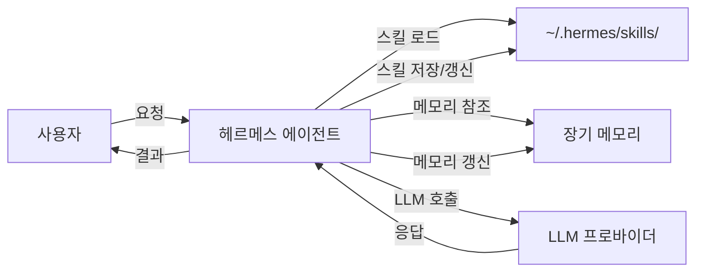
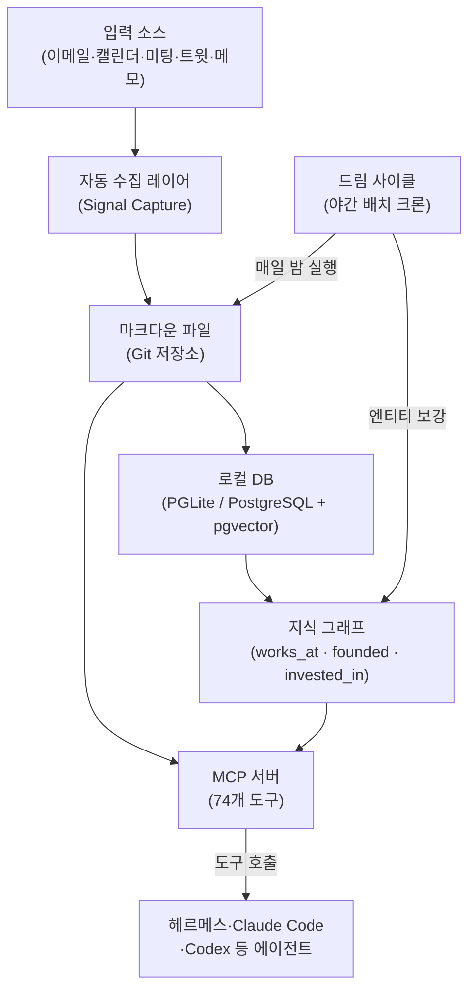
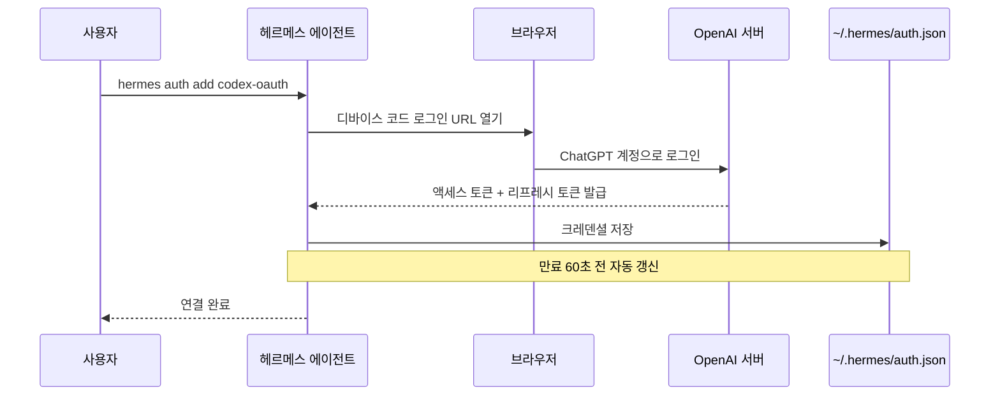
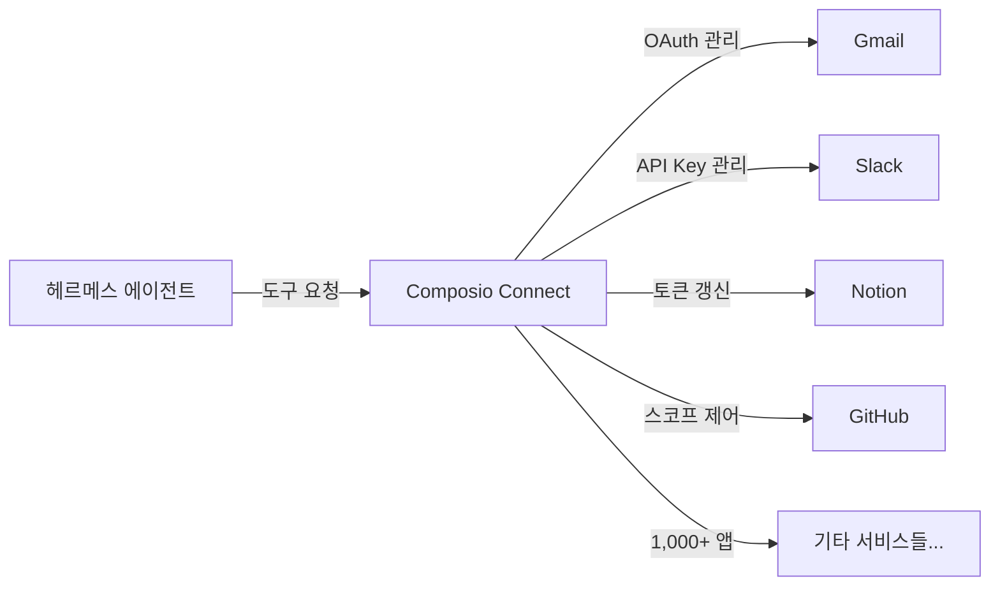
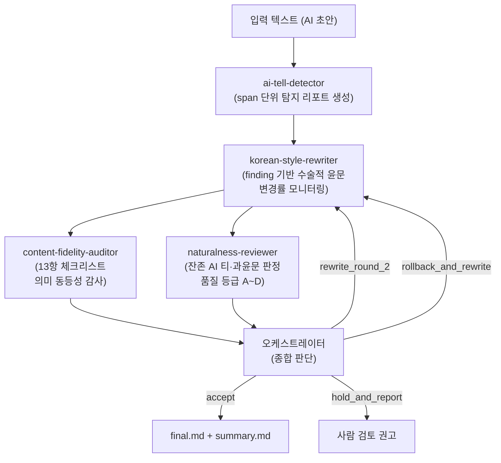
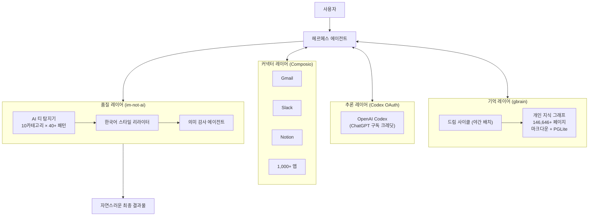

> [Threads 포스팅](https://www.threads.com/@takepage_/post/DZnBx3Ej7MF) 기반 분석 · 2026년 6월 17일 기준 최신 정보 검증 완료

>헤르메스 에이전트 전 이렇게 씁니다
>1. gbrain 커스텀해서 개인용으로 사용
>2. oauth로 codex 연결 (토큰 가성비 갑)
>3. composio로 커넥터 한번에 연결
>4. im-not-ai로 AI스러운 답변 차단
>

---

## 들어가며

Nous Research가 개발하고 오픈소스로 공개한 헤르메스 에이전트(Hermes Agent)는 "자라나는 에이전트(the agent that grows with you)"라는 설명처럼, 사용할수록 스스로 학습하고 스킬을 축적해가는 자율 AI 에이전트다. 터미널에서 실행되며 Telegram, Discord, Slack, WhatsApp, Signal 등 다양한 메시징 플랫폼을 단일 게이트웨이로 지원하고, OpenRouter, Nous Portal, OpenAI, Anthropic, DeepSeek 등 수십 개의 LLM 프로바이더를 자유롭게 전환할 수 있다.

이 글에서 소개할 스택은 그런 헤르메스 에이전트를 실전에서 훨씬 더 강력하게 만드는 네 가지 레이어의 조합이다.

```
① gbrain        → 장기 메모리 레이어 (에이전트의 두뇌)
② Codex OAuth   → LLM 추론 레이어 (비용 최적화)
③ Composio      → 커넥터 레이어 (외부 서비스 연결)
④ im-not-ai     → 품질 레이어 (AI 문체 제거)
```

각 레이어가 왜 필요하고, 어떻게 작동하며, 어떤 트레이드오프가 있는지 상세히 살펴본다.

---

## 헤르메스 에이전트 기본 이해

본론에 앞서 헤르메스 에이전트가 무엇인지 간략히 짚어두자.

헤르메스 에이전트는 단순한 챗봇 래퍼가 아니다. 복잡한 태스크를 완료하고 나면 그 과정에서 얻은 절차적 지식을 스킬(SKILL.md) 파일로 저장해두고, 다음에 비슷한 태스크가 들어오면 처음부터 다시 생각하지 않고 저장된 스킬을 불러와 훨씬 빠르고 정확하게 처리한다. 이 자기 개선 루프(Self-Improving Loop)가 헤르메스를 일반 AI 에이전트와 구분 짓는 핵심이다.

스킬은 `~/.hermes/skills/` 디렉터리에 저장되며, [agentskills.io](https://agentskills.io) 오픈 표준을 따르기 때문에 Claude Code, OpenClaw, Cursor 등 다른 호환 에이전트에서도 그대로 사용할 수 있다.



이 기반 위에 이제 네 가지 레이어를 순서대로 얹어간다.

---

## 첫 번째 레이어: gbrain — 에이전트의 장기 기억

### gbrain이란 무엇인가

gbrain은 Y Combinator의 사장 겸 CEO인 Garry Tan이 2026년 4월 5일 MIT 라이선스로 오픈소스 공개한 AI 에이전트용 개인 장기 메모리 시스템이다. 공개 후 24시간 만에 GitHub 스타 5,000개를 돌파하며 주목을 받았고, 현재 약 14,000개의 스타를 기록하고 있다.

Garry Tan 본인이 직접 사용하는 프로덕션 시스템으로, 그의 실제 gbrain에는 146,646페이지, 24,585명의 인물 정보, 5,339개의 기업 정보, 66개의 자율 크론 잡이 돌아가고 있다. 단순한 데모가 아니라 YC 사장이 실제 업무에서 매일 돌리는 인프라다.

### 왜 헤르메스 에이전트에 gbrain이 필요한가

헤르메스 에이전트에는 자체 메모리 시스템이 있지만, 그 메모리는 주로 에이전트가 수행한 태스크와 대화 기록, 그리고 사용자 프로파일에 초점을 맞춘다. 반면 gbrain은 훨씬 더 넓은 범위의 개인 지식을 구조화된 형태로 보존한다.

미팅 메모, 이메일, 트윗, 음성 통화, 아이디어 메모, 13년치 캘린더 데이터까지 — gbrain은 이 모든 정보를 마크다운 파일로 저장하고, PostgreSQL + pgvector 기반의 하이브리드 검색(벡터 검색 + BM25 키워드 검색 + RRF 융합)으로 빠르게 조회한다. 단순히 파일을 쌓아두는 게 아니라, 에이전트가 자는 동안 "드림 사이클(Dream Cycle)"이라는 야간 배치 작업이 돌면서 인물과 기업 정보를 자동으로 보강하고, 교차 참조를 만들고, 지식 그래프를 촘촘히 엮어간다.

그 결과는 단순 검색(Search)과 질적으로 다르다. 검색은 원본 페이지를 돌려주지만, gbrain은 합성(Synthesis), 그래프 탐색(Graph Traversal), 공백 분석(Gap Analysis)을 한 번에 수행해 답을 돌려준다.

### gbrain 아키텍처



핵심 설계 원칙은 두 가지다. 첫째로 마크다운 우선(Markdown-First) 방식으로, 모든 지식이 사람이 읽을 수 있는 마크다운 파일로 저장되고 Git으로 버전 관리된다. 둘째로 그래프 레이어의 분리로, LLM 호출 없이 순수 구조적 추론으로 지식 그래프가 자동 생성된다. 이 덕분에 그래프 추출에 추가 비용이 들지 않는다.

MCP 서버를 통해 74개의 도구가 노출되기 때문에, 헤르메스 에이전트가 `gbrain query "..."` 형태로 자신의 개인 두뇌에 질문을 던지는 것이 가능해진다. 앞서 말한 Threads 포스팅에서 "gbrain 커스텀해서 개인용으로 사용"한다는 것은 이 gbrain을 자신의 정보 베이스로 구성하고 헤르메스 에이전트에 연결해 장기 메모리로 활용한다는 뜻이다.

### gbrain 설치

공식 설치는 매우 간단하다. 헤르메스 에이전트 안에서 아래 명령을 실행하면 에이전트가 약 30분에 걸쳐 자동으로 리포를 클론하고, API 키를 요청하고, 43개의 스킬을 로드하고, 드림 사이클을 구성하고, 설치 검증까지 마친다.

```bash
# 헤르메스 에이전트 챗 안에서 실행
Retrieve and follow the instructions at:
https://raw.githubusercontent.com/garrytan/gbrain/master/INSTALL_FOR_AGENTS.md
```

Claude Code나 Codex에 메모리 레이어로만 붙이고 싶다면 더 간단하다.

```bash
gbrain init --pglite      # 2초 만에 로컬 브레인 초기화 (도커 불필요)
claude mcp add gbrain -- gbrain serve   # Claude Code에 연결
# 또는
codex mcp add gbrain      # Codex에 연결
```

---

## 두 번째 레이어: Codex OAuth — 비용 최적화 추론

### OpenAI Codex란 무엇인가

OpenAI Codex는 OpenAI가 제공하는 코딩 특화 AI 에이전트로, ChatGPT 구독(Plus, Pro)에 포함된 형태로 접근할 수 있다. 헤르메스 에이전트는 이 Codex를 두 가지 방식으로 연결할 수 있다.

하나는 OpenAI API를 직접 사용하는 방식으로, `OPENAI_API_KEY`를 `~/.hermes/.env`에 설정하면 된다. 다른 하나는 OAuth(디바이스 코드 플로우)를 통한 방식으로, 이미 ChatGPT 구독이 있다면 API 비용 없이 해당 구독의 크레딧으로 Codex를 사용할 수 있다.

Threads 포스팅에서 "oauth로 codex 연결 (토큰 가성비 갑)"이라고 표현한 것이 바로 이 OAuth 경로다.

### 연결 방법

헤르메스 에이전트의 공식 문서에 따르면 연결 과정은 간단하다.

```bash
hermes model
# 메뉴에서 "OpenAI Codex" 선택
# → 브라우저가 열리며 디바이스 코드 입력 화면 표시
# → ChatGPT 계정으로 로그인
# → 인증 완료, 크레덴셜이 ~/.hermes/auth.json에 저장
```

또는 직접 명령으로:

```bash
hermes auth add codex-oauth
```

헤르메스는 Codex CLI의 기존 인증 정보(`~/.codex/auth.json`)도 자동으로 가져올 수 있어서, 이미 Codex CLI를 사용 중이라면 별도 재인증 없이 바로 사용할 수 있다.

Codex는 `codex_responses` 방식의 어댑터를 통해 연결되며, 토큰 갱신 실패(HTTP 4xx, `invalid_grant`, 취소된 그랜트 등) 시에는 리프레시 토큰을 격리(Quarantine)해 반복 실패를 방지하는 안전장치도 내장돼 있다.



### 보안 논쟁: OAuth vs API Key

Threads 댓글에서 흥미로운 논쟁이 벌어졌다. "OAuth로 Codex를 끌어 쓰면 조금 위험할 수도 있다"는 지적과 "API를 쓰면 안전하긴 한데, 비용이 문제"라는 반론, 그리고 "codex는 괜찮다. 오히려 권장하기도 한다"는 재반론이 이어졌다.

이 논의를 구조적으로 정리하면 다음과 같다.

| 구분 | OAuth 방식 | API Key 방식 |
|------|-----------|-------------|
| 비용 | ChatGPT 구독 크레딧 사용 (가성비 높음) | 토큰당 과금 (별도 비용 발생) |
| 보안 | ChatGPT 세션 토큰 연동 | API 키 별도 관리 |
| 통제 | 구독 크레딧 한도에 종속 | 사용량 완전 통제 가능 |
| 안정성 | 토큰 만료/갱신 이슈 가능 | 키 유출 위험 있음 |

헤르메스 에이전트 공식 문서는 특정 사용 사례에 대해 어느 방식이 나은지를 명시적으로 기술하지는 않는다. 다만 Anthropic OAuth 연결의 경우 Claude Max 구독 + 추가 사용 크레딧이 있어야 한다는 조건이 있는 것처럼, 각 OAuth 경로에는 해당 서비스의 구독 조건이 연동된다. 포스팅 원작자가 "오히려 권장한다"고 답한 것은 ChatGPT Pro/Plus 구독이 있다면 API 키 없이도 사용 가능하기 때문에 실질적인 추가 비용 없이 활용할 수 있다는 맥락이다.

헤르메스 에이전트가 보조 모델(Auxiliary Model)로 Codex를 사용할 때는 별도 설정이 필요하다. 기본 설정(`auxiliary.*.provider: "auto"`)에서는 보조 태스크도 메인 모델로 라우팅되지만, Codex를 보조 모델로 분리 지정하면 비전 분석이나 웹 요약처럼 무거운 작업만 Codex로 보내는 티어드 라우팅이 가능하다.

---

## 세 번째 레이어: Composio — 1,000개 이상의 앱 한 번에 연결

### Composio란 무엇인가

Composio는 AI 에이전트가 외부 SaaS 서비스와 연동될 때 가장 골치 아픈 문제인 인증(OAuth, API Key, Basic Auth, OAuth1), 토큰 갱신, 스코프 관리를 대신 처리해주는 통합 플랫폼이다. 현재 1,000개 이상의 앱에 대한 커넥터를 제공하며, SOC 2 Type 2 인증을 취득해 기업 수준의 보안 요구를 충족한다.

헤르메스 에이전트와의 통합은 Composio Connect라는 소비자 향 서비스를 통해 이루어진다.

### Composio Connect의 세 가지 핵심 기능

Composio Connect는 헤르메스 에이전트에 다음 세 가지를 제공한다.

**온디맨드 도구 검색 및 로드:** 1,000개 이상의 앱 도구를 필요할 때만 불러온다. LLM 컨텍스트에 모든 도구를 미리 올려두지 않아도 되므로, 컨텍스트 윈도우 낭비를 방지한다.

**원격 워크벤치를 통한 도구 체이닝:** 여러 도구를 조합한 복잡한 워크플로를 LLM과의 과도한 왕복 없이 실행할 수 있다. 예를 들어 "Gmail에서 이번 주 미팅 요약 후 Notion에 저장하고 Slack으로 공유"하는 복합 태스크를 단일 실행 단위로 처리한다.

**엔드투엔드 인증 관리:** OAuth 연결은 한 번만 수행하면 이후 토큰 갱신과 권한 범위 관리를 Composio가 모두 처리한다. 에이전트 개발자는 인증 코드를 작성할 필요가 없다.



### 설치 방법

CLI 방식이 개인 사용에 권장된다. 헤르메스 에이전트 챗에서 직접 명령을 주거나, 설치 URL을 붙여넣으면 에이전트가 자동으로 처리한다.

```bash
# 헤르메스 에이전트 챗에서 설치 URL 붙여넣기
https://composio.dev/hermes

# 또는 CLI 직접 실행
composio connect --app gmail --auth oauth2
composio connect --app slack --auth api_key
composio connect --app notion --auth oauth2
```

이미 연결한 앱의 허용 스코프나 액션은 언제든지 조정할 수 있으며, 자체 OAuth 크레덴셜을 가져와 Composio에 등록하는 방식(BYOC, Bring Your Own Credentials)도 지원한다.

Composio가 "커넥터 한 번에 연결"이라고 표현된 이유가 여기 있다. 일반적으로 에이전트에 서비스를 붙이려면 각 서비스마다 OAuth 앱을 등록하고, 토큰을 관리하고, 갱신 로직을 직접 구현해야 한다. Composio는 이 과정을 단일 인터페이스로 추상화한다.

---

## 네 번째 레이어: im-not-ai — 한글 AI 문체 제거 스킬

### 왜 AI 문체 차단이 필요한가

LLM이 생성하는 텍스트에는 특유의 패턴이 있다. 특히 한국어 텍스트에서는 영어 번역투, 기계적 병렬 구조, 특정 관용구의 반복이 두드러진다. "결론적으로", "시사하는 바가 크다", "~를 통해", "~에 있어서", "것이다" 남발, 문두 접속사의 연속 사용 — 이런 패턴들은 AI가 썼다는 사실을 즉각적으로 드러낸다.

영어권 AI 문체 제거 도구들(QuillBot, Hix, Undetectable AI 등)은 한국어에 약하다. 한글 AI 글의 티는 대부분 영어 번역투에서 비롯되는 언어 고유의 패턴이기 때문이다.

### im-not-ai란 무엇인가

im-not-ai는 GitHub 사용자 epoko77-ai가 개발한 Claude Code 스킬이다. "AI가 쓴 글이 아닌 것처럼 윤문해주는 스킬"로 정의되며, AI가 생성한 한글 텍스트를 내용은 전혀 건드리지 않고 문체와 리듬, 표현만 자연스러운 한국어로 되돌린다.

이 스킬의 가장 중요한 특성은 단순히 표현을 바꾸는 것을 넘어, 탐지-수정-검증의 3단계 파이프라인을 멀티 에이전트 구조로 수행한다는 점이다.

### 아키텍처: 6인 에이전트 시스템



`korean-ai-tell-taxonomist` 에이전트는 AI 티 분류 체계(SSOT)를 관리하고 새로운 패턴을 심사해 승격시키는 역할을 한다. `humanize-web-architect`는 웹 서비스 확장(Next.js 15 + Vercel 기반)을 담당하는 옵션 에이전트다.

### AI 티 분류 체계 (10대 카테고리)

im-not-ai는 10대 카테고리 × 40개 이상의 서브 패턴으로 AI 문체를 체계적으로 탐지한다.

| ID | 대분류 | 대표 패턴 예시 |
|----|--------|--------------|
| A | 번역투 | "~를 통해", "~에 있어서", 이중 피동 "~되어진다" |
| B | 영어 인용 과다 | 불필요한 괄호 병기, 번역 가능한 영어 그대로 사용 |
| C | 구조적 AI 패턴 | "첫째/둘째/셋째" 반복, 과도한 불릿·헤딩·이모지 |
| D | AI 특유 관용구 | "결론적으로", "시사하는 바가 크다", "주목할 만하다" |
| E | 리듬 균일성 | 문장 길이 표준편차 낮음, 동일 종결어미 반복 |
| F | 수식·중복 | "매우", "정말" 남발, 동의어 이중 수식 |
| G | Hedging 남용 | "~할 수 있을 것으로 보인다" 다중 완곡 표현 |
| H | 접속사 남발 | 문두 "또한/따라서/즉/나아가" 연속 사용 |
| I | 형식명사 과다 | "것이다", "점", "수", "바", "~할 필요가 있다" |
| J | 시각 장식 남용 | 과도한 **볼드**, "따옴표", 대시(—) 남발 |

### 심각도 분류

탐지된 패턴은 세 단계의 심각도로 분류된다.

S1은 결정적 수준으로 한 번만 나와도 AI가 썼다는 확신을 준다. 무조건 제거 대상이다. S2는 강한 수준으로 1~2회는 허용되지만 3회 이상 반복되면 제거 대상이 된다. S3는 약한 수준으로 다른 패턴과 중첩될 때만 문제가 된다.

윤문 결과의 품질 등급은 A(S1 0건, S2 2건 이하, 점수 개선 70% 이상)부터 D(S1 3건 이상 또는 심각한 과윤문, 사람 검토 필요)까지 4등급으로 평가된다.

### 4대 철칙

im-not-ai는 문체를 바꾸더라도 넘지 않는 선이 있다.

의미 불변이 최우선으로, 사실·주장·수치·고유명사·직접 인용은 100% 원문 그대로 보존한다. 근거 기반으로, 탐지된 스팬에만 수술적으로 수정을 가하며 탐지 근거가 없는 구간은 건드리지 않는다. 장르 유지 원칙으로 칼럼을 문학으로, 리포트를 에세이로 변환하지 않는다. 과윤문 금지 원칙으로 변경률 30% 초과 시 경고, 50% 초과 시 강제 중단한다.

### 사용 방법

im-not-ai는 Claude Code 기반 스킬이다. 따라서 헤르메스 에이전트에서 사용하려면 Claude Code를 LLM 프로바이더로 연결하거나, im-not-ai 리포 안에서 직접 Claude Code를 실행해야 한다.

```bash
# 리포 클론
git clone https://github.com/epoko77-ai/im-not-ai.git
cd im-not-ai

# 이 폴더 안에서 Claude Code 실행 (중요: 반드시 이 디렉터리 안에서)
claude

# 이후 자연어로 요청
이 AI 글 자연스럽게 윤문해줘:
[ChatGPT / Claude / Gemini 초안 붙여넣기]
```

스킬이 자동으로 발동하는 트리거 문구로는 "AI 티 없애줘", "GPT 문체 제거해줘", "사람이 쓴 것처럼 윤문해줘", "번역투 제거", "한글 AI 윤문" 등이 있다.

### "매 턴마다 붙여야 할 것 같은데 어떻게 붙이셨어요?" — 핵심 질문

Threads 댓글 중 가장 실용적인 질문이 바로 이것이었다. im-not-ai를 어떻게 세션에 통합하는가?

일반적인 LLM 스킬은 매 대화마다 프롬프트에 지침을 새로 삽입해야 한다. 그러나 헤르메스 에이전트의 agentskills.io 표준을 따르는 스킬은 다르다.

헤르메스 에이전트의 스킬 시스템은 **프로그레시브 디스클로저(Progressive Disclosure)** 패턴을 따른다. 즉, 에이전트가 태스크를 받을 때 SKILL.md의 설명(`description` 필드)을 보고 해당 태스크에 관련 있는 스킬만 선택적으로 컨텍스트에 로드한다. im-not-ai 스킬을 `~/.hermes/skills/` 에 설치해두면, 이후 에이전트가 AI 문체 윤문이 필요하다고 판단하는 태스크에서 자동으로 이 스킬을 불러와 적용한다.

다만 im-not-ai의 현재 구현은 Claude Code 기반이기 때문에, 헤르메스 에이전트와의 통합 방식에 대해서는 추가 설정이 필요할 수 있다. Composio나 MCP를 통해 외부 Claude Code 인스턴스를 헤르메스의 서브에이전트로 연결하는 방식이 가장 자연스러운 통합 경로다.

---

## 네 레이어의 통합 아키텍처

네 가지 레이어를 합치면 다음과 같은 구조가 완성된다.



이 구성의 가치는 각 레이어가 독립적으로 교체 가능하다는 점에 있다. gbrain 대신 다른 메모리 시스템을 붙이거나, Codex 대신 Copilot OAuth나 Anthropic OAuth를 연결하거나, Composio 대신 개별 MCP 서버를 설정해도 나머지 레이어는 영향을 받지 않는다. 헤르메스 에이전트의 설계 철학인 "모델과 프로바이더 락인 없음(No lock-in)"이 이 스택 전체에 일관되게 적용된다.

---

## 각 도구의 현황 요약

| 도구 | 버전/상태 | 라이선스 | 주요 특징 |
|------|----------|---------|---------|
| Hermes Agent | v0.16 (2026년 6월 기준) | MIT | Nous Research 개발, agentskills.io 표준 |
| gbrain | v0.38.2.0 기준 | MIT | Garry Tan 개발, GitHub 14,000+ stars |
| Codex OAuth | 헤르메스 v0.8+ 지원 | - | ChatGPT 구독 연동, device code flow |
| Composio | SOC 2 Type 2 인증 | - | 1,000+ 앱, 엔드투엔드 인증 관리 |
| im-not-ai | v1.6 기준 | - | 한글 특화, 6인 에이전트 구조 |

---

## 마치며

이 스택은 "좋은 도구를 조합해 더 좋은 에이전트를 만든다"는 원칙의 실용적 표현이다. 헤르메스 에이전트가 기본 제공하는 자기 학습 루프, 멀티 플랫폼 게이트웨이, MCP 지원 위에 gbrain이라는 장기 기억을, Codex OAuth라는 비용 효율적인 추론 경로를, Composio라는 서비스 연결 허브를, im-not-ai라는 품질 필터를 쌓은 것이다.

특히 im-not-ai는 한국어 AI 글쓰기의 고질적인 문제를 다루는 흥미로운 시도다. AI가 쓴 글은 정보를 담고 있지만 읽히지 않는다. 번역투와 AI 관용구가 빽빽한 텍스트는 독자에게 거리감을 준다. im-not-ai는 그 거리를 줄이는 도구다.

다만 이 스택의 각 도구는 빠르게 발전하고 있다. gbrain은 꾸준히 버전이 올라가고 있고, 헤르메스 에이전트도 v0.16 기준으로 새로운 모델 지원과 기능이 추가되고 있다. 실제 적용 전에 각 도구의 최신 문서를 확인하는 것을 권장한다.

---

## 참고 자료

- Hermes Agent 공식 문서: https://hermes-agent.nousresearch.com/docs/
- Hermes Agent GitHub: https://github.com/NousResearch/hermes-agent
- gbrain GitHub: https://github.com/garrytan/gbrain
- im-not-ai GitHub: https://github.com/epoko77-ai/im-not-ai
- Composio × Hermes 통합: https://composio.dev/content/hermes-agent-with-composio-mcp-cli
- agentskills.io: https://agentskills.io

---

*작성일: 2026년 6월 17일*
