## 기획, 설계부터 개발, 테스트, 운영 이관 및 자율 운영까지

> 이 문서는 Hermes Agent를 활용해 실제 서비스를 처음부터 끝까지 만드는 전체 흐름을 다룬다. 예시 서비스는 "팬픽(FanPick)"이라는 이름의 가상 아이돌 굿즈 전문 판매 플랫폼이다. 기획 단계부터 자율 운영까지, 사람과 에이전트가 어떻게 역할을 나누고 협력하는지를 구체적으로 풀어낸다.

## 관련글

[**헤르메스 에이전트로 책 한 권을 쓰다: 설치부터 자율 집필까지**](https://k82022603.github.io/posts/%ED%97%A4%EB%A5%B4%EB%A9%94%EC%8A%A4-%EC%97%90%EC%9D%B4%EC%A0%84%ED%8A%B8%EB%A1%9C-%EC%B1%85-%ED%95%9C-%EA%B6%8C%EC%9D%84-%EC%93%B0%EB%8B%A4-%EC%84%A4%EC%B9%98%EB%B6%80%ED%84%B0-%EC%9E%90%EC%9C%A8-%EC%A7%91%ED%95%84%EA%B9%8C%EC%A7%80/)


---

## 0. 들어가며: 왜 헤르메스 에이전트로 만드는가

소프트웨어 개발에 헤르메스 에이전트를 투입한다는 것은 단순히 AI 도구를 하나 더 쓰는 것과 다르다. 헤르메스는 세션이 끊겨도 기억이 유지되고, 경험에서 스킬을 생성하며, 크론(cron) 자동화와 칸반(kanban) 기반 작업 위임을 통해 사람 없이도 일정 범위의 작업을 스스로 진행할 수 있는 장기 실행형 자율 에이전트다.

이 특성은 소프트웨어 개발의 전 주기에 걸쳐 강점을 발휘한다. 기획 단계에서는 위키 기반 요구사항 정제를, 설계 단계에서는 아키텍처 문서 생성과 검토를, 개발 단계에서는 역할별 에이전트의 병렬 구현을, 테스트 단계에서는 자동화 QA와 버그 리포트를, 운영 단계에서는 24시간 무인 모니터링과 자기 치유(self-healing)를 담당한다.

아이돌 굿즈 플랫폼이 예시 서비스로 좋은 이유도 있다. 예약 판매, 한정 수량, 글로벌 팬덤 대응, 콘서트 시즌 트래픽 급증, 재고 자동 알림 등 K-POP 팬 커뮤니티 특유의 복잡한 비즈니스 로직이 가득하다. 이 복잡성을 에이전트 팀이 어떻게 처리하는지를 보면, 다른 도메인으로의 응용도 자연스럽게 떠오른다.

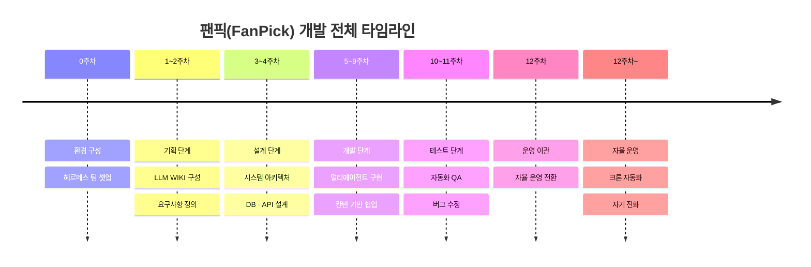

---

## 1. 서비스 정의: 팬픽(FanPick)이란

### 1-1. 서비스 개요

팬픽(FanPick)은 K-POP 아이돌 공식·비공식 굿즈를 전문으로 판매하는 웹/앱 플랫폼이다. 일반 이커머스와 달리 아이돌 굿즈 시장의 특성, 즉 한정 수량 예약 판매, 랜덤 상품(포토카드 랜덤 포함), 콘서트 및 팬미팅 연동 MD, 글로벌 팬 대응, 응원 기능 등을 플랫폼 핵심 기능으로 구현한다.

### 1-2. 주요 굿즈 카테고리

국내 실제 운영 중인 아이돌 굿즈 전문 플랫폼(에버라인, 팬텀픽, 아이돌스토어 등)을 참고하면, 주요 상품군은 앨범 및 포토북, 포토카드(포카), 아크릴 키링, 응원봉, 스티커 팩, 트레이딩 카드, 포토 슬로건, 핀버튼 세트, 엽서 세트, 시즌 그리팅 상품으로 구성된다.

### 1-3. 핵심 비즈니스 요구사항

| 요구사항 | 설명 | 난이도 |
|---|---|---|
| 예약 판매 | 판매 시작/종료 일시 설정, 구매 수량 제한 | 중 |
| 한정 수량 | 재고 소진 시 자동 품절 처리, 대기열 관리 | 고 |
| 랜덤 상품 | 포토카드 랜덤 포함 상품 처리, 결과 안내 | 중 |
| 글로벌 배송 | 다국어, 다통화, 국제 배송비 계산 | 고 |
| 트래픽 급증 | 콘서트 MD 오픈 시 동시 접속 폭증 대응 | 고 |
| 팬 커뮤니티 | 구매자 인증 후 후기, 인증샷 업로드 | 중 |
| 알림 시스템 | 판매 시작·마감 전 푸시/문자/이메일 알림 | 중 |
| 관리자 대시보드 | 재고·주문·정산·통계 통합 관리 | 중 |

---

## 2. 헤르메스 에이전트 팀 구성

### 2-1. 역할 설계 원칙

헤르메스 에이전트의 역할 분리는 "만능 비서 한 명"이 아닌 "전문가 팀"을 구성하는 방향으로 설계한다. 헤르메스에서 역할을 나눈다는 것은 두 층으로 작동한다. 하나는 어떤 역할이 필요한가(역할형 에이전트 정의)이고, 다른 하나는 그 역할을 어떤 방식으로 실행시킬 것인가(profile 직접 호출, delegation, subagent, cron)다.

각 에이전트는 SOUL.md 파일로 성격과 역할을, AGENTS.md 파일로 프로젝트 지침을 정의받는다. 이때 두 파일 모두 가능한 짧게 유지한다. "절대 하지 말 것" 몇 가지와 역할의 핵심만 담는 것이 문서가 길어져 컨텍스트가 오염되는 것보다 실제 성능이 좋다.

### 2-2. 팬픽 개발팀 에이전트 구성

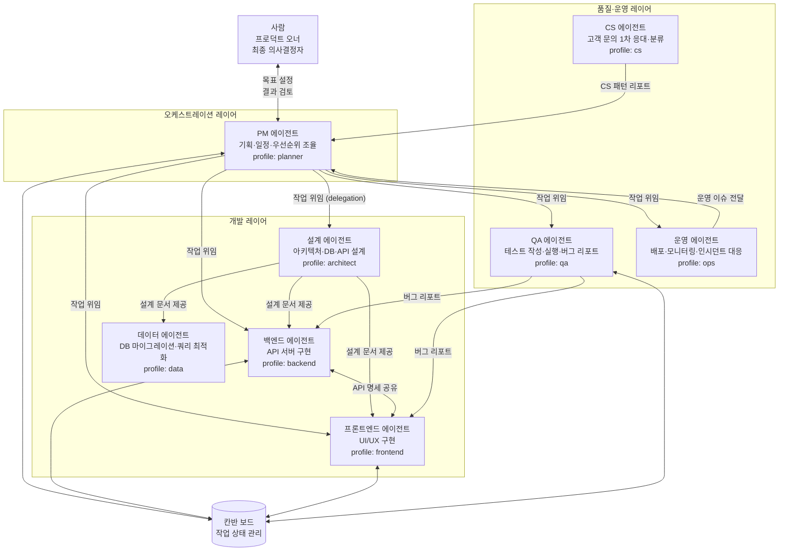

### 2-3. 에이전트별 SOUL.md 설계 예시

각 에이전트의 SOUL.md는 역할의 본질만 간결하게 담는다. 아래는 백엔드 에이전트와 QA 에이전트의 예시다.

**백엔드 에이전트 (backend.md)**:
```
역할: 팬픽 서비스의 API 서버를 구현한다.
스택: FastAPI (Python), PostgreSQL, Redis, Celery
절대 하지 말 것:
  - DB 스키마를 설계 에이전트 승인 없이 변경하지 않는다
  - 결제 관련 코드를 단독으로 프로덕션에 배포하지 않는다
  - 테스트 없이 PR을 생성하지 않는다
완료 기준: 모든 엔드포인트에 단위 테스트 존재, API 문서(OpenAPI) 자동 생성 확인
```

**QA 에이전트 (qa.md)**:
```
역할: 팬픽 서비스의 품질을 책임진다.
절대 하지 말 것:
  - 버그를 발견하면 즉시 수정하려 하지 않는다 (리포트만 한다)
  - 기능 테스트 전에 단위 테스트를 건너뛰지 않는다
완료 기준: 신규 기능 테스트 커버리지 80% 이상, 회귀 테스트 통과
```

### 2-4. 칸반 보드 구조

헤르메스의 칸반 기능은 에이전트와 사람이 함께 공유하는 영속 작업 큐다. 작업 카드의 상태 변화와 완료·차단 이벤트가 텔레그램으로 자동 알림된다.

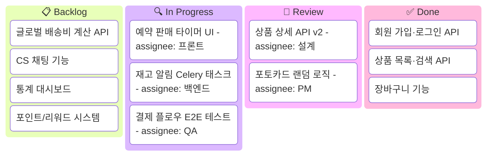

---

## 3. 기획 단계: LLM WIKI와 요구사항 정제

### 3-1. 왜 LLM WIKI부터 시작하는가

헤르메스 에이전트가 책 한 권을 자율적으로 쓸 수 있었던 것은 에이전트가 뛰어나서가 아니라 55개의 위키 문서라는 지식 베이스가 있었기 때문이다. 소프트웨어 개발도 같다. 에이전트가 "좋은 결정"을 내리려면, 그 결정을 뒷받침할 도메인 지식과 컨텍스트가 위키에 미리 축적되어 있어야 한다.

기획 단계에서 LLM WIKI에 담아야 할 내용은 세 가지 범주로 나뉜다. 첫째는 도메인 지식, 즉 K-POP 굿즈 시장의 구조, 주요 플랫폼 사례, 팬덤 구매 패턴, 예약 판매 관행 등이다. 둘째는 기술 레퍼런스, 즉 선택한 기술 스택의 공식 문서 요약, 유사 서비스 아키텍처 분석 결과, 결제 연동 가이드 등이다. 셋째는 팀 컨텍스트, 즉 이 프로젝트의 목표, 제약 조건, 비기능 요구사항, 팀 결정 사항 등이다.

### 3-2. 기획 에이전트의 역할과 작동 방식

PM 에이전트는 위키를 읽고 다음 순서로 기획 문서를 작성한다.

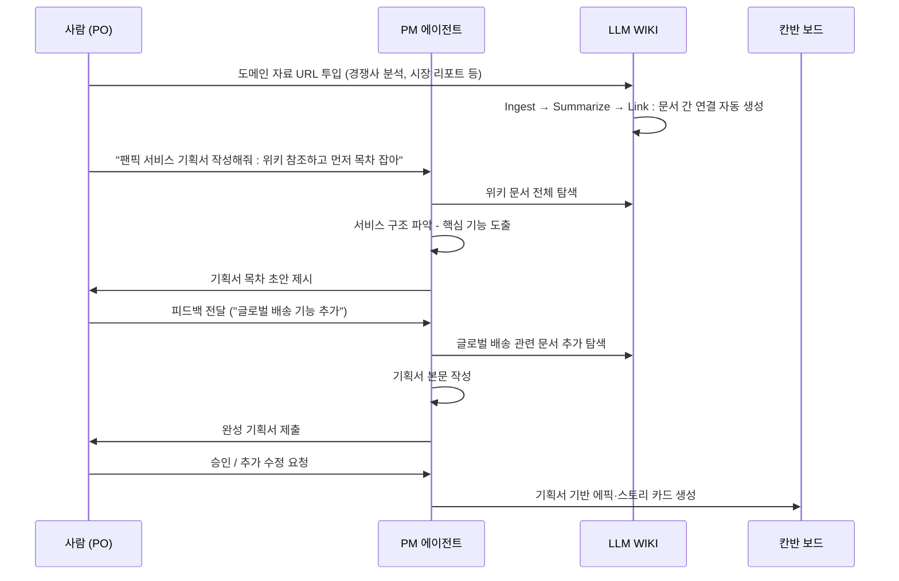

### 3-3. 주요 사용자 스토리 도출

PM 에이전트가 위키 기반으로 도출하는 핵심 사용자 스토리는 다음과 같다.

**팬(구매자) 관점:**
- 아티스트별로 굿즈를 탐색하고, 원하는 상품을 장바구니에 담아 결제할 수 있다.
- 예약 판매 시작 전에 알림을 신청해, 판매 시작 시 즉시 알림을 받을 수 있다.
- 한정 수량 상품이 품절됐을 때 대기 등록을 하고, 재입고 시 알림을 받을 수 있다.
- 포토카드 랜덤 포함 상품을 구매하고, 발송 후 어떤 포카를 받게 되는지 확인할 수 있다.
- 해외 팬도 자국 통화로 가격을 확인하고 국제 배송으로 구매할 수 있다.
- 구매 인증 후 상품 후기와 인증샷을 업로드할 수 있다.

**운영자 관점:**
- 상품을 등록하고, 예약 판매 일정을 설정하며, 재고를 관리할 수 있다.
- 주문 현황과 배송 상태를 한 화면에서 모니터링하고, 이슈 주문을 처리할 수 있다.
- 아티스트별·기간별 매출과 인기 상품 통계를 확인할 수 있다.
- CS 문의에 빠르게 대응하고, 환불·교환 처리를 진행할 수 있다.

### 3-4. 기획 단계 산출물

PM 에이전트가 기획 단계를 마치면 다음 파일들이 LLM WIKI와 Git 저장소에 저장된다.

```
docs/
├── PRD.md               # 제품 요구사항 문서 (Product Requirements Document)
├── USER_STORIES.md      # 에픽 및 사용자 스토리 목록
├── COMPETITOR_ANALYSIS.md  # 경쟁사 분석 (에버라인, 팬텀픽, 위드뮤 등)
├── BUSINESS_RULES.md    # 예약 판매, 랜덤 상품 등 비즈니스 로직 규칙
└── GLOSSARY.md          # 도메인 용어 정의 (포카, 시즌그리팅, MD 등)
```

---

## 4. 설계 단계: 아키텍처, DB, API 설계

### 4-1. 설계 에이전트의 역할

설계 에이전트(architect)는 기획서와 사용자 스토리를 입력으로 받아, 시스템 전체의 기술적 청사진을 만든다. 이 단계에서 내린 결정들은 이후 모든 개발 에이전트의 행동을 제약하고 안내하는 가이드가 된다.

설계 에이전트가 먼저 시작하는 것은 핵심 제약 조건 파악이다. 트래픽이 얼마나 올 수 있는가(콘서트 MD 오픈 시 급증), 데이터가 얼마나 민감한가(결제 정보), 글로벌 서비스를 고려해야 하는가, 팀(에이전트)의 기술 스택은 무엇인가. 이 제약들이 아키텍처 선택을 결정한다.

### 4-2. 시스템 아키텍처

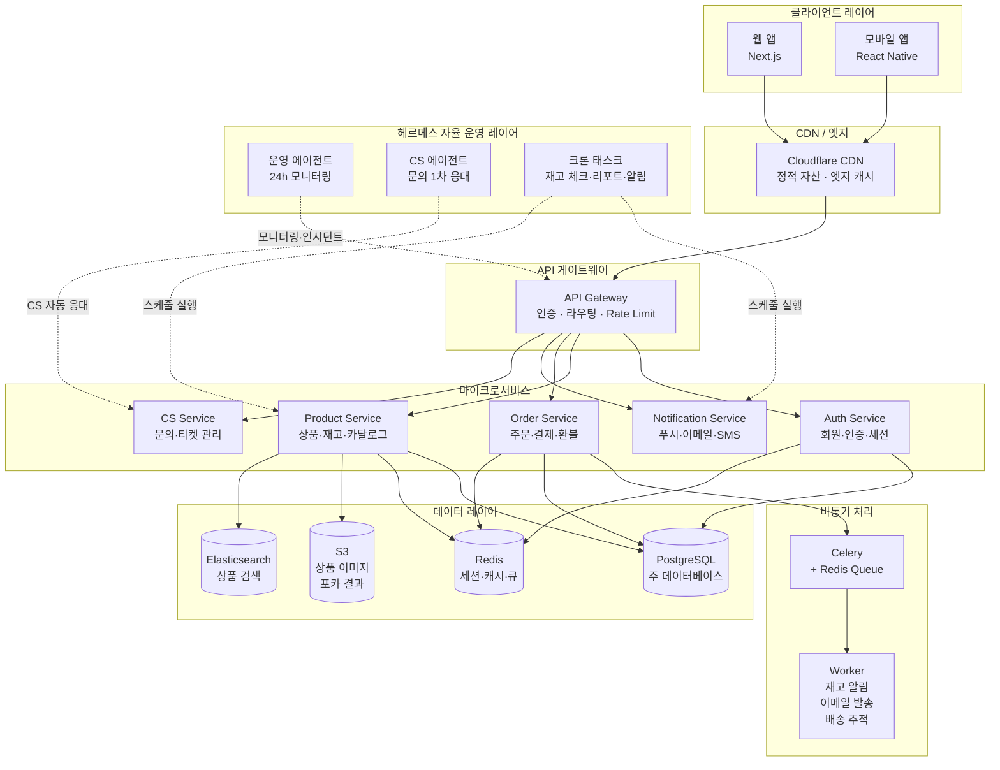

### 4-3. 데이터베이스 스키마 설계 (핵심 테이블)

설계 에이전트는 PRD와 비즈니스 규칙 문서를 읽고 핵심 테이블을 설계한다.

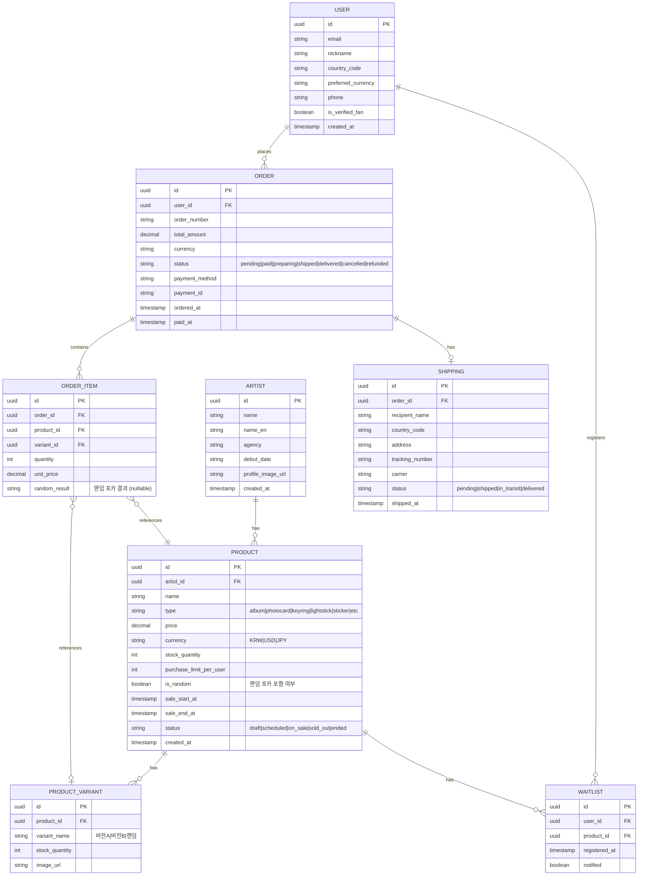

### 4-4. 핵심 API 명세

설계 에이전트는 OpenAPI 3.0 형식으로 API 명세를 작성하고, 이를 WIKI에 저장한다. 이 명세가 이후 백엔드·프론트엔드 에이전트의 구현 기준이 된다.

| 카테고리 | Method | Endpoint | 설명 |
|---|---|---|---|
| 상품 | GET | `/api/v1/products` | 상품 목록 (필터: 아티스트, 상태, 카테고리) |
| 상품 | GET | `/api/v1/products/{id}` | 상품 상세 + 재고 실시간 |
| 상품 | POST | `/api/v1/products/{id}/waitlist` | 재입고 알림 신청 |
| 장바구니 | GET/POST/DELETE | `/api/v1/cart` | 장바구니 CRUD |
| 주문 | POST | `/api/v1/orders` | 주문 생성 (재고 선점) |
| 주문 | POST | `/api/v1/orders/{id}/pay` | 결제 요청 |
| 주문 | GET | `/api/v1/orders/{id}` | 주문 상세 + 배송 추적 |
| 알림 신청 | POST | `/api/v1/notifications/subscribe` | 판매 시작 알림 구독 |
| 리뷰 | GET/POST | `/api/v1/products/{id}/reviews` | 구매 인증 후기 |
| 관리자 | GET | `/api/v1/admin/dashboard` | 매출·재고 통합 현황 |
| 관리자 | PATCH | `/api/v1/admin/products/{id}/stock` | 재고 수동 조정 |

### 4-5. 설계 단계에서의 핵심 결정과 근거

설계 에이전트가 남기는 아키텍처 결정 기록(ADR: Architecture Decision Record)은 WIKI의 독립 문서로 저장된다. 예약 판매 한정 수량의 경우 Redis 재고 선점 방식을 선택한 근거, 포토카드 랜덤 결과 처리를 결제 완료 후 배치 처리로 설계한 근거 등이 기록된다. 나중에 개발 에이전트가 "왜 이렇게 설계됐지?"라고 물을 때 위키에서 바로 찾을 수 있어야 한다.

---

## 5. 개발 단계: 칸반 기반 멀티에이전트 구현

### 5-1. 개발 칸반 운영 방식

헤르메스의 칸반 기능은 에이전트와 사람이 함께 일하는 영속 작업 큐다. 작업 카드는 단순한 할일 목록이 아니라, 에이전트가 읽고 실행하는 명세서에 가깝다. 하나의 카드는 다음 구조를 갖는다.

```
카드 제목: 예약 판매 타이머 API 엔드포인트 구현
담당: backend 에이전트
선행 작업: [완료] 상품 DB 스키마 마이그레이션
본문:
  - GET /api/v1/products/{id}/sale-timer 엔드포인트 구현
  - 현재 시각 기준 판매 시작까지 남은 시간(초) 반환
  - 판매 중일 때는 종료까지 남은 시간 반환
  - Redis 캐시 30초 TTL 적용 (DB 부하 방지)
  - 단위 테스트 3개 이상 (판매 전, 판매 중, 판매 후)
완료 기준: 테스트 통과, OpenAPI 문서 자동 생성 확인
알림: 완료 시 QA 에이전트에게 테스트 요청 카드 자동 생성
```

### 5-2. 병렬 개발 전략

백엔드와 프론트엔드는 API 명세를 공유 기준으로 병렬 진행한다. 백엔드 에이전트가 API를 구현하는 동안, 프론트엔드 에이전트는 Mock API를 기반으로 UI를 구현한다. Git worktree를 활용해 각 에이전트가 독립 브랜치에서 작업한다.

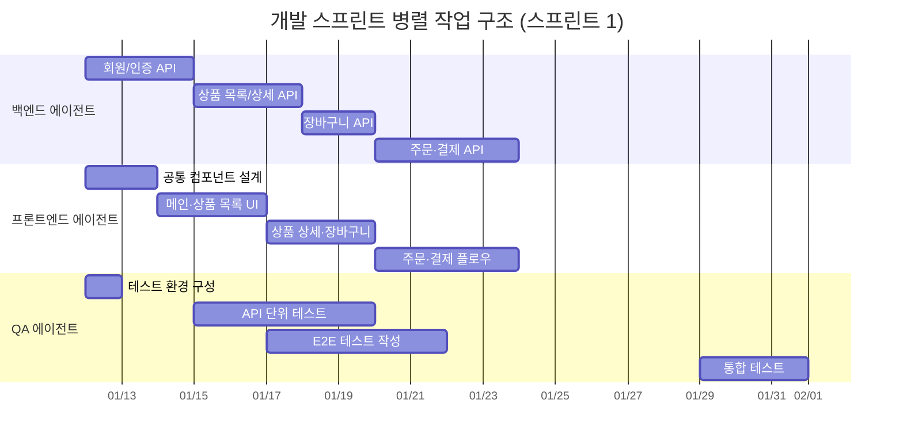

### 5-3. 핵심 기능별 구현 흐름

#### 예약 판매 한정 수량 구매 플로우

예약 판매에서 가장 기술적으로 까다로운 부분은 동시 구매 시 재고 초과 판매를 방지하는 것이다. 백엔드 에이전트는 설계 에이전트의 ADR을 참조해 Redis를 이용한 원자적(atomic) 재고 선점 방식을 구현한다.

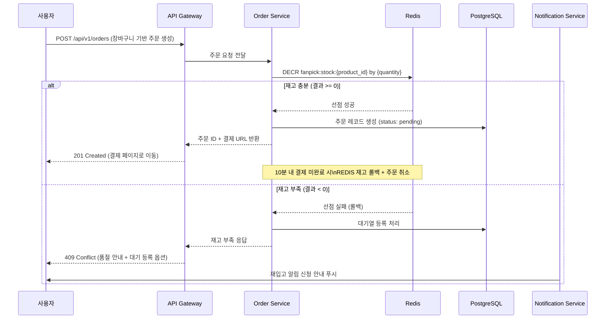

#### 포토카드 랜덤 결과 처리

포토카드 랜덤 포함 상품은 결제 완료 후 배치로 처리한다. 실시간 처리가 아닌 배치 방식을 선택한 이유는 대규모 동시 구매 상황에서 결제 응답 속도를 보장하기 위해서다.

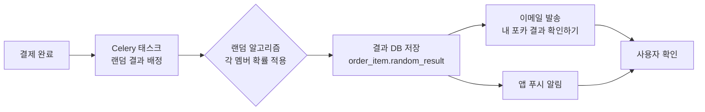

### 5-4. 백엔드 에이전트 실제 작업 예시

칸반 카드를 받은 백엔드 에이전트가 `/goal` 명령으로 목표를 설정하고 작업을 진행하는 흐름은 다음과 같다.

```
hermes chat --profile backend

/goal 예약 판매 타이머 API 구현 완료.
완료 기준: 테스트 3개 통과, OpenAPI 문서 확인

[에이전트] WIKI에서 예약 판매 비즈니스 규칙 문서 검색 중...
[에이전트] DB 스키마에서 sale_start_at, sale_end_at 필드 확인...
[에이전트] Redis 캐시 설계 ADR 참조...
[에이전트] products/routes.py에 /sale-timer 엔드포인트 작성 중...
[에이전트] tests/test_sale_timer.py 테스트 3개 작성...
[에이전트] pytest 실행 중... 3/3 통과
[에이전트] /docs에서 OpenAPI 문서 생성 확인
[에이전트] 칸반 카드 상태를 Review로 변경
[에이전트] QA 에이전트에게 테스트 요청 카드 생성
```

`/background` 명령은 오래 걸리는 작업(예: 전체 E2E 테스트 실행)을 대화창 밖에서 계속 진행하게 해준다. `/yolo` 명령은 신뢰할 수 있는 범위(예: 기존 테스트 모두 통과하는 단순 리팩토링) 안에서 승인 대기 없이 빠르게 진행할 때 쓴다.

### 5-5. 프론트엔드 에이전트의 주요 화면 구현

프론트엔드 에이전트는 API 명세를 기반으로 주요 화면을 구현한다. 아이돌 굿즈 플랫폼의 핵심 화면은 다음과 같다.

| 화면 | 핵심 컴포넌트 | 특이사항 |
|---|---|---|
| 메인 홈 | 아티스트 배너, 신규 굿즈, 예약 판매 D-Day | 배너 실시간 업데이트 |
| 상품 목록 | 아티스트 필터, 상태 뱃지 (판매중/예정/품절) | 검색·정렬 필터 |
| 상품 상세 | 잔여 재고 표시, 카운트다운 타이머, 예약 알림 버튼 | 실시간 재고 폴링 |
| 장바구니 | 수량 변경, 품절 상품 분리 표시 | 비회원 세션 장바구니 |
| 주문·결제 | 국제 배송비 자동 계산, 다국어 주소 입력 | PG사 연동 |
| 주문 상세 | 배송 추적 타임라인, 랜덤 포카 결과 공개 | 결과 공개 애니메이션 |
| 마이페이지 | 주문 내역, 대기 등록 목록, 구매 인증 후기 | |
| 관리자 대시보드 | 실시간 주문 현황, 재고 경보, 매출 차트 | 에이전트 운영 현황 |

---

## 6. 테스트 단계: 에이전트 자동화 QA

### 6-1. QA 에이전트의 테스트 전략

QA 에이전트는 단위 테스트(Unit Test), 통합 테스트(Integration Test), 엔드투엔드 테스트(E2E Test)의 세 단계로 품질을 검증한다. 에이전트가 버그를 발견하면 직접 수정하지 않고, 칸반 카드에 버그 리포트를 작성해 담당 에이전트에게 위임한다. 수정은 담당 에이전트가 하고, QA 에이전트가 재검증한다.

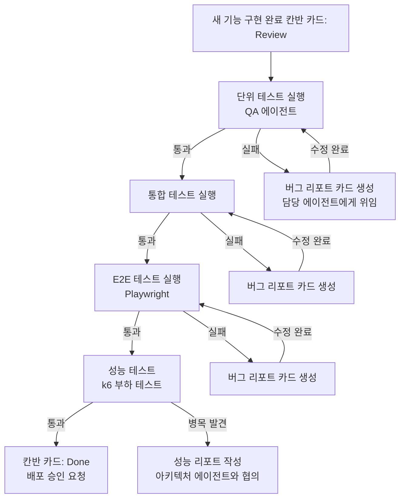

### 6-2. 아이돌 굿즈 플랫폼 특화 테스트 시나리오

일반 이커머스 테스트에 더해, 팬픽의 특수 상황을 반드시 테스트해야 한다.

**동시 구매 시나리오 (가장 중요):**
콘서트 MD 오픈 시 수천 명이 동시에 같은 상품을 구매하려는 상황을 k6로 시뮬레이션한다.

```
시나리오: 재고 100개 상품에 500명 동시 구매 시도
기대 결과:
  - 정확히 100건만 결제 성공
  - 나머지 400건은 품절 안내
  - DB 재고와 Redis 재고 불일치 없음
  - 결제 응답 시간 2초 이내
  - 서버 에러 0건
```

**예약 판매 타이머 경계값 테스트:**
판매 시작 1초 전, 정각, 1초 후의 재고 API 응답과 구매 가능 여부를 각각 검증한다.

**랜덤 포카 확률 편향 테스트:**
대량의 랜덤 결과를 생성해 각 멤버의 실제 배정 비율이 설정된 확률 범위 안에 있는지 통계적으로 검증한다.

**국제 배송비 계산 테스트:**
한국→미국, 한국→일본, 한국→유럽 등 주요 배송지별 배송비 계산 결과를 실제 배송사 API 응답과 비교 검증한다.

### 6-3. QA 에이전트의 버그 리포트 형식

```
버그 ID: BUG-042
제목: 재고 0개 상품에서 장바구니 추가가 막히지 않음
재현 단계:
  1. 재고 0개 상품 상세 페이지 접속
  2. "장바구니 담기" 버튼이 비활성화되지 않음
  3. 버튼 클릭 시 장바구니 추가 API 호출 발생
  4. 서버에서 재고 부족 에러 반환 → 사용자 혼란
기대 동작: 재고 0개 시 프론트엔드에서 버튼 비활성화, "품절" 표시
실제 동작: 버튼 활성화 상태, 클릭 후 에러 메시지 노출
심각도: Medium
담당: frontend 에이전트
관련 파일: components/ProductDetail/AddToCartButton.tsx
```

---

## 7. 운영 이관: 자율 운영 체계로 전환

### 7-1. 운영 이관이란 무엇인가

"운영 이관"은 이 문서에서 개발이 완료된 서비스를 사람 중심 운영에서 헤르메스 에이전트 중심의 자율 운영으로 전환하는 과정을 의미한다. 완전한 무인 자동화가 아니라, 에이전트가 일상 운영의 대부분을 처리하고 사람은 예외 상황과 전략적 결정에만 개입하는 구조다.

이관 전에 반드시 세 가지를 완료해야 한다. 첫째, 운영 에이전트의 SOUL.md가 완성되고 검증된 상태여야 한다. 둘째, 운영 에이전트가 수행할 수 있는 작업의 허용 목록(command_allowlist)과 금지 목록이 명확히 정의된 상태여야 한다. 셋째, 에이전트가 처리할 수 없는 상황(에스컬레이션 조건)과 그때 사람에게 어떻게 알릴지가 정의된 상태여야 한다.

### 7-2. 운영 에이전트의 권한 범위

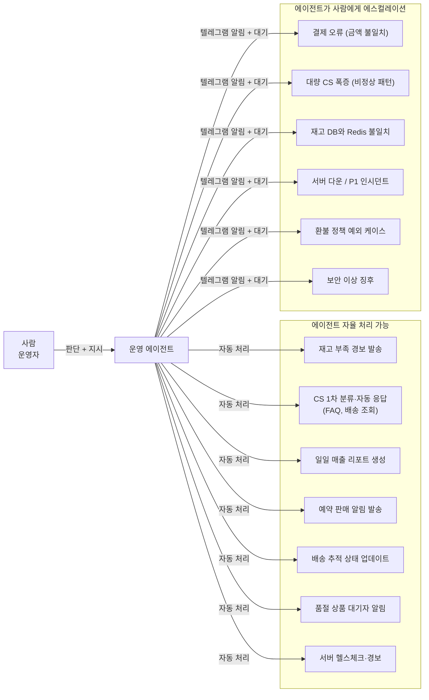

### 7-3. 컨테이너 격리와 보안 설정

운영 에이전트가 프로덕션 환경에 접근할 때는 권한을 최소화해야 한다. 헤르메스의 `command_allowlist` 설정으로 에이전트가 실행할 수 있는 명령어 목록을 제한한다. 데이터베이스에는 읽기 전용 계정으로만 접근하고, 쓰기 작업이 필요할 때는 별도의 승인 절차를 거치도록 설계한다.

보안 체크리스트:
- API 키와 시크릿은 환경 변수로만 관리, SOUL.md나 AGENTS.md에 절대 기재 금지
- 에이전트의 파일 시스템 접근 범위를 `/workspace/logs`, `/workspace/reports`로 제한
- 결제·개인정보 관련 DB 테이블은 읽기 전용 접근만 허용
- 에이전트가 외부로 데이터를 전송하는 것은 사전에 승인된 채널(텔레그램, 지정 이메일)로만 허용

### 7-4. 이관 점검표 (핸드오버 체크리스트)

```
[ ] 운영 에이전트 SOUL.md 검토 완료
[ ] command_allowlist 설정 완료 및 테스트
[ ] 에스컬레이션 조건 정의 및 텔레그램 알림 테스트
[ ] 크론 태스크 목록 검토 및 실행 테스트
[ ] 운영 WIKI 문서 완성 (런북, FAQ, 인시던트 대응 절차)
[ ] CS 에이전트 자동 응답 시나리오 검토
[ ] 재고 경보 임계값 설정
[ ] 스테이징 환경에서 2주 운영 후 프로덕션 이관
```

---

## 8. 자율 운영: 크론과 자기 진화

### 8-1. 크론 기반 자동화 태스크

헤르메스의 크론(cron) 기능은 자연어로 스케줄을 설정한다. 운영 에이전트가 등록하는 크론 태스크들은 사람이 매번 수동으로 해야 했던 반복 작업들이다.

```mermaid
gantt
    title 팬픽 자율 운영 크론 스케줄 (하루)
    dateFormat HH:mm
    axisFormat %H:%M
    
    section 재고 관리
    재고 현황 스캔 및 경보 체크   :crit, 06:00, 30m
    Redis-DB 재고 정합성 체크      :09:00, 15m
    Redis-DB 재고 정합성 체크      :18:00, 15m

    section 알림 자동화
    오늘 판매 시작 상품 알림 발송  :08:30, 30m
    판매 마감 1시간 전 알림 발송   :done, 23:00, 30m

    section 배송 추적
    배송 상태 자동 업데이트        :09:30, 45m
    배송 상태 자동 업데이트        :15:00, 45m

    section CS 리포트
    당일 CS 문의 현황 집계         :09:00, 15m
    미답변 CS 에스컬레이션 체크    :14:00, 15m

    section 일일 리포트
    일일 매출·주문 리포트 생성     :22:00, 30m
    리포트 텔레그램 발송           :22:30, 10m
```

자연어 크론 등록 예시:

```
hermes cron add "매일 오전 8시 30분에 오늘 판매 시작 예정인 상품이 있는지 확인하고,
해당 상품의 알림 신청자들에게 텔레그램과 이메일로 알림을 발송해"

hermes cron add "매시간 Redis 재고와 PostgreSQL 재고가 불일치하는 상품이 있으면
즉시 텔레그램으로 경보를 보내고 칸반 보드에 인시던트 카드를 생성해"

hermes cron add "매일 오후 10시에 오늘의 매출, 신규 주문, 품절 상품,
CS 문의 현황을 담은 일일 리포트를 만들어 텔레그램 운영 채널에 발송해"
```

### 8-2. CS 에이전트의 자동 응대 흐름

CS 에이전트는 고객 문의가 들어오면 먼저 WIKI의 FAQ 문서를 참조해 자동 응답을 시도한다. 처리할 수 없는 경우 사람에게 에스컬레이션한다.

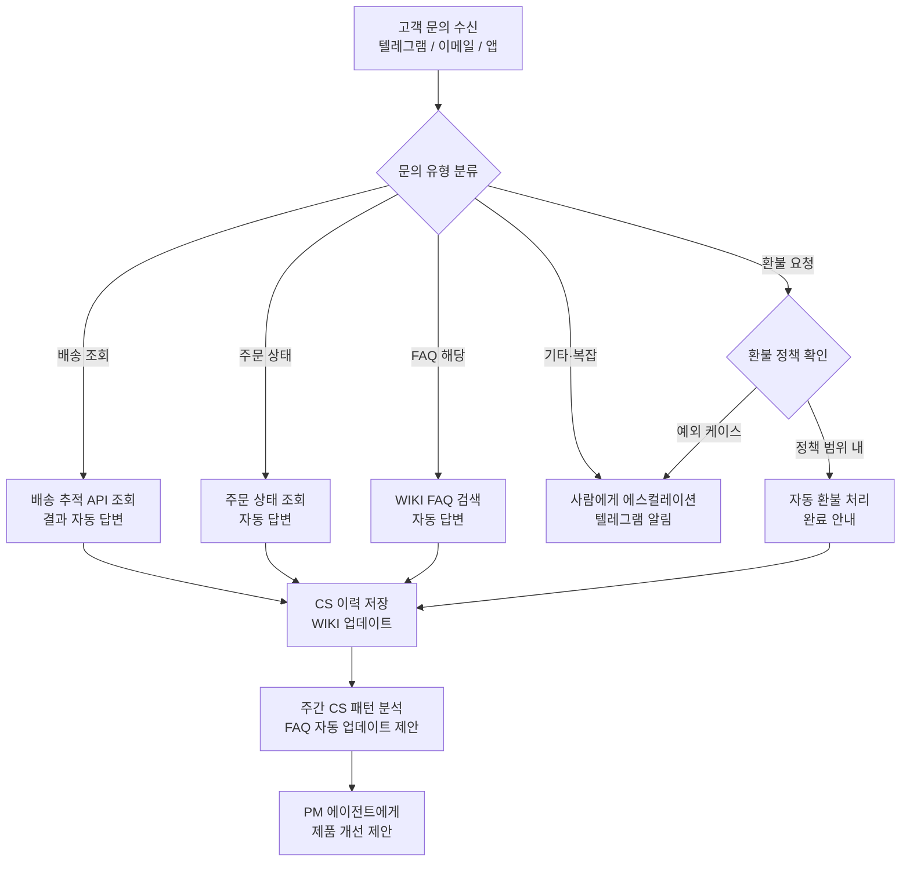

### 8-3. 자기 진화 루프: 운영 경험이 서비스를 개선한다

헤르메스 에이전트의 가장 독특한 특성은 경험에서 스킬을 자동 생성한다는 점이다. 운영 에이전트가 반복적으로 처리한 작업은 자동으로 스킬 파일로 저장되고, 다음에 같은 상황이 발생했을 때 더 빠르고 정확하게 처리된다.

이것은 운영이 진행될수록 서비스가 스스로 안정화되는 구조다.

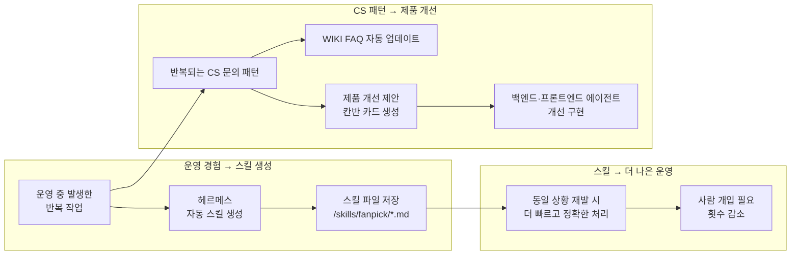

### 8-4. 영속 목표(/goal)와 자율 모니터링

헤르메스의 `/goal` 명령은 에이전트에게 장기 목표를 부여하는 방식이다. 운영 에이전트에게 다음과 같은 영속 목표를 설정하면, 에이전트는 이 목표를 항상 염두에 두고 작업한다.

```
/goal 팬픽 서비스의 안정적 운영.
세부 목표:
  1. 서버 가용성 99.9% 유지
  2. P1 인시던트 발생 시 10분 내 사람에게 알림
  3. 재고 오차 0건 유지
  4. CS 응답 시간 평균 2시간 이내
  5. 일일 리포트 매일 오후 10시 발송

이 목표들이 위협받는 상황이 감지되면 즉시 행동하거나 사람에게 알려.
```

### 8-5. 완전한 자율 운영의 모습

팬픽 서비스가 완전한 자율 운영 체계에 안착했을 때의 하루는 다음과 같다.

오전 8시 30분, 오늘 오후 2시에 오픈하는 신규 굿즈의 판매 예약 알림 신청자 2,847명에게 자동으로 텔레그램과 이메일 알림이 발송된다. 오후 2시, 오픈과 동시에 동시 접속이 급증한다. 운영 에이전트가 서버 응답 시간을 실시간으로 모니터링하다가, 오후 2시 4분에 Product Service의 응답 시간이 임계값을 초과하자 자동으로 수평 스케일아웃을 요청하고 텔레그램으로 현황을 보고한다. 오후 2시 17분, 재고 300개가 소진되어 품절 처리된다. 대기자 914명에게 자동으로 알림이 발송된다.

오후 3시, CS 에이전트가 "내 포카 결과는 언제 나와요?"라는 문의 38건을 자동 처리한다. 모두 WIKI의 FAQ 문서에 있는 내용이라 5분 내 자동 답변이 완료된다.

오후 10시, 운영 에이전트가 오늘의 일일 리포트를 작성해 운영 텔레그램 채널에 발송한다. 총 판매 312건, 매출 1,247만 원, CS 처리 42건(자동 39건, 에스컬레이션 3건), 서버 가용성 99.97%가 담겨 있다.

사람 운영자가 오늘 직접 한 것은 오후 2시 4분 스케일아웃 승인 버튼 하나와, 오후 4시 에스컬레이션된 환불 예외 케이스 3건 처리뿐이다.

---

## 9. 전체 흐름 요약

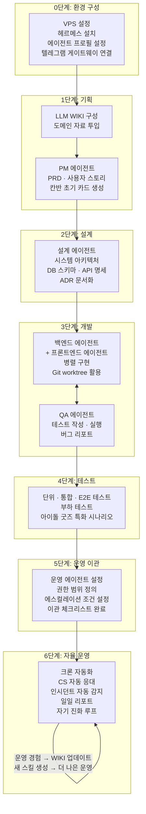

이 전체 흐름에서 사람의 역할은 목표 설정자, 감독자, 예외 처리자로 점진적으로 좁아진다. 에이전트 팀이 더 많은 운영 경험을 쌓을수록 사람의 개입이 필요한 상황은 줄어들고, 서비스는 스스로 더 안정적으로 발전한다. 이것이 헤르메스 에이전트로 서비스를 만드는 일의 진짜 가치다.

---

*작성일: 2026년 6월 17일*
