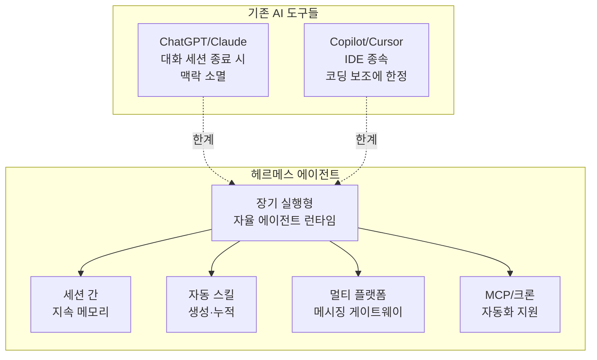
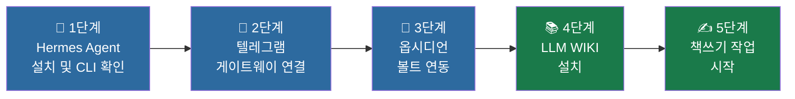
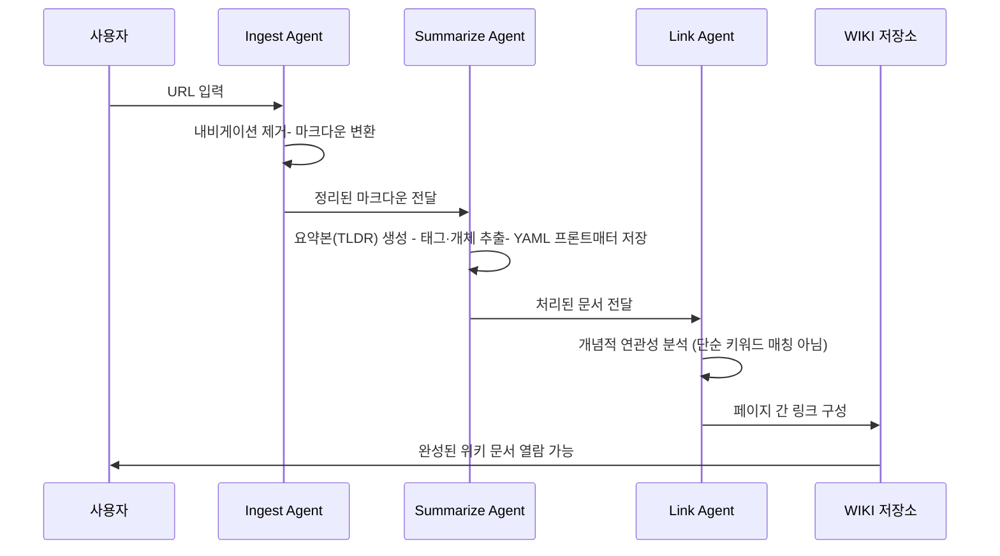
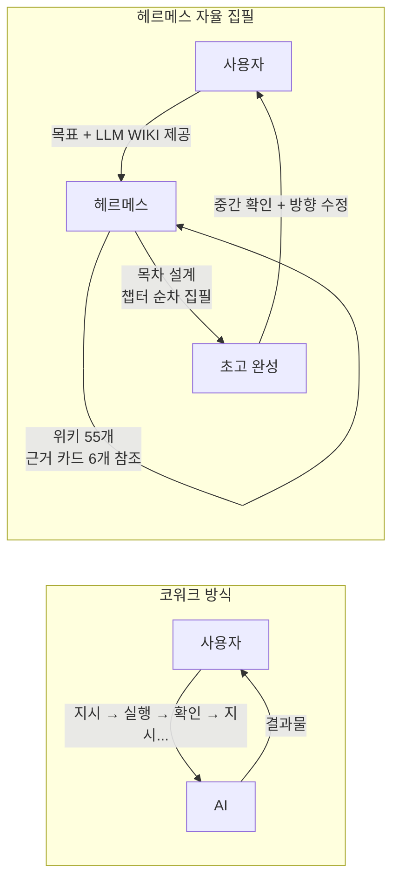
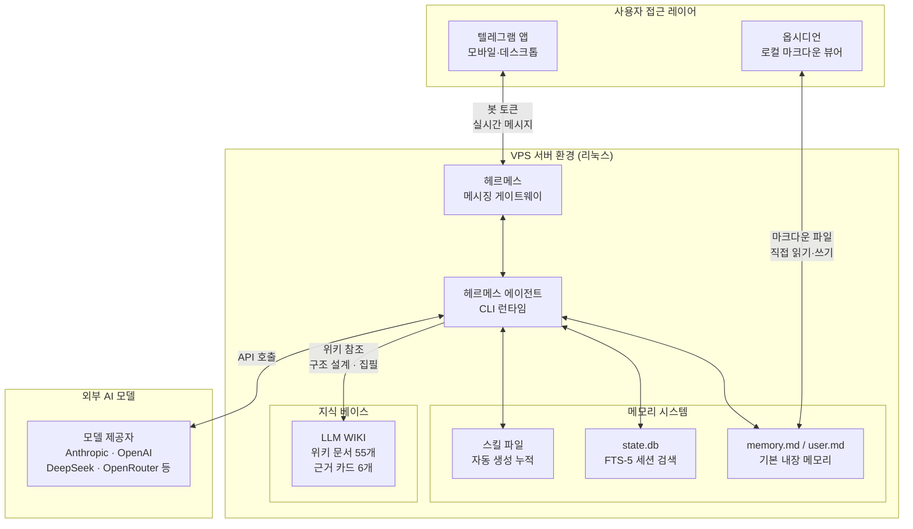

> 소셜 미디어에 올라온 한 사용자의 [경험담](https://www.facebook.com/share/p/1UGqUZ66vJ/)을 중심으로, 헤르메스 에이전트(Hermes Agent)의 본질과 구조, 설치 과정, 그리고 코워크(CoWork)와의 결정적 차이를 깊이 있게 살펴본다.

---

## 1. 이 글의 출발점: "AI가 책 한 권을 스스로 써 내려갔다"

페이스북에 올라온 한 편의 글이 주목을 받았다. 헤르메스 에이전트를 직접 설치하고, 첫 번째 본격 작업으로 '책쓰기'를 맡겨봤다는 내용이었다. 결과는 예상을 넘었다. 에이전트가 위키 문서 55개와 근거 카드 6개를 스스로 참조해 목차를 잡고, 챕터를 순서대로 채워 나갔다. 현재 순수 텍스트 기준 약 19,000자가 누적된 상태다.

이 경험이 특별한 이유는 단순히 AI가 글을 잘 썼다는 데 있지 않다. '사람이 옆에서 방향을 잡아주는 코워크'와, '에이전트가 스스로 구조를 세우고 채워 나가는 자율 집필'이 얼마나 다른지를 실제 사용 경험으로 보여줬다는 점이다. 그리고 그 전에, 설치 자체가 결코 만만하지 않았다는 솔직한 고백이 담겨 있다.

이 글은 그 경험을 토대로, 헤르메스 에이전트가 무엇인지, 왜 VPS를 선택했는지, 설치를 어떻게 나눠서 진행했는지, LLM WIKI가 책쓰기와 어떻게 연결되는지를 체계적으로 풀어낸다.

---

## 2. 헤르메스 에이전트란 무엇인가

### 2-1. 탄생 배경과 기본 정체성

헤르메스 에이전트(Hermes Agent)는 미국 AI 연구 스타트업 Nous Research가 개발한 오픈소스 자가 개선형(self-improving) AI 에이전트 프레임워크다. 2026년 2월 25~26일에 MIT 라이선스로 처음 공개됐으며, 출시 3개월 만에 GitHub 스타 14만 개 이상을 돌파할 만큼 빠르게 주목받았다. 현재 누구나 무료로 사용할 수 있다.

헤르메스를 한 문장으로 정의하면 이렇다. "서버에 상주하면서 대화와 작업 경험을 바탕으로 스킬과 메모리를 축적하고, 쓸수록 더 유능해지도록 설계된 장기 실행형 자율 에이전트"다.

단순히 질문에 답하는 챗봇이나, IDE 안에서 코드를 보조하는 도구와는 다르다. 헤르메스는 터미널, 메신저, 서버 환경에서 계속 실행되면서 도구, 메모리, 스킬을 함께 활용한다. 세션이 끊겨도 기억이 유지되고, 반복 작업을 경험할수록 해당 작업에 최적화된 스킬을 스스로 생성해 저장한다.

### 2-2. 기존 AI 도구들과의 결정적 차이

GitHub Copilot이나 Cursor 같은 코딩 어시스턴트는 IDE에 종속되어 있다. ChatGPT나 Claude는 대화 세션이 끝나면 맥락이 사라진다. 헤르메스는 이 두 범주 어디에도 속하지 않겠다고 선언한다.

헤르메스의 포지셔닝은 "오래 살아 있는 자율 에이전트 런타임"이다. 외부 하네스(harness)에 의존하기보다 자기 내부의 메모리, 스킬, 서브에이전트, 크론(cron), MCP(Model Context Protocol)를 조합해 하나의 자율형 에이전트로 작동하는 구조를 강하게 밀고 있다.



### 2-3. 핵심 기능 구조

헤르메스의 핵심은 네 개의 층위로 이루어진 메모리 시스템과, 경험에서 스킬을 생성하는 학습 루프다.

첫 번째 층은 `memory.md`와 `user.md`로 구성되는 기본 내장 메모리다. 에이전트가 사용자에 대해 알게 된 사실, 프로젝트 컨텍스트, 반복되는 작업 패턴 등을 마크다운 파일 형태로 디스크에 저장한다.

두 번째 층은 FTS-5 전문 검색(Full-Text Search) 기반의 세션 기록 검색이다. `state.db`에 저장된 모든 이전 대화를 키워드와 의미 기반으로 검색해 현재 작업에 활용할 수 있다.

세 번째 층은 플러그형 외부 메모리 백엔드다. Honcho(변증법적 사용자 모델링), Mem0(간편 사실 추출), Hindsight, Supermemory 등 외부 메모리 시스템과 연동할 수 있다.

네 번째 층은 옵시디언(Obsidian) 연동이다. 마크다운 볼트를 에이전트의 장기 지식 베이스로 활용하는 방식으로, 에이전트가 읽고 쓴 내용을 사람이 옵시디언에서 직접 확인하고 편집할 수 있다.

스킬 시스템은 이 메모리 위에서 작동한다. 에이전트가 특정 작업을 성공적으로 완료하면, 그 과정을 재사용 가능한 마크다운 스킬 파일로 저장한다. 다음에 비슷한 작업이 들어오면 저장된 스킬을 불러와 더 빠르고 일관되게 처리한다.

지원하는 모델 제공자는 Nous Portal, OpenRouter, Anthropic, OpenAI, DeepSeek, Google Gemini, xAI(Grok), Kimi, Qwen Cloud 등 20여 개에 달하며, OpenAI 호환 엔드포인트라면 어디에든 연결할 수 있다.

메시징 게이트웨이는 텔레그램(Telegram), 디스코드(Discord), 슬랙(Slack), 왓츠앱(WhatsApp), LINE, Microsoft Teams 등 22개 플랫폼을 지원한다. v0.14.0(2026년 5월 16일) 기준이며, v0.16.0(2026년 6월 5일)에서는 네이티브 데스크톱 앱과 전체 브라우저 어드민 패널이 추가됐다.

---

## 3. 왜 맥미니 대신 VPS를 선택했는가

### 3-1. 로컬 vs 클라우드의 실용적 판단

처음 계획은 맥미니(Mac mini)에 헤르메스를 설치해 로컬에서 운영하는 것이었다. 지인의 추천으로 방향을 VPS(Virtual Private Server) 호스팅으로 전환했다.

이 선택에는 실용적 이유가 있다. 로컬 PC는 절전 모드, 전원 종료, 네트워크 불안정 등의 이유로 에이전트가 끊길 수 있다. 헤르메스는 "장기 실행형" 에이전트다. 24시간 365일 켜져 있는 서버 환경이 에이전트의 본래 설계 철학에 더 맞다.

VPS는 월 5~7달러 수준의 저렴한 구성(예: 1코어 CPU, 8GB RAM, 100GB NVMe SSD)으로도 헤르메스를 안정적으로 운영할 수 있다. 공식 문서 역시 "$5짜리 VPS부터 서버리스 클라우드까지" 어디서든 실행 가능하다고 명시하고 있다.

텔레그램 게이트웨이를 함께 운영할 때는 서버 위치도 중요하다. 한국 사용자라면 아시아 리전 서버를 선택하면 응답 지연(latency)을 50ms 이내로 낮출 수 있다.

### 3-2. 리눅스 터미널이라는 장벽

VPS 환경은 대부분 리눅스 기반이다. 대부분의 작업이 GUI 없이 터미널(SSH 접속)로 이루어진다. 익숙하지 않은 사용자에게는 막히는 지점이 많다.

이 점이 포스트에서 가장 솔직하게 드러나는 부분이다. "초보 입장에서는 막히는 지점이 많았다"는 표현은, AI 에이전트의 진입 장벽이 여전히 높다는 현실을 그대로 보여준다. 인터페이스가 직관적이지 않고, 오류 메시지를 해석하는 것도 별도의 학습이 필요하다.

---

## 4. 설치 전략: 한 번에 끝내지 않고 세 단계로 나누다

### 4-1. 왜 나눴는가

"한 번에 끝내려 하지 않고 작게 쪼갰다"는 전략은 단순해 보이지만, 실제로 상당히 효과적인 접근이다. 복잡한 환경 구성을 한꺼번에 시도하면 어느 단계에서 오류가 났는지 파악하기 어렵다. 각 단계를 분리하면 문제가 생겼을 때 원인을 좁힐 수 있고, 완료된 단계에서 오는 작은 성취감이 다음 단계를 이어가는 동력이 된다.

공식 문서도 같은 원칙을 권고한다. "일반 대화가 안 되는 상태에서 게이트웨이, 크론, 스킬, 보이스 모드 같은 기능을 얹지 말라. 먼저 한 번의 깨끗한 CLI 대화가 되는지 확인하고, 그다음 외부 채널을 붙이는 순서가 안전하다."



### 4-2. 1단계: 헤르메스 에이전트 설치

설치 자체는 원라인(one-line) 명령어로 시작한다. 리눅스/macOS 환경에서는 다음 명령어 하나로 설치 스크립트가 실행된다.

```bash
curl -fsSL https://raw.githubusercontent.com/NousResearch/hermes-agent/main/scripts/install.sh | bash
```

v0.14.0부터는 PyPI를 통한 `pip install hermes-agent` 설치도 공식 지원한다. 설치 스크립트는 ripgrep, ffmpeg 등 의존성 패키지를 자동으로 확인하고 설치 방식(pip, git installer, Homebrew, NixOS)을 자동 감지한다.

설치 후 가장 먼저 확인해야 할 것은 기본 CLI 대화가 정상 작동하는지 여부다. 터미널에 `hermes`를 입력해 대화가 시작되면 1단계는 완료다. 만약 `hermes: command not found` 오류가 뜨면 터미널을 새로 열거나 셸 설정을 다시 로드해야 한다.

모델 제공자 설정도 이 단계에서 진행한다. API 키를 입력하고 어떤 모델을 사용할지 결정한다. OpenRouter를 통해 여러 모델을 하나의 키로 접근하거나, Anthropic, OpenAI, DeepSeek 등을 직접 연결할 수 있다.

### 4-3. 2단계: 텔레그램 연결

헤르메스의 메시징 게이트웨이 기능은 에이전트를 스마트폰에서 접근 가능하게 만들어주는 핵심이다. 텔레그램 연동 절차는 다음과 같다.

먼저 텔레그램 앱에서 `@BotFather`를 검색해 `/newbot` 명령을 실행한다. 봇 이름과 사용자명(반드시 `bot`으로 끝나야 함)을 입력하면 HTTP API 토큰이 발급된다. 이 토큰이 헤르메스와 텔레그램을 연결하는 열쇠다.

자신의 텔레그램 ID는 `@userinfobot`을 통해 확인한다. 이 ID를 `ALLOWED_USERS`에 등록하면 본인 외에는 에이전트를 사용할 수 없도록 제한할 수 있다.

설정이 완료되면 게이트웨이 서비스를 시작한다.

```bash
hermes gateway start
```

이미 실행 중인 게이트웨이가 있다면 `hermes gateway restart`로 변경 사항을 반영한다. 정상 연결 여부는 `hermes gateway status`로 확인한다.

텔레그램 연동이 완료되면 에이전트에게 모바일에서 메시지를 보내듯 지시를 내릴 수 있다. PC 앞에 앉아 터미널을 열지 않아도 된다. 이동 중에도, 자기 전에도, 에이전트에게 작업을 맡기고 결과를 받을 수 있다.

### 4-4. 3단계: 옵시디언 설치

옵시디언(Obsidian)은 로컬 파일 기반 지식 관리 앱이다. 마크다운 파일로 노트를 저장하고, 노트들 사이의 백링크(backlink)로 지식 그래프를 형성한다. 무료이며 동기화 구독 없이도 로컬에서 완전히 작동한다.

헤르메스와 옵시디언의 연동이 특별한 이유는 다음과 같다. 옵시디언 볼트는 그냥 마크다운 파일들의 집합이다. 에이전트가 볼트 경로를 알고 있으면, 파일을 읽고 새 파일을 쓰는 것이 일반 파일 작업과 다르지 않다.

v0.14.0부터는 공식적으로 `hermes memory setup --provider obsidian --path ~/vaults/work` 형태의 명령으로 볼트를 에이전트 메모리 레이어로 연결할 수 있다. 에이전트가 작업 중 생성한 정보(프로젝트 컨텍스트, 연구 노트, 의사결정 기록 등)가 옵시디언 볼트에 마크다운 파일로 쌓인다. 사람은 옵시디언 앱에서 그 내용을 읽고, 편집하고, 에이전트가 잘못 기억하는 것은 직접 수정할 수 있다.

또한 Obsidian Local REST API 플러그인(localhost:27123)을 활성화하면, 에이전트가 실행 중에도 볼트를 프로그래밍 방식으로 읽고 쓸 수 있다.

처음 연동할 때는 개인 볼트 전체를 에이전트에 노출하기보다, `/Hermes`나 `/Agent-Memory` 같은 전용 폴더를 만들어 그 범위 안에서 먼저 테스트하는 것이 안전하다. 비밀번호, 금융 정보, 민감한 개인 기록이 담긴 폴더는 연동 범위에서 제외해야 한다.

---

## 5. LLM WIKI: 책쓰기의 지식 기반

### 5-1. LLM WIKI란 무엇인가

LLM WIKI는 헤르메스 에이전트와 함께 쓸 수 있는 자체 호스팅 지식 관리 시스템이다. URL을 던지면 AI가 내용을 요약하고, 문서들 사이의 연결 고리를 만들어주는 방식으로 작동한다. 깃(Git)에 저장된 마크다운 파일들을 브라우저로 볼 수 있도록 구성된다.

아키텍처는 SQLite 큐를 중심으로 세 개의 전문 에이전트가 순차적으로 작동한다.



이 구조는 샤어포인트, 노션, 옵시디언, 애플 노트 등 기존 지식 관리 도구들이 각각 일부만 해결하던 문제, 즉 "AI가 문서 간 연결 고리를 자동으로 만들어 주는 통합 지식 베이스"를 해결하려는 시도다.

### 5-2. LLM WIKI가 책쓰기의 근거로 작동하는 방식

이 사용자는 헤르메스 에이전트에게 책쓰기를 맡기기 전에 LLM WIKI를 먼저 구성했다. 위키 문서 55개와 근거 카드 6개가 에이전트의 지식 베이스가 됐다.

에이전트의 책쓰기 과정을 재구성하면 이렇다. 에이전트는 위키에 담긴 문서들을 읽으며 어떤 주제들이 있는지 파악한다. 주제들 사이의 관계와 계층을 분석해 목차를 도출한다. 각 챕터에 해당하는 위키 문서와 근거 카드를 참조해 본문을 채운다. 중간 결과물을 사용자에게 보여주고, 피드백을 반영해 다음 단계를 진행한다.

이 과정이 "코워크"와 근본적으로 다른 이유는 무엇인가?

---

## 6. 코워크 vs 헤르메스 자율 집필: 결정적 차이

### 6-1. 코워크(CoWork)란 무엇인가

코워크는 사람과 AI가 나란히 앉아 함께 작업하는 방식이다. 사용자가 방향을 잡고, 다음에 무엇을 할지 결정하고, AI는 그 지시를 받아 실행한다. 인간이 오케스트레이터(orchestrator)이고, AI는 실행자(executor)다.

코워크 방식에서는 사용자가 매 단계에 관여해야 한다. "이 부분을 좀 더 풀어써줘", "다음 챕터는 이 방향으로 가줘", "이 근거를 여기에 넣어줘" 같은 지시가 끊임없이 필요하다. 결과물의 품질은 높지만, 사용자의 집중력과 시간이 지속적으로 소모된다.

### 6-2. 헤르메스 자율 집필의 작동 방식

헤르메스 방식에서는 역할이 바뀐다. 사용자는 초기에 목표와 지식 베이스(LLM WIKI)를 제공한다. 에이전트는 그 베이스를 읽고 스스로 구조를 설계하고 내용을 채운다. 사용자는 중간중간 결과물을 확인하고 방향 수정이 필요할 때만 개입한다.

이것은 인간이 편집자(editor)가 되고, AI가 초고 작가(first-draft writer)가 되는 구조다.



현재 이 사용자의 작업 결과물은 순수 텍스트 기준 약 19,000자다. 책 한 권의 챕터 분량으로는 상당한 규모다. 그리고 이 과정에서 사용자가 직접 쓴 것은 없다. 에이전트가 위키를 읽고, 구조를 만들고, 본문을 채웠다.

물론 "중간중간 확인하고 다시 요청하는 과정은 필요했다"고 밝혔다. 완전한 무감독 자율 집필이 아니라, 인간이 감독자(supervisor) 역할을 유지하는 반자율(semi-autonomous) 방식이다. 그러나 코워크와 비교하면 사용자의 개입 빈도와 강도가 확연히 낮다.

---

## 7. 전체 환경 구성 아키텍처

지금까지 설명한 환경을 전체 구조도로 표현하면 다음과 같다.



---

## 8. 이 경험이 알려주는 것들

### 8-1. 진입 장벽은 여전히 존재한다

이 포스트가 주목받는 이유 중 하나는 솔직함이다. "설치부터 만만치 않았다", "초보 입장에서는 막히는 지점이 많았다"는 표현은, AI 에이전트 활용이 아직까지 일정 수준의 기술적 문턱을 요구한다는 현실을 반영한다.

헤르메스는 원라인 설치 명령을 제공하지만, VPS를 직접 구성하고, 리눅스 터미널을 다루고, API 키를 발급하고, 봇 토큰을 연결하는 과정은 여전히 비개발자에게 쉽지 않다. v0.16.0에서 네이티브 데스크톱 앱과 브라우저 어드민 패널이 추가된 것은 이 장벽을 낮추려는 방향의 변화로 해석할 수 있다.

### 8-2. 작게 나누는 전략의 유효성

"한꺼번에 하려 했다면 시간도 부담도 컸을 겁니다. 작게 나누니 그날그날 할 만한 분량이 되더군요." 이 문장은 단순히 설치 팁이 아니다. 복잡한 시스템을 다룰 때의 인지 부담 관리 원칙이다.

에이전트 환경 구성은 수십 개의 설정 항목과 연동 포인트가 얽혀 있다. 한 번에 모든 것을 구성하려 하면 어디서 문제가 생겼는지 파악하기 어렵다. 각 단계를 독립적으로 완료하고 검증하는 방식이, 결국 전체 완료 속도도 빠르다.

### 8-3. 지식 베이스의 품질이 출력물의 품질을 결정한다

에이전트가 55개의 위키 문서와 6개의 근거 카드를 참조해 19,000자를 썼다. 이 출력물의 품질은 입력된 위키 문서들의 품질에 직접적으로 의존한다. 에이전트가 아무리 뛰어나도, 지식 베이스가 빈약하거나 부정확하면 그 한계가 그대로 반영된다.

이는 AI 활용의 핵심 원칙 중 하나인 "GIGO(Garbage In, Garbage Out)"를 다시 한번 확인해 주는 사례다. LLM WIKI를 통해 양질의 지식 베이스를 먼저 구성한 것이, 이 사용자의 책쓰기 성공을 가능하게 한 전제 조건이었다.

### 8-4. 자율 에이전트 시대의 역할 재정의

코워크가 "AI와 함께 일하는 방식"이었다면, 헤르메스 자율 집필은 "AI에게 일을 맡기는 방식"이다. 이 전환은 사용자의 역할도 바꾼다. 직접 실행자에서 목표 설정자, 감독자, 편집자로의 이동이다.

이 역할 전환은 단순히 편리함의 문제가 아니다. 무엇을 에이전트에게 맡기고 무엇은 직접 할지 판단하는 능력, 에이전트의 출력물을 검토하고 수정하는 능력, 에이전트가 활용할 수 있는 좋은 지식 베이스를 구성하는 능력이 새롭게 요구되는 핵심 역량이 된다.

---

## 9. 요약

헤르메스 에이전트는 2026년 2월 Nous Research가 공개한 오픈소스 자가 개선형 AI 에이전트다. 세션 간 지속 메모리, 경험 기반 스킬 자동 생성, 22개 플랫폼 메시징 게이트웨이, 40개 이상의 내장 도구를 갖춘 장기 실행형 자율 에이전트 런타임으로 설계됐다.

한 사용자가 VPS 환경에 헤르메스를 설치하고, 텔레그램 게이트웨이와 옵시디언 볼트를 연동한 뒤, LLM WIKI를 지식 베이스로 구성해 책쓰기 작업을 맡겼다. 에이전트는 55개의 위키 문서와 6개의 근거 카드를 스스로 참조해 목차를 만들고 챕터를 채웠다. 현재 약 19,000자가 누적됐다.

이 경험은 "AI와 함께 작업하는 코워크"와 "AI에게 작업을 맡기는 자율 집필"의 차이를 실제 사례로 보여준다. 설치 장벽은 여전히 존재하지만, 단계를 나눠 접근하는 전략과 양질의 지식 베이스 구성이 그 장벽을 넘는 핵심 열쇠였다.

---

*작성일: 2026년 6월 17일*
