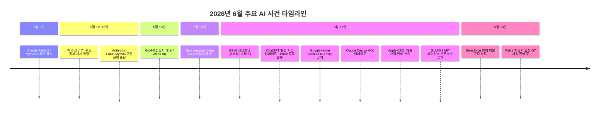
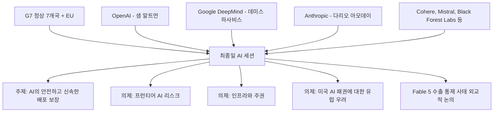
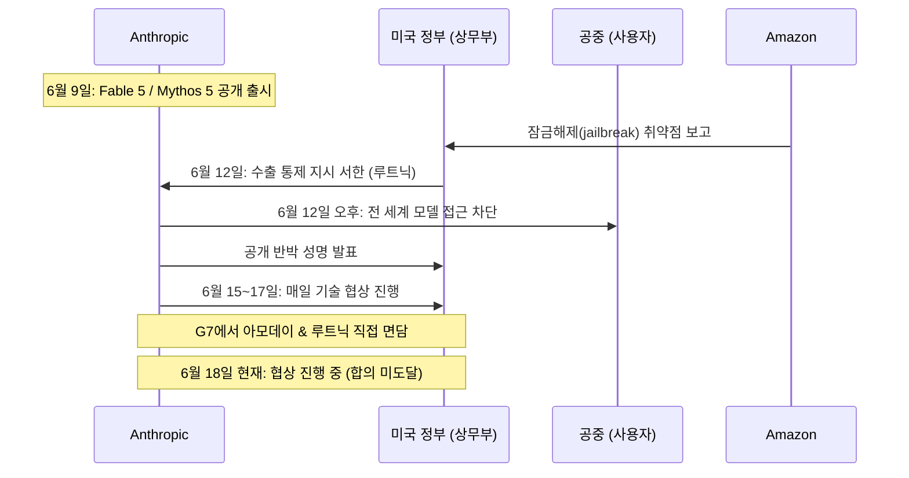
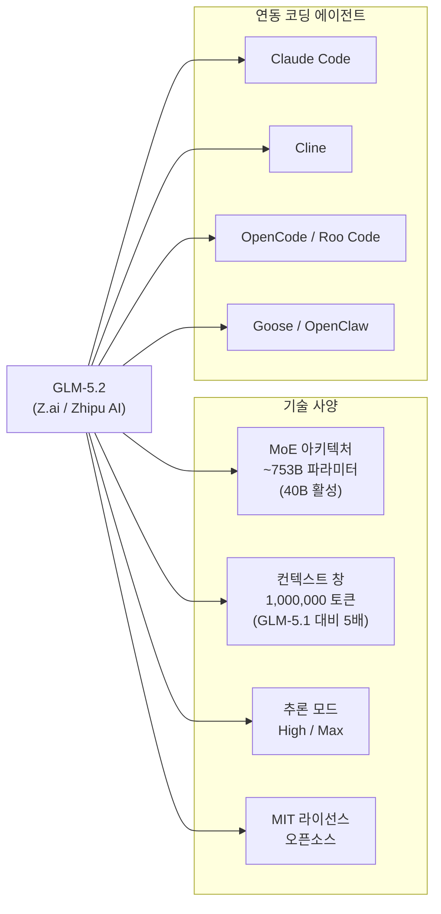
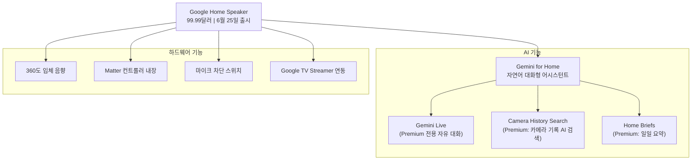
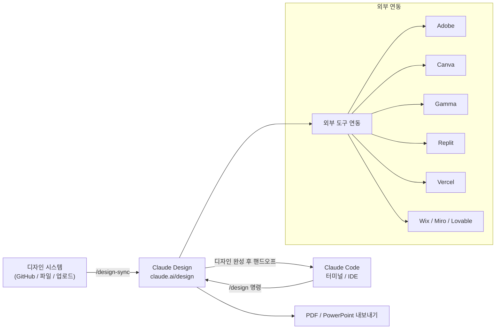
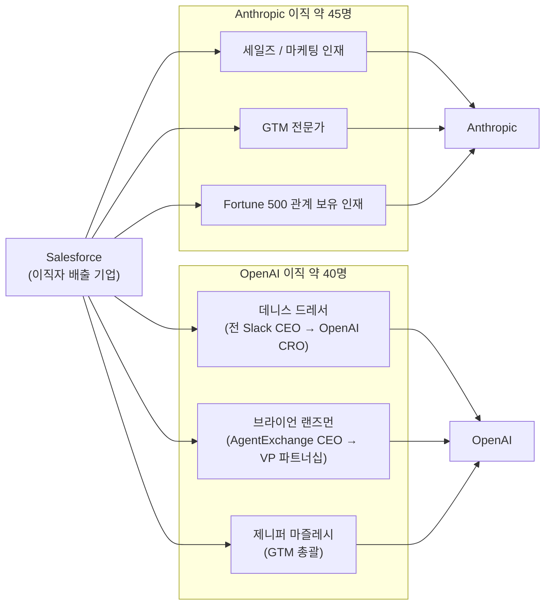

> **작성일**: 2026년 6월 18일  
> **출처**: CNBC, Reuters, The Globe and Mail, Engadget, 9to5Mac, Android Central, Digital Trends, VentureBeat, Anthropic 공식 블로그, Benzinga, MacRumors, xAI 공식 발표 등 다수  
> **요약 원본**: Threads [@ai_dogi_kitten](https://www.threads.com/@ai_dogi_kitten/post/DZtEkIOEjjz)

---

## 목차

1. [G7 정상회담과 AI 기업 수장들의 이례적 참석](#1-g7-정상회담과-ai-기업-수장들의-이례적-참석)
2. [Anthropic의 Fable 5 수출 통제 사태와 재출시 협상 경과](#2-anthropics-fable-5-수출-통제-사태와-재출시-협상-경과)
3. [GLM-5.2: 중국 AI의 반격과 코딩 에이전트 생태계 편입](#3-glm-52-중국-ai의-반격과-코딩-에이전트-생태계-편입)
4. [ChatGPT 일정 기능 전면 개편과 Pulse 서비스 종료](#4-chatgpt-일정-기능-전면-개편과-pulse-서비스-종료)
5. [Google, 10년 만의 신형 스마트 스피커 발표 — Gemini 탑재](#5-google-10년-만의-신형-스마트-스피커-발표--gemini-탑재)
6. [xAI, Grok Imagine Video 1.5 Fast 정식 출시](#6-xai-grok-imagine-video-15-fast-정식-출시)
7. [Claude Design 대규모 업데이트 — Claude Code와의 완전한 통합](#7-claude-design-대규모-업데이트--claude-code와의-완전한-통합)
8. [Apple, 메모리 가격 급등으로 제품 가격 인상 불가피 선언](#8-apple-메모리-가격-급등으로-제품-가격-인상-불가피-선언)
9. [OpenAI와 Anthropic, Salesforce에서 약 100명 인재 대거 영입](#9-openai와-anthropic-salesforce에서-약-100명-인재-대거-영입)

---

## 전체 사건 흐름 개요

---

## 1. G7 정상회담과 AI 기업 수장들의 이례적 참석

### 무슨 일이 일어났나

2026년 6월 17일, 프랑스 알프스 산자락의 휴양지 에비앙-레-뱅(Évian-les-Bains)에서 열린 G7 정상회담(제52회)의 마지막 날은 이례적인 장면으로 막을 내렸다. 미국·영국·캐나다·프랑스·독일·이탈리아·일본 등 7개국 정상이 한자리에 모인 가운데, 역사상 처음으로 세계 최대 AI 기업의 최고경영자들이 정식 오찬 회의에 참석했다.

OpenAI의 샘 알트먼(Sam Altman), Google DeepMind의 데미스 하사비스(Demis Hassabis), 그리고 Anthropic의 다리오 아모데이(Dario Amodei)가 직접 도널드 트럼프 미국 대통령 및 각국 정상들과 함께 "AI의 안전하고 신속하며 효과적인 배포 보장(Ensuring a safe, rapid and effective deployment of artificial intelligence)"이라는 주제로 워킹 런치에 참석했다. 이 외에도 캐나다의 Cohere AI, 프랑스의 Mistral, 독일의 Black Forest Labs, 이탈리아의 Domyn, 일본의 Sakana AI, 영국의 Synthesia 등 각국을 대표하는 소규모 AI 연구소 수장들도 자리를 함께 했다.

### 왜 중요한가

외교 전문가들은 이 장면이 단순한 의전 행사가 아니라고 지적한다. 미국외교관계위원회(CFR)의 AI 및 국가안보 전문가 제시카 브랜트(Jessica Brandt)는 "AI에 대해 신뢰할 수 있는 공약을 이행하려면 이제 각국 정상이 실제로 기술을 개발하는 소수의 민간 기업 경영자들의 협력, 나아가 승인이 필요하게 됐다"면서 "누가 테이블에 앉을 자격을 갖는지, 권력이 어디에 놓여 있는지를 보여주는 신호"라고 평가했다.

G7 정상들은 이틀에 걸쳐 러시아-우크라이나 전쟁과 이란 핵협상 등을 논의했고, 마지막 날 AI의 미래와 미국 기업들의 패권적 위상이라는 민감한 주제를 다뤘다. 유럽 각국은 미국 AI 기업들이 전 세계 AI 인프라를 사실상 독점하는 구조에 대한 우려를 표명하면서, AI 주권(AI sovereignty)이라는 개념이 G7 논의의 핵심 키워드로 떠올랐다.

이 정상회담이 더욱 주목받은 또 다른 이유는 Anthropic의 Fable 5 수출 통제 사태가 불과 5일 전에 발생했기 때문이다. 미국 정부의 민간 AI 기업에 대한 전례 없는 개입이 G7 외교 무대와 직접 맞닿아 있다는 점에서, 이번 회담은 단순한 기술 정책 토론을 넘어 AI 지정학(AI geopolitics)의 새로운 국면을 상징하는 사건으로 평가된다.

---

## 2. Anthropic의 Fable 5 수출 통제 사태와 재출시 협상 경과

### 사건의 발단 — Claude Fable 5 출시

2026년 6월 9일, Anthropic은 내부적으로 "Mythos 클래스"로 분류하는 최상위 모델 계열의 대중 공개 버전인 **Claude Fable 5**를 정식 출시했다. Fable(라틴어 'fabula'에서 유래, "이야기")는 그리스어 'mythos'와 동의어라는 어원을 갖고 있으며, 이름에서부터 Mythos 모델의 파생임을 시사한다. 출시와 동시에 Fable 5보다 더 높은 성능을 가진 **Claude Mythos 5**도 기존 승인 기관들에게 배포됐다.

Fable 5는 소프트웨어 엔지니어링, 지식 업무, 비전 영역에서 탁월한 성능을 발휘하도록 설계됐지만, 사이버보안, 생물학, 화학 등 고위험 영역에서는 응답을 차단하고 Claude Opus 4.8로 자동 폴백하는 안전 장치가 내장되어 있었다.

### 미국 정부의 전격 수출 통제 지시

출시로부터 단 3일 뒤인 6월 12일, 상황은 급변했다. 미국 상무장관 하워드 루트닉(Howard Lutnick)이 Anthropic CEO 다리오 아모데이에게 서한을 보내, Fable 5와 Mythos 5를 전 세계 외국 국적자(미국 내 근무 중인 외국인 포함)에게 상무부 개별 허가 없이는 수출·재수출·이전할 수 없다는 지시를 내렸다. 서한은 형사 및 민사 제재를 위협하는 내용을 담고 있었다.

이 지시는 트럼프 대통령이 6월 2일 서명한, AI 시스템의 국가 안보 위험을 최대 1개월간 심사하는 프레임워크 구축에 관한 행정명령이 발효된 직후 나온 것이다. 루트닉의 서한에는 중국, 러시아 등 우려 국가의 군사정보 사용자가 이 모델을 활용할 경우 위험하다는 판단이 담겨 있었으며, 구체적으로는 아마존 CEO 앤디 재시(Andy Jassy)가 재무장관 스콧 베센트(Scott Bessent) 등에게 아마존 연구원들이 Fable 5 프롬프트를 통해 사이버 공격에 활용 가능한 정보를 추출할 수 있다는 점을 보고한 것이 계기가 됐다고 월스트리트저널(WSJ)이 보도했다. 아마존은 Anthropic의 주요 투자사다.

Anthropic은 이날 오후 5시 21분(동부 기준) 지시를 받은 뒤 수 시간 내에 두 모델의 접근을 전면 차단했다.

### Anthropic의 반박과 협상 경과

Anthropic은 즉각 공개 성명을 내고 정부의 결정에 강력히 반발했다. 회사는 "단 하나의 협소한 잠재적 잠금해제(jailbreak) 발견이 수억 명에게 배포된 상용 모델을 회수하는 사유가 되어서는 안 된다"면서, 문제가 된 취약점은 이미 공개된 독립적인 레드팀 보고서에 나온 내용이며, 동일한 기법이 OpenAI의 GPT-5.5를 포함한 다른 공개 모델에도 동일하게 적용된다고 주장했다. 또한 "이 기준이 업계 전반에 적용된다면 모든 프런티어 모델 개발사의 신규 모델 배포가 사실상 중단될 것"이라고 경고했다.

협상은 즉각 시작됐다. 월요일(6월 15일)부터 Anthropic 고위 기술 직원들은 상무부 직원들과 거의 매일 가상 회의를 가졌으며, 국가사이버국장 숀 케언크로스(Sean Cairncross)도 협상에 참여했다. 루트닉과 아모데이는 G7 정상회담이 열리는 에비앙에서도 직접 면담하며 협상을 이어갔다.

6월 18일 현재, 아직 공식적인 합의에는 이르지 못한 상태다. 예측 시장 플랫폼 Kalshi의 트레이더들은 7월 1일 이전 접근 복구 가능성을 57%, 7월 10일 이전을 67%, 7월 17일 이전을 75%로 보고 있다. 재출시를 위한 핵심 조건은 정부가 모델이 미국에 해를 끼치는 데 사용될 수 없다는 확신을 얻는 것이며, Anthropic은 국가가 투명하고 공정하며 기술적 근거에 바탕을 둔 법정 절차를 통해 안전하지 않은 배포를 차단할 권한을 가져야 한다는 입장이다.

이 사태는 미국 정부가 수출통제개혁법(ECRA)을 민간 AI 프런티어 모델에 직접 적용한 역사상 가장 중요한 개입 사례로 평가된다.

---

## 3. GLM-5.2: 중국 AI의 반격과 코딩 에이전트 생태계 편입

### 타이밍의 정치학

2026년 6월 13일, 중국 AI 기업 Zhipu AI(이하 Z.ai)는 자사의 플래그십 코딩 모델 **GLM-5.2**를 공개했다. 이는 미국 정부가 Anthropic의 Fable 5에 수출 통제를 적용한 바로 다음날이었으며, Zhipu의 창립자 탕지에(Jie Tang)는 론칭 게시물을 "특정 프런티어 모델에 대한 갑작스러운 접근 제한은 매우 유감스러운 일"이라는 문장으로 시작했다. 타이밍이 의도적이었음은 부인하기 어렵다.

6월 17일에는 MIT 라이선스 하에 모델 전체 가중치(weight)가 오픈소스로 공개되었다. 상업적 사용을 포함한 완전 개방형 라이선스다.

### GLM-5.2의 기술 사양

GLM-5.2는 총 파라미터 약 744~753억 개 규모의 MoE(Mixture-of-Experts) 아키텍처를 기반으로, 한 번에 활성화되는 파라미터는 약 400억 개다. 가장 두드러진 업그레이드는 컨텍스트 창 크기다. 전작 GLM-5.1의 약 200,000 토큰에서 **1,000,000 토큰(100만 토큰)** 으로 무려 5배 확장됐다. 최대 출력 토큰은 131,072개로, 매우 긴 답변도 생성 가능하다. 이 외에 `High`와 `Max` 두 가지 추론 노력(thinking effort) 모드가 새롭게 도입됐으며, 코딩 태스크에는 Max 모드가 권장된다.

### 코딩 에이전트 생태계에 즉시 통합

GLM-5.2가 주목받는 또 다른 이유는 OpenAI 호환 API 엔드포인트를 통해 출시 첫날부터 주요 코딩 에이전트 도구들과 바로 연동 가능하다는 점이다. Claude Code, Cline, OpenCode, Roo Code, Goose, Crush, OpenClaw, Kilo Code 등 8개 이상의 코딩 에이전트 환경에서 기본 URL과 모델 이름만 교체하면 즉시 사용할 수 있다. 단일 리포지토리 전체를 단번에 컨텍스트에 넣을 수 있는 100만 토큰의 입력 창은, 에이전틱 코딩 루프에서 컨텍스트 압축(compaction) 빈도를 대폭 줄여준다.

비용 측면에서도 경쟁력이 있다. GLM-5.2는 GLM Coding Plan($10~$80/월) 구독 내에 추가 비용 없이 포함되며, 이는 미국 프런티어 모델 API 가격의 약 10분의 1 수준이다. Z.ai 측은 출시 시 공식 벤치마크 수치를 발표하지 않았지만, 자체 BridgeBench에서 42.8점으로 Fable 5를 능가한다고 주장했다. 6월 17일 MIT 오픈소스 공개 후에는 FrontierSWE 벤치마크에서 GPT-5.5를 6분의 1 비용에 능가한다는 보고가 나오고 있다.

---

## 4. ChatGPT 일정 기능 전면 개편과 Pulse 서비스 종료

### 새로운 일정 기능 (Scheduled Tasks)

2026년 6월 17일, OpenAI는 ChatGPT에 **예약 작업(Scheduled Tasks)** 기능을 대폭 개편해 공식 출시했다. 이 기능은 Plus, Pro, Business, Enterprise 구독자를 대상으로 웹과 모바일에서 우선 제공된다(무료 플랜 적용 일정은 미발표). 기존에도 태스크 예약 기능은 있었지만, 이번 업데이트를 통해 더 빠르고 안정적으로 동작하며, 새롭게 생긴 **예약 페이지(Scheduled page)** 에서 등록된 모든 작업을 한눈에 관리할 수 있게 됐다.

핵심 기능 중 하나는 **모니터링 태스크**다. ChatGPT가 사용자를 대신해 웹을 검색하거나 연결된 앱을 주기적으로 점검한 뒤, 지정된 시간에 결과를 알려주는 방식이다. 예를 들어 특정 뉴스 주제, 주가, 날씨 등 원하는 정보를 정해진 시간마다 자동으로 수집·요약해 전달한다.

### Pulse 서비스 종료

이와 동시에, OpenAI는 작년에 도입한 **Pulse** 기능의 종료를 발표했다. Pulse는 ChatGPT가 사용자의 과거 대화, 메모리, 피드백을 바탕으로 매일 한 번씩 비동기적으로 맞춤형 리서치를 수행하고, 그 결과를 시각적 요약 카드 형태로 다음 날 전달하는 서비스였다. 출시 이후 상당한 인기를 끌었으나, 이번 예약 작업 기능 고도화로 그 역할이 대체된다고 판단해 종료를 결정했다.

Pro 구독자는 발표일로부터 14일간 Pulse를 계속 사용할 수 있다. Pulse를 즐겨 사용했던 이용자들에게는 ChatGPT에게 "나의 과거 대화와 이메일 기반으로 매일 아침 일일 브리핑을 예약해줘"라고 요청하는 방식으로 동일한 경험을 이어갈 수 있다고 OpenAI는 안내하고 있다.

이번 변화의 핵심은 "프로액티브한 AI 경험은 개인화되고, 행동 지향적이며, 사용자가 직접 조종할 수 있을 때 가장 유용하다"는 Pulse 운영에서 얻은 교훈이 새 예약 기능 설계에 반영됐다는 점이다.

---

## 5. Google, 10년 만의 신형 스마트 스피커 발표 — Gemini 탑재

### 배경 — 10년 만의 신제품

2016년 오리지널 Google Home이 출시된 이래 약 10년 만에 Google이 완전히 새로운 스마트 스피커를 발표했다. **Google Home Speaker**로 명명된 이 제품은 2026년 6월 17일 공식 공개됐으며, 사전 예약은 동일 일에 시작되어 6월 25일부터 배송이 시작된다. 가격은 **99.99달러**로 책정됐다.

출시가 계획보다 지연된 배경에는 의도적인 전략이 있었다. Google은 신형 하드웨어를 출시하기에 앞서, 먼저 기존의 구형 스피커(Nest Audio 등)에 Gemini 기능을 롤아웃한 뒤 약 350만 명의 얼리 액세스 참여자들로부터 2,500개 이상의 버그를 수정했다. 새 스피커는 그 완성된 소프트웨어 기반 위에 올라선 제품이다.

### 핵심 특징

Google Home Speaker의 가장 큰 차별점은 Google Assistant 대신 **Gemini for Home**을 탑재했다는 점이다. Gemini는 엄격하게 정해진 명령어 패턴 없이도 자연스럽고 대화적인 방식으로 응답하며, 자기 수정(mid-sentence correction)이나 복합 명령도 이해한다. 스피커 하단에는 Gemini가 듣고 있을 때, 생각 중일 때, 응답할 때를 각각 다른 색으로 표시하는 **라이트 링**이 탑재됐다.

음향 측면에서는 360도 입체 음향을 지원하며, Google TV Streamer와 페어링하면 홈 시어터 경험도 가능하다. 기존 Nest 스피커, Nest 디스플레이, Google Cast 지원 기기와의 멀티룸 연동도 그대로 유지된다. 스마트홈 측면에서는 **Matter 컨트롤러** 기능이 내장되어 추가 허브 없이 스마트홈 기기를 직접 관리할 수 있다. 마이크 차단 스위치도 포함됐다.

색상은 Porcelain, Hazel, Berry, Jade 4종이며, Berry와 Jade는 미국 전용이다. Nest Audio는 이 제품 출시와 함께 공식 단종됐다. 구매자에게는 2026년 9월 30일까지 6개월 Google Home Premium 구독 혜택이 제공된다. 고급 기능인 Gemini Live(자유 대화), Camera History Search(카메라 기록 AI 검색), Home Briefs(일일 요약)는 유료 Google Home Premium 구독을 통해 이용 가능하다.

---

## 6. xAI, Grok Imagine Video 1.5 Fast 정식 출시

### 무엇이 출시됐나

2026년 6월 16~17일, 일론 머스크의 xAI는 자사의 이미지-투-비디오(image-to-video) 생성 모델인 **Grok Imagine Video 1.5**를 API에서 정식 공개(GA)하면서, 동시에 소비자용 앱에서 사용 가능한 **Video 1.5 Fast** 버전을 grok.com/imagine, iOS 및 Android 앱에 배포했다. 이 두 모델은 Grok 챗봇과는 완전히 별도의 독립적인 비디오 생성 도구다.

### 성능 개선 내용

이전 버전 대비 개선은 세 가지 축으로 이루어졌다.

첫째, **오디오 품질**이다. 기존에는 비디오와 오디오를 별도로 생성한 뒤 합치는 방식이었다면, 1.5 버전부터는 음향 효과(sound effects), 주변음(ambience), 캐릭터 대사(dialogue)가 영상 생성과 동일한 패스(pass) 안에서 함께 생성된다. 이를 통해 소리가 영상 속 동작에 자연스럽게 '얹히는' 효과를 낸다. 입술 동기화(lip-sync) 정확도도 향상됐다.

둘째, **물리 기반 모션**이다. 클립 전체에 걸쳐 움직임의 일관성이 높아졌다. 이전 버전에서 자주 발생하던 시각적 뒤틀림(warp) 현상이 줄어들고, 물체의 무게감과 운동량(momentum)이 더 현실적으로 표현된다.

셋째, **생성 속도**다. Video 1.5 Fast는 6초짜리 720p 영상을 약 25초 만에 생성한다. 이는 이전 모델의 40초 이상 대비 거의 두 배 빠른 속도다.

### 창작 워크플로우 지원 신기능

모델 출시와 함께 몇 가지 창작 생산성 기능도 함께 공개됐다. Projects 기능을 통해 생성 결과물을 왼쪽 사이드바의 폴더 단위로 정리할 수 있게 됐다. 복수 에이전트 병렬 처리를 통해 하나의 생성이 완료되기 전에 다음 프롬프트를 미리 시작할 수 있다. 또한 시맨틱 미디어 검색 기능이 추가되어, 생성한 수많은 클립 중에서 원하는 장면을 설명 기반으로 빠르게 찾을 수 있다.

Video 1.5 Fast의 공개에 맞춰, 영화 제작자 데이비드 톰슨(David Thompson, @heavypulp)이 Grok Imagine 1.5만을 사용해 제작한 영화 트레일러 "Odyssey"가 함께 공개돼 모델의 창작 잠재력을 시연했다.

---

## 7. Claude Design 대규모 업데이트 — Claude Code와의 완전한 통합

### Claude Design란 무엇인가

Anthropic은 2026년 4월에 디자인 프로토타이핑 도구인 **Claude Design**을 리서치 프리뷰로 출시했다. 출시 첫 주에만 100만 명이 넘는 사용자가 몰릴 만큼 뜨거운 반응을 얻었다. 그러나 동시에 심각한 문제도 드러났는데, 토큰 소모량이 너무 많아 한 PCWorld 리뷰어는 하나의 웹페이지 프로토타입 3개를 만드는 데 Claude Pro 주간 사용량의 80%를 불과 25분 만에 소진했다.

### 6월 17일 주요 업데이트 내용

Anthropic은 6월 17일, Claude Design의 대규모 개편을 발표했다.

가장 중요한 변화는 **디자인 시스템 가져오기** 기능의 재설계다. GitHub 리포지토리, 디자인 파일, 직접 업로드 등 다양한 경로를 통해 하나 이상의 디자인 시스템을 가져올 수 있다. Claude는 이 컴포넌트를 기반으로 설계를 진행하고, 출력 결과를 디자인 시스템과 대조하여 스스로 교정한 뒤 사용자에게 보여준다. 대규모 팀을 위해 관리자(admin) 역할도 추가되어 표준 디자인 시스템을 고정·승인하고 편집을 잠글 수 있다.

두 번째 핵심은 **Claude Code와의 완전한 통합**이다. Claude Code 터미널에서 `/design-sync` 명령을 실행하면 로컬 코드베이스의 디자인 시스템을 Claude Design으로 가져와 기존 컴포넌트에서 시작할 수 있다. 반대로 설계가 완료됐을 때는 Claude Code로 핸드오프(handoff)하여 스크린샷에서 처음부터 다시 시작하는 대신 기존 작업을 이어받아 구현할 수 있다. Claude Code를 먼저 사용하는 사용자라면 `/design` 명령으로 터미널을 벗어나지 않고도 디자인 프로젝트를 생성·편집·동기화할 수 있다.

세 번째는 **토큰 소모 문제 해결**이다. Claude Design은 이제 채팅, Claude Cowork, Claude Code와 사용량 한도를 공유한다. 평균 턴당 토큰 소모량이 감소하고 에러율도 급감했다.

네 번째는 **외부 도구 연동 확장**이다. Adobe, Base44, Canva, Gamma, Lovable, Miro, Replit, Vercel, Wix 등 9개 도구로의 내보내기 또는 연동이 지원된다. PDF와 PowerPoint로의 안정적인 내보내기도 가능해졌다.

Claude Design은 Claude 데스크탑 앱 사이드바에 새로운 위치를 갖게 됐으며, claude.ai/design에서도 접근 가능하다.

---

## 8. Apple, 메모리 가격 급등으로 제품 가격 인상 불가피 선언

### Tim Cook의 역사적 발언

2026년 6월 17일, Apple CEO 팀 쿡(Tim Cook)이 월스트리트저널(WSJ)과의 인터뷰에서 "제품 가격 인상은 불가피하다(price increases are unavoidable)"고 선언했다. Apple이 공식적으로 제품 가격 인상을 예고한 것은 매우 이례적인 일이다. 쿡은 메모리 부족 사태를 "40년 경력에서 어떤 분야에서도 이런 일을 본 적이 없다"면서 "100년에 한 번 있을 홍수" 수준으로 표현했다.

### 가격 급등의 원인

핵심 원인은 AI 데이터센터 수요의 폭발적 증가다. AI 인프라 구축 기업들이 DRAM과 NAND 플래시 메모리 칩을 대량으로 선점하면서 일반 소비자 가전용 메모리 공급이 심각하게 부족해졌다. 삼성, SK하이닉스, 마이크론은 생산 능력 확대에 나서고 있지만, 추가 생산분의 우선순위가 서버용 HBM(High Bandwidth Memory) 등에 쏠려 있어 소비자 가전용 공급 부족은 당분간 지속될 전망이다.

이미 삼성과 SK하이닉스는 Apple에 대한 메모리 가격을 2026년부터 인상하기로 결정했으며, Apple이 이전까지 유지하던 장기공급계약(Long-Term Agreement, LTA)도 2026년 초에 만료됐다. 메모리 칩은 아이폰 부품 원가에서 10~20%, 고가 제품에서는 그보다 낮은 비중을 차지하지만, 전 제품군에 걸쳐 누적되면 상당한 원가 압박이다.

이미 삼성, 마이크로소프트, 소니, 델 등 복수의 글로벌 기업들이 가격을 인상했다. 아직 Apple은 가격을 올리지 않은 몇 안 되는 대형 소비자 전자기업 중 하나였으나, 이날 발언으로 사실상 가격 인상이 기정사실화됐다. 맥북 모델은 최대 100~400달러 인상 가능성이 있다는 분석이 나온다. Apple 주가(AAPL)는 당일 약 1.10% 하락했다.

---

## 9. OpenAI와 Anthropic, Salesforce에서 약 100명 인재 대거 영입

### 보도 내용

2026년 6월 18일, The Information은 LinkedIn 프로필 데이터를 바탕으로 **2026년 초부터 현재까지 약 45명의 Salesforce 직원이 Anthropic에, 약 40명이 OpenAI에 이직**했다는 사실을 보도했다. 두 회사를 합치면 약 100명에 육박하는 규모다.

### 이직의 성격 — 연구자가 아닌 영업·GTM 인재

주목할 점은 이직자들의 직무 분포다. AI 인재 전쟁은 지금까지 주로 소수의 엘리트 연구자들을 놓고 수천만~수억 달러짜리 패키지로 경쟁하는 방식이었다. 그러나 이번에 Salesforce를 떠난 이직자들은 대부분 **영업(Sales), 마케팅(Marketing), 고투마켓(Go-to-Market, GTM) 분야** 인재들이다.

가장 주목받는 사례는 슬랙(Slack) CEO 출신의 **데니스 드레서(Denise Dresser)** 로, OpenAI의 최고매출책임자(CRO)로 합류했다. Salesforce의 AgentExchange CEO 출신 **브라이언 랜즈먼(Brian Landsman)** 은 OpenAI 글로벌 파트너십 부사장으로 이직했다. **제니퍼 마즐레시(Jennifer Majlessi)** 는 OpenAI의 GTM 총괄로 합류했다.

### 이 현상이 의미하는 것

AI 기업들이 Salesforce 출신 인재를 탐내는 이유는 명확하다. Salesforce는 수십 년에 걸쳐 미국 Fortune 500 기업들과 깊은 관계를 구축해온 기업이다. Salesforce 영업 인재들은 대기업의 의사결정 구조, 구매 프로세스, 규정 준수 요건 등을 이미 잘 알고 있어, AI 서비스를 기업 고객에게 판매하고 기존 비즈니스 관계를 AI 계약으로 전환하는 데 즉각적인 가치를 발휘한다.

OpenAI CFO 사라 프레이(Sarah Friar)는 기업 고객이 현재 매출의 최대 40%를 차지하며 연내 50%까지 성장할 수 있다고 밝혔다. OpenAI는 이미 100만 기업 고객을 확보했고, 2026년 말까지 직원 수를 4,500명에서 8,000명으로 두 배 확대할 계획이다.

한편 Salesforce CEO 마크 베니오프(Marc Benioff)는 "2026년 한 해 동안 Anthropic 토큰에 약 3억 달러를 쓸 것"이라고 말하는 동시에, 자사 최고 인재들이 AI 기업으로 떠나는 상황을 지켜보고 있다. 이는 SaaS 산업에서 AI 기업으로의 권력 이동이 제품 경쟁을 넘어 인재 시장에서도 구체화되고 있음을 상징적으로 보여준다.

---

## 종합 분석 — 하루에 담긴 AI 산업의 지각 변동

오늘 하루의 뉴스를 종합하면, 몇 가지 거시적 흐름이 선명하게 드러난다.

**첫째, AI가 지정학의 전면에 등장했다.** G7 정상회담 마지막 날 의제가 AI였고, 주요 AI 기업 수장들이 국가 정상들과 함께 공식 석상에 앉았다. Fable 5 수출 통제 사태는 국가 안보와 AI 기술이 어떻게 충돌할 수 있는지를 보여줬고, 이 갈등이 G7 외교 무대에서 동시에 진행됐다는 점은 우연이 아니다.

**둘째, 미국의 AI 수출 통제가 중국 오픈소스 AI의 성장을 역설적으로 가속화하고 있다.** GLM-5.2가 Fable 5 수출 통제 발표 하루 만에 나온 것은 시장의 공백을 중국 AI가 메우려는 명확한 의도를 보여준다. MIT 오픈소스 공개까지 더해지면 국경을 넘어 도구를 배포하는 데 법적·기술적 장벽이 낮아진다.

**셋째, AI 경쟁이 기술에서 GTM(Go-to-Market)으로 확장됐다.** Salesforce 인재 대규모 이동은 AI 기업들이 순수 기술 경쟁을 넘어 기업 영업·판매 능력을 확보하는 단계에 진입했음을 의미한다.

**넷째, AI 수요가 전통 소비자 가전 산업의 원가 구조를 직접 흔들고 있다.** Apple의 가격 인상 선언은 AI가 반도체 공급망을 통해 스마트폰·컴퓨터 같은 일상 제품 가격에까지 영향을 미치기 시작했음을 알린다.

**다섯째, 도구 생태계는 계속 성숙해가고 있다.** Claude Design과 Claude Code의 통합, ChatGPT 예약 기능 강화, Grok의 영상 생성 속도 개선, Google의 Gemini 스마트 스피커 — 이 모두는 AI가 일상 생산성 도구로 깊숙이 편입되는 과정의 일환이다.

---

*이 문서는 확인 가능한 공개 출처에 기반하여 작성되었습니다. Fable 5 재출시 협상 등 진행 중인 사안은 추후 공식 발표에 따라 결과가 달라질 수 있습니다.*
