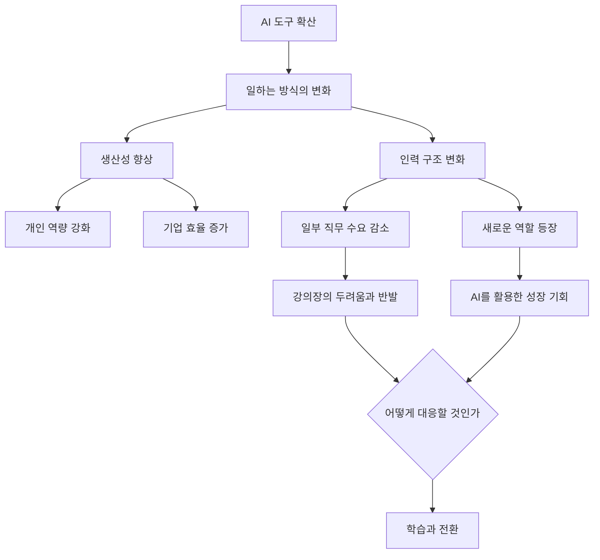
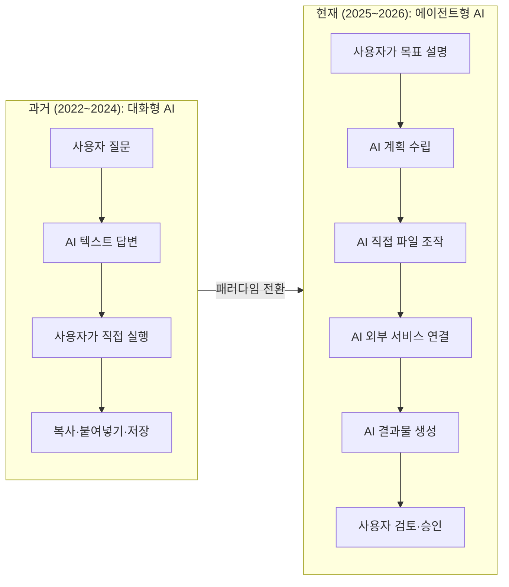
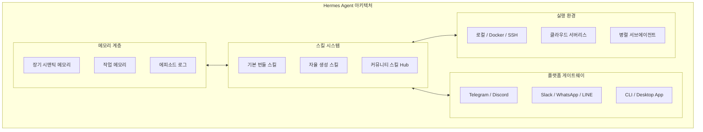
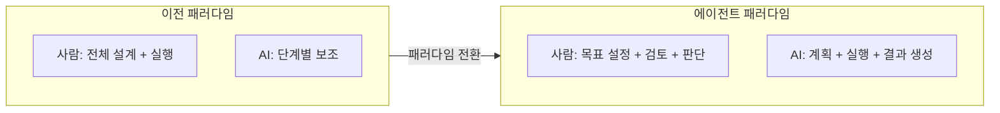
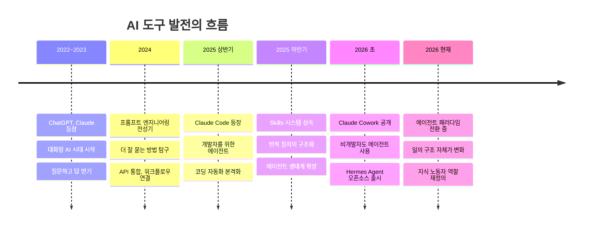

> **원문 출처**: [Facebook 게시글](https://www.facebook.com/share/p/1DoCkstqVo/) (2026년 6월18일)  
> **주제**: 전국 AI 강의 현장 관찰, 대화형 AI에서 에이전트(Agent)로의 전환, 일의 변화에 대한 불안과 성장

> **AI 강의 현장에서 본 다음 단계**
> 
> 지방을 돌며 AI 강의를 이어가다 보면, 강의 내용보다 청중의 표정에서 변화가 먼저 읽힙니다. 아직 AI에 손을 대지 않은 사람도 있습니다. 그러나 업무에 AI를 들이려는 사람, 이미 쓰는 사람, 더 깊이 쓰려는 사람은 눈에 띄게 늘었습니다. 이 도구를 자신의 성장이나 일의 변화로 연결하려는 이들도 그만큼 많아졌습니다.
> 
> 그 자리에는 두려움도 같이 앉아 있습니다. 사람들이 불안해하는 것은 AI 모델 자체가 아닙니다. AI가 일하는 방식을 바꾸는 그 과정입니다. 방식이 바뀌면 생산성만 오르지 않습니다. 사람의 자리가 줄어드는 결과로 이어지기도 합니다. 강의장에서 자주 부딪히는 반발이 바로 이 지점에서 나옵니다. 외면하기 어려운 우려입니다.
> 
> 이 긴장은 요즘 들어 더 또렷해졌습니다. 얼마 전까지 GPT나 클로드(Claude)는 대화창에서 말을 주고받는 상대였습니다. 지금은 코워크(Cowork), 스킬(Skill), 헤르메스 에이전트(Hermes Agent)로 무게가 옮겨가고 있습니다. 대화창에서 에이전트(Agent)로 넘어가는 흐름입니다. 일을 한 번 거들던 도구가, 일의 흐름을 맡는 구조로 바뀌는 중입니다.
> 
> 나 자신도 그 길을 지나고 있습니다. 전에는 눈앞에 놓인 일을 푸는 데 매달렸습니다. 지금은 더 멀리 봅니다. 보는 시야가 넓어졌고, 다루는 일의 단위도 커졌습니다. 한 주를 어떻게 넘길지가 아니라, AI가 지금 어디까지 왔고 다음 단계를 어떻게 밟을지를 같이 헤아립니다.
> 
> 이 변화는 나 혼자의 일이 아닙니다. 나는 흐름을 공부하며 방법을 쌓고, 그 방법을 다른 사람과 나누는 자리에서 다음 단계가 열립니다. 시야가 넓어지는 일은, 결국 함께 자라는 과정입니다.
> 

---

## 목차

1. [이 글이 담고 있는 것](#1-이-글이-담고-있는-것)
2. [강의장의 풍경 — 달라진 청중](#2-강의장의-풍경--달라진-청중)
3. [두려움이 앉아 있는 자리](#3-두려움이-앉아-있는-자리)
4. [패러다임 전환: 대화창에서 에이전트로](#4-패러다임-전환-대화창에서-에이전트로)
5. [핵심 도구 해설 1: Claude Cowork](#5-핵심-도구-해설-1-claude-cowork)
6. [핵심 도구 해설 2: Skill (스킬)](#6-핵심-도구-해설-2-skill-스킬)
7. [핵심 도구 해설 3: Hermes Agent](#7-핵심-도구-해설-3-hermes-agent)
8. [에이전트 전환의 의미 — 일의 구조가 바뀐다](#8-에이전트-전환의-의미--일의-구조가-바뀐다)
9. [나 자신의 변화 — 시야가 넓어진다는 것](#9-나-자신의-변화--시야가-넓어진다는-것)
10. [함께 자란다는 것](#10-함께-자란다는-것)
11. [정리: 지금 이 전환을 어떻게 받아들일 것인가](#11-정리-지금-이-전환을-어떻게-받아들일-것인가)

---

## 1. 이 글이 담고 있는 것

이 글은 단순한 기술 소개가 아닙니다. 전국 지방 도시를 돌며 AI 강의를 이어가는 한 강사의 눈에 포착된 **현장의 실제**입니다. 청중의 표정, 반발, 불안, 그리고 변화의 조짐 — 그 모든 것을 함께 담고 있습니다.

동시에, 이 글은 현재 AI 도구가 어느 방향으로 이동하고 있는지를 매우 정확하게 짚어냅니다. GPT나 Claude를 대화 상대로만 쓰던 시대에서, **코워크(Cowork), 스킬(Skill), 헤르메스 에이전트(Hermes Agent)** 같은 도구들이 무게 중심을 옮기고 있는 지금의 전환점을 직접 목격하고 서술한 것입니다.

이 해설문은 그 글의 맥락과 배경을 충분히 이해할 수 있도록, 각 개념과 도구를 실제 정보를 기반으로 상세히 풀어냅니다.

---

## 2. 강의장의 풍경 — 달라진 청중

원문의 첫 번째 관찰은 청중의 변화입니다. 강사는 지방을 돌며 강의를 이어가면서, 사람들이 내용보다 청중의 **표정**에서 먼저 변화를 읽는다고 씁니다.

과거의 AI 강의장은 주로 두 부류로 나뉘었습니다. 관심은 있지만 막연하게 신기해하는 사람들과, "그게 내 일과 무슨 상관이냐"고 생각하는 사람들이었습니다. 그러나 2025년 하반기를 지나 2026년에 접어들면서, 이 구도가 눈에 띄게 달라졌다고 강사는 말합니다.

지금의 강의장에는 네 가지 유형의 사람이 섞여 있습니다.

첫째, 아직 AI에 손을 대지 않은 사람입니다. 주변에서 모두 쓴다는 말은 들었지만, 어디서부터 시작해야 할지 모르거나, 필요성을 아직 실감하지 못한 층입니다.

둘째, 업무에 AI를 들이려는 사람입니다. "써보고 싶은데 어떻게 써야 하나"를 알고 싶어서 강의를 듣는 사람들입니다.

셋째, 이미 쓰고 있는 사람입니다. 문서 요약, 이메일 초안, 자료 정리 등에 ChatGPT나 Claude를 이미 활용하고 있지만, 더 잘 쓰는 방법을 찾는 층입니다.

넷째, 더 깊이 쓰려는 사람입니다. 단순한 채팅 도구를 넘어, AI가 실제로 일의 흐름을 바꾸는 방식으로 활용하고 싶어하는 사람들입니다. 이들은 강의를 **성장의 도구**로 보고 있습니다.

강사가 인상 깊게 관찰한 것은 마지막 두 부류가 뚜렷하게 늘고 있다는 점입니다. AI를 자신의 성장이나 일의 변화로 연결하려는 사람이 많아졌습니다. 이것은 단순히 도구에 대한 관심이 늘어난 것이 아니라, AI를 **삶의 방식**으로 받아들이기 시작한 사람들이 현장에 나타나고 있다는 신호입니다.

---

## 3. 두려움이 앉아 있는 자리

원문은 강의장에 **두려움도 같이 앉아 있다**고 씁니다. 이 문장은 단순한 비유가 아닙니다. 현장에서 실제로 마주치는 반발과 불안을 담은 표현입니다.

흥미로운 것은, 강사가 사람들이 불안해하는 대상을 정확하게 짚어낸다는 점입니다. **AI 모델 자체가 두려운 것이 아닙니다.** ChatGPT가 무서운 게 아니고, Claude가 두려운 게 아닙니다.

두려운 것은 **AI가 일하는 방식을 바꾸는 그 과정**입니다.

일하는 방식이 바뀌면 무슨 일이 생기는가? 강사는 두 가지를 말합니다. 생산성이 오른다는 것, 그리고 사람의 자리가 줄어든다는 것. 이 두 가지는 서로 모순처럼 보이지만, 실제로는 동시에 일어납니다. 한 사람이 AI의 도움으로 두 사람 분의 일을 할 수 있게 되면, 조직 입장에서는 사람을 덜 써도 됩니다. 이것이 강의장에서 자주 부딪히는 반발의 실체입니다.

이 우려는 단순한 감정이 아닙니다. 실제로 근거가 있습니다. 2025~2026년 사이 미국과 한국 모두에서 AI 도입에 따른 특정 직군의 수요 감소가 관찰되고 있습니다. 데이터 입력, 간단한 번역, 기본적인 콘텐츠 작성, 초급 코딩 보조 등의 역할이 특히 영향을 받고 있습니다.

강사는 이 긴장을 외면하지 않습니다. "외면하기 어려운 우려"라고 직접 씁니다. 이것이 이 글의 가장 솔직한 대목 중 하나입니다.

---

## 4. 패러다임 전환: 대화창에서 에이전트로

이 글의 핵심 관찰은 4번째 문단에 담겨 있습니다. **"얼마 전까지 GPT나 Claude는 대화창에서 말을 주고받는 상대였습니다. 지금은 코워크(Cowork), 스킬(Skill), 헤르메스 에이전트(Hermes Agent)로 무게가 옮겨가고 있습니다."**

이 문장은 AI 도구의 발전 방향을 정확하게 짚고 있습니다.

초기의 AI 도구 — ChatGPT, Claude, Gemini — 는 본질적으로 **대화 모델**이었습니다. 사용자가 질문을 던지면 AI가 텍스트로 답합니다. 아무리 좋은 답변이 나와도, 그것을 복사해서 문서에 붙여넣고, 이메일로 보내고, 파일로 저장하는 것은 여전히 사람의 몫이었습니다. AI는 생각을 도와주는 상대였지, 일을 대신 해주는 존재가 아니었습니다.

그런데 2025년 하반기에서 2026년 사이, 이 구조가 바뀌기 시작했습니다. 새로운 도구들은 단순히 답을 내놓는 것을 넘어, **직접 행동**합니다. 파일을 열고, 수정하고, 저장하고, 외부 서비스에 연결하고, 스스로 계획을 세워 실행합니다.

강사는 이를 **"일을 한 번 거들던 도구가, 일의 흐름을 맡는 구조로 바뀌는 중"** 이라고 표현합니다. 이것이 바로 에이전트(Agent) 패러다임입니다.

이 전환을 이끌고 있는 세 가지 도구 — Cowork, Skill, Hermes Agent — 를 이제 하나씩 살펴보겠습니다.

---

## 5. 핵심 도구 해설 1: Claude Cowork

### 5.1 무엇인가

Claude Cowork는 Anthropic이 2026년 1월 공개한 **데스크톱 기반 AI 에이전트 플랫폼**입니다. 개발자를 위한 터미널 기반 도구인 Claude Code와 동일한 에이전트 아키텍처 위에 만들어졌지만, 코딩을 전혀 모르는 일반 지식 노동자를 대상으로 합니다.

가장 핵심적인 차이는 이것입니다. 기존의 Claude Chat에서는 사용자가 "이 엑셀 파일 분석해줘"라고 하면 Claude가 분석 결과를 텍스트로 내놓고, 사용자가 그것을 직접 엑셀에 적용해야 했습니다. Cowork에서는 사용자가 폴더를 지정하면 Claude가 **실제로 그 파일을 열고, 읽고, 수정하고, 새 파일을 만들어냅니다.**

### 5.2 어떻게 작동하는가

Cowork는 사용자의 컴퓨터에서 **가상 머신(VM) 환경**으로 격리되어 실행됩니다. 사용자가 접근을 허용한 특정 폴더 안에서만 작동하며, 중요한 변경 사항이 있을 때는 사용자에게 확인을 구하도록 설계되어 있습니다.

복잡한 작업을 요청하면 Cowork는 스스로 작업을 하위 단계로 분해하고, 필요한 경우 여러 작업을 병렬로 처리합니다. 예를 들어 "이 회의록 폴더를 읽어서 각각 보고서 형식으로 정리해줘"라고 하면, Claude는 폴더 안의 파일들을 하나씩 열고, 내용을 파악하고, 정해진 형식에 맞춰 새 문서를 만들어냅니다. 사용자는 이 과정을 지켜보다가 결과를 확인하면 됩니다.

### 5.3 주요 기능

**파일 시스템 접근**은 Cowork의 가장 기본적인 능력입니다. 폴더 안의 파일을 읽고, 수정하고, 새로 만들고, 이름을 바꾸는 작업을 AI가 직접 처리합니다.

**플러그인(Plugin) 시스템**은 Cowork를 특정 역할의 전문가로 만들어줍니다. Anthropic이 공개한 플러그인에는 영업, 재무, 법무, 마케팅, HR, 고객 지원 등 11개 이상의 카테고리가 있으며, 모두 오픈소스로 공개되어 있습니다. 이 플러그인들이 공개되던 날(2026년 2월), 관련 SaaS 기업들의 주가가 급락하며 시장에서 약 2850억 달러 규모의 시가총액이 증발하기도 했습니다. AI가 전문 소프트웨어의 핵심 기능을 대체할 수 있다는 현실적인 위협으로 받아들여진 것입니다.

**커넥터(Connector)** 기능은 Notion, Asana, Canva, Zoom 등 외부 서비스와 Cowork를 연결합니다. 예를 들어 Zoom 미팅의 AI 요약 정보를 바로 Cowork 작업으로 끌어와 처리하는 것이 가능합니다.

**스케줄 작업**은 Cowork의 자율성을 한 단계 높입니다. "매주 금요일 오전에 이번 주 분석 보고서를 만들어줘" 같은 지시를 한 번만 내리면, 이후에는 Claude가 스스로 정해진 시간에 작업을 실행합니다. 단, 이 기능은 컴퓨터가 켜져 있고 Claude Desktop 앱이 열려 있어야 작동합니다.

### 5.4 이용 조건과 출시 현황

Cowork는 2026년 1월 macOS에서 리서치 프리뷰 형태로 처음 공개되었고, 2월부터 Windows도 지원하기 시작했습니다. 2026년 4월 9일 정식 출시와 함께 엔터프라이즈 기능이 추가되어, 조직 전체에 배포하고 접근 권한을 세밀하게 관리하는 것이 가능해졌습니다. 현재는 Pro(월 20달러), Max(월 100~200달러), Team, Enterprise 등 모든 유료 플랜에서 사용할 수 있습니다.

마이크로소프트도 Anthropic과 협력하여 Microsoft 365 Copilot에 Cowork 기술을 통합한 '코파일럿 코워크(Copilot Cowork)'를 개발 중이며, 클라우드 샌드박스 환경에서 실행되어 장치를 이동해도 작업이 지속될 수 있도록 설계하고 있습니다.

### 5.5 Chat vs Cowork 비교

| 구분 | Claude Chat | Claude Cowork |
|------|-------------|---------------|
| **동작 방식** | 질문에 텍스트로 답변 | 직접 파일 조작 및 작업 실행 |
| **사용자 역할** | 결과를 받아 직접 적용 | 목표를 설명하고 결과 검토 |
| **작업 범위** | 대화 컨텍스트 내 | 허용된 로컬 폴더 전체 |
| **자율성** | 없음 (매 응답이 독립적) | 높음 (다단계 작업 스스로 계획) |
| **스케줄** | 불가 | 가능 (정해진 시간 자동 실행) |
| **필요 플랜** | 무료 포함 전 플랜 | Pro 이상 유료 플랜 |

---

## 6. 핵심 도구 해설 2: Skill (스킬)

### 6.1 두 가지 의미의 Skill

원문에서 언급된 "스킬(Skill)"은 문맥에 따라 두 가지 의미로 쓰일 수 있습니다. 하나는 **Claude Code의 Skills 시스템**이고, 다른 하나는 **Cowork의 플러그인 안에 번들된 스킬**입니다. 두 개념은 서로 연결되어 있으면서도 맥락이 다릅니다.

### 6.2 Claude Code의 Skills

Claude Code에서 Skills는 **SKILL.md 파일로 정의되는 확장 기능**입니다. 개발자가 SKILL.md 파일을 만들어 특정 절차나 지식을 기술해두면, Claude가 이를 자신의 도구 목록에 추가합니다. 이후 관련 작업이 발생하면 Claude가 스스로 해당 스킬을 불러내 적용합니다.

예를 들어 "이 프로젝트에서는 항상 코드 검토 시 보안 취약점도 함께 점검해라"는 지침을 SKILL.md에 기술해두면, 이후 코드 검토 작업이 들어올 때마다 Claude가 그 절차를 자동으로 따릅니다. 스킬은 개인이 만들어 쓸 수도 있고, 팀 전체에 배포하거나 커뮤니티에 공유할 수도 있습니다. Hermes Agent와 같은 다른 AI 에이전트 생태계와도 호환되는 오픈 표준(agentskills.io)이 등장하고 있습니다.

### 6.3 Cowork의 Skill — 플러그인의 구성 요소

Cowork에서 스킬은 플러그인의 핵심 구성 요소입니다. 각 플러그인은 해당 직군·역할에 특화된 스킬들, 외부 서비스 커넥터, 그리고 특정 작업을 담당하는 서브 에이전트를 하나의 패키지로 묶어 제공합니다.

예를 들어 법무 플러그인을 설치하면, Claude는 계약서 검토 절차, 위험 요소 식별 방식, 법적 규정 확인 과정 등을 알고 있는 상태로 시작합니다. 별도로 설명하지 않아도 됩니다.

### 6.4 왜 중요한가

Skill의 개념은 **반복 학습의 비효율을 제거**한다는 점에서 중요합니다. 매번 같은 작업 방식을 설명하거나, 매 세션마다 스타일과 방향을 다시 지정하는 것은 AI를 쓰더라도 생산성을 낮춥니다. 스킬은 이 문제를 구조적으로 해결합니다. 한 번 잘 정의된 스킬은 이후 모든 작업에 자동으로 적용됩니다.

이것은 단순한 기능 추가가 아닙니다. AI가 특정 사람이나 조직의 **일하는 방식을 기억하고 따르는** 구조가 만들어지는 것입니다.

---

## 7. 핵심 도구 해설 3: Hermes Agent

### 7.1 무엇인가

Hermes Agent는 Nous Research가 2026년 2~3월에 공개한 **오픈소스 자율 AI 에이전트**입니다. Claude나 ChatGPT 같은 클로즈드 소스 도구와 달리, 누구나 소스 코드를 볼 수 있고 자신의 서버에 직접 설치해서 운영할 수 있습니다. 모든 데이터가 사용자의 기기에 남으며, 원격 수집이나 추적이 없습니다.

출시 두 달 만에 GitHub 스타가 6만 개를 돌파하며 전세계 오픈소스 프로젝트 순위 상위에 오를 정도로 폭발적인 관심을 받았습니다. 이는 "AI 에이전트를 직접 통제하고 싶어하는" 개발자와 조직들의 수요를 정확하게 파고든 결과입니다.

### 7.2 핵심 특징

Hermes Agent의 가장 독특한 특징은 **쓸수록 성장한다**는 점입니다. 이것은 단순한 마케팅 문구가 아닙니다.

첫째, **세션 간 지속 메모리**입니다. 일반적인 AI 챗봇은 대화가 끊기면 이전 내용을 잊습니다. Hermes는 FTS5 전문 검색과 LLM 요약을 결합한 메모리 시스템으로, 이전 대화와 작업 맥락을 장기간 기억합니다. 오늘 논의한 프로젝트를 3개월 뒤에도 이어받아 진행할 수 있습니다.

둘째, **자율 스킬 생성**입니다. 복잡한 작업을 완료한 뒤, Hermes는 그 과정에서 배운 것을 스킬 파일로 스스로 정리합니다. 다음에 비슷한 작업이 들어오면, 이전에 만든 스킬을 불러와 더 빠르고 정확하게 처리합니다.

셋째, **멀티 플랫폼 게이트웨이**입니다. Hermes는 단일 설치로 텔레그램, 디스코드, 슬랙, WhatsApp, LINE 등 22개 이상의 메시징 플랫폼에서 동시에 접근할 수 있습니다. 어떤 채팅 앱에서 대화하더라도 같은 메모리와 스킬을 가진 동일한 에이전트와 이야기하게 됩니다.

넷째, **크론 스케줄**입니다. "매일 오전 7시에 새 뉴스를 정리해서 텔레그램으로 보내줘" 같은 작업을 자연어로 설정하면, 이후 자동으로 실행됩니다. 서버에서 24시간 돌아가기 때문에, 사용자의 컴퓨터가 꺼져 있어도 작업이 이어집니다.

### 7.3 기술 구조

### 7.4 Claude Cowork와의 차이

| 구분 | Claude Cowork | Hermes Agent |
|------|---------------|--------------|
| **만든 곳** | Anthropic (클로즈드) | Nous Research (오픈소스) |
| **실행 위치** | 사용자 PC (데스크톱 앱) | 서버 / VPS / 클라우드 |
| **24시간 운영** | 불가 (PC 켜져 있어야) | 가능 |
| **모델 선택** | Claude 고정 | 200개 이상 모델 선택 가능 |
| **진입 장벽** | 낮음 (GUI 기반) | 중간 (설치 명령어 필요) |
| **데이터 위치** | Anthropic 서버 포함 | 사용자 서버에만 보관 가능 |
| **비용** | 월 $20~200 구독 | 모델 API 비용만 |

---

## 8. 에이전트 전환의 의미 — 일의 구조가 바뀐다

원문은 "일을 한 번 거들던 도구가, 일의 흐름을 맡는 구조로 바뀌는 중"이라고 씁니다. 이 한 문장이 이 전환의 본질입니다.

과거에는 사람이 작업의 전체 흐름을 설계하고, AI가 그 중 일부 단계(글쓰기, 번역, 요약)를 도와주는 구조였습니다. 사람이 주체이고 AI가 보조였습니다.

에이전트 시대에는 이 구조가 뒤집힙니다. 사람이 **목표와 기준**을 정하고, AI가 그것을 달성하기 위한 전체 과정을 스스로 설계하고 실행합니다. 사람의 역할은 실행자에서 **시스템 설계자·검토자·의사결정자**로 이동합니다.

이것은 지식 노동자에게 중요한 질문을 던집니다. "AI에게 위임할 수 있는 일과, 내가 직접 판단해야 하는 일은 무엇인가?" 이 경계를 설계하는 능력이 앞으로 핵심 역량이 됩니다.

Anthropic이 Cowork 초기 도입 패턴을 분석했을 때, 흥미로운 사실이 드러났습니다. Cowork 사용량의 대부분이 개발 부서가 아닌 **비개발 부서**에서 발생했습니다. 핵심 업무 자체보다, 그 주변 업무 — 프로젝트 현황 정리, 협업 자료 만들기, 리서치 스프린트 — 에서 AI 위임이 자연스럽게 이루어지고 있다는 것입니다.

이것이 의미하는 바는 분명합니다. 에이전트 AI의 영향은 개발자나 기술 전문가만의 이야기가 아닙니다. 기획자, 마케터, HR 담당자, 재무 분석가, 법무팀까지 — 지식 노동을 하는 모든 사람의 일하는 방식이 달라지고 있습니다.

---

## 9. 나 자신의 변화 — 시야가 넓어진다는 것

원문의 4번째 단락은 강사 자신의 변화를 다룹니다. "전에는 눈앞에 놓인 일을 푸는 데 매달렸습니다. 지금은 더 멀리 봅니다."

이것은 AI 도구를 깊이 쓰는 사람에게서 공통적으로 나타나는 변화입니다. AI가 단기적·반복적·실행적 업무를 대신 처리해주면, 사람은 자연스럽게 더 긴 시간 단위와 더 큰 범위의 문제를 다루게 됩니다.

"한 주를 어떻게 넘길지가 아니라, AI가 지금 어디까지 왔고 다음 단계를 어떻게 밟을지를 같이 헤아립니다." 이 문장은 두 가지를 동시에 담고 있습니다. 하나는 개인적 시야의 확장이고, 다른 하나는 AI의 흐름 자체를 읽는 능력의 성장입니다.

AI 강사의 역할도 이 과정에서 달라집니다. 단순히 "이 도구를 이렇게 쓰세요"를 가르치는 것에서, "이 기술이 어느 방향으로 흘러가고 있으며 당신은 어떻게 위치를 잡을 것인가"를 함께 고민하는 쪽으로 이동합니다. 다루는 일의 단위가 커진다는 것은 이런 의미입니다.

---

## 10. 함께 자란다는 것

마지막 단락은 이 글의 결론이자 핵심 메시지입니다. "나는 흐름을 공부하며 방법을 쌓고, 그 방법을 다른 사람과 나누는 자리에서 다음 단계가 열립니다."

이 문장에는 중요한 구조가 담겨 있습니다. **공부 → 방법 축적 → 나눔 → 다음 단계**. 이것은 단순한 순환이 아닙니다. 나눔이 단지 이타적 행위가 아니라, 강사 자신의 성장을 위한 필수적인 단계라는 인식입니다.

강의를 하면서 청중의 질문을 받고, 반발을 마주하고, 다양한 업종의 사람들이 AI를 어떻게 받아들이는지를 직접 경험하는 것 — 이것이 강사 자신의 시야를 넓히는 가장 강력한 방법이라는 것입니다.

"시야가 넓어지는 일은, 결국 함께 자라는 과정입니다." 이 한 문장은 이 글 전체를 관통합니다. AI의 확산은 누군가가 혼자 적응하고 나머지가 뒤처지는 구조가 아닙니다. 이해한 사람이 나누고, 나눔 속에서 더 깊이 이해하고, 그 과정이 반복되면서 집단적으로 성장이 일어나는 구조입니다.

---

## 11. 정리: 지금 이 전환을 어떻게 받아들일 것인가

이 글이 포착한 전환을 정리하면 다음과 같습니다.

지금 이 전환에서 사람들이 선택할 수 있는 태도는 크게 세 가지입니다.

**외면**: 지금의 도구로 버티면서 AI 도입을 미룹니다. 단기적으로는 안전해 보이지만, 동료와의 생산성 격차가 벌어지고 결국 더 큰 전환 비용을 치러야 합니다.

**관망**: 어느 정도 관심을 갖고 지켜보되, 직접 쓰지는 않습니다. 이 전략은 기술이 어느 정도 안정화될 때까지는 유효하지만, 지금처럼 빠른 변화의 시기에는 뒤처지는 속도가 예상보다 빠릅니다.

**참여**: 지금 단계에서 도구를 써보고, 흐름을 공부하고, 경험을 쌓습니다. 완벽히 준비된 후 시작하는 것이 아니라, 불완전하더라도 지금 시작하고 실제 경험을 통해 개선합니다. 이 글의 강사가 말하는 "Open-and-Evolve" 접근 방식과 일치합니다.

두려움은 외면해야 할 감정이 아닙니다. 강의장에서 두려움을 느끼는 사람들이 틀린 것이 아닙니다. AI가 일의 방식을 바꾸고, 그것이 일자리 구조에 영향을 미친다는 우려는 현실에 기반한 것입니다. 그 두려움을 인정하면서도, 그 안에서 자신이 어디에 위치할지를 찾아가는 과정 — 그것이 이 글이 말하는 "다음 단계"입니다.

---

## 부록: 주요 용어 정리

| 용어 | 설명 |
|------|------|
| **에이전트 (Agent)** | 사용자의 지시에 따라 스스로 계획을 세우고 실행하는 AI 시스템. 단순히 답을 내놓는 것이 아니라 직접 행동한다. |
| **Claude Cowork** | Anthropic이 2026년 1월 공개한 데스크톱 기반 AI 에이전트. 비개발자도 사용 가능하며, 파일 조작·외부 서비스 연동·스케줄 작업 등을 지원한다. |
| **Skill (스킬)** | AI 에이전트에게 특정 절차나 지식을 가르쳐두는 확장 기능. 한 번 정의하면 이후 관련 작업에 자동으로 적용된다. |
| **Hermes Agent** | Nous Research가 2026년 공개한 오픈소스 자율 AI 에이전트. 세션 간 메모리, 자율 스킬 생성, 멀티 플랫폼 지원이 특징이다. |
| **플러그인 (Plugin)** | Cowork에서 특정 역할·산업에 특화된 기능 패키지. 스킬, 커넥터, 서브 에이전트를 하나로 묶어 설치 즉시 전문가처럼 작동하게 한다. |
| **커넥터 (Connector)** | Cowork와 외부 서비스(Notion, Asana, Zoom 등)를 연결하는 통합 기능. |
| **MCP (Model Context Protocol)** | AI 에이전트가 외부 도구·서비스와 표준화된 방식으로 통신하기 위한 프로토콜. |
| **SaaSpocalypse** | Cowork 플러그인 공개 후 SaaS 기업 주가 급락 현상을 가리키는 신조어. AI가 기존 전문 소프트웨어를 대체할 수 있다는 시장의 판단을 반영한다. |

---

*이 문서는 2026년 6월 기준 공개된 정보를 바탕으로 작성되었습니다. AI 도구는 빠르게 변화하므로 최신 정보는 각 도구의 공식 문서를 함께 참고하시기 바랍니다.*
