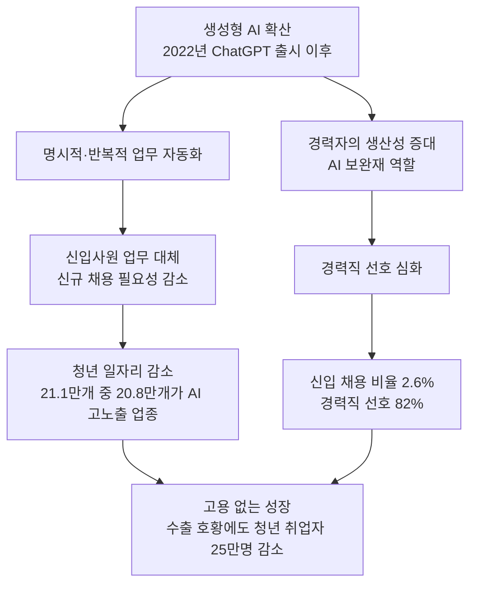
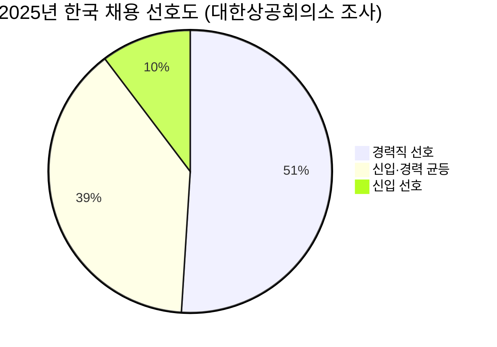
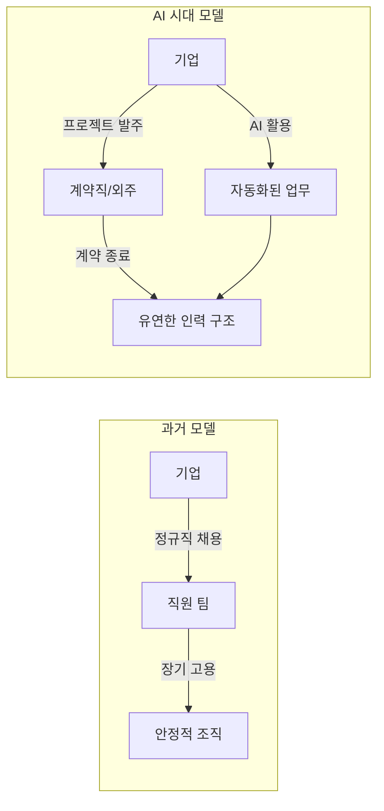
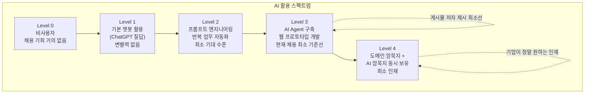
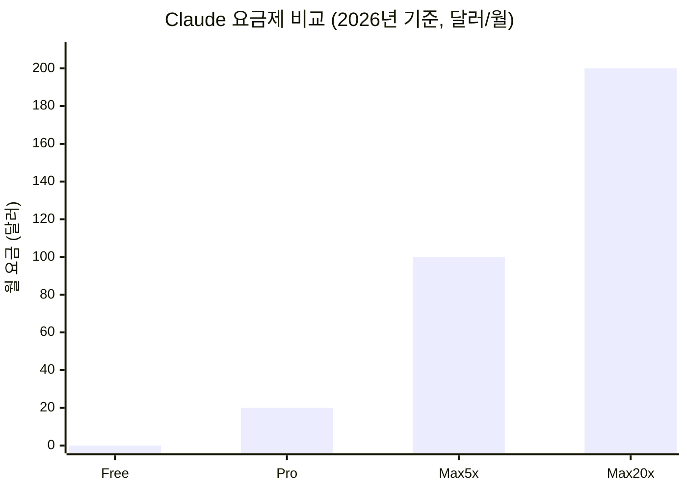
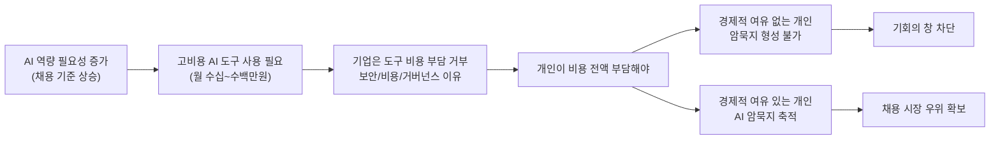
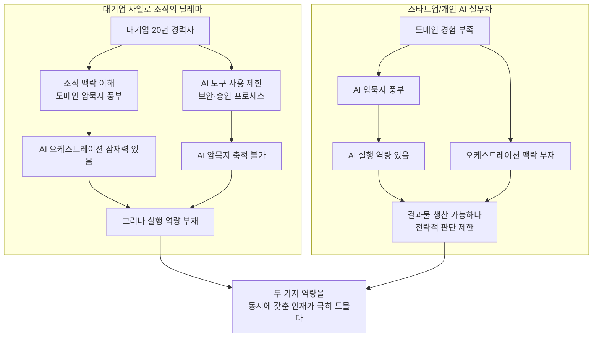
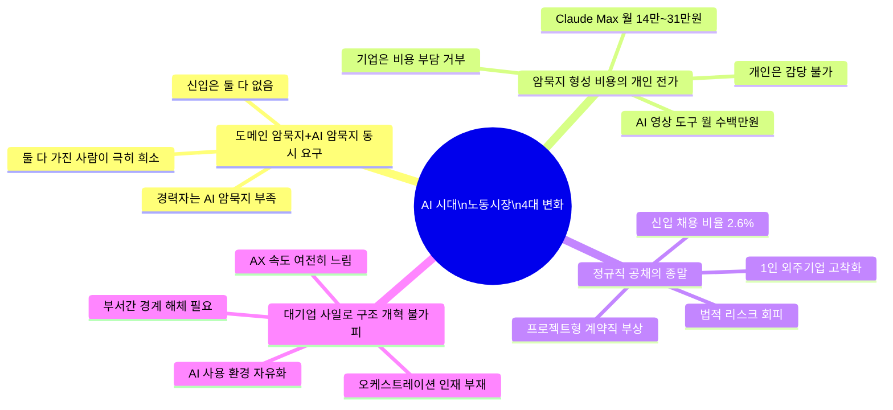

> **문서 개요**
> 이 문서는 AI의 급격한 확산이 노동시장과 채용 구조에 어떤 근본적인 변화를 가져오고 있는지를 분석한 것입니다. 국내외 공식 통계, 연구기관 보고서, 그리고 현장에서 관찰되는 구체적인 현상들을 바탕으로 작성했습니다. 특정 개인의 SNS 게시물에서 출발한 논지를 검증하고 심화·확장하는 방식으로 구성했습니다.
>
> - **최초 논지 출처:** 페이스북 공개 게시물 (2026년)
> - **검증 및 보완 출처:** 한국은행 BOK이슈노트, 대한상공회의소 채용트렌드 조사, KDI, Stanford IMD, Goldman Sachs, WEF, Anthropic 공식 요금 정책 등
> - **작성 기준일:** 2026년 6월 17일

---

## 목차

1. [들어가며: '고용 없는 성장'의 시대가 왔다](#1-들어가며)
2. [리더십과 AI 활용: 신규 채용 수요가 사라지는 구조](#2-리더십과-ai-활용)
3. [정규직의 종말과 프로젝트형 노동의 부상](#3-정규직의-종말)
4. [AI 역량 격차: 누가 채용되고 누가 도태되는가](#4-ai-역량-격차)
5. [AI 암묵지 형성의 비용 장벽: '기회의 창'이 닫히는 중](#5-ai-암묵지-비용-장벽)
6. [대기업 사일로 조직의 딜레마](#6-대기업-사일로-조직)
7. [종합: 네 가지 핵심 구조 변화](#7-종합-네-가지-핵심-변화)
8. [마치며: 지금 어디에 서 있어야 하는가](#8-마치며)

---

## 1. 들어가며

### 지금 노동시장에서 무슨 일이 일어나고 있는가

2026년 현재, 한국의 청년 고용 현장에는 이상한 일이 벌어지고 있다. 반도체 수출이 전년 동월 대비 169.4% 급증하는 등 경제 성장 지표는 긍정적인데, 청년 취업자 수는 오히려 25만 명 이상이 감소했다(2026년 5월, 코로나19 이후 최대 낙폭). '고용 없는 성장'이라는 구조가 현실이 된 것이다.

이 현상의 배경에는 복수의 요인이 있다. 반도체처럼 수조 원 규모의 설비 투자가 이루어져도 실제 고용 창출 효과가 제한적인 자본집약 산업의 확장, 중동 전쟁 장기화에 따른 경기 둔화, 그리고 무엇보다 **생성형 AI의 폭발적 확산**이 결합된 결과다.

한국은행이 2025년에 발표한 BOK이슈노트(제2025-30호, 'AI 확산과 청년고용 위축')는 충격적인 수치를 담고 있다. **2022년 7월부터 2025년 7월 사이 줄어든 청년층 일자리 21만 1,000개 중 20만 8,000개가 AI 고노출 업종에서 발생했다.** 반면 같은 기간 50대 일자리는 20만 9,000개 늘었으며, 그 중 14만 6,000개 역시 AI 고노출 업종이었다. AI가 청년 일자리를 없애고, 그 자리를 경력 있는 중·장년층이 메우는 구조가 통계로 확인된 것이다.

이 보고서가 이 현상을 설명하는 핵심 개념이 바로 **'연공편향(Seniority-Biased) 기술변화'** 다. AI는 절차적이고 규칙 기반의 업무, 즉 명시적 지식(Explicit Knowledge)으로 코드화할 수 있는 영역을 자동화하는 데 강하다. 반면 경력을 통해 축적되는 암묵적 지식(Tacit Knowledge)이나 사회적 기술이 필요한 업무에서는 오히려 보완재로 작동한다. 즉, AI는 신입사원의 일을 빼앗고, 그 업무를 경력자가 더 효율적으로 처리할 수 있도록 도와주는 방향으로 작동한다.

전문직도 예외가 아니다. 공인회계사(CPA) 시험 합격자 1,150명 중 약 600명, 즉 절반가량이 실무수습 기관 배정을 받지 못한 상태다. 1~3년차 신임 회계사가 하던 단순 반복 업무를 AI가 대체하면서, 회계법인들이 신규 채용 자체를 줄인 결과다. 회계·재무·세무와 같은 고학력 전문직 영역에서도 AI발 신입 고용 절벽이 현실화하고 있는 것이다.

이처럼 지금 한국의 노동시장은 단순한 경기 침체가 아니라 **구조적 전환**의 한가운데에 있다. 이하에서는 이 변화의 핵심 메커니즘을 다섯 가지 측면에서 구체적으로 살펴본다.

---

## 2. 리더십과 AI 활용: 신규 채용 수요가 사라지는 구조

### 리더십이 AI를 쓰면 팀원이 필요 없어진다

전통적인 조직에서 리더십 레벨의 관리자는 업무를 여러 팀원에게 분배하고, 각 팀원이 작업을 수행한 뒤 결과물을 취합하여 산출물을 만드는 구조로 일한다. 이 모델에서 팀원의 수는 곧 처리 가능한 업무의 용량과 비례했다.

그런데 AI를 잘 활용하는 리더십이 등장하면 이 전제가 붕괴된다. 리더 한 명이 AI를 통해 다수의 팀원이 하던 분량의 문서 작업, 데이터 분석, 보고서 작성, 시장 조사를 처리할 수 있게 되기 때문이다. 특히 사무직에서 이 효과는 극명하다.

대한상공회의소가 2025년 하반기 500여 개 기업 인사담당자를 대상으로 실시한 '채용 트렌드 조사'는 이를 수치로 보여준다. **채용 시 AI 역량을 고려한다는 기업이 69.2%** 에 달했으며, 신입보다 경력직을 더 선호한다고 답한 기업이 **51%** 로, 신입을 선호하는 기업(10.3%)의 약 5배에 이르렀다. 2025년 기준 한국 채용시장에서 신입 채용 비율은 **2.6%** 에 불과하며, 경력직 선호도는 **82%** 다.

여기에 글로벌 차원의 데이터를 더하면 그림이 더 명확해진다. 골드만삭스는 AI가 전 세계 **3억 개의 정규직 일자리에 해당하는 업무를 자동화**할 수 있다고 분석했다. 2026년 5월 기준, 메타·코인베이스·시스코 등 주요 기술 기업에서 AI로 인한 구조조정으로 사라진 일자리가 **9만 2,000개 이상**이다. 미국에서는 2026년 1분기 전체 해고의 8%가 'AI 명시 해고', 즉 AI 도입을 이유로 한 해고였다.

중요한 것은 이 현상이 직군을 가리지 않는다는 점이다. 게시물 작성자가 지적했듯, 사무직은 물론 법무, 재무, 마케팅, 기획 등 화이트칼라 직군 전반에서 AI는 상당 비율의 루틴한 업무를 처리할 수 있게 됐다. 다만 **영업(세일즈) 직군**은 상대적으로 AI의 대체 난도가 높다. 신뢰 형성, 대면 관계, 감정적 맥락 파악, 즉흥적 협상 등 AI가 약한 영역이 여전히 핵심 역량으로 남아 있기 때문이다. 하지만 이 직군마저도 AI 활용 여부에 따른 생산성 격차는 발생한다.

IBM 연구에 따르면 **92%의 C-레벨 경영진이 2026년까지 AI 기반 자동화를 확대할 계획**이라고 밝혔다. 자동화의 목표는 비용 절감과 인력 효율화다. 이 두 목표가 함께 추구되는 환경에서 신규 채용은 경영자에게 불필요한 리스크로 인식된다.

---

## 3. 정규직의 종말과 프로젝트형 노동의 부상

### 왜 기업은 정규직을 기피하는가

한국의 노동법 구조는 정규직 근로자를 해고하기 매우 어렵게 설계되어 있다. 근로기준법상 정당한 이유 없는 해고는 원칙적으로 금지되며, 경영상 이유에 의한 해고(이른바 '정리해고')조차도 긴박한 경영상 필요, 해고 회피 노력, 합리적·공정한 기준 설정, 사전 통보 및 협의 등 까다로운 요건을 충족해야 한다.

이 구조가 AI 시대에는 오히려 기업의 '정규직 채용 기피'를 촉진하는 요인이 된다. AI의 발전 속도가 너무 빠르고 불확실성이 크기 때문에, 기업 입장에서는 지금 특정 역할을 위해 정규직을 채용했다가 2~3년 후 해당 업무 자체가 AI로 완전히 대체될 경우 인력 구조조정에 상당한 비용과 법적 리스크가 발생한다.

결과적으로 기업들이 선호하게 되는 고용 형태는 **프로젝트 단위 계약직, 업무 도급·위탁, 혹은 프리랜서 계약**이다. 이 방식은 기업에게 유연성을 주고, 필요한 역량이 바뀌었을 때 계약을 종료하거나 교체하기가 훨씬 쉽다. 동시에 고용보험, 퇴직금, 4대 보험 사용자 부담분 등의 고정 비용도 절감된다.

이 경향은 이미 수치로 나타나고 있다. 한국 IT·스타트업 업계의 채용 공고는 크게 줄었으며, 특히 **신입 채용 비중은 2021년 대비 절반 이하로 감소**했다. 글로벌 차원에서도 마찬가지다. 맥킨지는 2030년까지 미국에서만 **1,200만 명의 근로자가 새로운 직종으로 전환해야 할 것**으로 추산했다.

SHRM의 2025년 탤런트 트렌드 보고서는 이 상황의 역설적 면모를 보여준다. AI·데이터·보안 직무에서 적합한 인재를 구하기 어렵다는 채용 담당자가 **80%** 에 달하는 동시에, AI로 인한 해고도 동시에 진행되고 있다. 이는 단순히 일자리 총량이 줄어드는 것이 아니라 **요구되는 역량의 급격한 변화**가 미스매치를 만들어내고 있음을 의미한다.

결과적으로 한국 노동시장에서 **공개채용 형태의 정규직 신입 채용은 구조적으로 의미를 잃어가고 있다.** 이 자리를 대신하는 것은 특정 기술과 경험을 가진 경력자에게 주어지는 단기 프로젝트, 자문 계약, 혹은 1인 기업 형태의 외주 업무다.

---

## 4. AI 역량 격차: 누가 채용되고 누가 도태되는가

### AI를 '잘 쓴다'는 것은 무엇을 의미하는가

가장 중요하면서도 정확하게 정의되지 않은 질문이 있다. AI를 '잘 쓴다'는 것은 도대체 어느 수준을 말하는가?

단순히 ChatGPT나 Claude에 질문을 입력하고 답변을 받는 것, 또는 Midjourney로 그럴듯한 그림을 생성하는 것은 이제 누구나 할 수 있는 수준이다. 2026년의 기업 채용 현장에서 이 정도 AI 활용 능력은 변별력이 없다.

게시물의 저자가 제시한 기준은 보다 구체적이다. **"AI Agent를 통한 자동화나 웹에서 작동하는 프로토타입 개발 정도가 최소선"** 이라는 것이다. 이것이 과연 합리적인 기준인지를 현장 데이터와 대조해 보면, 실제 채용 시장에서 요구되는 역량과 상당히 일치한다.

2026년 현재 AI 에이전트 개발자에게 현업에서 요구되는 핵심 기술 스택은 세 가지 축이다. 첫째는 **AI 통합 역량**(LLM API 활용, 프롬프트 엔지니어링, MCP 연동 등), 둘째는 **자동화 설계 역량**(워크플로 자동화, 멀티 에이전트 오케스트레이션), 셋째는 **서비스화 역량**(실제로 동작하는 프로토타입을 만들고 배포하는 능력)이다. 이 세 가지를 갖추지 않고 단순히 AI 도구를 사용하는 수준에 그친다면, 기업이 새로운 인원으로 채용할 유인이 없다는 것이 현장의 논리다.

이 기준은 단순히 개발자 직군에만 적용되는 것이 아니다. 영업직이든 마케터든 기획자든, 특정 도메인에서 AI를 통해 **실제 문제를 해결할 수 있는 결과물**을 만들어내는 사람만이 기업에게 신규 채용의 가치가 있다는 논리다.

그렇다면 왜 도메인 암묵지와 AI 암묵지가 '동시에' 필요한가? 여기에는 중요한 경제적 논리가 있다.

**암묵지(Tacit Knowledge)** 는 경험과 실천을 통해 체화되는 지식으로, 문서나 매뉴얼로 쉽게 전달되지 않는 종류의 전문성이다. AI는 명시적 지식(Explicit Knowledge), 즉 코드화·문서화할 수 있는 절차적 업무에서 강점을 발휘한다. 반면 어떤 데이터를 어떻게 해석해야 하는지, 고객이 말하지 않은 요구를 어떻게 파악하는지, 조직 내 정치적 맥락에서 어떤 결정이 실행 가능한지 같은 문제는 여전히 인간의 경험적 판단이 필요하다.

스탠퍼드 대학교 연구에 따르면, AI로 인한 채용 감소는 25세 미만 근로자에게 집중되어 있으며, 이는 실질적인 해고보다 신규 채용의 급감으로 나타나고 있다. 달러스 연방준비은행 분석에 따르면, AI 노출도가 가장 높은 직종에서 임금이 2022년 이후 8.5% 상승했으며, 이 혜택은 주로 경력 있는 근로자에게 귀속됐다.

결국 지금 신입 채용을 희망하는 구직자들에게 현실은 가혹하다. **도메인 암묵지는 대학원 수준의 깊은 연구 과정에서 부분적으로나마 쌓을 수 있고, 학부 수준에서는 양쪽 모두 사실상 어렵다.** 이것이 게시물 저자가 "학부 정도로는 아무것도 못한다"고 말한 이유다. 물론 이는 다소 단호한 표현이지만, 채용 현장의 데이터는 이 방향성을 지지한다.

---

## 5. AI 암묵지 비용 장벽: '기회의 창'이 닫히는 중

### AI 역량을 쌓는 데도 돈이 많이 든다

AI 역량, 특히 실전적인 **AI 암묵지**를 쌓으려면 실제로 도구를 깊이, 많이, 지속적으로 써봐야 한다. 그런데 바로 여기서 핵심적인 진입 장벽이 발생한다. 최신 AI 도구들의 비용이 개인이 부담하기에는 상당한 수준으로 올라가고 있기 때문이다.

#### 5-1. LLM 구독 비용: Claude Max의 경우

Anthropic의 Claude를 예로 들어보자. 일반 사용자가 가입하는 Pro 플랜은 월 20달러(약 2만 8,000원)이지만, 실제로 AI 개발이나 장시간 집중 작업을 하다 보면 하루에도 여러 번 사용량 한도에 걸리는 경험을 하게 된다. "다시 사용 가능한 시간 4시간 후입니다"라는 메시지가 업무 중간에 뜨면 흐름이 끊긴다.

이 한도를 극복하려면 **Claude Max 플랜**이 필요하다. Max 플랜은 두 단계로 나뉜다. Pro 대비 5배의 사용량을 제공하는 Max 5x는 **월 100달러(약 14만~16만 원)**, Pro 대비 20배의 사용량을 제공하는 Max 20x는 **월 200달러(약 28만~31만 원)** 다. 게시물에서 '30만 원 정도'라고 언급한 것은 Max 20x 플랜을 기준으로 한 것으로, 공식 요금표와 일치한다.

Max 5x 기준으로 5시간당 최소 225회의 메시지 교환이 가능하며, Max 20x는 5시간당 최소 900회다. 하루 종일 집중적으로 AI와 협업하는 개발자라면 Max 20x를 써야 한도 걱정 없이 작업이 가능하다. 연간으로 환산하면 **한 사람이 AI 도구 하나에만 연간 200~360만 원**을 써야 하는 셈이다.

#### 5-2. AI 영상 생성 비용: Seedance 2.0의 경우

LLM만이 아니다. AI 영상 생성 분야에서는 비용 장벽이 더욱 두드러진다.

**Seedance 2.0**은 ByteDance(틱톡 모회사)가 2026년 2월에 출시한 최신 AI 영상 생성 모델이다. 텍스트, 이미지, 오디오, 영상 등 최대 12개의 참조 파일을 동시에 입력받아 1080p 이상의 고품질 영상을 생성할 수 있다. 네이티브 오디오 생성, 음소 단위 립싱크, 다양한 언어 지원, 캐릭터 일관성 등 최첨단 기능을 갖추고 있으며, 출시 직후 중국과 전 세계에서 할리우드급 영상을 구현한 클립들이 바이럴되면서 디즈니·파라마운트 등 할리우드 메이저 스튜디오들이 저작권 침해를 이유로 ByteDance에 경고장을 보내는 사태까지 벌어졌다.

Seedance 2.0의 가격은 플랫폼과 품질 옵션에 따라 다르게 책정된다. 제3자 API 서비스 기준으로, 720p 품질에서 초당 약 0.199달러에서 0.247달러 수준이다. 15초짜리 클립 하나를 생성한다면 약 3~4달러(4,200~5,600원)이지만, 더 높은 품질, 더 긴 길이, 플랫폼 마크업, 구독 크레딧 방식 등을 고려하면 실질 비용은 훨씬 높아진다. 게시물 저자가 "큐 하나에 1만 5,000원"이라고 언급한 것은 특정 플랫폼의 고품질 옵션 또는 크레딧 방식 과금의 경험을 바탕으로 한 것으로 보인다.

어떤 방식으로 계산하든, **AI 영상 제작을 열심히 한다면 한 달에 100만~300만 원의 도구 비용이 발생**한다는 것이 현실이다. 이것은 단순히 강의 수강료나 책 구입비가 아니라 AI 역량 자체를 훈련하고 유지하기 위한 '운영 비용'이다.

#### 5-3. 기회의 창이 닫히는 이유

AI가 처음 등장했을 때 많은 사람들이 '창작의 민주화'를 이야기했다. 누구나 손쉽게 고품질의 콘텐츠를 만들 수 있게 된다는 기대였다. 그런데 현실은 그 반대 방향으로 가고 있다.

문제의 구조는 이렇다. **AI 암묵지는 AI 도구를 실제로 집중적으로 써봄으로써만 쌓인다.** 그런데 집중적으로 쓰려면 고가의 요금제가 필요하다. 한 달에 수십만 원에서 수백만 원을 개인이 스스로 부담해야 한다. 이 비용을 기업이 부담해주던 시절은 이제 지나가고 있다. 기업들이 보안 정책, 비용 관리, 데이터 거버넌스 등을 이유로 AI 도구 사용을 제한하거나 승인 절차를 복잡하게 만들기 때문이다.

결과적으로 AI 암묵지를 자유롭게 쌓을 수 있는 사람은 **개인적으로 상당한 금액을 AI 도구에 지출할 경제적 여유가 있는 사람**으로 점점 좁혀진다. 이것은 단순한 비용 문제가 아니라 **기회 불평등의 문제**다.

---

## 6. 대기업 사일로 조직의 딜레마

### 20년짜리 커리어가 AI 시대에는 오히려 약점이 될 수 있다

게시물의 저자는 대기업의 **사일로(Silo) 조직 구조**가 AI 시대에 불리하다고 지적한다. 이것은 상당히 통찰력 있는 관찰이다.

사일로 조직이란 각 부서나 팀이 독립적으로 분리되어 있고, 정보와 자원이 부서 간에 자유롭게 흐르지 않는 조직 형태를 말한다. 마케팅팀은 마케팅팀의 업무만, 재무팀은 재무팀의 업무만 담당하며, 다른 부서의 업무 방식이나 데이터에 접근하기 어려운 구조다.

이 구조가 AI 시대에 문제가 되는 이유는 무엇인가?

**AI와 함께 일한다는 것의 본질은 '디렉팅(Directing)'과 '오케스트레이션(Orchestration)'이다.** AI에게 무엇을, 어떻게, 어떤 순서로 시킬지를 판단하는 능력, 그리고 여러 AI 도구나 에이전트를 조율하여 복합적인 문제를 해결하는 능력이 핵심 역량이 된다. 이는 조직 전체의 업무 흐름을 이해하고, 다양한 도메인에 걸쳐 문제를 연결하여 사고하는 능력을 전제한다.

그런데 사일로 조직에서 20년을 일한 사람은 자신의 영역 내에서는 깊은 전문성을 갖출 수 있지만, 조직 전체의 맥락을 이해하고 부서 간 경계를 넘나들며 AI를 지휘하는 역할은 경험하기 어렵다. 일반적으로 대기업에서 이 수준의 역량, 즉 전사적 관점에서의 오케스트레이션 감각은 임원급에 이르러야 갖출 수 있으며, 그러자면 20년 이상의 경력이 필요하다.

역설적인 것은 대기업에서 20년을 일한 사람들이 AI 도구를 실전에서 활용하는 데 가장 큰 어려움을 겪는다는 점이다. 대기업은 보안 정책상 외부 AI 서비스 접근을 제한하고, 내부 AX(AI 전환) 속도는 느리며, 검토·승인 프로세스가 길다. 실제로 자유롭게 AI 도구를 활용하며 역량을 쌓을 수 있는 환경이 구조적으로 갖추어져 있지 않다.

결국 **도메인 암묵지와 AI 암묵지를 동시에 갖춘 사람**이 극히 희소하다는 것이 현재 노동시장의 핵심 특징이다. SHRM 보고서에서 AI·데이터 관련 직무의 인재 부족이 80%에 달한다고 밝힌 것도 이 맥락에서 이해해야 한다. 단순히 AI를 쓸 줄 아는 사람이 아니라, **특정 산업과 도메인의 맥락 속에서 AI를 전략적으로 활용하여 문제를 해결할 수 있는 사람**이 없는 것이다.

이는 대기업 조직 구조에도 필연적인 변화를 요구한다. 부서 간 경계를 낮추고, AI 도구 활용 환경을 자유화하며, 역할을 부서별 기능 중심이 아니라 **문제 해결 프로세스 중심**으로 재설계하는 방향으로의 전환이 불가피하다. 실제로 IBM 연구는 경영진의 92%가 이 방향으로의 변화를 계획하고 있음을 보여준다.

---

## 7. 종합: 네 가지 핵심 구조 변화

앞서 살펴본 내용을 종합하면, AI가 노동시장에 가져오는 변화는 다음 네 가지 핵심 축으로 수렴된다.

### 7-1. 도메인 암묵지 + AI 암묵지의 동시 요구

단순히 AI를 잘 쓰는 것도, 특정 분야의 전문 지식만 가지고 있는 것도 충분하지 않다. 두 가지를 **동시에** 보유한 사람만이 채용 시장에서 의미 있는 가치를 인정받는다. 이 교집합은 현재 극히 좁다. 왜냐하면 도메인 암묵지는 오랜 실무 경험이 필요하고, AI 암묵지는 최신 도구를 집중적으로 사용한 최근의 경험이 필요한데, 이 두 조건이 한 사람 안에서 동시에 충족되는 경우가 드물기 때문이다.

### 7-2. 암묵지 형성 비용의 개인 전가, 그리고 감당 불가

과거에는 기업이 직원을 고용하면서 직무 교육, 도구 사용 환경, 실습 기회를 제공하는 것이 당연했다. 이것이 기업이 신입을 채용하는 이유 중 하나였다. 그런데 AI 시대에는 이 비용이 급격히 올라가고 있으며, 기업들은 그 비용을 더 이상 부담하지 않으려 한다.

Claude Max 20x 플랜 월 200달러, Seedance 2.0 같은 고품질 AI 영상 도구 월 100만~200만 원, 각종 AI 개발 도구 구독료 등을 더하면 AI 역량을 자유롭게 연마하는 데 드는 비용은 월 200만~300만 원 이상이 될 수 있다. 이것은 대부분의 개인이 장기간 지속하기 어려운 수준이다. 따라서 AI 암묵지를 쌓을 수 있는 사람은 점점 특정 계층으로 좁혀지며, 이것이 '기회의 창이 닫히는' 현상의 실체다.

### 7-3. 정규직 공채의 종말과 프로젝트형·1인 외주 기업의 고착화

AI로 인해 미래 불확실성이 커진 상황에서 정규직 채용은 기업에게 과도한 리스크가 됐다. 오늘 채용한 역할이 2년 후에는 AI로 대체될 수 있고, 그 사람을 내보내려면 법적·경제적 비용이 크다. 이 구조에서 기업이 선택하는 것은 프로젝트 단위 계약, 프리랜서, 외주다.

결과적으로 노동시장은 소수의 정규직 핵심 인력(AI 오케스트레이션 역량 보유자)과 다수의 프로젝트형 계약 인력으로 양극화될 것으로 보인다. 전통적인 '대졸 공채 → 정규직 입사 → 연공서열 승진'의 경로는 구조적으로 무너지고 있다.

### 7-4. 대기업 사일로 조직 구조의 필연적 변화

AI와 함께 일하려면 정보가 부서 간 경계를 자유롭게 넘나들어야 하고, 구성원들이 전사적 맥락에서 AI를 지휘할 수 있어야 한다. 이것이 사일로 조직에서는 구조적으로 불가능하거나 매우 느리게 실현된다. IBM 연구에서 92%의 C-레벨 경영진이 AI 기반 자동화 확대를 계획한다고 밝혔는데, 이를 실현하려면 조직 구조의 개혁이 선행되어야 한다. 사일로 해체, 기능 중심에서 문제 해결 중심으로의 팀 재편, AI 사용 환경의 내부 자유화가 필수적이다.

---

## 8. 마치며: 지금 어디에 서 있어야 하는가

### 냉정하게 현실을 직시하면

게시물의 저자는 마지막에 "공공쪽 정규직이면 진심 어설픈 전문직보다 낫다"는 말로 마무리한다. 이것은 다소 극단적인 표현처럼 보이지만, 그 바탕에 있는 논리는 다음과 같다.

한국의 법적 구조상 **이미 정규직으로 고용된 사람을 내보내는 것은 매우 어렵다.** 특히 연봉이 보장된 공공 부문 정규직이라면, AI의 파도가 몰아쳐도 즉각적인 고용 불안에 노출될 가능성이 낮다. 그리고 그 자리를 자발적으로 포기하는 것은 상당한 위험을 감수하는 선택이다. "인스타에 보이는 '대기업 퇴사했어요~' 같은 선택이 AI 시대에는 돌이킬 수 없는 결과를 낳을 수 있다"는 경고는, 지금 AI가 만들어내고 있는 채용 시장의 구조적 변화를 이해한 데서 나오는 것이다.

### 지금 개인이 할 수 있는 것

이 모든 냉혹한 현실에도 불구하고, 개인 차원에서 방향을 잡을 수 있는 원칙은 있다.

첫째, **재직 중인 조직 안에서 AI 역량을 쌓는 것**이 가장 현실적인 경로다. 직장 내에서 AI 도구를 실제 업무에 적용하고, 자신의 도메인 맥락 속에서 AI를 활용하는 경험을 축적하는 것이다. 이것이 '도메인 암묵지 + AI 암묵지' 조합을 만드는 가장 효율적인 방법이다.

둘째, **AI 활용의 최소 기준선을 명확히 설정하고 그것을 향해 집중해야 한다.** 단순한 챗봇 사용이나 기본 자동화를 넘어, 실제 작동하는 무언가를 만들어본 경험, 즉 AI Agent 기반의 자동화나 간단한 웹 프로토타입 수준의 결과물을 생산할 수 있는 역량이 현재 채용 시장의 최소 기준선이다.

셋째, **비용 현실을 냉정하게 인식해야 한다.** AI 암묵지를 쌓는 것은 무료가 아니다. 도구 비용에 대한 투자 계획을 세우되, 그것이 개인 수준에서 지속 가능한지를 판단해야 한다. 무조건적인 낙관은 현실을 외면하는 것이고, 그렇다고 비용 장벽에 막혀 아무것도 하지 않는 것도 답이 아니다.

넷째, **세계경제포럼(WEF)의 분석처럼 AI가 새로운 일자리 유형도 창출한다는 사실을 기억해야 한다.** WEF는 AI가 2030년까지 9,200만 개의 일자리를 대체하는 한편 1억 7,000만 개의 새로운 일자리를 만들어 순증 효과가 7,800만 개에 이를 것으로 예측했다. 문제는 이 새로운 일자리가 기존의 일자리와는 다른 역량을 요구한다는 것이고, 그 전환의 비용과 고통은 개인이 감당해야 한다는 점이다.

### 결론

지금 우리가 목격하고 있는 것은 노동시장의 단기적 조정이 아니라 **구조적이고 비가역적인 전환**이다. 채용 수요의 감소, 고용 형태의 프로젝트화, AI 역량에 대한 요구 수준 상승, 역량 형성 비용의 개인 전가, 대기업 조직 구조의 균열이 동시에 진행되고 있다.

이 변화 속에서 살아남는 사람은 특별히 AI를 잘 '만드는' 사람이 아닐 수도 있다. 오히려 **자신이 가장 잘 아는 도메인에서, AI를 실질적인 결과물로 연결할 수 있는 사람**이 이 시대의 핵심 인재가 될 것이다. 그리고 그 역량을 갖추기 위한 여정은 지금, 현재의 자리에서 시작해야 한다.

---

*본 문서에 인용된 통계 및 연구 자료의 출처:*
- *한국은행 BOK이슈노트 제2025-30호 (AI 확산과 청년고용 위축)*
- *대한상공회의소 2025년 하반기 기업 채용트렌드 조사*
- *KDI 2025년 채용시장 분석*
- *SHRM 2025 Talent Trends Report*
- *WEF 2025 Future of Jobs Report*
- *Goldman Sachs AI Employment Analysis*
- *Anthropic 공식 요금 정책 (claude.ai/pricing, 2026년 5월 기준)*
- *IMD Research: "How to build judgment when AI does the work" (2026년 5월)*
- *Stanford University AI Employment Research*
- *Intellectia AI 분석 데이터 (2026년 5월)*
- *한국노동연구원 AI 도입과 청년고용 연구*
