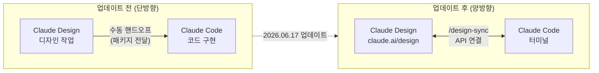
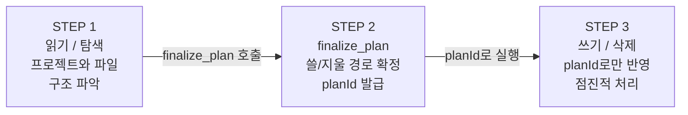
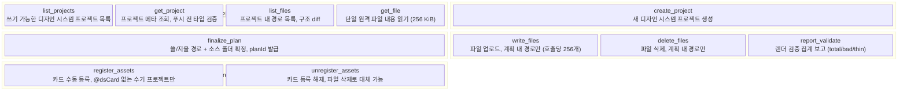
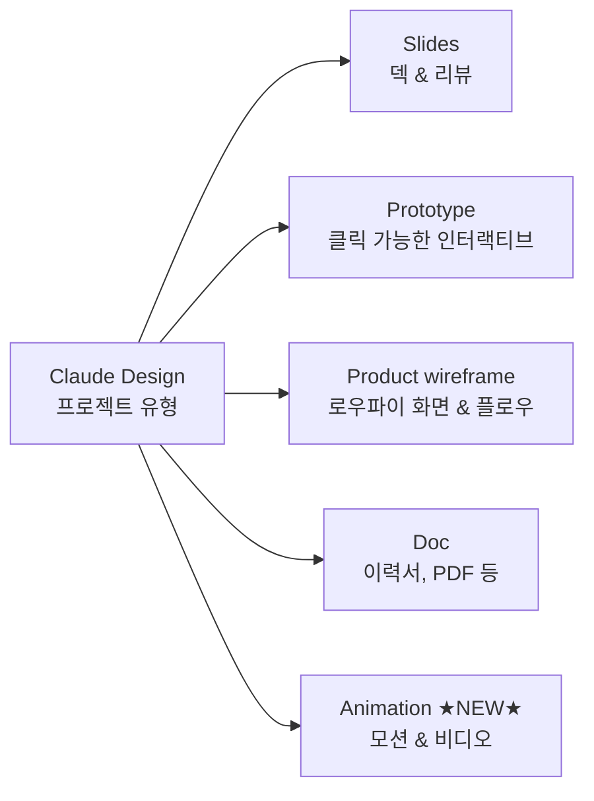
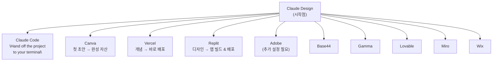
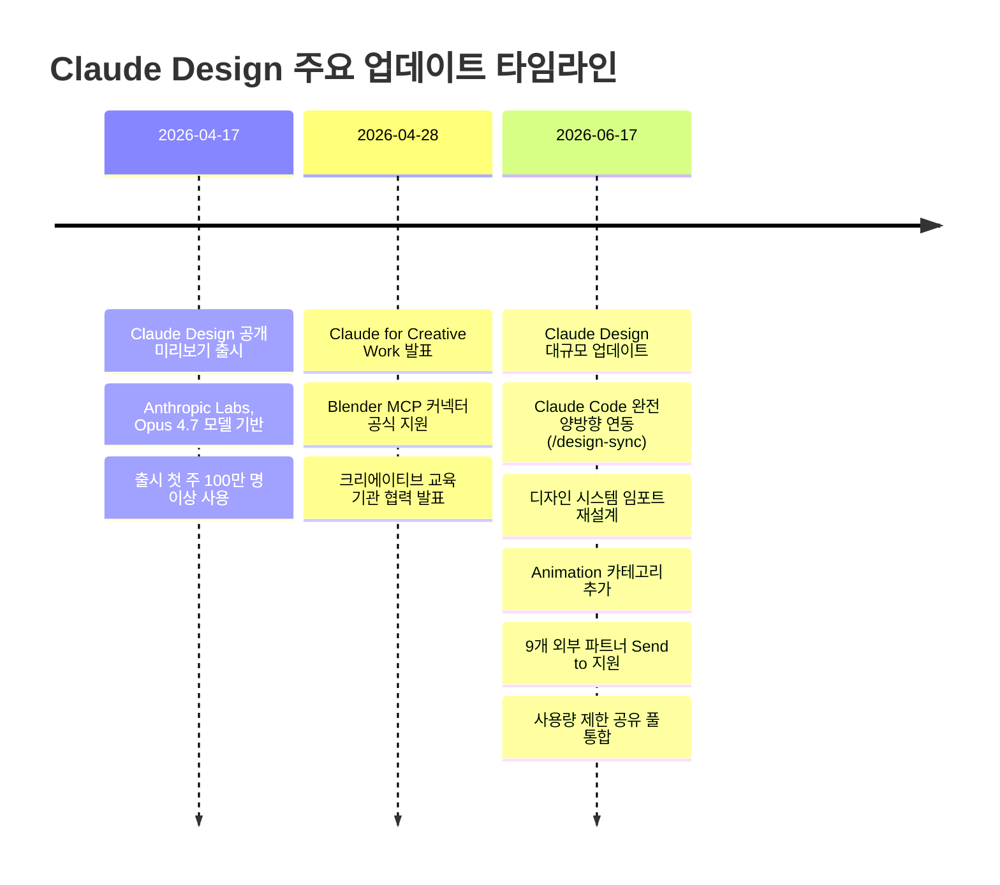

> **업데이트 날짜**: 2026년 6월 17일  
> **원문 출처**: Anthropic 공식 블로그 "Claude Design now stays on brand for daily work"  
> **제품 구분**: Anthropic Labs (Beta) — Pro, Max, Team, Enterprise 플랜 대상

## 관련글

[**Claude Design 과 Claude Code 가 드디어 '완전히' 연결됐습니다**](https://www.facebook.com/share/p/18axvxVh6L/)

---

## 들어가며

2026년 4월 17일, Anthropic Labs는 Claude Design을 공개 미리보기(Research Preview) 형태로 출시했다. 텍스트 프롬프트 하나로 슬라이드, 프로토타입, 와이어프레임, 문서 등 시각적 결과물을 만들어내는 이 도구는 출시 첫 주에만 전 세계 100만 명 이상이 사용할 만큼 뜨거운 반응을 불러일으켰다. 그러나 출시 직후부터 현장에서 실제로 사용해본 이들이 공통적으로 지적한 문제가 있었다. Claude Design과 Claude Code가 서로 유기적으로 연결되지 않는다는 점, 그리고 복잡한 디자인 세션을 진행할 때 토큰을 급격히 소모한다는 점이었다.

약 두 달 뒤인 2026년 6월 17일, Anthropic은 이 두 가지 핵심 문제를 정면으로 해결한 대규모 업데이트를 공식 발표했다. 이번 업데이트의 핵심은 단순한 기능 추가가 아니다. Claude Design과 Claude Code가 API 수준에서 완전히 양방향으로 연결되었고, 그 연결의 중심에 `/design-sync`라는 네이티브 스킬이 자리잡게 되었다.

---

## 1. 무엇이 달라졌나 — 업데이트 전과 후

### 1.1 업데이트 이전의 상황

기존 Claude Design은 디자인 결과물을 완성한 뒤 Claude Code로 넘기는 단방향 출력 구조였다. 디자이너가 Claude Design에서 작업을 마치면, 그 결과를 하나의 패키지로 묶어 Claude Code에 전달하고 Claude Code가 이를 받아 코드로 구현하는 방식이었다. 이 과정은 "핸드오프(handoff)"라 불리며, 사실상 두 도구 사이에 인간의 개입이 반드시 필요한 구조였다.

또한 Claude Code 측에서 Claude Design의 파일을 직접 읽거나 수정하는 것이 불가능했기 때문에, 디자인 시스템을 실시간으로 반영하거나 코드 변경 사항을 디자인에 즉시 적용하는 것은 지원되지 않았다. Figma MCP나 Pencil 같은 서드파티 도구를 연결해 부분적으로 보완하는 방법이 있었지만, 이 역시 완전한 양방향 제어와는 거리가 있었다.

### 1.2 업데이트 이후의 변화

이번 업데이트로 Claude Code는 `/design-sync` 스킬을 통해 Claude Design 프로젝트를 직접 읽고 쓸 수 있게 되었다. 터미널에서 명령어 하나로 디자인 시스템을 불러오고, 파일을 업로드하며, 렌더링 결과를 검증하고, 불필요한 파일을 삭제하는 모든 작업이 브라우저를 열지 않고도 가능해졌다. 반대로 `/design` 스킬을 이용하면 Claude Code 터미널에서 아예 새로운 디자인 프로젝트를 생성하거나, 기존 코드베이스를 라이브 프로토타입으로 변환하는 것도 가능하다.

이 구조는 단순한 편의 기능이 아니다. 설계, 구현, 검증의 전체 사이클이 하나의 자동화된 흐름 안에서 이루어질 수 있다는 것을 의미한다.

---

## 2. `/design-sync` 스킬 — 양방향 연결의 핵심

### 2.1 스킬의 개념

Claude Code의 스킬(Skill)이란 `~/.claude/skills/<name>/` 경로에 위치한 `SKILL.md` 파일로 정의되는 에이전트 수행 지침이다. 세션 시작 시 자동으로 인식되어 슬래시 명령(`/skill-name`)으로 호출할 수 있다. `/design-sync`는 이 구조를 활용한 네이티브 스킬로, Claude Code가 `claude.ai/design` 프로젝트를 브라우저 조작 없이 직접 다루는 것을 가능하게 한다.

Gonnector 팀이 자사의 Gonnector Design System을 베이스로 직접 제작하고 실증한 `/design-sync` 스킬 구조 분석에 따르면, 이 스킬은 총 11개의 메서드로 구성되어 있으며 3단계 워크플로우를 따른다.

### 2.2 3단계 워크플로우

첫 번째 단계는 **읽기 및 탐색**이다. Claude Code는 승인 없이 Claude Design 프로젝트 목록을 조회하고, 개별 프로젝트의 메타데이터를 확인하며, 파일 경로 목록과 구조 diff를 확인하고, 단일 원격 파일의 내용(최대 256 KiB)을 읽어올 수 있다. 읽기 작업은 별도의 사용자 승인이 필요 없다.

두 번째 단계는 **계획(finalize_plan)** 이다. 실제로 파일을 쓰거나 삭제하기 전에 반드시 `finalize_plan`을 통해 작업 경로를 확정하고 `planId`를 발급받아야 한다. 이 단계는 권한 프롬프트를 거치도록 설계되어 있어, 의도치 않은 변경을 방지하는 안전 경계 역할을 한다.

세 번째 단계는 **쓰기 및 삭제**다. `planId`가 있어야만 `write_files`, `delete_files`, `report_validate`를 호출할 수 있다. 계획 내에서 확정된 경로에만 반영되며, 한 번에 한 컴포넌트씩 점진적으로 처리하는 것이 원칙이다.

### 2.3 11개 메서드 전체 구성

### 2.4 세 가지 핵심 원칙

`/design-sync` 스킬의 설계 철학은 세 가지 원칙으로 요약된다.

첫째, **점진성**이다. 한 번에 모든 컴포넌트를 교체하는 것이 아니라, 한 번에 하나씩 점진적으로 반영한다. 이는 대규모 변경 시 발생할 수 있는 오류 전파를 최소화하기 위한 설계다.

둘째, **자동 카드**다. `@dsCard` 주석이 포함된 파일은 자동으로 컴파일되어 디자인 카드로 등록된다. 수동으로 자산을 등록하는 레거시 방식(`register_assets`)은 `@dsCard` 마크로가 없는 오래된 프로젝트에서만 사용한다.

셋째, **안전 경계**다. 파일은 코드가 아닌 데이터로 취급한다. `planId` 없이는 파일을 쓰거나 삭제할 수 없으며, 계획 단계에서 확정된 경로 이외의 곳에는 접근이 불가능하다.

### 2.5 현재의 기술적 한계

한 가지 중요한 사항이 있다. 현재 `/design-sync`는 디자인 오브젝트 단위로 속성을 실시간 편집하는 API를 지원하지 않는다. 현재 구조는 오브젝트들이 모두 포함된 디자인 파일 전체를 읽고 쓰는 방식이다. 대부분의 실무 상황에서는 큰 문제가 되지 않지만, Pencil처럼 개별 오브젝트의 속성을 실시간으로 제어하면서 디자인 변경 사항을 즉시 눈으로 확인하는 수준에는 아직 이르지 못했다.

---

## 3. 강화된 디자인 시스템 임포트

### 3.1 임포트 방식의 다양화

이번 업데이트에서 디자인 시스템 임포트 기능이 전면 재설계되었다. 이제 GitHub 저장소, 디자인 파일, 원시 업로드(raw upload) 등 다양한 경로로 하나 이상의 디자인 시스템을 불러올 수 있다. 팀 전체가 동일한 디자인 시스템을 기반으로 작업하게 되므로, 개별 프로젝트마다 브랜드 자산을 별도로 설정할 필요가 없다.

Claude Design은 불러온 자산에서 재사용 가능한 컴포넌트, 색상 팔레트, 타이포그래피 체계, 레이아웃 패턴을 자동으로 추출한다. 코드베이스의 React 컴포넌트 라이브러리, 잘 디자인된 PowerPoint나 PDF, 로고 및 색상 파일, 기존 디자인 파일 등 어떤 형태로 제공하더라도 Claude가 스스로 해석해 디자인 시스템을 구성한다.

더 중요한 점은 자기 교정(self-correction) 기능이다. Claude Design은 생성 과정에서 자신의 출력물을 디자인 시스템 기준과 대조하여 검증하고, 문제가 있으면 사용자가 결과를 보기 전에 스스로 수정한다. 이는 브랜드 일관성을 자동으로 유지하는 것을 의미한다.

### 3.2 엔터프라이즈를 위한 관리자 역할

대규모 조직을 위한 새로운 관리자 역할(Admin Role)도 추가되었다. 어드민은 표준 디자인 시스템을 승인하고 편집을 잠가 두어, 팀 전체의 작업이 항상 회사 가이드라인에 부합하도록 강제할 수 있다. 이는 기업 환경에서 브랜드 통제를 AI 도구 수준에서 직접 적용할 수 있게 되었음을 뜻한다.

---

## 4. 캔버스 직접 편집 기능의 대폭 강화

### 4.1 세밀한 오브젝트 편집

이번 업데이트에서 가장 실용적인 개선 중 하나는 캔버스 위에서 직접 이루어지는 편집 기능의 강화다. 이제 사용자는 AI에게 지시를 내리지 않고도 텍스트를 직접 수정하거나, 간격·색상·레이아웃을 즉시 조정할 수 있다. 세부 속성 패널에서 폰트 종류, 크기, 색상 코드, 자간(leading), 정렬, 굵기, 기울임, 밑줄, 취소선, 배경색, 테두리 반경, 불투명도(Opacity) 등을 수치 단위로 직접 변경할 수 있다.

SVG 파일도 마찬가지다. SVG를 구성하는 벡터 요소 각각을 개별적으로 선택해 크기, 투명도, 선 굵기, 선 색상, 채우기 색상 등을 상세하게 조정할 수 있다. 단, 아이콘을 처음부터 벡터로 그리거나 포토샵 수준의 픽셀 편집이 필요한 작업은 여전히 전문 도구가 필요하다.

### 4.2 변경 사항의 전체 적용

한 요소에 가한 변경 사항을 전체 디자인에 일괄 적용하는 기능도 지원된다. 예를 들어 특정 버튼의 색상을 바꾸고 "이 변경을 전체 디자인에 적용해줘"라고 요청하면, Claude가 일관성 있게 해당 변경을 전파한다.

---

## 5. 모션/애니메이션: 완전히 새로운 카테고리

### 5.1 Animation 프로젝트 유형의 등장

이번 업데이트에서 주목할 또 다른 변화는 프로젝트 유형에 **Animation(모션 & 비디오)** 카테고리가 정식으로 추가된 것이다. 기존에는 Slides, Prototype, Product wireframe, Doc의 네 가지였으나 이번에 Animation이 추가되어 다섯 가지가 되었다.

### 5.2 코드 기반 애니메이션의 가능성

Claude Design의 애니메이션은 전통적인 타임라인 기반 편집기(예: After Effects, Adobe Premiere)와 다르다. 웹 기술을 기반으로 브라우저 내에서 네이티브하게 실행되며, 음성·비디오·셰이더(shader)·3D 등 고급 기능도 코드 기반 프로토타입으로 구현할 수 있다.

공개된 예제 프롬프트들을 통해 그 범위를 가늠할 수 있다. "미래형 운영체제 배경화면을 만들어줘. 마우스 위치에 반응하는 인터랙티브하고 재미있는 느낌이면 좋겠어. 인터랙티브 셰이더 배경화면을 다섯 가지 만들어줘"라는 프롬프트 하나로, Aurora Field, Liquid Chrome, Gravity Grid, Mesh Gradient, Cell Bloom이라는 다섯 가지 마우스 반응형 셰이더 배경화면이 만들어진다. 각각은 완전히 다른 시각적 특성을 가지며, 실제 브라우저에서 마우스 움직임에 반응해 동작한다.

또 다른 예제로는 텍스트 파티클 효과가 있다. "매우 큰 편집 가능한 텍스트 상자를 만들어줘. 'Fire', 'Smoke', 'Metal', 'Wind'같은 특정 단어에는 그 단어와 어울리는 시각 효과와 파티클을 렌더링해줘"라는 프롬프트로, 단어마다 불꽃, 연기, 금속 광택, 바람 같은 파티클 효과가 실시간으로 렌더링되는 텍스트 박스가 만들어진다.

이는 알고리즘으로 디자인을 생성하고, 논리적 구조로 감각적 표현을 만들어낸다는 의미에서 단순한 템플릿 제공을 넘어선다.

---

## 6. 확장된 내보내기 생태계

### 6.1 "시작점"으로서의 Claude Design

이번 업데이트에서 Anthropic이 Claude Design을 어떻게 포지셔닝하는지 명확하게 드러나는 부분이 바로 내보내기(Send to) 연동 생태계다. Claude Design은 작업이 완성되는 곳이 아니라, 작업이 시작되는 곳으로 설계되었다.

### 6.2 각 파트너의 역할

각 파트너가 어떤 역할을 담당하는지는 파트너들의 공식 입장을 통해 파악할 수 있다. Replit의 사장 Michele Catasta는 "빌더들이 아이디어를 시작하는 곳 어디서든 만날 수 있게 해준다"고 설명했다. Canva의 Anwar Haneef는 Claude Design의 흐름을 "첫 초안을 완성된 자산으로 전환하는 것"이라고 묘사했으며, Vercel의 Andrew Qu는 "개념을 Vercel로 바로 밀어넣어 배포한다"고 표현했다.

Claude Code로의 전송은 특히 중요하다. 단순한 파일 전달이 아니라 디자인 컨텍스트 전체가 함께 넘어가서, Claude Code가 "스크린샷에서 다시 시작"하는 것이 아니라 "기존 작업에서 이어서" 코드 구현을 시작할 수 있다.

### 6.3 PDF 및 PowerPoint 내보내기

Adobe 연동 이외에도 PDF와 PowerPoint로의 내보내기는 이미 지원되어 있었으며, 이번 업데이트에서 폰트 처리, 수정 가능 여부 등 세부 옵션들이 더 추가되었다.

---

## 7. 사용량 제한 통합 — 토큰 소모 문제의 해결

### 7.1 기존 문제

Claude Design 초기 버전에서 현장 사용자들이 공통적으로 겪은 문제 중 하나는 토큰 소모가 과도하다는 것이었다. 복잡한 디자인 세션 하나가 30분 만에 주간 사용량 한도 전체를 소진시킬 수 있었고, 이는 특히 개인 사용자나 소규모 팀에게 사실상 도구를 접근 불가능하게 만드는 구조적 위협이었다.

### 7.2 해결 방식

이번 업데이트에서 Claude Design의 사용량 제한 방식이 완전히 바뀌었다. 이전에는 Claude Design 전용 주간 할당량이 별도로 존재했지만, 이제 Chat, Claude Code, Claude Cowork와 동일한 공유 사용량 풀(shared usage pool)로 통합되었다. 동시에 평균 턴당 토큰 소모량이 동일한 작업 결과를 내면서도 크게 줄었고, 오류율도 대폭 감소했다고 밝혔다. 그 결과 대부분의 사용자가 훨씬 넉넉한 사용 여유를 갖게 될 것으로 예상된다.

---

## 8. 맥락으로 보는 이 업데이트의 의미

### 8.1 디자인-개발 간 마찰의 해소

디자인과 개발의 핸드오프는 수십 년간 소프트웨어 개발의 핵심 마찰 지점이었다. Figma의 Dev Mode나 Zeplin 같은 도구들이 디자인 파일에서 명세서와 코드 스니펫을 생성하는 방식으로 이 간극을 좁히려 했지만, 번역 과정에서 항상 손실이 발생했다. 화면 크기가 바뀌면, 폰트가 바뀌면, 컴포넌트 상태가 추가되면 다시 처음부터 조율이 필요했다.

Claude Design과 Claude Code의 API 수준 양방향 연결은 이 구조적 문제를 다르게 접근한다. 디자인 파일 자체가 코드로, 코드가 다시 디자인으로 흐르는 순환 구조에서는 핸드오프 시점의 정보 손실이 최소화된다.

### 8.2 도메인 전문성이 성공을 결정한다

Anthropic이 이번 업데이트를 발표하기 하루 전, 약 40만 건의 Claude Code 세션을 분석한 연구 결과를 공개했다. 이 연구의 핵심 발견은 "코딩 숙련도가 아닌 도메인 전문성이 성공의 주요 변수"라는 것이다. 소프트웨어 엔지니어와 다른 직종의 전문가들이 코딩 태스크에서 거의 동일한 성공률을 보였다.

이 맥락에서 이번 통합은 더 큰 의미를 갖는다. 디자이너가 코드를 배워서 성공하는 것이 아니라, 디자인 문제를 깊이 이해하기 때문에 성공한다. 코드와 디자인 사이를 AI가 매끄럽게 연결해주는 환경에서는, 도메인 전문가가 직접 전체 제품 사이클을 수행할 수 있게 된다.

### 8.3 Anthropic의 전략적 방향

VentureBeat의 분석에 따르면, 지난 10주 동안 Anthropic은 Claude Opus 4.8 출시, Fable 5 모델의 출시 및 일시 중단, 금융 서비스를 위한 에이전트 템플릿 10종 공개, DXC Technology와의 다년간 제휴, QuickBooks와 PayPal이 연동된 소규모 비즈니스용 Claude 출시, Claude Code 사용자의 주당 평균 20시간 사용 연구 발표 등 굵직한 행보를 이어갔다. Claude Design의 이번 변화는 Claude를 단순히 대화하는 보조자가 아닌, 실제 업무가 이루어지는 시스템 안에 내재된 작업자로 만들려는 회사 전체 전략의 일부다.

---

## 9. 앞으로의 전망

### 9.1 오브젝트 단위 실시간 API

앞서 언급했듯이, 현재 `/design-sync`는 파일 단위로 읽고 쓰는 구조다. 장기적으로는 개별 디자인 오브젝트의 속성을 실시간으로 API를 통해 제어할 수 있는 단계로 발전할 가능성이 높다. 이 수준에 이르면 Pencil처럼 디자인 변경이 화면에 즉시 반영되는 방식의 실시간 협업이 가능해진다.

### 9.2 더 많은 연동 파트너

Anthropic은 앞으로 더 많은 내보내기 대상을 추가할 것임을 공식적으로 밝혔다. 현재 Adobe, Base44, Canva, Gamma, Lovable, Miro, Replit, Vercel, Wix의 아홉 개 파트너에 머물지 않을 것이다.

### 9.3 경쟁 구도

Claude Design이 빠르게 기능을 확장하면서 경쟁 구도도 가열되고 있다. Claude Design을 직접적으로 겨냥한 대항마로 포지셔닝 중인 OpenDesign을 비롯해, 기존 디자인 도구들도 AI 기능 강화에 나서고 있다. 다만 현재 시점에서 Claude Code와 API 수준의 완전한 양방향 연동을 구현한 디자인 도구는 Claude Design이 유일하다.

---

## 부록: `/design-sync` 메서드 참조표

| 메서드 | 분류 | 승인 필요 | 설명 |
|--------|------|-----------|------|
| `list_projects` | 읽기 | 불필요 | 쓰기 가능한 디자인 시스템 프로젝트 목록 조회 |
| `get_project` | 읽기 | 불필요 | 프로젝트 메타 조회, 푸시 전 타입 검증 |
| `list_files` | 읽기 | 불필요 | 프로젝트 내 경로 목록 및 구조 diff |
| `get_file` | 읽기 | 불필요 | 단일 원격 파일 내용 읽기 (최대 256 KiB) |
| `create_project` | 생성 | 권한 프롬프트 | 새 디자인 시스템 프로젝트 생성 |
| `finalize_plan` | 계획 | 권한 프롬프트 | 쓸/지울 경로 + 소스 폴더 확정, planId 발급 |
| `write_files` | 쓰기 | planId 필요 | 파일 업로드 (호출당 최대 256개, 계획 내 경로만) |
| `delete_files` | 쓰기 | planId 필요 | 파일 삭제 (계획 내 경로만) |
| `report_validate` | 쓰기 | planId 필요 | 렌더 검증 집계 보고 (total/bad/thin) |
| `register_assets` | 레거시 | planId 필요 | 카드 수동 등록 (@dsCard 없는 수기 프로젝트만) |
| `unregister_assets` | 레거시 | planId 필요 | 카드 등록 해제 (파일 삭제로 대체 가능) |

> **참고**: Claude Code에서 `/design-sync` 또는 `/design` 스킬이 보이지 않으면 `/update` 명령으로 최신 버전을 받은 후 새 세션을 시작해야 한다. 새 세션에서만 스킬이 자동 인식된다.

---

## 주요 타임라인

---

*작성일: 2026년 6월 18일*  
*참고 출처: Anthropic 공식 블로그 (claude.com/blog), Anthropic 헬프 센터 (support.claude.com), VentureBeat, Anthropic 공식 뉴스 (anthropic.com/news)*
