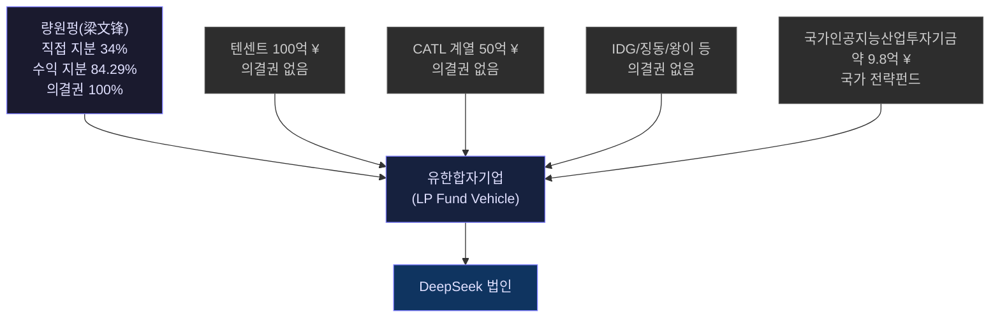
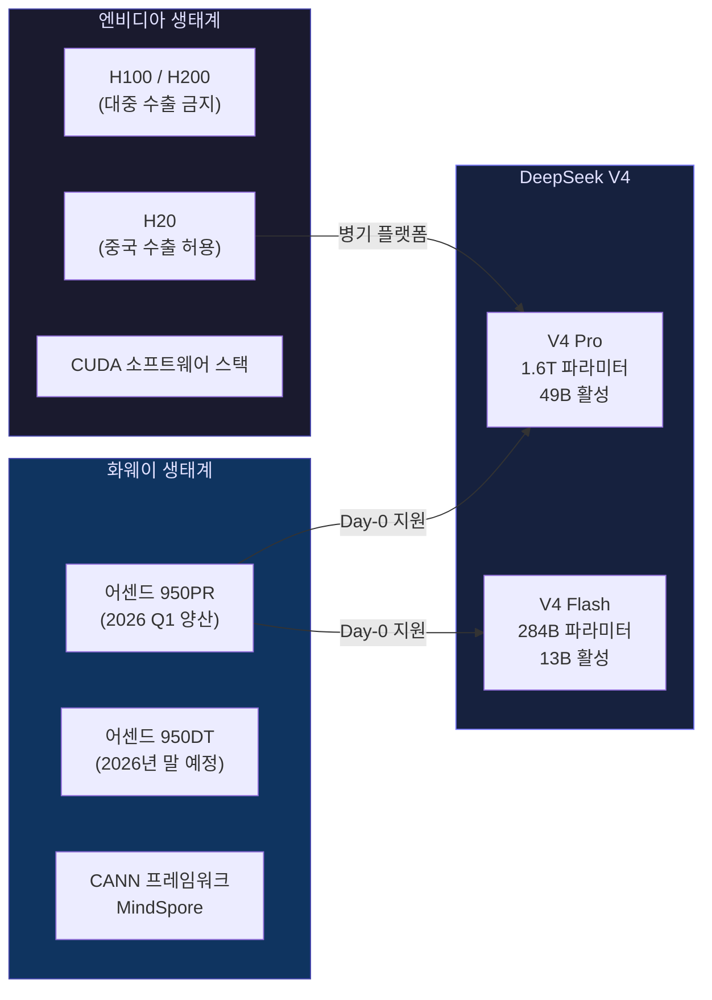
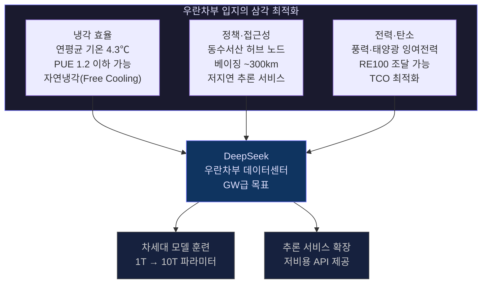
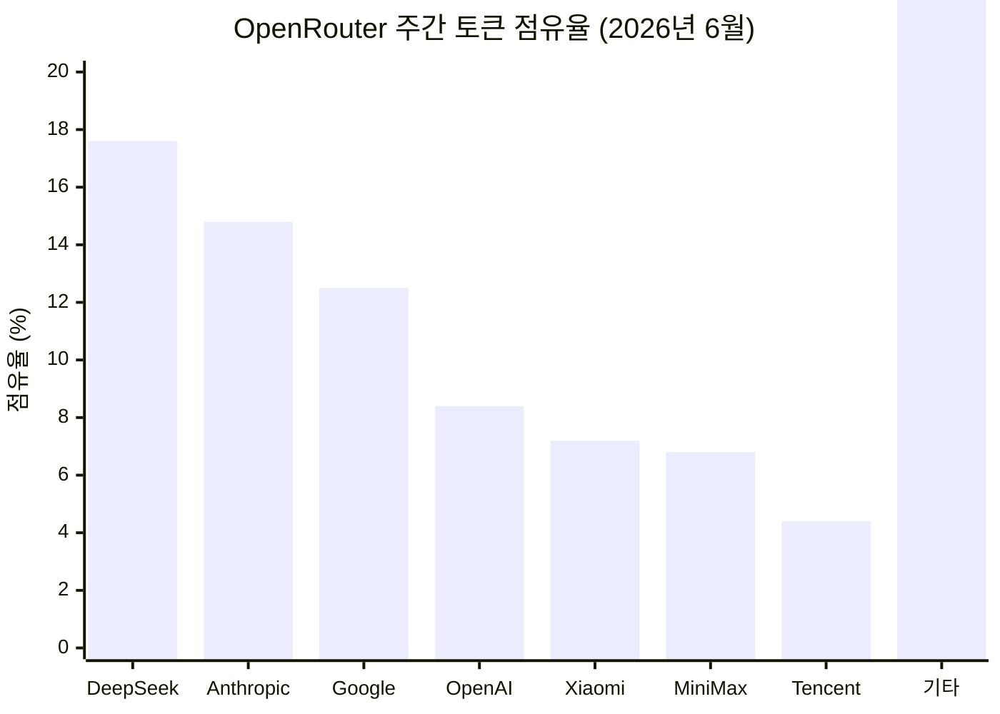
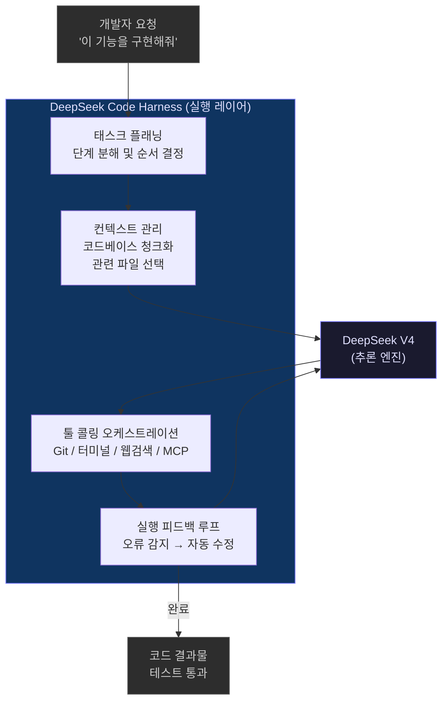
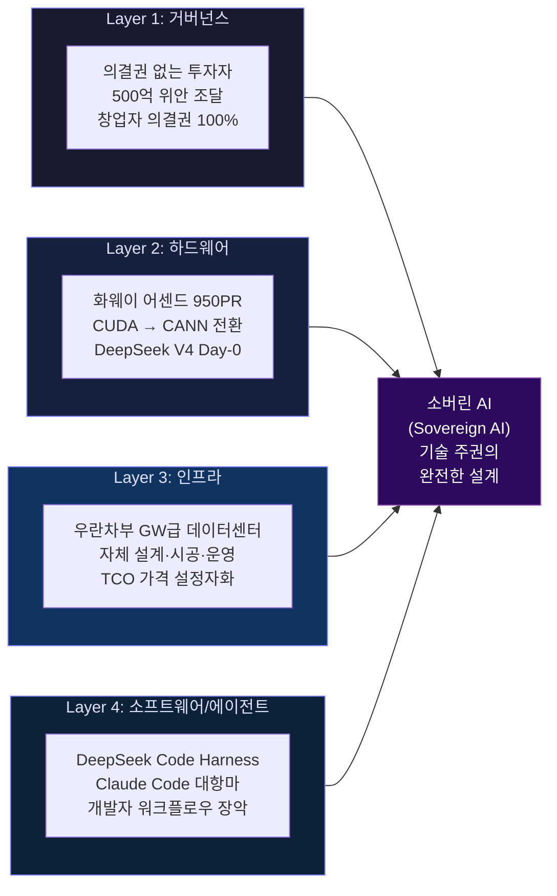
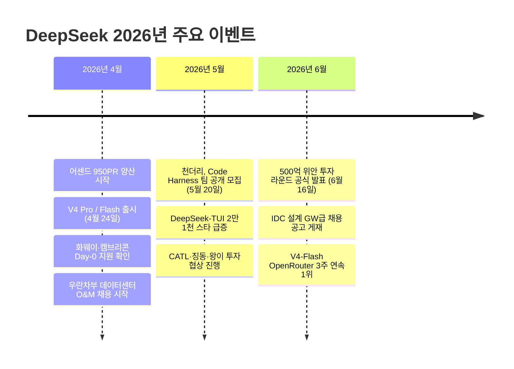

> **2026년 6월 기준 최신 정보 기반 분석 리포트**  
> 소버린 AI(Sovereign AI)란 무엇이며, DeepSeek는 어떻게 그것을 엔지니어링으로 설계하고 있는가

## 관련글

[**소버린 AI의 정수를 보여주는 DeepSeek**](https://www.facebook.com/share/p/1CyfCgy9BY/)

---

## 목차

1. [왜 지금 DeepSeek인가 — 소버린 AI 개념의 재정의](#1-왜-지금-deepseek인가)
2. [자본은 받되 통제권은 넘기지 않는다 — 거버넌스 설계](#2-자본은-받되-통제권은-넘기지-않는다)
3. [엔비디아 없는 프론티어 모델 — DeepSeek V4와 화웨이 어센드](#3-엔비디아-없는-프론티어-모델)
4. [GW급 데이터센터 — 컴퓨팅 파워 내재화의 물리적 기반](#4-gw급-데이터센터)
5. [토큰 전쟁의 현황 — OpenRouter가 보여주는 글로벌 시장의 선택](#5-토큰-전쟁의-현황)
6. [모델에서 에이전트로 — DeepSeek Code Harness의 등장](#6-모델에서-에이전트로)
7. [네 층위의 수렴 — 소버린 AI는 선언이 아니라 설계다](#7-네-층위의-수렴)
8. [종합 전망 — 이 흐름이 한국 AI 생태계에 던지는 질문](#8-종합-전망)

---

## 1. 왜 지금 DeepSeek인가

소버린 AI(Sovereign AI)라는 개념은 최근 몇 년 사이 급격히 부상했지만, 대부분의 경우 이 단어는 정책 선언문 안에서만 살아있는 개념이었다. 국산 모델을 쓰겠다, 데이터를 국내에 보관하겠다, 외산 AI에 의존하지 않겠다는 목표의 언어로만 존재해왔다는 뜻이다. 그런데 2026년 상반기, 중국의 AI 스타트업 DeepSeek는 이 개념을 엔지니어링과 거버넌스 설계의 언어로 번역하기 시작했다. 그것도 동시에, 네 개의 층위에서.

DeepSeek는 2023년 말 설립된 중국 AI 연구소로, 창업자 량원펑(梁文锋)이 이끌고 있다. 량원펑은 퀀트 헤지펀드 하이플라이어(High-Flyer)의 창업자이기도 하며, 딥러닝에 대한 원천적인 학문적 관심에서 출발해 AI 연구소를 설립했다. DeepSeek는 2024년 V2, V3, R1 등을 연달아 출시하며 국제 AI 커뮤니티에서 빠르게 주목을 받았다. 특히 2024년 말부터 2025년 초에 걸쳐 출시된 DeepSeek-R1은 미국 주요 AI 모델들과 대등하거나 이를 상회하는 벤치마크 성능을 보이면서, 훈련 비용이 OpenAI의 모델 대비 수십 분의 일에 불과하다는 점이 알려져 글로벌 시장에 충격을 주었다.

2026년 2분기는 DeepSeek의 전략이 단순한 모델 출시의 레벨을 넘어섰음을 보여주는 결정적인 시점이다. 이 시기에 DeepSeek는 500억 위안 규모의 역대 최대 자금조달을 마무리하고, 내몽골 우란차부에 GW급 자체 데이터센터 건설을 공식화했으며, DeepSeek V4를 화웨이 어센드 950PR 칩 위에서 공개했고, 'DeepSeek Code Harness' 팀을 공개 모집했다. 이 네 가지 행보는 독립적인 사건이 아니라 하나의 논리 고리로 수렴하는 전략적 설계다.

이 리포트는 그 설계의 구조를 층위별로 분해하여 설명한다.

---

## 2. 자본은 받되 통제권은 넘기지 않는다

### 역대 최대 규모의 투자, 그러나 숫자보다 중요한 것

2026년 6월 16일 공개된 DeepSeek의 자금조달 딜은 총액 500억 위안(약 10조 8,000억 원, 약 74억 달러)으로, 중국 AI 섹터 단일 라운드 역대 최고액을 기록했다. 투자 후 기업가치는 500억 달러(약 36조 2,500억 원)로 평가된다. 그러나 이 거래에서 가장 인상적인 것은 금액이 아니라 자금의 구조와 조건이다.

아래 표는 이번 라운드의 투자자 구성을 정리한 것이다.

| 투자자 | 출자액(위안) | 출자액(한화) | 성격 |
|--------|------------|------------|------|
| 량원펑(梁文锋) 개인 | 200억 위안 | 약 4조 3,200억 원 | 창업자 |
| 텐센트(腾讯) | 100억 위안 | 약 2조 1,600억 원 | 전략적 투자자 |
| CATL(宁德时代) 계열 | 50억 위안 | 약 1조 800억 원 | 산업 자본 |
| 징동(京东) | 30억 위안 | 약 6,480억 원 | 복합 |
| 왕이(网易) | 30억 위안 | 약 6,480억 원 | 복합 |
| Monolith 리쓰자본 | 30억 위안 | 약 6,480억 원 | 재무적 투자자 |
| IDG캐피털 | 30억 위안 | 약 6,480억 원 | 재무적 투자자 |
| 정신구투자(正心谷) | 15억 위안 | 약 3,240억 원 | 재무적 투자자 |
| 스샹커지(拾象科技) | 15억 위안 | 약 3,240억 원 | 재무적 투자자 |
| 국가인공지능산업투자기금 | 약 9.8억 위안 | 약 2,117억 원 | 국가 전략펀드 |
| **합계** | **500억 위안 초과** | **약 10조 8,000억 원 초과** | — |

이 라운드에서 창업자 량원펑이 개인 자격으로 출자한 200억 위안은 단일 투자자 기준 최대액이다. 즉 창업자 자신이 이 라운드의 최대 주주로서 주도적으로 자금을 집행한다는 의미다.

### 지배구조의 설계: 의결권 없는 투자자

이 거래의 핵심은 지배구조 조건에 있다. 중국 정부 자금인 국가인공지능산업투자기금을 제외한 모든 외부 투자자는 의결권을 가지지 못한다. 자금은 DeepSeek 법인에 직접 유입되지 않으며, 량원펑이 업무집행조합원(GP)으로 있는 유한합자기업을 반드시 경유한다. 전 투자자에게 5년 락업(lock-up)이 적용되며, 량원펑 팀은 출자 펀드의 LP 명단까지 직접 심사해 출처가 불명확한 자본의 유입을 사전에 차단하는 구조를 갖췄다. 현재 등기 기준으로 량원펑은 직접 지분 34%, 최종 수익 지분 84.29%, 의결권 100%를 보유한다.

### 텐센트는 왜 의결권을 포기하면서도 참여했는가

알리바바는 지배구조 참여가 불가능하다는 이유로 이번 투자를 철회했다. 반면 텐센트는 의결권을 포기하면서도 100억 위안을 출자했다. 텐센트의 계산은 단순하다. 투자 수익보다 자사 생태계(위챗, 텐센트 클라우드, 게임 플랫폼)와 DeepSeek 모델의 연동 채널을 확보하는 것이 전략적으로 더 중요하기 때문이다. CATL의 참여는 피지컬 AI — 로봇, 자율주행, 에너지 관리 시스템 — 영역으로의 협력 채널을 열어준다는 점에서 또 다른 전략적 함의를 가진다.

이 지배구조는 OpenAI의 캡드 프로핏(Capped-Profit) 모델, Anthropic의 공익법인(PBC) 구조와 철학적으로 유사한 점을 공유한다. 핵심 투자자가 의결권을 포기하는 대신 창업자가 장기 기술 로드맵을 분기 실적 압박이나 IPO 타임라인 없이 실행할 수 있도록 설계한 것이다. DeepSeek는 10조 원 이상의 실탄을 확보하면서도 단기 수익 압박 없이 10년 단위의 기술 로드맵을 자신의 속도로 실행할 수 있게 됐다.

소버린 AI란 단순히 국산 모델을 만드는 것이 아니라 기술 방향의 의사결정 주권을 외부 자본으로부터 지키는 것이기도 하다. DeepSeek는 그 원칙을 거버넌스 구조로 제도화했다.

---

## 3. 엔비디아 없는 프론티어 모델

### DeepSeek V4: 스펙이 아닌 하드웨어 선택이 핵심

2026년 4월 24일 공개된 DeepSeek V4는 두 가지 변형(variant)으로 출시됐다. V4 Pro는 총 파라미터 1.6조 개(1.6T), 토큰당 활성 파라미터 490억 개의 MoE(Mixture of Experts) 아키텍처 모델이며, V4 Flash는 총 파라미터 2,840억 개에 토큰당 활성 파라미터 130억 개의 효율화 버전이다. 두 모델 모두 100만 토큰(1M token) 네이티브 컨텍스트 윈도우를 기본 지원하며, MIT 라이선스로 공개됐다.

기술 보고서상의 수치들도 인상적이다. 토큰당 연산량이 V3.2 대비 27% 수준으로 낮아졌으며, KV 캐시 메모리 점유율은 10%로 줄었다. 3단계 추론 강도 동적 배분과 에이전틱 코딩(Agentic Coding) 특화 최적화도 포함됐다. LiveCodeBench에서 93.5, Codeforces에서 3206 레이팅을 기록해 코딩 벤치마크에서 최상위권 성능을 보였다.

그러나 V4에서 가장 결정적인 변화는 모델 아키텍처가 아니라 **하드웨어 결정**이다.

### CUDA에서 CANN으로 — 전략적 독립 선언

로이터(Reuters)가 확인한 바에 따르면, DeepSeek는 V4 개발 과정에서 화웨이에게 독점적인 선행 하드웨어 접근권을 부여했다. 반면 엔비디아와 AMD는 출시 전 테스트에서 의도적으로 배제됐다. V4는 화웨이 어센드 950PR를 핵심 플랫폼으로 채택하여 사실상 CUDA 생태계에서 화웨이 CANN(Compute Architecture for Neural Networks) 프레임워크로의 전환을 공식화했다.

이 전환은 기술적으로 수개월의 마이그레이션 비용을 치른 결과다. CUDA 기반으로 설계된 코드를 CANN 기반으로 전면 재작성하는 것은 단순한 이식(porting) 작업이 아니다. 그럼에도 DeepSeek가 이 경로를 선택한 것은 전략적 독립 선언의 성격을 갖는다.

### 어센드 950PR: 어느 수준의 칩인가

화웨이 어센드 950PR는 2026년 1분기에 양산에 들어간 최신 AI 가속 칩이다. 업계 분석 자료를 종합하면, 단일 카드 컴퓨팅 파워는 엔비디아의 대중국 수출 허용 버전인 H20 대비 약 2.87배 높다. 절대 성능은 H200의 약 50% 수준이지만, 구매 단가는 H200의 3분의 1에서 4분의 1 수준이다. 즉 성능 대비 가격(perf/$ ratio)으로 보면 현재 중국 내에서 유효한 대안 중 가장 경쟁력 있는 선택지가 된다.

V4 출시 당일에는 화웨이 어센드 외에도 캠브리콘(Cambricon), 하이곤(Hygon), 무어 스레드(Moore Threads), 수이위안(Suiyuan) 등 8개 중국 국산 칩 패밀리가 BAAI의 FlagOS 국가 AI 소프트웨어 스택을 통해 동시에 호환성을 완료했다. 이는 중국 AI 컴퓨팅 생태계가 V4의 출시를 사전에 조율된 방식으로 수용했다는 의미다.

### 왜 이것이 지정학적으로 중요한가

미국의 첨단 반도체 대중국 수출 통제는 중국 AI 산업의 발전 속도를 늦추기 위한 핵심 수단으로 설계됐다. V4가 어센드 950PR 위에서 프론티어급 성능을 달성하고, 토큰당 연산량을 소프트웨어 효율로 27%까지 낮추었다면, 하드웨어 절대 성능의 열세를 알고리즘으로 상쇄하는 구조가 현실로 작동하기 시작했다는 의미다.

엔비디아 CEO 젠슨 황은 AI 모델들이 다른 기술 스택에 최적화될 경우 이는 미국 AI 우위에 있어 "끔찍한 결과"가 될 수 있다고 경고했다. 실제로 V4의 어센드 칩 지원 발표 이후 알리바바, 바이트댄스, 텐센트가 화웨이 950PR를 수십만 장 단위로 선주문하면서 화웨이 칩 가격이 약 20% 상승하는 공급망 반응이 나타났다.

단 한 가지 중요한 사실 관계를 명확히 해야 한다. V4는 화웨이 칩을 위해 공동 엔지니어링된 최초의 프론티어급 모델이지만, V4의 훈련 전체가 어센드 칩만으로 수행됐는가에 대해서는 확인된 사실과 추정이 혼재한다. 로이터 등 일부 보도는 DeepSeek가 엔비디아 블랙웰 칩도 내몽골 데이터센터에서 활용했을 가능성을 언급하고 있으며, 이 부분은 공식적으로 확인되지 않은 상태다. 보다 정확하게는, 추론(inference) 측면에서의 어센드 독립 경로는 현실화됐으며, 대규모 훈련에서의 완전한 어센드 전환은 2026년 하반기 950PR 대량 출하를 기다리는 진행 중인 과정으로 보는 것이 타당하다.

---

## 4. GW급 데이터센터

### 채용 공고가 전략을 말한다

2026년 6월 9일, DeepSeek 공식 채용 사이트에 'IDC 설계 기획 엔지니어' 포지션이 올라왔다. 공고에는 "MW에서 GW급 인프라의 기획 및 건설에 참여"라는 문구가 명시돼 있었다. 이미 4월에는 내몽골 우란차부(乌兰察布) 스마트 컴퓨팅센터를 대상으로 한 고급 운영유지(O&M) 엔지니어와 납품 매니저 채용이 시작됐다.

설계·시공과 현장 운영 직군이 동시에 채용된다는 것은, DeepSeek가 '자체 설계 - 자체 시공 - 자체 운영'의 풀스택(Full-Stack) 인프라 노선을 공식 선택했음을 의미한다. 이는 대부분의 AI 스타트업이 클라우드 서비스를 임차하는 방식과 근본적으로 다른 접근이다.

### GW는 어느 정도의 규모인가

기가와트(GW)는 AI 인프라에서 통상적으로 사용되는 규모 단위가 아니다. 엔비디아 CEO 젠슨 황은 1GW 규모 AI 데이터센터 구축에 약 800억 달러가 소요된다고 밝혔다. GPU 수량으로 환산하면 엔비디아 H100 기준 1GW에 약 62만 장, 화웨이 어센드 950 기준으로는 약 90만 장이 필요한 규모다. 이는 차세대 1조(1T) 파라미터, 나아가 10조(10T) 파라미터급 모델의 사전훈련(Pre-training)과 강화학습(RLHF·RLAIF) 파이프라인을 자체 인프라 위에서 돌리겠다는 명확한 의지 표명이다.

### 우란차부가 선택된 이유: 삼각 최적화

우란차부는 내몽골 자치구에 위치한 인구 약 170만 명의 도시다. 베이징에서 고속철로 약 2시간 거리다. 이 도시가 DeepSeek의 데이터센터 입지로 선택된 데는 데이터센터 엔지니어링의 삼각 최적화 논리가 깔려 있다.

첫째, 냉각 효율이다. 우란차부의 연평균 기온은 4.3℃로, 서버 냉각에 외기를 그대로 활용하는 자연냉각(Free Cooling) 비율을 극대화할 수 있다. 이는 PUE(전력 효율 지표, Power Usage Effectiveness) 1.2 이하 달성을 가능케 한다. PUE 1.2는 서버 자체가 소비하는 전력 1단위당 냉각·전력 변환에 추가로 0.2단위만 소비한다는 의미로, 업계 최상위 수준의 효율이다.

둘째, 정책 지원과 접근성이다. 중국 정부의 '동수서산(東數西算, 동쪽의 데이터를 서쪽에서 계산한다)' 정책에서 지정된 8대 컴퓨팅 허브 노드 중 하나가 바로 이 지역이다. 베이징까지 300킬로미터 남짓한 거리에서 추론 서비스(Inference Serving)의 네트워크 지연(latency)을 최소화한다.

셋째, 전력과 탄소 효율이다. 2025년 말 기준 내몽골 전체 컴퓨팅 파워 총량 23.7만P(페타플롭스) 중 AI 컴퓨팅 비중은 92%로 전국 1위다. 이 지역의 풍력·태양광 잉여 전력은 장기 운영의 총소유비용(TCO) 최적화와 RE100 조달을 동시에 가능케 한다.

### 가격 설정자가 되는 것의 의미

컴퓨팅 파워를 AWS, 구글 클라우드, 알리바바 클라우드 등 제3자로부터 임차하는 기업은 영원히 인프라 비용의 가격 수용자(Price Taker)에 머문다. 반면 자체 데이터센터를 직접 구축하고 운영하는 순간, 전력·냉각·네트워크 비용을 원가 수준으로 통제할 수 있게 된다. 수십만 장 규모의 발주력은 장비 단가 협상에서 구조적 우위를 만들어낸다. 무엇보다 모델 아키텍처와 하드웨어 스택을 함께 튜닝하는 소프트웨어-하드웨어 공동 최적화(co-optimization)가 가능해진다. DeepSeek는 인프라 가격 설정자(Price Maker)가 되려 한다. 이것이 소버린 AI의 물리적 기반이다.

이번 투자 라운드 직후 DeepSeek가 IR 발표보다 먼저 채용 공고를 올렸다는 사실 자체가 이 회사의 우선순위를 말해준다. 자금은 모델 연구보다 인프라 구축에 먼저 투입된다.

---

## 5. 토큰 전쟁의 현황

### OpenRouter가 보여주는 실제 시장의 선택

OpenRouter는 수백만 명의 개발자가 다양한 AI 모델을 API로 호출하는 글로벌 플랫폼이다. 이 플랫폼의 트래픽 데이터는 설문조사나 추정치가 아닌 실제 API 호출량을 기반으로 하기 때문에, 현재 글로벌 개발자 시장이 어떤 모델을 실제로 선택하는지를 가장 정직하게 보여주는 지표 중 하나다.

2026년 6월 8일 기준 최신 집계에서 주간 총 호출량은 36.1조 토큰으로 7주 연속 신기록을 경신했다. 상위 5개 모델 중 4개가 중국산이었고, DeepSeek-V4-Flash가 3주 연속 1위를 유지하며 주간 19% 성장률을 기록했다.

전체 점유율을 보면, DeepSeek 단독 점유율은 17.6%로 구글(12.5%)과 OpenAI(8.4%)의 합산을 넘어섰다. 중국계 5개사(DeepSeek·샤오미·MiniMax·텐센트·Qwen) 합산은 46.4%이며, 미국계(Anthropic·Google·OpenAI) 합산은 35.7%다.

### 결정적 수치: 94%는 해외 개발자

OpenRouter 사용자의 94%는 중국 외 지역의 해외 개발자다. 중국 모델의 부상이 내수 통계의 왜곡이 아닌, 실제 글로벌 개발자 시장의 선택임을 의미한다. 중국산 모델의 OpenRouter 트래픽 점유율은 1년 전 2% 미만에서 현재 45% 이상으로 수직 상승했다.

이 급성장을 이끈 핵심 동인은 **코딩·에이전트 워크로드의 폭발적 확대**다. OpenRouter 전체 토큰 소비에서 프로그래밍 태스크 비중은 2025년 초 11%에서 현재 50% 이상으로 수직 상승했다. 멀티스텝 툴 콜링과 에이전트 실행은 단일 요청에서 수십만~수백만 토큰을 소비하는 고부하 워크로드다. 토큰당 비용이 낮은 중국 오픈소스 모델에 구조적으로 유리한 시장 구조가 형성된 것이다.

실제로 DeepSeek V4 Flash의 API 가격은 입력 토큰 기준 백만 토큰당 0.14달러, V4 Pro도 0.435달러다. Anthropic의 Claude Opus 4.7이 입력 기준 백만 토큰당 약 15달러인 것과 비교하면 30~100배 이상의 가격 차이가 존재한다. 에이전트 워크로드처럼 토큰 소비가 폭발적으로 늘어나는 환경에서 이 가격 차이는 결정적인 선택 기준이 된다.

### 역설: 소버린 AI가 글로벌 인프라가 되는 순간

이 수치가 소버린 AI 논의에서 갖는 함의는 역설적이다. 중국이 자국 AI의 공급망 자주권을 확보하는 동시에, 그 모델이 전 세계 개발자 생태계의 기본 인프라로 침투하고 있다. 중국 모델이 글로벌 코딩·에이전트 워크로드의 표준 선택지로 굳어지면, AI 인프라의 지정학적 중심이 조용히 이동한다. DeepSeek V4의 어센드 칩 지원은 이 맥락에서 다시 읽혀야 한다. 글로벌 개발자 트래픽의 46%를 이미 처리하는 중국 AI 인프라가 엔비디아 GPU 없이도 추론 서비스를 확장할 수 있는 공급망 자주권을 확보했다는 선언인 것이다.

---

## 6. 모델에서 에이전트로

### DeepSeek Code Harness: 다음 전선의 공개

2026년 5월 20일, DeepSeek의 시니어 리서처 천더리(陈德里, Deli Chen)는 소셜 미디어 X에 두 개의 채용 공고를 게재하며 공개적으로 인재를 모집했다. "처음부터 Code Harness를 만들자(Join DeepSeek to build Code Harness from scratch)"라는 문구와 함께, 프로젝트의 벤치마크 타깃이 Anthropic의 Claude Code임을 명시했다. 채용 포지션은 베이징 하이디안구 소재의 하네스 프로덕트 매니저(Harness PM)와 하네스 R&D 엔지니어 두 가지다.

내부 작업명은 "DeepSeek Code"이며, 공식적으로는 "DeepSeek Code Harness"로도 불린다. 이 프로젝트는 단순한 채용 공고를 넘어 DeepSeek의 다음 제품화 방정식을 공개적으로 선언한 것이다.

### Harness란 무엇인가

Harness는 에이전트 아키텍처에서 모델 위에 올라가는 실행 레이어다. 모델 자체가 텍스트를 생성하는 엔진이라면, Harness는 그 엔진을 실제 개발자 워크플로우에 연결하는 인터페이스 전체를 의미한다.

Harness가 담당하는 구체적인 기능 영역은 다음과 같다. 컨텍스트 윈도우 관리를 통해 대규모 코드베이스를 어떻게 모델에 효율적으로 전달할지를 결정한다. 툴 콜링(Tool Calling) 오케스트레이션은 웹 검색, 파일 시스템, 터미널, Git, 외부 API 등 다양한 도구를 모델이 순차적으로 또는 병렬로 활용할 수 있게 한다. 태스크 플래닝(Task Planning)은 복잡한 요청을 단계별로 분해하고 실행 순서를 결정한다. 실행 피드백 루프(Execution Feedback Loop)는 코드를 실행하고 오류가 발생하면 이를 모델에 다시 전달해 자동으로 수정하는 반복 구조를 구성한다.

공식은 단순하다. **모델 + Harness = AI 에이전트**. 모델이 아무리 뛰어나도 이 실행 레이어 없이는 실제 개발자 워크플로우에 진입하지 못한다.

### 현재 코딩 에이전트 시장의 구도

AI 코딩 에이전트 시장은 2026년 중반 기준 빠르게 정착하고 있다. Pragmatic Engineer가 906명의 소프트웨어 엔지니어를 대상으로 실시한 설문에서 Claude Code는 46%의 '가장 선호하는 도구' 응답을 받아 1위를 차지했다. OpenAI의 Codex CLI, Cursor, GitHub Copilot 등이 경쟁하는 시장에서 Claude Code가 개발자 사이의 레퍼런스 포인트가 된 상황이다.

DeepSeek의 채용 공고에서 PM 후보 요건으로 Claude Code, Cursor, Codex, GitHub Copilot, Manus, OpenClaw 등 경쟁 도구를 직접 사용해본 경험을 명시한 것은, DeepSeek가 경쟁 제품을 깊이 분석한 후 이 시장에 진입하겠다는 의미다.

DeepSeek V4는 이미 Claude Code의 백엔드 모델로 네이티브 통합을 지원하고 있다. 즉 지금도 많은 개발자들이 Claude Code 인터페이스를 쓰면서 DeepSeek V4 모델을 선택해 사용한다. DeepSeek Code Harness는 이 상황에서 모델 공급자의 위치에 머무는 대신, 개발자 접점 전체를 자체 도구로 가져오겠다는 전략이다.

한편 커뮤니티 측에서도 이미 움직임이 나타났다. 독립 개발자 헌터 보운(Hunter Bown)이 2026년 1월 출시한 DeepSeek-TUI — 터미널 기반 DeepSeek V4 코딩 에이전트 — 는 V4 출시 직후 급성장해 GitHub 트렌딩 1위를 기록했고, 5월 Harness 팀 발표 이후 1주일 만에 2만 1,000개 이상의 스타를 추가로 받았다. 공식 제품이 출시되기도 전에 커뮤니티 수요가 검증되고 있다.

### DeepSeek가 노리는 것: AI 네이티브 개발 환경의 운영체제

지금까지 DeepSeek의 수익화 경로는 API 과금과 기업 라이선스였다. Harness는 그 위에 개발자 워크플로우 전체를 장악하는 새로운 레이어를 올리는 시도다. 성공한다면 DeepSeek는 모델 라이선스 수익에 더해 개발자 도구 생태계에서의 수익화 채널을 열게 된다.

오픈소스 모델의 광범위한 저변, 국산 칩 기반의 저단가 추론 인프라, 그리고 Harness 실행 레이어가 결합될 때 — DeepSeek는 단순한 모델 공급자를 넘어 AI 네이티브 개발 환경의 운영체제가 되려는 것이다.

---

## 7. 네 층위의 수렴

### 소버린 AI를 설계하는 방법

소버린 AI란 단순히 좋은 모델을 만드는 것이 아니다. 기술 방향의 의사결정 주권, 컴퓨팅 파워의 공급망 독립, 하드웨어 생태계의 자국 내재화, 개발자 접점의 도구 레이어 장악 — 이 네 가지가 동시에 설계되어야 한다. DeepSeek는 2026년 2분기에 이 네 층위를 동시에 가시화했다.

### 각 층위가 다른 층위를 강화하는 구조

이 네 층위는 독립적으로 존재하지 않는다. 각 층위가 다른 층위를 강화하는 선순환 구조를 형성한다.

거버넌스 설계(의결권 100% 보유)가 가능했기 때문에 분기 실적 압박 없이 수개월이 걸리는 CUDA→CANN 마이그레이션을 실행할 수 있었다. 하드웨어 독립(어센드 칩 채택)이 현실화됐기 때문에 GW급 데이터센터를 자체 칩 기반으로 구축하는 계획이 경제적으로 성립한다. 자체 인프라(저단가 TCO)가 확보됐기 때문에 V4 Flash의 입력 토큰당 0.14달러라는 가격 책정이 가능하고, 이 가격이 OpenRouter에서의 토큰 점유율 급성장을 만들었다. 토큰 점유율(글로벌 개발자 생태계 침투)이 넓어졌기 때문에 DeepSeek Code Harness가 '이미 모델이 깔려 있는 시장'을 대상으로 도구 레이어를 올릴 수 있다.

### 2026년 2분기 주요 이벤트 타임라인

---

## 8. 종합 전망

### DeepSeek가 던지는 구조적 질문들

DeepSeek의 2026년 2분기 행보는 글로벌 AI 생태계에 몇 가지 근본적인 질문을 던진다.

**첫째, 수출 통제의 효력에 관한 질문이다.** 엔비디아 첨단 칩의 대중국 수출 통제는 중국 AI 산업의 발전을 늦추기 위한 핵심 수단이었다. 그러나 DeepSeek V4가 화웨이 어센드 950PR 위에서 프론티어급 추론 성능을 달성하고, 이를 기반으로 글로벌 개발자 시장에서 점유율을 높여가고 있다면, 그 통제 수단의 효력은 어느 수준에서 한계에 도달하고 있는가. 미국의 정책 입안자들이 재검토해야 할 지점이다.

**둘째, AI 인프라의 지정학적 중심 이동에 관한 질문이다.** OpenRouter에서 중국 모델이 처리하는 46%의 토큰은 대부분 중국 국내가 아닌 해외 개발자의 요청이다. 이 개발자들이 중국 모델을 기반으로 코딩 에이전트와 자동화 도구를 구축하고 있다면, 글로벌 소프트웨어 인프라의 기반층이 조용히 교체되고 있다. AI 인프라의 지정학은 군사력이 아니라 토큰당 비용과 오픈소스 접근성으로 결정된다.

**셋째, 거버넌스 모델에 관한 질문이다.** 의결권 없는 투자자 구조, 창업자 의결권 100% 보유, 5년 락업은 OpenAI나 Anthropic이 고민해온 것과 동일한 문제 — 단기 자본 이익과 장기 기술 방향성의 충돌 — 에 대한 중국식 해법이다. 이 구조가 실제로 10년 단위의 기술 로드맵 실행을 가능케 하는지는 앞으로 검증될 것이다.

### 한국 AI 생태계에 던지는 시사점

한국의 AI 생태계는 DeepSeek의 이 설계로부터 몇 가지 교훈을 추출할 수 있다.

소버린 AI를 추구한다면 모델 성능 하나만으로는 충분하지 않다. 거버넌스·인프라·하드웨어·소프트웨어 레이어 전체에서 동시에 설계가 이루어져야 한다는 것이 DeepSeek의 사례가 보여주는 핵심 메시지다. 한국의 클라우드 인프라 의존도, 시스템 반도체 생태계의 현황, AI 기업 거버넌스 구조를 이 네 층위 프레임으로 점검할 필요가 있다.

또한 DeepSeek의 오픈소스 전략은 단순한 기술 공유가 아니라 글로벌 개발자 생태계를 자사 모델 중심으로 재편하는 시장 전략이다. MIT 라이선스로 공개된 V4 모델 가중치는 전 세계 개발자가 자유롭게 파인튜닝하고 배포할 수 있으며, 이는 DeepSeek 생태계의 저변을 무료로 확장하는 효과를 낸다. 한국 AI 기업들이 클로즈드 소스 전략과 오픈소스 전략 사이에서 어떤 포지션을 취할지는 이 맥락에서 재검토되어야 한다.

### 마치며

지금 DeepSeek를 주목하는 이유는 모델 성능이나 자금조달 규모가 아니다. 후발 주자가 선두 주자의 구조적 장점 — CUDA 생태계, 클라우드 인프라, 기존 개발자 도구 — 을 어떻게 우회하고, 더 나아가 소버린 AI를 가능케 하는 구조를 어떻게 설계하는가 하는 방법론 그 자체다.

소버린 AI는 선언이 아니라 설계다. 그리고 그 설계는 거버넌스, 하드웨어, 인프라, 소프트웨어 — 네 개의 층위에서 동시에 이루어져야 한다. DeepSeek는 2026년 2분기에 그 설계를 가시화했다.

---

## 부록: 주요 용어 정리

| 용어 | 설명 |
|------|------|
| **소버린 AI (Sovereign AI)** | 특정 국가나 조직이 AI 기술의 의사결정 주권을 외부(타국, 외부 자본)로부터 독립적으로 유지하는 것 |
| **MoE (Mixture of Experts)** | 전체 파라미터 중 토큰별로 일부만 활성화하는 아키텍처. 대형 모델을 효율적으로 운용하는 방식 |
| **CUDA** | 엔비디아 GPU에서 동작하는 병렬 컴퓨팅 플랫폼. AI 훈련·추론의 사실상 표준 |
| **CANN** | 화웨이 어센드 칩을 위한 딥러닝 연산 프레임워크 (Compute Architecture for Neural Networks) |
| **PUE** | Power Usage Effectiveness. 데이터센터 전체 전력 소비 대비 IT 장비 전력 소비의 비율. 낮을수록 효율적 |
| **TCO** | Total Cost of Ownership. 장비 구입·운영·유지보수 등 총소유비용 |
| **Harness** | AI 에이전트 아키텍처에서 모델 위에 올라가는 실행 레이어. 툴 콜링, 태스크 플래닝, 피드백 루프 등을 담당 |
| **MCP (Model Context Protocol)** | AI 에이전트가 외부 도구·데이터와 표준화된 방식으로 연결하는 프로토콜. Anthropic이 제안한 사실상 표준 |
| **Free Cooling** | 외부 공기를 직접 활용해 서버를 냉각하는 방식. 냉각 에너지 비용을 크게 줄임 |
| **동수서산 (東數西算)** | 중국 정부의 컴퓨팅 자원 서부 이전 정책. 동부 해안의 데이터를 서부·북부 지역에서 처리 |
| **OpenRouter** | 다양한 AI 모델을 단일 API로 접근하는 글로벌 플랫폼. 실제 개발자 API 호출량 기반 트래픽 통계 제공 |
| **GP / LP** | General Partner(업무집행조합원) / Limited Partner(유한책임조합원). 펀드 운영에서 GP가 실권을 갖고 LP는 자금을 제공 |

---

*본 리포트는 2026년 6월 17일 기준으로 작성됐습니다. DeepSeek Code Harness는 현재 채용 진행 중인 개발 예정 제품으로, 아직 공식 출시되지 않았습니다. V4의 어센드 칩 기반 훈련 전환의 완전한 실현 시점은 2026년 하반기로 예상됩니다.*
