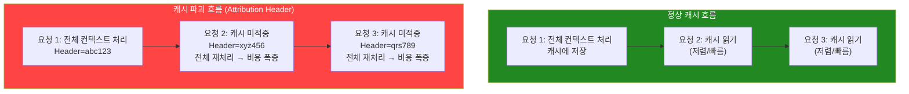
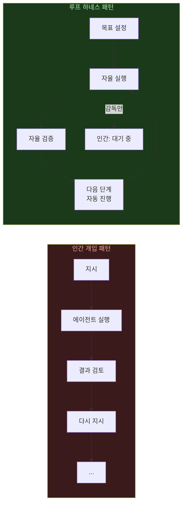
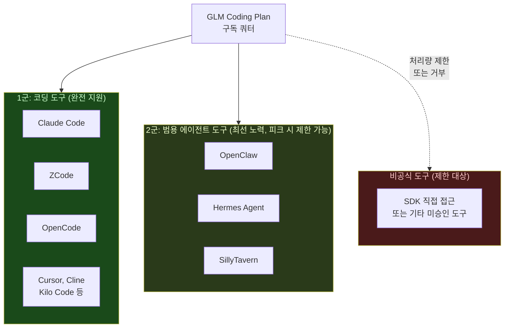

> 작성 기준일: 2026년 6월 18일 | Threads [@roach_log](https://www.threads.com/@life.and.roll/post/DZrKdoNk1rW) 발 실전 논의 완전 해설

---

## 1장. 이 글의 구성

이 문서는 Threads(@roach_log)에서 공유된 세 가지 실전 경험담을 중심으로, GLM-5.2를 코딩 에이전트에 연결할 때 발생하는 핵심 문제들을 하나씩 풀어낸다.

첫 번째는 **캐시 파괴(Cache Breaking) 문제**다. Claude Code에서 GLM-5.2를 연결했을 때 비용이 폭증하는 이유와 그 해결책이다. 두 번째는 **하네스 간 실비용 비교**다. 동일 작업을 Claude Code와 ROACH CODE(개인 경량 하네스)로 처리했을 때 $1.30 대 $0.0849라는 15배 이상의 비용 차이가 어떻게 발생했는지를 설명한다. 세 번째는 **GLM Coding Plan의 공식/비공식 도구 구분**으로, OpenClaw·Hermes Agent·SillyTavern이 어떤 지위를 갖는지를 다룬다. 마지막으로 **가재 코드(Gajae-Code)와 Kimi K2.7 High Speed의 조합**이 실제로 어떻게 작동하는지를 살펴본다.

---

## 2장. 핵심 문제: 왜 Claude Code에서 GLM-5.2가 느리고 비쌌는가

### 2.1 캐시 파괴(Cache Breaking) 메커니즘

첫 번째 실험 결과를 보면 충격적이다. 같은 로직을 두 가지 하네스에서 실행했더니 비용이 약 15배 차이가 났다고 한다.

- **Claude Code**: $1.30
- **ROACH CODE (개인 하네스)**: $0.0849

Claude Code의 세부 사용량을 보면 이 비용이 왜 발생했는지 드러난다.

```
glm-4.5-air:  85 input, 24 output, 256 cache read  → $0.0012
glm-5.2[1m]:  66.7k input, 21.9k output, 832.8k cache read → $1.30
```

11줄을 추가하고 1줄을 삭제하는 아주 단순한 작업에서, 66,700개의 입력 토큰과 832,800개의 캐시 읽기가 발생했다. 이것은 캐시 시스템이 제대로 작동하지 않았다는 신호다.

원인은 **Attribution Header**다. Claude Code 버전 2.1.36부터 Anthropic은 매 요청마다 변경되는 특수 헤더(`x-anthropic-billing-header`)를 자동으로 추가하기 시작했다. 이 헤더의 값은 요청마다 달라지는데, 문제는 이것이 LLM 서버의 **KV 캐시 키(Key)** 를 구성하는 요소로 인식된다는 점이다. 같은 컨텍스트라도 헤더가 바뀌면 캐시를 완전히 새로 계산해야 한다. 결과적으로 캐시 적중이 이루어지지 않고, 매 턴마다 전체 컨텍스트를 새로 처리하게 된다.

GLM-5.2의 1M 컨텍스트 윈도우를 쓰는 경우를 생각해보자. 캐시가 정상 작동하면 한 번 처리한 긴 컨텍스트를 재활용할 수 있어 비용이 낮다. 그러나 캐시가 깨지면 매 요청마다 1M 토큰에 가까운 전체 컨텍스트를 다시 처리할 수 있다. 이것이 비용 폭증과 속도 저하의 직접적인 원인이다.



### 2.2 해결 방법: CLAUDE_CODE_ATTRIBUTION_HEADER 설정

해결책은 Attribution Header 전송을 비활성화하는 것이다. 단, 이것은 반드시 `~/.claude/settings.json` 파일 안에 설정해야 하며, 터미널 환경변수(`export`)로는 효과가 없다는 점이 중요하다.

```json
{
  "env": {
    "CLAUDE_CODE_ATTRIBUTION_HEADER": "0",
    "CLAUDE_CODE_ENABLE_TELEMETRY": "0",
    "CLAUDE_CODE_DISABLE_NONESSENTIAL_TRAFFIC": "1"
  }
}
```

이 설정을 적용하면 Claude Code가 Attribution Header를 요청에 포함하지 않아, GLM 같은 서드파티 모델의 KV 캐시가 정상적으로 유지된다. 이것만으로 속도와 비용이 크게 개선된다고 알려져 있다. 참고로 이 현상은 GLM에만 국한된 게 아니라, Ollama나 llama.cpp 같은 로컬 모델 서버를 Claude Code와 연결할 때도 동일하게 발생한다.

### 2.3 여전한 구조적 비용 차이

그런데 @roach_log는 흥미로운 점을 덧붙인다. Attribution Header 문제를 해결하더라도, Claude Code 자체가 본질적으로 "무거운" 클라이언트라는 것이다. 기본적으로 많은 토큰을 소비하는 시스템 프롬프트, 도구 정의(최대 259개), 자동 진행되는 백그라운드 하우스키핑 요청 등이 있기 때문이다. 반면 ROACH CODE 같은 개인 맞춤형 경량 하네스는 꼭 필요한 것만 담아 만들어졌기 때문에 동일한 작업에 훨씬 적은 토큰을 쓴다.

이것은 앞서 언급한 피처 풍부함과 토큰 효율 사이의 근본적인 트레이드오프다. Claude Code는 유저 경험이 완성된 제품이지만, 그 편의성의 대가로 토큰을 상당히 쓴다.

---

## 3장. ROACH CODE란 무엇인가

ROACH CODE는 Threads 사용자 @roach_log(이하 '로치')가 개인적으로 만들어 사용하는 경량 코딩 에이전트 하네스다. 공개 저장소나 공식 배포판이 존재하는 범용 오픈소스 프로젝트가 아니라, 본인의 워크플로우에 최적화된 PI(Private Harness, 나만의 하네스) 형태다.

로치가 YouTube 영상과 Threads를 통해 '루프 하네스 시스템'을 소개하면서 일부 한국 개발자 커뮤니티에서 알려지게 되었다. 실제로 댓글에서 "로치님의 영상 덕분에 개인적인 루프 하네스 시스템을 성공적으로 도입할 수 있었습니다"라는 반응이 달렸다.

ROACH CODE가 Claude Code 대비 비용을 대폭 줄일 수 있는 이유는, 불필요한 오버헤드를 제거하고 필요한 기능만을 담은 최소 하네스이기 때문이다. 같은 11줄 추가/1줄 삭제 작업에서 $1.30 대 $0.0849의 차이는 약 15배에 달한다. 

### 3.1 루프 하네스(Loop Harness)란 무엇인가

커뮤니티 댓글에서 언급된 '루프 하네스 시스템'은 에이전트가 반복적인 실행 루프를 자율적으로 돌리는 구조를 가리킨다. 인간 개발자가 매 단계마다 지시를 내리는 대신, 에이전트가 스스로 목표를 세우고, 실행하고, 검증하며, 다음 단계로 넘어가는 사이클을 반복한다.

이 구조가 안정화되면 인간의 개입 빈도가 낮아지고, 자연스럽게 "대기 시간"이 생긴다. 댓글 작성자가 "루프 효율이 높아지면서 이전보다 긴 대기 시간(여유 시간)이 생겼다"고 표현한 것이 바로 이 현상이다. 에이전트가 스스로 돌아가는 동안, 인간은 다른 일을 할 수 있게 되는 셈이다.



---

## 4장. GLM Coding Plan의 도구 지원 2단계 체계

### 4.1 공식 지원 1군: 코딩 도구

GLM Coding Plan의 공식 문서에는 지원 도구가 명확히 구분되어 있다. 1군은 Z.ai가 공식적으로 지원하고 통합 가이드를 제공하는 코딩 전용 도구들이다. 이들은 쿼터 사용이 안정적으로 보장된다.

공식 지원 목록에는 Claude Code(Anthropic), ZCode(Z.ai 자체), OpenCode, Cursor, Cline, Kilo Code, Roo Code, Goose, Crush, Factory 등이 포함된다. 이 도구들은 Anthropic 호환 엔드포인트(`https://api.z.ai/api/anthropic`) 또는 OpenAI 호환 엔드포인트(`https://api.z.ai/api/coding/paas/v4`)를 통해 GLM 모델과 연결된다.

### 4.2 공식 지원 2군: 범용 에이전트 도구

두 번째로, Z.ai가 공식 문서에서 "General-purpose Agent Tool"로 별도 분류한 도구들이 있다. OpenClaw, Hermes Agent, SillyTavern이 이 그룹에 속한다.

중요한 것은 이 그룹에 붙어 있는 단서다. Z.ai 공식 문서는 "아래 도구들은 지원되며 최선의 노력으로 제공됩니다. 높은 추론 부하 시(통상 싱가포르 시간 오후 2~6시) 일부 요청이 일시적인 처리량 제한을 받을 수 있습니다"라고 명시한다.

즉, 1군 도구와 달리 피크 시간대에 속도가 느려지거나 일시적으로 요청이 거부될 수 있다는 조건이 붙는다. @roach_log의 팁에서 언급된 것처럼, **Claw 류(Hermes, OpenClaw)** 사용 시 처리량 제한(overload)을 경험할 수 있다는 경고는 이 맥락에서 나온 것이다.



### 4.3 OpenClaw: 로컬 AI 어시스턴트

OpenClaw는 로컬 디바이스에서 실행되는 오픈소스 AI 어시스턴트로, 멀티플랫폼(WhatsApp, Telegram, Slack, Discord, Signal 등 30개 이상의 플랫폼)을 지원한다. 이 도구의 핵심 특징은 "개인 AI 운영 체제(Personal AI OS)"를 표방한다는 점으로, 단순 코딩 보조를 넘어 캘린더 관리, 이메일 요약, 스마트홈 제어 등 범용 자동화를 지원한다. 모델에 구애받지 않아 Claude, GPT-4o, DeepSeek, Gemini, 로컬 Ollama 모델 등을 자유롭게 전환할 수 있다. 2026년 6월 기준 GitHub 스타 25만 개를 넘어섰다.

### 4.4 Hermes Agent: 성장하는 에이전트

Hermes Agent는 Nous Research가 만든 오픈소스 에이전트로, GitHub 주소는 `NousResearch/hermes-agent`다. 이 도구의 차별화 포인트는 **지속적 메모리와 자기 개선** 기능이다. 사용하면 할수록 에이전트가 사용자의 작업 방식을 학습하고 더 능숙해지는 구조(Honcho dialectic user modeling)를 갖췄다. 복잡한 작업 이후 자율적으로 새로운 스킬을 생성하는 기능도 있고, 과거 대화를 LLM이 요약·검색할 수 있는 FTS5 세션 검색 기능도 포함된다. 터미널 CLI뿐 아니라 네이티브 데스크탑 앱과 웹 대시보드도 제공하며, 2026년 6월 현재 GitHub 스타 22,000개를 달성했다. Z.ai/GLM, Kimi/Moonshot, OpenRouter 등 200개 이상의 모델을 지원한다.

OpenClaw에서 Hermes로 마이그레이션하는 기능도 내장되어 있다(`hermes claw migrate`). 설정, 메모리, 스킬, API 키를 자동으로 이전해준다.

### 4.5 SillyTavern: 멀티모델 AI 채팅 프론트엔드

SillyTavern은 몰입형 롤플레이에 특화된 고도로 커스터마이징 가능한 AI 채팅 프론트엔드다. 멀티모델과 멀티미디어를 지원하며, 코딩 도구보다는 창작·대화·롤플레이 시나리오에 강점이 있다. GLM Coding Plan의 2군 지원 목록에 포함된 것은, SillyTavern 사용자들 중 GLM 모델을 백엔드로 연결해 쓰는 경우가 있기 때문이다.

---

## 5장. Gajae-Code + Kimi K2.7 Code High Speed: "마약" 조합

### 5.1 Kimi K2.7 Code와 High Speed 모드

Kimi K2.7 Code는 중국의 Moonshot AI가 2026년 6월 12일에 출시한 오픈소스 코딩 모델이다. 1조 파라미터 규모의 MoE 구조이며 전임 K2.6의 코딩 후속 모델로, Hugging Face에 Modified MIT 라이선스로 공개되었다. 벤치마크 상 K2.6 대비 Kimi Code Bench v2에서 21.8%, MLS Bench Lite에서 31.5% 향상을 보고했으며, 추론 토큰 사용량은 약 30% 감소했다.

여기서 핵심은 2026년 6월 15일에 공개된 **6x High Speed 모드**다. Moonshot은 이 모드가 중간 길이의 코딩 입력에서 초당 약 180개 토큰, 짧은 컨텍스트 작업에서는 초당 약 260개 토큰의 처리 속도를 낸다고 밝혔다. 이는 표준 릴리즈 대비 약 6배 빠른 속도다.

실제 사용자(@roach_log)의 경험에 따르면, GPT-5.5로 10분 이상 걸리던 추론 작업이 Kimi K2.7 High Speed로 돌리면 2분 이내에 끝난다고 했다. 물론 모델 품질이 동일하다는 전제가 필요하지만, 속도 차이는 에이전트가 연속으로 수많은 루프를 돌려야 하는 장기 코딩 작업에서 실질적인 시간 절약을 의미한다.

### 5.2 가재 코드(Gajae-Code)에서의 실행 모습

가재 코드 터미널 화면을 보면 실제 작업 맥락이 드러난다. 화면 하단에 `K2.7 Code High Speed · high / Y main ?2 / ~/lit-api`라는 상태 표시줄이 있다. 이것은 Kimi K2.7 Code High Speed 모드, 사고 노력 수준 High, Git 브랜치 main, 프로젝트 디렉터리 `~/lit-api`를 뜻한다.

에이전트 이름은 화면에서 **gajae**로 표시된다. 이것이 Gajae-Code 하네스가 실행되고 있다는 표식이다. 이 에이전트는 `fetch_deferred`라는 현상이 왜 발생하는지를 묻는 사용자 질문에 답하기 위해, 먼저 소스 파일 두 개를 읽고(`Read src/application/sync_product_status_application.py:1-260`, `Read src/application/sync_product_status_application.py:264-560`) 코드를 분석한 뒤, 한국어로 설명을 제공하고 있다.

Gajae-Code의 HUD 상단에는 `hud ultragoal:goal-planning`이라고 표시되어 있다. 이것은 현재 Gajae-Code의 ultragoal 시스템이 활성화되어 있고, 목표 계획(goal-planning) 단계에 있음을 의미한다. Gajae-Code의 4단계 워크플로우(deep-interview → ralplan → ultragoal → team)에서 현재 실행 단계를 실시간으로 보여주는 것이다.

Kimi K2.7 Code API 가격은 캐시 미적중 입력 토큰 100만 개당 $0.95, 출력 토큰 100만 개당 $4.00이다. Claude Opus 4.8 대비 크게 저렴하고, 속도는 High Speed 모드에서 비교할 수 없이 빠르다.

### 5.3 왜 "마약"이라고 표현했나


여기서 가재 코드의 역할은 이 빠른 모델을 제대로 "조종"하는 것이다. Gajae-Code의 deep-interview → ralplan → ultragoal 구조는 추론이 빠른 모델이 방향 없이 달려나가지 않도록, 먼저 요구사항을 명확히 하고 계획을 세운 뒤 실행하게 만든다. 모델이 빠를수록 이런 구조화된 하네스의 중요성이 커진다.


---

## 6장. 실전 종합: 어떤 조합이 합리적인가

### 6.1 현재 한국 개발자 커뮤니티의 선택 패턴

Threads 논의를 종합하면 다음과 같은 패턴이 드러난다.

GLM-5.2를 CLaude Code에 연결해 쓰는 경우, 반드시 `CLAUDE_CODE_ATTRIBUTION_HEADER=0`을 `settings.json`에 설정해야 캐시 파괴를 막을 수 있다. 이 설정 없이는 비용이 예상보다 10~15배 이상 나올 수 있다.

Claude Code를 아예 쓰지 않는 방향을 선택한 개발자들도 있다. GLM-5.2를 가재 코드나 다른 경량 하네스와 조합하면 체감 사용량이 절반 이하로 줄고, 속도도 비슷하거나 오히려 빠른 경우가 있다는 것이다. "가재가 저한텐 알잘딱(알아서 잘 딱)"이라는 표현이 이를 보여준다.

최근에는 GLM-5.2 대신 **Kimi K2.7 Code High Speed**를 가재 코드와 조합하는 방식이 주목받고 있다. 속도가 6배 빠르고 장기 추론 토큰이 30% 절감된다는 점이 루프 하네스 시스템에서 실질적인 차이를 만들기 때문이다.

### 6.2 Claude Code의 입장에서 보면

Claude Code가 "블랙박스"라는 비판도 나왔다. 에러가 발생했을 때 내부에서 무슨 일이 일어나는지 파악하기 어렵다는 것이다. 이것은 Claude Code가 내부 로직을 추상화해서 UX를 단순화하는 대가로 발생하는 문제다. 반면 가재 코드 같은 오픈 하네스는 에이전트가 어느 단계에 있는지(ultragoal:goal-planning 같은 상태 표시)를 실시간으로 보여주므로 디버깅이 용이하다.

한편 캐시 파괴 문제 자체가 Anthropic이 의도적으로 만든 것이 아니다. Attribution Header는 과금 추적과 데이터 수집 목적으로 도입되었는데, 서드파티 모델 연결 시나리오에서 부작용이 생긴 것이다. `CLAUDE_CODE_ATTRIBUTION_HEADER=0`으로 이를 비활성화하면 Anthropic의 내부 추적 기능 일부가 작동하지 않지만, 글로벌 사용자 입장에서는 캐시 효율을 되찾는 것이 더 중요하다.

---

## 7장. 요약 비교표

### 하네스별 GLM-5.2 연결 시 특성 비교

| 항목 | Claude Code | ROACH CODE (개인 하네스) | Gajae-Code | OpenCode |
|---|---|---|---|---|
| 토큰 효율 | 낮음 (오버헤드 많음) | 높음 (최소화 설계) | 중간~높음 | 중간 |
| 캐시 파괴 문제 | 있음 (설정 필요) | 없음 (클린 요청) | 없음 | 없음 |
| 워크플로우 구조화 | 없음 | 개인 커스텀 | deep-interview→ralplan→ultragoal | 없음 |
| 디버깅 가시성 | 낮음 (블랙박스) | 높음 | 높음 (HUD 표시) | 중간 |
| 접근성 | 높음 (완성된 UX) | 낮음 (직접 제작) | 중간 (npm 설치) | 높음 |
| GLM 공식 지원 | 1군 | 비공식 | 비공식 | 1군 |

### 모델별 가재 코드 조합 특성

| 모델 | 속도 | 컨텍스트 | 라이선스 | 특이점 |
|---|---|---|---|---|
| GLM-5.2 | 중간 | 1M 토큰 | MIT (예정) | 화웨이 Ascend 훈련 |
| Kimi K2.7 Code High Speed | 매우 빠름 (6배) | 256K 토큰 | Modified MIT | 추론 토큰 30% 절감 |
| Claude Opus 4.8 | 중간 | 1M 토큰 | 비공개 | 가장 높은 성능, 가장 비쌈 |

---

## 8장. 핵심 용어 정리

**Attribution Header(어트리뷰션 헤더)**: Anthropic이 Claude Code 버전 2.1.36부터 모든 API 요청에 자동 추가하는 특수 HTTP 헤더. 과금 추적 목적이지만, 값이 매 요청마다 바뀌어 서드파티 모델의 KV 캐시를 무효화하는 부작용이 있다.

**KV 캐시(KV Cache)**: LLM 추론에서 이전에 처리한 토큰의 Key-Value 쌍을 저장해두는 캐시. 이전 컨텍스트를 재처리하지 않아도 되므로 속도와 비용이 크게 절감된다. 캐시가 깨지면(미적중 발생) 전체 컨텍스트를 다시 처리해야 한다.

**CLAUDE_CODE_ATTRIBUTION_HEADER=0**: Attribution Header를 비활성화하는 설정값. 반드시 `~/.claude/settings.json`의 `"env"` 섹션에 문자열로 설정해야 하며, 쉘 환경변수로는 효과가 없다.

**루프 하네스(Loop Harness)**: 에이전트가 자율적으로 목표 설정 → 실행 → 검증 → 다음 단계의 사이클을 반복하는 시스템. 인간의 개입 빈도를 낮추고, 에이전트가 독립적으로 긴 작업을 처리할 수 있게 한다.

**ROACH CODE**: Threads 사용자 @roach_log가 제작한 개인 경량 코딩 에이전트 하네스. 공개 배포판은 아니며, 최소한의 오버헤드로 설계되어 동일 작업에서 Claude Code 대비 비용이 크게 낮다.

**Gajae-Code (가재 코드)**: Yeachan Heo(@bellman.pub)가 만든 외부 코딩 에이전트 하네스. deep-interview → ralplan → ultragoal 워크플로우를 제공하며 Claude Code, OpenCode, Codex CLI 등과 독립적으로 사용된다.

**Hermes Agent**: Nous Research의 오픈소스 AI 에이전트. 지속적 메모리와 자기 개선 기능이 특징이며, GLM Coding Plan 2군 공식 지원 도구로 등록되었다. OpenClaw에서 마이그레이션 기능을 내장하고 있다.

**OpenClaw**: 로컬 디바이스 실행 오픈소스 AI 어시스턴트. 멀티플랫폼, 멀티모델 지원. GLM Coding Plan 2군 공식 지원 도구.

**SillyTavern**: 롤플레이 특화 커스터마이징 AI 채팅 프론트엔드. GLM Coding Plan 2군 공식 지원.

**Kimi K2.7 Code / K2.7 Code High Speed**: Moonshot AI가 2026년 6월 12일 출시한 오픈소스 코딩 모델. 1조 파라미터 MoE 구조. 6월 15일에 6배 빠른 High Speed 모드 공개. 가격 $0.95/1M 입력 토큰.

**overload (처리량 제한)**: GLM Coding Plan에서 공식 지원 도구가 아닌 수단으로 접속할 경우 발생하는 일시적 속도 저하 또는 요청 거부 현상.

---

## 참고 자료

- Threads @roach_log: https://www.threads.com/@roach_log/post/DZtvqXCGk6T
- Threads @roach_log: https://www.threads.com/@roach_log/post/DZtsbU5GogO
- Threads @roach_log: https://www.threads.com/@roach_log/post/DZrQbtyGkY2
- Z.ai 공식 개발자 문서 - Tool Integration: https://docs.z.ai/devpack/tool/others
- Z.ai 공식 개발자 문서 - GLM Coding Plan 개요: https://docs.z.ai/devpack/overview
- Unsloth 문서 - CLAUDE_CODE_ATTRIBUTION_HEADER 설명: https://unsloth.ai/docs/basics/claude-code
- GitHub Issue - Claude Code cache breaking: https://github.com/anthropics/claude-code/issues/47098
- GitHub - claude-code-router PR #1220: https://github.com/musistudio/claude-code-router/pull/1220
- Kimi K2.7-Code 공식 Hugging Face 모델 카드 (2026.06.12)
- KuCoin - OpenClaw and Hermes officially included in GLM Coding Plan (2026.04.22)
- Gajae-Code 공식 GitHub: https://github.com/Yeachan-Heo/gajae-code
- Hermes Agent 공식 GitHub: https://github.com/nousresearch/hermes-agent

---

*이 문서는 2026년 6월 18일 공개 가능한 최신 정보를 바탕으로 작성되었습니다. Kimi K2.7 Code High Speed의 공식 독립 벤치마크는 아직 완전히 공개되지 않았으며, ROACH CODE는 공개 저장소가 없는 개인 하네스임을 참고하시기 바랍니다.*
