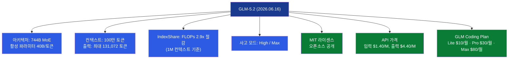
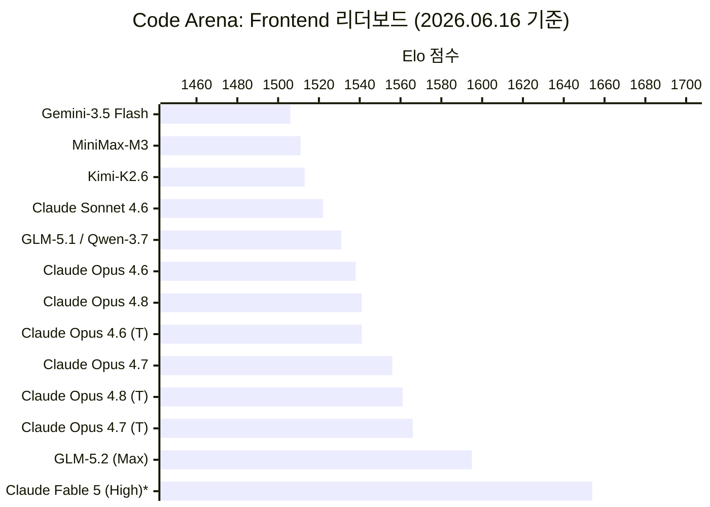
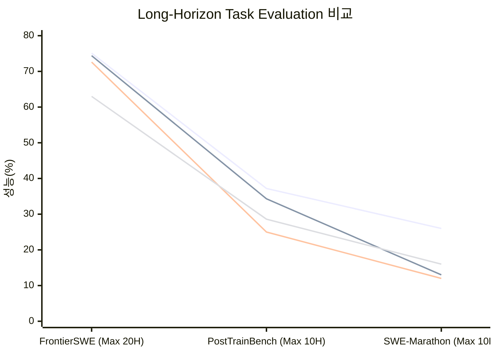
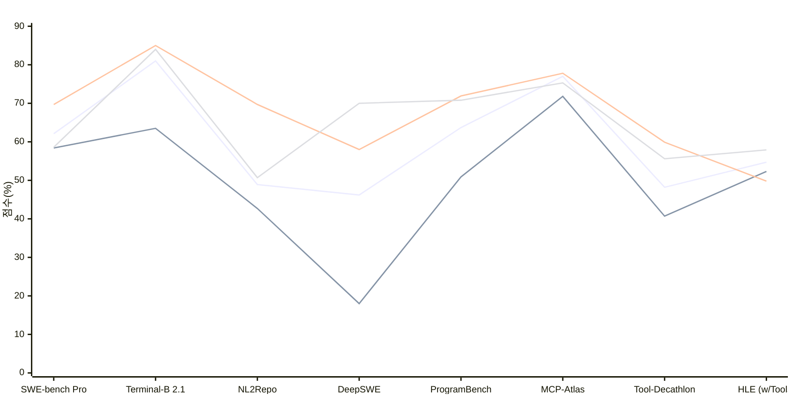
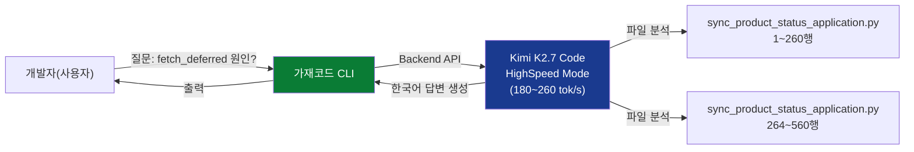
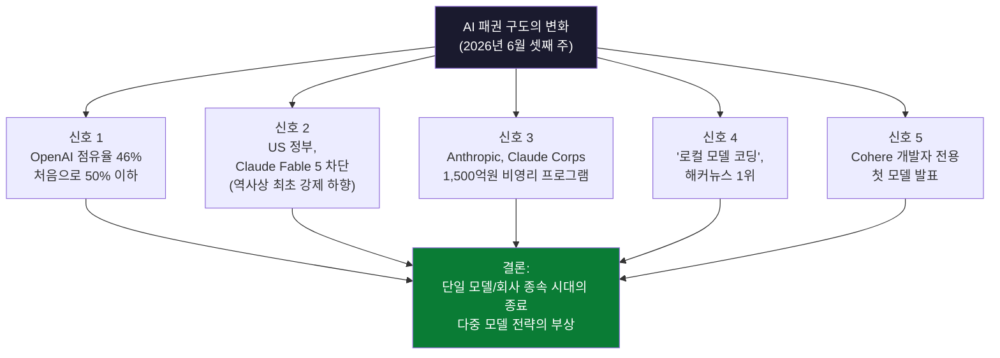

> 작성일: 2026년 6월 17일  
> 출처: Arena.ai 리더보드, VentureBeat, Sensor Tower State of AI 2026, Anthropic 공식 발표, 한국 개발자 커뮤니티(Threads)  

---

## 제1장. 왜 지금 이 주가 중요한가

2026년 6월 셋째 주는 AI 업계 역사에서 꽤 오래 기억될 한 주가 될 가능성이 높다. 지금까지 글로벌 AI 시장은 미국의 3대 빅 플레이어—Anthropic, OpenAI, Google—이 삼각 구도를 형성한 채 사실상 패권을 나눠 갖는 구조였다. 그런데 이번 주에는 그 구도를 흔드는 사건들이 연쇄적으로 터졌다. 하나하나 뜯어보면 개별 뉴스처럼 보이지만, 묶어서 보면 단 하나의 방향을 가리킨다. "한 회사의 모델에 종속되던 시대가 끝나기 시작했다."

그 출발점은 Z.ai(구 Zhipu AI)가 2026년 6월 13일에 공개한 **GLM-5.2**다. 동시에 같은 날, 미국 상무부는 Anthropic의 최상위 모델인 Claude Fable 5와 Mythos 5에 수출통제 명령을 내렸다. 그 하루 전인 6월 12일에는 Moonshot AI가 Kimi K2.7 Code를 출시했고, 6월 11일에는 Anthropic이 1억 5천만 달러 규모의 사회 프로그램 'Claude Corps'를 발표했다. 한편 시장조사기관 Sensor Tower가 발표한 보고서에 따르면, OpenAI의 ChatGPT 시장점유율이 처음으로 50% 아래로 내려갔다는 데이터도 같은 주에 공개됐다. 다섯 개의 사건이 같은 방향을 향해 수렴하고 있었다.

이 문서는 그 흐름의 전모를 정리한다. 제공된 네 장의 자료—Arena.ai Code Arena Frontend 리더보드, Long-Horizon Task Evaluation, LLM Performance Evaluation 8종 벤치마크, 그리고 실제 코딩 에이전트 화면—와 한국 개발자 커뮤니티(Threads)의 현장 반응, 그리고 검증된 최신 정보를 종합해 가능한 한 정확하고 상세하게 분석한다.

---

## 제2장. GLM-5.2란 무엇인가

### Z.ai와 GLM 시리즈의 계보

Z.ai는 중국의 AI 스타트업으로, 청화대학교 컴퓨터과학과 교수인 탕제(Jie Tang)가 2019년 설립한 Zhipu AI가 전신이다. 홍콩 증권거래소에 상장된 공개기업(HKEX: 02513, 주식 단명 "Knowledge Atlas")이기도 하다. GLM(General Language Model) 시리즈는 2022년 GLM-130B부터 시작해 GLM-4, GLM-4.5, GLM-5를 거쳐 2026년 6월 현재 GLM-5.2에 이른다.

GLM-5는 2026년 2월 11일에 출시된 744B 파라미터의 Mixture-of-Experts(MoE) 모델로, SWE-bench Verified에서 77.8%를 기록해 오픈소스 모델 1위를 달성한 바 있다. 주목할 만한 점은 이 모델이 미국의 수출 규제로 Nvidia GPU를 사용할 수 없는 환경에서 Huawei Ascend 910B 칩과 MindSpore 프레임워크만으로 훈련됐다는 것이다. 지정학적 도전 속에서 기술적 독립을 선언한 모델이기도 하다.

GLM-5.1은 2026년 4월에 출시되어 SWE-bench Pro에서 58.4점을 기록하며 당시 GPT-5.4(57.7점)와 Claude Opus 4.6(57.3점)을 소폭 앞섰다. Arena.ai의 Code Arena: Frontend/WebDev 리더보드에서도 9위에 오르며 오픈소스 진영에서의 빠른 성장을 보여줬다.

### GLM-5.2의 출시와 시점의 의미

GLM-5.2는 2026년 6월 13일 Z.ai가 GLM Coding Plan의 모든 구독 티어(Lite, Pro, Max, Team)에 즉시 공개한 모델로, 100만 토큰 컨텍스트 윈도우와 코딩 중심 설계를 특징으로 한다.

GLM-5.2는 MIT 라이센스 오픈소스로 공개될 예정이었으며, GLM Coding Plan($10~$80/월)에 추가 비용 없이 포함됐다. 탕제 창업자는 출시 포스트를 "특정 프론티어 모델에 대한 갑작스러운 제한은 매우 유감스럽다"는 말로 시작했다. 이 발언은 전날인 6월 12일 미국 정부가 Anthropic의 Fable 5와 Mythos 5에 수출통제 명령을 내린 것을 직접 겨냥한 것이었다. Z.ai는 Fable 5가 오프라인으로 내려간 다음 날, 그 공백을 채울 대안으로 GLM-5.2를 내세운 셈이다.

GLM-5.2는 GLM-5 패밀리의 세 번째 주요 릴리즈로, 동일한 744B 파라미터 Mixture-of-Experts 아키텍처를 기반으로 하며 실제로 사용 가능한 100만 토큰 컨텍스트 윈도우와 새로운 이중 사고 노력 시스템(High 및 Max)을 도입했다.

### 핵심 기술 스펙

GLM-5.2의 기술적 핵심은 네 가지로 정리된다.

첫째, **100만 토큰 컨텍스트**다. GLM-5.1의 200,000토큰에서 5배 늘어난 수치로, Claude Opus 4.8과 동일한 수준이다. 단순히 숫자가 커진 것만이 아니라, 실제 에이전트 작업에서 긴 궤적을 유지할 수 있는 "안정적으로 사용 가능한" 컨텍스트라는 점이 Z.ai가 강조하는 부분이다.

둘째, **IndexShare 아키텍처**다. GLM-5.2는 IndexShare를 제안하는데, 이는 희소 어텐션(DSA) 레이어 4개마다 하나의 경량 인덱서를 재사용해 100만 토큰 컨텍스트에서 토큰당 FLOPs를 2.9배 줄이는 기술이다. 또한 투기적 디코딩의 수락 길이를 최대 20% 향상시키는 개선된 MTP 레이어도 포함된다.

셋째, **이중 사고 노력 모드**다. 사용자는 High(빠르고 균형 잡힌) 또는 Max(최대 성능) 사이에서 선택할 수 있다. Code Arena 리더보드의 데이터는 Max 모드를 기준으로 한다.

넷째, **오픈소스 MIT 라이센스**다. API 가격은 입력 토큰당 $1.40/백만, 출력 토큰당 $4.40/백만이다. GPT-5.5는 입력 $5.00, 출력 $30.00으로 총 $35/백만 토큰이어서, GLM-5.2가 GPT-5.5 대비 약 6분의 1 수준의 비용으로 운영 가능하다.

---

## 제3장. Code Arena Frontend 리더보드: GLM-5.2의 2위

### 리더보드란 무엇인가

Arena.ai의 Code Arena는 사람이 직접 투표하는 방식의 리더보드다. 두 모델이 같은 프롬프트를 받아 결과를 생성하면 사용자가 어느 쪽이 더 나은지 맹목적으로(blind) 평가하고, 그 결과가 Elo 점수에 반영된다. 벤더가 자체 발표하는 벤치마크와 달리 독립적이고 조작하기 어려운 평가 방식이다. Arena.ai는 Code Arena, WebDev Arena, Agent Arena 등 여러 부문의 리더보드를 운영하고 있으며, Code Arena: Frontend/WebDev는 프론트엔드 코딩 작업에 특화된 리더보드다.

### 2026년 6월 16일 기준 순위

첫 번째 자료에서 확인할 수 있는 순위는 다음과 같다.

| 순위 | 모델 | Elo 점수 | 비고 |
|------|------|----------|------|
| 1 | Claude Fable 5 (High) | 1,654 | 현재 샘플링 불가(출시 직후 오프라인) |
| 2 | **GLM-5.2 (Max)** | **1,595** | 오픈소스 1위 |
| 3 | Claude Opus 4.7 (Thinking) | 1,566 | |
| 4 | Claude Opus 4.8 (Thinking) | 1,561 | |
| 5 | Claude Opus 4.7 | 1,556 | |
| 6 | Claude Opus 4.6 (Thinking) | 1,541 | |
| 7 | Claude Opus 4.8 | 1,541 | |
| 8 | Claude Opus 4.6 | 1,538 | |
| 9 | GLM-5.1 | 1,531 | |
| 10 | Qwen-3.7 Max | 1,531 | |
| 11 | Claude Sonnet 4.6 | 1,522 | |
| 12 | Kimi-K2.6 | 1,513 | |
| 13 | MiniMax-M3 | 1,511 | |
| 14 | Muse Spark | 1,507 | |
| 15 | Gemini-3.5 Flash | 1,506 | |

이 순위에서 몇 가지 사실이 눈에 띈다.

**첫째, Anthropic의 절대 독주 구간이 깨졌다.** 1위 Fable 5를 제외한 3위부터 8위까지는 모두 Claude Opus 계열이다. 하지만 2위에 GLM-5.2가 파고들었다. GLM-5.2 (Max)는 Code Arena: Frontend에서 2위를 기록했으며, Claude Opus 4.7 (Thinking) 대비 29점 앞섰다. 또한 React 서브리더보드에서 2위, HTML에서 4위를 기록했으며, 브랜드&마케팅, 레퍼런스 기반 디자인, 데이터&분석, 소비자 제품, 게이밍, 시뮬레이션 등 여러 프론트엔드 카테고리에서 최상위 모델로 평가됐다.

**둘째, 1위는 현재 사용 불가다.** Claude Fable 5는 미국 정부의 수출통제 명령으로 오프라인 상태다. Arena.ai 리더보드는 하단 주석에 "Claude Fable 5는 현재 샘플링되지 않고 있음"이라고 명시하고 있다. 따라서 실제 지금 당장 사용 가능한 모델 중에서는 GLM-5.2가 사실상 1위다.

**셋째, GLM의 세대 간 도약이 크다.** 9위에 GLM-5.1(1,531)이 있고, 2위에 GLM-5.2(1,595)가 있다. 단 한 세대 만에 64점의 Elo 상승이 이루어졌는데, 이는 3위 Claude Opus 4.7 (Thinking)(1,566)보다 높은 수준으로의 도약이다. GLM-5.1은 동일 리더보드에서 1,531점을 기록했는데, 한 세대 만에 이 정도의 점프는 상당히 큰 폭이다.

---

## 제4장. Long-Horizon Task Evaluation: 장기 과제에서의 GLM-5.2

두 번째 자료는 **Long-Horizon Task Evaluation**이라는 제목의 비교 자료다. 이는 단순한 코드 생성 능력이 아니라, 수 시간에 걸쳐 자율적으로 복잡한 소프트웨어 엔지니어링 과제를 수행하는 능력을 평가하는 벤치마크다. 현실의 에이전트 코딩 업무에 가장 근접한 평가 방식으로 여겨진다. 세 가지 벤치마크를 다룬다.

### 4.1 FrontierSWE (최대 20시간, Dominance 방식)

FrontierSWE는 소프트웨어 엔지니어링 태스크를 최대 20시간이라는 긴 시간 동안 자율적으로 처리하게 하는 벤치마크다. Dominance 방식은 모델이 주어진 과제를 다른 모델보다 더 잘 처리한 비율을 기준으로 한다.

- Claude Opus 4.8: **75.1%** (1위)
- **GLM-5.2: 74.4%** (2위)
- GPT-5.5: 72.6%
- Claude Opus 4.7: 63.0%
- Gemini 3.1 Pro: 39.6%

GLM-5.2는 Claude Opus 4.8과 불과 0.7%포인트 차이로 2위를 기록했다. GPT-5.5를 1.8%포인트 앞선 수치이며, Claude Opus 4.7과의 격차는 11.4%포인트에 달한다.

### 4.2 PostTrainBench (최대 10시간)

PostTrainBench는 포스트 트레이닝 단계의 능력, 즉 실제 훈련 이후 세계에서 발생하는 새로운 소프트웨어 엔지니어링 문제를 해결하는 능력을 평가한다. 최대 10시간 조건이다.

- Claude Opus 4.8: **37.2%** (1위)
- **GLM-5.2: 34.3%** (2위)
- Claude Opus 4.7: 28.6%
- GPT-5.5: 25.0%
- Gemini 3.1 Pro: 21.6%

여기서도 GLM-5.2는 2위를 차지했다. GPT-5.5(25.0%)보다 9.3%포인트 높고, Claude Opus 4.7(28.6%)도 넘어선다. 미국의 최신 모델들과 어깨를 나란히 하는 수준이다.

### 4.3 SWE-Marathon (최대 10시간)

SWE-Marathon은 긴 마라톤처럼 여러 단계에 걸친 소프트웨어 엔지니어링 과제를 이어서 처리하는 능력을 평가한다.

- Claude Opus 4.8: **26.0%** (1위)
- Claude Opus 4.7: 16.0% (2위)
- **GLM-5.2: 13.0%** (3위)
- GPT-5.5: 12.0%
- Gemini 3.1 Pro: 4.0%

이 벤치마크에서는 Claude Opus 4.8과의 격차가 13%포인트로 상당히 벌어진다. 단, GPT-5.5(12.0%)보다는 높고, Gemini 3.1 Pro(4.0%)와의 격차는 크다. 매우 긴 연속 과제에서는 여전히 Claude Opus 4.8이 앞서 있음을 알 수 있다.

*범례: 순서대로 Claude Opus 4.8 / GLM-5.2 / GPT-5.5 / Claude Opus 4.7*

세 벤치마크를 종합하면 GLM-5.2는 "장기 과제 능력"에서 GPT-5.5를 일관되게 앞서고, Claude Opus 4.8과는 근소한 차이를 보인다. 다만 매우 긴 연속 과제(SWE-Marathon)에서는 아직 차이가 존재한다.

---

## 제5장. LLM Performance Evaluation: 8가지 벤치마크 심층 분석

세 번째 자료는 GLM-5.2, GLM-5.1, Claude Opus 4.8, GPT-5.5, Gemini 3.1 Pro를 8가지 벤치마크로 비교한 'LLM Performance Evaluation'이다. 모든 모델은 최대 사고 노력(Maximum Thinking Effort) 조건에서 평가됐다. 모델이 특히 두각을 나타낸 분야는 에이전트 툴 사용과 장기적 소프트웨어 엔지니어링 과제였다.

### 5.1 SWE-bench Pro

실제 소프트웨어 엔지니어링 과제를 기반으로 한 고급 버전 벤치마크다.

- **GLM-5.2: 62.1%** (1위)
- GPT-5.5: 58.6%
- GLM-5.1: 58.4%
- Gemini 3.1 Pro: 54.2%
- Claude Opus 4.8: (자료상 별도 수치 미표기, 기타 순위로 추정)

GLM-5.2가 명확한 1위다. 이전 세대인 GLM-5.1(58.4%)보다 3.7%포인트 상승했으며, GPT-5.5(58.6%)를 3.5%포인트 앞섰다. SWE-bench Pro에서 GLM-5.2는 62.1점을 기록해 GPT-5.5(58.6)와 전임자 GLM-5.1(58.4)을 결정적으로 앞섰다.

### 5.2 Terminal-Bench 2.1

터미널 환경에서의 복잡한 시스템 조작 능력을 평가하는 벤치마크다.

- Claude Opus 4.8: **85.0%** (1위)
- GPT-5.5: 84.0%
- **GLM-5.2: 81.0%** (3위)
- Gemini 3.1 Pro: 74.0%
- GLM-5.1: 63.5%

이 벤치마크에서는 Claude Opus 4.8이 우세하다. 그러나 GLM-5.2(81.0%)가 GLM-5.1(63.5%)보다 17.5%포인트 상승한 것은 주목할 만하다. Cline IDE는 X에서 GLM-5.2가 오픈소스 모델 최초로 80점을 넘겼다고 언급했다.

### 5.3 NL2Repo

자연어 설명을 바탕으로 저장소(Repository) 수준의 코드를 작성하는 능력을 평가한다.

- Claude Opus 4.8: **69.7%** (1위)
- GPT-5.5: 50.7%
- **GLM-5.2: 48.9%** (3위)
- GLM-5.1: 42.7%
- Gemini 3.1 Pro: 33.4%

Claude Opus 4.8이 큰 격차로 1위다. GLM-5.2는 GPT-5.5와 비슷한 수준으로, 이전 세대(42.7%) 대비 6.2%포인트 상승했다.

### 5.4 DeepSWE

심층 소프트웨어 엔지니어링 과제 벤치마크다.

- GPT-5.5: **70.0%** (1위)
- Claude Opus 4.8: 58.0% (2위)
- **GLM-5.2: 46.2%** (3위)
- GLM-5.1: 18.0%
- Gemini 3.1 Pro: 10.0%

이 벤치마크에서는 GPT-5.5가 강세를 보인다. 흥미로운 점은 GLM-5.2(46.2%)와 전임 GLM-5.1(18.0%)의 격차가 28.2%포인트로, 이번 세대 개선에서 가장 극적인 상승폭을 보인 항목이라는 것이다.

### 5.5 ProgramBench

일반적인 프로그래밍 능력을 종합 평가하는 벤치마크다.

- Claude Opus 4.8: **71.9%** (1위)
- GPT-5.5: 70.8% (2위)
- **GLM-5.2: 63.7%** (3위)
- GLM-5.1: 50.9%
- Gemini 3.1 Pro: 39.5%

Claude Opus 4.8과 GPT-5.5가 비슷한 수준으로 앞서 있고, GLM-5.2가 3위다. GLM-5.1(50.9%) 대비 12.8%포인트 개선됐다.

### 5.6 MCP-Atlas

Model Context Protocol 기반의 툴 사용 능력을 평가하는 벤치마크다.

- Claude Opus 4.8: **77.8%** (1위)
- **GLM-5.2: 77.0%** (2위)
- GPT-5.5: 75.3%
- Gemini 3.1 Pro: 69.2%
- GLM-5.1: 71.8%

GLM-5.2가 Claude Opus 4.8과 불과 0.8%포인트 차이로 2위다. 에이전트 환경에서 핵심이 되는 도구 활용 능력에서 사실상 대등한 수준임을 보여준다.

### 5.7 Tool-Decathlon

다양한 도구를 사용하는 복합적 과제 수행 능력을 평가한다.

- Claude Opus 4.8: **59.9%** (1위)
- GPT-5.5: 55.6% (2위)
- Gemini 3.1 Pro: 48.8% (3위)
- **GLM-5.2: 48.2%** (4위)
- GLM-5.1: 40.7%

이 벤치마크에서는 GLM-5.2가 4위지만, Claude Opus 4.8이나 GPT-5.5에 비해 다소 낮다. Gemini 3.1 Pro와는 비슷한 수준이다.

### 5.8 Humanity's Last Exam (HLE)

인류 역사상 가장 어려운 시험 문제들로 구성된 벤치마크로, 수학, 과학, 인문학 등 초고난도 문제를 다룬다. 툴 사용(with Tools)과 비사용(without Tools) 결과가 별도로 표시된다.

| 모델 | with Tools | without Tools |
|------|------------|---------------|
| **GLM-5.2** | **54.7%** | 40.5% |
| GLM-5.1 | 52.3% | 31.0% |
| GPT-5.5 | 57.9% | 52.2% |
| Claude Opus 4.8 | 49.8% | 41.4% |
| Gemini 3.1 Pro | 51.4% | 45.0% |

GLM-5.2가 Tools 사용 조건에서 54.7%로 Claude Opus 4.8(49.8%)을 앞서는 것은 주목할 만하다. 다만 GPT-5.5(57.9%)에는 다소 뒤처진다.

### 8개 벤치마크 종합 정리

*범례: 위에서부터 GLM-5.2 / GLM-5.1 / Claude Opus 4.8 / GPT-5.5*

전체적으로 보면, GLM-5.2는 일부 벤치마크(SWE-bench Pro, FrontierSWE, MCP-Atlas)에서 프론티어 모델과 대등하거나 앞서고, 다른 벤치마크(Terminal-Bench, NL2Repo, DeepSWE, ProgramBench)에서는 Claude Opus 4.8이나 GPT-5.5에 뒤처진다. 한마디로 "분야에 따라 선두권, 분야에 따라 2~3위"이며, 오픈소스 모델이라는 점에서 이 성과는 상당히 의미 있다.

---

## 제6장. 가재코드(Gajae Code)와 Kimi K2.7 HighSpeed

네 번째 자료는 터미널 기반 코딩 에이전트 화면이다. 상단에는 AI가 코드를 분석하는 사고 과정이 영어로 표시되어 있고, 하단에는 "gajae"라는 이름으로 한국어 답변이 출력된다. 하단 상태 표시줄에는 "K2.7 Code High Speed"라고 적혀 있어, 이것이 Kimi K2.7 Code의 HighSpeed 모드를 백엔드로 사용하는 가재코드(Gajae Code) 에이전트임을 알 수 있다.

### 가재코드란

가재코드(Gajae Code)는 한국의 개발자가 만든 터미널 기반 코딩 에이전트 CLI다. 이름은 가재(한국어로 crawfish/crayfish)에서 따온 것이다. Claude Code, OpenAI Codex와 같은 코딩 에이전트 CLI와 유사한 도구로, 다양한 AI 모델을 백엔드로 지정해 사용할 수 있다. 이 자료에서는 Kimi K2.7 Code High Speed 모드를 백엔드로 연결해 사용 중이며, 한국어 출력도 자연스럽게 이루어지고 있다.

화면에서 볼 수 있는 내용을 보면, 사용자가 `fetch_deferred`가 왜 발생하는지 질문했고, 에이전트가 관련 파일을 읽어(`Read src/application/sync_product_status_application.py:1-260`, `Read src/application/sync_product_status_application.py:264-560`) 분석한 뒤 한국어로 설명하고 있다. "fetch_deferred는 워커가 상품 상태를 아직 확정할 수 없어서 SQS VisibilityTimeout을 연장하는 상황"이라는 맥락의 답변이 시작되고 있으며, 아래에는 `sync_app.fetch_product_external_data(link_url)` 호출 순서도 이어진다. 상태 표시줄의 `hud ultragoal:goal-planning`이나 `Y main ?2`는 Git 브랜치와 파일 변경 상태를 보여준다.

이 화면이 보여주는 것은 단순히 새 모델이 나왔다는 것이 아니라, **중국 모델을 실제 한국 개발자의 프로덕션 업무 도구로 통합해 사용하는 현실**이다.

### Kimi K2.7 Code와 HighSpeed 모드

Moonshot AI는 2026년 6월 12일 Kimi K2.7 Code를 공개했다. 오픈소스 멀티모달 코딩 모델의 최신판으로, Kimi Code, Kimi API, Hugging Face를 통해 Modified MIT 라이센스로 제공된다. 회사 측은 이 모델이 코딩 능력과 자율 작업 수행을 개선하면서 불필요한 추론 토큰 사용을 줄여 실제 소프트웨어 엔지니어링 워크플로우에 더 적합하다고 밝혔다.

Moonshot AI는 6월 15일 HighSpeed 모드를 발표했는데, 중간 길이 코딩 입력에서 초당 약 180 토큰, 짧은 컨텍스트 과제에서는 최대 초당 260 토큰의 처리 속도를 제공한다. 이는 표준 릴리즈 대비 약 6배 빠른 속도다.

Kimi K2.7 Code는 1조 파라미터 오픈소스 코딩 모델로, 256K 토큰 컨텍스트와 이전 K2.6 대비 약 30% 적은 사고 토큰, 강력한 MCP 도구 사용 능력을 특징으로 한다. API 가격은 입력 $0.74/M 토큰, 출력 $3.50/M 토큰이다.

한국 개발자 @roach_log는 가재코드에서 Kimi K2.7 High Speed를 사용한 경험에 대해 "입력하자마자 reasoning이 우수수 쏟아지는데, GPT-5.5로 돌리면 10분 넘게 걸리는 것이 2분 안에 끝난다"며 감탄했다. 속도 혁신이 실제 업무 경험에서 체감 차이를 만들어내고 있다는 증거다.

---

## 제7장. 한국 개발자 커뮤니티의 반응

이번 주 Threads에 올라온 한국 개발자들의 반응을 살펴보면, 단순한 흥미 이상의 실질적 전환이 일어나고 있음을 알 수 있다.

### "생각보다 훨씬 더 좋네요"

### "Codex 토큰 대체재로 쓰고 있다"

### "나중엔 Claude 60% - 중국 40%"

이 예측이 얼마나 정확할지는 알 수 없지만, "범용 최고 성능 모델"과 "비용 효율적인 실무 도구"를 구분해 쓰는 흐름이 실제로 나타나고 있다는 점은 현재도 관찰되는 현상이다.

### "Claude 유저는 그냥 그대로 쓰면 된다"

---

## 제8장. AI 패권의 균열: 이번 주 5가지 신호

### 신호 1: ChatGPT 시장점유율 처음으로 50% 이하로

Sensor Tower의 2026년 AI 현황 보고서에 따르면, ChatGPT의 AI 어시스턴트 시장점유율이 3월에 50% 아래로 내려갔으며 5월 기준 46%를 기록했다. Google Gemini는 28%의 점유율을 보였고, Anthropic의 Claude는 10%에 달했다.

아이러니하게도 ChatGPT는 2026년 5월에 월간 사용자 10억 명을 돌파하며 TikTok, YouTube, Instagram보다 빠르게 그 수를 달성한 앱이 됐다. 절대 사용자 수는 역대 최고지만, 시장 내 점유율이 떨어진다는 것은 경쟁자들이 더 빠르게 성장하고 있다는 의미다.

기업 고객 측면에서는 더욱 극적인 변화가 있었다. 기업용 AI 채택 지수를 추적하는 Ramp에 따르면, 2026년 4월 기준 미국 기업의 34.4%가 Anthropic Claude를 사용하는 반면 OpenAI는 32.3%로 처음으로 역전됐다. Anthropic은 지난 1년 동안 기업 채택률을 4배 늘린 반면, OpenAI는 0.3% 성장에 그쳤다.

### 신호 2: 미국 정부가 Anthropic 최상위 모델 차단

Anthropic은 2026년 6월 12일 미국 정부의 수출통제 지시로 Fable 5와 Mythos 5 두 모델에 대한 모든 고객의 접근을 차단했다. Fable 5와 Mythos 5는 단 3일 전인 6월 9일에 출시됐다. 이 지시는 외국인 국적자, 즉 미국 내외에 있는 모든 외국 국적자 및 Anthropic의 외국 국적 직원들까지 포함한 접근을 금지했다.

이 분쟁의 발단은 Amazon이 정부에 Fable 5의 방어 가드레일을 우회했다고 통보한 것이다. 연방 관계자들은 해당 취약점이 악의적 행위자가 사이버 공격을 시작하거나 위험한 정보에 접근하도록 허용할 수 있다고 우려했으며, Anthropic이 자발적 접근 중단을 거부하자 행정부가 엄격한 수출 통제를 부과했다.

이 사건은 역사적으로도 의미 있다. 이는 공개 배포된 프론티어 모델에 대한 정부 강제 하향 조치로서는 최초의 사례로 보인다. Anthropic은 기술적으로 미국 사용자와 외국 국적자를 실시간으로 구분할 수 없어 모든 고객의 접근을 일괄 차단했다.

### 신호 3: Anthropic의 Claude Corps 발표

Anthropic은 1억 5천만 달러를 투자해 Claude Corps라는 펠로우십 프로그램을 출범시킨다고 발표했다. 이 프로그램은 초기 경력자 1,000명을 훈련시켜 미국 전역의 비영리단체에 1년간 파견한다.

누구든 18세 이상이고 정규직 경력 2년 미만이면 연간 $85,000의 급여와 혜택을 받으며 비영리단체에서 Claude를 활용하는 방법을 가르치는 펠로우로 지원할 수 있다. 이 프로그램은 AI가 가져올 일자리 대체에 대한 우려를 직접 인정하면서도, 동시에 AI를 비영리 섹터에 확산시키려는 전략적 포석이기도 하다.

### 신호 4: 해커뉴스에서 "로컬 모델로 코딩 가능?" 1위

### 신호 5: Cohere, 개발자 전용 모델 첫 발표

Cohere의 개발자 전용 모델 발표는 상대적으로 작은 사건이지만, 이 맥락에서 의미가 있다. 엔터프라이즈 AI 시장의 또 다른 플레이어가 특정 용도에 특화된 모델로 진입하고 있다는 것은, 범용 대형 모델이 모든 것을 지배하는 구조에서 "용도별 최적 모델 선택" 구조로의 전환이 가속되고 있음을 시사한다.

---

## 제9장. 맥락과 한계: 냉정하게 볼 것들

GLM-5.2의 성과가 인상적인 것은 사실이지만, 몇 가지 중요한 맥락과 한계도 함께 살펴야 한다.

**첫째, 중국 오픈소스 모델의 지정학적 위험**이 있다. Zhipu는 2025년 1월 15일부터 미국 상무부 Entity List에 등재되어 있다. MIT 오픈웨이트 사용 자체는 현재 미국 수출관리규정(EAR)상 규제 수출에 해당하지 않는 것으로 해석되지만, 미국 연방 고객과 대부분의 방산업체는 중국산 모델을 라이선스에 무관하게 사실상 차단된 것으로 취급한다.

**둘째, 벤치마크와 실제 경험 사이의 간극**이 존재한다. @svy.04가 지적했듯이 벤치마크 수치와 일상 사용 경험이 항상 일치하지는 않는다. 특히 장기 멀티스텝 에이전트 태스크에서는 단순 점수 외에도 안정성, 컨텍스트 유지력, 오류 복구 능력 등 수치화하기 어려운 요소들이 중요하다.

**셋째, 가격 구조의 복잡성**이 있다. GLM Coding Plan의 가격은 자주 프로모션 가격으로 제공되며, 지역과 통화에 따라 달라지므로 Z.ai에서 직접 확인하는 것이 권장된다. 특히 한국 사용자 입장에서는 원화 결제 지원 여부, 환율 변동, 서비스 안정성 등도 고려해야 한다.

**넷째, SWE-Marathon에서의 격차**를 간과해서는 안 된다. 매우 긴 연속 과제에서 GLM-5.2(13.0%)는 Claude Opus 4.8(26.0%)과 두 배 가까운 차이를 보인다. 대규모 리팩토링이나 복수의 복잡한 버그를 연속으로 처리하는 작업에서는 아직 Claude 계열이 우위에 있다.

**다섯째, 새로운 DeepSeek 모델에 대한 기대**다. @roach_log가 언급했듯이 많은 개발자들이 "새롭게 나올 DeepSeek 모델"을 기대하고 있다. DeepSeek는 2025년에 극적인 성능을 선보인 이후 AI 경쟁 구도의 또 다른 변수가 될 가능성이 있다.

---

## 제10장. 시사점: 개발자는 무엇을 해야 하는가

지금까지의 분석을 종합하면 몇 가지 실용적 시사점이 도출된다.

**첫 번째 시사점은 "단일 모델 의존도를 줄이는 것"이다.** @claudeduck.kr의 제안처럼, 같은 프롬프트를 두 개의 모델에 동시에 던져보는 것만으로도 각 모델의 강점과 약점이 어디에 있는지 파악할 수 있다. Claude와 Gemini, 또는 Claude와 GLM-5.2를 같은 프로젝트에서 비교해 보면 내 작업 패턴에 어느 쪽이 더 맞는지 알 수 있다.

**두 번째 시사점은 "비용 구조를 이중화하는 것"이다.** 복잡한 아키텍처 설계와 멀티 파일 리팩토링에는 Claude Opus 계열이나 GPT-5.5 같은 최고 성능 모델을 쓰되, 반복적인 코드 생성, 포맷팅, 간단한 버그 수정에는 비용이 저렴한 GLM이나 Kimi 같은 중국 모델을 활용하는 하이브리드 전략이 합리적이다. @uljirang가 Codex 쿼터 대신 GLM을 쓴다는 것이 바로 이 패턴이다.

**세 번째 시사점은 "토큰 속도가 에이전트 시대에서 새로운 핵심 변수"라는 것이다.** @roach_log의 경험처럼 Kimi K2.7 HighSpeed가 GPT-5.5 대비 처리 속도에서 5배 이상의 체감 차이를 만들어낸다면, 이는 단순한 벤치마크 점수와는 다른 차원의 경쟁력이다. 에이전트 코딩에서는 추론의 질 못지않게 반응 속도와 처리량이 실제 생산성에 직결된다.

**네 번째 시사점은 "오픈소스 오픈웨이트 모델 생태계를 주시하는 것"이다.** GLM-5.2가 MIT 라이센스로 공개되면서, 개인 서버나 사내 인프라에 자체 구축(self-host)하는 것도 가능해졌다. 이는 데이터 보안이 중요한 기업이나, API 비용 최적화가 필요한 팀에게 새로운 선택지를 제공한다.

---

## 결론

2026년 6월 셋째 주는 AI 업계의 세력 지형이 처음으로 가시적으로 흔들린 시점으로 기록될 가능성이 높다. GLM-5.2는 Code Arena: Frontend 리더보드에서 사실상 현재 사용 가능한 최고 성능 모델(Fable 5 오프라인 상황 감안)로 자리매김했다. Long-Horizon Task Evaluation에서는 FrontierSWE와 PostTrainBench 양쪽 모두에서 GPT-5.5를 앞섰고, MCP-Atlas에서는 Claude Opus 4.8과 0.8%포인트 차이에 불과하다. 그리고 이 모든 것을 GPT-5.5 대비 6분의 1 비용으로 제공한다.

이것이 Claude를 대체할 수 있다는 의미는 아니다. Terminal-Bench, NL2Repo, SWE-Marathon 같은 영역에서는 Claude Opus 4.8이 여전히 앞서 있으며, 실제 장기 에이전트 작업의 안정성과 복잡한 프로젝트 관리 측면에서의 검증도 더 필요하다. 그러나 "단 하나의 프론티어 모델에 의존해야 한다"는 가정 자체가 2026년 중반에 들어서면서 유효하지 않아지고 있는 것도 사실이다.

---

## 부록: 주요 모델 스펙 및 가격 비교표

| 항목 | GLM-5.2 | Kimi K2.7 Code | Claude Opus 4.8 | GPT-5.5 |
|------|---------|----------------|-----------------|---------|
| 제조사 | Z.ai (Zhipu AI) | Moonshot AI | Anthropic | OpenAI |
| 파라미터 | 744B MoE | 1T MoE | 미공개 | 미공개 |
| 활성 파라미터 | 40B/토큰 | 32B/토큰 | 미공개 | 미공개 |
| 컨텍스트 | 1M 토큰 | 256K 토큰 | 1M 토큰 | 400K 토큰 |
| 라이센스 | MIT (오픈소스) | Modified MIT | 독점 | 독점 |
| 입력 가격 | $1.40/M | $0.74/M | 미공개 | $5.00/M |
| 출력 가격 | $4.40/M | $3.50/M | 미공개 | $30.00/M |
| HighSpeed | - | 180~260 tok/s (6x) | - | - |
| 출시일 | 2026.06.13 | 2026.06.12 | 2026.06.06 | 2026.04.27 |

## 참고 문헌 및 출처

- Arena.ai Code Arena: Frontend Leaderboard (2026.06.16) — arena.ai/leaderboard/code
- VentureBeat: "Z.ai's open-weights GLM-5.2 beats GPT-5.5 on multiple long-horizon coding benchmarks for 1/6th the cost" (2026.06.17)
- Sensor Tower: State of AI 2026 Report (2026.06)
- Anthropic 공식 발표: Statement on the US government directive to suspend access to Fable 5 and Mythos 5 (2026.06.12)
- Anthropic 공식 발표: Introducing Claude Corps (2026.06.11)
- Moonshot AI 공식 X: Kimi K2.7 Code HighSpeed 발표 (2026.06.15)
- codersera.com: "GLM 5.2 Release — 1M Context, Coding-First" (2026.06.13)
- eciks.org: "Z.ai's new 753B-parameter GLM-5.2 outperforms OpenAI's GPT-5.5" (2026.06.17)
- Ramp AI Index (2026.05): 미국 기업 AI 채택 현황
- Threads 포스트: [@roach_log](https://www.threads.com/@roach_log/post/DZqqHgmAdZ0), [@uljirang]( https://www.threads.com/@uljirang/post/DZqZmPBEkey), [@vibe_make_r]( https://www.threads.com/@vibe_make_r/post/DZq1_jvGfzg), [@svy.04](https://www.threads.com/@svy.04/post/DZqkfPrAUvQ), [@claudeduck.kr]( https://www.threads.com/@claudeduck.kr/post/DZrAuQ1k447) (2026.06.17)
