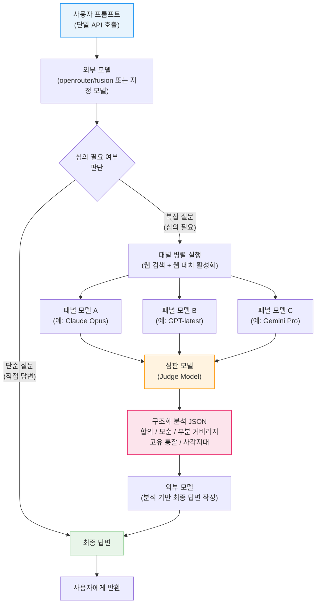
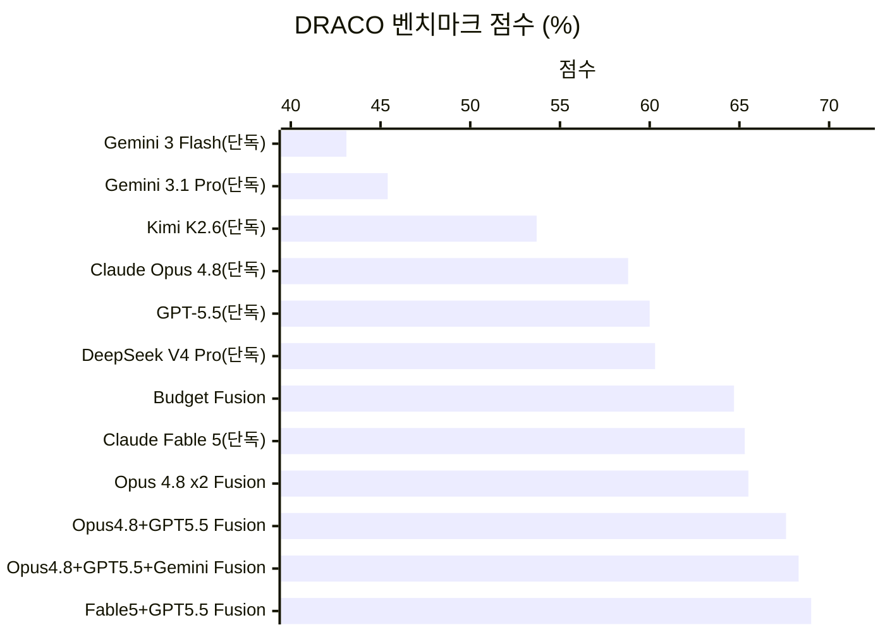
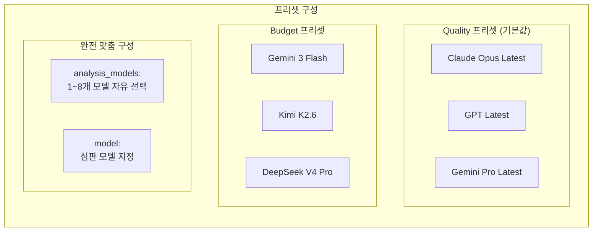
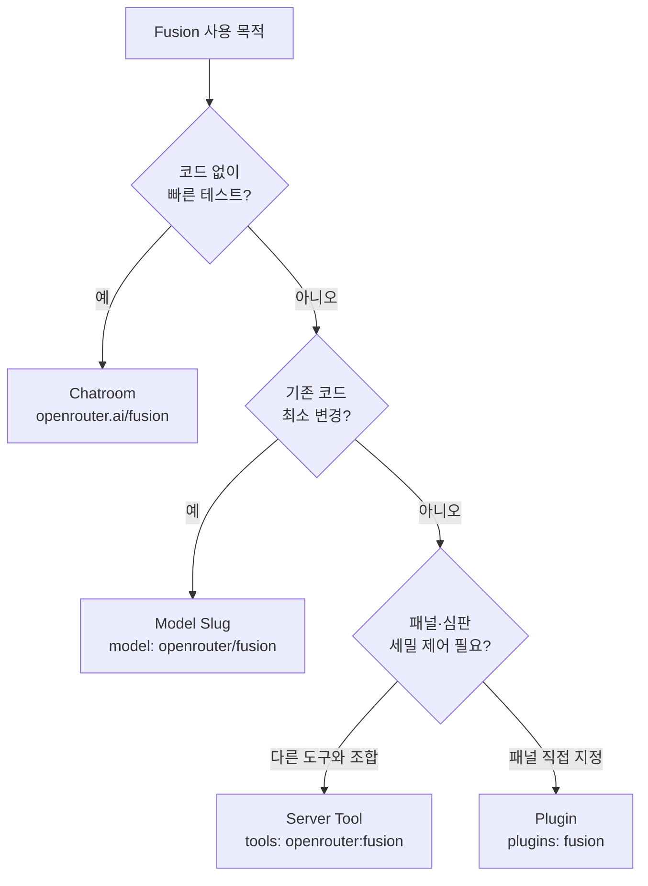
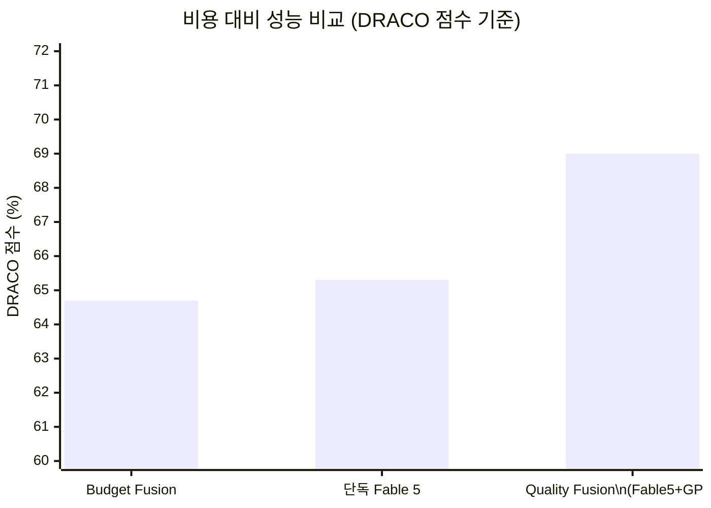
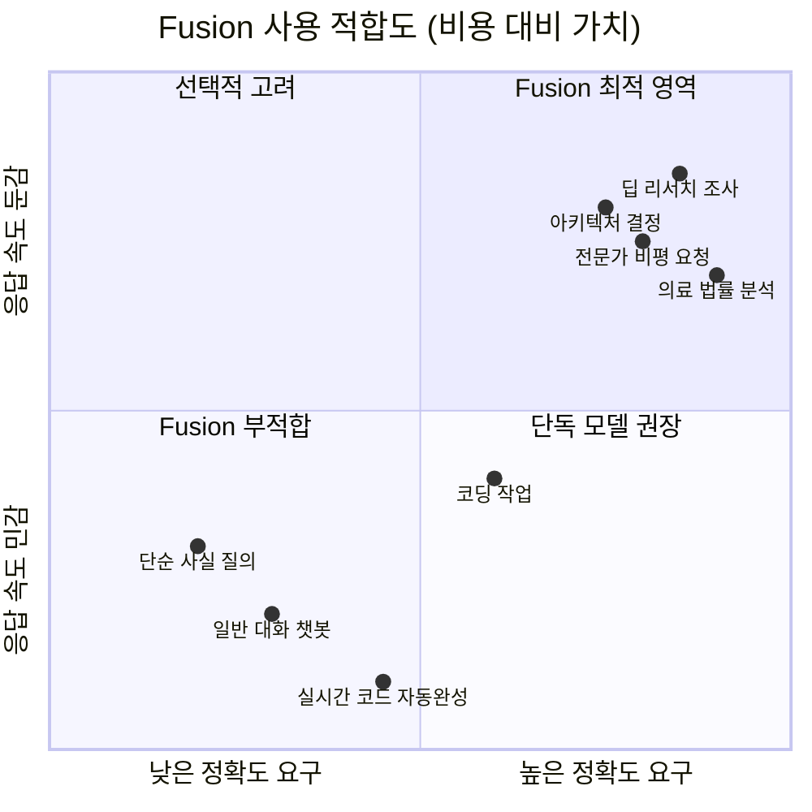

> 작성일: 2026년 6월 17일  
> 출처: [OpenRouter 공식 블로그](https://openrouter.ai/openrouter/fusion), [API 문서]( https://openrouter.ai/docs/api/api-reference/responses/create-responses), DRACO 벤치마크, [GeekNews]( https://news.hada.io/topic?id=30537) 커뮤니티 토론

---

## 목차

1. [배경: 단일 모델의 한계와 집단지성의 가능성](#1-배경-단일-모델의-한계와-집단지성의-가능성)
2. [OpenRouter Fusion이란 무엇인가](#2-openrouter-fusion이란-무엇인가)
3. [파이프라인 구조: 심의는 어떻게 이루어지는가](#3-파이프라인-구조-심의는-어떻게-이루어지는가)
4. [DRACO 벤치마크: 성능을 숫자로 증명하다](#4-draco-벤치마크-성능을-숫자로-증명하다)
5. [프리셋 구성: Quality와 Budget](#5-프리셋-구성-quality와-budget)
6. [사용 방법 4가지](#6-사용-방법-4가지)
7. [API 상세: 요청과 응답 구조](#7-api-상세-요청과-응답-구조)
8. [가격 구조와 경제성 분석](#8-가격-구조와-경제성-분석)
9. [한계와 적합한 사용 시나리오](#9-한계와-적합한-사용-시나리오)
10. [커뮤니티 반응과 실제 경험](#10-커뮤니티-반응과-실제-경험)
11. [기술적 세부사항: 오염 방지와 재귀 보호](#11-기술적-세부사항-오염-방지와-재귀-보호)
12. [종합 평가와 전망](#12-종합-평가와-전망)
13. [참고 자료](#13-참고-자료)
14. [용어 사전](#14-용어-사전)

---

## 1. 배경: 단일 모델의 한계와 집단지성의 가능성

오늘날 대형 언어 모델(LLM)의 성능은 불과 2년 전과 비교해도 눈부시게 향상되었다. Claude Fable 5, GPT-5.5, Gemini 3.1 Pro 같은 프론티어 모델들은 단독으로도 복잡한 연구 질문에 대한 정교한 답변을 생성할 수 있다. 그러나 AI 연구자들은 오래전부터 한 가지 근본적인 통찰을 공유해왔다. 방 안에서 가장 똑똑한 사람 한 명에게 묻는 것보다, 다섯 명의 전문가에게 각자의 의견을 구한 다음 그 결과를 종합하는 편이 더 나은 답을 얻을 때가 많다는 것이다.

인간 팀 성과에 관한 오랜 연구가 증명하듯, 다양한 관점의 결합은 단일 관점의 탁월함을 능가하는 경우가 많다. OpenRouter는 이 원칙을 AI 모델에 적용하는 실험을 꾸준히 진행해왔고, 그 결과물이 바로 2026년 3월 31일 공개 프리뷰로 처음 선보인 **Fusion**이다. 이후 2026년 6월 13일 API에 전면 통합된 Fusion은, 단일 API 호출 한 번으로 여러 AI 모델의 집단 심의 결과를 얻을 수 있는 시스템이다.

OpenRouter는 이미 400개 이상의 AI 모델과 다수의 제공자를 단일 API로 접근할 수 있는 플랫폼으로 성장해 있었다. Fusion은 그 인프라 위에서, 단순히 모델을 라우팅(routing)하는 것을 넘어 여러 모델의 출력을 **합성(synthesis)** 하는 새로운 계층을 추가한다. 라우팅과 합성은 전혀 다른 개념이다. 라우팅이 "어느 모델에게 이 질문을 보낼 것인가"를 결정하는 일이라면, Fusion의 합성은 "여러 모델이 동시에 답한 뒤, 그 답들을 어떻게 지적으로 종합할 것인가"를 다루는 일이다. 이 차이가 Fusion을 단순한 라우터가 아닌 새로운 범주의 도구로 만든다.

---

## 2. OpenRouter Fusion이란 무엇인가

Fusion을 한 문장으로 정의하면 이렇다. **하나의 프롬프트를 소규모 멀티 모델 심의(multi-model deliberation)로 전환해, 단일 모델보다 더 나은 최종 답변을 생성하는 서버사이드 파이프라인이다.** 사용자 입장에서 Fusion은 `openrouter/fusion`이라는 모델 슬러그를 통해 마치 단일 모델을 호출하듯 사용할 수 있다. 내부에서 무슨 일이 벌어지는지와 무관하게, API 호출 방식은 기존 모델을 사용할 때와 동일하다.

Fusion의 핵심 아이디어를 이해하려면 세 가지 역할 구조를 먼저 파악해야 한다.

첫째는 **패널 모델(panel models)** 이다. 사용자의 프롬프트를 병렬로 분석하는 전문가 모델들의 집합으로, 기본 구성은 3개 모델이지만 최대 8개까지 설정할 수 있다. 각 패널 모델은 웹 검색(`openrouter:web_search`)과 웹 페치(`openrouter:web_fetch`)가 활성화된 상태로 독립적으로 답변을 생성한다.

둘째는 **심판 모델(judge model)** 이다. 패널 모델들이 생성한 모든 답변을 받아 구조화된 비교 분석을 수행하는 역할을 한다. 심판 모델은 답변들을 단순히 병합하는 것이 아니라 무엇이 일치하는지(합의), 무엇이 충돌하는지(모순), 어떤 모델만이 다룬 고유한 통찰이 있는지(고유 통찰), 어떤 영역이 아무도 다루지 못했는지(사각지대) 등을 분석해 구조화된 JSON 형태로 반환한다.

셋째는 **외부 모델(outer model, calling model)** 이다. 심판 모델의 구조화된 분석 결과를 받아 최종 답변을 사용자에게 작성해 전달하는 모델이다. Fusion 모델 슬러그를 사용할 경우, 이 외부 모델이 곧 요청을 받는 첫 번째 모델이 된다.

이 세 역할이 결합해 하나의 완결된 파이프라인을 이루며, 전체 과정은 서버사이드에서 자동으로 실행된다. 사용자는 파이프라인의 복잡성을 직접 다룰 필요 없이, 단일 API 호출 하나로 그 결과를 얻는다.

---

## 3. 파이프라인 구조: 심의는 어떻게 이루어지는가

Fusion 파이프라인은 총 다섯 단계로 구성된다.



**1단계: 요청 수신과 심의 여부 판단.** 사용자가 `model: "openrouter/fusion"`으로 요청을 보내면, 라우터는 이를 실제 모델로 해석하고 `openrouter:fusion` 도구를 자동으로 주입한다. 외부 모델은 프롬프트를 읽고 이 질문이 다중 관점의 심의를 필요로 하는지 스스로 판단한다. 단순한 질문이라면 심의 없이 직접 답변한다. `tool_choice: "required"`를 설정하면 모든 요청에 대해 심의를 강제할 수 있다.

**2단계: 패널 병렬 실행.** 심의가 필요하다고 판단되면, 사용자의 프롬프트가 패널 모델 전체에 동시에 전송된다. 각 패널 모델은 `openrouter:web_search`와 `openrouter:web_fetch`가 활성화된 상태로 독립적으로 답변을 생성한다. 이 단계에서 각 모델은 서로의 출력을 볼 수 없다. 서로 다른 추론 경로, 서로 다른 도구 호출, 서로 다른 소스 선택이 이루어지는 것이 이 병렬 실행의 핵심 가치다.

**3단계: 심판 모델의 구조화 분석.** 모든 패널 응답이 도착하면 심판 모델이 작동한다. 심판 모델도 웹 검색과 웹 페치 도구를 사용할 수 있으며, 패널 모델들의 응답을 단순히 합치는 것이 아니라 다음 다섯 가지 차원에서 비교 분석한다.

- **합의(Consensus)**: 대부분 또는 모든 모델이 동의한 내용으로, 신뢰도가 높은 정보로 처리된다.
- **모순(Contradictions)**: 모델들 사이에서 서로 충돌하는 주장이 발견된 영역이다.
- **부분 커버리지(Partial Coverage)**: 일부 모델만이 다룬 주제나 관점이다.
- **고유 통찰(Unique Insights)**: 특정 모델 하나만이 제공한 독자적인 통찰이다.
- **사각지대(Blind Spots)**: 어떤 모델도 다루지 못한 영역이다.

이 분석 결과는 구조화된 JSON으로 반환된다.

**4단계: 최종 답변 작성.** 외부 모델이 심판의 구조화 분석을 받아, 이를 근거로 사용자에게 전달할 최종 답변을 작성한다. 단순히 모든 패널 응답의 합집합을 나열하는 것이 아니라, 분석에서 드러난 고신뢰 합의, 중요한 불일치, 고유한 통찰을 통합한 질적으로 우수한 응답을 생성한다.

**5단계: 응답 반환.** 최종 답변이 사용자에게 반환된다. 응답의 `model` 필드에는 실제 외부 모델의 식별자가 표시된다(예: `anthropic/claude-opus-4.5`). 응답이 Fusion 라우터를 통해 처리되었는지 확인하려면 생성 메타데이터의 `router` 필드를 확인하면 되며, 이 경우 `openrouter/fusion`이 표시된다.

---

## 4. DRACO 벤치마크: 성능을 숫자로 증명하다

OpenRouter가 Fusion의 성능을 검증하기 위해 선택한 벤치마크는 **DRACO**다. DRACO는 Perplexity AI가 개발한 딥 리서치 평가 도구로, 단순한 지식 암기나 추론 퍼즐이 아닌, 실제 연구자가 수행하는 복잡한 조사·종합·인용 과제를 측정하도록 설계되어 있다.

DRACO는 10개 도메인에 걸쳐 100개의 딥 리서치 태스크를 포함한다. 학술 연구, 금융, 법률, 의학, 기술, UX 디자인, 일반 지식, 니들-인-헤이스택(Needle-in-a-Haystack) 검색, 개인화 지원, 제품 비교가 그 열 가지 영역이다. 각 태스크는 약 39개의 가중치 채점 기준으로 평가되며, 팩트 정확도(약 20개 기준), 범위와 깊이(약 9개 기준), 발표 품질(약 6개 기준), 인용 품질(약 5개 기준)의 네 범주로 구성된다. 특히 주목할 만한 점은 일부 기준이 음수 가중치를 갖는다는 것이다. 예를 들어 위험한 의학 조언을 포함하면 큰 감점이 부과되며, 이는 장황하게 많은 내용을 쓴다고 점수가 올라가지 않도록 설계된 것이다. 각 응답은 심판 모델이 3번 독립적으로 채점하며, 평균 정규화 점수(0-100)가 최종 결과로 산출된다.

OpenRouter는 Fusion과 단독 모델들을 동일한 조건, 즉 `openrouter:web_search`, `openrouter:web_fetch`, `openrouter:bash` 세 가지 서버 도구가 활성화된 상태로 측정했다. 벤치마크 채점에는 Gemini 3.1 Pro Preview를 심판 모델로 사용했다.

측정 결과는 다음 표와 같다.



| 유형 | 구성 | 점수 |
|------|------|------|
| **Fusion** | Fable 5 + GPT-5.5 (심판: Opus 4.8) | **69.0%** |
| **Fusion** | Opus 4.8 + GPT-5.5 + Gemini 3.1 Pro (심판: Opus 4.8) | **68.3%** |
| **Fusion** | Opus 4.8 + GPT-5.5 (심판: Opus 4.8) | **67.6%** |
| **Fusion** | Opus 4.8 + Opus 4.8 (심판: Opus 4.8) | **65.5%** |
| 단독 | Claude Fable 5 | 65.3% |
| **Fusion** | Gemini 3 Flash + Kimi K2.6 + DeepSeek V4 Pro (심판: Opus 4.8) — Budget | **64.7%** |
| 단독 | DeepSeek V4 Pro | 60.3% |
| 단독 | GPT-5.5 | 60.0% |
| 단독 | Claude Opus 4.8 | 58.8% |
| 단독 | Kimi K2.6 | 53.7% |
| 단독 | Gemini 3.1 Pro | 45.4% |
| 단독 | Gemini 3 Flash | 43.1% |

이 결과에서 가장 주목해야 할 발견은 세 가지다.

첫째, **프론티어를 초월하는 Fusion의 성능**이다. Fable 5와 GPT-5.5를 융합한 패널은 69.0%를 기록하며, 현존하는 단독 모델 중 최고 점수인 Fable 5(65.3%)를 3.7점포인트 앞섰다. 이는 어떤 단일 모델보다도 높은 점수다.

둘째, **저비용 패널의 경이로운 가성비**다. Gemini 3 Flash, Kimi K2.6, DeepSeek V4 Pro로 구성된 Budget 패널은 64.7%를 기록했다. 이는 Fable 5(65.3%)와 1% 미만의 차이이며, GPT-5.5(60.0%)와 Opus 4.8(58.8%)을 상회하는 결과다. 특히 이 Budget 패널의 비용은 단독 Fable 5 대비 약 50% 수준이다.

셋째, **자기 자신과의 융합도 유효하다는 발견**이다. Opus 4.8 두 개를 패널로 구성하고 Opus 4.8이 심판을 맡은 경우, 65.5%를 기록하며 단독 Opus 4.8(58.8%)보다 6.7점포인트나 높은 점수를 얻었다. 이는 Fusion의 성능 향상이 단순히 서로 다른 모델 아키텍처의 다양성에서만 오는 것이 아니라, 동일 프롬프트를 두 번 실행해 서로 다른 추론 경로와 도구 호출을 거친 결과를 종합하는 **합성 단계 그 자체**에서도 상당한 이득이 발생함을 보여준다.

한편 벤치마크의 한계도 인정해야 한다. DRACO는 텍스트 전용, 영어 전용 평가이며 정적인 태스크 셋이 미래의 딥 리서치 응용에 완전히 일반화되지 않을 수 있다. 절대 점수는 심판 모델 선택에 따라 10-25점포인트 편차가 있을 수 있다. 그리고 DRACO는 장기 과제(long-horizon tasks)를 포함하지 않는다는 점에서, Fable 5가 강점을 보이는 장시간 자율 작업 영역과의 직접 비교는 이 벤치마크에서는 이루어지지 않는다.

---

## 5. 프리셋 구성: Quality와 Budget

Fusion은 사전 정의된 두 가지 프리셋과 완전 맞춤 구성이라는 세 가지 경로를 제공한다.

**Quality 프리셋**은 기본값으로 적용된다. 패널은 세 개의 최전선 모델로 구성된다. 구체적으로는 `~anthropic/claude-opus-latest`, `~openai/gpt-latest`, `~google/gemini-pro-latest`이며, 이들 슬러그는 각 제공자가 업데이트할 때마다 자동으로 최신 모델을 가리킨다. 심판 모델은 기본적으로 외부 모델(요청을 받는 모델)과 동일한 모델이 담당한다.

**Budget 프리셋**은 비용 효율을 극대화하는 구성이다. Gemini 3 Flash, Kimi K2.6, DeepSeek V4 Pro라는 상대적으로 저렴한 모델 세 개로 패널을 구성한다. DRACO 벤치마크 결과에 따르면 이 조합은 단독 Fable 5와 1% 이내의 성능 격차를 보이면서도 비용이 약 절반 수준이다.

**완전 맞춤 구성**은 `fusion` 플러그인의 `analysis_models`와 `model` 필드를 통해 패널과 심판을 원하는 모델로 자유롭게 지정할 수 있다. 1개에서 최대 8개의 모델로 패널을 구성할 수 있으며, 심판 모델도 독립적으로 지정 가능하다.



구성 가능한 파라미터는 다음과 같다.

- **analysis_models**: 패널을 구성할 모델 목록 (1-8개)
- **model**: 심판 모델 지정 (기본값: 외부 모델과 동일)
- **max_tool_calls**: 패널 모델 및 심판 모델이 웹 검색·웹 페치 루프에서 수행할 수 있는 최대 도구 호출 횟수 (기본값: 8, 범위: 1-16)
- **max_completion_tokens**: 내부 패널 및 심판 호출 건당 최대 출력 토큰 수 (추론 포함). 추론을 많이 수행하는 모델이 텍스트 생성 전에 토큰 예산을 소진하지 않도록 제어한다.
- **reasoning**: 패널과 심판 호출에 전달되는 추론 설정 (`effort`, `max_tokens` 포함)
- **temperature**: 패널과 심판 호출에 전달되는 샘플링 온도 (0-2)

---

## 6. 사용 방법 4가지

OpenRouter 공식 FAQ에 따르면 Fusion을 사용하는 방법은 네 가지이며, 모두 동일한 내부 파이프라인을 사용한다.

**방법 1: Chatroom (코드 불필요).** `openrouter.ai/fusion`에서 웹 인터페이스를 통해 프리셋을 선택하거나 직접 패널을 구성할 수 있다. 개발자가 아니거나 빠르게 테스트해보고 싶은 경우에 적합하다.

**방법 2: Model Slug (문자열 교체).** 기존 코드에서 모델 문자열만 `"openrouter/fusion"`으로 교체하면 된다. Fusion 플러그인이 자동으로 기본 패널 구성과 함께 주입된다. 기존 OpenAI 호환 API를 사용하는 코드라면 모델 슬러그 한 줄 교체만으로 Fusion을 활용할 수 있다.

```json
{
  "model": "openrouter/fusion",
  "messages": [
    { "role": "user", "content": "탄소세의 찬반 논거 중 가장 강력한 것들은 무엇인가?" }
  ]
}
```

**방법 3: Server Tool (최고 수준의 제어).** `tools` 배열에 `{"type": "openrouter:fusion"}`을 추가하는 방식이다. 외부 모델을 직접 선택할 수 있고, Fusion을 다른 도구들과 함께 조합할 수 있다. 외부 모델이 언제 Fusion을 호출할지 스스로 결정하며, 이것이 가장 유연한 통합 방식이다.

**방법 4: Plugin (패널 직접 지정).** 기존 completions 또는 responses 호출에 `plugins` 필드를 추가하는 방식이다. 패널 구성과 심판 모델을 상세하게 지정할 수 있다. 아래는 Budget 패널을 직접 구성하는 예시다.

```json
{
  "model": "openrouter/fusion",
  "messages": [{"role": "user", "content": "..."}],
  "plugins": [{
    "id": "fusion",
    "model": "google/gemini-3-flash-preview",
    "analysis_models": [
      "google/gemini-3-flash-preview",
      "moonshotai/kimi-k2.6",
      "deepseek/deepseek-v4-pro"
    ]
  }]
}
```

네 가지 방법 중 어떤 것을 선택할지는 제어 수준과 구현 복잡도의 균형에 달려 있다. 빠른 실험이나 코드 없는 접근에는 Chatroom이, 기존 코드에 최소한의 변경을 원한다면 Model Slug가, 세밀한 제어가 필요하다면 Server Tool이나 Plugin이 적합하다.



---

## 7. API 상세: 요청과 응답 구조

Fusion은 OpenRouter의 OpenAI 호환 Chat Completions 엔드포인트(`/api/v1/chat/completions`)와 OpenResponses API 엔드포인트(`/api/v1/responses`) 모두를 지원한다. 사용자 입장에서 인터페이스 변화는 거의 없다.

**요청 파라미터 중 주목할 것들.** `session_id`를 설정하면 OpenRouter가 해당 세션의 요청을 동일한 제공자에게 라우팅해 프롬프트 캐시 적중률을 높이는 데 도움이 된다. 최대 256자까지 허용된다. `stream: true`를 설정하면 서버-전송 이벤트(Server-Sent Events) 방식으로 응답을 스트리밍 수신할 수 있다. `tool_choice: "required"`를 설정하면 외부 모델의 판단과 무관하게 모든 요청에서 Fusion 심의가 강제로 실행된다.

**응답 구조의 특이점.** 응답의 `model` 필드는 `openrouter/fusion`이 아닌, 실제로 요청을 처리한 구체적인 외부 모델의 식별자를 반환한다. 예를 들어 `anthropic/claude-opus-4.5`처럼 표시된다. 해당 요청이 Fusion 라우터를 통해 처리되었는지 확인하려면, 생성 메타데이터 조회 엔드포인트를 통해 `router` 필드를 확인해야 하며, 이 경우 `openrouter/fusion`이 기록되어 있다.

어떤 패널 모델들이 실제로 실행되었는지 확인하려면 OpenRouter의 Activity 페이지에서 확인할 수 있다.

**OpenResponses API 형식 지원.** OpenRouter는 OpenAI의 Responses API 형식도 지원한다. 이 포맷으로 요청할 경우 다양한 추가 파라미터를 사용할 수 있으며, 응답의 `output` 배열에 구조화된 결과가 담긴다. 또한 Anthropic Messages API 형식(`/api/v1/messages`)도 지원하여, Anthropic SDK를 사용하는 기존 코드와의 호환성도 제공한다.

**컨텍스트 한도.** Fusion의 컨텍스트 한도는 선택된 패널 모델에 따라 달라진다. 기본 128K 컨텍스트 윈도우를 갖지만, 패널에 더 큰 컨텍스트를 지원하는 모델을 선택하면 그에 맞게 변경될 수 있다.

---

## 8. 가격 구조와 경제성 분석

Fusion의 가격 구조는 단일 모델 호출과 근본적으로 다르다. **단일 완성(completion) 비용이 아닌, 실행된 모든 개별 완성의 합산**으로 청구된다. 즉, 3개 패널 모델 각각의 호출 비용, 심판 모델의 호출 비용, 그리고 외부 모델의 호출 비용이 모두 합산된다.

기본 3모델 Quality 패널 기준으로, 동일 프롬프트의 단일 완성 대비 약 4-5배의 비용이 발생한다. 실제 커뮤니티 테스트에서 한 사용자는 Quality 기본값 사용 시 Fusion이 단독 모델 대비 7배 느리고 비용이 4배였다고 보고했다.

비용 대비 성능의 경제성을 분석하면 다음과 같다.



실제 비용 효율성을 판단하는 핵심 질문은 이것이다. "오답의 비용이 추가 완성 비용을 초과하는가?" OpenRouter가 Fusion 사용을 권장하는 시나리오는 이 조건이 충족될 때다. 복잡한 연구 질문, 전문가 수준의 비평이 필요한 작업, 의학·법률·금융처럼 실수의 비용이 높은 영역이 해당된다. 반면 단순한 사실 확인, 빠른 응답이 필요한 실시간 서비스, 대규모 배치 작업처럼 비용 민감도가 높은 워크플로우에는 적합하지 않다.

Budget 패널의 경제적 가치는 특히 주목할 만하다. 단독 Fable 5 수준의 성능을 약 절반 비용으로 제공한다는 벤치마크 결과는, 정확도가 중요하지만 프론티어 모델의 전체 비용을 감당하기 어려운 워크플로우에서 상당한 실용적 가치를 갖는다.

---

## 9. 한계와 적합한 사용 시나리오

Fusion이 모든 상황에 적합한 것은 아니다. OpenRouter 스스로 명확히 밝히는 한계와 적합한 사용 사례가 있다.

**Fable 5의 직접 대체재가 아니다.** DRACO 벤치마크에서 Fusion이 단독 Fable 5를 능가했다 해도, Fable 5는 장시간 자율 실행(long-horizon task)에 특화된 모델이다. DRACO는 이런 장기 과제를 포함하지 않는다. 몇 시간, 며칠, 심지어 몇 주에 걸쳐 복잡한 작업을 자율적으로 수행하는 Fable의 강점 영역은 Fusion이 직접 비교하거나 대체하기 어려운 영역이다.

**코딩 모델로의 직접 사용보다 선택적 도구로.** Fusion은 코딩 모델을 대체하는 것이 아니라, 코딩 모델에 선택적으로 호출될 수 있는 도구로 기능한다. 일상적인 코드 작성은 기본 코딩 모델이 직접 처리하고, 아키텍처 결정이나 모범 사례 조사처럼 여러 관점이 가치를 더하는 순간에만 Fusion을 호출하도록 구성하는 것이 권장된다.

**지연 시간 증가.** Fusion이 실제로 심의를 수행할 때, 처리 시간이 일반 호출 대비 2-3배 더 소요된다. 패널 모델 전체가 완료될 때까지 기다린 후 심판이 작동하고, 그 결과를 바탕으로 최종 답변이 작성되는 순차적 대기 시간이 누적되기 때문이다. 이 지연은 실시간 대화 서비스나 빠른 응답이 중요한 애플리케이션에서는 심각한 제약이 된다.

**벤치마크 절대 점수의 한계.** DRACO 점수는 심판 모델 선택에 따라 10-25점포인트까지 달라질 수 있으며, OpenRouter의 구현은 원본 논문과 다른 심판 모델(Gemini 3.1 Pro Preview)을 사용했기 때문에 원본 DRACO 논문 수치와 직접 비교할 수 없다.

**Fusion이 적합한 시나리오.** 복잡한 리서치 및 조사 작업, 여러 전문가의 시각이 필요한 비평과 검토, 의료·법률·금융처럼 오답 비용이 높은 영역, 아키텍처 결정이나 기술 선택처럼 장기적 영향이 큰 판단, "비교하고 대조하라"는 유형의 분석 요청 등이 이상적인 사용 사례다.

**Fusion이 부적합한 시나리오.** 단순 사실 확인, 실시간 응답이 필요한 챗봇, 대량의 저비용 완성이 필요한 배치 처리, 이미 단독 모델로 충분한 품질이 나오는 작업 등에서는 Fusion의 추가 비용과 지연이 이점보다 부담이 크다.

---

## 10. 커뮤니티 반응과 실제 경험

Fusion 출시에 대한 커뮤니티 반응은 흥미롭고 다양했다. GeekNews와 Hacker News에서 수집된 개발자들의 실제 경험은 OpenRouter의 공식 주장과 일치하는 부분과 그렇지 않은 부분 모두를 드러낸다.

긍정적인 반응 중 눈에 띄는 것은 **증류(distillation) 대상으로서의 활용 가능성**이다. 여러 사용자들이 Fusion을 직접 프로덕션에 사용하기보다, 고품질 합성 데이터를 생성해 더 작은 모델을 파인튜닝하는 데 사용하면 매우 유용할 것이라고 평가했다.

또한 **판정 모델(judge model)의 설계에 관한 정교한 통찰**도 공유되었다. 한 개발자는 심판 모델에게 진실성과 유용성을 별도의 축으로 평가하게 하는 것이 단순히 문제를 찾도록 강제하는 것보다 더 나은 결과를 낳는다는 경험을 공유했다. 문제를 찾도록 강제하면 필연적으로 사소한 흠잡기로 이어지기 때문이다.

**모델을 "우월하다고 느끼는" 모드에 놓았을 때의 동작**에 대한 흥미로운 관찰도 있었다. 심판 모델에게 답이 약한 로컬 LLM에서 나왔다고 알려주면 매우 가혹하게 검토하는 경향이 있다는 일화적 보고가 있었으나, 체계적으로 검증된 것은 아니다.

비판적인 의견도 많았다. **단순히 온도를 높이는 것과의 차이**에 대한 의문이 제기되었다. 같은 모델에 같은 프롬프트를 여러 번 다른 온도로 실행하는 것과, 서로 다른 모델을 실행하는 것이 실질적으로 다른 결과를 낳는지에 대한 회의론이다. 특히 최전선 모델들은 같은 주제에 대해 서로 매우 유사한 입장을 취하는 경향이 있어, "반향실(echo chamber)"이 될 수 있다는 우려였다.

**답이 검증 가능한지 여부**가 Fusion의 효용을 결정하는 핵심이라는 통찰도 공유되었다. 이력서 맞춤화처럼 원본 문서와 비교해 검증 가능한 결과물에는 Fusion이 잘 작동했지만, 트레이딩 봇의 매매 결정처럼 정답이 모호한 영역에서는 오히려 해가 될 수 있다는 경험이 보고되었다. 한 개발자는 검토 모델을 추가하면 결정 지연이 두 배로 늘어났으며, BUY/SELL 결정에만 검토를 적용하고 HOLD에는 적용하지 않아 거래 수가 줄어드는 의도치 않은 효과가 나타났다고 밝혔다.

**Fable 5와의 비교에서 나타난 미묘한 차이**도 흥미롭다. 한 사용자는 Fable 5가 답변의 우선순위를 제안하고 일부 항목은 제외하는 깊은 지능 층에 닿는 반면, Fusion은 이전 세대 최전선 모델들의 답변을 약간 다양화한 느낌이었다는 경험을 공유했다. 이는 Fusion이 일부 특정 질의 유형에서는 단독 Fable 5보다 낮은 품질을 낼 수 있음을 시사한다.

---

## 11. 기술적 세부사항: 오염 방지와 재귀 보호

### 벤치마크 오염 방지

OpenRouter가 벤치마크를 실행하는 과정에서 예상치 못한 문제가 발견되었다. 패널 모델들에게 웹 검색을 활성화하자, 일부 모델들이 검색 중 DRACO 채점 루브릭 문서를 온라인에서 찾아내는 일이 발생했다. 의도적인 부정행위는 아니었지만, 검색어에서 파생된 우연한 결과였다. 그럼에도 채점 루브릭에 접근하는 것은 오염 위험을 초래한다.

OpenRouter는 이 문제를 `excluded_domains`(web_search용) 및 `blocked_domains`(web_fetch용) 설정을 통해 해결했다. 관련 URL을 제외 목록에 추가하는 것이 단 한 줄의 구성 변경으로 가능했으며, 이 제외 목록은 개별 모델에 각각 패치할 필요 없이 OpenRouter의 서버 도구 레이어에서 모든 모델에 동시에 적용되었다. 이는 OpenRouter 플랫폼이 제공하는 중앙화된 도구 관리의 실질적인 이점을 보여주는 사례다.

개발자들이 자체 평가를 실행할 때도 동일한 메커니즘을 활용할 수 있다. 특정 도메인을 웹 검색이나 웹 페치에서 제외하려면 도구 정의에서 해당 파라미터를 설정하면 된다.

### 재귀 보호

Fusion 파이프라인의 내부 호출이 다시 Fusion을 호출하는 재귀 상황을 방지하기 위한 보호 장치가 구현되어 있다. 내부 Fusion 호출에는 `x-openrouter-fusion-depth` 헤더가 자동으로 첨부된다. 패널 모델과 심판 모델은 이 헤더가 있는 요청에서는 `openrouter:fusion` 도구를 다시 호출할 수 없다. 플러그인이 두 번째 심의 레이어에 도구 주입 자체를 거부하기 때문이다. 이는 심의가 단일 레이어 내에서 완결되도록 보장하며, 무한 재귀와 이에 따른 비용 폭발을 막는다.

---

## 12. 종합 평가와 전망

OpenRouter Fusion은 AI 활용의 패러다임 중 하나인 **테스트 타임 컴퓨트(test-time compute)의 병렬화**를 서비스로 구현한 사례다. 더 큰 모델을 학습시키거나 더 긴 추론 체인을 실행하는 것 외에, 여러 모델을 동시에 실행해 그 결과를 종합하는 방식으로도 성능을 높일 수 있음을 DRACO 벤치마크를 통해 실증적으로 보여주었다.

특히 "같은 모델을 자기 자신과 융합해도 6.7점포인트 향상"이라는 결과는 흥미로운 함의를 갖는다. 동일한 모델이 동일한 프롬프트를 두 번 독립적으로 처리하면, 각기 다른 추론 경로, 다른 도구 호출 순서, 다른 소스 선택이 이루어진다. 이 두 경로의 차이를 비교·종합하는 것만으로도 단독 실행보다 나은 결과가 나온다는 것은, Fusion의 이득이 단순히 모델 다양성에만 기인하지 않음을 의미한다.

다만 Fusion이 모든 AI 작업의 미래가 되기에는 몇 가지 현실적 제약이 존재한다. 비용 구조상 광범위한 배포보다는 선택적 활용이 경제적으로 합리적이며, 실시간 응용에서의 지연 문제는 여전히 해결이 필요하다. 합성 알고리즘의 내부 동작이 공개되지 않은 블랙박스 상태라는 점도 프로덕션 환경에서의 신뢰성 검증을 어렵게 만드는 요소다.

그럼에도 Fusion은 몇 가지 특정 영역에서 명확한 가치를 제공한다. 오답의 비용이 높은 리서치 작업, 여러 전문가 관점이 결과를 실질적으로 개선하는 복잡한 분석, 그리고 고품질 합성 데이터 생성을 통한 더 작은 모델의 증류 같은 시나리오에서 Fusion은 단독 모델 호출 대비 의미 있는 이점을 제공할 수 있다.

OpenRouter가 이 기능을 API에 완전 통합하고 공식 문서와 SDK를 함께 정비한 것은, 멀티 모델 합성이 실험적 기능을 넘어 프로덕션 워크플로우의 일부가 될 수 있음을 시사한다. 특히 400개 이상의 모델에 걸친 단일 API라는 OpenRouter의 플랫폼 강점과 결합될 때, Fusion은 특정 용도에서 단일 모델 제공자로는 쉽게 구현하기 어려운 독자적인 가치를 만들어낼 가능성이 있다.



---

## 13. 참고 자료

- OpenRouter 공식 블로그, "Surpassing Frontier Performance with Fusion" (2026년 6월 12일 작성, 6월 14일 FAQ 업데이트) — `openrouter.ai/blog/announcements/fusion-beats-frontier/`
- OpenRouter 공식 문서, Fusion Router — `openrouter.ai/docs/guides/routing/routers/fusion-router`
- OpenRouter 공식 문서, Fusion Server Tool — `openrouter.ai/docs/guides/features/server-tools/fusion`
- OpenRouter 공식 문서, Fusion Plugin — `openrouter.ai/docs/guides/features/plugins/fusion`
- OpenRouter Fusion 모델 페이지 — `openrouter.ai/openrouter/fusion`
- DRACO 벤치마크 논문 (Perplexity AI) — `arxiv.org/abs/2602.11685`
- GeekNews 토론, "OpenRouter Fusion API" (2026년 6월 16일) — `news.hada.io/topic?id=30537`
- Hacker News 스레드, "Surpassing Frontier Performance with Fusion" — `news.ycombinator.com/item?id=48525392`

---

## 14. 용어 사전

| 용어 | 설명 |
|------|------|
| **Fusion** | OpenRouter의 멀티 모델 심의 시스템. 단일 프롬프트를 여러 모델이 병렬로 분석한 뒤 심판 모델이 종합하는 파이프라인. |
| **Panel Model** | Fusion 파이프라인에서 사용자 프롬프트를 병렬로 분석하는 전문가 모델들. 1-8개 구성 가능. |
| **Judge Model** | 패널 모델들의 응답을 받아 합의·모순·고유 통찰·사각지대를 구조화된 JSON으로 분석하는 심판 모델. |
| **Outer Model (Calling Model)** | 사용자 요청을 처음 받고, 심판의 분석 결과를 바탕으로 최종 답변을 작성하는 외부 모델. |
| **Quality Preset** | Claude Opus latest, GPT latest, Gemini Pro latest로 구성된 기본 고품질 패널 프리셋. |
| **Budget Preset** | Gemini 3 Flash, Kimi K2.6, DeepSeek V4 Pro로 구성된 비용 효율 패널 프리셋. |
| **DRACO** | Perplexity AI가 개발한 딥 리서치 벤치마크. 10개 도메인, 100개 과제, 약 39개 가중치 기준으로 평가. |
| **Model Slug** | `openrouter/fusion`처럼 API 요청에서 모델을 식별하는 문자열. |
| **Server Tool** | OpenRouter가 서버사이드에서 제공하는 도구. `openrouter:fusion`, `openrouter:web_search`, `openrouter:web_fetch` 등. |
| **Multi-model Deliberation** | 여러 모델이 동일 프롬프트를 독립적으로 분석한 뒤 결과를 종합하는 심의 과정. |
| **Test-time Compute** | 모델 학습이 아닌 추론 단계에서 추가 연산을 투입해 성능을 향상시키는 방법론. |
| **Synthesis** | 여러 모델의 출력을 단순 합산이 아닌 지적 통합을 통해 새로운 고품질 답변을 생성하는 과정. |
| **Recursion Protection** | Fusion 내부 호출이 다시 Fusion을 호출하는 무한 재귀를 `x-openrouter-fusion-depth` 헤더로 방지하는 보호 장치. |
| **Contamination** | 벤치마크 평가 모델이 채점 루브릭 등 평가 기준 정보에 웹 검색으로 접근해 결과가 오염되는 현상. |
