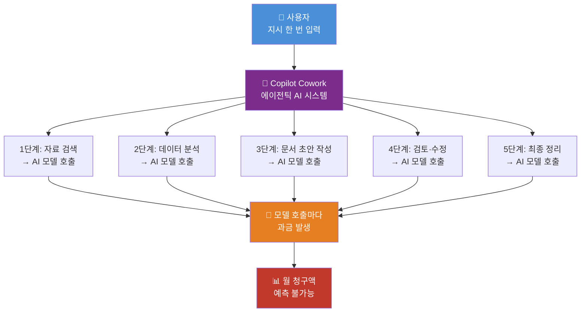
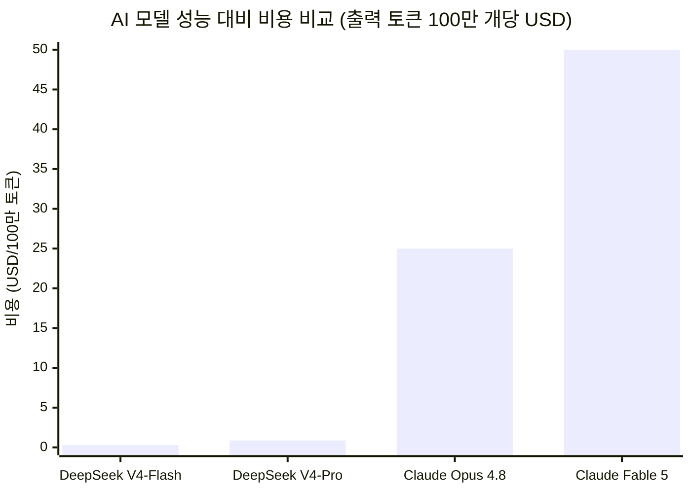
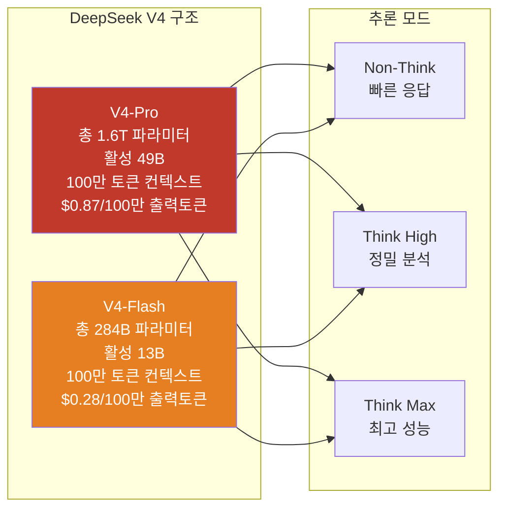
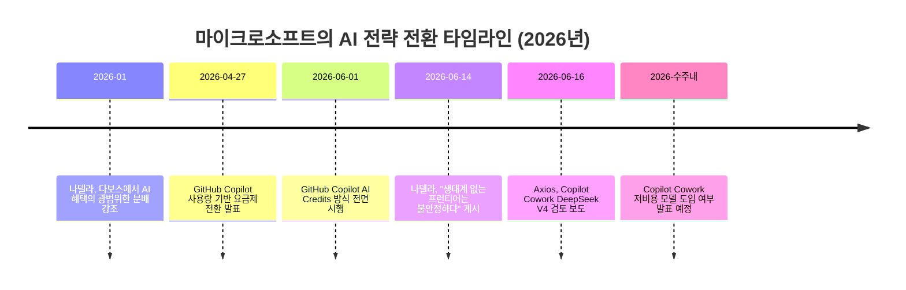
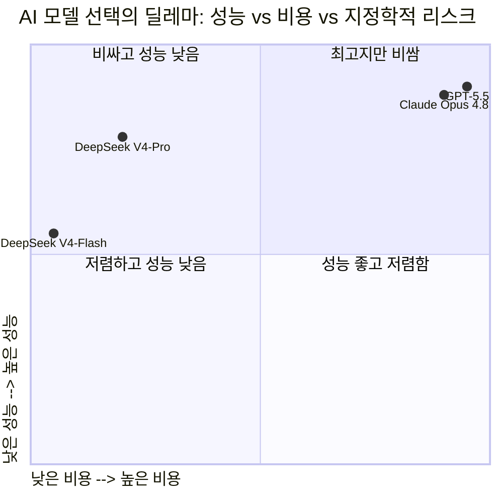

## — Copilot Cowork, DeepSeek V4, 그리고 AI 비용 전쟁의 실상

> **원문 출처**: Axios, "Microsoft weighs DeepSeek for Copilot Cowork" (2026년 6월 16일, 기자: Ina Fried)  
> **Threads 포스팅**: [@jisang0914](https://www.threads.com/@jisang0914/post/DZsS6Z5GhPx) (2026년 6월 17일경)  
> **사실 검증 기준일**: 2026년 6월 18일

---

## 1장. 사실 검증: 무엇이 맞고 무엇이 과장됐는가

Threads 포스팅의 핵심 주장들을 하나씩 검토한다.

**① "OpenAI에 130억 달러를 넣고 지분 27%를 쥔 회사"** — 정확하다. 마이크로소프트의 OpenAI 총 투자 약정액은 130억 달러이며, 2026년 3월 기준으로 118억 달러가 이미 집행됐다. 지분은 전환 기준 약 26.79%(실질적으로 27%)다.

**② "지금 그건 앤트로픽 Claude로 돌아가는데"** — 부분적으로 맞지만, 정확히는 불완전하다. Axios 원문은 "Anthropic and OpenAI models"라고 복수로 표현했다. Copilot Cowork는 현재 Anthropic의 Claude와 OpenAI 모델 모두를 사용하고 있다. Threads 포스팅이 Claude만 언급한 것은 사실의 일부만 전달한 것이다.

**③ "갈아끼우려는 건 딥시크. 중국 AI 스타트업이 만든 모델"** — 정확하다. Microsoft는 DeepSeek V4의 파인튜닝 버전 또는 다른 오픈소스 모델을 저비용 대안으로 검토 중이라고 직접 밝혔다. DeepSeek는 2023년 설립된 중국 AI 기업이다.

**④ "문제의 기능은 Copilot Cowork"** — 정확하다. Axios 기사 제목 자체가 "Microsoft weighs DeepSeek for Copilot Cowork"다.

**⑤ 찰스 라만나(Charles Lamanna)의 발언** — 정확하다. 그의 직함은 Microsoft의 "Executive Vice President for Copilot, Agents and Platform"이며, "매주 수백 개의 작업을 수행하는 사용자들이 있다. 생산성은 엄청나지만 비용이 매우 높게 올라가는 결과를 낳는다"는 발언은 Axios 원문에 그대로 실렸다.

**⑥ "정액제를 포기하고 쓴 만큼 내는 방식으로 어제부터 바꿈"** — 맞다. Copilot Cowork의 사용량 기반 요금제 전환은 Axios 기사에서 확인됐다.

**⑦ "딥시크는 Azure 안에서만 돌고, 고객 데이터는 마이크로소프트 클라우드 밖으로 안 나감"** — 정확하다. Axios는 "fully hosted on Azure, keeping customer data within Microsoft's cloud and covered by Azure's enterprise security, compliance and data-residency controls"라고 명시했다.

**⑧ "편향을 줄이는 손질도 했다고 함"** — 정확하다. Axios 원문: "Microsoft says it has also fine-tuned the model and added safeguards, including changes aimed at reducing bias."

**⑨ "선택은 몇 주 안에 발표"** — 정확하다. Axios: "Microsoft says it expects to make a lower-cost model available in the coming weeks."

**⑩ 6월 14일 사티아 나델라의 글, "생태계 없는 프런티어는 불안정하다"** — 정확하다. 제목은 "A frontier without an ecosystem is not stable"이며, X(트위터)에 게재됐다. 이 글은 수천만 뷰를 기록했다.

**⑪ "깃허브 Copilot도 이미 쓴 만큼 내는 방식으로 바꿨음"** — 정확하다. GitHub Copilot은 2026년 6월 1일부로 Premium Request Units 방식에서 GitHub AI Credits(토큰 기반) 방식으로 전환됐다.

**종합 사실 검증 결과**: Threads 포스팅의 내용은 대부분 사실이다. 유일하게 부정확한 부분은 Copilot Cowork의 현재 AI 엔진을 "앤트로픽 Claude"로만 표현한 것인데, 실제로는 Anthropic Claude와 OpenAI 모델 모두가 사용되고 있다. 나머지 주요 주장들은 Axios 원문과 여러 공식 출처에 의해 충분히 뒷받침된다.

---

## 2장. 사건의 전말: Copilot Cowork란 무엇인가

이 이야기를 제대로 이해하려면 먼저 "Copilot Cowork"가 무엇인지 알아야 한다.

Microsoft의 Copilot은 오랫동안 다양한 형태로 진화해왔다. 문서 작성을 도와주는 보조 도구에서 시작해, 이제는 자율적으로 업무를 처리하는 에이전트 형태로 발전했다. Copilot Cowork는 그 진화의 현재 끝점이다. 단순히 사용자의 질문에 답하는 수준이 아니라, 사용자가 "이 프로젝트 보고서를 분석해서 다음 달 계획안을 만들어 줘"라고 지시하면 알아서 데이터를 찾고, 문서를 만들고, 후속 작업을 이어가는 방식이다.

기술적으로 표현하면, Copilot Cowork는 **에이전틱 AI(Agentic AI)** 도구다. 사용자가 한 번 지시를 내리면 모델이 스스로 여러 단계의 추론과 행동을 반복하며 작업을 완수한다. 이 과정에서 AI 모델은 수십 번에서 수백 번씩 호출된다. 각 호출마다 비용이 발생한다. 사용자가 많을수록, 작업이 복잡할수록, 비용은 기하급수적으로 불어난다.

찰스 라만나가 공개적으로 밝힌 숫자가 이 문제의 심각성을 잘 보여준다. 매주 수백 개의 작업을 처리하는 사용자들이 이미 존재한다. 이들의 생산성은 실제로 극적으로 높아졌다. 문제는 그 생산성 향상의 대가가 청구서로 돌아온다는 점이다. 마이크로소프트가 정액 구독 방식을 고집했다면, 고생산성 사용자들에게 쏟아지는 AI 인프라 비용은 고스란히 회사가 떠안아야 했다.

---

## 3장. 토큰맥싱(Tokenmaxxing): AI 비용이 왜 폭발하는가

Axios 기사의 원제목에는 "tokenmaxxing"이라는 단어가 등장한다. 이 개념을 이해하면 지금 일어나고 있는 일의 본질이 보인다.

토큰(Token)은 AI 모델이 텍스트를 처리하는 기본 단위다. 영어 단어 하나가 대략 1개의 토큰에 해당한다. AI 모델은 처리하는 토큰의 수에 비례해 비용이 청구된다. 에이전틱 AI는 한 번의 작업을 수행하기 위해 입력과 출력을 반복하면서 수십만 개의 토큰을 소비할 수 있다.

사티아 나델라는 이 현상에 "token-maxing"이라는 이름을 붙였다. 그는 2026년 Hard Fork 팟캐스트에서 이 개념을 설명했다. 기업들이 단순한 작업에도 가장 비싼 최고급 AI 모델을 사용하는 경향, 즉 작업의 복잡도와 무관하게 무조건 최고 성능 모델을 배치하는 방식이 AI 비용을 불합리하게 높이고 있다는 지적이다.

*참고: Claude Fable 5는 2026년 6월 미국 정부 수출통제 지침으로 인해 현재 외국 국적자 접근이 일시 중단됨*

DeepSeek V4-Pro의 출력 토큰 단가는 100만 토큰당 0.87달러다. Claude Opus 4.8는 25달러다. 같은 작업에 DeepSeek V4-Pro를 쓰면 Opus 4.8 대비 약 28배 저렴하다. 성능 차이는 분명 존재한다. 하지만 대부분의 기업 일상 업무는 최고 성능 모델이 반드시 필요한 수준이 아니다. 마이크로소프트는 이 비용 격차를 Copilot Cowork의 경제적 지속 가능성 문제 해결에 활용하려 한다.

---

## 4장. DeepSeek V4는 어떤 모델인가

마이크로소프트가 후보로 올린 DeepSeek V4에 대해 정확히 알아야 한다.

DeepSeek V4는 2026년 4월 24일 공식 출시된 중국 AI 기업 DeepSeek의 최신 오픈소스 대형 언어 모델이다. 두 가지 버전으로 구성된다. V4-Pro는 총 파라미터 수 1조 6,000억 개이며, 추론 시 실제로 활성화되는 파라미터는 490억 개다(MoE, Mixture of Experts 아키텍처 덕분이다). V4-Flash는 총 파라미터 2,840억 개, 활성 파라미터 130억 개로 더 가볍고 빠르다.

두 모델 모두 기본 컨텍스트 창이 100만 토큰이다. 이는 매우 긴 문서나 코드베이스 전체를 한 번에 처리할 수 있음을 의미한다. 라이선스는 MIT로, 누구나 자유롭게 다운로드하고 수정하고 상업적으로 사용할 수 있다.

DeepSeek V4의 아키텍처적 혁신 중 핵심은 하이브리드 어텐션 메커니즘이다. 가까운 문맥에는 압축 희소 어텐션(CSA)을, 멀리 있는 문맥에는 강하게 압축된 어텐션(HCA)을 적용한다. 이를 통해 100만 토큰 문맥을 처리할 때 V3.2 대비 추론 연산량이 27%, KV 캐시는 10%에 불과하다. 즉, 훨씬 긴 문맥을 훨씬 저렴한 비용으로 처리한다.

코딩 벤치마크에서는 주목할 만한 성과를 보였다. 오픈소스 모델 중 에이전틱 코딩 벤치마크 최고 수준을 달성했으며, Claude Code나 OpenClaw 같은 에이전틱 코딩 인프라와 원활하게 통합된다. 가격은 V4-Pro 기준 입력 토큰 100만 개당 0.27달러, 출력 토큰 100만 개당 0.87달러다. V4-Flash는 입력 0.14달러, 출력 0.28달러로 더욱 저렴하다.

단, 마이크로소프트가 Azure에서 운영하려는 버전은 DeepSeek가 공개한 원본 모델에 추가적인 파인튜닝과 안전장치를 더한 버전이다. 편향 감소를 위한 처리도 거쳤다고 밝혔다. 고객 데이터는 Azure 내부에 머물며, 중국 DeepSeek 서버로 전송되지 않는다.

---

## 5장. 사티아 나델라의 선언: "생태계 없는 프런티어는 불안정하다"

2026년 6월 14일, 마이크로소프트 CEO 사티아 나델라는 X에 장문의 글을 올렸다. 제목은 "A frontier without an ecosystem is not stable(생태계 없는 프런티어는 안정적이지 않다)"이다. 이 글은 공개 직후 수천만 뷰를 기록하며 AI 업계의 뜨거운 화제가 됐다.

나델라의 논지는 다음과 같다. 과거의 디지털 전환은 인간의 도구였다. 지금의 AI는 처음으로 인간과 디지털 시스템 사이에 진정한 인지 루프를 만들어낸다. 이 변화는 글로벌라이제이션과 비슷한 방식으로 작동한다. 일부에게는 엄청난 기회이지만, 잘못 설계되면 전체 산업이 공동화될 수 있다.

핵심 경고는 이것이다. "모든 회사가 자신의 산업 전문성을 몇 개의 프런티어 모델에 넘겨주는 세상은 우리 누구도 원하지 않는다." 그는 이를 가치가 극소수 모델 기업에만 집중되는 위험이라고 표현했다. 그 집중이 심해지면 사회적 허용이 사라지고, 정치적 개입이 불가피해진다.

나델라가 제시하는 해법은 '프런티어 생태계'다. 기업들이 최고의 모델을 구독하는 것에서 그치지 않고, 자신만의 학습 루프를 구축해야 한다는 것이다. 그 루프는 기업 내부의 지식, 워크플로, 의사결정 히스토리를 AI와 결합해 복리처럼 축적된다. 그리고 그 시스템 위에서 어떤 모델을 쓰든 교체 가능해야 한다.

이 철학이 이틀 뒤 DeepSeek 검토 뉴스로 현실화됐다. 모델은 교체 가능한 부품이라는 선언이, 실제로 가장 저렴한 부품을 탐색하는 행동으로 이어진 것이다.

---

## 6장. Microsoft와 OpenAI의 복잡한 관계

이 이야기에서 빠질 수 없는 맥락이 있다. 마이크로소프트는 현재 OpenAI의 최대 단일 재무 투자자다. 2019년부터 시작된 투자는 총 130억 달러에 이르며, 2026년 3월 기준으로 118억 달러가 집행됐다. OpenAI의 기업 가치가 2026년 2월 8,520억 달러로 평가됐을 때 마이크로소프트의 지분 가치는 약 2,280억 달러에 달했다. 130억 달러 투자가 17.6배의 수익을 냈다.

그러나 이 관계는 2025~2026년을 거치며 복잡해졌다. OpenAI가 Amazon, SoftBank 등 다른 클라우드 사업자와 파트너십을 확대하면서 마이크로소프트의 독점적 컴퓨팅 제공자 지위는 약해졌다. 2026년 4월에는 두 회사가 파트너십 조건을 재협상했고, OpenAI는 다른 클라우드에서도 서비스를 제공할 수 있게 됐다.

마이크로소프트는 동시에 Anthropic에 50억 달러를 투자하고, Azure에서 300억 달러의 컴퓨팅 계약을 체결했다. xAI와도 파트너십을 맺었다. 단일 AI 공급사에 대한 의존도를 줄이는 '멀티 모델 전략'을 공식화한 것이다.

Copilot Cowork에서 DeepSeek를 검토하는 것은 이 전략의 연장선이다. OpenAI와 Anthropic에게 "당신들 없이도 우리는 운영할 수 있다"는 협상 신호다.

---

## 7장. GitHub Copilot 요금제 전환: 먼저 일어난 일

Copilot Cowork의 요금제 전환은 갑작스럽지 않았다. 이미 2026년 6월 1일부터 GitHub Copilot이 동일한 방향으로 먼저 전환됐다.

기존의 GitHub Copilot은 Premium Request Units(PRU)라는 단위로 과금됐다. 각 AI 상호작용이 1개의 PRU를 소비하며, 모델에 따라 배수가 적용됐다. 이 방식의 문제는 짧은 단순 질문과 수 시간에 걸친 에이전틱 코딩 세션이 동일하게 취급됐다는 점이다. 마이크로소프트는 이 차이를 오랫동안 흡수해왔지만, 에이전틱 AI 사용이 본격화되면서 더 이상 감당할 수 없게 됐다.

새로운 방식은 GitHub AI Credits다. 1 크레딧 = 0.01달러이며, 실제 소비한 토큰 수에 비례해 청구된다. 구독료 자체는 바뀌지 않았다. Copilot Pro는 월 10달러로 동일하지만, 이제 그 10달러는 10달러어치의 AI 크레딧을 포함한다. 이를 초과하면 추가 요금이 발생한다.

개발자 커뮤니티의 반응은 엇갈렸다. 가벼운 사용자에게는 큰 변화가 없지만, 에이전트 모드를 적극 활용하는 사용자들은 하루 만에 월 크레딧을 소진하는 사례가 발생하기 시작했다. GitHub 포럼에는 "6월 1일, 두 번의 프롬프트에 이번 달 Pro 구독 크레딧이 모두 소진됐다"는 불만이 올라왔다.

이것이 AI의 아이러니다. AI가 더 유용해질수록, 즉 더 긴 작업을 스스로 처리할수록 비용은 더 빠르게 늘어난다. 정액제 구독 모델과 에이전틱 AI 사용 패턴은 구조적으로 충돌한다.

---

## 8장. 지정학적 뇌관: "중국 모델"이라는 단어의 무게

모든 기술적·경제적 논리가 타당하더라도, "중국 AI 모델"이라는 단어 자체가 미국에서 정치적 뇌관이다.

DeepSeek는 2023년 설립된 중국의 AI 기업이다. DeepSeek V4는 MIT 라이선스의 오픈소스 모델이다. 기술적으로는 누구나 다운로드해서 자체 서버에서 운영할 수 있다. 마이크로소프트가 검토하는 방식도 DeepSeek의 API를 사용하는 것이 아니라, 모델 가중치를 Azure 내부에 올려 자체 호스팅하는 방식이다. 고객 데이터가 중국으로 전송되지 않는다.

그럼에도 불구하고 정치적 민감성은 존재한다. 미국 의회는 이미 TikTok 금지, 화웨이 장비 제한 등 중국 기술에 대한 규제를 강화해왔다. DeepSeek 역시 이미 여러 미국 정부 기관에서 접근이 제한되거나 검토 중인 상황이다.

마이크로소프트가 이 민감성을 인식하지 못하는 것이 아니다. Axios 보도에서 마이크로소프트 스스로 "중국 AI 기업의 모델을 추가하는 것은 비판을 받을 수 있다"고 인정했다. 그럼에도 이를 공개적으로 검토하는 이유는, 비용 압박이 그만큼 심각하다는 뜻이기도 하다.

*성능 수치는 SWE-bench 등 공개 벤치마크 기반 상대적 비교이며, 절대적 평가가 아님*

---

## 9장. 모델은 소모품이 됐다: 경쟁의 축이 바뀌다

이번 사건이 전달하는 가장 중요한 메시지는 "모델은 이제 소모품"이라는 것이다.

2023~2024년의 AI 경쟁은 "누가 더 똑똑한 모델을 만드는가"였다. GPT-4가 나오고, Claude 2가 나오고, GPT-4 Turbo가 나오는 방식으로 성능 경쟁이 이어졌다. 기업들은 성능이 가장 뛰어난 모델을 선택했다.

2025~2026년에 경쟁의 축이 이동했다. DeepSeek V3가 등장하면서 오픈소스 모델이 폐쇄 모델의 성능에 근접했다. DeepSeek V4-Pro는 SWE-bench Verified에서 80.6%를 기록하며 Claude Opus 4.8(88.6%)과 비교 가능한 수준이 됐다. 두 모델의 가격 차이는 약 28배다.

이 상황에서 기업 의사결정의 질문이 바뀌었다. "어떤 모델이 가장 뛰어난가"가 아니라 "이 작업에 어느 수준의 성능이 필요하며, 그것을 가장 저렴하게 제공하는 모델은 무엇인가"로.

마이크로소프트는 이 논리를 기업 전략으로 명시화하고 있다. AI 모델 공급사에 종속되지 않겠다는 멀티 모델 전략, 비용에 따라 모델을 교체할 수 있는 아키텍처, 사용량 기반의 투명한 요금제가 그 구체적 표현이다.

AI 업계의 힘의 추가 이동하고 있다. 모델 개발사(OpenAI, Anthropic, Google)가 생태계를 지배하던 시대에서, 고객 접점과 배포 인프라를 가진 플랫폼 기업(Microsoft, Amazon, Google Cloud)이 중개자로서의 권력을 강화하는 시대로.

---

## 10장. 한국 기업에게 무엇을 의미하는가

한국 기업들에게 이 뉴스는 남의 이야기가 아니다.

마이크로소프트 Microsoft 365 Copilot을 사용하는 한국 기업은 이미 적지 않다. 대기업, 금융사, 제조업에서 Copilot을 업무에 통합하고 있다. Copilot Cowork가 한국에 서비스될 경우, 이 에이전틱 기능을 사용하는 기업들은 사용량 기반 요금제의 영향을 직접 받게 된다.

Copilot Cowork의 요금제 전환이 의미하는 바는 명확하다. AI를 더 많이 쓸수록 비용이 더 빠르게 늘어난다. AI 도입의 ROI 계산이 달라진다. 단순히 "AI 도구를 도입했다"는 수준에서 "AI가 처리하는 작업의 단가와 그 효율을 관리해야 한다"는 수준으로 요구사항이 높아진다.

더 근본적인 질문도 생긴다. 기업의 AI 사용에서 어느 작업에 어느 수준의 모델이 적합한가. 마이크로소프트가 Copilot Cowork에 DeepSeek 같은 저비용 모델 옵션을 추가한다면, 기업 관리자들은 작업 유형에 따라 비용과 성능을 선택할 수 있게 된다. 이는 AI 도구 관리의 복잡성이 높아진다는 의미다.

한국 기업 입장에서 한 가지 더 주목할 점이 있다. 마이크로소프트가 중국 모델을 검토하는 배경에는 AI 모델 공급망의 다변화 필요성이 있다. 단일 공급사 의존 리스크는 기업 수준에서도 동일하게 적용된다. 핵심 업무를 특정 AI 공급사의 모델에 완전히 의존하는 구조라면, 그 공급사가 가격을 올리거나 정책을 바꿀 때 대응 수단이 없다.

---

## 11장. 검증되지 않은 것, 앞으로 지켜봐야 할 것

이 분석이 솔직하려면 불확실한 부분도 명시해야 한다.

마이크로소프트가 실제로 DeepSeek V4를 Copilot Cowork에 도입할지는 아직 미정이다. "검토 중"이라고 밝혔을 뿐, 최종 결정은 수 주 안에 발표될 예정이다. 후보는 DeepSeek V4 또는 "다른 오픈소스 모델"이라고 명시했다. 정치적 압박이 거세지면 DeepSeek 대신 다른 오픈소스 모델이 선택될 수도 있다.

DeepSeek V4가 Copilot Cowork에 실제로 사용될 경우 어떤 성능을 보일지도 미지수다. 오픈소스 벤치마크는 실제 기업 업무 환경에서 재현되지 않는 경우가 많다. 마이크로소프트가 수행했다는 파인튜닝과 안전장치의 구체적 내용도 공개되지 않았다.

한국 시장에서의 서비스 타임라인도 불분명하다. Copilot Cowork의 전반적인 서비스 확대가 진행 중이지만, 한국어 지원과 한국 기업 데이터 거주 요건 충족 등의 조건이 추가로 검토돼야 한다.

---

## 결론: 비용이라는 중력이 이상을 끌어내린다

마이크로소프트가 보내는 신호는 여러 층위에서 읽힌다.

표면적으로는 비용 관리다. AI 에이전트 도구가 예상보다 훨씬 높은 인프라 비용을 만들어내고 있으며, 이를 지속 가능하게 하려면 저비용 모델 옵션이 필요하다.

한 층 더 들어가면 멀티 모델 전략의 실행이다. OpenAI와 Anthropic에 대한 협상력을 확보하기 위해 대안을 적극 탐색하는 과정이다.

가장 깊은 층에는 AI 시대 플랫폼 경쟁의 본질이 있다. 사티아 나델라가 말한 것처럼, 가장 좋은 모델을 고르는 것이 경쟁 우위가 아니다. 모델 위에 구축된 생태계, 기업의 지식이 누적되는 학습 루프, 그리고 어떤 모델로도 교체 가능한 유연한 아키텍처가 진짜 경쟁 우위다.

그리고 그 유연성의 첫 번째 실험이 DeepSeek V4다. OpenAI에 130억 달러를 투자한 회사가, 비용이라는 중력 앞에서 중국 모델을 후보에 올리는 이 역설이 2026년 AI 업계의 현실을 압축적으로 보여준다.

---

## 참고 출처

- Ina Fried, "Microsoft weighs DeepSeek for Copilot Cowork," Axios, 2026년 6월 16일  
  https://www.axios.com/2026/06/16/microsoft-copilot-cowork-tokenmaxxing-cowork

- Satya Nadella, "A frontier without an ecosystem is not stable," X (formerly Twitter), 2026년 6월 14일  
  https://x.com/satyanadella/article/2066182223213293753

- GitHub Blog, "GitHub Copilot is moving to usage-based billing," 2026년 4월 27일  
  https://github.blog/news-insights/company-news/github-copilot-is-moving-to-usage-based-billing/

- CNBC, "OpenAI shakes up partnership with Microsoft, capping revenue share payments," 2026년 4월 27일  
  https://www.cnbc.com/2026/04/27/openai-microsoft-partnership-revenue-cap.html

- Microsoft Official Blog, "The next chapter of the Microsoft–OpenAI partnership," 2025년 10월 28일  
  https://blogs.microsoft.com/blog/2025/10/28/the-next-chapter-of-the-microsoft-openai-partnership/

- DeepSeek API Docs, "DeepSeek V4 Preview Release," 2026년 4월 24일  
  https://api-docs.deepseek.com/news/news260424

- Hugging Face, DeepSeek-V4-Pro Model Card  
  https://huggingface.co/deepseek-ai/DeepSeek-V4-Pro

- VentureBeat, "Satya Nadella warns that AI could hollow out entire industries," 2026년 6월  
  https://venturebeat.com/technology/satya-nadella-warns-that-ai-could-hollow-out-entire-industries-echoing-the-damage-done-by-globalization

---

*작성일: 2026년 6월 18일 | 사실 검증: Axios 원문 및 공식 출처 다수 확인*
