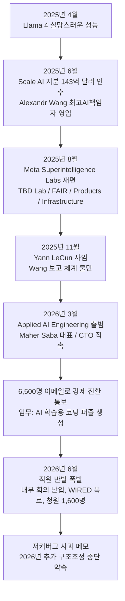
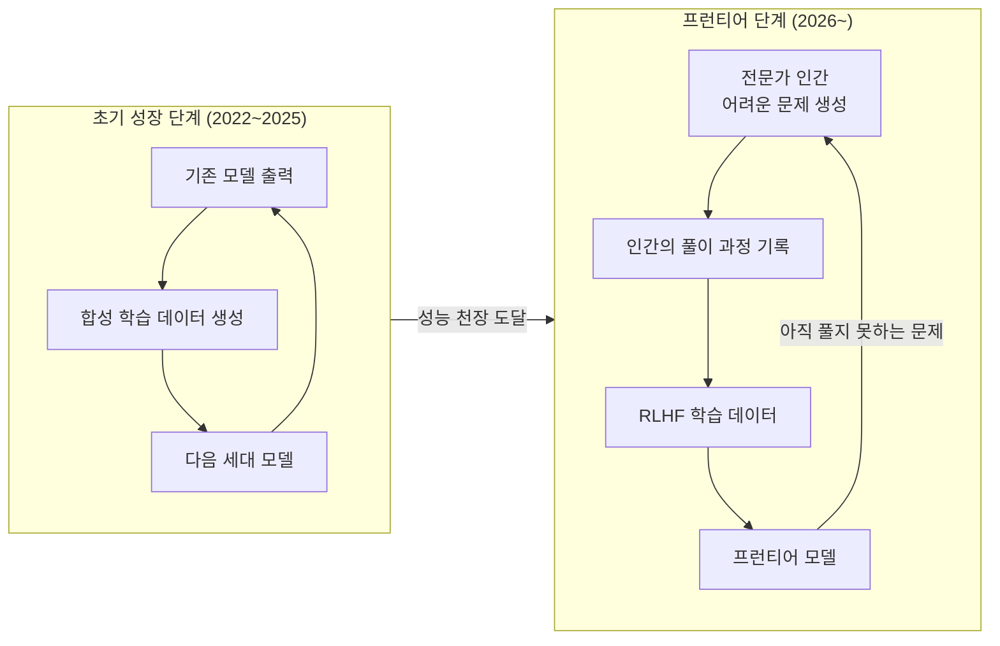
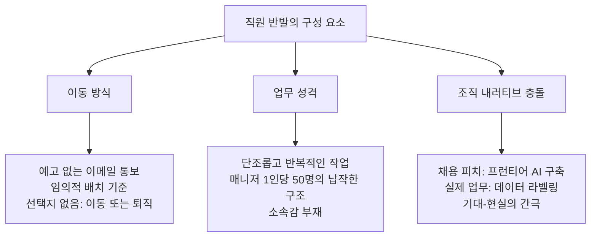
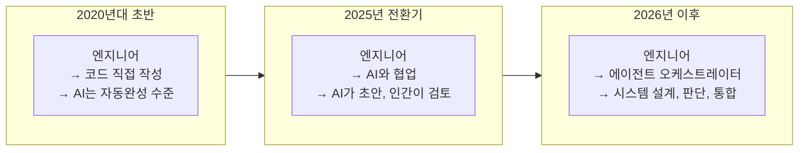

## 메타 '굴라그' 사태가 드러낸 직업 정체성의 역설

> 
> [https://www.facebook.com/share/p/1Co4PMPDGf/](https://www.facebook.com/share/p/1Co4PMPDGf/)
> 
> 인간은 자기 자신의 일을 너무 과대 평가한 경향이 있다. 엔지니어나 예술가나 무언가를 창작하는 사람들은 더더욱. 나는 S/W 엔지니어니까 엔지니어만 보자면,
> 
> 최근 메타에서 대규모의 엔지니어들을 AI가 풀어야 할 문제 혹은 학습해야 할 문제를 만들고 코딩하는 작업을 시켰다고해서 코딩 노예라하며 굉장한 반발이 있었다.
> 
> 다른건 몰라도 소프트웨어 엔지니어라면 기존에 했던 일이랑 다를게 없지 않나?
> 
> 기존의 일도 결국 회사의 문제를 발견하거나 주어진 문제를 해결하기 위해 코딩을 하고, 또 회사의 서비스나 시스템을 더욱 고도화하여 회사의 제품과 가치를 높이는 일이다.
> 
> 나아가 엔지니어가 손을 대지 않아도 문제 없이 안정적으로 만드는 일을 하는 것이 바로 엔지니어다. 그것은 인프라, 백엔드, 프론트 모두 같다.
> 
> 그것은 AI라는 제품을 고도화하고 가치를 높이기 위해, AI의 문제를 해결하고 성능을 높이기 위해 주입할 코드를 작성하는 것과 다른 바가 없지 않나?
> 
> 원래부터 엔지니어(특히 소프트웨어)의 일은 자신의 일을 없애는 일이 절반이었다.
> 

---

## 들어가며: 자신의 일에 대한 과대평가

사람은 누구나 자신이 하는 일을 특별하게 생각한다. 그것이 자연스러운 인지 편향이다. 직접 손으로 무언가를 만들어내는 사람일수록 — 예술가든, 건축가든, 엔지니어든 — 그 경향은 더욱 두드러진다. "내가 만든 것"이라는 감각은 자아와 직업을 강하게 결합시키고, 그 결합이 단단할수록 외부에서 그 일의 의미를 다르게 정의하려 할 때 본능적인 저항이 일어난다.

2026년 초여름, 소프트웨어 엔지니어의 직업 정체성을 정면으로 뒤흔드는 사건이 미국 실리콘밸리에서 벌어졌다. 메타(Meta)가 약 6,500명의 엔지니어를 AI 학습 데이터 생성 부서로 강제 전환 배치한 것이다. 엔지니어들은 이 부서를 "굴라그(Gulag)"라 불렀고, 미국 안팎의 테크 커뮤니티는 이 사건을 두고 '코딩 노예'라는 표현을 썼다. 그러나 이 사건의 본질을 조금 더 찬찬히 들여다보면, 전혀 다른 질문이 떠오른다. 과연 그 일은 소프트웨어 엔지니어가 원래 해오던 일과 본질적으로 다른 것이었는가?

---

## 메타 '굴라그' 사태: 무슨 일이 있었나

### Scale AI 인수와 Alexandr Wang의 입성

사태의 배경을 이해하려면 2025년 6월로 돌아가야 한다. 마크 저커버그는 AI 데이터 인프라 스타트업 Scale AI의 지분 49%를 143억 달러(약 20조 원)에 인수하고, Scale AI의 창업자이자 CEO인 28세의 알렉산더 왕(Alexandr Wang)을 메타 역사상 최초의 최고 AI 책임자(Chief AI Officer)로 영입했다. 동시에 메타 슈퍼인텔리전스 랩(Meta Superintelligence Labs, MSL)을 새로 설립하고 왕에게 지휘권을 맡겼다. 이 결정은 단순한 인재 영입이 아니었다. 2025년 4월 출시된 라마(Llama) 4 모델이 업계의 기대에 크게 못 미쳤다는 것이 공식적인 배경이었고, 저커버그는 메타의 AI 전략 전체를 근본부터 재편하겠다는 신호를 시장에 보낸 것이었다.

왕의 합류 이후 메타는 OpenAI, Anthropic, Google 등 경쟁사에서 연봉 수억 달러 규모의 패키지로 최고급 AI 연구자들을 대거 스카우트했다. GitHub 전 CEO 낫 프리드먼(Nat Friedman), Safe Superintelligence 전 CEO 다니엘 그로스(Daniel Gross) 등이 차례로 합류했다. 메타의 2026년 자본지출 가이던스는 1,250억~1,450억 달러로 상향 조정되었는데, 이는 2025년 지출의 거의 두 배에 달하는 수치였다.

### Applied AI Engineering 부서의 탄생과 강제 전환

2026년 3월, 저커버그는 메타 내부에 별도의 사업 단위인 'Applied AI Engineering'을 출범시켰다. 이 조직은 왕의 MSL 산하가 아니라 CTO 앤드루 보즈워스(Andrew Bosworth) 직속으로 운영되었으며, 메타버스 사업에 830억 달러를 태우다 피벗한 Reality Labs 출신의 12년 차 베테랑 마허 사바(Maher Saba)가 이끌었다.

문제는 이 조직의 인력이 충원되는 방식이었다. 메타는 Facebook, Instagram, WhatsApp 제품 개발을 담당하던 엔지니어와 프로덕트 매니저 약 6,500명에게 예고 없이 이메일을 발송하여 부서 이동을 통보했다. 실제 배치 기준은 직원들조차 이해하기 어려울 만큼 "상당히 무작위적(quite random)"이었다고 한 직원이 Reddit에 올린 글에서 밝혔다. 선택지는 사실상 없었다. 이동하거나, 떠나거나.

이 조직에 배치된 엔지니어들에게 주어진 임무는 AI 모델 학습을 위한 코딩 퍼즐과 문제를 만드는 것이었다. 대부분의 시간을 AI가 코드를 작성하는 것을 관찰하고 피드백을 제공하는 반복적인 작업에 써야 했다. 관리 구조도 엉망이었다. 초기에는 한 명의 매니저가 최대 50명의 직원을 관리하는 극단적으로 납작한 체계로 운영되었다.

### 반발의 폭발

2026년 6월, 메타 내부 공개 회의 도중 한 직원이 참지 못하고 마이크를 켠 채로 AI 부서 임원을 향한 거친 욕설을 쏟아내는 장면이 스트리밍으로 퍼져나갔다. WIRED가 실명을 빼고 공개한 직원들의 증언은 "그냥 굴라그다(It's literally the gulag)", "대부분이 이 일을 영혼이 메말라가는 것처럼 느낀다(soul-crushing)"는 표현으로 가득했다. 회사 전체적으로는 1,600명 이상의 직원이 키보드 입력과 마우스 클릭을 AI 학습 데이터로 수집하는 프로그램에 반대하는 청원서에 서명했다. 저커버그는 6월 13일 내부 메모를 통해 "우리는 실수를 했고, 앞으로도 실수할 것"이라며 사과하고 2026년 말까지 전사 구조조정을 중단하겠다고 발표했다.

---

## 반발의 이면: 왜 하필 엔지니어가 필요했나

저커버그는 내부 회의 음성 녹음에서 솔직하게 말했다. 외부 계약직 데이터 라벨러를 쓰는 대신 자사 엔지니어를 투입한 이유는, 메타 직원들이 외부 계약직보다 "현저히 높은 지능"을 갖고 있기 때문이라고. 이 발언은 직원들의 자존심을 더욱 자극했지만, 그 이면에는 합성 학습 데이터의 구조적 한계라는 더 중요한 기술적 맥락이 있었다.

### AI 성능의 천장: 합성 데이터가 막힌 이유

2022년부터 2025년까지 AI 모델의 폭발적인 성능 향상을 이끌었던 핵심 원료는 합성 데이터(Synthetic Data)였다. 기존 모델이 생성한 출력을 다시 학습 데이터로 활용하는 방식이 빠르고 저렴하게 모델 성능을 높이는 수단이 되었다. 그런데 이 방법에는 구조적 상한선이 존재한다. 모델이 이미 풀 수 있는 수준의 문제로 학습시키는 것은 더 이상 성능 향상을 가져다주지 않는다. 특히 복잡한 코딩 작업처럼 모델이 인간의 수준을 넘어서야 하는 영역에서는, 기존 모델이 아직 풀 수 없는 새로운 문제와 그에 대한 인간의 풀이 과정을 학습 데이터로 공급해야 한다.

AI 연구 기관 Epoch AI는 공개 텍스트 기반의 프리트레이닝 데이터도 2026년에서 2032년 사이 어느 시점에 소진될 것으로 전망한 바 있다. 현재의 모델 학습 속도로는 고품질 공개 데이터의 재고가 빠르게 바닥나고 있다는 것이다.

이것이 바로 메타가 내부 엔지니어를 동원한 실질적인 이유였다. AI가 아직 풀지 못하는 수준의 코딩 문제를 만들고, 실제로 그것을 해결하는 인간의 사고 과정을 데이터로 남겨서 모델에 주입하기 위해서는, 그 분야에서 실력 있는 인간 전문가가 필요했다. 일반적인 외부 계약직이 아니라 실력 있는 소프트웨어 엔지니어가.

### RLHF의 구조

현대 대규모 언어 모델의 훈련 패러다임인 RLHF(인간 피드백을 통한 강화학습)는 인간의 선호 신호 — 순위, 수정, 새로운 예시 — 를 수집하여 모델 행동을 조정한다. 이 피드백의 품질이 모델 성능의 천장을 결정한다. 지금까지 이 역할을 주로 외주 데이터 라벨러들이 담당했지만, 모델이 프런티어 수준에 가까워질수록 인간의 판단 자체가 고도로 전문화되어야 한다는 문제가 생긴다. 수학이나 코딩처럼 전문성이 필요한 도메인에서 비전문가의 피드백은 오히려 모델을 잘못된 방향으로 이끌 수 있다. 메타는 바로 이 구조적 문제를 자사의 고급 엔지니어로 해결하려 했다.

---

## 본질적 질문: 그 일은 원래 하던 일과 다른가

이 지점에서 되돌아가야 할 질문이 있다. 소프트웨어 엔지니어가 AI 학습용 코딩 문제를 만들고 AI의 풀이에 피드백을 제공하는 일이, 이전에 해오던 일과 본질적으로 다른 것인가?

### 엔지니어의 일은 원래 무엇이었나

소프트웨어 엔지니어의 일을 구성하는 핵심 요소를 다시 꺼내보면, 회사나 팀이 직면한 문제를 발견하거나 주어진 문제를 이해하는 것, 그것을 코드로 풀어내는 것, 그리고 그 시스템을 사람의 손이 덜 필요하게 만들어 안정적으로 자동화하는 것이다. 인프라 엔지니어는 서버가 스스로 관리되도록 만들고, 백엔드 엔지니어는 비즈니스 로직이 사람 없이 돌아가도록 만들고, 프론트엔드 엔지니어는 사용자가 직접 수행해야 했던 작업을 UI가 대신 처리하도록 만든다. 어떤 레이어이든 본질은 같다. 반복적으로 사람이 해야 했던 일을 없애는 것.

이 맥락에서 보면, AI라는 제품의 성능을 높이기 위해 어려운 문제를 만들고 풀이를 제공하는 일도 정확히 같은 구조다. 회사의 제품(이 경우 AI 모델)이 더 잘 작동하도록, 성능을 높이기 위해, 그 시스템이 스스로 해결할 수 있는 범위를 넓히기 위해 필요한 재료를 코드로 만드는 것이다. 플랫폼이 Facebook이든 Instagram이든 Llama이든, 엔지니어가 해결하려는 대상의 이름이 달라졌을 뿐, 행위의 구조는 동일하다.

### 자신의 일을 없애는 것이 최고의 성취

소프트웨어 공학 문화 안에는 오래된 역설이 있다. 훌륭한 엔지니어일수록 자신이 개입해야 하는 상황을 줄이는 방향으로 일한다는 것이다. 자동화 테스트를 짜는 것은 수동 테스트를 해야 했던 자신의 일을 없애는 것이고, CI/CD 파이프라인을 구축하는 것은 배포 담당자가 직접 눌러야 했던 버튼을 없애는 것이다. 인프라를 코드로 관리하는 IaC는 서버를 손으로 세팅하던 작업을 없애고, 모니터링과 알림 시스템은 사람이 로그를 들여다봐야 했던 시간을 없앤다.

이 흐름의 종착점은 언제나 "사람이 없어도 안정적으로 돌아가는 시스템"이었다. 그것이 바로 엔지니어가 자신의 역량을 증명하는 방식이었다. 이 관점에서 소프트웨어 엔지니어의 일은 처음부터 반쪽은 자신의 일을 없애는 일이었다.

그렇다면 AI 모델의 코딩 능력을 향상시켜 궁극적으로 코드를 쓰는 인간의 필요성을 줄이는 작업에 참여하는 것은, 엔지니어가 역사적으로 해온 일의 가장 큰 버전일 뿐이다. 이전에는 특정 팀이나 부서의 반복 작업을 없앴다면, 지금은 소프트웨어 엔지니어링이라는 직업군 전체의 반복 작업을 없애는 방향으로 기여하는 것이다.

---

## 그렇다면 왜 반발했는가

그렇다고 해서 직원들의 반발을 단순히 '자기 일에 대한 과대평가'로만 설명할 수는 없다. 이번 사태에는 훨씬 구체적이고 정당한 불만의 요소들이 있었다.

첫 번째는 이동 방식의 문제였다. 직원들이 스스로 그 작업의 의미를 이해하고 동참하는 것이 아니라, 이메일 한 통으로 갑작스럽게 통보받아 이동을 강요당했다. 그것도 기준이 불명확하게 임의적으로. 아무리 그 일이 의미 있다 해도, 일하는 방식에 대한 최소한의 통제권을 박탈당하는 경험은 사람을 무력하게 만든다.

두 번째는 작업 자체의 반복성이었다. 코딩 퍼즐을 만들고 AI 출력에 피드백을 제공하는 일은, 처음에는 흥미로울 수 있어도 날마다 반복하면 단조롭고 지루해진다. Pragmatic Engineer 뉴스레터가 Meta 내부 관계자들과 나눈 인터뷰에 따르면, 업무에 활력을 불어넣기 위해 사용하는 기술 스택을 다양하게 바꾸거나 스스로에게 도전을 설정하는 방식으로 동기를 유지하는 엔지니어도 있었지만, 대다수에게는 반복감에서 벗어나기 어려운 구조였다.

세 번째는 조직의 내러티브 문제였다. 메타는 세계 최고의 AI를 만든다는 비전을 내걸고 최고급 인재들을 영입했다. Scale AI 인수의 메시지는 "함께 프런티어 모델을 만든다"는 것이었다. 그런데 실제로 많은 직원들이 배치된 일은 데이터 라벨링이었다. FourWeekMBA의 분석처럼, 이것은 채용 피치와 실제 업무 사이의 충돌이었다. 회사가 꿈을 팔고 현실을 줬을 때, 그 간극이 분노가 된다.

---

## AI 시대, 소프트웨어 엔지니어의 역할이 바뀌는 방향

메타 사태는 한 회사의 내부 갈등이 아니라 업계 전체가 직면한 전환점을 드러낸다. 소프트웨어 엔지니어의 일이 어떤 방향으로 재편되고 있는지 현재의 데이터와 사례를 통해 살펴볼 수 있다.

### 코딩에서 오케스트레이션으로

2025년 스택 오버플로 개발자 서베이에서 전체 개발자의 84%가 AI 도구를 사용한다고 응답했다. AI 보조 도구는 이미 소프트웨어 개발의 기본 환경이 되었다. 그런데 흥미롭게도 이 변화가 소프트웨어 엔지니어링 직업군을 줄이지 않았다. 미국 노동통계국은 2023년부터 2033년까지 소프트웨어 개발자 수요가 약 17% 증가할 것으로 전망했다.

WEF(세계경제포럼)가 63개국 1,600명 이상의 개발자를 대상으로 실시한 Dev Barometer 조사(2025)에 따르면, 개발자의 65%가 2026년에 자신의 역할이 재정의될 것으로 예상했다. 방향은 루틴 코딩에서 아키텍처, 통합, AI 기반 의사결정으로의 이동이었다. 같은 조사에서 37%는 AI가 오히려 자신의 커리어 기회를 확장했다고 응답했다.

GitHub Octoverse 2025는 이 전환을 "개발자가 전략적 오케스트레이터로 진화한다"는 표현으로 요약했다. 코드를 직접 타이핑하는 사람에서, 여러 AI 에이전트에게 작업을 나누어 지시하고 결과를 통합하며 품질을 판단하는 사람으로의 변화다.

### 줄어드는 것과 커지는 것

이 전환이 모든 엔지니어에게 균등하게 유리한 것은 아니다. 2025년 Harvard 연구는 기업이 생성 AI를 도입하면 6분기 내에 주니어 개발자 고용이 약 9~10% 감소한다는 것을 62백만 명의 근로자 데이터에서 확인했다. 반면 시니어 엔지니어 고용은 거의 변동이 없었다.

Stanford 연구(2025)는 AI 코딩 도구를 사용하는 개발자가 수동으로 작성하는 개발자보다 보안 취약점을 도입할 가능성이 41% 더 높다는 것을 보여줬다. AI가 생성한 코드가 많아질수록 그것을 검토하고 시스템 전체를 설계할 수 있는 역량 — 아키텍처 판단력, 보안 감각, 도메인 지식 — 의 가치는 높아진다.

Anthropic의 경제 지수 분석에 따르면, 실제 Claude 대화 전체를 분석했을 때 AI 사용의 57%는 증강(augmentation), 43%는 자동화(automation) 패턴을 보였다. 그런데 Claude Code처럼 에이전틱(agentic) 도구의 경우 이 비율이 자동화 79%, 증강 21%로 역전된다. 에이전틱 AI로의 전환이 가속화될수록 자동화 비율은 더 올라갈 것이다.

---

## 마무리: 직업 정체성의 재정의가 필요한 이유

세상에 존재했다가 사라진 직업들 대부분은, 자신이 하는 일이 무엇인지 그 본질에 집착하다가 도구의 변화를 놓쳤다. ATM이 등장했을 때 은행 창구 직원이 사라질 것이라는 예측이 있었다. 실제로는 ATM이 지점 운영 비용을 낮추어 오히려 지점이 늘어나고 창구 직원도 증가했다. 고수준 프로그래밍 언어가 나왔을 때, 프로그래머가 필요 없어질 것이라는 이야기가 나왔다. 인터넷 외주가 보편화되었을 때, 선진국 소프트웨어 엔지니어의 종말을 예측하는 사람들이 있었다. 그 예측들은 모두 틀렸다.

그러나 이번은 다르다는 견해도 있다. 이전의 도구들은 인간이 해야 하는 인지적 작업의 특정 서브셋을 자동화했을 뿐이지만, LLM 기반 에이전트는 소프트웨어 개발의 코어 루프 — 요구사항 이해, 설계, 구현, 테스트, 디버깅 — 전체를 점진적으로 수행할 능력을 갖춰가고 있기 때문이다. 한 시니어 스태프 엔지니어는 "소프트웨어 엔지니어링 산업이 앞으로 10년 안에 살아남을지조차 확신할 수 없다"고 털어놓았다. 그러면서도 그는 "내 일은 이미 AI 에이전트를 감독하는 것과 비슷했다"고 말했다.

결국 핵심은 이것이다. 소프트웨어 엔지니어의 일을 정의하는 기준이 "코드를 직접 타이핑하는 행위"였다면, 그 정체성은 지금 실질적인 위협 앞에 있다. 그러나 그 기준이 "기술을 통해 문제를 정의하고 해결 방향을 설계하는 능력"이라면, 도구가 AI로 바뀌는 것은 이전 세대의 엔지니어가 어셈블리어에서 고수준 언어로, 혹은 온프레미스에서 클라우드로 이동했던 것과 구조적으로 다르지 않다.

메타 엔지니어들이 직면한 진짜 고통은 AI 학습용 코딩 문제를 푸는 행위 자체가 아니었다. 자신이 무엇에 기여하고 있는지를 스스로 납득하지 못한 채, 결정 권한 없이 통보받아 움직여야 했다는 데 있었다. 일의 내용이 아니라, 그 일에 대한 의미의 결핍이 "굴라그"를 만들었다.

소프트웨어 엔지니어는 처음부터 자신의 일을 없애는 사람이었다. 이번에 없애야 할 대상이 조금 더 커졌을 뿐이다.

---

## 주요 사실 요약

| 항목 | 내용 |
|---|---|
| 사건 발생 시점 | 2026년 3월 (Applied AI Engineering 출범), 2026년 6월 (반발 공개) |
| 영향 받은 인원 | 약 6,500명의 엔지니어 및 프로덕트 매니저 |
| 부서 리더 | Maher Saba (12년 차 메타 베테랑, Reality Labs 출신) |
| 배경 | Scale AI 143억 달러 인수, Alexandr Wang 최고 AI 책임자 영입 (2025년 6월) |
| 직원 임무 | AI 모델 학습용 코딩 퍼즐 및 문제 생성, AI 출력 피드백 제공 |
| 반발 형태 | WIRED 보도, 내부 회의 방해, 1,600명 청원서, Reddit 폭로 |
| 기술적 배경 | 합성 학습 데이터의 성능 천장 도달, 프런티어 수준 인간 전문가 데이터 필요 |
| 저커버그 대응 | 사과 메모 발송, 2026년 전사 구조조정 중단 약속 |
| 메타 2026년 CapEx | 1,250억~1,450억 달러 (2025년 대비 약 2배) |

---

*작성일: 2026년 6월 18일*
