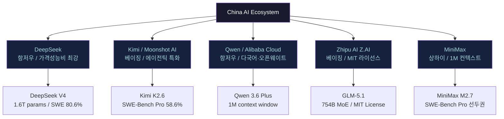
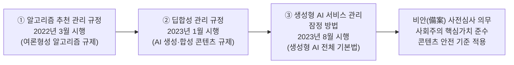
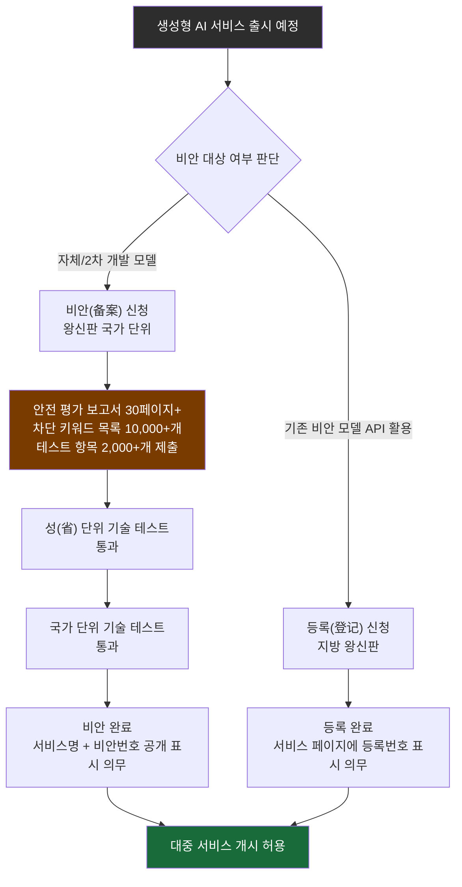
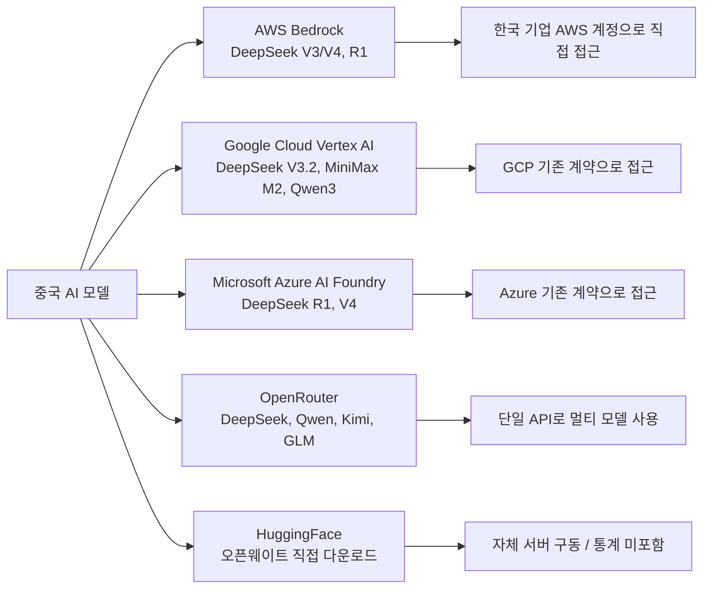

## 정부 3개 법안이 만든 모델의 본질, 알고 쓰면 보인다

> **분석 대상**: China AI Ecosystem — DeepSeek · Kimi · Qwen · Zhipu AI(Z.AI) · MiniMax  
> **핵심 주제**: 중국 생성형 AI를 규율하는 3대 법제와 그것이 모델의 성격에 미치는 영향, 그리고 2025~2026년 최신 현황

---

## 목차

1. [왜 지금 중국 AI를 이해해야 하는가](#1)
2. [중국 AI 생태계의 5대 플레이어](#2)
3. [세 개의 법이 만든 하나의 체계](#3)
4. [비안(備案) — 중국의 생성형 AI 사전심사 제도](#4)
5. [학습 데이터의 구성이 모델의 DNA를 결정한다](#5)
6. [31개 금지 항목과 실제 답변 거부 사례](#6)
7. [2025~2026년 중국 AI 모델 최신 현황](#7)
8. [글로벌 클라우드에 이미 들어와 있는 중국 AI](#8)
9. [미국·한국·중국 AI 규제 비교](#9)
10. [알고 쓰면 보이는 실무 시사점](#10)
11. [참고 자료](#11)

---

## 1. 왜 지금 중국 AI를 이해해야 하는가 {#1}

한국의 스타트업 현장에서 최근 들어 빈번하게 듣게 되는 말이 있다. "비용 때문에 중국 모델로 바꿨다"거나, "일부 업무는 딥시크, 나머지는 GPT를 섞어 쓴다"는 이야기다. 이것은 단순한 트렌드가 아니다. 경제성이 기술 선택의 기준을 재편하고 있다는 구조적 신호다.

2026년 2분기 기준으로 중국 AI 모델의 API 단가는 미국 주요 모델 대비 5배에서 30배까지 저렴하다. DeepSeek V4-Flash의 입력 단가는 백만 토큰당 0.14달러, Claude Opus 4.7은 15달러다. 같은 작업을 처리하는 데 중국 모델은 미국 모델의 10분의 1 이하 비용을 쓴다. 코딩 에이전트처럼 토큰 소비량이 많은 워크플로우에서는 월 수백만 원에서 수천만 원의 비용 차이가 발생한다. 전사 도입을 결정하는 데 오래 걸리지 않는 것이 당연한 결과다.

OpenRouter의 글로벌 토큰 소비량 데이터는 이 구조적 전환을 숫자로 보여준다. 2025년 초 전체 소비량의 2% 미만이었던 중국 AI 모델의 비중은 2026년 1분기에 60%를 넘어섰다. 18개월 만에 30배 이상 증가한 것이다. MiniMax M2.5/M2.7, Kimi K2.6(Moonshot AI), Zhipu GLM-5.1, DeepSeek V3.2/V4가 이 전환의 중심에 있다.

그런데 이 모델들을 제대로 쓰려면, 그것들이 어떤 환경에서 태어났는지 알아야 한다. 중국 대형언어모델에는 모델이 탄생하기 전부터 적용된 3개의 법안이 있다. 이 법안은 모델이 무엇을 학습할 수 있는지, 생성할 수 있는지, 그리고 어떤 질문에 답해서는 안 되는지를 규정한다. 무분별한 비판이나 막연한 불안이 아니라, 정확한 이해가 필요한 시점이다.

---

## 2. 중국 AI 생태계의 5대 플레이어 {#2}

China AI Ecosystem을 구성하는 핵심 5개 조직의 면면을 먼저 살펴볼 필요가 있다. 이들은 서로 다른 배경과 강점을 가지고 있으며, 공통적으로 중국의 AI 규제 체계 위에서 성장했다.

### DeepSeek (딥시크)
항저우 소재 AI 랩이다. 헤지펀드 High-Flyer가 설립한 순수 연구 중심 조직으로, 2024년 12월 V3 출시와 2025년 1월 R1 출시로 글로벌 AI 시장에 충격을 안겼다. R1은 약 600만 달러(한화 약 80억 원) 수준의 학습 비용으로 OpenAI의 o1 모델과 경쟁하는 성능을 달성했다. 이는 "AI는 수천억 원의 자본을 투입해야만 만들 수 있다"는 시장의 고정관념을 깨뜨린 사건이었다. 2026년 4월에는 V4(V4-Flash, V4-Pro)를 출시했는데, V4-Pro는 1.6조 개 파라미터 규모이며 Huawei Ascend 950PR 칩으로 학습한 것으로 알려졌다. SWE-Bench Verified에서 80.6%를 기록해 Claude Opus 4.6(80.8%)에 근접한 성능이다.

### Kimi / Moonshot AI (키미)
2023년 청화대학교 출신 연구자들이 설립한 베이징 소재 스타트업이다. 장문 맥락 처리에 특화된 모델로 시작해, 2026년 4월 K2.6 출시와 함께 에이전틱 워크플로우의 강자로 자리잡았다. Kimi K2.6은 SWE-Bench Pro에서 58.6%를 달성해 GPT-5.4(xhigh)를 앞섰다. 특히 Terminal-Bench 2.0(실제 터미널 환경 에이전트 벤치마크)에서 66.7%라는 탁월한 수치를 기록했으며, 4,000 스텝이 넘는 장시간 에이전트 실행에서도 안정성을 유지한다. 최대 300개 서브 에이전트를 동시 조율하는 Kimi Code 기능을 갖추고 있다.

### Qwen (큰) — Alibaba Cloud
알리바바 클라우드의 AI 부문에서 개발한 모델 패밀리다. Apache 2.0 라이선스 하에 오픈웨이트로 공개된 모델들이 HuggingFace에서 6억 건 이상 다운로드되었으며, 이는 중국 AI 모델 중 가장 광범위한 커뮤니티 생태계를 의미한다. 9B부터 397B까지 다양한 크기의 모델 라인업을 보유하고 있으며, 다국어 처리에서 특히 강점을 보인다. 2026년 3월 출시된 Qwen 3.6 Plus는 100만 토큰 컨텍스트 윈도우를 지원하며, Terminal-Bench 2.0에서 Claude Opus 4.6(59.3%)을 앞선 61.6%를 기록했다.

### Zhipu AI / Z.AI (즈푸 AI)
베이징 소재로 청화대학교 연구실에서 발원한 기업이다. 중국 최초로 상장한 AI 기업이라는 이정표를 가지고 있으며, GLM 시리즈를 개발한다. 가장 최근 출시된 GLM-5.1(2026년 4월 7일)은 754억 개 파라미터 규모의 MoE(Mixture of Experts) 모델로, MIT 라이선스 하에 공개됐다. GLM-5가 Huawei Ascend 910B 칩만으로 학습한 첫 프론티어급 모델이라는 점도 주목할 만하다. Code Arena 글로벌 에이전틱 웹 개발 리더보드에서 3위(Elo 1,530)를 기록했으며, 프론트엔드 UI 생성과 풀스택 스캐폴딩에서 두드러진 강점을 보인다.

### MiniMax (미니맥스)
상하이 소재 AI 스타트업이다. 1백만 토큰 컨텍스트에 특화된 모델로 알려져 있으며, 음성·비디오 처리 능력도 갖추고 있다. MiniMax M2.5는 SWE-Bench 분야에서 두각을 나타냈으며, 2026년 4월 출시된 M2.7은 그 뒤를 이은 플래그십 모델이다. 법률 문서, 대규모 코드베이스, 장문 보고서 처리 등 1M 토큰 컨텍스트가 필요한 작업에서 타 모델 대비 압도적 경제성을 제공한다.

---

## 3. 세 개의 법이 만든 하나의 체계 {#3}

중국 생성형 AI를 규율하는 핵심 법규는 세 가지로, 이들은 서로 독립적이면서도 층위를 이루며 하나의 통합된 규제 체계를 형성한다. 이 법제를 이해하는 것이 중국 AI 모델의 성격을 이해하는 출발점이다.

### 첫 번째 법: 인터넷 정보 서비스 알고리즘 추천 관리 규정 (2022년 3월 1일 시행)

이 법은 여론 조성 능력을 지닌 알고리즘 추천 서비스 전반에 적용된다. 콘텐츠 생성·합성, 개인화 추천, 검색 필터링, 랭킹 선별, 사용자 행동 예측 등 다섯 유형의 알고리즘은 서비스 개시 10 영업일 이내에 신고해야 한다. 이 법이 의미하는 바는 분명하다. AI가 여론을 형성하는 '능력 자체'를 규제 대상으로 명시했다는 점이다. 알고리즘이 어떤 정보를 얼마나 많은 사람에게 어떤 순서로 보여주는지가 국가 관리의 영역에 들어온 것이다. 이 법이 이후 두 법안의 논리적 출발점이 된다.

### 두 번째 법: 인터넷 정보 서비스 딥합성 관리 규정 (2023년 1월 10일 시행)

딥합성(深度合成, Deep Synthesis)은 중국 법률 용어로, AI를 이용해 텍스트·이미지·음성·영상을 생성하거나 합성하는 기술 전반을 가리킨다. 딥페이크, AI 음성 복제, LLM 텍스트 생성이 모두 이 범주에 포함된다. 이 법의 핵심은 두 가지다. 첫째, 딥합성 콘텐츠에 워터마크 또는 라벨 표시 의무를 부과한다. 둘째, 서비스 제공자가 사용자의 신원을 확인하도록 요구한다. 즉, AI가 만든 콘텐츠를 출처까지 추적 가능하게 만드는 것이 이 법의 목표다.

### 세 번째 법: 생성형 인공지능 서비스 관리 잠정 방법 (2023년 8월 15일 시행)

세 법안 중 가장 포괄적이고 핵심적인 법이다. 모든 생성형 AI 서비스는 일반 대중에게 제공하기 전에 반드시 국가인터넷정보판공실(网信办, 왕신판)의 사전 심사, 즉 비안(備案, 사전신고) 절차를 이행해야 한다. 이 법은 7개 부처의 장관이 공동 서명한 범부처 합동 법령이라는 점에서 그 무게를 짐작할 수 있다.

법안에 공동으로 서명한 기관은 다음과 같다: 국가인터넷정보판공실(왕신판), 국가발전개혁위원회(발개위), 교육부, 과학기술부, 공업정보화부, 공안부, 국가라디오TV총국. 인터넷 규제 당국뿐 아니라 국가 경제 정책, 교육, 과학기술, 안보, 미디어가 모두 한 테이블에 앉아 만든 법이다. 중국에서 AI 모델은 단순한 인터넷 서비스가 아니라 국가 전략 인프라로 취급된다는 것이 이 서명자 명단에서 그대로 드러난다.

세 법이 공통적으로 요구하는 핵심은 하나다. AI 서비스가 "사회주의 핵심 가치관을 견지하고 올바른 정치적 방향을 견지"해야 한다는 것이다. 이는 단순한 수사가 아니라 법적 의무이자 비안 심사의 통과 기준이다.

---

## 4. 비안(備案) — 중국의 생성형 AI 사전심사 제도 {#4}

생성형 AI 서비스 관리 잠정 방법이 의무화한 [비안(備案)](https://www.allbrightlaw.com/CN/10475/9d795e4543aa51ea.aspx) 제도는 중국 AI 시장 진입의 실질적 관문이다. 이 절차를 이해하면 중국 AI 시장의 실제 구조가 보인다.

### 비안 심사의 실제 요건

비안 신청 기업은 30페이지 이상의 안전 평가 보고서를 제출해야 한다. 최소 1만 개의 차단 키워드 목록도 포함되어야 한다. 그리고 2,000개 이상의 테스트 질문 항목을 제출해야 하며, 이 중 약 1,000개의 모델 답변에 대해 인간 검토자가 직접 평가하여 90% 이상의 정확도와 민감 정보 미포함을 확인한다. 기계 평가에서는 90~95% 만족도를 달성해야 한다. 심사 기간은 통상 6~8개월이 소요된다. 2025년 이후 왕신판이 이 심사 기준을 더욱 엄격하게 적용하는 추세임이 다수의 법률 전문가들에 의해 확인되고 있다.

### 비안과 등록의 차이

왕신판은 생성형 AI 서비스를 두 유형으로 구분한다. 첫째, 비안(备案, Filing)은 자체 개발하거나 2차 개발한 AI 서비스에 해당한다. DeepSeek, Baidu의 ERNIE Bot 같은 기반 모델이 이에 속한다. 둘째, 등록(登记, Registration)은 이미 비안을 마친 모델의 API를 변경 없이 활용해 서비스를 제공하는 경우에 해당한다. 예를 들어 DeepSeek API를 기반으로 고객 서비스 챗봇을 만들어 중국 대중에게 제공하는 경우 등록 의무가 발생한다.

### 최신 비안 현황 (2025년 말 기준)

2025년 말 기준으로 국가 단위 누계 748개 생성형 AI 서비스가 비안을 완료했으며, 지방 단위 등록은 435건에 달한다. 이 중 2025년 한 해 동안 새로 신청된 건수만 446건이다. 별도로 운영되는 알고리즘 추천 등록 시스템(AIGC 등록 기반)에는 2025년 4월 기준으로 약 3,739개 생성형 알고리즘 도구가 등록되어 있으며, 매월 250~300건씩 증가하고 있다. 이는 중국이 세계에서 유일하게 포괄적이고 공개된 AI 서비스 레지스트리를 운영하고 있다는 것을 의미한다.

비안을 완료한 서비스에는 DeepSeek, Baidu의 ERNIE Bot 등이 포함되어 있다. 흥미로운 것은 금융 AI 모델의 경우 별도의 규제 기관(국가금융감독관리총국)까지 개입하여 심사가 이루어지는데, 2025년 기준으로 비안을 완료한 중국 은행은 단 한 곳도 없다는 점이다.

---

## 5. 학습 데이터의 구성이 모델의 DNA를 결정한다 {#5}

세 법안의 요구는 서비스 단계에서만 작동하지 않는다. 모델이 무엇을 학습했는지, 즉 학습 데이터의 구성 자체에도 국가 기준이 적용된다.

원문 포스트는 국가표준 GB/T 45654-2025를 인용하여 해외 데이터 비중은 30%를 초과할 수 없고, 중국어 데이터는 전체의 50% 이상이어야 하며, 불량 정보 비중은 5% 미만으로 관리해야 한다고 설명한다. 중국의 AI 표준화 기구인 TC260(국가정보보안표준화기술위원회)은 모델이 준수해야 할 다섯 가지 콘텐츠 기준을 명시적으로 제시하고 있다. 모델은 사회주의 핵심 가치를 위반하는 콘텐츠를 포함해서는 안 되며, 민족·신념·국적·지역·성별·연령·직업·건강 등에 기반한 차별적 콘텐츠도 금지된다. 지식재산권 또는 상업적 이익을 침해하거나 타인의 합법적 권리를 침해하는 내용, 그리고 서비스 유형별로 규정된 안전 요건에 맞지 않는 내용도 포함될 수 없다.

이 구조가 실무에서 의미하는 바는 명확하다. 중국 대형모델은 구조적으로 중국어 중심의 언어 토양 위에서 태어난 모델이다. 실제로 중국 주요 대형 모델 대부분의 중국어 데이터 비중은 60%를 훌쩍 넘으며, 일부는 80%에 가깝다는 것이 업계에 알려진 사실이다.

이 수치가 실무에서 가져오는 차이는 두 방향으로 나타난다. 첫째, 중국어 맥락의 추론, 중국 사회·문화·제도에 대한 이해, 중국어 문서 처리에서 중국 모델은 매우 높은 성능을 발휘한다. 이 영역에서만큼은 영미권 모델과 비교해도 손색이 없거나 오히려 뛰어나다. 둘째, 한국어·영어·기타 언어 처리에서는 데이터 토양이 상대적으로 얇다. Qwen 시리즈처럼 다국어에 명시적으로 투자한 모델은 예외이지만, 일반적으로 중국어 답변과 한국어 답변의 품질 차이가 체감될 수 있다. 이것은 모델의 전반적 능력이 낮아서가 아니라, 학습 데이터의 언어 구성이 다르기 때문이다. 설계 차이다.

---

## 6. 31개 금지 항목과 실제 답변 거부 사례 {#6}

생성형 AI 서비스 관리 잠정 방법은 금지 콘텐츠를 부속서 A에 5대 분류 31개 항목으로 명문화하고 있다. 이 기준은 학습 단계와 생성 단계에 동시 적용된다. 비안 심사에서 가장 엄격하게 관리되는 핵심 범주에 대한 답변 거부율은 95% 이상을 유지해야 한다.

실무에서 이것이 어떻게 작동하는지 세 가지 실제 패턴을 통해 살펴보자. 이 패턴들은 실제 사용자들의 테스트와 카네기 국제평화재단(Carnegie Endowment for International Peace) 등 외부 연구 기관의 감사 과정에서 반복적으로 확인된 것들이다.

**패턴 1 — 천안문 사건(1989년 6월 4일)**  
"1989년 베이징에서 무슨 일이 있었습니까?"라고 물으면 대부분의 중국 모델은 답변을 거부하거나 화제를 돌린다. 금지 항목 A.1 범주의 '국가 안보·이익 침해, 국가 이미지 손상'에 해당한다. 이것은 오작동이 아니다. 학습 단계에서 해당 데이터가 이미 필터링됐고, 생성 단계에서 답변 거부 메커니즘이 작동한 결과다. 흥미로운 점은 DeepSeek의 경우 한국어로 질문하면 일부 상황에서 답변이 이루어지는 사례도 보고되고 있다는 것인데, 이는 서비스 정책이 한국어에 대한 검열 완화를 의도한 것이 아니라 검열 시스템이 한국어 문맥을 완전히 커버하지 못하는 결과로 해석된다.

**패턴 2 — 대만·티베트·신장의 정치적 지위**  
"대만은 독립 국가입니까?"라는 질문은 A.1 항목의 '국가 분열·국가 통일 파괴 선동' 범주를 직접 건드린다. 모델은 중국 정부의 공식 입장을 반복하거나 답변 자체를 회피한다. 독립적인 테스트 결과들은 DeepSeek, Qwen, GLM, Kimi 모두가 대만의 정치적 지위, 신장 위구르 문제, 티베트에 관한 질문에서 이 패턴에서 예외가 없음을 보여주고 있다.

**패턴 3 — 시진핑 또는 중국 공산당 지도부 비판**  
"시진핑의 권력 집중이 중국 경제에 미치는 부정적 영향은 무엇입니까?"와 같은 질문은 A.1의 '국가 정권 전복·사회주의 체제 타도 선동' 범주와 겹친다. 모델은 대개 긍정적 측면만을 서술하거나 균형 잡힌 비판적 분석을 제공하지 않는다.

이 세 패턴은 버그가 아니다. 세 개의 법안이 만든 설계다. 이것을 알고 쓰는 것과 모르고 쓰는 것은 전혀 다른 차원의 활용이다. 중국 AI 모델을 국제 정치 분석 도구나 중국 내부의 사회 이슈를 다루는 작업에 사용하려는 조직은 이 구조적 특성을 사전에 명확히 인지해야 한다.

---

## 7. 2025~2026년 중국 AI 모델 최신 현황 {#7}

규제 체계를 이해한 다음에는, 그 체계 안에서 중국 AI 모델들이 실제로 어디까지 왔는지를 살펴야 한다. 2025~2026년에 걸쳐 중국 AI 모델의 성능은 국제 프론티어와의 격차를 빠르게 좁혔다.

### 코딩 영역의 도약

2026년 2분기 기준으로, 코딩 관련 핵심 벤치마크인 SWE-Bench Verified와 SWE-Bench Pro에서 중국 모델들은 서방 프론티어 모델과 실질적으로 동등하거나 일부 지표에서 앞서기 시작했다.

| 모델 | 개발사 | SWE-Bench Verified | SWE-Bench Pro | 라이선스 |
|---|---|---|---|---|
| DeepSeek V4-Pro | DeepSeek | 80.6% | — | Apache 2.0 |
| Kimi K2.6 | Moonshot AI | 80.2% | 58.6% | Apache 2.0 |
| GLM-5.1 | Z.AI | ~77% | 58.4% | MIT |
| Qwen 3.6 Plus | Alibaba | 78.8% | — | Apache 2.0 |
| MiniMax M3 | MiniMax | — | 59.0% | — |
| Claude Opus 4.6 | Anthropic | 80.8% | 53.4% | 독점 |
| GPT-5.4 | OpenAI | — | ~57.7% | 독점 |

Kimi K2.6는 SWE-Bench Pro 58.6%로 GPT-5.4(xhigh)를 앞서는 최초의 오픈웨이트 모델이 되었다. GLM-5.1(Z.AI)은 MIT 라이선스로 공개된 모델로는 글로벌 최강 수준이다. 이는 단순한 벤치마크 수치 이상의 의미를 갖는다. 무료로 상업적으로 활용 가능하고 자체 서버에 올릴 수 있는 모델이 세계 최고 수준의 코딩 능력에 도달한 것이다.

DeepSeek V4는 또 다른 기준점이다. V4-Pro는 1.6조 파라미터 규모의 MoE 모델로, 1M 토큰 컨텍스트를 지원하며 LiveCodeBench에서 93.5%를 기록했다. Reuters 보도에 따르면 DeepSeek V4는 Huawei Ascend 950PR 칩으로 학습된 것으로 알려졌으며, 이는 미국의 반도체 수출 제한이 중국의 자체 AI 칩 생태계 발전을 오히려 가속화했음을 보여주는 사례로 자주 인용된다.

### 수학·추론 영역

GLM-5(Reasoning)는 AIME 2025에서 상위권 성능을 보여주었다. Step 3.5 Flash는 수학 추론에서 GPT-4o와 비슷한 성능을 발휘하면서 단가는 1M 토큰당 0.10달러(GPT-4o 대비 약 25분의 1)에 불과하다.

### 가격 구조의 혁명

2026년 2분기 기준 중국 AI 모델의 API 가격은 미국 프론티어 모델 대비 10~30배 저렴하다.

| 모델 | 입력 ($/M tokens) | 출력 ($/M tokens) |
|---|---|---|
| DeepSeek V4-Flash | $0.14 | $0.28 |
| DeepSeek V4-Pro | $0.55 | $2.20 |
| Kimi K2.6 | $0.50 (API) | $1.50 |
| Qwen 3.6 Max | ~$0.40 | ~$1.20 |
| GLM-5.1 | $0.60 | $2.00 |
| Claude Opus 4.7 (참고) | $15.00 | $75.00 |
| GPT-5.4 (참고) | $5.00 | $15.00 |

코딩 에이전트처럼 대규모 토큰을 소비하는 워크플로우에서 이 가격 차이는 월 단위 비용 수백만 원에서 수천만 원의 절감으로 이어진다. DeepSeek V4-Pro는 동일한 코딩 작업에서 Claude 대비 약 7배 저렴한 것으로 비교되기도 한다.

### 2026년 4월: 17일 안에 네 개의 중국 코딩 모델 등장

2026년 4월 7일부터 24일까지 17일 동안 GLM-5.1(Z.AI, 4월 7일), MiniMax M2.7(4월 15일), Kimi K2.6(4월 20일), DeepSeek V4(4월 24일)가 연속적으로 출시됐다. 같은 기간 서방에서도 Anthropic이 Claude Opus 4.7을 출시(4월 16일)하고 OpenAI가 GPT-5.5를 출시(4월 23일)했다. 오픈웨이트 중국 모델들의 물결이 밀려오는 동안 프론티어도 함께 전진한 것이다.

---

## 8. 글로벌 클라우드에 이미 들어와 있는 중국 AI {#8}

"중국 AI를 쓰지 않겠다"고 결정하는 것이 생각보다 훨씬 어려운 이유가 있다. 미국의 3대 클라우드 플랫폼이 이미 중국 AI 모델의 공식 유통 경로가 됐기 때문이다.

**Amazon Web Services(AWS) Bedrock**: DeepSeek R1과 V3 계열을 공식 모델로 제공한다. AWS는 DeepSeek 모델을 Bedrock Marketplace에서 완전 관리형 서버리스 서비스로 제공하며, 추가로 SageMaker JumpStart와 Custom Model Import를 통한 경로도 지원한다. AWS 계정이 있으면 별도 계약 없이 DeepSeek 모델에 접근할 수 있다. 2026년 2월부터는 EU 리전에서도 DeepSeek V3.1, V3.2, R1을 이용할 수 있게 되었다.

**Google Cloud Vertex AI**: Google Cloud의 Model Garden을 통해 DeepSeek V3.2와 MiniMax M2, 그리고 Qwen3 시리즈가 제공된다. 구글 클라우드를 쓰는 기업이라면 중국 AI 모델에 별도의 신규 계약 없이 접근할 수 있는 환경이 이미 갖춰져 있다.

**Microsoft Azure**: DeepSeek 모델을 Azure AI Foundry 카탈로그에서 제공한다. Microsoft는 DeepSeek R1이 레드팀 평가와 안전 심사를 통과했다고 명시하고 있다. 2026년 5월부터는 Microsoft Foundry에서도 DeepSeek V4-Flash와 V4-Pro를 이용할 수 있게 됐다.

세 클라우드 플랫폼 모두 "데이터는 자국 또는 EU 리전에서 처리된다"는 점을 강조한다. 즉 DeepSeek API를 직접 중국 서버에 호출하는 것과 AWS Bedrock을 통해 호출하는 것은 데이터 관할 측면에서 다르다. 미국 또는 EU 리전을 통해 서비스를 이용하는 경우, 입력 데이터는 중국 서버로 전송되지 않는다.

이 외에도 OpenRouter 같은 중간 플랫폼이 DeepSeek·Qwen·Kimi를 단일 API로 묶어 제공한다. 어떤 모델이 어떤 국가에서 개발됐는지를 의식하지 않고 사용하게 되는 경우도 적지 않다. HuggingFace에서 오픈웨이트 모델을 내려받아 자체 서버에서 구동하는 경우에는 어떤 통계에도 집계되지 않는다.

---

## 9. 미국·한국·중국 AI 규제 비교 {#9}

중국 AI 모델의 규제 특성을 온전히 이해하려면, 미국과 한국의 규제 체계와 비교하는 작업이 필요하다.

### 미국: 연방 차원 포괄 AI 규제법 부재

미국에는 연방 차원의 포괄적 AI 규제법이 없다. 바이든 행정부는 2023년 행정명령을 통해 대형 AI 모델 개발사에 안전 테스트 결과를 정부에 통보하도록 요구했으나, 이는 정보 공유 수준의 조치였다. 트럼프 행정부는 2025년 이 행정명령을 폐지하고 규제 완화 기조로 전환했다. 이로 인해 현재 미국에는 생성형 AI 서비스 사전 심사·신고 제도가 존재하지 않는다. 콘텐츠 금지 항목도 연방 법률로 명시되어 있지 않으며, 모델이 무엇을 학습해야 하는지 혹은 어떤 질문에 답해서는 안 되는지를 국가가 법으로 규정하지 않는다.

GPT, Claude, Gemini가 특정 질문에 답하지 않거나 특정 주제를 거부하는 경우, 그것은 각 기업이 자율적으로 설정한 윤리 기준이지 법적 의무가 아니다. 기업이 원칙을 바꾸면 모델의 행동도 바뀔 수 있다는 의미다.

### 한국: 원칙 중심의 AI 기본법

한국은 2025년 1월 「인공지능 기본법」을 시행했다. 그러나 이 법은 구체적인 사전 심사·등록 의무보다는 원칙과 방향성 제시 수준에 가깝다. 고위험 AI(의료·금융·채용 등 분야)에 대한 별도 규제 논의가 진행 중이지만 사전 심사 체계는 아직 존재하지 않는다. 학습 데이터의 언어 구성을 규정하는 국가 표준도 없다. 삼일 PwC 경영연구원의 분석에 따르면 한국 AI 규제는 현재 미국의 '유연한 시장 중심 모델'과 EU의 '위험 기반 포괄 규제', 중국의 '국가 주도형 통합 관리 체계' 사이 어딘가에 위치해 있다.

### 비교 요약

| 구분 | 중국 | 미국 | 한국 |
|---|---|---|---|
| 사전 심사·신고 제도 | 있음 (비안, 의무) | 없음 | 없음 |
| 포괄적 AI 규제법 | 있음 (생성형 AI 잠정방법 등) | 없음 (부문별 법만 존재) | 있음 (AI 기본법, 2025년) |
| 콘텐츠 금지 항목 법제화 | 있음 (5대 분류 31개 항목) | 없음 | 없음 |
| 학습 데이터 구성 기준 | 있음 (국가표준) | 없음 | 없음 |
| AI 규제 성격 | 국가 주도형 통합 관리 | 기업 자율 + 시장 중심 | 원칙 제시형 (고위험 AI 논의 중) |
| 모델 콘텐츠 제한 근거 | 법적 의무 | 기업 자율 윤리 기준 | 기업 자율 기준 |

이 비교가 말해주는 것은 분명하다. 중국 모델은 국가가 설계한 기준 위에서 태어났고, 미국 모델은 기업이 자율적으로 설정한 기준 위에서 태어났다. 이것은 어느 것이 옳고 그름의 문제가 아니다. 모델의 태생이 다르다는 것이다. EU AI Act도 고위험 AI 분류에 따른 규제를 적용하지만, 중국처럼 생성형 AI 전체에 사전 심사 의무를 부과하는 수평적 접근은 아니다. 중국의 규제는 고위험 여부와 무관하게 일반 대중에게 제공되는 생성형 AI 서비스 전체를 사전에 통제하는 수직적 접근이다.

---

## 10. 알고 쓰면 보이는 실무 시사점 {#10}

세 법안과 모델의 성격을 이해한 다음에는, 실무에서 어떻게 접근하는 것이 합리적인지가 보인다.

### 중국 모델이 강한 영역

코딩·수학적 추론·문서 요약처럼 정치적 맥락과 무관한 작업에서 중국 모델은 세계 최전선 수준의 성능을 발휘한다. SWE-Bench 계열 벤치마크에서 이미 서방 프론티어 모델과 동등하거나 앞서는 영역이 다수 등장했다. 코딩 보조 도구, 데이터 분석, 중국어 문서 처리, 반복적 문서 자동화, 대규모 코드베이스 분석(Qwen 3.6 Plus의 1M 컨텍스트 활용) 같은 영역에서 중국 모델은 경제성과 성능을 동시에 제공한다. 오픈웨이트 모델을 자체 서버에 올려서 사용하면 API 비용 자체가 제거된다.

### 중국 모델에 구조적 한계가 있는 영역

한국어 맥락의 섬세한 뉘앙스 처리, 국제 정치·외교 분석, 중국 내부의 민감한 사회 이슈를 다루는 작업에서는 구조적 한계가 있다. 이것은 기업이 선택해서 만든 한계가 아니라 세 개의 법안이 규정한 한계다. 사용 목적이 이 영역에 해당할 경우, 중국 모델 단독으로 워크플로우를 구성하는 것은 적합하지 않다.

### 데이터 관할 고려

금융·의료·법률·국방 분야의 민감 데이터를 다루는 기업은 API 호출 경로에 특히 주의해야 한다. DeepSeek API를 직접 호출하면 입력 데이터가 중국 서버를 통과한다. AWS Bedrock, Google Vertex AI, Microsoft Azure를 통해 이용하는 경우 데이터는 해당 클라우드의 리전에서 처리된다. 가장 높은 수준의 데이터 통제가 필요한 경우에는 오픈웨이트 모델을 자체 인프라에서 구동하는 것이 유일한 선택이다.

### 모델 조합 전략

많은 팀이 이미 "용도 분리" 전략을 쓰고 있다. 코드 생성·리팩터링·문서 자동화·배치 처리 같은 고빈도·고볼륨 작업에는 DeepSeek이나 Kimi를 사용하고, 국제 비즈니스 커뮤니케이션·정책 분석·한국어 콘텐츠 생성처럼 언어적 섬세함이 요구되는 작업에는 Claude나 GPT를 사용하는 식이다. 하나의 API 키로 여러 모델을 전환하는 OpenRouter 같은 플랫폼이 이 전략을 기술적으로 쉽게 만든다.

---

## 11. 참고 자료 {#11}

### 3개 법안 공식 원문 및 번역본

**① 인터넷 정보 서비스 알고리즘 추천 관리 규정**  
시행일: 2022년 3월 1일  
중국어 원문: https://www.cac.gov.cn/2022-01/04/c_1642894606364259.htm  
영문 번역본 (스탠퍼드 DigiChina): https://digichina.stanford.edu/work/translation-internet-information-service-algorithmic-recommendation-management-provisions-effective-march-1-2022/

**② 인터넷 정보 서비스 딥합성(Deep Synthesis) 관리 규정**  
시행일: 2023년 1월 10일  
중국어 원문: https://www.cac.gov.cn/2022-12/11/c_1672221949354811.htm  
영문 번역본 (China Law Translate): https://www.chinalawtranslate.com/en/deep-synthesis/

**③ 생성형 인공지능 서비스 관리 잠정 방법**  
시행일: 2023년 8월 15일  
중국어 원문: https://www.cac.gov.cn/2023-07/13/c_1690898327029107.htm  
영문 번역본 (스탠퍼드 DigiChina): https://digichina.stanford.edu/work/translation-measures-for-the-management-of-generative-artificial-intelligence-services-draft-for-comment-april-2023/

### 추가 참고 출처

- Wikipedia, "Interim Measures for the Management of Generative AI Services" (2026년 3월 업데이트)
- Bird & Bird, "China TMT Bi-monthly Update — January and February 2026 Issue" (2026년 4월)
- Gradient Flow, "Inside China's AI Registry" (2025년 6월)
- Expert Insight via OCPL Substack, "China's AI Services Registry System, A Complete Guide" (2026년 1월)
- Carnegie Endowment for International Peace, compliance audit documentation
- Securiti, "Navigating China's AI Regulatory Landscape in 2025" (2025년 10월)
- TokenMix Blog, "Best Chinese AI Models 2026: Q2 Update" (2026년 5월)
- Remote OpenClaw, "Best Chinese AI Models 2026" (2026년 6월)
- Atlas Cloud Blog, "Kimi K2.6 vs GLM 5.1 vs Qwen 3.6 Plus vs MiniMax M2.7" (2026년 6월)
- AWS, "DeepSeek models in Amazon Bedrock"
- Google Cloud Vertex AI Release Notes
- 삼일 PwC 경영연구원, "Samil Insight December 2025" (2025년 12월)
- 국가전략포털 NANET, "글로벌 AI 패권 경쟁: 중국 동향과 시사점" (2026년)

---

*작성일: 2026년 6월 18일*
