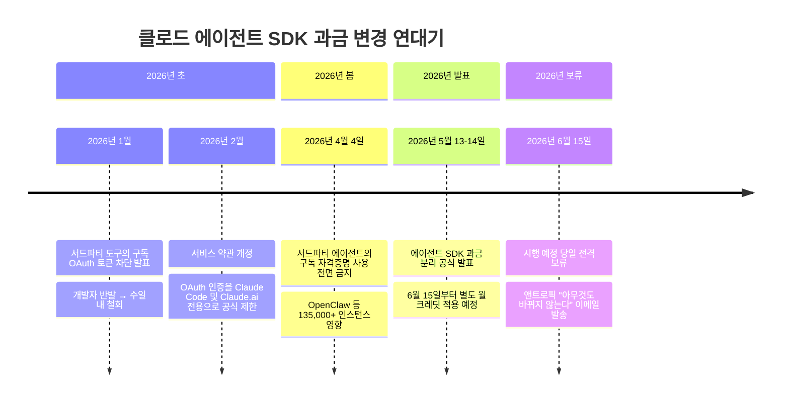
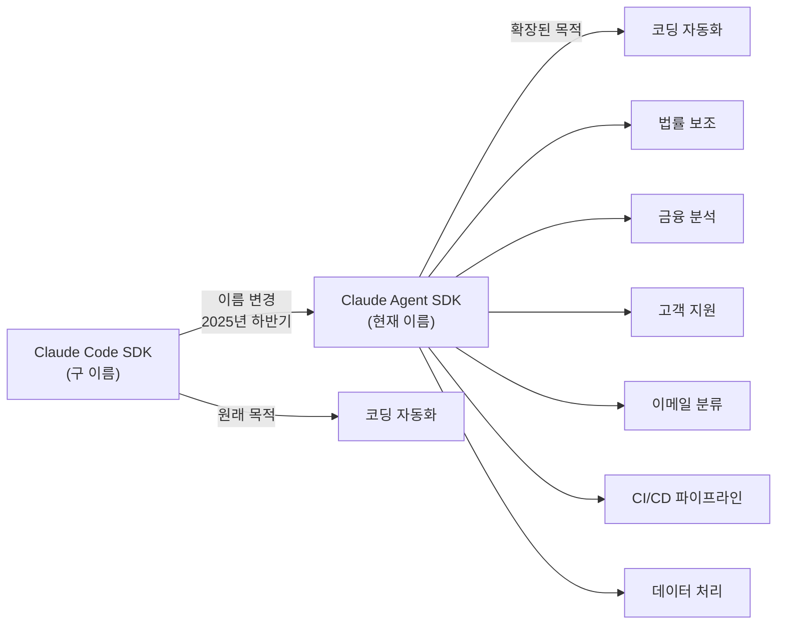
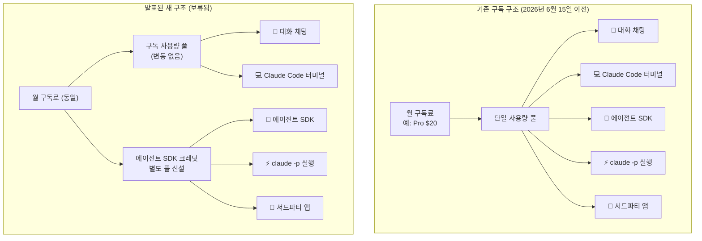
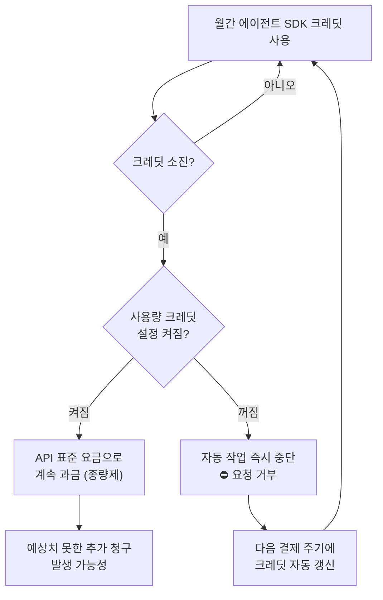
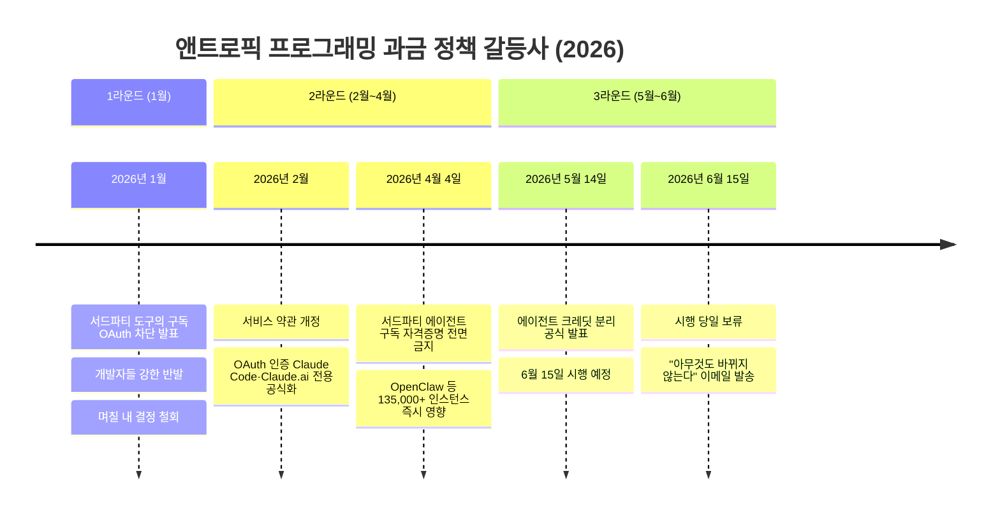
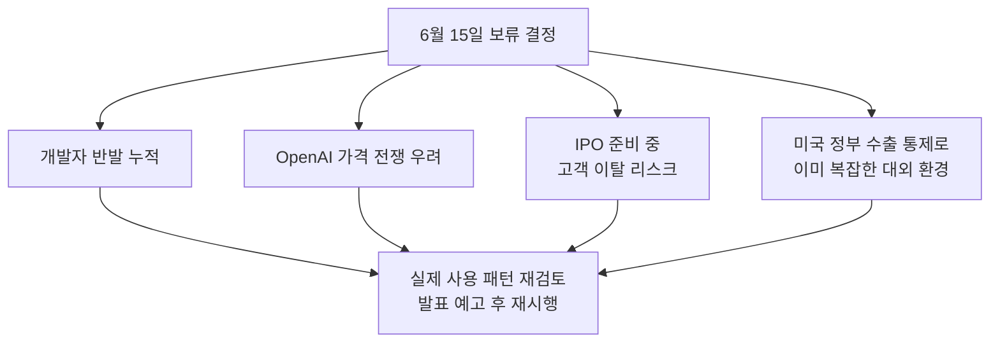
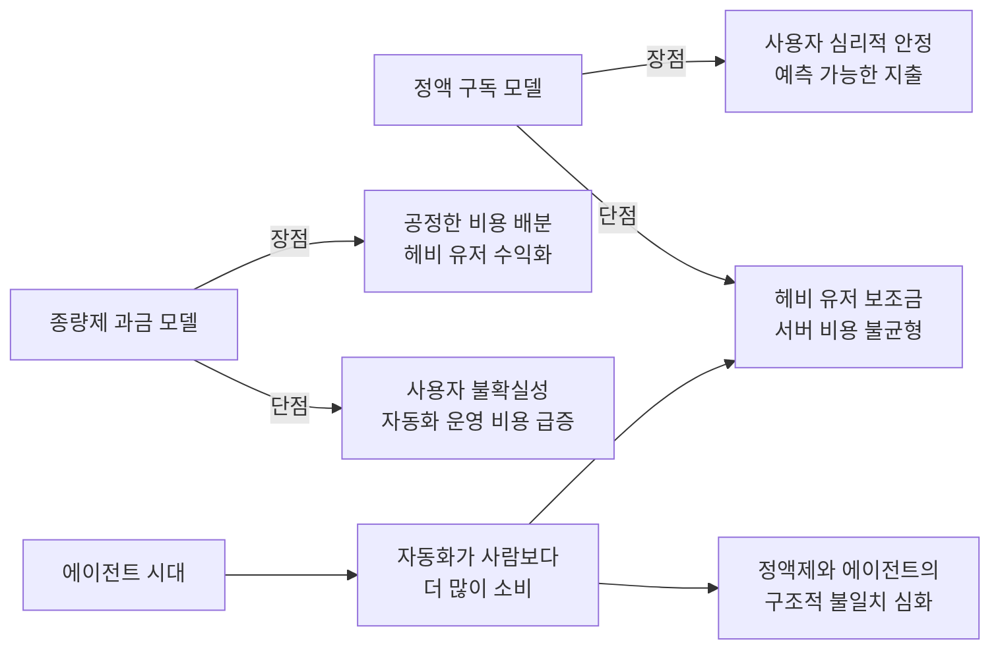

> **⚡ 핵심 업데이트 (2026년 6월 17일 현재)**  
> 앤트로픽은 2026년 5월 13일 에이전트 SDK 과금 분리를 발표했지만, 시행 예정일인 **6월 15일 당일** 전격 보류했습니다. 현재 아무것도 바뀌지 않았으며, 에이전트 SDK 사용분은 여전히 기존 구독 한도에서 차감됩니다. 이 문서는 발표된 변경안의 전체 내용과 보류의 배경을 함께 다룹니다.

## 관련글

[**6월 15일부터 클로드 과금 방식이 바뀝니다**](https://brunch.co.kr/@sungdairi/107)

---

## 목차

1. [사건의 흐름 한눈에 보기](#1-사건의-흐름-한눈에-보기)
2. [배경: 이름부터 바뀌었다](#2-배경-이름부터-바뀌었다)
3. [무엇이 달라질 뻔했나: 과금 이중 분리](#3-무엇이-달라질-뻔했나-과금-이중-분리)
4. [어떤 사용이 어디로 가는가](#4-어떤-사용이-어디로-가는가)
5. [플랜별 에이전트 크레딧 금액](#5-플랜별-에이전트-크레딧-금액)
6. [크레딧이 바닥나면 어떻게 되나](#6-크레딧이-바닥나면-어떻게-되나)
7. [20달러가 얼마나 버티는가: 경제성 분석](#7-20달러가-얼마나-버티는가-경제성-분석)
8. [역사는 반복된다: 앤트로픽의 과금 갈등 연대기](#8-역사는-반복된다-앤트로픽의-과금-갈등-연대기)
9. [왜 6월 15일 당일 보류했나: 복합적 배경](#9-왜-6월-15일-당일-보류했나-복합적-배경)
10. [현재 상태 및 지금 해야 할 일](#10-현재-상태-및-지금-해야-할-일)
11. [더 큰 그림: 정액제에서 종량제로 가는 AI 과금의 미래](#11-더-큰-그림-정액제에서-종량제로-가는-ai-과금의-미래)

---

## 1. 사건의 흐름 한눈에 보기

이 문서를 이해하는 데 가장 중요한 것은 사건의 순서입니다. 단순히 "과금 방식이 바뀌었다"가 아니라, 바뀌겠다고 발표했다가 시행 당일 뒤집은 이야기이기 때문입니다.

이 타임라인이 보여주는 것은 단순한 정책 번복이 아닙니다. 앤트로픽이 2026년 내내 같은 구조적 문제를 세 가지 방식으로 해결하려 시도했고, 매번 개발자 커뮤니티의 저항에 부딪혀 수정하거나 철회해온 패턴입니다.

---

## 2. 배경: 이름부터 바뀌었다

### Claude Code SDK에서 Claude Agent SDK로

이번 과금 논란을 이해하려면, 그 전에 이름 하나가 바뀐 사실을 알아야 합니다. 2025년 하반기, 앤트로픽은 개발자들이 클로드를 자신의 프로그램 안에서 자동으로 실행할 수 있게 해주는 라이브러리의 이름을 **Claude Code SDK**에서 **Claude Agent SDK**로 변경했습니다.

앤트로픽은 공식 엔지니어링 블로그를 통해 이 변경의 이유를 직접 밝혔습니다: "클로드 코드를 구동하는 에이전트 하니스(the agent harness)는 다른 여러 종류의 에이전트에도 사용될 수 있습니다. 이 더 넓은 비전을 반영하기 위해 Claude Code SDK를 Claude Agent SDK로 이름을 변경합니다."

이름 변경의 의미는 단순히 브랜딩의 문제가 아닙니다. 원래 이 SDK는 클로드 코드(Claude Code)라는 코딩 보조 도구를 자동으로 실행하기 위해 만들어진 것이었습니다. 그런데 개발자들이 이 동일한 엔진으로 코딩 이외의 훨씬 다양한 자동화를 구현하고 있다는 사실이 드러났습니다. 이메일 분류, 정해진 시각의 보고서 생성, 외부 서비스 연동, 법률 보조 에이전트, 금융 분석 에이전트, 고객 지원 자동화에 이르기까지 응용 범위가 폭발적으로 확장된 것입니다.

앤트로픽의 공식 마이그레이션 가이드는 다음과 같이 설명합니다: "이 변경은 SDK의 코딩 작업을 넘어선 더 넓은 AI 에이전트 구축 능력을 반영합니다." 실제로 새 이름 아래에서 SDK는 비즈니스 에이전트, 특화된 코딩 에이전트, MCP 연동을 활용한 모든 도메인의 커스텀 에이전트를 아우르게 됩니다.

### 이름 변경에 따른 기술적 변화

이름 변경은 단순한 브랜딩 교체가 아니라 패키지 이름과 타입 이름의 실질적 변경을 수반했습니다.

Python SDK에서는 타입 이름 `ClaudeCodeOptions`가 `ClaudeAgentOptions`로 변경되었습니다. TypeScript 사용자는 패키지를 `@anthropic-ai/claude-code`에서 `@anthropic-ai/claude-agent-sdk`로 교체해야 합니다. 이미 이 SDK로 무언가를 만든 개발자라면 패키지 이름과 임포트 경로를 업데이트해야 합니다.

---

## 3. 무엇이 달라질 뻔했나: 과금 이중 분리

이름 변경 이후 곧바로 뒤따른 것이 과금 방식 변경 발표였습니다. 앤트로픽은 2026년 5월 14일, 클로드 에이전트 SDK와 `claude -p`(헤드리스 실행) 사용이 Pro, Max, Team, Enterprise 구독 풀에서 분리되어, 이월 없이 표준 API 요금으로 청구되는 별도의 월간 달러 크레딧으로 이동할 것이라고 공식 발표했습니다.

변경의 핵심 논리는 두 가지 사용 형태의 본질적 차이에 있습니다.

첫 번째는 **사람이 직접 화면 앞에 앉아서 클로드와 주고받는 사용**입니다. 질문을 입력하고, 답변을 읽고, 다음 질문을 던지는 방식입니다. 인간의 속도에 맞춰 작동하기 때문에 하루에 보낼 수 있는 메시지 수가 자연스럽게 제한됩니다.

두 번째는 **프로그램이 사람 없이 자동으로 클로드를 호출하는 사용**입니다. 이것이 바로 에이전트 SDK를 통한 사용입니다. 사람이 자리를 떠나 있는 동안에도, 심지어 자는 동안에도 클로드를 수백, 수천 번 호출할 수 있습니다.

이 구조적 차이를 수치로 표현하면, 인간 사용자는 하루에 수십 개의 프롬프트를 보내지만, 자율적인 코딩 에이전트는 수천 개의 요청을 생성하고, 지속적인 테스트를 실행하며, 재귀적으로 모델을 호출할 수 있습니다. 월 20달러짜리 Pro 플랜에서 헤비한 에이전트 SDK 사용자들은 사실상 API 환산 기준으로 300~600달러 상당의 컴퓨팅 자원을 사용하고 있었습니다. 이는 구독 풀이 감당하도록 설계된 것이 아닌 15~30배의 보조금 효과였습니다.

---

## 4. 어떤 사용이 어디로 가는가

발표된 방안에서 핵심은 "어느 사용이 구독에서 계산되고, 어느 사용이 새 크레딧에서 계산되는가"입니다. 기준선은 의외로 단순합니다. **사람이 직접 화면을 보며 사용하는지, 아니면 프로그램이 자동으로 실행하는지**입니다.

### 구독 사용량 풀에 남는 사용 (변동 없음)

| 사용 방식 | 설명 |
|-----------|------|
| 웹·데스크톱·모바일 채팅 | claude.ai에서 직접 대화하는 모든 사용 |
| 터미널에서 직접 켜는 클로드 코드 | 내가 옆에서 지켜보며 대화하는 인터랙티브 모드 |
| IDE에서의 인터랙티브 클로드 코드 | VS Code, Cursor 등에서 직접 사용하는 경우 |
| 클로드 Cowork | 앤트로픽 공식 협업 도구 |

앤트로픽의 공식 도움말은 이를 명확히 합니다: "구독 사용량 한도는 이 업데이트의 일부로 변경되지 않습니다. 인터랙티브 Claude Code는 터미널 또는 IDE에서 Claude Code를 사용하는 것이 예전과 정확히 동일하게 구독 사용량 한도를 사용합니다."

### 에이전트 SDK 크레딧에서 차감될 사용 (새로 신설, 현재 보류)

| 사용 방식 | 설명 |
|-----------|------|
| 에이전트 SDK로 만든 프로그램 | Python/TypeScript로 직접 개발한 자동화 에이전트 |
| 자동 실행 모드 (`claude -p`) | 비대화형(헤드리스) 방식으로 실행되는 경우 |
| GitHub Actions 연동 | CI/CD 파이프라인에서 클로드를 호출하는 워크플로우 |
| 내 구독으로 로그인한 외부 앱 | 클로드 계정을 인증 수단으로 사용하는 서드파티 서비스 |

> **💡 판단 기준 한 문장으로**  
> "지금 내가 화면을 보며 답을 기다리고 있는가?" → 구독  
> "켜두고 자리를 떠나도 알아서 돌아가는가?" → (보류 중이지만) 새 크레딧

### 비개발자도 영향을 받을 수 있다

흔히 이 변경이 개발자에게만 해당한다고 생각하기 쉽습니다. 그러나 실제로는 코드를 한 줄도 작성하지 않는 일반 사용자도 영향을 받을 수 있습니다. 요즘은 클로드 계정으로 로그인하여 쓰는 외부 도구가 많기 때문입니다. 자동으로 회의록을 노션에 요약해주는 서비스, 매일 받은 메일을 분류해 답장 초안을 만들어주는 도구, 정해진 시간에 글감이나 리포트를 생성해주는 자동화 루틴이 모두 여기 해당할 수 있습니다. 이러한 서비스들이 뒤에서 클로드 에이전트 SDK를 통해 작동한다면, 변경이 시행될 경우 새 크레딧에서 차감될 예정이었습니다.

---

## 5. 플랜별 에이전트 크레딧 금액

발표된 안에서, 각 플랜에 매달 자동으로 채워질 에이전트 SDK 크레딧 금액은 다음과 같습니다.

| 구독 플랜 | 월 크레딧 |
|-----------|-----------|
| Pro | $20 |
| Max 5배 | $100 |
| Max 20배 | $200 |
| Team 표준 좌석 | ~$20 |
| Team 프리미엄 좌석 | ~$100 |
| Enterprise 표준 좌석 | **$0 (대상 제외)** |
| Enterprise 프리미엄 좌석 | 계약에 따라 협의 |

앤트로픽의 공식 도움말은 팀 및 엔터프라이즈 계정 관리자를 위한 중요한 단서를 명시하고 있습니다: "크레딧은 사용자당 지급됩니다. 팀의 각 적격 사용자는 자신의 크레딧을 별도로 청구합니다. 크레딧은 조직 전체에 걸쳐 공동 출자, 이전, 공유될 수 없습니다."

이것은 팀 환경에서 매우 중요한 함의를 가집니다. 사용량이 적은 팀원의 크레딧을 사용량이 많은 팀원에게 넘길 수 없습니다. 또 이번 달에 쓰지 않고 남긴 크레딧은 다음 달로 이월되지 않습니다. 매달 결제 주기마다 새로 채워지고, 남은 것은 사라지는 방식입니다.

특히 눈에 띄는 것은 엔터프라이즈 표준 좌석은 에이전트 SDK 월간 크레딧 신청 자격이 없다는 점입니다. 대규모 엔터프라이즈 환경에서 자동화를 본격적으로 운영하는 팀은 클로드 플랫폼 API 키를 통한 종량제 과금으로 전환해야 할 수 있다는 신호였습니다.

---

## 6. 크레딧이 바닥나면 어떻게 되나

크레딧 소진 후 동작 방식은 미리 설정한 옵션에 따라 두 가지로 갈립니다.

크레딧 소진 후의 동작을 앤트로픽은 다음과 같이 명확히 설명했습니다: "월간 크레딧을 다 쓰면, 추가 에이전트 SDK 사용이 표준 API 요금으로 사용량 크레딧에서 차감됩니다. 단, 사용량 크레딧을 활성화한 경우에 한합니다. 사용량 크레딧이 활성화되어 있지 않다면, 에이전트 SDK 요청은 크레딧이 갱신될 때까지 중단됩니다."

이 설정을 '사용량 크레딧(Usage Credits)'이라고 부르며, 이것을 켜두는지 꺼두는지에 따라 전혀 다른 결과가 나타납니다.

**사용량 크레딧을 꺼두는 경우:** 크레딧이 바닥나는 즉시 자동 작업이 멈춥니다. 추가 요금은 발생하지 않지만, 매일 돌아야 할 작업이 조용히 멈출 수 있습니다. 특히 문제는 이 중단이 즉각적인 알림 없이 발생할 수 있어, 한참 뒤에야 알아차리게 되는 경우입니다. 멈춰도 크게 상관없는 보조적인 자동화라면 이 선택이 안전합니다.

**사용량 크레딧을 켜두는 경우:** 크레딧이 소진된 이후에도 자동 작업이 계속 실행됩니다. 대신 초과 사용분이 표준 API 요금으로 청구됩니다. 절대 멈춰선 안 되는 핵심 업무 자동화라면 이 선택이 적합하지만, 예상치 못한 추가 비용이 발생할 수 있으므로 사용량 모니터링이 필수입니다.

---

## 7. 20달러가 얼마나 버티는가: 경제성 분석

Pro 플랜의 월 20달러 크레딧이 실제로 어느 정도 사용량을 감당할 수 있는지는 작업의 성격에 따라 크게 달라집니다.

### 크레딧 소모 영향 요인

크레딧 소모 속도를 결정하는 요인은 크게 세 가지입니다.

첫째는 **어떤 모델을 쓰는가**입니다. 2026년 현재 기준으로 Claude Haiku 4.5는 입력 토큰 백만 개당 1달러, 출력 토큰 백만 개당 5달러 수준인 반면, Claude Opus 4.8은 입력 백만 개당 약 15달러, 출력 백만 개당 75달러 수준입니다. 같은 작업을 어떤 모델로 돌리느냐에 따라 비용이 수십 배 차이 날 수 있습니다.

둘째는 **한 번에 얼마나 긴 컨텍스트를 처리하는가**입니다. 짧은 텍스트를 처리하는 작업과 수십만 토큰짜리 문서 전체를 매번 모델에 통째로 넣어 분석하는 작업은 비용이 근본적으로 다릅니다.

셋째는 **얼마나 자주 실행되는가**입니다. 하루 한 번 실행되는 간단한 리포트 생성 루틴과, 24시간 내내 실시간으로 처리하는 에이전트는 월간 누적 비용이 전혀 다릅니다.

### 체감 기준

| 사용 패턴 | Pro $20 예상 지속 기간 |
|-----------|----------------------|
| 하루 1~2회 짧은 텍스트 요약 | 한 달 이상 넉넉히 |
| 매일 이메일 분류 + 초안 생성 (소량) | 약 한 달 |
| 하루 수십 회 문서 분석 | 며칠~2주 |
| 대용량 코드베이스 지속 분석 에이전트 | 며칠 이내 |
| 무중단 프로덕션 에이전트 | 수 시간 이내 가능 |

핵심 구분을 한 문장으로 정리하면, 가벼운 자동화는 20달러로 한 달이 넉넉하지만, 무거운 자동화는 같은 금액이 며칠 만에 바닥날 수 있습니다.

---

## 8. 역사는 반복된다: 앤트로픽의 과금 갈등 연대기

이번 발표와 보류를 제대로 이해하려면 2026년 내내 반복된 갈등의 역사를 알아야 합니다. 6월 15일 변경은 앤트로픽이 1월 이후 프로그래밍 방식의 클로드 사용과 관련하여 세 번째 단행한 과금 개입이었습니다.

1월에는 구독 OAuth 토큰이 서드파티 도구와 작동하는 것을 차단했다가 개발자 반발 이후 수일 내 결정을 번복했습니다.

이 과정에서 한 가지 주목할 만한 에피소드가 있었습니다. 앤트로픽의 첫 번째 해결 시도는 서드파티 프레임워크 키워드를 위해 git 커밋과 시스템 프롬프트를 스캔하는 하니스(harness) 탐지 방식이었습니다. 그런데 이 방식에서 오류가 발생했습니다. 개발자들이 JSON 파일 어딘가에 "OpenClaw"라는 단어가 들어있다는 이유만으로 추가 요금이 청구되는 일이 벌어진 것입니다. 앤트로픽은 반발 이후 결정을 번복하고 영향받은 사용자에게 환불 조치를 했습니다.

이후 4월에는 서드파티 에이전트들이 클로드 구독 자격증명을 사용하는 것을 전면 금지했습니다. 당시 OpenClaw라는 서드파티 도구만 해도 13만 5천 개 이상의 인스턴스가 운영 중이었던 것으로 추정됩니다. 그리고 5월 14일의 크레딧 분리 발표가 세 번째 시도였던 것입니다.

---

## 9. 왜 6월 15일 당일 보류했나: 복합적 배경

앤트로픽은 6월 15일 당일, 변경이 시행되기 직전에 방향을 바꿨습니다. 앤트로픽은 이메일을 통해 "지금은 아무것도 바뀌지 않습니다"라고 알리며, 실제 사용 패턴에 더 잘 맞도록 계획을 재검토하고 있다고 밝혔습니다.

보류의 배경에는 여러 요인이 복합적으로 작용한 것으로 분석됩니다.

### 1) 경쟁사와의 가격 전쟁

월스트리트저널에 따르면, OpenAI가 API 가격을 대폭 인하하는 것을 검토 중인 것으로 알려졌습니다. 가격 전쟁이 벌어지는 상황에서 더 비싼 종량제 과금으로 전환하는 것은 역효과를 낼 것입니다. 과금 변경은 앤트로픽이 더 낮은 가격으로 토큰을 제공할 수 있게 된 이후에나 시행될 수 있을 것입니다.

### 2) IPO 준비와 고객 이탈 우려

앤트로픽은 IPO 서류를 제출했고 곧 상장을 앞두고 있습니다. 상장 직전에 인기 없는 과금 변경으로 고객을 잃는 것은 기업 가치 평가에 타격을 줄 것입니다. 이미 더 많은 엔터프라이즈 고객들이 월 200달러의 정액 요금에서 수천 달러의 종량제 과금으로 비용이 급증하면서 AI 지출을 줄이고 있는 상황입니다.

### 3) 미국 정부의 압박

미국 정부가 추가적인 압박을 가하고 있습니다. 미국 정부는 방금 Fable 5와 Mythos 5에 대한 비미국 시민들의 글로벌 접근을 차단하도록 앤트로픽에 명령했습니다. 이미 복잡한 대외 환경 속에서 또 다른 논란을 감수하기 어려운 상황이었을 것으로 보입니다.

### 4) 개발자 반발의 누적

이 발표는 앤트로픽에게 격동적인 한 주가 지난 후에 나왔습니다. 6월 9일 앤트로픽은 사이버보안 가드레일이 강화된 최초의 일반 공개 Mythos 클래스 모델인 Fable 5와 Mythos 5를 출시했지만, 며칠 후 미국 정부의 수출 통제 지시로 인해 전 세계 모든 고객에 대한 두 모델의 서비스를 중단해야 했습니다. 이미 개발자 커뮤니티의 불만이 쌓인 상황에서 추가적인 과금 변경까지 강행하기 어려웠을 것입니다.

---

## 10. 현재 상태 및 지금 해야 할 일

### 현재 상태 요약 (2026년 6월 17일)

앤트로픽은 Help Center와 구독자 이메일을 통해 에이전트 SDK, claude -p, 서드파티 앱 사용분의 별도 크레딧 이동이 더 이상 진행되지 않는다고 확인했습니다. 현재는 아무것도 바뀌지 않으며, 해당 서비스들은 이전과 마찬가지로 Pro, Max, Team, Enterprise 구독 한도에서 차감됩니다.

즉, 지금 이 순간에는 6월 15일 이전과 완전히 동일한 상태입니다. 에이전트 SDK 사용, `claude -p` 실행, 서드파티 앱 연동이 모두 기존 구독 사용량에서 차감됩니다.

### 앞으로 무엇을 기대해야 하는가

앤트로픽은 "사용자들이 클로드 구독으로 어떻게 구축하는지를 더 잘 지원하도록 계획을 재검토 중"이며, "향후 변경 사항이 적용되기 전에 사전 통보를 할 것"이라고 밝혔습니다.

이것은 몇 가지를 시사합니다. 첫째, 에이전트 SDK의 별도 과금은 언젠가는 다시 시도될 가능성이 높습니다. 앤트로픽 입장에서 자동화 에이전트가 구독 풀을 소진하는 구조적 문제가 해결된 것이 아니기 때문입니다. 둘째, 다음 시도는 사전 충분한 공지 이후 진행될 것입니다. 셋째, 현재 발표된 안보다 개발자 친화적인 방식으로 수정될 가능성이 있습니다.

### 지금 당장 해야 할 일

현재는 아무 변경도 없지만, 미래 변경에 대비하여 지금부터 준비해둘 것들이 있습니다.

**1단계: 내 사용이 어느 쪽인지 파악하기**

클로드를 어떻게 쓰고 있는지 점검합니다. 단순히 웹이나 앱에서 직접 대화하는 경우라면 어떤 변경이 생겨도 영향이 없습니다. 그러나 아래 중 하나라도 해당된다면 주의가 필요합니다.

- 클로드 계정으로 로그인하여 사용하는 외부 서비스가 있다
- 깃허브 액션 등 CI/CD 파이프라인에서 클로드를 호출한다
- `claude -p` 명령어로 자동 실행 스크립트를 돌리고 있다
- 에이전트 SDK로 직접 개발한 도구가 있다

**2단계: 연결된 외부 앱 목록 확인하기**

클로드 계정 설정에서 연결된 앱 목록을 확인합니다. 내 구독 자격증명으로 인증된 서드파티 서비스가 있다면, 향후 변경 시 영향을 받을 대상입니다. 지금 당장 끊을 필요는 없지만, 어떤 서비스들이 있는지 파악해두는 것이 중요합니다.

**3단계: 앤트로픽의 공식 발표 채널 주시하기**

앤트로픽은 다음 번 변경 시 사전 통보를 약속했습니다. 공식 도움말 센터와 이메일 알림을 통해 변경 내용을 확인할 수 있습니다. 변경이 재시도될 경우 충분한 준비 시간을 확보하는 것이 핵심입니다.

**4단계: 무거운 자동화는 API 키 방식 고려**

앤트로픽의 공식 도움말은 공유 프로덕션 자동화를 운영하는 팀에 대해 예측 가능한 종량제 청구를 위해 API 키를 사용하는 Claude Platform 사용을 권장한다고 명시하고 있습니다. 팀 전체가 공유하는 대규모 자동화를 클로드 구독 자격증명으로 운영하는 것은 구조적으로 취약하며, API 키 방식이 장기적으로 더 안정적입니다.

---

## 11. 더 큰 그림: 정액제에서 종량제로 가는 AI 과금의 미래

이번 사태를 단순히 "앤트로픽이 가격을 올리려다 실패했다"로 읽으면 본질을 놓칩니다. 이것은 AI 서비스 과금 모델의 근본적 전환에 관한 이야기입니다.

### 구독 경제의 한계

정액 구독 모델은 사용량이 비교적 균일하고 예측 가능할 때 잘 작동합니다. 넷플릭스 구독자들이 하루에 보는 영상 시간은 한계가 있고, 음악 스트리밍 서비스 사용자들이 듣는 곡의 수도 인간으로서 물리적 한계가 있습니다.

그런데 AI 에이전트는 다릅니다. 인간의 속도 제약이 없는 자동화 에이전트는 이론적으로 24시간 내내 수백만 개의 요청을 보낼 수 있습니다. 월 20달러를 내는 Pro 사용자가 자동화 에이전트를 켜두면, 실제 API 비용으로 환산했을 때 수백 달러에서 수천 달러어치의 컴퓨팅 자원을 사용하는 일이 발생합니다.

### AI 과금의 구조적 딜레마

이 의도는 명확하며, 지금 업계 전반의 패턴과 일치합니다. 정액 플랜 안에 조용히 보조금 지원을 받아온 높은 비용의 고용량 비감독 워크로드들이, 마진을 남기는 미터 방식으로 분리되고 있습니다. 이것은 6월 15일 크레딧 분리와 동일한 템플릿이며, 앤트로픽이 S-1 서류를 제출하기 일주일 전에 일어난 일입니다.

### AI를 인프라로 보기 시작한 시대

과거에는 AI를 '채팅 도구'로 사용하는 것이 전부였습니다. 그때는 정액 구독이 잘 맞았습니다. 그런데 AI가 팀원처럼 알아서 일하는 에이전트로 진화하면서, AI 사용은 소비자 SaaS보다 클라우드 인프라(AWS, GCP 등)에 가까워지고 있습니다. 인프라는 종량제로 과금하는 것이 자연스럽습니다.

앤트로픽이 에이전트 SDK를 별도 계산하려 한 것은, AI 에이전트를 "챗봇 사용권"이 아니라 "서버 인프라"로 분류하기 시작한 신호였습니다. 현재는 개발자 반발과 경쟁 환경 때문에 보류됐지만, 이 방향성 자체는 AI 업계 전반의 흐름과 일치하며 장기적으로 이 방향으로 수렴할 가능성이 높습니다.

---

## 마치며: 지금 이 순간의 의미

이번 사태는 세 가지 의미를 동시에 담고 있습니다.

**첫째, 현실적 의미.** 지금 당장은 아무것도 바뀌지 않습니다. 에이전트 SDK, `claude -p`, 서드파티 앱 연동은 모두 기존 구독 한도에서 그대로 사용할 수 있습니다. 급하게 설정을 바꾸거나 계획을 수정할 필요가 없습니다.

**둘째, 전략적 의미.** 앤트로픽이 이 방향을 포기한 것이 아닙니다. 단지 시기와 방식을 재검토하는 것입니다. AI 자동화를 본격적으로 활용하는 개인이나 팀이라면, 미래의 어느 시점에 구독 기반 자동화에 별도 비용이 붙을 가능성에 대비한 아키텍처를 생각해두는 것이 현명합니다.

**셋째, 구조적 의미.** "사람이 직접 쓰는 클로드"와 "나 대신 일하는 클로드" 사이에 언젠가는 선이 그어질 것입니다. 그것이 이번 발표처럼 요금 분리의 형태일지, 혹은 다른 방식일지는 아직 모르지만, 에이전트 사용이 빠르게 늘어가는 한 두 사용 형태를 영원히 같은 가격에 묶어두기는 어렵습니다.

지금은 변화가 보류됐지만, AI를 도구가 아닌 팀원으로 쓰는 방향을 선택한 사람에게는 이 과금 구조 변화의 흐름을 이해하는 것이 점점 더 중요해질 것입니다.

---

## 참고 자료

- [Anthropic 공식 도움말: 클로드 플랜으로 Claude Agent SDK 사용하기](https://support.claude.com/en/articles/15036540-use-the-claude-agent-sdk-with-your-claude-plan)
- [Anthropic 공식: Claude Agent SDK로 에이전트 구축하기](https://www.anthropic.com/engineering/building-agents-with-the-claude-agent-sdk)
- [Anthropic Agent SDK 공식 마이그레이션 가이드](https://platform.claude.com/docs/en/agent-sdk/migration-guide)
- [The Decoder: 앤트로픽, 개발자 반발에 6월 15일 과금 변경 보류](https://the-decoder.com/anthropic-backs-off-unpopular-billing-overhaul-as-price-war-with-openai-looms/)
- [The New Stack: 앤트로픽, 에이전트 SDK 구독 변경 시행 당일 보류](https://thenewstack.io/anthropic-pauses-claude-agent-sdk-subscription-change/)
- [원본 참고 글: brunch.co.kr/@sungdairi/107](https://brunch.co.kr/@sungdairi/107)

---

*최종 업데이트: 2026년 6월 17일 기준 공개 정보*
