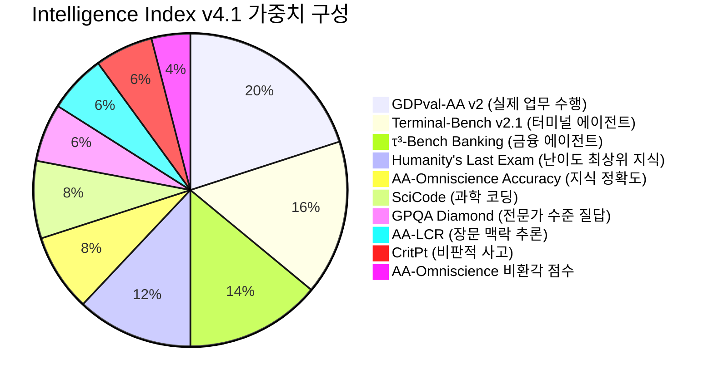
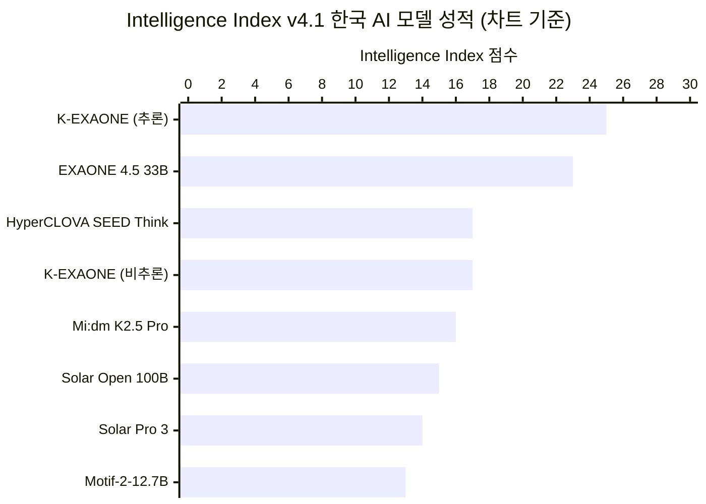
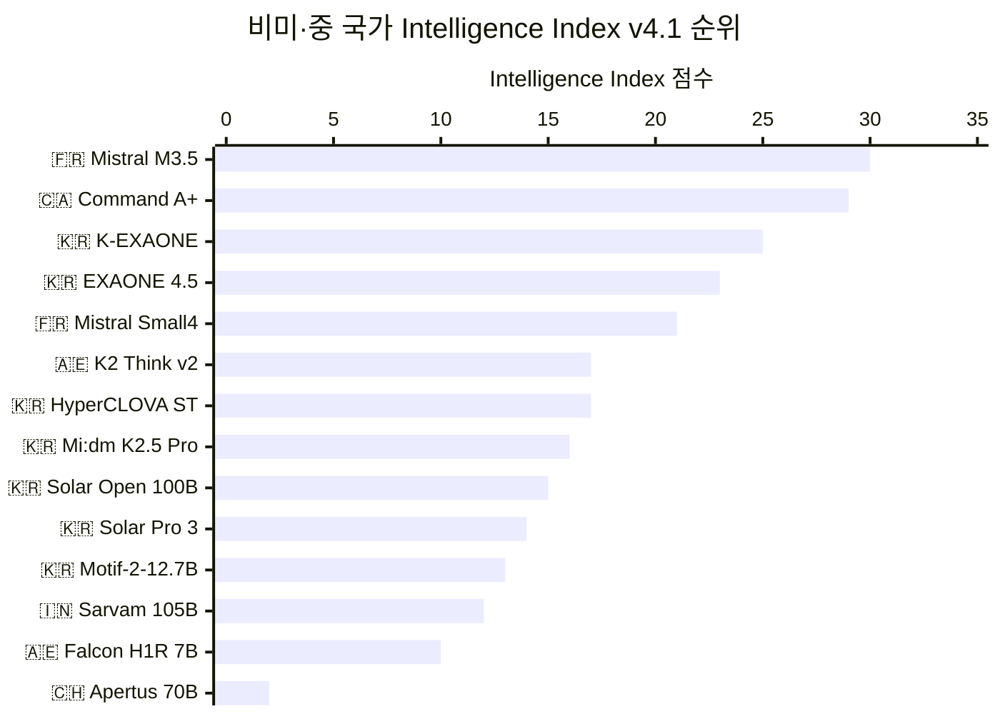
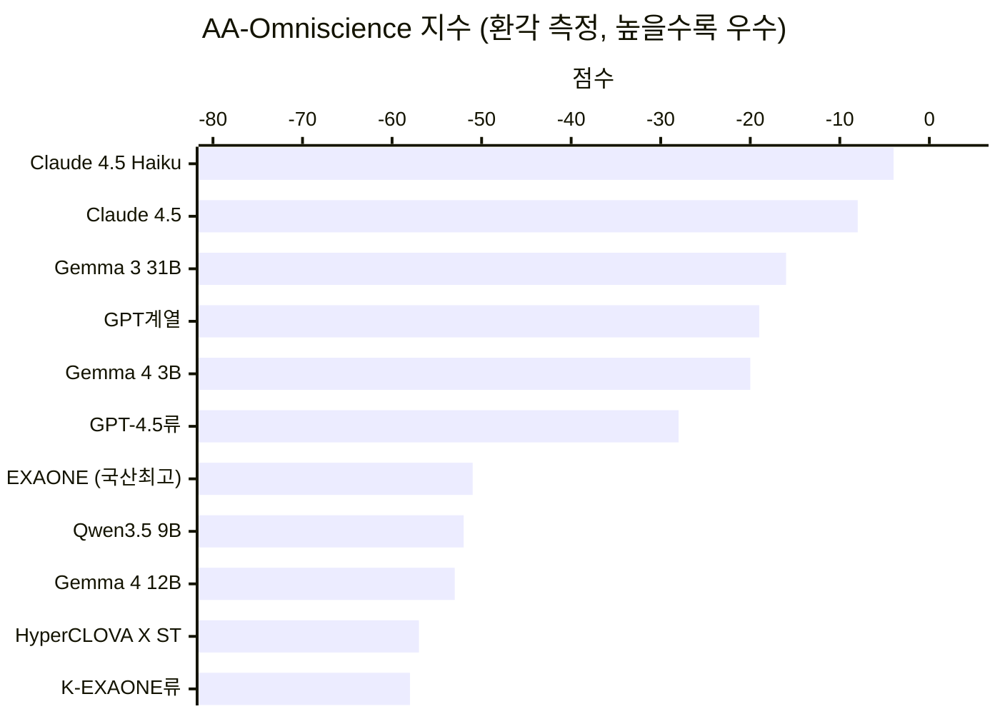

## Artificial Analysis Intelligence Index v4.1 기준 국산 모델 전수 분석 + 팩트체크

> 작성 기준일: 2026년 6월 18일  
> 원본 포스트: Threads [@jin___bro](https://www.threads.com/@jin___bro/post/DZp1RMIE7h5)
> 데이터 출처: Artificial Analysis (artificialanalysis.ai), 각 모델 공식 기술 보고서

---

## 1. 들어가며 — 벤치마크가 바뀌었다는 것의 의미

AI 모델을 평가하는 방식이 조용하지만 근본적으로 달라지고 있다. Threads 포스트(@jin___bro)는 그 변화의 한가운데서 한국 AI 모델들의 현재 위치를 정리한 글이다. 이 분석을 이해하려면 우선 Artificial Analysis라는 독립 평가 기관이 무엇이고, 그들이 이번에 무엇을 바꿨는지를 먼저 짚어야 한다.

Artificial Analysis는 영국에 본사를 둔 독립 AI 성능 평가 기관으로, 특정 기업의 후원을 받지 않고 100개 이상의 언어 모델을 동일한 조건에서 측정해 공개한다. 이 기관이 운영하는 **Intelligence Index**는 단일 벤치마크가 아니라 여러 평가를 합산한 종합 지표로, AI 업계에서 가장 신뢰받는 제3자 비교 도구 중 하나다.

2026년 6월 16일, 이 지수가 **v4.1**로 업데이트됐다. 포스트가 언급한 "에이전트 작업 성능 비중이 올라갔다"는 변화는 바로 이 업데이트를 가리킨다. 중요한 건 단순한 점수 조정이 아니라는 점이다. 이번 개편은 AI 모델을 평가하는 철학 자체가 바뀌었음을 뜻한다.

---

## 2. Intelligence Index v4.1이 구체적으로 무엇을 바꿨나

기존 v4.0 지수는 열 가지 평가 항목으로 구성되어 있었다. 여기에는 MMLU-Pro(광범위한 지식 테스트), AIME 2025(수학 올림피아드 수준 문제), LiveCodeBench(실시간 코딩 문제)처럼 AI 기업들이 마케팅에 자주 인용하던 항목들이 포함돼 있었다. v4.1은 이 세 항목을 제거하고 대신 실제 업무 수행 능력을 측정하는 평가들을 강화했다.

삭제된 항목은 **IFBench**(지시 이행 능력)다. 이 항목은 최상위 모델들이 거의 만점에 가까운 점수를 내면서 변별력을 잃어버렸기 때문이다. 대신 기존에 있던 τ²-Bench Telecom은 **τ³-Bench Banking**으로 업그레이드됐다. 텔레콤 분야 에이전트 과제에서 금융 분야 에이전트 과제로 바뀐 것인데, 이는 훨씬 복잡하고 현실적인 시나리오를 담고 있다. Terminal-Bench Hard도 **Terminal-Bench v2.1**로 업그레이드돼 더 어렵고 현실적인 터미널 작업 시나리오를 포함하게 됐다. 가장 비중이 높은 항목인 **GDPval-AA** 역시 v2로 업그레이드됐다. 이전에는 단순 ELO 기반 평가였으나 이제는 인간 전문가 수준을 1000점으로 정의하는 절대 기준선이 생겼고, 에이전트가 처리할 수 있는 대화 턴 한도도 100회에서 250회로 늘었다. 더 긴 작업 수행 능력을 측정하겠다는 뜻이다.

최종적으로 v4.1의 평가 항목과 가중치는 다음과 같이 구성된다.

에이전트 관련 항목(GDPval-AA v2, Terminal-Bench v2.1, τ³-Bench Banking)만 합쳐도 전체의 50%를 차지한다. 즉 v4.1에서 높은 점수를 받으려면 단순히 지식이 많거나 수학 문제를 잘 푸는 것으로는 부족하고, 복잡한 환경에서 도구를 사용하고 여러 단계에 걸친 작업을 완수하는 능력이 뒷받침되어야 한다.

이 점은 국산 모델의 성적을 해석할 때 매우 중요한 배경이 된다.

---

## 3. 글로벌 지형 — 최상위권은 어디까지 갔나

한국 모델들의 점수를 들여다보기 전에, 전체 스펙트럼이 어떤 모습인지 먼저 파악해야 맥락이 잡힌다.

v4.1 기준 전체 1위는 Anthropic의 **Claude Fable 5**로 60점이다. 다만 이 모델은 현재 일반에 공개되지 않아 실제 사용 가능한 최고 모델은 **Claude Opus 4.8**이 56점으로 2위를 차지한다. OpenAI의 **GPT-5.5**는 55점으로 3위다. 이 세 모델이 현재 사용 가능한 최상위 그룹을 형성하고 있으며, 그 아래로는 중국 진영의 오픈웨이트 모델들이 강세를 보인다.

오픈웨이트(공개 가중치) 모델 중 최상위는 **DeepSeek V4 Pro**와 **MiniMax M3**가 각각 44점으로 공동 선두다. **Kimi K2.6**(중국 Moonshot AI, 1조 파라미터 MoE)이 43점, **MiMo-V2.5-Pro**가 42점으로 뒤를 잇는다.

한국 모델들이 뛰어넘어야 할 다른 주요 경쟁자로는 알리바바의 **Qwen3.6 27B**가 있다. 이 모델은 파라미터 수가 27B에 불과하지만 v4.0 기준으로 37점을 기록해, 국산 최상위 모델(K-EXAONE 추론 모델)과의 점수 격차가 상당하다. 포스트에서 언급한 "Qwen 단일 모델이 국산 전체보다 높은 점수"라는 표현은 이 맥락에서 나온 것이다.

---

## 4. 한국 AI 모델 전수 분석

아래부터는 차트에 등장한 각 한국 모델을 하나씩 살펴본다. 점수는 v4.1 기준이며, 줄무늬 막대(Estimate)로 표시된 항목은 v4.1 출시 시점에 아직 완전히 재평가되지 않은 추정치라는 점을 먼저 밝힌다.

### 4.1 LG AI Research — EXAONE 시리즈 (1위)

한국 모델 중 가장 높은 점수를 기록한 곳은 LG AI Research로, **K-EXAONE**과 **EXAONE 4.5** 두 모델이 각각 국산 1, 2위를 차지하고 있다.

K-EXAONE은 LG AI Research가 정부의 '독자적 AI 파운데이션 모델'(독파모) 사업 지원 아래 개발한 대형 기초 모델이다. 2025년 12월 31일 공개되었으며 전체 파라미터 수는 236B이지만, MoE(Mixture of Experts) 구조를 사용해 실제 추론 시 활성화되는 파라미터는 23B에 불과하다. 128개의 전문가(Expert) 네트워크를 구성하고 각 토큰 처리 시 8개 전문가와 공유 전문가 1개가 활성화되는 방식이다. 이 구조 덕분에 총 파라미터로 보면 최상위 모델 규모이면서도, 실제 추론 비용은 23B 수준의 작은 모델과 비슷하다는 장점이 있다. 지원 언어는 한국어, 영어, 스페인어, 독일어, 일본어, 베트남어 6개이며 컨텍스트 윈도우는 256K 토큰이다.

v4.1 차트에서 K-EXAONE은 추론 모드에서 **25점**(추정치)을 기록했다. 다만 중요한 맥락이 있다. v4.0에서 이 모델의 실제 평가 점수는 **32점**이었다. v4.1 출시 직후 Artificial Analysis가 아직 재평가를 완료하지 않은 상태에서 차트에 추정치(25점)가 표시된 것이다. 비추론 모드(Instruct 전용 버전)는 17점으로 공식 확인된 수치다.

EXAONE 4.5는 K-EXAONE보다 약 석 달 뒤인 2026년 4월 9일에 출시된 모델이다. 파라미터 수는 33B에 불과해 K-EXAONE의 7분의 1 수준이지만, **멀티모달**(텍스트+이미지 입력)을 지원하는 비전-언어 모델(VLM)이다. 자체 비전 인코더와 LLM이 단일 아키텍처로 통합되어 있으며, 독자적인 Hybrid Attention 구조와 멀티 토큰 예측 기반 고속 추론 기술이 적용됐다. LG AI Research가 2021년 EXAONE 1.0(한국 최초 멀티모달 AI)을 개발한 이후 4년간 축적한 기술력의 집약이기도 하다. STEM 다섯 개 벤치마크 평균 77.3점을 기록해 GPT-5-mini(73.5점)와 Claude 4.5 Sonnet(74.6점)을 상회했다.

EXAONE 4.5의 Intelligence Index 점수는 차트에서 **23점**(추정치)이지만, Artificial Analysis 공식 페이지에는 **30점**으로 기록되어 있다. 이는 v4.1 이후 정식 평가가 완료되면서 점수가 상향 확정된 것으로, 실제로는 30점으로 보는 것이 더 정확하다.

포스트가 "K-EXAONE보다 늦게 나왔지만 33B Dense로 더 작고 대신 멀티모달이 추가됐다"고 설명한 것은 사실과 일치한다. EXAONE 4.5는 크기를 줄이면서도 시각 처리 능력을 더한 실용 모델로 볼 수 있다.

### 4.2 네이버 — HyperCLOVA X SEED Think (2위)

**HyperCLOVA X SEED Think**(32B)는 네이버클라우드가 2025년 12월 26일 공개한 오픈웨이트 추론 모델이다. 32B 파라미터의 Dense(밀집형) 구조로, 파라미터 수만 보면 K-EXAONE의 7분의 1에 불과하지만 추론 능력이 특화된 모델이다.

이 모델의 배경에는 흥미로운 사연이 있다. 네이버클라우드는 정부 독파모 사업에 참여했지만 2026년 1월 15일 1차 평가에서 탈락했다. 성능 자체의 문제가 아니라 비전 인코더 등 핵심 모듈의 가중치를 중국 Qwen 모델에서 차용했다는 점이 '독자 기술 확보'라는 사업 취지에 어긋난다는 판정을 받았기 때문이다. 네이버 측은 자체 개발 인코더로 교체 가능하다고 항변했지만 정부는 결정을 유지했다.

그 과정과 별개로, 모델 자체의 성능은 상당히 평가받았다. v4.0 기준으로 이 모델은 **44점**을 기록해 한국 모델 중 당시 최상위권이었다. τ²-Bench Telecom(에이전트 도구 사용 평가) 에서 87%를 기록하며 에이전트 작업 강점을 보였다. 다만 v4.1에서 τ²-Bench가 τ³-Bench Banking으로 교체되면서 재평가가 필요해졌고, 차트에는 약 **17점** 수준의 추정치가 기재되어 있다.

v4.0 대비 점수가 크게 내려간 것처럼 보이는 이유는 두 가지다. 첫째, 기존에 강점이었던 τ²-Bench가 사라졌다. 둘째, 아직 v4.1 기준으로 완전히 재평가되지 않은 추정치라는 점이다. 향후 공식 평가 결과에 따라 수치는 달라질 수 있다.

포스트는 HyperCLOVA X SEED Think의 점수를 17점이라고 했지만, 차트를 정밀하게 보면 약 19점 수준의 막대로 읽힌다. 이 수치 차이는 차트 읽기 과정에서 발생한 소폭의 오차로 보이며, 정식 평가가 완료되면 최종 수치가 확인될 것이다.

네이버는 2026년 4월 9일 CLOVA X 서비스를 종료했다. 2023년 8월에 시작한 이 대화형 AI 서비스는 이용률이 2%대에 머물면서 챗GPT 대항마로서의 역할을 다하지 못했고, 네이버는 독립 AI 서비스 대신 검색·커머스 등 기존 서비스에 AI를 통합하는 방향으로 전략을 전환했다. 다만 포스트가 언급하듯, 서비스 종료가 하이퍼클로바 모델 연구 자체의 포기를 의미하지는 않는다. 모델 연구는 계속되고 있으며 HyperCLOVA X SEED Think 32B의 공개가 그 증거다.

### 4.3 KT — Mi:dm (믿:음) K2.5 Pro (3위)

**Mi:dm K2.5 Pro**는 KT가 개발한 32B 파라미터 Dense 모델로, **16점**을 기록해 국산 3위에 해당한다. 이름은 '믿:음'으로 읽히며, 믿음직스러운 AI라는 의미를 담은 것으로 보인다.

2026년 3월 발표된 기술 보고서에 따르면, 이 모델은 기업 환경의 복잡한 요구를 처리하기 위한 추론 최적화 모델로 설계됐다. 사전 학습 단계에서 레이어 예측 기반 Depth Upscaling(DuS)과 단계적 프리트레이닝 전략을 통해 최대 128K 토큰 컨텍스트 윈도우를 지원한다. 사후 학습(Post-training) 단계에서는 추론 지도 학습(Reasoning SFT), 모델 병합, 비동기적 강화 학습을 포함한 다단계 파이프라인이 적용됐다.

KT의 Mi:dm은 포스트가 언급한 독파모 사업에 포함되지 않은 모델이다. LG(K-EXAONE), 네이버(HyperCLOVA X), NC AI(VARCO), 업스테이지(Solar) 등이 독파모 사업의 주요 참여 팀이며, KT는 해당 사업 외부에서 독자적으로 모델 개발을 진행하고 있다. 이로 인해 일반 대중의 인지도가 상대적으로 낮다는 포스트의 지적은 타당하다.

### 4.4 업스테이지 — Solar 시리즈 (4위)

업스테이지는 **Solar Open 100B**(15점)와 **Solar Pro 3**(14점) 두 모델을 Artificial Analysis에 등록했다. 두 모델 모두 총 파라미터 102B, 활성 파라미터 12B의 MoE 구조를 공유한다. 사전 학습 규모는 약 20조 토큰에 달한다. 코어 언어는 한국어와 영어이며 일본어도 지원한다.

Solar Open 100B는 업스테이지가 2026년 초 공개한 오픈소스 기초 모델이다. Apache 2.0 라이선스 계열의 Solar-Apache 2.0 하에 공개되어 있어 상업적 활용이 가능하다. Solar Pro 3는 2026년 1월 27일에 공개되었으며, Solar Open 100B를 베이스로 업스테이지의 독자적 강화 학습 프레임워크인 SnapPO를 적용해 에이전트 워크플로우와 구조화된 출력 생성 성능을 높인 모델이다. τ²-Bench 에이전트 평가에서 72.3점으로 전작 대비 성능을 약 두 배로 높였다는 점이 주목된다.

차트에서 Solar Open 100B(15점)가 Solar Pro 3(14점)보다 오히려 약간 높게 표시된 것에 대해 포스트는 "아직 측정 안 한 벤치가 있어서 그럴 가능성이 높다"고 설명했다. 이 두 모델 모두 v4.1 기준 추정치로 표시된 상태이므로, 정식 평가 이후 순서가 바뀔 수 있다. 한편 Artificial Analysis 공식 페이지에는 Solar Pro 3가 약 **19점**으로 기재되어 있어, 차트의 14점과 차이가 있다. 이 역시 추정치와 실제 평가 완료 후 수치 간 차이로 이해할 수 있다.

포스트에서 "초기 Solar 10.7B는 Mistral 7B 기반이었지만, 이 두 모델은 자체 개발"이라고 설명한 것은 정확하다. Solar Open 100B 기술 보고서에도 자체 설계 아키텍처임을 명시하고 있다.

### 4.5 모티프 테크놀로지스 — Motif-2-12.7B (5위)

**Motif-2-12.7B**는 AI 인프라 솔루션 기업 Moreh의 자회사인 모티프 테크놀로지스가 개발한 12.7B 파라미터 Dense 모델이다. 2025년 11월 공개되었으며, Intelligence Index 차트에서 **13점**을 기록했다. 파라미터 수가 다른 국산 모델에 비해 현저히 작음에도 불구하고, v4.0 기준에서는 일시적으로 국산 모델 1위를 차지하기도 했다.

이 모델의 차별점은 독자적인 아키텍처 설계에 있다. 신호와 노이즈를 분리하는 Grouped Differential Attention(GDA)을 적용해 표현 효율을 높였으며, MuonClip 옵티마이저와 fused PolyNorm 활성화 함수 등 자체 커스텀 커널을 활용해 분산 학습 효율을 높였다. 5.5조 토큰에 걸친 커리큘럼 기반 학습 스케줄도 적용됐다. 이 모델은 단순히 외부 오픈소스 아키텍처를 채택한 것이 아니라 처음부터 독자 설계를 택했다는 점에서 주목받았다.

모티프 테크놀로지스는 2026년 5월 240억 원 규모의 시리즈 B 투자를 유치했다. 정부 독파모 사업에서는 1차 평가에서 탈락했지만 2차 기회(Second Chance) 라운드에 재도전 중이며, 서울대, KAIST, 삼일PwC 등 29개 기관 컨소시엄을 구성해 최대 2027년 상반기까지 운영 계획을 제출한 것으로 알려졌다.

---

## 5. 비미·중 국가 비교 — 한국의 실질적 위치

미국과 중국 모델을 제외하고 나머지 국가들의 모델만 비교하면 그림이 달라진다는 것이 포스트의 핵심 주장이다. 차트에 등장한 비미·중 모델 14개의 순위를 정리하면 다음과 같다.

이 비교에서 1위는 프랑스 Mistral AI의 **Mistral Medium 3.5**(30점), 2위는 캐나다 Cohere의 **Command A+** (29점)다. 한국의 K-EXAONE은 25점으로 3위를 차지한다.

**Mistral Medium 3.5**는 2026년 4월 29일 공개된 128B 파라미터의 Dense(밀집형) 모델이다. 여기서 'Dense'는 MoE와 달리 모든 파라미터가 매 토큰 처리 시 활성화된다는 뜻으로, 구동 비용이 상당히 높다. 256K 토큰 컨텍스트 윈도우를 지원하며, 수정된 MIT 라이선스 아래 오픈웨이트로 공개돼 있다. 기존에 별개였던 Magistral(추론), Pixtral(비전), Devstral(코딩) 세 모델을 하나로 통합한 것이 특징이다. SWE-Bench Verified(실제 소프트웨어 엔지니어링 과제)에서 77.6%를 기록했다.

**Command A+** 는 2026년 5월 20일 캐나다의 Cohere가 공개한 218B 파라미터(활성 25B) MoE 모델이다. 128개 전문가(Expert) 중 8개를 활성화하는 구조로, 2×H100 GPU로 구동 가능한 경량 추론을 지원한다. 48개 언어를 지원하고 전체 아파치 2.0 라이선스로 공개된 Cohere 최초의 완전 오픈 프론티어 모델이다. 네이티브 인용(Citation) 기능이 내장되어 있어 RAG(검색 증강 생성) 기반 기업 에이전트에 특화돼 있다.

이 비교에서 주목할 점은 14개 모델 중 한국 모델이 6개라는 사실이다. UAE(K2 Think v2, Falcon H1R 7B)와 프랑스(Mistral Medium 3.5, Mistral Small 4)가 각 2개, 캐나다(Command A+)·인도(Sarvam 105B)·스위스(Apertus 70B)가 각 1개다. 미국과 중국을 제외하면 벤치마크에 복수의 모델을 등록한 국가는 한국이 유일하며, 그것도 5개 팀(LG, 네이버, KT, 업스테이지, 모티프)이 동시에 참여하는 형태다.

물론 1위 Mistral Medium 3.5는 128B Dense 모델이라 서버 구동 비용 면에서 K-EXAONE의 236B-A23B MoE와 동급 비교는 어렵다. 실제 추론 비용 기준으로 따지면 K-EXAONE이 훨씬 효율적이다. MoE 구조는 파라미터 총량은 많지만 각 추론에서 실제로 계산하는 양이 적기 때문이다. 절대 성능 비교와 비용 효율성 비교는 구분해서 봐야 한다.

---

## 6. 환각(Hallucination) 문제 — AA-Omniscience 지수

Intelligence Index 점수만 보면 한국 모델들의 성장세가 인상적이지만, 환각(Hallucination) 항목에서는 여전히 심각한 약점이 드러난다. Artificial Analysis는 AA-Omniscience 지수를 통해 환각 수준을 별도로 측정한다.

이 지수는 -100에서 100 사이의 점수로, 정답에는 가점, 오답에는 감점, 답변 거부에는 중립을 적용한다. **0점은 맞은 수와 틀린 수가 같다는 뜻**이며, 음수면 오답이 정답보다 많다는 의미다.

차트에서 가장 성능이 좋은 모델은 **Claude 4.5 Haiku**로 -4점을 기록했다. 현재 상용 가능한 최고 수준이다. 반면 한국 모델 중 가장 선방한 EXAONE도 **-51점**에 그쳤다. 이는 모델이 내놓는 답변 중 틀린 것이 맞는 것보다 훨씬 많다는 뜻이다.

포스트에서 "국산 모델은 전반적으로 환각이 아직 많은 편이에요"라고 한 것은 이 데이터를 근거로 한 정확한 진단이다. 심지어 단순 지식 정확도를 넘어, 모르는 것을 모른다고 말하지 못하고 그럴듯한 오답을 자신 있게 내놓는 패턴이 지속되고 있다. 이는 실무 투입 가능성을 평가할 때 점수 격차보다 더 직접적인 장벽이 된다.

---

## 7. 사실 검증 — 팩트체크 결과

포스트의 주요 주장들을 하나하나 검증한 결과를 정리한다.

### ✅ 확인된 사실들

포스트에서 K-EXAONE을 "236B 파라미터에 활성 파라미터 23B짜리 MoE 모델"로 설명한 것은 기술 보고서와 정확히 일치한다. EXAONE 4.5가 "33B Dense로 K-EXAONE보다 작고, 멀티모달이 추가됐다"는 설명도 사실이다. 2026년 4월 9일 공식 출시된 EXAONE 4.5는 비전 인코더를 내장한 멀티모달 모델이며 파라미터 수는 33B다.

HyperCLOVA X SEED Think를 "32B Dense 모델"로 설명한 것도 맞다. Mi:dm K2.5 Pro가 "32B Dense"라는 설명도 KT의 공개 기술 보고서와 일치한다. Solar Pro 3와 Solar Open 100B가 "102B A12B MoE"라는 설명도 Upstage 공식 HuggingFace 페이지의 모델 카드와 정확히 일치한다.

Motif-2-12.7B가 "12.7B Dense"라는 것도 사실이며, Motif Technologies가 AI 인프라 기업 Moreh의 자회사라는 점도 확인됐다. Mistral Medium 3.5가 "128B Dense"라는 설명 역시 정확하다. 일부 자료가 'MoE 영향을 받은 구조'라고 표현하기도 하지만, 공식적으로는 모든 파라미터가 매번 활성화되는 Dense Transformer다. Command A+가 "218B A25B MoE"이고 캐나다 Cohere가 개발한 모델이라는 설명도 정확하다.

CLOVA X 서비스가 종료됐다는 것은 2026년 4월 9일에 실제로 종료됐으며, HyperCLOVA 모델 연구는 계속되고 있다는 것도 사실이다. KT Mi:dm이 독파모 사업에 포함되지 않았다는 것도 확인됐다. Qwen3.6 27B가 37점이라는 것은 v4.0 기준 Artificial Analysis 공식 페이지 데이터와 일치한다.

### ⚠️ 수정이 필요하거나 보완이 필요한 부분

**HyperCLOVA X SEED Think 점수 읽기 차이**: 포스트는 이 모델을 "17점"이라고 했지만, 차트를 정밀하게 분석하면 약 19점 막대로 보인다. K-EXAONE 비추론 모델의 점수가 17점이라는 부분(포스트에서 직접 기술)과 혼선이 발생한 것으로 보인다. 정식 평가 완료 후 수치가 확정되면 명확해질 것이다.

**차트 점수와 공식 AA 페이지 점수의 차이**: 차트에 표시된 많은 국산 모델의 점수는 줄무늬 막대(Estimate), 즉 추정치다. v4.1이 2026년 6월 16일에 막 출시됐기 때문에 모든 모델이 완전히 재평가되지 않은 상태다. 예를 들어 EXAONE 4.5는 차트에서 23점(추정치)이지만 AA 공식 페이지에는 30점(정식 평가)이 기재돼 있다. Solar Pro 3는 차트에서 14점이지만 AA 페이지에는 19점이 기재돼 있다. 이 점수들이 향후 확정되면 실제 순위가 다소 달라질 수 있다.

**K-EXAONE v4.0 대 v4.1 비교**: v4.0 기준 K-EXAONE 추론 모델의 공식 평가 점수는 32점이었다. 차트의 25점은 v4.1 추정치다. 즉 포스트의 K-EXAONE 25점은 v4.1 기준 추정치이며, 실제 v4.1 정식 평가가 완료되면 수치가 달라질 수 있다.

**Qwen3.6 27B 37점 vs 최신 수치**: 포스트가 인용한 37점은 Artificial Analysis 페이지에서도 동일하게 확인되는 수치다. 다만 일부 외부 집계 자료는 Qwen3.6 27B의 v4.1 점수를 더 높게 표기하기도 한다. v4.1 정식 평가 결과에 따라 이 수치도 업데이트될 수 있다.

---

## 8. 구조적 이해 — 왜 국산 모델은 에이전트에서 약한가

v4.1 업데이트로 에이전트 작업 비중이 높아진 상황에서 국산 모델들이 고전하는 이유를 기술적으로 짚어볼 필요가 있다.

에이전트 작업이란 단순히 질문에 대답하는 것을 넘어, 여러 도구를 호출하고, 결과를 해석하고, 다음 행동을 결정하는 다단계 과정이다. τ³-Bench Banking은 실제 금융 업무 환경에서 에이전트가 어떻게 행동하는지, GDPval-AA v2는 250턴에 걸친 장기 에이전트 워크플로우에서 얼마나 경제적 가치를 창출하는지 측정한다.

이런 작업에서 높은 점수를 받으려면 세 가지가 필요하다. 첫째는 도구 호출(Function Calling)의 정확성이다. 잘못된 도구를 호출하거나 파라미터를 잘못 구성하면 전체 체인이 무너진다. 둘째는 오류 복구 능력이다. 중간 단계에서 예상치 못한 결과가 나왔을 때 이를 인식하고 경로를 수정하는 능력이다. 셋째는 맥락 유지다. 250턴이 넘는 대화에서도 초기 지시를 잃지 않아야 한다.

국산 모델들이 단순 지식 평가(MMLU 계열)에서는 경쟁력을 갖췄지만 에이전트 작업에서 상대적으로 뒤처지는 이유는 이 세 가지 능력의 훈련 데이터와 강화 학습 과정에서 아직 한계가 있기 때문이다. 에이전트 학습을 위해서는 실제 에이전트 실행 궤적(Trajectory) 데이터가 대규모로 필요한데, 이런 데이터를 수집하고 레이블링하는 인프라 구축이 미국·중국 빅테크 대비 아직 뒤처져 있다.

---

## 9. 실무 도입 가능성 — 현실적인 평가

포스트의 말미에 달린 댓글은 국산 모델에 대한 현장의 솔직한 평가를 담고 있다. "코덱스·클로드를 제외하면 실무에서는 비전 인식에 Gemma, 코딩·에이전트에 Qwen, 구독/API로는 Kimi·MiMo를 쓰고, 에이전트 스웜용으로는 DeepSeek을 쓴다"는 것이다. 그러면서 국산 모델에 대해서는 "환각은커녕 내가 묻는 거에 제대로 답하는 것부터 안 되고 있다"는 냉정한 평가가 이어진다.

이 발언이 시사하는 것은 두 가지다. 하나는 현재의 점수 격차가 단순한 숫자 이상이라는 것이다. 점수 차이는 실제 사용 경험의 질적 차이로 이어지고 있다. 다른 하나는 국산 모델이 환각 문제를 해결하지 못하는 한, 설령 웹 검색 기능을 붙이더라도 (포스트 댓글의 표현대로) "효과가 없"을 수 있다는 점이다. 모델이 내놓는 기본 답변의 신뢰성이 전제되지 않으면 에이전트 파이프라인 자체의 안정성이 흔들리기 때문이다.

그럼에도 불구하고 현실적인 부분에서 국산 모델이 강점을 발휘할 수 있는 영역은 존재한다. 가장 명확한 것은 **한국어 특화 기업 업무**다. 한국어 법률 문서 처리, 금융 보고서 요약, 한국 규제 환경을 이해하는 컴플라이언스 자동화 같은 작업에서는 한국어 데이터로 집중 훈련된 국산 모델이 범용 글로벌 모델보다 나은 결과를 낼 수 있다. 두 번째는 **데이터 주권**이다. 개인정보보호법 등 국내 규제 환경에서 데이터를 외부 서버로 보내지 않고 온프레미스 또는 국내 클라우드에서 처리해야 하는 경우, 국산 모델의 필요성이 높아진다.

---

## 10. 전망 — 앞으로 6개월~1년

포스트가 "지금 중요한 건 점수 자체보다, 6개월~1년 뒤에 이 격차가 줄어드는 속도"라고 한 것은 정확한 시각이다. AI 모델 개발 속도는 매우 빠르며, 현재의 격차가 고정값이 아니다.

주목해야 할 변수는 세 가지다. 첫째, 에이전트 학습 데이터의 확보 속도다. 한국의 주요 기업들이 τ³-Bench Banking 같은 에이전트 환경 특화 훈련 데이터를 얼마나 빠르게 구축하느냐가 v4.1 시대의 성적을 좌우할 것이다. 둘째, 정부 독파모 사업의 2단계 결과다. 2026년 하반기에 나올 결과에 따라 국산 모델 개발의 방향성과 자원 투입 규모가 달라진다. 셋째, 환각 문제 해결을 위한 Post-training 혁신이다. AA-Omniscience 점수에서 보이는 -50대의 환각 수준을 -20 이하로 끌어내릴 수 있는 기술적 돌파구가 필요하다.

포스트의 마지막 발언—"Gemma 3 정도니까 1년 정도 뒤처졌다 생각하면, 1년 뒤 가속 가보즈아!"—에 비추면, 한국 모델은 Gemma 4 계열과의 격차를 보고 있는 셈이다. 1년 뒤에는 글로벌 프론티어 모델도 현재와 다른 수준에 있을 것이라는 점에서, 상대적 격차를 줄이는 속도가 관건이다.

---

## 참고 — 주요 모델 사양 요약

| 모델 | 개발사 | 국가 | 파라미터 | 구조 | 공개일 | AA v4.1 점수 |
|------|--------|------|----------|------|--------|-------------|
| K-EXAONE (추론) | LG AI Research | 🇰🇷 | 236B A23B | MoE | 2025.12.31 | 25 (추정) |
| EXAONE 4.5 | LG AI Research | 🇰🇷 | 33B | Dense (VLM) | 2026.04.09 | 23→30* |
| HyperCLOVA X SEED Think | 네이버클라우드 | 🇰🇷 | 32B | Dense | 2025.12.26 | ~17 (추정) |
| K-EXAONE (비추론) | LG AI Research | 🇰🇷 | 236B A23B | MoE | 2025.12.31 | 17 (확인) |
| Mi:dm K2.5 Pro | KT | 🇰🇷 | 32B | Dense | 2026.03 | 16 |
| Solar Open 100B | 업스테이지 | 🇰🇷 | 102B A12B | MoE | 2026.01 | 15→19* |
| Solar Pro 3 | 업스테이지 | 🇰🇷 | 102B A12B | MoE | 2026.01.27 | 14→19* |
| Motif-2-12.7B | 모티프 테크놀로지스 | 🇰🇷 | 12.7B | Dense | 2025.11 | 13 |
| Mistral Medium 3.5 | Mistral AI | 🇫🇷 | 128B | Dense | 2026.04.30 | 30 |
| Command A+ | Cohere | 🇨🇦 | 218B A25B | MoE | 2026.05.20 | 29 |
| Qwen3.6 27B | Alibaba | 🇨🇳 | 27B | Dense | 2026.04.22 | 37 |

*차트 추정치 vs. Artificial Analysis 공식 페이지 수치 차이 존재. 공식 페이지 수치가 정식 평가 이후 확정된 값으로 더 정확할 수 있음.

---

## 참고 문헌

- Artificial Analysis, "Announcing Artificial Analysis Intelligence Index v4.1" (2026.06.16)
- Artificial Analysis, 모델별 공식 페이지: K-EXAONE, EXAONE 4.5 33B, Qwen3.6 27B, Solar Pro 3
- LG AI Research, K-EXAONE Technical Report (arXiv:2601.01739, 2026)
- LG AI Research, "LG Reveals Next-Gen Multimodal AI 'EXAONE 4.5'" (PR Newswire, 2026.04.09)
- KT, "Mi:dm K 2.5 Pro" Technical Report (arXiv:2603.18788, 2026)
- Upstage, Solar Open Technical Report (arXiv:2601.07022, 2026)
- Motif Technologies, Motif 2 12.7B Technical Report (arXiv:2511.07464, 2025)
- Cohere, "Command A+ Documentation" (docs.cohere.com, 2026)
- VentureBeat, "Artificial Analysis overhauls its AI Intelligence Index" (2026.01.06)
- Korea Herald, "LG's K-Exaone breaks into global top 10 AI rankings" (2026.01.11)
- Korea Herald, "LG Reveals Next-Gen Multimodal AI 'EXAONE 4.5'" (2026.04.09)
- 나무위키, HyperCLOVA 문서 (2026)
- ZDNet Korea, "네이버, 생성형 AI 실험 마침표…클로바X·큐 4월 종료" (2026.02.25)
- BigGo Finance, "Motif Technologies Secures ₩24 Billion Series B" (2026.05)

---

## 용어 해설

**Intelligence Index**: Artificial Analysis가 제공하는 복합 AI 성능 지표. 단일 벤치마크가 아닌 여러 평가의 가중 평균.

**MoE (Mixture of Experts)**: 수많은 '전문가' 네트워크 중 각 토큰 처리 시 일부만 활성화하는 구조. 총 파라미터는 많지만 실제 추론 비용은 활성 파라미터 기준으로 계산된다.

**Dense 모델**: MoE와 달리 모든 파라미터가 매 토큰 처리 시 활성화되는 전통적 구조.

**에이전트 작업 (Agentic Task)**: 단순 답변을 넘어 도구를 호출하고, 결과를 해석하고, 다음 행동을 결정하는 다단계 자율 수행 과제.

**GDPval-AA v2**: Artificial Analysis가 개발한 실제 업무 가치 측정 에이전트 벤치마크. 인간 전문가 성능을 ELO 1000으로 정의한다.

**τ³-Bench Banking**: 금융 환경에서 에이전트가 복잡한 업무 시나리오를 수행하는 능력을 측정하는 벤치마크.

**AA-Omniscience**: Artificial Analysis의 지식 정확도 및 환각 측정 지표. 0점이 정답과 오답의 균형점, 음수는 오답 초과.

**독파모**: 과학기술정보통신부 주도의 '독자적 AI 파운데이션 모델' 개발 사업.

**VLM (Vision-Language Model)**: 텍스트와 이미지를 함께 처리할 수 있는 멀티모달 언어 모델.
