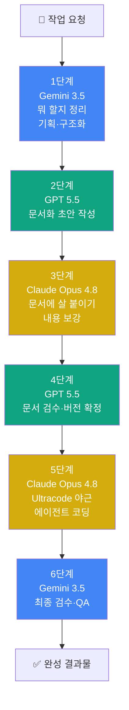
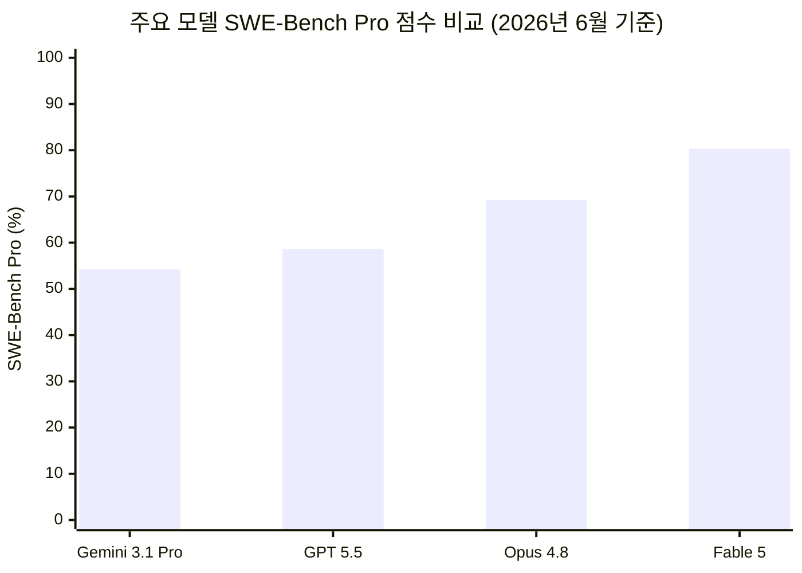
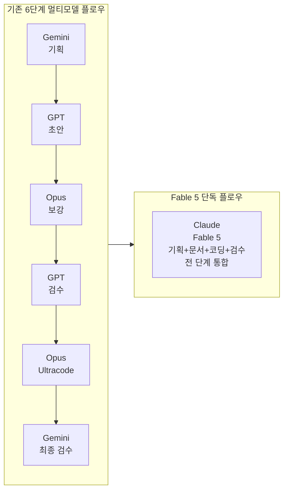
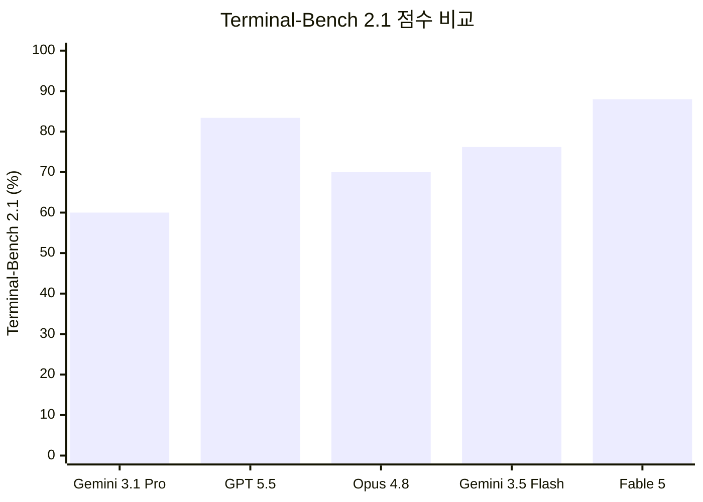
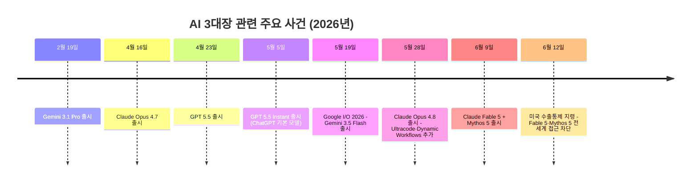

> **원본 출처**: Threads [@vesperchant](https://www.threads.com/@vesperchant/post/DZv9uxYGs3-) 포스트 「AI 3대장 경험치 근황」  
> **작성 기준일**: 2026년 6월 19일  
> **핵심 주제**: Google AI Ultra·Claude Max·ChatGPT Pro를 1년 가까이 동시 구독한 파워 유저가 직접 체감한 Gemini 3.5·Claude Opus 4.8·GPT 5.5의 실전 특성, 그리고 이 세 모델이 분담해 온 6단계 워크플로우를 Fable 5 단독으로 처리했다는 발견

---

## 목차

1. [포스트 배경: 월 $650 이상을 쓰는 파워 유저의 1년 체험기](#1-포스트-배경)
2. [세 개의 고가 구독 플랜: Ultra·Max·Pro란 무엇인가](#2-세-개의-고가-구독-플랜)
3. [Gemini 3.5: "팔장 끼고 시키는" 계획가의 민낯](#3-gemini-35)
4. [Claude Opus 4.8: 말 많고 비싸지만 시키는 대로 하는 장인](#4-claude-opus-48)
5. [GPT 5.5: 스킬을 받아 문서를 완성하는 마무리 담당](#5-gpt-55)
6. [6단계 멀티모델 워크플로우의 구조와 원리](#6-6단계-멀티모델-워크플로우)
7. [Claude Fable 5: 이 모든 것을 혼자 해낸 Mythos급 모델](#7-claude-fable-5)
8. [Fable 5 강제 접근 차단: 미국 수출통제 지령의 충격](#8-fable-5-강제-접근-차단)
9. [벤치마크로 보는 세 모델의 객관적 위치](#9-벤치마크-비교)
10. [시사점: 멀티모델 워크플로우 시대의 끝이 오는가](#10-시사점)

---

## 1. 포스트 배경

2026년 6월 중순, Threads 계정 @vesperchant가 짧지만 밀도 높은 글을 올렸다. 제목은 "AI 3대장 경험치 근황"이었다. 이 포스트가 한국 AI 개발자 커뮤니티에서 빠르게 퍼진 이유는 단순하다. 작성자가 구독료만 합산해도 한 달에 수십만 원이 넘는 세 개의 최상위 AI 플랜을 1년 가까이 동시에 사용해 온 현장 경험을 진솔하게 공유했기 때문이다.

AI를 "써본" 사람과 "직업적으로 매일 쓰는" 사람 사이에는 좁히기 어려운 감도의 차이가 있다. 이 포스트는 후자의 관점에서 Gemini 3.5, Claude Opus 4.8, GPT 5.5가 실제 작업에서 어떻게 다른지를 날카롭게 짚어냈고, 그 끝에 Claude Fable 5라는 새 모델이 이 모든 역할 분담을 혼자서 처리했다는 발견으로 마무리된다.

---

## 2. 세 개의 고가 구독 플랜

포스트 첫 줄에 "AI Ultra, Max, Pro 사용 중"이라는 표현이 등장한다. 이것이 단순한 표현이 아니라 구체적인 서비스 이름이라는 점부터 짚어야 한다.

### 2-1. Google AI Ultra ($249.99/월)

Google은 2025년부터 AI 구독 플랜을 재편하면서 기존 "Gemini Advanced"를 Google AI Pro($19.99/월)로 통합하고, 가장 높은 티어를 **Google AI Ultra($249.99/월)** 로 명명했다. Ultra 플랜은 Gemini 최상위 모델에 대한 우선 접근권, 25,000 AI 크레딧, 30TB 스토리지, Veo 3.1 동영상 생성 기능 등을 포함한다. Google Workspace 생태계(Gmail, Google 문서, 드라이브)에 AI가 깊숙이 통합되어 있어, Google 도구를 일상적으로 쓰는 파워 유저에게는 단일 플랫폼으로서의 가치가 크다는 평가를 받는다.

### 2-2. Claude Max ($100~$200/월)

Anthropic의 **Claude Max**는 두 단계로 나뉜다. $100/월 플랜(5× 사용량)과 $200/월 플랜(20× 사용량)이다. 이 포스트의 작성자가 언급하는 "Max"는 Claude Code의 Dynamic Workflows(Ultracode)를 실질적으로 사용할 수 있는 환경, 즉 비용 제한 없이 코딩 에이전트를 장시간 돌릴 수 있는 상위 티어를 가리킨다. 2026년 6월 기준으로 Claude Pro($20/월) 구독자도 Dynamic Workflows 자체는 활성화할 수 있지만, 장시간 Ultracode 세션을 사용하다 보면 사용량 한도에 도달하는 빈도가 Max 대비 훨씬 높다.

### 2-3. ChatGPT Pro ($200/월)

OpenAI의 **ChatGPT Pro**는 $200/월에 GPT 계열 최상위 모델(현재 GPT 5.5)에 대한 무제한에 가까운 접근권과 고급 추론 모드, OpenAI Codex 등의 에이전트 기능을 제공한다. SemiAnalysis의 2026년 분석에 따르면, $200/월 ChatGPT Pro 구독자가 서비스를 최대한 활용할 경우 OpenAI의 실제 서빙 비용은 약 $14,000에 달한다. 이 수치는 현재의 프리미엄 AI 구독 모델이 대규모 보조금 구조 위에서 운영되고 있음을 보여준다.

세 플랜을 모두 구독하면 한 달에 최소 $650(약 90만 원 이상)이 지출된다. 이 비용을 1년 가까이 유지해 왔다는 것은, 작성자가 AI를 단순한 보조 도구가 아니라 핵심 업무 인프라로 활용하고 있다는 의미다.

---

## 3. Gemini 3.5

### 3-1. Gemini 3.5는 어떤 모델인가

2026년 5월 19일 Google I/O 2026에서 **Gemini 3.5 Flash**가 공개 출시되었다. Gemini 3.1 Pro 대비 Terminal-Bench 2.1에서 76.2%, MCP Atlas에서 83.6%를 기록하며 기존 프리미엄 플래그십을 비용 면에서 압도하는 플래시 모델이라는 평가를 받았다. 주목할 점은 이번에는 Flash가 먼저 나오고 Pro가 나중에 나오는 역순 출시였다는 것이다. Sundar Pichai가 "한 달만 기다려 달라"는 발언에 현장 청중이 탄식했다는 것은 이를 상징적으로 보여주는 장면이다.

**Gemini 3.5 Pro**는 2M 토큰 컨텍스트 창, Deep Think 추론 모드, 최상위 멀티모달 성능을 목표로 2026년 6월 GA(일반 출시)를 예고한 상태이며, 이 문서 작성 시점(6월 19일) 기준으로는 아직 제한적인 Vertex 프리뷰 상태에 머물러 있다. 포스트 작성자가 경험한 "Gemini 3.5"는 Google AI Ultra 구독을 통해 접근한 Gemini 3.5 Flash 또는 제한적으로 접근한 Gemini 3.1 Pro를 가리키는 것으로 이해된다.

### 3-2. "팔장 끼고 일해라 절해라"의 의미

포스트의 표현을 그대로 풀면 이렇다. Gemini는 "뭘 해야 할지"는 잘 정리해 준다. 아이디어를 던지면 구조화해 주고, 방향을 잡아주고, 토론 주제를 제시하면 논점을 체계적으로 나열한다. 그런데 "네가 직접 해봐"라고 시키면 실행력이 현저히 떨어진다는 것이다.

이것은 Gemini 계열의 구조적 특성과 맞닿아 있다. Gemini 3.1 Pro의 SWE-Bench Pro 점수는 54.2%로, 동 시기의 Claude Opus 4.8(69.2%)이나 GPT 5.5(58.6%)에 비해 낮다. 아이디어 정리, 리서치, 멀티모달 이해 등의 영역에서는 경쟁력이 있으나, 복잡한 에이전트 코딩이나 긴 자율 실행 태스크에서는 상대적으로 뒤처진다는 현장 평가가 실제 벤치마크와 일치하는 셈이다. GPT 5.5와의 비교에서도 "Gemini 불러다가 토론 주제 던지면 실력 나옴"이라는 포스트의 표현은, Gemini가 콘텐츠 기획과 구조화에 강하다는 것을 방증한다.

### 3-3. 포스트 속 역할: 기획자·검수자

이러한 특성 때문에 작성자의 워크플로우에서 Gemini는 시작과 끝을 담당하는 "기획자 겸 최종 검수자"로 자리잡았다. 무엇을 할지 정리하는 1단계와, 완성된 결과물을 검토하는 6단계를 맡는 것이다.

---

## 4. Claude Opus 4.8

### 4-1. Opus 4.8의 출시 배경

**Claude Opus 4.8**은 2026년 5월 28일, Opus 4.7 출시 41일 만에 공개되었다. Anthropic 역사상 가장 빠른 플래그십 업그레이드 사이클이었다. Opus 4.8은 4.7에서 지적되었던 "주석 장황함"과 "도구 호출 오류" 문제를 수정하고, 코드 결함을 Opus 4.7 대비 약 4배 적게 무시하는 개선을 이루었다. Anthropic은 이 모델을 "장기 자율 실행 태스크에서의 일관성과 정직성"으로 표현했으며, SWE-Bench Pro에서 69.2%를 기록하며 당시 GPT 5.5(58.6%)와 Gemini 3.1 Pro(54.2%)를 앞질렀다.

같은 날, Claude Code에는 **Dynamic Workflows(연구 미리보기)** 와 **/effort ultracode** 설정이 추가되었다.

### 4-2. Ultracode란 무엇인가

포스트에서 "Ultracode 야식비 택시비 줘야 일 제대로 함"이라는 표현이 등장한다. 이것을 이해하려면 Ultracode의 작동 방식을 알아야 한다.

**Ultracode**는 Claude Code에서 `/effort ultracode` 명령으로 활성화하는 최고 강도 실행 모드다. 이 모드는 두 가지를 동시에 수행한다. 첫째, 모델에게 `xhigh` 수준의 추론 노력을 요청한다. 둘째, Claude Code가 작업의 규모에 따라 자동으로 Dynamic Workflows를 생성해 수백 개의 병렬 서브에이전트를 조율하도록 한다.

구체적으로 Ultracode는 세 개의 서브에이전트 클러스터로 이루어진 자동화된 루프를 형성한다. 첫 번째 클러스터는 코드베이스의 아키텍처를 파악하고, 두 번째 클러스터는 실제 변경을 수행하며, 세 번째 클러스터는 결과를 검증한다. 수십만 줄 규모의 코드베이스 마이그레이션도 이 모드로 처리할 수 있다. 단, 토큰 소비량과 시간이 일반 요청 대비 크게 늘어나기 때문에 "야식비 택시비"라는 표현이 나온 것이다. Ultracode는 빠른 일이 아니라 제대로 된 일을 위한 모드다.

2026년 6월 기준 Ultracode는 Claude Code v2.1.154 이상에서 사용 가능하며, Opus 4.8 모델과 `/config`에서 Dynamic Workflows를 활성화한 상태가 전제 조건이다.

### 4-3. "스킬깎는 장인"의 역설

포스트에서 흥미로운 표현이 하나 더 등장한다. Opus 4.8이 "스킬깎는 장인 역"이라는 것이다. 이것은 칭찬과 경고가 동시에 담긴 말이다. 시키는 대로 무엇이든 수행해 주는 Opus의 능력이 오히려 사용자 자신의 기술 향상을 방해한다는 뜻이다.

이는 2026년 AI 개발자 커뮤니티에서 공통적으로 제기되는 고민이기도 하다. 코딩을 배우던 사람이 Claude Code의 Ultracode 모드를 쓰기 시작하면 직접 손을 쓸 기회 자체가 줄어든다. 도구가 강력해질수록 의존성도 깊어지는 것이다.

---

## 5. GPT 5.5

### 5-1. GPT 5.5의 출시와 특성

**GPT 5.5**(코드명 "Spud")는 2026년 4월 23일 OpenAI가 공개한 모델이다. GPT 5.4 대비 에이전트 추론과 도구 활용 능력이 개선되었으며, 특히 코드 작성·디버깅, 웹 리서치, 데이터 분석, 문서 및 스프레드시트 생성, 소프트웨어 조작 등에서 강점을 보인다. OpenAI는 GPT 5.5가 GPT 5.4와 동일한 토큰당 지연 속도를 유지하면서도 동일한 Codex 태스크를 훨씬 적은 토큰으로 완료한다고 밝혔다.

2026년 5월 5일에는 **GPT 5.5 Instant**가 출시되어 ChatGPT의 모든 플랜에서 기본 모델로 채택되었다. 이 버전은 "응답이 더 간결하고 불필요한 이모지를 줄였다"는 점이 특징이다. Terminal-Bench 2.0에서 82.7%를 기록하며 GPT 5.5는 터미널 코딩 환경에서 가장 강한 모델로 평가받기도 했다.

### 5-2. "Claude로 만든 스킬 얘한테 시키면 겁나 잘 나옴"

포스트에서 가장 흥미로운 관찰 중 하나다. Claude(Opus 4.8)가 만들어 놓은 스킬, 즉 체계적으로 구조화된 프롬프트나 작업 지침을 GPT 5.5에게 적용했더니 결과물이 훨씬 뛰어났다는 뜻이다.

이것은 실제로 2026년 멀티모델 워크플로우 커뮤니티에서 자주 언급되는 현상이다. Claude 계열은 복잡한 지시 구조를 정확하게 해석하고 실행하는 능력이 뛰어나기 때문에 "스킬 작성자"로서의 역할에 적합하다. 반면 GPT 5.5는 그 스킬을 받았을 때 특유의 자연스러운 문체와 구조화 능력으로 결과물 품질을 높이는 경향이 있다. 두 모델의 강점이 결합되는 순간이다.

### 5-3. 문서 품질의 우위

포스트는 "셋 중에서 문서 가장 좋음"이라고 단언한다. GPT 5.5의 문서 생성 능력은 여러 독립적인 평가에서도 확인된다. 응답이 체계적이고, 독자를 고려한 문장 구조를 갖추며, 길이와 밀도의 균형을 잘 맞춘다는 평가가 많다. 이것이 작성자의 워크플로우에서 GPT 5.5가 "문서 초안 작성"과 "문서 최종 검수·버전 확정"을 담당하게 된 이유다.

---

## 6. 6단계 멀티모델 워크플로우

### 6-1. 워크플로우의 전체 구조

작성자가 공유한 현재 플로우는 다음과 같다.

```
1. Gemini → 뭐 할지 정리
2. GPT → 문서화 초안
3. Opus → 문서에 살 붙이기
4. GPT → 문서 검수, 문서 버전 확정
5. Opus → Ultracode 야근
6. Gemini → 검수
```

이 구조를 Mermaid 다이어그램으로 시각화하면 다음과 같다.



### 6-2. 각 단계의 역할과 선택 이유

**1단계 – Gemini 3.5 (기획)**: 모든 작업은 "무엇을 해야 하는가"라는 질문에서 시작된다. Gemini가 계획·정리에 강하다는 특성을 활용해 프로젝트 범위, 목표, 세부 항목을 구조화한다. 이 단계에서 만들어진 청사진이 이후 모든 단계의 기반이 된다.

**2단계 – GPT 5.5 (문서 초안)**: Gemini가 정리한 구조를 바탕으로 GPT 5.5가 실제 문서의 뼈대를 세운다. GPT 5.5의 문서 작성 능력이 세 모델 중 가장 뛰어나다는 판단 하에 초안 작성을 맡긴다.

**3단계 – Opus 4.8 (내용 보강)**: GPT 5.5가 만든 초안에 깊이와 세부 내용을 더하는 단계다. Opus 4.8은 지시에 대한 일관성이 높고, 긴 문서를 이어받아 맥락을 유지하면서 내용을 확장하는 데 능숙하다.

**4단계 – GPT 5.5 (최종 검수)**: 보강된 문서를 다시 GPT 5.5에게 넘겨 전체적인 품질을 점검하고 최종 버전을 확정한다. GPT 5.5의 문서 감각을 활용해 Opus 4.8이 추가한 내용이 전체 흐름과 어울리는지 확인하는 과정이다.

**5단계 – Opus 4.8 Ultracode (코딩)**: 문서 작업이 완료된 후 실제 구현 단계로 넘어간다. Opus 4.8을 Claude Code에서 Ultracode 모드로 실행해 코드베이스를 대규모로 처리한다. 이 단계가 포스트에서 "야근"으로 표현된 이유는 Ultracode 세션이 긴 시간과 많은 토큰을 소비하기 때문이다.

**6단계 – Gemini 3.5 (검수)**: 결과물 전체를 Gemini 3.5에게 맡겨 최종 검수를 진행한다. Gemini의 구조화·분석 능력을 활용해 누락된 부분, 논리적 오류, 개선점 등을 점검한다.

### 6-3. 이 워크플로우가 의미하는 것

이 6단계 플로우는 우연히 생겨난 것이 아니다. 각 모델의 특성과 한계를 1년 가까이 직접 사용하며 발견한 최적의 역할 배분이다. 어떤 단일 모델도 이 여섯 단계를 모두 탁월하게 수행하지 못하기 때문에, 비용이 들더라도 각 모델을 전문화된 역할에 배치하는 방식을 택한 것이다.

이 구조는 2026년 AI 개발 커뮤니티에서 흔히 논의되는 "멀티모델 오케스트레이션"의 실전 사례이기도 하다. 단일 모델 의존을 피하고, 각 모델의 강점을 조합해 최종 품질을 높이는 접근이다.



---

## 7. Claude Fable 5

### 7-1. Fable 5란 무엇인가

**Claude Fable 5**는 2026년 6월 9일 Anthropic이 공개한 첫 번째 Mythos급 일반 공개 모델이다. Mythos급이란 Anthropic이 기존 Opus 클래스보다 한 단계 위에 설정한 최고 능력 계층을 가리킨다.

배경을 이해하려면 Mythos의 역사를 알아야 한다. 2026년 4월, Anthropic은 Claude Mythos Preview를 소수의 파트너 기관에만 공개했다. 이 모델이 사이버보안 취약점 탐지에서 비범한 능력을 보여주어 보안상 우려가 제기되었기 때문이다. Anthropic은 Project Glasswing이라는 이니셔티브를 통해 AWS, Apple, Google, Cisco, Microsoft, JPMorgan Chase 등 주요 기관에 조기 접근권을 주고, 이들이 자사 소프트웨어의 취약점을 찾아 보완하도록 협력했다.

6월 9일, Anthropic은 이 Mythos 능력을 일반 공개하기 위한 해법으로 **Claude Fable 5**를 선택했다. Fable 5는 Mythos 5와 동일한 기반 모델을 사용하되, 사이버보안·생물학·화학 등 고위험 분야에서의 응답을 차단하는 안전 분류기를 적용한 버전이다. 이 분류기가 발동되면 Fable 5가 아닌 Claude Opus 4.8로 응답이 자동 전환된다.

### 7-2. Fable 5의 벤치마크 성능

Fable 5의 성능은 기존 모든 공개 모델을 큰 폭으로 앞질렀다.

- **SWE-Bench Pro**: 80.3% (GPT 5.5 58.6%, Opus 4.8 69.2% 대비 압도)
- **Terminal-Bench 2.1**: 88.0%
- **FrontierCode Diamond**: 29.3% (GPT 5.5 5.7%에 비해 5배 이상)
- **GDPval-AA (지식 업무)**: 1932 Elo (GPT 5.5 1769)
- **OSWorld-Verified (컴퓨터 사용)**: 85.0%
- **Humanity's Last Exam (도구 사용 포함)**: 64.5% (GPT 5.5 52.2%)

Andrej Karpathy는 Fable 5를 "모든 벤치마크에서 여유 있게 1위(SOTA on everything by a margin)"라고 표현했다. 특히 SWE-Bench Pro에서 가장 가까운 비(非)Anthropic 경쟁자인 GPT 5.5와의 격차가 21.7 퍼센트 포인트에 달한다는 점은 단순한 점진적 개선이 아니라 계급의 이동으로 받아들여졌다.

### 7-3. "이걸 Fable 5 혼자서 다했썼따꼬!!!"

포스트의 마지막 문장이다. 6단계로 나누어 세 개의 플랫폼에 걸쳐 진행하던 작업을, Fable 5 단독으로 처리했다는 것이다.

이것이 왜 충격적인가를 이해하려면, 그 6단계 워크플로우가 각 모델의 한계를 서로 보완하기 위해 설계된 것이라는 점을 기억해야 한다. 계획은 Gemini가, 문서는 GPT가, 코딩은 Opus가 각자 잘하는 일을 맡았다. 그 세 모델이 못하는 것들을 합쳐야 비로소 완성되는 워크플로우를 Fable 5 하나가 대체했다는 뜻이기 때문이다.

Fable 5의 설계 목표 자체가 "길고 복잡한 태스크에서의 리드를 확대하는 것"이었다. 짧은 단일 질문이 아닌 다단계 자율 작업에서 강점이 커지도록 설계되었고, 실제로 기획-문서화-코딩-검수를 아우르는 긴 자율 실행 환경에서 그 특성이 발현된 것이다.



---

## 8. Fable 5 강제 접근 차단

### 8-1. 출시 3일 만의 충격

그런데 이 흥분은 오래가지 못했다. Fable 5가 출시된 지 불과 3일 만인 **2026년 6월 12일 오후 5시 21분(미국 동부 시간)**, 미국 정부가 Anthropic에 수출통제 지령을 발령했다. 지령의 핵심은 "미국 국가안보 당국의 권한을 근거로, Fable 5와 Mythos 5에 대한 접근을 모든 외국 국적자에게 차단하라"는 것이었다. 이 범위는 미국 내에 있는 외국 국적자, 미국 외에 있는 외국 국적자, 심지어 Anthropic 자사의 외국 국적 직원까지 포함했다.

Anthropic은 실시간으로 사용자의 국적을 확인하는 것이 기술적으로 불가능하다는 판단 하에, 전 세계 모든 고객에 대해 Fable 5와 Mythos 5의 접근을 즉시 차단했다. 이는 주요 AI 기업이 공개 배포된 모델을 미국 연방 정부의 지령으로 인해 전면 오프라인 처리한 최초의 공식 사례로 기록되고 있다.

### 8-2. 정부의 우려와 Anthropic의 입장

Anthropic의 공식 발표에 따르면, 정부가 제시한 우려 사항의 핵심은 Fable 5의 안전 분류기를 우회하는 방법, 즉 "탈옥(jailbreak)"이 발견되었다는 것이었다. 이 취약점이 악의적인 행위자에 의해 사이버 인프라 공격에 활용될 수 있다는 판단이다. Anthropic은 이것이 "좁고 구체적인 문제"이며 상황을 해결하기 위해 노력하고 있다고 밝혔으나, 구체적인 복구 시점은 공표하지 않은 상태다.

2026년 6월 19일 현재, Fable 5와 Mythos 5는 여전히 전 세계 모든 사용자에게 차단된 상태다. Claude API, claude.ai, Amazon Bedrock, Vertex AI, Microsoft Foundry 어디에서도 접근이 불가능하다. Claude Opus 4.8을 포함한 다른 모든 Anthropic 모델은 정상 운영 중이다.

### 8-3. 포스트 작성 시점의 의미

포스트에서 "이걸 Fable 5 혼자서 다했썼따꼬!!!"라는 표현은 과거형이다. 작성자는 Fable 5가 차단되기 전인 6월 9일~12일 사이의 3일 간 Fable 5를 직접 경험했고, 그 경험을 바탕으로 이 글을 썼다는 뜻이다. 이미 사용할 수 없게 된 모델에 대한 놀라움과 아쉬움이 동시에 담긴 문장인 셈이다.

---

## 9. 벤치마크 비교

아래는 이 포스트와 관련된 주요 모델들의 객관적 성능 지표를 정리한 것이다.



### 모델 성능 및 비용 요약

| 모델 | 출시일 | SWE-Bench Pro | Terminal-Bench 2.1 | API 입력 가격 | 특징 |
|------|--------|--------------|-------------------|--------------|------|
| Gemini 3.1 Pro | 2026.02.19 | 54.2% | ~60% | $2/1M | 멀티모달 강점, 저비용 |
| GPT 5.5 | 2026.04.23 | 58.6% | 82.7%(2.0) | $5/1M | 문서 작성, Codex 연동 |
| Claude Opus 4.8 | 2026.05.28 | 69.2% | ~70% | $5/1M | 지시 일관성, Ultracode |
| Gemini 3.5 Flash | 2026.05.19 | ~55% | 76.2% | $1.5/1M | 고속, 저비용 |
| Claude Fable 5 | 2026.06.09 | 80.3% | 88.0% | $10/1M | 장기 자율 실행, 현재 차단 |

---

## 10. 시사점

### 10-1. 멀티모델 워크플로우가 탄생한 이유

이 포스트가 보여주는 6단계 워크플로우는 2026년 AI 생태계의 현실을 정직하게 반영한다. 단일 모델이 계획·문서·코딩·검수를 모두 동등하게 잘하지 못하기 때문에, 파워 유저들은 각 모델의 강점을 조합하는 방식을 선택했다. Gemini는 계획가, GPT는 문서 담당, Claude는 실행자라는 분업 구조는 수많은 커뮤니티 사용자들이 독립적으로 도달한 결론과 상당 부분 일치한다.

이 과정에서 드는 비용은 결코 적지 않다. Google AI Ultra + Claude Max + ChatGPT Pro를 동시에 구독하면 한 달에 $650 이상이 지출된다. 하지만 이 비용을 감당하면서도 멀티모델 워크플로우를 유지해 온 사람들이 있다는 것 자체가, 각 모델의 특화된 능력에서 충분한 가치를 발견했다는 방증이다.

### 10-2. Fable 5가 제기하는 질문

Fable 5의 등장은 이 전제를 뒤흔들었다. "모든 단계를 단일 모델이 처리할 수 있다"는 것이 실증되면, 멀티모델 워크플로우의 복잡성과 비용은 정당화되기 어렵다. 물론 Fable 5의 API 가격($10/백만 입력 토큰, $50/백만 출력 토큰)은 Gemini 3.1 Pro($2/$12) 대비 5~4배 비싸다. 그러나 여섯 개의 모델 세션을 오가며 결과를 복사하고 붙여넣는 조율 비용, 그리고 세 개의 플랫폼 구독료를 합산하면 Fable 5 단독이 경제적으로 유리할 수도 있다.

### 10-3. 접근 차단이 주는 교훈

Fable 5의 전 세계 접근 차단 사태는 AI 개발자 생태계에 또 다른 교훈을 남겼다. 특정 모델에 대한 의존도가 높아질수록, 그 모델에 대한 접근이 예고 없이 차단될 때의 충격도 커진다. Fable 5는 출시 3일 만에 차단되었다. 이 짧은 시간 동안 워크플로우를 구성한 개발자들과 기업들은 즉각 대체 모델을 찾아야 했다.

이는 멀티모델 워크플로우의 또 다른 가치를 새롭게 조명한다. 특정 모델이 갑자기 사용 불가 상태가 되더라도, 여러 모델을 조합한 경험이 있으면 빠른 대응이 가능하다. 단일 모델 의존 구조에서는 이런 탄력성이 없다.

### 10-4. AI 능력 진화의 속도

포스트가 담고 있는 가장 본질적인 메시지는 속도에 관한 것이다. 작성자가 1년 가까이 정교하게 설계한 멀티모델 워크플로우가, 새로 출시된 단일 모델에 의해 대체될 수 있다는 것이다. 2026년 상반기, Claude Opus 4.8은 4월 출시 후 41일 만에 4.8로 업그레이드되었고, Fable 5는 그로부터 12일 후에 출시되어 모든 기준을 다시 썼다.

이 속도 속에서 특정 멀티모델 워크플로우를 최적화하는 데 투자하는 시간과 비용은, 새로운 모델 하나의 등장으로 의미가 달라질 수 있다. 그러나 각 모델의 특성을 이해하고 역할을 분배해 본 경험 자체는 사라지지 않는다. 다음에 어떤 모델이 등장하더라도, 그 모델을 어디에 배치할지를 판단하는 능력이 남기 때문이다.

그것이 바로 이 포스트를 올린 사람이 1년 동안 월 $650을 지불하며 얻은 것이다.

---

## 부록: 주요 사건 타임라인



---

*이 문서는 Threads @vesperchant의 원본 포스트와 2026년 6월 19일 기준 공개된 Anthropic·OpenAI·Google의 공식 발표, 주요 기술 매체(TechCrunch·MacRumors·DataCamp·Memeburn 등)의 보도를 교차 검증하여 작성되었습니다. Fable 5 벤치마크 수치는 Anthropic 자체 발표 기준이며, SWE-Bench Pro·Terminal-Bench 등 제3자 검증 수치와 함께 인용하였습니다.*
