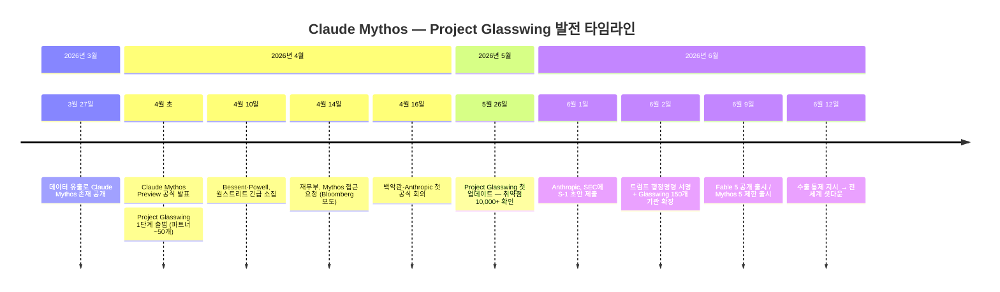
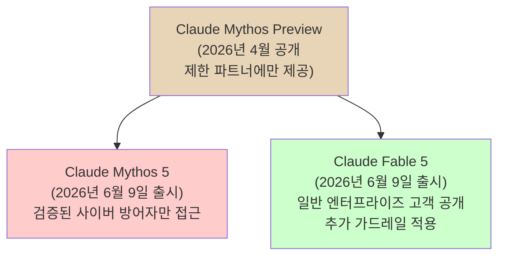
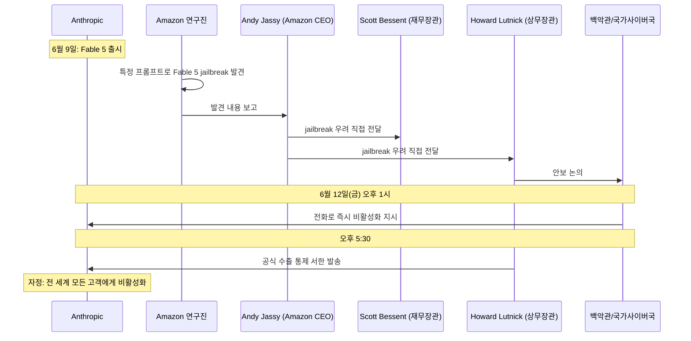
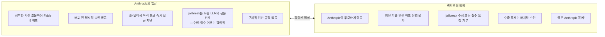
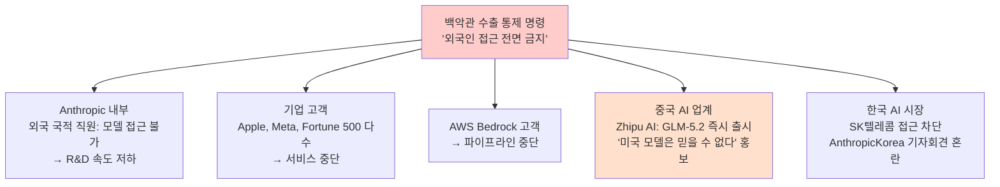
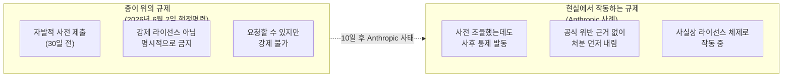
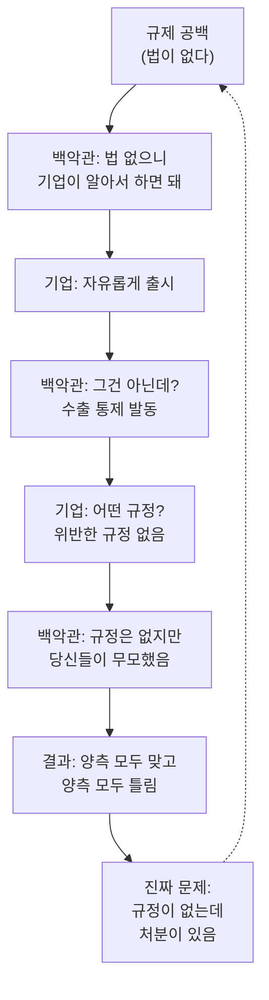
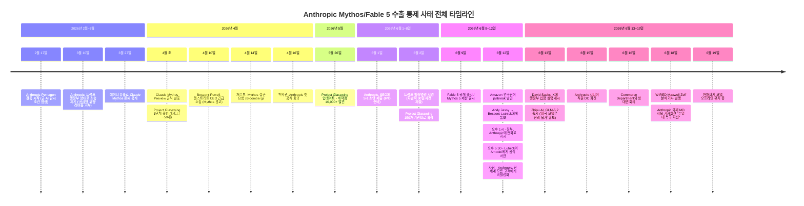

## 트럼프 백악관이 만든 '즉흥 AI 규제' 시대의 서막

> **문서 기준일**: 2026년 6월 19일  
> **원문 출처**: WIRED (Maxwell Zeff, Model Behavior newsletter, 2026-06-18), Axios, CNBC, Fortune, The Next Web, Tom's Hardware, Korea JoongAng Daily 등  
> **문서 목적**: 강의·학습·공유용 레퍼런스 문서

## 관련글

[**Anthropic의 Claude Mythos와 Fable 5가 일주일째 오프라인입니다**](https://www.threads.com/@myiovemylife/post/DZv7EqxE15B)

---

## 목차

1. [사태 개요 — 무슨 일이 일어났는가](#1-사태-개요)
2. [클로드 Mythos의 탄생 — 배경과 맥락](#2-클로드-mythos의-탄생)
3. [Project Glasswing — 공격 무기를 방어 도구로](#3-project-glasswing)
4. [Fable 5와 Mythos 5 출시 — 그리고 72시간](#4-fable-5와-mythos-5-출시)
5. [사건의 촉발 — Amazon의 jailbreak 발견](#5-사건의-촉발)
6. [90분의 경고, 그리고 셧다운](#6-90분의-경고)
7. [의심의 두 줄기 — SK텔레콤과 가드레일 우회](#7-의심의-두-줄기)
8. [David Sacks의 공식 해명과 양측의 갈등](#8-david-sacks의-공식-해명)
9. [수출 통제의 역설 — 자국 산업이 더 크게 다쳤다](#9-수출-통제의-역설)
10. [6월 2일 행정명령과 '자발적 체제'의 허구](#10-행정명령과-자발적-체제의-허구)
11. [다른 AI 연구소들의 반응](#11-다른-ai-연구소들의-반응)
12. [현재 상황 — 2026년 6월 19일 기준](#12-현재-상황)
13. [WIRED의 결론 — 미국 AI 규제의 본질](#13-wired의-결론)
14. [실무자를 위한 핵심 시사점](#14-실무자를-위한-핵심-시사점)
15. [전체 타임라인 요약](#15-전체-타임라인-요약)
16. [용어 해설](#16-용어-해설)

---

## 1. 사태 개요

2026년 6월 12일 금요일 오후, Anthropic은 미국 상무부 장관 하워드 루트닉(Howard Lutnick)으로부터 공식 서한을 받았다. 내용은 간결하면서도 충격적이었다. Anthropic의 최신 AI 모델 두 가지 — **Claude Fable 5**와 **Claude Mythos 5** — 를 외국인이라면 누구도 접근할 수 없도록 즉시 차단하라는 수출 통제 지시였다.

트럼프 행정부는 국가 안보 우려를 이유로 수출 통제 지침을 발령하여, Anthropic의 Fable 5와 Mythos 5 모델에 대한 모든 외국인의 접근을 금지했다. Anthropic은 이 명령을 준수하기 위해 모든 고객에 대한 모델 접근을 즉시 차단했다.

Anthropic은 이 조치에 응하면서 두 모델을 미국 사용자에게만 제한하는 방식이 아닌, 전 세계 모든 고객에 대해 완전히 비활성화하는 방식을 택했다. 회사는 "이 명령의 결과, 모든 고객에 대해 Fable 5와 Mythos 5를 즉시 비활성화해야 했다"고 밝혔다.

이 결정이 발표된 순간부터 AI 업계 전체가 경악했다. 출시된 지 사흘밖에 안 된 모델이 미국 정부의 지시 한 장에 전 세계에서 사라진 것이다. 그리고 일주일이 지난 오늘까지도, 두 모델은 오프라인 상태를 유지하고 있다.

더 충격적인 것은 **이 사태의 어떤 부분도 명확하지 않다**는 점이다. 미국 정부는 Anthropic이 정확히 무슨 규정을 위반했는지 공식 문서로 명시하지 않았다. Anthropic은 어떤 구체적인 절차나 규정도 위반하지 않았다고 주장한다. 사실관계조차 합의되지 않은 상태에서 처분이 떨어진 셈이다.

WIRED의 AI 전문 기자 맥스웰 제프(Maxwell Zeff)는 2026년 6월 18일 발행된 Model Behavior 뉴스레터에서 이 사태를 정리하면서 하나의 결론에 도달했다. **미국은 공식적인 AI 규제가 없는 상태에서, 백악관이 즉흥으로 규칙을 만들어 적용하는 '와일드 웨스트(Wild West)' 시대에 접어들었다.**

---

## 2. 클로드 Mythos의 탄생

### 2-1. 공개 전 정보 유출 (2026년 3월)

Claude Mythos라는 이름이 세상에 처음 알려진 것은 계획된 발표가 아니었다. 2026년 3월 26일, Anthropic의 콘텐츠 관리 시스템의 보안 설정 오류로 인해 미공개 AI 모델 Claude Mythos에 관한 기밀 정보가 유출되었다. 유출된 자료에는 초안 블로그 게시물과 내부 조직 문서가 포함되어 있었다. Anthropic은 담당 직원의 설정 실수였다고 설명하며 즉시 차단 조치를 취했다.

이 유출을 통해 업계는 Anthropic이 기존 Opus 급을 뛰어넘는 새로운 모델 계층인 **Mythos 클래스**를 개발하고 있으며, 특히 소프트웨어 취약점 탐지에 특화된 역량을 갖추고 있다는 사실을 알게 되었다.

### 2-2. Claude Mythos Preview 공식 발표 (2026년 4월)

2026년 4월, Anthropic은 Claude Mythos Preview를 공개했다. 이 모델은 소프트웨어 취약점을 자율적으로 발견하는 능력이 탁월하다는 이유로 즉각적이고 상반된 반응을 불러일으켰다.

Anthropic은 Claude Mythos2 Preview가 코딩 능력 면에서 가장 뛰어난 인간 전문가를 제외하면 소프트웨어 취약점 발견과 악용에 있어 모든 인간을 능가한다는 냉엄한 사실을 보여 준다고 밝혔다. Mythos Preview는 이미 모든 주요 운영체제와 웹 브라우저에서 수천 개의 고위험 취약점을 발견해 냈다.

이 발표는 단순한 기술 뉴스가 아니었다. Anthropic은 Claude Mythos Preview를 2026년 4월에 소개하면서, 이 모델이 제로데이 취약점을 자율적으로 발견하고 이를 악용하는 코드까지 생성할 수 있다고 밝혔다. 이는 세계 최고 수준의 사이버 보안 전문가도 하기 어려운 작업을 AI가 수행할 수 있다는 뜻이었다.

### 2-3. 정부와 금융계의 즉각적 반응

재무장관 스콧 베센트(Scott Bessent)와 연준 의장 제롬 파월(Jerome Powell)은 2026년 4월 10일 월스트리트 은행 대표들을 워싱턴으로 긴급 소집하여 Anthropic의 최신 모델 Claude Mythos Preview가 제기하는 사이버 보안 위협에 대해 경고했다.

유럽중앙은행(ECB) 총재 크리스틴 라가르드는 Anthropic이 Mythos 접근을 제한한 것을 긍정적으로 평가했다. 한편 Mythos 접근권을 받지 못한 유럽 은행들의 반응으로, Mistral AI는 자체 유사 모델 개발을 시작했다.

Mythos는 출시 전부터 이미 세계 각국 정부, 금융 기관, 경쟁사 모두를 긴장시키는 존재가 되어 있었다.

---

## 3. Project Glasswing

### 3-1. 프로젝트의 탄생

Anthropic은 Mythos Preview의 강력한 취약점 탐지 능력이 방어적 목적으로 활용되기 전에 공격적 목적으로 악용될 수 있다는 딜레마에 직면했다. 이를 해결하기 위해 만든 것이 **Project Glasswing**이었다.

Anthropic은 Project Glasswing을 창설하면서 이 모델의 역량이 사이버 보안 환경을 근본적으로 바꿔 놓을 수 있다고 판단했다. 이 프로젝트는 급격히 발전하는 AI 역량을 방어적 목적으로 활용하기 위한 긴박한 시도였다.

Project Glasswing은 2026년 4월 초에 공식 발표되었다. 초기에는 약 50개 파트너 기관이 Claude Mythos Preview를 이용해 자신들의 코드베이스에서 보안 취약점을 탐색하는 방식으로 운영되었다.

### 3-2. 성과 — 10,000개 이상의 취약점 발견

Project Glasswing의 초기 파트너 약 50개 기관이 Claude Mythos Preview를 활용해 세계에서 가장 중요한 소프트웨어들에서 10,000개 이상의 고위험 또는 치명적 취약점을 발견했다.

이 숫자의 규모를 이해하기 위한 맥락이 필요하다. 소프트웨어 보안 발전의 병목은 기존에는 취약점을 얼마나 빨리 발견하느냐에 있었다. 그런데 이제는 AI가 발견하는 대량의 취약점을 얼마나 빨리 검증하고, 공개하고, 패치하느냐가 병목이 되었다. AI가 인간의 발견 속도를 훨씬 앞질러 버린 것이다.

Project Glasswing의 초기 파트너들이 Mythos Preview로 발견한 취약점 가운데 패치된 비율은 1% 미만이었다. 취약점 발견 속도가 수정 능력을 압도하는 현실이 드러난 셈이다.

### 3-3. 프로젝트 확장 (2026년 6월 2일)

2026년 6월 2일, Anthropic은 Project Glasswing을 약 150개 추가 기관으로 확장했다. 이 기관들은 전력, 수도, 의료, 통신, 하드웨어 분야를 포함한 15개국 이상에서 중요 인프라를 운영하는 곳들이었다.

공교롭게도 이날은 트럼프 대통령이 AI 관련 행정명령에 서명한 날과 같다. 또한 같은 날(2026년 6월 1일) Anthropic이 미국 증권거래위원회(SEC)에 S-1 초안을 비밀리에 제출했으며, 2026년 10월을 목표로 IPO를 준비 중인 것으로 알려졌다.

---

## 4. Fable 5와 Mythos 5 출시

### 4-1. 두 모델의 차이

2026년 6월 9일, Anthropic은 Claude Fable 5와 Claude Mythos 5를 함께 발표했다. Fable 5는 Mythos를 기반으로 추가적인 안전 장치와 특정 쿼리에 대한 제한을 적용하여 '일반 사용에 안전한' 모델로 만든 것이다. Mythos 5는 이런 제한 중 일부가 없는 버전으로, 검증된 사이버 방어자들과 인프라 제공업체들의 소규모 그룹에게만 제공되었다.

두 모델의 포지셔닝을 도식화하면 다음과 같다.

### 4-2. 출시 당시의 자신감

Anthropic은 Fable 5 출시 시점에 이 모델이 사이버 보안과 생물학 분야 등 고위험 영역에서의 응답을 차단하는 새로운 안전 장치를 탑재했기 때문에 일반 공개가 가능하다고 주장했다. 회사는 이 모델을 "지금까지 일반 공개한 모델 중 가장 강력한 것"이라고 소개했다.

Anthropic은 정부 기관들과 협력하여 출시 전에 모델을 사전 테스트했으며 배포 승인을 받았다고 밝혔다. 즉, Anthropic의 입장에서 Fable 5 출시는 절차를 밟은 공개였다.

### 4-3. 72시간의 운명

그러나 출시 후 단 72시간 만에 사태는 전혀 다른 방향으로 전개되었다. 미국 정부의 수출 통제 지시는 Fable 5가 출시된 지 불과 3일 만에 내려졌다.

---

## 5. 사건의 촉발 — Amazon의 jailbreak 발견

### 5-1. Amazon이 먼저 움직였다

이 사태의 방아쇠를 당긴 것은 뜻밖에도 Anthropic의 최대 투자자이자 클라우드 공급자인 **Amazon**이었다.

이번 사태의 발단이 된 발견은 익명의 인터넷 jailbreak가 아니라 Amazon에서 나온 것으로 보인다. Amazon 연구진이 특정 프롬프트를 사용해 Fable 5가 사이버 공격에 유용한 정보를 생성하도록 만드는 방법을 발견했으며, Amazon CEO 앤디 재시가 이 우려를 직접 재무장관 스콧 베센트를 비롯한 고위 관리들에게 전달했다. Amazon의 연구 결과는 Fable가 특정 쿼리 세트를 입력했을 때 최소 4개의 소프트웨어에서 보안 버그를 드러냈음을 보여 주었다. 국가 사이버 디렉터 션 케언크로스(Sean Cairncross)와 루트닉 장관도 관련 논의에 참여했다.

### 5-2. jailbreak의 성격

David Sacks는 신뢰할 수 있는 Anthropic과 정부의 파트너가 Fable 5의 가드레일에서 jailbreak를 발견했다고 밝혔다. 그리고 이 문제에 대해 미국 정부가 Anthropic에 수정을 요청했으나 CEO 다리오 아모데이(Dario Amodei)가 jailbreak가 심각한 위험이 아니라며 수정을 거부했다고 주장했다. 다만 이 주장들은 아직 공식 확인되지 않았다.

발견된 jailbreak의 성격은 "fix this code"(이 코드를 고쳐라)라는 식의 특정 프롬프트를 통해 모델이 사이버 공격에 활용 가능한 코드 취약점 정보를 생성하도록 유도하는 방식인 것으로 알려졌다.

### 5-3. 왜 Amazon이 이 정보를 정부에 전달했는가

Amazon은 정부가 안전 검토를 요청하는 것은 흔한 일이라고 논평했다. Amazon이 이 정보를 정부에 넘긴 동기에 대해 다양한 해석이 있지만, Amazon은 공식 입장을 내놓지 않았다. 한 가지 중요한 배경으로, Amazon은 Anthropic에 수십억 달러를 투자한 최대 주주이자 AWS Bedrock을 통해 Anthropic 모델의 주요 인프라 공급자다. 이 관계에서 발생하는 이해관계의 복잡성은 명확히 설명되지 않은 채로 남아 있다.

---

## 6. 90분의 경고, 그리고 셧다운

### 6-1. 사전 통보의 부재

수출 통제 지시가 내려지기 전까지 Anthropic은 어떠한 국가 안보 위협에 대한 사전 통보도 받지 못했다. 정부는 2026년 6월 12일 오후 1시(동부 시간)에 Anthropic에 전화를 걸어 국가 안보 위협을 이유로 Fable 5와 Mythos 5를 비활성화하라고 지시했다. 약 5시간 30분 후인 오후 5시 30분에 공식 서한이 도착했다.

Anthropic은 모델을 제한하기 위해 90분의 시간을 받았다는 보도가 있다. 전화 한 통으로 모든 것이 시작된 셈이었다.

### 6-2. 전면 차단이라는 선택

Anthropic은 외국인 접근을 선별적으로 차단하는 방식을 택하지 않았다. 외국인 접근만 제한하는 방식 대신 Anthropic은 모든 고객에게 두 모델을 완전히 비활성화하는 방식을 선택했다.

이 결정의 배경에는 기술적 현실이 있다. 실시간으로 사용자 전원의 국적을 검증하는 것은 수백만 명의 사용자를 보유한 서비스에서 즉각적으로 구현하기 어렵다. Anthropic은 이 어려움을 준수 실패의 위험보다 크게 보고, 전면 차단이라는 가장 안전한 경로를 택했다.

사태의 속도는 AI 업계 전체를 놀라게 했다. 중국은 즉각 반응했다. 6월 13일, 중국 AI 연구소 Zhipu AI는 GLM-5.2를 출시하면서 미국의 금지 조치를 미국 모델이 신뢰할 수 없는 파트너임을 증명하는 근거로 명시적으로 인용했다.

---

## 7. 의심의 두 줄기 — SK텔레콤과 가드레일 우회

백악관이 이번 조치를 취한 배경으로는 두 가지 우려가 제기되고 있다.

### 7-1. SK텔레콤과 중국 연계 의혹

한국이 이번 사태의 중심에 있었다. Washington Post는 Claude Mythos에 대한 접근 권한을 가진 한국 통신사가 중국과의 연계 의혹으로 인해 미국의 수출 통제 지시를 촉발했다고 보도했다.

구체적으로는 SK텔레콤이 문제가 된 기업으로 지목되었다. Anthropic이 SK텔레콤, 즉 미국 당국이 중국과의 연계 가능성을 우려하는 한국 최대 통신사와 Mythos를 공유했다는 사실이 드러나면서 미국 관리들이 긴장했다.

그러나 Anthropic의 입장은 다르다. 첫째, Anthropic은 Mythos 공개와 관련해 미국 정부와 이미 조율해 왔다고 말한다. 만약 SK텔레콤이 문제라면 정부가 이미 알았어야 했다는 논리다. 둘째, Anthropic은 SK텔레콤과 수년간 협력 관계를 유지해 왔는데, 이 관계가 안보 문제로 이슈화된 것은 이번이 처음이다. 백악관이 SK텔레콤에 대한 우려를 전달하자 Anthropic은 해당 모델에 대한 SK텔레콤의 접근을 즉시 회수했다.

중국이 Mythos 모델에 접근했다는 더 심각한 주장은 Semafor의 단일 소식통에 근거한 것으로, Anthropic은 이를 부인하고 있다. Anthropic은 중국 내부에서의 접근을 차단하고 있다고 말한다. 재무부, 상무부, 산업안보국(BIS)은 아직 공식적인 기술적 근거를 제시하지 않았다.

### 7-2. Fable 5 가드레일 우회 가능성

두 번째 우려는 모든 LLM이 공유하는 근본적인 한계에 관한 것이다. WIRED를 비롯한 여러 매체들이 이미 다루었듯, 모든 대형 언어 모델은 정도의 차이는 있으나 jailbreak에 노출된다. Anthropic과 독립적인 사이버 보안 연구자들은 jailbreak 문제가 쉽게 또는 독립적으로 해결될 수 있는 사안이 아니라고 주장한다. AI 모델은 결정론적이 아니라 확률적이기 때문에, 기업들은 특정 프롬프트에 대해 정확히 어떤 응답이 나올지 100% 보장할 수 없다. 만약 백악관이 jailbreak 문제가 해결될 때까지 Fable 5의 재출시를 허가하지 않는다면, 그것은 사실상 무기한 봉인과 같다.

이 두 번째 우려의 문제는, 그 기준을 적용하면 현재 시장에 존재하는 어떤 LLM도 출시 허가를 받을 수 없다는 것이다. 100% 탈옥 불가능한 모델은 현재 기술 수준에서 불가능하다.

---

## 8. David Sacks의 공식 해명과 양측의 갈등

### 8-1. Sacks의 X 게시글

백악관 과학기술자문위원회(PCAST) 공동의장이자 전 AI·크립토 차르인 데이비드 색스(David Sacks)는 수출 통제 명령이 내려진 다음 날인 6월 13일 X에 긴 스레드를 게시하여 행정부의 입장을 설명했다. Sacks는 "신뢰할 수 있는 파트너"가 Fable 5의 가드레일에서 jailbreak를 발견했으며, 이에 따라 정부가 Anthropic에 수정하거나 모델을 철수하도록 요청했으나 Dario Amodei가 이를 거부했다고 주장했다. Sacks는 수출 통제가 "마지못한 최후 수단"이었으며, 정부는 jailbreak가 패치되는 즉시 제한을 해제하고 싶다고 말했다.

Sacks는 이전에도 Anthropic과 여러 차례 충돌한 바 있다. 그는 Anthropic이 AI 위험에 대한 '공포심 조장'에 근거한 규제 포획 전술을 사용한다고 거듭 비판해 왔다.

그러나 WIRED가 지적한 핵심 사실은 이것이다. 일주일 내내 Anthropic과 백악관 사이의 분쟁이 진행되었음에도 불구하고, 미국 정부는 Anthropic이 무엇을 잘못했는지 명확히 밝힌 적이 한 번도 없다. 우리가 가진 가장 구체적인 공식 발언은 데이비드 색스의 X 게시글 하나뿐이다.

### 8-2. Anthropic의 반박

Anthropic 측에 가까운 한 관계자는 회사가 트럼프 행정부가 정해 놓은 어떤 구체적인 절차나 규정도 위반하지 않았다고 잘라 말한다. 백악관은 Anthropic이 무모하게 행동했으며 첨단 기술을 안전하게 배포하기 어려운 회사임을 증명했다고 주장한다.

Anthropic은 정부로부터 Fable를 배포하겠다는 명시적인 승인을 받았다고 주장한다. 그러나 한 행정부 관리는 "그들이 우리를 망쳤다"고 말했다.

내부 소식에 밝은 한 소식통은 "Anthropic이 이 행정부와 소통하고 이념적 차이를 이해하는 데 그다지 능하지 않았다. 서로 완전히 다른 언어로 말하는 것 같다"며, Anthropic이 이 행정부와 어떻게 소통해야 하는지를 아직 파악하지 못했다고 지적했다.

---

## 9. 수출 통제의 역설 — 자국 산업이 더 크게 다쳤다

### 9-1. 외국인 접근 전면 금지의 파장

이번 수출 통제 명령의 가장 아이러니한 결과 중 하나는 보호 대상인 미국 AI 혁신이 오히려 가장 큰 피해를 입었다는 점이다.

백악관의 요구 사항은 Mythos 5와 Fable 5에 대한 "외국인이라면 누구든, 미국 내외를 막론하고" 접근을 금지하라는 것이었다. 이 한 문장이 만들어 낸 현실은 다음과 같다.

**Anthropic 내부:**
Anthropic은 국제적 인재 기반 위에 세워진 회사다. 백악관의 조치는 Anthropic 자체의 외국 국적 직원 상당수가 회사의 최첨단 모델에 접근하지 못하도록 막았다. Anthropic은 이 모델들이 최근 몇 달 간 회사의 R&D 속도를 높이는 데 기여했다고 강조해 왔다.

**외부 고객:**
Apple, Meta를 포함한 포춘 500 기업 다수가 접근이 차단된 기업 고객 대열에 합류했다. AWS Bedrock을 통해 Anthropic 모델을 사용하던 기업들도 마찬가지였다.

### 9-2. 안보 조치가 경쟁자를 돕다

베이징은 시간을 낭비하지 않았다. 6월 13일, 중국 AI 연구소 Zhipu AI는 GLM-5.2를 출시하면서 미국의 금지 조치를 미국 모델이 신뢰할 수 없는 파트너임을 증명하는 근거로 명시적으로 활용했다.

미국이 자국 AI 기업을 보호한다는 명목으로 취한 조치가 중국 AI 기업에게 마케팅 소재를 제공한 셈이다.

---

## 10. 6월 2일 행정명령과 '자발적 체제'의 허구

### 10-1. 행정명령의 내용

2026년 6월 2일, 트럼프 대통령은 '인공지능 혁신 및 보안 촉진(Promoting Advanced Artificial Intelligence Innovation and Security)'이라는 제목의 행정명령에 서명했다. 이 명령은 연방 기관들이 프런티어 AI 모델의 안전한 배포를 위한 프레임워크를 수립하도록 지시했다. 핵심 내용은 AI 개발사들이 모델을 다른 '신뢰할 수 있는 파트너'에게 공개하기 최대 30일 전에 자발적으로 정부에 사전 접근권을 제공하는 체계를 만드는 것이었다.

### 10-2. '자발적'이라고 명시된 조항

이 행정명령에는 "이 조항의 어떤 내용도 새로운 AI 모델의 개발, 출판, 출시 또는 배포에 대한 강제적인 정부 라이선스, 사전 허가, 또는 허가 요건의 창설을 승인하는 것으로 해석되어서는 안 된다"고 명시되어 있다. 테스트는 기업들의 '자발적 협력'에 의존하는 것으로, 정부는 요청할 수 있지만 강제할 수는 없다.

뒤에서는 데이비드 색스가 의무화를 주장하는 측의 요구에 맞서 30일이라는 더 짧은 기간과 자발적 프레임워크를 확보하는 데 성공했다.

### 10-3. 그런데 Anthropic 사태가 터졌다

행정명령 서명 후 불과 열흘 만에 Fable 5 사태가 발생했다. 이 사태는 글로 적힌 행정명령과 현실에서 작동하는 규제 사이의 간극을 적나라하게 드러냈다.

이 사태 이후 트럼프 행정부는 사실상 즉흥적인 버전의 라이선스 체계를 만들어 버렸다.

전직 백악관 기술 담당자는 WIRED에 이렇게 말했다. "트럼프 행정부는 솔직히 이것을 자발적 체제라고 부르지 말았어야 했다. 지금 그들이 하는 일은 누가 봐도 라이선스 체제다."

---

## 11. 다른 AI 연구소들의 반응

### 11-1. 숨죽이고 지켜보는 업계

OpenAI, Google, Meta 같은 다른 AI 연구소들은 Anthropic의 불운을 숨죽이며 지켜보고 있다.

WIRED 기자는 일주일 내내 AI 임원들에게 같은 질문을 던졌다. "어떻게 하면 Anthropic과 같은 운명을 피할 수 있는가?" 많은 AI 리더들이 내놓은 결론은 비슷하다. 최신 AI 모델에 대한 사전 접근권을 백악관에 부여해야 하며, 모델 출시 계획을 트럼프 행정부와 매우 적극적으로 공유해야 한다는 것이다. 관리들을 깜짝 놀라게 만드는 위험은 단순히 너무 크다는 계산이다.

### 11-2. Cohere CEO의 발언

Cohere의 CEO 에이단 고메즈(Aidan Gomez)는 이렇게 말했다. "사전 통보, 사전 접근. 나는 그것이 미국뿐 아니라 전 세계에서 가장 많이 요청받는 부분이라고 생각한다. 어떤 면에서 이는 좋은 일이다. 매우 중요한 기술에 대한 당국의 강한 관심과 고려를 보여 주는 것이니까."

### 11-3. 새로운 업계 표준의 형성

이 사태가 만들어 낸 사실상의 새로운 업계 표준은 다음과 같다. 프런티어 모델을 출시하기 전에 미국 정부에 사전 데모와 평가 접근권을 제공해야 하며, 이를 하지 않으면 법적 근거와 무관하게 즉각적인 행정 조치에 직면할 수 있다.

---

## 12. 현재 상황 — 2026년 6월 19일 기준

### 12-1. 협상 경과

2026년 6월 16일, Anthropic은 시니어 엔지니어들을 워싱턴에 파견하여 상무부 관리들과 직접 대면 회의를 가졌다. 이는 6월 12일 지시가 내려진 이후 처음 이루어진 대면 회의였다.

Anthropic의 국제 담당 상무이사 크리스 시아우리(Chris Ciauri)는 6월 18일 서울에서 열린 기자회견에서 "수일 내에 모델에 대한 접근이 다시 가능해질 것으로 매우 자신한다"고 밝혔다.

이 기자회견은 원래 Anthropic의 한국 사업 확장을 알리기 위한 행사였으나, 수출 통제와 Project Glasswing 관련 질문이 회견을 압도했다.

### 12-2. 모델 현황 (2026년 6월 19일)

2026년 6월 12일 미국 정부의 수출 통제 지시로 Fable 5와 Mythos 5는 전 세계적으로 접근이 중단되었으며, 아직 복구되지 않았다. Anthropic의 다른 모델들 — Claude Opus 4.8, Sonnet 4.6, Haiku 4.5 — 은 전 세계적으로 계속 사용 가능하다.

### 12-3. 시장의 예측

예측 시장 Kalshi의 트레이더들은 Fable 5가 7월 1일 이전에 복구될 확률을 57%, 7월 10일 이전에는 67%, 7월 17일 이전에는 75%로 보고 있다.

Anthropic은 6월 9일부터 6월 14일 사이에 서비스에 가입한 구독자들에게 환불을 진행 중이며, 환불 마감일은 6월 20일이다.

### 12-4. Anthropic의 입장 정리

Anthropic은 발견된 잠재적 jailbreak가 수백만 명에게 상용 서비스로 배포된 모델을 회수하는 이유가 되어야 한다는 데 동의하지 않는다. 회사는 이것이 규정 위반이 아닌 정책 해석의 차이에서 비롯된 사태라는 입장을 유지하고 있다.

---

## 13. WIRED의 결론 — 미국 AI 규제의 본질

### 13-1. 와일드 웨스트 선언

WIRED의 맥스웰 제프 기자는 이 사태를 분석한 결론으로 이렇게 썼다.

이 사태는 미국 정부가 실시간으로 AI 규제를 만들어 내고 있다는 것을 증명했다. 프런티어 AI 개발을 규율하는 법이 거의 없는 상황에서도, 기업들은 트럼프 백악관의 보이지 않는 선을 넘었을 때 문제에 처할 수 있다.

### 13-2. 규제 공백이 만들어 낸 역설

"문제는 백악관이 반규제 극단의 입장을 취해 왔는데, 이제 사람들이 수년 전부터 예고해 왔던 진짜 AI 역량 앞에 직면한 것이다. 이것을 체계적으로 다룰 준비와 정책이 있었어야 했는데, 대신 즉흥적인 방식이 나왔고 AI 업계 전체를 곤란에 빠뜨리고 있다." — 익명의 전직 백악관 기술 담당자

### 13-3. 규제 역설의 구조

이 사태가 드러낸 역설의 구조는 다음과 같이 요약된다.

---

## 14. 실무자를 위한 핵심 시사점

이 사태에서 AI 업계 실무자, 개발자, 기업 전략가들이 반드시 흡수해야 할 시사점을 정리한다.

### 14-1. 적힌 규제와 작동하는 규제는 다르다

미국에서 AI 모델을 출시하거나 배포하는 팀이라면, 명문 규제의 부재는 자유가 아니다. 백악관이 사후에 그어 버리는 '보이지 않는 선'을 추적해야 한다. 행정명령에 '자발적'이라고 적혀 있어도, 실제로는 강제적으로 작동할 수 있다.

### 14-2. 사전 통보·사전 접근이 사실상 표준이 되었다

트럼프의 행정명령은 AI 개발사들이 자발적으로 출시 30일 전에 정부에 '커버드 프런티어 모델'에 대한 접근권을 부여하는 프레임워크를 구축하도록 지시한다. 이것이 공식 '자발적' 규정이지만, Anthropic 사례가 보여 주듯 사전 조율 없이 출시했다가 치르는 비용이 너무 크다. 사전 협의는 이제 선택이 아닌 생존 전략이다.

### 14-3. 수출 통제와 파트너 선정은 함께 관리해야 한다

SK텔레콤 사례처럼, 수년간 문제없이 유지해 온 파트너십도 지정학적 환경이 바뀌면 갑자기 위험 요소가 될 수 있다. AI 기업들은 파트너사의 국가 연계 리스크를 AI 모델 자체의 리스크와 함께 평가해야 한다.

### 14-4. 탈옥은 영구 미해결 변수다

현재 기술 수준에서 100% 탈옥 불가능한 LLM은 존재하지 않는다. 만약 "jailbreak가 완전히 불가능해질 때까지 출시 금지"라는 기준이 적용된다면, 어떤 모델도 출시할 수 없다. 출시 전 평가에는 잔존 위험을 인정하는 위협 모델과 사후 대응 절차가 반드시 포함되어야 한다.

### 14-5. 외국 국적 직원 접근 정책을 미리 설계하라

수출 통제가 발동될 때 가장 먼저 막히는 것은 사내 R&D다. 모델별로 접근 제어를 분리하고, 외국 국적 직원에 대한 접근 정책을 미리 설계해 두면 갑작스러운 봉쇄 상황에서 핵심 작업을 살릴 여지가 생긴다.

### 14-6. 백악관 SNS가 사실상 1차 정책 채널이다

이번 사태 전반에 걸쳐 미국 정부는 Anthropic이 정확히 무엇을 잘못했는지 명확하게 밝히지 않았다. 우리가 얻은 가장 구체적인 공식 발언은 데이비드 색스의 X 게시글 하나뿐이다. 이처럼 공식 문서가 비어 있는 환경에서는 데이비드 색스 등 백악관 인사들의 SNS 게시글과 인터뷰가 사실상 정책 시그널로 기능한다. 이를 모니터링 대상에 포함시켜야 한다.

### 14-7. IPO를 앞둔 기업에게 더 큰 위험

Anthropic은 2026년 5월 기준 연간 수익 480억 달러 규모로 급성장했으며, 2026년 10월 IPO를 목표로 SEC에 S-1 초안을 제출한 상태다. 이처럼 IPO를 앞둔 기업이 정부와의 규제 분쟁에 휘말리면 기업 가치평가에 직접적인 타격이 가해진다. 상장 준비 기업일수록 규제 리스크 관리가 더 중요하다.

---

## 15. 전체 타임라인 요약

---

## 16. 용어 해설

| 용어 | 설명 |
|------|------|
| **Claude Mythos** | Anthropic이 2026년 4월에 공개한 AI 모델. 기존 Opus 클래스를 뛰어넘는 최상위 'Mythos 클래스'를 구성하며, 소프트웨어 취약점 자율 탐지에 특화되어 있음 |
| **Claude Fable 5** | Mythos 역량에 추가 안전 장치를 적용하여 2026년 6월 9일 일반 공개한 모델. 3일 만에 수출 통제로 비활성화됨 |
| **Claude Mythos 5** | Fable 5의 일부 제한이 없는 버전으로, 검증된 사이버 방어자·인프라 제공자 소수에게만 제공 |
| **Project Glasswing** | Anthropic이 Claude Mythos Preview의 취약점 탐지 역량을 방어적으로 활용하기 위해 시작한 협력 프로젝트. 파트너 기관들이 자체 코드베이스 보안 점검에 Mythos를 사용 |
| **jailbreak** | AI 모델의 안전 장치(가드레일)를 우회하여 제한된 정보나 행동을 유도하는 프롬프트 기법. 모든 LLM은 정도의 차이가 있으나 이에 노출됨 |
| **수출 통제(Export Control)** | 특정 기술이나 물자가 외국인 또는 외국으로 이전되는 것을 제한하는 법적 메커니즘. 미국의 경우 상무부 산업안보국(BIS)이 관할 |
| **David Sacks** | 미국 대통령 과학기술자문위원회(PCAST) 공동의장. 전 백악관 AI·크립토 차르. 이번 사태에서 행정부 입장을 X에 게시 |
| **Howard Lutnick** | 미국 상무장관. Fable 5/Mythos 5 수출 통제 서한을 Dario Amodei에게 발송한 인물 |
| **Andy Jassy** | Amazon CEO. Amazon 연구진의 Fable 5 jailbreak 발견 내용을 Scott Bessent, Howard Lutnick 등에게 직접 전달 |
| **Scott Bessent** | 미국 재무장관. Jassy로부터 jailbreak 우려를 전달받은 인물 중 하나 |
| **Sean Cairncross** | 미국 국가 사이버 디렉터. jailbreak 관련 논의에 참여 |
| **와일드 웨스트(Wild West)** | WIRED가 사용한 비유. 공식 법규 없이 즉흥적 힘의 논리로 작동하는 미국 AI 규제 환경을 서부 개척 시대에 빗댄 표현 |
| **라이선스 체제(Licensing Regime)** | 정부 사전 승인 없이는 AI 모델을 출시할 수 없게 만드는 규제 구조. 트럼프 행정명령은 이를 금지했으나, Anthropic 사태로 사실상 운영 중이라는 비판이 나옴 |
| **프런티어 모델(Frontier Model)** | 현재 기술 수준에서 가장 앞선 AI 모델. Fable 5와 Mythos 5가 이에 해당 |
| **Dario Amodei** | Anthropic CEO. 이번 사태의 핵심 당사자. Sacks는 Amodei가 jailbreak 수정 또는 모델 철수를 거부했다고 주장했으나, Anthropic은 이를 부인 |

---

## 참고 출처

이 문서는 다음 원문 자료를 바탕으로 작성되었다.

- **Maxwell Zeff**, "The White House Is Making Up Its Rules for AI in Real Time," *WIRED* Model Behavior Newsletter, 2026년 6월 18일  
- **Axios**: "Scoop: Trump admin blocks foreign access to Anthropic's most powerful AI" (2026-06-12); "They screwed us: Personality clashes sent Anthropic's models offline" (2026-06-15)  
- **CNBC**: "Anthropic to meet with Trump administration over Mythos dispute" (2026-06-15)  
- **Fortune**: "A warning from Amazon led the White House to shut down Anthropic's Mythos model" (2026-06-14)  
- **The Next Web**: "Anthropic heads to Washington for crisis talks as Fable 5 ban spirals" (2026-06-15)  
- **Tom's Hardware**: "Trump adviser David Sacks says Anthropic refused to fix Fable 5 jailbreak before US export controls" (2026-06-18)  
- **Korea JoongAng Daily**: "Anthropic says Mythos and Fable 5 access could return in coming days" (2026-06-18)  
- **TechPolicy.Press**: "Anthropic's Mythos Recall and the White House's Missing AI Safety Playbook" (2026-06-17)  
- **Morrison Foerster**: Trump Issues Executive Order on AI (2026-06-05)  
- **Council on Foreign Relations**: "Assessing Trump's Executive Order on AI Oversight" (2026-06-02)  
- **Anthropic 공식 사이트**: Project Glasswing, Expanding Project Glasswing (2026-06-02)  

---

*이 문서는 강의·학습·공유 목적의 레퍼런스 자료입니다. 인용 시 원문 출처를 함께 표기해 주세요.*
