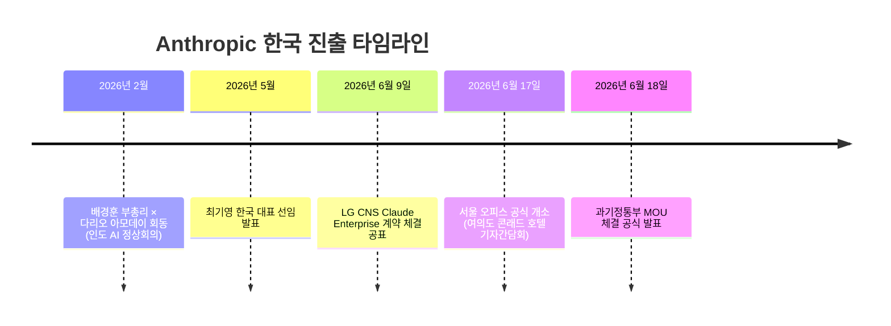
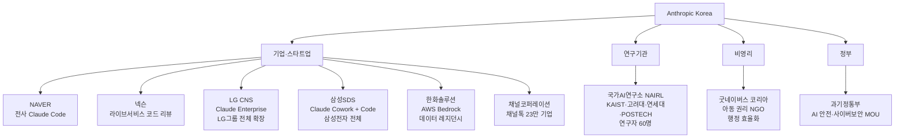
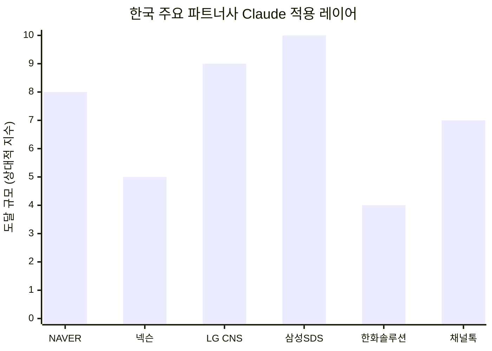
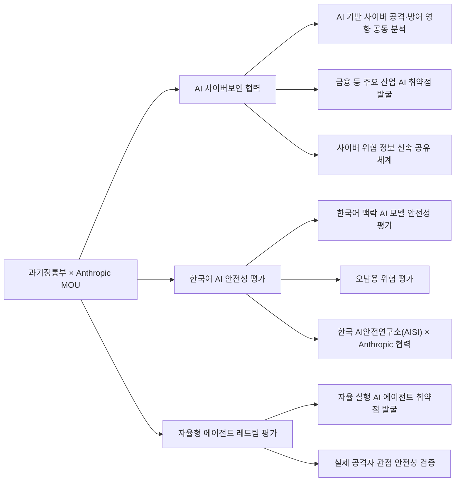
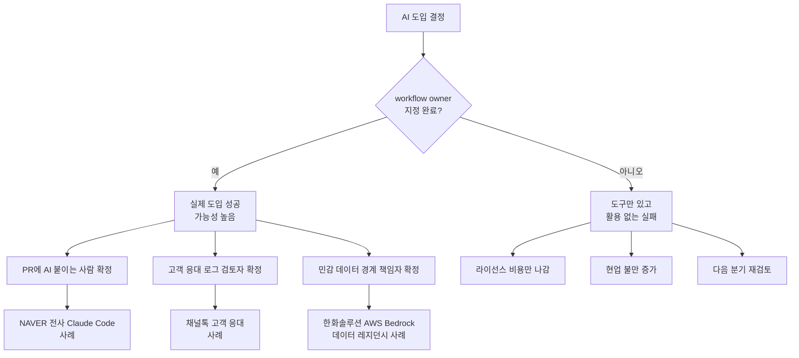

> **원출처**: Anthropic 공식 발표 (2026년 6월 17일)  
> **참고 포스트**: Threads [@ody_daddy](https://www.threads.com/@ody_daddy/post/DZwNYf-EfDX) (2026년 6월 18일)  
> **문서 작성 기준일**: 2026년 6월 19일  

---

## 목차

1. [이 포스트가 말하려는 것](#1-이-포스트가-말하려는-것)
2. [Anthropic 서울 오피스 개소: 배경과 의미](#2-anthropic-서울-오피스-개소-배경과-의미)
3. [최기영 대표: 누가 한국을 이끄는가](#3-최기영-대표-누가-한국을-이끄는가)
4. [기업 도입 사례 6선: 현실에서 벌어지는 일](#4-기업-도입-사례-6선-현실에서-벌어지는-일)
5. [연구·비영리 파트너십](#5-연구비영리-파트너십)
6. [과기정통부 MOU: 정부와의 공식 협력](#6-과기정통부-mou-정부와의-공식-협력)
7. [개발자 생태계: 숫자로 보는 한국의 Claude 열기](#7-개발자-생태계-숫자로-보는-한국의-claude-열기)
8. [Threads 포스트의 핵심 통찰: "workflow 표"가 먼저다](#8-threads-포스트의-핵심-통찰-workflow-표가-먼저다)
9. [전략적 맥락: 왜 지금, 왜 한국인가](#9-전략적-맥락-왜-지금-왜-한국인가)
10. [결론: "어느 팀 workflow에 먼저 박을 건데요?"](#10-결론-어느-팀-workflow에-먼저-박을-건데요)

---

## 1. 이 포스트가 말하려는 것

Threads에 올라온 @ody_daddy의 짧은 글은 단순한 뉴스 요약이 아니다. Anthropic이 서울에 공식 사무소를 연 날, 발표문 어딘가에 묻혀 있는 몇 줄의 실용적 정보를 끄집어내어 "진짜로 중요한 게 뭔지"를 짚어낸 글이다.

포스트의 출발점은 아주 단순한 관찰에서 시작한다. "로고보다 먼저 봐야 할 줄이 있다." 오피스 개소 행사에는 화려한 파트너사 로고와 악수 장면이 넘쳐난다. 그러나 그 뒤에 숨어 있는 실제 도입 사례들—NAVER 전사 엔지니어 조직, 넥슨 라이브서비스 코드 리뷰, Channel Talk의 23만 개 기업 고객 응대—이야말로 이 기술이 '현실 업무'에 어떻게 박혀 있는지를 보여준다는 것이다.

그리고 포스트는 거기서 한 발 더 나아간다. 대표가 "우리도 Claude 사야 하나?"라고 물어온다면, 대답은 구매처 정보보다 먼저 **workflow 설계표**여야 한다. 누가 Pull Request(PR)에 AI를 붙이고, 누가 고객 응대 로그를 검토하고, 누가 민감 데이터 경계를 책임지는가—이 세 가지가 명확하지 않으면 아무리 좋은 모델도 조직 안에 뿌리를 내리지 못한다는 뜻이다.

이 문서는 그 포스트가 언급한 발표 전체를 풀어내면서, 실제로 무슨 일이 있었고 그 안에 어떤 의미가 담겨 있는지를 상세히 살핀다.

---

## 2. Anthropic 서울 오피스 개소: 배경과 의미

2026년 6월 17일, Anthropic은 서울 여의도 콘래드 호텔에서 기자간담회를 열고 한국 공식 사무소 개소를 선언했다. 이 자리에는 크리스 차우리(Chris Ciauri) Anthropic 인터내셔널 총괄과 최기영 한국 대표가 함께했으며, Anthropic 본사 고위 임원진도 직접 서울을 방문했다.

이번 서울 오피스는 Anthropic의 아시아태평양 세 번째 거점이다. 도쿄와 벵갈루루(인도)에 이은 것이며, 아시아 전체로는 일본·인도·호주에 이은 네 번째 해외 사무소다. 한국이 이 순서에 포함됐다는 것 자체가 Anthropic이 한국 시장을 전략적 우선순위로 분류했다는 신호다.

개소 배경을 거슬러 올라가면 2026년 2월 인도에서 열린 '2026 AI 영향 정상회의(AI Impact Summit 2026)'로 이어진다. 당시 배경훈 부총리 겸 과학기술정보통신부 장관이 Anthropic CEO 다리오 아모데이(Dario Amodei)와 만나 협력 방안을 논의한 것이 이번 MOU와 오피스 개소의 실질적 출발점이었다.

Anthropic은 한국을 단순한 판매 시장이 아니라 "아시아의 교두보이자 핵심 전략 거점"으로 표현했다. 실제로 Anthropic의 자체 경제지수(Economic Index)에 따르면, 한국은 인구 규모 대비 기대치의 3.5배를 초과하는 Claude 사용량을 기록 중이며, 글로벌 Claude.ai 사용 상위 12개국 안에 들어 있다. 사용이 집중되는 분야는 주로 기술 개발과 창작 작업이다.

---

## 3. 최기영 대표: 누가 한국을 이끄는가

서울 오피스를 이끄는 최기영 대표는 한국 기술 산업계에서 약 30년의 경력을 가진 베테랑이다. 이력을 보면 Google Cloud 한국 총괄, Adobe 한국 법인장, Autodesk 한국 법인장, Microsoft Korea COO를 거쳤고, 가장 최근에는 Snowflake Korea 지사장을 맡았다. 이번 Anthropic Korea 대표직은 2026년 5월 선임이 발표됐으며, 오피스 개소 시점에 맞춰 공식 취임했다.

이 이력이 중요한 이유가 있다. 최기영 대표가 거쳐온 회사들—Google Cloud, Adobe, Autodesk, Microsoft, Snowflake—은 모두 대기업을 상대로 기술 솔루션과 라이선스를 파는 B2B 엔터프라이즈 세일즈 전문 회사들이다. 그는 한국의 대기업 구매 결정 구조와 IT 조직의 언어를 누구보다 잘 이해하는 사람이다. Anthropic이 순수 기술 인재가 아닌 세일즈·파트너십 전문가를 초대 한국 대표로 낙점했다는 것은, 이번 한국 진출의 핵심이 기술 연구가 아니라 대기업 납품과 에코시스템 확장에 있음을 시사한다.

---

## 4. 기업 도입 사례 6선: 현실에서 벌어지는 일

Anthropic이 오피스 개소와 함께 공개한 파트너십 목록에는 한국 주요 기업들이 대거 포함됐다. 발표된 사례들을 하나씩 살펴본다.

### 4.1 NAVER: 아시아 최대 기업 도입 사례

한국의 최대 포털이자 클라우드·AI 기업인 NAVER는 엔지니어링 조직 전체에 Claude Code를 도입했다. Anthropic은 이를 "아시아에서의 기업 차원 최대 도입 사례"라고 명시했다. 수천 명에 달하는 NAVER의 엔지니어들이 이제 Claude Code를 통해 코딩 도구를 다각화하고 생산성을 높이는 방식으로 일하고 있다.

주목해야 할 지점은 "전사 도입"이라는 단어다. 특정 팀이나 일부 프로젝트가 아니라 엔지니어링 조직 전체가 Claude Code를 사용 도구로 받아들였다. 이는 NAVER 내부에서 상당한 사전 검증과 보안 검토가 완료됐다는 의미이기도 하다.

### 4.2 넥슨: 라이브서비스 게임의 코드 리뷰

글로벌 온라인 게임사 넥슨은 운영 중인 라이브서비스 게임의 코드 작성·검토·배포 작업에 Claude Code를 활용하고 있다. 라이브서비스 게임이라는 특성이 중요하다. 서비스 중인 게임은 매일 수백만 명의 플레이어가 접속하는 환경이기 때문에 코드 변경 한 줄이 장애로 이어질 수 있다. 그 민감한 환경에서 코드 리뷰 도구로 Claude Code를 채택했다는 것은 신뢰 수준이 높다는 뜻이다.

### 4.3 LG CNS: LG그룹 전체를 향한 확장

LG그룹의 IT 서비스 계열사인 LG CNS는 2026년 6월 9일—오피스 개소보다 일주일 앞서—이미 Anthropic과 "Claude Enterprise" 도입 계약을 체결했음을 별도로 발표했다. 이 계약은 단순히 LG CNS 임직원만을 위한 것이 아니라 LG그룹 전 계열사에 적용 가능한 포괄 계약 형태다.

현재 LG CNS는 수천 명의 자사 임직원에게 Claude를 순차 배포하여 소프트웨어 개발과 고객사 기술 솔루션 제공 업무에 활용하고 있으며, 향후 LG그룹 전체로 확장하는 로드맵을 갖고 있다. 이는 Claude가 단일 계열사 도구가 아니라 그룹 표준 AI 인프라로 자리잡을 가능성을 시사한다.

### 4.4 삼성SDS: 삼성전자 전체로

삼성그룹의 IT 서비스 계열사인 삼성SDS는 Claude Cowork와 Claude Code를 삼성전자 임직원에게 배포하고 있다. 삼성전자는 임직원 수 기준으로도, 사업 규모 기준으로도 한국 최대 기업이다. Claude가 일상적인 지식 작업, 에이전틱 워크플로우, 소프트웨어 개발 전반에 걸쳐 그 조직 안에 들어간다는 것은 상당한 규모의 배포다.

Claude Cowork는 Anthropic의 데스크탑 협업 도구로, 파일 관리와 작업 자동화를 위한 에이전틱 기능을 제공한다. Claude Code는 터미널 기반의 코딩 에이전트다. 삼성SDS가 이 두 가지를 모두 도입했다는 것은 단순 텍스트 생성을 넘어선 실제 작업 자동화 레벨의 활용을 의미한다.

### 4.5 한화솔루션: AWS Bedrock을 통한 데이터 레지던시

한화그룹의 에너지·화학·첨단소재 계열사인 한화솔루션은 AWS Bedrock을 경유해 Claude를 도입했다. 이 방식의 핵심은 **데이터 레지던시(data residency)** 다. AWS Bedrock을 통하면 데이터가 특정 지역(예: 한국 또는 특정 국가)에서만 처리되고 저장된다는 것을 보장받을 수 있어, 엄격한 데이터 보안 요건과 규제를 충족해야 하는 대기업에게 현실적인 옵션이 된다.

에너지·화학 분야는 국가 기간산업이기도 하고 내부 데이터의 민감도가 높기 때문에 데이터 처리 위치와 보안 통제가 중요하다. Anthropic이 이 사례를 명시적으로 발표한 것은 "데이터 레지던시와 보안 요건이 있는 기업도 Claude를 쓸 수 있다"는 레퍼런스 포인트를 만들기 위한 것으로 보인다.

### 4.6 채널코퍼레이션: 23만 개 기업의 고객 응대

스타트업인 채널코퍼레이션은 자사 고객 AI 플랫폼 '채널톡(Channel Talk)'에 Claude를 직접 탑재했다. 채널톡은 한국·일본·미국에서 23만 개 이상의 기업 고객에게 고객 문의 응대, 서비스 데이터 분석, 영업 인사이트 제공 서비스를 한다.

이 사례는 앞의 다섯 사례와 성격이 다르다. NAVER, 넥슨, LG CNS, 삼성SDS, 한화솔루션은 내부 임직원이 Claude를 쓰는 형태지만, 채널코퍼레이션은 Claude를 자사 제품에 내장해 최종 소비자(B2B 고객사들의 고객들)에게까지 Claude의 기능이 전달되는 구조다. 23만 개 기업이라는 숫자를 통해 간접 도달하는 최종 사용자 수는 훨씬 더 크다. Threads 포스트가 "23만 개 회사 고객 응대"를 세 번째 예시로 든 이유가 여기 있다. 이건 B2E(Business-to-Employee)가 아니라 B2B2C 레벨의 현실적 도입이다.

*(위 수치는 공식 수치가 아닌 상대적 규모를 도식화한 것임)*

---

## 5. 연구·비영리 파트너십

Anthropic의 한국 파트너십은 민간 기업에만 머물지 않는다. 학술 연구와 사회 공익 분야로도 뻗어 있다.

### 5.1 국가AI연구소(NAIRL) 컨소시엄

Anthropic은 국가AI연구소(NAIRL, National AI Research Lab) 컨소시엄 소속 연구자 최대 60명에게 Claude 접근 권한을 제공하기로 했다. NAIRL은 KAIST, 고려대학교, 연세대학교, POSTECH이 참여하는 컨소시엄으로, AI 안전성, 모델 평가, 정렬(alignment), 견고성(robustness), 그리고 프론티어 AI 전반에 걸친 연구를 지원받게 된다.

이 협력이 상징하는 바는 크다. Anthropic은 자사 모델 연구에 한국 최상위 이공계 대학들의 연구 역량을 끌어들이는 동시에, 한국의 AI 연구 커뮤니티와 장기적인 신뢰 관계를 구축하는 포석을 깐다.

### 5.2 굿네이버스 코리아

아동 권리 전문 NGO인 굿네이버스 코리아는 전 직원을 대상으로 Claude를 도입했다. 주 목적은 행정 효율화다. 사회복지법과 내부 지침 숙지, 프로그램 성과 분석, 각종 행정 문서 처리에 드는 시간을 Claude로 줄여, 일선 사회복지사들이 실제 취약 아동 지원 현장에 더 많은 시간을 쓸 수 있게 하려는 것이다. 굿네이버스 코리아 박정선 최고행정책임자(CAO)는 "책임 있는 AI 전환이 일선 사회복지사들을 지원하고 취약 계층을 보호하는 방식을 탐색 중"이라고 밝혔다.

---

## 6. 과기정통부 MOU: 정부와의 공식 협력

오피스 개소 다음 날인 6월 18일, 과학기술정보통신부는 Anthropic과 AI 안전성 및 사이버보안 분야 협력을 위한 업무협약(MOU)을 체결했다고 공식 발표했다.

이 MOU의 내용은 크게 세 축으로 나뉜다.

**첫째, AI 기반 사이버보안 협력**이다. AI 기술이 사이버 공격 자동화와 방어 고도화 양쪽에 동시에 사용되는 시대가 됐다. 양측은 AI가 사이버 공격·방어 환경에 미치는 영향을 공동으로 분석하고, 금융 분야를 포함한 다양한 산업에서 AI 취약점을 발굴하며, 사이버 위협 관련 전문 지식과 정보를 신속하게 공유하는 체계를 구축한다.

**둘째, 한국어 맥락에서의 AI 모델 안전성 평가**다. 영어 기반으로 학습된 AI 모델이 한국어 환경에서 어떤 안전성 문제를 보이는지, 오남용될 위험이 어디서 나타나는지를 한국 AI안전연구소(AISI)와 Anthropic이 공동으로 평가한다. 언어·문화적 맥락에 특화된 안전성 평가는 범용 영어 평가로는 발견하기 어려운 문제를 잡아낼 수 있다.

**셋째, 자율형 AI 에이전트에 대한 레드팀 평가**다. 레드팀 평가란 실제 공격자의 관점에서 시스템의 취약점이나 오남용 가능성을 찾아내는 절차다. AI가 단순 질의응답을 넘어 스스로 업무를 수행하는 에이전트 형태로 진화하면서, 모델 성능뿐 아니라 에이전트의 안전성 검증이 핵심 과제로 부상하고 있다.

이 MOU의 배경에는 엔비디아, 오픈AI, 구글 딥마인드에 이어 Anthropic까지 협력 네트워크에 포함하려는 한국 정부의 전략이 있다. 한국은 AI 인프라·모델·연구·안전 분야를 아우르는 글로벌 AI 협업 벨트를 계속 넓히는 중이며, 이번 Anthropic과의 MOU는 그 퍼즐의 한 조각이다.

---

## 7. 개발자 생태계: 숫자로 보는 한국의 Claude 열기

Anthropic이 한국에 공을 들이는 이유 중 하나는 순수하게 수치로 증명된다.

한국은 인구 규모 대비 Claude.ai 사용량이 기대치의 3.5배를 초과하는 나라다. 글로벌 순위로는 상위 12개국 안에 포함된다. Anthropic의 2025년 10월 발표에 따르면, 아시아태평양 사업의 연간 환산 매출이 1년 만에 10배 이상 성장했으며, 한국 내 Claude Code 주간 활성 사용자는 4개월 만에 6배 증가했다. 아시아태평양 지역에서 연간 환산 매출 10만 달러를 초과하는 대형 기업 고객 수는 8배 성장했다.

이 숫자들은 한국 개발자 커뮤니티가 단순 호기심을 넘어 실제 업무 도구로 Claude를 받아들이고 있음을 보여준다.

이에 발맞춰 Anthropic은 한국 개발자 생태계 지원을 체계화하고 있다.

**Claude for Startups**가 한국에서 공식 운영 중이다. 이 프로그램은 스타트업에게 Claude API 크레딧과 기술 지원을 제공한다.

**Claude Meetup**은 2025년 9월 이후 수백 명의 한국 개발자가 참여한 커뮤니티 행사다. 개발자들이 서로의 Claude 활용 사례를 나누고 네트워킹하는 자리다.

오피스 개소 주간에는 두 개의 특별 행사도 열렸다. 하나는 BASS Ventures와 공동 주최한 **Claude Build Day**로, 100명 이상의 한국 창업자와 개발자가 Anthropic의 엔지니어링·제품·스타트업 리더들과 함께 실습 빌딩 시간을 가졌다. 다른 하나는 Replit, 한국투자파트너스, 한국투자액셀러레이터와 공동 주최하는 **Push to Prod 해커톤**이다. 스타트업 팀들이 Claude Code로 제품을 만들고 Anthropic과 Replit 엔지니어로부터 직접 멘토링을 받는 형식이다.

---

## 8. Threads 포스트의 핵심 통찰: "workflow 표"가 먼저다

이제 Threads 포스트가 던진 핵심 메시지로 돌아갈 차례다.

포스트 작성자는 대표가 "우리도 Claude 사야 하나?"라고 물어올 때, 그 대답이 구매처보다 먼저 **workflow 표**에 가깝다고 말한다. 그리고 세 가지 구체적인 질문을 던진다.

> - 누가 PR에 붙이고
> - 누가 고객 응대 로그를 보고
> - 누가 민감 데이터 경계를 닫을지

이 세 질문은 각각 개발 workflow, CS(고객 서비스) workflow, 데이터 거버넌스 workflow를 가리킨다. 그리고 각각에는 owner가 있어야 한다. AI 도입에서 흔하게 벌어지는 실패 패턴은 도구는 샀는데 아무도 그것을 실제 업무에 붙이는 사람이 없는 경우다.

발표된 파트너십 사례들을 이 렌즈로 다시 보면 더 잘 보인다.

NAVER는 엔지니어링 조직 전체가 Claude Code를 사용한다고 했다. 즉, 누가 코드 리뷰와 PR에 AI를 붙이는지가 이미 확정되어 있다. 넥슨은 라이브서비스 게임의 코드 작성·검토·배포에 활용한다. 이 역시 owner와 프로세스가 명확하다. 채널코퍼레이션은 아예 자사 제품 안에 Claude를 탑재했다. 가장 강한 형태의 workflow 통합이다.

반면 막연히 "수천 명 임직원에게 배포"라고만 발표된 사례들은 어떨까. LG CNS와 삼성SDS의 경우, 배포 자체는 이루어지지만 그것이 실제로 각 팀의 일상 업무 프로세스에 얼마나 깊이 박히는지는 별개의 문제다. 도구가 있다고 workflow가 바뀌지는 않는다.

포스트의 마지막 문장은 이 맥락에서 나온다. "숨은 승자는 모델을 산 팀보다, Claude가 들어갈 자리의 owner와 로그를 먼저 정한 팀일 가능성이 크다."

---

## 9. 전략적 맥락: 왜 지금, 왜 한국인가

Anthropic의 한국 진출 타이밍을 단순히 "시장 확장"으로만 보기에는 배경이 더 복잡하다.

**첫째, IPO 준비 국면**이다. Anthropic은 현재 기업공개(IPO)를 준비 중인 것으로 알려져 있다. 한국의 대기업—삼성, LG, 한화—이라는 고객 포트폴리오는 투자자들에게 강력한 시그널을 준다. 단순 스타트업 생태계 고객이 아니라 아시아 최대 제조·기술 그룹들이 Claude를 표준 도구로 채택한다는 것은 엔터프라이즈 시장 검증 그 자체다.

**둘째, 미국 수출 통제의 역설적 안전망**이다. 현재 미국 정부의 AI 수출 통제 정책이 일부 Anthropic 모델(Fable 5, Mythos 5)의 해외 접근을 제한하는 상황이 벌어지고 있다. 이런 정책 불확실성 속에서 한국 정부와의 MOU는 한국을 "우방국·협력국" 카테고리에 명확히 위치시키는 역할을 한다.

**셋째, 오픈AI와의 한국 시장 경쟁**이다. 오픈AI도 같은 시기 한국 AI안전연구소와 MOU를 체결했다. 이처럼 미국 주요 AI 기업들이 동시에 한국 정부·기업과 협력 관계를 강화하는 것은, 한국이 단순 소비 시장이 아닌 전략적 AI 동맹의 각축장이 됐음을 의미한다. Anthropic으로서는 오픈AI가 선점한 기업 고객들을 돌려놓거나, 새로 형성되는 에이전틱 워크플로우 시장에서 우선권을 확보하는 것이 목표다.

**넷째, 아시아태평양 전략 거점화**다. 도쿄·벵갈루루에 이어 서울을 세 번째 아태 거점으로 삼은 것은, 일본·인도·한국이라는 세 개의 기술 강국을 거점으로 아시아 전체를 커버하겠다는 의도다. 특히 한국은 제조업(삼성, LG, 한화), IT 서비스(LG CNS, 삼성SDS), 게임(넥슨), 포털·AI(NAVER), 스타트업(뤼튼, 로앤컴퍼니, 채널코퍼레이션)이 한 나라 안에 고르게 존재하는 독특한 생태계를 갖고 있다.

---

## 10. 결론: "어느 팀 workflow에 먼저 박을 건데요?"

Anthropic 서울 오피스 개소 발표는 여러 층위를 가진 사건이다.

표면적으로는 글로벌 AI 기업의 한국 법인 설립이다. 하지만 그 안을 들여다보면 한국 대기업들의 AI 도구 표준화, 정부-민간-학계를 아우르는 생태계 구축, 그리고 AI 안전성 협력의 제도화까지 한꺼번에 담겨 있다.

그리고 Threads 포스트가 진짜로 말하려 한 것은, 이 모든 발표의 이면에 있는 실용적 질문이다.

도구가 아무리 좋아도 그것이 들어갈 자리의 owner가 없으면 아무것도 바뀌지 않는다. NAVER가 전사 엔지니어링 조직에 Claude Code를 도입한 것은 "사야 하나?"를 묻기 전에 "누가 쓸 건가, 어떤 workflow에 박을 건가"를 먼저 결정했기 때문에 가능한 일이다. 채널코퍼레이션이 23만 개 기업 고객의 응대를 Claude로 처리하는 것도, 제품 안에 Claude가 들어갈 자리를 먼저 설계했기 때문이다.

포스트가 마지막에 던진 질문—"어느 팀 workflow에 먼저 박을 건데요?"—은 AI 도입 회의에서 가장 먼저 나와야 할 질문이다. 모델 선택은 그 다음이다.

---

## 부록: 주요 파트너사 한눈에 보기

| 기업/기관 | 유형 | 적용 도구 | 적용 범위 |
|---|---|---|---|
| NAVER | 기업 (IT) | Claude Code | 전사 엔지니어링 조직 (아시아 최대) |
| 넥슨 | 기업 (게임) | Claude Code | 라이브서비스 게임 코드 작성·리뷰·배포 |
| LG CNS | 기업 (IT서비스) | Claude Enterprise | 자사 수천 명 → LG그룹 전체 확장 예정 |
| 삼성SDS | 기업 (IT서비스) | Claude Cowork + Claude Code | 삼성전자 임직원 전체 |
| 한화솔루션 | 기업 (에너지·화학) | Claude (AWS Bedrock) | 글로벌 임직원, 데이터 레지던시 적용 |
| 채널코퍼레이션 | 스타트업 | Claude (제품 내장) | 채널톡 23만 개 고객사 |
| NAIRL | 연구 컨소시엄 | Claude (연구 접근권) | KAIST·고려대·연세대·POSTECH 연구자 60명 |
| 굿네이버스 코리아 | 비영리 NGO | Claude | 전직원 행정 효율화 |
| 과학기술정보통신부 | 정부 | MOU (협력 협약) | AI 안전·사이버보안 공동 연구 |

---

*본 문서는 Anthropic 공식 발표(2026.06.17), 과기정통부 공식 발표(2026.06.18), Korea Times, 플래텀, 머니투데이, 데일리시큐, Let's Data Science 등 다수 언론 보도를 종합하여 작성했습니다. 작성 기준일은 2026년 6월 19일입니다.*
