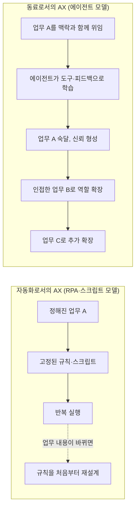
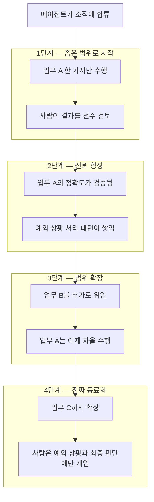
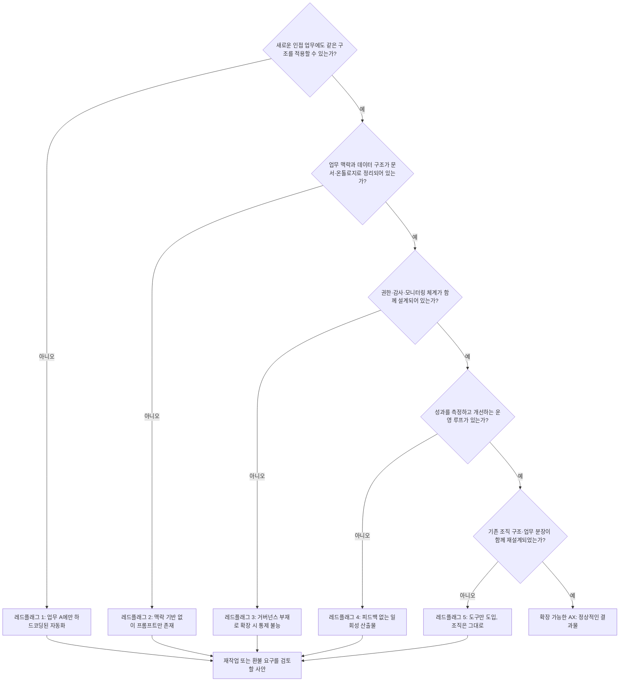

> 
> https://www.threads.com/@doroonja/post/DZwtTTQDjvC
> 
> AX를 AI를 통한 업무 자동화로 생각하는 경우가 많아보여. AX는 AI 에이전트를 직원이나 동료로 두고 같이 업무하는 환경이 되는거야. 즉, 에이전트 동료가 처음에는 A 일을 하지만 점점 B,C를 할 수 있어야 해.
> 
> 혹 AX 컨설팅 받았는데 결과가 확장 불가능한 형태면 잘못된거니 환불 받자
> 

## 목차

1. 들어가며
2. 원 게시물의 핵심 메시지
3. 1부 — AX의 두 가지 패러다임: 자동화로서의 AX vs 동료로서의 AX
4. 2부 — "처음엔 A, 점점 B와 C": 역량 확장형 에이전트 모델
5. 3부 — 2026년 현재, 한국과 글로벌 AX 시장이 보여주는 증거들
6. 4부 — "확장 불가능한 AX 컨설팅"이 잘못된 이유: 레드플래그 다섯 가지
7. 5부 — 실무자를 위한 판단 체크리스트
8. 보론 — "AX"라는 용어가 가지는 또 다른 의미
9. 마치며
10. 참고자료

---

## 1. 들어가며

먼저 작업 범위에 대해 분명히 밝혀둘 부분이 있다. 공유해주신 Threads 링크(`@doroonja`)는 직접 열람을 시도했으나, 해당 플랫폼이 자동화된 접근을 차단하고 있어 페이지 자체를 가져올 수는 없었다. 이 문서는 채팅창에 함께 적어주신 게시물 본문(이미지가 빠진 자리에 특수 문자가 남아 있던 것으로 보아 원문 텍스트로 판단된다)을 출발점으로 삼아, 그 안에 담긴 주장이 2026년 6월 현재 한국 및 글로벌 AX(AI Transformation) 담론에서 어떻게 검증되고 있는지를 웹 검색으로 확인한 뒤 정리한 해설이다. 게시자의 신원이나 추가 맥락에 대해서는 검색으로 확인되지 않았으므로 추측하지 않았고, 본문에 적힌 주장과 그 주장을 뒷받침하거나 보완하는 외부 자료만을 다룬다.

원 게시물의 주장은 단순하지만 날카롭다. 요약하면 다음과 같다.

> AX를 "AI를 이용한 업무 자동화"로 오해하는 경우가 많다. 그러나 AX의 본질은 AI 에이전트를 직원이나 동료처럼 조직에 들이고 함께 일하는 환경을 만드는 것이다. 그 동료는 처음에는 업무 A만 맡지만, 시간이 지나면서 업무 B, C로 역할을 넓혀갈 수 있어야 한다. 만약 AX 컨설팅을 받았는데 그 결과물이 더 이상 확장되지 않는 형태라면, 그것은 잘못 만들어진 것이므로 환불을 요구해야 한다.

이 문서는 이 세 문장에 담긴 주장을 한 줄씩 풀어내고, 그것이 왜 지금 한국 기업 현장에서 실제로 벌어지고 있는 현상과 정확히 맞닿아 있는지를 보여주려 한다.

---

## 2. 원 게시물의 핵심 메시지

게시물이 던지는 메시지는 크게 두 가지 층위로 나눌 수 있다.

**첫째, 정의의 문제.** "AX = 자동화"라는 프레임은 AX를 RPA(Robotic Process Automation)나 매크로의 연장선으로 축소시킨다. 반면 게시자가 말하는 AX는 "AI 에이전트를 조직 구성원으로 편입시키는 일"이다. 이 차이는 사소해 보이지만, 실제로는 프로젝트의 설계 방식, 평가 기준, 예산 구조, 심지어 담당 부서까지 완전히 다르게 만드는 분기점이다.

**둘째, 검증의 문제.** 좋은 AX와 나쁜 AX를 구별하는 기준으로 게시자는 "확장 가능성"을 제시한다. 진짜 동료라면 처음에는 한 가지 일(A)만 시켜보고, 신뢰가 쌓이면 점차 다른 일(B, C)도 맡길 수 있어야 한다. 만약 컨설팅 결과물이 딱 한 가지 업무에만 묶여 있고 그 옆 업무로는 한 발짝도 못 나가는 구조라면, 이는 처음부터 "동료를 키우는 설계"가 아니라 "한 번 쓰고 마는 자동화 스크립트"를 만들어준 것에 불과하다는 지적이다.

아래 본문에서는 이 두 층위를 각각 1부와 2~4부로 나누어 다룬다.

---

## 3. 1부 — AX의 두 가지 패러다임: 자동화로서의 AX vs 동료로서의 AX

### 3.1 왜 이 둘을 혼동하게 되는가

한국 산업계 보안 인텔리전스 기업 S2W는 최근 발행한 실무자용 칼럼에서 AX를 다음과 같이 정의했다. 기존의 디지털 전환(DX)이 아날로그 프로세스를 디지털 기술로 옮기는 데 초점을 맞췄다면, AX는 업무 프로세스 전반을 AI가 다룰 수 있는 형태로 재구성해서, 데이터를 기반으로 스스로 학습하고 판단하는 구조로 전환하는 작업이라는 것이다. 이 정의에서 핵심은 "스스로 학습하고 판단"한다는 부분인데, 이는 정확히 게시물이 말하는 "동료"의 속성과 일치한다. 단순 자동화는 정해진 입력에 정해진 출력을 내놓을 뿐 학습하지 않지만, 동료는 경험이 쌓일수록 더 많은 일을 더 잘 처리하게 된다.

같은 맥락에서 한국어 위키 인코덤의 AX 항목은 AI의 업무 적용 방식을 보조형(Copilot)과 자율형(Agentic) 두 갈래로 나눈다. 보조형은 사람이 모든 단계를 일일이 지시해야 하는 방식이고, 자율형은 "이 보고서를 작성해줘"라는 목표만 주어지면 필요한 데이터 조회, 분석, 초안 작성, 검토 요청까지 일련의 과정을 알아서 수행하는 방식이다. 사람이 매 단계를 지시하지 않아도 되는 이 자율성이야말로 DX의 단순 자동화를 넘어 AX의 핵심 메커니즘이라는 설명이다.

### 3.2 두 패러다임의 구조적 차이

자동화 모델에서는 사람이 업무를 잘게 쪼개 규칙으로 만들고, 시스템은 그 규칙대로만 움직인다. 업무 내용이 조금이라도 바뀌면 규칙 자체를 다시 설계해야 한다. 반면 동료 모델에서는 사람이 목표와 맥락, 권한, 평가 기준을 제공하고, 에이전트는 그 안에서 스스로 판단해 작업을 수행하며, 시간이 지날수록 더 넓은 맥락을 이해하게 된다. 아래 그림은 이 차이를 단순화한 것이다.

업계 현장에서는 이미 이 구분이 실무 용어로 자리잡고 있다. SK그룹 최태원 회장은 최근 그룹 차원의 전략 포럼에서 AX의 본질을 단순한 도구 활용이 아니라 "운영개선(O/I)"으로 규정하면서, 임직원 각자가 자신의 업무를 도와주는 에이전트를 갖는 "1인 1에이전트" 체제로 나아가야 한다고 밝혔다. 이는 에이전트를 한 번 쓰고 버리는 도구가 아니라, 조직 구성원처럼 지속적으로 함께 일하는 존재로 본다는 점에서 게시물의 "동료" 개념과 같은 방향을 가리킨다.

---

## 4. 2부 — "처음엔 A, 점점 B와 C": 역량 확장형 에이전트 모델

### 4.1 신입사원에 비유하면 이해하기 쉽다

게시물이 말하는 역량 확장 구조는 사실 새로운 개념이 아니라, 사람을 채용했을 때 흔히 겪는 과정과 똑같다. 신입사원에게 처음부터 회사의 모든 의사결정을 맡기지 않는다. 좁고 명확한 업무 하나를 먼저 맡기고, 그 업무를 안정적으로 처리하는 모습을 지켜본 뒤, 신뢰가 쌓이면 점차 더 넓은 범위의 일을 맡긴다. 게시물은 이 익숙한 조직 운영 원리를 AI 에이전트에도 그대로 적용해야 한다고 말하고 있는 것이다.

### 4.2 실제 업계가 같은 원칙을 말하고 있다

흥미로운 점은, 이 "작게 시작해서 점진적으로 넓힌다"는 원칙이 추상적인 주장이 아니라 2026년 현재 국내 대기업의 AX 전담 조직들이 실무 베스트 프랙티스로 공식 제시하고 있는 내용이라는 것이다. SK그룹의 AX 전문 계열사 SK AX는 멀티에이전트 시스템 구축 가이드에서, 처음부터 모든 업무를 자동화하려 하지 말고 가장 반복적이고 시간이 많이 드는 작업부터 에이전트화한 뒤 성공 사례를 바탕으로 점차 범위를 넓혀가야 한다고 명시하고 있다. 또한 에이전트를 배포한 뒤에도 사용자 피드백과 결과 데이터를 실시간으로 수집해 성능을 지속적으로 향상시키는 운영(Ops) 체계가 반드시 뒤따라야 한다고 강조한다. 이는 게시물이 말하는 "처음엔 A, 점점 B와 C"의 구조를 기업이 실제로 설계 원칙화하고 있다는 뜻이다.

비슷한 시기 KT 역시 AX Insight 세미나를 통해, 많은 기업이 겪는 어려움이 "파일럿은 성공했는데 확산이 안 된다"는 데 있다며, 작게 시작하되 처음부터 확장 가능하게 설계하는 것이 두 번째로 중요한 원칙이라고 밝혔다. "파일럿 성공"과 "확산 실패"가 별개의 문제로 따로 거론된다는 것 자체가, 업계에서도 확장성 없는 AX 결과물이 흔한 실패 패턴으로 인식되고 있음을 보여준다.

---

## 5. 3부 — 2026년 현재, 한국과 글로벌 AX 시장이 보여주는 증거들

### 5.1 게임업계의 시각차: 효율화 도구 vs 워크플로우 재정의

최근 한 게임 개발자 컨퍼런스에서 넥슨과 크래프톤의 AX 책임자들이 나눈 대담은 이 문제의 핵심을 정확히 짚는다. 넥슨 측 책임자는 AX를 효율화 도구로만 보면 같은 콘텐츠를 두세 배 더 찍어내는 것 이상의 가치를 내지 못한다고 지적하면서, 더 중요한 것은 사람이 무엇에 집중해야 하는지를 다시 정의하는 일이라고 말했다. 또한 AX의 진척도를 시간·비용 절감만으로 판단할 수 없으며, 회사의 정책이나 일하는 방식을 바꿀 수준의 성과를 냈는지, 이전에는 불가능했던 가치를 창출했는지 같은 정성적 요소까지 평가 기준에 포함해야 한다는 의견도 나왔다. 이는 게시물의 문제의식과 정확히 같은 결을 갖는다. "업무를 빨리 처리하는 도구"와 "업무를 재정의하는 동료"는 완전히 다른 결과물을 만든다.

### 5.2 컨설팅 업계 자체가 증언하는 변화

2026년 5월 디지털데일리가 다룬 오퍼레이션·IT 컨설팅 시장 분석 기사는 이 문제를 시장 구조 차원에서 보여준다. 데이터 분석 기업 팔란티어의 기술총괄은 한 산업 행사에서, 에이전트 개수 자체가 성과지표(KPI)가 되는 순간 아무도 쓰지 않는 에이전트만 양산된다고 경고하며, 중요한 것은 에이전트를 어디에 도입하느냐가 아니라 AI가 회사의 데이터와 업무 맥락을 구조적으로 이해할 수 있게 만드는 일이라고 강조했다. 그는 이런 기반(온톨로지) 없이 에이전트만 계속 쌓아 올리는 방식은 실패한다고 단언했다. 이는 게시물이 말하는 "확장 불가능한 결과물"의 실체를 정확히 설명해준다. 맥락 구조 없이 만들어진 에이전트는 업무 A 하나에만 묶여 있을 수밖에 없고, 그 옆의 업무 B로 넘어가려면 처음부터 다시 만들어야 한다.

같은 기사에서 회계·자문 그룹 EY한영의 AI 리더는, 단순 업무 자동화가 아니라 AI 에이전트로 기존에는 할 수 없었던 일을 새롭게 해내야 한다고 말하면서, 전체 업무 흐름 자체가 바뀌지 않는 한 AI 도입 비용은 결국 매몰 비용으로 끝난다고 지적했다. 또 다른 대형 회계법인 삼정KPMG 관계자는, 2025~2026년 시장이 단순 개념검증(PoC) 단계를 넘어 실제 업무 프로세스 안에서 AI가 사람과 함께 일하는 구조를 만드는 방향으로 빠르게 이동하고 있다고 진단했다. "AI가 사람과 함께 일하는 구조"라는 표현은 게시물의 "동료" 개념을 컨설팅 업계의 언어로 옮긴 것이라 해도 무방하다.

### 5.3 글로벌 빅테크의 행보도 같은 방향이다

같은 기사는 오픈AI가 데이터 분석, 재무 예측, 소프트웨어 엔지니어링, 고객 지원 등 핵심 워크플로 전반을 자동화하는 엔터프라이즈 플랫폼을 출범시키면서 전통 컨설팅사들과 분업 체계를 구축하고 있다고 전한다. 앤트로픽 역시 오퍼레이션 컨설팅 기업 및 IT 컨설팅 기업과 잇따라 파트너십을 맺고 산업별 맞춤 솔루션을 공동 개발하는 구조를 만들고 있다. 이 흐름의 공통점은, 더 이상 "보고서를 납품하고 끝나는" 컨설팅이 아니라 "실제로 작동하면서 점점 더 많은 업무를 흡수해 나가는" 시스템을 만드는 방향으로 시장 자체가 재편되고 있다는 점이다.

### 5.4 거버넌스 인프라가 받쳐주지 않으면 확장은 애초에 불가능하다

2026년 4월 MIT에서 열린 Open Agentic Web 컨퍼런스에서는 또 다른 각도의 경고가 나왔다. 에이전트가 스스로 API를 호출하고 다른 에이전트와 협업하며 사람을 대신해 판단을 내리는 시대가 오면, "이 에이전트가 누구의 것이고 어떤 권한을 가지며 무엇을 했는지"를 증명할 수 있는 신원 인증·권한 관리·행동 감사 체계가 반드시 갖춰져야 한다는 것이다. 연구자들은 현재의 에이전트 생태계를 "도메인 네임 시스템(DNS)이 등장하기 전의 인터넷"에 비유했다. 이 지적은 게시물의 메시지와 한 걸음 더 깊은 곳에서 연결된다. 에이전트가 업무 A에서 업무 B, C로 영역을 넓히려면 단순히 기술적으로 가능한지를 넘어, "이 권한까지 확장해도 되는가"를 판단하고 통제할 수 있는 거버넌스 구조가 함께 확장되어야 한다. 거버넌스가 처음부터 빠진 채 만들어진 결과물은 업무 범위를 넓히는 순간 보안과 책임 소재 문제에 부딪혀 사실상 확장이 막히게 된다.

---

## 6. 4부 — "확장 불가능한 AX 컨설팅"이 잘못된 이유: 레드플래그 다섯 가지

지금까지 살펴본 자료들을 종합하면, 확장이 막힌 AX 결과물에는 몇 가지 공통된 구조적 결함이 발견된다. 게시물의 "환불 받자"는 주장을 실무적으로 풀어내면 아래와 같은 점검 항목이 된다.

**레드플래그 1 — 업무 A에만 하드코딩된 자동화.** 특정 양식의 보고서 한 종류, 특정 화면의 데이터 입력 한 가지처럼 좁고 고정된 업무에만 묶인 프롬프트나 스크립트는, 옆 업무로 옮기려면 처음부터 새로 만들어야 한다. 이는 SK AX가 경고하는 "단일 에이전트에 모든 역할을 부여하면 프롬프트가 길어지고 새 기능을 추가할 때마다 기존 기능이 깨지는" 전형적 패턴이다.

**레드플래그 2 — 맥락 기반 없이 프롬프트만 존재.** 팔란티어 사례에서 보았듯, 회사의 데이터와 업무 맥락을 구조화하는 기반(온톨로지·지식그래프) 없이 에이전트 개수만 늘리는 방식은 실패로 이어진다. 이런 결과물은 새 업무를 맡기려 할 때마다 그 업무에 필요한 맥락을 처음부터 다시 손으로 입력해줘야 한다.

**레드플래그 3 — 거버넌스 부재로 확장 시 통제 불능.** MIT 컨퍼런스가 지적했듯, 에이전트가 어떤 권한을 갖고 무엇을 했는지 추적할 수 없는 구조에서는 업무 범위를 넓히는 순간 보안 사고나 책임 소재 분쟁의 위험이 함께 커진다. 결과적으로 조직은 "더 맡기고 싶어도 못 맡기는" 상태에 갇힌다.

**레드플래그 4 — 피드백 없는 일회성 산출물.** SK AX가 강조하듯, 에이전트는 배포 이후에도 사용자 피드백과 성과 데이터를 지속적으로 수집해 스스로 개선되는 운영 체계가 뒤따라야 한다. 이런 루프 없이 "한 번 세팅해두고 끝"인 결과물은 시간이 지날수록 현실과 괴리되며, 새 업무로 옮길 동력 자체가 없다.

**레드플래그 5 — 도구만 도입, 조직은 그대로.** 아무리 기술적으로 잘 만들어진 에이전트라도, 그 에이전트가 협업할 사람들의 역할 분담과 의사결정 권한이 옛 방식 그대로 남아있다면 확장은 곧 한계에 부딪힌다. 이는 조직의 의사소통 구조가 결국 시스템의 구조를 그대로 닮는다는 오래된 조직설계 원리(소위 콘웨이의 법칙)와 같은 맥락이다. 시스템만 새로 들이고 그 시스템을 둘러싼 조직과 의사결정 구조는 손대지 않는 AX 프로젝트는, 기술이 아무리 좋아도 "별도의 AX 전담팀만 만들어두고 기존 조직은 그대로 둔" 형태로 끝나기 쉽고, 이런 형태는 업계에서 반복적으로 보고되는 대표적 실패 패턴 중 하나다.

---

## 7. 5부 — 실무자를 위한 판단 체크리스트

AX 컨설팅 결과물을 인수받는 입장이라면, 다음 질문들을 순서대로 던져보는 것이 도움이 된다.

- **이 결과물의 이름이 "OOO 업무 자동화 봇"처럼 업무명이 고유명사로 박혀 있는가, 아니면 "OOO 업무 에이전트"처럼 역할과 권한으로 정의되어 있는가?** 전자는 확장을 염두에 두지 않고 설계되었을 가능성이 높다.
- **이 에이전트가 다루는 데이터와 업무 규칙이 코드/프롬프트 내부에 흩어져 있는가, 아니면 별도의 문서나 지식 구조로 분리되어 관리되는가?** 후자라야 새로운 업무를 추가할 때 기존 자산을 재사용할 수 있다.
- **이 에이전트의 권한 범위, 접근 가능한 시스템, 수행 가능한 행동의 한계가 명시적으로 정의되어 있는가?** 정의되어 있지 않다면 권한을 넓히는 의사결정 자체가 불가능하다.
- **에이전트의 성과를 측정하는 지표와, 그 지표를 바탕으로 개선하는 주기가 계약 범위에 포함되어 있는가?** 일회성 구축 비용만 청구되고 운영·개선 계획이 빠져 있다면 확장은 설계 단계에서부터 고려되지 않았을 가능성이 크다.
- **이 프로젝트를 발주한 조직 내부에서, 이 에이전트와 함께 일할 사람들의 업무 분장이나 의사결정 절차에 대한 논의가 있었는가?** 기술 산출물만 있고 조직 측 변화 계획이 전혀 없다면, 그 산출물이 아무리 정교해도 다음 단계로 넘어가기 어렵다.

이 다섯 가지 중 다수에 "아니오"가 나온다면, 게시물이 말하는 "확장 불가능한 형태"에 해당할 가능성이 높다. 이 경우 발주사 입장에서 할 수 있는 합리적인 대응은 두 가지다. 하나는 계약서에 명시된 산출물 범위와 비교해 재작업이나 추가 작업을 요구하는 것이고, 다른 하나는 애초에 계약 범위 자체가 "확장 가능한 설계"를 약속하고 있었는지를 확인해 환불이나 손해배상을 검토하는 것이다. 다만 이는 일반적인 계약·소비자 보호의 영역이므로, 실제 환불이나 법적 조치를 검토할 때는 계약서 문구와 실제 산출물을 근거로 전문가(변호사 등)와 상담하는 것이 안전하다는 점은 짚어둔다. 이 문서는 법률 자문이 아니라 AX 프로젝트의 기술적·조직적 품질을 판단하는 틀을 제공하는 데 목적이 있다.

---

## 8. 보론 — "AX"라는 용어가 가지는 또 다른 의미

검색 과정에서 한 가지 짚어둘 만한 용어 혼선이 발견되었다. 웹 호스팅 기업 넷리파이의 최고경영자는 별도의 글에서 "AX"를 "AI Transformation"이 아니라 "Agent Experience"의 약자로 쓰고 있었다. 그가 말하는 AX는 기존 엔터프라이즈 시스템을 에이전트가 사용자로서 잘 쓸 수 있도록 준비하는 작업, 즉 API와 인터페이스를 에이전트 친화적으로 만드는 작업을 가리킨다. 그는 좋은 에이전트 경험을 위한 원칙으로 에이전트가 적절한 권한으로 시스템에 접근할 수 있어야 하고, 충분한 맥락을 제공받아야 하며, API·SDK·CLI 같은 인터페이스가 에이전트가 활용하기 쉬운 형태로 설계되어야 한다는 점 등을 들었다.

이 정의는 게시물이나 한국 기업들이 쓰는 "AI Transformation"으로서의 AX와는 출발점이 다르지만, 결론은 묘하게 닮아 있다. 두 정의 모두 "에이전트가 시스템이나 조직을 점점 더 깊이, 더 넓게 활용할 수 있게 만드는 것"을 좋은 설계의 기준으로 삼고 있기 때문이다. 다만 같은 약어가 다른 의미로 쓰이고 있다는 점은, 실무에서 외부 자료나 벤더의 제안서를 읽을 때 "이 AX가 어느 쪽 AX를 말하는지" 확인할 필요가 있다는 작은 실무적 시사점을 준다.

---

## 9. 마치며

원 게시물이 두 문장으로 압축해 던진 주장—AX는 자동화가 아니라 동료를 들이는 일이며, 그 동료는 점점 더 많은 일을 할 수 있어야 한다—은 짧지만 2026년 상반기 한국 AX 시장 곳곳에서 같은 형태로 반복해서 확인되는 주장이다. SK그룹의 "1인 1에이전트"와 운영개선 프레임, SK AX의 "작게 시작해 점진적으로 확장하라"는 설계 원칙, KT가 지적하는 "파일럿은 성공했는데 확산이 안 된다"는 현장의 흔한 좌절, 넥슨·크래프톤이 벌인 "효율화 도구 대 워크플로우 재정의" 논쟁, 팔란티어가 경고하는 "온톨로지 없는 에이전트 양산의 실패", EY와 삼정KPMG가 증언하는 "PoC를 넘어 사람과 함께 일하는 구조로의 이동", 그리고 MIT 컨퍼런스가 짚은 "거버넌스 없는 확장은 불가능하다"는 경고까지—이 모든 자료가 한 방향을 가리킨다.

확장 가능성은 AX 프로젝트의 부가 기능이 아니라, 애초에 그것이 "동료를 만드는 작업"이었는지 "자동화 스크립트를 만드는 작업"이었는지를 가르는 가장 실질적인 시험대다. 게시물의 마지막 한 줄, "환불 받자"는 제안은 다소 과격하게 들릴 수 있지만, 그 안에 담긴 기준—"이 결과물이 다음 업무로 넘어갈 수 있는가"—은 AX 컨설팅을 발주하거나 평가하는 모든 실무자가 계약 전후로 반드시 던져야 할 질문이라는 점에서 정확한 지적이라고 볼 수 있다.

---

## 10. 참고자료

- KT Enterprise, 「비욘드 에이전트 시대, AX 트렌드의 진화」, https://enterprise.kt.com/bt/blog/3644.do
- 웹진 인벤, 「[NDC26] "효율화를 넘어, 업무의 본질을 찾는 여정" 넥슨-크래프톤이 말하는 AX」, https://www.inven.co.kr/webzine/news/?news=317586
- 서울경제, 「휴가 간 동료 대신 일하는 AI…KT, 업무용 에이전트 연내 추진」, https://www.sedaily.com/article/20056814
- 서울경제, 「최태원 회장 "AX 전속력으로 추진…'1인 1에이전트' 도입하자"」, https://www.sedaily.com/article/20055427
- TreeSoop, 「에이전트 인프라의 'DNS 시대'가 열렸다 — MIT 컨퍼런스가 말하는 기업 AX 에이전트 거버넌스」, https://treesoop.com/blog/mit-agentic-web-agent-governance-enterprise-ax-2026
- CIO Korea, 「AI 에이전트 시대, AX가 기업 시스템을 재정의하다」, https://www.cio.com/article/4137658/
- 디지털데일리, 「"보고서 대신 에이전트"… 오퍼레이션·IT 컨설팅 시장 대격변」, https://www.ddaily.co.kr/page/view/2026050709490581440
- SK AX, 「2026년 기업 AI 전환의 해답, 멀티에이전트 시스템이 필요한 이유」, https://www.skax.co.kr/insight/trend/3626
- S2W, 「AI 전환(AX)을 고민하는 담당자라면, 4가지 필수 체크리스트」, https://s2w.inc/ko/resource/detail/1043
- 인코덤, 「AX」 항목, https://incodom.kr/AX

원 게시물 링크(자동 접근 불가, 참고용): https://www.threads.com/@doroonja/post/DZwtTTQDjvC

---

작성일자: 2026-06-19
