## 음악 작업자 윤일상의 실전 사례로 보는 AI 에이전트 시대

> **작성 기준일**: 2026년 6월 19일  
> **출처**: 윤일상 [페이스북](https://www.facebook.com/share/r/18Ph8LNKKN/) 공개 게시물 + 공개된 관련 기술 문서  
> **핵심 키워드**: Claude Cowork, RTP-MIDI, MIDI 네트워크 자동화, Splice MCP Server, AI 에이전트, LaunchAgent

---

## 목차

1. [사례 개요: 어떤 일이 일어났는가](#1-사례-개요)
2. [Claude Cowork란 무엇인가](#2-claude-cowork란-무엇인가)
3. [Mac MIDI 네트워크의 구조](#3-mac-midi-네트워크의-구조)
4. [자동화 요청: 구체적으로 무슨 일을 시켰나](#4-자동화-요청)
5. [Claude가 작성한 코드와 기술적 접근](#5-claude가-작성한-코드와-기술적-접근)
6. [두 번째 자동화: Logic Pro 실행 시 MIDI 자동 연결](#6-두-번째-자동화)
7. [Splice MCP Server: 소리 검색의 새로운 차원](#7-splice-mcp-server)
8. [Claude for Creative Work: 2026년 4월의 음악계 지각변동](#8-claude-for-creative-work)
9. [다음 도전: 바운스 작업 전체 자동화](#9-다음-도전)
10. [이 사례가 가지는 의미](#10-이-사례가-가지는-의미)
11. [기술 용어 정리](#11-기술-용어-정리)

---

## 1. 사례 개요

2026년, 작곡가이자 음악 프로듀서인 **윤일상**은 자신의 음악 작업 환경에 Claude의 Cowork 기능을 적용하여 주목할 만한 실험을 진행했다. 그는 자신의 페이스북에 다음과 같은 내용의 게시물을 공개했다.

> "Claude Co-work에 '메인 맥(음악 작업용)이 서브 맥(영상 플레이용)에 연결되면, MIDI Network 설정에서 자동으로 연결되도록 만들어 줘'라고 요청했습니다. 권한을 부여하자 잠시 스스로 작업을 진행하더니... '짜잔~ 완료되었습니다.' 😮"

이 짧은 문장 안에는 AI 기술이 전문 음악 제작 환경에 실질적으로 침투한 순간이 담겨 있다. 코딩 경험이 없어도, 터미널 명령어를 모르더라도, AI에게 자연어로 "이렇게 해줘"라고 말하면 시스템 레벨의 자동화가 완성되는 시대가 도래했음을 보여주는 구체적인 증거다.

### 등장하는 기술 요소 한눈에 보기

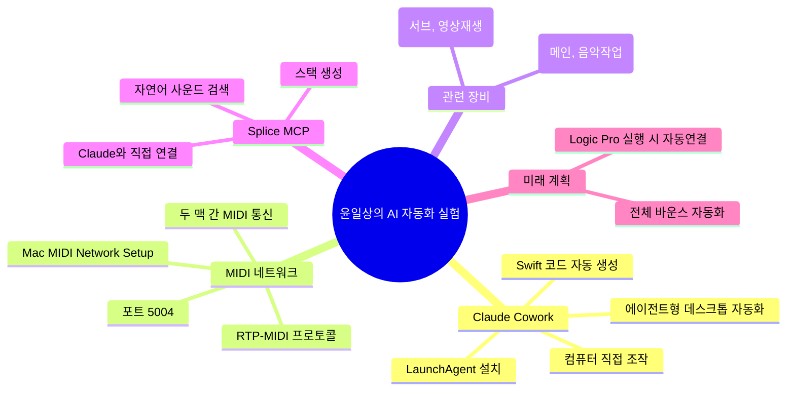

---

## 2. Claude Cowork란 무엇인가

### 2-1. 탄생 배경

Claude Cowork는 Anthropic이 **2026년 1월에 출시**한 데스크톱 에이전트 기능이다. 이 기능의 탄생 배경을 이해하려면 Anthropic 내부의 이야기를 알아야 한다.

Anthropic의 마케팅팀, 데이터팀 등 비개발 직군 직원들이 Claude Code(개발자용 터미널 도구)를 몰래 사용하기 시작했다. 복잡한 다단계 작업, 즉 파일 여러 개를 동시에 분석하고 문서를 만드는 작업에서 일반 채팅보다 훨씬 강력했기 때문이다. 이 패턴을 포착한 Anthropic은 개발자가 아닌 일반 지식 근로자들도 동일한 에이전트 능력을 GUI 환경에서 사용할 수 있도록 Claude Cowork를 설계했다.

Anthropic은 마케팅팀, 데이터팀 등 비기술 직군이 Claude Code의 복잡한 다단계 작업 처리 능력에 이끌려 일반 채팅 인터페이스 대신 Code를 쓰기 시작하는 패턴을 목격했다. Claude Cowork는 그 결과물로, 동일한 능력을 단순화된 경험으로 비개발자에게도 제공하도록 설계되었다.

### 2-2. 핵심 개념: 채팅과 Cowork의 차이

일반적인 AI 채팅과 Claude Cowork의 차이는 단순히 "더 잘한다"의 문제가 아니라, 근본적인 작동 방식이 다르다.

일반 Claude는 채팅창 안에서만 작동하며, 파일을 수동으로 업로드해야 하고 한 번에 소수의 파일만 처리할 수 있다. Claude Cowork는 사용자의 로컬 파일 시스템에 직접 접근하여 폴더를 정리하거나 스프레드시트를 분석하는 등의 작업을 상시 개입 없이 수행한다.

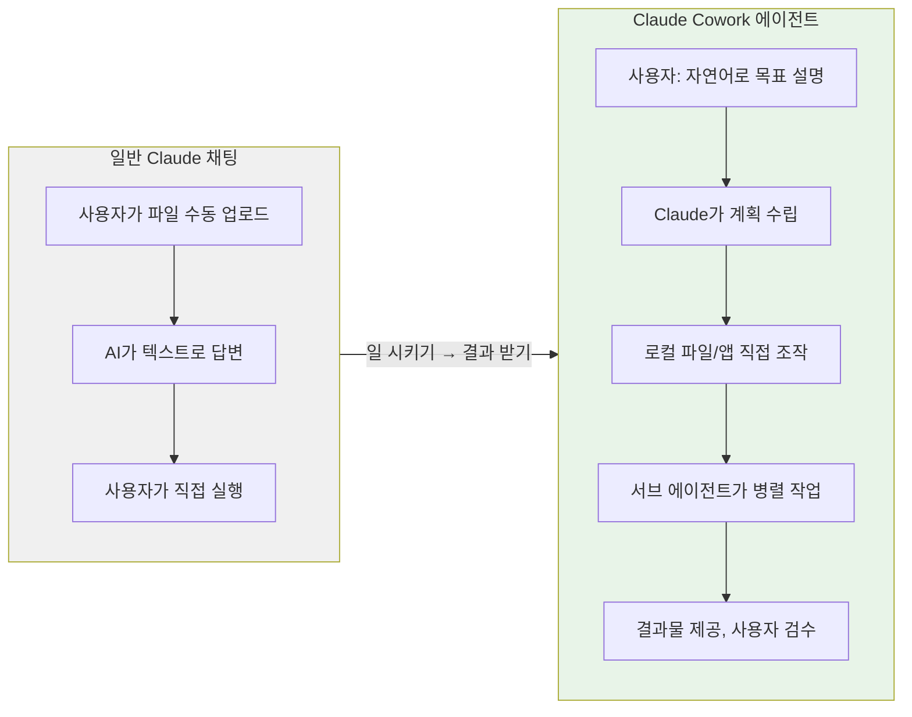

### 2-3. Cowork의 주요 기능

Claude Cowork는 Claude Code의 에이전트 아키텍처를 그대로 Claude Desktop에 가져왔다. 로컬 파일에 직접 접근하고, 복잡한 작업을 소규모 태스크로 분해하여 병렬 처리하며, Excel 스프레드시트, PowerPoint 발표자료, 서식화된 문서 같은 완성된 결과물을 만들어낸다.

실무적으로 Cowork가 할 수 있는 일을 정리하면 다음과 같다.

- **파일 시스템 작업**: 폴더 탐색, 파일 생성·수정·이동, 내용 분석
- **앱 조작**: 마우스 클릭, 키보드 입력, 셸 명령어 실행
- **코드 작성 및 실행**: Swift, Python, Bash 등 다양한 언어로 스크립트 작성 후 즉시 실행
- **반복 작업 예약**: 매일 아침 브리핑, 주간 보고서 등 스케줄 기반 자동화
- **서브 에이전트 조율**: 복잡한 태스크를 여러 하위 에이전트가 동시에 처리

### 2-4. 사용 조건

Claude Cowork는 Pro, Max, Team, Enterprise 등 유료 플랜에서 macOS 또는 Windows 환경의 Claude Desktop 앱을 통해 사용할 수 있다. 브라우저나 모바일에서는 직접 사용 불가능하지만, Pro·Max 사용자는 스마트폰에서 지시를 보내면 데스크톱에서 실행되는 Dispatch 기능을 활용할 수 있다.

---

## 3. Mac MIDI 네트워크의 구조

### 3-1. MIDI Network란

MIDI(Musical Instrument Digital Interface)는 악기와 컴퓨터 사이에서 음악 데이터를 주고받는 표준 프로토콜이다. 원래는 케이블로 연결하는 방식이었으나, Apple이 Mac에 내장한 **MIDI Network(네트워크 MIDI)** 기능을 통해 Wi-Fi나 유선 이더넷으로도 MIDI 신호를 전송할 수 있게 되었다.

기술 규격 이름은 **RTP-MIDI**(Real-time Transport Protocol over MIDI)이며, 애플이 Bonjour 프로토콜을 기반으로 확장한 형태다. Mac의 MIDI Network Session은 로컬 네트워크(LAN)나 심지어 인터넷을 통해 MIDI를 라우팅하는 강력한 도구이며, RFC 6295 표준의 RTP Payload Format for MIDI를 커스터마이즈한 Apple 구현체를 사용한다.

### 3-2. 윤일상의 스튜디오 구성

게시물에 공개된 MIDI Network Setup 화면과 설명을 분석하면, 그의 스튜디오 구성은 다음과 같다.

| 장비 | 이름 | 용도 |
|------|------|------|
| **메인 맥** | ILSANG's MacStudio | 음악 작업 (Logic Pro 실행, MIDI 편집, 믹싱) |
| **서브 맥** | Ilsang's Macmini | 영상 재생용 (MBP도 별도로 보임) |

MIDI Network Setup 창을 보면 세 개의 디바이스가 세션 디렉토리에 나타나 있다. MBP, Ilsang's Macmini, ILSANG's MacStudio가 같은 네트워크에서 서로를 탐색할 수 있는 상태다. 연결 포트는 기본값인 **5004번 UDP 포트**를 사용한다.

### 3-3. 기존의 문제: 자동 연결이 되지 않음

RTP-MIDI의 고질적인 불편함이 있다. Mac을 재시작하거나 네트워크에 새로 접속할 때마다 MIDI Network 연결이 끊어지고, 사용자가 Audio MIDI Setup을 열어 수동으로 다시 연결해야 한다. 이 문제는 Apple이 RTP-MIDI를 구현한 방식 자체에서 기인한다.

음악 작업을 시작할 때마다 이 수동 과정을 반복해야 한다는 것은 음악 전문가에게 반복적이고 번거로운 절차다. 윤일상이 Claude에게 요청한 것은 바로 이 문제의 해결이었다.

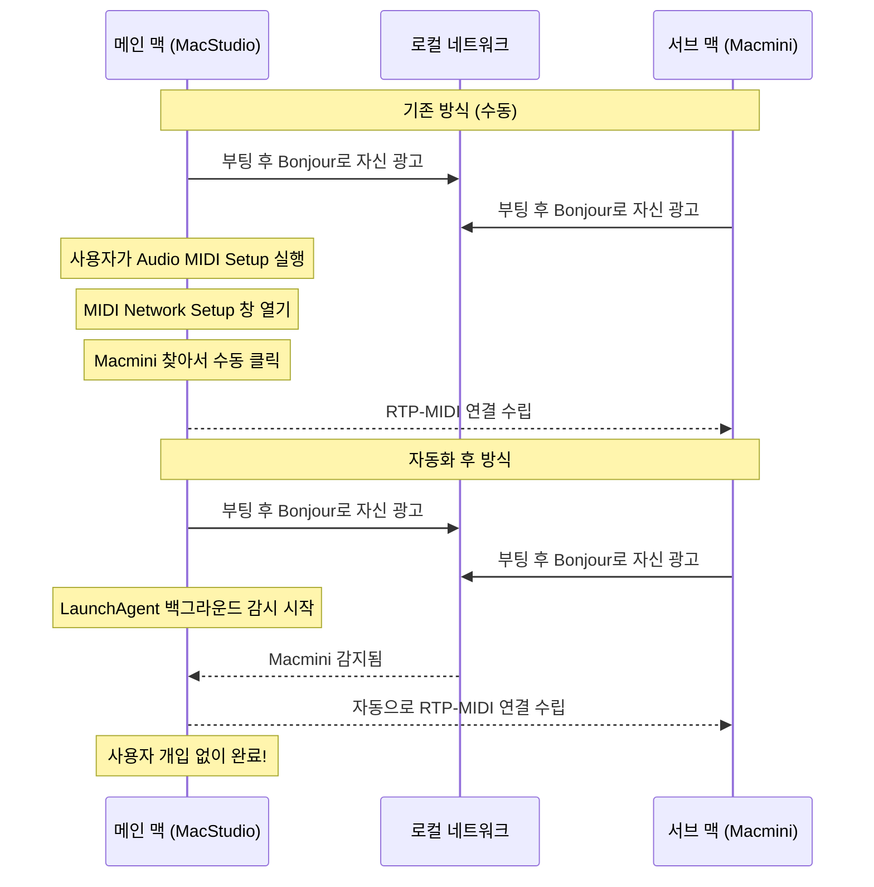

---

## 4. 자동화 요청

### 4-1. 윤일상이 Claude Cowork에 한 요청

```
"메인 맥(음악 작업용)이 서브 맥(영상 플레이용)에 연결되면,
MIDI Network 설정에서 자동으로 연결되도록 만들어 줘"
```

이 한 문장의 자연어 지시에 담긴 기술적 요구사항을 분해하면 다음과 같다.

1. **네트워크 감지**: 서브 맥(Macmini)이 같은 네트워크에 나타났는지 지속적으로 감시
2. **자동 연결**: 감지 즉시 MIDI Network Setup에서 해당 장비와 RTP-MIDI 연결 수립
3. **지속성**: 컴퓨터 재시작 후에도 자동으로 동작해야 함(데몬 또는 LaunchAgent)

Claude Cowork는 이 요청을 받고 사용자에게 권한을 요청했다. 사용자가 허용하자 **스스로 작업을 진행**했고, 잠시 후 완료를 보고했다.

### 4-2. Claude Cowork가 접근한 방법

화면에 보이는 내용을 분석하면, Claude Cowork는 다음 순서로 작업을 진행했다.

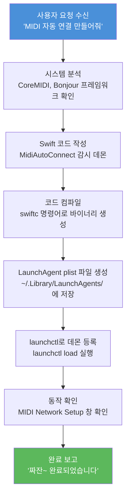

---

## 5. Claude가 작성한 코드와 기술적 접근

### 5-1. 화면에서 확인된 코드

Claude Cowork가 생성한 코드의 일부가 화면에 노출되었다. 확인된 주요 기술 요소는 다음과 같다.

**사용된 Apple 프레임워크**
- `CoreMIDI`: Mac의 MIDI 처리를 위한 핵심 프레임워크. RTP-MIDI 연결 관리
- `Foundation`: macOS 기본 프레임워크. 네트워크 서비스 탐색(NetService/Bonjour)

**확인된 Swift 코드 패턴**

```swift
// 화면에서 확인된 코드 (일부)
func netServiceBrowser(_ b: NetServiceBrowser, didRemov...)
func netServiceBrowser(_ b: NetServiceBrowser, didStopSearch...)
func netServiceBrowser(_ b: NetServiceBrowser, didNot...)
let w = Watcher(); w.start(); RunLoop.main.run()
```

```bash
# 컴파일 명령 (화면 확인)
swiftc -O -framework CoreMIDI -framework Foundation \
  -o "$HOME/Library/Application Support/MidiAutoConnect/MidiAutoConnect" \
  "$HOME/Library/Application Support/MidiAutoConnect/...

# LaunchAgent 등록/해제 명령 (화면 확인)
launchctl unload "$HOME/Library/LaunchAgents/com.IIsang.midi..."
launchctl load "$HOME/Library/LaunchAgents/com.IIsang.midi..."

# 확인용 명령
sleep 2; echo "---" log "---"; tail -n 6 "$HOME/Library/..."
```

### 5-2. 기술적 작동 원리 설명

Claude가 선택한 접근법의 핵심은 **Bonjour 네트워크 서비스 탐색 + CoreMIDI 연결**이다.

macOS에서 MIDI 네트워크는 Bonjour(애플의 제로 컨피규레이션 네트워킹)를 통해 서로를 발견한다. Swift의 `NetServiceBrowser` 클래스는 같은 네트워크에서 특정 서비스(RTP-MIDI 세션)가 나타나는 것을 실시간으로 감지할 수 있다.

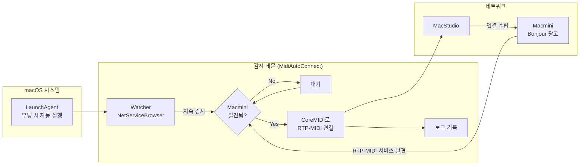

**LaunchAgent란?** macOS에서 로그인 시 자동으로 시작되는 백그라운드 프로세스를 등록하는 방법이다. `~/Library/LaunchAgents/` 폴더에 plist(설정 파일) 형태로 저장하며, `launchctl load` 명령으로 즉시 활성화할 수 있다. 이 방식을 사용하면 컴퓨터를 재시작하더라도 데몬이 자동으로 실행된다.

### 5-3. 이 코드의 의미

이 자동화의 기술적 수준을 이해하려면, 과거에는 어떤 과정이 필요했는지 비교해야 한다.

| 구분 | 과거 방식 | Claude Cowork 방식 |
|------|-----------|-------------------|
| 필요 지식 | Swift, CoreMIDI API, LaunchAgent 구조, Bonjour 프로토콜 | 자연어 한 문장 |
| 소요 시간 | 수 시간 ~ 수일 (개발자도 쉽지 않음) | 수십 초 |
| 실행 방법 | 터미널, Xcode, 관련 문서 다수 참조 | Claude 채팅창에 입력 |
| 유지보수 | 오류 시 디버깅 필요 | Claude에게 재요청 |

기존에 이 문제를 해결한 사람들은 AppleScript나 제3자 도구(`cliclick` 등)를 조합해 MIDI Network Setup 창을 자동화하는 우회적인 방법을 써야 했다. Mac 커뮤니티에서는 오래전부터 재시작 후 자동 연결이 되지 않는 문제를 Apple Automator, AppleScript 등으로 해결하려는 시도가 있었지만, 모두 GUI 자동화에 의존하는 취약한 방식이었다.

Claude가 선택한 방법은 GUI를 조작하는 방식이 아니라, CoreMIDI 프레임워크를 직접 호출하는 훨씬 근본적이고 안정적인 접근이다.

---

## 6. 두 번째 자동화

### 6-1. Logic Pro 실행 시 MIDI 자동 연결

첫 번째 자동화에 성공한 후, 윤일상은 한 단계 더 나아갔다.

> "이어서 '로직(Logic Pro)을 실행하면 자동으로 MIDI Network Setup을 열어 서브 맥을 연결해 달라'고 요청했는데, 이 역시 스크립트 작성으로 매끄럽게 성공했습니다."

이 두 번째 자동화는 첫 번째보다 더 정교하다. Logic Pro라는 특정 애플리케이션의 실행 여부를 감지하고, 그 이벤트에 반응하여 추가 작업을 수행해야 하기 때문이다.

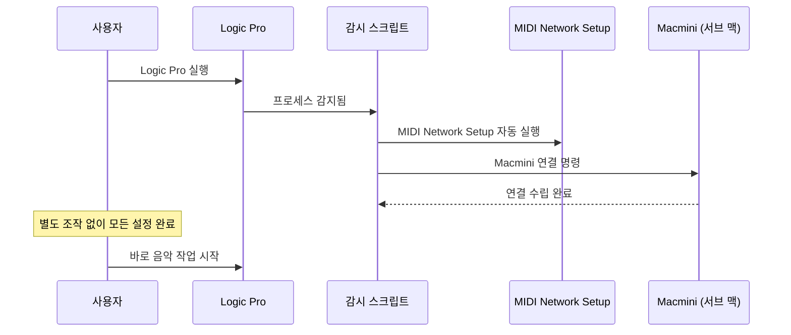

이 자동화가 완료되면 윤일상이 Logic Pro를 더블클릭하는 순간 MIDI 네트워크 연결이 자동으로 완성된다. 믹싱 작업을 시작하기 전 매번 수행하던 MIDI 설정 절차가 완전히 사라진 것이다.

---

## 7. Splice MCP Server

### 7-1. Splice란

Splice는 음악 프로듀서들이 샘플, 루프, 원샷 사운드를 검색하고 다운로드하는 구독 기반 플랫폼이다. 수백만 개의 저작권 자유 샘플이 담긴 카탈로그를 보유하고 있으며, DAW(디지털 오디오 워크스테이션) 플러그인 형태로도 제공된다.

### 7-2. MCP Server 공개의 의미

Splice는 MCP(Model Context Protocol)를 도입했으며, Splice Sounds를 Claude에서 직접 사용할 수 있는 통합을 공개했다. 이는 Splice의 아티스트가 만든 사운드 카탈로그를 어디서든 검색하고 발견하고 큐레이션할 수 있는 새로운 방식이다.

### 7-3. 무엇이 가능해졌나

Splice MCP Server를 통해 Claude 안에서 자연어로 사운드를 묘사하면("dark lo-fi guitar loop around 80 BPM") 일치하는 결과물을 얻을 수 있다. 또한 크레딧을 사용해 샘플을 컴퓨터에 직접 다운로드하거나, 바이브를 묘사하면 드럼, 베이스, 키 등 다층 어레인지먼트의 전체 스택을 생성할 수 있다.

기능 목록을 보면 자연어 검색 외에도, 샘플로부터 스택 생성하기, 스택 편집(이름 변경, BPM 변경, 레이어 추가·제거, 사운드 교체), 스택 공유(누구나 열어볼 수 있는 공개 링크 생성), 샘플 다운로드 등이 포함된다.

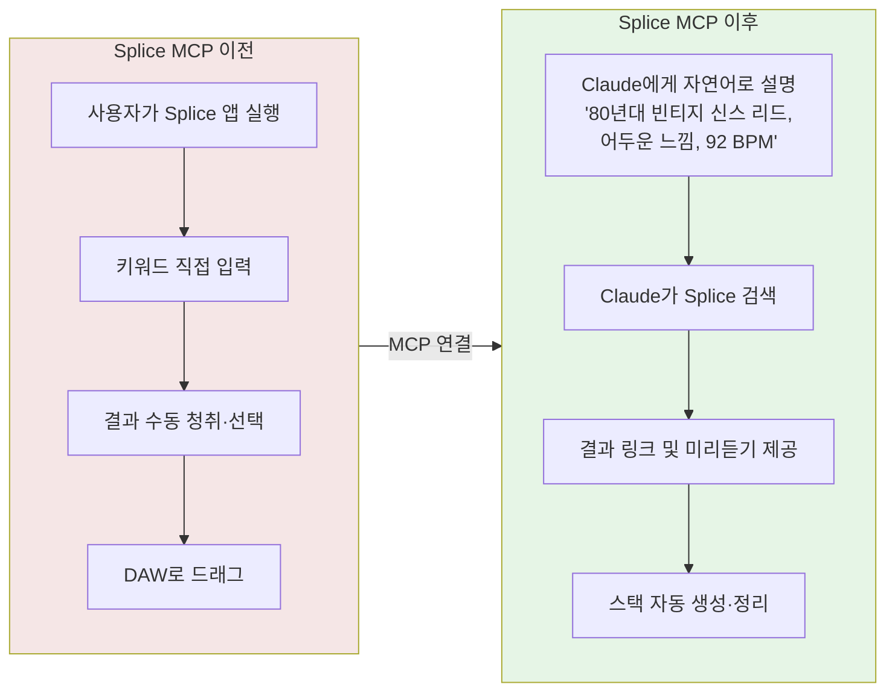

### 7-4. 한국어로도 검색 가능

윤일상은 특히 이 점을 강조했다. "이제 Claude 안에서 한글로도 훨씬 다양한 사운드 검색이 가능해졌습니다." Splice의 기본 인터페이스는 영어 기반이지만, Claude를 경유하면 한국어로 사운드를 묘사해도 영어 검색으로 자동 변환·처리된다.

### 7-5. 'Describe Sound'와의 비교

윤일상은 "비슷한 기능이 이미 Splice 앱의 'Describe Sound (Beta)'에도 있었지만, AI 에이전트와 직접 연결되는 순간 활용 범위가 완전히 달라지네요"라고 말했다. 이 차이는 매우 중요하다.

| 구분 | Splice 앱 내 Describe Sound | Claude + Splice MCP |
|------|---------------------------|---------------------|
| 맥락 공유 | 검색만 독립적으로 존재 | 작업 맥락을 AI가 이해 |
| 후속 작업 | 앱 안에서만 처리 | Claude 내 연속 작업 가능 |
| 다중 검색 | 하나씩 순차 검색 | 여러 조건 동시 병렬 검색 |
| 스택 생성 | 제한적 | 텍스트·영상 기반 스택 생성 |
| 통합 | Splice 앱에 국한 | DAW, 문서, 기타 도구와 연계 |

Splice MCP는 자연어 검색, 텍스트 프롬프트에서 드럼·베이스·키보드 등 전체 스택 생성, 기존 샘플로부터 스택 생성, 로컬 머신으로의 직접 다운로드가 가능하다. Claude Cowork와 함께 사용하면 로컬 Splice 라이브러리를 스캔하여 폴더를 자동으로 정리할 수도 있다.

### 7-6. Splice MCP 설정 방법

Claude에서 설정하려면 Settings → Connectors로 이동하여 MCP 서버 URL(`https://mcp.splice.com/mcp`)을 추가하면 된다. 최초 사용 시 브라우저를 통해 Splice 계정으로 로그인하면 세션이 연결된다. 이후에는 별도 명령어 없이 자연어로 AI 어시스턴트와 대화하면 된다. 검색과 스택 생성은 무료이며, 다운로드는 Splice 구독 요금제와 크레딧이 필요하다.

---

## 8. Claude for Creative Work

### 8-1. 2026년 4월의 음악계 지각변동

Splice MCP Server 공개는 고립된 사건이 아니다. 2026년 4월 28일 Anthropic은 'Claude for Creative Work'를 발표하며 Ableton Live, Splice, Adobe Creative Cloud, Blender, Autodesk Fusion, SketchUp, Resolume Arena, Resolume Wire, Affinity by Canva 등 9개 크리에이티브 앱을 위한 공식 커넥터를 한꺼번에 출시했다.

### 8-2. Ableton과 Splice 커넥터의 차이

Ableton MCP 커넥터와 Splice MCP 커넥터는 서로 다른 방향을 향한다. Ableton 커넥터는 지식 보조 역할로, Live, Push, Move, Note 등의 제품 매뉴얼, 지식베이스 문서, 튜토리얼 영상 트랜스크립트를 검색할 수 있도록 한다. Splice 커넥터는 에셋 중심으로, 카탈로그를 자연어로 검색하고 스택을 생성하며 샘플을 다운로드하는 기능을 제공한다.

이 둘의 차이는 중요하다. Ableton 커넥터는 프로듀서가 시스템을 이해하도록 돕고, Splice 커넥터는 프로듀서가 소재를 찾도록 돕는다. 합치면 AI가 스튜디오의 결합 조직으로 들어오는 더 넓은 흐름을 가리킨다.

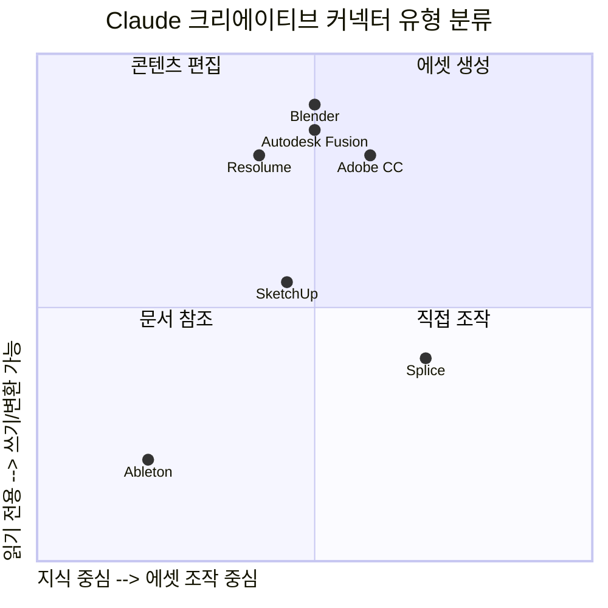

---

## 9. 다음 도전

### 9-1. 전체 바운스 작업 자동화

윤일상은 게시물 말미에 다음 계획을 공개했다.

> "이제 믹스 작업 전 짬을 내어 '전체 바운스(Bounce) 작업 자동화'에 도전해 보려고 합니다."

바운스(Bounce)란 Logic Pro 등의 DAW에서 완성된 음악 프로젝트를 MP3, WAV, AIFF 등의 오디오 파일로 내보내는 작업이다. 전문 음악 제작 환경에서는 트랙 수십 개, 버전 수십 개를 다양한 포맷으로 반복 출력해야 하는 일이 잦다.

전체 바운스 자동화에는 다음과 같은 요소가 필요하다.

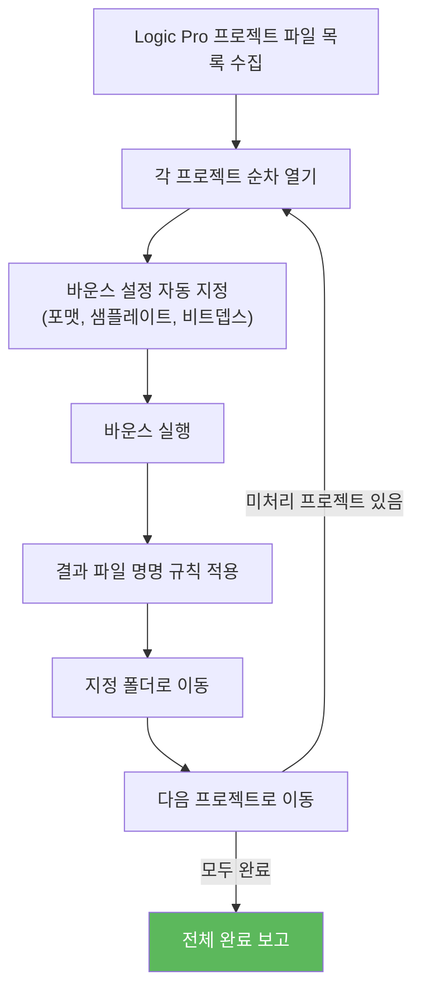

이 작업은 단순 반복이지만 수동으로 하면 수 시간이 걸릴 수 있다. Claude Cowork가 Logic Pro의 AppleScript 인터페이스나 키보드 단축키를 조합하여 자동화한다면, 프로듀서는 다른 창작 작업에 집중하는 동안 수십 개의 바운스가 자동으로 완료될 수 있다.

---

## 10. 이 사례가 가지는 의미

### 10-1. "말하는 대로 다 되는 시대"

윤일상은 이 경험 후 "정말 말하는 대로 다 되는 시대에 살고 있네요"라고 했다. 이 말은 과장이 아니다. 그러나 좀 더 정확하게 표현하면, '말하는 대로 다 된다'는 것의 의미가 이제 다른 수준으로 격상되었다는 뜻이다.

과거의 "말로 시키기"는 문서 작성, 검색, 요약 등 **정보 처리** 영역에 국한되었다. Claude Cowork가 보여주는 "말로 시키기"는 **시스템 레벨의 자동화**까지 포괄한다. 코드 작성, 컴파일, 파일 시스템 조작, 데몬 등록, 앱 제어가 모두 자연어 한 문장으로 시작된다.

### 10-2. 사람과 컴퓨터의 관계 변화

윤일상은 이 사례를 통해 큰 흐름을 체감했다.

> "이제는 사람이 컴퓨터를 일일이 조작하는 시대를 넘어, 컴퓨터에게 일을 맡기고 결과만 검수하는 시대가 오고 있음을 체감합니다."

이 변화를 도식화하면 다음과 같다.

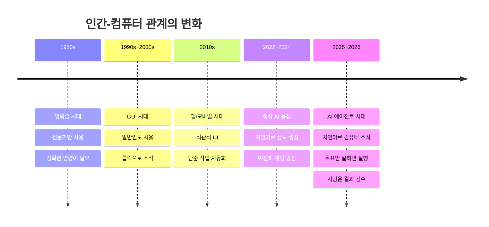

### 10-3. 음악 전문가에게 미치는 실질적 영향

이 자동화가 단순히 "재미있는 기술 실험"이 아닌 이유는, 음악 작업자의 실제 시간 분배를 바꾸기 때문이다.

전문 음악 프로듀서의 작업 시간 중 상당 부분은 **창작 자체가 아니라 창작을 위한 환경 설정과 반복 작업**에 소비된다. MIDI 연결 확인, 샘플 검색, 파일 정리, 포맷 변환, 바운스 등이 그것이다.

이런 작업들이 AI 에이전트로 자동화되면, 음악가는 진정으로 가치 있는 창작 판단—어떤 멜로디가 좋은가, 어떤 사운드가 감정을 자극하는가, 어떤 구성이 청중을 사로잡는가—에만 집중할 수 있게 된다.

### 10-4. 기술 이해 없이도 가능해진 시스템 자동화

이 사례의 또 다른 의미는 **기술 장벽의 붕괴**다. Swift 언어, CoreMIDI API, LaunchAgent 구조, Bonjour 프로토콜은 각각 전문 지식을 요구하는 영역이다. 이것을 결합하여 안정적인 자동화 도구를 만들려면 경험 있는 macOS 개발자도 상당한 시간을 들여야 한다.

Claude Cowork는 이 모든 과정을 내부적으로 처리했다. 사용자는 목적만 이야기하고, 권한만 부여하면 되었다.

### 10-5. 음악 + AI 도구 생태계의 2026년 현황

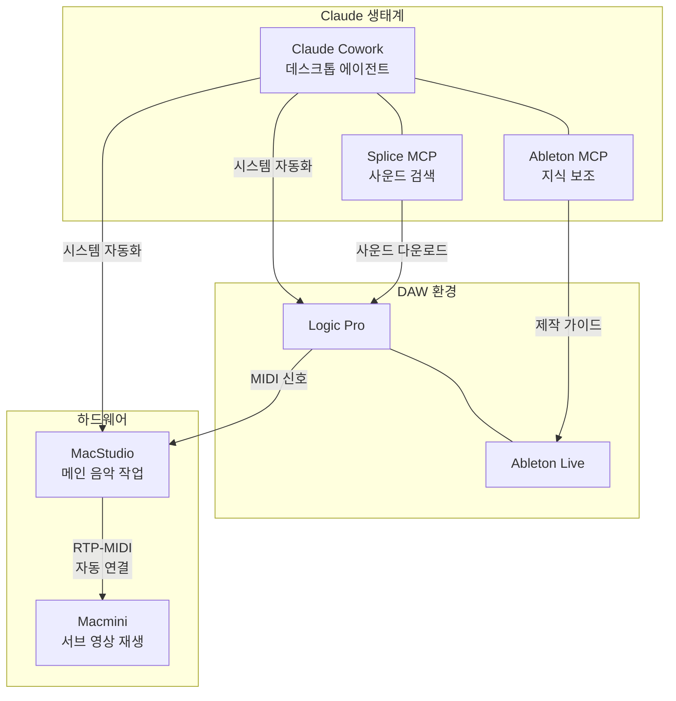

---

## 11. 기술 용어 정리

이 문서에 등장하는 기술 용어를 비개발자도 이해할 수 있게 정리한다.

### RTP-MIDI (Real-time Transport Protocol MIDI)
악기와 컴퓨터 사이의 MIDI 신호를 네트워크(Wi-Fi, 이더넷)를 통해 주고받는 기술이다. USB 케이블 없이도 두 대의 맥이 같은 Wi-Fi에 연결되어 있으면 MIDI를 주고받을 수 있다. Apple이 macOS에 기본 내장했으며, 포트 5004번 UDP를 기본값으로 사용한다.

### Bonjour
애플이 만든 제로 컨피규레이션 네트워킹 기술이다. 같은 네트워크 안의 장치들이 별도 설정 없이 서로를 자동으로 발견할 수 있게 한다. 프린터를 자동 인식하거나, 맥들이 파일 공유 시 서로를 발견하는 것이 Bonjour 덕분이다. MIDI Network도 Bonjour를 사용해 네트워크의 MIDI 장치를 탐색한다.

### LaunchAgent
macOS에서 사용자 로그인 시 자동으로 실행되는 백그라운드 프로그램을 등록하는 방법이다. `~/Library/LaunchAgents/` 폴더에 XML 형식의 plist 파일을 저장하고 `launchctl load` 명령으로 활성화한다. Claude가 만든 MIDI 자동 연결 데몬이 이 방식으로 등록되어, 컴퓨터를 켤 때마다 자동으로 실행된다.

### CoreMIDI
Apple이 제공하는 macOS의 MIDI 처리 핵심 프레임워크다. MIDI 장치 관리, 데이터 전송, 네트워크 MIDI 연결 등을 프로그래밍 방식으로 제어할 수 있다. Claude가 Swift 코드를 통해 이 프레임워크를 직접 호출하여 MIDI Network 연결을 자동화했다.

### MCP (Model Context Protocol)
Anthropic이 개발한 개방형 표준 프로토콜이다. AI 모델이 외부 서비스나 데이터 소스에 실시간으로 연결할 수 있도록 한다. Splice, Ableton, Adobe 등 다양한 회사가 MCP를 통해 자사 서비스를 Claude에 연결하고 있다. 마치 USB가 다양한 기기를 컴퓨터에 연결하듯, MCP는 다양한 서비스를 AI에 연결하는 표준이다.

### 바운스 (Bounce)
DAW에서 완성된 음악 프로젝트를 MP3, WAV 등의 독립적인 오디오 파일로 출력하는 과정이다. "렌더링"이나 "익스포트"라고도 부른다. 음반 배포, 영상 삽입, 의뢰인 전달 등을 위해 반드시 거쳐야 하는 단계다.

### NetServiceBrowser
macOS Swift/Objective-C에서 Bonjour 네트워크 서비스를 실시간으로 탐색하는 클래스다. 같은 네트워크에 특정 서비스(예: RTP-MIDI 세션)가 나타나거나 사라지는 이벤트를 감지할 수 있다. Claude가 Macmini를 감지하는 데 이 클래스를 활용했다.

---

## 결론

윤일상의 이 실험은 기술 데모나 개인적 호기심이 아니라, AI 에이전트가 전문 창작자의 실제 작업 흐름에 깊숙이 통합되기 시작했음을 보여주는 실증 사례다.

"말하는 대로 다 되는 시대"는 이미 시작되었다. 음악가는 MIDI 케이블을 꽂고, 설정을 조작하고, 바운스 버튼을 누르는 대신, 자신의 음악이 어떤 감정을 전달해야 하는지에 대해 더 많이 생각할 수 있게 되고 있다.

핵심은 AI가 음악을 대신 만드는 것이 아니라, AI가 음악가가 음악을 더 잘 만들 수 있도록 **반복적이고 기술적인 부담을 대신 짊어지는** 역할을 하고 있다는 점이다. 이것이 2026년 현재 AI 에이전트가 창작 현장에서 자리잡는 방식이다.

---

*이 문서는 윤일상의 공개 페이스북 게시물, Anthropic 공식 문서, Splice 공식 블로그, Apple 지원 문서 등 공개된 자료를 기반으로 작성되었습니다.*

*가용한 자료의 범위 안에서 기술적 사실관계를 확인했으며, 코드의 세부 구현은 화면에서 확인 가능한 부분으로만 기술하였습니다.*
