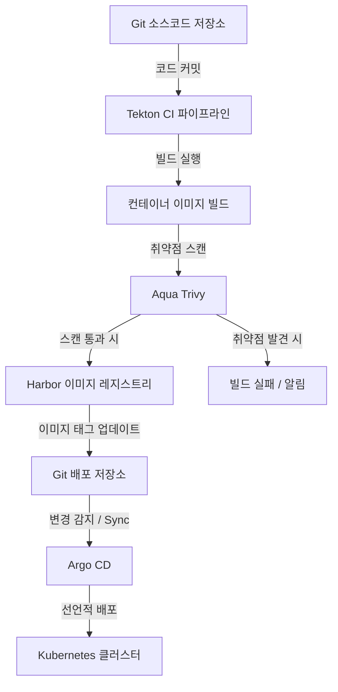
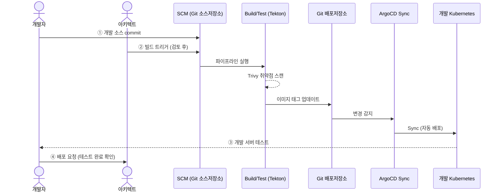
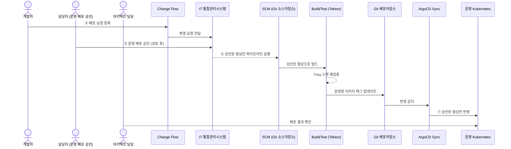
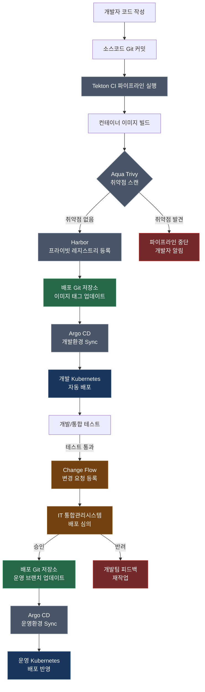
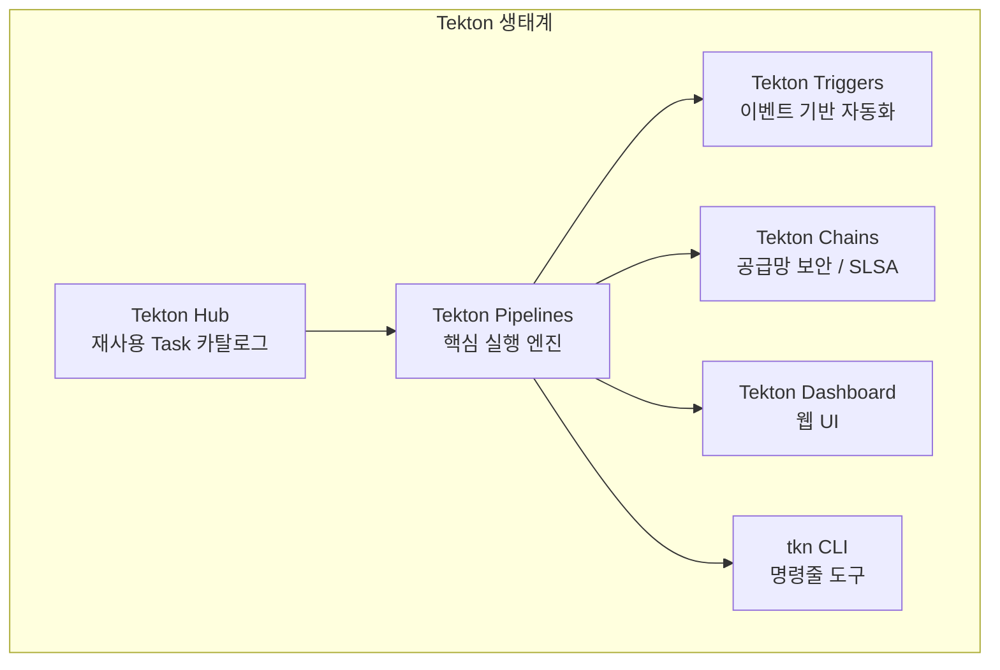
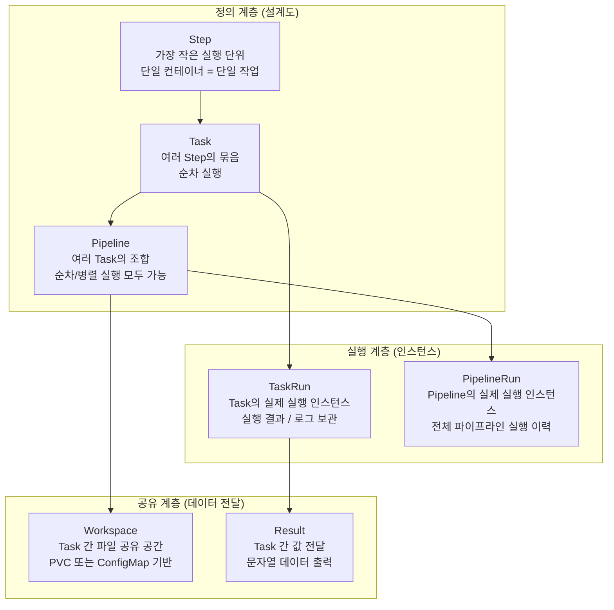
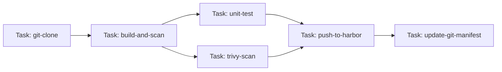
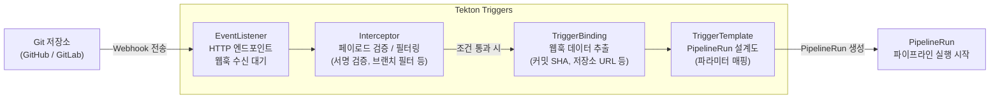
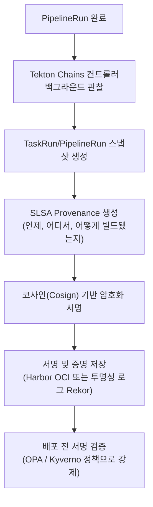
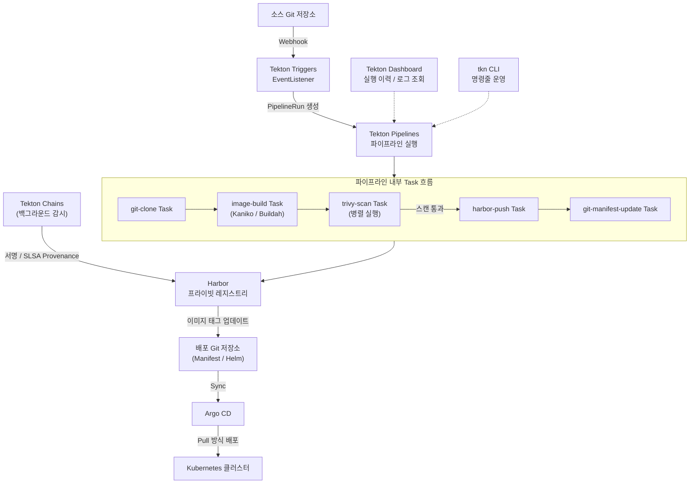

## 개요

이 자료는 블루페이은행의 자동화 배포 아키텍처를 기반으로 하며, 핵심 메시지는 다음과 같다.

> **"GitOps 기반 CI/CD 체계를 통해 자동화된 배포와 표준화된 운영 프로세스로 보안·일관성·안정성을 확보한다."**

이 한 문장이 아키텍처 전체의 철학을 담고 있다. 사람이 수동으로 배포 명령을 실행하던 방식에서 벗어나, **Git 저장소에 코드가 커밋되는 순간부터 운영 환경에 반영되기까지의 모든 과정을 자동화·표준화·감사 가능한 형태로 운영**하겠다는 선언이다.

---

## 1. 배경: 왜 GitOps 기반 CI/CD인가?

### 1.1 전통적 배포 방식의 한계

전통적인 금융 IT 환경에서는 개발자가 코드를 완성하면 배포 담당자가 SSH로 서버에 접속하여 직접 파일을 복사하거나 명령을 실행하는 방식이 일반적이었다. 이 방식은 담당자 개인의 숙련도에 의존하기 때문에 배포할 때마다 결과가 달라질 수 있고, 어떤 버전이 어느 서버에 배포되었는지 정확히 추적하기 어렵다는 문제가 있다. 무엇보다 보안 감사나 컴플라이언스 요구사항이 까다로운 금융권에서는 "누가, 언제, 무엇을 배포했는가"를 명확히 증명할 수 없다는 점이 치명적 약점이다.

### 1.2 클라우드 네이티브 환경의 요구사항

블루페이은행이 추진하는 것과 같이 기존 온프레미스 시스템을 클라우드로 이전하는 프로젝트에서는 Kubernetes 기반의 컨테이너 환경을 채택하는 것이 표준이 되었다. Kubernetes 환경에서는 수십~수백 개의 컨테이너 이미지가 동시에 운영되며, 이를 수동으로 관리하는 것은 사실상 불가능하다. CNCF(Cloud Native Computing Foundation)의 2025년 설문조사에 따르면 응답 조직의 76%가 GitOps를 채택했거나 채택 중이라고 밝혔으며, 이는 GitOps가 클라우드 네이티브 배포의 사실상 표준(de facto standard)으로 자리잡았음을 의미한다.

---

## 2. 핵심 개념 이해

### 2.1 CI (지속적 통합, Continuous Integration)

CI는 개발자가 코드를 변경하여 저장소에 올리는(commit/push) 순간 자동으로 빌드, 테스트, 품질 검증이 실행되는 일련의 자동화 과정을 말한다. 이를 통해 코드 결함을 조기에 발견하고, 항상 배포 가능한 상태의 소프트웨어를 유지할 수 있다. 본 프로젝트에서 CI 단계의 핵심 도구는 **Tekton**과 **Trivy**이며, 빌드된 결과물(컨테이너 이미지)은 **Harbor**에 저장된다.

### 2.2 CD (지속적 배포, Continuous Deployment/Delivery)

CD는 CI를 통과한 검증된 결과물을 실제 운영 환경에 자동으로, 혹은 승인 절차를 거쳐 배포하는 과정이다. 이 프로젝트에서는 **GitOps 방식의 CD**를 채택하였으며, **Argo CD**가 그 핵심 역할을 담당한다.

### 2.3 GitOps란 무엇인가

GitOps는 Git 저장소를 인프라와 애플리케이션의 **단일 진실 공급원(SSOT, Single Source of Truth)** 으로 삼아, 시스템의 원하는 상태(desired state)를 선언적으로 관리하는 운영 패러다임이다. 쉽게 말해, "운영 환경이 어떤 모습이어야 하는가"를 Git에 코드로 기록해두면, 자동화 도구가 실제 환경을 그 상태와 일치시키도록 지속적으로 동기화한다.

GitOps가 전통적 CD와 다른 핵심적 차이점은 **Push 방식이 아닌 Pull 방식**이라는 점이다. 전통적 CD는 파이프라인이 외부에서 서버에 직접 배포 명령을 밀어 넣는(Push) 방식인 반면, GitOps는 클러스터 내부의 에이전트(Argo CD)가 Git의 변경 사항을 지속적으로 감시하다가 자신이 당겨와서(Pull) 반영한다. 이 덕분에 외부에서 클러스터로의 직접 접근 권한이 불필요해지므로 보안성이 크게 향상된다.

---

## 3. CI/CD 아키텍처 구성 요소



### 3.1 Git — 소스코드 및 형상 관리의 중심

Git은 이 아키텍처에서 두 가지 역할을 동시에 수행한다. 첫째는 개발자들이 작성한 애플리케이션 소스코드를 관리하는 **소스코드 저장소(SCM, Source Code Management)** 이고, 둘째는 Kubernetes에 배포할 매니페스트(YAML 파일, Helm 차트 등 배포 명세서)를 담은 **배포 형상 저장소(Config Repository)** 이다. 이 두 저장소를 분리하는 것이 GitOps의 권장 패턴이며, 소스코드가 변경될 때마다 CI가 새 이미지를 빌드하고 해당 이미지 태그를 배포 저장소에 기록하는 방식으로 연동된다.

### 3.2 Tekton — Kubernetes 네이티브 CI 파이프라인 엔진

**Tekton**은 Kubernetes 위에서 직접 동작하는 오픈소스 CI/CD 프레임워크로, CNCF(Cloud Native Computing Foundation) 인큐베이팅 프로젝트이다. 기존의 Jenkins가 별도의 마스터 서버를 필요로 하는 것과 달리, Tekton은 Kubernetes의 CRD(Custom Resource Definition) 형태로 파이프라인을 정의하고 클러스터 내 Pod에서 실행한다. 2025년 8월에 출시된 Tekton v1.3.1 LTS 버전은 2026년 8월까지 공식 지원이 보장되며, 안정화된 v1 API와 향상된 성능, 기본적으로 루트 권한 없이 실행되는 보안 강화 설정을 제공한다.

Tekton의 가장 큰 장점은 **모듈식 재사용성**이다. 파이프라인의 구성 단위인 Task(작업)와 Step(단계)을 마치 레고 블록처럼 조립해 다양한 파이프라인을 구성할 수 있으며, 이 모든 정의가 Kubernetes 리소스로 관리되므로 파이프라인 자체도 Git으로 버전 관리가 가능하다. 또한 Tekton Triggers 컴포넌트를 통해 Git 커밋, PR(Pull Request) 등 이벤트 기반으로 파이프라인이 자동 실행된다.

2025년에는 OPA(Open Policy Agent)와 Kyverno를 통한 정책 집행 기능, OpenTelemetry 기반 향상된 가시성 기능이 추가되었으며, 커뮤니티 벤치마크 기준으로 에이전트 기반 시스템 대비 배포 시간이 최대 50% 단축된다는 결과도 있다. Tekton의 상세 내부 아키텍처는 본 문서 말미의 **[별첨] Tekton 아키텍처 상세**를 참조한다.

### 3.3 Aqua Trivy — 컨테이너 이미지 취약점 사전 검증

**Aqua Trivy**는 Aqua Security가 개발하고 관리하는 오픈소스 보안 스캐너로, 깃허브 스타 수 35,000개 이상, 연간 1억 회 이상 다운로드될 만큼 컨테이너 보안 스캔 분야의 사실상 표준 도구가 되었다. Trivy의 핵심 가치는 **단일 도구로 전체 보안 스캔 체계를 커버**한다는 점이다. 구체적으로는 컨테이너 이미지 내 OS 패키지 및 언어별 라이브러리의 CVE(알려진 취약점) 탐지, IaC(Infrastructure as Code) 파일의 잘못된 설정 탐지, Git 저장소의 민감 정보(시크릿, API 키) 노출 탐지, SBOM(소프트웨어 재료 목록) 생성까지 지원한다.

본 프로젝트에서 Trivy가 담당하는 역할은 **배포 전 이미지 취약점 사전 검증**이다. Tekton이 애플리케이션을 빌드하여 컨테이너 이미지를 생성한 직후, Trivy가 해당 이미지를 스캔하여 HIGH·CRITICAL 등급의 취약점이 발견되면 파이프라인이 즉시 중단(fail)되고 Harbor에 이미지가 업로드조차 되지 않는다. 이를 통해 취약한 이미지가 운영 환경에 배포되는 것을 원천 차단할 수 있다. Harbor는 Trivy를 기본 스캐너로 공식 채택하고 있어 Harbor에 이미지가 업로드되는 시점에도 추가 스캔이 자동 실행되는 이중 검증 구조가 가능하다.

2025년 7월, Aqua Security는 'Trivy Partner Connect Program'을 공식 출범시켜 상업적 파트너 생태계를 확장하고 있으며, 이는 오픈소스 핵심 기능의 지속적인 신뢰성 유지와 엔터프라이즈 수준의 확장 기능 개발을 동시에 추진하는 전략이다.

### 3.4 Harbor — 프라이빗 컨테이너 이미지 레지스트리

**Harbor**는 VMware가 2014년에 개발하여 2016년에 오픈소스로 공개한 프라이빗 컨테이너 레지스트리이다. 2018년 CNCF에 합류하여 2020년 6월 CNCF Graduated 프로젝트로 승격되었으며, 현재 GitHub 스타 30,500개 이상을 기록하는 클라우드 네이티브 컨테이너 레지스트리의 사실상 표준이다.

본 프로젝트에서 Harbor가 필요한 이유는 명확하다. 결제 인증 시스템이라는 금융 핵심 인프라를 운영하는 환경에서 외부 퍼블릭 레지스트리(Docker Hub 등)에 이미지를 올려두는 것은 보안 및 컴플라이언스 측면에서 용납하기 어렵다. Harbor는 조직 내부 네트워크에서 자체 운영하는 **프라이빗 레지스트리**이므로, 이미지가 외부로 유출될 위험 없이 안전하게 관리된다.

Harbor의 주요 기능으로는 역할 기반 접근 제어(RBAC), 이미지 서명 및 신뢰 정책(Cosign/Notation), Trivy와의 취약점 스캔 통합, 다중 레지스트리 복제(재해 복구), 감사 로그(Audit Log) 등이 있다. 특히 2025년 후반에 출시된 v2.14 버전은 로봇 계정(Robot Account) 범위 개선 및 감사 로그 강화로 CI 파이프라인 연동을 더욱 정밀하게 통제할 수 있게 되었다.

### 3.5 Argo CD — GitOps 기반 지속적 배포 엔진

**Argo CD**는 CNCF Graduated 프로젝트로, Kubernetes 환경에서 GitOps를 구현하는 도구의 사실상 표준이다. 2025년에는 Argo CD 3.0이 출시되어 GitOps 운영의 새로운 장을 열었으며, 국내 다수의 금융·클라우드 기업도 Argo CD를 중심으로 멀티 클러스터 GitOps 운영 체계를 발전시키고 있다.

Argo CD의 작동 원리는 다음과 같다. 클러스터 안에 상주하는 Argo CD 에이전트가 설정된 Git 저장소를 지속적으로 모니터링한다. Git 저장소의 배포 명세(YAML, Helm 차트 등)와 실제 클러스터 상태가 달라지면 "OutOfSync" 상태로 감지하고, 자동 동기화(Auto Sync) 설정에 따라 즉시 클러스터를 Git의 원하는 상태로 맞춘다. 만약 운영자가 `kubectl` 명령으로 직접 운영 환경을 수동 변경하더라도 `selfHeal` 기능이 활성화되어 있으면 Argo CD가 이를 원래 Git에 정의된 상태로 자동 복구한다.

이 특성은 **"모든 변경은 반드시 Git PR을 통해 리뷰되어야 한다"는 감사 가능성(Auditability)** 과 **"클러스터 상태가 Git과 항상 일치한다"는 일관성(Consistency)** 을 동시에 보장한다는 의미이다.

---

## 4. CI/CD 구성 흐름도 상세 분석

흐름도는 배포 프로세스를 **개발/테스트 환경**과 **운영 환경**으로 명확히 분리하여 설명하고 있다. 이는 금융 IT의 핵심 원칙인 **환경 분리(Environment Segregation)** 를 반영한다.

### 4.1 개발/테스트 환경 흐름



**① 개발 소스 commit**: 개발자가 기능 개발 또는 버그 수정을 완료하고 소스코드를 SCM(Git)에 커밋한다. 이 행위가 전체 CI/CD 파이프라인을 시작하는 트리거가 된다.

**② 빌드 트리거**: 아키텍트(또는 자동화된 Webhook)가 빌드 실행을 승인하거나 촉발한다. Tekton Triggers가 Git의 특정 이벤트(커밋, PR 등)를 감지하여 파이프라인을 자동 실행하는 방식으로 구성된다.

**SCM → Build/Test**: Tekton 파이프라인이 실행되며, 소스코드 클론 → 컨테이너 이미지 빌드 → Trivy 취약점 스캔 → Harbor 이미지 등록의 단계가 자동으로 진행된다. 취약점 스캔에서 심각도 기준을 초과하는 문제가 발견되면 파이프라인은 이 단계에서 중단된다.

**Git Update → ArgoCD Sync**: 빌드와 스캔을 통과한 이미지의 태그(버전)가 Git 배포 저장소에 자동으로 업데이트된다. Argo CD는 이 변경을 감지하고 개발 Kubernetes 클러스터에 새 버전을 자동 동기화한다.

**③ 개발 서버 테스트**: 자동 배포된 개발 환경에서 개발자와 QA 담당자가 기능 검증, 통합 테스트, 회귀 테스트 등을 수행한다.

**④ 배포 요청**: 개발 환경 테스트가 완료되면, 운영 환경 배포를 위한 공식적인 요청이 생성된다.

### 4.2 운영 환경 흐름 — 승인 기반 제어 게이트



운영 환경 배포는 개발 환경과 달리 반드시 **인간의 명시적 승인**을 거쳐야 한다는 점이 핵심적인 차이이다.

**Change Flow**: 개발 환경 검증이 완료된 배포 요청이 공식적인 변경 관리(Change Management) 절차로 진입한다. 금융권에서 변경 관리는 서비스 중단이나 데이터 손상을 예방하기 위한 필수 거버넌스 절차이다.

**IT 통합관리시스템 (ITSM)**: 변경 요청이 IT 통합관리시스템으로 전달된다. 여기서 담당자는 변경 내용의 리스크, 영향도, 배포 일정 등을 종합적으로 검토한다.

**⑤ 운영 배포 승인**: IT 담당자(운영팀, 보안팀, 변경관리위원회 등)가 변경 요청을 검토하고 명시적으로 승인한다. 이 승인 없이는 운영 환경 파이프라인이 실행되지 않는다. "승인된 형상만"이라는 표현이 반복적으로 강조되는 이유가 바로 이 통제 지점 때문이다.

**⑥ 승인된 형상만 파이프라인 실행**: 승인이 완료된 특정 형상(이미지 버전, 배포 명세)에 대해서만 운영용 CI 파이프라인이 실행된다. 승인 받지 않은 코드나 임의로 변경된 코드는 절대 운영 환경에 진입할 수 없다.

**⑦ 승인된 형상만 반영**: Argo CD가 Git 배포 저장소의 운영 브랜치 변경을 감지하고, 승인된 이미지 태그를 운영 Kubernetes 클러스터에 동기화한다. 아키텍트 담당자가 배포 결과를 최종 확인한다.

---

## 5. 통합 CI/CD 운영 체계

### 5.1 ① 자동화 및 GitOps 구현

**Tekton 기반 CI 파이프라인 자동화**는 개발자의 코드 커밋부터 이미지 빌드, 스캔, 레지스트리 등록까지의 모든 과정을 사람의 개입 없이 자동으로 처리함을 의미한다. 이는 곧 배포 주기를 단축하고 인적 실수를 제거하는 효과로 이어진다.

**Trivy 기반 이미지 취약점 사전 검증**은 보안 취약점이 운영 환경에 도달하기 전에 CI 파이프라인 내에서 차단한다는 DevSecOps(개발+보안+운영 통합) 원칙의 실현이다. 보안을 배포 이후의 사후 작업이 아니라 개발 프로세스의 일부로 내재화하는 것이다.

**GitOps 기반 ArgoCD 자동 배포**는 Git이 운영 상태의 유일한 진실이 된다는 의미이다. 운영 환경 변경은 반드시 Git 커밋으로만 이루어지며, 이는 모든 변경 이력이 Git 히스토리에 남아 언제든지 감사(Audit)하고 이전 상태로 롤백할 수 있음을 보장한다.

### 5.2 ② 배포 일관성 확보

**Git 기반 단일 배포 관리체계**는 배포에 관한 모든 정보(어떤 이미지를, 어느 환경에, 어떤 설정으로 배포할지)가 오직 Git 하나에만 존재한다는 원칙이다. 여러 사람이 각자 다른 방법으로 배포 명령을 내리던 방식을 완전히 제거한다.

**환경 간 동일한 형상 기반 배포**는 개발 환경에서 테스트된 것과 동일한 컨테이너 이미지가 운영 환경에도 그대로 배포된다는 의미이다. 환경마다 코드를 다시 빌드하거나 설정을 손으로 수정하는 일이 없으므로, "내 로컬에서는 됐는데 운영에서 안 된다"는 문제가 발생하지 않는다.

**이미지 태그 기반 버전 관리**는 각 배포 버전이 고유한 컨테이너 이미지 태그(예: `v1.2.3`, `git-commit-sha`)로 식별된다는 의미이다. `latest` 태그처럼 가변적인 태그를 금지하고 불변(Immutable) 태그를 사용함으로써, 어느 시점에 어떤 정확한 버전이 운영되고 있는지 명확하게 파악하고 필요 시 이전 버전으로 즉시 롤백할 수 있다.

---

## 6. 전체 아키텍처 종합 흐름도



---

## 7. 이 아키텍처가 가져오는 효과

### 7.1 보안(Security)

모든 이미지는 배포 전 Trivy 스캔을 반드시 통과해야 하므로 알려진 취약점이 있는 이미지가 운영 환경에 유입되는 경로가 차단된다. 또한 Harbor의 이미지 서명 기능과 결합하면 신뢰된 출처에서 빌드된 이미지만 배포하도록 강제할 수 있다. 운영 환경에 대한 직접적인 쓰기 권한이 CI 파이프라인이나 개발자에게 부여되지 않고 Argo CD가 Pull 방식으로 처리하므로, 공격 표면(Attack Surface)이 최소화된다.

### 7.2 일관성(Consistency)

Git이 모든 배포의 단일 진실 공급원이므로 "누군가 서버에서 직접 수동 변경한 설정"이 쌓이는 형상 드리프트(Configuration Drift) 문제가 발생하지 않는다. Argo CD의 selfHeal 기능은 누군가 실수로 운영 환경에 직접 변경을 가하더라도 즉시 Git 상태로 복구한다.

### 7.3 안정성(Stability)

이미지 태그 기반 버전 관리 덕분에 배포 문제 발생 시 이전 버전의 태그로 Git을 되돌리는 것만으로 즉각적인 롤백이 가능하다. 변경 관리 프로세스(Change Flow → ITSM)를 통한 인간 승인 단계가 운영 환경 배포의 게이트 역할을 하므로, 검증되지 않은 변경이 운영 환경에 영향을 미칠 위험이 낮아진다. 모든 배포 이력이 Git 히스토리에 남으므로 장애 발생 시 정확한 원인 추적이 가능하다.

---

## 8. 비고

본 아키텍처 구성(안)은 테크넥서스(TechNexus)의 제안안이며, 최종 구성은 블루페이은행(BluePay Bank)와의 기술 협의를 통해 확정된다. 실제 프로젝트에서는 블루페이은행의 기존 보안 정책, 네트워크 구성, 컴플라이언스 요구사항(금융보안원 클라우드 보안 가이드라인 등)에 맞춰 각 도구의 설정과 승인 프로세스가 세부 조정될 수 있다.

---


# [별첨] Tekton 아키텍처 상세


## A. Tekton이란 — 개념적 배경

Tekton은 원래 Google이 Knative 프로젝트의 일부(`knative/build`)로 2018년에 시작하였으며, 같은 해 독립 프로젝트로 분리되어 현재는 CDF(Continuous Delivery Foundation) 산하에서 운영되는 오픈소스 프로젝트이다. Kubernetes를 기반 인프라로 삼아 CI/CD 워크플로우 자체를 Kubernetes 리소스로 정의한다는 것이 핵심 철학이다. 파이프라인을 별도의 서버에서 관리하는 Jenkins와 달리, Tekton의 모든 작업은 Kubernetes Pod 안에서 컨테이너로 실행된다. 이 덕분에 파이프라인이 인프라 클러스터와 동일한 수명주기, 스케줄링, 네트워크, 보안 정책의 적용을 받게 된다.

Tekton은 단일 바이너리가 아닌 **설치 가능한 컴포넌트들의 생태계**로 구성되어 있으며, 각 컴포넌트는 독립적으로 설치하고 활성화할 수 있다.



---

## B. 핵심 CRD(Custom Resource Definition) 구조

Tekton은 Kubernetes의 CRD 메커니즘을 활용하여 파이프라인을 정의한다. CRD란 Kubernetes가 기본으로 제공하지 않는 개념을 조직이 직접 추가로 정의해서 사용할 수 있도록 하는 확장 메커니즘이다. Tekton이 정의하는 핵심 CRD는 다음과 같은 계층 구조를 가진다.



### B.1 Step — 최소 실행 단위

Step은 Tekton에서 가장 작고 원자적인 실행 단위이다. 하나의 Step은 Kubernetes Pod 안에서 실행되는 단일 컨테이너에 정확히 대응한다. 예를 들어 "소스코드를 Git에서 클론하는 작업", "Maven으로 JAR 파일을 빌드하는 작업", "Trivy로 이미지를 스캔하는 작업" 각각이 별도의 Step이 된다. Step의 정의는 일반적인 Kubernetes 컨테이너 명세(image, command, env, volumeMounts 등)와 거의 동일하게 작성한다.

### B.2 Task — Step들의 순서 있는 묶음

Task는 하나 이상의 Step을 순차적으로 정의하는 단위이다. Task 내의 Step들은 동일한 Pod 안에서 순서대로 실행되며, 이전 Step이 성공해야 다음 Step이 실행된다. Task는 재사용 가능한 독립 단위로 설계되며, 파라미터(params)와 결과(results), 워크스페이스(workspaces)를 통해 외부로부터 값을 받거나 내보낼 수 있다.

```
[예시] 이미지 빌드 Task의 Step 구성
  Step 1: git-clone        (소스코드 클론)
  Step 2: unit-test        (단위 테스트 실행)
  Step 3: build-image      (Dockerfile 기반 이미지 빌드)
  Step 4: trivy-scan       (취약점 스캔)
  Step 5: push-to-harbor   (Harbor에 이미지 업로드)
```

### B.3 Pipeline — Task들의 조합

Pipeline은 여러 Task를 조합하여 전체 CI/CD 워크플로우를 정의하는 최상위 설계도이다. Pipeline 안에서 Task들은 순차적으로 실행될 수도 있고, `runAfter` 혹은 의존 관계 설정으로 특정 Task가 완료된 후에 다음 Task가 실행되도록 제어할 수 있다. 독립적인 Task들은 병렬로 동시에 실행하도록 설정하는 것도 가능하다.



위 예시에서 `unit-test`와 `trivy-scan`은 빌드가 완료된 후 병렬로 동시에 실행되며, 둘 다 완료된 후에야 Harbor 업로드가 진행된다.

### B.4 TaskRun / PipelineRun — 실행 인스턴스

Task와 Pipeline은 어디까지나 **설계도**이다. 실제로 파이프라인이 실행되면 Kubernetes는 `TaskRun`과 `PipelineRun` 오브젝트를 생성한다. 이 오브젝트들은 실행 당시의 파라미터 값, 실행 상태, 시작/종료 시각, 로그 참조, 결과 값 등 모든 실행 이력을 담고 있다. 과거에 실행된 모든 TaskRun과 PipelineRun은 Kubernetes 클러스터에 기록으로 남으며, `tkn` CLI나 Tekton Dashboard를 통해 언제든지 조회할 수 있다.

### B.5 Workspace — Task 간 데이터 공유

서로 다른 Task(즉 서로 다른 Pod)는 기본적으로 파일시스템을 공유하지 않는다. Workspace는 이 문제를 해결하기 위한 메커니즘으로, Kubernetes의 PVC(PersistentVolumeClaim), ConfigMap, Secret, 혹은 임시 볼륨(emptyDir)을 Workspace로 지정하면 Pipeline 내 여러 Task가 동일한 저장 공간을 마운트하여 파일을 주고받을 수 있게 된다. 예를 들어 `git-clone` Task가 소스코드를 Workspace에 내려받으면, 이후의 `build-image` Task가 동일한 Workspace에서 소스코드를 읽어 빌드를 수행하는 방식이다.

---

## C. Tekton Triggers — 이벤트 기반 파이프라인 자동화

Tekton Triggers는 외부 이벤트(Git 커밋, PR 생성, 이슈 코멘트 등)를 감지하여 자동으로 PipelineRun을 생성하는 컴포넌트이다. 이를 통해 개발자가 별도의 수동 조작 없이 코드를 커밋하는 것만으로 전체 CI 파이프라인이 자동 실행된다.



### C.1 EventListener

EventListener는 Kubernetes 클러스터 안에서 HTTP 서버로 동작하는 리소스이다. 특정 포트에서 외부 웹훅 요청을 수신 대기하며, Git 저장소의 Webhook 설정에서 이 주소로 이벤트를 전송하도록 구성한다. 하나의 EventListener는 여러 개의 Trigger를 포함할 수 있어, 예를 들어 main 브랜치 Push 이벤트와 PR 생성 이벤트를 각각 다른 파이프라인으로 라우팅하는 것이 가능하다. 또한 EventListener는 Prometheus 기반의 메트릭을 제공하여 수신된 이벤트 수, 처리 지연 시간 등을 모니터링할 수 있다.

### C.2 Interceptor

Interceptor는 EventListener가 웹훅을 수신했을 때 TriggerBinding에 전달하기 전에 페이로드를 먼저 가로채 검증하고 필터링하는 단계이다. Tekton이 기본 제공하는 Interceptor로는 GitHub Webhook 서명을 검증하는 `github` Interceptor, GitLab 전용 `gitlab` Interceptor, 그리고 자유로운 조건 표현식을 작성할 수 있는 `cel` Interceptor가 있다. 예를 들어 `main` 브랜치에 대한 Push 이벤트만 파이프라인을 실행하고 다른 브랜치는 무시하는 필터 로직을 Interceptor에 작성한다.

### C.3 TriggerBinding

TriggerBinding은 웹훅 페이로드(JSON 형태)에서 필요한 값을 추출하여 TriggerTemplate에 전달하는 역할을 한다. 예를 들어 GitHub Push 이벤트 페이로드에서 `head_commit.id`(커밋 SHA)와 `repository.clone_url`(저장소 URL)을 추출하여 각각 파이프라인 파라미터로 매핑하는 방식이다.

### C.4 TriggerTemplate

TriggerTemplate은 이벤트가 발생했을 때 생성할 Kubernetes 리소스(주로 PipelineRun)의 설계도이다. TriggerBinding에서 추출한 값을 파라미터로 받아 PipelineRun의 구체적인 설정(어떤 Pipeline을 실행할지, 파라미터 값은 무엇인지, 어떤 Workspace를 사용할지 등)을 채워넣는다.

---

## D. Tekton Chains — 소프트웨어 공급망 보안

Tekton Chains는 Tekton Pipelines의 보안 확장 컴포넌트로, CI/CD 파이프라인에서 생성되는 모든 아티팩트(컨테이너 이미지 등)에 대한 **암호화 서명과 출처 증명(Provenance)** 을 자동으로 생성한다.



### D.1 SLSA (Supply-chain Levels for Software Artifacts)

SLSA는 소프트웨어 공급망 보안을 위한 프레임워크로, "이 소프트웨어가 정말로 신뢰할 수 있는 파이프라인에서 변조 없이 빌드되었는가"를 증명하는 표준 메타데이터(Provenance) 생성 방식을 정의한다. SLSA는 레벨 1부터 4까지의 보안 수준을 정의하며, Tekton Chains는 빌드 과정을 변조 불가능한 형태로 기록하는 SLSA Level 2를 구현한다.

SLSA Provenance에는 다음 정보가 포함된다.

- 빌드가 시작된 Git 커밋 SHA
- 빌드에 사용된 Tekton Pipeline 및 Task의 정확한 버전
- 빌드 시작 및 종료 시각
- 빌드 환경(클러스터, 네임스페이스)
- 생성된 아티팩트(이미지)의 다이제스트(SHA256)

### D.2 실제 작동 흐름

Tekton Chains는 Kubernetes 컨트롤러로 백그라운드에서 실행되며, TaskRun이나 PipelineRun이 완료되는 것을 감시한다. 실행이 완료되면 해당 실행의 스냅샷을 기반으로 Provenance JSON을 생성하고, 설정된 서명 키(Cosign Keyless 또는 KMS 기반)로 서명한 뒤 OCI 레지스트리나 Rekor(투명성 로그)에 저장한다. 이후 OPA나 Kyverno 같은 정책 도구를 활용하면 "서명된 이미지만 운영 환경에 배포 허용"하는 게이트를 설정할 수 있어, 검증된 파이프라인을 거치지 않은 이미지의 배포를 원천 차단할 수 있다.

금융 IT 환경에서 Tekton Chains는 단순한 보안 기능을 넘어 **컴플라이언스 증빙 자동화** 수단이 된다. "이 이미지가 승인된 파이프라인에서 정해진 절차를 거쳐 빌드되었음"을 암호학적으로 증명하는 기록이 자동 생성되므로, 금융보안원 등의 감사 요청에 즉시 대응할 수 있다.

---

## E. Tekton과 주변 도구의 통합 구조



### E.1 Kaniko / Buildah — 도커 데몬 없는 이미지 빌드

Tekton 파이프라인에서 컨테이너 이미지를 빌드할 때 일반적인 `docker build` 명령을 그대로 사용하는 것은 보안상 위험하다. Docker 데몬에 접근하려면 호스트의 루트 권한이 필요하기 때문이다. Tekton 환경에서는 이를 대신해 루트 권한 없이 컨테이너 내부에서 이미지를 빌드하는 **Kaniko** 또는 **Buildah**를 사용한다. 이 도구들은 Dockerfile을 읽어 컨테이너 레이어를 생성하고 Harbor에 직접 Push하는 과정을 Docker 데몬 없이 처리한다.

### E.2 git-manifest-update Task — GitOps 연결 고리

Tekton 파이프라인이 Harbor에 이미지를 Push한 후, GitOps 연동을 위한 마지막 단계가 있다. 새로 빌드된 이미지의 태그(예: `payment-auth:commit-a1b2c3d`)를 Kubernetes 배포 매니페스트 파일(YAML 또는 Helm values.yaml)에 자동으로 기입하고 Git 배포 저장소에 커밋하는 Task이다. 이 커밋이 바로 Argo CD가 감지하는 변경 이벤트가 되어, Pull 방식 배포의 연쇄 반응이 시작된다.

### E.3 Tekton Dashboard

Tekton Dashboard는 Kubernetes 클러스터에 설치하는 웹 기반 UI로, 실행 중인 PipelineRun과 TaskRun의 상태, 각 Step의 실시간 로그, 성공/실패 이력, Workspace 정보 등을 시각적으로 확인할 수 있다. `kubectl` 명령이나 `tkn` CLI에 익숙하지 않은 팀원도 브라우저에서 파이프라인 실행 상황을 직관적으로 파악할 수 있어 팀 전체의 CI/CD 가시성을 높인다.

### E.4 Tekton Hub — 재사용 Task 카탈로그

Tekton Hub(hub.tekton.dev)는 커뮤니티와 벤더가 검증한 재사용 가능한 Task와 Pipeline을 공유하는 공식 카탈로그이다. git-clone, trivy, kaniko, buildpacks, helm-upgrade 등 CI/CD에서 자주 사용되는 Task들이 이미 Hub에 공개되어 있어, 팀이 처음부터 모든 Task를 작성하지 않고 검증된 Task를 가져다 조합하는 방식으로 파이프라인을 빠르게 구성할 수 있다.

---

## F. Tekton 배포 고려사항 요약

| 항목 | 내용 |
|------|------|
| **현재 권장 버전** | v1.3.1 LTS (2025년 8월 출시, 2026년 8월까지 지원) |
| **Kubernetes 요구 버전** | v1.27 이상 권장 (v1 API 완전 지원) |
| **보안 기본값** | 비루트(non-root) 컨테이너 실행 기본값 |
| **공급망 보안** | Tekton Chains + Cosign으로 SLSA Level 2 달성 |
| **이벤트 자동화** | Tekton Triggers + GitHub/GitLab Webhook |
| **모니터링** | OpenTelemetry 기반 분산 추적, Prometheus 메트릭 |
| **정책 집행** | OPA 또는 Kyverno와 연동하여 파이프라인 정책 강제 |
| **멀티테넌시** | 네임스페이스 단위로 팀별 격리, ResourceQuota 적용 가능 |
| **ArgoCD 연동** | Tekton이 빌드·스캔·Push → Git 매니페스트 업데이트 → ArgoCD Pull 배포 |

---

*작성일: 2026년 6월 19일*
