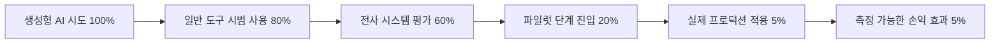
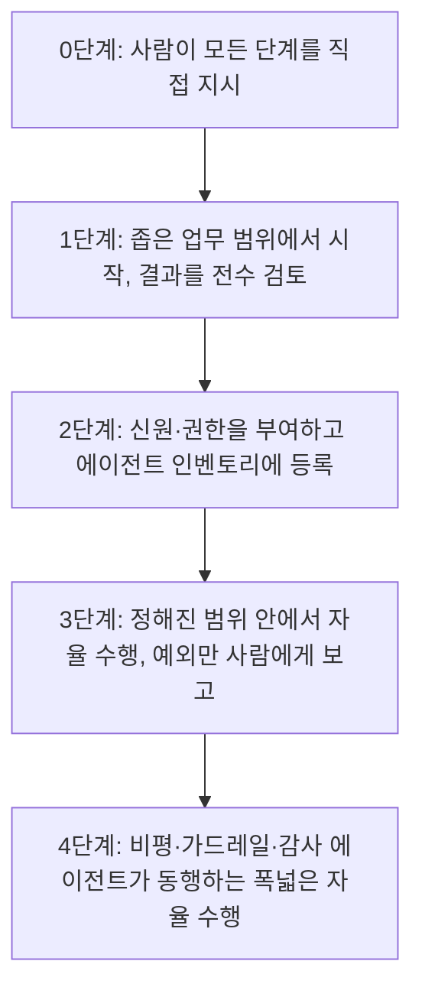

> 
> https://www.threads.com/@doroonja/post/DZwtTTQDjvC
> 
> AX를 AI를 통한 업무 자동화로 생각하는 경우가 많아보여. AX는 AI 에이전트를 직원이나 동료로 두고 같이 업무하는 환경이 되는거야. 즉, 에이전트 동료가 처음에는 A 일을 하지만 점점 B,C를 할 수 있어야 해.
> 
> 혹 AX 컨설팅 받았는데 결과가 확장 불가능한 형태면 잘못된거니 환불 받자
> 

## 목차

1. 들어가며
2. 1부 — 데이터가 말하는 현실: AX는 왜 대부분 실패하는가 (MIT NANDA 보고서)
3. 2부 — 글로벌 기업의 실제 적용 사례 세 가지
4. 3부 — 검증된 적용 방법론: McKinsey와 Gartner가 제시하는 운영 모델
5. 4부 — "동료" 모델이 실제 사용 데이터로도 확인되는가
6. 5부 — 종합: 제대로 된 AX 적용을 위한 8단계 프레임워크
7. 마치며
8. 참고자료

---

## 1. 들어가며

이전 문서가 한국 기업과 한국 매체의 자료 위주로 작성된 점에 대한 지적은 타당하다. 이번 문서는 그 보완으로, 한국 시장 사례를 거의 배제하고 글로벌 연구기관(MIT, McKinsey, Gartner)과 실제로 수년간 AX를 운영해온 글로벌 기업(JP모건 체이스, IBM, 클라르나)의 1차 자료 및 신뢰할 수 있는 경제·기술 전문매체 보도를 중심으로 다시 작성했다. 특히 "적용 방법"을 다룰 때는 막연한 성공담이 아니라, 실패 사례와 그 실패가 교정된 과정까지 포함해 균형 있게 다루려 했다. AX를 둘러싼 정보 중 상당수는 컨설팅·솔루션 기업이 자사 서비스를 판매하기 위해 작성한 자료이기 때문에, 이번 문서에서는 그런 자료보다 학술 연구기관의 실증 조사와 기업이 직접 공개한 1차 데이터를 우선했다.

---

## 2. 1부 — 데이터가 말하는 현실: AX는 왜 대부분 실패하는가

### 2.1 MIT NANDA의 "GenAI Divide" 보고서

2025년 7월, MIT 미디어랩 산하 Project NANDA는 「The GenAI Divide: State of AI in Business 2025」라는 보고서를 발표했다. 이 보고서는 300건 이상의 공개된 AI 도입 사례를 분석하고, 52명의 기업 리더를 구조화 인터뷰하고, 153명의 임원을 설문조사한 결과를 담고 있다. 핵심 결론은 단순하지만 충격적이다. 기업들이 생성형 AI에 300억~400억 달러를 투자했음에도 불구하고, 그중 95%의 조직은 손익(P&L)에 측정 가능한 영향을 전혀 만들어내지 못했다는 것이다. 실제로 의미 있는 매출 성장이나 비용 절감으로 이어진 파일럿은 전체의 5%에 불과했다.

흥미로운 점은 이 격차의 원인이 모델 성능이나 규제, 인재 부족이 아니라는 것이다. 보고서는 이를 "학습 격차(Learning Gap)"라고 명명했다. 챗GPT나 코파일럿 같은 범용 도구는 개인 생산성 향상에는 폭넓게 쓰이지만(80% 이상의 조직이 시범 사용, 약 40%가 정식 도입), 기업 차원의 손익 개선으로는 이어지지 않는다. 반면 기업 전용으로 설계된 시스템은 60%의 기업이 검토했지만 파일럿 단계까지 간 것은 20%, 실제 프로덕션까지 간 것은 5%에 그쳤다. 보고서는 그 이유로 "대부분의 생성형 AI 시스템이 피드백을 저장하지 않고, 맥락에 적응하지 않으며, 시간이 지나도 개선되지 않는다"는 점을 지목했다.

### 2.2 성공한 5%는 무엇을 다르게 했는가

보고서가 더 가치 있는 이유는 실패 통계 자체보다, 성공한 5%가 공유하는 네 가지 특징을 구체적으로 짚었다는 데 있다.

첫째, **외부 파트너십을 활용한 조직이 자체 구축한 조직보다 약 두 배 높은 성공률을 보였다.** 외부 전문 벤더와 협업한 경우 성공률이 67%에 달한 반면, 내부에서 직접 만든 경우 성공률은 33%에 그쳤다. 이는 사내 개발팀의 역량 부족 문제라기보다, 외부 파트너가 가져오는 도메인 특화 경험과 반복 학습된 패턴이 실제 업무 적응 속도를 높였기 때문으로 분석된다.

둘째, **투자 우선순위가 영업·마케팅이 아니라 백오피스(재무, 운영, 법무)에 있을 때 ROI가 더 높았다.** 많은 기업이 가시성이 높은 영업·마케팅 영역에 예산을 집중했지만, 실제 수익성 개선은 반복적이고 정형화된 백오피스 업무에서 더 뚜렷하게 나타났다.

셋째, **하향식(top-down)이 아니라 상향식(bottom-up) 도입이 더 잘 작동했다.** 보고서 원문은 가장 성공적인 배치 다수가 이미 개인적으로 챗GPT나 클로드 같은 도구를 업무에 써본 "파워 유저"들로부터 시작되었다고 기술한다. 이들은 AI의 능력과 한계를 직관적으로 이해하고 있었고, 중앙 AI 조직이 일방적으로 사용 사례를 지정하기보다, 예산을 보유한 현업 관리자가 직접 문제를 찾아내고 도구를 검증하고 도입을 주도하도록 했을 때 성과가 더 빨리, 더 적합하게 나타났다.

넷째, **이렇게 성과를 낸 조직 다수가 인력 감축 없이 성과를 거두었다는 점도 보고서가 특별히 강조한 대목이다.** 즉 "AX = 인력 대체"라는 통념과 달리, 가장 성공적인 사례들은 인력을 줄이지 않고도 측정 가능한 가치를 만들어냈다.

---

## 3. 2부 — 글로벌 기업의 실제 적용 사례 세 가지

추상적인 통계를 넘어, 실제로 수년간 운영되며 검증된 세 기업의 사례를 살펴본다. 의도적으로 성공 사례 두 건과, 실패했다가 교정된 사례 한 건을 함께 다룬다.

```mermaid
flowchart TD
    subgraph JPM["JP모건 체이스 — COiN에서 450개 이상 사례로"]
        J1["2016년: 대출계약서 추출, 단일 업무"] --> J2["반복 검증으로 정확도 확보"]
        J2 --> J3["문서 유형과 부서를 단계적으로 확장"]
        J3 --> J4["2026년: 450개 이상 업무에 상시 운영"]
    end

    subgraph IBM["IBM — Client Zero 방법론"]
        I1["AskHR: 휴가 신청 등 단순 업무부터 시작"] --> I2["내부 직원 대상으로 먼저 검증"]
        I2 --> I3["HR 전반으로 확장, 90퍼센트 이상 자동 해결"]
        I3 --> I4["조달·재무 등 70개 이상 영역으로 확산"]
    end

    subgraph KLARNA["클라르나 — 성급한 전면화와 교정"]
        K1["2024년: 고객상담을 AI로 전면 전환"] --> K2["700명분 업무량 자동화를 공표"]
        K2 --> K3["복잡한 문의에서 만족도 하락"]
        K3 --> K4["2025~2026년: 사람을 재고용, 하이브리드로 재설계"]
    end
```

### 3.1 JP모건 체이스 — 좁은 업무에서 출발해 신원·권한부터 설계한다

JP모건 체이스의 AI 역사는 2016년 COiN(Contract Intelligence)이라는 시스템에서 출발한다. 이 시스템의 임무는 단 하나, 대출 계약서에서 150개의 정해진 항목을 추출하는 것이었다. 처음부터 모든 법무 업무를 자동화하려 하지 않고, 사람이 수작업으로 읽어야 했던 매우 좁고 정형화된 업무 하나에서 시작한 것이다.

2026년 현재 JP모건 체이스는 연간 180억 달러가 넘는 기술 예산 중 상당 부분을 AI에 투입하며, 후방업무 자동화·고객서비스·리스크 관리 등에 걸쳐 450개 이상의 AI 사용 사례를 프로덕션에서 운영하고 있고, 2026년 안에 1,000개까지 확대할 계획이라고 밝힌 바 있다. 같은 회사의 핵심 엔지니어링 책임자는 컴포넌트 테스트를 작성하는 에이전트를 사내 80개 서비스에 통합했다고 설명하면서, 반복적인 테스트 작성 업무를 에이전트에 맡기고 개발자는 검수와 코드에 대한 깊은 이해에 집중하도록 역할을 재배치했다고 말했다.

이 회사의 최고정보책임자(CIO) 로리 비어는 2026년 인터뷰에서 자신들의 접근 방식이 처음부터 매우 단순한 질문에서 출발했다고 밝혔다. "에이전트를 만들기에 적절한 수준이 어디인지, 그 에이전트에 어떻게 신원과 접근 권한을 부여할 것인지"부터 따졌다는 것이다. 이는 게시물이 말하는 "업무 A에서 B, C로 확장"하는 모델이 실제로는 권한 설계와 함께 가야 한다는 점을 보여준다. JP모건은 또한 2026년부터 에이전트가 한두 시간 단위로 길게 작동하는 장시간 실행 에이전트를 도입할 계획이라고 밝혔는데, 이는 보안 통제가 충분히 갖춰진 다음에야 가능한 일이라는 점도 함께 언급했다.

### 3.2 IBM — "Client Zero": 자기 자신에게 먼저 적용한다

IBM이 채택한 방법론은 "Client Zero(고객 제로)"라는 이름으로 불린다. 핵심은 새로운 AI 역량을 외부 고객에게 팔기 전에 IBM 스스로의 조직에 먼저, 가장 좁은 범위부터 적용해 검증한다는 것이다. 가장 잘 알려진 사례가 인사(HR) 부서의 AskHR 에이전트다. 이 에이전트는 처음에는 휴가 신청이나 급여명세서 조회처럼 매우 단순하고 반복적인 업무만 처리했다. IBM코리아 CTO가 2025년 밝힌 바에 따르면, AskHR은 이후 범위를 넓혀 HR 관련 단순 업무의 94%를 사람의 개입 없이 처리하는 수준에 도달했고, 이로 인해 HR 운영 예산이 40% 줄어들었다고 한다.

같은 방법론은 조달(procurement) 부서에도 적용되어 연간 2만 시간 이상의 업무 시간을 절감했고, IBM은 이런 식으로 70개 이상의 업무 영역에 AI 에이전트를 적용한 결과 2년간 누적으로 약 35억~45억 달러 규모의 생산성 효과를 거두었다고 공개 자료를 통해 밝히고 있다(공개 시점에 따라 35억 달러, 45억 달러, 또는 50억 달러로 다르게 언급되는데, 이는 측정 시점과 집계 범위가 보고서마다 달랐기 때문으로 보인다. 가장 최근의 IBM 공식 자료는 2년간 45억 달러의 생산성 효과와, 이를 포함한 2024년 한 해 127억 달러의 잉여현금흐름 창출에 기여했다고 기술하고 있다). 중요한 것은 액수 자체보다, IBM이 일관되게 강조하는 원칙이다. 작은 기능 영역에서 시작해서 내부적으로 충분히 검증한 뒤에야 더 넓은 영역, 그리고 외부 고객으로 확산한다는 순서다.

### 3.3 클라르나 — 성급하게 전면 자동화했다가 사람을 다시 고용한 사례

세 번째 사례는 앞의 두 사례와 결이 다르다. 스웨덴 핀테크 기업 클라르나는 2022~2024년 사이 고객상담 인력 약 700명 규모의 업무를 오픈AI와 협력해 만든 AI 어시스턴트로 대체했다고 공표했다. 출시 첫 달에만 230만 건의 대화를 처리했고, 전체 고객 문의의 3분의 2 이상을 AI가 처리하며, 응답 시간을 11분에서 2분 이내로 단축했다고 발표했다. 연간 약 4,000만~6,000만 달러의 비용 절감 효과를 거뒀다는 수치도 공개됐다.

문제는 그다음이다. 2025년 5월, 클라르나의 최고경영자 세바스티안 시에미아트코프스키는 블룸버그와의 인터뷰에서 "우리는 효율성과 비용에 너무 집중했고, 그 결과 품질이 낮아졌으며 이는 지속 가능하지 않았다"고 인정했다. 단순한 문의(주문 상태, 결제 일정 등)에서는 AI가 사람과 비슷한 성과를 냈지만, 맥락 이해와 공감, 예외적 판단이 필요한 복잡한 문의에서는 품질이 떨어졌고, 재문의율이 올라갔다는 분석이 뒤따랐다. 결국 클라르나는 사람을 다시 채용하기 시작했고, 2025년 9월 뉴욕증권거래소 상장을 거치면서는 엔지니어와 마케터 등 내부 인력까지 고객상담 업무에 재배치했다. 2026년 들어서는 AI가 정형화된 1차 응대를 맡고, 사람이 감정적으로 민감하거나 복잡한 사안을 맡는 하이브리드 구조로 안착하는 모습을 보이고 있다.

이 사례가 중요한 이유는, 게시물이 말한 "확장 불가능한 결과물이면 환불 받자"는 메시지와 본질적으로 같은 문제의식을 산업계 최전선에서 가장 적나라하게 보여주기 때문이다. 클라르나의 실패는 기술이 작동하지 않아서가 아니라, "닫힌 티켓 수"라는 잘못된 지표를 최적화한 결과 정작 "문제가 실제로 해결되었는가"라는 본질적 지표를 놓쳤기 때문이라는 분석이 여러 매체에서 공통적으로 제기됐다. 다시 말해, 처음부터 좁은 업무에서 신중하게 검증하며 확장했어야 할 일을, 한 번에 전체 업무 영역으로 밀어붙인 결과로 해석할 수 있다.

---

## 4. 3부 — 검증된 적용 방법론: McKinsey와 Gartner가 제시하는 운영 모델

### 4.1 McKinsey: "에이전틱 조직"이라는 새로운 운영 모델

McKinsey는 2025년 후반 발표한 분석에서, 에이전트가 늘어나는 조직에 필요한 것은 단순한 도구 도입이 아니라 새로운 운영 모델이라고 주장한다. 비유로 든 것이 소프트웨어 개발 분야에서 보안을 개발·운영 과정에 자동으로 내장시킨 데브섹옵스(DevSecOps)다. 마찬가지로 에이전틱 조직에서도 결과를 검증하는 비평(critic) 에이전트, 정책을 강제하는 가드레일 에이전트, 규제를 모니터링하는 컴플라이언스 에이전트를 업무 흐름 안에 내장시켜야 한다는 것이다. 모든 행동은 실시간으로 기록되고 설명 가능해야 하며, 사람의 역할은 한 줄 한 줄 검토하는 것에서 정책을 정의하고 예외를 모니터링하며 사람 개입의 수준을 조정하는 쪽으로 바뀐다고 설명한다.

McKinsey가 별도로 발표한 AI 신뢰 성숙도 연구는 이 운영 모델이 실제로 갖추어야 할 요소를 더 구체적으로 짚는다. 첫째는 에이전트 인벤토리와 신원 결속이다. 모든 에이전트는 목적, 접근 범위, 책임자가 명시된 채로 등록되어야 하며, 이런 목록 없이는 거버넌스 자체가 확장될 수 없다고 지적한다. 둘째는 자율성 수준의 명확한 정의다. 모든 에이전트가 같은 수준의 자율성을 가져서는 안 되며, 업무의 민감도에 따라 단계가 달라야 한다. 셋째는 로그와 감사 체계로, McKinsey는 가장 위험한 실패는 "워크플로우가 기록되지 않아 재구성조차 할 수 없는 실패"라고 표현한다.

### 4.2 Gartner: "에이전트 워싱"을 경계하라

Gartner는 2026년 4월 발표한 「2026 에이전틱 AI 하이프 사이클」에서, 에이전틱 AI가 현재 "과도한 기대의 정점(Peak of Inflated Expectations)" 구간에 있다고 진단했다. 2026년 CIO 설문조사에 따르면 실제로 AI 에이전트를 배치한 조직은 17%에 불과하지만, 60% 이상이 2년 안에 도입할 계획이라고 답했다. 이는 측정된 모든 신흥 기술 중 가장 공격적인 도입 곡선이라는 것이 Gartner의 평가다.

이 보고서가 특별히 짚은 위험 요소는 "에이전트 워싱(agent-washing)"이라는 용어다. 기존의 RPA나 단순 자동화 도구를 실질적인 에이전트 역량 없이 "AI 에이전트 플랫폼"이라는 이름만 바꿔 다는 행위를 가리킨다. 이는 정확히 원래 게시물이 경고했던 "자동화를 AX로 둔갑시키는" 현상과 같은 문제를 시장 분석 기관의 언어로 표현한 것이다. Gartner는 또한 대다수의 에이전트 배치가 여전히 좁게 설계되어 있으며, 완전 자율 에이전트는 대부분의 엔터프라이즈 사용 사례에 아직 준비되지 않았다고 평가했다. 같은 보고서는 별도로 2026년 말까지 전체 엔터프라이즈 애플리케이션의 40%에 특정 업무 전용 에이전트가 내장될 것이라는 예측도 함께 제시했는데, 2025년 기준 이 비율이 5% 미만이었던 점을 고려하면 매우 가파른 증가 속도다.

McKinsey의 별도 조사 역시 비슷한 균형 감각을 보여준다. 2025년 McKinsey State of AI 조사에 따르면 조직의 88%가 최소 한 개 이상의 업무 영역에서 AI를 사용하고 있지만, 자사의 AI 전략이 "성숙하다"고 평가한 조직은 전체의 1%에 불과했다. 에이전트로 범위를 좁히면, 62%의 조직이 최소한 실험 중이라고 답했지만 실제로 한두 개 이상의 기능에서 에이전트를 확장 운영하고 있다고 답한 조직은 23%에 그쳤다. 폭넓은 도입과 깊은 성숙도 사이의 이 간극은, 1부에서 살펴본 MIT NANDA 보고서의 "GenAI Divide"와 정확히 같은 현상을 가리킨다.

---

## 5. 4부 — "동료" 모델이 실제 사용 데이터로도 확인되는가

AI 모델 개발사 Anthropic이 자사의 클로드(Claude) 사용 데이터를 분석해 정기적으로 발표하는 「Anthropic Economic Index」는, 실제 사용자들이 AI를 "자동화 도구"로 쓰는지 "협업 동료"로 쓰는지를 가늠할 수 있는 드문 실증 데이터를 제공한다. 이 보고서는 사용 패턴을 "자동화(automation, AI가 작업을 대신 완전히 처리)"와 "증강(augmentation, AI가 사용자의 작업을 보완하며 협업)"으로 나누어 추적하는데, 2026년 1월에 발표된 데이터(2025년 11월 사용량 기준)에서는 증강 비중이 52%로 자동화 비중 45%를 다시 앞질렀다고 보고했다(2025년 8월 한때 자동화가 증강을 앞섰던 시기가 있었으나 이후 다시 역전됐다). 이는 가장 활발하게 AI를 사용하는 사용자 집단에서조차, 완전 자동화보다 사람과 AI가 함께 작업을 주고받는 협업 패턴이 더 우세하다는 것을 보여주는 실측 데이터라는 점에서 의미가 있다.

같은 보고서 시리즈는 또한 코딩 작업이 줄어드는 대신 다양한 작업 범주로 퍼져나가는 흐름도 보여준다. 2025년 11월에는 상위 10개 작업 유형이 전체 대화의 24%를 차지했지만, 2026년 2월에는 그 비중이 19%로 낮아졌다. 이는 사용자들이 한 가지 좁은 용도로만 AI를 쓰는 단계에서, 점점 더 다양한 업무로 활용 범위를 넓혀가고 있다는 것을 시사한다. 이러한 패턴은 원 게시물이 말한 "처음엔 A, 점점 B와 C로" 확장되는 흐름이 비단 한 기업의 의도적 설계뿐 아니라, 실제 사용자 행동 데이터에서도 자연스럽게 관찰되는 현상이라는 정황 증거로 볼 수 있다.

---

## 6. 5부 — 종합: 제대로 된 AX 적용을 위한 8단계 프레임워크

지금까지 다룬 연구와 사례를 종합하면, "제대로 된" AX 적용 방법은 다음과 같은 순서로 정리할 수 있다. 이는 특정 컨설팅사의 독자적 방법론이 아니라, MIT·McKinsey·Gartner의 연구와 JP모건·IBM·클라르나의 실제 경험이 공통적으로 가리키는 지점을 통합한 것이다.

1. **가장 좁고 반복적인 단일 업무에서 시작한다.** JP모건의 COiN(계약서 항목 추출), IBM의 AskHR(휴가 신청)이 모두 이 원칙에서 출발했다.
2. **처음부터 에이전트의 신원과 접근 권한을 명시적으로 설계한다.** JP모건의 CIO가 가장 먼저 던진 질문이 바로 이것이었다.
3. **내부에서 먼저 검증한 뒤 확산한다.** IBM의 "Client Zero" 원칙이며, 외부 벤더와 협업하는 경우에도 자사 데이터로 충분히 검증하는 단계는 생략할 수 없다.
4. **닫힌 티켓 수, 처리 건수 같은 비용 지표가 아니라 실제 문제 해결 여부를 측정 지표로 삼는다.** 클라르나의 실패는 바로 이 지표 선택의 오류에서 비롯되었다는 분석이 지배적이다.
5. **외부 전문성을 적극적으로 활용한다.** MIT NANDA 보고서가 확인한 두 배의 성공률 차이는, 모든 것을 내재화하려는 시도가 오히려 위험할 수 있음을 보여준다.
6. **현업의 파워 유저가 주도하게 한다.** 중앙 AI 조직이 모든 사용 사례를 하향식으로 지정하기보다, 실제 업무를 아는 사람이 문제를 발견하고 도구를 검증하도록 한다.
7. **에이전트 인벤토리, 자율성 단계, 감사 로그를 갖춘다.** 이것이 없으면 업무 범위를 넓히고 싶어도 통제할 방법이 없어 확장 자체가 막힌다.
8. **백오피스처럼 가시성은 낮지만 ROI가 높은 영역에 예산을 배분한다.** 영업·마케팅처럼 눈에 잘 띄는 영역에 예산이 쏠리는 경향을 의도적으로 경계해야 한다.

이 여덟 단계를 관통하는 한 가지 원칙은, 결국 원 게시물이 말한 "동료"라는 비유와 다시 만난다. 사람을 채용할 때도 신원을 확인하고, 권한을 부여하고, 좁은 업무부터 맡기며 검증하고, 성과 지표를 명확히 하고, 점차 범위를 넓혀가지 않는가. 글로벌 연구기관과 글로벌 기업들이 수년간 시행착오를 거쳐 도달한 결론도 결국 이와 다르지 않다.

---

## 7. 마치며

이번 문서는 의도적으로 한국 기업의 마케팅성 자료를 배제하고, MIT라는 학술기관의 실증 연구, McKinsey와 Gartner라는 글로벌 컨설팅·분석기관의 1차 보고서, 그리고 JP모건·IBM·클라르나라는 서로 다른 결과를 보여준 세 기업의 검증된 사례를 중심으로 재구성했다. 결론은 명확하다. AX에서 "성공"과 "확장 가능성"은 별개의 문제가 아니라 같은 문제다. 95%의 실패한 파일럿 대부분은 애초에 확장을 염두에 두지 않은 채 설계되었고, 5%의 성공 사례는 예외 없이 좁게 시작해 신뢰와 권한을 단계적으로 넓혀가는 구조를 갖추고 있었다. 클라르나처럼 이 원칙을 건너뛰고 단번에 전면 자동화로 도약했던 사례는, 결국 막대한 비용을 들여 원점으로 되돌아와야 했다.

---

## 8. 참고자료

- MIT Project NANDA, 「The GenAI Divide: State of AI in Business 2025」(원문 PDF), https://mlq.ai/media/quarterly_decks/v0.1_State_of_AI_in_Business_2025_Report.pdf
- Fortune, 「MIT report: 95% of generative AI pilots at companies are failing」, https://finance.yahoo.com/news/mit-report-95-generative-ai-105412686.html
- The Register, 「GenAI FOMO has spurred businesses to light nearly $40 billion on fire」, https://www.theregister.com/2025/08/18/generative_ai_zero_return_95_percent
- McKinsey & Company, 「The agentic organization: A new operating model for AI」, https://www.mckinsey.com/capabilities/people-and-organizational-performance/our-insights/the-agentic-organization-contours-of-the-next-paradigm-for-the-ai-era
- McKinsey & Company, 「State of AI trust in 2026: Shifting to the agentic era」, https://www.mckinsey.com/capabilities/tech-and-ai/our-insights/tech-forward/state-of-ai-trust-in-2026-shifting-to-the-agentic-era
- Gartner, 「2026 Hype Cycle for Agentic AI」, https://www.gartner.com/en/articles/hype-cycle-for-agentic-ai
- Gartner Newsroom, 「Gartner Predicts 40% of Enterprise Apps Will Feature Task-Specific AI Agents by 2026」, https://www.gartner.com/en/newsroom/press-releases/2025-08-26-gartner-predicts-40-percent-of-enterprise-apps-will-feature-task-specific-ai-agents-by-2026-up-from-less-than-5-percent-in-2025
- Fortune, 「How JPMorgan's CIO is reshaping work at the bank with a $19.8 billion annual tech and AI budget」, https://fortune.com/2026/04/29/capcom-virgin-voyages-bet-on-ai-to-reshape-gaming-and-cruise-travel/
- CNBC, 「JPMorgan Chase plans to deploy more powerful AI agents this year」, https://www.cnbc.com/2026/06/09/jpmorgan-chase-ai-agents.html
- IT Brew, 「How JPMorgan Chase is using AI agents」, https://www.itbrew.com/stories/2026/02/05/chase-is-using-ai-agents
- IBM, 「Enterprise transformation and extreme productivity with AI」, https://www.ibm.com/think/insights/enterprise-transformation-extreme-productivity-ai
- CIO, 「IBM claims $3.5 billion productivity boost through AI agent use」, https://www.cio.com/article/3968783/ibm-agent-ai-in-direct-use-delivers-3-5-billion-in-productivity-impact.html
- MLQ.ai, 「Klarna CEO admits aggressive AI job cuts went too far, starts hiring again after US IPO」, https://mlq.ai/news/klarna-ceo-admits-aggressive-ai-job-cuts-went-too-far-starts-hiring-again-after-us-ipo/
- Digital Applied, 「Klarna Reverses AI Layoffs: Why Replacing 700 Failed」, https://www.digitalapplied.com/blog/klarna-reverses-ai-layoffs-replacing-700-workers-backfired
- Twig, 「What Klarna's AI Did in 30 Days — And What Broke」, https://www.twig.so/blog/how-klarna-is-revolutionizing-customer-support-with-ai
- Anthropic, 「Anthropic Economic Index report: Economic primitives」, https://www.anthropic.com/research/anthropic-economic-index-january-2026-report
- Anthropic, 「Anthropic Economic Index report: Learning curves」, https://www.anthropic.com/research/economic-index-march-2026-report

---

작성일자: 2026-06-19
