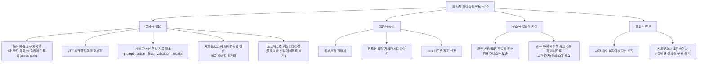
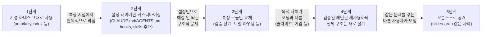

## 글의 출발점

이 정리는 Threads의 한 게시물([@awws1266](https://www.threads.com/@awws1266/post/DZRN0sxD2Jr), 2026년 6월)에서 시작한다. 작성자는 "자체 하네스를 구축하시는 분들"을 향해 다소 도발적인 질문을 던졌다. 이미 omo(oh-my-openagent)나 lazycodex, 우로보로스, codex app처럼 월등하다고 평가받는 하네스가 여럿 존재하는데, 왜 그것들을 쓰지 않고 따로 하네스를 짜는지를 물은 것이다. 이 질문에 적게는 두 줄, 많게는 한 문단 분량으로 수십 명이 답을 달았고, 그 답변들을 모아보면 2026년 상반기 한국 AI 실무자 커뮤니티가 "하네스"라는 개념을 어떻게 이해하고 있는지가 비교적 또렷하게 드러난다. 이 문서는 그 댓글들을 주제별로 묶고, 거론된 도구들의 실체를 별도로 확인한 뒤, 전체 논의가 의미하는 바를 정리한 것이다.

## 하네스란 정확히 무엇을 가리키는 말인가

먼저 용어부터 짚고 가는 것이 좋겠다. 하네스(harness)는 원래 말에 채우는 마구, 즉 강력한 힘을 안전하게 제어해 유익한 방향으로 이끄는 도구를 뜻하는 단어다. AI 에이전트 맥락에서는 LLM이라는 "두뇌" 바깥에서 그 두뇌를 실제로 작동시키는 설정과 인프라 계층 전체를 가리킨다. 권한 모드, 훅(hook), 슬래시 커맨드, 도구 라우팅, 프로젝트 컨텍스트 문서(CLAUDE.md나 AGENTS.md), 모델 선택 로직, 검증 절차 같은 것들이 모두 여기에 포함된다. 모델이 아무리 똑똑해도 이 하네스가 부실하면 에이전트는 같은 실수를 반복하거나 엉뚱한 파일을 건드리고, 반대로 하네스가 잘 짜여 있으면 같은 모델로도 훨씬 안정적인 결과를 낸다는 것이 최근 업계의 공통된 진단이다. 2026년 들어 마틴 파울러나 애디 오스마니 같은 인물들이 비슷한 시기에 이 개념을 다루는 글을 내놓으면서, 하네스 엔지니어링은 모델 자체의 경쟁이 아니라 "모델 주변에 무엇을 둘 것인가"의 경쟁이라는 인식이 자리 잡았다.

이 흐름에 결정적인 기폭제가 된 사건도 있었다. 2026년 3월 31일 새벽, Claude Code의 소스코드가 외부에 유출되는 일이 벌어졌다. 대부분의 개발자는 이를 구경하는 데 그쳤지만, 일부는 유출된 코드를 들여다보며 Claude Code의 도구 라우팅, 병렬 작업 관리, 세션 컨텍스트 유지 방식 같은 하네스 설계의 패턴을 직접 추출해 재구현하는 작업에 뛰어들었다. 이 사건 이후 "하네스 엔지니어링"이라는 표현이 한국어 개발자 커뮤니티 전반에서 폭발적으로 퍼졌고, 지금 이 Threads 스레드의 논쟁도 그 연장선 위에 있다고 볼 수 있다.

## 스레드에서 언급된 기성 하네스들의 실체

질문자가 거론한 도구들을 하나씩 확인해보면 다음과 같다.

**omo(oh-my-openagent)와 lazycodex**는 개발자 code-yeongyu가 만든 한 쌍의 프로젝트다. omo는 OpenCode 위에서, lazycodex는 Codex CLI 위에서 동작하도록 만들어졌으며, 둘 다 "토큰을 극한까지 쓰는 사람들을 위한 코딩 에이전트"를 표방한다. 내부적으로는 시시포스(주 오케스트레이터), 헤파이스토스(자율 심층 작업자), 프로메테우스(전략 기획자) 같은 그리스 신화 이름을 붙인 서브 에이전트들이 역할을 나눠 맡고, 작업 종류에 따라 GPT-5.4-mini부터 고추론 모델까지 자동으로 라우팅하는 구조를 갖추고 있다. 프로젝트 메모리, 계획 수립, LSP·AST-grep·tmux 통합, MCP 연동까지 포함된 비교적 완성도 높은 패키지로 평가받는다. 제작자 스스로도 "어떤 프로젝트나 모델과도 제휴 관계가 없으며, 그저 개인적인 실험의 결과"라고 README에 명시하고 있다.

**codex app**은 OpenAI가 배포하는 codex-plugin-cc 같은 형태로, Claude Code 안에서 `/codex:review`, `/codex:rescue` 같은 슬래시 커맨드를 통해 로컬 codex app-server를 JSON-RPC로 구동하는 방식의 연동을 가리키는 것으로 보인다. Claude Code와 Codex CLI를 양방향 MCP나 CLI 간 위임으로 엮어 쓰는 시도들이 최근 여러 기술 블로그에서 소개된 바 있다.

다만 질문자가 언급한 **"우로보로스"** 라는 이름의 하네스는 별도로 검색해 보았으나 신뢰할 만한 공개 자료로 그 정체를 확인하지 못했다. 커뮤니티 내부에서만 통용되는 비공개 프로젝트이거나, 자기 자신을 계속 개선해나가는 자기참조적 루프 구조를 가리키는 별칭일 가능성이 있지만, 이 부분은 추측에 머무를 수밖에 없어 단정하지 않는다.

스레드 안에서 한 참여자가 직접 공개한 사례도 있다. 슬라이드 제작에 특화된 하네스 **slides-grab**(NomaDamas)인데, 실제로 깃허브에서 확인한 결과 이 프로젝트는 "Claude Code나 Codex에서 슬라이드를 생성하기 위한 최선의 하네스+에디터+린터"를 표방하며, AI가 생성한 HTML 슬라이드에서 영역을 드래그해 선택한 뒤 에이전트에게 그 부분만 수정하게 지시할 수 있는 시각적 편집기를 갖추고 있다. 35종의 디자인 스타일 묶음, PDF·PPTX·Figma 변환, 카드뉴스용 정사각형 출력 모드까지 포함하고 있으며, 별점 900개를 받은 비교적 활발한 오픈소스 프로젝트다. 이는 "범용 코딩 하네스가 아무리 뛰어나도 슬라이드 제작이라는 좁은 목적에는 별도의 특화 하네스가 더 들어맞는다"는 댓글들의 주장을 뒷받침하는 실제 사례라 할 수 있다.

## 댓글들이 제시한 자체 구축의 이유 — 주제별 정리

수십 개의 답변을 읽어보면 몇 갈래로 묶을 수 있다.

### 1) 목적이 좁고 구체적일 때, 기성 하네스는 과하거나 안 맞는다

가장 먼저 나온 답변이 이 지점을 짚었다. lazycodex나 omo 같은 도구는 본질적으로 "코드 작성"에 최적화되어 있다. 그런데 슬라이드 제작처럼 결과물의 형태와 검증 기준이 완전히 다른 작업에는 코드 특화 하네스의 구조 자체가 잘 들어맞지 않는다는 것이다. 그래서 같은 발상을 코드가 아니라 슬라이드 쪽으로 가져가 별도의 하네스를 깎아 오픈소스로 공개한 사례가 바로 위에서 확인한 slides-grab이다. 이 논리를 따라가면, "특정 목적이 뚜렷하면 직접 하네스를 깎아 공유하는 편이 합리적"이라는 결론에 자연스럽게 닿는다.

### 2) 모든 사람이 막히는 지점이 다르다 — 워크플로우 마찰의 개인차

여러 답변이 공통적으로 지적한 부분은, 기성 하네스를 써봐도 결국 막히는 지점이 사람마다 다르다는 점이었다. 누군가에게는 사소한 기능이 다른 누군가에게는 핵심 병목이 된다. 자신의 작업 흐름에 맞춰 부품을 조립해두면 그 마찰이 사라지는 경험을 하게 되고, 그 경험이 쌓이면 결국 직접 짜는 쪽으로 수렴하게 된다는 설명이다. 이를 한 참여자는 SaaS 비유로 풀어냈다. "이미 SaaS가 있는데 왜 굳이 그 SaaS를 안 쓰냐"는 질문과 본질적으로 같은 질문이라는 것이다. 표준화된 제품이 다수에게는 충분히 좋아도, 특정 개인의 업무 흐름에는 완벽히 들어맞지 않을 수 있다는 의미다.

### 3) 통제 가능성과 재생 가능한 운영 기록

기술적으로 가장 구체적인 답변은 운영 기록(receipt)에 관한 것이었다. 기성 하네스는 "코딩을 더 잘하게 해준다"는 점에서는 분명 훌륭하지만, 직접 깎는 쪽을 택하는 이들은 프롬프트에서 행동으로, 행동에서 건드린 파일 목록으로, 거기서 다시 검증 절차와 최종 영수증(receipt)으로 이어지는 일련의 운영 장부가 남는 구조를 원한다고 설명했다. 즉 에이전트가 "잘했다"는 결과만 보여주는 게 아니라, 무엇을 했는지 처음부터 끝까지 재생(replay) 가능해야 한다는 요구다. 이는 단순한 생산성 도구를 넘어 감사(audit)와 디버깅이 가능한 시스템을 만들고 싶다는 동기로 읽힌다. 비슷한 맥락에서 LLM API 호출로 데이터를 가져오는 등, 자신만의 프로그램을 위한 별도의 하네스가 필요한 경우 애초에 기성 제품으로는 선택의 여지가 없다는 답변도 있었다. CLI 자체를 하네싱하는 것이 아니라 개별적으로 만든 프로그램을 위해 하네스를 새로 짜야 하는 상황이라는 것이다.

### 4) 범용 하네스라는 개념 자체의 구조적 모순

여러 답변이 결국 도달한 결론은 비슷했다. 모든 작업과 모든 사람에게 동시에 효율적인 범용 하네스라는 것은 애초에 성립하기 어려운 개념이라는 것이다. 한 참여자는 이를 "최고가 아니라, 누군가에게는 최선인 하네스만 존재한다"는 문장으로 요약했다. 또 다른 참여자는 똑같은 사람이라도(심지어 쌍둥이라도) 서로 다른 욕구를 갖고 있기 때문에 표준화가 본질적으로 한계를 가질 수밖에 없다고 짚었다. 이는 시중의 어떤 하네스가 기술적으로 부족해서가 아니라, "한 벌의 옷이 모든 체형에 맞을 수 없다"는 종류의 구조적 제약이라는 시각이다.

### 5) 통제와 재미, 그리고 욕구의 문제

기술적 필요와는 별개로, 순수하게 "재미있어서" 또는 "통제하기 편해서"라는 답변도 적지 않았다. 기성 도구가 없던 시절부터 직접 만들어 써왔고 그 과정 자체가 즐겁다는 답변, 직접 구축하는 것이 통제하기에도 더 용이하다는 답변이 여럿이었다. 이를 가장 인상적으로 표현한 비유는 부동산에 빗댄 것이었다. "이미 잘 지어진 아파트가 있는데 왜 자기 집을 인테리어하느냐고 묻는 것과 같다"는 답변으로, 자기 손으로 원하는 대로 만들고 싶은 욕구는 효율과는 또 다른 차원의 문제라는 취지였다. 비슷하게 "하네스 만드는 게 또 꿀잼이라서"라는 짧고 솔직한 답변도 눈에 띄었다.

### 6) 프로젝트 단위 커스터마이징의 필요

자신의 프로젝트(예: 칸반보드형 멀티플레이어 게임 같은 특정 서비스)에 맞춰 커스터마이징하려면 결국 직접 만드는 수밖에 없다는 의견도 다수였다. 기성 하네스를 그대로 가져오면 필요 없는 스킬이나 에이전트까지 함께 따라오는 경우가 많고, 이를 걷어내는 작업 자체가 적지 않은 품이 든다는 것이다. 오버엔지니어링이 되는 경우도 있고, 원하는 기능 구조가 서로 다른 에이전트 프레임워크에 흩어져 구현돼 있는 경우도 있어, 그것들을 하나로 모으려다 보면 자연스럽게 자체 구조가 생겨난다는 설명도 있었다. 본인이 사용하던 자료를 메모리(LLM Wiki·지식그래프) 형태로 개인화해서 결과물 품질을 끌어올리는 방식과도 맞닿아 있는 지점이다.

### 7) 점진적 변형 — "쓰다 보니 결국 내 것이 됐다"

흥미로운 패턴 하나는, 처음부터 자체 하네스를 만들겠다고 작정한 게 아니라 기성 도구를 계속 고쳐 쓰다 보니 어느새 거의 별개의 산물이 되어버렸다는 답변들이다. 오픈소스 에이전트 프레임워크를 가져다 쓰면서 계속 뜯어고치다 보니 사실상 자체 하네스가 되어버렸다는 답변, codex app-server와 에이전트 프레임워크를 MCP 기반으로 연결해서 쓰려다 결국 직접 하네스를 만들게 됐다는 답변이 이를 보여준다. 이는 처음부터 "내가 만들겠다"는 결단이라기보다, 실제 작업 과정에서 자연스럽게 누적된 결과에 가깝다.

### 8) NIH 신드롬에 대한 자기 인식

가장 솔직한 답변 중 하나는 이 현상을 "NIH 신드롬"(Not Invented Here, 여기서 만들지 않은 것을 배척하는 경향)이라는 개념으로 직접 지목한 것이었다. 답변자는 자신도 예외가 아니라고 인정하며, 이 욕구가 합리성만으로 설명되지 않는 측면이 있음을 스스로 짚었다. 이는 앞서 나온 "재미와 통제" 계열 답변들과 같은 맥락이지만, 그 현상에 이미 이름이 붙어 있다는 점을 환기시켰다는 점에서 따로 짚을 만하다.

### 9) 회의적인 시각도 존재했다

스레드 전체가 자체 구축에 호의적이었던 것은 아니다. 한 답변은 정반대 입장을 분명히 했다. 순수하게 재미로 하거나 누군가 비용을 대고 시켜서 하는 경우가 아니라면 하지 않는 편이 낫다는 것이다. 현재 시점에서는 어차피 기성 하네스를 이기기 어렵고, 가뜩이나 할 일이 많은 상황에서 시간 대비 성과가 떨어지는 소모적인 작업이라는 평가였다. 실제로 한 참여자는 "이길 수 있을 줄 알았다"는 한 줄로 자신의 시도가 기대만큼 성과를 내지 못했음을 짧게 인정하기도 했고, "하다가 포기"라고 적은 답변도 있었다. 즉 이 스레드는 자체 구축을 무조건 미화하는 분위기는 아니었고, 시도했지만 만족스럽지 못했던 경험도 함께 섞여 있었다.

### 10) 철학적 관점 — 하네스는 AI의 한계를 보완하는 장치라는 시각

스레드 후반부의 한 긴 답변은 논의를 한 단계 더 끌어올렸다. 헤르메스 에이전트나 OpenCode 같은 구조가 왜 등장했는지를 먼저 생각해봐야 한다는 취지였다. 핵심 주장은, 지금의 AI가 아직 완전히 자율적으로 사고하고 판단해서 답을 내놓는 주체가 아니기 때문에, 이를 사람이 보완하려는 시도에서 하네스라는 구조가 나왔다는 것이다. 만약 AI가 사람의 생각을 온전히 판단하고 추론해 답을 내놓을 수 있다면 그것이야말로 영화 속 자비스 같은 존재일 텐데, 아직 그 단계에 이르지 못했기 때문에 질문에 대해 어떤 방식으로 논증하고 검토하고 분석해 답을 낼 것인지를 설계하는 "품질 시스템" 자체를 만드는 일이 AI를 활용하는 데 있어 핵심 노하우라는 주장이었다. 이는 다소 거시적인 시각이지만, 앞선 실용적 답변들(마찰 제거, 운영 기록, 커스터마이징)을 한데 묶는 상위 개념으로 읽을 수 있다.

## 이유들을 한눈에 보기

아래는 댓글들에서 드러난 동기를 유형별로 정리한 다이어그램이다.

## 거론된 기성 하네스 vs 자체 구축의 비교

| 구분 | 기성 하네스(omo/lazycodex, codex app 등) | 자체 구축 하네스 |
|---|---|---|
| 강점 | 검증된 완성도, 모델 라우팅·LSP·MCP 등 풍부한 기능, 커뮤니티 유지보수 | 자신의 워크플로우·프로젝트에 100% 맞춤, 불필요한 기능 없음 |
| 약점 | 범용 설계라 특정 목적·개인 습관과 마찰 발생 가능 | 처음부터 끝까지 직접 유지보수해야 함, 시간 소모 큼 |
| 적합한 상황 | 일반적인 코딩 작업, 빠르게 검증된 도구가 필요한 경우 | 목적이 좁고 구체적이거나(슬라이드, 자체 API 연동 등), 운영 기록·재현성이 핵심인 경우 |
| 대표 사례 | omo/lazycodex(code-yeongyu), codex-plugin-cc | slides-grab(NomaDamas, 슬라이드 특화), 개인 LLM API 연동 파이프라인 |

## 실전 가이드 — 자체 하네스를 만들지 말지 어떻게 판단할 것인가

여기까지는 댓글들이 실제로 말한 내용을 정리한 것이고, 지금부터는 그 내용을 바탕으로 "그렇다면 나는 어떻게 판단해야 하는가"를 정리한 부분이다. 스레드의 답변들을 종합하면 판단 기준은 의외로 단순한 몇 개의 질문으로 압축된다.

### 1) 5분 판단 체크리스트

아래 다섯 질문에 "예"가 세 개 이상이면, 댓글들이 말한 자체 구축의 근거가 본인 상황에도 적용될 가능성이 높다.

| 질문 | 이 항목이 의미하는 것 |
|---|---|
| 결과물의 형태가 "코드"가 아닌가? (슬라이드, 게임 상태, 문서, 멀티에이전트 매치 결과 등) | 코드 특화 하네스(omo/lazycodex)의 전제 자체가 안 맞을 가능성 |
| 같은 종류의 작업을 일주일에 여러 번 반복하는가? | 1회성 작업이면 자체 구축의 회수 기간이 안 나온다 |
| 결과를 나중에 재현·검증해야 하는 요구가 있는가? (운영 로그, 감사, 디버깅) | 기성 하네스 대부분은 "결과"는 보여줘도 "과정"을 재생 가능하게 남기지는 않는다 |
| 기성 하네스를 30분 안에 설정해봤을 때 핵심 마찰이 안 풀리는가? | 단순 설정 문제가 아니라 구조 자체의 불일치인지 확인하는 질문 |
| 이 하네스를 유지보수할 시간과 동기가 최소 분기 단위로 있는가? | 동기가 "재미"뿐이라면 그것도 정당한 이유지만, 유지보수 부채를 감수할 각오는 필요 |

반대로 "아니오"가 더 많다면, 회의적인 답변자가 짚었듯 기성 하네스를 조합해 쓰는 쪽이 시간 대비 합리적이다.

### 2) 풀 빌드 전에 거쳐야 할 단계적 접근

스레드의 답변들을 자세히 보면, 처음부터 "내가 하네스를 만들겠다"고 결심한 경우보다 기성 도구를 고쳐 쓰다가 자연스럽게 자체 구조로 옮겨간 경우가 더 많았다. 이 점을 의사결정 절차로 바꾸면 아래와 같은 단계가 된다. 핵심은 한 단계에서 막히는 구체적 실패가 관찰될 때만 다음 단계로 넘어가는 것이지, 처음부터 5단계로 직행하는 것이 아니다.

이렇게 단계를 밟으면 "재미로 처음부터 다 짜고 싶다"는 동기와, "필요에 의해 어쩔 수 없이 짜게 됐다"는 동기를 굳이 나눠 고민할 필요가 없다. 1~2단계에서 멈춰도 충분한 경우가 대다수이고, 4~5단계까지 가는 경우는 스레드에서도 소수였다.

### 3) 자체 하네스에 최소한 들어가야 할 구성 요소

직접 만들기로 했다면, 댓글들이 공통적으로 가치 있다고 언급한 요소는 다음 다섯 가지로 정리된다. 이 중 어느 것도 "처음부터 풀세트로" 갖출 필요는 없으며, 필요할 때마다 하나씩 채워 넣는 편이 낫다.

- **최소한의 프로젝트 컨텍스트 문서**: 과도하게 customizing된 설정보다 비교적 단순한 AGENTS.md/CLAUDE.md가 더 안정적으로 작동한다는 관찰이 많다. 작업별 세부 지침은 영구 설정 파일이 아니라 그때그때의 프롬프트에 넣는 편이, 모델이 발전할수록 설정 파일이 부채가 되는 것을 막는다.
- **운영 장부(prompt → action → files touched → validation → receipt)**: 무엇을 했는지 사후에 재생할 수 있는 최소한의 로그. 디버깅과 신뢰의 핵심이라고 여러 답변이 짚었다.
- **검증 단계(validation hook)**: 결과가 "그럴듯해 보인다"가 아니라 실제로 통과했는지 자동으로 확인하는 절차. 린트, 테스트, 파일 무결성 체크 등이 해당한다.
- **목적에 맞는 모델 라우팅**: 모든 작업에 최고 모델을 쓰는 대신, 작업 난이도에 따라 모델을 나눠 쓰는 구조. omo/lazycodex가 이 부분을 잘 보여주는 참고 사례다.
- **단계가 꼭 여러 개일 필요는 없는 스킬 구조**: 입력과 출력이 1:1로 대응하고 중간에 사람의 검토가 필요 없다면, 단일 단계짜리 스킬로도 충분히 정당하다. 모든 스킬이 다단계일 필요는 없다.

### 4) 자주 보이는 실패 패턴

스레드의 회의적인 답변들과, 비슷한 시도를 해본 다른 사례들을 종합하면 아래 세 가지가 가장 흔한 실패 원인으로 꼽힌다.

1. **처음부터 풀 커스텀으로 설계하기**: 1~3단계를 건너뛰고 곧장 전면 재설계에 들어가면, 정작 막혔던 구체적 지점이 무엇이었는지도 모른 채 시간만 들어가는 경우가 많다.
2. **범용을 목표로 삼기**: "나뿐 아니라 모두가 쓸 수 있는 하네스"를 처음부터 목표로 하면, 본문에서 짚었듯 그 자체가 모순적인 목표가 되어 결국 누구에게도 딱 맞지 않는 결과로 귀결되기 쉽다.
3. **만능 에이전트 하나에 모든 역할을 몰아넣기**: 특화된 단일 역할의 에이전트들이 아니라 모든 걸 처리하는 범용 에이전트를 만들면, 컨텍스트가 뒤섞이고 워크플로우가 불안정해지며 토큰 낭비도 커진다는 지적이 많다.

## 정리하며

이 스레드를 끝까지 읽고 나면, "기성 하네스가 더 나은데 왜 굳이 직접 만드나요?"라는 질문 자체에 이미 전제가 하나 깔려 있다는 점이 보인다. "더 낫다"는 평가가 코딩이라는 좁은 기준, 혹은 다수 사용자 평균이라는 기준에서의 비교라는 전제다. 답변자들 다수는 이 전제에 동의하지 않았다. 목적이 좁아질수록(슬라이드 제작, 특정 API 연동), 작업 습관이 구체적일수록, 그리고 결과를 재현하고 검증해야 하는 요구가 커질수록 범용 하네스의 우위는 줄어들고 자체 구축의 이득이 커진다는 것이 다수 의견의 공통분모였다. 동시에 그 이득이 시간과 유지보수 비용을 상회하지 못하는 경우도 분명 존재한다는 반론 역시 같은 스레드 안에 함께 담겨 있었다. 결국 이 논쟁은 "어느 쪽이 정답이냐"의 문제라기보다, 자신의 작업이 표준화된 도구의 범위 안에 있는지, 아니면 그 범위를 벗어나는 고유한 요구를 갖고 있는지를 스스로 판단하는 문제에 가깝다.

---

작성일: 2026년 6월 19일
