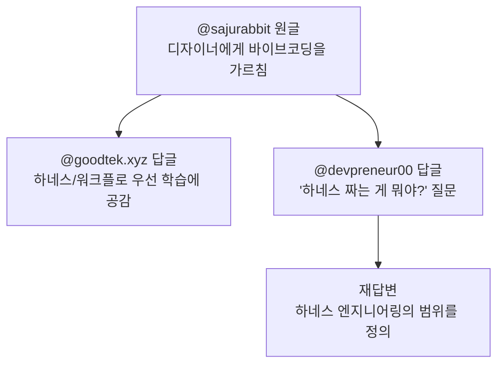
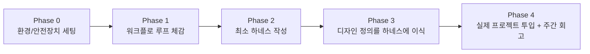

원문: https://www.threads.com/@sajurabbit/post/DZu_-MzmTXz

---

## 1. 이 글이 다루는 내용 개요

이 문서는 Threads 사용자 @sajurabbit이 올린 게시글 한 편과, 그 글에 달린 두 개의 답글 스레드(@goodtek.xyz, @devpreneur00)를 함께 묶어 풀어쓴 것이다. 원글의 핵심 줄거리는 단순하다. 회사에 다니는 디자이너 한 명에게 "바이브코딩(Vibe Coding)"을 가르쳤더니, 개발 지식이 전혀 없던 사람이 깃(git)으로 버전을 관리하고, 터미널을 자유롭게 다루며, React와 Flutter로 제품 화면을 직접 만들거나 고치는 수준까지 도달했다는 경험담이다. 작성자는 이 과정에서 단순히 도구 사용법을 가르친 게 아니라 "워크플로-루프"와 "하네스" 중심으로 가르쳤다는 점을 강조하고, 그 결과로 디자이너가 피그마(Figma) 같은 디자인 툴 없이도 자신이 의도한 대로 화면을 완성할 수 있게 되었다고 말한다. 글의 마지막은 "디자이너라면 지금 당장 피그마를 떠나라"는 도발적인 제안으로 마무리된다.

이어지는 두 개의 답글에서는 이 원글에 대한 동조와, 핵심 용어에 대한 질문 및 답변이 오간다. 특히 "하네스를 짠다는 게 정확히 뭘 하는 거냐"는 질문에 대해 "MCP·스킬·플러그인뿐 아니라 각종 MD 파일, 디자인 정의 문서 등 AI가 인간이 원하는 대로 실수 없이 코딩하도록 가이드를 넣어주는 일체의 행위"라는 답이 달리는데, 이는 실제로 업계에서 통용되는 "하네스 엔지니어링(Harness Engineering)"의 정의와 상당히 정확하게 일치한다. 아래에서는 원글과 답글의 내용을 차례로 정리한 뒤, 글에 등장하는 핵심 개념들(바이브코딩, 하네스 엔지니어링, MCP, 스킬, AI 슬롭)을 별도로 검증된 자료를 바탕으로 보충 설명한다.

---

## 2. 원문 스레드 흐름



### 2-1. 원글(@sajurabbit)의 줄거리

작성자는 회사 디자이너 한 명에게 바이브코딩을 가르치는 과정을 다음과 같은 순서로 설명한다.

1. **워크플로-루프와 하네스 중심 교육**: 처음부터 특정 코드 문법이나 도구 사용법을 외우게 하는 대신, AI 에이전트가 작업을 반복적으로 수행하는 흐름(워크플로-루프)과 그 흐름을 안정적으로 통제하는 장치(하네스)를 이해시키는 데 집중했다고 한다.
2. **자율 실습 단계로의 전환**: 어느 정도 기본기가 갖춰졌다고 판단되는 시점부터는 실제 프로젝트 위에서 디자이너가 스스로 판단하며 자유롭게 작업하도록 맡겼다.
3. **결과**: 개발 지식이 전혀 없었던 디자이너가 깃(git)으로 버전을 직접 관리하고, 자신만의 하네스를 구성하며, 프런트엔드 개발까지 수행하게 되었다. 터미널 사용도 막힘없이 한다고 서술되어 있다. React뿐 아니라 Flutter까지, 제품의 모든 화면을 디자이너 본인이 직접 만들거나 수정하는 수준에 이르렀다고 한다.

작성자는 이 결과를 두고 "기획 능력이 있는 디자이너가 바이브코딩을 손에 쥐었을 때 생산성이 폭발적으로 늘어난다"고 평가한다. 여기서 "기획 능력"이라는 표현은, 단순히 도구를 다루는 능력이 아니라 무엇을 만들어야 하는지에 대한 판단력과 의도를 가리키는 것으로 읽힌다. 작성자는 이를 "AI 슬롭(AI Slop)급 디자인이 사람 손에서 완벽한 의도대로 바뀌는 것"이라고 표현하는데, 이는 AI가 생성하는 초안 수준의 결과물을 디자이너가 자신의 안목과 판단으로 다듬어 완성도를 끌어올렸다는 의미다. 그리고 이 모든 과정이 피그마나 별도의 디자인 툴 없이, 코드와 터미널만으로 이루어졌다는 점을 강조한다.

원글은 이 경험을 바탕으로 "디자이너도 충분히 PM(프로덕트 매니저) 역할을 할 수 있다"는 주장으로 확장된다. 작성자의 프로필에 걸려 있다고 언급되는 "사주토끼" 사이트가 바로 이 과정의 결과물이라고 소개된다. 마지막으로 작성자는 자신이 키운 디자이너가 언젠가 이직하더라도, 자신은 "프런트엔드 역량을 갖춘 디자이너"를 양성한 셈이라며, 비슷비슷한 디자인의 양산형 앱이 하루에도 수천 개씩 쏟아지는 현재 환경에서는 코드를 다룰 줄 아는 "진짜 디자이너"의 가치가 매우 커진다고 결론짓는다. 글의 마지막 문장은 디자이너들을 향한 직접적인 제안이다. "지금 당장 figma를 떠나라."

### 2-2. 첫 번째 답글(@goodtek.xyz)의 내용

이 답글은 원글의 교육 순서, 즉 하네스와 워크플로 루프를 먼저 가르친 뒤 프로젝트에 투입하는 방식에 공감을 표한다. 답글 작성자 본인도 에이전트 자동화를 운영할 때 하네스 설계에 많은 시간을 들이는데, 처음에 하네스를 제대로 갖춰두면 이후 작업에서 손이 덜 가는 효과를 직접 경험했다고 말한다. 디자이너가 깃과 터미널까지 다루면서 React와 Flutter 화면을 직접 손보는 모습에 놀라움을 표하며, 피그마 없이도 의도한 대로 결과물이 나온다는 부분을 가장 부러운 지점으로 꼽는다.

### 2-3. 두 번째 답글 스레드(@devpreneur00)의 질문과 답변

세 번째 답글 작성자는 좀 더 실무적인 의문을 제기한다. "다들 하네스를 짠다고 하는데, 하네스를 짜는 게 정확히 뭘 하는 행위인지", 그리고 "MCP와 스킬을 세팅해두는 것을 말하는 건지" 묻는다. 이에 대한 답변은 다음과 같이 정리된다.

> "MCP, 스킬, 플러그인뿐 아니라 각종 MD 파일, 디자인 정의 등 — AI가 인간이 원하는 대로 실수 없이 코딩하도록 가이드를 넣어주는 일체의 행위를 하네스 엔지니어링이라 한다."

이 정의는 좁은 의미의 "도구 연결"을 넘어, AI 에이전트가 작업하는 환경 전체를 설계하는 행위로 하네스 엔지니어링을 규정하고 있다는 점에서 실제 업계에서 통용되는 정의와 맥을 같이한다. 아래 3장에서 이 부분을 별도 자료로 검증한다.

---

## 3. 스레드에 등장하는 핵심 개념 보충 설명

원문 자체는 개인적인 경험담 형식의 짧은 글이기 때문에, 글에서 사용된 전문 용어들이 실제로 어떤 맥락에서 쓰이고 있는지 별도의 자료를 통해 확인했다. 아래 내용은 모두 독립적인 검색을 통해 확인한 정보를 바탕으로 작성했다.

### 3-1. 바이브코딩(Vibe Coding)이란

바이브코딩은 사람이 엄밀한 설계나 세부 로직을 직접 작성하지 않고, 자연어로 원하는 결과를 설명하면 AI가 코드를 작성해주는 개발 방식을 가리키는 용어다. 이 용어는 오픈AI 공동창업자였던 안드레이 카파시(Andrej Karpathy)가 처음 사용하면서 빠르게 퍼졌으며, 콜린스 사전은 이 단어를 2025년 올해의 단어로 선정했고 메리엄-웹스터 사전도 등재한 바 있다. 바이브코딩이 주목받는 가장 큰 이유는 기존에 백엔드·프런트엔드·디자인 등으로 나뉘어 있던 개발 진입장벽이 급격히 낮아졌기 때문이며, 실제로 실리콘밸리의 액셀러레이터 와이콤비네이터(Y Combinator)는 최근 선발한 스타트업 가운데 상당수가 코드베이스의 대부분을 AI 생성 코드로 구성하고 있다고 밝힌 바 있다.

다만 바이브코딩에는 보안 취약점이나 코드 품질 검증 문제 같은 우려도 함께 제기되고 있다. 원글에서 디자이너가 "기획 능력"을 갖춘 상태에서 AI가 만든 초안을 검토하고 다듬는 과정을 거쳤다는 점은, 바이브코딩의 산출물을 그대로 쓰는 것이 아니라 사람의 판단으로 한 번 더 정제하는 과정이 중요하다는 업계의 일반적 인식과도 맞닿아 있다.

### 3-2. 하네스 엔지니어링(Harness Engineering)이란

"하네스"는 본래 마구(馬具), 즉 동물이나 장비를 통제하기 위해 씌우는 장치를 뜻하는 단어다. AI 에이전트 분야에서 이 용어는 모델 자체가 아니라, 모델을 둘러싸고 행동을 통제하는 모든 장치를 가리킨다. 시스템 프롬프트, 사용 가능한 도구 목록, 권한 정책, 샌드박스 실행 환경, 검증 루프, 메모리 관리, 프로젝트 루트에 두는 설정 파일(CLAUDE.md, AGENTS.md 등)이 모두 여기에 포함된다. 이를 한 문장으로 압축한 공식이 바로 "에이전트 = 모델 + 하네스(Agent = Model + Harness)"다.

이 개념이 누구에 의해 처음 이름 붙여졌는지에 대해서는 출처마다 설명이 조금씩 다르다. 일부 자료는 HashiCorp 공동창립자인 미첼 해시모토(Mitchell Hashimoto)가 2026년 2월 초 자신의 블로그에서 "에이전트가 실수할 때마다 그 실수가 다시는 발생하지 않도록 엔지니어링하는 것"이라는 정의로 이 용어를 처음 제시했다고 설명한다. 반면 다른 자료는 비슷한 시기에 OpenAI 쪽에서 이 용어를 정리했고 마틴 파울러(Martin Fowler)도 관련 글을 썼다고 전한다. 출처에 따라 기원에 대한 설명이 엇갈리는 만큼, "2026년 초 업계에서 거의 동시다발적으로 부상한 개념"이라는 정도로 이해하는 것이 정확하다. 다만 OpenAI가 공식적으로 하네스를 "에이전트가 안정적으로 작업을 수행하도록 감싸는 스캐폴딩(scaffolding)이자 피드백 루프가 구축된 전체 환경"으로 정의한 글을 낸 것은 여러 자료에서 공통적으로 확인된다.

하네스 엔지니어링을 실제로 설계할 때는 보통 작은 규칙에서 시작해 실패 사례가 관찰될 때마다 규칙을 하나씩 추가해 나가는 점진적 방식이 권장된다. 예를 들어 에이전트가 특정 실수를 저지르면, 그 실수가 재발하지 않도록 AGENTS.md나 CLAUDE.md 같은 설정 파일에 규칙 한 줄을 추가하는 식이다. 처음부터 모든 것을 통제하려는 거창한 시스템보다, 실제 운영 과정에서 드러난 문제를 하나씩 막아 나가는 방식이 더 현실적이라는 게 여러 실무 자료의 공통된 조언이다.

아래 표는 프롬프트 엔지니어링, 컨텍스트 엔지니어링, 하네스 엔지니어링의 차이를 정리한 것이다.

| 구분 | 핵심 질문 | 다루는 대상 |
|---|---|---|
| 프롬프트 엔지니어링 | 무엇을 물어볼 것인가 | 한 번의 지시문 작성 |
| 컨텍스트 엔지니어링 | 무엇을 보여줄 것인가 | 모델에 제공하는 정보의 구성 |
| 하네스 엔지니어링 | 어떤 환경에서 동작하게 할 것인가 | 도구, 권한, 검증 루프, 설정 파일 등 에이전트를 둘러싼 구조 전체 |

원글에서 작성자가 "워크플로-루프와 하네스 중심으로 가르쳤다"고 말한 것은, 디자이너에게 단순히 프롬프트 작성법을 알려준 게 아니라 에이전트가 반복적으로 작업하는 구조와 그 구조를 안정시키는 통제 장치 자체를 이해시켰다는 뜻으로 해석할 수 있다. 이는 답글에서 나온 "AI가 인간이 원하는 대로 실수 없이 코딩하도록 가이드를 넣어주는 일체의 행위"라는 설명과도 정확히 들어맞는다.

### 3-3. MCP(Model Context Protocol)란

MCP는 AI 모델이 외부 도구나 데이터 소스에 표준화된 방식으로 접근할 수 있도록 만든 오픈 프로토콜이다. 흔히 "AI를 위한 USB 포트"에 비유되는데, MCP 서버 하나를 연결하면 AI 에이전트가 해당 서비스의 데이터를 읽거나 작업을 수행할 수 있게 된다. 이 프로토콜은 Anthropic이 처음 공개했으며, 이후 빠르게 업계 표준으로 자리잡아 2026년 초 기준으로 수백 개 이상의 MCP 서버가 생태계를 이루고 있는 것으로 파악된다.

### 3-4. 스킬과 플러그인

답글에서 언급된 "스킬"은 특정 작업 방식을 정형화해 모아둔 가이드 묶음을 가리킨다. 예를 들어 문서 작성, 발표자료 제작, 코드 검토처럼 반복되는 작업의 절차와 모범 사례를 정리해 두면, 에이전트가 매번 다른 방식으로 즉흥적으로 작업하는 대신 일관된 순서로 작업을 수행하게 된다. 답글에서 정리된 하네스 엔지니어링의 정의에 MCP·스킬·플러그인이 함께 묶여 있는 것도, 이 모든 요소가 결국 "에이전트가 어떻게 행동해야 하는가"를 규정하는 동일한 범주에 속하기 때문이다.

### 3-5. AI 슬롭(AI Slop)이란

원글에서 "AI Slop급 디자인"이라는 표현이 등장하는데, AI 슬롭은 생성형 AI가 대량으로 쏟아내는 저품질 콘텐츠를 경멸적으로 부르는 용어다. "슬롭(slop)"이라는 단어 자체는 원래 가축에게 주는 음식 찌꺼기를 뜻하며, 양은 많지만 질은 형편없는 결과물을 빗댄 표현이다. 디자인 영역에서는 AI가 그럴듯해 보이지만 맥락이나 의도가 부족한 화면을 대량으로 찍어내는 현상을 가리키는 데 쓰인다. 원글의 작성자가 "AI Slop급 디자인이 사람 손에서 완벽한 의도대로 바뀐다"고 표현한 것은, AI가 1차로 만들어낸 초안을 사람이 검토하고 다듬어야 비로소 의미 있는 결과물이 된다는 점을 짚은 것으로 볼 수 있다.

---

## 4. 이 사례가 보여주는 업계 흐름

원글이 단순히 한 개인의 경험담으로 끝나지 않고 폭넓게 공감을 얻는 이유는, 실제로 디자인 업계 전반에서 비슷한 변화가 관찰되고 있기 때문이다.

디자인 업계에서는 최근 피그마 파일을 정교하게 그리는 능력보다, 디자인 시스템을 AI가 이해하고 구현할 수 있는 형태로 정리하는 능력이 더 중요해지고 있다는 분석이 나오고 있다. 실제로 채용 면접에서도 "디자인 시스템을 AI가 구현 가능한 형태로 어떻게 정리하겠는가", "피그마 파일을 개발자 없이 코드로 옮긴다면 무엇부터 정리해야 하는가" 같은 질문이 등장하기 시작했다는 보고도 있다. 이는 디자이너의 역할이 "그리는 사람"에서 "AI가 일하기 편한 구조를 설계하는 사람"으로 확장되고 있음을 보여준다.

동시에 v0나 Cursor 같은 AI 코딩 도구들이 디자이너에게 코드라는 새로운 작업 매체를 쥐여주면서, 디자인 결과물을 즉시 실제 화면으로 구현하고 배포하는 속도가 크게 빨라지고 있다는 분석도 나온다. 이런 흐름 속에서 원글의 사례, 즉 디자이너가 깃과 터미널을 직접 다루며 React와 Flutter 화면까지 만드는 모습은 특이한 예외라기보다는, 업계에서 점차 늘어나고 있는 패턴 중 하나로 볼 수 있다.

다만 이런 변화에 대한 반론도 함께 존재한다는 점은 균형 있게 짚어둘 필요가 있다. 한쪽에서는 AI 때문에 디자이너라는 직군 자체가 사라질 것이라는 우려가 있지만, 다른 쪽에서는 실제 비즈니스 환경에서 책임지고 만드는 작업이 AI 기능 한 번으로 완전히 대체될 만큼 단순하지 않다는 반박도 함께 제기되고 있다. 또한 코드를 다루는 디자이너가 늘어난다고 해서 모든 디자이너가 같은 방향으로 성장해야 한다거나, 피그마 같은 전통적인 디자인 툴의 효용이 완전히 사라진다고 단정하기는 어렵다. 원글의 "지금 당장 figma를 떠나라"는 표현 역시, 모든 상황에 적용되는 일반론이라기보다는 기획력과 코드 활용 능력을 함께 갖춘 디자이너에게 더 큰 기회가 열리고 있다는 점을 강조하기 위한 수사적 표현으로 받아들이는 것이 적절해 보인다.

---

## 5. 실전 가이드: 비개발자에게 하네스 중심으로 바이브코딩을 가르치는 방법

원글과 답글은 "워크플로-루프와 하네스 중심으로 가르쳤다"는 결과만 보여줄 뿐, 구체적으로 어떤 순서와 산출물로 진행했는지는 설명하지 않는다. 이 장에서는 하네스 엔지니어링의 일반 원칙(점진적 규칙 추가, 모델과 하네스의 분리, 최소 구성에서 시작하는 설계)을 토대로, 디자이너처럼 코드 경험이 없는 동료에게 같은 방식을 적용하려 할 때 실제로 옮길 수 있는 단계와 산출물을 정리했다.

### 5-1. 4단계 커리큘럼



**Phase 0 — 환경과 안전장치를 먼저 깐다.** 디자이너가 사고를 칠 수 있는 영역(메인 브랜치 강제 푸시, 프로덕션 배포, 외부 API 키 노출)을 기술적으로 막아둔 뒤 시작한다. 브랜치 보호 규칙, 별도 작업용 브랜치/워크트리, 로컬 환경 변수 분리 같은 장치가 여기 해당한다. 사람이 "하지 마세요"라고 말로 가르치는 대신, 애초에 할 수 없게 만드는 것이 하네스 설계의 첫 원칙이다.

**Phase 1 — 워크플로 루프를 도구가 아니라 흐름으로 체감시킨다.** React 문법이나 Flutter 위젯 트리를 외우게 하는 대신, "지시 → 에이전트 실행 → 결과 확인 → 수정 지시"라는 한 사이클을 아주 작은 작업(버튼 색상 하나 바꾸기 등)으로 여러 번 반복시킨다. 이 단계의 목적은 디자이너가 "AI에게 무엇을 한 번에 다 맡기지 않고, 작은 루프를 반복하며 검증한다"는 감각을 몸에 익히는 것이다.

**Phase 2 — 최소 하네스를 직접 작성하게 한다.** 처음부터 완벽한 설정 파일을 만들어 주지 말고, 디자이너가 실수를 한 번 겪을 때마다 그 실수를 막는 규칙을 본인이 한 줄씩 추가하도록 한다. 아래는 시작점으로 쓸 수 있는 최소 구성 예시다.

```markdown
# AGENTS.md (디자이너용 최소 하네스 예시)

## 절대 하지 말 것
- main 브랜치에 직접 커밋하지 않는다. 항상 새 브랜치를 만든다.
- package.json, 빌드 설정 파일은 묻지 않고 수정하지 않는다.
- 디자인 토큰 파일(tokens.json) 값은 직접 바꾸지 말고, 변경이 필요하면 먼저 이유를 설명한다.

## 작업 전 확인
- 변경 전 현재 화면을 캡처해 비교 기준으로 남긴다.
- 변경 범위가 1개 컴포넌트를 넘으면 먼저 계획을 글로 요약해 보여준다.

## 작업 후 확인
- 빌드/로컬 실행이 정상인지 확인 후에만 "완료"라고 보고한다.
- 커밋 메시지는 "무엇을, 왜" 형식으로 남긴다.
```

이 파일은 완성형이 아니라 출발점이다. 실제 운영 과정에서 디자이너가 새로운 실수를 저지를 때마다(예: 컴포넌트 이름을 멋대로 새로 만들어 디자인 시스템과 어긋나는 경우) 그 패턴을 한 줄 규칙으로 추가해 나가는 것이 핵심이다. 처음부터 수십 개 규칙을 욱여넣는 방식은 오히려 에이전트의 판단을 흐리게 만들 수 있다는 점도 함께 인지시킬 필요가 있다.

**Phase 3 — 디자인 정의 문서를 하네스의 일부로 만든다.** 색상 토큰, 타이포그래피 스케일, 컴포넌트 네이밍 규칙, 간격 체계처럼 디자이너가 평소 암묵적으로 판단하던 기준을 별도의 MD 문서(예: `design-system.md`)로 명문화한다. 이 문서를 하네스에 연결해 두면, 에이전트가 "왜 이 여백을 8px이 아니라 12px로 잡아야 하는지"를 디자이너에게 일일이 묻지 않고도 일관되게 판단할 수 있게 된다. 답글에서 언급된 "디자인 정의"가 바로 이 영역에 해당한다.

**Phase 4 — 실제 프로젝트에 투입하고, 매주 짧게 회고한다.** 이 단계부터는 디자이너가 자율적으로 작업하되, 일주일에 한 번 정도 "이번 주에 에이전트가 반복해서 틀린 부분이 있었는가"를 짧게 점검하고, 있었다면 그 패턴을 하네스 규칙으로 옮긴다. 모델이 좋아져서 결과가 좋아지는 것이 아니라, 하네스가 누적된 학습을 흡수하기 때문에 결과가 좋아진다는 점이 이 단계의 핵심이다.

### 5-2. 실수 관찰 → 규칙화 사이클

| 관찰된 실수 패턴 | 하네스에 추가할 규칙 예시 |
|---|---|
| 컴포넌트를 새로 만들면서 기존 디자인 시스템과 다른 이름/스타일을 씀 | "신규 컴포넌트 생성 전, 기존 디자인 시스템에 동일/유사 컴포넌트가 있는지 먼저 검색하고 보고한다." |
| 작은 수정인데 관련 없는 여러 파일을 함께 건드림 | "한 번의 작업 범위는 1개 화면/1개 컴포넌트로 제한하고, 범위를 넘으면 먼저 계획을 공유한다." |
| 빌드가 깨진 상태로 "완료"라고 보고함 | "완료 보고 전 반드시 로컬 빌드/실행 결과를 첨부한다." |
| 커밋 단위가 너무 커서 되돌리기 어려움 | "기능 단위가 아니라 작업 단계 단위로 자주 커밋한다." |

이 표는 예시일 뿐이며, 실제로는 디자이너 본인이 겪은 구체적인 실패 사례를 바탕으로 규칙을 채워 넣는 것이 가장 효과적이다.

### 5-3. 자주 발생하는 함정과 대응

- **하나의 에이전트에 모든 역할을 몰아넣는 함정**: 디자인 판단, 코드 작성, 배포까지 한 에이전트(혹은 한 세션)에 다 맡기면 컨텍스트가 뒤섞이면서 작업이 불안정해지는 경우가 많다. 디자인 검토용, 컴포넌트 구현용, 배포 전 점검용처럼 역할을 나누어 별도 세션이나 별도 스킬로 분리하는 편이 더 안정적이다.
- **설정 파일을 과도하게 정교하게 만드는 함정**: 처음부터 모든 예외 상황을 대비한 거대한 설정 파일을 만들면, 오히려 에이전트가 지시를 일관되게 따르지 못하거나 모델이 발전했을 때 그 설정이 발목을 잡는 경우가 생긴다. 최소 구성에서 시작해 실패가 관찰될 때만 규칙을 추가하는 점진적 방식이 장기적으로 더 안정적이다.
- **터미널/깃 사고**: 디자이너가 처음 깃을 다룰 때 가장 흔한 사고는 강제 푸시로 동료의 작업을 덮어쓰거나, 잘못된 브랜치에서 작업하는 것이다. 사람의 주의력에 기대기보다, 브랜치 보호 규칙이나 권한 설정 같은 기술적 장치로 애초에 사고가 불가능하게 만드는 편이 안전하다.

### 5-4. "코드를 다루는 디자이너"로 성장했는지 점검하는 체크리스트

- 에이전트가 만든 결과물이 디자인 의도와 다를 때, 무엇이 다른지 구체적으로 설명할 수 있는가.
- 작업 범위를 스스로 쪼개어 작은 단위로 지시할 수 있는가.
- 빌드가 깨지거나 에이전트가 같은 실수를 반복할 때, 그 원인을 하네스 규칙 부재로 진단하고 직접 규칙을 추가할 수 있는가.
- 디자인 시스템을 코드/문서 형태로 정리해, 본인이 자리를 비워도 다른 사람(혹은 다른 에이전트)이 같은 기준으로 작업을 이어갈 수 있게 해두었는가.

이 네 가지를 모두 충족한다면, 원글에서 말한 "기획 능력이 있는 디자이너가 바이브코딩을 손에 쥔" 상태, 즉 도구를 다루는 수준을 넘어 AI가 일하는 환경 자체를 설계하는 수준에 도달했다고 볼 수 있다.

---

## 6. 정리

이 스레드를 한 문장으로 요약하면, "디자이너에게 도구 사용법이 아니라 AI 에이전트를 통제하는 구조(하네스와 워크플로 루프)를 먼저 가르쳤더니, 코드를 직접 다루며 제품 화면을 완성하는 수준까지 성장했다"는 경험담이다. 그리고 그 경험을 뒷받침하는 댓글들을 통해, 하네스 엔지니어링이라는 용어가 단순히 MCP나 스킬을 설정하는 행위에 그치지 않고, AI가 사람의 의도대로 실수 없이 작업하도록 만드는 모든 가이드 작업(MD 설정 파일, 디자인 정의 문서 포함)을 포괄하는 개념이라는 점이 확인된다.

이 흐름은 바이브코딩이 단순히 비개발자가 코드를 짤 수 있게 해주는 기술을 넘어, 기획력과 안목을 갖춘 사람이 AI를 통제하는 환경(하네스)을 스스로 설계할 수 있을 때 비로소 생산성이 폭발적으로 늘어난다는 점을 보여주는 사례로 읽힌다. 동시에 디자인 업계 전반에서도 "그리는 능력"보다 "AI가 일하기 편한 구조를 설계하는 능력"이 점차 중요해지고 있다는 더 큰 흐름과 맞닿아 있다.

---

작성일: 2026년 6월 19일
