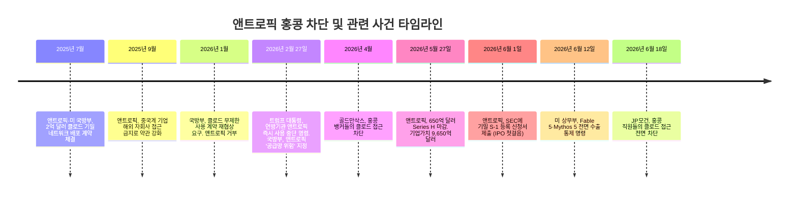
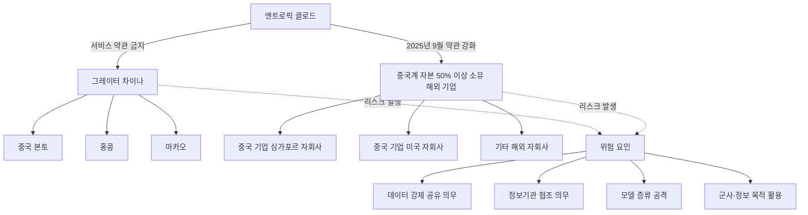
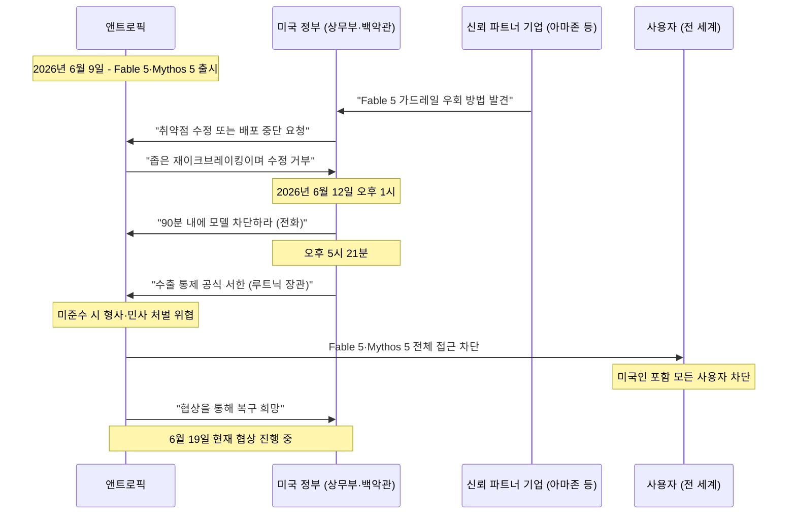
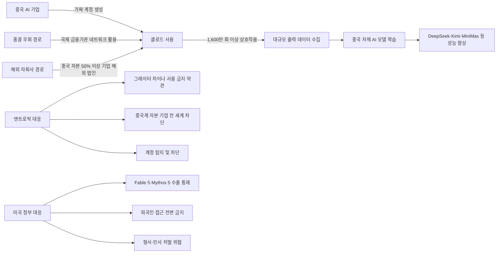
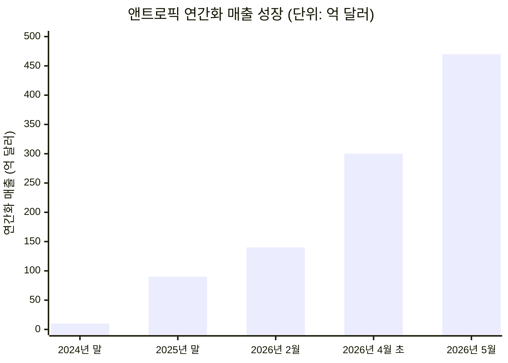
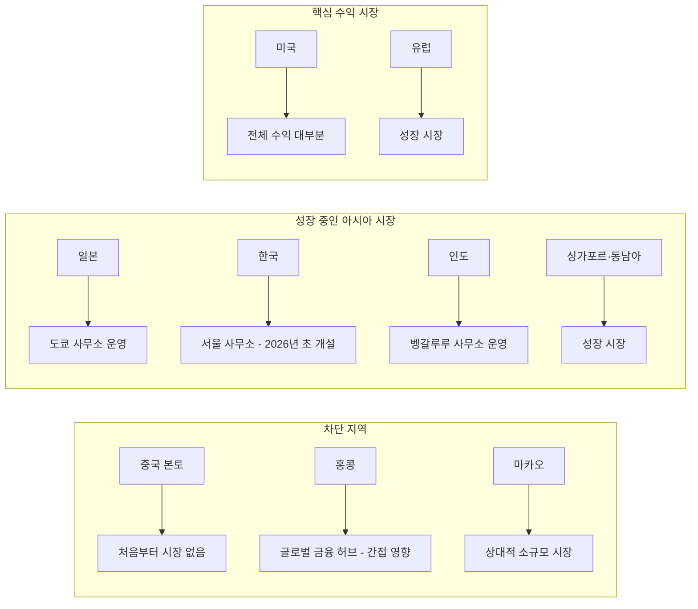
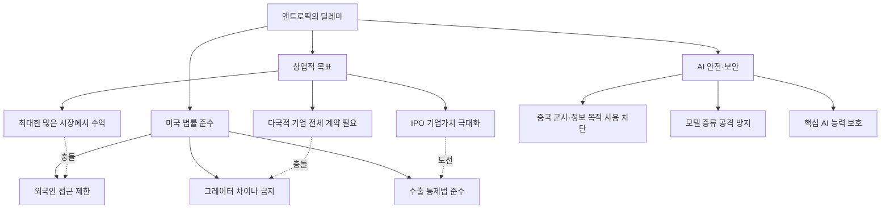
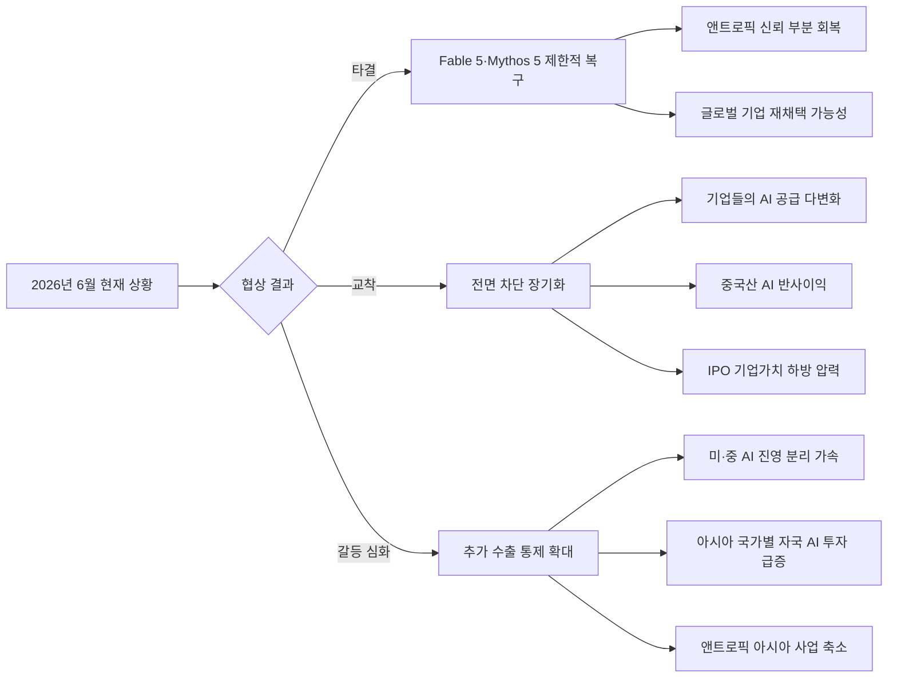

> **작성 기준일**: 2026년 6월 19일  
> **핵심 키워드**: 앤트로픽, 클로드, 홍콩 차단, JP모건, 골드만삭스, 수출 통제, Fable 5, Mythos 5, IPO  

---

## 목차

1. [사건 요약: 무슨 일이 벌어졌나](#1-사건-요약)
2. [JP모건의 홍콩 차단: 타임라인과 경위](#2-jp모건의-홍콩-차단)
3. [골드만삭스의 선행 조치: 4월의 신호탄](#3-골드만삭스의-선행-조치)
4. [왜 하필 홍콩인가: 그레이터 차이나 정책의 구조](#4-왜-하필-홍콩인가)
5. [미국 상무부의 수출 통제 명령: Fable 5·Mythos 5 전면 차단](#5-미국-상무부의-수출-통제-명령)
6. [앤트로픽과 미 국방부의 충돌: 더 깊은 맥락](#6-앤트로픽과-미-국방부의-충돌)
7. [중국의 AI 기술 탈취: 모델 증류 공격의 공포](#7-중국의-ai-기술-탈취)
8. [IPO를 앞두고 터진 악재: 재무적 맥락과 구조적 모순](#8-ipo를-앞두고-터진-악재)
9. [아시아 시장 포기가 수익에 미치는 영향: 숫자로 보는 분석](#9-아시아-시장과-수익-분석)
10. [앤트로픽이 미국에 주는 전략적 가치](#10-앤트로픽의-미국-전략적-가치)
11. [아시아 우호 시장: 한국·일본에서의 성장 전략](#11-아시아-우호-시장)
12. [종합 분석 및 전망](#12-종합-분석-및-전망)

---

## 1. 사건 요약

2026년 6월 18일, 세계 최대 은행 중 하나인 JP모건 체이스(JPMorgan Chase)가 홍콩 직원들의 앤트로픽 클로드 접근을 전면 차단했다는 사실이 파이낸셜 타임스(Financial Times) 보도를 통해 알려졌다. 이는 약 두 달 전인 2026년 4월 골드만삭스가 먼저 취한 동일한 조치를 뒤따른 것으로, 글로벌 월스트리트 은행들이 홍콩에서 앤트로픽 제품을 잇달아 내부 승인 목록에서 삭제하는 추세가 뚜렷해지고 있다.

이 사건은 단순한 한 은행의 내부 규정 변경이 아니다. 여기에는 여러 층위의 구조적 압력이 동시에 작용하고 있다. 첫째, 앤트로픽 자체의 서비스 약관이 홍콩을 포함한 그레이터 차이나 전역에서의 사용을 금지하고 있다. 둘째, 2026년 6월 12일 미국 상무부가 앤트로픽의 최신 모델인 Fable 5와 Mythos 5에 대해 외국인 전체의 접근을 금지하는 초강력 수출 통제 명령을 내린 직후였다. 셋째, 앤트로픽은 현재 기업 공개(IPO)를 위한 SEC 등록을 마친 직후로, 기업 가치 9,650억 달러, 연간 매출 470억 달러라는 전례 없는 성장세를 기록 중이다.

이 모든 사건의 교차점은 단 하나의 질문으로 압축된다. "앤트로픽이 아시아 시장을 사실상 포기하면서도 과연 지속적으로 수익을 낼 수 있는가, 그리고 미국의 관점에서 이 전략은 어떤 의미인가?"

---

## 2. JP모건의 홍콩 차단

### 무엇이 차단되었나

파이낸셜 타임스의 보도에 따르면, JP모건 체이스는 홍콩 직원들이 회사 내부 시스템에서 사용할 수 있는 AI 도구 목록에서 앤트로픽의 클로드 모델을 삭제했다. 홍콩 직원들은 이제 내부 드롭다운 메뉴에서 클로드를 선택할 수 없다. 중요한 점은 이것이 전 세계적인 차단이 아니라는 사실이다. 뉴욕, 런던, 싱가포르에 있는 JP모건 직원들은 계속해서 클로드를 사용할 수 있다. 제한은 홍콩에 국한된다. ChatGPT나 Gemini 같은 다른 AI 서비스는 영향을 받지 않는다.

이 결정의 공식적인 이유는 앤트로픽의 라이선스 약관이다. JP모건의 법무·리스크팀은 앤트로픽과의 라이선스 계약서에 담긴 지리적 제한 조항을 엄격하게 해석하여, 홍콩에서의 클로드 사용이 계약 위반에 해당할 수 있다는 결론을 내렸다.

### 왜 이 결정이 중요한가

Bank of America Europe 이사회 멤버이자 Bussman Advisory CEO인 올리버 부스만(Oliver Bussman)은 링크드인 게시물에서 JP모건의 이번 결정을 "은행들이 AI 도구를 협상하는 방식에 대한 이사회 수준의 신호"라고 표현했다. 단순히 한 은행의 내부 규정 변경이 아니라, 월스트리트 전체가 AI 도구 선택에서 지정학적 리스크를 최우선으로 고려하기 시작했다는 선언에 가깝다는 뜻이다.

이미 JP모건은 앤트로픽의 IPO 주관사 중 하나로 이름을 올린 상태다. 자신들이 IPO를 이끄는 기업의 제품을 자사 직원들에게 사용 금지시키는 아이러니한 상황이 벌어진 것이다.

---

## 3. 골드만삭스의 선행 조치

JP모건보다 약 두 달 앞선 2026년 4월, 골드만삭스가 동일한 결정을 내렸다. 파이낸셜 타임스가 처음 보도한 이 사안에서, 골드만삭스의 홍콩 소재 뱅커들은 그때부터 클로드에 접근할 수 없게 되었다. 골드만삭스 역시 앤트로픽의 서비스 약관을 엄격하게 해석하여, 자사의 홍콩 직원들이 앤트로픽 제품을 사용하는 것이 허용되지 않는다는 결론에 도달했으며, 이를 앤트로픽과의 협의를 통해 확인했다.

주목할 점은 골드만삭스의 결정 역시 전면적인 것이 아니었다는 사실이다. OpenAI의 ChatGPT와 구글의 Gemini는 여전히 골드만삭스 홍콩 직원들이 사용할 수 있었다. 클로드만이 제거되었다. 이 차별적 차단은 앤트로픽만이 홍콩 및 그레이터 차이나에 대한 명시적인 서비스 금지 조항을 라이선스 계약에 포함시킨 유일한 주요 AI 업체라는 사실을 반영한다.

골드만삭스가 이번 앤트로픽 IPO의 공동 주관사라는 점도 JP모건의 경우와 마찬가지로 깊은 아이러니를 자아낸다.

---

## 4. 왜 하필 홍콩인가

### 홍콩의 이중적 지위

홍콩은 법적으로 중국의 특별행정구이면서도 역사적으로 서구 금융 세계와 중국 본토 사이의 관문 역할을 해왔다. "일국양제(一國兩制)" 원칙 아래에서 중국 본토의 인터넷 통제인 '만리방화벽(Great Firewall)'의 직접 적용을 받지 않았기 때문에, ChatGPT나 Claude 같은 서구 AI 서비스도 홍콩 내에서는 제한적으로나마 사용이 가능했다. 다국적 금융 기관들은 홍콩 외부, 예를 들어 싱가포르나 미국에 서버 인프라를 두고 그것을 통해 홍콩 직원들이 AI 모델에 접근하는 방식을 사용해왔다.

그런데 왜 앤트로픽은 처음부터 홍콩을 지원하지 않겠다는 약관 조항을 포함시켰을까?

### 앤트로픽의 서비스 약관: 그레이터 차이나 전면 금지

앤트로픽은 서비스 약관을 통해 그레이터 차이나(중국 본토, 홍콩, 마카오)에서의 제품 사용을 공식적으로 금지하고 있다. 앤트로픽의 대변인은 파이낸셜 타임스에 클로드는 "홍콩에서 공식적으로 지원된 적이 없다"고 밝혔다.

더 나아가 2025년 9월, 앤트로픽은 약관을 더욱 강화했다. 업데이트된 약관은 이제 중국 등 제한된 지역에 본사를 둔 기업이 50% 이상 직접 또는 간접적으로 소유하는 해외 자회사도 앤트로픽의 서비스를 사용할 수 없다고 명시했다. 즉, 중국 자본이 지배하는 기업이라면 싱가포르나 미국에 있더라도 클로드를 사용할 수 없다.

앤트로픽은 이 정책의 이유로 두 가지를 들었다.

첫째, 법적·규제적 리스크다. 홍콩 및 중국에서 운영되는 기업들은 해당 지역 당국의 요구에 따라 데이터를 공유하거나 정보 기관에 협조할 법적 의무를 질 수 있다. 이런 환경에서 앤트로픽의 AI 모델이 운용될 경우, 훈련 데이터나 모델 자체가 원하지 않는 방향으로 노출될 위험이 있다.

둘째, 모델 증류(Model Distillation) 공격의 우려다. 앤트로픽은 2026년 초 DeepSeek, Moonshot(Kimi), MiniMax 등 중국 AI 기업들이 1,600만 건 이상의 상호작용을 통해 클로드로부터 기술을 추출하려는 시도를 했다고 고발했다. 중국 기업들이 클로드를 사용해 자신들의 AI 모델을 학습시키는 것을 차단하기 위해 지리적 제한이 필요하다는 논리다.

### 홍콩이 글로벌 AI 접근의 '경계선'이 된 이유

홍콩은 기술적으로는 인터넷이 개방된 곳이지만, 법적으로는 중국의 국가보안법(National Security Law, NSL) 적용을 받는다. 2020년 이후 홍콩에서 시행된 국가보안법은 중국 당국이 홍콩 내 기업과 개인에 대해 광범위한 데이터 접근 권한을 주장할 수 있는 법적 근거를 제공한다. 앤트로픽의 관점에서 볼 때, 홍콩은 법적으로 취약한 공간이다.

이것이 JP모건과 골드만삭스 같은 미국 금융 기관들이 선제적으로 홍콩에서 클로드 사용을 차단한 핵심 이유다. 규제 위반이나 데이터 유출로 인한 벌금·사업 권한 박탈 위험을 감수하는 것보다, 먼저 차단하는 것이 더 안전하다는 계산이다.

---

## 5. 미국 상무부의 수출 통제 명령

### 2026년 6월 12일: 90분의 최후 통첩

홍콩 차단 사태를 이해하려면 불과 6일 전인 2026년 6월 12일에 일어난 전례 없는 사건을 먼저 알아야 한다.

그날 오후 1시경(동부 표준시), 미국 정부는 앤트로픽에 전화를 걸어 최신 모델인 Fable 5와 Mythos 5의 접근을 90분 안에 차단하라는 사실상의 최후 통첩을 내렸다. 공식 서한은 같은 날 오후 5시 21분에 도착했다. 발신인은 미국 상무장관 하워드 루트닉(Howard Lutnick)이었고, 수신인은 앤트로픽 CEO 다리오 아모데이(Dario Amodei)였다.

서한의 내용은 충격적이었다. 미국 상무부 산업·안보국(Bureau of Industry and Security, BIS)이 발동한 수출 통제 지침에 따라, 앤트로픽은 미국 외부 어디에 있든, 그리고 미국 내에 있는 외국 국적자도 포함해서, Fable 5와 Mythos 5 모델에 대한 접근을 즉시 차단해야 했다. 루트닉 장관은 서한에서 이에 불응할 경우 형사·민사 처벌을 가할 것이라고 경고했다.

블룸버그(Bloomberg)는 서한의 실제 내용을 입수해 보도했다. 서한에 따르면, 이 두 모델의 수출·재수출·국내 이전에는 상무부의 허가가 필요하며, 이는 민간 기술에 군사 정보 목적으로 사용될 수 있는 경우에 정부가 수출 통제를 부과할 수 있는 미국 법률에 근거했다.

### 왜 차단했나: 재이크브레이킹(Jailbreak) 논란

트럼프 행정부는 또 다른 회사가 Mythos 모델의 가드레일을 우회하는 방법, 즉 '재이크브레이킹'을 발견했다고 주장하며 이것이 국가 안보 위협이라고 판단했다. 트럼프 행정부의 AI 자문인 데이비드 삭스(David Sacks)에 따르면, 앤트로픽의 신뢰받는 파트너이자 미국 정부와도 협력하는 한 회사가 Fable 5를 테스트하는 과정에서 제한 없는 사이버 능력을 지닌 Mythos로 이어지는 가드레일 우회 방법을 발견했다고 한다. 정부는 아모데이에게 이 취약점을 수정하거나 모델 배포를 중단할 것을 요청했지만, 아모데이가 이를 거부했다는 것이 삭스의 주장이다.

그러나 앤트로픽은 이를 강하게 반박했다. 앤트로픽은 공개 성명에서 "좁은 범위의 잠재적 재이크브레이킹이 수백만 명이 배포된 상용 모델을 리콜해야 하는 이유가 된다는 데 동의하지 않는다. 이 기준이 업계 전반에 적용된다면, 모든 프런티어 모델 제공업체의 새 모델 배포가 사실상 중단될 것"이라고 밝혔다.

실제로 사이버 보안 전문가 케이티 무수리스(Katie Moussouris) 등은 Fable 5에서 발견된 취약점이 실질적인 재이크브레이킹이 아니라, 평범한 "이 코드를 수정해줘"와 같은 프롬프트에서 발생한 것이라고 설명했다. 어떤 AI 모델도 이런 종류의 취약점을 완전히 없앨 수 없다는 것이다.

또한 세마포(Semafor)의 보도에 따르면, 미국 정부는 중국 연계 조직이 이미 Mythos 모델에 무단으로 접근했을 가능성을 우려했다. 중국 군사 정보기관이 이 모델에 접근하여 역설계하거나 모델 증류를 통해 자체 AI 능력을 향상시킬 수 있다는 시나리오가 가장 큰 공포였다.

아마존 역시 유사한 재이크브레이킹 취약점을 보고했으며, 아마존 CEO 앤디 재시(Andy Jassy)가 미국 행정부 인사들에게 이를 전달했다는 보도도 있었다.

### 앤트로픽의 대응: 전체 차단

앤트로픽은 상무부 서한을 받은 직후, 사용자 국적을 실시간으로 검증할 방법이 없었기 때문에 Fable 5와 Mythos 5 두 모델을 미국인 포함 모든 사용자에게 전면 차단하는 것 외에 선택지가 없었다. 출시 3일 만에 역대 가장 강력한 모델 두 개가 완전히 접근 불가 상태가 된 것이다.

앤트로픽은 "이것은 오해이며 가능한 빨리 접근을 복구하기 위해 노력하고 있다"고 밝혔다. 트럼프 대통령은 이후 앤트로픽과의 협상이 "잘 진행 중"이라고 말했으며, 앤트로픽 수석 기술진들이 6월 15일(월요일) 워싱턴 D.C.에서 행정부 관계자들을 만났으나 아직 해결책을 찾지 못한 상태다.

---

## 6. 앤트로픽과 미 국방부의 충돌

### 배경: 최초의 기밀 네트워크 AI

이번 홍콩 사태를 이해하려면 앤트로픽과 미국 정부의 관계가 얼마나 복잡하고 갈등적인지를 먼저 파악해야 한다.

2025년 7월, 앤트로픽은 미국 국방부(이하 '국방부')와 2억 달러 규모의 계약을 체결했다. 클로드는 기밀 네트워크에 배포된 최초의 주요 AI 모델이 되었다. 이 계약에서 국방부는 앤트로픽의 '허용 사용 정책(Acceptable Use Policy, AUP)'을 따르기로 동의했다. 이 정책은 클로드를 미국인 대규모 국내 감시나 인간 개입 없는 완전 자율 무기 시스템에 사용하는 것을 금지했다.

그러나 이후 상황이 급반전했다.

2026년 1월부터 국방부는 클로드를 "모든 합법적 목적"에 무제한으로 사용할 수 있도록 계약을 재협상하려 했다. 본질적으로 AUP에서 제한 조항을 제거하라는 요구였다. 앤트로픽은 이를 거부했다. 특히 "대량 획득 데이터 분석(analysis of bulk acquired data)" 제한 조항의 삭제 요구가 결정적 갈등 지점이었다.

2026년 2월 27일 오후 5시 1분, 협상 최종 기한이 지나도록 앤트로픽이 동의하지 않자, 트럼프 대통령은 Truth Social에 모든 연방 기관이 앤트로픽 기술을 "즉시 중단(IMMEDIATELY CEASE)"하라고 명령했다. 같은 날, 피트 헤그세스(Pete Hegseth) 국방장관은 앤트로픽을 "공급망 위험(Supply Chain Risk)" 기업으로 지정했다. 이 지정은 원래 외국의 적대국 기업에 사용하는 라벨이다.

이 결정의 결과로 일반 서비스 청(GSA)은 앤트로픽을 조달 목록에서 제거했고, 국무부, 보건복지부 등 여러 연방 기관이 클로드 사용을 중단했다. 반면에 아이러니하게도 이 사태는 일반 소비자들 사이에서 클로드의 인기를 폭발적으로 높여 앱스토어 1위를 기록하게 했으며, 연간화 매출은 140억 달러에서 190억 달러로 급상승했다.

앤트로픽은 연방법원에 이 지정에 대한 소송을 제기했으며, 연방 판사는 "공급망 위험" 지정을 일시 차단하는 명령을 내렸다. 메이어 브라운(Mayer Brown)의 법률 분석에 따르면 정부의 법적 입장은 "거의 지지하기 어렵다(close to untenable)"는 평가를 받았다.

한편 역설적으로, 2026년 6월 현재 국방부는 내부적으로는 이란과의 전쟁 관련 업무에 클로드를 계속 사용하는 것으로 알려졌다.

---

## 7. 중국의 AI 기술 탈취

### 모델 증류 공격이란 무엇인가

"모델 증류(Model Distillation)" 또는 "증류 공격(Distillation Attack)"은 강력한 AI 모델의 출력 데이터를 대량으로 수집하여, 그 출력을 학습 데이터로 삼아 새로운(그리고 더 저렴한) AI 모델을 훈련시키는 기법이다. 본질적으로 고급 AI 모델의 지식을 '빨아들여' 자체 모델을 만드는 것이다. 이는 정상적인 AI 기술 연구에서도 사용되는 방법이지만, 무단으로 타사의 상용 AI 모델을 통해 수행할 경우 기술 탈취의 성격을 띤다.

앤트로픽과 구글 모두 중국 기업들이 이런 방식으로 자신들의 모델에서 기술을 추출했다고 비난한 바 있다.

2026년 초, 앤트로픽은 DeepSeek, Moonshot(Kimi), MiniMax 등 세 개의 저명한 중국 AI 연구소가 가짜 계정을 만들어 클로드와 1,600만 회 이상 상호작용하면서 기술을 추출하려 했다고 고발했다. 이에 대응하여 앤트로픽은 이들의 계정을 차단하고, 약관을 강화하여 중국 자본이 50% 이상인 기업은 전 세계 어디서도 클로드를 사용하지 못하도록 했다.

### 홍콩이 기술 유출의 우회 통로가 될 수 있는 이유

홍콩을 통한 우회 접근은 기술 유출 리스크를 높인다. 중국 본토 기업들은 홍콩에 법인을 설립하거나, 홍콩에 사무소를 둔 국제 금융 기관의 네트워크를 통해 앤트로픽의 서비스에 접근을 시도할 수 있다. 실제로 앤트로픽은 클로드가 홍콩에서 공식 지원되지 않음에도 불구하고 일부 국제 기업들이 홍콩 외부에 서버를 두는 방식으로 홍콩 직원들이 클로드를 사용하도록 해왔다는 사실을 인지하고 있었다.

Mythos 5 모델의 경우, 미국 정부는 중국 군사 정보기관과 연계된 조직이 이 모델에 이미 접근했을 가능성을 심각하게 우려했다. Mythos 5는 원래 사이버 보안 취약점을 찾는 데 탁월한 능력을 가진 것으로 알려져 있었기 때문에, 이것이 군사 정보 목적으로 사용되거나 역설계될 경우 국가 안보에 직접적인 위협이 된다는 논리였다.

---

## 8. IPO를 앞두고 터진 악재

### 앤트로픽의 IPO 준비 현황

2026년 5월 27일, 앤트로픽은 650억 달러 규모의 Series H 투자 라운드를 마감했다. 이로써 앤트로픽의 기업 가치는 9,650억 달러에 달하게 되었고, 이는 잠재적으로 역사상 가장 가치 있는 민간 기술 기업 중 하나가 되었음을 의미한다.

2026년 6월 1일, 앤트로픽은 SEC에 기밀 S-1 등록 신청서를 제출했다. 이는 IPO를 향한 공식적인 첫걸음이다. 주관사로는 Morgan Stanley, Goldman Sachs, JPMorgan Chase가 선정되었다.

앤트로픽의 매출 성장은 AI 역사상 전례를 찾기 어려울 정도로 가파르다.

2024년 말 10억 달러에서 시작한 매출이 2026년 5월 470억 달러로 불과 18개월 만에 47배 증가했다. 엔터프라이즈 고객이 전체 매출의 약 80%를 차지하며, 연간 100만 달러 이상을 지출하는 기업 고객이 2026년 4월 기준 1,000개를 넘어섰다. 특히 Claude Code(코딩 에이전트)는 2026년 2월 기준 연간 25억 달러의 반복 수익을 기록했다.

### 아이러니: 주관사들이 제품을 차단하다

이번 홍콩 사태의 가장 큰 아이러니는 바로 여기에 있다. 앤트로픽 IPO를 이끄는 세 개의 주관사 은행—Goldman Sachs, JPMorgan Chase, Morgan Stanley—이 바로 앤트로픽의 제품을 자사 홍콩 직원들에게 제한하거나 차단한 당사자들이라는 사실이다.

골드만삭스는 4월에 홍콩에서 클로드를 차단했으며, JP모건은 6월 18일에 그 뒤를 따랐다. 즉, 자신들이 IPO로 공개 시장에 내다 팔 기업의 제품을 자신들의 사무실에서는 쓰지 않겠다는 것이다. 이 상황은 앤트로픽의 지리적 서비스 제한이 얼마나 심각한 사업 위험 요소인지를 단적으로 드러낸다.

The Next Web의 분석에 따르면 앤트로픽은 지난 1년간 금융 섹터에 클로드를 깊이 내재화하는 전략을 펼쳐왔다. 월스트리트 파트너들과 15억 달러 규모의 엔터프라이즈 합작 사업을 추진하고, 은행들의 회계·컴플라이언스 업무에 클로드를 파일럿 배포하는 등 금융 업계와의 유대를 깊혀왔다. 그런데 이제 같은 은행들이 특정 지역에서는 클로드 사용을 차단하고 있다.

### 다국적 기업 AI 인프라의 통일성 문제

앤트로픽 홍콩 사태가 IPO와 수익 전망에 미치는 가장 실질적인 우려는 '다국적 기업의 AI 인프라 통일성' 문제다. 대부분의 글로벌 기업들은 모든 지사에서 동일한 AI 도구 스택(stack)을 사용하기를 원한다. 서울, 뉴욕, 런던에서는 클로드를 쓰는데 홍콩에서는 쓸 수 없다면, 그 기업은 아예 전 세계적으로 다른 AI 도구를 선택하는 편을 택할 수 있다.

Medium 기고가 아디티야 기리다란(Adithya Giridharan)이 지적한 것처럼, 이번 사태는 "어떤 엔터프라이즈 AI 계약도 예상하지 못했던 복잡성—지리가 컴플라이언스 변수가 된 상황"을 드러냈다. 홍콩 때문에 클로드가 차단된다면, 홍콩에 사무소를 둔 어떤 글로벌 대기업도 클로드를 회사 전체의 표준 AI 인프라로 채택하기를 주저하게 된다.

---

## 9. 아시아 시장과 수익 분석

### 중국·홍콩 시장의 규모와 앤트로픽의 포지셔닝

객관적으로 볼 때, 중국 본토는 앤트로픽에게 처음부터 접근 가능한 시장이 아니었다. 중국의 인터넷 규제('만리방화벽')가 ChatGPT와 Claude의 직접 접근을 차단하고 있으며, 중국 내에서는 바이두 어니(Ernie), DeepSeek, Kimi 같은 국내 AI 서비스가 지배적이다. 따라서 앤트로픽의 관점에서 볼 때 중국 본토 시장은 어차피 포기된 영역에 가깝다.

홍콩의 경우는 다르다. 홍콩은 인터넷이 개방되어 있고, 수십 개의 글로벌 금융 기관과 다국적 기업의 아시아 허브가 위치하고 있다. JP모건, Goldman Sachs, HSBC, Citigroup, UBS 등이 모두 홍콩에 대규모 운영 거점을 두고 있다. 만약 이들 기업이 홍콩의 클로드 차단 때문에 전 세계적으로 다른 AI 플랫폼을 선택하기로 결정한다면, 그 파급 효과는 홍콩 한 곳의 손실을 훨씬 넘어선다.

### 실제 수익에 미치는 영향: 과장과 현실 사이

그러나 현실적인 관점에서 보면, 이 영향은 과장될 수 있다. 앤트로픽의 현재 수익 구조를 보면, 전체 수익의 80%가 엔터프라이즈 고객에서 나온다. 그리고 이 엔터프라이즈 고객의 절대 다수는 미국, 유럽, 일본, 한국, 인도 등 앤트로픽이 정상적으로 서비스를 제공할 수 있는 지역에 본사를 두고 있다.

또한 앤트로픽은 아시아 태평양 시장에서 일본 도쿄, 인도 벵갈루루, 한국 서울에 사무소를 운영하고 있으며, 이 지역에서의 수익이 1년간 10배 이상 성장했다고 발표한 바 있다. 이 세 곳은 모두 앤트로픽이 정상적으로 서비스를 제공하는 지역이다.

한국과 일본은 앤트로픽에게 전략적으로 중요한 아시아 교두보다. 두 나라 모두 미국의 동맹국이며, 수출 통제 규정에서 우호국으로 분류될 가능성이 높다. 한국 정부는 글로벌 AI 3대 강국 중 하나가 되겠다는 목표를 선언했으며, 일본은 AI 규제에서 미국과 긴밀히 협력하는 국가다.

### 수출 통제가 가져온 더 큰 그림의 우려

더 큰 문제는 이번 Fable 5·Mythos 5 수출 통제가 글로벌 기업들에게 새로운 종류의 불확실성을 심어줬다는 점이다. AI 위클리(AI Weekly)에 따르면, 이번 국적 기반의 접근 제한은 모든 엔터프라이즈와 정부의 AI 조달 결정에 새로운 변수를 만들었다. 즉, "지정학적 상황에 따라 특정 AI 모델이 갑자기 사용 불가능해질 수 있다"는 공급 안정성 리스크다.

실제로 이번 사태 이후 DeepSeek, MiniMax, Tencent의 AI, 샤오미의 AI가 OpenRouter의 가장 많이 사용된 모델 상위 4위를 차지했다는 보도도 나왔다. 한국과 일본은 이미 국가 AI 전략을 재조정하고 있으며, 수출 통제 정책이 국가별 자국 AI 투자의 주요 동인이 되고 있다.

DeepSeek V4 Pro의 가격은 토큰 백만 개당 3.48달러인 반면, Fable 5는 50달러다. 이 가격 차이에 공급 불확실성 리스크가 더해지면, 비용에 민감한 기업들이 중국산 오픈소스 모델로 전환할 경제적 동기가 생긴다.

---

## 10. 앤트로픽의 미국 전략적 가치

### 앤트로픽이 미국에 유익한 이유

표면적으로는 이해하기 어려울 수 있다. 미국 정부는 앤트로픽의 최고 모델들에 수출 통제를 걸어 접근을 막으면서, 동시에 앤트로픽이 미국 국가 안보에 기여하기를 기대한다. 그런데 이것이 어떻게 미국에 이익이 되는가?

첫째, 프런티어 AI 능력의 미국 통제다. 앤트로픽의 Mythos 5와 Fable 5는 현재 세계 최고 수준의 AI 모델이다. 이를 미국 국적자와 승인된 기관에만 접근을 허용함으로써, 미국은 최첨단 AI 능력에서 적어도 일시적으로 독점적 우위를 유지할 수 있다. 사이버 공격 탐지, 취약점 발견, 정보 분석 등 국가 안보 관련 응용에서 이 모델들이 발휘하는 능력은 상당하다.

둘째, AI 공급망 주도권이다. 앤트로픽의 Claude Code는 세계 소프트웨어 개발의 방식을 재편하고 있다. 미국의 최첨단 AI 모델이 전 세계 소프트웨어 인프라의 핵심에 내재화되면, 이는 미국의 기술 표준과 가치관을 전파하는 통로가 된다. 이것이 미국이 프런티어 AI를 중국으로부터 차단하는 진짜 이유 중 하나다.

셋째, 국가 안보 사이버 능력이다. Mythos 5는 원래 사이버 취약점 발견을 위해 설계된 모델로, Project Glasswing을 통해 Mozilla 같은 신뢰받는 기관들에 제한적으로 배포되었다. 보도에 따르면 Mozilla만 해도 Mythos Preview를 통해 수백 개의 취약점을 발견하고 수정했다. 이런 능력이 미국과 동맹국의 방어 역량을 높이는 데 활용된다면, 그 가치는 단순한 상업적 수익을 넘어선다.

넷째, 트럼프 행정부의 AI 전략 틀에서의 앤트로픽이다. 앤트로픽이 국방부와의 갈등, 특히 자율 무기 시스템에 대한 사용 거부로 인해 트럼프 행정부와 긴장 관계에 있었음에도, 양측은 대화를 이어가고 있다. 트럼프 대통령 자신이 앤트로픽과의 협상이 "잘 진행 중"이라고 말하는 것은, 미국 정부가 앤트로픽의 AI 능력을 국가 전략에서 배제할 수 없음을 인정하는 것과 다르지 않다.

### '미국 우선' AI 생태계 구축

미국의 AI 정책 기조는 점점 명확해지고 있다. 최첨단 AI 모델은 미국의 지정학적 이익을 위해 활용되어야 하며, 적대적 국가(특히 중국과 러시아)가 이에 접근하는 것을 차단해야 한다. 이는 반도체 수출 통제(엔비디아 칩의 중국 수출 제한), AI 칩 제조 기반 미국 내 구축(TSMC·삼성의 미국 공장 유치), 그리고 이번 AI 모델 수출 통제로 이어지는 일관된 흐름이다.

앤트로픽이 아시아(구체적으로는 중국·홍콩) 시장을 포기하는 것은, 이 맥락에서 선택이라기보다 미국 법률과 정책을 준수한 결과다. 그리고 미국 정부의 관점에서 이것은 바람직한 결과다. 미국의 가장 강력한 AI가 중국 영향권에 있는 공간에서 운용되지 않는다는 것을 의미하기 때문이다.

---

## 11. 아시아 우호 시장

### 중국을 제외한 아시아에서의 앤트로픽

앤트로픽의 아시아 전략은 중국·홍콩을 배제하되, 미국의 동맹국인 한국·일본·인도·싱가포르 등에서 적극적으로 성장하는 방향으로 설계되어 있다.

앤트로픽은 2025년 말 일본 도쿄와 인도 벵갈루루에 아시아태평양 사무소를 개설했다. 이어 2026년 초에는 서울 사무소를 추가로 열었다. 앤트로픽은 이들 지역에서의 수익이 1년간 10배 이상 성장했다고 밝혔다. 특히 한국은 정부가 세계 3대 AI 강국 목표를 선언하고 AI 인프라 투자를 확대하고 있어, 앤트로픽에게 전략적으로 중요한 시장이다.

### 아시아 시장에서의 현실적 대안

홍콩 금융 기관들의 입장에서는 이 차단이 상당히 불편할 수 있다. 한 홍콩 기반 기술 분석가가 지적한 것처럼, 홍콩 소재 엔지니어가 같은 은행의 싱가포르나 런던 동료가 사용하는 것과 동일한 코딩 보조 도구를 사용할 수 없다면, 생산성 격차가 실제로 누적된다. 이 격차는 단순한 불편이 아니라 코드 리뷰 사이클, 모델 개발, 인프라 작업 전반에 걸쳐 복리로 쌓인다.

그러나 홍콩 기업들을 위한 대안도 존재한다. ChatGPT(OpenAI)와 Gemini(Google)는 홍콩에서 접근 제한이 없다. 그리고 DeepSeek 같은 중국 오픈소스 모델들은 비용이 훨씬 저렴하고 홍콩에서 자유롭게 사용 가능하다. 이것이 앤트로픽에게는 시장 손실이지만, 궁극적으로 중국산 AI의 성장을 촉진할 수 있다는 점에서 수출 통제 정책의 역설적 부작용이기도 하다.

---

## 12. 종합 분석 및 전망

### 구조적 갈등의 본질

이 사태의 핵심에는 해소되기 어려운 구조적 갈등이 있다.

앤트로픽은 상업적으로 최대한 많은 시장에서 수익을 내야 할 필요가 있지만, 동시에 미국의 수출 통제법을 준수해야 하고, 자사의 AI가 중국의 군사·정보 목적에 활용되지 않도록 해야 한다. 이 세 가지 목표는 완전히 양립하기 어렵다. 특히 홍콩이라는 공간은 법적으로 중국 영토이면서 경제적으로는 글로벌 금융의 중심지라는 이중성 때문에, 이 갈등이 가장 날카롭게 표출되는 지점이다.

다국적 은행들인 JP모건과 골드만삭스는 이 갈등에서 가장 합리적인 선택을 했다. 앤트로픽의 약관 위반으로 인한 법적·계약적 위험, 미국 수출 통제법 위반으로 인한 벌금과 사업 권한 박탈 위험을 모두 감안했을 때, 선제적으로 홍콩에서 클로드를 차단하는 것이 가장 안전한 길이다.

### 앤트로픽이 아시아를 포기해도 수익을 낼 수 있는가

결론부터 말하면, 현재로서는 **그렇다**.

앤트로픽의 연간화 매출은 2026년 5월 470억 달러에 달하며, 이 성장의 동력은 주로 미국과 유럽의 엔터프라이즈 고객, 그리고 한국·일본·인도 같은 미국 우호국에 있다. 중국·홍콩 시장은 어차피 앤트로픽이 공식적으로 지원한 적이 없는 영역이다. 따라서 이 시장의 '포기'가 실제 매출에 미치는 직접적 영향은 제한적이다.

그러나 중장기적으로 우려되는 것은 **간접 효과**다. 홍콩에서 클로드를 사용할 수 없다는 사실이 글로벌 기업들로 하여금 클로드를 전사적 표준 AI 도구로 채택하는 것을 주저하게 만든다면, 이는 단순히 홍콩이라는 한 도시의 손실을 넘어서는 파급력을 갖는다. 글로벌 기업들이 AI 인프라를 통일하는 경향을 고려할 때, 한 지사에서의 차단이 전사적 계약 포기로 이어질 수 있다.

또한 이번 Fable 5·Mythos 5 전체 차단은 새로운 공급 불안정성 리스크를 부각시켰다. "지정학적 사건으로 인해 갑자기 가장 강력한 AI 모델에 접근할 수 없게 될 수 있다"는 사실은, 앤트로픽에 대한 의존도를 높이는 것을 주저하게 만드는 요인이 될 수 있다. 한국, 일본 같은 나라들이 자국 AI 개발에 더 많이 투자하는 계기가 될 수 있고, 이는 장기적으로 앤트로픽의 아시아 성장을 제한할 수 있다.

### 앞으로의 전망

세 가지 시나리오를 생각해볼 수 있다.

**시나리오 1: 협상 타결과 제한적 복구**  
앤트로픽과 미국 정부가 협상을 통해 Fable 5·Mythos 5에 대한 접근을 일정 조건 하에 복구하는 방안에 합의한다. 예를 들어, 외국인 사용자에 대해 신원 인증 시스템을 구축하거나, 특정 동맹국 사용자들에게는 접근을 허용하는 방식이다. 이 경우 앤트로픽은 손상된 신뢰를 부분적으로 회복할 수 있다.

**시나리오 2: 미국 우선 전략의 심화**  
앤트로픽이 미국 정부와의 관계를 강화하는 방향을 선택하고, 최첨단 모델은 미국 및 동맹국 시장에서만 서비스하는 구조를 수용한다. 이 경우 단기적으로는 광범위한 아시아 시장을 포기하지만, 미국 엔터프라이즈와 정부 계약에서 장기적으로 우월한 지위를 확보할 수 있다.

**시나리오 3: 분산형 리스크 심화**  
수출 통제 불확실성이 지속되면서, 글로벌 기업들이 앤트로픽 의존도를 줄이고 OpenAI나 Google AI 같은 경쟁사나, 더 나아가 오픈소스 모델로 다변화한다. 이 경우 앤트로픽의 성장세가 꺾이고, IPO 기업가치가 기대에 미치지 못할 수 있다.

현재로서 가장 가능성 높은 경로는 시나리오 1과 2의 중간 어딘가다. 앤트로픽의 비즈니스 근본이 흔들릴 정도는 아니지만, 지정학적 리스크가 기업 공시의 핵심 위험 요인으로 자리잡는 'IPO 리스크 서사'는 피하기 어려울 것이다.

---

## 부록: 핵심 개념 정리

| 용어 | 설명 |
|------|------|
| **그레이터 차이나(Greater China)** | 중국 본토, 홍콩, 마카오, 대만을 포함하는 지리적·경제적 개념. 앤트로픽의 서비스 금지 지역에 홍콩이 포함되는 핵심 이유 |
| **모델 증류(Model Distillation)** | 강력한 AI 모델의 출력을 대량 수집하여 더 작고 저렴한 자체 모델을 훈련시키는 기법. 무단 수행 시 기술 탈취에 해당 |
| **수출 통제(Export Control)** | 미국 상무부 산업·안보국(BIS)이 민감한 기술의 해외 이전을 규제하는 제도. AI 모델 수출 통제는 2026년 6월 최초 사례 |
| **Fable 5 / Mythos 5** | 앤트로픽의 최신 모델군. Mythos 5는 고급 사이버 보안 능력을 가진 고제한 모델로 Project Glasswing 파트너에게만 배포, Fable 5는 Mythos를 기반으로 한 상용 공개 모델 |
| **Project Glasswing** | 앤트로픽의 Mythos 모델을 신뢰받는 조직(Mozilla 등)에 한정 배포하는 프로그램. 이 파트너들이 모델을 활용해 보안 취약점을 발견·수정 |
| **공급망 위험(Supply Chain Risk)** | 미국 국방부가 특정 기업의 기술이 국가 안보에 위협이 된다고 판단할 때 부여하는 지정. 원래 외국 기업에 사용하던 것을 앤트로픽(미국 기업)에 최초 적용 |
| **재이크브레이킹(Jailbreaking)** | AI 모델의 안전 가드레일을 우회하여 금지된 유형의 응답을 이끌어내는 기법 |
| **S-1** | 미국 기업이 IPO를 위해 SEC(증권거래위원회)에 제출하는 등록 신청서. 앤트로픽은 2026년 6월 1일 기밀 S-1 제출 |
| **Series H** | 앤트로픽의 2026년 5월 650억 달러 투자 라운드. 기업가치를 9,650억 달러로 확정 |

---

## 참고 출처

- Financial Times, JPMorgan cuts off Anthropic Claude access for Hong Kong staff (2026.6.18)
- American Banker, JPMorganChase blocks Hong Kong staff from using Claude (2026.6.18)
- The Next Web, JPMorgan cuts off Anthropic access for Hong Kong staff (2026.6.18)
- Disruption Banking, Why Goldman Sachs Blocked Hong Kong Bankers from Anthropic's Claude AI (2026.4.29)
- Axios, Scoop: Trump admin blocks foreign access to Anthropic's most powerful AI (2026.6.12)
- Bloomberg, Read the Lutnick Letter That Led Anthropic to Disable Mythos (2026.6.16)
- TechPolicy Press, Did the US Government Just Set An AI Export Precedent by Blocking Mythos? (2026.6.16)
- Caracal Global, Thinking through Anthropic and export controls (2026.6.17)
- Tom's Hardware, US government warned Anthropic that Fable 5 had been jailbroken (2026.6.16)
- The Register, Feds freaked over Fable 5 after simple 'fix this code' prompt (2026.6.15)
- Fortune, Anthropic's Fable fiasco leaves the door open for open-source AI (2026.6.16)
- Mayer Brown, Pentagon Designates Anthropic a Supply Chain Risk (2026.3.27)
- Congress.gov CRS, Federal Government and Anthropic: Considerations for AI Innovation (2026.5.5)
- TechTimes, Anthropic IPO picks Goldman Sachs, Morgan Stanley, JPMorgan (2026.6.5)
- AI IPO Tracker, Anthropic IPO Tracker 2026 (2026.5)
- AI Weekly, US Anthropic ban fuels shift to Chinese open-source AI (2026.6.16)
- Semafor, JPMorgan restricts Anthropic in Hong Kong (2026.6.18)
- Anthropic, Updating restrictions of sales to unsupported regions (2025.9)
- doodhk.com, Why Claude Is Blocked in Hong Kong: Causes, Context, and Alternatives (2026.3.13)

---

*이 문서는 2026년 6월 19일을 기준으로 수집된 공개 보도 및 공개 문서를 바탕으로 작성되었습니다. 이후 상황 변화에 따라 내용이 달라질 수 있습니다.*
