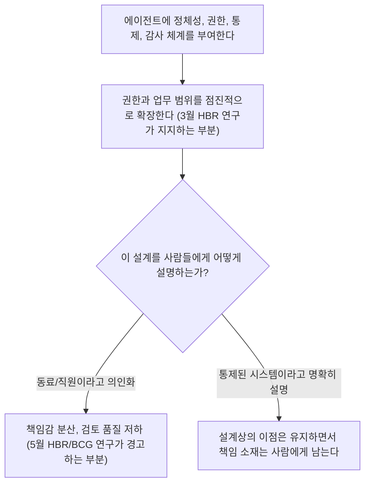
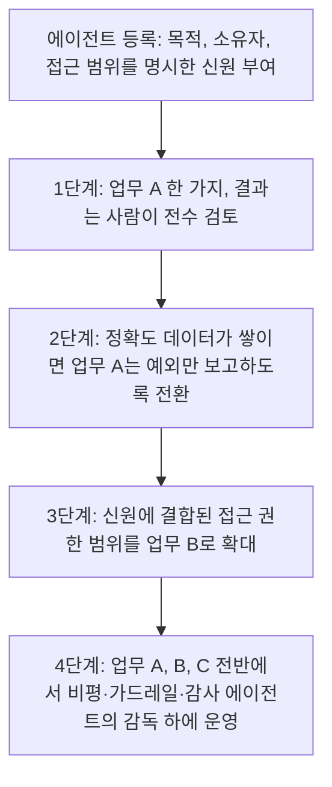

> 
> https://www.threads.com/@doroonja/post/DZwtTTQDjvC
> 
> AX를 AI를 통한 업무 자동화로 생각하는 경우가 많아보여. AX는 AI 에이전트를 직원이나 동료로 두고 같이 업무하는 환경이 되는거야. 즉, 에이전트 동료가 처음에는 A 일을 하지만 점점 B,C를 할 수 있어야 해.
> 
> 혹 AX 컨설팅 받았는데 결과가 확장 불가능한 형태면 잘못된거니 환불 받자
> 

## 목차

1. 들어가며 — 앞선 두 문서가 놓친 지점
2. 1부 — 원 게시물과 가장 가까운 실제 연구: "팀원으로서의 에이전트" 거버넌스 프레임워크
3. 2부 — 두 달 뒤, 같은 매체가 정반대 경고를 내놓다
4. 3부 — 두 연구를 함께 읽으면 보이는 것: 메커니즘과 비유는 다른 문제다
5. 4부 — 그렇다면 A→B→C 확장은 실제로 어떻게 설계되는가
6. 5부 — "확장이 잘 안 되는 게 오히려 정상"이라는 데이터
7. 마치며 — 균형 잡힌 결론
8. 참고자료

---

## 1. 들어가며 — 앞선 두 문서가 놓친 지점

지적이 정확하다. 앞서 작성한 두 문서는 "AX를 어떻게 잘 도입하는가"에 대한 일반적인 방법론과 사례(JP모건의 좁은 업무 시작, IBM의 Client Zero, 클라르나의 실패)를 다뤘지만, 이는 모두 "조직이 AI 도입 범위를 넓혀가는 것"에 대한 사례였다. 원 게시물이 말한 것은 더 구체적이다. 조직 전체의 AI 사용 범위가 아니라, **하나의 에이전트(동료)가 업무 A를 맡다가 신뢰가 쌓이면서 같은 정체성으로 B, C까지 맡게 되는 구조**에 관한 주장이다. JP모건의 COiN은 계약서 추출이라는 업무에 머물렀고, 다른 업무는 별도의 에이전트가 새로 맡았다. 이는 "포트폴리오 확장"이지, 게시물이 말하는 "한 동료의 성장"과는 다른 이야기다.

이 차이를 염두에 두고 다시 검색한 결과, 정확히 이 질문—"에이전트를 진짜 동료처럼 정체성과 권한을 부여해 점진적으로 키워야 하는가"—을 정면으로 다룬 최신 연구 두 건을 찾을 수 있었다. 흥미롭게도 두 연구는 같은 매체(하버드비즈니스리뷰)에 두 달 간격으로 실렸고, 결론이 정반대다. 이 문서는 그 두 연구를 중심으로 다시 구성했다.

---

## 2. 1부 — 원 게시물과 가장 가까운 실제 연구: "팀원으로서의 에이전트" 거버넌스 프레임워크

2026년 3월, 카네기멜런대학교의 라훌 텔랑 교수, 피츠버그대학교의 무함마드 지아 하이다리 교수, 거버넌스 중심 에이전틱 AI 플랫폼 Ejento AI의 창업자 라자 이크발이 하버드비즈니스리뷰에 "에이전트를 성공적으로 확장하려면 팀원처럼 다루어라"라는 글을 발표했다. 이 글의 핵심 주장은 원 게시물의 메시지와 거의 정확히 일치한다.

이들은 생성형 AI 에이전트가 단순한 소프트웨어 설치가 아니라 일하는 방식 자체를 바꾸는 변화라고 전제한다. 에이전트가 기록을 수정하고, 환불을 처리하고, 승인을 라우팅하는 등 실행 권한을 갖게 되면, 기존 소프트웨어 도구에는 없던 운영 리스크—예측 불가능한 행동, 문제 발생 시 불분명한 책임 소재—가 함께 따라온다. 이를 안전하고 효과적으로 다루려면 조직이 각 에이전트에 명확한 정체성(identity), 제한된 권한(limited authority), 신뢰할 수 있는 정보원, 무엇을 실행할 수 있는지에 대한 명확한 통제, 그리고 의사결정을 설명할 수 있는 감사 추적 기능을 부여해 "디지털 직원"처럼 다루어야 한다고 주장한다. 그리고 이런 사고방식을 채택하면서 자율성을 점진적으로 도입하는 기업이, 값비싼 실수에 노출되지 않으면서도 에이전틱 AI의 효익을 포착할 가능성이 훨씬 높다고 결론짓는다.

이는 원 게시물이 말한 "처음엔 A, 점점 B와 C로"의 구조를 학술적으로 뒷받침하는 거의 유일하게 정확히 일치하는 자료다. 다만 이 글에서 말하는 확장은 막연한 신뢰 형성이 아니라, 정체성·권한·통제·감사라는 네 가지 구체적인 거버넌스 장치가 함께 갖춰질 때만 가능하다는 점을 강조한다는 차이가 있다.

---

## 3. 2부 — 두 달 뒤, 같은 매체가 정반대 경고를 내놓다

그런데 2026년 5월 6일, 같은 하버드비즈니스리뷰에 보스턴컨설팅그룹(BCG) 산하 BCG 헨더슨 인스티튜트의 매튜 크롭(BCG X 최고AI책임자), 줄리 베다드, 보스턴대학교 에마 와일스 교수, 메간 수, 리사 크레이어가 공동으로 "왜 AI 에이전트를 직원처럼 다루면 안 되는가"라는 제목의 정반대 주장을 담은 연구를 발표했다.

이 연구는 단순한 의견이 아니라 미국·캐나다·유럽연합의 관리자 1,261명을 대상으로 한 무작위 대조 실험에 기반한다. 연구진은 관리자들에게 의도적으로 오류가 포함된 업무 문서를 주고 검토하게 했는데, 그 결과를 AI가 작성했다고 "직원처럼" 프레이밍해서 제시한 집단은, 같은 결과를 단순한 "도구"로 프레이밍해서 제시한 집단보다 오류를 18% 더 적게 발견했다. 개인이 느끼는 오류에 대한 책임감은 9퍼센트포인트 떨어졌고, 반대로 그 책임을 AI에게 돌리는 비중은 8퍼센트포인트 올라갔다. 더 중요한 것은, 이렇게 AI를 의인화한다고 해서 사람들이 그 기술을 업무에 실제로 받아들이려는 의도가 높아지지도 않았다는 점이다. 즉 "동료"라는 프레이밍은 도입을 촉진하지도 못하면서, 검토 품질을 떨어뜨리고 책임 소재를 흐리는 부작용만 낳았다는 것이 이 연구의 결론이다.

연구진은 같은 글에서 BCG의 'AI at Work' 조사 결과도 함께 인용했는데, 전 세계 1만 명 이상의 직장인을 대상으로 한 이 조사에서 실제로 AI 에이전트를 업무 흐름에 통합해 운영하고 있는 조직은 13%에 불과했고, 56%는 여전히 강한 사람의 감독 아래 파일럿 단계에 머물러 있었다. 연구진의 결론은 명확하다. AI를 "고용해서 온보딩하고, 슬랙 계정을 주고, 조직도에 넣는" 식의 직원 비유는 매력적인 정신적 모델이지만, 사람이 무상으로 가져오는 것—하루 전체에 걸친 안정적 맥락 이해, 예외 상황에서 스스로 에스컬레이션하려는 본능, 동료가 행간을 읽어줄 것이라는 암묵적 전제—을 에이전트가 갖추지 못한 채로 그 비유를 그대로 적용하면, 업무 흐름은 느려지는 정도가 아니라 "자신 있게 틀린 결과물"을 만들어내고 이를 동료들이 떠안아 수습해야 하는 상황으로 이어진다고 경고한다.

---

## 4. 3부 — 두 연구를 함께 읽으면 보이는 것: 메커니즘과 비유는 다른 문제다

이 두 연구는 모순되어 보이지만, 자세히 들여다보면 서로 다른 층위를 이야기하고 있다.

3월 논문(텔랑·하이다리·이크발)이 말하는 것은 **설계 메커니즘**이다. 에이전트에게 정체성을 부여하고, 권한을 제한하고, 행동을 통제하고, 감사 가능하게 만들고, 이 모든 것을 점진적으로 확장하라는 것. 이것은 순수하게 기술적·조직적 설계의 문제다.

5월 논문(크롭·베다드 외)이 말하는 것은 **의사소통과 인지의 문제**다. 그 설계가 아무리 정교해도, 사람들에게 그 에이전트를 "직원" "동료"라고 부르고 의인화해서 소개하는 순간, 사람의 뇌는 책임을 그쪽으로 떠넘기기 시작하고 검토를 게을리하게 된다는 것이다. 흥미롭게도 이 실험은 AI의 실제 성능이나 설계가 동일한 상태에서, 오직 그것을 부르는 "언어"만 바꿨을 때 일어난 효과를 측정했다는 점에서, 게시물이 쓴 "동료"라는 단어 선택 자체가 가지는 위험성을 정확히 짚어준다.

다시 말해, 원 게시물의 두 문장 중 **"업무 A에서 B, C로 점진적으로 권한과 역할을 넓혀야 한다"는 부분은 최신 연구가 실제로 지지하는 설계 원칙**이다. 그러나 **"동료"라는 표현으로 그 관계를 설명하는 방식 자체는, 같은 연구 집단이 두 달 뒤 정면으로 반박한 부분**이기도 하다. 이는 게시물이 틀렸다는 뜻이 아니라, 그 비유를 실제 조직에 적용할 때는 "동료처럼 일을 맡기되, 동료라고 부르지는 않는" 섬세한 줄타기가 필요하다는 뜻으로 읽는 것이 더 정확하다.

---

## 5. 4부 — 그렇다면 A→B→C 확장은 실제로 어떻게 설계되는가

3월 HBR 논문과 별개로, 에이전트의 신원·권한을 다루는 실무 표준화 작업도 이미 진행 중이다. 2025년 10월 발표된 「Identity Management for Agentic AI」 백서는 마이크로소프트, 옥타 등 신원 관리 업계 전문가들이 공동 집필한 것으로, 에이전트가 늘어날수록 "이 에이전트가 누구의 권한으로, 어떤 범위까지, 무엇을 할 수 있는가"를 다루는 인증·인가·신원 체계가 필요하다고 지적한다. 이는 게시물이 말한 "업무 A에서 B로 넘어간다"는 것이 기술적으로는 "이 에이전트의 신원에 결합된 접근 권한 범위(scope)를 넓힌다"는 의미라는 것을 보여준다.

McKinsey의 운영모델 연구도 비슷한 결을 가진다. 모든 에이전트에게 동일한 수준의 자율성을 주어서는 안 되며, 업무의 민감도에 따라 자율성 수준 자체를 단계적으로 정의해야 한다는 것이다. 이를 종합하면, "동료"라는 비유를 걷어내고 실제로 작동하는 메커니즘만 남기면 다음과 같은 단계적 권한 확장 모델이 된다.

이 모델에서 핵심은, "B와 C로 넘어가는 것"이 막연한 신뢰의 결과가 아니라 **권한 범위(scope)와 책임 소재(accountability)를 사람이 명시적으로 갱신하는 행정적 결정**이라는 점이다. 이렇게 보면 원 게시물의 주장은 여전히 유효하지만, 그 실현 방식은 "동료처럼 정을 붙이며 일을 늘려주는 것"이 아니라 "권한 부여 절차를 반복하는 것"에 가깝다.

---

## 6. 5부 — "확장이 잘 안 되는 게 오히려 정상"이라는 데이터

이 지점에서 원 게시물의 두 번째 주장—"확장 불가능한 AX 컨설팅 결과물이면 환불 받자"—을 다시 보면, 그 기준이 생각보다 더 날카롭다는 것을 알 수 있다. 앞서 언급한 BCG의 'AI at Work' 조사에서 실제로 에이전트를 업무 흐름에 통합한 조직은 13%뿐이었고, Gartner의 2026년 CIO 설문조사에서도 실제로 AI 에이전트를 배치한 조직은 17%에 그쳤다(60% 이상이 2년 내 도입을 계획 중이라고 답했을 뿐이다). 즉 업계 전체로 보면 "처음 업무 A를 넘어 B, C로 권한을 확장하는 데까지 도달한" 조직은 소수에 불과하다.

이는 두 가지로 해석할 수 있다. 첫째, 확장이 원래 어려운 일이므로 컨설팅 결과물이 확장되지 않았다고 무조건 "잘못된 것"이라 단정하기는 이르다는 반론도 가능하다. 둘째, 그럼에도 불구하고 처음부터 신원·권한·통제·감사 체계를 갖추지 않고 설계된 결과물은 애초에 확장이 "기술적으로 불가능한" 구조이므로, 확장이 더딘 것과 확장이 원천적으로 막혀 있는 것은 구분해야 한다는 반론도 가능하다. 3월 HBR 논문이 강조하듯, 정체성과 권한 체계가 처음부터 설계에 포함되어 있었다면 확장은 느릴지언정 불가능하지는 않다. 반대로 그런 설계가 처음부터 빠져 있었다면, 그것은 게시물이 지적한 대로 애초에 "동료"가 아니라 "일회용 자동화"를 만들어준 것에 가깝다.

---

## 7. 마치며 — 균형 잡힌 결론

이번 재조사를 통해 도달한 결론은 처음 두 문서보다 더 정밀하다. 원 게시물이 말한 "에이전트가 업무 A에서 B, C로 점진적으로 권한과 역할을 넓혀가야 한다"는 주장은, 2026년 3월 하버드비즈니스리뷰에 실린 카네기멜런·피츠버그대 연구진의 거버넌스 프레임워크가 실제로 뒷받침하는 설계 원칙이다. 다만 그 확장은 "신뢰가 쌓여서 자연스럽게"가 아니라, 신원·권한·통제·감사라는 명시적 장치를 통해서만 가능하다.

동시에, 같은 매체에 두 달 뒤 실린 BCG 연구진의 실증 실험은 그 관계를 "동료"라고 부르는 언어적 프레이밍 자체에는 별도의, 그리고 꽤 심각한 위험이 따른다는 것을 보여준다. 따라서 가장 정확한 결론은 이렇게 정리할 수 있다. AX 컨설팅을 검토할 때는 "이 에이전트가 동료처럼 느껴지는가"를 묻기보다, "이 에이전트의 권한 범위를 갱신할 수 있는 명시적인 절차와 책임 소재가 설계에 포함되어 있는가"를 물어야 한다. 그 절차가 없다면, 원 게시물의 표현대로 환불을 검토할 근거가 된다.

---

## 8. 참고자료

- Telang, R., Hydari, M. Z., Iqbal, R., 「To Scale AI Agents Successfully, Think of Them Like Team Members」, Harvard Business Review, 2026.3.23, https://hbr.org/2026/03/to-scale-ai-agents-successfully-think-of-them-like-team-members
- Kropp, M., Bedard, J., Wiles, E., Hsu, M., Krayer, L., 「Research: Why You Shouldn't Treat AI Agents Like Employees」, Harvard Business Review, 2026.5.6, https://hbr.org/2026/05/research-why-you-shouldnt-treat-ai-agents-like-employees
- BCG Henderson Institute, 「Why You Shouldn't Treat AI Agents Like Employees」, https://bcghendersoninstitute.com/why-you-shouldnt-treat-ai-agents-like-employees/
- BCG, 「Why You Shouldn't Treat AI Agents Like Employees」(보도자료), https://www.bcg.com/news/6may2026-why-you-shouldnt-treat-ai-agents-employees
- The State of Brand, 「New Data Proves Your 'AI Employee' Is Destroying Trust Faster Than It's Cutting Costs」, https://www.thestateofbrand.com/news/ai-employee-liability
- McKinsey & Company, 「The agentic organization: A new operating model for AI」, https://www.mckinsey.com/capabilities/people-and-organizational-performance/our-insights/the-agentic-organization-contours-of-the-next-paradigm-for-the-ai-era
- South, T. 외, 「Identity Management for Agentic AI: The new frontier of authorization, authentication, and security for an AI agent world」, 2025.10, https://arxiv.org/pdf/2510.25819
- Gartner, 「2026 Hype Cycle for Agentic AI」, https://www.gartner.com/en/articles/hype-cycle-for-agentic-ai

원 게시물 링크(자동 접근 불가, 참고용): https://www.threads.com/@doroonja/post/DZwtTTQDjvC

---

작성일자: 2026-06-19
