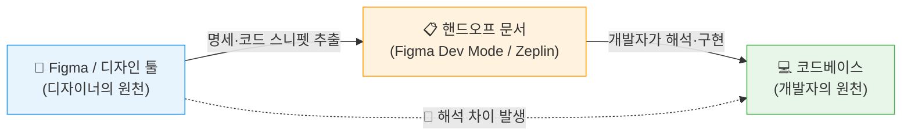
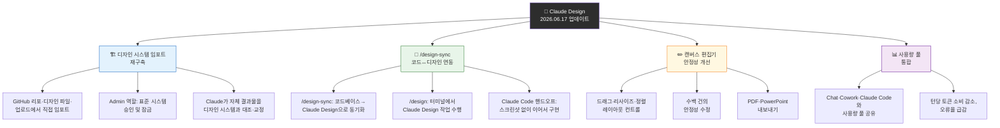
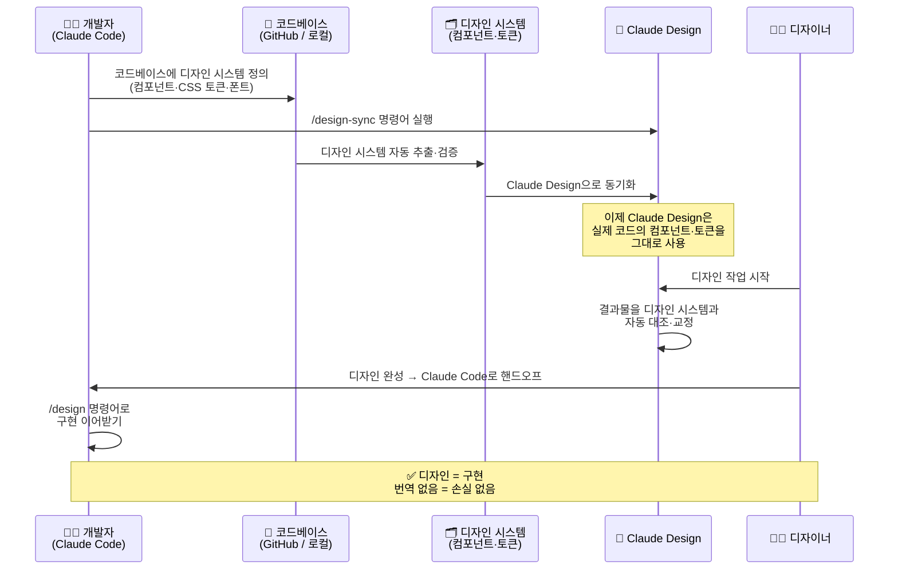
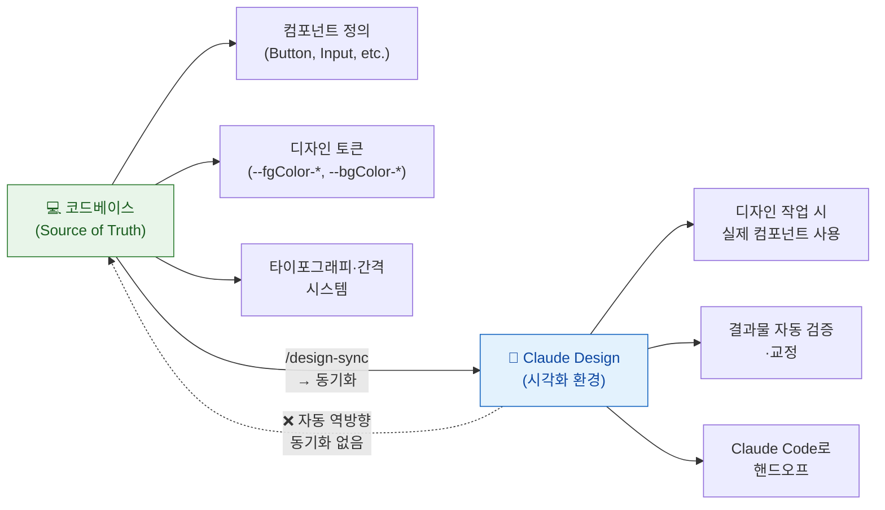
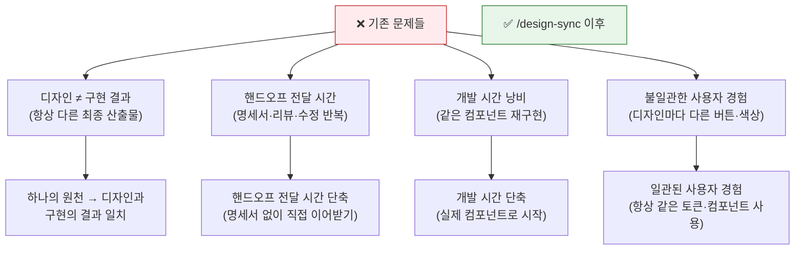
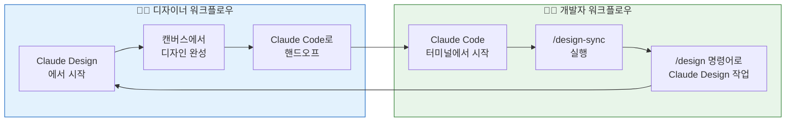
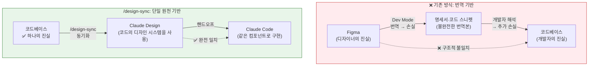

**출처**: Anthropic 공식 블로그 (2026년 6월 17일) + Threads [@builder.insight.eric](https://www.threads.com/@builder.insight.eric/post/DZvc6N5ljHk) 분석  
**작성일**: 2026년 6월 19일  
**주제**: Claude Design + Claude Code의 디자인-코드 동기화 메커니즘 심층 분석

---

## 1장. 들어가며: 수십 년의 질문

소프트웨어 개발 현장에는 수십 년 동안 사라지지 않는 불만이 하나 있다. PM은 기획서를 쓰고, 디자이너는 목업을 완성하고, 개발자는 코드를 짠다. 그런데 최종 결과물을 보면 꼭 이런 말이 나온다.

> "목업과 다르잖아요."

버튼의 색이 조금 다르고, 폰트 크기가 미묘하게 틀리고, 간격이 어긋나 있다. 개발자는 최선을 다했고, 디자이너도 명세를 충실히 전달했는데도 결과는 언제나 다소 어긋난다. 이 불일치가 반복되면 디자인 QA 라운드가 시작되고, 수정 요청이 오가고, 다시 구현이 반복된다. 이 사이클은 끝이 없다.

Anthropic의 클로드 디자인(Claude Design) 팀은 2026년 6월 17일 이 문제에 대한 새로운 접근을 발표했다. 바로 `/design-sync` 명령어다. 단순히 더 좋은 명세서를 만들거나, 더 정교한 핸드오프 도구를 도입하는 방식이 아니다. 문제의 구조 자체를 바꾸는 시도다.

---

## 2장. 문제의 역사: 왜 디자인과 구현은 항상 달랐나

### 핸드오프, 수십 년의 마찰

디자인과 엔지니어링 사이의 핸드오프(hand-off), 즉 "완성된 디자인을 개발팀에 넘기는 과정"은 소프트웨어 산업이 시작된 이래로 가장 끈질긴 마찰 지점 중 하나였다. 이 과정은 본질적으로 서로 다른 언어를 쓰는 두 집단 사이의 번역 작업이다.

디자이너는 픽셀, 색상 값, 타이포그래피 스케일, 컴포넌트 라이브러리라는 언어로 일한다. 개발자는 CSS 변수, 컴포넌트 코드, 토큰 체계, 번들러라는 언어로 일한다. 두 세계 사이에는 항상 번역이 필요했고, 번역이 있는 곳에는 필연적으로 손실이 생긴다.

### Figma Dev Mode와 Zeplin의 시도

이 격차를 메우려는 시도는 꾸준히 있었다. Figma는 Dev Mode를 통해 디자인 파일에서 CSS 코드 스니펫과 치수 명세를 자동으로 추출해주는 기능을 도입했다. Zeplin은 한발 더 나아가 개발자 친화적인 명세서 생성 도구로 큰 인기를 얻었다. 두 도구 모두 디자인과 개발 사이의 커뮤니케이션 비용을 줄이는 데 기여했다.

하지만 이 도구들이 해결한 것은 "커뮤니케이션의 효율"이었지, "구조적 불일치"가 아니었다. 디자인 파일에서 CSS를 추출해도, 그 CSS를 코드베이스에 반영하는 과정에서 항상 누군가의 해석이 개입한다. 버튼 모서리의 border-radius가 `8px`인지 `0.5rem`인지, primary 색상이 `#1B4FD8`인지 CSS 변수 `--color-primary`를 참조해야 하는지—이런 결정들이 쌓이면서 디자인과 구현 사이의 미묘한 간극이 생긴다.

이 간극을 메우는 것은 결국 사람의 몫이었다. 디자인 QA 담당자가 구현 결과를 목업과 픽셀 단위로 비교하고, 수정 요청을 티켓으로 올리고, 개발자가 다시 수정하는 사이클이 반복된다.

---

## 3장. 근본 원인 진단: 두 개의 원천(Source of Truth)

이 반복 사이클의 근본 원인은 간단하다. **디자인 툴과 코드베이스가 서로 다른 "진실의 원천(source of truth)"을 가지고 있기 때문이다.**

디자이너가 Figma에서 색상을 `#1B4FD8`로 정의하고, 개발자가 코드에서 `--color-blue-600`이라는 토큰을 사용한다면, 두 값이 같은 색이라도 그것은 두 개의 별도 정의다. Figma 파일이 업데이트되어도 코드의 토큰 값은 자동으로 바뀌지 않는다. 반대로 코드에서 토큰 값을 수정해도 Figma의 색상이 자동으로 반영되지 않는다.

두 원천이 독립적으로 존재하는 이상, 시간이 지나면 어긋나는 것은 시간문제다. 팀이 크고 작업 속도가 빠를수록 그 어긋남은 더 빠르고 넓게 퍼진다.

---

## 4장. 클로드 디자인이란 무엇인가

### 2026년 4월의 출시

`/design-sync`를 이해하려면 먼저 클로드 디자인 자체를 이해해야 한다. Anthropic은 2026년 4월, AI 기반 디자인 협업 도구인 Claude Design을 Anthropic Labs의 실험적 프로덕트로 출시했다. Claude Opus 4.7 모델을 기반으로 구동되며, Claude Pro·Max·Team·Enterprise 구독자 대상 리서치 프리뷰 형태로 공개되었다.

출시 목적은 명확했다. 경험 많은 디자이너도 마감 압박 속에서는 탐색할 수 있는 디자인 방향의 수가 제한되고, 디자인 배경이 없는 창업자나 PM·마케터는 아이디어를 시각화하는 것 자체가 어렵다. Claude Design은 이 두 그룹 모두에게 AI와 대화하듯 디자인을 만들 수 있는 환경을 제공한다.

출시 첫 주에만 100만 명 이상이 Claude Design을 사용했으며, 이후 쏟아진 사용자 피드백이 다음 업데이트 방향을 결정하는 데 핵심 역할을 했다.

### 초기 한계: 디자인 시스템의 부재

초기 클로드 디자인은 강력했지만 중요한 한계가 있었다. Claude가 생성하는 디자인은 Claude 자신의 미적 판단에 따른 것이었지, 사용자 조직의 디자인 시스템을 반영한 것이 아니었다. 즉, 만들어진 결과물은 세련되었지만 팀이 구축해온 브랜드 컬러, 폰트, 컴포넌트 라이브러리와는 별개의 것이었다. 구 버전의 Claude Design은 "스마트한 시각적 생성기"처럼 작동하여 Claude 자신의 취향으로 만들어냈지, 회사의 디자인 시스템에 맞춰 구현하는 것은 아니었다.

---

## 5장. 2026년 6월 17일: 클로드 디자인 대규모 업데이트

2026년 6월 17일, Anthropic은 Claude Design의 대규모 개편을 발표했다. 이 업데이트는 Claude Code와의 긴밀한 연동, 재구축된 디자인 시스템 임포트, 그리고 캔버스 직접 편집 기능을 도입한다. 이번 업데이트는 크게 네 가지 축으로 구성된다.

---

## 6장. `/design-sync`의 핵심 메커니즘

### 명령어의 의미

`/design-sync`를 사용하면 디자인 시스템을 불러올 수 있으며, Claude Design에서 만드는 모든 콘텐츠가 기존 컴포넌트를 기반으로 생성된다. 디자인이 소프트웨어로 전환될 준비가 되면 Claude Code로 핸드오프할 수 있으며, Claude Code는 스크린샷에서 다시 시작하는 것이 아니라 기존 작업을 이어받아 계속 진행한다.

이것이 이전과 결정적으로 다른 점이다. 과거에는 디자이너가 Figma에서 완성한 디자인을 개발자에게 전달할 때, 개발자는 그 결과물을 "보고" 코드로 "재현"해야 했다. 아무리 Figma Dev Mode가 CSS 수치를 뽑아줘도 결국 개발자가 손으로 코드를 짜는 과정에서 해석이 개입된다.

`/design-sync`는 이 흐름을 뒤집는다. 디자이너가 쓰는 디자인 환경(Claude Design)과 개발자가 쓰는 코딩 환경(Claude Code)이 **처음부터 동일한 컴포넌트, 동일한 토큰, 동일한 폰트 체계를 공유**하도록 만든다.

### 작동 방식 단계별 설명

Claude Code 터미널에서 `/design-sync`를 실행하면 로컬 코드베이스의 디자인 시스템이 Claude Design으로 임포트되어, 프로토타입이 실제 컴포넌트에서 시작하도록 보장한다.

### 기술적으로 이전과 무엇이 다른가

이 업데이트 이전에도 Claude Design에는 디자인 시스템을 직접 업로드하는 기능이 있었다. 하지만 그것은 파일을 "참고"하는 방식이었지, 코드베이스와 "연결"되는 방식이 아니었다. 디자이너가 업로드한 디자인 시스템 파일이 실제 코드의 컴포넌트 라이브러리와 정확히 일치한다는 보장이 없었고, 시간이 지나면서 코드가 업데이트되어도 업로드된 파일은 그 변화를 반영하지 못했다.

`/design-sync`는 코드베이스에서 직접 디자인 시스템을 추출하기 때문에, 코드가 진실의 원천이 된다. Claude Design이 생성한 결과물은 Claude가 자체적으로 디자인 시스템 준수 여부를 검사하고 자동 교정한 뒤 사용자에게 보여준다. 이것이 핵심이다. 결과물을 보기 전에 이미 교정이 끝나 있다.

---

## 7장. 단방향 동기화의 의미: 코드가 진실의 원천

### 코드 → 디자인 방향

중요한 사실을 명확히 해야 한다. `/design-sync`는 **코드 → 디자인 방향의 단방향 동기화**다. 디자이너가 Claude Design에서 컴포넌트를 수정해도 그 변경이 자동으로 코드베이스에 반영되지 않는다. 반대 방향(디자인 → 코드)의 자동 동기화는 제공되지 않는다.

이것이 의도적인 설계 결정이다. **코드가 진실의 원천(Source of Truth)**이며, 디자인 시스템의 업데이트는 코드 레포지토리에서 이루어져야 한다. 코드가 업데이트되면 다시 `/design-sync`를 실행해 Claude Design에 반영하는 방식으로 운영된다.

이 방향성은 실용적인 이유에서 비롯된다. 코드베이스는 버전 관리(Git), 코드 리뷰, 테스트 파이프라인이라는 엄격한 변경 관리 체계를 갖추고 있다. 디자인 툴에서 임의로 변경된 사항이 코드에 자동으로 반영된다면 이 체계가 무너진다. 디자인 시스템의 권위는 코드에 두고, Claude Design은 그 코드를 기반으로 더 빠르게 탐색하고 시각화하는 도구로 자리매김하는 것이다.

---

## 8장. `/design-sync`가 해결하는 네 가지

**하나의 원천, 디자인과 구현의 일치**: Claude Design으로 만든 목업과 Claude Code로 구현한 결과물이 동일한 컴포넌트와 토큰을 사용하기 때문에, 시각적으로 일치한다. 더 이상 "목업과 다르잖아요"라는 피드백이 나올 구조적 이유가 없어진다.

**핸드오프 전달 시간 단축**: 디자이너가 Claude Design에서 완성한 작업을 Claude Code로 넘길 때, 별도의 명세서나 Zeplin 링크, 개발자에게 설명하는 슬랙 메시지가 필요 없다. Claude Code는 스크린샷에서 다시 시작하는 것이 아니라 기존 작업을 이어받아 계속 진행한다.

**개발 시간 단축**: 개발자가 디자이너의 결과물을 보고 컴포넌트를 처음부터 재구현할 필요가 없다. Claude Design에서 사용된 컴포넌트가 이미 코드베이스에 존재하는 것들이기 때문이다.

**일관된 사용자 경험**: 팀 전체가 동일한 컴포넌트와 토큰을 기반으로 작업하므로, 새로운 화면을 추가할 때마다 브랜드 일관성이 자동으로 보장된다.

---

## 9장. 실제 검증 결과: 디자인과 구현의 완전 일치

Threads 포스트의 작성자인 @builder.insight.eric은 `/design-sync`를 직접 사용하여 실제로 일치 여부를 검증했다. "Lingo"라는 영어 학습 앱의 SignUp 화면을 Claude Design으로 디자인하고, 동일한 코드베이스를 기반으로 Claude Code에서 구현한 결과, 두 결과물이 시각적으로 완벽히 일치함을 확인했다.

구체적인 검증 내용은 다음 도표와 같다.

| 구분 | 항목 | 디자인 (SignUp.dc.html) | 구현 (SignUpSplit.jsx) | 결과 |
|------|------|------------------------|----------------------|------|
| **컴포넌트** | Button | ✅ 사용 | ✅ 동일 | ✅ 일치 |
| | Flash | ✅ 사용 | ✅ 동일 | ✅ 일치 |
| | TextInput | ✅ 사용 | ✅ 동일 | ✅ 일치 |
| | **소계** | 3개 | 3개 | **3/3** |
| **아이콘** | MortarBoardIcon | ✅ | ✅ | ✅ 일치 |
| | CheckCircleFillIcon | ✅ | ✅ | ✅ 일치 |
| | PeopleIcon | ✅ | ✅ | ✅ 일치 |
| | MailIcon | ✅ | ✅ | ✅ 일치 |
| | PersonIcon | ✅ | ✅ | ✅ 일치 |
| | LockIcon | ✅ | ✅ | ✅ 일치 |
| | AlertIcon | ✅ | ✅ | ✅ 일치 |
| | **소계** | 7개 | 7개 | **7/7** |

컬러 토큰 검증 결과도 다음과 같이 완전히 일치했다.

| 토큰 이름 | 용도 | 디자인 | 구현 | 결과 |
|-----------|------|--------|------|------|
| `--fgColor-default` | 본문/제목 글씨 | ✅ | ✅ | 일치 |
| `--fgColor-muted` | 보조 글씨 | ✅ | ✅ | 일치 |
| `--fgColor-accent` | 링크(Sign in 등) | ✅ | ✅ | 일치 |
| `--fgColor-danger` | 에러 글씨 | ✅ | ✅ | 일치 |
| `--bgColor-default` | 페이지 배경 | ✅ | ✅ | 일치 |
| `--bgColor-muted` | 강도바 트랙 | ✅ | ✅ | 일치 |

컴포넌트 3/3, 아이콘 7/7, 컬러 토큰 전체 일치. 이것은 수작업으로 핸드오프가 이루어졌다면 상상하기 어려운 수준의 일치율이다.

---

## 10장. 디자인 시스템 임포트 기능의 재구축

`/design-sync`와 함께 이번 업데이트에서 중요한 또 다른 변화는 디자인 시스템 임포트 기능의 재구축이다.

Anthropic은 디자인 시스템 임포트를 재구축하여 더 많은 유연성과 더 높은 정밀도를 제공한다. GitHub 리포지토리, 디자인 파일, 직접 업로드 등 여러 방법으로 하나 또는 여러 디자인 시스템을 불러올 수 있다. Claude는 사용자의 컴포넌트로 빌드하고, 결과물을 디자인 시스템과 대조한 뒤, 사용자가 보기 전에 교정을 수행한다.

이 "보기 전 교정" 메커니즘이 매우 중요하다. 기존에는 AI가 생성한 결과물을 사람이 디자인 시스템과 비교·검토했다. 이제는 Claude 스스로가 자신이 생성한 결과물이 디자인 시스템을 준수하는지 검사하고, 문제가 있으면 스스로 수정한 뒤에야 사용자에게 보여준다. 즉, 사용자가 보는 결과물은 이미 디자인 시스템 검증을 통과한 것이다.

Claude Design은 GitHub 리포지토리, 디자인 파일, 로컬 코드베이스에서 디자인 명세를 직접 분석·추출하며, 출력 전 자동 검증이 수행된다.

팀 규모가 큰 조직을 위해서는 새로운 Admin 역할도 도입되었다. 어드민이 표준 디자인 시스템 하나를 승인하고 편집을 잠글 수 있어, 마케팅·제품·디자인 팀이 AI가 생성한 작업물을 승인된 타이포그래피·색상·간격·컴포넌트 규칙에 맞게 유지할 수 있다.

---

## 11장. Claude Code와의 양방향 워크플로우

이번 업데이트의 또 다른 축은 Claude Design과 Claude Code 사이의 워크플로우가 어느 방향에서든 시작될 수 있다는 점이다.

Claude Code와 Claude Design이 이제 양방향으로 동기화된다. `/design-sync`를 실행해 디자인 시스템을 리포지토리에 불러와 실제 컴포넌트를 기반으로 빌드하거나, 빌드한 결과를 Claude Design으로 밀어넣어 캔버스에서 계속 편집할 수 있다.

개발자는 `/design` 명령어를 사용해 터미널을 벗어나지 않고 Claude Design 프로젝트를 생성·편집·가져오기·내보내기할 수 있다.

이는 실제 협업 패턴에서 중요한 의미를 갖는다. 디자이너가 Claude Design에서 화면을 완성하면 개발자가 Claude Code에서 그것을 이어받아 구현한다. 반대로 개발자가 먼저 코드베이스에서 프로토타입을 만들고, `/design` 명령어로 Claude Design 환경에 올려 디자이너가 시각적으로 다듬을 수도 있다. 어느 방향에서 시작하든 두 환경이 동일한 기반 위에서 작동한다.

---

## 12장. 편집기 개선과 안정성

이번 업데이트에서 Claude Design의 편집기 자체도 대폭 개선되었다.

새 편집기는 디자인의 모든 요소에 대한 직접적이고 세밀한 제어를 제공한다. 새롭고 풍부한 레이아웃 컨트롤을 통해 요소를 드래그·리사이즈·정렬할 수 있다. 수백 건의 안정성 수정이 편집기를 실제 업무에서 견딜 수 있게 만들어준다.

이전 버전의 Claude Design은 화려하지만 일상적인 업무 도구로 쓰기엔 불안정하다는 피드백이 많았다. 복잡한 레이아웃을 다루거나 세밀한 수정을 가할 때 예상치 못한 동작이 발생하는 경우가 있었다. 이번 수백 건의 안정성 수정은 Claude Design을 "한 번 써보는 도구"에서 "매일 쓰는 도구"로 격상시키려는 노력의 일환이다.

---

## 13장. 사용량 풀 통합과 토큰 효율화

Claude Design은 이제 채팅, Claude Cowork, Claude Code와 사용량 한도를 공유하므로, 대부분의 사람들이 훨씬 더 많은 여유를 갖게 된다. 평균 턴당 토큰 소비가 동일한 결과를 달성하기 위해 줄어들었고, 오류도 급격히 감소했다.

이는 실용적인 관점에서 중요한 변화다. 이전에는 Claude Design이 별도의 사용량 한도를 소진했기 때문에, 헤비 유저들이 일찍 한도에 도달하는 문제가 있었다. 이제 Chat·Claude Cowork·Claude Code·Claude Design이 하나의 통합 사용량 풀을 공유하면서, 실질적으로 더 많이 사용할 수 있게 되었다.

---

## 14장. 에코시스템 확장: 파트너 통합

이번 업데이트의 또 다른 중요한 측면은 Claude Design이 외부 도구 생태계와 연결되는 커넥터가 대폭 확장된 것이다.

PDF와 PowerPoint로의 안정적인 내보내기뿐 아니라 이미 사용 중인 앱으로 작업물을 보낼 수 있는데, 커넥터 목록에는 이제 Adobe, Base44, Canva, Gamma, Lovable, Miro, Replit, Vercel, Wix가 포함되며 더 많은 목적지가 곧 추가될 예정이다.

각 파트너의 의미를 살펴보면 Anthropic의 전략적 방향이 보인다.

- **Replit, Lovable, Vercel**: Claude Design에서 만든 디자인을 실제 배포 가능한 앱으로 즉시 발전시킬 수 있는 "아이디어에서 프로덕션까지" 파이프라인
- **Canva, Adobe**: 마케터와 콘텐츠 팀이 Claude Design에서 시작한 작업을 소셜 포스트, 프레젠테이션, 이메일 캠페인으로 즉시 확장
- **Miro**: 아이디어 단계에서 팀 협업 캔버스로 바로 이동
- **Gamma**: 슬라이드 덱 자동화
- **Wix**: 웹 프로덕션으로의 직접 연결

이 파트너 목록의 폭은 의도적인 포지셔닝 전략을 드러낸다. Anthropic은 Claude Design을 작업이 완성되는 곳이 아니라, 작업이 시작되는 곳으로 구축하고 있다.

---

## 15장. Anthropic의 더 큰 그림: 디자인 시스템이 브릿지

Anthropic의 주장은 이렇다. 동일한 AI 시스템이 디자인과 코딩 양쪽을 담당하고, 두 모드가 동일한 기반 컴포넌트 라이브러리를 공유한다면, 그 격차는 사라진다. 이것은 디자인-코드 문제가 실제로는 더 나은 명세 형식이나 더 스마트한 핸드오프 도구에 관한 것이 아니었다는 주장이다. 문제는 두 명의 서로 다른 사람(또는 두 개의 다른 도구)이 동일한 의도를 각각 해석하고 있었다는 것이다. 양쪽 워크플로우에서 동작하는 단일 AI 시스템은 해석할 필요가 없다. 그냥 이어서 진행하면 된다.

이 관점은 매우 중요하다. Figma Dev Mode나 Zeplin이 실패한 것이 아니다. 그것들은 "더 나은 번역기"였을 뿐이다. 번역기가 아무리 좋아도, 번역이 필요한 두 개의 독립적인 원천이 존재하는 한 손실은 피할 수 없다.

`/design-sync`는 번역기를 개선하는 것이 아니다. 번역의 필요성 자체를 없애는 구조적 접근이다.

---

## 16장. 이용 가능 범위와 시작 방법

Claude Design은 Claude Pro·Max·Team·Enterprise 요금제에서 베타로 제공되며 구독에 포함된다. Enterprise 사용자의 경우 기본적으로 꺼져 있으며, 어드민이 조직 설정에서 활성화할 수 있고, 작업은 조직 내에서만 공유 가능하다. Claude.ai/design 또는 데스크톱 앱의 사이드바에서 찾을 수 있다.

시작하는 방법은 비교적 간단하다.

1. `claude.ai/design` 또는 Claude 데스크톱 앱 사이드바에서 Claude Design에 접속한다.
2. GitHub 리포지토리, 디자인 파일, 또는 직접 업로드 방식으로 기존 디자인 시스템을 불러온다. 아직 디자인 시스템이 없다면 Claude에게 세 가지 방향을 제안해달라고 요청한 뒤 마음에 드는 것을 발전시킨다.
3. Claude Code 터미널에서 `/design-sync` 명령어를 실행해 코드베이스의 디자인 시스템을 Claude Design과 동기화한다.
4. Claude Design에서 디자인 작업을 시작하면, 모든 컴포넌트와 토큰이 자동으로 코드베이스와 일치한 상태로 작동한다.
5. 디자인이 완성되면 Claude Code로 핸드오프해 구현을 이어받는다.

---

## 17장. 한계와 주의점

`/design-sync`가 강력한 해결책이지만, 몇 가지 중요한 한계를 이해해야 한다.

**단방향 동기화의 운영 부담**: 코드베이스에서 디자인 시스템이 업데이트될 때마다 `/design-sync`를 다시 실행해야 한다. 자동 실시간 동기화가 아니기 때문에, 팀 내에서 "코드가 업데이트되면 디자인 싱크를 재실행한다"는 워크플로우 합의가 필요하다.

**코드가 진실의 원천이어야 한다**: 이 접근 방식은 디자인 시스템이 코드베이스에 잘 정의되어 있을 때 가장 효과적이다. 코드에 체계적인 디자인 토큰과 컴포넌트 라이브러리가 갖추어지지 않은 팀은 먼저 이 기반을 마련해야 한다.

**베타 상태**: 이 업데이트는 유료 Pro 및 Max 구독자 대상 베타로 롤아웃되고 있다. 아직 베타이므로 모든 기능이 완전히 안정화되지 않았을 수 있다.

---

## 18장. 결론: 구조가 바뀌면 결과가 바뀐다

"목업과 다르잖아요"라는 말은 디자이너와 개발자 누군가의 실수가 아니었다. 두 개의 독립적인 원천이 각자의 방식으로 진실을 정의하고, 그 사이를 사람이 번역해야 하는 구조적 문제였다.

Figma Dev Mode와 Zeplin은 번역의 품질을 높이는 시도였다. `/design-sync`는 번역 자체를 없애는 시도다. 코드가 유일한 진실의 원천이 되고, Claude Design과 Claude Code가 그 원천 위에서 동일한 컴포넌트와 토큰을 공유하며 작동한다.

Claude Design의 변화는 Claude를 단순히 사람들이 대화하는 어시스턴트가 아니라, 실제로 일이 일어나는 시스템 속에 내장된 일꾼으로 만들려는 회사 전반의 전략의 일환이다.

이 관점에서 `/design-sync`는 단순한 기능 하나가 아니다. 디자인과 개발이라는 두 세계의 경계를 AI가 어떻게 해소하는지를 보여주는 사례다. 동일한 AI가 양쪽을 이해하고, 양쪽이 동일한 언어로 소통할 때, 번역의 손실은 사라진다.

"목업과 다르잖아요"라는 말이 역사 속으로 사라질 수 있는 구조가, 이제 현실적인 형태로 등장하고 있다.

---

## 참고 자료

- Anthropic 공식 블로그: [Claude Design now stays on brand for daily work](https://claude.com/blog/claude-design-stays-on-brand-for-daily-work) (2026.06.17)
- Anthropic 공식 발표: [Introducing Claude Design by Anthropic Labs](https://www.anthropic.com/news/claude-design-anthropic-labs) (2026.04.17)
- VentureBeat: [Anthropic ships major Claude Design overhaul with design system imports, code round-trips, and a fix for its token-burning problem](https://venturebeat.com/technology/anthropic-ships-major-claude-design-overhaul-with-design-system-imports-code-round-trips-and-a-fix-for-its-token-burning-problem) (2026.06.17)
- TechRepublic: [Anthropic Adds Brand Controls, Code Sync to Claude Design](https://www.techrepublic.com/article/news-anthropic-claude-design-overhaul-enterprise-teams/) (2026.06.17)
- Claude 도움말 센터: [Get started with Claude Design](https://support.claude.com/en/articles/14604416-get-started-with-claude-design)
- Threads 원본 포스트: [@builder.insight.eric](https://www.threads.com/@builder.insight.eric/post/DZvc6N5ljHk)

---

*본 문서는 Anthropic 공식 발표 및 검증된 보도 자료를 기반으로 작성되었습니다. 인용된 모든 기술적 사실은 공식 출처를 통해 확인되었습니다.*
