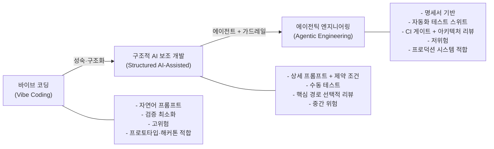
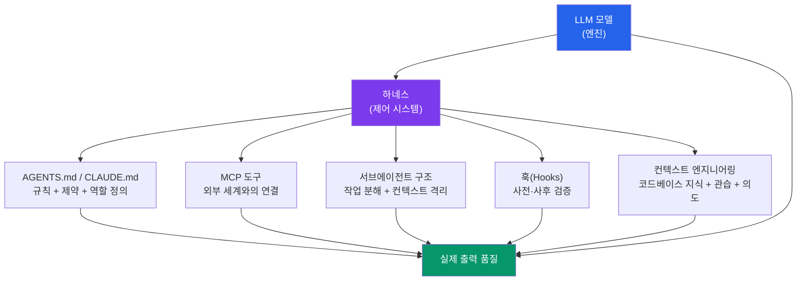
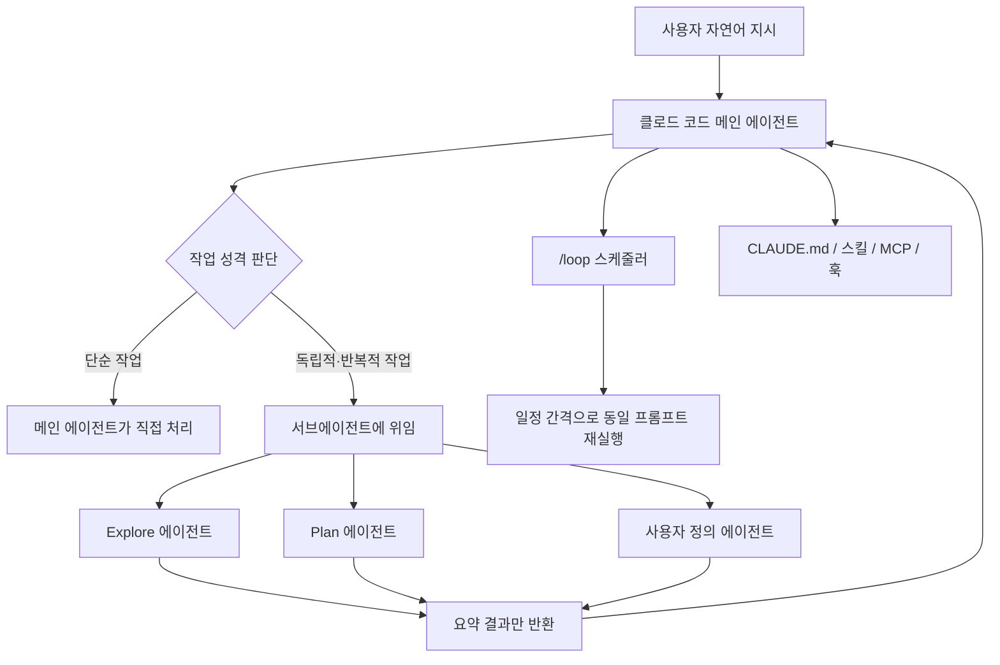

> 
> https://www.threads.com/@ai_ai_ai_news/post/DZxJ0WHAWjB
> 
> ai 시대의 인재가 되는법 
> 
> 요새 뭐 ai 자격증이니, 프롬프트 엔지리어닝이니, 옵시디언 세컨, 100개 에이전트니 ai 사기꾼들이 넘쳐나는것 같습니다.
> 
> ai 를 가지고 어떤 응용을 하던 엔진은 모델에서 나옵니다. 
> 
> 그래서 ai 시대에 대비하기 위한 조언은 never stop 바이브코딩입니다
> 
> 어떤 툴이 새로나오던 터미널 환경에서 모델과 직접 상호작용 하는것보다 좋은 방법은 없습니다. 이미 클로드 코드 내에서 이미 서브에이전트가 하네스 안에서 작동을 하고 
/loop 무한 자동화도 시킬수 있습니다. 토큰만 충분하다면 ㅎㅎ
> 
> 아마 미래에 ai 기술이 더 발전하면 오픈소스 코딩 모델들이 더 가벼워지고 개인 pc 에서 무한으로 돌릴수 있는 시대가 오겠죠. 그럼 그때 허깅페이스에서 새로운 모델들을 도입하셔도 되고 
> 
> 지금 6/19 현시점에서 ai와 가까워지는 방법은 클로드 코드, 코덱스 (안티그래비티x) 를 통해서 계속 상호작용하는 법 밖에 없습니다.
> 

---

## 들어가며

2026년 6월 19일, 스레드(@ai_ai_ai_news) 게시물 하나가 한국 AI 커뮤니티 사이에서 공유됐다. "AI 시대의 인재가 되는 법"이라는 제목을 달고, AI 자격증이나 프롬프트 엔지니어링 강의 같은 콘텐츠들을 비판하면서 "never stop 바이브코딩"이라는 결론을 내리는 짧은 글이었다. 이 문서는 두 가지 질문을 중심으로 그 게시물을 깊이 들여다본다. 첫째, 제목과 내용이 실제로 어울리는가. 둘째, "never stop 바이브코딩"이라는 주제를 충분히 설명하려면 어떤 맥락이 더 필요한가.

---

## 1부. 제목과 내용의 적합성 검토

### [`"AI 시대의 인재가 되는 법" — 스레드 게시물 해설과 팩트체크`](#ai-시대의-인재가-되는-법--스레드-게시물-해설과-팩트체크) 제목이 약속하는 것

"AI 시대의 인재가 되는 법"이라는 제목은 꽤 넓은 범위를 약속한다. 독자는 자연스럽게 어떤 역량을 갖춰야 하는지, 어떤 분야에서 어떤 방향으로 커리어를 설계해야 하는지에 대한 전방위적인 가이드를 기대한다. "인재(人才)"라는 단어 자체가 기술적 숙련도뿐 아니라 사고 방식, 태도, 적응력을 아우르는 포괄적 개념이기 때문이다.

### 실제 내용이 다루는 것

그런데 게시물의 본문은 빠르게 특정 방향으로 수렴한다. "AI 엔진은 모델에서 나온다"는 전제 아래, 터미널 환경에서 모델과 직접 상호작용하는 것—구체적으로는 클로드 코드와 코덱스를 활용한 에이전틱 코딩—이 핵심이라는 주장이다. 즉 실제 내용은 "에이전틱 코딩 도구를 실천적으로 활용하는 개발자가 AI 시대에 가장 유리한 위치에 있다"는, 상대적으로 좁은 범위의 주장이다.

### 적합성 판단

제목과 내용 사이에는 분명히 간극이 존재한다. 제목은 넓고, 내용은 좁다. 이 간극이 문제냐 하면 반드시 그렇다고 볼 수는 없다. 글쓴이의 논리 구조를 따라가면, "어떤 도구가 와도 모델과 직접 상호작용하는 실천력이 핵심이다"는 주장이 결국 AI 시대 인재의 본질적인 조건이라는 논증으로 이어지기 때문이다. 즉 제목이 틀렸다기보다, 제목의 범위에 비해 논증이 충분히 전개되지 않은 것에 가깝다. 좀 더 솔직하게는 제목이 "에이전틱 코딩을 멈추지 않는 것이 AI 시대 인재의 조건이다"라고 썼다면 내용과 완벽하게 일치했을 것이다.

이 문서는 그 간극을 메우는 방향으로, "never stop 바이브코딩"이 왜 AI 시대 인재론과 연결되는 주장인지를 최신 데이터와 함께 풀어낸다.

---

## 2부. "바이브 코딩"의 탄생과 진화 — 개념의 짧고 빠른 역사

### 첫 번째 순간: 2025년 2월 카르파티의 트윗

"바이브 코딩(vibe coding)"이라는 표현은 2025년 2월, 전 OpenAI 연구 책임자이자 현재 개인 연구자로 활동 중인 안드레이 카르파티(Andrej Karpathy)가 X(구 트위터)에 올린 짧은 트윗에서 시작됐다. <cite index="10-1">프롬프트 중심의 의도 우선 AI 코딩 방식, 즉 개발자가 원하는 것을 자연어로 설명하고 생성된 코드를 한 줄 한 줄 읽지 않고 받아들이는 방식을 가리키며, 카르파티가 2025년 2월에 처음 만들어낸 말이다.</cite> 그는 이것을 "완전히 바이브에 올라타고, 지수 함수를 끌어안으며, 코드가 존재한다는 사실 자체를 잊어버리는 것"이라고 표현했다. 이 트윗은 많은 개발자들이 이미 하고 있던 작업 방식에 이름을 붙여줬다는 점에서 빠르게 퍼져나갔다.

바이브 코딩이 유행어가 된 배경에는 현실적인 맥락이 있다. <cite index="3-1">"바이브 코딩"은 2025년 초 어휘에 등장했다. 원하는 것을 자연어로 설명하고, 출력 결과를 그대로 받아들이고, 무언가 깨지면 에러 메시지를 다시 붙여넣고, 반복하는 방식이다.</cite> 이 방식은 프로토타입을 빠르게 만들어야 할 때, 또는 코딩 경험이 없는 사람이 처음 소프트웨어를 만들 때 특히 강력한 도구로 작동했다.

### 두 번째 순간: 2026년 2월 카르파티의 수정

그러나 바이브 코딩이라는 표현은 오래 버티지 못했다. <cite index="6-1">2026년 2월 4일, 카르파티는 수정 발언을 내놨다. 그는 이 실천이 성숙해졌으며 더 나은 이름이 필요하다고 했고, 새로운 표현으로 "에이전틱 엔지니어링(agentic engineering)"을 제안했다. "'에이전틱'이라는 것은 이제 기본값이 된 방식—99%의 경우 코드를 직접 작성하는 것이 아니라 코드를 작성하는 에이전트를 오케스트레이션하고 그 감독 역할을 하는 것—을 가리키며, '엔지니어링'이라는 단어는 여기에 예술과 과학, 그리고 전문성이 존재한다는 점을 강조한다."</cite>

<cite index="1-1">바이브 코딩은 업계 분석가들이 "바이브 엔지니어링"으로의 전환을 예측했을 만큼 빠르게 발전했다. Forrester의 디에고 로 주디체는 "기업들은 강력한 엔지니어링 제품화 프로세스가 뒤따르는 경우에만 바이브 코딩을 채택할 수 있다"고 말했다.</cite>

### 스펙트럼으로서의 바이브 코딩

중요한 것은 바이브 코딩과 에이전틱 엔지니어링이 서로 대립하는 개념이 아니라는 점이다. <cite index="9-1">2025년 2월의 "바이브 코딩"과 2026년 초에 카르파티가 추가한 "에이전틱 엔지니어링"은 같은 연속선의 두 끝을 가리킨다. 차별점은 AI를 사용하느냐 여부가 아니다. 출력 결과를 어느 정도의 구조, 검증, 그리고 인간의 판단으로 둘러싸느냐의 차이다. 한쪽 끝에는 가벼운 자연어 프롬프트, "잘 작동하는 것 같으면 됐다"는 수준의 정확성, 최소한의 리뷰가 있다. 이것은 주말 프로토타입이나 해커톤에는 완전히 적절하다. 다른 쪽 끝에는 정식 명세서, 자동화된 테스트 슈트와 평가, CI 게이트, 그리고 아키텍처 리뷰가 있다.</cite>

<cite index="4-1">지금까지 나온 가장 명쾌한 정리는 이것이다. 바이브 코딩은 초보자의 진입 장벽을 낮추고, 에이전틱 엔지니어링은 전문가의 천장을 높인다.</cite>

---

## 3부. "never stop 바이브코딩"이 진짜 말하는 것

### 단순한 도구 습관이 아닌 태도

게시물의 핵심 문장인 "never stop 바이브코딩"은 표면적으로는 특정 도구(클로드 코드, 코덱스)를 계속 쓰라는 말처럼 들린다. 그러나 이 문장의 진짜 의미는 더 깊다. 어떤 새로운 모델, 어떤 새로운 하네스, 어떤 새로운 도구가 등장하더라도 모델과 직접 상호작용하는 실천을 멈추지 말라는 태도의 선언이다. 즉 "바이브 코딩을 계속하라"는 말은 곧 "에이전트와 손으로 씨름하는 것을 멈추지 말라"는 뜻으로 읽어야 한다.

이것이 왜 중요한가. <cite index="3-1">이 분야가 성숙하면서 한 가지 통찰이 반복해서 떠오른다. 출력 품질은 영리한 프롬프트에 달린 것이 훨씬 덜하고, 에이전트에게 제공하는 컨텍스트의 품질에 훨씬 더 많이 달려 있다는 것이다. 에이전트에게 코드베이스, 관습, 의도에 대한 풍부하고 구조화된 정보를 공급하는 규율은 이제 이름을 갖게 됐다. "컨텍스트 엔지니어링(context engineering)"이라고 부르며, 이것이 이 시대의 핵심 역량이다.</cite>

컨텍스트 엔지니어링은 책상에서 이론으로 배울 수 없다. 실제로 에이전트를 돌려보고, 에이전트가 어떻게 실패하는지를 경험하고, 어떤 컨텍스트를 추가했을 때 결과가 달라지는지를 몸으로 익혀야만 쌓이는 종류의 역량이다. "바이브 코딩을 멈추지 말라"는 조언은 결국 이 경험의 축적을 멈추지 말라는 뜻이다.

### 에이전틱 엔지니어링의 핵심은 오케스트레이션이다

<cite index="6-1">에이전틱 엔지니어링은 개발자를 프롬프트 DJ에서 엔지니어링 디렉터로 위치시킨다. 개발자는 아키텍처를, 품질 기준을, 그리고 출력의 정확성을 책임진다. 에이전트는 기계적인 구현 작업을 담당한다.</cite>

<cite index="3-1">오케스트레이션을 잘하는 것은 문법 능숙도와는 다른 스킬 세트를 요구한다. 명세 작성, 분해, 평가, 그리고 시스템 설계다.</cite> 이 스킬들은 모두 실제로 에이전트를 돌려보면서 직접 의도를 전달하고, 에이전트가 어떻게 해석하고, 어떻게 실패하는지를 반복 경험해야 형성된다.

### "80% 문제"와 마지막 20%

<cite index="9-1">에이전트는 어떤 기능의 약 80% 정도를 신뢰성 있게 생산한다. 그러나 나머지 20%—엣지 케이스, 에러 핸들링, 통합 지점, 미묘한 정확성—는 여전히 인간의 판단이 필요하다. 더 나쁜 것은 에러의 성격이 변했다는 점이다. 컴파일러가 잡아주는 명백한 문법 실수가 아니라, 겉으로 보기에는 맞아 보이고 기본 테스트도 통과하는 개념적 실수들이다.</cite>

이 80/20 분할을 직접 경험해본 사람과 그렇지 않은 사람 사이의 간극은 시간이 갈수록 벌어진다. "바이브 코딩을 멈추지 말라"는 조언은 이 경험의 누적을 멈추지 말라는 말이기도 하다.

---

## 4부. 수치로 보는 AI 코딩 도구의 현실 (2026 기준)

### 도입은 폭발적이지만, 신뢰는 낮다

<cite index="7-1">2026년 현재 AI 코딩 도구의 일일 사용률은 미국 개발자 기준으로 92%에 달하며, 시장 규모는 47억 달러에 이른다. 그러나 같은 조사에서 이 도구들을 실제로 신뢰한다고 응답한 비율은 29%에 불과하다. 도입은 모든 측면에서 가속화되고 있는 반면, 품질·보안·신뢰 관련 지표는 전부 하락하고 있다. 이 패턴은 거버넌스 공백을 가리킨다.</cite>

<cite index="9-1">2026년 초 현재 전문 개발자의 약 85%가 정기적으로 AI 코딩 에이전트를 사용하며, 새로 작성되는 코드의 약 41%가 AI가 생성한 것으로 추정된다. 몇 주가 걸리던 구현이 몇 시간 만에 끝난다. 그러나 그 앞뒤에 필요한 작업—문제를 이해하고, 아키텍처를 선택하고, 나온 결과물이 맞는지 검증하는 것—은 여전히 인간 속도로 진행된다. 병목이 이동했다. 얼마나 빠르게 타이핑하느냐가 아니라, 문제를 얼마나 잘 명세화하고 출력 결과를 얼마나 엄밀하게 검증하느냐로.</cite>

### 생산성 향상은 실재한다

<cite index="7-1">MIT의 무작위 대조 실험(4,867명의 개발자 대상)에서 AI 코딩 도구 사용 시 완료된 작업이 26% 증가했고, 코드 커밋이 13.55% 늘었으며, 성공적인 빌드는 38.38% 더 많아졌다.</cite>

<cite index="7-1">McKinsey의 2026년 2월 연구에서는 150개 기업, 4,500명의 개발자를 분석한 결과 일상적인 코딩 작업 시간이 46% 감소했고, 개발자 1인당 주당 3.6시간이 절약되는 것으로 나타났다.</cite>

### 그러나 품질 위기도 실재한다

<cite index="7-1">AI 코딩 도구 도입 이후 버그 발생률이 41% 증가했다는 데이터도 있다. 기업들이 도구를 사용하는 방식을 통제하는 리뷰 프로세스—테스트 게이트, 아키텍처 검토—를 구축하는 속도보다 도구 도입 속도가 훨씬 빠른 것이 원인이다.</cite>

이 데이터들이 시사하는 것은 명확하다. AI 코딩 도구를 쓰는 것만으로는 충분하지 않다. 어떻게 쓰느냐, 그리고 그것을 어떤 구조 안에 배치하느냐가 결과를 가른다.

| 지표 | 수치 | 출처 |
|---|---|---|
| 전문 개발자의 AI 도구 일일 사용률 | 92% | Keyhole Software / GuardMint Q1 2026 |
| AI 도구를 신뢰한다는 응답 비율 | 29% | 동 조사 |
| 새로 작성된 코드 중 AI 생성 비율 | 41% | Stack Overflow 2025 / GitHub Octoverse |
| AI 도입 후 버그 발생률 증가 | 41% | GuardMint Q1 2026 |
| 개발자 1인당 주당 절약 시간 | 3.6시간 | McKinsey, 2026년 2월 |
| MIT 실험에서 작업 완료율 증가 | 26% | MIT RCT, 4,867명 |

---

## 5부. 모델은 상품화된다 — 차별점은 하네스에서 나온다

### 하네스 엔지니어링의 등장 배경

<cite index="18-1">이 개념에 처음 이름을 붙인 사람은 HashiCorp 공동창업자 미첼 하시모토(Mitchell Hashimoto)다. 그는 2026년 2월 초 블로그에서 하네스 엔지니어링을 이렇게 정의했다. "에이전트가 실수할 때마다, 그 실수가 다시는 발생하지 않도록 엔지니어링하는 것."</cite> 그의 터미널 에뮬레이터 Ghostty의 AGENTS.md 파일에는 에이전트가 과거에 저질렀던 실수들을 방지하는 규칙이 한 줄씩 쌓여 있다. 단순히 "다음에는 잘해"라고 프롬프트를 고치는 것이 아니라, 구조적으로 재발을 막는 시스템을 만드는 것이다.

<cite index="1-1">Caylent의 한 실무자는 이렇게 표현했다. "모델이 아닌 에이전틱 하네스가 차별점이다. 하네스를 엔지니어링하지 않으면 복리 레버리지를 얻는 것이 아니라 복리 인지 부채를 얻게 된다."</cite>

<cite index="13-1">학계에서도 관련 연구가 이어지고 있다. LLM 시스템의 성능이 모델 자체보다 주변 하네스 코드에 더 크게 좌우된다는 실증 결과가 나오고 있으며, 프롬프트 인젝션 공격의 평균 성공률이 84.30%에 달한다는 보안 보고도 제출됐다. 하네스 엔지니어링은 2026년에 들어서야 독립적인 엔지니어링 분야로 비로소 조명받기 시작했다.</cite>

### 현실 사례 1: OpenAI Codex 팀의 실험

<cite index="20-1">2026년 2월, OpenAI Codex 팀이 흥미로운 실험 결과를 공개했다. 엔지니어 3명이 5개월간 코드를 단 한 줄도 직접 타이핑하지 않고, 약 100만 줄 규모의 프로덕션 애플리케이션을 만들어냈다는 것이다. 1,500개의 PR을 머지하면서 엔지니어 1인당 하루 평균 3.5개의 PR을 처리했고, 수작업 대비 약 10분의 1 시간에 완성했다. 핵심은 더 똑똑한 모델을 쓴 것이 아니었다. 이들이 집중한 것은 에이전트가 실수하지 않도록 감싸는 시스템, 즉 하네스를 설계하는 일이었다.</cite>

### 현실 사례 2: LangChain의 Terminal Bench 결과

<cite index="20-1">비슷한 시기, LangChain은 코딩 에이전트 벤치마크 Terminal Bench 2.0에서 모델을 바꾸지 않고 하네스만 개선해 30위권에서 5위권으로 25단계를 뛰어올랐다. 점수로는 52.8에서 66.5로, 13.7포인트 상승이다.</cite>

이 두 사례는 게시물의 핵심 주장—"AI를 가지고 어떤 응용을 하던 엔진은 모델에서 나온다"—과 묘하게 긴장 관계를 이룬다. 엔진이 모델에서 나오는 것은 맞지만, 실제 성능 차이를 만드는 것은 모델보다 하네스라는 것을 이 사례들이 보여주기 때문이다. 더 정확하게는 이렇게 말할 수 있다. 엔진은 모델이지만, 그 엔진이 얼마나 잘 돌아가느냐는 하네스가 결정한다.

### "인지 부채"라는 새로운 위협

<cite index="6-1">2026년이 되면서 "인지 부채(cognitive debt)"—AI 상호작용의 부실한 관리, 컨텍스트 소실, 그리고 불안정한 에이전트 동작이 누적되는 비용—가 통제되지 않은 에이전틱 코딩의 주된 엔지니어링 리스크로 부상했다.</cite> 기술 부채가 코드베이스의 구조적 문제라면, 인지 부채는 에이전트에게 무엇을 하라고 말했는지, 그것이 어떻게 실행됐는지, 그 결과가 맞는지에 대한 추적 가능성을 잃어버리는 문제다. "바이브 코딩을 멈추지 말라"는 조언은 동시에 인지 부채를 쌓지 않도록 에이전트와의 상호작용을 의식적으로 관리하는 습관을 기르라는 말이기도 하다.

---

## 6부. 에이전틱 엔지니어링 시대의 실질 역량 체계

### 사라지는 역량과 중요해지는 역량

<cite index="6-1">저하되는 것은 저수준 구현 능숙도다. 카르파티 자신도 에이전트가 이제 그 작업들을 처리하기 때문에 자신의 수동 코딩 능력이 떨어지고 있다는 점을 인정했다. 이것이 본질적으로 나쁜 것은 아니다—치과 의사들은 마취 이전 시대를 그리워하지 않는다—하지만 인정할 가치가 있는 진짜 트레이드오프다.</cite>

반면 중요성이 높아지는 역량들이 있다. <cite index="12-1">AI 모델의 성능은 빠르게 상향 평준화되고 있다. 앞으로 기업의 경쟁력은 단순히 "누가 더 좋은 모델을 쓰느냐"보다, 누가 모델을 더 안정적으로 통제하고 업무에 연결할 수 있는 시스템을 갖췄느냐에서 갈릴 가능성이 크다. 개발자의 역할도 함께 변하고 있다. 코드를 직접 타이핑하는 시간은 줄어들고, AI 에이전트가 일할 수 있는 환경을 설계하고, 결과를 검증하고, 운영 상태를 감시하는 시간이 늘어나고 있다.</cite>

### 새로운 역량의 네 가지 축

에이전틱 엔지니어링 시대에 부상하는 역량은 크게 네 가지로 정리할 수 있다.

첫째는 **명세 작성 능력**이다. AI에게 "잘 알아서 해줘"가 아니라, 무엇을 원하는지, 어떤 제약이 있는지, 어떤 경우가 성공이고 어떤 경우가 실패인지를 명확히 문서화하는 능력이다. 이것이 없으면 에이전트는 의도를 짐작해서 움직이며, 그 짐작이 틀렸을 때 수정 비용이 매우 커진다.

둘째는 **작업 분해 능력**이다. 복잡한 목표를 에이전트가 독립적으로 처리할 수 있는 단위로 잘게 나누는 능력이다. 분해가 잘 안 된 작업을 에이전트에게 주면, 에이전트는 중간에 잘못된 가정을 쌓아 올리며 돌이키기 어려운 방향으로 흘러간다.

셋째는 **평가(eval) 설계 능력**이다. <cite index="3-1">테스트는 결정론적인 부분—이 입력이 저 출력을 만든다—을 담당한다. 평가(evals)는 비결정론적인 부분을 담당한다. 에이전트가 합리적인 경로를 택했는지, 올바른 도구를 선택했는지, 품질 기준을 충족했는지. 둘 다 없으면 아무리 프롬프트가 정교해 보여도 여전히 바이브 코딩에 머물고 있는 것이다.</cite>

넷째는 **하네스 설계 능력**이다. AGENTS.md, CLAUDE.md 같은 설정 파일로 에이전트의 행동 범위를 제어하고, MCP로 필요한 도구를 연결하고, 훅으로 사전·사후 검증을 자동화하고, 서브에이전트 구조로 컨텍스트 오염을 막는 능력이다. <cite index="12-1">처음부터 거창하게 시작할 필요는 없다. 프로젝트 루트에 CLAUDE.md 또는 AGENTS.md 파일 하나를 만들고, "절대 하지 말 것" 3가지만 적어보는 것만으로도 충분한 출발점이 된다.</cite>

### 다음 세대 개발자의 다른 인지 프로파일

<cite index="6-1">2026년에 현장에 들어오는 주니어 엔지니어들은 에이전트 출력을 평가하고, 자신있게 틀린 답변을 알아채고, 여러 에이전트가 생성한 옵션들 사이에서 내비게이션하는 "감독 엔지니어링" 스킬을 선천적으로 개발하고 있다. 이것은 모든 것을 처음부터 작성하도록 훈련된 엔지니어와는 다른 인지 프로파일이다. 두 프로파일 모두 가치가 있으며, 어느 쪽이 본질적으로 더 우월하지도 않다.</cite>

| 역할 전환 | 과거 | 현재/미래 |
|---|---|---|
| 주요 업무 | 코드 타이핑, 수동 디버깅 | 명세 작성, 에이전트 감독, 결과 검증 |
| 핵심 스킬 | 특정 언어·프레임워크 숙련도 | 시스템적 사고, 분해, 평가 설계 |
| 생산성 지표 | 타이핑 속도, 커밋 수 | 스펙 품질, 에이전트 작업 성공률 |
| 주된 위험 | 기술 부채 | 인지 부채 |

---

## 7부. 클로드 코드의 서브에이전트·하네스·`/loop` — 현실과 한계

### 서브에이전트와 하네스 구조

게시물에서 언급한 "서브에이전트가 하네스 안에서 작동한다"는 표현은 Anthropic 공식 문서와 일치한다. 클로드 코드의 메인 에이전트는 복잡한 작업을 독립된 컨텍스트 윈도우, 별도의 시스템 프롬프트, 한정된 도구 권한을 가진 서브에이전트에게 위임한다. 서브에이전트는 자신의 작업 공간에서 처리한 뒤 요약된 결과만 메인 대화로 반환한다. 이렇게 하면 로그나 검색 결과 같은 대용량 임시 정보가 메인 컨텍스트를 오염시키는 것을 막을 수 있다.

서브에이전트보다 더 큰 단위인 "에이전트 팀(Agent Teams)"도 있다. 여러 클로드 코드 인스턴스가 독립된 세션으로 동시에 실행되면서 공유 작업 목록과 메일박스 시스템으로 서로 메시지를 주고받는 구조다. 토큰 비용은 더 들지만 복잡한 작업에서 강력한 결과를 낸다.

CLAUDE.md, 스킬(Skills), MCP, 서브에이전트, 에이전트 팀, 훅(Hooks), 플러그인을 묶은 전체 실행 환경이 "하네스"다. 게시물이 "이미 서브에이전트가 하네스 안에서 작동하고 있다"고 말한 것은 이 실제 구조를 정확히 짚은 것이다.

### `/loop`의 실제 기능과 실제 한계

`/loop`는 클로드 코드의 공식 번들 스킬이다(v2.1.72 이상). 간격과 프롬프트를 붙이면 cron 표현식으로 변환해 세션이 열려 있는 동안 반복 실행한다. 간격을 생략하면 기본값인 10분 간격으로 동작한다.

다만 게시물의 "무한 자동화"라는 표현은 과장이 있다. `/loop`는 세션이 종료되면 모든 예약 작업이 함께 사라지는 세션 범위 기능이며, 생성된 지 3일이 지나면 자동으로 만료된다. 한 세션의 동시 예약 작업 상한선은 50개다. 터미널을 꺼도 계속 동작하는 영속적 자동화가 필요하면 클라우드 예약 작업이나 데스크톱 예약 작업을 별도로 사용해야 한다. "토큰만 충분하면 무한 자동화가 가능하다"는 말은 절반만 맞다. 실질적 제약은 비용보다 세션 유지 여부와 3일 만료 기한이다.

| 구분 | 클라우드 예약 작업 | 데스크톱 예약 작업 | `/loop` |
|---|---|---|---|
| 실행 위치 | Anthropic 클라우드 | 사용자 컴퓨터 | 사용자 컴퓨터 |
| 세션 종료 후 유지 | 유지됨 | 유지됨 | 소멸 |
| 최대 지속 시간 | 제한 없음 | 제한 없음 | 3일 |
| 컴퓨터 전원 필요 | 불필요 | 필요 | 필요 |
| 로컬 파일 접근 | 불가 | 가능 | 가능 |

---

## 8부. 도구 선택 — 코덱스는 인정하고, 안티그래비티는 배제한다

### 코덱스의 현재

OpenAI의 Codex는 2025년 5월 첫 공개 이후 GPT-5-Codex 기반으로 빠르게 성장했다. 2026년 2월 macOS 데스크톱 앱을 출시했고, 2026년 4월 대규모 업데이트에서는 화면을 직접 보고 클릭하는 컴퓨터 조작 기능, 인앱 브라우저, GitHub 리뷰 대응, SSH를 통한 원격 개발 환경 연결로 확장됐다. CLI, 클라우드, 데스크톱 앱의 세 접근 경로를 모두 제공한다.

### 안티그래비티는 왜 배제되는가

<cite index="11-1">구글 안티그래비티 2.0은 2026년 Google I/O에서 공개됐다. 안티그래비티 SDK는 구글의 자체 제품에 사용되며 Gemini 모델에 최적화된 에이전트 하네스에 프로그래밍 방식으로 접근할 수 있도록 지원한다.</cite> 기능적으로는 클로드 코드, 코덱스와 같은 범주의 에이전틱 코딩 도구지만, 게시물은 "x" 표시로 이 도구를 명시적으로 배제했다.

배제 이유가 원문에는 적혀 있지 않다. 다만 공개된 정보로 추측할 수 있는 맥락은 있다. 안티그래비티는 초기 버전부터 위험한 셸 명령을 그대로 실행할 수 있다는 안전성 문제가 제기됐으며, 2026년 5월 2.0 출시 과정에서 기존 에디터 형태의 작업 환경을 강제로 에이전트 매니저 UI로 전환하면서 기존 사용자들의 반발을 샀다. 이것이 배제의 이유인지는 확인되지 않은 추측이다.

| 도구 | 운영사 | 게시물의 판단 | 주요 특징 |
|---|---|---|---|
| Claude Code | Anthropic | 추천 | 터미널 기반, 서브에이전트·에이전트팀·`/loop`·스킬·훅 |
| Codex | OpenAI | 추천 | 컴퓨터 직접 조작, 인앱 브라우저, best-of-N 클라우드 실행 |
| Antigravity | Google DeepMind | 명시적 배제(x) | Gemini 최적화 에이전트 하네스, 2.0에서 매니저 UI 전환 |

---

## 9부. 오픈소스 모델과 로컬 실행 — 게시물의 미래 전망

게시물은 "미래에 오픈소스 코딩 모델이 더 가벼워지면 개인 PC에서 무한히 돌릴 수 있는 시대가 온다"고 전망했다. 이 전망의 방향성은 타당하고, 일부는 이미 현재진행형이다.

Ollama 같은 로컬 실행 도구와 연동되는 오픈소스 에이전트들이 이미 존재한다. 예를 들어 Go 언어 기반의 경량 터미널 에이전트 OpenCode는 로컬에 설치한 DeepSeek-Coder 같은 모델을 Ollama를 통해 불러와, 데이터를 외부로 보내지 않고 개인 컴퓨터 안에서만 동작하는 코딩 환경을 구성할 수 있게 해준다. 이런 도구들은 특정 모델 제공사에 종속되지 않는다는 점에서 폐쇄형 생태계의 대안으로 주목받는다.

다만 구분이 필요한 점이 있다. 로컬에서 돌릴 수 있는 오픈소스 모델의 코딩 성능이 현재 Claude나 GPT 계열 최상위 모델 수준에 도달했다고 보기는 이르다. "더 가벼워지는" 방향성 자체는 현재진행형이지만, 그것이 곧바로 프런티어 모델 수준의 결과를 의미하지는 않는다. 게시물의 말처럼, 모델이 더 가벼워지고 로컬 실행이 충분히 강력해지는 시대가 오면 그때 허깅페이스에서 새 모델을 도입해도 늦지 않다는 판단은 합리적이다.

---

## 10부. "AI 자격증·프롬프트 엔지니어링은 사기" — 논증의 재검토

게시물은 AI 자격증, 프롬프트 엔지니어링 강의, 옵시디언 세컨드 브레인, 100개 에이전트 운용법을 "AI 사기꾼"의 산물로 묶어 비판했다. 이것은 사실 주장이 아니라 가치 판단이기 때문에 팩트체크의 대상이 되진 않지만, 논증의 맥락에서 점검할 부분이 있다.

이 비판의 타당한 측면은 있다. 빠르게 변화하는 생태계에서 검증되지 않은 노하우를 유료 강의나 자격증으로 포장하는 사례들이 실재한다. 게시물의 핵심 주장처럼, 어떤 외부 포장이든 실제 상호작용 경험 없이는 의미가 없다는 점도 맞다.

그러나 같은 잣대로 보면, <cite index="3-1">출력 품질이 영리한 프롬프트에 달린 것이 훨씬 덜하고 에이전트에게 제공하는 컨텍스트의 품질에 훨씬 더 많이 달려 있다는 것</cite>을 감안할 때, 컨텍스트를 어떻게 구성하느냐를 다루는 "컨텍스트 엔지니어링" 관련 교육은 사기와 거리가 멀다. 또한 옵시디언 같은 지식 관리 도구로 AI 에이전트가 참조할 지식 베이스를 구축하는 접근 역시, "지식 베이스 품질이 에이전트 출력 품질을 결정한다"는 원칙과 부합한다. 결국 문제는 도구나 개념 자체가 아니라 실천 없이 판매되는 과장된 포장이다. 그 맥락에서는 게시물의 비판과 이 반론이 크게 어긋나지 않는다.

---

## 마무리: AI 시대 인재의 조건 — 게시물이 말하지 못한 것까지

게시물의 핵심 주장—"어떤 새로운 도구가 나오더라도 터미널 환경에서 모델과 직접 상호작용하는 경험을 멈추지 마라"—은 2026년 현재의 데이터와 업계 흐름과 비교해도 본질적으로 타당한 조언이다.

그러나 이 문서가 보완하려 한 것처럼, "never stop 바이브코딩"이 완전한 조언이 되려면 몇 가지가 더 붙어야 한다.

첫째, 에이전트와 손으로 씨름하는 것을 멈추지 말되, 그것이 단순한 "바이브"에 머물지 않고 구조와 검증을 갖춘 에이전틱 엔지니어링으로 성장해야 한다는 것. 둘째, 모델과 직접 상호작용하는 것이 중요하지만, 그 상호작용의 품질을 결정하는 것은 하네스의 설계라는 것. 셋째, 빠르게 만드는 것과 올바르게 만드는 것은 스펙트럼의 양쪽 끝이며, 어느 쪽에서 일하고 있는지를 의식하는 것이 곧 에이전틱 엔지니어의 기본 소양이라는 것.

<cite index="4-1">바이브 코딩과 에이전틱 엔지니어링은 경쟁 관계가 아니다. 서로 다른 도로를 위한 서로 다른 기어다. 프로토타입은 바이브 코딩으로, 제품은 에이전틱 엔지니어링으로. 의식적으로 선택하고, 코드베이스에 그 경계를 표시하고, 실제 사용자가 생기는 순간 다음 기어로 넘어가라. 2026년을 이기는 팀은 자신이 어느 기어에 있는지 알고 의도적으로 전환하는 팀이다.</cite>

그런 의미에서 "never stop 바이브코딩"이라는 조언의 진짜 완성형은 이것이다. **에이전트와의 상호작용을 멈추지 말되, 그 상호작용을 점점 더 구조화된 방향으로 발전시키는 것을 멈추지 말라.**

---

작성일자: 2026년 6월 23일

---

# "AI 시대의 인재가 되는 법" — 스레드 게시물 해설과 팩트체크

## 들어가며

스레드(Threads)의 한 AI 뉴스 계정(@ai_ai_ai_news)이 2026년 6월 19일경 올린 게시물은, 최근 AI 업계에 넘쳐나는 "AI 자격증", "프롬프트 엔지니어링 강의", "옵시디언 세컨드 브레인", "100개 에이전트 운용법" 같은 콘텐츠들을 비판하면서 시작한다. 글쓴이의 핵심 주장은 단순하다. AI를 활용한 어떤 응용 서비스나 워크플로우도 결국 엔진은 거대언어모델(LLM) 자체에서 나오기 때문에, 진짜 중요한 역량은 화려한 부가 기법이 아니라 모델과 가장 직접적으로 상호작용하는 방식, 즉 터미널 환경에서의 "바이브 코딩(vibe coding)"을 멈추지 않는 것이라는 논지다. 글쓴이는 클로드 코드(Claude Code)의 서브에이전트가 이미 하네스 안에서 작동하고 있고, `/loop` 명령으로 무한에 가까운 자동화도 가능하다는 점을 근거로 들었다. 또한 미래에는 오픈소스 코딩 모델이 더 가벼워져 개인 PC에서 무한히 돌릴 수 있는 시대가 올 것이라 전망하면서도, 2026년 6월 19일 현재 시점에서는 클로드 코드와 코덱스를 통해 계속 상호작용하는 것이 AI와 가까워지는 사실상 유일한 방법이라고 결론짓는다. 이때 글쓴이는 안티그래비티를 따로 언급하면서 "x" 표시로 명시적으로 배제했는데, 이는 안티그래비티를 코덱스와 나란한 추천 도구로 든 것이 아니라 상호작용 방법으로 쓰지 말라는 의미다.

이 문서는 위 게시물에서 언급된 핵심 개념들—바이브 코딩, 클로드 코드의 서브에이전트와 하네스 구조, `/loop` 자동화 기능, 코덱스와 구글 안티그래비티의 관계, 오픈소스 모델 경량화 흐름—을 하나씩 짚어보며, 각 주장이 실제로 어디까지 사실에 부합하는지 공개된 자료를 통해 확인한 내용을 정리한다.

---

## 1. "바이브 코딩"이란 무엇인가

바이브 코딩은 개발자가 코드를 한 줄 한 줄 직접 작성하기보다, 자연어로 의도를 전달하고 AI 에이전트가 실제 구현을 맡도록 하는 개발 방식을 가리키는 용어로 자리잡았다. 이 용어가 처음 쓰일 때는 단순히 "AI가 짜준 코드를 그대로 받아쓰는" 가벼운 의미에 가까웠지만, 에이전트형 코딩 도구들이 파일 시스템 조작, 터미널 명령 실행, 테스트 수행까지 자율적으로 처리할 수 있게 되면서 "에이전틱 엔지니어링(agentic engineering)"이라는, 한 단계 더 나아간 표현으로 발전해 가는 흐름도 함께 나타나고 있다. 즉 글쓴이가 말하는 "바이브 코딩을 멈추지 말라"는 조언은, 결국 이러한 에이전트형 도구를 일상적으로 다루는 감각을 잃지 말라는 뜻으로 읽을 수 있다.

---

## 2. 클로드 코드의 서브에이전트와 하네스 구조

게시물에서 언급한 "서브에이전트가 하네스 안에서 작동한다"는 표현은 실제 Anthropic의 공식 문서 내용과 일치한다. 클로드 코드에는 작업을 분담하는 구조가 마련되어 있는데, 메인 에이전트가 복잡한 작업을 만나면 이를 독립된 컨텍스트 윈도우, 별도의 시스템 프롬프트, 그리고 한정된 도구 권한을 가진 서브에이전트에게 위임하고, 서브에이전트는 자신의 작업 공간에서 일을 처리한 뒤 요약된 결과만 메인 대화로 반환한다. 이렇게 하면 검색 결과나 로그처럼 부피가 크지만 다시 참조할 필요가 없는 정보가 메인 대화의 컨텍스트를 어지럽히는 것을 막을 수 있다. 클로드 코드에는 Explore, Plan, general-purpose 같은 기본 제공 서브에이전트가 포함되어 있으며, 사용자가 `.claude/agents/` 디렉터리에 YAML 프런트매터를 가진 마크다운 파일을 추가하는 방식으로 직접 전용 서브에이전트를 만들 수도 있다.

서브에이전트보다 한 단계 더 큰 단위로는 "에이전트 팀(Agent Teams)"이라는 구조도 있다. 이는 여러 개의 클로드 코드 인스턴스가 각자 독립된 세션으로 동시에 실행되면서 공유 작업 목록과 메일박스 시스템을 통해 서로 메시지를 주고받으며 협업하는 방식으로, 서브에이전트 방식보다 토큰 비용은 더 들지만 복잡한 작업에서는 훨씬 강력한 결과를 낼 수 있다고 설명되어 있다. 이런 구조 전체—CLAUDE.md, 스킬(Skills), MCP, 서브에이전트, 에이전트 팀, 훅(Hooks), 플러그인—를 묶어서 "하네스(harness)"라고 부르는 흐름이 실무자들 사이에서 자리잡고 있으며, 게시물에서 말한 "이미 서브에이전트가 하네스 안에서 작동하고 있다"는 설명은 이러한 실제 구조를 정확히 짚은 표현이라고 볼 수 있다.

---

## 3. `/loop` 자동화 기능 — 실제로 무엇을 할 수 있고, 무엇을 할 수 없는가

게시물에서 가장 핵심적으로 언급된 기능이 바로 `/loop`다. 이는 실제로 존재하는 클로드 코드의 공식 번들 스킬로, Anthropic 공식 문서에 따르면 v2.1.72 이상 버전에서 사용할 수 있다. 사용법은 간단한데, `/loop` 뒤에 원하는 간격과 프롬프트를 붙이면 클로드가 그 간격을 해석해 cron 표현식으로 변환하고, 세션이 열려 있는 동안 백그라운드에서 동일한 프롬프트를 반복 실행한다. 예를 들어 "5분마다 배포가 끝났는지 확인하고 알려줘"라고 입력하면, 클로드는 이를 5분 간격의 cron 작업으로 등록한다. 간격을 아예 생략하면 기본값인 10분 간격으로 동작하며, 이미 만들어둔 슬래시 명령어나 스킬을 그대로 반복 호출하는 것도 가능하다.

다만 게시물의 "무한 자동화"라는 표현은 다소 과장된 측면이 있다. 공식 문서는 `/loop`로 만든 반복 작업이 생성된 지 3일이 지나면 자동으로 만료된다고 명시하고 있으며, 무엇보다 이 기능은 철저히 "세션 범위(session-scoped)"로 동작한다. 즉 터미널을 닫거나 세션이 종료되면 예약된 모든 작업이 함께 사라지고, 클로드 코드를 재시작해도 이전 세션의 반복 작업은 복원되지 않는다. 또한 한 세션에 동시에 둘 수 있는 예약 작업은 최대 50개로 제한되어 있다. 컴퓨터를 꺼도 계속 동작해야 하는 영속적인 자동화가 필요하다면 Anthropic이 관리하는 클라우드 인프라에서 실행되는 별도의 "클라우드 예약 작업"이나 "데스크톱 예약 작업"을 사용해야 하며, 이 둘은 `/loop`와는 별개의 기능이다. 정리하면, 게시물이 말한 "토큰만 충분하면 무한 자동화가 가능하다"는 주장은 절반만 맞는 셈이다. 토큰(비용)이 한계가 아니라, 세션 유지 여부와 3일이라는 만료 기한이 실질적인 제약으로 작동한다.

| 구분 | 클라우드 예약 작업 | 데스크톱 예약 작업 | `/loop` |
|---|---|---|---|
| 실행 위치 | Anthropic 클라우드 | 사용자 컴퓨터 | 사용자 컴퓨터 |
| 컴퓨터 전원 필요 | 불필요 | 필요 | 필요 |
| 활성 세션 필요 | 불필요 | 불필요 | 필요 |
| 재시작 후 유지 | 유지됨 | 유지됨 | 유지 안 됨(세션 종속) |
| 로컬 파일 접근 | 불가(매번 새로 클론) | 가능 | 가능 |
| 최소 실행 간격 | 1시간 | 1분 | 1분 |

---

## 4. 코덱스는 인정하고, 안티그래비티는 배제한 이유

게시물 원문은 "코덱스 (안티그래비티x)"라고 적었는데, 이는 OpenAI의 Codex는 클로드 코드와 함께 상호작용 도구로 인정하면서도, Google DeepMind의 Antigravity는 "x" 표시로 명시적으로 배제한 것이다. 즉 두 도구를 같은 범주로 나란히 추천한 것이 아니라, 코덱스는 쓸 만하지만 안티그래비티는 같은 방식의 상호작용 도구로는 쓰지 말라는 뜻으로 읽어야 한다. 다만 원문에는 그 배제 이유가 따로 적혀 있지 않다. 아래에서는 두 도구가 각각 어떤 도구인지, 그리고 안티그래비티에 대해 그동안 어떤 우려가 제기되어 왔는지를 정리한다.

OpenAI의 Codex는 2025년 5월 소프트웨어 엔지니어링 플랫폼으로 처음 공개되었고, 이후 모델이 GPT-5-Codex로 업그레이드되는 등 빠르게 발전해왔다. 2026년 4월의 대규모 업데이트에서는 단순한 코드 생성 도구를 넘어, 화면을 직접 보고 클릭하고 입력하는 컴퓨터 조작 기능, 인앱 브라우저, GitHub 리뷰 대응, SSH를 통한 원격 개발 환경 연결 등 개발 워크플로 전반을 다루는 방향으로 확장되었다. CLI, 클라우드, 그리고 2026년 2월 출시된 macOS 데스크톱 앱까지 세 갈래의 접근 경로를 제공하며, 클라우드 환경에서 동일 작업을 여러 번 실행해 가장 나은 결과를 고르는 기능도 갖추고 있다.

Google Antigravity(안티그래비티)는 Google DeepMind가 2025년 11월 18일 처음 공개한 에이전트 중심 통합 개발 환경이다. VS Code 기반 에디터인 Windsurf를 포크해서 만들어졌으며, 단순히 코드를 제안하는 보조 도구가 아니라 AI가 직접 계획을 세우고 구현하고 브라우저로 검증까지 수행하는 "에이전트 퍼스트" 철학을 내세운다. 2026년 5월 Google I/O에서 공개된 Antigravity 2.0은 단일 에디터 앱이었던 1세대에서 한 걸음 더 나아가, 데스크톱 앱·CLI·SDK·Gemini API 안의 관리형 에이전트·기업용 배포 경로까지 아우르는 종합 스택으로 확장되었다.

게시물이 안티그래비티를 왜 배제했는지는 원문에 적혀 있지 않아 단정할 수 없지만, 참고할 만한 배경은 있다. 이 도구는 초기 버전부터 위험한 셸 명령을 그대로 실행해버릴 수 있다는 안전성 우려가 꾸준히 제기되어 왔고, 기본 설정 단계에서 `.scratch` 폴더 외의 파일 접근을 차단해두는 식으로 대응하고 있을 정도다. 또한 2026년 5월 2.0 출시 과정에서 기존 에디터 형태의 작업 환경을 강제로 에이전트 매니저 UI로 전환하면서 기존 워크플로를 써오던 사용자들의 반발을 사기도 했다. 이런 요소들이 안티그래비티를 신뢰할 만한 일상적 상호작용 도구로 보기 어렵게 만드는 배경일 수 있지만, 이는 어디까지나 공개된 정보를 통해 짐작할 수 있는 맥락일 뿐, 게시물 작성자가 직접 밝힌 이유는 아니다.

| 도구 | 운영사 | 최초 공개 | 핵심 특징 | 게시물에서의 위치 |
|---|---|---|---|---|
| Claude Code | Anthropic | 2025년 초 | 터미널 기반, 서브에이전트·에이전트 팀·스킬·훅·`/loop` 등 정교한 하네스 | 추천 |
| Codex (CLI/클라우드/앱) | OpenAI | 2025년 5월 | 컴퓨터 직접 조작, 인앱 브라우저, 클라우드 best-of-N 실행 | 추천 |
| Antigravity | Google DeepMind | 2025년 11월 | VS Code/Windsurf 기반 에디터, 비동기 매니저 화면, 검증 가능한 아티팩트 기록 | 명시적 배제(x) |

클로드 코드와 코덱스는 "터미널 혹은 에디터 환경에서 모델과 직접 상호작용한다"는 게시물의 핵심 주장에 부합하는 도구로 제시된 반면, 안티그래비티는 같은 범주의 도구임에도 게시물에서 의도적으로 제외되었다. 이는 도구의 존재 자체를 부정하는 것이 아니라, 글쓴이 개인의 선호 내지는 신뢰도 판단에 따른 배제로 보는 것이 정확하다.

---

## 5. "미래에는 개인 PC에서 무한히 돌릴 수 있다"는 전망에 대하여

게시물은 향후 오픈소스 코딩 모델이 가벼워지면 개인 PC에서 무한히 모델을 돌리는 시대가 올 것이라 전망했는데, 이는 미래의 일만은 아니다. 이미 지금도 Ollama 같은 로컬 실행 도구와 연동되는 오픈소스 에이전트가 존재한다. 예를 들어 Go 언어로 작성된 경량 터미널 에이전트인 OpenCode는 로컬에 설치한 deepseek-coder 같은 모델을 Ollama를 통해 불러와, 데이터를 외부로 전혀 보내지 않고 개인 컴퓨터 안에서만 작동하는 코딩 환경을 구성할 수 있게 해준다. 이런 도구들은 특정 모델 제공사에 종속되지 않는다는 점에서 클로드 코드나 코덱스 같은 폐쇄형 생태계의 대안으로 주목받고 있다. 다만 로컬 환경에서 돌릴 수 있는 오픈소스 모델의 코딩 성능이 클로드나 GPT 계열의 최상위 모델 수준에 도달했다고 보기는 아직 이르며, 보안 기본값이나 릴리스 품질 관리 측면에서 보완이 필요하다는 지적도 함께 나온다. 즉 "모델이 가벼워지고 무한히 로컬에서 돌아가는 시대"라는 방향성 자체는 이미 현재진행형이지만, 그것이 곧바로 프런티어 모델 수준의 결과물을 의미하는 것은 아니라는 점은 구분해서 볼 필요가 있다.

---

## 6. "AI 자격증·프롬프트 엔지니어링은 사기"라는 주장을 어떻게 볼 것인가

게시물의 도입부에서 글쓴이는 AI 자격증, 프롬프트 엔지니어링 강의, 옵시디언 세컨드 브레인, 100개 에이전트 운용법 등을 묶어 "AI 사기꾼"이 넘쳐난다고 비판했다. 이는 검증 가능한 사실 주장이라기보다 업계 현상에 대한 강한 가치 평가에 가까운데, 이런 비판적 시각이 업계에서 아예 근거가 없는 것은 아니다. 실제로 빠르게 변화하는 AI 생태계에서는 검증되지 않은 노하우를 유료 강의나 자격증 형태로 포장해 판매하는 사례들이 종종 회자된다.

다만 반대 방향의 시각도 함께 살펴볼 필요가 있다. 프롬프트를 명확하고 구체적으로 작성하고, 단계적 추론을 유도하고, 원하는 출력 형식을 지정하는 식의 프롬프트 작성 기법 자체는 Anthropic을 비롯한 모델 개발사들도 공식 문서를 통해 안내하고 있는 실질적인 기술이며, 단순히 "사기"로 치부하기는 어렵다. 또한 옵시디언 같은 지식 관리 도구를 활용해 AI 에이전트가 참조할 개인화된 지식 베이스를 구축하는 방식은, 이 게시물의 작성자 본인이 평소 강조해온 "지식 베이스 품질이 에이전트 출력 품질을 결정한다"는 원칙과도 맞닿아 있는 접근이다. 결국 문제의 핵심은 도구나 개념 자체가 아니라, 검증되지 않은 과장된 효능을 내세워 판매되는 콘텐츠에 있다고 보는 편이 더 정확할 수 있다. 어떤 학습 방법이든 실제로 손을 움직여 모델과 상호작용하며 검증하는 과정 없이는 한계가 있다는 점에서는, 게시물의 결론과 이 반론이 서로 크게 어긋나지 않는다고도 볼 수 있다.

---

## 7. 팩트체크 요약

| 게시물의 주장 | 검증 결과 |
|---|---|
| 서브에이전트가 클로드 코드의 하네스 안에서 작동한다 | 사실. Anthropic 공식 문서에 명시된 실제 구조 |
| `/loop`로 자동화를 걸 수 있다 | 사실. 공식 번들 스킬로 존재(v2.1.72 이상) |
| `/loop`가 "무한" 자동화를 보장한다 | 과장됨. 반복 작업은 생성 후 3일 만료, 세션 종료 시 전부 소멸 |
| 토큰만 충분하면 계속 돌릴 수 있다 | 부분적으로만 사실. 실질적 제약은 비용보다 세션 유지 여부와 3일 만료 기한 |
| "코덱스"는 추천 도구, "안티그래비티"는 명시적 배제 대상 | 사실. 둘 다 실재하는 OpenAI·Google DeepMind의 에이전틱 코딩 도구이며, 원문의 "x" 표시는 안티그래비티를 상호작용 도구로 쓰지 말라는 의미 |
| 미래에 오픈소스 모델이 가벼워져 개인 PC에서 무한 실행이 가능해질 것 | 방향성은 타당하나 일부는 이미 현재 진행형(OpenCode·Ollama 연동 등) |

---

## 마무리

이 게시물의 결론—"어떤 새로운 도구가 나오든, 터미널 환경에서 모델과 직접 상호작용하는 경험을 쌓는 것이 가장 본질적인 대비책"이라는 주장—은 현재 공개된 자료들과 비교했을 때 큰 틀에서는 합리적인 조언으로 보인다. 클로드 코드의 서브에이전트 구조나 `/loop` 자동화 기능은 실제로 존재하며 활발히 쓰이고 있고, 코덱스도 비슷한 방향으로 빠르게 발전하고 있는 반면 안티그래비티는 게시물에서 명시적으로 배제된 도구다. 다만 `/loop`의 "무한 자동화"라는 표현에는 3일 만료와 세션 종속이라는 분명한 기술적 한계가 있다는 점, 그리고 "AI 자격증과 프롬프트 엔지니어링은 전부 사기"라는 식의 일반화는 다소 단정적이라는 점은 짚고 넘어갈 필요가 있다. 결국 핵심은 도구 자체에 대한 호불호가 아니라, 어떤 도구를 쓰든 직접 손으로 만져보고 한계와 가능성을 스스로 검증하는 태도에 있다고 정리할 수 있다.

---

작성일자: 2026년 6월 20일

