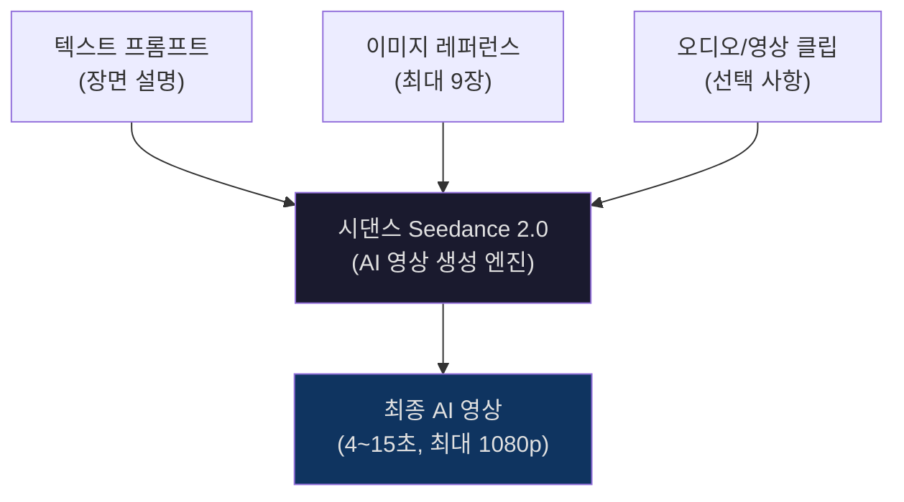
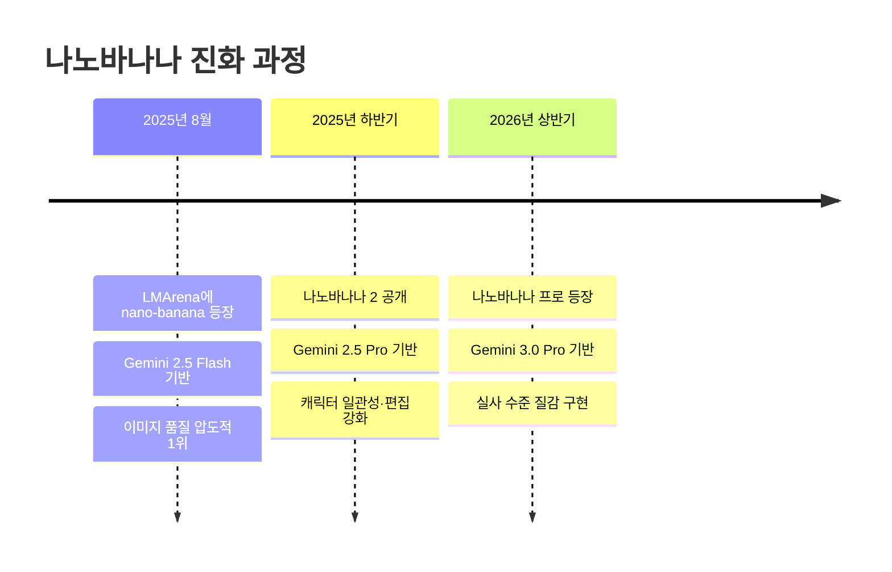
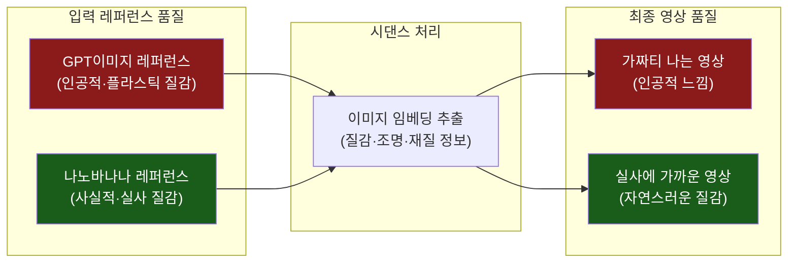
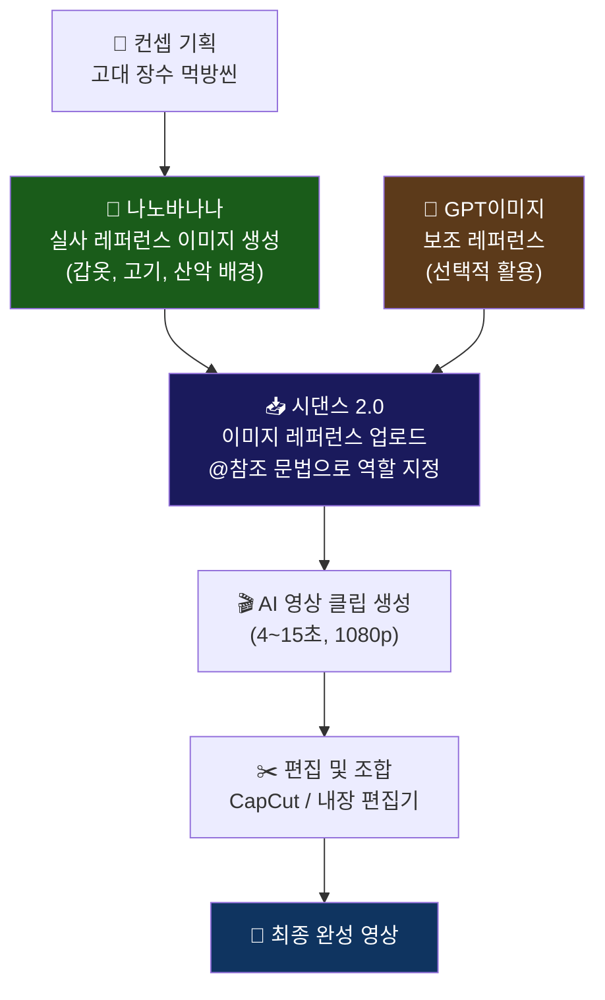
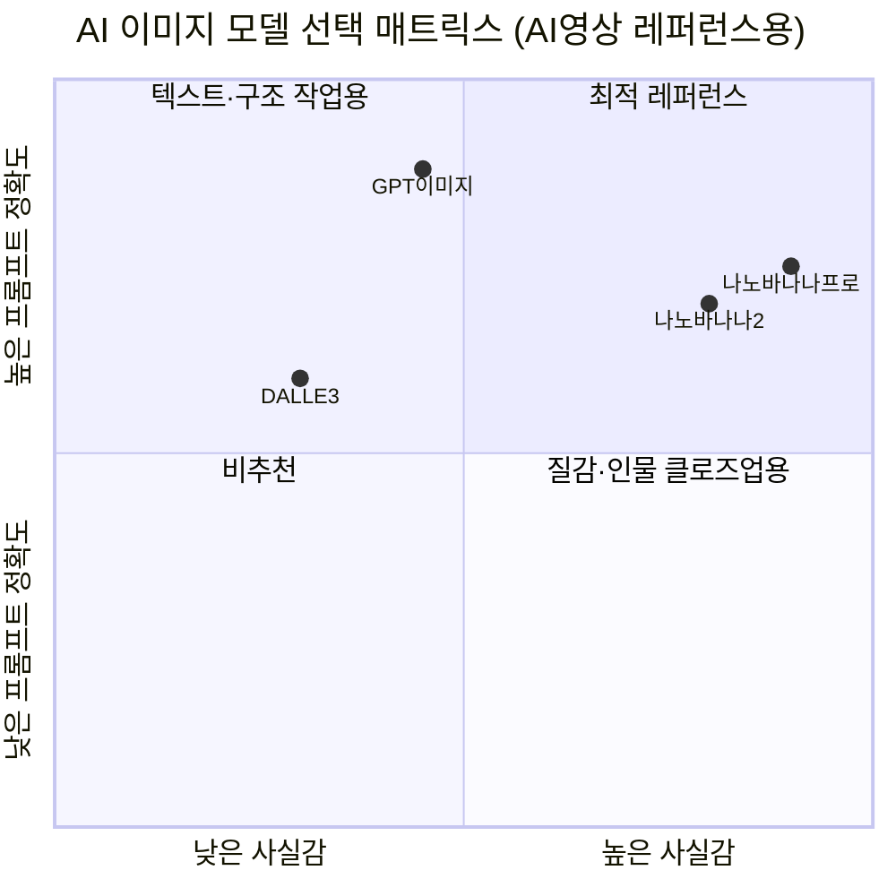
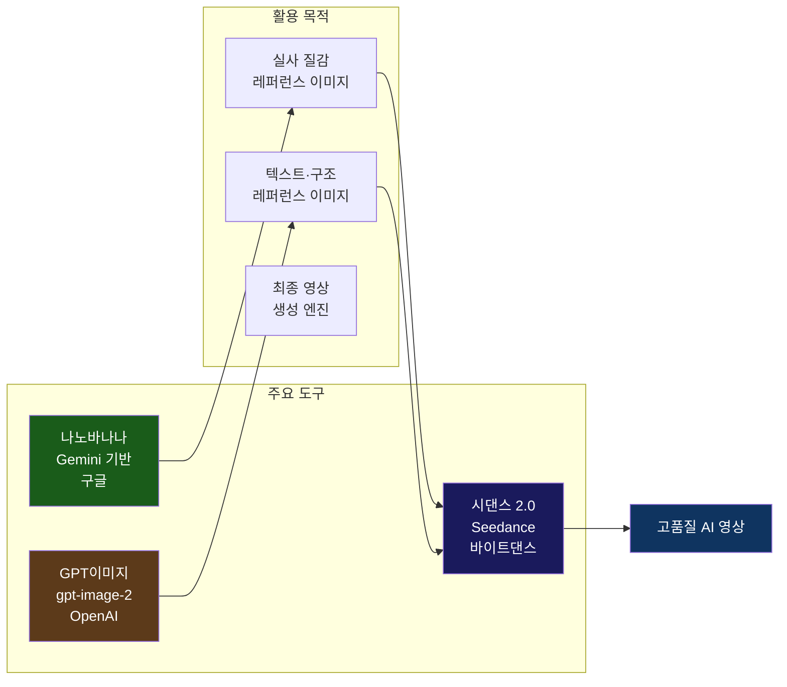

> "싸움도 배가 불러야 하는 법" — 전통 갑옷을 입은 장수가 광활한 산악 배경 앞에서 고기를 씹는 이 장면은, 실제로 어떻게 만들어진 것일까?

> 
> https://www.threads.com/@peece51/post/DZxpsAXjOQw
> 
> 싸움도 배가 불러야 하는 법
> 
> 한동안 시댄스로 액션만 만들다가 좀 일상적인 장면 만들고 싶어서 고기 먹방씬 제작했는데
> 
> 여기서 중요하게 신경 쓴 것은 질감. 체감상 지피티 이미지를 레퍼런스로 쓰면 질감이 가짜티가 심하고, 나노바나나를 레퍼런스로 쓰면 그래도 한결 실사에 가까운 질감이 나온다.
> 
> 지피티 이미지에만 의존하지 말고 전통적 강호인 나노바나나를 섞어 쓰면 더 진짜 같은 영상이 탄생한다.
> 

---

## 목차

1. [이 영상은 무엇인가](#1-이-영상은-무엇인가)
2. [등장하는 세 가지 핵심 도구](#2-등장하는-세-가지-핵심-도구)
   - 2-1. 시댄스 (Seedance) — ByteDance의 AI 영상 생성 엔진
   - 2-2. 나노바나나 (Nano Banana) — Google의 초실사 이미지 생성 모델
   - 2-3. GPT 이미지 — OpenAI의 이미지 생성 기능
3. [왜 레퍼런스 이미지가 영상 품질을 결정하는가](#3-왜-레퍼런스-이미지가-영상-품질을-결정하는가)
4. [GPT 이미지 vs 나노바나나: 질감의 차이](#4-gpt-이미지-vs-나노바나나-질감의-차이)
5. [실제 제작 워크플로우 전체 흐름](#5-실제-제작-워크플로우-전체-흐름)
6. [이 영상 장면 분석: 무엇을 만들었나](#6-이-영상-장면-분석-무엇을-만들었나)
7. [핵심 인사이트: "질감은 레퍼런스에서 온다"](#7-핵심-인사이트-질감은-레퍼런스에서-온다)
8. [누구나 따라할 수 있는 실전 팁](#8-누구나-따라할-수-있는-실전-팁)
9. [정리 및 시사점](#9-정리-및-시사점)

---

## 1. 이 영상은 무엇인가

Threads에 올라온 이 게시물은 한 명의 크리에이터(@peece51)가 AI 도구만으로 제작한 짧은 영상 클립들을 공유한 것이다. 영상에는 크게 두 가지 유형의 장면이 등장한다.

첫 번째는 음식 장면으로, 커다란 구이 고기가 가까이서 클로즈업된 화면이다. 고기 표면의 탄 부분과 육즙이 흘러내리는 디테일이 인상적으로 표현되어 있으며, 나무 꼬챙이에 꿰어진 상태로 사실적인 질감이 두드러진다. 이어지는 장면에서는 장작불 위에 나무 막대기로 꿰어진 고기 덩어리들이 활활 타오르는 불꽃 위에서 굽히고 있는 모습이 담긴다. 이 두 장면은 조명, 연기, 불꽃의 움직임, 고기 표면의 질감이 모두 실사처럼 보일 정도로 세밀하게 묘사되어 있다.

두 번째는 인물 장면이다. 동아시아풍의 고대 갑옷을 완벽하게 착용한 장수 캐릭터가 웅장한 산악 지형을 배경으로 서 있다. 투구에는 금빛 장식과 날개 모양의 장신구가 달려 있고, 갑옷은 비늘처럼 정교하게 이어진 흑갈색 금속 조각들로 구성되어 있다. 이 장수는 한 손에 고기를 들고 씹어먹으며, 표정은 싸움을 앞두고 배를 채우는 장수의 눈빛을 담고 있다.

크리에이터는 이 게시물에 "싸움도 배가 불러야 하는 법"이라는 제목을 붙이고, 한동안 액션 장면만 만들다가 이번에는 일상적인 장면, 즉 '먹방씬'을 만들어보고 싶었다고 설명했다. 그리고 이 과정에서 발견한 핵심 노하우를 공유했는데, 그것이 바로 이 글의 핵심 주제다.

---

## 2. 등장하는 세 가지 핵심 도구

이 영상을 만드는 데 사용된 도구는 크게 세 가지다. 각각의 역할과 특성을 이해하는 것이 전체 워크플로우를 파악하는 데 필수적이다.

### 2-1. 시댄스 (Seedance) — ByteDance의 AI 영상 생성 엔진

시댄스(Seedance)는 틱톡의 모회사인 바이트댄스(ByteDance)가 개발한 AI 영상 생성 모델이다. 2025년 말 공개된 Seedance 2.0 버전은 현재 AI 영상 생성 분야에서 Kling, Sora, Veo 등과 함께 최상위 경쟁 모델로 꼽히고 있다.

시댄스의 가장 큰 특징은 **멀티모달 입력 지원**이다. 텍스트 프롬프트만으로 영상을 만드는 것은 물론, 이미지·영상 클립·오디오 파일을 함께 입력으로 제공할 수 있다. Dreamina(즈멍) 플랫폼에 내장되어 있으며, 프로젝트당 최대 9개의 이미지, 3개의 영상 클립, 3개의 오디오 클립을 레퍼런스로 활용할 수 있다. 출력 해상도는 최대 1080p이며, 4초에서 15초 길이의 영상을 생성할 수 있다.

크리에이터가 특히 주목한 것은 바로 이 **레퍼런스 이미지 기능**이다. 시댄스는 사용자가 제공한 이미지를 참고하여 그 이미지의 시각적 특성, 즉 색상, 질감, 조명, 분위기 등을 영상에 반영한다. 따라서 어떤 이미지를 레퍼런스로 제공하느냐가 최종 영상의 품질을 크게 좌우한다는 사실이 이 게시물의 핵심 발견이다.

시댄스 2.0은 현재 공식 API가 완전히 공개되지 않았으며, 일반 사용자는 바이트댄스의 크리에이티브 플랫폼인 Dreamina(dreamina.capcut.com)을 통해 접근할 수 있다. 한국에서는 '캐럿(Carat)' 같은 서비스를 통해 별도의 VPN 없이 한국어로 사용 가능하다.

### 2-2. 나노바나나 (Nano Banana) — Google의 초실사 이미지 생성 모델

나노바나나(Nano Banana)는 구글(Google)이 개발한 이미지 생성 모델의 코드명이다. 정식 명칭은 아니며, 2025년 8월 중순경 이미지 생성 모델들의 성능을 익명으로 비교하는 플랫폼 LMArena에 'nano-banana'라는 정체불명의 이름으로 등장하면서 AI 커뮤니티의 폭발적인 관심을 받기 시작했다.

이 모델이 특히 화제가 된 이유는 두 가지다. 첫째, 정식 공개도 되지 않은 상태에서 LMArena 이미지 생성 부문에서 압도적인 1위를 차지했다. 둘째, '피규어 만들기' 등의 창작 과제에서 기존 모델들을 압도하는 사실적인 질감과 디테일을 보여주었다.

이후 구글이 이 모델의 개발사임을 공식 확인하면서, 나노바나나는 Gemini 멀티모달 모델에 탑재된 이미지 생성 기능임이 밝혀졌다. 초기 버전은 Gemini 2.5 Flash 기반이었으며, 이후 **나노바나나 2(Gemini 2.5 Pro 기반)**, 그리고 **나노바나나 프로(Gemini 3.0 Pro 기반)** 로 버전이 업그레이드되었다.

나노바나나 프로는 기존 버전과 비교해 해상도, 다국어 표현력, 일관성, 구도 변경, 텍스트-투-이미지 등 모든 면에서 압도적인 성능 향상을 보여주었다는 평가를 받는다. 특히 피부 질감, 재질 표현, 시네마틱 조명 재현에서 실사와 구분이 어려운 수준에 도달했다는 점이 AI 영상 제작자들의 주목을 받는 이유다.

나노바나나는 Google Gemini 앱(gemini.google.com)이나 Google AI Studio를 통해 사용할 수 있으며, 국내에서는 '캐럿(Carat)' 같은 통합 AI 서비스에서도 접근할 수 있다.

### 2-3. GPT 이미지 — OpenAI의 이미지 생성 기능

GPT 이미지(GPT Image)는 OpenAI가 ChatGPT에 통합한 이미지 생성 기능이다. API에서는 `gpt-image-1`, `gpt-image-2` 등의 모델명으로 제공된다. GPT-Image-2(ChatGPT에서는 'Images 2.0'이라고도 불린다)는 2026년에 출시되어 LMArena 리더보드에서 2위와 242점 차이로 1위를 차지했을 만큼 높은 성능을 자랑한다.

GPT 이미지의 강점은 복잡한 텍스트 요소 렌더링(한국어 포함 99% 수준의 정확도), 월드 지식을 활용한 풍부한 맥락 이해, 문서·포스터·UI 목업 제작에서 두드러진다. 또한 포스터 수정이나 문서 기반 작업처럼 맥락을 이해해야 하는 과제에서 안정적인 결과를 내놓는 것이 특징이다.

단, 크리에이터가 이 게시물에서 지적한 것처럼, GPT 이미지를 AI 영상의 레퍼런스로 사용할 경우 질감이 '가짜티'가 나는 경향이 있다. 이는 GPT 이미지가 인물 화보·뷰티 촬영 같은 사진 리얼리즘 영역보다는 프롬프트 정확도·텍스트 렌더링 등에서 우위를 갖는 모델이기 때문이다.

---

## 3. 왜 레퍼런스 이미지가 영상 품질을 결정하는가

AI 영상 생성 모델이 이미지 레퍼런스를 처리하는 방식을 이해하면, 왜 레퍼런스 선택이 이토록 중요한지 명확해진다.

AI는 업로드된 레퍼런스 이미지를 픽셀 단위로 분석하여 거대한 수학적 벡터(이미지 임베딩)로 변환한다. 이 벡터 안에는 말로 표현하기 어려운 시각적 정보들이 압축된다. 예를 들어 고기 표면의 탄 질감, 모닥불에서 나오는 빛의 특성, 금속 갑옷의 광택과 무게감 같은 것들이다. 시댄스는 이 벡터 정보를 토대로 영상의 각 프레임을 생성하기 때문에, 레퍼런스 이미지에 포함된 질감 정보가 그대로 영상에 유전된다.

이것이 바로 **"쓰레기를 넣으면 쓰레기가 나온다(Garbage in, Garbage out)"** 원칙이 AI 영상 제작에도 고스란히 적용되는 이유다. 아무리 시댄스 자체의 성능이 뛰어나더라도, 인공적인 질감이 담긴 레퍼런스 이미지를 제공하면 결과물 영상도 인공적인 분위기를 띠게 된다.

---

## 4. GPT 이미지 vs 나노바나나: 질감의 차이

이 두 모델의 차이는 단순히 "어느 쪽이 더 좋은가"의 문제가 아니라 **"무엇을 잘하는가"의 차이**다.

GPT 이미지는 복잡한 프롬프트를 정확하게 따르고, 텍스트를 깔끔하게 렌더링하며, 포스터나 UI 디자인 같은 구조적인 작업에서 강점을 보인다. 반면 인물의 피부 질감이나 자연 소재의 사실적 표현에서는 때때로 지나치게 매끈하거나 플라스틱처럼 보이는 '언캐니 밸리(uncanny valley)' 현상이 발생할 수 있다.

나노바나나는 반대로 피부 톤과 조명의 자연스러움, 재질 표현의 사실감에서 두각을 나타낸다. 같은 프롬프트를 입력했을 때 나노바나나 2가 피부 톤과 조명에서 가장 자연스러운 결과를 냈다는 비교 테스트 결과도 있다. 이 특성이 바로 시댄스 같은 AI 영상 도구의 레퍼런스로 활용할 때 결정적인 장점으로 작용한다.

```mermaid
xychart-beta
    title "AI 이미지 모델 특성 비교 (상대적 강점, 10점 만점)"
    x-axis ["질감 사실감", "텍스트 렌더링", "프롬프트 정확도", "인물 조명", "AI영상 레퍼런스 적합도"]
    y-axis "점수" 0 --> 10
    bar [5, 9, 9, 6, 5]
    bar [9, 6, 7, 9, 9]
```

> 위 차트에서 첫 번째 막대는 GPT 이미지, 두 번째 막대는 나노바나나의 상대적 강점을 나타낸다. 수치는 절대적 벤치마크가 아닌 크리에이터 커뮤니티의 경험적 평가를 기반으로 한 개략적 비교다.

요약하자면, GPT 이미지는 "정확한 도면 그리기"에 강하고, 나노바나나는 "진짜 사진처럼 찍기"에 강하다. AI 영상의 레퍼런스로 쓸 때는 후자의 특성이 훨씬 중요하기 때문에, 이 크리에이터는 나노바나나를 선호하게 된 것이다.

---

## 5. 실제 제작 워크플로우 전체 흐름

크리에이터가 이 영상을 만든 과정을 재구성하면 다음과 같다.

### 단계 1: 기획 (컨셉 설정)

가장 먼저 어떤 장면을 만들지 결정한다. 이 경우는 "고대 장수가 야외에서 구운 고기를 먹는 장면"이라는 구체적인 컨셉이 있었다. 이처럼 명확한 비주얼 컨셉이 있어야 뒤이은 레퍼런스 이미지 생성 단계에서 방향을 잡을 수 있다.

### 단계 2: 레퍼런스 이미지 생성 (나노바나나 활용)

핵심 단계다. 나노바나나(Google Gemini)를 사용해 영상에 담고 싶은 장면과 유사한 이미지들을 생성한다. 이때 아래와 같은 요소들을 세밀하게 프롬프팅하는 것이 중요하다.

- **인물**: 고대 동아시아 갑옷의 재질(금속 비늘, 가죽, 금박 장식), 인물의 표정과 조명
- **음식**: 고기의 탄 표면 질감, 육즙, 불꽃의 광원 효과
- **배경**: 험준한 산악 지형, 자연광의 방향과 강도

실사에 가까운 결과를 얻기 위해 "natural texture with visible grain, cinematic lighting, photorealistic detail, not airbrushed" 같은 방향의 프롬프트가 효과적이다.

### 단계 3: (선택) GPT 이미지로 보완

크리에이터는 "나노바나나만 쓰라"고 하지 않고, "GPT 이미지에만 의존하지 말고 나노바나나를 섞어 쓰면"이라고 표현했다. 이는 GPT 이미지를 완전히 배제하는 게 아니라, 질감보다 구도나 텍스트 요소가 중요한 일부 레퍼런스에서는 GPT 이미지도 활용할 수 있음을 시사한다.

### 단계 4: 시댄스에 레퍼런스 투입 및 영상 생성

준비된 레퍼런스 이미지들을 시댄스 2.0에 업로드한다. 시댄스의 '@이미지' 참조 문법을 활용해 각 이미지의 역할을 프롬프트 안에서 지정한다. 예컨대 "@Image1의 인물이 @Image2의 배경 앞에서 @Image3의 음식을 먹는 장면, 클로즈업 컷, 시네마틱 조명" 같은 방식이다.

### 단계 5: 편집 및 조합

생성된 영상 클립들을 CapCut 같은 편집 도구로 조합하거나, 시댄스 자체의 내장 편집 기능을 활용해 최종 결과물을 만든다.

---

## 6. 이 영상 장면 분석: 무엇을 만들었나

이 영상에서 만들어진 네 가지 유형의 장면을 살펴보면, 크리에이터가 얼마나 다양한 촬영 스타일을 AI로 구현했는지 알 수 있다.

**구이 고기 클로즈업**: 커다란 고기 덩어리가 기름기를 머금은 채 썰리는 모습을 포착한 장면이다. 탄 표면과 안쪽 붉은 육질의 대비, 고기 섬유 조직의 질감, 아래로 떨어지는 육즙 한 방울까지 실사처럼 담겨 있다. 이 장면은 식재료의 질감을 얼마나 사실적으로 표현할 수 있느냐의 테스트였으며, 나노바나나 레퍼런스를 통해 높은 사실감을 구현한 대표적 사례다.

**장수의 전신 샷**: 험준한 바위 산을 배경으로 한 장수가 등장한다. 투구와 갑옷의 금속 질감, 갑옷 이음새의 세밀한 디테일, 햇빛을 받아 반짝이는 금박 장식 등이 인상적이다. 배경의 황적색 초원과 날카로운 암봉들이 어우러져 웅장한 분위기를 형성한다.

**장수의 클로즈업 표정**: 투구를 쓴 채 고기를 한 입 베어 물며 먹는 장수의 얼굴을 가까이에서 포착한 장면이다. 이 장면은 인물의 피부 질감, 입술과 치아, 눈빛의 표현이 요구되는 가장 까다로운 장면이다. 이처럼 인물 클로즈업에서 나노바나나가 GPT 이미지보다 유리한 이유는 피부 세부 표현(모공, 피부 결, 자연스러운 명암)에서 우위를 갖기 때문이다.

**모닥불 고기 구이**: 야외 모닥불 위에 나무 막대기로 꿰어진 고기 덩어리들이 타닥거리며 익어가는 장면이다. 불꽃의 움직임, 숯의 회색빛 표면, 고기가 열을 받아 수축되며 형성되는 마이야르 반응의 표면 변화 등이 사실적으로 담겨 있다.

---

## 7. 핵심 인사이트: "질감은 레퍼런스에서 온다"

이 게시물이 전달하는 가장 중요한 통찰은 단순하지만 강력하다.

> **AI 영상의 품질은 AI 영상 생성기 자체의 성능만큼이나, 그것에 제공하는 레퍼런스 이미지의 품질에 달려 있다.**

시댄스처럼 고성능 AI 영상 엔진이 있어도, 그것에 인공적인 질감의 이미지를 먹이면 인공적인 영상이 나온다. 반대로 실사에 가까운 이미지를 레퍼런스로 제공하면, 엔진은 그 리얼리즘을 영상으로 확장시킨다.

이는 AI 영상 제작의 패러다임을 바꾸는 발견이다. 기존에 많은 사람들이 "어떤 AI 영상 생성기가 제일 좋은가"에만 집중했다면, 이제는 "어떤 이미지를 레퍼런스로 제공할 것인가"라는 질문이 똑같이 중요해진다.

이것을 요리에 비유하자면 이렇다. 아무리 최고급 오븐이 있어도, 냉동 패티를 넣으면 냉동 맛 버거가 나온다. 반면 신선한 생고기를 넣으면 같은 오븐에서 훨씬 맛있는 버거가 나온다. 시댄스는 오븐이고, 나노바나나는 신선한 재료인 셈이다.

또 하나 주목할 부분은 크리에이터가 "나노바나나만 써라"라고 하지 않고 "전통적 강호인 나노바나나를 **섞어** 쓰면"이라고 표현했다는 점이다. 이는 GPT 이미지와 나노바나나가 각각 다른 장점을 가지고 있으며, 장면의 성격에 따라 적절히 혼합하는 것이 가장 현명한 전략임을 시사한다.

---

## 8. 누구나 따라할 수 있는 실전 팁

### 나노바나나 접근 방법

나노바나나는 다음 경로로 사용할 수 있다. Google Gemini 앱(gemini.google.com)에 접속해 이미지 생성 요청을 하면 자동으로 나노바나나 2가 사용된다. 구글 AI 스튜디오(aistudio.google.com)에서는 레퍼런스 이미지를 저장하고 텍스트 프롬프트와 함께 입력하는 방식으로 훨씬 정밀한 제어가 가능하다. 국내 서비스인 캐럿(carat.im)에서는 나노바나나 2와 나노바나나 프로를 모두 한국어로 쉽게 사용할 수 있다.

### 질감을 살리는 프롬프트 작성법

나노바나나에서 실사에 가까운 질감을 얻으려면 지나치게 매끄럽고 깔끔한 AI 이미지가 되지 않도록 구체적인 사진 묘사 언어를 사용하는 것이 효과적이다. "natural texture with visible grain", "photorealistic, unretouched photography", "cinematic lighting with subsurface scattering" 같은 표현이 도움이 된다. 반대로 "illustration", "digital art", "cartoon" 같은 표현은 AI 특유의 인공적 느낌을 강화할 수 있으므로 실사 지향 작업에서는 피하는 것이 좋다.

### 시댄스 활용 시 주의사항

시댄스는 공식 사이트를 사칭하는 비공식 사이트들이 다수 존재한다. 반드시 바이트댄스의 공식 크리에이티브 플랫폼인 Dreamina(dreamina.capcut.com) 또는 공식 API 파트너를 통해 사용해야 한다. 또한 레퍼런스 입력이 많을수록 크레딧 소모가 증가하므로, 핵심적인 레퍼런스 이미지를 엄선하는 것이 비용 효율적이다.

현재 시댄스 2.0은 실사 인물 얼굴 사진의 직접 업로드를 제한하고 있다. 특정 인물이 등장하는 영상을 만들고 싶다면 해당 인물의 AI 아바타를 먼저 생성한 뒤 그 아바타를 레퍼런스로 활용하는 방법을 권장한다.

---

## 9. 정리 및 시사점

이 짧은 Threads 게시물 하나가 AI 영상 제작 커뮤니티에 던지는 시사점은 적지 않다.

첫째, **도구의 조합이 도구 하나의 성능보다 중요하다**. 시댄스만 잘 쓴다고 해서 좋은 영상이 나오지 않는다. 나노바나나로 품질 높은 레퍼런스를 만들고, 그것을 시댄스에 투입하는 파이프라인 전체를 최적화해야 한다.

둘째, **AI 모델마다 '잘하는 것'이 다르다**. GPT 이미지는 프롬프트를 정확하게 따르는 데 강하고, 나노바나나는 사실적인 질감과 조명을 표현하는 데 강하다. 이 특성을 이해하고 용도에 맞게 선택하는 능력이 AI 크리에이터의 핵심 역량이 되고 있다.

셋째, **액션보다 일상 장면이 더 어렵다**. 이 크리에이터가 한동안 액션 장면만 만들다가 먹방씬 제작에 새로운 도전을 느꼈다는 사실은 흥미롭다. 화려한 폭발과 전투는 다이나믹한 움직임으로 질감의 빈약함을 가릴 수 있지만, 음식을 씹는 정적인 클로즈업은 질감 하나하나가 고스란히 드러나기 때문이다.

AI 영상 제작 기술은 단순히 프롬프트를 잘 쓰는 것을 넘어서, 이처럼 서로 다른 특성의 AI 모델들을 적재적소에 배치하는 '편집장' 역할이 점점 더 중요해지고 있다. 이 게시물은 그 전형적인 예를 보여주는 현장 보고서다.

---

*작성 기준일: 2026년 6월 20일*  
*참고: 시댄스 2.0, 나노바나나 프로 등의 버전 및 기능은 빠르게 업데이트되고 있으므로, 최신 정보는 각 공식 채널에서 확인하는 것을 권장한다.*
