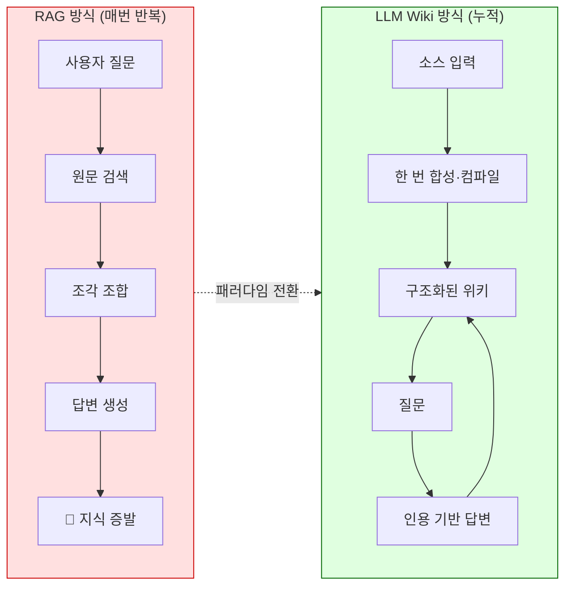
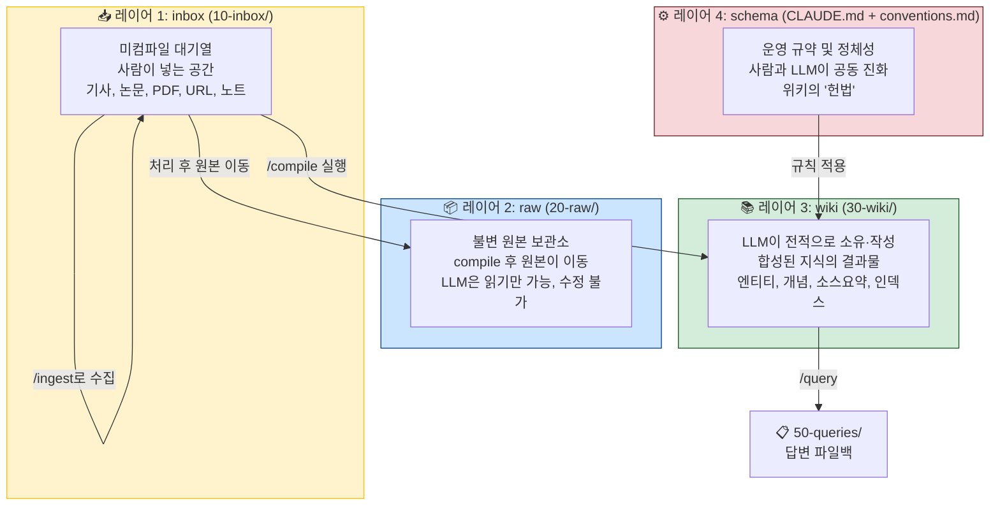
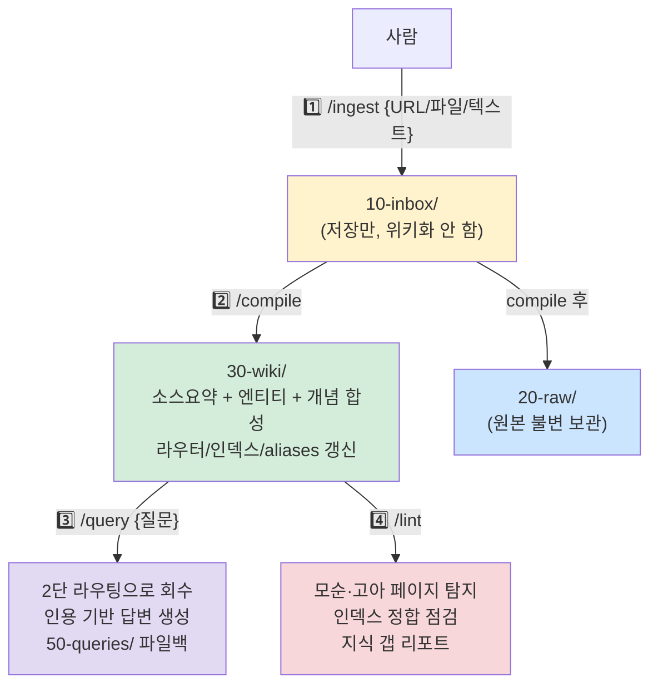
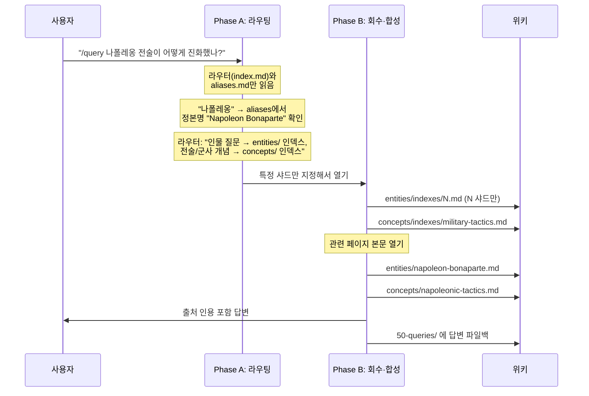
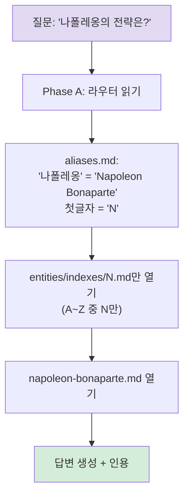
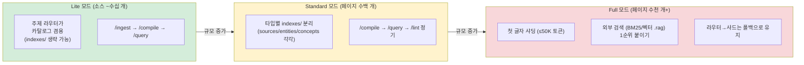
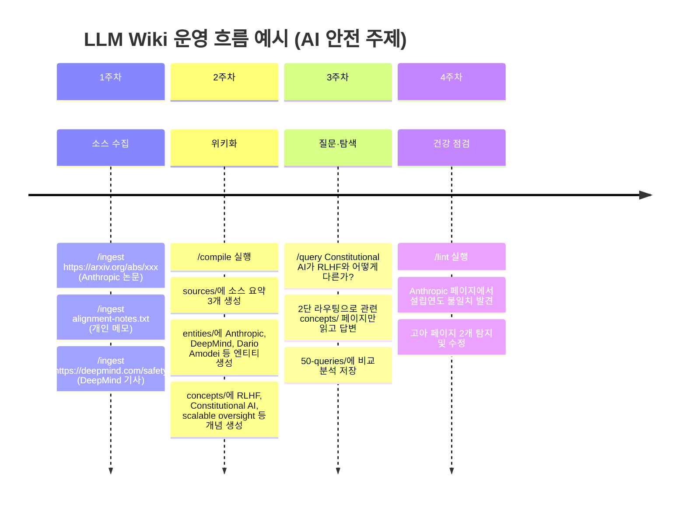

> **출처**: Threads [@gptaku_ai](https://www.threads.com/@gptaku_ai) 포스트 및 GitHub [fivetaku/llm-wiki](https://github.com/fivetaku/llm-wiki)  
> **원조 패턴**: Andrej Karpathy의 ["LLM Wiki" GitHub Gist](https://gist.github.com/karpathy/442a6bf555914893e9891c11519de94f) (2026년 4월)  
> **작성일**: 2026년 6월 20일

> 
> https://www.threads.com/@gptaku_ai/post/DZwx9s_E-v0
> 
> 아직도 클코쓰면서 LLM wiki가 뭐냐?? 이거 어떻게 하냐?? 이러는사람들 있어서 스타터 만들어서 올렸다
> 
> 사용법이나 그런거 넣어놨으니 클코에 물어보고 어차피 이게 모두에게 정답은 아니고 사용하면서 고도화와 개인화는 하면서 써야함
> 
> 그냥 지피타쿠라는 사람은 이렇게 쓰는구나? 이렇게 생각하면 될거 같음
> 
> 문서 많아진다 싶으면 Vector DB도 붙여보고 인덱스 레이어도 나눠봐야하고 손 많이간다 이거
> 
> https://github.com/fivetaku/llm-wiki
> 

---

## 1. 먼저 이해해야 할 배경: Karpathy의 LLM Wiki란

이 모든 이야기의 출발점은 Andrej Karpathy가 2026년 4월에 GitHub Gist에 올린 짧은 아이디어 문서입니다. Karpathy는 Tesla Autopilot 신경망 개발을 이끌었고, OpenAI 공동창업자이자, 수백만 명의 개발자에게 딥러닝을 가르친 인물입니다. 그가 올린 단 하나의 마크다운 파일이 일주일 만에 5,000개 이상의 스타를 받으며 개발자 커뮤니티 전체를 뒤흔들었습니다.

그 아이디어의 핵심은 단순합니다. **"AI를 사용해서 문서를 매번 찾아볼 게 아니라, AI가 직접 위키를 만들고 관리하게 하면 어떨까?"**

이것이 왜 충격적이었는지 이해하려면, 먼저 기존 방식이 어떤 문제를 갖고 있는지 알아야 합니다.

---

## 2. 기존 방식의 한계: RAG의 구조적 문제

### RAG(검색 증강 생성)가 뭔지부터

많은 AI 도구들이 문서를 처리할 때 **RAG(Retrieval-Augmented Generation)** 방식을 씁니다. 쉽게 설명하면 이렇습니다:

1. 사용자가 PDF나 문서를 업로드합니다
2. AI가 그 내용을 잘게 쪼개서 벡터 데이터베이스에 저장합니다
3. 사용자가 질문을 하면, 질문과 가장 관련 있는 조각들을 꺼내옵니다
4. AI가 그 조각들을 보고 답변을 만듭니다

이 방식은 분명히 작동합니다. 그런데 근본적인 문제가 있습니다. **매번 처음부터 다시 시작합니다.** 오늘 ChatGPT에 PDF를 올려서 질문했어도, 내일 다시 같은 PDF를 올려야 합니다. 그리고 AI는 어제 내린 결론, 어제 발견한 연관관계를 전혀 기억하지 못합니다. 지식이 누적되지 않고 매 세션마다 증발합니다.

다섯 개의 문서를 통합해서 분석해야 하는 질문이라면? AI가 다섯 문서에서 관련 조각들을 뽑아 그때그때 이어 붙여야 합니다. 어제도 그랬고, 오늘도 그랬고, 내일도 할 것입니다.



### Karpathy의 통찰: 컴파일 메타포

Karpathy는 소프트웨어 엔지니어링에서 비유를 가져왔습니다. 프로그래머가 소스코드를 실행할 때마다 처음부터 해석하지 않습니다. 한 번 **컴파일**해서 최적화된 바이너리를 만들고, 그 결과물을 반복해서 사용합니다.

**LLM Wiki는 바로 이 컴파일 개념을 지식 관리에 적용한 것입니다.** 원본 소스(논문, 기사, 노트)를 한 번 합성해서 구조화된 위키 페이지로 만들고, 이후에는 그 합성된 결과물을 가지고 질문에 답합니다. 지식이 매번 재발견되는 게 아니라 **누적**됩니다.

---

## 3. gptaku가 만든 것: Claude Code 위의 LLM Wiki 스타터

### 포스트의 맥락

gptaku(Threads: @gptaku_ai)는 이런 상황을 목격했습니다: Claude Code를 활발히 쓰면서도 "LLM Wiki가 대체 뭔지, 어떻게 하는 건지" 모르는 사람들이 여전히 많다는 것. 그래서 직접 **스타터 키트**를 만들어 GitHub에 올렸습니다. 주소는 [fivetaku/llm-wiki](https://github.com/fivetaku/llm-wiki).

gptaku가 강조하는 것이 있습니다: **"이게 모두에게 정답은 아니다."** 이건 시작점입니다. 쓰면서 자기 방식으로 고도화하고 개인화해야 합니다. 문서가 많아지면 Vector DB도 붙여보고, 인덱스 레이어도 나눠야 하고, 손이 많이 간다고 솔직하게 말합니다. 그냥 "지피타쿠는 이렇게 쓰는구나" 정도로 받아들이면 된다고 합니다.

### 핵심 특징

이 스타터의 가장 큰 장점은 **외부 의존이 없다**는 점입니다. 추가 플러그인, 외부 API, 별도 설치 없이 이 폴더 하나를 클론해서 `claude`를 실행하기만 하면 됩니다. Claude Code 어디서든 동작합니다.

---

## 4. 전체 구조: 4개 레이어로 나뉜 지식 공간

LLM Wiki의 구조를 이해하는 가장 중요한 출발점은 **역할에 따른 공간 분리**입니다. 무엇이 어디에 있는지, 누가 그것을 소유하는지가 명확하게 정의됩니다.



### 각 레이어의 역할

**10-inbox/ (받은 편지함)**  
사람이 정보를 투입하는 입구입니다. 신문 기사, 논문 PDF, 개인 메모, 웹 URL 등 아직 처리되지 않은 원자재가 쌓이는 곳입니다. 여기 있는 자료는 "아직 위키화되지 않은 상태"입니다. `/ingest` 명령으로 URL이나 파일을 자동으로 여기에 저장할 수 있습니다.

**20-raw/ (불변 원본 보관소)**  
한번 `/compile`을 거쳐서 위키화가 완료된 원본들이 이동하는 곳입니다. 이곳의 파일은 절대 수정하거나 삭제할 수 없습니다. LLM조차 읽기만 할 수 있습니다. 원본 그대로를 보존하는 것이 목적입니다. "inbox에 남아 있으면 미컴파일, raw에 있으면 컴파일 완료"라는 상태 표시기 역할도 합니다.

**30-wiki/ (합성 결과물)**  
LLM이 전적으로 소유하고 작성하는 공간입니다. 원본 소스에서 추출·합성된 구조화된 지식이 여기에 쌓입니다. 소스 요약 페이지, 엔티티(인물·조직·작품) 페이지, 개념 페이지, 그리고 무엇보다 **라우터(index.md)** 가 여기에 있습니다.

**CLAUDE.md + 00-system/conventions.md (스키마 레이어)**  
위키의 "헌법"이자 "운영 규약"입니다. LLM이 어떻게 행동해야 하는지, 페이지를 어떤 형식으로 써야 하는지, 어떤 것은 절대 하면 안 되는지가 정의됩니다. 사람과 LLM이 함께 진화시켜 나가는 문서입니다.

---

## 5. 폴더 전체 구조

```
llm-wiki/
├── CLAUDE.md                    ← 스키마 레이어 (위키의 헌법)
├── 00-system/
│   └── conventions.md           ← 페이지 규약·라우팅·샤딩 등 14절 상세 규약
├── 10-inbox/                    ← 새 소스 투입구 (미처리 대기열)
│   └── README.md
├── 20-raw/                      ← 처리완료 불변 원본 보관소
│   ├── README.md
│   └── assets/                  ← 이미지·PDF 로컬 저장
├── 30-wiki/                     ← LLM 소유 합성 결과물
│   ├── index.md                 ← 루트 라우터 (의도→주제 안내)
│   ├── log.md                   ← 운영 로그 (append-only)
│   └── {topic}/                 ← 주제별 하위 위키
│       ├── index.md             ← 주제 라우터 (의도→타입 인덱스)
│       ├── aliases.md           ← 정본 사전 (표기 흔들림 해소)
│       ├── overview.md          ← 종합 개요 (거시 질문 진입점)
│       ├── indexes/             ← 타입별 하위 인덱스 (규모 커지면 샤딩)
│       ├── sources/             ← 소스 요약 페이지
│       ├── entities/            ← 인물·조직·장소·제품·작품
│       └── concepts/            ← 개념·이론·방법론
├── 40-templates/                ← 페이지 타입 템플릿
├── 50-queries/                  ← /query 결과 파일백 (누적)
├── 90-archive/                  ← 폐기·대체된 페이지
└── _meta/                       ← 메타 관리 (변경이력 등)
```

---

## 6. 네 가지 핵심 명령어

LLM Wiki의 모든 작업은 네 개의 명령어로 이루어집니다. 각각이 매우 명확한 역할 경계를 갖고 있습니다.



### `/ingest` — 수집만 하기

수집(저장)과 위키화(합성)를 분리한 것이 이 시스템의 중요한 설계 원칙 중 하나입니다. `/ingest`는 오직 저장만 합니다. URL이든 파일이든 텍스트 조각이든, `10-inbox/`에 떨어뜨려 놓을 뿐입니다. 아직 위키에 반영되지 않습니다. 이렇게 분리한 이유는 간단합니다. 수집은 빠르게 자주 할 수 있지만, 위키화(합성)는 토큰을 많이 쓰는 무거운 작업이기 때문입니다.

### `/compile` — 위키로 합성하기

진짜 핵심 작업입니다. inbox에 쌓인 소스들을 읽어서 위키 페이지로 변환합니다. 이 과정에서 일어나는 일들:

- 소스 요약 페이지 생성 (`sources/` 폴더에 저장)
- 소스에 등장하는 인물·조직·장소 등 엔티티 페이지 생성 또는 갱신 (`entities/` 폴더)
- 소스가 다루는 개념·이론·방법론 페이지 생성 또는 갱신 (`concepts/` 폴더)
- 모든 페이지 간 교차 참조(`[[링크]]`) 연결
- `aliases.md`(정본 사전) 갱신 — 예를 들어 "나폴레옹"과 "Napoleon Bonaparte"를 하나의 정본명으로 통일
- `index.md`(라우터) 갱신
- 처리 완료된 원본을 `20-raw/`로 이동

한 번의 `/compile`이 보통 10~15개의 페이지를 새로 만들거나 업데이트합니다.

### `/query` — 2단 라우팅으로 질문하기

이것이 LLM Wiki의 가장 기술적으로 흥미로운 부분입니다. 단순히 위키를 전부 읽어서 답변하는 게 아닙니다. 아래 섹션에서 상세히 설명하겠습니다.

### `/lint` — 위키 건강검진

위키가 커지면서 생기는 문제들을 탐지하고 수정합니다. 모순된 내용(A 문서에서는 2021년이라 했는데 B 문서에서는 2023년), 어떤 페이지에서도 링크되지 않는 고아 페이지, 인덱스와 실제 페이지 간의 불일치, 지식 갭(이 분야에 대한 소스가 부족함) 등을 점검합니다.

---

## 7. LLM Wiki의 핵심: 인덱스는 카탈로그가 아니라 라우터다

gptaku의 스타터에서 가장 중요한 개념이 여기에 있습니다. 그냥 index.md를 "모든 페이지 목록"이라고 생각하면 이 시스템이 왜 작동하는지 이해할 수 없습니다.

### 왜 카탈로그 방식이 문제인가

위키가 페이지 100개일 때는 모든 페이지 목록을 index.md에 넣어도 됩니다. 그런데 500개, 1,000개가 되면? AI가 질문에 답하기 위해 먼저 1,000개짜리 목록을 전부 읽어야 합니다. 그 목록 자체가 이미 엄청난 토큰을 소비합니다. 위키가 커질수록 질문 하나에 드는 비용이 폭발적으로 증가합니다.

### 라우터(MOC, Map of Content) 개념

이 문제를 해결하기 위해 `index.md`를 **라우터**로 설계합니다. 라우터는 이렇게 작동합니다: "이런 의도의 질문이라면, 이 타입의 인덱스로 가세요." 마치 도서관 안내 데스크 같습니다. 안내 데스크는 모든 책 목록을 외우고 있는 게 아니라 "역사책은 3층 동쪽, 과학책은 2층 서쪽"이라는 안내 규칙을 알고 있습니다.

### 2단 라우팅의 작동 원리



**Phase A (Route):** 라우터(`index.md`)와 정본 사전(`aliases.md`)만 읽습니다. 아직 실제 페이지 내용은 하나도 읽지 않습니다. 여기서 "이 질문은 어떤 타입의 인덱스/샤드로 가야 하는가"만 결정합니다.

**Phase B (Search):** Phase A가 지정한 샤드(분할된 인덱스)만 엽니다. 그 샤드에서 후보 페이지들을 추린 다음, 필요한 페이지의 본문만 열어서 답변을 합성합니다.

이렇게 하면 **위키 크기와 상관없이 질문 하나에 읽는 토큰 수가 일정하게 유지됩니다.** 페이지 100개짜리 위키든 10,000개짜리 위키든, 항상 라우터 → 샤드 → 관련 페이지 몇 개만 읽습니다.

---

## 8. 정본화(aliases.md)와 샤딩

### 정본화: 표기 흔들림 해소

같은 사람이나 개념이 다양한 표기로 등장합니다. "나폴레옹", "Napoleon", "Bonaparte", "나폴레옹 보나파르트"는 모두 같은 인물입니다. `aliases.md`는 이 모든 표기들을 하나의 정본명으로 연결하는 사전 역할을 합니다.

정본명이 중요한 이유가 하나 더 있습니다. **정본명의 첫 글자가 샤드 키(shard key)가 됩니다.** "Napoleon Bonaparte" → 첫 글자 "N" → entities 인덱스의 N 샤드로 안내.

### 샤딩: 인덱스를 쪼개는 방법

타입 인덱스(예: 모든 엔티티 목록)가 50,000 토큰을 넘어가면, 알파벳 첫 글자를 기준으로 쪼갭니다. `entities/indexes/A.md`, `entities/indexes/B.md`, ... `entities/indexes/Z.md`. 질문이 들어오면 라우터가 어느 샤드를 열어야 할지 결정하고, 해당 샤드만 열어봅니다.



---

## 9. CLAUDE.md: 위키의 헌법

`CLAUDE.md`는 단순한 설명 문서가 아닙니다. Claude Code가 이 폴더에서 실행될 때 자동으로 읽는 **운영 규약**입니다. 이 파일이 LLM의 정체성과 행동 범위를 정의합니다.

### LLM의 정체성 선언

CLAUDE.md는 명시적으로 선언합니다: **"이 워크스페이스는 'LLM Wiki 유지관리자' 단일 에이전트입니다."** 사람은 소싱·탐색·질문을 담당하고, LLM이 위키의 모든 쓰기·정리·교차참조를 담당합니다. 마치 Obsidian이 IDE라면, LLM이 프로그래머이고 30-wiki/가 코드베이스라는 비유입니다.

### 절대 금지 사항

- `20-raw/` 원본 수정·삭제 (불변 원칙)
- 출처 없는 주장을 위키에 확정 기재 (모든 주장에는 출처가 있어야 함)
- 페이지 규약(frontmatter·고정 섹션·[[링크]])을 무시하고 자유 산문으로 쓰기
- `index.md` / `log.md` 갱신 누락
- 실제 프로젝트 작업(코딩, 보고서 작성 등) 수행 — 이건 지식 축적 공간, 작업 수행 공간이 아님

### 모든 페이지에 공통 적용되는 9가지 규칙

1. **BLUF(Bottom Line Up Front)**: 모든 페이지는 첫 1~3줄에 정의나 핵심 답을 써야 합니다. 이 첫 줄이 인덱스에 한 줄 요약으로 재사용됩니다.
2. **타입별 고정 섹션**: 엔티티 페이지, 개념 페이지, 소스 요약 페이지 각각에 정해진 섹션 구조가 있습니다.
3. **YAML frontmatter**: `type`, `canonical`, `summary`, `tier`, `provenance`, `sources` 등의 메타데이터를 모든 페이지 상단에 씁니다.
4. **`[[wiki link]]` + 정본화**: 기계적 탐색이 가능하고 표기 흔들림이 없습니다.
5. **모든 주장에 provenance(출처)**: `[[sources/...]]` 역링크로 출처를 연결합니다.
6. **모순·불확실성 명시 블록**: `> ⚠️ Contradiction:` 형태로 표시합니다.
7. **안정적 kebab-case 파일명**: `napoleon-bonaparte.md`처럼 링크가 깨지지 않는 이름.
8. **원자성**: 한 페이지에 한 주제만 다룹니다. 페이지가 1,500 토큰을 넘으면 분할합니다.
9. **합성 파일백**: `/query` 결과를 `50-queries/`에 누적합니다.

---

## 10. 규모 성장 경로

gptaku도 언급했듯이, 문서가 많아지면 추가 작업이 필요합니다. 이 시스템은 규모에 따라 세 가지 모드를 정의합니다.



가장 중요한 원칙은 이것입니다: **규모가 커져도 인덱스/샤드를 통째로 컨텍스트에 올리지 않습니다.** 항상 라우터로 의도를 파악하고, 그에 맞는 샤드 소수만 열어봅니다.

---

## 11. SessionStart 훅: 자동 온보딩

이 스타터의 실용적인 기능 중 하나입니다. `.claude/` 폴더에 훅이 설정되어 있어서, `claude` 명령으로 이 폴더를 열기만 하면 자동으로 상황을 안내합니다.

- 위키가 **비어 있으면**: 온보딩 안내가 뜹니다. 사용법을 설명하고 첫 소스를 넣어보도록 안내합니다.
- 위키에 **데이터가 있으면**: 현재 위키 상황과 inbox에 대기 중인 소스 목록을 보여줍니다.

세팅 없이 그냥 `cd llm-wiki && claude`를 실행하는 것만으로 사용법을 파악할 수 있다는 의미입니다.

---

## 12. RAG와 LLM Wiki의 결정적 차이

| 비교 항목 | RAG | LLM Wiki |
|-----------|-----|----------|
| **지식 축적** | 없음 (매 세션 리셋) | 있음 (누적·갱신) |
| **처리 방식** | 매 질문마다 원문 재검색 | 한 번 합성, 반복 활용 |
| **컨텍스트 효율** | 위키 크기에 비례해 증가 | 라우팅으로 일정 유지 |
| **교차 참조** | 질문 시 즉석 연결 | 컴파일 시 사전 구조화 |
| **인프라 의존** | 벡터 DB, 임베딩 서버 등 | 마크다운 파일만 |
| **출처 추적** | 청크 단위 (불완전) | 페이지 단위 provenance |
| **모순 탐지** | 자동 불가 | /lint로 명시적 탐지 |
| **인간 가독성** | 어려움 (벡터 공간) | 쉬움 (마크다운 파일) |
| **버전 관리** | 복잡 | git으로 자연스럽게 |

---

## 13. 실제 사용 흐름 예시

이 시스템이 실제로 어떻게 돌아가는지 구체적인 예시로 보겠습니다. 누군가 AI 안전에 관한 지식베이스를 만들기 시작한다고 가정합니다.



---

## 14. gptaku의 철학과 코멘트 해석

gptaku의 Threads 포스트를 다시 읽어보면 몇 가지 중요한 관점이 담겨 있습니다.

첫 번째는 **진입장벽 낮추기**입니다. "아직도 Claude Code 쓰면서 LLM Wiki가 뭐냐, 이거 어떻게 하냐 이러는 사람들"을 위해 만들었다고 합니다. 개념은 알겠는데 어디서 시작해야 할지 모르는 사람들에게 실제로 작동하는 출발점을 주는 것이 목적입니다.

두 번째는 **개인화의 필요성**입니다. 이 스타터가 "모두에게 정답은 아니다"라고 명시합니다. LLM Wiki는 하나의 패턴이지, 완성된 제품이 아닙니다. 자기가 어떤 정보를 다루는지, 어떤 방식으로 질문하는지에 따라 구조가 달라져야 합니다.

세 번째는 **솔직한 확장 비용 인정**입니다. "문서 많아진다 싶으면 Vector DB도 붙여보고, 인덱스 레이어도 나눠봐야 하고, 손 많이 간다"고 솔직하게 씁니다. 이 시스템이 규모가 커지면 추가 작업이 필요하다는 것을 숨기지 않습니다.

---

## 15. 왜 Claude Code인가

이 스타터가 Claude Code를 런타임으로 선택한 이유는 `CLAUDE.md`라는 메커니즘 때문입니다. Claude Code는 특정 폴더를 열 때 그 폴더의 `CLAUDE.md`를 자동으로 읽고 해당 세션의 운영 규약으로 삼습니다. 이것이 별도의 플러그인이나 API 연동 없이도 LLM이 위키 유지관리자 역할을 수행할 수 있는 핵심 메커니즘입니다.

외부 스킬이나 플러그인이 없어도 된다는 것은 단순히 편의성의 문제가 아닙니다. **어떤 Claude Code 환경에서든 폴더를 클론하고 claude를 실행하면 그대로 동작한다**는 이식성을 의미합니다.

---

## 16. 이 프로젝트의 의미

gptaku의 LLM Wiki 스타터는 Karpathy의 추상적인 아이디어를 Claude Code 위에서 실제로 사용할 수 있는 구체적인 워크플로우로 구현했습니다. 특히 한국어 커뮤니티에서 처음 LLM Wiki를 시도해보려는 사람들에게 진입점을 제공합니다.

핵심 가치를 요약하면:

- **지식이 누적된다.** 매 질문마다 다시 시작하지 않습니다.
- **규모가 커져도 효율이 유지된다.** 라우터와 샤딩 덕분입니다.
- **AI가 관리 부담을 담당한다.** 교차참조, 인덱스 갱신, 모순 탐지를 LLM이 합니다.
- **시작점을 제공하되 정답을 강요하지 않는다.** 쓰면서 자기 것으로 만들어야 합니다.

gptaku의 말처럼, "그냥 지피타쿠는 이렇게 쓰는구나" 하고 받아들이면서 자신의 지식 영역과 작업 방식에 맞게 변형하는 것이 이 스타터를 가장 잘 활용하는 방법입니다.

---

## 참고 자료

- **GitHub 스타터**: [github.com/fivetaku/llm-wiki](https://github.com/fivetaku/llm-wiki)
- **gptaku Threads**: [@gptaku_ai](https://www.threads.com/@gptaku_ai)
- **원조 패턴**: [Karpathy LLM Wiki Gist](https://gist.github.com/karpathy/442a6bf555914893e9891c11519de94f) (2026년 4월)

---

*이 문서는 fivetaku/llm-wiki GitHub 저장소의 README.md 및 CLAUDE.md, 그리고 @gptaku_ai의 Threads 포스트를 기반으로 작성되었습니다. Karpathy 원조 패턴에 대한 배경은 공개된 기술 분석 글들을 참조했습니다.*
