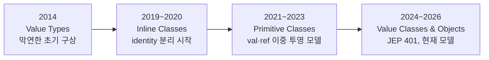
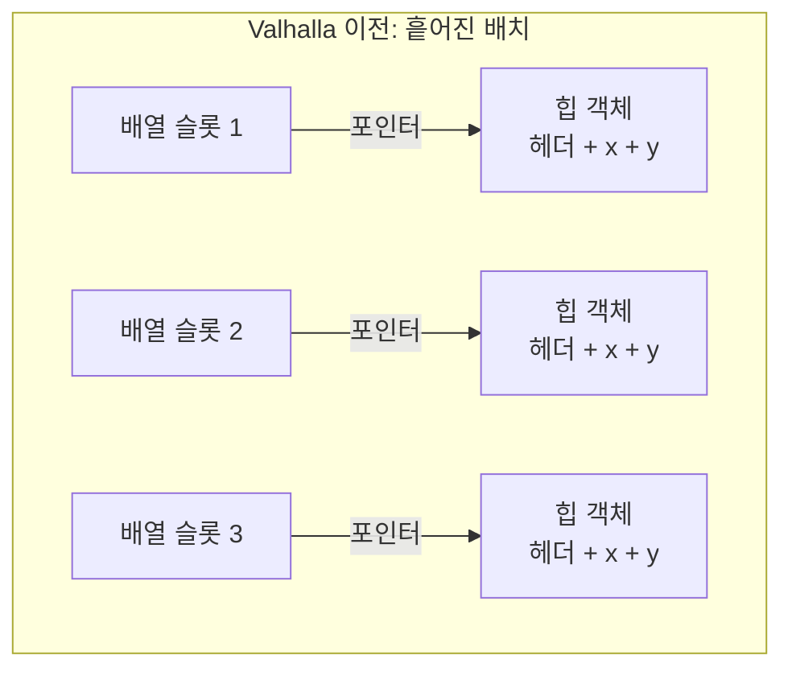
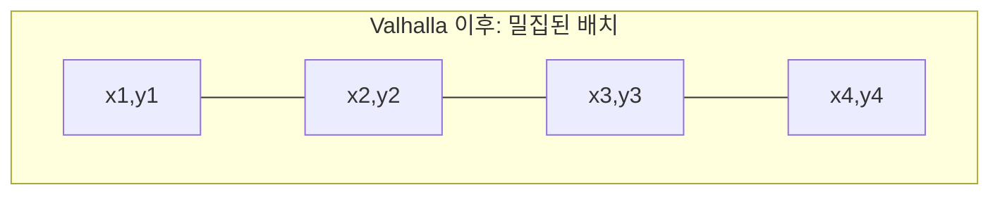
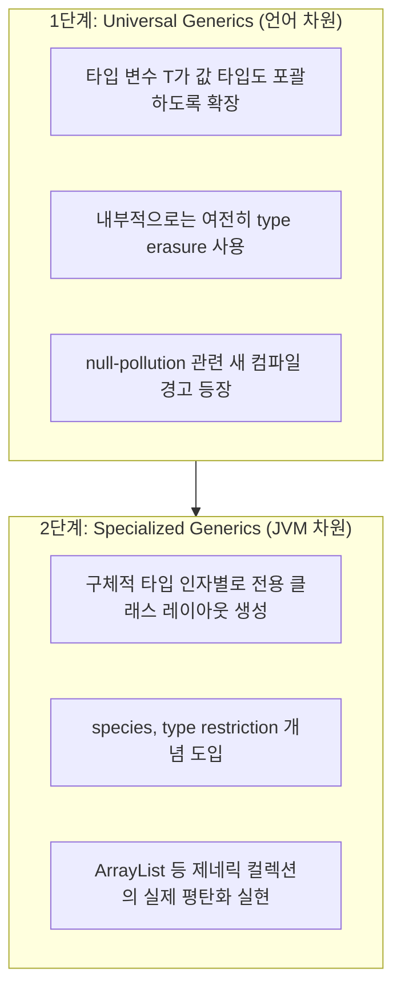

> 
> https://www.threads.com/@pixe.lab.x/post/DZyoQANjzwN
> 
> 자바 개발자들이라면 한 번쯤 들어봤을 'Project Valhalla'가 드디어 JDK 28에 포함된다고 해. 이 프로젝트는 무려 10년이나 걸려서 이번에 JDK에 들어가게 된 건데, 'Value Classes and Objects'라는 새로운 개념이 추가된대. 이게 뭐냐면, 기존의 자바 객체보다 메모리 사용을 줄이고 성능을 높일 수 있는 방식으로 객체를 관리하는 거야. 사람들이 많이 기대했던 기능이라서 개발자들 사이에서 화제가 되었어. 하지만 아직은 미리보기(preview) 단계라서 기본적으로는 비활성화되어 있어. Brian Goetz라는 사람은 이게 전체 프로젝트의 첫 번째 단계일 뿐이라고 말했어. 그래서 완전한 형태로 사용하려면 좀 더 기다려야 할지도 몰라. 이 프로젝트가 시작된 건 2014년인데, 그동안 많은 아이디어들이 나왔다가 버려지고, 수정되고 하면서 지금의 형태가 되었대.
> 
> 그래서 기존에 이 프로젝트가 완료될 거라고 믿지 않던 사람들이 이젠 '중요한 부분은 아직 안 나왔다'고 말할 정도로 기대가 컸던 거지. 결국, Valhalla 프로젝트는 자바의 성능을 크게 향상시킬 수 있는 잠재력을 가지고 있어서, 자바 애플리케이션 개발자들에게는 정말 중요한 소식이야. 앞으로 JDK 28에서 이 기능을 어떻게 활용할 수 있을지 기대가 돼. 네 생각은 어때? 이런 기술적인 변화가 실제 개발에 얼마나 큰 영향을 미칠 것 같아?
> 
> https://www.jvm-weekly.com/p/project-valhalla-explained-how-a
> 

## 무슨 일이 있었나

2026년 6월 15일, Oracle의 소프트웨어 엔지니어 Lois Foltan이 OpenJDK 개발자 메일링리스트를 통해 공식 확정 소식을 알렸다. **JEP 401: Value Classes and Objects (Preview)** 가 OpenJDK 메인라인에 통합되어 **JDK 28**을 목표로 한다는 내용이었다. 함께 통합되는 JEP로 "Strict Field Initialization"도 언급되었으며, openjdk/valhalla 저장소의 코드 프리즈는 6월 19일 금요일부터 시작되고, 메인라인 저장소(openjdk/jdk)로의 실제 통합은 7월 초로 예정되어 있다. 변경 규모가 워낙 크다 보니 다른 커미터들에게는 통합 작업이 끝날 때까지 대규모 리팩터링성 커밋을 자제해 달라는 요청까지 함께 전달되었다.

이 변경의 물리적 크기를 숫자로 보면 체감이 된다. 통합용 풀 리퀘스트(GitHub openjdk/jdk #31120) 하나가 **1,816개 파일에 걸쳐 19만 7천 줄 이상**을 추가한다. Java 진영에서 이 정도 규모의 단일 변경은 흔치 않다.

다만 정확히 짚어야 할 부분이 있다. 이번에 들어가는 것은 어디까지나 **프리뷰(preview)** 기능이며, 기본값은 비활성화 상태다. 사용해보려면 `--enable-preview` 플래그를 직접 켜야 한다. 그리고 이 프로젝트를 오랫동안 이끌어온 Brian Goetz는 이번 통합이 "Valhalla 전체 중 첫 번째 부분일 뿐"이라는 점을 분명히 했다. 그동안 "절대 안 나올 거다"라고 회의적이었던 사람들이 이제는 "나오긴 했는데 정작 중요한 부분은 빠졌다"는 쪽으로 논조를 바꿀 거라는 농담 섞인 코멘트도 있었다. Valhalla라는 프로젝트명 자체가 북유럽 신화의 전사자들이 가는 사후 세계에서 따온 것인데, 커뮤니티에서는 "우리가 죽어서 진짜 발할라에 가는 게 이 프로젝트가 끝나는 것보다 빠를 것"이라는 오래된 농담이 돌 정도로 지연이 길었다.

JDK 릴리스 일정을 기준으로 풀어보면 이렇다. 이 글을 쓰는 시점의 최신 정식 버전은 JDK 26이고, JDK 27은 2026년 9월, JDK 28은 2027년 3월에 나올 예정이다. Java는 6개월 주기로 릴리스되지만 모든 버전이 장기 지원(LTS)은 아니며, 다음 LTS는 2027년 9월에 나올 것으로 예상되는 JDK 29일 가능성이 높다. 즉 JDK 28에서의 프리뷰는 어디까지나 첫 실전 테스트이고, 많은 기업이 안정화된 Valhalla를 실제로 만나는 시점은 그보다 더 뒤, LTS 버전에서일 가능성이 크다.

## 왜 12년이나 걸렸나: 자바 객체 모델의 근본 문제

Valhalla가 풀려고 하는 문제를 이해하려면 자바의 가장 기초적인 설계로 돌아가야 한다. 자바에서는 `int`, `long`, `double`, `boolean` 같은 8개의 기본형(primitive)을 제외한 모든 타입이 참조 타입(reference type)이다. `Point p = new Point(1, 2)`라고 쓰면, 변수 `p`는 점 그 자체가 아니다. `p`는 포인터, 비유하자면 물품 보관소의 보관표 같은 것이다. 실제 점 데이터는 힙(heap) 어딘가에 별도로 존재하고, `p`는 그 주소를 가리키는 종이쪽지를 들고 있을 뿐이다. 필드를 하나 읽을 때마다 JVM은 이 "보관표를 들고 물품 보관소로 가는" 과정, 즉 포인터를 한 번 더 거치는 간접 참조(pointer indirection)를 수행해야 한다.

객체 하나일 때는 이게 별 문제가 안 된다. 문제는 규모가 커질 때 시작된다. 힙에 올라간 모든 객체는 자기만의 헤더를 갖는다. 객체의 타입 정보나 동기화(synchronization) 관련 정보 등을 담는, 십수 바이트 정도의 메타데이터다. 그리고 이 객체들은 힙 여기저기에 흩어져서 생성된다. 백만 개의 Point로 이루어진 배열이 있다면, 실제로는 백만 장의 보관표가 창고 곳곳에 흩어진 백만 개의 상자를 가리키고 있는 셈이다. Brian Goetz는 자신이 작성한 "State of Valhalla" 문서에서 이런 메모리 배치를 "fluffy"(푹신하고 부풀려진)하다고 표현했다. 우리가 진짜 원하는 건 데이터가 빈틈없이 나란히 붙어 있는 밀집된(dense) 배치다.

밀집도가 왜 그렇게 중요한가는 하드웨어의 변화와 관련이 있다. 1995년, 그러니까 자바가 처음 나온 시기에는 메모리 접근 비용과 CPU 연산 비용이 거의 비슷한 수준이었다. 그런데 지금은 CPU 속도가 메인 메모리보다 두 자릿수 단위로 빠르고, 그 격차를 캐시(cache)가 메워주고 있다. 프로세서는 메모리를 캐시 라인이라는 단위(보통 64바이트)로 읽어온다. 데이터가 순서대로 밀집해 있으면 캐시 라인 하나로 유용한 값을 한꺼번에 많이 가져올 수 있다. 반대로 포인터를 타고 여기저기로 점프하면, 접근할 때마다 캐시 미스(cache miss)가 날 위험이 있고, 이는 캐시 적중(hit) 대비 백 배 가까이 느려질 수 있다. 이것이 바로 "참조 지역성(locality of reference)"이고, 이번 프로젝트 전체가 걸려 있는 실질적인 승부처다.

여기서 "JVM에는 이미 escape analysis(탈출 분석)가 있지 않냐"는 반론이 나올 수 있다. 맞는 말이다. JVM은 어떤 객체가 코드의 국소적인 범위를 벗어나지 않는다는 걸 알아채면, 그 객체를 아예 힙에 할당하지 않을 수 있다. 프로그래머 입장에서는 객체가 존재하는 것처럼 보이지만, 실제로는 필드들이 평범한 변수나 CPU 레지스터로 흩뿌려진다. 가장 좋은 경우에는 할당 비용과 가비지 컬렉터의 후속 정리 비용이 사실상 0에 가까워진다.

문제는 이 최적화가 예측 불가능하고 깨지기 쉽다는 점이다. JIT 컴파일러가 객체의 흐름 전체를 높은 확신을 가지고 추적할 수 있을 때만 작동한다. 그런데 객체가 다른 클래스의 필드에 저장되거나, 배열에 담기거나, 더 복잡한 메서드로 넘어가거나, JIT가 분석할 수 있는 범위를 벗어나는 순간 이 트릭은 멈춰버린다. 소스 코드는 그대로인데 성능 특성이 크게 달라질 수 있다는 뜻이다. 그래서 경험 많은 JVM 개발자들은 escape analysis를 "있으면 좋은 보너스" 정도로 취급하지, 프로젝트의 기반으로 삼지 않는다. 애플리케이션의 성능이 특정 JIT 버전이 이 최적화를 적용해주느냐 마느냐에 좌우된다면, 예측하기 힘든 회귀(regression)의 함정에 빠지기 쉽다. 사소한 리팩터링 한 번, JDK 업데이트 한 번, 코드 구조 변경 한 번만으로도 객체가 다시 힙으로 돌아가고 할당·가비지 컬렉션 비용이 고스란히 되살아날 수 있다.

남은 선택지는 무식한 방법뿐이다. 객체를 포기하고 데이터를 직접 인코딩하는 것이다. `Color` 클래스 대신 `r`, `g`, `b` 세 개의 바이트를 그냥 들고 다니는 식이다. 이건 학술적인 예시가 아니라, 게임 엔진, 그래픽 라이브러리, 이미지 처리, 데이터베이스, 분석 엔진, HPC(고성능 컴퓨팅) 코드에서 실제로 수년간 쓰여온 방식이다. 메모리 1바이트, 할당 1건이 아쉬운 영역들이다. 문제는 이 속도를 안전성과 가독성을 희생해서 얻는다는 점이다. 이름도, 캡슐화된 상태도, 검증 로직도, 메서드도 사라진다. JEP 401 본문은 이런 예를 든다. "날(raw) 색상 바이트를 다루던 개발자가 실수로 BGR 순서를 RGB로 잘못 해석해서 빨강과 파랑이 뒤바뀌고, 결과 이미지 전체가 조용히 망가질 수 있다." 클래스였다면 이런 실수를 막아줬을 것이다. 그냥 정수 묶음이라면? 막아주지 못한다.

Valhalla가 없애려는 것이 바로 이 양자택일, 즉 "편리한 클래스냐, 빠른 기본형이냐"의 구도다.

## 12년의 시행착오: 다섯 번의 프로토타입과 네 번의 이름 변경

Project Valhalla는 공식적으로 2014년에 시작됐다. 자바의 아버지로 불리는 James Gosling은 당시 이 프로젝트를 두고 "박사 학위 여섯 개가 한 매듭에 얽혀 있는 것 같다"고 표현했는데, 과장이 아니었다. 흥미로운 점은 이 아이디어 자체는 프로젝트보다도 오래됐다는 사실이다. 자바를 처음 만든 사람들도 1995년 첫 버전부터 값 타입(value type)을 원했지만, 문제가 너무 어려워서 당시에는 포기했다.

목표는 야심 찼다. 프로그래밍 모델과 현대 하드웨어의 성능 특성 사이의 어긋남을 다시 맞추는 것. 다시 말해, 메모리상에서는 기본형처럼 평평하고 밀집되어 있으면서도 겉으로는 평범한 클래스처럼 보이고 동작하는 타입을 프로그래머가 직접 선언할 수 있게 하는 것이다.

말은 쉽지만 실제로는 그렇지 않았다. 이후 수년에 걸쳐 팀은 다섯 개의 서로 다른 프로토타입을 만들었고, 각각 문제의 다른 측면을 파고들었다. Valhalla의 지금 모습을 제대로 이해하려면, 그 과정에서 얼마나 많은 아이디어가 폐기되었는지를 봐야 한다.

초기 프로토타입들은 흔히 "Q World"라고 불리는 방향으로 진행됐다. 새로운 값 타입을 객체와는 근본적으로 다른 존재로 취급해서, 별도의 타입 디스크립터, 별도의 바이트코드, 별도의 최상위 타입을 두는 접근이었다. `int`처럼 동작해야 하니 `int`처럼 표현하자는 논리였는데, 문제는 이런 분리가 JVM 타입 시스템 전체를 이중 구조로 복잡하게 만든다는 데 있었다.

돌파구는 2019년 즈음 "L World"라는 이름이 붙은 프로토타입에서 나왔다. 이름의 유래는, 새로운 값 타입이 객체 참조와 동일한 "L 캐리어"(JVM이 일반 참조에 쓰는 L 디스크립터)를 공유하게 했다는 데서 왔다. 팀은 이런 통합이 너무 어려울 거라 예상했지만, 의외로 큰 타협 없이 작동했고 덤으로 이전 라운드들의 여러 문제까지 해결해버렸다.

L World는 이후 모든 작업의 방향을 정한 또 하나의 깨달음을 안겨줬다. 언어 모델과 JVM 모델이 100% 일치할 필요는 없다는 것이다. L World는 가상 머신 입장에서 옳은 모델이지만, 이를 컴파일 타깃으로 두고 프로그래머에게는 그보다 더 편한 무언가를 언어 차원에서 제공할 수 있다. 이 계층 분리가 이후 전체 프로젝트의 핵심 열쇠가 되었다. 그리고 이때부터 작업을 두 단계로 나누는 계획, 즉 먼저 값 클래스(당시에는 다른 이름이었다)를 만들고 그다음에 특수화된 제네릭(specialized generics)을 다루자는 구상이 자리 잡았다.

이름이 바뀐 과정을 따라가 보면 모델이 어떻게 단순해져 왔는지가 가장 잘 보인다.

| 단계 | 시기 | 이름 | 핵심 아이디어 |
|---|---|---|---|
| 1단계 | 2014년경 | Value Types | 아직 정확한 형태가 정해지지 않은 막연한 구상 |
| 2단계 | 2019~2020년 | Inline Classes | identity 클래스와 identity 없는 inline 클래스로 분리. "클래스처럼 코딩하고 int처럼 동작한다"는 슬로건 등장 |
| 3단계 | 2021~2023년 | Primitive Classes (val/ref 이중 투영) | 하나의 타입에 값 변형(`.val`)과 참조 변형(`.ref`) 두 가지 투영을 두는 모델. `Point!` / `Point?` 문법도 실험됨 |
| 4단계 (현재) | 2024~2026년 | Value Classes & Objects (JEP 401) | identity 유무와 null 허용 여부를 서로 별개의 질문으로 분리. 현재 모델 |



3단계의 "primitive classes"는 특히 눈여겨볼 만하다. 2021년 "State of Valhalla" 문서에서는 값 객체(value objects), 프리미티브 클래스(primitive classes), 특수화된 제네릭(specialized generics) 이렇게 세 가지를 약속했었다. "프리미티브 클래스"는 하나의 타입이 두 가지 투영을 갖는 모델이었다. 값 변형(평평하고, null이 될 수 없고, 기본형처럼 동작)과 참조 변형(null을 허용하는 박스)을 동시에 가지는 식이다. 여러 버전을 거치며 `Point.val`/`Point.ref`로 표기되기도 했고, 나중에는 `Point!`와 `Point?` 문법으로 실험되기도 했다. 모델 자체는 강력했지만 인지 부담이 컸다. 프로그래머가 같은 타입의 두 가지 형태를 매일 오가며 언제 변환이 일어나는지 이해해야 했기 때문이다. 결국 팀은 "사용자를 위해 모델을 단순화하라, 그 대가로 성능 상한선을 일부 포기하더라도"라는 원칙에 따라 이 이중 구조를 해체했다.

지금의 JEP 401(작성자 Dan Smith, 리뷰어 Brian Goetz)이 도달한 결론은 단순하다. 새로 추가되는 것은 딱 하나, `value` 키워드로 선언하는 값 클래스(value class)뿐이다. 그 인스턴스는 값 객체(value object)이며, identity가 없는 객체다. 그리고 (이 부분이 중요한데) 값 클래스도 여전히 참조 타입(reference type)이다. non-nullable(널을 허용하지 않는) 처리에 관한 복잡한 부분은 별도의, 아직은 선택적인 JEP인 "Null-Restricted Value Class Types"로 완전히 분리됐다. 그래서 지금은 하나의 복잡한 개념 대신, "identity가 있는가"와 (나중을 위해 별도로) "null을 허용하는가"라는 서로 독립적인 두 가지 단순한 질문만 남았다.

이건 기억해 둘 가치가 있는 부분이다. 예전 글이나(혹은 Baeldung처럼 "primitive classes"를 별개의 메커니즘으로 설명하는 자료) 이를 다루는 자료를 보게 된다면, 그건 이제는 폐기된 옛 모델을 설명하는 글이다. 현재 OpenJDK 공식 문서 체계에서는 그런 의미의 "primitive classes"는 더 이상 존재하지 않는다.

이 과정에서 다른 안들도 함께 정리됐다. 원래의 "Value Objects" JEP 초안은 철회되고 JEP 401로 대체됐다. 원래의 "Universal Generics" 초안도 재작업을 위해 다시 들어갔다. JEP 401과 함께 진행되는 것이 JEP 402: Enhanced Primitive Boxing(역시 프리뷰)이고, 그 외에도 일련의 얼리 액세스 빌드(LW1, LW2, LW3…)와 JVM Language Summit에서 발표된 세션들, 예컨대 Frédéric Parain의 힙 평탄화(heap flattening) 발표나 Dan Smith의 새로운 객체 초기화 모델 발표가 이 과정을 뒷받침했다.

이 12년을 한 문장으로 요약하면 이렇다. 12년은 "코드를 쓴" 12년이 아니라, 실제로 유지보수 가능한 단 하나의 모델이 남을 때까지 아이디어를 계속 폐기해온 12년이었다.

## JEP 401이 실제로 도입하는 것

### 선언 방식

값 클래스는 `value` 키워드를 붙이는 것만으로 선언한다.

```java
value class USDCurrency implements Comparable<USDCurrency> {
    private int cents; // 암묵적으로 final

    public USDCurrency(int dollars, int cents) {
        this.cents = dollars * 100 + cents;
    }

    public USDCurrency plus(USDCurrency that) {
        return new USDCurrency(0, this.cents + that.cents);
    }
    // dollars(), cents(), compareTo(), toString() ...
}
```

값 레코드(value record)로 선언할 수도 있다. 규칙은 다음과 같다. 인스턴스 필드는 모두 암묵적으로 final이고, 메서드에 `synchronized`를 붙일 수 없으며, 클래스는 기본적으로 final이다(다만 값 클래스와 추상 값 클래스로만 구성된 계층 구조는 만들 수 있다). identity를 가진 클래스는 상속할 수 없지만, 인터페이스는 자유롭게 구현할 수 있다. 이런 제약을 제외하면 평범한 클래스와 다를 게 없다.

### 가장 핵심적인 특징: identity가 없다

이게 핵심이다. 평범한 객체는 identity를 가진다. 따로따로 만든 두 개의 `new Point(1,2)`는 내용이 똑같아도 서로 다른 두 객체다. 반면 값 객체는 identity가 없다. `int` 타입의 4라는 값이 "서로 다른 두 개의 4"로 존재하지 않는 것과 마찬가지다. 여기서 여러 결과가 따라 나온다.

`==`의 의미가 바뀐다. 지금까지 `==`는 identity, 즉 같은 주소인지를 비교했다. 값 객체에 대해서는 `==`가 substitutability(대체 가능성)를 검사한다. 같은 클래스이고 모든 필드 값이 (재귀적으로) 같은지를 비교하는 것이다. 기본형 필드는 비트 단위로, 객체 필드는 다시 `==`로 재귀 비교한다. 그래서 `new USDCurrency(3,95) == new USDCurrency(3,95)`는 `true`를 반환한다. `Integer`를 둘러싼 그 유명한 `==` 혼란을 해소하는 좋은 소식이지만, 한 가지는 주의해야 한다. `==`는 내부 상태를 비교하는 것이고, 이게 항상 그 객체가 "표현하는" 값과 같지는 않다. "같은 데이터를 나타내는가"를 묻고 싶다면 여전히 `equals`를 쓰는 게 안전하다.

`synchronized`는 예외를 던진다. 동기화할 대상 자체가 없기 때문에, 값 객체에 `synchronized`를 쓰면 `IdentityException`이 발생한다. 강제로 identity가 필요한 상황을 위해 `Objects.requireIdentity`와 `Objects.hasIdentity`라는 새 헬퍼 메서드가 추가된다.

그리고 가장 중요한, 흔히 오해하기 쉬운 부분이 있다. **값 객체도 여전히 null이 될 수 있다.** "값(value) = 기본형 같은 것 = 절대 null이 아니다"라고 생각하기 쉬운데, JDK 28 모델에서 값 클래스는 어디까지나 참조 타입(reference type)이다. `USDCurrency d = null;`은 완전히 합법적인 코드다. null을 막는 기능(non-nullable, null restriction)은 별도의, 아직은 미래의 JEP("Null-Restricted Value Class Types")로 분리되어 있고 JDK 28에는 포함되지 않는다. 이 부분은 OpenJDK 공식 JEP 본문과 Wikipedia의 Project Valhalla 항목, 그리고 복수의 보도 자료에서 일관되게 확인되는 사실이다. 일부 블로그성 자료에서 "값 타입은 본질적으로 null이 될 수 없다"고 설명하는 경우가 있는데, 이는 정확하지 않은 설명이니 참고할 때 주의가 필요하다. 사소한 디테일이 아니라 완전한 성능을 끌어내는 데 결정적인 분기점이기 때문에, 뒤에서 다시 다룬다.

### 런타임 최적화: 스칼라화와 힙 평탄화

JEP 401은 JVM에게 두 가지 방식으로 값 객체를 최적화할 자유를 준다.

**스칼라화(scalarization)** 는 JIT 컴파일러 기법이다. 값 객체에 대한 참조를 그 "본질", 즉 필드 값들의 집합으로 분해해서 감싸는 컨테이너 없이 다룬다. `Color`에 대한 포인터를 넘기는 대신, JIT는 그냥 `r`, `g`, `b` 세 바이트(여기에 참조가 null인지 표시하는 플래그 비트 하나가 더 붙는다)를 직접 넘긴다. 이렇게 되면 사실상 할당 비용이 없고, 가비지 컬렉터가 할 일도 없다. escape analysis와 비슷해 보이지만, 훨씬 예측 가능하고 적용 범위도 넓다. JIT가 인라인하지 못한 메서드 호출의 경계를 넘어서도 작동한다. 단, 변수의 타입이 값 클래스의 상위 타입(예: `Object`, 혹은 중요하게는 타입 소거가 일어난 제네릭 매개변수)일 때는 보통 스칼라화가 적용되지 않는다. 이런 경우 객체는 힙에 실체화(materialize)되어야 한다.

**힙 평탄화(heap flattening)** 는 두 번째 메커니즘이다. 객체의 본질을 컴팩트한 비트 벡터로 인코딩해서, 다른 위치를 가리키는 포인터 없이 필드나 배열 칸에 직접 써넣는다. 밀집도와 지역성이 만들어지는 지점이 바로 여기다.

다만 알아둬야 할 제약이 하나 있다. 평탄화된 데이터는 원자적(atomic)으로 읽고 쓸 수 있어야 한다(그렇지 않으면 동시 접근 시 "찢어짐(tearing)" 현상이 생길 위험이 있다). 일반적인 플랫폼에서 "충분히 작다"는 기준은 null 플래그를 포함해 64비트 정도다. 그래서 작은 값 클래스들은 잘 평탄화되지만, 예를 들어 `int` 필드 두 개나 `double` 필드 하나를 가진 클래스는 원자적 쓰기에 들어가지 못해서 결국 평범한 힙 객체로 처리될 수 있다. 앞으로는 128비트 인코딩이 추가될 예정이고, 앞서 언급한 null-restricted 타입을 위한 JEP가 도입되면 원자성 보장을 일부 포기하는 대신 더 큰 클래스도 평탄화할 수 있게 된다. 바로 이 지점에서 non-nullability가 단순한 장식이 아니라 성능을 끌어올리는 실질적인 지렛대가 된다.

### 박싱 비용 절감

오래된 골칫거리였던 박싱(`int`를 `Integer`로 감싸는) 비용을 떠올려 보자. 새 모델에서는 박싱 래퍼 클래스 자체가 값 클래스로 전환된다. 프리뷰가 켜져 있으면 `Integer`, `Long`, `Double` 같은 클래스들이 identity를 잃는다. 박스 자체에 identity가 없어지므로 JVM은 이를 스칼라화하고 평탄화할 수 있다. 결과적으로 `Integer[]`는 `int[]`에 가까운 효율에 다가갈 수 있고, JEP 401 본문 표현을 빌리면 박싱 오버헤드가 극적으로 줄어든다. 함께 진행되는 JEP 402(Enhanced Primitive Boxing)는 한 걸음 더 나아가 기본형과 그 박스 사이의 변환을 매끄럽게 만들어서, 이를테면 `List<int>` 같은 표현으로 가는 길을 열어준다. 다만 이건 아직 별도로 성숙해가는 작업이므로, JEP 401과 함께 완전한 형태로 들어온다고 가정해서는 안 된다.

JDK 본문에서는 어떤 표준 라이브러리 클래스들이 정확히 값 클래스로 전환되는지를 직접 명시하고 있다. 박싱 래퍼 클래스들과 `LocalDate` 등 "단순한 불변 도메인 값"을 표현하는 일부 클래스가 우선 대상으로 거론되며, 이런 클래스들은 평소에도 identity에 의존하지 않도록 권장되어 온 이른바 "value-based" 클래스였기 때문에 호환성 영향이 최소화되도록 설계되었다.

## 예시로 보는 차이

가장 단순한 사례를 따라가 보면, JVM 내부를 몰라도 무엇이 달라지는지 알 수 있다.

Valhalla 이전:

```java
final class Point {       // identity를 가진 평범한 클래스
    final int x;
    final int y;
    Point(int x, int y) { this.x = x; this.y = y; }
}

Point[] points = new Point[1_000_000];
```

이 코드가 메모리에서 어떻게 동작하는가 하면, `points` 배열은 백만 개의 포인터다. 각 포인터는 힙 어딘가에 흩어져 있는 별도의 `Point` 객체를 가리킨다. 그리고 각 객체는 단순히 두 개의 `int`(8바이트)가 아니라, 십수 바이트짜리 헤더까지 함께 들고 있다. 이 객체들은 서로 다른 시점에, 서로 다른 위치에 할당기(allocator)가 만들어낸 것이라 흩어져 있다. 배열을 순회하며 좌표 합을 구하면, 각 점마다 배열에서 포인터를 읽고, 그 주소로 점프하고(캐시 미스 위험), 필드를 읽는 과정이 백만 번 반복된다. 앞서 말한 "fluffy"한 배치다.



Valhalla 이후:

```java
value class Point {       // identity가 없는 값 클래스
    final int x;
    final int y;
    Point(int x, int y) { this.x = x; this.y = y; }
}

Point[] points = new Point[1_000_000];
```

코드상의 차이는 `value`라는 단어 하나뿐이다. 그런데 메모리상의 차이는 근본적이다. JVM은 이제 값 자체를 배열에 직접, 빈틈없이 연속해서 저장할 수 있다. 점 하나당 8바이트(여기에 null 플래그가 더 붙을 수 있다)가 연속된 블록 안에 들어간다. 원소마다 헤더가 따로 붙지 않는다. 포인터도 없다. 힙 여기저기로 점프할 일도 없다.



이 상태에서 배열을 순회하면 프로세서는 데이터를 순서대로 읽어 들인다. 64바이트짜리 캐시 라인 하나만으로도 여러 점의 데이터를 한 번에 가져올 수 있다. 백만 개 좌표를 합산하는 작업이 캐시 미스에 발목 잡히는 대신 메모리 대역폭 한계 가까이에서 돌아간다는 뜻이다. 데이터 집약적인 코드에서는 이게 퍼센트 단위가 아니라 배수 단위의 차이로 나타날 수 있다.

가장 중요한 점은, 이 이득을 추상화를 포기하지 않고 얻었다는 것이다. `Point`는 여전히 클래스다. 이름이 있고, 생성자가 있고, 검증 로직(`if (x < 0) throw ...`)을 넣을 수 있고, 메서드를 가질 수 있다. 예전처럼 점들을 `int[] xs`와 `int[] ys`라는 별도의 배열 두 개로 쪼개놓고 인덱스가 어긋나지 않기만을 바랄 필요가 없다. 기본형의 밀집도와 클래스의 가독성을 동시에 얻은 것이다. Project Valhalla 전체를 단 하나의 예시로 압축하면 이 모습이 된다.

## 아직 남은 절반: 제네릭 문제

이 부분은 Valhalla의 두 번째 절반이고, 솔직히 더 어려운 쪽이다. 문제의 출처부터 짚어보자.

자바는 제네릭을 타입 소거(type erasure)로 구현한다. 실행 시점에 `List<String>`과 `List<Integer>`는 똑같은 평범한 `List`이고, 타입 매개변수 `T`는 `Object`로 소거된다. 이건 종종 비웃음의 대상이 되지만, 게으름이 아니라 신중한 선택이었다는 점은 알아둘 만하다. 타입 소거 덕분에 자바는 점진적 마이그레이션 호환성을 가질 수 있었다. 기존의 제네릭이 아니던 클래스를 단 하나의 기존 소스 파일이나 컴파일된 클래스도 깨뜨리지 않고 제네릭으로 만들 수 있었고, 사용하는 쪽은 즉시 마이그레이션하든, 나중에 하든, 아예 안 하든 자유였다. 2004년, 그러니까 이미 자바 코드베이스가 거대했던 시기에 "제네릭을 줄 테니 기존 라이브러리는 다 버려라"라는 대안은 끔찍한 거래였을 것이다. 지금이라면 더더욱 그렇다.

문제는 타입 소거가 하필 우리가 성능을 가장 신경 쓰는 지점에서 Valhalla와 충돌한다는 데 있다. `T`가 `Object`로 소거되기 때문에, `List<Point>`에 담긴 값 객체는 힙 위의 평범한 객체로 실체화되어야 한다. 다시 말해, 평탄화될 수 있었던 아름다운 `Point`도 제네릭 컬렉션 안에 들어가는 순간 평탄화를 잃는다. 컨테이너는 참조를 들고 있지, 평탄한 값을 들고 있지 않다. `Point[]`에서 얻었던 밀집도가 `ArrayList<Point>`에서는 통째로 증발한다.

이 문제를 푸는 계획도 Valhalla답게 두 단계로 나뉜다.



**1단계: Universal Generics.** 언어 차원의 변화다. 타입 변수가 값 타입도 포괄할 수 있게 해서, `ArrayList<Point>`나 `List<int>` 같은 표현을 쓸 수 있게 만드는 것이다. 다만 아직은 타입 소거를 통해서다. 프로그래머가 체감하는 변화는 주로 "null pollution"에 관한 새로운 컴파일러 경고일 텐데, `T` 타입의 필드는 `T`가 값 타입이더라도 기본값이 null로 시작하기 때문이다. 이 경고들을 해소해 나가는 작업이 API를 "specialization-ready"(특수화 준비 완료) 상태로 만드는 과정이다.

**2단계: Specialized Generics.** 구체적인 타입 인자에 대해 이질적이고 특수화된 클래스 레이아웃을 생성해주는, 앞으로 추가될 JVM 차원의 확장이다(프로젝트 용어로는 species, type restriction이라 부른다). 이 단계가 되어서야 `ArrayList<Point>`가 실제로 평평한 메모리로 뒷받침된다. 아직은 상당 부분 연구 단계의 작업이다.

라이브러리와 프레임워크 생태계에 미칠 영향은 막대하고, 그래서 정확히 이 부분이 점진적으로 진행되고 있다. 궁극적으로는 컬렉션, 스트림, 그리고 여러 API 전체가 값 타입 위에서 평탄하고 할당 없는 형태가 될 수 있다. 하지만 라이브러리 저자들은 새로 생기는 경고들을 해소하고 특수화를 염두에 둔 설계를 해야 할 것이다. 솔직히 말하면 원래의 Universal Generics 초안도 한 차례 재작업을 거쳤고, 특수화에서 오는 완전한 보상은 미래의 릴리스들에서나 받을 수 있는 일이다. JDK 28은 이 부분을 가져오지 않는다.

## 정리: JDK 28에 무엇이 들어오고, 무엇이 아직 안 들어오는가

| 구분 | 내용 |
|---|---|
| 채택된 것 | JEP 401(Value Classes and Objects)이 프리뷰 기능으로 JDK 28에 목표 설정. 메인라인 통합은 2026년 7월 초 예정, 정식 릴리스는 2027년 3월 |
| 함께 진행 | "Strict Field Initialization" JEP, JEP 402(Enhanced Primitive Boxing, 역시 프리뷰) |
| 규모 | 풀 리퀘스트 기준 1,816개 파일, 19만 7천 줄 이상 변경 |
| 기본 상태 | 비활성화. `--enable-preview` 플래그로 직접 켜야 사용 가능 |
| 사용자가 실제로 쓸 수 있는 것 | `value class`, `value record` 선언 / JDK 내 일부 value-based 클래스(박싱 래퍼 클래스 등)의 값 클래스 전환(프리뷰 한정) / 조건을 만족하는 클래스에 대한 스칼라화·힙 평탄화 / 박싱 비용 절감 |
| 아직 빠진 것 | null-restricted(non-nullable) 타입 / 완전한 specialized generics / 128비트 인코딩 / 완전히 성숙한 JEP 402 |
| 안정성 주의 | 프리뷰 기능이므로 문법 자체가 피드백에 따라 릴리스마다 바뀔 수 있음 |

생태계에 미칠 영향을 생각해보면, 데이터 처리, 벡터 연산, 머신러닝, 게임 개발, 금융처럼 고성능이 중요한 자바 영역에는 추상화를 포기하지 않고 밀집된 데이터를 다룰 수 있는 길이 열리는 셈이다. 이는 일부 영역에서 수년간 기다려온 변화이기도 하다. 프레임워크와 라이브러리들은 자신들의 value-based 클래스를 값 클래스로 점차 마이그레이션해 나갈 것이다. 동시에 `==`와 `synchronized`의 동작 변화로 인한, identity에 (의도했든 아니든) 의존하던 코드의 길고 긴 부작용 목록도 따라올 가능성이 있다. 그리고 한 가지 더 기억해 둘 점은, JDK 28은 LTS가 아니라는 사실이다. 다음 LTS는 2027년 9월로 예상되는 JDK 29일 가능성이 높다. 그래서 대다수 기업은 안정화된 Valhalla를 LTS에서야 만나게 되겠지만, 실제 코드와의 피드백 루프를 시작시키는 건 바로 28에서의 이번 프리뷰다.

## 왜 이게 자바 역사에서 손꼽히는 변화인가

Valhalla가 단순히 또 하나의 기능을 얹는 게 아니라고 평가받는 이유는, 자바의 가장 깊은 전제 하나를 움직이기 때문이다. "모든 객체는 identity를 가진다"는 1995년부터 자바에서 참이었고, 그 위에 다른 모든 것이 서 있던 토대였다. 프로그래머가 이 전제에서 빠져나올 수 있게(어떤 객체가 identity를 필요로 하고, 어떤 객체는 그렇지 않은지 직접 고를 수 있게) 만든다는 것은 단순한 리팩터링이 아니라 토대 자체의 이동이다. 그리고 바로 이 점 때문에 향후 10년에 걸친 후속 작업들, 즉 기본형과 객체의 통합, 제네릭의 특수화, 더 밀집된 컬렉션, 더 빠른 수치 연산이 가능해진다.

동시에 솔직하게 짚어야 할 부분도 있다. "Valhalla가 JDK 28에 들어온다"는 말은 절반의 진실이다. 이건 다단계 롤아웃의 첫 번째, 그것도 프리뷰 단계다. 다만 정확히 이 팀의 원칙, 즉 "사람을 위해서는 모델을 단순화하고, 어려운 성능 작업은 선택적으로 남겨둔다"는 원칙이야말로 12년이라는 시간이 걸린 이유이자, 지금이라도 출시할 수 있게 된 이유다.

자바 개발자 입장에서 문법 자체보다 더 중요하게 가져가야 할 한 가지는 "identity와 value의 구분"을 내재화하는 일이다. `==`의 의미 변화, 평탄화, 제네릭과의 상호작용 등은 모두 이 하나의 구분에서 따라 나오는 결과들이다. 그리고 얼리 액세스 빌드는 이미 공개되어 있다. 자신의 코드 위에서 직접 만져볼 수 있는 시점이 와 있다는 뜻이다.

## 자주 나오는 질문들

**`value class`는 그냥 `record`인가?** 아니다. 둘은 서로 독립적인(orthogonal) 결정이다. `record`는 "내부 상태를 별도로 두는 것을 포기한다"(내용 = 컴포넌트)는 뜻이고, `value`는 "identity를 포기한다"는 뜻이다. 평범한 클래스, 레코드, 값 클래스, 값 레코드까지 어떤 조합도 가능하다.

**값 객체를 `==`로 비교할 수 있나?** 가능하다. 다만 `==`의 의미 자체가 바뀌었다. 이제는 substitutability, 즉 모든 필드를 재귀적으로 비교하는 것이지, 메모리 주소를 비교하는 게 아니다. "같은 데이터를 나타내는가"라는 질문에는 여전히 `equals`가 더 적합한 경우가 많다. `==`는 내부 상태를 보는데, 이게 항상 그 객체가 표현하는 값과 같지는 않기 때문이다.

**값 클래스는 null이 될 수 있나?** JDK 28 모델에서는 가능하다. `value class`도 참조 타입이다. non-nullable(null 제한이 있는) 타입은 별도의, 아직은 미래의 JEP이고, 이게 추가되어야 더 큰 값 클래스의 평탄화도 가능해진다. JDK 28에는 포함되어 있지 않다.

**`Integer`가 값 클래스가 되면 기존 코드가 깨지나?** 대부분의 경우는 그렇지 않다. 기존 바이너리는 여전히 정상적으로 링크되고, 새로 생기는 컴파일 오류는 이런 타입에 `synchronized`를 시도하는 경우뿐이다. 체감할 만한 변화는 identity에 의존하던 코드에서 나타난다. `Integer`에 대한 `==`는 이제 값으로 비교되고, `synchronized(someInteger)`는 더 이상 작동하지 않는다. 둘 중 하나에 의존하고 있었다면, 애초에 취약한 코드였을 가능성이 크다.

**빠르고 평평한 `ArrayList<Point>`를 바로 쓸 수 있나?** 아직은 아니다. 타입 소거 때문에 제네릭 컬렉션 안의 객체는 힙에 실체화된다. 평탄한 제네릭 컬렉션을 쓰려면 universal generics와 specialized generics가 모두 필요하고, 이건 미래의 작업이다. JDK 28에서 평탄화는 필드와 값 타입 배열(예: `Point[]`)에 대해서만 직접 작동한다.

**C#의 `struct`와는 뭐가 다른가?** C#의 `struct`는 identity와 변경(mutation)을 가진다. 그래서 대입이나 전달 시 복사가 일어나는 시점 등을 정밀하게 정의해야 하고, 이는 프로그래머에게는 더 무거운 모델을, 런타임에는 더 적은 자유를 준다. Valhalla의 값 객체는 identity가 없고, 메모리에 어떻게 배치할지는 전적으로 JVM의 재량에 맡겨진다. 사람에게는 더 단순한 모델, 기계에는 더 많은 자유를 주는 방향이다.

**escape analysis가 이미 다 해주던 일 아닌가?** 일부는 맞다. escape analysis는 객체가 identity에 의존하지 않는다는 걸 증명할 수 있을 때 할당을 회피할 수 있지만, 예측하기 어렵고 객체가 필드나 배열에 들어가거나 최적화 범위 밖으로 "탈출"하면 도움이 되지 않는다. 값 객체의 스칼라화는 더 예측 가능하고 훨씬 넓은 범위, 메서드 호출 경계를 넘어서까지 적용된다.

**완전한 Valhalla, 즉 제네릭과 non-null 타입까지 포함한 모습은 언제 보게 되나?** 향후 릴리스들에 걸쳐서다. 팀은 이를 점진적으로 출시하고 있고, JDK 28은 값 클래스의 첫 프리뷰일 뿐이다. 나머지 이야기(특수화된 제네릭, null-restricted 타입, 128비트 인코딩)는 여러 릴리스에 걸쳐 펼쳐질 것이고, 안정화 시점은 다음 LTS 즈음일 가능성이 높다.

## 직접 만져보고 싶다면

얼리 액세스 빌드는 jdk.java.net/valhalla 에서 받을 수 있다. 빌드를 받은 뒤 `--enable-preview` 플래그를 켜고 `value class`를 직접 선언해보면, 이 글에서 설명한 차이를 자신의 코드 위에서 확인해볼 수 있다.

---

## 참고 자료

- OpenJDK, "JEP 401: Value Classes and Objects (Preview)" — https://openjdk.org/jeps/401
- OpenJDK jdk-dev 메일링리스트, Lois Foltan, "JEP 401 ... JDK 28 July integration" 공지
- GitHub openjdk/jdk Pull Request #31120 (JEP 401 통합 PR)
- The Register, "Java's Project Valhalla finally lands a preview in JDK 28" (2026년 6월 15일)
- TheNextWeb, "Java's biggest language change in a decade is finally landing" 보도
- Inside.java, "Try Out JEP 401 Value Classes and Objects" (얼리 액세스 빌드 사용기, 2025년 10월)
- OpenJDK JEP draft 8316779, "Null-Restricted Value Class Types (Preview)"
- OpenJDK JDK-8303099, "Null-Restricted and Nullable Types (Preview)"
- Wikipedia, "Project Valhalla (Java language)" 항목
- JVM Weekly vol. 180, "Project Valhalla, Explained: How a Decade of Work Arrives in JDK 28" (원본 분석 글, 사용자 제공 자료)

---

작성일: 2026년 6월 20일
