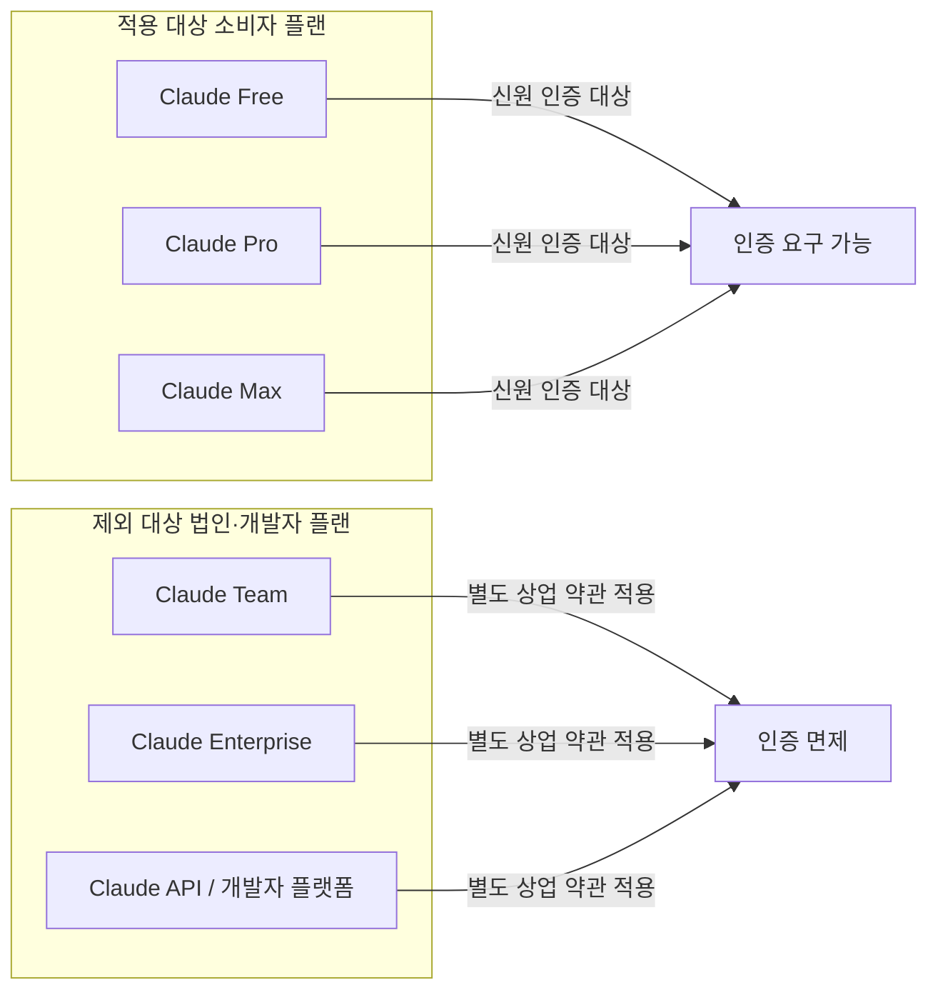
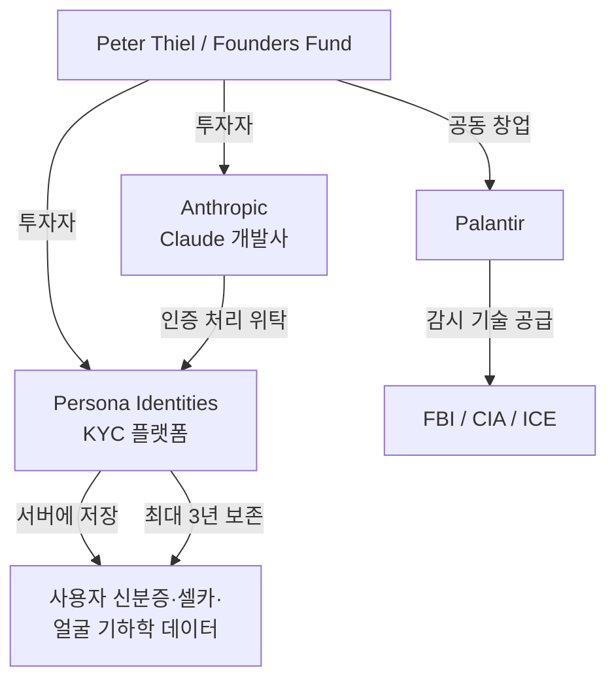
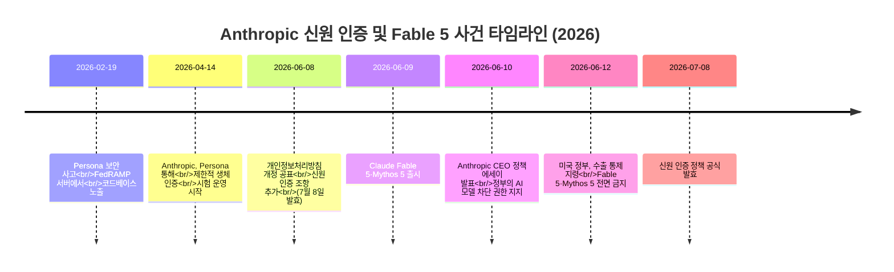
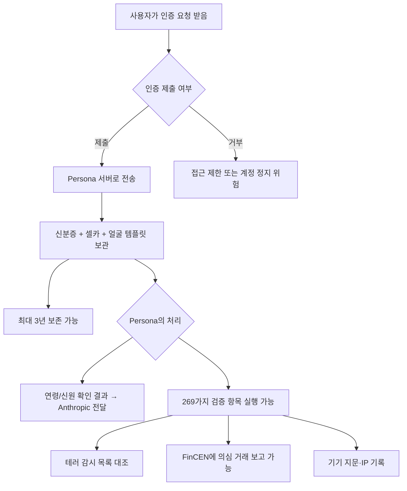
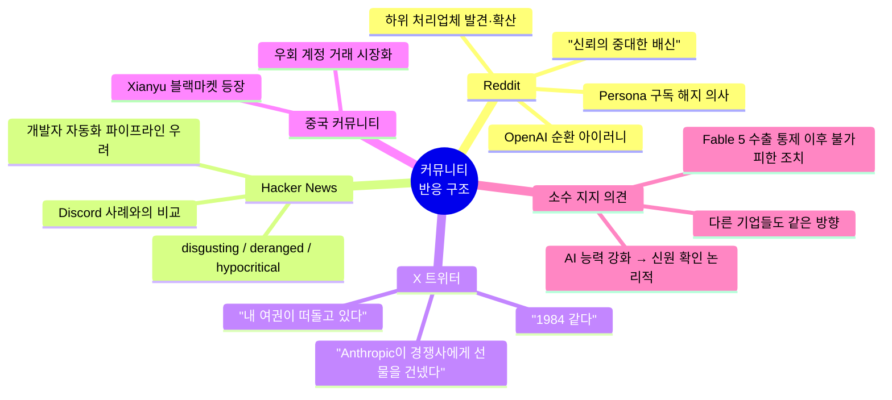

> 정부 신분증, 실시간 셀카, 얼굴 기하학 템플릿까지 — AI 서비스 최초의 소비자 생체정보 의무화

---

## 목차

1. [무슨 일이 일어나고 있는가](#1-무슨-일이-일어나고-있는가)
2. [정책 변경의 세부 내용](#2-정책-변경의-세부-내용)
3. [인증 처리 기업: Persona Identities](#3-인증-처리-기업-persona-identities)
4. [연령 전용 인증: Yoti](#4-연령-전용-인증-yoti)
5. [왜 지금인가 — 배경과 맥락](#5-왜-지금인가--배경과-맥락)
6. [실제 사용자에게 일어난 일](#6-실제-사용자에게-일어난-일)
7. [법적·개인정보 관점에서 본 쟁점](#7-법적개인정보-관점에서-본-쟁점)
8. [경쟁사 비교: OpenAI·Google은 어떻게 하고 있나](#8-경쟁사-비교-openaigoogle은-어떻게-하고-있나)
9. [커뮤니티와 전문가 반응](#9-커뮤니티와-전문가-반응)
10. [앞으로의 전망](#10-앞으로의-전망)

---

## 1. 무슨 일이 일어나고 있는가

2026년 6월 8일경, Anthropic은 개인정보처리방침을 조용히 개정했다. 그 핵심은 단 한 문장으로 요약된다. "특정 상황에서 귀하의 연령 또는 신원을 확인하도록 요청할 수 있습니다." 그 효력 발생일은 **2026년 7월 8일**이다.

이 변경은 겉보기엔 단순한 약관 업데이트처럼 보일 수 있다. 그러나 내용을 들여다보면 AI 서비스 역사상 주요 소비자 AI 플랫폼이 처음으로 **생체정보 기반 신원 인증을 공식화**한 사건임을 알 수 있다. 정부 발급 신분증 원본, 실시간 셀카, 그리고 '얼굴 기하학 템플릿(facial geometry template)'이라는 이름의 안면 수치 데이터까지 수집 대상에 명시적으로 포함되었다.

사실 인증 자체가 완전히 새로운 일은 아니다. Anthropic은 이미 2026년 4월 14일부터 제3자 인증 업체 Persona Identities를 통해 제한적인 생체 인증을 '일부 사례'에 한해 조용히 시범 운영해 왔다. 6월의 개인정보처리방침 개정은 그 시험 운영을 전체 소비자 플랜으로 공식 확대한 것이다. TechTimes가 "주요 미국 프런티어 AI 연구소가 소비자 개인정보처리방침에 이 수준의 생체정보 수집을 명문화한 것은 이번이 처음"이라고 보도한 것은 이 맥락에서다.

정책이 적용되는 대상은 **Claude Free, Claude Pro, Claude Max** 구독자 전원이다. Claude Team, Enterprise, 그리고 API를 사용하는 개발자 및 법인 고객은 별도의 계약 조건에 따라 움직이므로 이번 정책에서 제외된다.

---

## 2. 정책 변경의 세부 내용

### 수집 가능한 데이터

Anthropic의 개정 개인정보처리방침은 '인증 데이터(Verification Data)'라는 새로운 항목을 신설하고, 인증 방법에 따라 수집될 수 있는 정보를 다음과 같이 명시했다.

| 수집 데이터 항목 | 설명 |
|---|---|
| 정부 발급 신분증 사본 | 여권, 운전면허증, 주민등록증류의 실물 원본 전면 |
| 신분증 기재 정보 | 성명, 생년월일, ID 번호 등 |
| 사진 또는 동영상 | 실시간 셀카(라이브 셀피) 또는 짧은 영상 |
| 얼굴 기하학 템플릿 | 안면 특징의 수치 표현 — 일부 국가에서는 생체정보로 분류 |
| 인증 결과값 | 예: 연령 기준 통과 여부 |

Anthropic 스스로 개인정보처리방침 본문에서 얼굴 기하학 템플릿이 "일부 사법권에서 생체정보로 간주될 수 있다"고 인정하고 있다. 즉, 수집하는 데이터가 단순한 신분 확인을 넘어 법적으로 민감한 생체정보에 해당할 수 있음을 Anthropic 자신이 알고 있다는 뜻이다.

**수락되는 신분증 종류:** 실물 여권, 운전면허증, 주 또는 국가 발급 신분증, 국가 신분증

**거부되는 형태:** 복사본, 디지털 신분증, 임시 종이 신분증, 학생증

### 적용 범위와 제외 대상



### 인증 발동 조건과 거부 시 결과

이번 정책에서 가장 큰 문제점으로 지목되는 것은 **발동 조건이 공개되지 않았다**는 점이다. Anthropic의 정책 문서는 인증을 요구할 수 있는 '특정 상황'이 무엇인지 구체적으로 명시하지 않는다. 사용자 보고에 따르면 인증이 발동되는 것으로 보이는 상황은 다음 네 가지 정도다.

첫째, 미성년자로 의심되는 계정이 탐지될 때다. 둘째, Claude Max 구독에 가입할 때 일부 사용자가 인증 요청을 받았다는 보고가 있다. 셋째, 지원되지 않는 지역에서 접속하는 경우다. 넷째, 이용약관 위반이 의심되는 계정에 대해서다. 그러나 Anthropic은 어떤 행동이 인증을 유발하는지를 공개적으로 확인하지 않았다.

인증을 거부할 경우의 결과 또한 마찬가지로 불명확하다. 공개된 정책에는 거부 시 조치가 명시되어 있지 않다. 다만 복수의 보도와 실제 사용자 사례를 종합하면, 접근 제한에서 전면 계정 정지까지 다양한 결과가 나타날 수 있는 것으로 보인다. Anthropic은 이에 대한 일관된 공식 입장을 내놓지 않았다.

---

## 3. 인증 처리 기업: Persona Identities

### Persona는 어떤 회사인가

신분증 사본과 셀카를 실제로 처리하고 저장하는 곳은 Anthropic의 서버가 아니라, **Persona Identities**라는 샌프란시스코 소재 KYC(고객 신원 확인) 플랫폼이다. 법적 구조상 Anthropic은 '데이터 관리자(data controller)', Persona는 '데이터 처리자(data processor)'의 역할을 맡는다.

Persona는 Reddit, Roblox, Character.AI, 그리고 한때 Discord의 연령 확인을 담당했으며, OpenAI의 사용자 인증에도 관여해 온 기업이다. 2025년 10월에는 FedRAMP(미국 연방 클라우드 보안 인증) 승인을 획득했고, 2026년 5월에는 FedRAMP Moderate Authorization 지위를 추가로 취득하며 미국 연방 정부 기관에 생체정보 플랫폼을 공급할 수 있는 자격을 확보했다.

### Peter Thiel과 Founders Fund 연결

Persona의 투자자 구성이 주목을 끄는 이유가 있다. Persona의 시리즈 C(1억 5천만 달러)와 시리즈 D(2억 달러) 투자 라운드를 주도한 것은 **Peter Thiel의 벤처캐피털인 Founders Fund**다. 이 Thiel은 Palantir의 공동 창업자이기도 하다. Palantir은 FBI, CIA, ICE(미국 이민세관단속국)에 감시 기술을 공급하는 기업으로 널리 알려져 있다.

같은 Peter Thiel의 Founders Fund가 Anthropic의 투자자이기도 하다는 점에서, 사용자들은 이해 충돌 가능성을 제기하고 있다.



### 2026년 2월 보안 사고: 감춰진 능력이 드러나다

2026년 2월 19일, 보안 연구자 Celeste(vmfunc)와 동료들은 Persona의 정부용 대시보드 코드베이스 전체가 FedRAMP 인증을 받은 공개 서버 엔드포인트(`withpersona-gov.com`)에 아무런 인증 없이 그대로 노출되어 있다는 사실을 발견했다. 53메가바이트, 2,456개 파일이 해킹 없이 그냥 접근 가능한 상태였다. 개발 환경 설정 경로(`/vite-dev/`)가 실수로 프로덕션 서버에 올라간 결과였다.

이 노출로 드러난 사실이 더 충격적이었다. Persona가 단순한 '18세 이상 확인'을 훨씬 넘어서는 **269가지의 개별 검증 항목**을 수행할 수 있다는 점이었다. 공개된 코드에는 다음과 같은 기능들이 포함되어 있었다.

| 기능 범주 | 세부 내용 |
|---|---|
| 테러·스파이 감시 목록 대조 | 전 세계 감시 목록과 얼굴 인식 비교 |
| 부정적 언론 스크리닝 | 14개 카테고리에 걸친 미디어 모니터링 |
| 의심 거래 보고 | 미국 재무부 산하 FinCEN 및 캐나다 FINTRAC에 직접 보고 가능 |
| 정치적 노출자(PEP) 식별 | 두 개의 병렬 시스템 운용 |
| 안면 위험 점수 | 얼굴이 '수상해 보이는지' 여부 판단 |
| 암호화폐 활동 모니터링 | 사용자의 크립토 거래 이력 확인 |

다시 말해, Claude 사용자가 나이 확인을 위해 제출한 신분증과 셀카가, 사실상 테러리스트 감시 목록과 대조되고 연방 기관에 의심 거래 보고가 가능한 시스템을 통과할 수 있다는 것이다.

Persona의 CEO Rick Song은 이 노출이 보안 취약점이 아닌 '공개적으로 접근 가능한 프런트엔드 코드'일 뿐이라고 해명하며 연방 기관과의 협력 관계를 부인했다. 그러나 이 사건이 노출된 직후 Discord는 Persona와의 협력을 한 달 내에 종료했다.

Persona는 생체정보, 정부 신분증 번호, 기기 지문, IP 주소를 **최대 3년**까지 보존할 수 있다. Anthropic의 현행 개인정보처리방침에는 데이터 보존 기간이 명시되어 있지 않다.

---

## 4. 연령 전용 인증: Yoti

Anthropic은 사용자의 연령 확인만이 목적인 경우에는 Persona 대신 **Yoti**라는 별도 업체를 사용한다. Yoti의 방식은 Persona와 근본적으로 다르다. Yoti는 사용자가 18세 이상인지 여부에 대한 '합격/불합격(pass/fail)' 결과값만 Anthropic에 전달하며, 신분증 원본이나 생체정보 데이터는 Anthropic에 전달되지 않는다.

다만 Yoti도 논란에서 자유롭지 않다. 스페인 데이터 보호 당국(AEPD)은 Yoti에 생체정보 위반을 이유로 95만 유로의 과징금을 부과한 바 있으며, 일부 프라이버시 강화 운영체제(GrapheneOS) 사용자들이 Yoti 시스템에서 당국에 신고 대상으로 분류되었다는 보고도 존재한다.

그럼에도 불구하고, 연령 확인만을 위한 인증에서 Yoti를 사용하는 것은 Persona를 통한 전면 신원 인증보다 데이터 최소화 원칙에 부합하는 접근이라는 평가가 있다.

---

## 5. 왜 지금인가 — 배경과 맥락

이 정책 변경이 갑자기 등장한 것처럼 보이지만, 사실 여러 사건이 복합적으로 얽힌 결과다.

### Fable 5·Mythos 5 수출 통제 금지 사건

2026년 6월 9일, Anthropic은 차세대 최고 성능 모델 **Claude Fable 5**와 기업 파트너 전용 **Claude Mythos 5**를 출시했다. 그런데 불과 사흘 뒤인 **6월 12일 오후 5시 21분(동부 시각)**, 미국 정부는 수출 통제 권한을 발동해 외국 국적자 전원의 Fable 5·Mythos 5 접근을 금지하는 지령을 Anthropic에 전달했다.

Anthropic의 기술 인프라는 사용자를 국적별로 실시간 분리할 수 없었다. 따라서 부분적 차단이 불가능했고, 결국 전 세계 모든 고객에 대해 두 모델을 전면 차단할 수밖에 없었다. Opus 4.8 등 다른 Claude 모델들은 영향을 받지 않았다.

정부가 제시한 명분은 Fable 5의 '잠금 해제(jailbreak)' 가능성이었다. Anthropic은 이에 강하게 반발하며, 해당 잠금 해제 방법이 매우 협소한 것이며 OpenAI의 GPT-5.5 등 다른 공개 모델에서도 동일하게 가능하다고 주장했다. 이 사건의 배경에는 경쟁사(복수의 보도에 따르면 Amazon)가 Commerce Department에 잠금 해제 문제를 제보했다는 분석도 있다.

이 사건이 신원 인증과 연결되는 지점이 있다. Anthropic이 사용자 국적을 실시간으로 확인하는 수단이 없었기 때문에 부분 차단이 불가능했고, 결국 전면 차단이라는 극단적 조치를 취해야 했던 것이다. 신원 인증 시스템이 갖춰진다면, 향후 이런 상황에서 미국 시민권자와 외국 국적자를 분리하는 것이 기술적으로 가능해진다.

다만 중요한 사실관계를 짚어야 한다. 일부 온라인에서는 신원 인증 도입이 Fable 5 금지 사태 때문에 시작된 것처럼 주장하지만, **이는 사실이 아니다**. Persona를 통한 생체 인증 시험 운영은 4월 14일에 시작되었고, 정책 개정 공표는 6월 8일이었으며, Fable 5·Mythos 5 금지는 6월 12일에 발생했다. 신원 인증 정책은 그 사건보다 수주 앞서 있었다. 두 사안은 보안·컴플라이언스라는 같은 압력에서 비롯된 별개의 대응이다.



### 중국 AI 증류(Distillation) 우려

Anthropic이 신원 인증을 강화하는 또 다른 배경으로는 **중국 AI 기업들의 모델 증류** 문제가 지속적으로 거론된다. Claude의 강력한 출력물을 활용해 자사 모델을 학습시키는 행위를 방지하려면, 누가 서비스를 사용하는지를 확인할 수 있어야 한다는 논리다. 실제로 Cybernews는 "미국 수출 통제 당국 입장에서 사용자 신원 불확실성이 Anthropic의 최신 프런티어 모델에 대한 수출 통제를 발동하게 한 동기 중 하나였다"고 분석했다.

### AI 에이전트 기능 확장과 책임 소재

개인정보처리방침 개정에는 신원 인증 외에도 중요한 변화가 포함되어 있다. Claude의 다단계 작업(multi-step task) 수행 및 Google Drive, Slack, Notion 등 제3자 앱 연동 시 사용자 데이터가 외부 서비스로 흘러나간다는 점이 이번 개정에서 명시되었다. Claude가 단순한 챗봇에서 사용자 대신 실제 작업을 수행하는 에이전트로 진화할수록, 플랫폼은 그 지시를 내리는 인물이 실제로 누구인지 파악해야 할 필요성이 커진다. 항공권 예약, 문서 수정, 업무 자동화 등의 행위가 Claude를 통해 이루어진다면, 오류나 오남용 발생 시 책임 소재를 특정하는 것이 점점 중요해진다.

---

## 6. 실제 사용자에게 일어난 일

### 성인 계정 오류 정지 사례

신원 인증 시험 운영이 시작된 직후부터 예상치 못한 문제가 발생했다. 다수의 Claude Pro 구독자들이 Anthropic의 자동 분류기(classifier)에 의해 미성년자로 잘못 판정되어 계정이 정지되는 상황에 처했다. MediaNama는 2026년 4월 15일, 여러 Pro 플랜 구독자가 계정 접근을 잃고 대화 기록도 날아갔다고 보도했다.

일부는 신분증을 제출한 후 계정을 복구받았지만, 다른 일부는 환불만 받고 계정은 복구되지 않았다. Anthropic은 연령 감지 분류기의 **오탐(false positive) 비율을 공개하지 않았다**.

### 계정 정지 조건

Anthropic의 공식 지원 페이지에 따르면, 신원 인증 이후에도 다음의 경우 계정이 영구 차단될 수 있다.

- 반복적인 이용약관 위반
- 지원되지 않는 국가·지역에서의 접속
- 이용약관 위반 확인
- 미성년자 사용 확인

---

## 7. 법적·개인정보 관점에서 본 쟁점

### GDPR 및 생체정보 규정

얼굴 기하학 템플릿은 EU GDPR 제9조의 '특별 범주 개인정보(생체정보)'에 해당할 수 있다. 이 경우 처리를 위한 명시적 동의, 데이터 최소화, 목적 제한 등의 요건이 적용된다. Anthropic은 "일부 사법권에서는 생체정보로 간주될 수 있다"고 스스로 인정하면서도, 그에 상응하는 명확한 법적 근거나 보존 기간을 공개하지 않았다.

### 미국 주법 — 일리노이 BIPA

미국 내에서는 일리노이주의 **생체정보 개인정보보호법(BIPA, Biometric Information Privacy Act)** 이 가장 강력한 규정으로 꼽힌다. BIPA는 기업이 생체정보를 수집하기 전에 서면 공지와 동의를 받고, 수집 목적과 보존 기간을 명시하도록 요구한다. 일리노이 주민인 Claude 사용자는 현행 정책이 이 요건을 충족하지 못한다면 법적 권리를 주장할 수 있다.

독일의 KJM(청소년 보호 당국)은 이미 연령 확인 시스템이 기술적 데이터 최소화를 입증해야 한다고 요구하고 있는데, Persona의 3년 생체정보 보존은 이 기준에 정면으로 배치된다.

### 인도 DPDP법

MediaNama는 인도 사용자와 관련한 구체적 의문을 제기했다. 인도 사용자의 생체정보 및 신원 데이터가 Persona의 미국 서버로 전송될 경우, 인도 디지털 개인정보보호법(DPDP Act, 2023)상의 법적 근거가 무엇인지, Anthropic이 설명하지 않고 있다는 것이다.

### 데이터 보존 기간 미공개

Anthropic은 Persona가 데이터를 얼마나 오래 보존하는지를 개인정보처리방침에 공개하지 않았다. Persona의 자체 시스템은 생체정보, 신분증 번호, 기기 지문, IP 주소를 **최대 3년**까지 보존할 수 있다는 것이 코드 노출로 확인되었지만, Anthropic의 공식 문서 어디에도 이 수치는 등장하지 않는다.



---

## 8. 경쟁사 비교: OpenAI·Google은 어떻게 하고 있나

TechTimes의 보도에 따르면, **2026년 6월 현재 OpenAI의 ChatGPT와 Google의 Gemini는 일반 소비자 접근에 대해 신원 인증이나 연령 인증을 요구하지 않는다.** Anthropic은 이번 조치로 주요 AI 챗봇 서비스 중 소비자 계층에서 생체정보 기반 신원 인증을 공식 정책으로 명문화한 최초의 기업이 되었다.

| 항목 | Anthropic (Claude) | OpenAI (ChatGPT) | Google (Gemini) |
|---|---|---|---|
| 소비자 신원 인증 | 도입 (7월 8일~) | 없음 | 없음 |
| 생체정보 수집 가능 여부 | 있음 (얼굴 기하학 포함) | 없음 | 없음 |
| 제3자 인증 업체 | Persona Identities, Yoti | 해당 없음 | 해당 없음 |
| 법인 고객 인증 | 면제 | 면제 | 면제 |
| 인증 발동 기준 공개 | 미공개 | 해당 없음 | 해당 없음 |
| 데이터 보존 기간 공개 | 미공개 | 해당 없음 | 해당 없음 |

---

## 9. 커뮤니티와 전문가 반응

### 아이러니: 가장 프라이버시 친화적이라고 여겨지던 Anthropic

2026년 2월, OpenAI가 미국 국방부와 계약을 체결하자 Anthropic은 프라이버시를 중시하는 대안으로 부각되었다. 그 한 달 만에 Claude 무료 가입자 수가 전월 대비 60% 급증했다는 보도가 있다. 불과 4개월 후, 바로 그 사용자들이 정부 신분증과 자신의 얼굴을 업로드하라는 요청을 받게 된 것이다.

Biometric Update가 분석한 Reddit 커뮤니티 반응을 보면, 다수 사용자들이 이번 개인정보처리방침을 "신뢰의 중대한 배신"이자 Anthropic의 '엔쉬티피케이션(enshittification)' 시작으로 인식하고 있다고 전했다. 전자 프런티어 재단(EFF) 역시 Persona의 코드 노출 사건 직후 강도 높은 분석을 발표한 바 있다.

### 경쟁사 대응

Fable 5·Mythos 5가 전면 차단된 직후, 기업 사용자들은 즉시 대안 모색에 나섰다. Cohere의 North Mini Code, Kimi K2.7-Code, Zhipu의 GLM 5.2 등 오픈 웨이트 모델들이 며칠 안에 유력한 대체재로 부상했다. 특히 Zhipu는 GLM 5.2를 Fable 5 금지 지령 시각인 오후 5시 21분에 맞춰 출시하는 상징적 행보를 보였다.

### Andrej Karpathy의 경우

Fable 5 금지의 인간적 단면을 가장 잘 보여주는 사례는 Anthropic 소속 AI 과학자인 **Andrej Karpathy**다. 그는 미국 시민권자가 아니라는 이유로 자신이 일하는 회사의 최고 성능 모델에 접근할 수 없게 되었다. 이 사실이 알려지면서, 신원 확인 체계의 부재가 어떤 현실적 결과를 낳는지를 상징적으로 보여주는 사례로 자주 인용되고 있다.

---

## 10. 앞으로의 전망

### 트럼프-아모데이 G7 면담과 정책 해제 가능성

2026년 6월 20일, 트럼프 대통령은 프랑스 에비앙-레-뱅에서 열린 G7 정상회의에서 Anthropic CEO Dario Amodei를 만난 후, Anthropic을 더 이상 국가안보 위협으로 간주하지 않는다고 밝혔다. Fable 5·Mythos 5 접근 복구를 위한 협상이 진행 중인 것으로 알려져 있지만, 공식 복구 시점은 문서 작성 시점 기준 아직 발표되지 않았다.

신원 인증 시스템이 갖춰지면, Anthropic은 향후 유사한 국가안보 지령이 내려졌을 때 특정 국적 사용자만 선별 차단하는 것이 기술적으로 가능해진다. 이는 전면 서비스 중단이라는 최후 수단을 피할 수 있게 해주는 동시에, 플랫폼의 국적별 검열 능력이 강화된다는 것을 의미한다.

### AI 산업 전반으로 확산될 가능성

여러 보도에서 전문가들은 이번 Anthropic의 조치가 AI 산업 전체에 전례를 만들 수 있다고 경고한다. AI 에이전트가 더욱 강력해지고 실생활 작업에 깊이 관여할수록, 규제 당국과 플랫폼 모두 사용자 신원을 확인해야 할 압력이 증가할 것이다. Anthropic이 이 경로를 선택한 최초의 주요 AI 기업이 되었다는 사실은, 다른 기업들도 같은 방향으로 움직일 때의 기준점이 될 수 있다.

### 핵심 미공개 사항 요약

이 시점에서 Anthropic이 공개하지 않은 핵심 정보는 다음과 같다.

- 어떤 행동 또는 어떤 조건에서 인증이 발동되는가
- Persona가 사용자 데이터를 구체적으로 얼마나 오래 보존하는가
- 인증을 거부했을 때 구체적으로 어떤 조치가 취해지는가
- 연령 감지 분류기의 오탐률(false positive rate)은 얼마인가
- 한국을 비롯한 비미국 사법권 사용자의 데이터 국외 이전에 대한 법적 근거는 무엇인가

### 사용자가 고려할 수 있는 옵션

현재 Claude 구독자가 취할 수 있는 현실적 선택지는 몇 가지다.

첫째, **Team 또는 Enterprise 플랜으로 전환**하는 것이다. 이 플랜들은 이번 소비자용 인증 정책에서 면제된다. 다만 비용이 상당히 높다.

둘째, **인증 요청에 응하는 것**이다. 현재로서는 인증을 거부했을 때의 결과가 명확하지 않다.

셋째, **대안 모델로 전환**하는 것이다. Claude가 아닌 OpenAI, Google Gemini 등은 현재 이러한 인증 정책이 없다. 오픈 웨이트 모델(로컬 실행 가능한 모델)을 사용한다면 플랫폼 정책의 영향을 받지 않는다.

넷째, **일리노이주 등 생체정보 관련 법률이 있는 지역 사용자**라면 EFF가 제공하는 생체정보 데이터 수집 관련 권리 가이드를 참조하는 것이 권고된다.

---

## 맺음말

Anthropic의 7월 8일 신원 인증 도입은 단순한 약관 변경이 아니다. AI 플랫폼이 사용자를 어떻게 관리하고, 국가 규제와 어떤 방식으로 협력하며, 개인정보와 보안 사이에서 어디에 무게를 두는지를 보여주는 정책적 선언이다. "서비스를 안전하게 유지한다"는 공식 목적이 타당하더라도, 발동 기준 미공개, 보존 기간 미공개, 거부 시 결과 불명확이라는 세 가지 공백이 정책에 대한 신뢰를 저해하고 있다.

Persona Identities의 전력 — 2월의 코드 노출, Peter Thiel 투자자 연결, 269가지 검증 항목 — 은 단순한 신원 확인이 아닌 더 광범위한 감시 인프라와 연결될 가능성을 제기한다. AI 서비스가 생활 깊숙이 자리 잡아 갈수록, 그 서비스를 이용하기 위해 무엇을 내어주어야 하는지를 사용자 스스로 판단할 수 있는 충분한 정보가 필요하다.

---

## 별첨: Reddit·Hacker News·X 커뮤니티 반응 상세 분석

> **주석:** 이 별첨에 수록된 반응들은 The Register, Biometric Update, ByteIota, CodeRoasis, WebProNews 등 복수의 미디어가 Reddit 스레드, Hacker News, X(구 Twitter) 게시물을 취재·인용한 내용을 기반으로 정리한 것이다. Reddit 스레드 원문에 직접 접근하여 발언 하나하나를 대조 확인하는 것은 이 문서의 범위를 벗어난다. 이 별첨은 확인된 2차 보도를 통해 커뮤니티 반응의 전반적 흐름과 핵심 논점을 정리한다.

---

### A1. 커뮤니티 반응의 총체적 성격

2026년 4월 14일 Anthropic이 신원 인증 도입을 조용히 알린 순간부터, 온라인 커뮤니티의 반응은 빠르고 거셌다. 공식 블로그 게시물이나 이메일 공지도 없이 지원 문서(Help Center) 페이지 하나가 수정된 것을 사용자들이 발견하고 X에 퍼뜨리면서 반응이 폭발적으로 확산되었다. Biometric Update가 정리한 Reddit 스레드 요약에 따르면, 커뮤니티의 반응은 **"압도적으로 부정적"** 이었으며, 새 개인정보처리방침을 "신뢰에 대한 중대한 배신"이자 "Anthropic의 엔쉬티피케이션(enshittification)의 시작"으로 규정했다.

'엔쉬티피케이션'은 플랫폼이 초기에 사용자를 끌어들이기 위해 관대한 정책을 유지하다가, 충분한 사용자를 확보하고 나면 점진적으로 조건을 악화시키는 패턴을 비꼬는 업계 용어다. 사용자들이 이 단어를 선택했다는 것 자체가, 이번 정책 변경을 우발적 실수가 아닌 의도적 방향 전환으로 해석하고 있음을 보여준다.

---

### A2. 반응을 폭발시킨 결정적 트리거: X 게시물 하나

초기 반응의 불씨를 당긴 것은 X에 올라온 한 게시물이었다. CodeRoasis의 보도에 따르면, 가장 많이 인용된 게시물은 다음 문장이었다.

> "Claude now requires government ID verification (via Persona) before subscription. ChatGPT doesn't. Gemini doesn't. Anthropic just handed their competitors a gift."
> *(Claude는 이제 구독 전에 정부 신분증 인증을 요구한다. ChatGPT는 아니다. Gemini도 아니다. Anthropic이 경쟁사에게 선물을 건넸다.)*

이 문장은 복잡한 논리 없이 현황을 세 문장으로 요약했고, 반응이 빠르게 퍼지는 구조가 되었다. 또 다른 X 사용자는 인증 프롬프트 화면을 공유하며 "Anthropic making unexplainable decisions(Anthropic이 설명할 수 없는 결정을 내리고 있다)"라고 달았다. "We are living in 1984"라는 반응도 다수 확인되었다.

개인 개발자들의 반응도 구체적이었다. 한 X 사용자는 "내 여권 번호가 이제 내가 들어본 적도 없는 서비스들 사이를 떠돌고 있다"고 했는데, 이는 Persona의 하위 처리업체(subprocessor) 목록이 알려진 직후 나온 발언이다.

---

### A3. Reddit에서 부각된 핵심 논점

Reddit 커뮤니티에서 반복적으로 등장한 논점은 크게 네 가지로 정리된다.

**① 구독 해지 의사 표명**

The Register의 보도에 따르면, Reddit에서는 Persona의 관여가 알려진 직후 구독을 해지하겠다는 반응이 빠르게 등장했다. 이는 단순한 불만 표출을 넘어, 실제 이탈 의사를 담은 발언이었다. 특히 Claude를 유료로 사용하던 Pro·Max 구독자들 사이에서 이런 반응이 두드러졌다.

**② Persona의 하위 처리업체 목록 발견과 확산**

Reddit과 X 양쪽에서 주목받은 것은 2월에 작성된 한 개인 블로그 게시물이었다. Persona가 LinkedIn의 신원 인증 파트너임을 알게 된 한 사용자가 Persona의 하위 처리업체 목록을 직접 파헤쳐 정리한 글이었다. 이 글이 재확산되면서 사용자들은 Persona가 다음의 업체들을 하위 처리업체로 두고 있다는 사실을 알게 되었다.

```
AWS, Confluent, Google, OpenAI, Stripe, Twilio (그리고 잠재적으로 Anthropic 자체)
```

여기서 가장 강한 반응을 불러일으킨 것은 **OpenAI**의 존재였다. Claude를 선택한 이유 중 하나가 OpenAI가 아닌 Anthropic을 신뢰했기 때문인데, Persona를 통해 자신의 신분증과 얼굴 데이터가 사실상 OpenAI 인프라를 통과할 수 있다는 '순환적 아이러니'가 커뮤니티에서 강하게 부각되었다.

ByteIota는 이를 직접적으로 표현했다. "OpenAI를 피해 Claude로 왔지만, Persona를 통해 어차피 OpenAI를 간접적으로 신뢰하게 된다."

**③ "왜 Persona를 선택했는가"에 대한 의구심**

Reddit 사용자들이 가장 이해하기 어려워한 것은 Anthropic이 Discord가 한 달도 안 되어 파기한 바로 그 업체를 알면서도 선택했다는 점이었다. The Register의 보도는 이 맥락을 명확히 짚는다. Persona의 문제가 Discord 사건으로 이미 공론화되었음에도 불구하고, Anthropic은 4월에 Persona를 선택했다. 이 결정에 대한 공식적인 설명은 "기술력, 개인정보 통제, 보안 안전장치의 강점"이라는 일반적인 문구뿐이었다.

**④ "프라이버시 우선 기업"이라는 브랜드 이미지와의 충돌**

MediaNama의 분석에 따르면, 이번 사태에서 빠질 수 없는 맥락이 있다. 2026년 2월, OpenAI가 미국 국방부와 기밀 네트워크 AI 배포 계약을 체결하고 국방장관 Pete Hegseth가 Anthropic에 군사 감시 제한 해제를 요구했을 때, Anthropic CEO Dario Amodei는 이를 거부했다. 그 결과 국방부는 Anthropic을 중국 기업 Huawei·ZTE에 준하는 '공급망 위험'으로 지정하는 초유의 사태가 벌어졌다. 그럼에도 Anthropic이 군의 요구를 거부한 것이 알려지면서 프라이버시 의식이 강한 사용자들이 Claude로 대거 이동, 같은 달 무료 가입자 수가 전월 대비 60% 급증했다.

불과 8주 후, 바로 그 사용자들에게 정부 신분증과 셀카를 요구하는 정책이 등장한 것이다. Reddit 커뮤니티는 이 타임라인을 매우 구체적으로 인식하고 있었고, "우리가 도망쳐 왔던 바로 그것을 이제 이쪽에서 요구한다"는 정서가 강하게 형성되었다.

---

### A4. Hacker News의 반응

Hacker News 커뮤니티는 Reddit보다 기술적 관점이 강한 것으로 알려져 있다. ByteIota의 취재에 따르면, 4월 14일 인증 도입이 알려진 직후 개발자 커뮤니티에서는 이 정책에 대해 "disgusting(역겹다)", "deranged(제정신이 아니다)", "hypocritical(위선적이다)"이라는 표현들이 등장했다. 기술 커뮤니티에서 이 강도의 단어들이 사용되는 것은 이례적이다.

Hacker News 반응이 Reddit보다 더 날카로웠던 이유는, 이 커뮤니티에 Claude를 업무나 자동화에 직접 사용하는 개발자들이 많기 때문이다. 에이전트 워크플로우를 구축하거나, Claude Code를 통해 코딩 자동화를 운용하는 개발자 입장에서는 '언제 어떤 상황에서 인증이 발동될지 모른다'는 불확실성 자체가 서비스 신뢰성 문제로 직결된다. 자동화 파이프라인 중간에 갑자기 신분증 인증 팝업이 뜬다면, 그 파이프라인 전체가 중단되는 결과가 나온다.

---

### A5. Discord 사례를 통한 학습 효과

Reddit 사용자들이 이번 Anthropic 사태에서 Persona를 빠르게 문제 삼을 수 있었던 것은, Discord 사건이 커뮤니티에서 이미 충분히 논의된 전례가 있었기 때문이다. 2026년 2월 Discord가 Persona의 연령 확인을 시범 운영하자, 사용자들이 Persona의 FedRAMP 서버 코드 노출을 발견했고, Discord는 한 달 내에 Persona와의 파트너십을 종료했다.

이 경험이 Claude 커뮤니티에 고스란히 옮겨왔다. The Register는 이를 "신뢰는 의구심의 최초 표명으로부터 하류 방향으로 침식된다"고 표현했다. 한 번 문제가 된 벤더를, 그 문제를 알면서도 선택한 Anthropic의 결정은 "신뢰 보증금을 소진하는 행위"로 받아들여졌다.

---

### A6. Persona COO의 공식 해명과 커뮤니티 반응

Persona COO Christie Kim은 Peter Thiel 연결 문제에 대해 공식 입장을 밝혔다. "그는 우리 이사회에 없고, 우리를 조언하지도 않으며, 운영이나 의사결정에 어떤 역할도 없고, Persona와 직접적으로 관여하지 않는다." Persona는 또한 연방 정부 기관(DHS, ICE 등)과 직접 협력하지 않는다고 부인했다.

그러나 커뮤니티의 반응은 이 해명으로 진정되지 않았다. 이유는 두 가지다.

첫째, 투자자가 운영에 직접 관여하지 않는다는 사실과, 그 투자자 네트워크가 특정 기업(Palantir)을 통해 감시 인프라와 연결되어 있다는 사실은 별개의 문제다. "관여하지 않는다"는 해명은 투자 구조 자체에 대한 우려를 해소하지 못한다.

둘째, Persona의 FedRAMP 코드 노출이 보여준 것은 단순한 '실수'가 아닌 플랫폼이 가진 잠재적 능력의 범위였다. CEO의 해명이 코드의 존재를 지울 수는 없다.

---

### A7. 중국 사용자의 반응: 블랙마켓의 등장

WebProNews의 보도에 따르면, 중국 내 반응은 또 다른 양상을 보였다. Claude는 중국에서 공식적으로 차단된 서비스임에도 불구하고, 코딩 능력으로 인해 중국 개발자들 사이에서 프록시나 중계 플랫폼을 통한 사용이 광범위했다. 신원 인증 도입 소식이 알려지자, Xianyu(중국판 중고거래 앱)에는 아프리카 국가 신분증을 이용한 Persona 인증 통과용 프록시 계정이 150위안(약 22달러)에 거래되기 시작했다. 한 판매자는 "수만 개의 재고가 준비되어 있다"고 주장하기도 했다. 신원 인증이 남용 방지를 위한 조치임에도 불구하고, 오히려 신원 우회 거래 시장을 만들어내는 아이러니한 결과가 나타난 것이다.

---

### A8. 반응의 스펙트럼: 비판 일색은 아니었다

커뮤니티 반응 전체를 '무조건 반대'로 단순화하는 것은 정확하지 않다. ExplainX.ai와 Anthropic 지지 입장의 댓글들은 다음 논리를 제시했다.

AI 모델의 능력이 강화될수록, 그 능력을 오남용하거나 국가 정책 위반에 활용하려는 세력도 등장한다. 미국 정부가 수출 통제를 발동한 배경에는 Fable 5의 사이버 능력이 실제로 위험하다는 판단이 있다. 그 위험을 다루기 위한 수단으로 신원 확인은 논리적 귀결이다. OpenAI, Google 등 다른 프런티어 AI 기업들도 최고 능력 티어에 대해서는 유사한 검증 요건으로 이동하고 있다.

다만 지지 측도 공통적으로 인정하는 한 가지 불만이 있다. ExplainX.ai는 이를 다음과 같이 표현했다. "문제는 메커니즘이 아니라 타이밍과 실행이다. Discord가 공개적으로 파기한 벤더를 선택하고, 보존 기간을 공개하지 않으며, 사용자에게 사전 공지 없이 조용히 시행하는 것, 그것은 책임 있는 기업 행동이 아니다."

---

### A9. 커뮤니티 반응의 의미와 한계

커뮤니티 반응을 해석할 때 두 가지 사실을 함께 고려해야 한다.

**반응이 의미하는 것:** Anthropic은 단순한 AI 서비스가 아니라 "AI 안전성과 프라이버시 우선"이라는 가치 명제로 사용자와 계약을 맺은 기업이다. 그 명제에 공명한 사용자들의 신뢰가 두텁기 때문에, 정책 변화에 대한 반응도 그만큼 강렬하다. 커뮤니티의 반응은 단순한 기능 불만이 아닌 가치 이탈에 대한 반응에 가깝다.

**반응의 한계:** 온라인 커뮤니티에서 목소리를 내는 사람은 전체 사용자 집단을 대표하지 않는다. 불만이 있는 사람은 댓글을 달고, 만족하는 사람은 침묵한다. 실제로 인증 도입 이후 구독 해지가 대규모로 이루어졌는지, 아니면 대부분의 사용자가 조용히 순응했는지는 현재 공개된 데이터가 없다. 커뮤니티 반응은 정책의 방향성과 문제점을 판단하는 신호로는 유효하지만, 그 반응의 규모가 실제 사용자 기반 전체를 반영한다고 보기는 어렵다.



---

### 주요 출처

- TechTimes, *Claude Identity Verification Starts July 8: What Facial Data Anthropic Collects*, 2026.06.21
- Cybernews, *Anthropic privacy policy — ID verification*, 2026.06.17
- Cybernews, *Persona leak exposes global surveillance capabilities*, 2026.02.20
- MediaNama, *Anthropic Rolls Out Claude ID Verification With Persona*, 2026.04.21
- Biometric Update, *Update on identity, age verification for Claude prompts user pushback*, 2026.06.16
- Pasquale Pillitteri, *Claude ID Verification: Anthropic Wants Your Face and ID*, 2026.06.15
- Cyberpress, *Anthropic Updates Privacy Policy to Introduce Identity Verification for Claude Users*, 2026.06.11
- State of Surveillance, *Researchers Expose Persona: Age Verification Firm Reports Users to Feds*, 2026.02.20
- Anthropic, *Statement on the US government directive to suspend access to Fable 5 and Mythos 5*, 2026.06.12
- Fortune, *Anthropic disables Fable and Mythos AI models following U.S. government export ban*, 2026.06.13
- ExplainX.ai, *Why Did the US Gov Ban Fable 5? The Full Anthropic Story*, 2026.06.20
- Techzine, *Anthropic may require identity verification for Claude use*, 2026.06.16
- The Register, *Anthropic starts checking ID for some Claude users*, 2026.04.16
- ByteIota, *Claude Requires Gov't ID: Privacy Paradox Explained*, 2026.04.21
- CodeRoasis, *Anthropic's Claude Now Requires Government ID and a Selfie — Users Are Furious*, 2026.04.17
- WebProNews, *Claude's ID Checkpoint: Anthropic Draws a Line on AI Abuse with Passports and Selfies*, 2026.04.16
- xpert.digital, *Identity verification: Your face and your data don't belong to you*, 2026.04.29

---

*작성일: 2026년 6월 22일*
