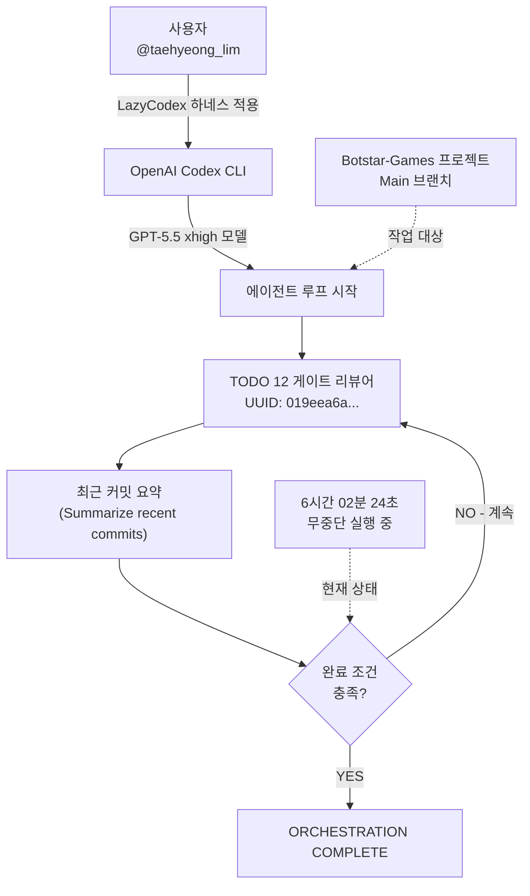
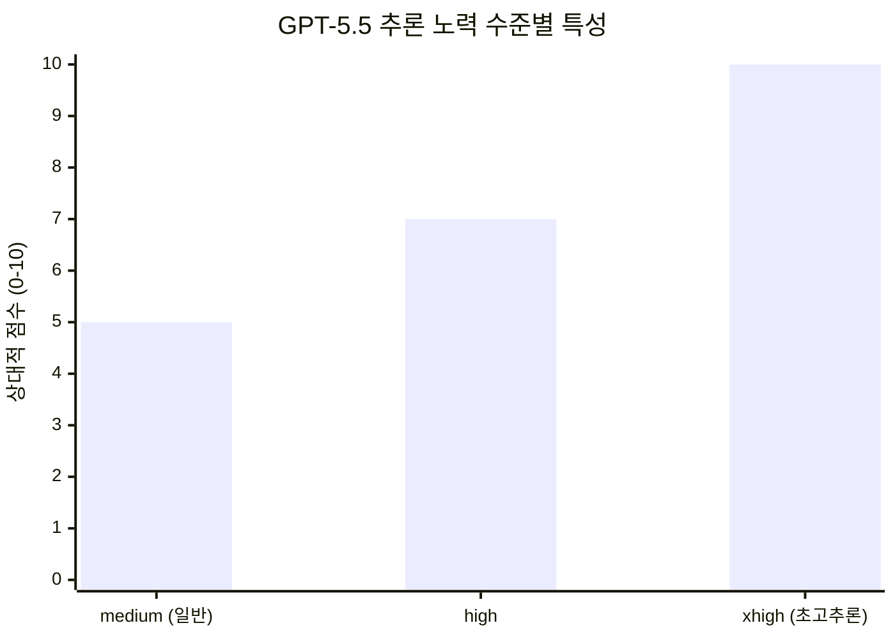
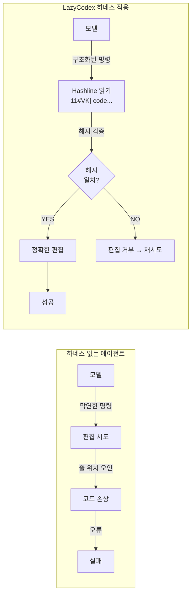
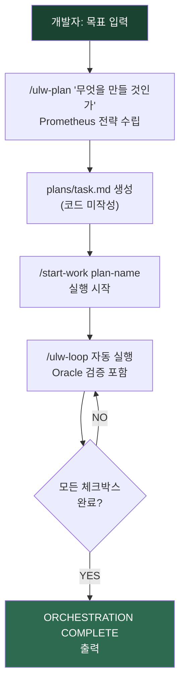
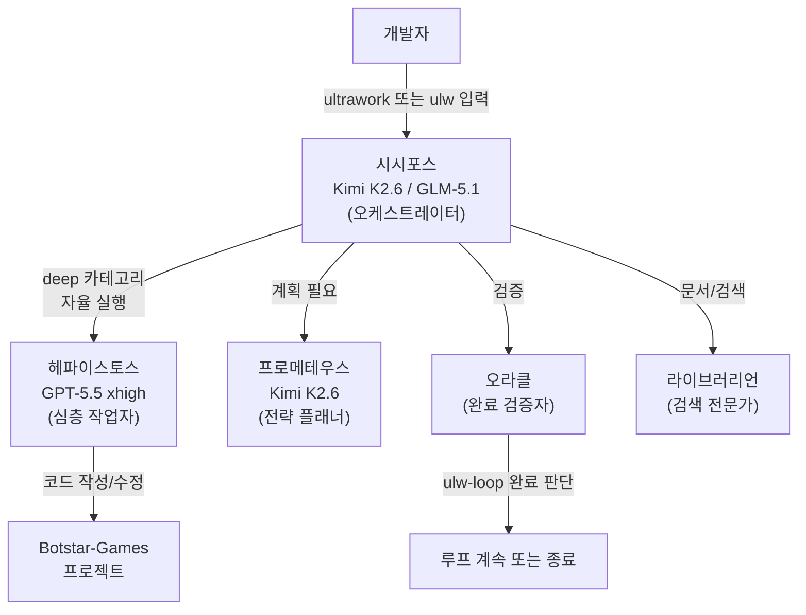
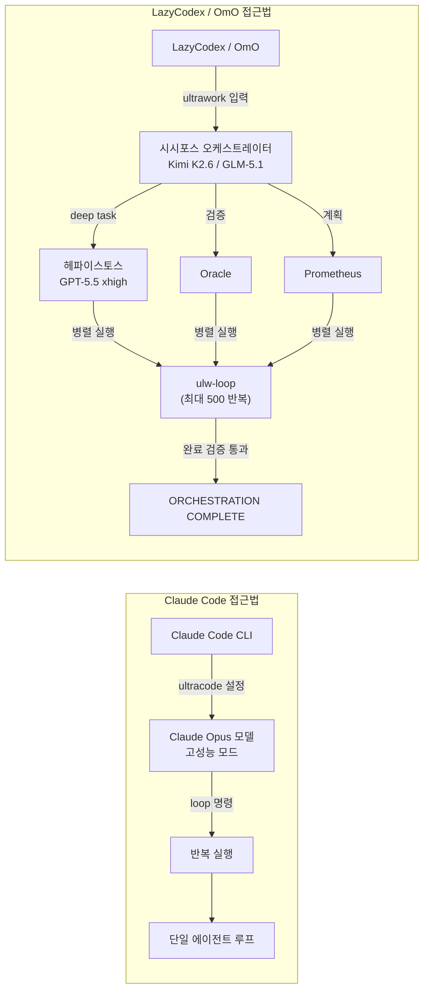

## "나침반 없던 시절의 북극성" — Codex 에이전트 하네스 생태계 심층 분석

> **작성일**: 2026년 6월 22일  
> **출처**: @taehyeong_lim의 Threads 게시물 및 GitHub 공식 레포지토리   
> **레포지토리**: https://github.com/code-yeongyu/lazycodex

> 
> https://www.threads.com/@taehyeong_lim/post/DZ2Z1VPE_jE
> 
> Codex를 쓰면서 Lazy Codex를 쓰지 않는 것은 
> 
> 직무유기에 가깝다.
> 
> 너무나 사용을 쉽게 해준다.
> 
> 손을 덜 가게 해준다.
> 
> 허투루 돌아가는 일이 적게 해준다.
> 
> 나침반 없던 시절 '북극성'의 존재와도 같다.
> 
> 6시간은 기본 돌아가버리네..
> 

---

## 목차

1. [터미널 화면이 보여주는 것 — 현장 스냅샷 분석](#1-터미널-화면이-보여주는-것--현장-스냅샷-분석)
2. [배경: OpenAI Codex CLI란 무엇인가](#2-배경-openai-codex-cli란-무엇인가)
3. [GPT-5.5 xhigh — "초고추론" 모드의 의미](#3-gpt-55-xhigh--초고추론-모드의-의미)
4. [LazyCodex란 정확히 무엇인가](#4-lazycodex란-정확히-무엇인가)
5. [핵심 엔진: Oh-My-OpenAgent(OmO)](#5-핵심-엔진-oh-my-openagentomo)
6. [하네스(Harness)란 무엇인가 — 개념 완전 정리](#6-하네스harness란-무엇인가--개념-완전-정리)
7. [LazyCodex의 세 가지 핵심 명령어](#7-lazycodex의-세-가지-핵심-명령어)
8. [OmO의 에이전트 군단 — 분업 시스템](#8-omo의-에이전트-군단--분업-시스템)
9. [Threads 대화 전체 분석](#9-threads-대화-전체-분석)
10. [Claude ultracode + loop vs LazyCodex 비교](#10-claude-ultracode--loop-vs-lazycodex-비교)
11. [왜 Pro 플랜이 필요한가](#11-왜-pro-플랜이-필요한가)
12. [설치 방법](#12-설치-방법)
13. [이 생태계가 가진 더 큰 의미](#13-이-생태계가-가진-더-큰-의미)

---

## 1. 터미널 화면이 보여주는 것 — 현장 스냅샷 분석


게시물에 첨부된 터미널 화면은 단순히 "AI가 코드를 작성하고 있다"는 것을 보여주는 것이 아니라, 고도화된 에이전트 오케스트레이션 시스템이 실제로 작동하는 현장을 포착한 것이다.

화면의 각 줄이 무엇을 의미하는지 차례로 살펴보자.

```
• TODO 12 게이트 리뷰어 019eea6a-e3e0-7cb2-9fd3-61afc338eead가 실행 중입니다.
• Waiting for 019eea6a-e3e0-7cb2-9fd3-61afc338eead
• Working (6h 02m 24s • esc to interrupt)
> Summarize recent commits
  gpt-5.5 xhigh · ~/Botstar-Games · Main [default]
[BOTSTAR] 1 .: Botstar-Games
```

**"TODO 12 게이트 리뷰어"** 는 LazyCodex가 자동으로 설정하는 작업 파이프라인의 한 단계다. "게이트 리뷰어(Gate Reviewer)"란 코드가 다음 단계로 넘어가기 전에 특정 조건을 검증하는 에이전트 역할을 뜻한다. PR(Pull Request)이 머지되기 전, 혹은 특정 기능이 완성되었다고 판단되기 전에 자동으로 검토를 수행하는 "자동화된 문지기"라고 이해하면 된다.

UUID 형태의 긴 문자열(`019eea6a-e3e0-7cb2-9fd3-61afc338eead`)은 해당 게이트 리뷰어 태스크에 부여된 고유 식별자다. OpenAI Codex CLI는 각 서브에이전트 작업에 UUID를 할당하여 병렬 실행 상황에서도 어느 에이전트가 어느 작업을 수행하는지 추적한다.

**`Working (6h 02m 24s)`** — 이것이 게시물의 핵심이다. AI 에이전트가 6시간 넘게 중단 없이 작동하고 있다. 사람이 자는 사이에, 커피를 마시는 사이에, 혹은 완전히 다른 일을 하는 동안 에이전트가 혼자 작업을 지속하고 있는 것이다.

**`gpt-5.5 xhigh`** 는 사용 중인 모델과 추론 노력 수준을 나타낸다. `gpt-5.5`는 OpenAI의 현세대 Codex 기본 모델이며, `xhigh`는 "Extra High"라는 최고 수준의 추론 노력 설정이다.

**`~/Botstar-Games · Main [default]`** 는 작업 디렉토리다. 이 사람(`@taehyeong_lim`)이 "Botstar-Games"라는 게임 프로젝트에서 AI 에이전트를 실행하고 있음을 보여준다.



---

## 2. 배경: OpenAI Codex CLI란 무엇인가

"Codex"라는 이름은 OpenAI가 역사적으로 여러 번 사용했기 때문에, 지금 이 맥락에서 말하는 Codex가 정확히 어떤 것인지를 먼저 짚어야 한다.

**2021년의 Codex**는 GPT-3 기반의 파인튜닝 모델로, GitHub Copilot의 초기 버전을 구동했던 것이다. 2023년에 deprecated되었다.

**2025년의 codex-1/codex-mini**는 오픈AI가 클라우드 위임 소프트웨어 엔지니어링 작업용으로 재출시한 에이전트 코딩 도구였다.

**2026년 현재의 Codex**는 위 두 가지와 전혀 다른 제품이다. GPT-5.5를 기반으로 하는 통합 에이전트 시스템으로, 터미널 CLI, IDE 확장, 웹 인터페이스, GitHub 봇, 컴퓨터 화면 읽기(Computer Use) 등 여러 인터페이스가 하나의 실행 모델을 공유한다. 현재 주간 활성 사용자 수는 약 400만 명에 달한다.

Codex CLI는 그 중 터미널 환경에서 실행되는 버전이다. 개발자가 로컬 머신의 파일 시스템, Git 히스토리, 빌드 도구 등과 직접 상호작용하면서 장시간 독립적으로 작업할 수 있도록 설계되어 있다. GPT-5-Codex 시리즈는 복잡한 실세계 엔지니어링 태스크, 즉 처음부터 전체 프로젝트를 구축하거나, 기능과 테스트를 추가하거나, 디버깅, 대규모 리팩토링, 코드 리뷰를 수행하는 것에 특화되어 훈련된 모델이다.

Codex CLI는 ChatGPT Plus, Pro, Business, Edu, Enterprise 플랜에 포함되어 있으며, API 키를 통해서도 접근할 수 있다.

---

## 3. GPT-5.5 xhigh — "초고추론" 모드의 의미

대부분의 Codex 태스크에 대해 gpt-5.5를 시작점으로 권장한다. 복잡한 코딩, 컴퓨터 사용, 지식 작업, 연구 워크플로우에서 가장 강력한 성능을 발휘한다.

GPT-5.5는 OpenAI의 가장 스마트하고 직관적인 모델로, 코드 작성 및 디버깅, 온라인 조사, 데이터 분석, 문서 및 스프레드시트 작성, 소프트웨어 운용, 그리고 작업이 완료될 때까지 도구를 오가며 작업하는 데 탁월하다.

**`xhigh` 설정**이란 무엇인가? 지연 시간에 민감하지 않은 태스크를 위해 Extra High(`xhigh`) 추론 노력이라는 새 옵션이 도입되었다. 더 좋은 답변을 위해 훨씬 더 오랫동안 생각한다. 즉, 모델이 최종 답을 출력하기 전에 내부적으로 훨씬 더 많은 단계를 거쳐 추론하도록 설정하는 것이다. 속도는 느려지지만 정확도와 완성도가 높아진다. 6시간짜리 장기 실행 작업에서는 속도보다 정확도가 훨씬 중요하므로, `xhigh`는 이런 시나리오에 적합한 선택이다.



실제로 GPT-5.5를 xhigh 추론 노력으로 사용하는 ChatGPT Pro 플랜에서 Codex CLI 사용 중 "선택한 모델이 용량 한계에 도달했다"는 오류가 반복적으로 발생했다는 보고가 있을 정도로, `xhigh` 모드는 컴퓨팅 자원을 집중적으로 소비한다. 이것이 뒤에서 설명할 "Pro 플랜이 필요하다"는 댓글의 실질적 배경이기도 하다.

---

## 4. LazyCodex란 정확히 무엇인가

LazyCodex는 "Codex for no-brainers"를 표방한다. 생각할 필요가 없다. 그냥 `ultrawork`라고 입력하면 된다.

게시물 작성자 @taehyeong_lim은 LazyCodex를 "나침반 없던 시절의 북극성"에 비유했다. 이 비유는 상당히 정확하다. GPS가 없던 시대에 항해사들은 북극성이라는 고정된 기준점만 있으면 방향을 잃지 않을 수 있었다. LazyCodex는 Codex라는 강력하지만 복잡한 에이전트 시스템에 "고정된 방향 기준"을 제공한다. 에이전트가 어디로 가야 할지, 어떤 순서로 무엇을 해야 할지를 시스템이 자동으로 결정한다.

LazyCodex는 oh-my-openagent(OmO)를 빠르게 실행하기 위한 "게으른 방법"이다. lazy.nvim을 위한 LazyVim과 같은 것이지만, Codex를 위한 것이다.

이 비유를 모르는 사람을 위해 설명하자면: Neovim은 강력한 텍스트 에디터지만 직접 설정하려면 수십 개의 플러그인을 일일이 구성해야 한다. LazyVim은 그 모든 설정을 사전에 패키징하여 "그냥 설치하면 최적화된 Neovim을 즉시 쓸 수 있는" 배포판이다. LazyCodex가 하는 일이 정확히 이것이다 — OmO라는 강력한 엔진을 "그냥 한 줄로 설치하면 바로 쓸 수 있게" 포장한 것이다.

이 프로젝트의 제작자는 한국계 개발자 김연규(@yeon.gyu.kim, GitHub: code-yeongyu)다. oh-my-openagent 레포지토리는 현재 GitHub에서 **63,100개 이상의 스타**를 받고 있으며, 포크 수는 **5,100개 이상**에 달한다. 세계적으로 주목받는 오픈소스 AI 에이전트 프레임워크다.

---

## 5. 핵심 엔진: Oh-My-OpenAgent(OmO)

LazyCodex를 이해하려면 그 내부 엔진인 Oh-My-OpenAgent(이하 OmO)를 먼저 이해해야 한다.

OmO는 복잡한 코드베이스를 위한 코딩 에이전트 하네스이며, "tokenmaxxers(토큰을 최대한 활용하는 사람들)를 위한 코딩 에이전트"라는 슬로건을 가진다.

OmO는 두 가지 에디션으로 제공된다.

**Ultimate Edition (OmO for OpenCode)**: 완전한 OmO 경험을 제공한다. 11개의 에이전트, 54개 이상의 라이프사이클 훅, 5개의 내장 MCP, 모든 슬래시 커맨드, 팀 모드, ulw-loop, ultrawork, hashline 편집 — 모든 기능이 포함된다.

**Light Edition (OmO for Codex CLI)**: Codex의 플러그인 시스템에 맞게 포팅된 경량 버전이다. 규칙(rules), 코멘트 체커, git-bash, LSP, ultrawork, ulw-loop, start-work-continuation, 텔레메트리가 포함된다. **LazyCodex가 제공하는 것이 바로 이 Light Edition이다.**

레포지토리에는 이런 문구가 담겨 있다: "Anthropic이 OmO 때문에 OpenCode를 차단했다. 그것이 사실이다. 그들은 당신을 가두어두려 한다. Claude Code는 좋은 감옥이지만, 여전히 감옥이다." 이 배경은 뒤에서 다시 다룬다.

---

## 6. 하네스(Harness)란 무엇인가 — 개념 완전 정리

Threads 대화에서 @taehyeong_lim은 LazyCodex를 이렇게 설명한다: "하네스를 얇게 하나 펴바른거라.. 알아서 잘 가도록 가드레일이 많이 쳐져있는 그런 틀이라고 생각하시면 될 것 같습니다."

**하네스(Harness)란 무엇인가?** 이 개념은 AI 코딩 에이전트 세계에서 점점 더 중요한 용어가 되고 있다.

원래 harness는 말에 채우는 "마구(馬具)"를 뜻한다. 아무리 강력한 말도 마구 없이는 방향을 잡거나 마차를 끌 수 없다. AI 에이전트 맥락에서 하네스는 **에이전트가 도구를 어떻게 사용하고, 어떤 순서로 작업하며, 언제 멈추고, 어떻게 오류를 복구하는지를 정의하는 인터페이스 및 제어 프레임워크**다.

이미 출판된 학술 연구(SWE-agent 논문, Life-Harness 논문)는 모델 자체의 능력보다 **하네스 설계**가 실질적인 성능에 더 큰 영향을 미친다는 것을 실증적으로 보여준 바 있다. 같은 모델이라도 하네스를 어떻게 설계하느냐에 따라 SWE-bench 성공률이 수십 퍼센트씩 달라진다.

OmO 레포지토리에는 이런 인용문이 있다: "이 도구들 중 어느 것도 모델이 바꾸고자 하는 라인에 대해 안정적이고 검증 가능한 식별자를 제공하지 않는다... 이들은 모두 모델이 이미 본 내용을 재현하는 것에 의존한다. 모델이 그렇게 못할 때 — 그리고 종종 그렇다 — 사용자는 모델 탓을 한다." (Can Bölük, The Harness Problem)

LazyCodex/OmO가 이 문제를 해결하는 방식이 "Hashline"이다. 에이전트가 읽는 모든 줄에 내용 해시가 태그로 붙는다:

```
11#VK| function hello() {
22#XJ|   return "world";
33#MB| }
```

에이전트는 이 태그를 참조하여 편집한다. 파일이 마지막 읽기 이후 변경되었다면, 해시가 일치하지 않아 오류가 발생하고 수정이 거부된다. 덕분에 "에이전트가 이미 변경된 라인을 수정하려다 코드를 망가뜨리는" 문제가 원천 차단된다. 이 기법은 편집 도구 하나만 바꿔서 실패율을 6.7%에서 68.3%로 끌어올렸다는 실험 결과가 있다.



---

## 7. LazyCodex의 세 가지 핵심 명령어

LazyCodex는 Codex CLI 세션에 세 가지 핵심 워크플로우 명령어를 추가한다.

### `$ulw-loop` — 완료될 때까지 멈추지 않는 루프

```
/ulw-loop "task" [--completion-promise=TEXT] [--strategy=reset|continue]
```

Oracle이 검증하는 완료 조건이 충족될 때까지 자기참조적 루프를 실행한다. ultrawork 모드에서는 최대 500번, 일반 모드에서는 최대 100번 반복한다.

이것이 터미널 화면에서 6시간 넘게 작업이 계속되는 원리다. "ulw-loop"는 단순히 반복하는 것이 아니라, 매 반복마다 Oracle 에이전트가 "작업이 정말로 완료되었는가?"를 검증한다. 그래서 부분적으로만 완료된 작업을 완료로 인식하는 실수가 방지된다.

### `$ulw-plan` — 코드를 건드리기 전에 계획부터

```
/ulw-plan "what to build"
```

Prometheus 전략 플래너가 활성화된다. `plans/<slug>.md` 파일에 계획을 작성한다. 제품 코드를 절대 직접 작성하지 않는다.

에이전트가 일단 코드를 작성하기 시작하면 방향을 바꾸는 데 많은 토큰이 소비된다. 사람이 건물을 짓기 전에 설계도를 그리듯, ulw-plan은 실행 전에 전략적 계획 단계를 강제한다.

### `$start-work` — 계획을 실행으로

```
/start-work [plan-name] [--worktree <path>]
```

모든 체크박스가 완료될 때까지 계획을 실행한다. 완료되면 "ORCHESTRATION COMPLETE"를 출력한다.

세 명령어의 관계를 흐름으로 표현하면 다음과 같다.



---

## 8. OmO의 에이전트 군단 — 분업 시스템

OmO의 핵심 철학 중 하나는 "단일 에이전트가 모든 것을 하는 것"보다 "전문화된 에이전트들이 병렬로 협력하는 것"이 훨씬 효율적이라는 것이다.

### 주요 에이전트

**시시포스 (Sisyphus)** — 메인 오케스트레이터. claude-opus-4-7 또는 kimi-k2.6, glm-5.1을 사용한다. 계획을 세우고 전문가들에게 위임하며 공격적인 병렬 실행으로 작업을 완료까지 이끈다. 절대 중간에 멈추지 않는다. "시시포스"라는 이름은 그리스 신화에서 영원히 돌을 산 위로 밀어 올리는 인물에서 따왔다 — 즉, 지칠 줄 모르고 계속한다는 의미다.

**헤파이스토스 (Hephaestus)** — 자율적인 심층 작업자. **gpt-5.5**를 사용한다. 목표를 주면 레시피 없이 스스로 코드베이스를 탐색하고 패턴을 연구하며 처음부터 끝까지 실행한다. 터미널 화면에서 `gpt-5.5 xhigh`로 돌아가고 있는 것이 바로 이 헤파이스토스다.

**프로메테우스 (Prometheus)** — 전략적 플래너. claude-opus-4-7 또는 kimi-k2.6, glm-5.1을 사용한다. 인터뷰 모드: 질문을 던지고, 범위를 파악하고, 코드 한 줄이 작성되기 전에 상세 계획을 수립한다.

**오라클 (Oracle)** — 아키텍처 및 디버깅 전문가. 완료 검증 역할을 담당한다.

**라이브러리언 (Librarian)** — 문서 및 코드 검색 전문가.



오케스트레이터인 시시포스는 "어떤 모델을 쓸지"가 아니라 "어떤 **카테고리**의 작업인지"를 결정한다. 카테고리는 자동으로 적절한 모델로 라우팅된다.

| 카테고리 | 용도 | 자동 배정 모델 |
|----------|------|---------------|
| `visual-engineering` | 프론트엔드, UI/UX, 디자인 | (시각 최적화 모델) |
| `deep` | 자율적 조사 + 실행 | GPT-5.5 |
| `quick` | 단일 파일 변경, 오타 수정 | 경량 모델 |
| `ultrabrain` | 어려운 로직, 아키텍처 결정 | GPT-5.5 xhigh |

---

## 9. Threads 대화 전체 분석

이제 Threads 게시물의 대화를 처음부터 차례로 해석해보자.

### 본문: "직무유기에 가깝다"


구체적으로 LazyCodex가 무엇을 해주는지 열거하면:
- "손을 덜 가게 해준다" → 사람이 개입할 필요가 없어진다
- "허투루 돌아가는 일이 적게 해준다" → 에이전트가 무의미한 루프에 빠지는 것을 방지한다
- "6시간은 기본 돌아가버리네" → 장기 실행 작업이 중단 없이 완료된다

### 댓글: "Claude에서 비교하자면 ultracode + loop 조합인가요?"

이 질문은 Claude Code를 사용하는 사람이 자연스럽게 던질 수 있는 것이다. Claude Code에는 ultracode(특정 고성능 설정)와 loop(반복 실행) 같은 개념이 있다. "LazyCodex가 그것과 비슷한 것이냐?"라고 물은 것이다.

### 답변: "좀 많이 다릅니다"


Claude Code의 "ultracode + loop"는 모델 자체의 특정 동작 모드나 반복 명령이라면, LazyCodex는 그보다 훨씬 더 구조적인 것이다. 에이전트가 작업하는 방식 자체를 재정의하는 프레임워크다. 가드레일이란 다음을 의미한다:

- 에이전트가 "완료됐다고 착각"하는 것을 Oracle이 방지
- 편집 시 Hashline으로 파일 손상을 방지
- 계획 없이 무작정 코딩을 시작하는 것을 Prometheus가 방지
- 에이전트가 아이들 상태에 빠지면 Todo Enforcer가 다시 당겨냄

"얇게 펴바른다"는 표현도 중요하다. LazyCodex는 Codex 위에 무거운 레이어를 쌓는 것이 아니라, 최소한의 간섭으로 최대의 효과를 내도록 설계된 "얇은" 하네스다.

### 댓글: "Plus요금제가 에르메스까지 연결되어 있어서 아직 안쓰는중"

"에르메스"는 한국 AI 코딩 에이전트 생태계의 다른 도구인 "Hermes Agent"를 지칭한다. 이 사람은 ChatGPT Plus 플랜을 Hermes Agent에 연결해서 쓰고 있기 때문에 LazyCodex를 별도로 도입하지 않았다는 뜻이다.

### 답변: "Pro 플래너부터 써야 하는 것 같습니다"

이 답변이 중요한 실용적 조언이다. "토큰 많은 사람들이 일 쉽게 하려고 만든 툴"이라는 표현이 핵심이다.

---

## 10. Claude ultracode + loop vs LazyCodex 비교

질문자가 비교하려 했던 두 접근법을 좀 더 명확하게 대조해보자.



| 비교 항목 | Claude ultracode + loop | LazyCodex / OmO |
|-----------|------------------------|-----------------|
| 구조 | 단일 에이전트 반복 | 다중 에이전트 오케스트레이션 |
| 모델 | Claude (단일) | GPT-5.5 + Kimi + GLM 등 멀티모델 |
| 완료 검증 | 모델 자체 판단 | Oracle 에이전트가 독립 검증 |
| 편집 안전성 | 표준 편집 | Hashline 해시 검증 |
| 계획 단계 | 선택적 | Prometheus가 강제화 |
| 최대 반복 | 설정에 따라 다름 | ultrawork 모드 최대 500회 |
| 토큰 소비 | 중간 | 높음 (Pro 권장) |
| 모델 종속성 | Anthropic | 벤더 중립 (멀티모델) |

핵심 차이는 **오케스트레이션 철학**에 있다. Claude Code + loop는 Claude라는 하나의 강력한 에이전트가 처음부터 끝까지 모든 것을 한다. LazyCodex/OmO는 여러 전문 에이전트가 각자의 역할을 맡아 병렬로 협력한다. 마치 한 명의 만능 개발자 vs. 기획자·개발자·QA·문서 작성자가 팀으로 일하는 것의 차이다.

주목할 만한 역사적 사실도 있다. OmO 레포지토리에는 "Anthropic이 OmO 때문에 OpenCode를 차단했다"는 언급이 있다. OmO는 원래 OpenCode(터미널 기반 오픈소스 코딩 에이전트)용으로 개발되었고 Claude 모델을 광범위하게 사용했는데, Anthropic이 OpenCode를 API 레벨에서 차단하면서 팀이 OpenAI Codex 생태계로 중심을 이동했다. 그 과정에서 LazyCodex가 탄생했다.

---

## 11. 왜 Pro 플랜이 필요한가

LazyCodex는 기술적으로 ChatGPT Plus 플랜($20/월)에서도 실행할 수 있다. 그러나 실전에서는 Pro 플랜($200/월)이 사실상 필요한 이유가 있다.

**첫째, 토큰 소비량의 문제다.** ulw-loop는 최대 500회 반복 실행된다. 각 반복마다 에이전트가 코드베이스를 읽고, 분석하고, 작성하고, Oracle이 검증한다. GPT-5.5 xhigh 모드는 일반 모드보다 내부 추론 토큰을 훨씬 더 많이 소비한다. 6시간 이상의 작업은 Plus 플랜의 월별 토큰 한도를 금방 소진할 수 있다.

**둘째, 멀티모델 동시 실행의 문제다.** OmO는 시시포스, 헤파이스토스, Oracle, Prometheus가 병렬로 실행될 수 있다. 각각이 다른 API 요청을 생성한다. Plus 플랜은 이런 병렬 부하를 견디기에 속도 제한이 빡빡하다.

**셋째, xhigh 모드 용량의 문제다.** 앞서 언급했듯 GPT-5.5 xhigh 모드는 Pro 플랜에서도 "capacity error(용량 초과 오류)"가 발생할 만큼 서버 자원을 집중적으로 사용한다.

OmO 레포지토리가 추천하는 최소 구독 조합은 다음과 같다:

```
ChatGPT 구독 ($20)   ← GPT-5.5 접근
Kimi Code 구독 ($19)  ← Kimi K2.6 접근  
GLM Coding Plan ($10) ← GLM-5.1/5.2 접근
```

즉, 세 가지 구독을 합쳐 약 $49/월로 멀티모델 에이전트 시스템을 구동하는 것이 가장 경제적인 방법이다. 단, 헤비 유저라면 ChatGPT Pro ($200/월)가 훨씬 안정적이다.

---

## 12. 설치 방법

LazyCodex의 설치는 한 줄로 끝난다.

### 기본 설치

```bash
bunx lazycodex install
```

또는 전역 설치 없이 항상 최신 버전을 사용하는 방법:

```bash
# TUI(대화형 설치 화면) 포함
bunx lazycodex install

# 완전 자율 모드 (TUI 없이, Codex 자율 권한 포함)
bunx lazycodex install --no-tui --codex-autonomous
```

Bun이 없다면 npm으로도 설치할 수 있다:

```bash
npx lazycodex-ai install
```

### 설치 후 사용

Codex CLI를 열고 단 한 단어만 입력하면 된다:

```
ultrawork
```

또는 약어:

```
ulw
```

이 한 단어가 입력되면 OmO의 모든 에이전트가 활성화되고, 현재 프로젝트의 상태를 파악하여 작업을 시작한다.

### 제거 방법

```bash
npx lazycodex-ai uninstall
```

---

## 13. 이 생태계가 가진 더 큰 의미

LazyCodex와 OmO가 단순히 "Codex를 더 쉽게 쓰는 도구"가 아닌 이유는, 이 생태계가 AI 코딩 에이전트 분야의 몇 가지 근본적인 질문에 실질적인 답을 제시하기 때문이다.

**첫째, "어떤 모델이 최고냐"는 질문은 틀린 질문이다.** OmO는 어떤 단일 모델도 모든 종류의 작업에서 최선이 아니라는 전제에서 출발한다. 시시포스(오케스트레이션)에는 추론 능력이 뛰어난 모델을, 헤파이스토스(실행)에는 코딩 능력이 뛰어난 모델을, 프로메테우스(계획)에는 전략적 사고에 강한 모델을 사용한다. 모델의 강점을 태스크 유형에 자동으로 매핑하는 것이 핵심이다.

**둘째, 하네스 엔지니어링이 모델 성능보다 중요할 수 있다.** @taehyeong_lim이 "직무유기"라고 표현한 것은 과장이 아니다. 같은 GPT-5.5를 사용하더라도 하네스 없이 쓰는 것과 OmO 하네스를 씌워서 쓰는 것의 성능 차이는 모델 버전 한두 세대의 차이보다 클 수 있다. 이것은 이미 SWE-agent와 Life-Harness 논문이 학술적으로 증명한 사실이다.

**셋째, 벤더 종속성(vendor lock-in)에 대한 대안이 필요하다.** Anthropic이 OpenCode를 차단한 사건은 단일 벤더의 생태계에 의존하는 것이 가져오는 리스크를 보여준다. OmO는 OpenAI, Anthropic, Google(Gemini), Moonshot(Kimi), Zhipu(GLM) 등 다양한 모델을 자유롭게 오가며 사용할 수 있는 멀티모델 아키텍처로 설계되어 있다.

**넷째, AI 에이전트는 "도구"에서 "팀원"으로 진화하고 있다.** 6시간 넘게 독립적으로 작업하고, 스스로 오류를 수정하고, Oracle이 검증하고, 완료 시 "ORCHESTRATION COMPLETE"를 출력하는 시스템은 더 이상 보조 도구가 아니다. 개발자는 목표를 설정하고 팀을 관리하는 역할로 변화하고 있다.


---

## 용어 정리

| 용어 | 설명 |
|------|------|
| **LazyCodex** | OmO를 Codex CLI에 쉽게 설치하기 위한 배포판 |
| **OmO (Oh-My-OpenAgent)** | 다중 에이전트 코딩 하네스 프레임워크 (GitHub 63.1k★) |
| **Codex CLI** | OpenAI의 터미널 기반 AI 코딩 에이전트 도구 |
| **GPT-5.5** | OpenAI의 현세대 에이전트 코딩 최적화 모델 |
| **xhigh** | Extra High 추론 노력 설정 — 가장 높은 정확도, 가장 느린 속도 |
| **ultrawork / ulw** | OmO를 활성화하는 단일 명령어 |
| **ulw-loop** | 완료 조건 달성까지 자기참조적으로 반복하는 루프 |
| **Hashline** | 코드 라인에 해시 태그를 붙여 편집 정확성을 보장하는 기법 |
| **시시포스** | OmO의 메인 오케스트레이터 에이전트 |
| **헤파이스토스** | GPT-5.5를 사용하는 자율 심층 작업 에이전트 |
| **프로메테우스** | 코드 작성 전 전략 계획을 담당하는 에이전트 |
| **Oracle** | ulw-loop의 완료 조건을 검증하는 에이전트 |
| **하네스 (Harness)** | 에이전트의 도구 사용 방식, 작업 순서, 오류 복구를 제어하는 프레임워크 |
| **Gate Reviewer** | LazyCodex가 설정하는 코드 검토 통과 조건 검증 에이전트 |
| **Botstar-Games** | @taehyeong_lim의 게임 개발 프로젝트 |

---

## 참고 자료

- LazyCodex GitHub: https://github.com/code-yeongyu/lazycodex
- Oh-My-OpenAgent GitHub: https://github.com/code-yeongyu/oh-my-openagent
- LazyCodex 공식 사이트: https://lazycodex.ai
- OmO 문서: https://omo.vibetip.help/docs
- OpenAI Codex 모델 문서: https://developers.openai.com/codex/models
- GPT-5.5 발표 (2026년 4월 23일): https://openai.com/index/introducing-gpt-5-5/
- Threads 원문: https://www.threads.com/@taehyeong_lim/post/DZ2Z1VPE_jE
- The Harness Problem (Can Bölük): https://blog.can.ac/2026/02/12/the-harness-problem/

---

*이 문서는 GitHub 공식 레포지토리와 OpenAI 공식 문서를 기반으로 작성되었습니다. 확인되지 않은 추측은 배제하였으며, 불확실한 내용은 명시적으로 표기하였습니다.*
