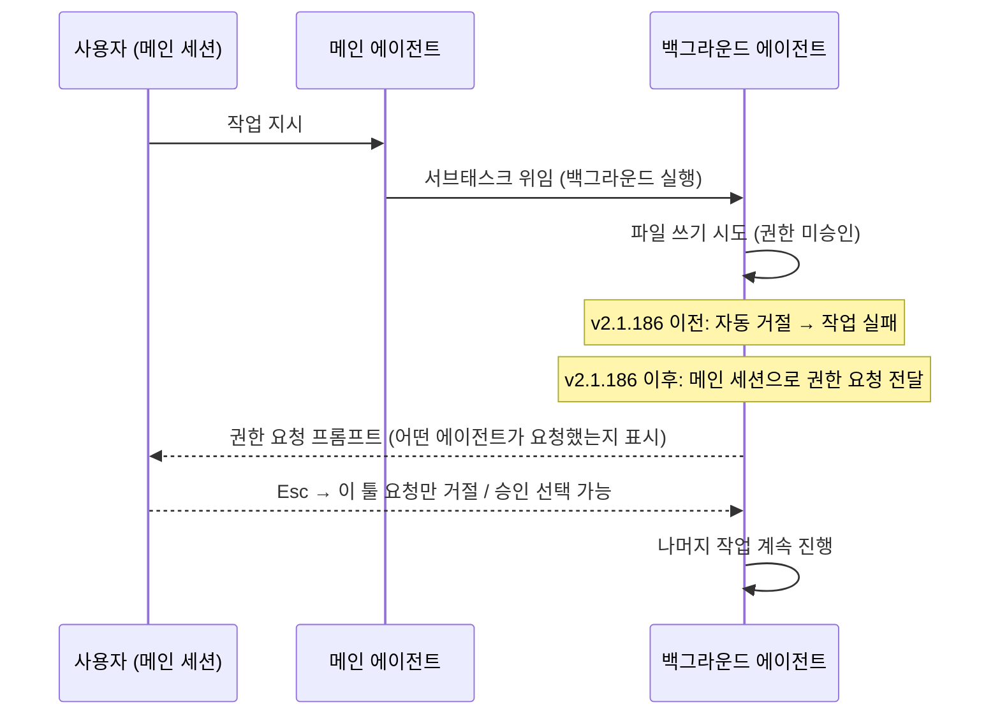

> **공식 출처**: [GitHub Release — anthropics/claude-code v2.1.186](https://github.com/anthropics/claude-code/releases/tag/v2.1.186)  
> **릴리스 일자**: 2026년 6월 22일  
> **작성 기준**: 공식 릴리스 노트 및 관련 공식 문서·GitHub 이슈 기반  
> **분석 작성일**: 2026년 6월 23일

> 
> https://www.threads.com/@ohyoung.park/post/DZ551izk7S6
> 
> Claude Code v2.1.186이 나왔습니다.
> 
> MCP 쪽이 꽤 실용적으로 바뀌었습니다. claude mcp login <name> / claude mcp logout <name>으로 CLI에서 바로 인증할 수 있고, SSH 환경을 위한 --no-browser stdin redirect도 지원합니다.
> 
> ! bash 명령의 동작도 바뀌었습니다. 명령 출력에 Claude가 자동으로 응답합니다. 예전처럼 컨텍스트에만 넣고 싶으면 settings.json에 "respondToBashCommands": false를 넣으면 됩니다.
> 
> 백그라운드 에이전트/서브에이전트도 여러 부분이 고쳐졌습니다. 권한 프롬프트가 자동 거절되지 않고 메인 세션에 표시되며, 어떤 에이전트가 요청했는지도 보입니다. Esc는 해당 툴 요청만 거절합니다.
> 
> sleep 이후 스트리밍 요청이 “Content block not found”나 JSON parse error로 실패하던 문제, named subagent spawn에서 Agent deny/allowed-types 제한이 적용되지 않던 문제, schema validation 실패가 반복될 때 Workflow subagent가 무한 루프를 도는 문제 등도 고쳐졌습니다.
> 
> /review <pr>은 /code-review medium과 같은 리뷰 엔진을 사용합니다
> 

---

## 목차

1. [릴리스 개요](#1-릴리스-개요)
2. [신규 기능 추가](#2-신규-기능-추가)
   - 2.1 [MCP 서버 CLI 인증 — `claude mcp login / logout`](#21-mcp-서버-cli-인증--claude-mcp-login--logout)
   - 2.2 [`!` bash 명령의 동작 변화](#22--bash-명령의-동작-변화)
   - 2.3 [기타 UI·설정 추가](#23-기타-ui설정-추가)
3. [백그라운드 에이전트 / 서브에이전트 개선](#3-백그라운드-에이전트--서브에이전트-개선)
   - 3.1 [권한 프롬프트가 메인 세션으로 이동한 배경](#31-권한-프롬프트가-메인-세션으로-이동한-배경)
   - 3.2 [에이전트 패널·UI 버그 수정](#32-에이전트-패널ui-버그-수정)
   - 3.3 [Workflow 에이전트 무한 루프 수정](#33-workflow-에이전트-무한-루프-수정)
   - 3.4 [보안 규칙 적용 버그 수정](#34-보안-규칙-적용-버그-수정)
4. [MCP 생태계 안정화](#4-mcp-생태계-안정화)
5. [Skills·Plugin 관련 개선](#5-skillsplugin-관련-개선)
   - 5.1 [SKILL.md frontmatter 표기법 통합](#51-skillmd-frontmatter-표기법-통합)
   - 5.2 [MEMORY.md 자동 압축 알림](#52-memorymd-자동-압축-알림)
6. [스트리밍 안정성 수정](#6-스트리밍-안정성-수정)
7. [소소하지만 중요한 버그 수정 모음](#7-소소하지만-중요한-버그-수정-모음)
8. [설정 변경사항](#8-설정-변경사항)
   - 8.1 [`CLAUDE_CODE_MAX_RETRIES` 상한 변경](#81-claude_code_max_retries-상한-변경)
   - 8.2 [`/review <pr>` 엔진 통합](#82-review-pr-엔진-통합)
9. [변경사항 전체 구조 요약 (Mermaid)](#9-변경사항-전체-구조-요약-mermaid)
10. [실무자를 위한 마이그레이션 체크리스트](#10-실무자를-위한-마이그레이션-체크리스트)
11. [용어 해설](#11-용어-해설)

---

## 1. 릴리스 개요

Claude Code v2.1.186은 2026년 6월 22일 Anthropic의 엔지니어 ashwin-ant에 의해 GitHub에 게시된 공식 릴리스이다. 이번 버전은 하나의 대형 기능보다는 여러 현실적인 사용 불편 사항을 수십 개 해소하면서, 특히 **MCP(Model Context Protocol) 인증 흐름**, **백그라운드 에이전트 권한 처리**, **Skills / Plugin 생태계**, 그리고 **스트리밍 안정성** 분야에서 체감 품질을 크게 끌어올렸다.

변경 항목을 성격별로 구분하면 다음과 같다.

| 구분 | 항목 수 |
|---|---|
| 신규 기능 추가 (Added) | 6 |
| 버그 수정 (Fixed) | 20 |
| 개선 (Improved) | 4 |
| 동작 변경 (Changed) | 3 |

---

## 2. 신규 기능 추가

### 2.1 MCP 서버 CLI 인증 — `claude mcp login / logout`

이번 릴리스에서 가장 실용적인 신기능이다. 지금까지 OAuth 2.0 인증이 필요한 원격 MCP 서버에 연결하려면 `/mcp`라는 대화형 메뉴를 열고 그 안에서 인증 흐름을 따라가야 했다. 이 방식은 세션이 열려 있을 때는 편리하지만, **SSH로 원격 서버에 접속해 작업하는 환경**에서는 브라우저를 자동으로 열 수 없기 때문에 인증 자체가 불가능하거나 매우 번거로웠다.

v2.1.186부터는 다음 두 명령으로 CLI에서 곧바로 MCP 서버 인증을 처리할 수 있다.

```bash
# 특정 MCP 서버에 로그인
claude mcp login <서버이름>

# 로그아웃
claude mcp logout <서버이름>
```

핵심 옵션은 `--no-browser` 플래그이다. 이 플래그를 붙이면 OAuth 인증 코드를 브라우저 대신 **stdin(표준 입력)** 을 통해 직접 터미널에 붙여넣을 수 있어, GUI가 없는 서버나 SSH 터널을 통한 헤드리스 환경에서도 MCP 인증을 완료할 수 있다.

```bash
# SSH 환경에서 브라우저 없이 인증
claude mcp login my-slack-server --no-browser
# → 터미널에 인증 URL이 출력되고, 사용자가 브라우저에서 얻은 코드를 stdin에 붙여넣으면 인증 완료
```

이는 **CI/CD 파이프라인**, **클라우드 인스턴스에서의 자동화 스크립트**, **원격 개발 서버** 등 비대화형 환경에서 MCP를 사용하는 모든 사용자에게 실질적인 접근성을 열어주는 변화이다.

아울러 `claude mcp get`과 `claude mcp remove` 명령도 이번에 개선되었다. 서버 이름을 잘못 입력했을 때 **가장 가까운 이름을 제안**해주고, 등록된 서버가 많을 때는 목록을 적절히 잘라서 표시해 혼잡함을 줄였다.

---

### 2.2 `!` bash 명령의 동작 변화

Claude Code에서 `!` 접두사를 붙이면 현재 세션을 벗어나지 않고 셸 명령을 즉석에서 실행할 수 있다. 예를 들어 `!ls -la` 또는 `!git status`처럼 사용한다.

기존 동작은 명령 출력 결과를 **컨텍스트에 넣기만** 하고, Claude가 별도로 반응하지 않았다. 즉, 사용자가 출력을 보고 다시 메시지를 보내야 Claude가 그 내용을 분석하거나 후속 작업을 진행할 수 있었다.

v2.1.186부터는 `!` 명령 실행 후 출력이 생기면 **Claude가 자동으로 그 출력에 응답**한다. 예컨대 `!npm test`를 실행했을 때 테스트 실패 로그가 나오면, Claude가 이를 즉시 분석하고 원인 파악 또는 수정 방향을 제시한다.

만약 이 자동 응답 동작이 불필요하다면—예를 들어, 명령 결과를 컨텍스트로만 쌓아두고 내가 직접 대화를 이어가고 싶은 경우—`settings.json`에 다음 항목을 추가하면 이전 동작으로 되돌릴 수 있다.

```json
{
  "respondToBashCommands": false
}
```

이 변화는 터미널 사용 패턴을 더 **에이전틱(agentic)** 하게 만든다. 사용자가 명령을 실행하는 순간 Claude가 곧바로 반응하므로, 출력을 보고 "왜 이런 에러가 났지?"라고 다시 물어볼 필요 없이 즉시 피드백 루프가 돌아간다.

---

### 2.3 기타 UI·설정 추가

**`/workflows` 상태 필터링**: 에이전트 상세 뷰에서 `f` 키를 누르면 현재 실행 중인 에이전트를 상태별로 필터링할 수 있다. 여러 에이전트가 동시에 실행 중일 때 완료된 것과 진행 중인 것을 구분하기가 훨씬 쉬워진다.

**`/plugin` 설치됨 탭에 Skills 섹션 추가**: 플러그인 관리 화면에서 현재 로드된 Skills를 별도 섹션으로 확인할 수 있게 되었다. 이전에는 설치된 플러그인 목록과 Skills가 구분 없이 섞여 있거나, Skills는 별도로 확인해야 했다.

**`teammateMode: "iterm2"` 설정**: Claude Code의 에이전트 팀 기능(여러 터미널 창이나 탭에서 에이전트가 병렬 실행)에서 iTerm2를 백엔드로 명시적으로 지정하는 설정값이 추가되었다. 자동 감지(`auto`) 모드에서 `it2` CLI를 찾지 못할 경우 경고 메시지도 표시된다.

**Claude Platform on AWS 자격증명 갱신**: `/login` 명령에서 `awsAuthRefresh` 설정이 구성된 경우 "Claude Platform on AWS - 자격증명 갱신" 옵션이 나타난다. AWS 기반으로 Claude를 배포한 팀에서 세션 자격증명이 만료되었을 때 CLI 안에서 갱신 과정을 처리할 수 있다.

---

## 3. 백그라운드 에이전트 / 서브에이전트 개선

이번 릴리스에서 가장 많은 수정이 이루어진 영역이다. 백그라운드 에이전트 시스템 전반에서 쌓여있던 결함들이 한꺼번에 해소되었다.

### 3.1 권한 프롬프트가 메인 세션으로 이동한 배경

**이전 동작과 문제점**

Claude Code에서 백그라운드 에이전트는 메인 세션과 동시에 실행되는 별도 인스턴스다. 이 에이전트가 파일 쓰기, bash 실행 등 권한이 필요한 도구를 호출하려 할 때, 해당 권한이 사전에 승인되어 있지 않으면 어떻게 해야 할까?

기존 동작은 **자동 거절(auto-deny)** 이었다. 백그라운드에서 몰래 권한을 요구하는 것보다 거절이 안전하다는 논리인데, 이것이 현실에서는 심각한 문제를 일으켰다. 사용자가 백그라운드 에이전트를 실행했는데 에이전트가 실질적인 작업에 필요한 도구를 모두 거절당해 아무 일도 하지 못하고 종료되는 일이 반복되었다. 특히 플러그인으로 정의된 에이전트 6종을 병렬로 실행한 테스트에서, 사전에 Bash·Write·Edit를 메인 세션에서 승인했음에도 불구하고 백그라운드 에이전트에는 해당 권한이 전달되지 않아 전부 실패하는 현상이 GitHub 이슈로 보고되기도 했다(Issue #34095, #36042).

**v2.1.186의 해결 방식**

이제 백그라운드 서브에이전트가 권한이 필요한 도구를 호출하면, 그 **권한 요청 프롬프트가 메인 세션 화면에 표시**된다. 동시에 다이얼로그에는 "어떤 에이전트가 이 작업을 요청했는지"도 함께 표시되므로, 사용자는 맥락을 잃지 않고 적절히 승인하거나 거절할 수 있다.

`Esc` 키 동작도 명확해졌다. 기존에는 Esc를 누르면 에이전트 전체가 멈추거나 동작이 불명확했는데, 이제는 **해당 도구 요청 하나만 거절**하고 나머지 에이전트 실행은 계속된다. 이를 통해 사용자는 에이전트 흐름 전체를 중단하지 않고도 특정 위험 동작만 선택적으로 막을 수 있다.



---

### 3.2 에이전트 패널·UI 버그 수정

백그라운드 세션과 관련한 다수의 UI 버그도 해소되었다.

**서브에이전트 트랜스크립트 스크롤 오염 문제** — 서브에이전트 뷰에서 트랜스크립트를 스크롤한 뒤 그 창을 닫으면, 스크롤 위치 정보가 메인 트랜스크립트에 잘못 전파되어 메인 화면이 임의 위치로 이동하던 버그가 수정되었다.

**raw tool name 플래싱** — 백그라운드 작업의 미리보기 영역에서, 에이전트의 계획이 로드되기 전 순간적으로 내부 도구 이름(예: `computer_use`, `execute_code` 같은 raw 문자열)이 노출되던 문제가 수정되었다. 이제는 계획이 준비되기 전까지 의미 있는 대기 상태가 표시된다.

**백그라운드 세션 요약 중복** — 에이전트가 자체적으로 생성하는 턴 종료 요약과, 백그라운드 세션 요약(recap) 줄이 따로 표시되어 같은 내용이 두 번 나오던 문제가 수정되었다. 이제는 에이전트의 자체 요약이 recap 줄로 단일하게 표시된다.

**화면 잔상 문제** — `claude agents`에서 백그라운드 세션을 열면 이전 화면이 지워지지 않고 뒤에 그대로 남아 있던 렌더링 버그가 수정되었다.

**라이트 터미널에서 다크 테마 깜빡임** — 라이트 테마 터미널에서 백그라운드 세션을 열 때 순간적으로 다크 테마 배경이 비치던 문제가 수정되었다.

**Esc / Ctrl+C 무응답** — 메인 턴이 종료된 뒤에도 백그라운드 에이전트가 아직 실행 중인 경우, Esc와 Ctrl+C가 응답하지 않는 버그가 있었다. 이제 이 상태에서도 정상적으로 작동한다.

**완료된 서브에이전트 닫기** — 에이전트 패널에서 이미 완료된 서브에이전트 항목 위에서 `x` 키를 누르면 해당 항목이 사라져야 하는데, 아무 일도 일어나지 않던 버그가 수정되었다.

**`claude agents`에서 오래된 "needs input" 메시지** — 백그라운드 작업에 입력을 보낸 뒤에도 에이전트 목록에서 상태가 "needs input"으로 남아있던 표시 오류가 수정되었다.

**마우스 선택 텍스트 잔상** — `claude agents`에서 마우스로 텍스트를 선택한 뒤 삭제해도 하이라이트 표시가 남아있던 문제가 수정되었다.

---

### 3.3 Workflow 에이전트 무한 루프 수정

`/workflows`와 `agent({schema})` 형태로 실행되는 Workflow 서브에이전트에서 스키마 검증(schema validation)이 반복적으로 실패할 때 에이전트가 무한히 재시도하는 버그가 있었다.

예를 들어, Workflow 에이전트가 작업 결과를 특정 JSON 스키마에 맞춰 반환해야 하는데, 어떤 이유로 그 스키마 검증이 계속 통과하지 못하는 상황이 되면 에이전트는 검증을 통과하려는 시도를 무한 반복하며 토큰을 소모했다. 사용자는 결과도 없이 토큰 비용만 계속 쌓이는 상황을 겪었다.

이번 수정으로 **동일한 스키마 검증 실패가 5회 반복되면 에이전트가 스스로 중단**하고 실패 원인을 상위 세션에 보고하도록 변경되었다. 무한 루프에 대한 명시적인 상한이 생긴 것이다.

---

### 3.4 보안 규칙 적용 버그 수정

Claude Code에서는 에이전트 유형별로 접근 가능한 도구를 제한하는 두 가지 규칙이 있다.

- `Agent(type)` deny 규칙: 특정 유형의 에이전트를 아예 생성하지 못하게 막는 규칙
- `Agent(x,y)` allowed-types 규칙: 특정 에이전트가 지정된 유형의 서브에이전트만 생성할 수 있도록 제한하는 규칙

이 규칙들이 **이름 지정 서브에이전트(named subagent)**—즉, `.claude/agents/` 폴더에 정의된 커스텀 이름을 가진 에이전트—를 스폰(spawn)할 때는 적용되지 않는 버그가 있었다. 이름 없이 익명으로 생성되는 에이전트에는 규칙이 적용되었지만, 명시적 이름이 있는 에이전트는 이 필터를 통과해버렸다.

이는 단순한 UX 버그가 아니라 **보안 규칙 우회**에 해당하므로 심각성이 높다. 이번 릴리스에서 이 구멍이 패치되어, 명명된 서브에이전트를 스폰할 때도 deny/allowed-types 규칙이 올바르게 적용된다.

---

## 4. MCP 생태계 안정화

### 잘못된 "MCP server disconnected" 알림 제거

오래된 세션을 다시 열면(resume) 과거에 사용했던 MCP 도구 중 일부가 더 이상 등록되어 있지 않을 수 있다. 예전에는 이런 상황에서 "MCP server disconnected"라는 경고 알림이 표시되었는데, 이것은 실제로 연결이 끊어진 것이 아니라 **의도적으로 은퇴(retired)된 도구**에 대한 잘못된 알림이었다.

이 거짓 경고가 사용자를 혼란스럽게 만들었다. 아무 문제 없이 세션을 재개한 것인데 "서버 연결 끊김"이라는 메시지를 보면 당연히 뭔가 잘못되었다고 생각하게 된다. 이번 수정으로 이 상황에서는 알림이 표시되지 않는다.

---

## 5. Skills·Plugin 관련 개선

### 5.1 SKILL.md frontmatter 표기법 통합

Claude Code의 Skills 시스템은 각 스킬 폴더 안의 `SKILL.md` 파일에 YAML frontmatter로 메타데이터를 정의한다. 예를 들어 스킬의 표시 이름, 기본 활성화 여부, 폴백 동작 등을 이렇게 설정한다.

기존에는 이 frontmatter 키들이 특정 표기법에 엄격하게 일치해야 했다. `display-name`은 되고 `display_name`이나 `displayName`은 인식되지 않는 식이었다.

이번 릴리스부터는 `display-name`, `default-enabled`, `fallback`, `metadata.*` 계열의 키들이 **kebab-case, snake_case, camelCase 세 가지 표기를 모두 허용**한다. 즉, 다음 세 가지가 모두 동일하게 동작한다.

```yaml
# 세 가지 모두 동일하게 동작 (v2.1.186부터)
display-name: "나의 스킬"     # kebab-case (기존 표준)
display_name: "나의 스킬"     # snake_case
displayName: "나의 스킬"      # camelCase
```

이 개선은 다양한 배경을 가진 개발자들이 스킬을 작성할 때 표기법 때문에 혼란을 겪던 문제를 해소한다.

아울러 **malformed YAML frontmatter 처리**도 개선되었다. 기존에는 SKILL.md의 YAML frontmatter에 문법 오류가 있으면 스킬 전체가 조용히 로드되지 않아 사용자가 원인을 찾기 어려웠다. 이제는 frontmatter 파싱에 실패하더라도 **빈 메타데이터 상태로 스킬 본문(body)을 그대로 로드**한다. 완벽하진 않지만, 작은 YAML 실수로 인해 정성 들여 작성한 스킬 전체가 묵살되는 일은 더 이상 없다.

---

### 5.2 MEMORY.md 자동 압축 알림

Claude Code는 대화가 길어질수록 에이전트가 `MEMORY.md`라는 파일에 주요 정보를 축적하는 메모리 시스템을 운영한다. 이 파일이 특정 크기 한계에 근접하면 에이전트가 더 이상 효율적으로 기억을 관리하기 어려워진다.

이번 릴리스부터는 `MEMORY.md` 인덱스가 크기 한계에 가까워졌을 때 **에이전트 스스로가 "MEMORY.md를 압축(compact)해야 한다"는 것을 인식하고 그 작업을 수행하도록 알림을 받는다**. 사람으로 치면 "메모장이 거의 꽉 찼으니 중요한 것만 추려서 정리하세요"라는 리마인더가 생긴 셈이다.

이는 긴 세션에서 에이전트 기억 품질이 점진적으로 저하되는 현상을 방지하고, LLM Wiki 패턴(세션 간 지식을 `index.md` 형태로 누적 관리)에서 인덱스를 건강하게 유지하는 데 도움이 된다.

---

## 6. 스트리밍 안정성 수정

**슬립 후 스트리밍 실패 문제**: 노트북이나 서버가 슬립(절전) 상태에서 깨어난 뒤 Claude Code에서 스트리밍 요청을 보내면 `"Content block not found"` 오류 또는 JSON 파싱 오류가 발생하던 버그가 수정되었다.

이 문제는 슬립 중에 기존 TCP 연결이 끊어지는데, 연결이 끊어진 것을 Claude Code가 인식하지 못하고 같은 연결을 재사용하려 해서 생기는 스트리밍 상태 불일치에서 비롯된 것으로 보인다. 노트북으로 자리를 이동하거나 절전 모드를 자주 사용하는 개발자들이 반복적으로 겪던 불편이었다.

---

## 7. 소소하지만 중요한 버그 수정 모음

**취소선 렌더링**: 어시스턴트 메시지에서 `~~취소선~~` 문법이 렌더링되지 않고 `~~` 기호가 그대로 표시되던 문제가 수정되었다. 이는 마크다운 렌더링 레이어의 작은 버그였지만, 코드 리뷰 코멘트나 변경 추적 내용을 출력할 때 가독성을 심각하게 해쳤다.

**`--tools` 플래그와 feature-gated 도구**: `--tools` 플래그로 특정 도구만 허용하도록 제한했음에도, 콜드 스타트(처음 실행) 직후 플래그가 완전히 로드되기 전 짧은 시간 동안 feature-gated 도구(특정 기능 플래그 뒤에 있는 도구)가 슬쩍 통과되던 버그가 수정되었다. 보안 및 권한 제어 측면에서 중요한 수정이다.

**세션 비용 미표시**: 사용량 기반(usage-based) Enterprise 및 Team 구독자의 경우 세션 비용이 표시되지 않던 UI 버그가 수정되었다.

**Chrome 탭 그룹 격리**: 동시에 여러 CLI 세션이 실행 중일 때 in-product 권한 게이트가 꺼져 있으면 Chrome 탭 그룹 격리가 적용되지 않던 버그가 수정되었다.

**에이전트 팀 `--effort` 레벨 상속**: tmux 또는 pane 백엔드를 통해 생성된 팀메이트(teammate) 에이전트가 리더(leader) 에이전트의 `--effort` 레벨을 상속받지 못하던 버그가 수정되었다. 예를 들어 리더가 `--effort high`로 실행되었다면 팀메이트도 동일한 노력 수준으로 실행되어야 하는데, 이 값이 전달되지 않아 팀메이트가 기본값으로 실행되던 문제였다.

**권한 프롬프트 번호 정렬**: 권한 요청 다이얼로그에서 옵션 텍스트가 길어 줄이 넘어가면 옵션 번호가 어긋나 보이던 레이아웃 버그가 수정되었다.

**`/plugin` 설치됨 탭 스크롤 표시기**: 설치됨 탭에서 이미 목록의 최상단으로 스크롤했는데도 "위에 더 있음(more above)" 표시기가 나타나던 버그가 수정되었다.

---

## 8. 설정 변경사항

### 8.1 `CLAUDE_CODE_MAX_RETRIES` 상한 변경

이 환경 변수는 API 요청 실패 시 Claude Code가 몇 번까지 재시도할지 제어한다. 이전에는 이 값에 실질적인 상한이 없었다.

v2.1.186부터는 **최대 15회로 상한이 고정**된다. 15를 초과하는 값을 설정해도 15로 처리된다.

이보다 많은 재시도가 필요한 무인(unattended) 세션, 즉 사람이 모니터링하지 않고 자동으로 돌아가는 장기 실행 에이전트 시나리오에서는 `CLAUDE_CODE_RETRY_WATCHDOG` 환경 변수를 대신 사용하도록 안내한다. 이 워치독 메커니즘은 단순 재시도 횟수가 아니라 더 정교한 감시 방식으로 세션을 유지한다.

---

### 8.2 `/review <pr>` 엔진 통합

`/review <PR번호>` 명령은 특정 풀 리퀘스트를 리뷰하는 슬래시 커맨드이다. 이전에는 `/code-review medium` 커맨드와는 다른 별도의 엔진을 사용했다.

v2.1.186부터 `/review <pr>`이 **`/code-review medium`과 동일한 리뷰 엔진**을 사용하도록 통합되었다. 이로써 PR 리뷰와 코드 리뷰의 결과 품질과 형식이 일관되게 유지된다. 두 커맨드가 내부적으로 동일한 파이프라인을 거치기 때문에, 어떤 방식으로 리뷰를 요청하더라도 같은 수준의 분석을 받을 수 있다.

---

## 9. 변경사항 전체 구조 요약 (Mermaid)

```mermaid
flowchart TD
    A["Claude Code v2.1.186"] --> B["신규 기능"]
    A --> C["버그 수정"]
    A --> D["개선"]
    A --> E["동작 변경"]

    B --> B1["MCP CLI 인증\nclaude mcp login/logout\n--no-browser SSH 지원"]
    B --> B2["! bash 명령\n자동 응답 트리거\n(respondToBashCommands 설정)"]
    B --> B3["/workflows 상태 필터 f키\n/plugin Skills 섹션\nteammateMode iterm2\nAWS 자격증명 갱신"]

    C --> C1["에이전트 시스템"]
    C --> C2["스트리밍 / 안정성"]
    C --> C3["UI / 렌더링"]

    C1 --> C1a["백그라운드 에이전트\n권한 프롬프트 메인 세션 표시"]
    C1 --> C1b["Workflow 에이전트\n스키마 검증 무한 루프 → 5회 제한"]
    C1 --> C1c["named subagent\nAgent deny/allowed-types 규칙 적용"]
    C1 --> C1d["에이전트 팀 --effort 레벨 상속"]

    C2 --> C2a["슬립 후 스트리밍 실패\nContent block not found 수정"]
    C2 --> C2b["--tools 콜드 스타트\nfeature-gate 우회 수정"]

    C3 --> C3a["~~취소선~~ 렌더링 수정"]
    C3 --> C3b["서브에이전트 스크롤 오염 수정"]
    C3 --> C3c["다크/라이트 테마 깜빡임 수정"]
    C3 --> C3d["세션 비용 미표시 수정"]

    D --> D1["claude mcp get/remove\n오타 제안 + 목록 트런케이션"]
    D --> D2["MEMORY.md\n크기 한계 접근 시 압축 알림"]
    D --> D3["SKILL.md frontmatter\nkebab-case / snake_case / camelCase 모두 허용"]
    D --> D4["malformed SKILL.md YAML\n빈 메타데이터로 본문 로드"]

    E --> E1["CLAUDE_CODE_MAX_RETRIES\n상한 15회 고정"]
    E --> E2["백그라운드 서브에이전트\n권한 프롬프트 자동거절 → 메인 세션 표시"]
    E --> E3["/review pr\n/code-review medium 엔진으로 통합"]
```



---

## 10. 실무자를 위한 마이그레이션 체크리스트

아래 항목들은 v2.1.186로 업그레이드할 때 알고 있어야 할 동작 변화들이다.

**`!` bash 명령의 새 동작 확인**  
`!` 명령 실행 후 Claude의 자동 응답이 워크플로우에 맞지 않는 경우, `settings.json`에 `"respondToBashCommands": false`를 추가해 이전 동작으로 되돌린다.

**백그라운드 에이전트 사용 시 권한 설계 재검토**  
이제 백그라운드 에이전트의 권한 요청이 메인 세션에 팝업으로 표시되므로, 완전 무인 자동화 파이프라인에서는 필요한 권한을 `settings.json`의 `permissions.allow`에 사전 등록해두는 것이 권장된다. 그래야 팝업 없이 자동 처리된다.

**`CLAUDE_CODE_MAX_RETRIES` 설정 확인**  
무인 세션에서 15회를 초과하는 재시도가 필요한 경우, `CLAUDE_CODE_RETRY_WATCHDOG`으로 전환한다.

**Agent deny / allowed-types 규칙 재테스트**  
named subagent를 사용하는 워크플로우에서 보안 규칙이 이제 올바르게 적용되므로, 기존에 규칙 우회를 우연히 활용하고 있었다면 동작이 달라질 수 있다.

**SSH 환경에서 MCP 인증 재설정**  
원격 서버에서 Claude Code를 사용하고 있다면 `claude mcp login <name> --no-browser`로 인증 흐름을 재확인해볼 것을 권장한다.

**SKILL.md frontmatter 표기법 자유화**  
새로운 스킬을 작성할 때 kebab-case, snake_case, camelCase 모두 사용 가능하다. 다만 일관성을 위해 팀 내 표기법 컨벤션을 통일하는 것이 좋다.

**Workflow agent 스키마 검증 실패 처리 확인**  
`agent({schema})` 패턴을 사용하는 Workflow가 있다면, 이제 검증 실패 5회 후 자동 중단되므로 실패 케이스 처리 로직을 재확인한다.

---

## 11. 용어 해설

| 용어 | 설명 |
|---|---|
| **MCP (Model Context Protocol)** | Claude가 외부 도구·서버와 통신하기 위한 표준 프로토콜. Slack, GitHub, 데이터베이스 등 다양한 서비스를 Claude에 연결할 수 있다 |
| **서브에이전트 (Subagent)** | 메인 세션이 특정 작업을 위임하는 별도의 Claude 인스턴스. 자체 컨텍스트 창과 도구 권한을 갖는다 |
| **백그라운드 에이전트** | 메인 세션과 동시에 실행되는 서브에이전트. 사용자가 다른 작업을 계속하는 동안 병렬로 처리된다 |
| **SKILL.md** | Claude Code 스킬의 정의 파일. YAML frontmatter로 메타데이터를, 마크다운 본문으로 지침을 작성한다 |
| **MEMORY.md** | 에이전트가 세션 간 정보를 유지하기 위한 인덱스 파일. 세션이 길어질수록 여기에 주요 사항이 축적된다 |
| **named subagent** | `.claude/agents/` 폴더에 정의된 이름을 가진 커스텀 서브에이전트 |
| **Agent deny 규칙** | 특정 유형의 에이전트 생성을 금지하는 보안 규칙 |
| **allowed-types 규칙** | 특정 에이전트가 생성할 수 있는 서브에이전트 유형을 제한하는 규칙 |
| **feature-gated 도구** | 특정 기능 플래그(feature flag)가 활성화되어 있어야만 사용 가능한 내부 도구 |
| **Workflow agent** | `/workflows`로 접근하는, 구조화된 스키마 기반 출력을 사용하는 에이전트 유형 |
| **stdin redirect** | 표준 입력을 통해 데이터를 전달하는 방식. SSH처럼 브라우저가 없는 환경에서 인증 코드를 전달할 때 사용 |
| **스키마 검증 (schema validation)** | JSON 스키마에 따라 에이전트 출력 형식이 올바른지 검사하는 과정 |
| **kebab-case** | `display-name`처럼 단어를 하이픈으로 연결하는 표기법 |
| **snake_case** | `display_name`처럼 단어를 밑줄로 연결하는 표기법 |
| **camelCase** | `displayName`처럼 두 번째 단어부터 대문자로 시작하는 표기법 |
| **CLAUDE_CODE_RETRY_WATCHDOG** | 장기 무인 세션에서 재시도 횟수 대신 워치독 방식으로 세션을 유지하는 환경 변수 |
| **`/code-review medium`** | Claude Code의 표준 코드 리뷰 커맨드. v2.1.186부터 `/review <pr>`과 동일한 엔진을 사용한다 |

---

*이 문서는 공식 GitHub 릴리스 노트(https://github.com/anthropics/claude-code/releases/tag/v2.1.186) 및 공식 Claude Code 문서, GitHub 이슈 트래커를 기반으로 작성되었습니다. 추측이나 미확인 정보는 포함하지 않았습니다.*
