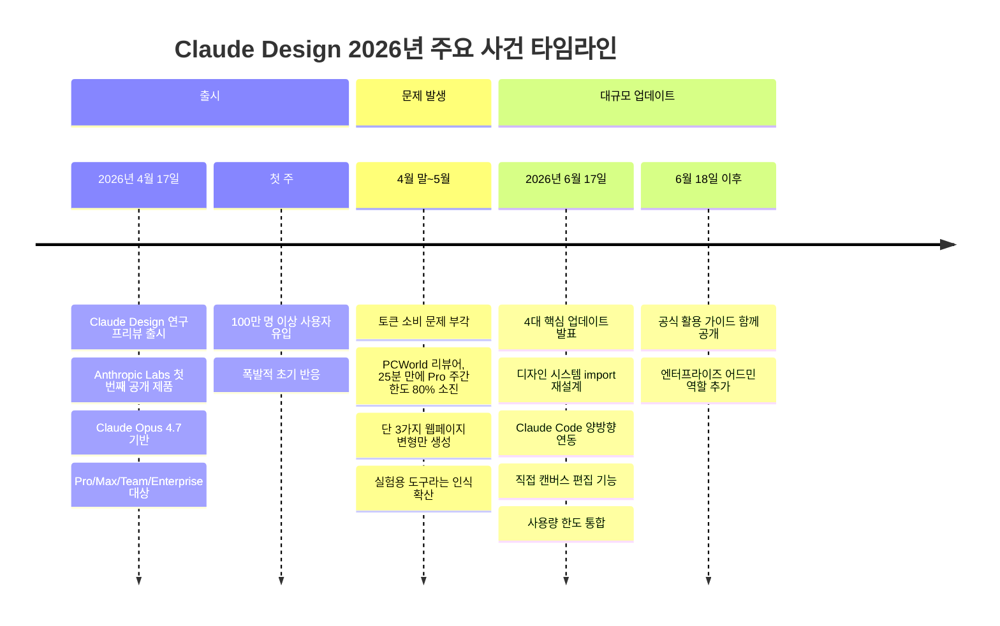
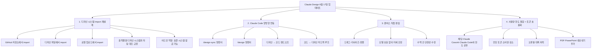
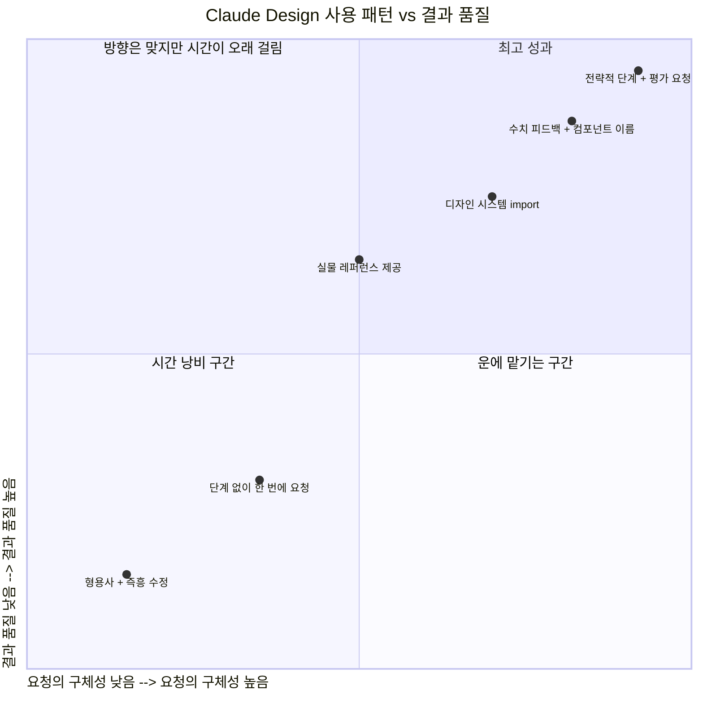
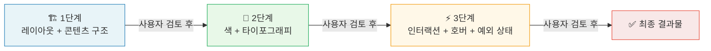
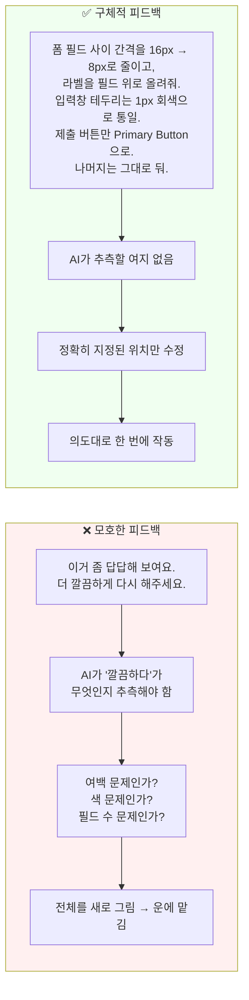
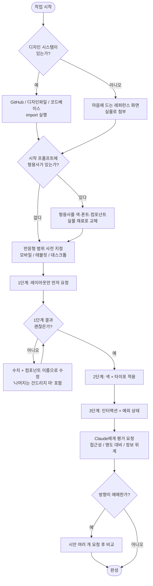
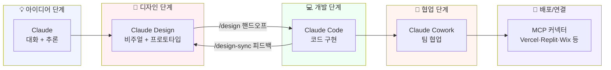

> **작성 기준일:** 2026년 6월 23일  
> **대상 독자:** Claude Design을 처음 쓰는 사람부터, 이미 써봤지만 결과가 아쉬웠던 사람 모두  
> **출처:** Anthropic 공식 발표, VentureBeat, TechRepublic, Engadget, Memeburn, StayPick Korea, Brunch 등 복수 매체 교차 검증

## 관련글

[**Claude Design 6월 18일 이후 사용법**](https://brunch.co.kr/@lukas08/229)

---

## 목차

1. [Claude Design이란 무엇인가](#1-claude-design이란-무엇인가)
2. [2026년 4월 출시부터 6월 업데이트까지: 무슨 일이 있었나](#2-2026년-4월-출시부터-6월-업데이트까지-무슨-일이-있었나)
3. [6월 17일 대규모 업데이트: 핵심 변경 사항 4가지](#3-6월-17일-대규모-업데이트-핵심-변경-사항-4가지)
4. [Anthropic이 직접 밝힌 Best Results 공식 가이드](#4-anthropic이-직접-밝힌-best-results-공식-가이드)
5. [같은 도구, 갈리는 결과: 왜 어떤 사람은 30분에 시안 3개를 만드는가](#5-같은-도구-갈리는-결과-왜-어떤-사람은-30분에-시안-3개를-만드는가)
6. [핵심 원칙 1: 시작을 설계한다 — 빈 채팅창에 형용사를 던지지 않는다](#6-핵심-원칙-1-시작을-설계한다)
7. [핵심 원칙 2: 단계적으로 쌓는다 — 한 번에 다 시키지 않는다](#7-핵심-원칙-2-단계적으로-쌓는다)
8. [핵심 원칙 3: 수치로 고친다 — "이상해요"는 정보가 아니다](#8-핵심-원칙-3-수치로-고친다)
9. [핵심 원칙 4: 생성기가 아니라 파트너로 쓴다](#9-핵심-원칙-4-생성기가-아니라-파트너로-쓴다)
10. [바로 복붙해서 쓸 수 있는 프롬프트 모음](#10-바로-복붙해서-쓸-수-있는-프롬프트-모음)
11. [이렇게 쓰면 망한다 — 피해야 할 패턴](#11-이렇게-쓰면-망한다)
12. [작업 전 체크리스트](#12-작업-전-체크리스트)
13. [자주 묻는 질문](#13-자주-묻는-질문)
14. [Claude Design의 전략적 위치: Figma 대비 어디에 서 있는가](#14-claude-design의-전략적-위치)

---

## 1. Claude Design이란 무엇인가

Claude Design은 Anthropic Labs가 만든 AI 기반 비주얼 디자인 도구다. 사용자가 원하는 것을 말로 설명하면, Claude가 디자인·프로토타입·슬라이드·랜딩페이지·마케팅 에셋 등 시각적 결과물을 직접 생성한다. 결과물은 정적인 이미지가 아니라 클릭 가능한 HTML로, 채팅창과 비주얼 캔버스가 함께 있는 환경에서 작업한다.

접근 경로는 두 가지다. 웹 브라우저에서는 `claude.ai/design`으로 바로 접근하거나, Claude 데스크톱 앱의 사이드바에서 진입한다. 유료 플랜인 Pro, Max, Team, Enterprise 구독자에게 베타로 제공되고 있으며, 현재도 점진적으로 기능이 확장되는 중이다.

Claude Design을 움직이는 모델은 Anthropic의 Claude Opus 4.7이다. 멀티모달 추론과 UI 생성에 특화된 이 모델 덕분에, Claude Design은 단순한 이미지 생성기와 달리 코드·디자인 시스템·레이아웃 구조를 실제로 이해하며 작업한다.

---

## 2. 2026년 4월 출시부터 6월 업데이트까지: 무슨 일이 있었나



Claude Design은 2026년 4월 17일 출시 첫 주에 100만 명 이상의 사용자를 끌어모을 만큼 폭발적인 반응을 얻었다. 그러나 동시에 심각한 문제도 드러났다. PCWorld의 한 리뷰어는 Claude Pro의 주간 토큰 한도 80%를 불과 25분 만에 소진하면서 웹페이지 변형 3가지만 생성하는 데 그쳤다. 이 사례는 업계에서 광범위하게 인용되며 "멋지지만 일상 작업에서 쓰기엔 너무 비싼 도구"라는 인식을 만들었다.

Anthropic은 두 달의 피드백 수집 기간을 거쳐 2026년 6월 17일에 대규모 업데이트를 발표했다. 이 업데이트는 단순한 기능 추가가 아니라, Claude Design을 연구 프리뷰 수준의 데모 도구에서 실제 일상 업무에 쓸 수 있는 워크스페이스로 전환하는 성격을 지닌다. Anthropic은 공식 블로그에서 "100만 명 이상이 첫 주에 Claude Design을 사용했고, 여러분의 피드백이 이번 빌드를 만들었다"고 밝혔다.

---

## 3. 6월 17일 대규모 업데이트: 핵심 변경 사항 4가지



### 3-1. 디자인 시스템 Import 재설계

이번 업데이트에서 가장 중요한 기능이다. 기존 Claude Design은 색상·폰트·컴포넌트 등 브랜드 정보를 프롬프트로 매번 설명해야 했고, 여러 세션을 거치면 일관성이 무너지기 쉬웠다. 이제는 GitHub 저장소, 디자인 파일, 로컬 파일 업로드 등 세 가지 경로 중 하나로 팀의 실제 디자인 시스템을 통째로 불러올 수 있다.

import가 완료되면 Claude는 해당 시스템에 정의된 컴포넌트를 사용하고, 출력물을 디자인 시스템 규칙과 자동으로 대조해 수정한 뒤에야 사용자에게 결과를 보여준다. 즉 사용자가 결과를 보기 전에 이미 자체 검수가 끝난다는 의미다. 대규모 조직에서는 어드민 역할이 하나의 표준 시스템을 승인하고 편집을 잠글 수 있어, 마케팅·디자인·개발 팀 전체가 일관된 브랜드 에셋을 AI로 생산할 수 있게 된다.

### 3-2. Claude Code 양방향 연동

디자인과 개발 사이의 핸드오프 문제는 소프트웨어 업계에서 수십 년째 이어진 골칫거리였다. Figma의 Dev Mode나 Zeplin 같은 도구들이 디자인 파일에서 코드 스니펫을 생성해 간격을 좁히려 했지만, 번역 과정에서 손실이 발생해 "목업과 실제 구현이 다르다"는 이슈가 반복됐다.

Anthropic의 해법은 같은 AI 시스템이 디자인과 코드 양쪽을 모두 담당하게 하는 것이다. `/design-sync` 명령어를 실행하면 로컬 코드베이스의 디자인 시스템이 Claude Design으로 당겨진다. 디자인이 완성되면 Claude Code가 처음부터 다시 만들지 않고 디자이너가 작업을 끝낸 정확한 지점에서 이어받는다. 반대로 Claude Code 터미널에서 `/design` 명령어를 치면 라이브 디자인 캔버스가 열려, 개발자가 워크플로우를 떠나지 않고 디자인을 생성·편집·동기화할 수 있다. Morning Brew 공동창업자이자 Tenex 창업자인 Alex Lieberman은 "Claude Design과 Claude Code 사이의 핸드오프가 프로토타입에서 프로덕션까지의 과정을 매끄럽게 만들었다"고 공식적으로 언급했다.

### 3-3. 캔버스 직접 편집

이전 버전에서는 사소한 위치 조정도 프롬프트로 요청해야 했고, 그 과정에서 모델 호출이 발생해 토큰이 소비됐다. 이번 업데이트로 드래그·리사이즈·정렬 같은 미세 조정은 캔버스에서 직접 처리할 수 있게 됐다. Anthropic은 수백 건의 안정성 수정도 함께 반영했다고 밝혔다. Anthropic 프로덕트 매니저 Robert Bye는 새 편집 경험을 "fire(끝내준다)"라고 표현했을 만큼, 실무 속도 개선이 뚜렷하다는 반응이다.

### 3-4. 사용량 한도 통합 및 토큰 효율화

가장 많은 초기 불만을 낳았던 토큰 과소비 문제에 대한 직접적 해결책이다. 기존에는 Claude Design이 별도의 더 작은 토큰 풀을 사용해 금방 한도에 도달했다. 이제는 일반 채팅, Claude Cowork, Claude Code와 사용량 한도를 공유한다. Anthropic은 이것이 "대부분의 사용자"에게 더 많은 작업 공간을 준다고 밝혔다. 동시에 턴당 평균 토큰 소비량도 줄었고 오류율도 크게 떨어졌다. 내보내기 옵션도 PDF와 PowerPoint가 추가됐고, Adobe, Base44, Canva, Gamma, Lovable, Miro, Replit, Vercel, Wix 등 주요 도구와의 커넥터가 통합됐다.

---

## 4. Anthropic이 직접 밝힌 Best Results 공식 가이드

6월 18일 이후 Anthropic은 활용 가이드를 공식 문서와 함께 공개했다. 다음은 Anthropic이 직접 명시한 "최상의 결과를 위한 팁" 전체다. 이 내용들은 이후 섹션에서 설명하는 실전 적용법의 이론적 근거가 된다.

| 팁 | Anthropic의 설명 |
|---|---|
| **완성된 디자인 시스템을 import하라** | 스타일, 폰트, 컴포넌트를 포함한 완전한 디자인 시스템을 불러와라 |
| **단순하게 시작해서 복잡도를 쌓아라** | 핵심 레이아웃과 콘텐츠부터 시작하고, 그 다음에 인터랙션·예외 처리·마감 디테일을 추가하라. Claude는 점진적 요청에 잘 반응한다 |
| **피드백을 구체적으로 말하라** | "이거 이상해 보여요"는 실행하기 어렵다. "폼 필드 사이 간격을 8px로 좁혀줘"가 Claude에게 필요한 정확한 정보다 |
| **디자인 시스템을 이름으로 참조하라** | 브랜드 시스템에 컴포넌트가 정의돼 있다면 이름으로 불러라: "Primary Button 컴포넌트 사용", "Card 레이아웃 패턴 적용" |
| **반응형을 일찍부터 고려하라** | 디자인이 모바일, 태블릿, 데스크톱 중 어디에서 동작해야 하는지, 아니면 하나만인지를 먼저 밝혀라 |
| **변형(Variation)을 요청하라** | 방향이 확실하지 않으면 Claude에게 2~3가지 옵션을 요청하라. 대안을 비교하는 것이 추측보다 훨씬 빠르다 |
| **Claude에게 피드백을 달라고 하라** | Claude는 접근성, 명도 대비, 정보 위계, 전반적인 사용성을 기준으로 디자인을 리뷰할 수 있다. 단순 생성기가 아니라 디자인 협업자로 대하라 |
| **규격이 아닌 실물 예시를 포함하라** | 완성된 랜딩페이지나 마케팅 사이트가 색상 팔레트 하나보다 브랜드의 느낌을 Claude에게 훨씬 잘 전달한다 |
| **반복하라** | 첫 번째 추출 결과가 브랜드를 잘 포착하지 못하면, 추가적이거나 다른 에셋을 업로드해 보라 |

---

## 5. 같은 도구, 갈리는 결과: 왜 어떤 사람은 30분에 시안 3개를 만드는가



Claude Design은 모든 사용자에게 동일한 화면, 동일한 모델, 동일한 import 버튼을 제공한다. 그러나 한 달 뒤 결과물의 차이는 극명하다. 한 사람은 30분 만에 시안 세 개를 뽑아 회의에 들고 들어가고, 다른 사람은 두 시간을 써도 "이거 좀 이상한데"를 반복하다 결국 직접 피그마를 연다.

이 차이가 도구에서 비롯되지 않는다는 것이 핵심이다. 도구는 같다. 주문하는 방식이 다른 것이다.

Anthropic의 공식 가이드는 이 차이를 한 문장으로 요약한다.

> **Claude Design은 채팅이 아니라 협업이다.**

검색창에 키워드를 던지듯 쓰면 검색 결과처럼 불확실한 결과가 나오고, 동료에게 일을 맡기듯 맥락과 규격을 함께 주면 결과물이 나온다. 이 차이를 실제로 만들어내는 원칙은 네 가지로 정리된다.

---

## 6. 핵심 원칙 1: 시작을 설계한다

### 형용사는 정보가 아니다

"세련되게", "고급스럽게", "트렌디하게." 이런 단어들은 AI 입장에서 정보가 아니라 분위기다. 분위기는 같은 프롬프트를 두 번 입력하면 두 가지 다른 화면이 나오게 만든다. 일관성이 없다.

잘 쓰는 사람은 시작부터 재료를 깐다. 방법은 두 가지다.

**방법 A: 디자인 시스템이 이미 있는 경우**

팀의 GitHub 저장소, 기존 디자인 파일, 로컬 코드베이스를 import한다. 색·폰트·컴포넌트·간격 토큰이 정의된 판을 먼저 깔고 시작하면, 결과가 매번 튀지 않는다. Claude는 그 시스템 안에서만 작업하고 스스로 검수한다.

**방법 B: 디자인 시스템이 없는 경우**

규격을 읊는 대신 실물을 던진다. "블루 계열에 Pretendard 폰트를 써줘" 같은 사양 나열보다, 마음에 드는 랜딩페이지를 통째로 보여주는 것이 훨씬 효과적이다. Anthropic의 공식 가이드도 같은 이유로 "색상 팔레트보다 완성된 랜딩페이지가 브랜드의 느낌을 더 잘 전달한다"고 명시한다. 색 코드는 브랜드의 공기를 담지 못하지만, 완성된 화면은 담는다.

---

## 7. 핵심 원칙 2: 단계적으로 쌓는다

### 한 번에 다 시키면 어디서 틀렸는지도 모른다

처음부터 레이아웃, 색, 인터랙션, 예외 처리, 마감 디테일까지 한 프롬프트에 욱여넣으면 두 가지 문제가 생긴다. 첫째, AI가 모든 것을 "적당히" 처리해서 어느 것도 제대로 되지 않는다. 둘째, 결과가 마음에 들지 않을 때 어디서 무엇을 고쳐야 할지 알 수 없다.

Anthropic의 공식 가이드는 단순한 순서를 제안한다. 핵심 레이아웃과 콘텐츠를 먼저 잡고, 그 다음에 인터랙션·예외 케이스·마감 디테일을 추가하라는 것이다. Claude는 점진적 요청에 잘 반응한다.



비유하자면 집을 짓는데 "멋진 집"이라고 외치는 사람과, 평면도와 자재 목록을 들고 오는 사람의 차이다. 1단계 레이아웃이 틀렸는데 색까지 입힌 뒤에 발견하면, 그건 수정이 아니라 재작업이 된다.

---

## 8. 핵심 원칙 3: 수치로 고친다

### "이상해요"는 AI에게 룰렛이다

첫 결과물이 마음에 들지 않을 때 가장 흔한 반응은 이런 말들이다. "이거 좀 어색한데요." "느낌이 안 사네요." "다시 해줘요." AI는 이 말을 받으면 룰렛을 돌린다. 어디가 어떻게 어색한지 알 수 없기 때문이다.

Anthropic의 공식 가이드는 이것을 명확히 짚는다. "'이거 이상해 보여요'는 실행하기 어렵다. '폼 필드 사이 간격을 8px로 좁혀줘'가 Claude에게 필요한 정확한 정보다."



특히 중요한 것은 "나머지는 건드리지 마"라는 한 문장이다. 이 문장을 빠뜨리면 AI가 멀쩡한 부분까지 새로 그려서 어렵게 잡아둔 화면이 다시 흐트러진다.

컴포넌트를 수정할 때는 이름을 정확하게 부르는 것도 큰 차이를 만든다. "버튼 좀 바꿔줘"가 아니라 "Primary Button 컴포넌트로 교체해줘"라고 하면, AI가 비슷한 것을 새로 만드는 대신 디자인 시스템에 이미 존재하는 것을 그대로 가져온다. 이것이 import를 먼저 해야 하는 이유이기도 하다.

---

## 9. 핵심 원칙 4: 생성기가 아니라 파트너로 쓴다

못 쓰는 사람에게 Claude Design은 자판기다. 주문하면 결과물이 나오는 기계. 그래서 결과가 별로면 발로 찬다. 잘 쓰는 사람에게는 디자인 파트너다. 이 차이는 두 가지 행동에서 나타난다.

### 행동 1: 시안을 한 번에 여러 개 받는다

방향이 확실하지 않을 때 머릿속에서 "어떤 느낌이 좋을까"를 굴리는 것은 비효율적이다. 눈앞에 두세 가지 대안을 깔고 고르는 것이 훨씬 빠르다. Anthropic의 공식 가이드도 이것을 명시한다. "방향이 확실하지 않으면 2~3가지 옵션을 요청하라. 대안을 비교하는 것이 추측보다 훨씬 빠르다."

### 행동 2: 평가를 요청한다

생성을 시키는 것만큼 평가를 시키는 것도 중요하다. 접근성, 명도 대비, 정보 위계는 사람 눈으로 매번 잡기 번거로운 영역이다. 디자인 좀 아는 동료에게 "이 화면 접근성은 괜찮아?" 하고 묻듯이 Claude에게 물으면 된다. Anthropic의 공식 가이드도 "Claude는 접근성, 명도 대비, 정보 위계, 전반적인 사용성을 리뷰할 수 있다. 단순 생성기가 아니라 디자인 협업자로 대하라"고 명시한다.

---

## 10. 바로 복붙해서 쓸 수 있는 프롬프트 모음

### 🔧 시작 프롬프트 — 디자인 시스템이 있는 경우

```
지금 만들 화면의 디자인 시스템은 이미 [GitHub 저장소 주소 / 디자인 파일 / 코드베이스 경로]에 있다.
거기 정의된 색, 폰트, 컴포넌트, 간격 토큰을 먼저 읽고 그 규칙 안에서만 작업해줘.
새로운 색이나 폰트를 임의로 만들지 말고, 정의된 토큰이 부족하면 먼저 나에게 물어봐.
이 시스템에서 자주 쓰는 컴포넌트 이름을 먼저 목록으로 정리해서 보여줘.
```

### 🖼️ 시작 프롬프트 — 레퍼런스 실물이 있는 경우

```
이 랜딩페이지(첨부)와 비슷한 결로 만들어줘.
색감, 여백 리듬, 타이포 위계, 버튼 모양, 전체적인 무드를 분석한 다음,
우리 콘텐츠에 맞게 옮겨줘.
색 코드를 그대로 베끼지 말고, 이 화면이 주는 '분위기'를 우리 브랜드 색으로 번역해줘.
```

### 📐 단계 분리 프롬프트

```
한 번에 다 만들지 마.

1단계: 레이아웃과 콘텐츠 구조만 잡아줘. 색과 디테일은 아직 넣지 마.
내가 확인하면 2단계로 넘어간다.

2단계: 디자인 시스템의 색과 타이포를 입혀줘.

3단계: 인터랙션, 호버, 예외 상태(빈 화면, 로딩, 에러)를 채워줘.

지금은 1단계만 해줘.
```

### ✏️ 수치 수정 프롬프트

```
전체를 다시 만들지 말고 아래만 수정해줘.

- 폼 필드 사이 세로 간격을 8px로 줄여줘.
- 히어로 제목을 32px에서 40px로 키워줘.
- 카드 사이 간격을 24px로 통일해줘.
- CTA 버튼을 Primary Button 컴포넌트로 교체해줘.

나머지는 건드리지 마.
```

### 🔍 평가 요청 프롬프트

```
이 화면을 만들지 말고 평가해줘.

- 색 명도 대비가 WCAG AA 기준(4.5:1)을 통과하는지
- 정보 위계가 한눈에 읽히는지, 강조 요소가 한 화면에 하나로 모이는지
- 모바일에서 터치 타깃이 44px 이상인지
- 시선 흐름이 자연스러운지

문제 지점을 좌표(어느 요소, 어떤 수치)로 짚고, 각각 어떻게 고칠지 제안해줘.
```

### 🎯 시안 여러 개 요청 프롬프트

```
이 섹션의 시안을 한 번에 3개로 보여줘.

- 1안: 안전하고 정보 위주
- 2안: 여백 많고 미니멀
- 3안: 과감하고 시선 끄는 버전

각 안마다 어떤 상황에 어울리는지 한 줄로 설명해줘.
내가 하나 고르면 그 방향으로만 디테일을 발전시킨다.
```

### 📱 반응형 조건 사전 지정 프롬프트

```
이 화면은 모바일(320px~768px), 태블릿(768px~1024px), 데스크톱(1024px 이상)
세 가지 모두 대응해야 해.

각 브레이크포인트에서 레이아웃이 어떻게 달라지는지 함께 보여줘.
모바일 퍼스트로 설계해줘.
```

---

## 11. 이렇게 쓰면 망한다

다음 패턴들은 공통적으로 "작업이 앞으로 나가지 않는" 결과를 만든다.

**형용사로 시작해서 형용사로 고친다.** "예쁘게"로 시작해 "좀 더 예쁘게"로 고치면 영원히 룰렛이다. 분위기로는 일관성이 나오지 않는다. 시작은 재료(디자인 시스템 또는 레퍼런스 실물)로, 수정은 수치로 가야 한다.

**한 프롬프트에 전부 욱여넣는다.** 레이아웃, 색, 인터랙션, 예외 처리를 한 번에 시키면 AI가 모든 것을 적당히 처리한다. 그 결과 어디를 고쳐야 할지도 모르게 된다. 단계를 끊어라.

**매번 "전체를 다시 만들어줘"라고 한다.** 잘 나온 부분까지 새로 그려져 어렵게 잡아둔 화면이 흐트러진다. 수정 프롬프트에는 반드시 "나머지는 건드리지 마"를 붙여라.

**첫 결과를 최종으로 본다.** 첫 화면은 초안이지 결론이 아니다. 별로면 발로 차는 대신 레퍼런스를 더 주고, 시안을 여러 개 받아 좁혀가라. Anthropic의 공식 가이드도 "첫 번째 추출 결과가 브랜드를 잘 포착하지 못하면 추가적인 에셋을 업로드해 보라"고 명시한다.

**반응형을 나중에 추가로 요청한다.** 모바일 대응을 다 만들고 나서 "아 모바일도요"라고 하면 재작업이다. 반응형 범위는 처음부터 조건으로 깔아야 한다.

---

## 12. 작업 전 체크리스트

아래 항목을 순서대로 확인하면 첫 결과물의 질이 눈에 띄게 달라진다.



---

## 13. 자주 묻는 질문

**Q. 디자인 시스템이 없는데 import를 어떻게 하나?**

정리된 시스템이 없으면 import는 건너뛰어도 된다. 마음에 드는 사이트 한두 개를 캡처해서 보여주고, 그 무드를 우리 콘텐츠에 옮겨달라고 하면 충분하다. 작업이 반복되면 그때 색·폰트·컴포넌트를 한 파일로 정리해 두고, 다음부터 그것을 import하면 점점 일관성이 올라간다.

**Q. 수치 피드백을 하려면 디자인 전문 지식이 필요하지 않나?**

8px, 16px 같은 정확한 값을 몰라도 된다. "간격을 절반으로", "제목을 한 단계 크게"처럼 방향과 정도만 줘도 "예쁘게"보다 훨씬 낫다. 앞서 소개한 평가 요청 프롬프트로 Claude에게 "어디를 어떻게 고치면 좋을지 수치로 제안해줘"라고 시키면, 역으로 AI가 수치를 만들어 준다. Claude를 수치 생성기로도 쓸 수 있다.

**Q. 매번 이렇게 길게 쓰면 더 번거롭지 않나?**

처음 한 번만 길다. import 문장과 단계 프롬프트는 한 번 저장해두고 재사용하면 된다. 수정은 오히려 한 줄짜리 좌표 지시라 더 짧아진다. 번거로운 쪽은 "별로야 다시"를 다섯 번 반복하는 패턴이다.

**Q. Claude Code 연동은 어떻게 사용하나?**

Claude Code 터미널에서 `/design-sync`를 실행하면 코드베이스의 디자인 시스템이 Claude Design으로 당겨진다. 디자인이 완성된 뒤 Claude Code로 핸드오프하면, 개발자가 처음부터 다시 구현할 필요 없이 디자이너가 마친 정확한 지점에서 이어받는다. Claude Code 터미널에서 `/design`을 치면 라이브 디자인 캔버스가 열린다.

**Q. Claude Design은 별도 구독이 필요한가?**

아니다. 유료 플랜인 Pro($20/월), Max($100/월 이상), Team, Enterprise에 포함돼 있다. `claude.ai/design`으로 직접 접근하거나 Claude 데스크톱 앱 사이드바에서 진입한다.

---

## 14. Claude Design의 전략적 위치

Claude Design이 단순한 디자인 도구 이상의 의미를 갖는 이유를 이해하려면, Anthropic이 쌓아가는 제품 스택을 함께 봐야 한다.



Claude가 대화와 추론을 담당하고, Claude Design이 시각화와 프로토타이핑을, Claude Code가 개발을, Claude Cowork가 팀 협업을 담당한다. MCP 커넥터는 Vercel, Replit, Wix, Canva, Adobe, Miro 등 외부 도구와 전체 스택을 연결한다. Anthropic은 Figma의 경쟁자를 만드는 것이 아니라, 아이디어에서 프로토타입, 코드 구현, 배포까지 이어지는 통합 플랫폼을 만들고 있다. Claude Design은 그 안에서 "아이디어와 코드 사이의 빠진 연결 고리"를 채우는 역할이다.

Figma는 여전히 다중 사용자 협업, 고급 벡터 편집, 에이전시 워크플로우에서 강점을 유지한다. Claude Design은 아이디어에서 클릭 가능한 프로토타입까지의 속도에서 이긴다. 두 도구는 현재 대체 관계보다 보완 관계에 가깝지만, AI 네이티브 팀이 증가할수록 그 균형은 계속 이동할 것이다.

---

## 마무리: 도구는 모두에게 같다

Claude Design은 모든 사용자에게 동일한 화면을 준다. 같은 모델, 같은 기능, 같은 import 버튼. 그러나 한 달 뒤 결과물은 완전히 다르다.

갈리는 것은 도구가 아니다. 시작을 설계했는가, 단계를 끊었는가, 수치로 고쳤는가, AI를 동료로 봤는가. 그 네 가지다.

디자인을 말로 시키는 시대가 왔다는 것은 모두가 안다. 그러나 말을 어떻게 하느냐는 여전히 사람의 몫이다.

---

*이 문서는 2026년 6월 23일 기준으로 작성됐으며, Anthropic 공식 발표(2026년 6월 17일), VentureBeat, TechRepublic, Engadget, Memeburn, Technobezz, StayPick Korea, Brunch 등 복수 출처를 교차 검증해 작성되었습니다. 막연한 추측 없이 확인된 사실만을 담았습니다.*
