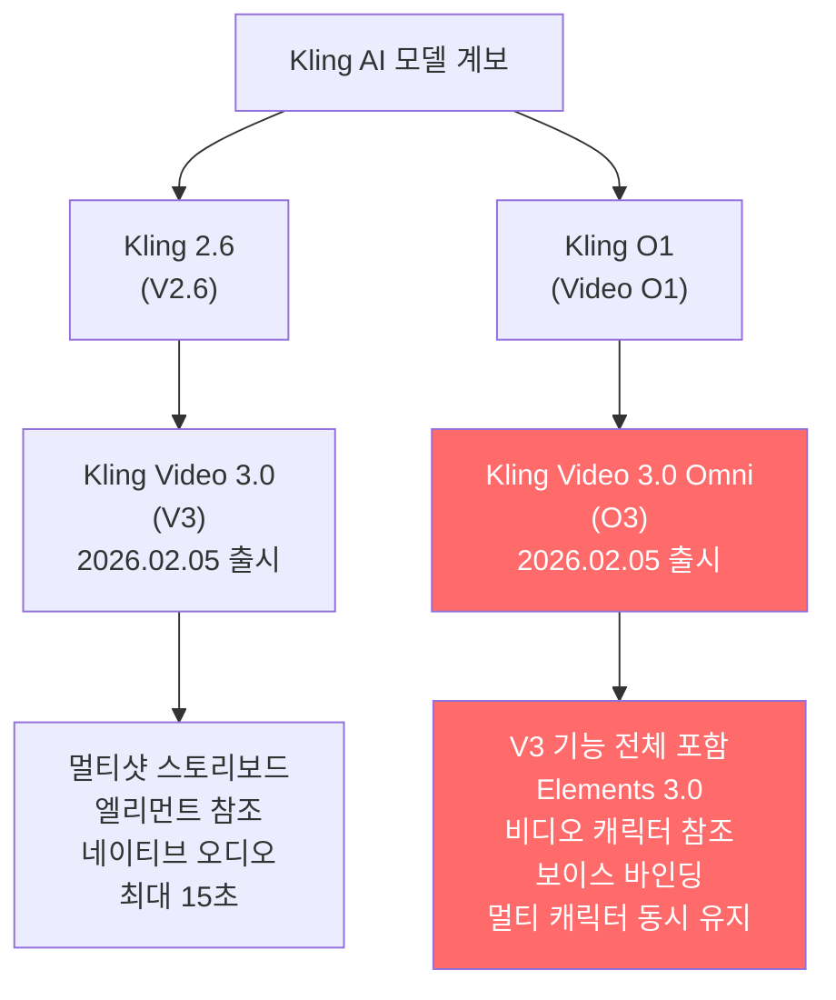
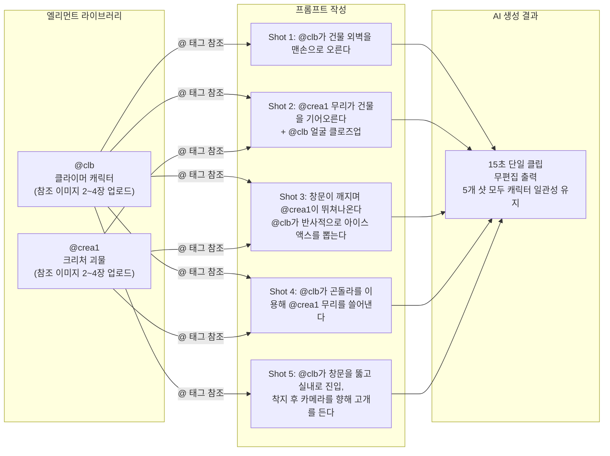
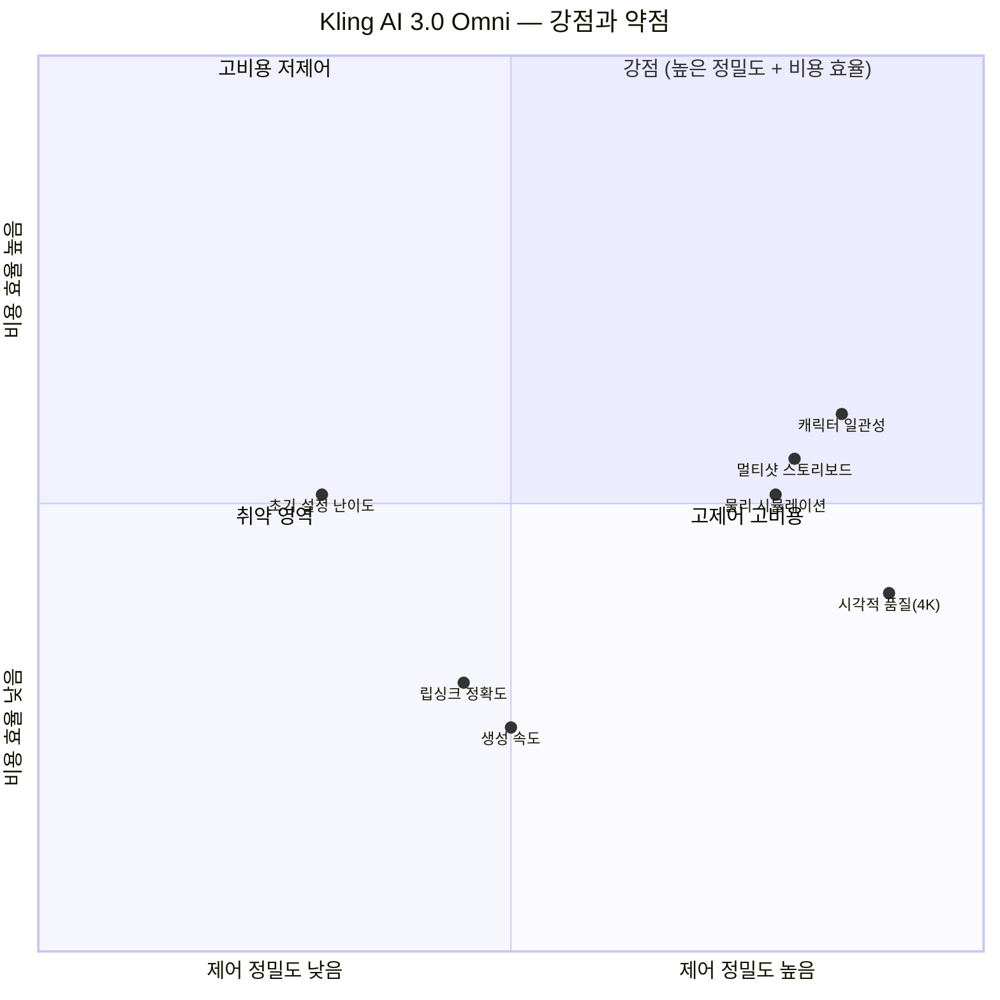

## @moosae의 Threads 포스트 해설 — 15초 멀티샷 액션 클립의 모든 것

> 이 문서는 Threads 크리에이터 **@moosae**가 공유한 AI 생성 영상 클립을 심층 분석합니다.  
> 해당 클립은 **Kling AI 3.0 Omni 모드**를 사용해 제작되었으며, 단 한 번의 텍스트 프롬프트 입력만으로 편집 없이 생성된 15초 분량의 멀티샷 액션 시퀀스입니다.

> 
> https://www.threads.com/@moosae/post/DZrFH2PAecY
> 
> 아래 공유한 프롬프트로 뽑은 무편집 클립입니다. 다른 분들의 캐릭터 버전도 보고 싶은데 관심가져주실 분 계실까요?
> 
> 주인공은 @ clb 괴물은 @ crea1 로 참조시켰습니다

```
Context & Style: 15-second multi-shot action sequence. 3rd-person intimate witness perspective. Cinematic lighting, ARRI ALEXA, photorealistic, gloomy overcast sky, moody cool color grading. Chaotic but readable handheld motion. Avoid jitter, avoid identity drift.

subtle film grain, realistic depth of field, grounded physical camera behavior. handheld cinematography only — no dolly shots, no zoom-ins, no slow motion, no floating camera movement. Every camera motion must feel physically operated by a nearby third-person observer with real inertia and body weight. no music.

Subject: A woman who climbs professionally. She has well-developed muscles suited to climbing. An ice axe is attached to her waist belt. @clb

Monster Profile: Bio-organic asymmetrical monsters based on @crea1 with dark metallic-organic chitinous scales and multiple rows of sharp teeth.

[0-3s: Shot 1]

Low angle tracking shot. @clb is bare-hand climbing the exterior wall of a severely ruined, crumbling concrete skyscraper. Small concrete debris falls past the lens as @clb reaches upward.

[03-06s: Shot 2]

Downward pan shot. A massive swarm of grotesque @crea1 is frantically crawling up the building facade from below, chasing @clb. Fast, relentless motion. Quick insert: a sharp, low-angle close-up of @clb’s tense, sweating face looking down at the oncoming threat.

[06-09s: Shot 3]

3rd-person intimate witness perspective. A window directly above @clb shatters outward violently. Another @crea1 lunges out to grab @clb. Brief slow-motion on anticipation. In a split-second reflex, @clb quickly unclips and draws the ice axe attached to her waist belt. Leaping laterally in mid-air, she forcefully slams the drawn ice axe into a broken, rusted window-cleaning gondola wedged in the wall. The camera flinches on impact. The monster misses, flailing wildly as it falls down past the lens.

[09-12s: Shot 4]

Wide tracking shot, chaotic but readable motion. @clb violently shakes and wrenches the ice axe stuck in the gondola. The impact tears the gondola completely from the wall with a massive burst of concrete dust. Suspended by its thick ropes, the heavy gondola swings in a huge pendulum arc, forcefully sweeping away and smashing all the climbing @crea1 below. Monsters and debris plummet downward.

[12-15s: Shot 5]

Dynamic tracking shot. The cable recoil violently swings the gondola and @clb backward, crashing forcefully through a massive glass window of the building facade. As they breach into the dark interior amid shattering glass, @clb instantly releases her grip on the gondola, rolls hard across the dusty concrete floor to absorb the impact, and springs into a stable, crouched landing. The sequence ends on a tight close-up of her face as she looks sharply back directly toward the camera, breathing heavily.

```


---

## 1. 이 포스트가 담고 있는 것

Threads에서 @moosae가 공유한 것은 단순한 짧은 영상이 아닙니다. 이 클립은 AI 영상 생성 기술이 2026년 현재 어디까지 왔는지를 보여주는 현장 증거입니다.

포스트 본문에는 두 가지 핵심 정보가 담겨 있습니다. 첫째, 이 영상은 "무편집 클립", 즉 AI가 생성한 결과물을 어떠한 후반 편집 없이 그대로 공유한 것이라는 점입니다. 둘째, 영상 생성에 사용된 프롬프트 전체가 공개되어 있어, 어떤 방식으로 이 영상이 만들어졌는지 정확히 추적할 수 있다는 점입니다.

포스트에는 좋아요 1,398개, 댓글 141개, 리포스트 145회, 공유 188회가 달렸습니다. AI 영상 제작 커뮤니티에서 꽤 큰 반향을 불러일으킨 것입니다. @moosae는 포스트 말미에 "다른 분들의 캐릭터 버전도 보고 싶은데 관심 가져주실 분 계실까요?"라고 적었는데, 이는 이 클립이 특정 캐릭터를 고정시켜 다른 사람들도 자신만의 주인공 버전으로 동일한 영상을 만들 수 있다는 Kling AI 3.0 Omni 모드의 핵심 특성을 암시합니다.

---

## 2. 어떤 AI 도구로 만들었는가: Kling AI 3.0 Omni 모드

### 2.1 Kling AI의 배경

Kling AI는 중국의 IT 기업 콰이쇼우(Kuaishou)가 개발한 AI 영상 생성 플랫폼입니다. 콰이쇼우는 틱톡(TikTok)의 중국판인 더우인(抖音)과 경쟁하는 숏폼 동영상 플랫폼 콰이쇼우(快手)를 운영하는 회사이기도 합니다.

Kling AI는 2024년 등장한 이래로 AI 영상 생성 분야에서 빠르게 존재감을 키워왔습니다. 초기 버전은 텍스트 프롬프트로부터 단편적인 영상 클립을 생성하는 수준이었지만, 버전을 거듭하면서 캐릭터 일관성, 멀티샷 지원, 물리 시뮬레이션 등에서 비약적인 발전을 이뤄냈습니다.

### 2.2 2026년 2월, Kling 3.0의 등장

2026년 2월 5일, 콰이쇼우는 Kling Video 3.0 시리즈를 공식 출시했습니다. 이 시리즈는 두 가지 주요 모델로 구성됩니다.

하나는 **Kling Video 3.0** (일명 V3)으로, 이전 세대인 Video 2.6을 업그레이드한 모델입니다. 다른 하나는 **Kling Video 3.0 Omni** (일명 O3)로, 이전의 Video O1을 업그레이드한 최상위 모델입니다. @moosae가 사용한 것이 바로 이 Omni 버전입니다.

두 모델의 핵심 공통 스펙을 살펴보면, 영상 길이가 최대 15초까지 늘었고, 해상도는 최대 4K 네이티브 출력(업스케일이 아닌 실제 4K 생성)을 지원하며, 프레임 레이트는 최대 60FPS까지 가능합니다. 멀티샷 스토리보드 기능으로 하나의 프롬프트 안에서 최대 6개의 컷을 순서대로 지정할 수 있으며, 영어, 중국어, 일본어, 한국어, 스페인어 5개 언어에서 립싱크 오디오 생성을 지원합니다.

Kling 3.0이 이전 세대와 가장 크게 다른 점은 아키텍처의 변화입니다. 이전까지의 AI 영상 생성 도구들은 텍스트-to-비디오, 이미지-to-비디오, 오디오 합성을 별개의 파이프라인으로 처리했습니다. 하지만 Kling 3.0은 **Multi-modal Visual Language(MVL)** 프레임워크를 기반으로, 텍스트·이미지·영상·오디오를 하나의 통합 아키텍처 안에서 처리합니다. 쉽게 말하면, 모든 입력을 "하나의 뇌"로 동시에 이해하고 생성한다는 뜻입니다.

### 2.3 Omni 모드가 특별한 이유

Kling 3.0에 "Omni(옴니)"라는 이름이 붙은 것은 단순한 마케팅이 아닙니다. Omni는 라틴어로 "모든 것"을 의미하는데, 이 모드는 Kling의 모든 기능 — 텍스트 참조, 이미지 참조, 영상 참조, 멀티샷 스토리보드, 오디오 생성 — 을 단 하나의 생성 흐름 안에 통합합니다.

특히 **Elements 시스템**이 Omni 모드의 핵심입니다. 이 기능이 바로 @moosae의 클립에서 `@clb`와 `@crea1`이 등장하는 이유입니다. 이에 대해서는 다음 섹션에서 자세히 설명하겠습니다.



---

## 3. Elements 시스템과 @ 태그 참조 방식

### 3.1 엘리먼트란 무엇인가

AI 영상 생성에서 가장 오랫동안 해결되지 않았던 문제는 **캐릭터 일관성(character consistency)** 이었습니다. 텍스트 프롬프트에 아무리 상세하게 인물 외모를 묘사해도, AI는 매번 조금씩 다른 생김새의 인물을 만들어냈습니다. 같은 인물이 여러 샷에 걸쳐 등장해야 하는 경우, 샷이 바뀔 때마다 얼굴이나 옷이 미묘하게 달라지는 문제 — 이를 업계에서는 "캐릭터 드리프트(character drift)"라고 부릅니다 — 가 발생했습니다.

Kling AI 3.0 Omni의 **Elements 시스템**은 이 문제를 근본적으로 해결하는 방식으로 설계되었습니다.

엘리먼트(Element)는 특정 캐릭터, 사물, 또는 장소에 대한 "시각적 정체성 프로필"입니다. 크리에이터는 한 대상에 대해 여러 각도에서 촬영한 사진 2~4장을 업로드해 하나의 엘리먼트를 만듭니다. 정면, 측면, 후면, 45도 각도 등 다양한 방향의 사진을 제공하면, Kling AI는 이 사진들을 통해 해당 인물 또는 사물의 "3차원적 정체성"을 학습합니다.

이렇게 만들어진 엘리먼트는 Kling의 엘리먼트 라이브러리에 저장됩니다. 이후 어떤 프롬프트에서든 이 엘리먼트를 불러와 참조할 수 있으며, AI는 프롬프트에 따라 어떤 동작, 어떤 카메라 앵글, 어떤 조명 환경이 주어지더라도 해당 인물의 외모를 일관되게 유지합니다.

Kling 3.0 Omni의 Elements 3.0 버전에서는 여기서 한 걸음 더 나아갑니다. 정적 이미지뿐만 아니라 **3~8초 분량의 짧은 영상 클립**으로도 엘리먼트를 생성할 수 있습니다. 영상을 사용하면 인물의 움직임 특성과 목소리까지 함께 학습되어, 이후 AI가 생성하는 영상에서 그 인물만의 독특한 움직임과 음성 톤이 재현됩니다.

### 3.2 @ 태그 작동 원리

엘리먼트를 만들 때 크리에이터는 그 엘리먼트에 이름을 붙입니다. 그리고 프롬프트를 작성할 때 `@이름` 형식으로 해당 엘리먼트를 호출합니다. Kling AI 공식 문서에 따르면, Omni 모드에서 `@`를 입력하면 저장된 엘리먼트 목록 팝업이 열리고, 거기서 원하는 엘리먼트를 선택하면 프롬프트 안에 `@이름` 형태로 삽입됩니다.

이 방식이 혁신적인 이유는, 텍스트로 인물의 외모를 매번 재설명할 필요가 없어지기 때문입니다. 기존 방식에서 크리에이터는 "검은 머리에 포니테일을 한 동아시아계 여성, 근육질 체형, 파란색 스포츠 탑, 허리에 아이스 액스 장착"처럼 매 샷마다 동일한 묘사를 반복해야 했습니다. 하지만 이제는 `@clb`라고만 써도 AI가 그 인물의 정체성을 정확히 불러옵니다.

Adobe에서 Kling 3.0 / 3.0 Omni를 Adobe Firefly에 통합하면서 공개한 문서에도 이 방식이 명확히 설명되어 있습니다: "엘리먼트를 `@`와 엘리먼트 이름으로 태그하면, 영상 전반에 걸쳐 일관된 캐릭터, 사물, 장소를 생성할 수 있습니다."

### 3.3 이 영상에서의 @clb와 @crea1


`@clb`는 주인공 여성 캐릭터를 가리킵니다. 이름은 영어 단어 "climber(클라이머)"의 약자로 추정됩니다. 프롬프트 본문에서 이 캐릭터는 "직업적으로 암벽 등반을 하는 여성으로, 등반에 적합한 발달된 근육을 가지며, 허리 벨트에 아이스 액스를 장착"한 인물로 묘사됩니다. 영상에서는 땀에 젖은 얼굴의 동아시아계 여성이 파란색 스포츠 탑을 입고 등장합니다. @moosae가 별도로 만들어 엘리먼트 라이브러리에 저장해 둔 캐릭터를 그대로 불러온 것입니다.

`@crea1`은 괴물 캐릭터를 가리킵니다. 이름은 "creature 1(크리처 1)"의 약자로 추정됩니다. 프롬프트에서는 "어두운 금속성-유기체적 키틴 비늘과 여러 줄의 날카로운 이빨을 가진 생체 유기적 비대칭 괴물"로 묘사됩니다. 영상에서 보면 피부가 없는 듯한 회백색의 근육질 몸체에 뾰족한 귀와 커다란 입을 가진 생물체가 등장하는데, 이것이 @crea1 엘리먼트의 시각적 구현입니다.

중요한 점은, 이 두 엘리먼트가 5개의 서로 다른 샷에 걸쳐 일관되게 등장한다는 것입니다. 카메라 앵글이 바뀌고, 조명이 달라지고, 동작이 격렬해져도 @clb는 같은 인물로, @crea1은 같은 괴물로 인식됩니다. 바로 이 지점이 Kling AI 3.0 Omni 모드가 이전 세대와 다른 핵심입니다.



---

## 4. 프롬프트 심층 분석: 5개 샷의 정밀 설계


### 4.1 전체 스타일 지침

프롬프트는 영상 전체에 적용될 촬영 스타일을 먼저 정의합니다.

촬영 방식은 핸드헬드(hand-held)로만 제한됩니다. 달리 샷, 줌인, 슬로모션, 공중 부양 카메라 움직임은 모두 명시적으로 금지됩니다. 이는 "물리적으로 조작되는 카메라"의 감각을 살리기 위한 것입니다. 프롬프트에는 "모든 카메라 움직임은 실제 관성과 신체 무게를 가진 3인칭 목격자가 근처에서 조작하는 것처럼 느껴져야 한다"고 명시되어 있습니다.

색감은 "무거운 흐린 하늘, 우울한 차가운 색상 그레이딩"으로 설정됩니다. 여기에 미세한 필름 그레인, 사실적인 피사계 심도, 음악 없음이 조합됩니다. 이 스타일 지침들은 마치 실제 영화 세트에서 촬영된 듯한 질감을 만들어냅니다.

카메라 설정으로는 ARRI ALEXA가 명시됩니다. ARRI ALEXA는 실제 할리우드 영화 촬영에 사용되는 최고급 디지털 시네마 카메라입니다. AI에게 "ARRI ALEXA로 촬영된 것처럼"이라고 지시하는 것은, 그 카메라가 만들어내는 특유의 색감, 노이즈 특성, 동적 범위를 AI가 학습한 수백만 장의 영화 프레임으로부터 재현해달라는 의미입니다.

### 4.2 Shot 1 [0~3초]: 저앵글 트래킹

첫 번째 샷은 폐허가 된 고층 콘크리트 건물의 외벽을 맨손으로 오르는 주인공 `@clb`를 로우 앵글 트래킹 샷으로 담습니다. 프롬프트에는 "작은 콘크리트 파편이 렌즈 앞으로 떨어지면서 @clb가 위를 향해 손을 뻗는다"고 묘사되어 있습니다.

영상에서는 이 장면이 기울어진 건물 외벽 구조물을 따라 올라가는 여성의 모습으로 구현되었습니다. 카메라가 매우 낮은 위치에서 인물을 올려다보는 구도로, 건물 외벽의 금속 구조물과 하늘이 대각선으로 교차하는 역동적인 화면 구성이 만들어졌습니다. 외벽에 매달린 그녀의 상체와 팔의 근육 긴장감이 핸드헬드 특유의 미세한 흔들림과 함께 포착됩니다.

### 4.3 Shot 2 [3~6초]: 하향 팬 + 클로즈업 인서트

두 번째 샷은 아래에서 건물 외벽을 타고 올라오는 `@crea1` 괴물 무리를 내려다보는 하향 팬 샷입니다. 괴물 무리는 "빠르고 집요한 움직임"으로 묘사됩니다. 그리고 이어서 아래에서 올라오는 위협을 내려다보는 `@clb`의 긴장된 얼굴을 담은 로우 앵글 클로즈업 인서트가 삽입됩니다.

이 샷은 두 가지 정보를 빠르게 전달합니다. 위협의 규모(괴물이 여럿이고 빠르게 접근 중)와 주인공의 심리 상태(위험을 인지한 긴박함)가 거의 동시에 제시됩니다. 영상에서 보면 회백색 피부에 비대칭적인 몸체를 가진 괴물들이 건물 외벽의 균열 사이로 기어오르는 모습과, 그것을 내려다보는 여성의 땀에 젖은 얼굴이 짧게 교차합니다.

### 4.4 Shot 3 [6~9초]: 유리창 격파와 아이스 액스

세 번째 샷은 이 영상의 가장 극적인 순간입니다. `@clb` 바로 위쪽 창문이 폭발적으로 깨지면서 또 다른 `@crea1`이 그녀를 낚아채려 뛰어나옵니다. 프롬프트에는 "기대감의 순간에 짧은 슬로모션"이 지정되어 있는데, 이는 공격이 오는 것을 주인공이 인식하는 찰나를 시각적으로 늘여주는 영화적 기법입니다.

이어지는 행동이 이 시퀀스의 물리적 클라이맥스입니다. `@clb`는 반사적으로 허리 벨트에서 아이스 액스를 꺼내고, 공중에서 옆으로 도약하면서 그 아이스 액스를 건물 외벽에 끼어 있던 낡고 녹슨 창문 청소 곤돌라에 힘껏 박아 넣습니다. 카메라는 이 충격에 흔들립니다(카메라 flinch). 그 사이 괴물은 그녀를 잡지 못하고 아래로 떨어집니다.

영상에서는 창문을 통해 뛰쳐나오는 괴물의 찰나와 동시에 옆으로 피하며 아이스 액스를 휘두르는 여성의 동작이 표현되어 있습니다. 도시 고층 건물들이 배경으로 보이는 가운데, 녹슨 차량 앞에서 벌어지는 이 대결 장면은 황폐화된 도시의 분위기를 강하게 전달합니다.

### 4.5 Shot 4 [9~12초]: 곤돌라의 추 운동

네 번째 샷은 가장 스펙터클한 장면입니다. `@clb`가 곤돌라에 박힌 아이스 액스를 격렬하게 비틀고 당기자, 곤돌라가 건물 외벽에서 완전히 분리되면서 거대한 콘크리트 먼지 폭발이 일어납니다. 두꺼운 와이어에 매달린 무거운 곤돌라는 커다란 진자(pendulum) 운동을 하며, 아래에서 올라오던 `@crea1` 무리 전체를 강하게 쓸어냅니다. 괴물들과 파편들이 아래로 쏟아집니다.

이 장면을 담은 샷은 "혼란스럽지만 읽기 쉬운 움직임의 와이드 트래킹 샷"으로 지정됩니다. 넓은 화각으로 건물 외벽 전체와 곤돌라의 움직임, 그리고 괴물들이 쓸려나가는 모습을 한 프레임에 담아야 하기 때문입니다. 영상에서는 건물 외벽을 꽉 채운 구조물들 사이로 곤돌라가 크게 흔들리며 지나가는 부감 앵글 장면이 표현되어 있으며, 건물 표면에 기이한 유기체적 덩굴 같은 구조물들이 증식한 포스트아포칼립스적 분위기가 더해집니다.

### 4.6 Shot 5 [12~15초]: 실내 진입과 마무리

다섯 번째 샷은 시퀀스를 마무리합니다. 곤돌라의 케이블 반동으로 그녀가 뒤로 크게 흔들리면서 건물 외벽의 거대한 유리창을 깨고 어두운 실내로 진입합니다. 유리 파편이 흩어지는 가운데 `@clb`는 즉시 곤돌라에서 손을 놓고, 먼지 쌓인 콘크리트 바닥을 구르며 충격을 흡수한 뒤, 안정적인 낮은 자세로 착지합니다.

이 시퀀스는 카메라를 향해 직접 고개를 들며 숨을 몰아쉬는 `@clb`의 얼굴 타이트 클로즈업으로 끝납니다. 이 마지막 프레임은 인물과 관객 사이의 직접적인 시선 연결을 만들어내며, 짧은 클립임에도 완결된 감정적 호를 만들어냅니다.

영상에서는 두 가지 버전의 이 장면이 담깁니다. 하나는 어두운 실내에서 바닥을 구르는 실루엣 장면이고, 다른 하나는 땀에 젖은 채 앞을 응시하는 여성의 얼굴을 담은 극적인 클로즈업입니다. 이 클로즈업은 픽사나 넷플릭스 수준의 사실감으로 구현되어 있는데, 피부의 땀방울, 머리카락의 흩어짐, 눈의 긴장감이 모두 표현되어 있습니다.

```mermaid
gantt
    title 15초 멀티샷 액션 시퀀스 구조
    dateFormat s
    axisFormat %S초

    section Shot 1
    저앵글 트래킹 — @clb 외벽 등반: 0, 3s

    section Shot 2
    하향 팬 — @crea1 무리 추격 장면: 3, 3s
    클로즈업 인서트 — @clb 얼굴: 5, 1s

    section Shot 3
    창문 격파 — @crea1 등장: 6, 1s
    기대감 슬로모션 순간: 7, 1s
    @clb 아이스 액스 + 곤돌라 도약: 7, 2s

    section Shot 4
    곤돌라 분리 + 진자 운동: 9, 3s
    @crea1 무리 쓸림: 10, 2s

    section Shot 5
    유리창 격파 실내 진입: 12, 1s
    @clb 롤링 착지: 13, 1s
    타이트 클로즈업 — 카메라를 향한 시선: 14, 1s
```



---

## 5. 영상에 담긴 장면들 — 각 컷의 시각적 구현

이 클립을 구성하는 열 개의 프레임을 순서대로 살펴보면, Kling AI 3.0 Omni가 각 샷을 어떻게 시각화했는지 정확히 확인할 수 있습니다.

**건물 외벽 등반 장면**은 기울어진 앵글로 포착되어 있습니다. 낡고 부서진 금속 구조물들이 화면을 대각선으로 가로지르고, 그 사이에서 여성이 위를 향해 손을 뻗는 순간이 담겨 있습니다. 흐린 하늘을 배경으로 한 이 장면은 차가운 회색 톤으로 일관되며, 산업적인 폐허의 분위기를 강하게 풍깁니다.

**괴물 등장 장면**은 두 가지 버전으로 나타납니다. 하나는 창문을 박차고 뛰쳐나오는 순간으로, 회백색의 근육질 크리처가 주인공을 향해 맹렬히 달려드는 장면입니다. 여성의 옆 얼굴에는 공포와 긴박함이 교차하며, 유리 파편이 흩어지는 배경이 장면의 폭발성을 극대화합니다. 또 다른 버전에서는 도시 고층 건물들을 배경으로 녹슨 차량 앞에서 아이스 액스를 든 여성과 괴물이 대치하는 구도가 표현됩니다. 이 구도에서 괴물은 팔을 높이 들고 괴성을 지르는 포즈를 취하고 있어, 더욱 위협적인 인상을 줍니다.

**곤돌라 장면**은 두 개의 앵글로 제시됩니다. 위에서 내려다보는 부감 앵글로 촬영된 이 장면에서는 거대한 건물의 유리 외벽과 그것을 뒤덮은 기이한 덩굴 같은 유기체 구조물들, 그리고 그 사이를 흔들리며 지나가는 곤돌라가 한 프레임에 담깁니다. 와이어에 매달린 곤돌라의 물리적 운동감이 잘 표현되어 있습니다.

**여성 클로즈업 장면**은 이 클립에서 기술적으로 가장 인상적인 부분입니다. 두 개의 클로즈업 프레임 모두에서 피부의 질감, 머리카락의 날림, 땀의 반짝임, 눈 주변 근육의 미세한 긴장감이 매우 사실적으로 표현되어 있습니다. 특히 두 프레임이 서로 다른 샷 — 추격 장면에서의 두려움과 착지 후의 결의 — 임에도 불구하고 동일한 인물임이 즉시 인식된다는 점에서, 엘리먼트 시스템의 캐릭터 일관성이 실제로 작동하고 있음을 확인할 수 있습니다.

**어두운 실내 진입 장면**에서는 창문을 통해 들어오는 빛을 배경으로, 실루엣에 가까운 어두운 인물이 바닥을 구르는 모습이 표현됩니다. 배경에는 산산이 부서진 유리 파편들이 흩날리며, 실내로 진입하는 순간의 혼돈과 충격이 잘 전달됩니다.

---

## 6. 이 작업의 시사점: AI 영상 제작의 패러다임 전환

### 6.1 "가챠 게임"에서 "연출"로

AI 영상 생성은 오랫동안 "가챠(gacha)" 게임에 비유되어 왔습니다. 원하는 결과물이 나올 때까지 같은 프롬프트로 수십 번 반복 생성하는 과정이, 마치 원하는 아이템이 나올 때까지 가챠를 계속 돌리는 것과 닮았기 때문입니다.

Kling AI 3.0 Omni는 이 비유를 근본적으로 바꿔놓려 하고 있습니다. 캐릭터 엘리먼트, @ 태그 시스템, 멀티샷 스토리보드가 결합되면, 크리에이터는 더 이상 "원하는 결과가 나오기를 기다리는" 사람이 아니라, "명확한 의도를 가지고 장면을 연출하는" 감독이 됩니다.


### 6.2 프롬프트가 스크립트가 되는 시대


AI 영상 생성 도구들이 발전하면서, 프롬프트 작성 능력은 곧 연출 능력과 동치가 되어가고 있습니다. 좋은 프롬프트를 쓸 수 있는 사람이 좋은 AI 영상을 만들 수 있고, 그 능력의 핵심에는 영화적 문법에 대한 이해가 있습니다.

이는 영상 제작의 진입 장벽에 근본적인 변화를 가져옵니다. 카메라 조작 기술, 편집 소프트웨어 숙련도, 대규모 스태프 및 예산 — 이 전통적인 진입 장벽들이 점차 낮아지고, 그 자리를 "아이디어를 정확하게 언어로 표현하는 능력"이 채워가고 있습니다.

### 6.3 커뮤니티 기반 캐릭터 공유의 가능성


이는 AI 영상 창작 커뮤니티의 새로운 협업 방식을 암시합니다. 마치 오픈소스 코드에서 핵심 로직은 공유하되 변수를 다르게 적용하는 것처럼, 프롬프트 구조를 공유하고 캐릭터 레퍼런스만 교체하는 방식으로 다양한 변형을 만들어낼 수 있게 됩니다.

---

## 7. Kling AI 3.0 Omni의 현재 수준과 한계

### 7.1 실제 성능

2026년 5월 기준, Kling.art의 독자적인 테스트에 따르면 Kling 3.0은 현재 개발자와 크리에이터에게 제공되는 AI 영상 모델 중 가장 뛰어난 것으로 평가됩니다. 인공지능 분석 플랫폼 Artificial Analysis의 텍스트-to-비디오 리더보드에서도 Kling 3.0은 Sora 2.0, Veo 3.1을 앞서는 것으로 나타났습니다(프롬프트 충실도, 모션 유동성, 시각적 충실도 기준).

특히 복잡한 신체 움직임 — 격투기, 댄스, 달리기 같은 동작 — 에서 이전 AI 영상 모델들이 흔히 보여주던 "국수 팔다리(noodle limbs)" 현상이나 신체 변형 문제가 크게 줄었다는 평가가 많습니다.

### 7.2 알려진 한계와 주의사항

그러나 이 기술이 완벽하지는 않습니다. 실사용자들의 피드백에서 공통적으로 지적되는 몇 가지 한계점이 있습니다.

**립싱크의 한계:** 5초 이상의 클립에서 립싱크 정확도가 떨어진다는 사용자 경험이 보고되어 있습니다. @moosae의 클립에는 대사가 없으므로 이 문제는 직접적으로 해당되지 않지만, 대화 중심 씬에서는 여전히 주의가 필요합니다.

**Omni 모드의 환각:** 일부 사용자들은 Omni 3가 추가 캐릭터를 생성하거나 캐릭터를 복사(clone)하는 예상치 못한 결과를 보고하기도 했습니다. 엘리먼트 시스템이 강력한 만큼, 복잡한 장면에서 요소들이 뒤섞이는 경우가 가끔 발생합니다.

**비용:** 15초 클립 한 번 생성에 약 4.20달러의 비용이 든다는 보고가 있습니다. 실험적으로 여러 번 반복 생성하다 보면 비용이 빠르게 누적될 수 있습니다.

**생성 시간:** 15초 분량의 고해상도 멀티샷 스토리보드를 생성하는 데 5분 이상이 소요되는 경우도 있습니다. 빠른 반복 작업이 필요한 워크플로우에는 다소 불편할 수 있습니다.



---

## 8. AI 영상 생성의 역사적 맥락에서 본 이 클립의 위치

### 8.1 2024~2026: AI 영상의 3단계 진화

AI 영상 생성은 불과 2년여 사이에 세 단계의 진화를 거쳤습니다.

**1단계(2024년 초반)** 는 단발 클립 생성의 시대였습니다. 텍스트 프롬프트를 입력하면 2~4초 분량의 짧은 클립이 생성되었지만, 연속적인 내러티브를 만들기 위해서는 개별 클립들을 외부 편집 소프트웨어에서 이어 붙여야 했습니다. 캐릭터 일관성은 거의 보장되지 않았습니다.

**2단계(2024년 말~2025년)** 는 이미지-to-비디오와 키프레임 제어의 시대였습니다. 첫 프레임과 마지막 프레임을 이미지로 지정하고 그 사이를 AI가 채우는 방식이 등장하면서, 어느 정도 예측 가능한 결과물이 만들어졌습니다. 하지만 여전히 각 샷마다 별도의 이미지를 준비해야 하는 번거로움이 있었습니다.

**3단계(2026년)**, Kling 3.0 Omni로 대표되는 현재는 엘리먼트 기반 멀티샷 연출의 시대입니다. 캐릭터를 한 번 정의하면 여러 샷에 걸쳐 일관되게 사용할 수 있고, 하나의 프롬프트 안에서 여러 개의 샷을 순서대로 지정하며, 네이티브 오디오까지 함께 생성됩니다. 각 샷을 위해 별도의 이미지를 만들 필요 없이, 텍스트 지시만으로 전체 시퀀스가 완성됩니다.

### 8.2 이 기술이 가리키는 방향

DataCamp의 리뷰어는 Kling 3.0에 대해 "처음으로 내 머릿속의 것을 실행할 수 있다는 느낌을 받았다. 충분한 크레딧과 고정된 스크립트가 있다면, 캐릭터 정체성, 톤, 연속성을 유지하면서 완전한 에피소드, 심지어 영화도 만들 수 있을 것이라는 확신이 든다"고 평가했습니다. 물론 반복 시도와 품질 관리는 여전히 필요하지만, "모델과 씨름하는 것"이 아닌 "일반적인 제작 작업"처럼 느껴지는 수준에 도달했다는 평입니다.

Kling AI 공식 문서는 이 방향성을 보다 직접적으로 표현합니다: "파편화된 조립에 작별을 고하고, 진정한 진행과 흐름이 있는 이야기를 환영하십시오."

---

## 9. 마치며: 프롬프트가 연출이 된다


여기서 사용된 기술의 핵심 원리를 정리하면 다음과 같습니다.

Kling AI 3.0 Omni는 2026년 2월 콰이쇼우가 출시한 AI 영상 생성 모델로, MVL(Multi-modal Visual Language) 아키텍처를 기반으로 텍스트, 이미지, 영상, 오디오를 단일 파이프라인으로 처리합니다. Omni 모드의 Elements 시스템은 특정 캐릭터나 사물의 시각적 정체성을 여러 각도의 참조 이미지로부터 학습하여 재사용 가능한 엘리먼트로 저장합니다. @ 태그 시스템은 프롬프트 안에서 이 엘리먼트들을 호출하여, 텍스트로 외모를 재설명할 필요 없이 일관된 캐릭터를 여러 샷에 걸쳐 유지합니다. 멀티샷 모드는 단일 프롬프트 안에서 최대 6개의 컷을 타임코드와 함께 순서대로 지정할 수 있게 해줍니다.

이 조합이 이루어낸 것은, 한 명의 크리에이터가 영화 연출 문법을 텍스트로 표현하는 능력만으로 단독 제작한 15초 액션 시퀀스입니다. AI 영상 생성의 패러다임이 "가챠"에서 "연출"로 이동하는 중이라는 것을, 이 클립이 가장 직접적으로 증명하고 있습니다.

---

## 부록: 주요 용어 정리

| 용어 | 설명 |
|------|------|
| **Kling AI** | 중국 콰이쇼우(Kuaishou)가 개발한 AI 영상 생성 플랫폼 |
| **Kling Video 3.0 Omni (O3)** | 2026년 2월 출시된 Kling AI의 최상위 영상 생성 모델 |
| **MVL (Multi-modal Visual Language)** | Kling 3.0의 기반 아키텍처. 텍스트·이미지·영상·오디오를 단일 시스템으로 처리 |
| **Elements 시스템** | 캐릭터·사물·장소를 참조 이미지로부터 학습하여 재사용 가능한 시각적 정체성으로 저장하는 기능 |
| **@ 태그 시스템** | 프롬프트 안에서 `@이름` 형식으로 사전 정의된 엘리먼트를 참조하는 방식 |
| **멀티샷 스토리보드** | 단일 프롬프트 내에서 여러 개의 컷(최대 6개)을 순서대로 지정하는 기능 |
| **캐릭터 드리프트 (Character Drift)** | AI가 여러 샷에 걸쳐 동일 인물의 외모를 일관되게 유지하지 못하는 현상 |
| **엘리먼트 바인딩 (Element Binding)** | 특정 참조 이미지/영상을 캐릭터의 '시각적 앵커'로 고정하여 드리프트를 방지하는 기술 |
| **vCoT (Visual Chain-of-Thought)** | LLM의 사고 연쇄(Chain-of-Thought)와 유사한 방식으로, AI가 장면을 렌더링하기 전에 시각적 구성을 내부적으로 추론하는 과정 |
| **핸드헬드 (Handheld)** | 삼각대 없이 손으로 카메라를 들고 촬영하는 방식. 사실적인 흔들림과 생동감을 만들어냄 |
| **ARRI ALEXA** | 할리우드 영화 촬영에 사용되는 최고급 디지털 시네마 카메라 브랜드. AI 프롬프트에서 이 카메라의 색감/특성을 재현하도록 지시하는 용도로 사용 |
| **무편집 클립** | AI가 생성한 결과물을 별도의 편집 소프트웨어 작업 없이 그대로 출력한 것 |
| **인서트 샷 (Insert Shot)** | 주요 행동 도중 짧게 끼워 넣는 클로즈업 컷. 감정 상태나 중요한 세부 요소를 강조하는 데 사용 |

---

> **작성 기준일**: 2026년 6월 23일  
> **주요 출처**: Kling AI 공식 문서(kling.ai), Adobe Firefly Kling AI 통합 문서, DataCamp Kling 3.0 가이드, Vidguru AI Lab, invideo.io, Kling.art 리뷰, AtlasCloud AI 리뷰 등 영어권 기술 문서 및 리뷰 종합.
