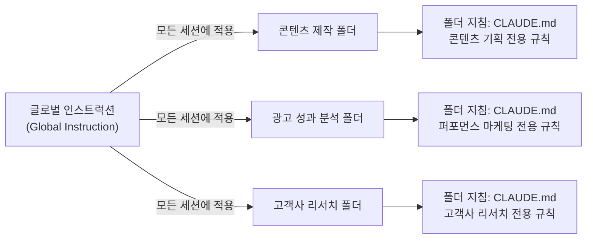
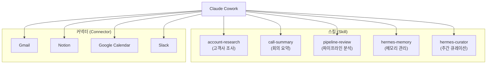
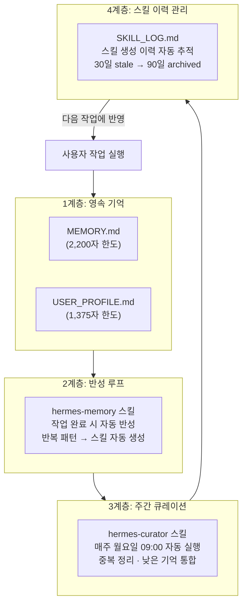
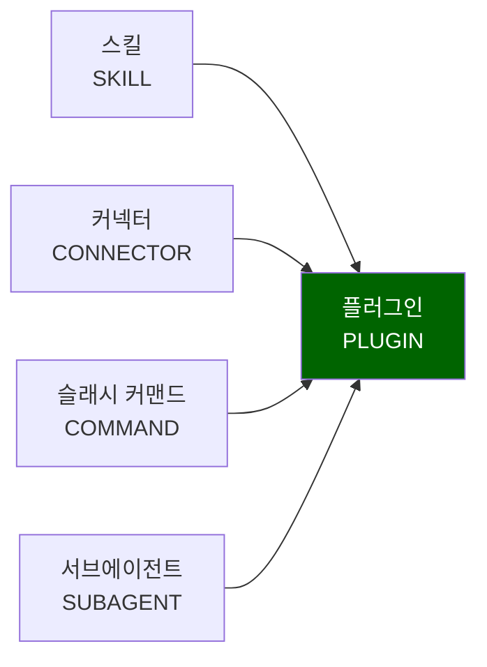
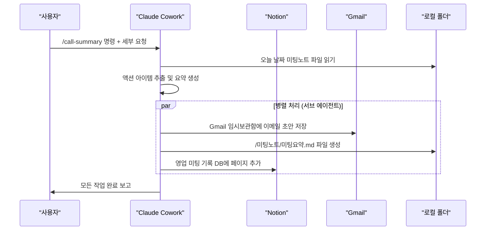
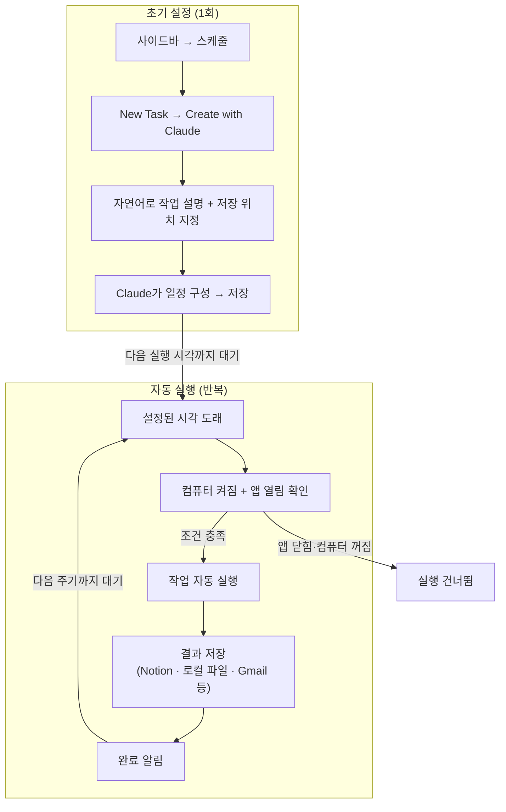
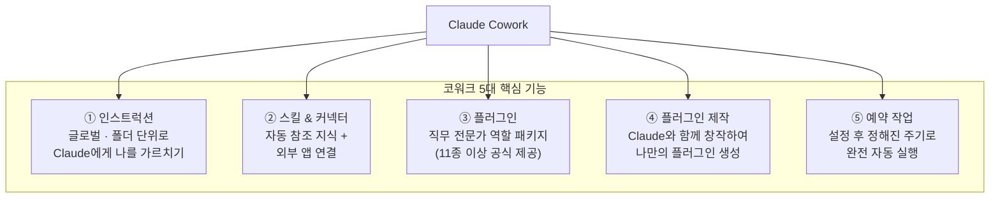

> **영상 출처**: [진한별의 AI 연구소] ["(26년 6월 최신 업데이트) 클로드 코워크(Claude Cowork) 활용법 ㅣ 핵심 기능 5가지 실습"](https://www.youtube.com/watch?v=W56emdXCRMA)  
> **발행일**: 2026년 6월 22일  
> **문서 작성일**: 2026-06-24

---

## 목차

1. [개요: 이 영상이 다루는 것](#1-개요)
2. [Claude Cowork란 무엇인가](#2-claude-cowork란-무엇인가)
3. [세 가지 모드 비교: 채팅 · 코워크 · 코드](#3-세-가지-모드-비교)
4. [설치 및 초기 설정](#4-설치-및-초기-설정)
5. [인스트럭션(Instruction): Claude에게 나를 가르치는 법](#5-인스트럭션)
6. [스킬과 커넥터: 코워크의 두 기둥](#6-스킬과-커넥터)
7. [Hermes Agent 연계: 성장하는 AI 만들기](#7-hermes-agent-연계)
8. [플러그인(Plugin): 전문가 역할을 한 번에 입히기](#8-플러그인)
9. [Sales 플러그인 실습 3종](#9-sales-플러그인-실습-3종)
10. [플러그인 직접 제작](#10-플러그인-직접-제작)
11. [예약 작업(Scheduled Tasks): 자동으로 일하게 만들기](#11-예약-작업)
12. [주의사항 및 팁 정리](#12-주의사항-및-팁-정리)
13. [요약 및 결론](#13-요약-및-결론)

---

## 1. 개요

이 영상은 Anthropic이 만든 Claude 데스크톱 앱의 핵심 기능인 **Claude Cowork(코워크)** 를 실습 위주로 설명하는 튜토리얼이다. 진행자인 진한별 연구소장은 "AI에게 채팅으로 질문만 하는 것은 AI 능력의 10%도 활용하지 못하는 것"이라고 단언하며, 폴더 안의 문서를 읽고 실제 업무를 자율적으로 처리하는 에이전트 방식의 활용법을 소개한다.

영상은 2026년 6월 22일에 공개됐으며, "촬영 10분 전까지 최신 버전으로 준비했다"는 표현처럼 당시 기준의 최신 기능을 모두 담고 있다. 다루는 주요 내용은 인스트럭션 설정, 스킬·커넥터 개념, Hermes Agent와의 연계, 플러그인 활용 및 제작, 그리고 예약 작업 기능이다.

---

## 2. Claude Cowork란 무엇인가

### 탄생 배경

Claude Cowork는 Anthropic이 **2026년 1월 12일**에 출시한 AI 에이전트 기능이다. 당초 개발자를 위해 만들어진 터미널 기반 도구인 **Claude Code**를 비개발자도 클릭만으로 사용할 수 있도록 GUI 형태로 재설계한 것이다. 출시 직후에는 Max 플랜 사용자에게만 제공됐으나, 2026년 1월 16일부터 **Pro 플랜(월 $20)** 구독자에게도 전면 개방됐다. 초기에는 macOS만 지원했으나 2026년 2월 10일부터 Windows 버전도 공식 출시됐다.

Cowork 플러그인이 공개된 직후 미국의 소프트웨어·금융·법률 서비스 관련 주식들이 폭락하며 약 2,850억 달러(약 413조 원)의 시가총액이 순식간에 증발했다. 이 현상은 "사스포칼립스(SaaSpocalypse)"라고까지 불릴 정도였는데, 기존 SaaS 도구를 대체할 수 있는 전문 플러그인이 오픈소스로 무료 공개됐기 때문이다.

### 핵심 철학

Anthropic 공식 소개에 따르면 코워크의 본질은 이렇게 요약된다.

> "Claude Code가 개발자의 일하는 방식을 바꿨다면, 코워크는 그 실행력을 모든 사람에게."

즉 코워크는 **텍스트 출력 기계가 아니라 실제로 일을 하는 에이전트**다. 사용자가 목표만 말하면 코워크는 스스로 계획을 수립하고, 단계별로 실행하며, 결과 파일을 로컬 폴더에 저장까지 완료한다.

### 일반 채팅과의 결정적 차이

일반 Claude 채팅은 사용자가 질문을 던지면 텍스트 답변을 주고 끝난다. 파일을 올릴 수 있지만 최대 20개가 한계이고, 결과물은 화면 안에만 존재한다. 코워크는 이 한계를 세 가지 면에서 완전히 극복한다.

첫째, **무제한 파일 접근**이다. 폴더 하나를 지정하면 그 안의 모든 파일을 읽고 쓸 수 있다. 수십, 수백 개의 문서도 일괄 처리한다.

둘째, **다단계 계획 및 실행**이다. 코워크는 업무를 받으면 오른쪽 진행 상황 패널에 스스로 계획을 수립하고, 각 단계가 완료되면 체크 표시와 함께 다음 단계로 이어간다.

셋째, **실제 파일로 저장**이다. 리포트를 작성하면 로컬 폴더에 .docx나 .pdf로 저장하고, Gmail 초안을 만들면 실제 Gmail 임시보관함에 저장하며, Notion에 내용을 추가하면 실제 Notion 데이터베이스에 페이지가 생성된다.

---

## 3. 세 가지 모드 비교

Claude Desktop 앱에는 사이드바에 채팅, 코워크, 코드 세 가지 모드가 나란히 존재한다. 각 모드의 성격 차이를 명확히 이해해야 어떤 상황에서 무엇을 써야 할지 판단할 수 있다.

```mermaid
graph TD
    A["Claude Desktop 앱"] --> B["채팅 (Chat)"]
    A --> C["코워크 (Cowork)"]
    A --> D["코드 (Code)"]

    B --> B1["대상: 누구나"]
    B --> B2["용도: 질문·요약·대화"]
    B --> B3["작업 방식: 하나씩 직접 지시"]
    B --> B4["파일 접근: 최대 20개 업로드"]
    B --> B5["결과물: 채팅창 텍스트"]

    C --> C1["대상: 누구나 (비개발자)"]
    C --> C2["용도: 실무 작업 통째로 위임"]
    C --> C3["작업 방식: 목표만 주면 계획·실행"]
    C --> C4["파일 접근: 로컬 폴더 전체"]
    C --> C5["결과물: 실제 파일로 폴더에 저장"]

    D --> D1["대상: 개발자"]
    D --> D2["용도: 코딩·개발 자동화"]
    D --> D3["작업 방식: 터미널에서 자율 실행"]
    D --> D4["파일 접근: 코드베이스 전체"]
    D --> D5["결과물: 코드·파일 변경"]

    style C fill:#8B0000,color:#fff
    style C1 fill:#8B0000,color:#fff
    style C2 fill:#8B0000,color:#fff
    style C3 fill:#8B0000,color:#fff
    style C4 fill:#8B0000,color:#fff
    style C5 fill:#8B0000,color:#fff
```



위 구조에서 코워크가 가운데 위치하는 이유는 명확하다. 채팅의 접근성(누구나 사용 가능)과 코드의 실행력(실제 파일 처리)을 동시에 가진 것이 코워크이기 때문이다. 코딩 지식이 전혀 없는 마케터, 영업 담당자, 기획자 등 지식 노동자 모두가 타깃이다.

---

## 4. 설치 및 초기 설정

### 시스템 요구사항

코워크를 사용하려면 다음 조건이 필요하다.

- **Claude 유료 플랜**: Pro($20/월) 이상. 무료 플랜에서는 사용 불가.
- **Claude Desktop 앱**: 웹 브라우저 버전이 아닌 데스크톱 앱에서만 동작.
- **운영체제**: macOS(초기 출시부터 지원) 또는 Windows x64(2026년 2월 10일부터 공식 지원).
- **Windows 추가 조건**: Cowork는 가상 머신(VM) 환경에서 격리 실행되므로 Windows에서는 Hyper-V를 활성화해야 한다. BIOS 설정에서 가상화(SVM 모드)를 Enabled로 변경하는 과정이 필요할 수 있다.

### 설치 절차

구글 검색창에 "Claude Desktop"을 검색하거나 `https://claude.ai/download`에 접속해 자신의 운영체제에 맞는 파일을 내려받아 설치한다. 이미 설치되어 있다면 최신 버전으로 업데이트해야 Cowork 탭이 활성화된다.

앱을 실행하면 왼쪽 사이드바에 Chat, Cowork, Code 세 탭이 보인다. Cowork 탭을 클릭하면 작업 화면으로 진입한다. 처음 사용 시에는 작업할 **로컬 폴더를 지정**해야 하며, 파일 접근 권한 허용 창이 나타나면 "허용"을 눌러 진행한다.

### 보안 모델

Cowork는 사용자가 지정한 폴더에만 접근하며, 파일을 삭제하거나 수정할 때는 반드시 사용자 승인을 요청한다. 허락 없이는 어떤 파일도 변경하지 않는다. 작업 삭제 시에는 작업 목록에서 "⋮" 버튼을 클릭해 즉시 제거할 수 있으며, Anthropic의 데이터 보관 기간에 따라 30일 이내에 백엔드 저장소에서도 삭제된다.

---

## 5. 인스트럭션

### 개념: Claude에게 나를 한 번만 가르치기

인스트럭션이란 "내가 어떤 사람인지, 이 코워크 환경에서 어떤 업무를 하고 싶은지"를 미리 기록해두는 기능이다. 신입사원을 처음 채용했을 때 온보딩 자료를 건네는 것처럼, Claude에게 한 번 설명해두면 매번 새로 설명하지 않아도 된다.

인스트럭션은 **글로벌 인스트럭션**과 **폴더 인스트럭션** 두 가지로 구분된다.

### 글로벌 인스트럭션

모든 코워크 세션에 항상 적용되는 공통 지침이다. 설정 경로는 앱 좌측 하단 프로필 → 설정 → 협업 → 번역 지침(편집)이다. 이곳에 작성한 내용은 어떤 폴더에서 어떤 작업을 하든 항상 Claude가 따르는 기본값이 된다.

예를 들어 마케터라면 글로벌 인스트럭션에 다음과 같은 내용을 담는다.

- 나는 AI 업무 자동화 SaaS 회사의 CEO다.
- 우리 회사 서비스는 기업 대상 AI 업무 자동화 SaaS(B2B)다.
- 주요 기능은 Notion, Slack, Google Workspace 연동, 리포트 자동화, 업무 프로세스 자동화다.
- 답변은 항상 한국어로, 전문적이되 쉽게 설명하라.

한 번 저장하면 이후 모든 코워크 세션에서 Claude는 이 지침을 염두에 두고 업무를 처리한다.

### 폴더 인스트럭션

특정 폴더(프로젝트)에만 적용되는 개별 지침이다. 코워크 채팅창 우측에 있는 **CLAUDE.md** 파일을 선택하면 현재 연결된 폴더에만 유효한 지침을 작성할 수 있다. Claude는 이 CLAUDE.md 파일을 자동으로 참조해서 해당 폴더의 업무를 진행한다.

마케터 예시로 돌아가면, 글로벌 인스트럭션에 공통 내용을 적고, 콘텐츠 제작 폴더에는 "이 폴더는 SNS 콘텐츠 기획용 폴더입니다. 타깃은 20-30대 직장인이고, 톤앤매너는 친근하고 실용적으로 유지하세요"와 같은 특별 지침을 담는다. 광고 성과 분석 폴더에는 또 다른 전문 지침을 담는다. 이렇게 비즈니스와 개인 컨텍스트를 폴더 단위로 깔끔하게 분리할 수 있다.



---

## 6. 스킬과 커넥터

### 스킬(Skill)

스킬은 "코워크가 관련 작업을 할 때 자동으로 참고하는 지식 및 방법"이다. 신입사원에게 읽히는 온보딩 문서에 비유할 수 있다. Claude에게 매번 같은 내용을 반복 설명할 필요 없이, 스킬 파일에 한 번 정리해두면 관련 작업을 수행할 때 자동으로 그 내용을 참조한다.

스킬은 여러 방법으로 만들 수 있다.

- 작업을 끝낸 후 코워크가 그 과정을 정리해 자동으로 생성하기도 한다.
- "이 설명을 스킬로 만들어 줘"라고 직접 요청해 생성할 수 있다.
- 다른 사람이 만든 스킬을 가져와 설치하는 것도 가능하다.
- 스킬은 사용 후 SKILL_LOG.md에 이력이 자동 기록되어 관리된다.

스킬은 슬래시 커맨드(예: `/account-research`, `/call-summary`)를 통해 활성화한다. 슬래시를 입력하면 현재 설치된 스킬 목록이 드롭다운으로 표시되고, 원하는 스킬을 선택한 뒤 세부 요청을 입력하면 된다.

### 커넥터(Connector)

커넥터는 "코워크를 외부 서비스와 연결하는 통로"다. 구글 캘린더, Gmail, Notion, Slack 등 외부 앱과 코워크를 연결해주는 다리 역할을 한다. 커넥터는 앱 사이드바 → 커스터마이즈 → 커넥터 메뉴에서 추가하고 관리한다.

영상에서 진행자는 Slack, Notion, Google Calendar, Gmail 네 가지를 연결해 사용하고 있다. 커넥터가 연결되어 있으면, 예를 들어 "회의 요약을 Notion 데이터베이스에 저장하고 이메일 초안을 Gmail 임시보관함에 저장해"라는 하나의 명령으로 여러 서비스에 동시에 작업을 처리할 수 있다.



---

## 7. Hermes Agent 연계

### Hermes Agent란?

영상의 흥미로운 섹션 중 하나가 바로 Hermes Agent와의 연계다. Hermes Agent는 Nous Research가 개발해 **2026년 2월에 오픈소스로 공개한 자율 AI 에이전트**이며, 슬로건은 "The agent that grows with you(당신과 함께 성장하는 에이전트)"이다. GitHub에 공개된 이후 두 달 만에 61,000개 이상의 스타를 기록하며 2026년 가장 주목받는 AI 에이전트 프레임워크가 됐다.

Hermes Agent의 핵심은 **폐쇄형 학습 루프(Closed-Loop Learning)** 다. 일반 AI가 세션이 끝나면 모든 것을 잊어버리는 것과 달리, Hermes는 작업을 수행한 후 그 경험을 재사용 가능한 스킬로 문서화하고, 결과를 영구 메모리(persistent memory)에 저장하며, 다음 번에는 이전 경험을 바탕으로 더 나은 접근 방식을 취한다. 시간이 지날수록 실제로 성능이 향상되는 구조다.

### Cowork에 Hermes 철학 적용하기

영상에서 진행자는 Hermes Agent의 GitHub 주소를 코워크에 제공하면서 "Cowork 환경을 Hermes Agent처럼 동작하게 설정하려고 한다. GitHub의 폐쇄형 학습 루프를 상세히 읽고 코워크의 동작 방식을 성장하는 에이전트 형태로 만들어달라"고 요청한다.

코워크는 이 요청을 받아 Hermes의 구조를 분석한 뒤 스스로 계획을 세우고 다음과 같은 **4계층 학습 루프**를 구현해준다.

**1계층: 영속 기억(Semantic Memory)**
MEMORY.md와 USER_PROFILE.md 두 파일을 생성한다. Hermes와 동일한 문자 한도(약 2,200자 / 1,375자)를 적용해, 대화 중 중요한 정보가 나올 때마다 이 두 파일에 자동으로 저장한다. 세션이 끊겨도 기억이 유지된다.

**2계층: hermes-memory 스킬**
복잡한 작업이 끝날 때마다 "기억할 게 있었나?"를 자동으로 점검한다. 반복 패턴이 발견되면 스킬로 생성까지 해준다.

**3계층: hermes-curator 스킬 + 주간 스케줄**
매주 월요일 오전 9시에 자동으로 실행되는 큐레이터 작업이다. 중복 항목 통합, 낮은 기억 항목 정리, 미사용 스킬 아카이브 등을 처리한다. 30일/90일 기준으로 stale → archived 상태로 전환한다.

**4계층: SKILL_LOG.md 자동 추적**
자동 생성된 스킬 이력을 추적한다. Hermes Curator처럼 30일/90일 기준으로 오래된 스킬을 자동 정리한다.

이 구조를 통해 코워크는 사용할수록 사용자에 대한 정보를 쌓아가고, 매주 메모리가 업데이트되면서 점점 더 개인화된 AI 팀원으로 진화한다.



### Hermes와 코워크의 차이점

Hermes는 독립 CLI 에이전트로 모든 기능이 내부에 있지만, 코워크는 Claude API와 파일 시스템 기반으로 구현된다. 몇 가지 차이가 있다.

- **session_search 없음**: 코워크는 대화 기록이 세션별로 격리되므로 Hermes의 FTS5 전문 검색 대신 Notion 연동과 로컬 파일로 보완한다.
- **Honcho 없음**: 고급 사용자 모델링 대신 USER_PROFILE.md로 단순화해 적용한다.
- **메모리 nudge**: Hermes는 자동 트리거지만 코워크는 스킬 기반으로 반응한다.

---

## 8. 플러그인

### 플러그인이란?

플러그인은 스킬, 커넥터, 슬래시 커맨드, 서브 에이전트 네 가지 구성 요소를 하나의 패키지로 묶은 통합 기능이다. 설치 한 번으로 관련 스킬과 커넥터가 한꺼번에 설치된다. "Claude에게 특정 직무의 전문가 역할을 입히는 것"이라고 이해하면 쉽다.

여기서 **서브 에이전트(Sub-agent)** 는 복잡한 업무를 받았을 때 병렬로 작업을 나누어 동시에 처리하는 기능이다. 예를 들어 "Notion 페이지 생성과 Word 문서 작성을 병렬로 진행하겠습니다"라는 메시지가 나타나면 두 작업이 동시에 진행 중이라는 뜻이다.



### Anthropic 공식 플러그인

초기 출시(2026년 1월 30일)에는 11종의 공식 플러그인이 제공됐다. 이후 업데이트를 통해 재무 분석, 투자은행, 주식 리서치, 프라이빗 에쿼티, 자산 관리 등 분야가 더 추가됐다. 모든 플러그인은 오픈소스로 GitHub(`anthropics/knowledge-work-plugins`)에 공개되어 있어 무료로 사용하고 커스터마이징할 수 있다.

초기 11종 플러그인 목록은 다음과 같다.

| 분야 | 플러그인 | 분야 | 플러그인 |
|------|----------|------|----------|
| 영업 | Sales | 마케팅 | Marketing |
| 프로덕트 | Product | 파이낸스 | Finance |
| 법무 | Legal | 인사 | HR |
| 엔지니어링 | Engineering | 디자인 | Design |
| 데이터 | Data | 리서치 | Research |
| 운영 | Operations | — | — |

### 플러그인 설치 방법

코워크 채팅창에서 플러스(+) 버튼을 누르고 플러그인을 선택한다. 플러그인 관리 화면에서 현재 설치된 플러그인을 확인할 수 있고, 플러스 버튼 → 플러그인 탐색을 통해 사용 가능한 모든 플러그인 목록을 볼 수 있다. 원하는 플러그인의 플러스 버튼을 누르면 설치 완료 알림이 나타난다.

---

## 9. Sales 플러그인 실습 3종

영상에서 가장 많은 분량을 차지하는 실습 부분이다. Sales 플러그인을 설치하면 영업 업무와 관련된 여러 스킬과 함께 Slack, Notion, Google Calendar, Gmail 커넥터가 한꺼번에 연결된다.

### 실습 1: /account-research — 고객사 자동 조사

**목적**: 영업 자료 폴더에 있는 회사 목록 파일을 읽어, 각 회사를 웹 검색으로 조사하고 구조화된 리포트로 저장한다.

입력 예시는 다음과 같다.

```
/account-research
/영업자료/신규고객 폴더에 있는 회사 목록 파일 읽어서, 각 회사를 웹 검색으로 조사하고,
회사 개요 / 최근 이슈 / 우리 서비스와의 연관성 항목으로 정리해서
고객사_리서치_리포트.docx로 저장해줘
```

실행 방식에는 두 가지 옵션이 있다. **실행 전 확인**을 선택하면 파일을 생성하거나 변경할 때마다 Claude가 사용자에게 승인을 요청한다. **묻지 않고 실행**을 선택하면 자동으로 진행된다. 새 문서를 생성하는 경우에는 묻지 않고 실행을 선택해도 무방하지만, 기존 문서를 변경해야 하는 경우에는 반드시 실행 전 확인을 선택하는 것이 안전하다.

실행 결과로 코워크는 열 개 회사에 대한 정보를 웹에서 검색하고, 각 회사별로 개요·이슈·연관성을 정리한 .docx 리포트를 지정된 폴더에 실제로 생성해준다. 일반 채팅이라면 텍스트로만 출력하고 끝났을 내용이, 코워크에서는 실제 파일로 저장된다는 것이 핵심 차이다.

### 실습 2: /call-summary — 회의 노트 자동 처리

**목적**: 미팅 노트 파일을 읽어 액션 아이템을 추출하고, Gmail 초안 작성, 로컬 파일 저장, Notion 데이터베이스 추가를 동시에 처리한다.

입력 예시는 다음과 같다.

```
/call-summary
미팅노트 폴더에서 오늘 날짜 파일 찾아서 액션 아이템 뽑고,
고객 팔로업 이메일 초안은 Gmail Draft 임시 문서함에 저장해줘.
내부 공유용 요약은 /미팅노트/미팅요약으로 저장하고,
Notion 영업 미팅 기록 데이터베이스에도 페이지로 추가해줘.
```

한 번의 명령으로 세 가지 작업이 동시에 처리된다. 먼저 미팅 요약 문서가 지정된 로컬 경로에 .md 파일로 저장된다. 동시에 실제 Gmail 임시보관함에 고객 팔로업 이메일 초안이 작성돼 저장된다. 마지막으로 Notion의 영업 미팅 기록 데이터베이스에 오늘 미팅 내용이 새 페이지로 추가된다. 이처럼 병렬 처리가 가능한 것이 서브 에이전트 기능 덕분이다.

### 실습 3: /pipeline-review — 영업 파이프라인 PDF 분석

**목적**: Notion의 영업 파이프라인 데이터베이스에서 이번 달 딜 현황을 가져와 분석하고 PDF 리포트로 저장한다.

입력 예시는 다음과 같다.

```
/pipeline-review
Notion의 영업 파이프라인 데이터베이스에서 이번 달 딜 현황 가져와서,
마감일 지난 건과 2주 이상 업데이트 없는 건 따로 분류하고,
이번 주에 집중할 Top 5를 추천해서,
주간_파이프라인_리뷰.pdf 파일로 저장해줘.
```

코워크는 Notion에서 실시간으로 데이터를 끌어온 뒤 분석을 수행하고, 지정된 폴더에 "주간_파이프라인_리뷰.pdf"라는 이름의 파일을 실제로 생성한다. 기존 Notion 페이지의 내용을 그대로 PDF로 정리해주는 것이 아니라, 마감일 초과 건·업데이트 없는 건을 분류하고 우선순위 Top 5까지 추천하는 분석 작업까지 포함된 리포트가 만들어진다.



---

## 10. 플러그인 직접 제작

공식 플러그인 목록을 살펴봐도 자신의 업무에 딱 맞는 것이 없을 수 있다. 그럴 때는 직접 만들면 된다.

### 제작 방법

앱 사이드바에서 커스터마이즈로 이동해 플러그인 항목의 플러스(+) 버튼을 누른다. 플러그인 생성 → 클로드와 함께 창작하기를 선택하면 Claude가 "어떤 플러그인을 만들고 싶은지"를 물어본다. 원하는 내용을 자연어로 설명하면 Claude가 알아서 스킬 구성, 슬래시 커맨드, 커넥터 설정까지 자동으로 만들어준다.

### 실습: 먹방 크리에이터 유튜브 플러그인

영상에서 진행자는 "먹방 크리에이터를 위한 유튜브 콘텐츠 제작 플러그인"을 예시로 제작한다. 요청 내용을 입력하자 Claude는 두 개의 스킬을 포함한 플러그인을 자동으로 완성했다.

- **먹방 기획 스킬**: 먹방 콘텐츠를 기획하는 스킬
- **유튜브 메타데이터 스킬**: 유튜브 제목과 설명을 생성하는 스킬

플러그인 저장 후 바로 `/먹방플래닝` 스킬을 사용해 "마라탕 먹방"을 예시로 기획안, 썸네일 카피를 생성하고 Google Drive 루트 폴더에 저장까지 완료했다. 채팅창에서 확인한 내용이 실제로 Google Drive에 파일로 저장되는 것이 코워크의 핵심이다.

---

## 11. 예약 작업

### 개념

예약 작업(Scheduled Tasks)은 한 번 설정해두면 **정해진 주기로 자동 반복 실행**되는 기능이다. 지금까지 살펴본 기능들은 모두 사용자가 직접 명령해야 실행됐지만, 예약 작업은 설정 이후 사람의 개입 없이 스스로 작동한다.

예를 들어 다음과 같은 자동화가 가능하다.

- 매일 오전 9시, 가장 화제성 높은 AI 뉴스를 찾아 분석하고 인스타그램 릴스 주제 다섯 가지를 추천한 뒤 Notion에 저장
- 매주 월요일 오전 9시, 헤르메스 스타일 메모리 스킬 자동 큐레이팅
- 매주 금요일, 주간 성과 데이터를 수집해 팀 발표 자료 자동 생성
- 매주 특정 요일, 스프레드시트 데이터 갱신

### 설정 방법

앱 왼쪽 사이드바의 **스케줄(Scheduled)** 메뉴로 이동한다. New Task 버튼을 클릭하고 "Create with Claude"를 선택하면 Claude가 어떤 예약 작업을 만들고 싶은지 물어본다. 원하는 내용을 자연어로 설명하면 되고, 결과를 저장할 위치(Notion, 로컬 폴더 등)도 함께 명시한다. Claude가 자동으로 일정을 구성하고, 확인 후 저장하면 예약 작업이 등록된다.

### 주의사항

예약 작업에는 두 가지 반드시 지켜야 할 조건이 있다.

**첫 번째 조건**: 컴퓨터가 켜져 있고 Claude Desktop 앱이 열려 있어야 실행된다. 컴퓨터를 끄거나 앱을 종료하면 예약 작업은 실행되지 않는다. 따라서 잠자기 방지 모드를 설정해두는 것이 좋다.

**두 번째 조건**: 첫 실행 후에 프롬프트를 더 상세하게 다듬어야 정확도가 높아진다. 처음에는 약간 거칠게 실행될 수 있지만, 첫 실행 결과를 보고 나서 지시사항을 보완하면 이후 실행부터는 훨씬 정확해진다.

실제 실습에서 진행자가 예약 작업을 처음 실행해보자 Notion에 접근 권한을 요청하는 창이 나타났고, 허용하자 실시간으로 AI 뉴스를 검색하고 릴스 주제를 분석한 결과가 Notion 데이터베이스에 자동으로 저장됐다.



---

## 12. 주의사항 및 팁 정리

### 파일 수정 모드 선택

코워크가 작업을 실행할 때 두 가지 실행 모드를 선택하게 된다.

- **실행 전 확인**: 파일을 변경하기 전에 항상 승인을 요청한다. 기존 파일을 수정하는 경우 반드시 이 모드를 사용해야 한다. 한번 삭제되거나 덮어쓰인 파일은 복구가 어렵다.
- **묻지 않고 실행**: 승인 없이 즉시 처리한다. 새 파일을 생성하는 경우에는 사용해도 무방하다.

### 사용량 관리

코워크는 일반 채팅보다 훨씬 많은 사용량을 소비한다. Anthropic 지원 문서에 따르면 단순한 질문·답변에는 일반 채팅을 활용하고, 파일 접근이 필요한 복잡한 다단계 작업에 한해 코워크를 사용하는 것이 권장된다.

### VM 환경과 격리 실행

코워크는 가상 머신(VM) 환경 안에서 격리 실행된다. 이 때문에 파일은 항상 로컬에 머물며 외부로 유출되지 않는다. Windows 환경에서 "VM 서비스가 실행 중이 아닙니다"라는 오류가 발생하면 저장소 경로 설정(C:\ 기준)을 확인하고 앱을 재설치해야 한다.

### 네트워크 송신 권한

코워크는 현재 네트워크 송신 권한을 준수한다. 웹 검색이나 웹 가져오기 도구는 서버 측에서 실행되므로 별도 규칙이 적용된다. Team 또는 Enterprise 요금제를 사용하는 조직은 조직 설정에서 코워크의 웹 검색을 비활성화할 수 있다.

---

## 13. 요약 및 결론

Claude Cowork는 단순히 "AI에게 채팅으로 질문하는 것"을 넘어, **AI가 실제로 일하도록 만드는 환경**이다. 영상에서 소개된 다섯 가지 핵심 기능을 정리하면 다음과 같다.



코워크의 진정한 가치는 **반복적인 업무의 자동화**에 있다. 매일 뉴스를 분석해 콘텐츠 아이디어를 정리하고, 미팅이 끝나면 자동으로 요약하고 이메일 초안까지 작성하며, 영업 파이프라인을 주기적으로 분석해 리포트를 만드는 일련의 과정이 모두 자동화된다.

Hermes Agent의 폐쇄형 학습 루프를 접목하면 코워크는 사용할수록 사용자를 더 잘 이해하는 개인화된 에이전트로 발전한다. 플러그인 제작 기능은 공식 목록에 없는 업무도 직접 자동화할 수 있게 해주고, 예약 작업은 사람이 반복해서 실행하던 루틴을 완전히 제거해준다.

"업무 효율 열 배"라는 표현이 과장처럼 들릴 수 있지만, 실제로 고객사 리서치, 회의 요약, 영업 파이프라인 분석 같은 작업이 수십 분에서 수 분으로 단축되는 것은 충분히 검증된 사례다.

---

## 참고 자료

- Anthropic 공식 지원 센터: [Claude Cowork 시작하기](https://support.claude.com/ko/articles/13345190-claude-cowork-%EC%8B%9C%EC%9E%91%ED%95%98%EA%B8%B0)
- Anthropic 공식 플러그인 저장소: [anthropics/knowledge-work-plugins](https://github.com/anthropics/knowledge-work-plugins)
- Hermes Agent 공식 사이트: [hermes-agent.org](https://hermes-agent.org/ko/)
- Hermes Agent GitHub: [NousResearch/hermes-agent](https://github.com/NousResearch/hermes-agent)
- Claude Cowork 업데이트 타임라인: [CoworkerAI.io](https://coworkerai.io/ko/changelog)
- 진한별의 AI 연구소 YouTube: [원본 영상](https://www.youtube.com/watch?v=W56emdXCRMA)

---

作成日字: 2026-06-24
