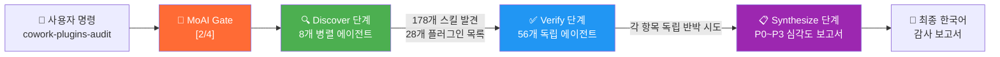
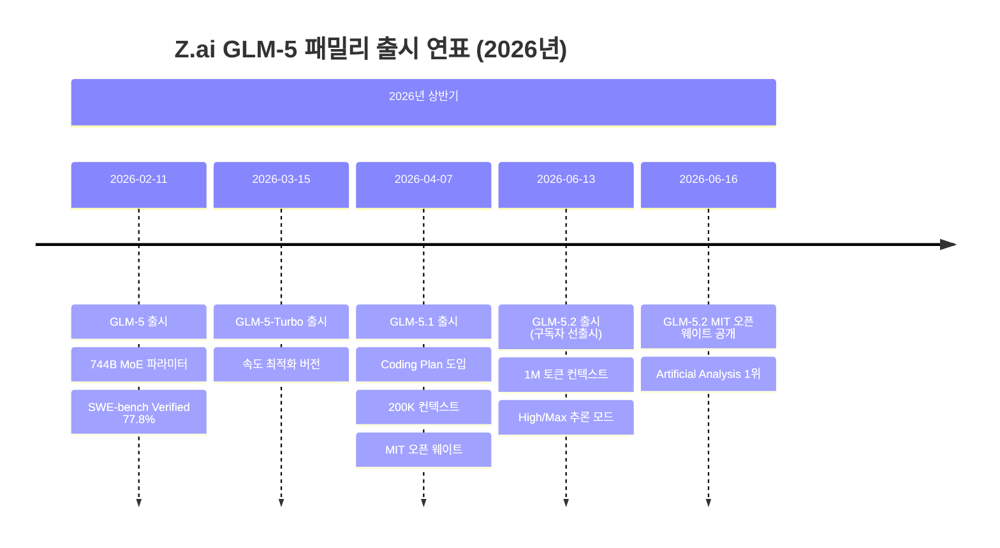
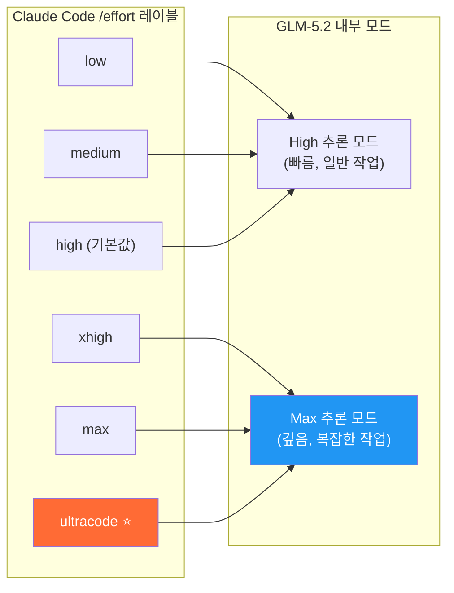
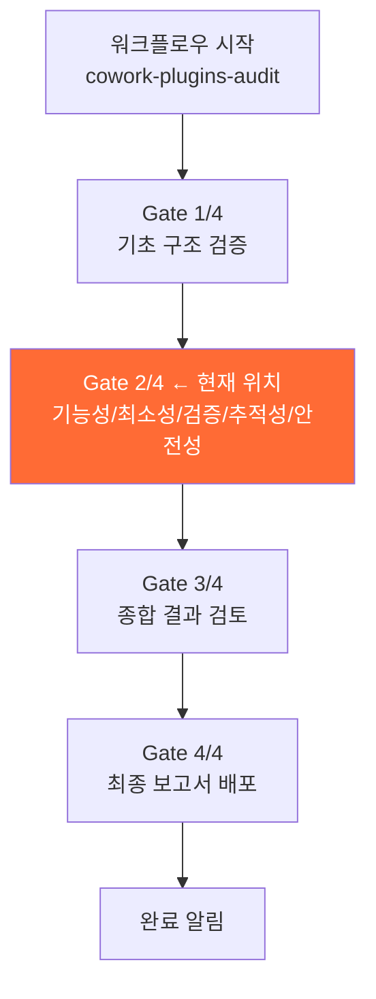
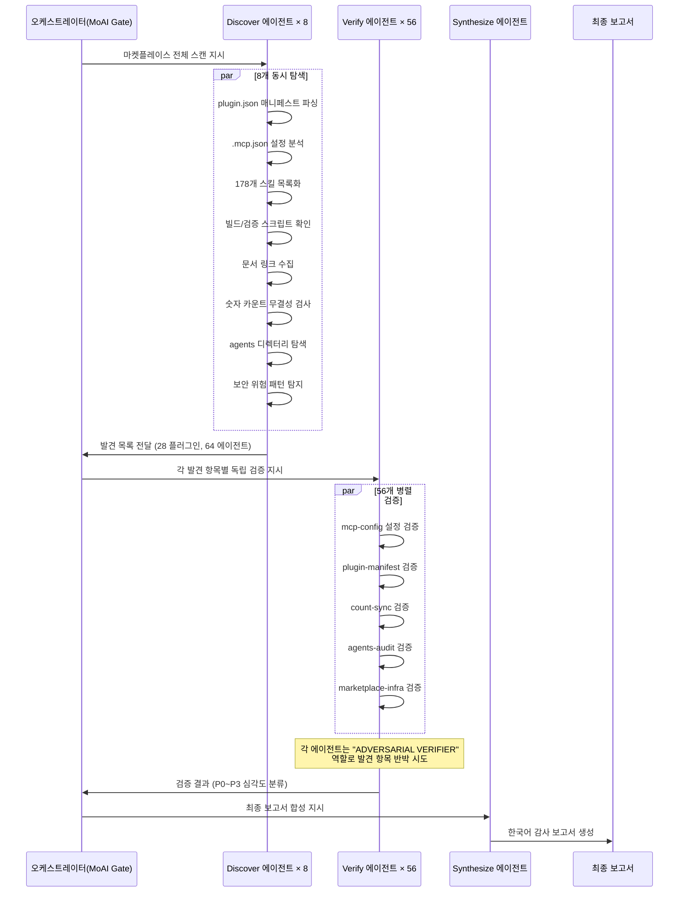
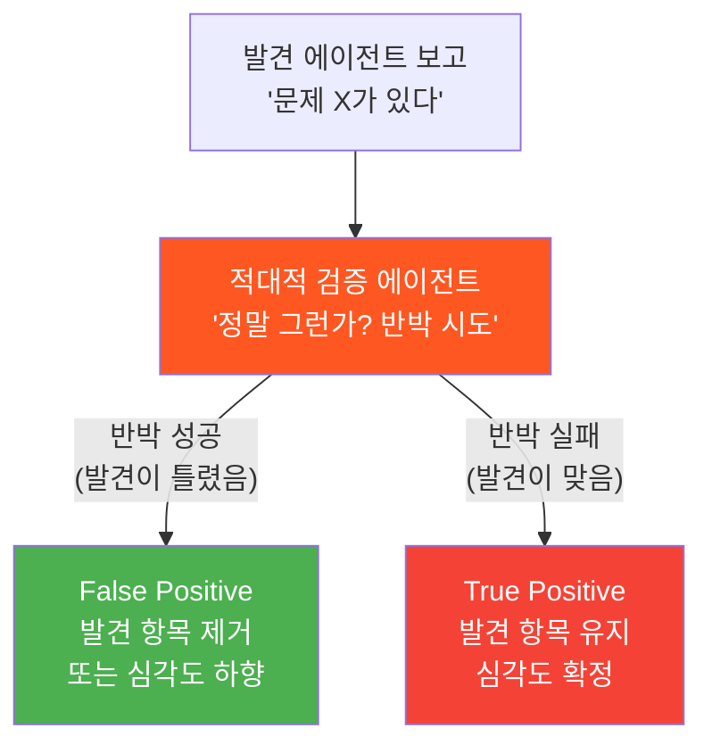
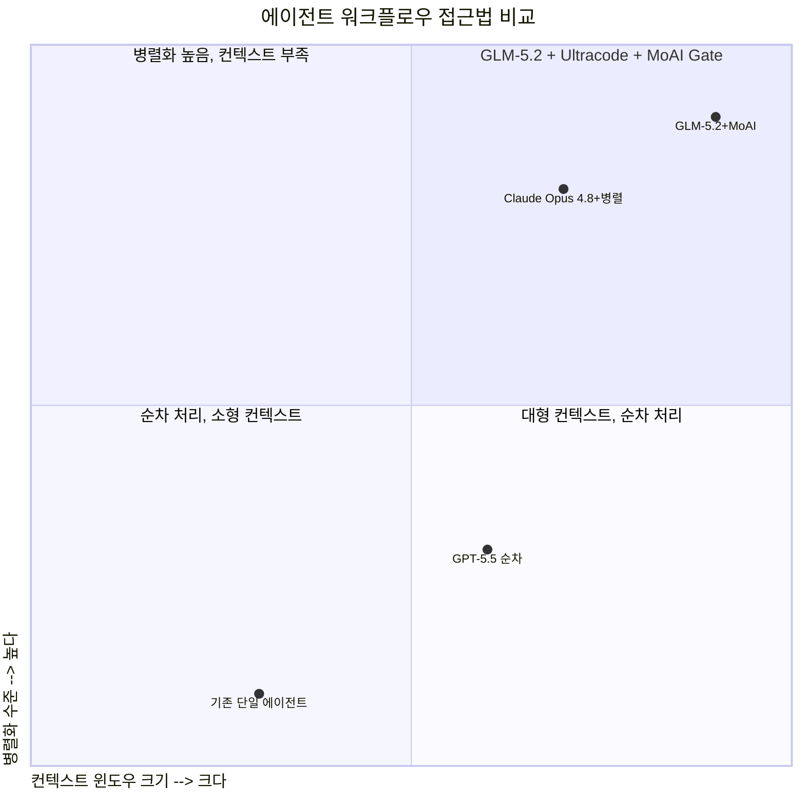

> 작성 기준: 2026년 6월 24일 / 최신 공개 정보 기반

> 
> https://www.facebook.com/share/1EQf26RALU/
> 
> GLM 5.2 x Ultracode 조합은 천하무적 같다.
> 
> 토큰 다 씹어 먹으면서 빠짐없이 분석 후 병렬 동시 처리.
> 

---

## 목차

1. [한눈에 보기: 무슨 일이 벌어지고 있는가](#1-한눈에-보기)
2. [GLM-5.2란 무엇인가](#2-glm-52란-무엇인가)
3. [Ultracode란 무엇인가: 노력 수준(Effort Level)의 비밀](#3-ultracode란-무엇인가)
4. [MoAI Gate란 무엇인가](#4-moai-gate란-무엇인가)
5. [cowork-plugins-audit 워크플로우 3단계 해부](#5-cowork-plugins-audit-워크플로우-3단계-해부)
6. [적대적 검증(Adversarial Verifier) 패턴의 작동 원리](#6-적대적-검증-패턴의-작동-원리)
7. [cowork-plugins 마켓플레이스란](#7-cowork-plugins-마켓플레이스란)
8. [터미널 화면 상세 분석](#8-터미널-화면-상세-분석)
9. [GLM-5.2 + Ultracode 조합이 "천하무적"인 이유](#9-glm-52--ultracode-조합이-천하무적인-이유)
10. [실무 활용 가이드](#10-실무-활용-가이드)
11. [현재 시점의 한계와 주의사항](#11-현재-시점의-한계와-주의사항)
12. [용어 정리](#12-용어-정리)

---

## 1. 한눈에 보기


페이스북 포스팅 한 줄과 터미널 화면이 담고 있는 내용은 단순하지 않습니다. 이것은 중국 AI 회사 Z.ai가 2026년 6월 13일 출시한 최신 코딩 특화 모델 **GLM-5.2**를 Claude Code의 최고 노력 수준인 **Ultracode 모드**로 구동하면서, **MoAI Gate**라는 한국산 멀티에이전트 하네스 시스템이 **Claude Cowork 플러그인 마켓플레이스 전체를 자동 감사(Audit)** 하는 장면입니다.

핵심을 세 줄로 요약하면 이렇습니다.

- **어떤 모델이**: GLM-5.2 (1M 토큰 컨텍스트, Max 추론 모드)
- **어떤 도구로**: Claude Code + MoAI Gate 워크플로우 엔진
- **무엇을 했는가**: cowork-plugins 마켓플레이스의 28개 플러그인 / 64개 에이전트 전수 감사를 20분 16초 만에 완료, 56개 에이전트를 병렬로 동시 검증



---

## 2. GLM-5.2란 무엇인가

### 출생 배경

GLM-5.2는 중국 칭화대학교 스핀오프 AI 기업인 **Zhipu AI**가 국제 브랜드인 **Z.ai** 이름으로 2026년 6월 13일(토) 출시한 플래그십 코딩·에이전틱 AI 모델입니다. Z.ai는 같은 해 1월 8일 홍콩 증시(HKEX)에 상장하면서 약 HKD 43.5억(USD 5.58억)을 조달, 이 자금을 바탕으로 공격적인 모델 출시 일정을 유지하고 있습니다.

### GLM-5 패밀리 타임라인



약 4개월 만에 4개의 플래그십 버전을 연속 출시한 셈으로, 이는 오픈소스 중국 AI 생태계 전반의 빠른 반복 개발 흐름과 궤를 같이합니다.

### 핵심 스펙

| 항목 | 사양 |
|------|------|
| **파라미터** | 총 753B (MoE 구조, 토큰당 40B 활성) |
| **전문가(Expert) 수** | 384개 |
| **학습 토큰** | 28.5조 토큰 |
| **어텐션 기술** | DeepSeek Sparse Attention |
| **컨텍스트 윈도우** | 1,000,000 토큰 (glm-5.2[1m] 활성화 시) |
| **최대 출력** | 131,072 토큰 |
| **이전 세대 컨텍스트** | GLM-5.1은 200,000 토큰 → 5배 확장 |
| **라이선스** | MIT (오픈 웨이트) |
| **API 접근** | Anthropic 호환 엔드포인트 제공 |

### 왜 1M 토큰 컨텍스트가 중요한가

1,000,000 토큰은 약 75만 단어에 해당합니다. 코딩 작업에서 이것이 의미하는 바는 다음과 같습니다. 중간 규모 저장소(repository) 전체—소스 파일, 테스트 코드, 설정 파일, 문서, 그리고 대화 이력까지—를 단 한 번의 컨텍스트 창에 올려놓고 분석할 수 있게 됩니다. 이전 세대 모델들이 컨텍스트 한계에 부딪힐 때마다 강제로 대화 이력을 압축하거나 일부 정보를 버려야 했던 것과 달리, GLM-5.2는 그 압축 자체를 회피합니다.

실제로 Z.ai는 이 기능을 활성화하기 위해 Claude Code 설정에서 자동 압축 창 크기를 1,000,000으로 맞추도록 안내합니다. 또한 장시간 추론 작업(1M 토큰 컨텍스트 + Max 추론 모드)에서 첫 토큰이 반환되기까지 오랜 시간이 걸릴 수 있기 때문에, API 타임아웃을 3,000초(50분)로 늘려야 중간에 요청이 끊기지 않습니다.

### 벤치마크 위치

독립 벤치마크 기관인 Artificial Analysis의 Intelligence Index v4.1 기준으로 GLM-5.2는 **오픈 웨이트 모델 1위**에 올랐습니다. Code Arena WebDev 리더보드에서는 Claude Fable 5에 이어 **전체 2위**를 기록했는데, 이 점수는 비전(시각) 입력 없이도 프론트엔드 웹 개발 작업에서 이 수준을 달성했다는 점에서 주목받았습니다. SWE-bench Pro 점수는 62.1%, Terminal-Bench 2.1은 81.0%입니다.

---

## 3. Ultracode란 무엇인가

### 노력 수준(Effort Level) 시스템

GLM-5.2에는 두 가지 추론 노력 수준이 있습니다. 하나는 **High**이고 다른 하나는 **Max**입니다. 평범한 코드 완성이나 간단한 편집에는 High 수준으로도 충분하지만, 복잡한 다단계 추론이나 장기 에이전트 루프에는 Max 수준이 훨씬 더 안정적이고 깊은 결과를 냅니다.

Claude Code에는 `/effort` 명령어를 통해 이 수준을 제어하는 방식이 있습니다. 여기서 **Ultracode**가 등장합니다. Ultracode는 Claude Code의 `/effort` 설정 중 하나의 레이블로, GLM-5.2에서는 이것이 최고 수준인 **Max 추론 모드**와 정확히 매핑됩니다.



### 왜 Ultracode를 쓰는가

Ultracode(= Max 추론) 모드를 사용하면 모델이 답변을 생성하기 전에 더 많은 내부 추론 과정을 거칩니다. 이는 첫 토큰이 반환되기까지 지연 시간이 30~80% 늘어나는 단점이 있지만, 장거리 계획 수립(long-horizon planning), 다중 파일 리팩토링, 에이전틱 디버깅처럼 깊은 이해가 필요한 작업에서 출력 품질이 현저히 향상됩니다.

터미널 화면에서 `glm-5.2[1m]` 모델 식별자가 보이는 것은 1M 컨텍스트 모드가 활성화된 상태임을 나타냅니다. 그리고 이 워크플로우가 137,100 토큰을 소비하며 병렬로 56개 에이전트를 실행한 것 자체가 Max(Ultracode) 모드의 결과물입니다.

### Ultracode 모드 설정 방법 (Claude Code 기준)

```json
// settings.json (또는 환경변수)
{
  "ANTHROPIC_AUTH_TOKEN": "z.ai_api_key",
  "ANTHROPIC_BASE_URL": "https://api.z.ai/api/anthropic",
  "ANTHROPIC_DEFAULT_SONNET_MODEL": "glm-5.2[1m]",
  "CLAUDE_CODE_AUTO_COMPACT_WINDOW": "1000000",
  "API_TIMEOUT_MS": "3000000"
}
```

설정 후 Claude Code 세션에서 `/effort ultracode` (또는 `/effort max`)를 입력하면 GLM-5.2의 Max 추론 모드가 활성화됩니다.

---

## 4. MoAI Gate란 무엇인가

### MoAI-ADK의 정체

**MoAI**는 한국의 개발자 그룹 **modu-ai**가 만든 오픈소스 AI 에이전트 개발 키트입니다. 전체 이름은 **MoAI-ADK(Agentic Development Kit)** 로, Claude Code 위에서 작동하는 SPEC-First(명세 우선) 에이전트 오케스트레이션 시스템입니다. 24개의 특화 AI 에이전트와 52개의 스킬이 협업하여 TDD(테스트 주도 개발) 또는 DDD(데이터 주도 개발) 방식으로 코드를 생산합니다.

MoAI가 추구하는 핵심 철학은 **하네스 엔지니어링(Harness Engineering)** 패러다임입니다. "코드를 직접 작성하는 대신, AI 에이전트가 잘 작동할 수 있는 환경(하네스)을 설계한다"는 개념입니다. 사람은 방향을 정하고, 에이전트들이 실행합니다.

### MoAI Gate가 하는 일

**Gate**는 MoAI-ADK 내의 품질 관문(Quality Gate) 시스템입니다. 터미널 화면 상단에 `MoAI ★ Gate [2/4]`라고 표시된 것은 현재 4개의 Gate 중 2번째를 통과하는 중임을 나타냅니다. Gate는 특정 워크플로우가 완료되기 전에 반드시 통과해야 하는 검증 체크포인트로, 다음 항목을 점검합니다.

- **기능성(Functionality)**: 플러그인/에이전트가 선언된 기능을 실제로 수행하는가
- **최소성(Minimality)**: 불필요한 권한이나 의존성이 없는가
- **검증(Verification)**: 발견된 항목이 실제로 재현 가능한가
- **추적성(Traceability)**: 변경사항과 설정을 추적할 수 있는가
- **안전성(Safety)**: 보안상 위험 요소가 없는가



### 서버 정보

화면 하단에 `claude.mo.ai.kr / u  00:27  24- 6월-26`이라고 표시된 것은 이 Claude Code 세션이 `claude.mo.ai.kr` 서버에서 실행되고 있으며, 2026년 6월 24일 오전 0시 27분에 실행 중임을 나타냅니다. MoAI 프로젝트 운영 인프라 중 하나로 보입니다. Claude Code 버전은 `2.1.186`임을 확인할 수 있습니다.

---

## 5. cowork-plugins-audit 워크플로우 3단계 해부

이 워크플로우의 핵심은 **Discover → Verify → Synthesize** 3단계 구조입니다. 각 단계를 상세하게 살펴보겠습니다.



### 1단계: Discover (탐색)

터미널 화면에 따르면 Discover 단계는 **8개의 lens 병렬** 탐색 방식으로 작동합니다. 각 lens는 다른 각도에서 마켓플레이스를 분석합니다.

- **marketplace 인프라 검사**: 마켓플레이스 자체의 구조적 건전성
- **plugin.json 매니페스트 검사**: 각 플러그인 선언 파일의 유효성
- **178개 스킬 목록화**: 전체 스킬 카탈로그 수집
- **agents 디렉터리 탐색**: 에이전트 목록과 MCP 서버 구성 파악
- **.mcp.json 분석**: MCP(Model Context Protocol) 서버 설정 파일 검토
- **문서 링크 검사**: README 및 관련 문서의 링크 유효성
- **숫자 카운트 무결성**: README에 표기된 숫자가 실제 파일 수와 일치하는지
- **빌드/검증 스크립트**: 자동화 스크립트 존재 여부 확인

### 2단계: Verify (검증)

Verify 단계는 이번 워크플로우의 핵심입니다. 총 **56개의 독립 에이전트**가 각자의 영역에서 동시에 검증을 수행합니다. 터미널 왼쪽 패널을 보면 검증 항목들이 나열되어 있습니다.

**MCP 설정 검증 그룹:**
- `verify:mcp-config:context7-duplicate-across...` — context7 MCP 서버 중복 설정 여부
- `verify:mcp-config:elevenlabs...` — ElevenLabs 음성 합성 MCP 설정
- `verify:mcp-config:moai-ad...` — MoAI 광고 관련 MCP 설정
- `verify:mcp-config:korean-...` — 한국어 관련 MCP 설정
- `verify:mcp-config:fal-ai...` — Fal.ai 이미지/미디어 MCP 설정
- `verify:mcp-config:facebook...` — Facebook 관련 MCP 설정

**플러그인 매니페스트 검증 그룹:**
- `verify:plugin-manifest:co...` — 콘텐츠 관련 플러그인 매니페스트
- `verify:plugin-manifest:de...` — 데이터 또는 디자인 플러그인 매니페스트
- `verify:plugin-manifest:ma...` — 마케팅 플러그인 매니페스트

**카운트 동기화 검증 그룹:**
- `verify:count-sync:marketplace-...` — 마켓플레이스 카운트 동기화
- `verify:count-sync:readme-...` — README의 숫자 일치 여부 (다수)
- `verify:count-sync:moai-me...` — MoAI 메타 카운트
- `verify:count-sync:llms-to...`, `llms-pe...`, `llms-mi...` — LLM 관련 카운트

**에이전트 감사 그룹:**
- `verify:agents-audit:agent...` — 에이전트 목록 전체 감사
- `verify:agents-audit:no-fr...` — 프레임워크 없음 설정 검사

**마켓플레이스 인프라 그룹:**
- `verify:marketplace-infra:...` — 다수의 인프라 항목 병렬 검사

### 3단계: Synthesize (합성)

Synthesize 단계에서는 56개 에이전트의 검증 결과를 취합하여 **심각도(P0~P3) 분류 기반의 한국어 감사 보고서**를 생성합니다. 심각도 분류 기준은 다음과 같습니다.

| 심각도 | 의미 | 즉시 조치 필요 여부 |
|--------|------|-------------------|
| **P0** | 치명적 결함 (즉시 차단) | 즉시 필요 |
| **P1** | 높은 심각도 (긴급 수정) | 24시간 내 |
| **P2** | 중간 심각도 (수정 필요) | 7일 내 |
| **P3** | 낮은 심각도 (권고 사항) | 다음 배포 시 |

---

## 6. 적대적 검증(Adversarial Verifier) 패턴의 작동 원리

### 왜 "적대적" 검증인가

터미널의 오른쪽 패널을 보면 다음 프롬프트가 보입니다.

> "You are an ADVERSARIAL VERIFIER for a cowork-plugins marketplace audit. A discovery agent reported..."

이것은 일반적인 검증이 아닙니다. 검증 에이전트가 발견 에이전트의 결과물을 **반박하려는 역할**로 프롬프트되어 있습니다. 이 패턴이 왜 중요한지 이해하려면 다음을 생각해보면 됩니다.

만약 하나의 에이전트가 "A라는 문제가 있다"고 보고하면, 사람은 보통 그 결과를 그대로 받아들입니다. 하지만 이 시스템에서는 두 번째 에이전트가 "정말 A가 문제인가? 그렇지 않을 수 있는 근거는 무엇인가?"를 독립적으로 검토합니다. 두 번째 에이전트가 반박에 실패할 때만 그 발견이 실제 문제로 확정됩니다.



### 실제 사례: context7 중복 발견

터미널에서 확인된 구체적 사례를 분석해보면 이렇습니다.

**발견 에이전트 보고 내용:**
- 두 개의 파일(`.mcp.json`과 `/moai-tutor/.mcp.json`)이 동일한 `context7` MCP 서버를 정의하고 있다
- 동일한 명령어, `@upstash/context7-mcp@latest`, `alwaysLoad:true`, `staggeredStartup` 설정, 단 `$comment` 텍스트만 다름

**적대적 검증 에이전트 판정:**

적대적 검증 에이전트는 두 가지를 별도로 판정했습니다.

첫째로, **파일 수준 사실은 재현됨(Reproduced)**. 두 파일이 실제로 동일한 context7 서버를 정의하고 있다는 사실 자체는 맞습니다.

둘째로, **영향 분석은 틀림(Refuted)**. 발견 에이전트는 "루트 플러그인이 있고, 이것이 중복을 일으킨다"고 주장했지만, 적대적 검증 에이전트는 "`.claude-plugin/` 디렉터리에는 카탈로그인 `marketplace.json`만 있고, `plugin.json`이 없다. 따라서 '루트 플러그인'은 존재하지 않는다"고 반박했습니다.

최종 판정: **부분 인정(Partial verdict)**, 심각도 **P3** (가장 낮은 수준). 중복 설정 자체는 사실이지만, 발견 에이전트가 과장한 영향 분석은 수정되었습니다.

---

## 7. cowork-plugins 마켓플레이스란

### 전체 개요

**cowork-plugins**는 한국 개발자 커뮤니티 modu-ai가 운영하는 **Claude Cowork 전용 도메인 전문가 AI 마켓플레이스**입니다. GitHub 저장소(`modu-ai/cowork-plugins`)를 통해 오픈소스로 관리됩니다.

이 마켓플레이스의 구조를 정리하면 다음과 같습니다.

| 구성 요소 | 최신 집계 |
|----------|----------|
| **플러그인 수** | 21개 (감사 당시 28개 항목 포함) |
| **스킬 수** | 107개 |
| **에이전트 수** | 64개 |
| **MCP 서버** | 다수 (context7, ElevenLabs, FAL.ai, facebook 등) |

### 주요 플러그인 도메인

cowork-plugins는 한국 B2B 실무 환경에 특화된 도메인들을 커버합니다.

비즈니스 영역으로는 사업 전략, 마케팅, 법무, 재무, 인사, 콘텐츠, 운영, 교육, 제품, 고객지원이 포함됩니다. 문서 생성 영역으로는 DOCX, PPTX, XLSX, HWPX(한글 파일 형식), 다국어 PDF까지 지원합니다. 한국 특화 기능으로는 DART MCP 서버를 통한 기업 공시·재무제표 실시간 조회, 대법원 IROS 등기부등본 발급 자동화, 국토교통부 실거래가 조회(MOLIT), 식약처 의약품·식품 안전 정보(MFDS), KRX 주식 시세 조회, 한국어 맞춤법·띄어쓰기 검수가 있습니다. AI 미디어 프로덕션 영역에는 이미지·영상·음성 생성, shadcn/ui 기반 웹 랜딩페이지 생성도 포함됩니다.

### 감사가 필요한 이유

마켓플레이스에 새로운 플러그인과 스킬이 추가될수록 다음 위험이 증가합니다. MCP 서버 설정이 충돌하거나 중복될 수 있고, README에 표기된 숫자(플러그인 수, 스킬 수)가 실제 파일 수와 달라질 수 있으며, 에이전트 구성 파일에 오타나 누락이 생길 수 있습니다. 이를 수작업으로 검토하는 것은 규모가 커질수록 불가능해집니다. cowork-plugins-audit 워크플로우는 이 전체 과정을 자동화합니다.

---

## 8. 터미널 화면 상세 분석

터미널에서 확인할 수 있는 모든 수치와 상태 정보를 항목별로 해설합니다.

### 상단 메타 정보

| 표시 항목 | 의미 |
|----------|------|
| `MoAI ★ Gate [2/4]` | 4개 Gate 중 2번째 통과 중 |
| `✅ 기능성 / 최소성 / 검증 / 추적성 / 안전성` | 이 Gate에서 점검하는 5개 차원 |
| `Workflow cowork-plugins-audit 백그라운드 실행 중` | 비동기 워크플로우로 실행 중 |
| `Run ID: wf_efddc749-383` | 이 워크플로우 실행의 고유 식별자 |
| `/workflows`로 실시간 진행 확인 가능 | 별도 명령으로 모니터링 가능 |

### 워크플로우 통계

| 항목 | 수치 |
|------|------|
| **총 감사 대상** | 28 플러그인 / 64 에이전트 (44개 확인 완료 시점 화면 캡처) |
| **총 검증 에이전트 수** | 56개 |
| **소요 시간** | 20분 16초 |
| **사용 모델** | glm-5.2[1m] → glm-5.2 (1M 컨텍스트 모드) |
| **소비 토큰** | 137,100 토큰 |
| **도구 호출 횟수** | 16회 |
| **단일 에이전트 소요 시간** | 4분 55초 (context7 중복 발견 에이전트) |

### 오른쪽 패널 상세

| 섹션 | 내용 |
|------|------|
| **Prompt** | 64줄의 역할 프롬프트 (ADVERSARIAL VERIFIER 지시) |
| **Activity** | 총 16회 도구 호출 중 마지막 3회 표시: Bash(json 체크), Python(json 파싱), StructuredOutput |
| **Outcome** | "부분(partial)" 판정, 심각도 P3 확정 / context7 중복 사실 재현 / 루트 플러그인 주장 반박 |

---

## 9. GLM-5.2 + Ultracode 조합이 "천하무적"인 이유

페이스북 포스팅에서 "천하무적 같다"고 표현한 데는 근거가 있습니다. 이 조합이 특별히 강력한 이유를 기술적으로 설명하면 다음과 같습니다.

### 토큰 소모를 두려워하지 않는 구조

일반적으로 AI 에이전트 워크플로우를 설계할 때 가장 큰 제약 중 하나는 **컨텍스트 창 한계**입니다. 에이전트가 많은 정보를 참고해야 할수록 더 자주 과거 대화를 압축하고, 그 과정에서 중요한 맥락을 잃을 수 있습니다.

GLM-5.2의 1M 토큰 컨텍스트는 이 제약을 사실상 제거합니다. 28개 플러그인, 64개 에이전트, 178개 스킬의 전체 정보가 한 번에 컨텍스트 창에 들어갈 수 있기 때문에, 에이전트들이 어떤 파일을 참조하더라도 이미 메모리에 있는 상태에서 작동합니다.

### 병렬 처리와 1M 컨텍스트의 시너지



56개 에이전트가 병렬로 실행되는 동안, 각 에이전트가 필요로 하는 레포지토리 전체 맥락이 이미 공유 컨텍스트에 존재하기 때문에 불필요한 중복 탐색이 없습니다. 이것이 "토큰 다 씹어 먹으면서 빠짐없이 분석 후 병렬 동시 처리"라는 표현의 기술적 의미입니다.

### Ultracode 모드의 역할

Max 추론 모드(Ultracode)는 단순히 "더 천천히 생각하는 것"이 아닙니다. 모델이 답변 생성 전에 **더 많은 내부 검토 단계**를 거치기 때문에 다음이 가능해집니다.

- 발견 항목의 맥락을 더 깊이 이해하고 분류
- 적대적 반박 논리를 더 정교하게 구성
- 여러 파일 간의 미묘한 연관성 추적
- 거짓 양성(False Positive) 발견 항목의 정확한 필터링

실제로 Artificial Analysis 벤치마크에서 GLM-5.2는 작업당 평균 **43,000 출력 토큰**을 사용했는데, 이는 GLM-5.1의 26,000, Kimi K2.6의 35,000보다 훨씬 높습니다. 이 자체가 더 깊은 추론 과정의 증거입니다.

### 비용 구조의 유리함

| 모델 | 입력 가격(1M 토큰당) | 출력 가격(1M 토큰당) |
|------|---------------------|---------------------|
| **GLM-5.2** | $1.40 | $4.40 |
| Claude Opus 4.5~4.8 | $5.00 | $25.00 |
| GPT-5.5 | $5.00 | $30.00 |

GLM 코딩 플랜 구독자($18~$80/월)는 API 토큰 비용 대신 월정액으로 사용할 수 있어서, 137,000 토큰을 소비한 이번 감사 워크플로우도 추가 비용 없이 실행 가능합니다.

---

## 10. 실무 활용 가이드

### GLM-5.2 + Claude Code 기본 설정

```bash
# 1. Z.ai 코딩 플랜 가입 후 API 키 발급
# https://z.ai/subscribe

# 2. Coding Tool Helper로 자동 설정 (macOS/Linux)
npx @z_ai/coding-helper

# 또는 수동 설정 (~/.claude/settings.json)
```

```json
{
  "env": {
    "ANTHROPIC_AUTH_TOKEN": "your_zai_api_key",
    "ANTHROPIC_BASE_URL": "https://api.z.ai/api/anthropic",
    "ANTHROPIC_DEFAULT_SONNET_MODEL": "glm-5.2[1m]",
    "CLAUDE_CODE_AUTO_COMPACT_WINDOW": "1000000",
    "API_TIMEOUT_MS": "3000000"
  }
}
```

```bash
# 3. Claude Code 실행 후 Ultracode 모드 활성화
claude
/status            # 모델 상태 확인 (glm-5.2 표시 확인)
/effort ultracode  # Ultracode(= Max 추론) 모드 활성화
```

### MoAI-ADK 설치

```bash
# macOS/Linux
curl -fsSL https://raw.githubusercontent.com/modu-ai/moai-adk/main/install.sh | bash

# Windows (PowerShell)
irm https://raw.githubusercontent.com/modu-ai/moai-adk/main/install.ps1 | iex

# Claude Code 내에서 초기화
/moai project      # 프로젝트 초기화
/moai plan "감사 수행"  # 계획 생성
```

### 어떤 작업에 이 조합이 적합한가

GLM-5.2 + Ultracode + MoAI Gate 조합은 다음 종류의 작업에서 특히 효과적입니다.

대규모 저장소 감사 및 분석 작업이 첫 번째입니다. 수백 개의 파일로 구성된 마켓플레이스, 플러그인 생태계, 오픈소스 프레임워크 전체를 한 번에 스캔하고 품질 보고서를 생성하는 작업이 여기에 해당합니다.

다중 파일 리팩토링이 두 번째입니다. 10개 이상의 파일에 걸친 구조적 변경 작업에서 1M 컨텍스트는 파일 간 일관성을 유지하는 데 결정적 역할을 합니다.

장기 에이전트 루프(long-horizon agentic task)가 세 번째입니다. 여러 단계를 거치며 계획을 세우고 실행하는 복잡한 자동화 작업에서 Max 추론 모드의 깊은 이해 능력이 빛을 발합니다.

---

## 11. 현재 시점의 한계와 주의사항

이 조합이 강력하다고 해서 완벽하지는 않습니다. 사실에 기반한 주의사항을 정리합니다.

### GLM-5.2 관련 주의사항

1M 토큰 컨텍스트의 검색 품질(retrieval quality)에 대해 Z.ai는 "실용적(usable)"이라고 표현하지만, 컨텍스트 창 전체에 걸친 중간 위치의 정보 검색 품질이 얼마나 유지되는지에 대한 독립적 검증 데이터는 아직 충분하지 않습니다.

벤치마크 측면에서도, SWE-bench Pro 62.1%와 Terminal-Bench 2.1 점수 81.0%는 인상적이지만, 일부 벤치마크는 여전히 제한적인 독립 검증 상태입니다.

Ultracode(Max) 모드는 첫 토큰이 반환되기까지의 지연(latency)이 High 모드 대비 30~80% 길어질 수 있습니다. 빠른 응답이 필요한 작업에는 적합하지 않습니다.

자가 호스팅(self-hosting)을 원한다면 FP8 가중치 기준 약 800GB의 디스크 공간과 H200 SXM 8장(1,128GB HBM) 수준의 하드웨어가 필요합니다.

### MoAI Gate / cowork-plugins 관련 주의사항

이 시스템은 한국어 환경과 한국 B2B 실무에 특화되어 있으므로, 범용 국제 환경보다 한국 실무자에게 더 적합합니다.

적대적 검증 패턴은 거짓 양성을 줄이는 데 탁월하지만, 검증 에이전트 자체가 놓치는 사각지대가 있을 수 있습니다. 중요한 보안 감사라면 인간 검토자의 최종 확인이 여전히 필요합니다.

---

## 12. 용어 정리

| 용어 | 설명 |
|------|------|
| **GLM-5.2** | Z.ai(Zhipu AI)의 2026년 6월 플래그십 코딩 AI 모델. 753B MoE 파라미터, 1M 토큰 컨텍스트 |
| **Ultracode** | Claude Code의 최고 노력 수준 레이블. GLM-5.2에서는 Max 추론 모드에 매핑 |
| **MoAI Gate** | modu-ai의 MoAI-ADK 내 품질 관문 시스템. 워크플로우 실행 전 다차원 검증 수행 |
| **MoAI-ADK** | 한국 modu-ai의 Claude Code용 에이전트 개발 키트. 24 에이전트 + 52 스킬 포함 |
| **하네스 엔지니어링** | AI 에이전트를 직접 프로그래밍하는 대신 에이전트가 잘 작동하도록 환경을 설계하는 패러다임 |
| **cowork-plugins** | modu-ai가 운영하는 Claude Cowork용 도메인 전문가 AI 마켓플레이스 |
| **MoE (Mixture of Experts)** | 하나의 모델 안에 다수의 "전문가" 서브네트워크를 두고, 각 토큰마다 일부만 활성화하는 아키텍처 |
| **적대적 검증** | 발견 에이전트의 보고를 다른 에이전트가 반박하도록 설계된 검증 패턴. 거짓 양성 감소에 효과적 |
| **P0~P3** | 감사 보고서의 심각도 등급. P0이 가장 심각, P3이 가장 낮음 |
| **1M 컨텍스트 (1M Context)** | 한 번의 대화에서 처리할 수 있는 토큰 수 100만. 약 75만 단어 분량 |
| **SWE-bench Pro** | AI 모델의 실제 소프트웨어 엔지니어링 능력을 측정하는 독립 벤치마크 |
| **False Positive** | 실제 문제가 아닌데 문제로 잘못 분류된 발견 항목 |
| **claude.mo.ai.kr** | 이 워크플로우가 실행된 MoAI 인프라 서버 도메인 |
| **glm-5.2[1m]** | 1M 토큰 컨텍스트를 활성화하는 GLM-5.2 모델 식별자 |
| **DART MCP** | 금융감독원 전자공시시스템(DART) 연동 MCP 서버 |
| **IROS** | 대법원 인터넷등기소 (법인·부동산 등기부등본) |

---

## 마치며

이 터미널 화면 한 장은 2026년 중반 AI 에이전트 생태계가 얼마나 발전했는지를 단적으로 보여줍니다.

중국의 오픈소스 AI(GLM-5.2)가 글로벌 최고 수준의 벤치마크를 달성하면서도 월 $18~$80의 낮은 비용으로 접근 가능하게 되었고, 한국의 개발자 커뮤니티(modu-ai)가 이를 Claude Code 위에서 정교한 멀티에이전트 하네스로 구현했습니다. 그 결과가 20분 만에 64개 에이전트를 전수 감사하고 한국어 보고서를 자동 생성하는 워크플로우입니다.

"토큰 다 씹어 먹으면서 빠짐없이 분석 후 병렬 동시 처리"라는 표현은 단순한 감탄이 아니라, 1M 컨텍스트(토큰 걱정 없음) + Ultracode Max 추론(깊은 분석) + 병렬 멀티에이전트(동시 처리)라는 세 기술 요소가 시너지를 낼 때 달성 가능한 수준을 정확하게 묘사한 것입니다.

---

*이 문서는 공개된 Z.ai 공식 문서, GitHub 저장소(modu-ai/cowork-plugins, modu-ai/moai-adk), 독립 벤치마크(Artificial Analysis), 기술 미디어(DataCamp, Simon Willison's Blog, MarkTechPost 등)를 기반으로 작성되었습니다. 일부 벤치마크 수치는 시간이 지남에 따라 업데이트될 수 있습니다.*
