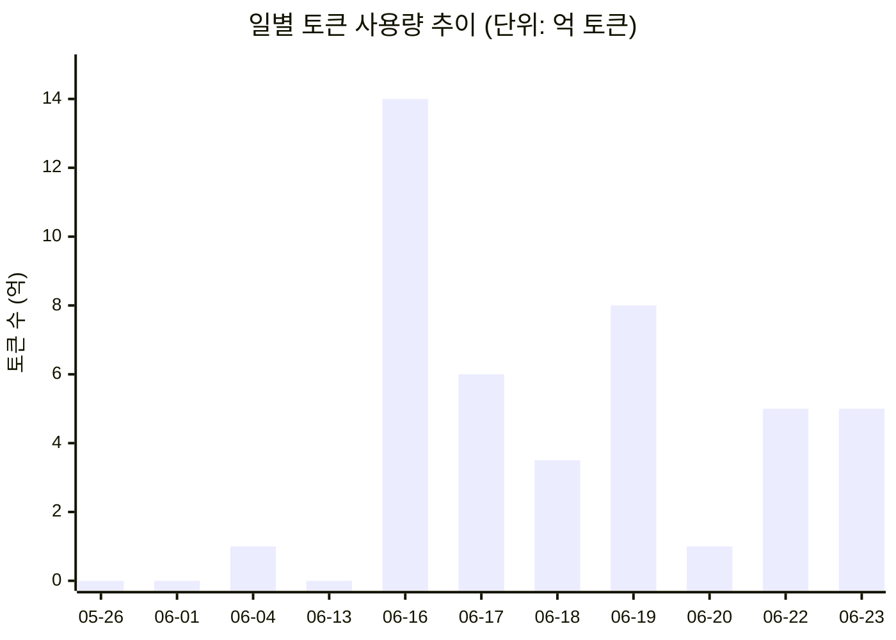
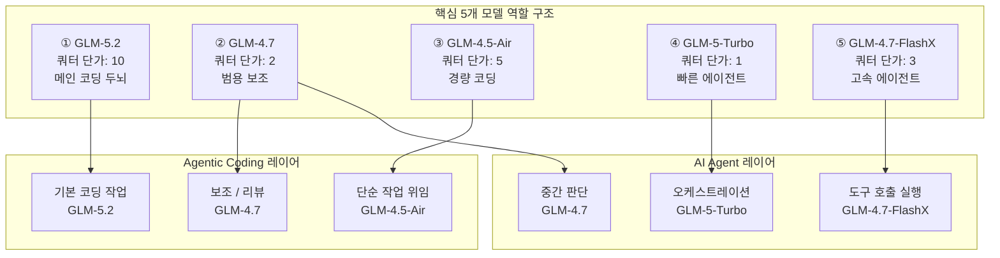
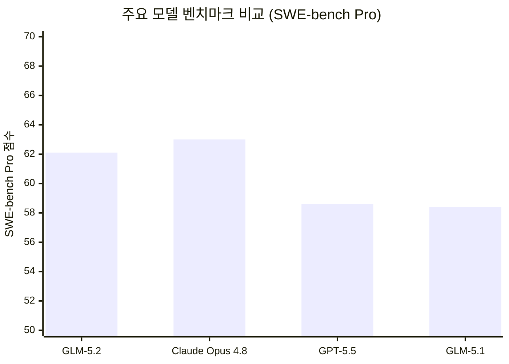
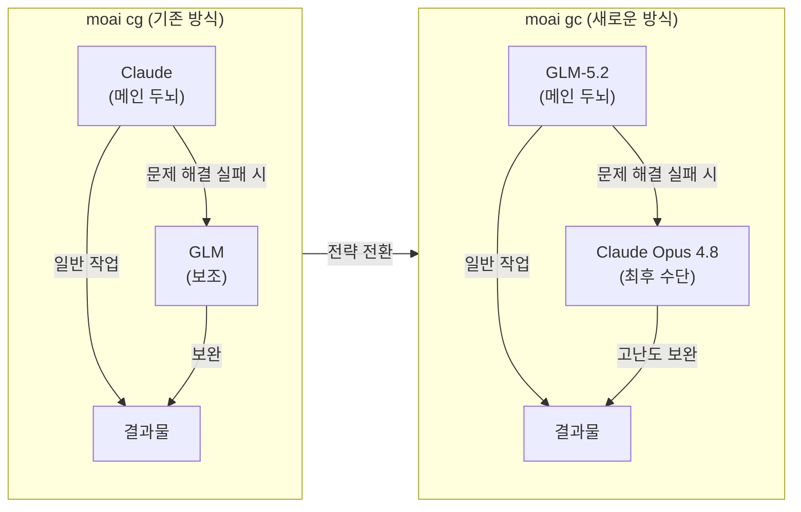
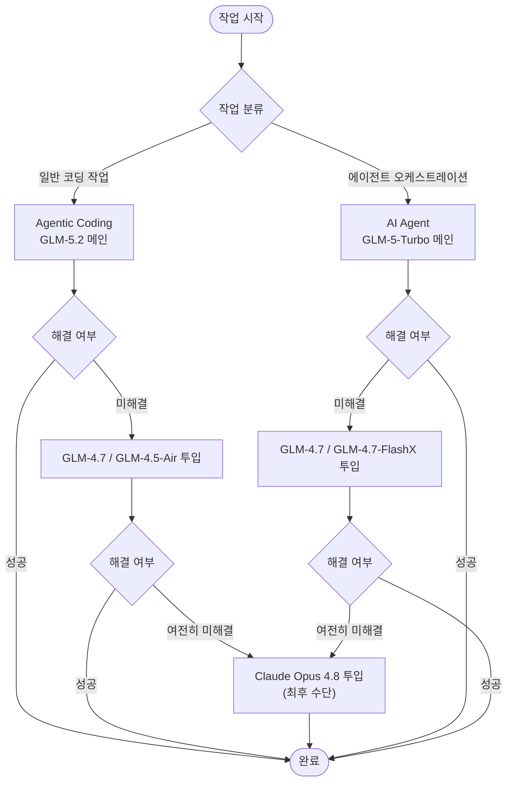
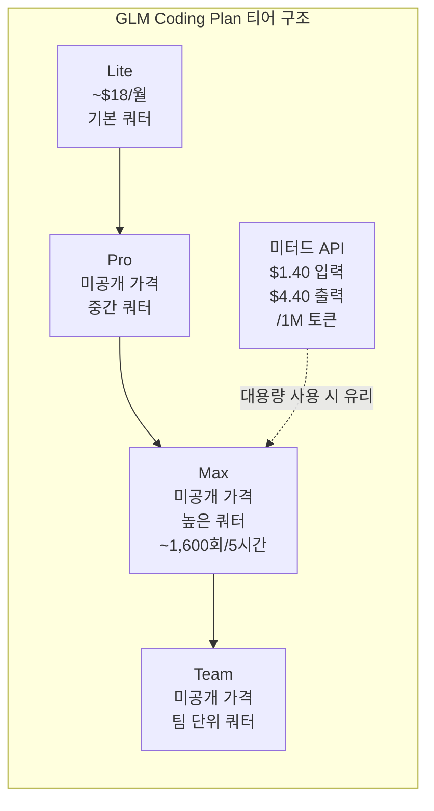
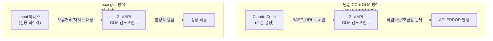
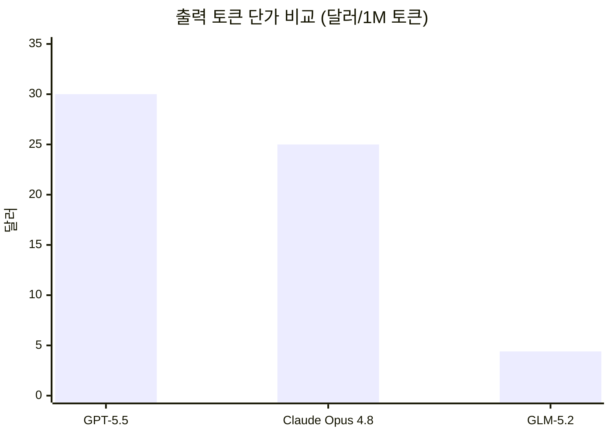

> **작성일:** 2026년 6월 24일  
> **기준 데이터:** Anthropic API Usage Dashboard + Z.ai GLM Coding Plan 사용 로그 + Facebook 커뮤니티 게시물  
> **검색 기준일:** 2026년 6월 24일 (최신 정보 반영)

> 
> https://www.facebook.com/share/p/1LJYb1xrAv/
> 
> 이제 GLM-5.2 를 메인 코딩 모델로 고정으로 사용해도 될 것 같습니다. 
> 
>- Agentic Coding: GLM-5.2, GLM-4.7, GLM-4.5-Air 
>- AI Agent: GLM-5-Turbo, GLM-4.7, GLM-4.7-FlashX
> 
> moai cg = Claude x GLM 외에 moai gc = GLM x Claude 형태로 메인을 GLM으로 사용하고 문제가 해결이 되지 않을 떄만 Claude Opus 4.8을 투입하는 형태로 사용이 더 효율적이긴 할 것 같습니다 :)
> 

---

## 목차

1. [이 게시물이 담고 있는 것](#1-이-게시물이-담고-있는-것)
2. [토큰 사용량 대시보드 분석](#2-토큰-사용량-대시보드-분석)
3. [GLM 모델 포트폴리오 구성 분석](#3-glm-모델-포트폴리오-구성-분석)
4. [GLM-5.2: 왜 지금인가?](#4-glm-52-왜-지금인가)
5. [moai 워크플로우 전략의 전환](#5-moai-워크플로우-전략의-전환)
6. [역할별 GLM 모델 매핑](#6-역할별-glm-모델-매핑)
7. [Z.ai GLM Coding Plan 구조](#7-zai-glm-coding-plan-구조)
8. [Claude Code에서 GLM 사용 시 API 오류 문제](#8-claude-code에서-glm-사용-시-api-오류-문제)
9. [비용 구조 비교](#9-비용-구조-비교)
10. [용어 사전](#10-용어-사전)

---

## 1. 이 게시물이 담고 있는 것

이 게시물은 한국 AI 개발자 커뮤니티에서 활발히 활동 중인 사용자가 공유한 실제 운영 데이터와 전략 메모다. 두 개의 스크린샷과 본문 텍스트가 합쳐져 하나의 완성된 이야기를 구성한다.

첫 번째는 Anthropic API Usage 대시보드로, 2026년 5월 26일부터 6월 24일까지 30일간 총 **44억 개** 가까운 토큰을 소비했음을 보여준다. 이 숫자 자체가 놀라운 것이 아니라, 그 사용량이 특정 날짜를 기준으로 폭발적으로 증가했다는 패턴이 핵심이다.

두 번째는 Z.ai의 GLM Coding Plan 대시보드로, 실제로 어떤 GLM 모델들을 어떤 방식으로 활용하고 있는지를 보여준다. 여기서 다섯 개의 모델에 빨간 테두리와 번호가 표시되어 있는데, 이것이 바로 이 사용자의 멀티 모델 전략의 핵심 구성 요소다.

본문 텍스트는 이 두 데이터를 배경으로, GLM-5.2를 메인 코딩 모델로 고정하겠다는 선언과 함께, **moai cg** 방식에서 **moai gc** 방식으로의 전략적 전환을 설명하고 있다. 댓글에서는 Claude Code(CC)에 GLM API를 연결했을 때 API 오류 빈도에 대한 실무적 질의응답도 포함되어 있다.

---

## 2. 토큰 사용량 대시보드 분석

### 2.1 전체 수치 개요

대시보드에 표시된 **Total Tokens: 4,399,796,743**은 약 44억 토큰이다. 이 수치는 데이터 처리 지연이 약 10분 있다는 안내가 상단에 명시되어 있으므로, 실시간 수치가 아니라 준실시간 집계치다.

이 숫자를 맥락 속에 놓으면 더 명확해진다. 일반적인 개발자가 하루에 Claude API를 사용하면 수백만 토큰 정도를 쓴다. 44억 토큰을 30일간 소비했다는 것은 하루 평균 약 1.47억 토큰에 달한다. 그러나 실제 분포는 이와 전혀 다른 이야기를 한다.

### 2.2 사용량 추이 패턴 해석

아래 다이어그램은 바차트에서 읽은 일별 토큰 사용량의 대략적 추이를 재구성한 것이다.



이 패턴에서 즉시 눈에 들어오는 것은 **6월 16일의 급격한 스파이크**다. 이날 하루 소비량이 약 14억 토큰으로, 전체 30일 사용량의 약 32%가 단 하루에 집중되어 있다. 이 날짜는 우연이 아니다.

Z.ai가 GLM-5.2의 MIT 라이선스 오픈 소스 공개와 함께 공식 벤치마크 스코어카드를 발표한 것이 바로 2026년 6월 17일이었으며, GLM Coding Plan 구독자들에게는 6월 13일부터 접근이 허용되었다. 즉, 이 사용자는 **GLM-5.2가 출시되자마자 즉시 대규모 워크플로우 테스트와 실전 투입을 시작**했고, 그 결과가 바로 6월 16일 이후의 급등 패턴으로 나타난 것이다.

5월 26일부터 6월 13일 사이에 사용량이 거의 없다가 6월 4일 작은 스파이크(약 1억 토큰)가 있는 것은 이전 버전인 GLM-5.1 등을 간헐적으로 테스트했던 흔적으로 해석할 수 있다.

### 2.3 후속 패턴의 의미

6월 16일 피크 이후에도 사용량이 완전히 가라앉지 않고 6월 22~23일에 다시 5억 토큰 수준으로 회복된 것은, 초기의 '폭발적 테스트' 단계를 지나 **일상적 워크플로우에 GLM-5.2가 안착**하기 시작했음을 시사한다. 6월 20일의 일시적 감소는 Z.ai 서버의 피크타임 쿼터 소진이나 의도적인 사용 조절의 결과일 가능성이 있다.

---

## 3. GLM 모델 포트폴리오 구성 분석

### 3.1 전체 모델 목록

두 번째 데이터에는 이 사용자가 보유한 GLM Coding Plan 계정에 등록되어 있는 모델들의 전체 목록이 나타난다. 각 항목 우측의 숫자는 Z.ai GLM Coding Plan에서의 **모델별 쿼터 단가(quota cost per call)** 를 의미하는 것으로 추정된다. 쿼터 단가가 높을수록 고성능 모델이지만 동일한 구독 크레딧을 더 빠르게 소진한다.

목록 전체를 정리하면 다음과 같다.

| 모델명 | 분류 | 쿼터 단가 | 역할 표시 |
|---|---|---|---|
| GLM-5.2 | Language Model | 10 | ① 메인 |
| GLM-4.7 | Language Model | 2 | ② |
| GLM-Image | Image Generation | 1 | — |
| GLM-5-Turbo | Language Model | 1 | ④ |
| GLM-5V-Turbo | Language Model | 1 | — |
| GLM-5.1 | Language Model | 10 | — |
| GLM-4.5 | Language Model | 10 | — |
| GLM-4.6V | Language Model | 10 | — |
| GLM-4.7-Flash | Language Model | 1 | — |
| GLM-4.7-FlashX | Language Model | 3 | ⑤ |
| GLM-OCR | Language Model | 2 | — |
| GLM-5 | Language Model | 2 | — |
| GLM-4-Plus | Language Model | 20 | — |
| GLM-4.5V | Language Model | 10 | — |
| GLM-4.6V-Flash | Language Model | 1 | — |
| AutoGLM-Phone-Multilingual | Language Model | 5 | — |
| GLM-4.5-Air | Language Model | 5 | ③ |

### 3.2 핵심 5개 모델의 의미

빨간 테두리와 번호로 강조된 다섯 개의 모델이 이 사용자의 실제 워크플로우 구성 요소다. 이 다섯 모델은 각기 다른 역할을 담당하며, 이후 섹션에서 설명할 Agentic Coding 레이어와 AI Agent 레이어에 분산 배치된다.



---

## 4. GLM-5.2: 왜 지금인가?

### 4.1 모델 개요

GLM-5.2는 중국 AI 스타트업 Z.ai(구 Zhipu AI, 칭화대학교 스핀오프)가 2026년 6월 13일에 자사 GLM Coding Plan 구독자를 대상으로 우선 공개하고, 6월 17일에 MIT 라이선스로 오픈 소스화한 플래그십 코딩 언어 모델이다. 총 파라미터 규모는 약 753억 개이지만 Mixture-of-Experts(MoE) 아키텍처 덕분에 실제 추론 시에는 약 40억 개의 파라미터만 활성화된다.

GLM-5.2는 2026년 6월 기준 오픈 웨이트 코딩 모델 중 가장 강력한 것으로 평가되며, SWE-bench Pro에서 62.1점을 기록해 GPT-5.5를 앞서고 클로드 Opus 4.8에 근접한 성능을 보여준다. API 비용은 입력 토큰 100만 개당 약 1.40달러, 출력 100만 개당 약 4.40달러로 GPT-5.5의 약 6분의 1 수준이다.

### 4.2 핵심 아키텍처 혁신: IndexShare

GLM-5.2의 가장 중요한 기술적 특징은 **IndexShare**라는 새로운 희소 어텐션 최적화 기법이다. 기존 대형 언어 모델에서는 각 희소 어텐션 레이어마다 별도의 인덱서(indexer)를 실행했지만, GLM-5.2는 매 4개의 희소 어텐션 레이어 그룹이 하나의 인덱서를 공유하도록 설계되었다.

IndexShare는 단일 경량 인덱서를 4개의 희소 어텐션 레이어에 걸쳐 공유함으로써, 100만 토큰 컨텍스트 길이에서 토큰당 FLOPs를 약 2.9배 절감한다. 이 최적화가 없었다면 744B MoE 모델에서의 100만 토큰 추론은 API 제공자와 대규모 자체 호스팅 모두에서 현실적으로 비용이 너무 높았을 것이다.

즉, IndexShare는 단순히 메모리 효율성을 높이는 것이 아니라, **100만 토큰 컨텍스트 윈도우를 실제 운영 환경에서 사용 가능한 수준으로 만드는 핵심 기술**이다.

### 4.3 주요 벤치마크 성능

GLM-5.2가 특히 두각을 나타내는 것은 에이전틱 도구 사용과 장기 소프트웨어 엔지니어링 작업 영역이다. SWE-bench Pro에서 62.1점을 기록해 GPT-5.5(58.6)와 전작 GLM-5.1(58.4)을 결정적으로 앞섰다. FrontierSWE(Dominance)에서는 장기 작업 완료를 테스트하는 이 벤치마크에서 74.4%를 기록해 GPT-5.5(72.6%)를 넘어섰고, Claude Opus 4.8(75.1%)과 거의 동률을 이뤘다. MCP-Atlas(도구 사용 평가)에서는 77.0점으로 GPT-5.5(75.3)를 앞섰고 Claude Opus 4.8(77.8)에 근소하게 뒤처졌다.

독립 분석 기관인 Artificial Analysis의 Intelligence Index v4.1에서 GLM-5.2는 51점을 기록해 MiniMax-M3(44), DeepSeek V4 Pro(44), Kimi K2.6(43)을 앞서는 오픈 웨이트 1위를 차지했다.



*참고: Claude Opus 4.8 수치는 FrontierSWE 기준 75.1% 대비 유추 추정치, 나머지는 Z.ai 공식 발표 기준*

### 4.4 지정학적 맥락

GLM-5.2 출시의 타이밍은 결코 우연이 아니다. Z.ai는 미국 상무부가 Anthropic의 최고급 모델인 Fable 5와 Mythos 5를 해외 이용자에게 차단하도록 명령한 다음 날인 6월 13일, 사용 제한 없는 오픈 소스 공개를 선언함으로써 메시지를 분명히 했다.

미국 외부에서 일하는 개발자들로서 Fable 5와 Mythos 5 접근권을 잃게 된 이들에게, GLM-5.2는 현재 사용 가능한 가장 유능한 오픈 라이선스 코딩 모델을 대표한다. 다만 Z.ai의 클라우드 API를 사용하는 경우에는 데이터가 중국의 국가정보법 적용을 받는 기업을 통해 전달된다는 점을 감안해야 한다. 모델 가중치를 자체 호스팅하면 API 기반 데이터 노출 문제는 해소되지만, 전체 정밀도 모델을 실행하려면 약 1.5 테라바이트의 GPU 메모리가 필요해 대부분의 개발팀에게는 현실적으로 접근하기 어려운 인프라 조건이다.

### 4.5 한국 개발자 커뮤니티의 반응

복수의 실무자들이 독립적으로 Zhipu의 GLM-5.2를 일상적인 사용에서 프론티어 수준에 근접한다고 느낀 최초의 오픈 웨이트 모델로 묘사했다. @jeremyphoward는 이를 자신의 사용 환경에서 "최소한 Opus 4.8과 GPT 5.5만큼 좋다"고 평가했지만, 비전 지원 부재라는 주요 격차가 있다고 언급했다.

---

## 5. moai 워크플로우 전략의 전환

### 5.1 용어 설명: moai cg vs moai gc

게시물에서 언급된 `moai cg`와 `moai gc`는 이 사용자가 자체적으로 명명한 멀티 모델 오케스트레이션 전략이다. 약어의 구조를 분석하면 다음과 같다.

`moai`는 아마도 이 사용자의 에이전트 프레임워크 또는 하네스 이름이다. `cg`와 `gc`는 각각 Claude-GLM과 GLM-Claude의 순서를 나타내며, **앞에 오는 모델이 메인(primary), 뒤에 오는 모델이 백업(fallback)** 임을 의미한다.



### 5.2 전환의 이유

이 전략 전환은 단순히 "GLM이 좋아졌으니 바꾼다"는 감성적 결정이 아니다. 세 가지 실용적 근거가 있다.

첫째, **비용 효율성의 극적 개선**이다. GLM-5.2의 API 단가는 Claude Opus 4.8 대비 출력 토큰 기준으로 약 5~7배 저렴하다. GLM-5.2를 메인으로 두면 대부분의 작업을 저비용으로 처리하고, Claude Opus 4.8은 정말 필요한 고난도 작업에만 투입할 수 있다.

둘째, **GLM-5.2의 성능 임계값 돌파**이다. 이전 세대 GLM 모델들은 Claude Code 수준의 에이전틱 코딩 하네스에서 메인으로 쓰기에는 부족한 부분이 있었다. GLM-5.2는 SWE-bench Pro 62.1, FrontierSWE 74.4% 등의 수치가 보여주듯 Claude Opus 4.8과의 격차가 수 퍼센트 이내로 좁혀졌다.

셋째, **1M 토큰 컨텍스트의 실용성**이다. 대형 코드베이스를 단일 컨텍스트에 넣고 작업하는 에이전틱 코딩에서 100만 토큰 컨텍스트는 실질적인 무기다. 중간 규모 서비스 코드베이스 전체(약 5만 줄 이상의 밀집된 코드)를 단일 호출로 처리할 수 있다.

### 5.3 전환 후 예상 워크플로우



이 구조에서 Claude Opus 4.8은 더 이상 **기본값이 아니라 비상 브레이커**다. 평상시 작업은 전부 GLM 생태계 내에서 처리되고, Anthropic 모델은 GLM이 풀지 못하는 예외적 상황에만 호출된다. 이는 AI 수출 규제로 인해 Fable 5와 Mythos 5가 한국 등 해외 이용자에게 차단된 상황에서 더욱 합리적인 선택이기도 하다.

---

## 6. 역할별 GLM 모델 매핑

### 6.1 Agentic Coding 레이어

Agentic Coding은 단순히 코드를 생성하는 것이 아니라, 에이전트가 파일 시스템에 접근하고, 터미널을 실행하고, 오류를 감지해 수정하는 일련의 자율적 코딩 루프 전체를 의미한다. 이 레이어에서 각 모델의 역할은 다음과 같다.

**GLM-5.2 (메인)**: 장기 호라이즌 코딩 작업의 핵심 두뇌다. 100만 토큰 컨텍스트를 이용해 대형 코드베이스의 전체 구조를 파악한 상태에서 리팩토링, 기능 추가, 버그 수정을 수행한다. 쿼터 단가가 10으로 상대적으로 높지만, 그만큼 처리 능력이 강력하다. High/Max 두 가지 추론 모드를 선택할 수 있어, 복잡도에 따라 연산 깊이를 조절할 수 있다.

**GLM-4.7 (보조)**: 쿼터 단가가 2로 매우 저렴하다. 코드 리뷰, 단순한 파일 수정, 문서화 작업 등 GLM-5.2를 호출하기에는 가성비가 낮은 반복 작업을 담당한다. 빠른 응답 속도와 낮은 비용이 강점이다.

**GLM-4.5-Air (경량)**: 쿼터 단가 5의 경량화 모델이다. 소규모 유틸리티 함수 작성, 테스트 코드 생성, 설정 파일 조작 등 단순하지만 빈번한 작업에 투입된다. "Air" 접미사가 붙은 만큼 속도와 효율성에 최적화되어 있다.

### 6.2 AI Agent 레이어

AI Agent 레이어는 복수의 도구와 API를 호출하며 다단계 작업을 자율적으로 수행하는 에이전트 오케스트레이션 구조다. 여기서 각 모델의 역할은 다음과 같다.

**GLM-5-Turbo (오케스트레이터)**: 쿼터 단가 1의 초경량 고속 모델이다. 에이전트 루프에서 어떤 도구를 다음에 호출할지 결정하는 라우팅 및 오케스트레이션 역할을 맡는다. 비용이 매우 낮아 수십, 수백 번의 반복 호출에도 부담이 없다.

**GLM-4.7 (중간 판단)**: Agentic Coding에서와 마찬가지로 AI Agent 레이어에서도 중간 난이도 판단 작업을 수행한다. 단순 라우팅보다 복잡하지만 GLM-5.2를 쓸 정도는 아닌 작업에서 활용된다.

**GLM-4.7-FlashX (실행 레이어)**: 쿼터 단가 3의 빠른 실행 모델이다. 구체적인 도구 호출(tool call) 실행, API 파라미터 구성, 응답 파싱 등 빠른 실행이 중요한 단계에서 활용된다. "FlashX"라는 이름에서 알 수 있듯이 속도 최적화가 핵심이다.

---

## 7. Z.ai GLM Coding Plan 구조

### 7.1 플랜 구성

Z.ai는 두 가지 요금 경로를 제공한다. 미터드 API는 입력 100만 토큰당 1.40달러, 출력 100만 토큰당 4.40달러이며, 캐시된 입력은 100만 토큰당 0.26달러다. 대안으로 GLM Coding Plan은 엔트리 티어 기준 월 약 18달러부터 시작하는 정액 구독이다. 더 높은 Pro, Max, Team 티어가 존재하지만 Z.ai는 가격을 공개하지 않았으며, 피크 시간대에는 쿼터를 최대 3배 소진할 수 있다.



### 7.2 Claude Code와의 통합

Z.ai GLM Coding Plan이 기존 Claude Code 사용자들에게 마찰 없이 통합되는 이유는 Anthropic 호환 엔드포인트를 노출하기 때문이다. 기본적으로 Z.ai는 Claude Code의 모델 티어를 GLM-4.7(Opus 및 Sonnet용)과 GLM-4.5-Air(Haiku용)로 매핑하므로, 초기 설정 상태에서는 GLM-5.2가 아닌 이 모델들이 사용된다. 새로운 플래그십을 사용하려면 `~/.claude/settings.json`에서 모델 환경 변수를 수정해야 한다.

이것이 중요한 이유는, **사용자가 별도 설정을 하지 않으면 GLM Coding Plan 구독 후에도 자동으로 GLM-5.2가 아닌 GLM-4.7이 사용된다**는 것이다. GLM-5.2를 메인으로 고정하려면 명시적인 설정 변경이 필요하다.

설정 방법은 다음과 같다. `~/.claude/settings.json` 파일에서 `env` 섹션에 다음과 같이 입력한다.

```json
{
  "env": {
    "ANTHROPIC_AUTH_TOKEN": "your_zai_coding_plan_api_key",
    "ANTHROPIC_BASE_URL": "https://api.z.ai/api/anthropic",
    "API_TIMEOUT_MS": "3000000"
  }
}
```

그리고 모델 이름을 `glm-5.2` 또는 100만 토큰 컨텍스트 활성화를 위해 `glm-5.2[1m]`으로 지정해야 한다.

### 7.3 피크타임 쿼터 배율

GLM-5.2는 피크 시간대(UTC+8 기준 14:00~18:00)에 쿼터 3배를 소진하고, 비피크 시간대에는 2배를 소진한다. 단, 2026년 9월까지는 비피크 시간대 1배 프로모션이 적용된다. 일상적인 루틴 작업에는 저렴한 GLM-4.7을 사용하는 것이 권장된다.

이 배율 구조가 모델 선택 전략과 직결된다. 피크타임에 GLM-5.2만 사용하면 쿼터가 3배 빠르게 소진되므로, 해당 시간대에는 GLM-4.7이나 GLM-4.5-Air로 경량 작업을 처리하고 GLM-5.2는 고난도 작업에만 투입하는 것이 현명하다.

---

## 8. Claude Code에서 GLM 사용 시 API 오류 문제

### 8.1 질문의 배경

게시물 댓글에서 한 사용자(SeongUk Kang)가 "GLM을 CC(Claude Code)에 물려놓고 사용하면 API ERROR가 꽤나 자주 발생하지 않나요?"라고 질문했다. 이 질문은 많은 한국 개발자들이 GLM Coding Plan을 Claude Code와 연동할 때 경험하는 실제 불편함을 반영한다.

### 8.2 원인 분석

Claude Code는 Anthropic의 공식 API를 위해 설계된 하네스다. Z.ai는 Anthropic 호환 엔드포인트(`https://api.z.ai/api/anthropic`)를 제공하지만, 이것이 완벽한 호환성을 보장하지는 않는다. API 오류가 발생하는 주요 원인은 다음과 같이 추정된다.

첫째, **Attribution Header 관련 캐시 버그**다. Claude Code v2.1.36 이상 버전에서는 Attribution Header가 자동으로 삽입되는데, Z.ai 엔드포인트가 이를 처리하는 방식에서 간헐적 오류가 발생할 수 있다. 이를 방지하려면 `~/.claude/settings.json`의 `env` 섹션에서 관련 헤더 설정을 명시적으로 조정해야 한다.

둘째, **타임아웃 설정 문제**다. 기본 API 타임아웃이 Z.ai 서버의 응답 지연(특히 GLM-5.2 Max 추론 모드)보다 짧을 수 있다. 이 때문에 설정 예시에서 `API_TIMEOUT_MS: "3000000"` (50분)으로 타임아웃을 크게 늘려 설정하는 것이 권장된다.

셋째, **피크타임 Z.ai 서버 불안정**이다. Z.ai 업타임이 불안정할 수 있으므로, 마감이 급한 날에는 GLM-4.7이나 백업 하네스를 준비해두는 것이 좋다고 경고하는 개발자도 있다.

### 8.3 moai glm 환경에서의 안정성

게시물 작성자의 답변은 명확했다. "moai glm 쓰면서 없었던 거 같아요." 이는 중요한 힌트를 담고 있다.

일반적인 CC(Claude Code) 설정에서 GLM API를 단순히 BASE_URL만 교체한 방식("CODING HELPER로 API KEY 바꾼 다음에 CC로 GLM 사용")과, moai라는 전용 하네스 프레임워크를 통해 GLM을 사용하는 방식은 내부 동작이 상당히 다를 수 있다. moai는 아마도 GLM API와의 호환성을 위해 자체적으로 오류 처리, 재시도 로직, 타임아웃 설정 등을 최적화했을 가능성이 높다.



이 차이는 "어떤 모델을 쓰느냐"보다 "어떻게 연결하느냐"가 더 중요할 수 있음을 시사한다. 하네스 설계의 품질이 모델 성능만큼이나 실제 개발자 경험에 영향을 미친다는 것을 보여주는 실례다.

---

## 9. 비용 구조 비교

### 9.1 API 단가 비교

비용 측면에서 격차는 크다. GLM-5.2 API는 입력 100만 토큰당 1.40달러, 출력 100만 토큰당 4.40달러(합산 5.80달러)인 반면, Claude Opus 4.8은 5달러/25달러, GPT-5.5는 5달러/30달러다. 이는 출력 토큰 기준으로 GLM-5.2가 약 5~7배 저렴하고, 블렌드 비용 기준으로는 GPT-5.5 대비 약 6분의 1 수준임을 의미한다.



### 9.2 실제 작업 비용 비교

AA-Briefcase 벤치마크에서 Fable 5는 작업당 평균 31달러, Opus 4.8은 10.40달러, GPT-5.5 xhigh는 3.68달러, GLM-5.2는 2.40달러의 비용이 들었다. 더 중요한 것은 이 벤치마크가 품질과 경제성을 모두 드러낸다는 점이다.

이 수치는 단순 토큰 단가가 아니라 실제 완료된 작업당 소요된 총 비용이므로, 더 실질적인 참고 기준이 된다. moai gc 전략으로 전환하면 대부분의 작업을 GLM-5.2(작업당 2.40달러)로 처리하고, 정말 어려운 케이스만 Opus 4.8(10.40달러)에 에스컬레이션하는 것이 가능해진다.

---

## 10. 용어 사전

이 문서에서 사용된 주요 기술 용어를 정리한다.

| 용어 | 원문 / 영문 | 설명 |
|---|---|---|
| moai cg | moai cg | Claude 메인, GLM 보조 방식의 멀티 모델 워크플로우 |
| moai gc | moai gc | GLM 메인, Claude 보조 방식의 멀티 모델 워크플로우 |
| 에이전틱 코딩 | Agentic Coding | 에이전트가 자율적으로 코딩 작업을 수행하는 방식 |
| MoE | Mixture of Experts | 전체 파라미터 중 일부만 활성화하는 희소 모델 아키텍처 |
| IndexShare | IndexShare | GLM-5.2의 희소 어텐션 최적화 기법 |
| 쿼터 단가 | Quota Cost | GLM Coding Plan에서 모델 호출당 소진되는 크레딧 단위 |
| SWE-bench Pro | SWE-bench Pro | 실제 소프트웨어 엔지니어링 작업을 기반으로 한 LLM 벤치마크 |
| FrontierSWE | FrontierSWE | 장기 작업 완료 능력을 측정하는 소프트웨어 엔지니어링 벤치마크 |
| Terminal-Bench | Terminal-Bench | 터미널 기반 에이전트 신뢰성을 측정하는 벤치마크 |
| MCP-Atlas | MCP-Atlas | MCP 도구 사용 능력을 평가하는 벤치마크 |
| CC | Claude Code | Anthropic의 터미널 기반 에이전틱 코딩 하네스 |
| GLM Coding Plan | GLM Coding Plan | Z.ai의 코딩 특화 모델 구독 플랜 (Lite/Pro/Max/Team) |

---

## 마치며

이 게시물은 한국 AI 개발자 커뮤니티에서 GLM-5.2 출시 이후 실제 실무 환경에서 어떤 전략적 전환이 일어나고 있는지를 압축적으로 보여주는 사례다.

44억 토큰의 사용 데이터는 단순한 테스트가 아니라 실전 워크플로우의 흔적이며, 다섯 개의 GLM 모델로 구성된 포트폴리오는 각 역할에 최적화된 모델을 배치하는 정교한 설계의 결과다. 그리고 moai cg에서 moai gc로의 전환 선언은, Claude 생태계의 종속성을 줄이고 오픈 웨이트 모델을 중심에 두는 멀티 모델 전략의 성숙을 의미한다.

GLM-5.2가 단독으로 모든 것을 해결하는 것이 아니라, 각 모델의 강점을 역할에 맞게 배치하는 하네스 설계와 워크플로우 최적화가 결합될 때 비로소 '프론티어 수준의 성능을 6분의 1 비용으로'라는 명제가 현실이 된다는 점이 이 게시물의 핵심 메시지다.

---

*이 문서는 2026년 6월 24일 최신 공개 정보를 기반으로 작성되었습니다. GLM-5.2 벤치마크 수치 중 일부는 Z.ai 벤더 자체 발표 기준이며, 현재 독립 검증이 진행 중입니다.*
