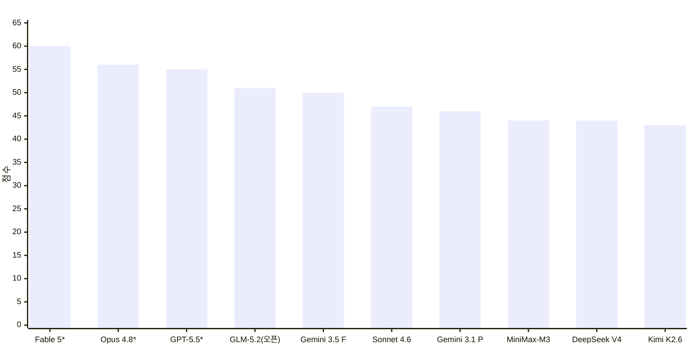
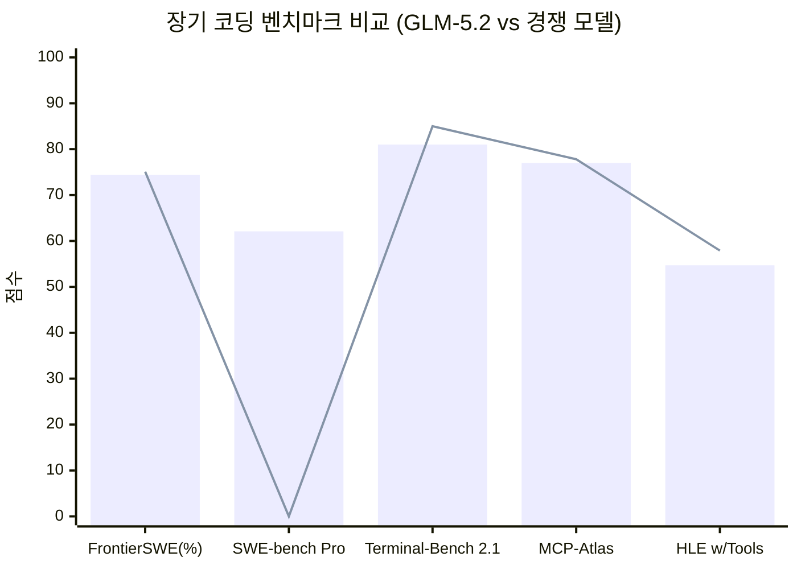
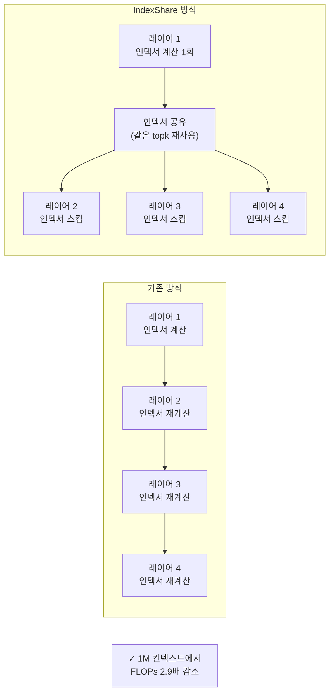
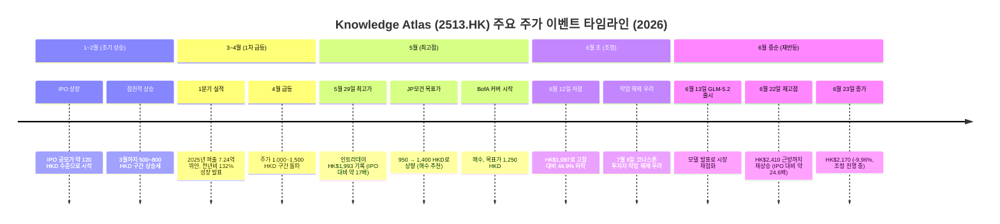
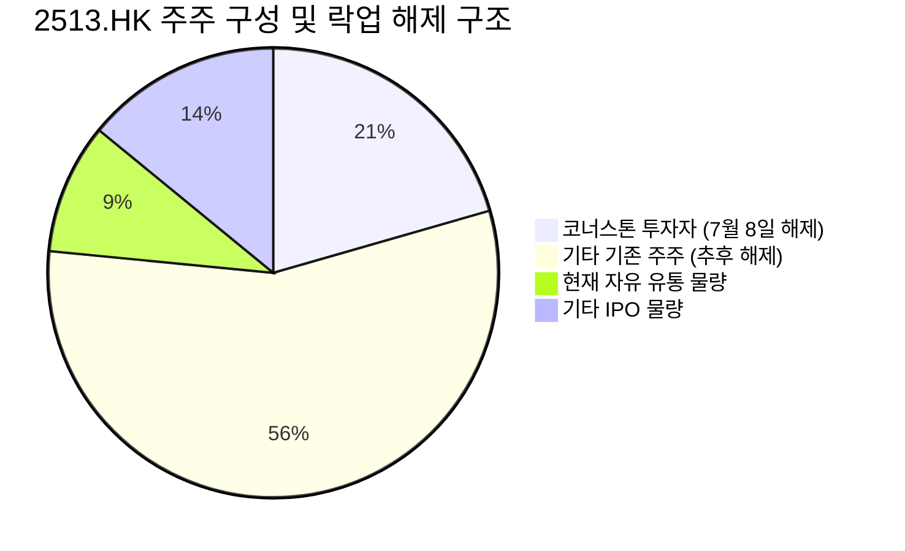
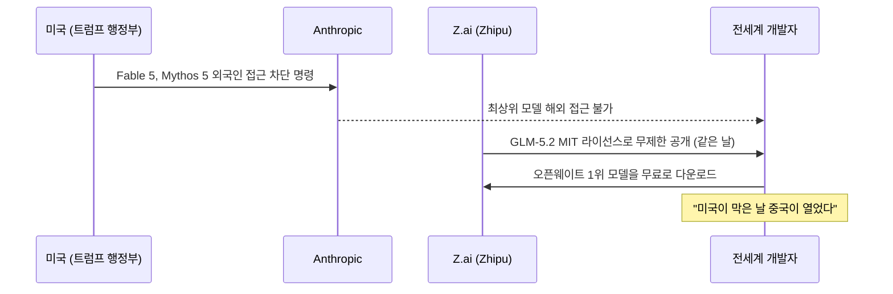
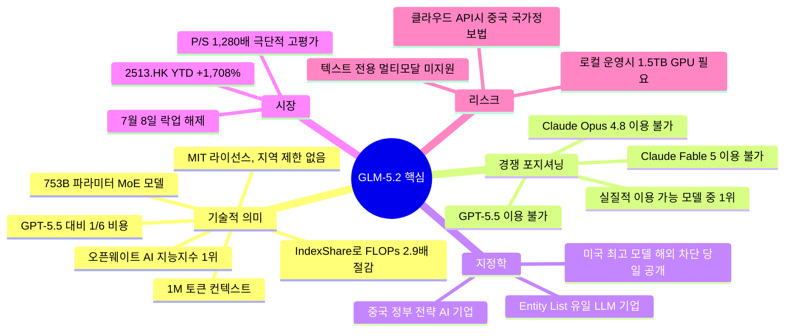

> **2026년 6월 기준 | AI 지능지수 오픈웨이트 1위 모델 & 홍콩 증시 초대형 이슈**

## 관련글

[**이번 주 AI 최대 쇼크는, 중국의 GLM 5.2 모델 발표다**](https://www.facebook.com/share/p/1GwfK6hpxb/)

---

## 목차

1. [이번 주 AI 업계 최대 충격: GLM-5.2 등장](#1-이번-주-ai-업계-최대-충격-glm-52-등장)
2. [GLM-5.2란 무엇인가?](#2-glm-52란-무엇인가)
3. [AA Intelligence Index v4.1: 벤치마크 전체 분석](#3-aa-intelligence-index-v41-벤치마크-전체-분석)
4. [세부 코딩 벤치마크: 수치로 보는 GLM-5.2의 실력](#4-세부-코딩-벤치마크-수치로-보는-glm-52의-실력)
5. [GLM-5.2 핵심 기술: IndexShare와 아키텍처](#5-glm-52-핵심-기술-indexshare와-아키텍처)
6. [비용 혁명: GPT-5.5 대비 1/6 가격](#6-비용-혁명-gpt-55-대비-16-가격)
7. [오픈웨이트의 의미: 로컬 실행의 가능성과 한계](#7-오픈웨이트의-의미-로컬-실행의-가능성과-한계)
8. [Zhipu AI / Z.ai: 회사 전체 이해](#8-zhipu-ai--zai-회사-전체-이해)
9. [미국 제재(Entity List): 칼날의 양면](#9-미국-제재entity-list-칼날의-양면)
10. [홍콩 증시 Knowledge Atlas (2513.HK) 주가 분석](#10-홍콩-증시-knowledge-atlas-2513hk-주가-분석)
11. [락업 해제: 7월 8일 D-Day의 의미](#11-락업-해제-7월-8일-d-day의-의미)
12. [지정학적 맥락: 미국 규제와 중국의 반격](#12-지정학적-맥락-미국-규제와-중국의-반격)
13. [실리콘밸리의 반응: 개발자 커뮤니티 평가](#13-실리콘밸리의-반응-개발자-커뮤니티-평가)
14. [GLM-5.2 사용 시 리스크 고려사항](#14-glm-52-사용-시-리스크-고려사항)
15. [투자 관련 참고사항](#15-투자-관련-참고사항)
16. [요약 및 핵심 포인트 정리](#16-요약-및-핵심-포인트-정리)

---

## 1. 이번 주 AI 업계 최대 충격: GLM-5.2 등장

2026년 6월 13일, 베이징에 본사를 둔 중국 AI 기업 Z.ai(전 Zhipu AI)가 GLM-5.2를 출시했다. 이 모델의 등장이 AI 업계에 충격을 준 이유는 단순히 성능이 뛰어나서가 아니다. **세계 최상위급 성능을 가진 모델이 오픈소스로, 무료로, 지역 제한 없이 공개되었다**는 사실 때문이다.

독립 평가 기관인 Artificial Analysis의 Intelligence Index v4.1 기준으로, GLM-5.2는 51점을 기록하며 **현재 이용 가능한 모든 오픈웨이트 모델 중 1위**를 차지했다. 위 순위표에서 더 높은 점수를 기록한 Claude Fable 5(60점), Claude Opus 4.8(56점), GPT-5.5(55점)는 모두 일반 공개가 되지 않거나 해외 사용이 제한된 상태다. 다시 말해, **전 세계 누구나 실제로 접근할 수 있는 모델 중 GLM-5.2가 사실상 1위**라는 뜻이다.

이 발표는 단순한 기술 뉴스를 넘어 여러 파급 효과를 동시에 가져왔다. GLM-5.2를 만든 Zhipu의 홍콩 상장 법인(Knowledge Atlas Technology, 종목코드 2513.HK)의 주가가 폭등했고, 실리콘밸리 주요 개발자들과 테크 리더들이 공개적으로 이 모델을 극찬했다. 또한 미국이 자국 최고 AI 모델의 해외 접근을 차단하는 바로 그 시점에 중국이 반대로 최상위 모델을 전 세계에 무료로 공개한다는 지정학적 메시지가 업계 전체에 강하게 각인되었다.

---

## 2. GLM-5.2란 무엇인가?

### 기본 정보 요약

| 항목 | 내용 |
|------|------|
| 출시일 | 2026년 6월 13일 (공개 오픈소스: 약 6월 17일) |
| 개발사 | Z.ai (구 Zhipu AI), 중국 베이징 |
| 파라미터 수 | 753B (또는 744B) — 소스에 따라 표기 상이 |
| 아키텍처 | Mixture-of-Experts (MoE), 활성 파라미터 약 40B |
| 컨텍스트 윈도우 | 1,000,000 토큰 (1M) |
| 라이선스 | MIT (지역 제한 없음) |
| 가중치 공개 | HuggingFace, ModelScope에서 무료 다운로드 |
| API 제공 | Z.ai API, 20개 이상 서드파티 코딩 환경 통합 |
| 추론 모드 | High (빠른 일반 생성), Max (심층 다단계 추론) |
| 전문 분야 | 장기 자율 코딩, 소프트웨어 엔지니어링 에이전트 작업 |

### GLM이란 이름의 의미

GLM은 "General Language Model"의 약자다. 이는 Zhipu AI가 2019년 청화대학교 지식공학그룹(Knowledge Engineering Group) 스핀아웃으로 설립된 이후 자체 개발해온 대형언어모델 시리즈의 이름이다. GLM-5.2는 5세대 모델의 두 번째 주요 업데이트로, 전작인 GLM-5.1 대비 전반적인 코딩 능력과 장기 에이전트 작업 처리 능력이 크게 향상되었다.

GLM-5.2의 가장 큰 특징은 **장기 자율 코딩(long-horizon coding)** 에 특화되어 있다는 점이다. 단순히 더 많은 토큰을 처리하는 것을 넘어, 수 시간에 걸친 복잡한 소프트웨어 엔지니어링 작업을 안정적으로 수행하는 능력을 목표로 설계되었다. Z.ai의 공식 블로그는 "1M 컨텍스트를 주장하기는 쉽지만, 실제 엔지니어링 압박 하에서 그 품질을 유지하기는 훨씬 어렵다"고 명시하며, GLM-5.2가 단순한 토큰 수 확장이 아닌 실용적 장기 코딩 품질을 겨냥했음을 강조한다.

---

## 3. AA Intelligence Index v4.1: 벤치마크 전체 분석

Artificial Analysis(AA)는 독립적으로 AI 모델의 성능을 측정하는 분석 기관으로, Intelligence Index v4.1은 9개 평가 항목을 종합한 점수다. 포함된 평가 항목은 GPQA-Diamond, Banking, Terminal-Bench v2.1, SciCode, Humanity's Last Exam, AA-Omniscience, AA-LCR 등이다.

위 순위를 보면 몇 가지 핵심 사실이 드러난다.

첫째, 60점인 Claude Fable 5, 56점인 Claude Opus 4.8, 55점인 GPT-5.5는 모두 점선(Not currently available) 표시가 있다. 이는 해당 모델들이 일반 대중 또는 해외 사용자에게 현재 실질적으로 이용 불가능하다는 뜻이다. 특히 Anthropic의 최고 모델들은 미국의 AI 수출 규제 조치로 인해 외국 사용자에게 접근이 차단된 상태다.

둘째, GLM-5.2는 51점으로 4위지만, **실제로 전 세계 누구나 이용 가능한 모델 중에서는 1위**다. 그 아래 50점인 Gemini 3.5 Flash와는 불과 1점 차이이나, Gemini 3.5 Flash는 구글의 클로즈드 API 모델이고 GLM-5.2는 가중치를 직접 다운로드할 수 있는 오픈웨이트 모델이다.

셋째, 다른 중국 AI 기업들의 오픈 모델들(MiniMax-M3: 44점, DeepSeek V4 Pro: 44점, Kimi K2.6: 43점)과 비교하면 GLM-5.2의 51점은 7점 이상 앞서는 수치로, 현재 중국 오픈 AI 생태계에서도 압도적 우위를 보여준다.

---

## 4. 세부 코딩 벤치마크: 수치로 보는 GLM-5.2의 실력

GLM-5.2의 진가는 특히 장기 코딩 및 소프트웨어 엔지니어링 관련 벤치마크에서 두드러진다. 아래 표는 주요 경쟁 모델과의 비교다.

### 장기 코딩 벤치마크 비교

| 벤치마크 | GLM-5.2 | Claude Opus 4.8 | GPT-5.5 | GLM-5.1 |
|----------|---------|-----------------|---------|---------|
| **FrontierSWE** | **74.4%** | 75.1% | 72.6% | 30.5% |
| **SWE-bench Pro** | **62.1** | — | 58.6 | 58.4 |
| **Terminal-Bench 2.1** | **81.0** | 85.0 | — | 62.0 |
| **PostTrainBench** | **34.3%** | — (1위) | 25.0% | — |
| **SWE-Marathon** | **13.0%** | ~26.0% | 12.0% | 1.0% |
| **MCP-Atlas** | **77.0** | 77.8 | 75.3 | — |
| **HLE (w/ Tools)** | **54.7** | 57.9 | 52.2 | — |

### 추론 및 범용 벤치마크 비교

| 벤치마크 | GLM-5.2 | Claude Opus 4.8 | GPT-5.5 | GLM-5.1 |
|----------|---------|-----------------|---------|---------|
| **AIME 2026** | **99.2** | — | — | 95.3 |
| **GPQA-Diamond** | **91.2** | — | — | 86.2 |

각 벤치마크의 의미를 간략히 설명하면 다음과 같다.

**FrontierSWE**는 수 시간에서 수십 시간에 걸치는 오픈엔드 기술 프로젝트를 에이전트가 완료할 수 있는지 측정하는 가장 까다로운 실전 코딩 벤치마크 중 하나다. 시스템 최적화, 대규모 코드 구축, 응용 ML 연구 등을 포함한다. GLM-5.2는 74.4%로 Claude Opus 4.8(75.1%)에 불과 0.7%p 뒤지는 사실상 동급 수준을 보여주며, GPT-5.5(72.6%)는 앞섰다.

**SWE-bench Pro**는 실제 소프트웨어 엔지니어링 작업을 테스트하는 표준 벤치마크다. GLM-5.2는 62.1점으로 GPT-5.5(58.6점)를 명확히 앞섰다.

**Terminal-Bench 2.1**은 터미널 기반 에이전트 작업을 평가한다. GLM-5.1이 62.0점이었던 것이 GLM-5.2에서 81.0점으로 31% 가까이 향상되었다. 이는 버전 간 가장 드라마틱한 개선 중 하나다.

**SWE-Marathon**은 컴파일러 구축, 커널 최적화, 프로덕션급 서비스 개발 같은 초장기 소프트웨어 엔지니어링 과제를 평가하는 가장 어려운 벤치마크다. GLM-5.2는 13.0%로 여전히 Claude Opus 4.8에 뒤지지만, 전작(1.0%)에 비해 13배 향상된 수치이며 GPT-5.5(12.0%)는 앞섰다.

---

## 5. GLM-5.2 핵심 기술: IndexShare와 아키텍처

### MoE (Mixture-of-Experts) 구조

GLM-5.2는 MoE 아키텍처를 채택하여 총 파라미터 수는 753B(또는 744B)에 달하지만, 각 토큰을 처리할 때 실제로 활성화되는 파라미터는 약 40B에 불과하다. 이 구조 덕분에 방대한 모델 용량을 보유하면서도 실제 추론 비용은 훨씬 작은 모델 수준으로 유지할 수 있다. DeepSeek-V3, Kimi K2 등 최근 중국 AI 모델들이 채택한 것과 유사한 접근법이다.

### IndexShare: 1M 컨텍스트의 실용화를 가능하게 한 핵심 혁신

대형 언어 모델에서 긴 문서나 대화를 처리할 때 가장 큰 계산 비용 중 하나는 어텐션(Attention) 메커니즘을 매 레이어마다 재계산하는 것이다. 특히 sparse attention 구조에서는 어떤 토큰이 어떤 토큰에 주목해야 하는지를 결정하는 "인덱서(indexer)"의 계산이 반복적으로 필요하다.

GLM-5.2가 제안한 **IndexShare**는 이 문제를 독창적으로 해결한다. 원리는 단순하다: **매 4개의 sparse attention 레이어마다 하나의 경량 인덱서를 공유(reuse)하는 것이다.** 첫 번째 레이어에서 계산한 인덱서의 topk 인덱스를 그다음 3개 레이어에서도 그대로 사용한다. 이렇게 하면 반복적인 인덱서 dot-product 계산과 topk 연산을 대폭 줄일 수 있다.

그 결과는 수치로 명확하다. **1M 컨텍스트 길이에서 per-token FLOPs(부동소수점 연산)가 기존 대비 2.9배 감소**한다. 이는 장문의 코딩 에이전트 세션에서 처리 속도와 비용을 동시에 크게 개선한다.

### MTP(Multi-Token Prediction) 개선

기존의 언어 모델은 한 번에 토큰 하나씩 예측한다. 투기적 디코딩(Speculative Decoding)은 한 번에 여러 토큰을 미리 예측한 뒤, 메인 모델이 이를 검증하는 방식으로 처리 속도를 높이는 기법이다. GLM-5.2는 MTP 레이어를 개선하여 **투기적 디코딩의 수용 길이(acceptance length)를 최대 20% 향상**시켰다. 이는 전반적인 생성 속도의 실질적 개선을 의미한다.

### 두 가지 추론 모드

GLM-5.2는 사용자가 작업 유형에 따라 추론의 깊이를 선택할 수 있도록 두 가지 모드를 제공한다.

**High 모드**는 빠른 일반 생성에 적합하다. 일상적인 코딩 질문이나 짧은 작업에서 응답 속도를 우선시한다.

**Max 모드**는 깊은 다단계 계획(multi-step planning)이 필요한 복잡한 코딩 작업에 권장된다. 처리 속도는 느리지만 더 정교한 추론 과정을 거친다. Z.ai의 공식 문서에 따르면 Max 모드는 피크 시간대(베이징 시각 14시~18시)에 쿼터 소모가 3배, 그 외 시간에는 2배로 증가한다.

---

## 6. 비용 혁명: GPT-5.5 대비 1/6 가격

GLM-5.2가 업계에 준 또 다른 충격은 가격이다. 성능이 유사하거나 일부 벤치마크에서 앞서는 모델을 GPT-5.5의 약 1/6 비용으로 사용할 수 있다는 것이다.

### API 토큰 가격 비교

| 모델 | 입력 ($/M 토큰) | 출력 ($/M 토큰) | 합계 (입력+출력) |
|------|----------------|----------------|-----------------|
| **GLM-5.2 (Z.ai API)** | **$1.40** | **$4.40** | **$5.80** |
| GPT-5.5 | $5.00 | $30.00 | $35.00 |
| GLM-5.2 (FriendliAI) | $1.40 | $4.40 | $5.80 |

단순 계산으로 GPT-5.5의 출력 토큰 가격($30/M)은 GLM-5.2($4.40/M)의 약 6.8배다. 전체 합산 기준으로도 GLM-5.2는 GPT-5.5 대비 약 1/6 수준이다.

Z.ai는 엔터프라이즈 구독 플랜도 제공하며, 기본 구독은 월 $12.60부터 시작한다.

오픈웨이트 모델이기 때문에 충분한 GPU 인프라를 보유한 기업이라면 가중치를 직접 다운로드하여 자체 서버에서 운영할 경우 API 요금 자체가 발생하지 않으며, 오로지 컴퓨팅과 전력 비용만 부담하면 된다. 이는 특히 대규모 자율 코딩 에이전트 파이프라인을 운영하는 엔터프라이즈 환경에서 엄청난 비용 절감 가능성을 의미한다.

---

## 7. 오픈웨이트의 의미: 로컬 실행의 가능성과 한계

### 오픈웨이트와 오픈소스의 차이

GLM-5.2는 "오픈소스"라는 표현을 사용하지만 엄밀히는 **오픈웨이트(open-weight)** 모델이다. 가중치 파일이 공개되어 있어 누구나 다운로드, 파인튜닝, 자체 배포가 가능하지만, 학습 데이터나 훈련 코드 전체가 공개된 것은 아니다. MIT 라이선스는 지역 제한이나 상업적 사용 제한 없이 매우 자유로운 활용을 허용한다.

### 로컬 실행의 하드웨어 요건

GLM-5.2를 최대 정밀도로 로컬 운영하려면 약 **1,488GB(1.5TB)의 GPU 메모리**가 필요하다. Z.ai의 참고 배포 구성은 **NVIDIA H200 GPU 8대를 텐서 병렬(tensor parallelism)로 연결**하는 방식이다. H200 GPU 1대의 메모리가 141GB이므로, 8대를 연결하면 약 1,128GB로 사실상 4비트 양자화(quantization) 등의 기법을 병행해야 한다.

결론적으로, 대부분의 개발팀이나 중견기업은 이 수준의 인프라를 보유하지 않는다. 따라서 실질적으로 GLM-5.2를 활용하는 방법은 두 가지로 나뉜다. 충분한 H100/H200 클러스터를 보유한 대형 기업은 진정한 데이터 주권(data-sovereign) 방식으로 완전히 로컬에서 프론티어급 코딩 모델을 운영할 수 있다. 그 외 대부분의 사용자는 Z.ai 클라우드 API를 통해 접근하게 되는데, 이 경우 중국 국가정보법의 적용을 받는다는 점을 인식해야 한다.

### 지원 프레임워크

GLM-5.2 가중치는 HuggingFace 및 ModelScope에서 배포되며, transformers, vLLM, SGLang, xLLM, ktrans 등 주요 추론 프레임워크를 지원한다. Claude Code, Cline, Roo Code, OpenCode 같은 코딩 에이전트 도구에도 당일 통합이 이루어졌다.

---

## 8. Zhipu AI / Z.ai: 회사 전체 이해

### 창립과 배경

Zhipu AI(현재 국제 브랜드 Z.ai, 홍콩 상장명 Knowledge Atlas Technology)는 2019년 중국 베이징에서 설립되었다. 모회사 격인 칭화대학교 지식공학그룹(Knowledge Engineering Group)의 스핀아웃 기업으로, 중국의 명문 이공계 대학인 칭화대의 AI 연구 역량을 상업화하는 방향으로 출발했다.

설립 이후 알리바바그룹, 텐센트, 홍삼캐피털(Hongshan Capital) 등 중국 대형 테크 투자자들로부터 투자를 받았으며, 2024년 기준 중국의 "AI 4대 호랑이(AI Tigers)" 중 하나로 꼽혔다. IDC(국제데이터기업) 기준으로 중국 AI 산업에서 LLM 시장 3위 플레이어로 평가받는다.

### 주요 제품 및 서비스

Z.ai의 핵심 제품군은 다음과 같다.

**GLM 시리즈 모델**은 회사의 기술 핵심으로, bigmodel.cn 오픈 플랫폼을 통해 MaaS(Model as a Service) 형태로 제공된다. GLM-130B, GLM-4, GLM-5, GLM-5.1, GLM-5.2로 이어지는 플래그십 라인업과, AutoGLM(자율 에이전트), ChatGLM(대화형 AI), Zread.ai(독서 어시스턴트), AMiner(학술 정보 플랫폼) 등의 파생 제품을 보유한다.

**수익 구조**를 보면 2025년 기준 Z.ai의 총 매출은 7억 2,400만 위안이었으며, 이 중 73.7%인 5억 3,400만 위안이 정부 및 기업 대상 로컬 배포(On-premise Deployment) 서비스에서 발생했다. 전년 대비 132% 성장한 수치다. 클라우드 기반 서비스 매출이 나머지를 구성하며, 소비자 앱인 Zhipu Qingyan이 수천만 중국 사용자에게 서비스 중이다.

### 홍콩 상장 (IPO)

Z.ai는 2026년 1월 홍콩 증권거래소에 H주(Knowledge Atlas Technology, 종목코드 2513.HK)로 상장했다. IPO 공모 구조를 보면, 전체 신규 발행 H주는 약 3,742만 주(초과배정 옵션 포함 시 약 4,303만 주)로, 이는 총 주식의 약 9.65%에 불과했다. 더욱이 전체 IPO 주식의 약 70%인 약 2,568만 주를 11개의 코너스톤 투자자들이 락업 조건으로 매수했다. 초기에 시장에서 자유롭게 거래 가능한 주식은 전체의 4% 미만이었는데, 이 극도로 낮은 유동성이 상장 이후 주가 폭발의 핵심 원인 중 하나가 되었다.

---

## 9. 미국 제재(Entity List): 칼날의 양면

### 제재의 내용과 배경

2025년 1월 15일, 미국 바이든 행정부는 퇴임 직전 대규모 수출통제 조치를 단행했다. 이 과정에서 미국 상무부 산업안보국(BIS, Bureau of Industry and Security)이 중국 기업 11개를 포함한 27개 기업을 수출통제 Entity List에 추가했다. 그 중 하나가 바로 **베이징 즈푸화장기술(Beijing Zhipu Huazhang Technology)과 그 자회사들**이었다.

BIS가 제시한 등재 이유는 "중국 군의 현대화를 위해 첨단 인공지능 연구를 개발하고 통합하는 활동이 미국의 국가안보 및 외교 정책에 반한다"는 것이었다. Entity List에 등재되면 해당 기업은 미국 기업으로부터 기술을 구매하거나 공급받으려면 미국 정부의 특별 승인이 필요하며, 기본 정책은 '거부 추정(presumption of denial)'이다.

Z.ai는 즉각 "이 결정은 사실적 근거가 없다"고 강력 반발하며, "Entity List 등재가 사업에 실질적인 영향을 미치지 않을 것"이라고 밝혔다. 또한 공정성, 투명성, 지속가능성의 원칙을 준수하며 글로벌 AI 경쟁에 계속 참여하겠다는 입장을 표명했다.

주목할 점은 DeepSeek, Qwen(알리바바) 등 서방에도 잘 알려진 중국 AI 모델 기업들은 Entity List에 등재되지 않은 반면, Z.ai는 등재되었다는 사실이다. 이는 Z.ai가 중국 AI 기업들 중에서도 특별히 중국 정부의 군사·국가 전략적 용도와 긴밀히 연관된 기업으로 미국 정부가 판단하고 있다는 의미다.

OpenAI가 2026년에 발표한 분석에 따르면, Z.ai 경영진은 리창(Li Qiang) 국무원 총리를 포함한 중국 공산당 고위 관계자들과 정기적으로 접촉하고 있으며, 정부 지원 투자 규모가 14억 달러를 상회하는 것으로 추정된다.

### 제재의 역설적 효과: 투자 매력으로의 전환

통상적으로 미국 제재는 기업의 성장 가능성을 가로막는 장벽으로 작용한다. 그런데 현재 중국 AI 투자 맥락에서는 역설적으로 정반대의 효과가 나타나고 있다는 시각도 있다.

Entity List 등재는 미국 정부가 Z.ai를 '중국 군사 AI의 핵심 기업'으로 분류했다는 의미이고, 이는 곧 중국 정부가 Z.ai를 전폭적으로 지원할 가능성이 높다는 신호로 해석될 수 있다. 실제로 Z.ai의 수익 구조는 정부·공공 대상 온프레미스 배포가 매출의 73.7%를 차지하고 있어, 중국 정부 프로젝트에 깊이 연루되어 있음이 수치로도 확인된다.

---

## 10. 홍콩 증시 Knowledge Atlas (2513.HK) 주가 분석

### 주가 흐름 요약

Knowledge Atlas Technology(2513.HK)의 2026년 주가 흐름은 홍콩 증시 역사상 손꼽히는 극적인 상승 사례 중 하나다.

### 밸류에이션 분석

수익 기반의 전통적인 밸류에이션 관점에서 보면, 이 주가는 현재 가격-매출 비율(P/S Ratio)이 **1,280배를 상회**하는 극도의 고평가 상태다. Z.ai의 2025년 연매출은 약 7억 2,400만 위안(약 1억 달러 수준)인데, 6월 22일 종가 기준 시가총액은 약 1,370억 HKD(약 175억 달러)에 달했다.

비교 분석을 위해 JP모건의 2026년 매출 성장 예측(534% 성장, 약 6억 4,000만 달러)을 적용하고 OpenAI의 P/S 배수를 대입해도 정당화 가능한 시가총액은 최대 250억~500억 달러 범위로, 현재 시장이 부여한 밸류에이션과는 큰 괴리가 있다는 분석이 나온다.

이 극단적 밸류에이션은 전통적인 수익성 분석이 아닌 세 가지 요인의 결합으로 설명된다. 첫째는 희소성이다. 초기 자유 유통 주식이 전체의 4% 미만이어서 수요 대비 공급이 극도로 부족했다. 둘째는 상상력(narrative)으로, 중국 AI 선두 기업의 미래 성장 가능성에 대한 기대감이다. 셋째는 자본 구조로, 낮은 유동성이 가격 변동성을 극도로 증폭시켰다.

---

## 11. 락업 해제: 7월 8일 D-Day의 의미

### 락업 해제 구조

홍콩 증권거래소 공시에 따르면, Z.ai IPO의 코너스톤 투자자 11개사가 보유한 주식 중 **1차 락업이 2026년 7월 8일**에 해제된다. 해당 물량은 약 **2,568만 주**로, 전체 H주 자본의 약 **11.9%** 에 해당한다.

현재 시장에서 자유롭게 거래되는 주식이 약 1,174만 주 수준이므로, 7월 8일 이후 유통 가능 주식이 하룻밤 사이에 **약 2.5배 증가**한다. 공급이 단기간에 대폭 늘어나는 구조다.

*(단위: 백만 주, 개략적 추정)*

### 락업 해제 이후 시나리오

락업 해제는 반드시 주가 하락을 의미하지는 않는다. 코너스톤 투자자들이 반드시 매도한다는 보장이 없기 때문이다. 더 중요한 질문은 "기존 주주들이 현재 가격에서 매도할 이유가 있는가"이다.

긍정적 시나리오로는 GLM-5.2의 기술력이 글로벌 기업 고객 확보로 이어지고, A주 상장(본토 상하이·선전 시장 상장)을 통한 추가 자본 조달이 성공적으로 진행된다면 기존 주주들의 매도 동기가 약해질 수 있다. 실제로 Z.ai는 2026년 6월 초 상하이 또는 선전에 A주 상장을 추진하며 150억 위안 규모의 자금 조달 계획을 발표했다.

부정적 시나리오로는 락업 해제 물량이 시장에 쏟아지면서 단기 공급 과잉이 발생하고, 수익성 근거 없는 고밸류에이션에 대한 재평가가 진행될 수 있다. 실제로 이미 5월 최고가 대비 최대 44.9% 하락한 경험이 있으며, GLM-5.2 출시로 반등 후 6월 23일에도 -9.96% 하락이 기록되었다.

---

## 12. 지정학적 맥락: 미국 규제와 중국의 반격

GLM-5.2 출시의 타이밍은 우연이 아니라는 분석이 많다. 트럼프 행정부가 Anthropic의 최상위 모델인 **Claude Fable 5와 Mythos 5**를 외국 사용자에 대해 차단한다고 발표한 바로 그날, Z.ai는 GLM-5.2를 MIT 라이선스 오픈소스로 무제한 공개했다.

이 구도는 AI 기술 패권 경쟁에서 매우 상징적인 장면이다. 미국은 자국 최고 모델을 외국인에게 차단하는 방어적 전략을 택했고, 중국은 반대로 자국 최상위 모델을 전 세계에 무료로 공개하는 공세적 전략을 택했다. 단기적으로는 미국 기업의 기술 우위를 보호하는 효과가 있겠지만, 중장기적으로는 중국 오픈소스 AI 모델이 글로벌 개발자 생태계에 깊숙이 침투하는 계기가 될 수 있다.

특히 미국 외 지역(유럽, 동남아, 중동, 한국, 일본 등)의 기업과 개발자들은 미국 최고급 모델에 접근하기 어려워지는 반면, GLM-5.2는 지역 제한 없이 이용 가능하다. 이는 글로벌 AI 개발 생태계에서 중국 AI 기술의 영향력을 확대하는 강력한 도구가 된다.

---

## 13. 실리콘밸리의 반응: 개발자 커뮤니티 평가

GLM-5.2 출시 이후 실리콘밸리의 반응은 예상 밖으로 뜨거웠다. 여러 주요 테크 리더들과 개발자들이 공개적으로 극찬했다.

**Vercel CEO**의 언급이 특히 주목받았다. Vercel은 프론트엔드 개발 플랫폼으로, 그 CEO가 GLM-5.2를 "오픈소스 모델로서 GPT/Claude를 대체할 수 있는 것"으로 평가한 사실은 프론트엔드 개발 커뮤니티에서 큰 반향을 일으켰다. 실제로 Design Arena 벤치마크에서 GLM-5.2가 Elo 1360으로 1위를 차지하며 Claude Fable 5(이용 불가)조차 앞선 사실이 이를 뒷받침한다.

**코딩 에이전트 도구들의 즉각 통합**도 주목할 만하다. Cline, Roo Code, OpenCode 등 개발자들이 일상적으로 사용하는 코딩 에이전트 플랫폼들이 GLM-5.2를 출시 당일 즉시 통합했다. 이는 이들 도구의 개발자 커뮤니티가 GLM-5.2에 높은 관심과 기대를 가지고 있었음을 보여준다.

AI 뉴스 미디어들도 일제히 보도했다. VentureBeat, Latent Space, The Batch(DeepLearning.AI), AINews 등 주요 AI 전문 매체들이 GLM-5.2를 "이번 주 가장 중요한 오픈소스 AI 릴리스"로 다루었다.

독립 벤치마크 기관인 Artificial Analysis의 공식 평가 외에도, Code Arena(프론트엔드), Design Arena, Agent Arena 등 다양한 독립 리더보드에서 GLM-5.2가 최상위권을 기록했다. 특히 Agent Arena에서 Max 모드의 GLM-5.2가 전체 10위, 오픈 모델 중 1위를 기록하며 기존 13위에서 크게 도약했다.

---

## 14. GLM-5.2 사용 시 리스크 고려사항

GLM-5.2는 강력한 기술적 성능과 오픈소스 자유도를 갖추고 있지만, 특히 기업 환경에서 도입을 검토할 때 몇 가지 중요한 리스크를 인식해야 한다.

### 클라우드 API 사용 시: 데이터 주권 문제

Z.ai의 클라우드 API를 통해 GLM-5.2를 사용할 경우, 처리되는 데이터는 중국 법률의 적용을 받는다. 중국의 **국가정보법(National Intelligence Law)** 은 중국 내 기업들이 국가 정보 업무에 협조하도록 요구할 수 있다. 이는 API를 통해 처리된 데이터에 이론적으로 중국 정부의 접근이 가능할 수 있음을 의미한다.

또한 2025년 5월, 중국 공안 계열 국가사이버보안신고센터가 Zhipu의 소비자 앱이 사용자가 승인한 범위를 초과하여 데이터를 수집하고 있다는 사실을 지적한 사례가 있다. 이는 데이터 처리에 관한 구체적인 우려 사항으로 기록된 사실이다.

따라서 개인정보, 영업비밀, 민감한 코드베이스를 처리해야 하는 용도에 Z.ai 클라우드 API를 사용하는 것은 기업 보안 정책 검토가 필요하다.

### 자체 호스팅 시: 높은 인프라 요건

오픈웨이트의 자유도를 완전히 활용하려면 약 1.5TB의 GPU 메모리가 필요하다. 이는 대부분의 중소기업과 개발팀의 능력을 벗어나는 수준이다. 양자화(quantization) 등 경량화 기법을 적용하면 요건이 줄어들지만 성능도 함께 저하된다.

### 텍스트 전용, 멀티모달 미지원

GLM-5.2는 현재 텍스트 전용 모델로, 이미지 또는 오디오 입력을 지원하지 않는다. 멀티모달 작업이 필요한 경우 다른 모델을 병행해야 한다.

### 벤치마크의 한계

출시 당시 Z.ai는 자체 벤치마크 수치를 함께 공개하지 않았다. 공식 기술 보고서도 아직 발행되지 않은 상태로, 현재 알려진 대부분의 벤치마크 수치는 Artificial Analysis 등 서드파티 평가 기관의 독립 측정값이다. 따라서 일부 구조적 세부 사항은 "벤더 확인, 독립 미검증" 상태임을 인식해야 한다.

---

## 15. 투자 관련 참고사항

> ⚠️ **면책 고지**: 이 문서는 정보 제공 목적의 분석 자료이며, 투자 권유나 금융 조언이 아닙니다. 투자 결정은 반드시 개인의 판단과 책임 하에, 필요시 전문 금융 자문을 구해 이루어져야 합니다.

### 홍콩 증시 접근 방법

Knowledge Atlas Technology(2513.HK)는 홍콩 증권거래소 상장 종목으로, 한국의 주요 증권사들이 제공하는 해외주식 서비스를 통해 매수 가능하다. 홍콩 달러(HKD) 기준으로 거래되며, 환전 수수료와 해외주식 거래 수수료가 발생한다.

### 주요 증권사 의견 (2026년 6월 기준)

| 증권사 | 의견 | 목표가 |
|--------|------|--------|
| JP모건 | 매수(Buy) | HK$1,400 ← 이미 초과됨 |
| Bank of America | 매수(Buy) 개시 | HK$1,250 ← 이미 초과됨 |
| Macquarie | 매수(Buy) 유지 | — |
| CLSA | 보유(Hold) | — |

### 핵심 리스크 요소 (투자 관점)

**락업 해제 (2026년 7월 8일)** 가 가장 가까운 이벤트 리스크다. 25.68백만 주의 코너스톤 투자자 보유 물량이 해제되면서 자유 유통 주식이 약 2.5배로 증가한다. 이 물량이 시장에 매도 압력으로 작용할 가능성이 있다.

**극도의 고밸류에이션**도 주요 리스크다. P/S Ratio 1,280배 이상의 현재 가격은 2026년 예상 매출을 기준으로 보더라도 OpenAI의 밸류에이션 배수를 적용한 적정가치를 크게 상회한다는 분석이 있다.

**A주 상장 계획**은 양면적이다. Z.ai가 상하이 또는 선전 A주 시장에 150억 위안 규모의 추가 자본 조달을 추진 중이라는 사실은 회사가 대규모 자본 투입을 필요로 한다는 의미이기도 하며, H주 가치 희석 효과도 고려해야 한다.

---

## 16. 요약 및 핵심 포인트 정리

GLM-5.2의 등장이 가져온 의미를 한 문장으로 요약하면 다음과 같다.

**"미국이 최고 AI 모델로의 접근을 잠그는 바로 그 순간, 중국이 동급 성능의 모델을 열쇠 없이 전 세계에 공개했다."**

이는 단순한 기술 경쟁을 넘어, AI 기술 패권의 주도권을 둘러싼 미중 간의 전략적 충돌이 소프트웨어 생태계 수준에서도 전개되고 있음을 보여주는 상징적 사건이다. 개발자 입장에서는 이용 가능한 최고 수준의 오픈소스 코딩 AI 모델을 얻게 되었고, 투자자 입장에서는 극도의 고평가와 락업 해제라는 구조적 리스크를 함께 가진 투자 기회가 생겼으며, 정책 입안자 입장에서는 수출통제의 효과와 한계를 재점검해야 하는 새로운 데이터 포인트가 생겼다.

---

## 참고 자료

- Artificial Analysis, *Intelligence Index v4.1*, 2026
- VentureBeat, "Z.ai's open-weights GLM-5.2 beats GPT-5.5 on multiple long-horizon coding benchmarks for 1/6th the cost", 2026.06
- Z.ai Official Blog (HuggingFace), "GLM-5.2: Built for Long-Horizon Tasks", 2026.06
- Featherless.ai, "What's New in GLM 5.2", 2026.06
- The Batch (DeepLearning.AI), "Data Points: Zhipu's GLM-5.2 is the new top open model", 2026.06
- The Bamboo Works, "From Scarcity to Execution: China's AI Valuation Reset", 2026.06
- TechTimes, "GLM-5.2 Open Weights Live: Top Coding Benchmark, but API Use Carries China Data Risk", 2026.06
- Odaily, "Institutions rake in 100x returns – has Zhipu's stock price peaked?", 2026.06
- Trending Topics EU, "GLM-5.2: China's Zhipu AI Beats Even Google's Top Models With Its New Open LLM", 2026.06
- South China Morning Post, "Tech war: US adds Chinese AI unicorn Zhipu to trade blacklist", 2025.01
- Yahoo Finance, Knowledge Atlas Technology (2513.HK) Company Profile, 2026
- LLM-Stats.com, "GLM-5.2 Benchmarks, Pricing & Context Window", 2026.06
- Latent Space / AINews, "GLM-5.2: the top Frontend Coding model in the world", 2026.06
- Codersera, "GLM-5.2 complete guide (2026)", 2026.06

---

*작성일: 2026년 6월 24일 | 최신 검색 정보 기반 | AI바이브코딩기초클래스*
