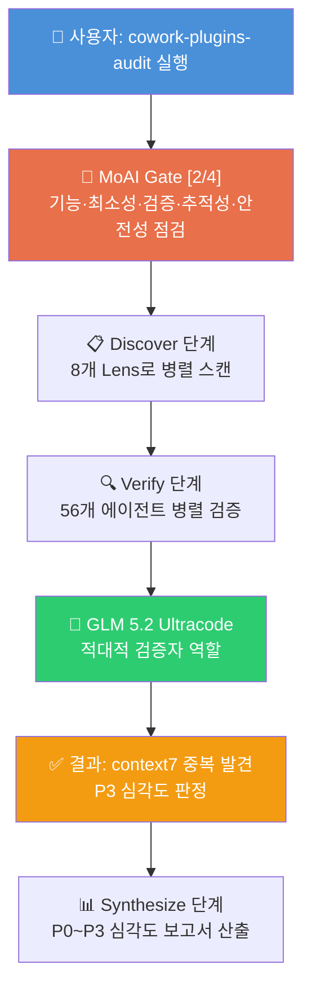
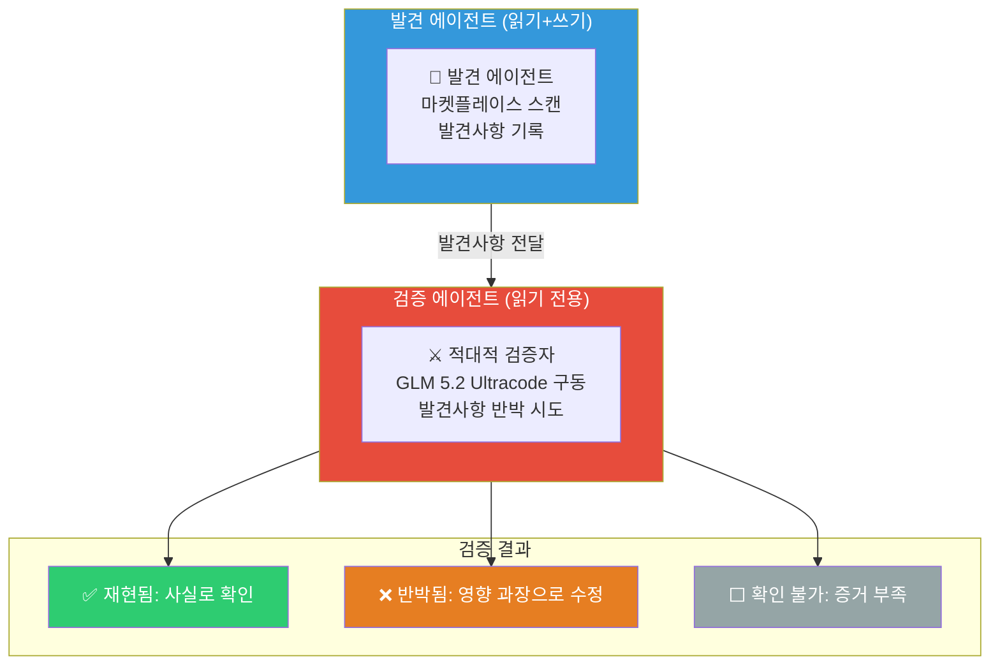
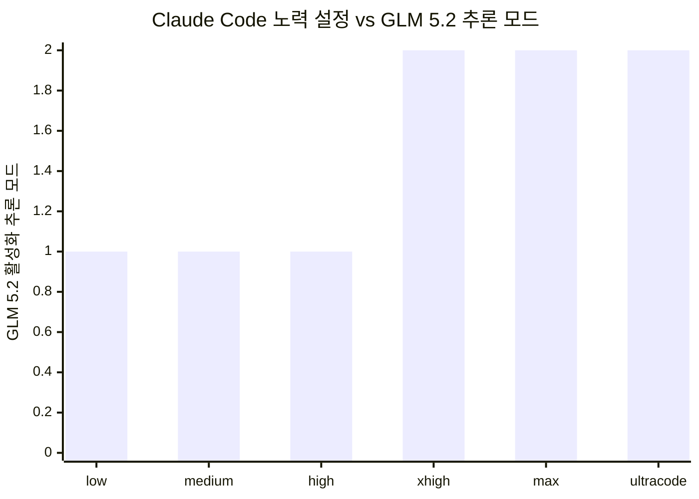
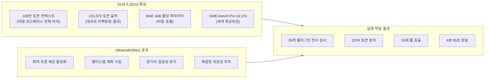
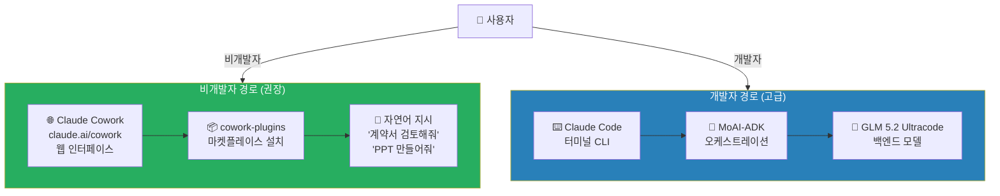
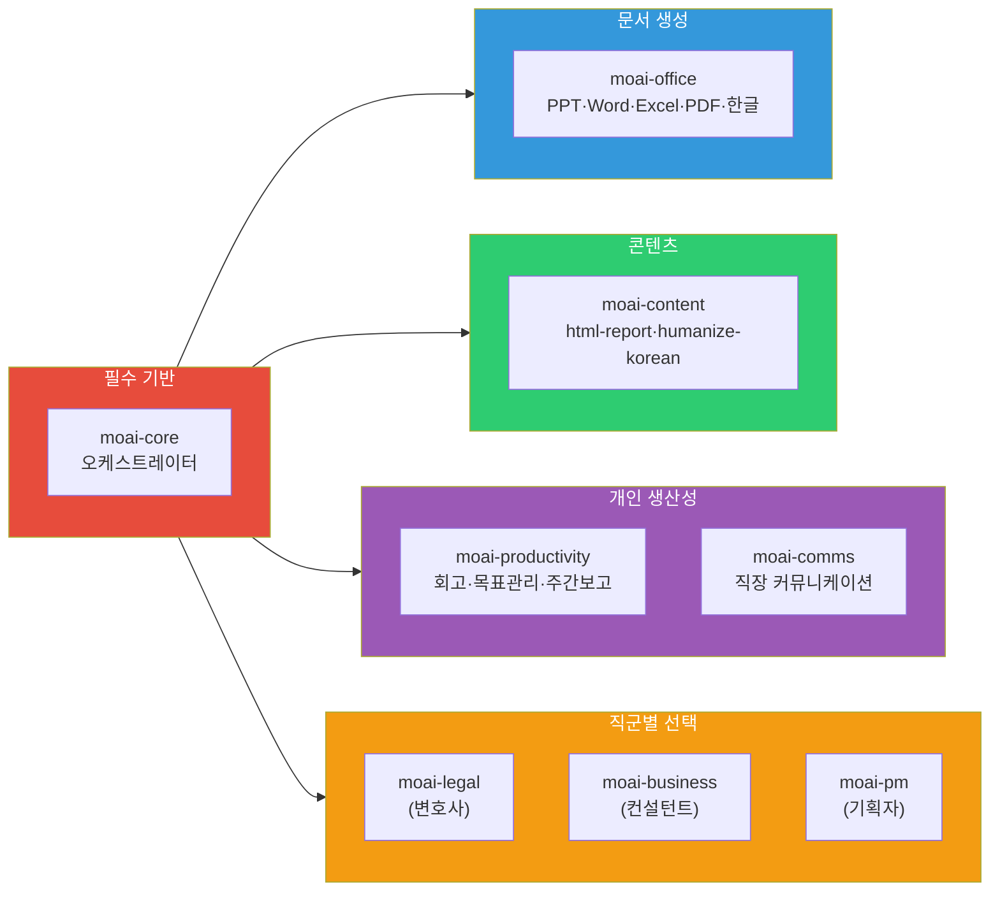
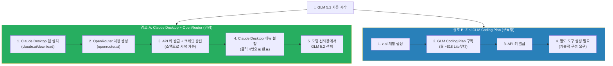
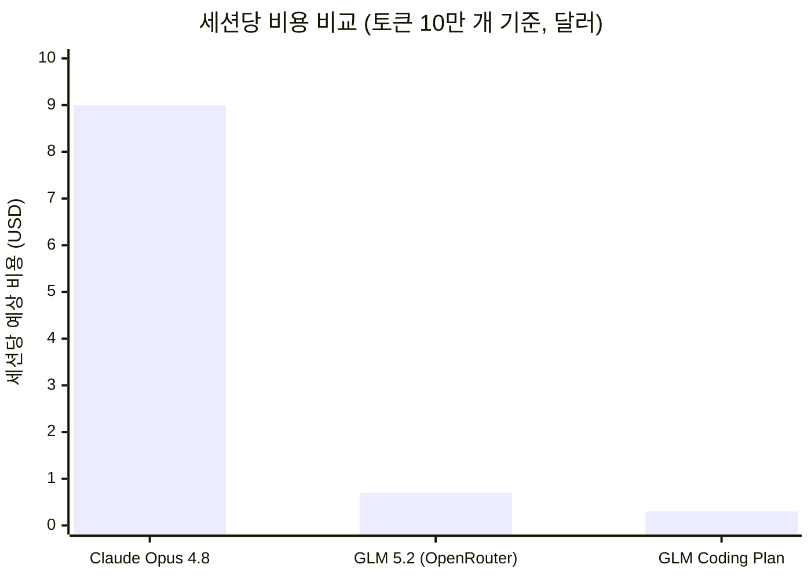
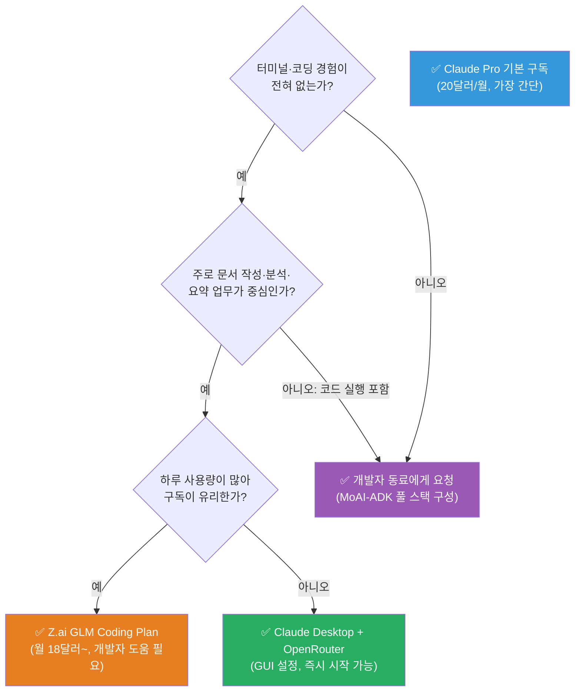

## 비개발자를 위한 완전 해설 가이드

> 작성일: 2026년 6월 24일 | 검색 기반 최신 정보 반영

## 관련글

[**GLM-5.2 × Ultracode × MoAI Gate: 멀티에이전트 병렬 감사 워크플로우**](https://k82022603.github.io/posts/glm-5.2-ultracode-moai-gate-%EB%A9%80%ED%8B%B0%EC%97%90%EC%9D%B4%EC%A0%84%ED%8A%B8-%EB%B3%91%EB%A0%AC-%EA%B0%90%EC%82%AC-%EC%9B%8C%ED%81%AC%ED%94%8C%EB%A1%9C%EC%9A%B0/)

---

## 목차

1. [한 장으로 보는 전체 그림](#1-한-장으로-보는-전체-그림)
2. [화면에서 무슨 일이 일어나고 있는가](#2-화면에서-무슨-일이-일어나고-있는가)
3. [MoAI ★ Gate 워크플로우 구조 해설](#3-moai--gate-워크플로우-구조-해설)
4. [cowork-plugins-audit 감사 절차 상세](#4-cowork-plugins-audit-감사-절차-상세)
5. [적대적 검증자 패턴: AI가 AI를 견제하는 법](#5-적대적-검증자-패턴-ai가-ai를-견제하는-법)
6. [GLM 5.2 × Ultracode 조합: 왜 천하무적인가](#6-glm-52--ultracode-조합-왜-천하무적인가)
7. [비개발자 최적 세팅 가이드: 컨설턴트·기획자·변호사](#7-비개발자-최적-세팅-가이드-컨설턴트기획자변호사)
8. [직군별 추천 플러그인 구성](#8-직군별-추천-플러그인-구성)
9. [핵심 개념 용어 정리](#9-핵심-개념-용어-정리)

---

## 1. 한 장으로 보는 전체 그림

이 문서는 세 가지 서로 연결된 주제를 다룬다. 첫째는 터미널 화면에 찍힌 MoAI Gate 워크플로우가 정확히 무엇을 하고 있는가이다. 둘째는 GLM 5.2라는 모델과 Ultracode라는 노력 수준을 조합했을 때 왜 그것이 강력한지에 대한 기술적 배경이다. 셋째는, 이 모든 이야기가 코딩을 전혀 모르는 컨설턴트·기획자·변호사 같은 직군에게는 어떤 의미를 가지며, 그들에게 어떤 세팅이 적합한가라는 실용적인 안내다.

결론부터 말하면, 화면에 보이는 장면은 Claude Cowork와 MoAI-ADK라는 오케스트레이션 프레임워크가 병렬로 여러 AI 에이전트를 동시에 실행하면서, cowork-plugins 마켓플레이스 전체를 자동으로 감사(audit)하는 장면이다. 그 감사 에이전트 중 하나가 GLM 5.2 모델을 Ultracode(최고 추론 수준)로 구동하여 MCP 설정 충돌이라는 실제 버그를 발견하고 있다.

---

## 2. 화면에서 무슨 일이 일어나고 있는가

화면은 터미널 환경에서 tmux(터미널 멀티플렉서)로 실행 중인 MoAI 오케스트레이터의 출력이다. 상단 제목줄에 `MoAI ★ Gate [2/4]`라는 표시가 보이는데, 이것은 현재 전체 4단계 게이트 중 두 번째 단계를 통과하고 있음을 의미한다. 그 아래로 `기능성 / 최소성 / 검증 / 추적성 / 안전성`이라는 다섯 가지 품질 축이 나열되어 있고, `cowork-plugins-audit`라는 이름의 워크플로우가 백그라운드에서 실행 중이다.

화면 하단부에는 `cowork-plugins-audit`의 전체 실행 현황이 표시된다. `28 plugins / 44/64 agents · 20m16s`라는 수치는 지금까지 28개 플러그인을 검사했고, 64개 에이전트 중 44개가 완료되었으며, 총 20분 16초가 경과했음을 보여준다. 왼쪽 열에는 `verify:mcp-config`, `verify:plugin-manifest`, `verify:count-sync`, `verify:agents-audit`, `verify:marketplace-infra` 등 세부 검증 항목들이 체크 표시와 함께 나열된다.

오른쪽 패널에서는 방금 완료된 `verify:mcp-config:context7-duplicate-across` 에이전트의 상세 결과가 표시된다. 이 에이전트가 사용한 모델은 `glm-5.2[1m]`이며, 137,100개의 토큰을 소비하고 16번의 툴 호출을 거쳐 4분 55초 만에 분석을 완료했다.

이 에이전트에 주어진 역할은 흥미롭다. 프롬프트 첫 줄에 `You are an ADVERSARIAL VERIFIER for a cowork-plugins marketplace audit`라고 명시되어 있다. '적대적 검증자(Adversarial Verifier)'라는 역할 부여는 단순한 확인자가 아니라, 결과를 의심하고 반박하려는 자세로 임하는 에이전트를 뜻한다.

해당 에이전트가 내린 결론(Outcome)을 보면, 검증 결과를 '부분 완료(partial)'로 처리하면서 수정된 심각도 P3를 적용했다. 발견 내용의 요지는 두 가지다. `~/.mcp.json`과 `/moai-tutor/.mcp.json`이 동일한 `context7` 서버를 중복 정의하고 있다는 사실은 파일 수준에서 확인되었다(재현됨). 그러나 해당 발견의 영향 분석은 틀렸다고 판단되었는데, 루트 플러그인(root plugin)이 존재하지 않기 때문이다. 즉 발견 자체는 사실이지만, 당초 보고된 영향의 심각성 평가는 과장이었음을 스스로 수정한 것이다.

---

## 3. MoAI ★ Gate 워크플로우 구조 해설

MoAI는 `modu-ai`라는 GitHub 조직에서 개발한 한국어 특화 Claude Code 오케스트레이션 프레임워크다. MoAI-ADK(Agent Development Kit)라는 이름으로 공개되어 있으며, 개발자용 고급 코딩 워크플로우(MoAI-ADK)와 비개발자·업무 자동화용 Claude Cowork 플러그인(cowork-plugins) 두 축으로 나뉜다.

`Gate`라는 개념은 품질 관문을 뜻한다. 어떤 작업을 수행하기 전 또는 결과물을 출력하기 전에, 미리 정의된 품질 기준을 통과해야만 다음 단계로 넘어갈 수 있다는 설계 철학이다. 화면의 게이트 2는 다섯 가지 기준을 검사한다.

기능성(Functionality)은 플러그인이 선언한 기능을 실제로 수행하는지 확인한다. 최소성(Minimality)은 불필요하게 과도한 기능이나 설정이 포함되지 않았는지를 본다. 검증(Verification)은 각 구성 요소가 서로 일관되게 연결되어 있는지 따진다. 추적성(Traceability)은 변경 이력과 출처가 명확한지 점검한다. 안전성(Safety)은 보안 관점에서 위험한 설정이 없는지 살핀다.

이 다섯 가지 기준을 동시에, 그것도 64개의 독립적인 에이전트가 병렬로 검사하는 것이 이 워크플로우의 핵심 특징이다.

```mermaid
flowchart LR
    subgraph GATE ["⚙️ MoAI Gate 품질 기준"]
        G1["✅ 기능성\nFunctionality"]
        G2["📏 최소성\nMinimality"]
        G3["🔍 검증\nVerification"]
        G4["🔗 추적성\nTraceability"]
        G5["🛡️ 안전성\nSafety"]
    end

    subgraph DISCOVER ["1️⃣ Discover 단계"]
        D1["marketplace 인프라"]
        D2["plugin.json 매니페스트"]
        D3["178개 스킬 전수"]
        D4["agents 목록"]
        D5[".mcp.json 점검"]
        D6["문서 링크 검사"]
        D7["숫자 카운트 무결성"]
        D8["빌드/검증 스크립트"]
    end

    subgraph VERIFY ["2️⃣ Verify 단계 (56개 에이전트)"]
        V1["mcp-config 검증"]
        V2["plugin-manifest 검증"]
        V3["count-sync 검증"]
        V4["agents-audit 검증"]
        V5["marketplace-infra 검증"]
    end

    subgraph SYNTH ["3️⃣ Synthesize 단계"]
        S1["P0 긴급"]
        S2["P1 높음"]
        S3["P2 중간"]
        S4["P3 낮음"]
    end

    GATE --> DISCOVER
    DISCOVER --> VERIFY
    VERIFY --> SYNTH
```

워크플로우가 3단계로 구성된다는 점은 화면 설명에서도 명시된다. Discover 단계에서는 8개 렌즈(Lens)를 사용해 마켓플레이스 전체를 스캔한다. 여기서 렌즈란 특정 관점으로 데이터를 바라보는 분석 모듈을 의미한다. marketplace 인프라, plugin.json 매니페스트, 178개의 전체 스킬, 에이전트 목록, MCP 설정 파일, 문서 링크, 숫자 카운트 무결성, 빌드 및 검증 스크립트가 각각의 렌즈다.

Verify 단계에서는 각 발견사항에 대해 독립 에이전트가 반박 시도를 한다. 이 단계의 핵심 설계 원칙은 `의도된 상태(deprecated stub 등)와 실제 결함을 구분`하는 것이다. 단순히 이상해 보이는 것을 모두 버그로 신고하는 것이 아니라, 의도적으로 그렇게 설계된 것인지를 먼저 따지는 수준 높은 검증이다.

Synthesize 단계에서는 P0(긴급)부터 P3(낮음)까지 4단계 심각도로 분류된 한국어 감사 보고서를 산출한다.

---

## 4. cowork-plugins-audit 감사 절차 상세

`cowork-plugins`는 Claude Cowork 플랫폼에서 사용할 수 있는 한국어 특화 도메인 전문가 플러그인 마켓플레이스다. 현재 v2.17.0 기준으로 27개 플러그인, 173개 스킬, 14개 코디네이터 서브에이전트, 9개 번들 MCP 서버로 구성되어 있다.

이렇게 복잡한 생태계가 성장할수록, 내부적으로 설정 파일이 충돌하거나 숫자가 맞지 않거나 링크가 깨지는 문제가 발생하기 쉽다. cowork-plugins-audit은 이런 문제들을 자동으로 탐지하기 위해 설계된 전용 감사 워크플로우다.

화면에서 확인할 수 있는 감사 항목들을 분류하면 다음과 같다.

**MCP 설정 검증(mcp-config)** 항목들은 각 플러그인의 `.mcp.json` 파일이 올바르게 구성되어 있는지 확인한다. 화면에는 `context7`, `elevenlabs`, `moai-ads`, `korean`, `fal-ai`, `facebook` 등 다양한 MCP 서버 설정을 개별적으로 검증하는 에이전트들이 보인다.

**플러그인 매니페스트 검증(plugin-manifest)** 항목들은 `marketplace.json`의 내용이 실제 파일 구조와 일치하는지 확인한다. 플러그인 이름, 스킬 수, 설명 등이 선언과 일치하는지를 본다.

**숫자 일치 검증(count-sync)** 항목들은 README에 표시된 플러그인 수, 스킬 수, 동기화 지점 수가 실제 파일 수와 정확히 일치하는지 확인한다. 마켓플레이스, README, 각 플러그인 폴더를 모두 비교한다.

**에이전트 감사(agents-audit)** 항목들은 코디네이터 에이전트 파일들이 유효한 형식을 갖추고 있는지, 참조된 스킬이 실제로 존재하는지 확인한다.

**마켓플레이스 인프라 검증(marketplace-infra)** 항목들은 전체 플러그인 생태계의 기반 구조가 건전한지 종합 점검한다.

이번 감사에서 실제로 발견된 사항은 `context7` MCP 서버가 루트 설정 파일(`~/.mcp.json`)과 특정 플러그인 설정 파일(`/moai-tutor/.mcp.json`) 양쪽에 동시에 정의되어 있다는 중복 문제다. 두 파일 모두 `@upstash/context7-mcp@latest`를 `alwaysLoad: true`, `staggeredStartup` 설정으로 동일하게 정의했고, 차이는 `$comment` 텍스트뿐이었다. 이는 실제로 존재하는 중복이지만, 루트 플러그인이 없어 실제 영향이 제한적이므로 P3 심각도로 하향 조정된 것이다.

---

## 5. 적대적 검증자 패턴: AI가 AI를 견제하는 법

이 워크플로우에서 가장 주목할 만한 설계 원칙은 적대적 검증자(Adversarial Verifier) 패턴이다. 이것을 이해하려면 먼저 AI가 자기 자신의 결과물을 검토할 때 어떤 문제가 생기는지 알아야 한다.

하나의 AI에게 무언가를 분석하게 하고, 같은 AI에게 그 결과를 검토하게 하면 AI는 자신의 출력을 좋게 평가하는 경향이 있다. 이것을 "AI는 자기 자신의 작업을 승인한다"는 실패 패턴이라고 부른다. 화면의 코멘트에도 이를 직접 언급한다. "The critic can't fix files (read-only), so it has no incentive to downplay issues. The fixer can't approve itself (the critic re-audits). This prevents the common failure of Claude saying 'looks good' about its own work."

이 문제를 해결하기 위해, 적대적 검증자 패턴은 역할을 완전히 분리한다.

발견 에이전트는 마켓플레이스를 스캔하고 이상한 점을 기록한다. 검증 에이전트는 그 결과를 받아 반박하려고 시도한다. 검증 에이전트는 읽기 전용으로 실행되어 발견 결과를 수정할 수 없고, 오직 동의하거나 반박할 수만 있다. 그리고 반박하는 입장에서 임하도록 시스템 프롬프트가 구성된다.

이번 화면에서 실제로 작동한 결과를 보면 패턴이 명확하다. 발견 에이전트가 "context7 서버가 두 곳에 정의되어 있다. 이것은 루트 플러그인 설정 충돌로 심각한 문제다"라는 보고를 했다. 검증 에이전트(GLM 5.2 Ultracode)는 실제로 두 곳에 정의된 것은 사실이지만, 루트 플러그인이 존재하지 않으므로 심각성 평가는 틀렸다고 반박했다. 결과적으로 심각도가 상향 조정되지 않고 오히려 P3로 확정되었다. 이것이 바로 적대적 검증자 패턴이 노이즈를 줄이고 실제 위험만 정확하게 식별하는 방식이다.

---

## 6. GLM 5.2 × Ultracode 조합: 왜 천하무적인가

이제 Facebook 게시물의 핵심 주장인 "GLM 5.2 × Ultracode 조합은 천하무적 같다"는 평가의 배경을 살펴보자.

### GLM 5.2가 무엇인가

GLM 5.2는 중국 AI 연구소 Z.ai(智谱 AI, Zhipu AI)가 2026년 6월 13일 출시한 플래그십 코딩 모델이다. GLM 5의 아키텍처를 기반으로 하며, 실제 파라미터는 7,440억 개의 혼합전문가(Mixture-of-Experts, MoE) 구조지만 한 번에 활성화되는 파라미터는 400억 개에 불과하다. 이 설계 덕분에 거대 모델임에도 불구하고 추론 속도와 비용이 훨씬 효율적이다.

핵심 개선 사항은 두 가지다. 첫째, 이전 버전의 약 20만 토큰 컨텍스트에서 100만 토큰 컨텍스트(`glm-5.2[1m]` 식별자 사용)로 5배 확장되었다. 100만 토큰이면 약 250만 한국어 글자, 혹은 수천 페이지 분량의 문서를 한 번에 처리할 수 있다. 둘째, 추론 노력 수준이 High와 Max 두 단계로 명시적으로 구분되어 사용자가 선택할 수 있다.

출시 당시 Z.ai는 공식 벤치마크를 제공하지 않았으나, 이후 독립적인 테스트에서 SWE-bench Pro 62.1%, Terminal-Bench 2.1 81.0%를 기록했다. 이 수치는 Claude Opus 4.8 및 GPT-5.5와 동등한 수준으로, 세계 최고 수준의 코딩 모델 군에 포함된다.

GLM 5.2는 Z.ai의 GLM Coding Plan 구독 서비스(월 약 18달러~)에 포함되어 있으며, MIT 오픈소스 라이선스로 가중치도 공개할 예정이다. 즉 실력은 최상급이면서 비용은 Claude Opus 4.8 대비 5분의 1 이하다.

### Ultracode가 무엇인가

Ultracode는 Claude Code 내에서 사용하는 `/effort` 명령어의 최고 수준 설정이다. Claude Code에서 GLM 5.2를 백엔드 모델로 사용할 때, 노력 수준(effort level)을 어떻게 설정하느냐에 따라 GLM 5.2 내부에서 활성화되는 추론 깊이가 달라진다.

구체적으로는, `low`, `medium`, `high` 세 가지 노력 설정은 모두 GLM 5.2의 High 추론 모드에 매핑된다. 반면 `xhigh`, `max`, `ultracode` 세 가지 설정은 GLM 5.2의 Max 추론 모드를 활성화한다. Z.ai가 명시적으로 권장하는 것은, 복잡한 멀티스텝 코딩 작업에서는 반드시 Max 노력 수준을 사용하라는 것이다.

Ultracode는 Claude Code의 노력 설정 중 최고 단계로, 이것을 선택하면 GLM 5.2가 더 깊은 추론 체인을 가동한다. 단순한 설정 변경이지만, 결과의 정확도와 완성도가 눈에 띄게 달라진다.

### 조합이 강력한 이유

이 두 가지를 조합하면 다음과 같은 시너지가 발생한다.

화면에서 확인할 수 있듯, 이 에이전트는 4분 55초 동안 137,100 토큰을 처리했다. 이 토큰 수는 약 10만 한국어 단어에 해당하는 분량으로, 사람이 읽으면 수십 시간이 걸릴 분량을 단 5분 안에 분석하고 논리적인 결론을 도출했다. "토큰 다 씹어 먹으면서 빠짐없이 분석 후 병렬 동시 처리"라는 표현이 이 상황을 정확하게 묘사한다.

비용 측면에서도 중요한 의미가 있다. Claude Opus 4.8이나 GPT-5.5 같은 최상위 모델로 동일한 작업을 수행하면 비용이 수십 배 높아질 수 있다. GLM 5.2는 GLM Coding Plan에 포함된 할당량 내에서 이러한 대규모 작업을 실행할 수 있어, 성능 대비 비용 효율이 탁월하다.

---

## 7. 비개발자 최적 세팅 가이드: 컨설턴트·기획자·변호사

이제 가장 실용적인 부분이다. 앞서 살펴본 화면은 개발자가 CLI(터미널 명령줄)에서 직접 실행한 장면이다. 코딩을 모르는 컨설턴트, 기획자, 변호사 등이 이 생태계에서 실용적으로 활용할 수 있는 경로는 무엇인가?

### 접근 경로의 분리

비개발자가 사용할 수 있는 Claude 생태계 경로는 두 가지로 나뉜다.

첫 번째는 **Claude Cowork** 경로다. Claude 공식 웹사이트(claude.ai)에서 접근할 수 있는 에이전틱 워크스페이스 환경으로, 터미널 없이 웹 인터페이스에서 플러그인을 설치하고 자연어로 지시만 하면 된다. cowork-plugins는 바로 이 Cowork 환경에서 사용하도록 설계되었다.

두 번째는 **Claude Code(터미널)** 경로다. 화면에 보이는 것처럼 터미널에서 직접 실행하는 방식으로, MoAI-ADK와 같은 고급 오케스트레이션 프레임워크를 활용한다. 이 경로는 개발자에게 적합하며, 비개발자에게는 권장되지 않는다.

### 비개발자를 위한 구체적인 세팅

**1단계: Claude 구독 선택**

Claude Pro(월 20달러) 요금제를 선택한다. 이 요금제에는 Claude Code(Cowork), Claude Design, 그리고 웹 검색 기능이 포함된다. 하루에 많은 양의 작업을 처리한다면 Max 5x 요금제(월 100달러)를 고려하되, 대부분의 비개발자 업무량에서는 Pro로 충분하다.

**2단계: Claude Cowork 접속 및 플러그인 설치**

`claude.ai`에 접속 후 Claude Cowork로 이동한다. 좌측 사이드바의 '사용자 지정(Customize)'을 클릭하고, '개인 플러그인' 영역에서 '+' 버튼을 누른다. '마켓플레이스 추가'를 선택하고 `modu-ai/cowork-plugins`를 입력해 동기화한다.

동기화 완료 후 목록에서 반드시 `moai-core`를 먼저 설치한다. 이것이 모든 자연어 요청을 알맞은 스킬로 라우팅하는 오케스트레이터 역할을 하기 때문이다.

**3단계: 프로젝트별 초기화**

Cowork에서 새 프로젝트를 생성하고, 채팅창에 `/project init`을 입력한다. 그러면 AI가 소크라테스식 인터뷰를 시작해 사용자의 역할, 주로 사용할 플러그인, 업무 스타일을 파악하고 자동으로 CLAUDE.md(프로젝트 맞춤 설정 파일)를 생성한다. 이후에는 "계약서 검토해줘", "사업계획서 써줘", "PPT 만들어줘"처럼 자연어로 지시하면 된다.

**4단계: 모델 선택 전략 (선택 사항)**

기본적으로 Cowork는 Claude 모델을 사용한다. 대용량 분석 작업을 더 저렴하게 처리하고 싶다면, GLM Coding Plan을 별도로 구독해 백엔드 모델로 GLM 5.2를 활용하는 방법도 있다. 단, 이 설정은 약간의 기술적 설정이 필요하므로 처음에는 Claude 기본 모델로 시작하는 것을 권장한다.

---

## 8. 직군별 추천 플러그인 구성

cowork-plugins는 27개 플러그인, 173개 스킬로 구성되며, 직군에 따라 필요한 플러그인이 다르다. 각 직군별로 핵심 플러그인과 사용 예시를 정리한다.

### 컨설턴트 세팅

전략 컨설턴트, 경영 컨설턴트에게는 분석과 문서 산출이 핵심이다.

| 플러그인 | 주요 스킬 | 활용 사례 |
|---------|----------|---------|
| moai-core | 오케스트레이터, AI 슬롭 검수 | 모든 산출물의 품질 관문 |
| moai-business | strategy-planner, consulting-brief | McKinsey/BCG 표준 인게이지먼트 브리프 자동 작성 |
| moai-business | market-analyst | TAM/SAM/SOM 시장 조사, 경쟁사 분석 |
| moai-bi | executive-summary | C레벨 의사결정용 1페이지 보고서 |
| moai-office | pptx-designer, docx-generator | 발표용 PPT, 제안서 Word 문서 자동 생성 |
| moai-data | data-explorer, data-visualizer | 엑셀 데이터 분석, 차트 자동 생성 |
| moai-research | paper-search | 선행 연구 탐색, 리서치 보고서 |

**사용 예시**: "A 기업의 디지털 전환 컨설팅 프로젝트를 위한 인게이지먼트 브리프를 작성해줘. 목표는 3년 내 수익 15% 향상이고, 범위는 공급망과 마케팅 두 영역이야."

### 기획자 세팅

제품 기획자, 마케팅 기획자, 사업 기획자 등 기획 직군에는 다양한 산출물 생성 능력이 요구된다.

| 플러그인 | 주요 스킬 | 활용 사례 |
|---------|----------|---------|
| moai-core | 프로젝트 초기화 | 프로젝트 맞춤 CLAUDE.md 자동 생성 |
| moai-pm | weekly-report | 한국 WBR 6섹션 주간보고서 자동화 |
| moai-product | spec-writer, roadmap-manager | PRD 작성, 제품 로드맵 관리 |
| moai-marketing | campaign-planner, brand-identity | 마케팅 캠페인 기획, 브랜드 전략 |
| moai-content | card-news, html-report | 카드뉴스 제작, HTML 보고서 생성 |
| moai-office | pptx-designer, xlsx-creator | 기획 PPT, 일정·예산 엑셀 |
| moai-productivity | 목표관리, 회고 | OKR 설정, KPT 회고 자동화 |

**사용 예시**: "다음 주 월요일 임원 보고를 위한 주간보고서 작성해줘. 이번 주에는 신제품 출시 준비가 주요 이슈였고, 출시일은 2주 후야."

### 변호사·법무 담당자 세팅

법률 전문가에게는 정확성과 법령 연계가 핵심이다.

| 플러그인 | 주요 스킬 | 활용 사례 |
|---------|----------|---------|
| moai-core | 오케스트레이터 | 법률 용어를 정확히 이해하고 라우팅 |
| moai-legal | contract-review | 계약서 위험 조항 검토 (민법/상법 기반) |
| moai-legal | compliance-check | 개인정보보호법, ESG 컴플라이언스 점검 |
| moai-legal | nda-triage | NDA 초안 작성 및 검토 |
| moai-legal | iros-registry-automation | 법인·부동산 등기부등본 일괄 발급 보조 |
| moai-finance | tax-helper, financial-statements | 세금 계산, K-IFRS 재무제표 분석 |
| moai-office | docx-generator, hwpx-writer | 법률 문서 Word/한글(HWPX) 생성 |

> 중요 안내: moai-legal의 계약서 검토와 법적 리스크 분석은 실무 보조 도구로 활용해야 하며, 최종 법률 판단은 반드시 전문 변호사가 해야 한다. 이 플러그인은 초안 작성과 주요 쟁점 식별을 빠르게 하는 데 특히 유용하다.

**사용 예시**: "다음 용역계약서를 검토해서 위험 조항을 찾아줘. 특히 지식재산권 귀속과 손해배상 조항에 집중해줘."

### 비개발자 공통 추천 기본 구성

직군에 무관하게 모든 비개발자에게 권장하는 기본 플러그인 세트가 있다.

특히 `moai-content:humanize-korean` 스킬은 비개발자에게 매우 유용하다. AI가 생성한 한국어 텍스트에서 흔히 나타나는 인공적인 패턴(번역투, 지나친 공손함, AI 관용구 등)을 자동으로 수정해 자연스러운 한국어로 다듬어준다. 모든 텍스트 산출물의 마지막 단계에서 `moai-core:ai-slop-reviewer`와 함께 체이닝해 사용하면 품질이 크게 향상된다.

### GLM 5.2를 비개발자가 활용하는 현실적인 방법

개발자 경로 없이 GLM 5.2의 혜택을 누릴 수 있는 방법이 있다. Claude Cowork 설정에서 API 게이트웨이나 OpenRouter를 통해 GLM 5.2를 백엔드 모델로 연결하는 방법이 일부 구현되어 있다. 단, 이 설정은 아직 기술적인 구성이 필요하다.

현실적으로 비개발자에게 추천하는 전략은 이렇다. 일상적인 문서 작성, 분석, 기획 업무에는 Claude Pro 기본 구독(월 20달러)으로 충분히 처리하고, 대용량 데이터 분석이나 장문의 문서 처리가 필요할 때만 GLM 5.2 Coding Plan을 보조적으로 활용하는 방식이다. 실력 있는 개발자 동료나 파트너가 있다면, 위 화면과 같은 고급 워크플로우를 설계해줄 것을 요청하고 비개발자는 그 결과물을 활용하는 협업 구조가 가장 현실적이다.

---

## 9. 핵심 개념 용어 정리

이 문서에서 등장한 주요 개념들을 정리한다.

| 용어 | 영문 | 설명 |
|-----|------|------|
| 에이전트 | Agent | 특정 목표를 달성하기 위해 자율적으로 행동하는 AI 프로그램 단위 |
| MCP | Model Context Protocol | AI 모델이 외부 서비스·데이터에 접근하기 위한 표준 프로토콜 |
| 오케스트레이터 | Orchestrator | 여러 에이전트를 조율하고 순서를 제어하는 상위 에이전트 |
| 병렬 처리 | Parallel Processing | 여러 작업을 동시에 실행하는 방식 |
| 적대적 검증 | Adversarial Verification | 결과를 반박하려는 자세로 임하는 독립적 검증 방식 |
| 컨텍스트 윈도우 | Context Window | AI가 한 번에 처리할 수 있는 텍스트의 최대 길이 |
| MoE | Mixture of Experts | 수천억 개 파라미터 중 일부만 선택적으로 활성화하는 모델 구조 |
| Ultracode | Ultracode | Claude Code에서 GLM 5.2의 Max 추론 모드를 활성화하는 노력 수준 설정 |
| AI 슬롭 | AI Slop | AI가 생성한 텍스트에서 자주 나타나는 인공적이고 틀에 박힌 패턴 |
| 심각도 P0~P3 | Priority 0~3 | 발견된 문제의 영향 범위와 긴급성에 따른 4단계 분류 |
| 스킬 | Skill | Claude Cowork에서 특정 작업을 수행하는 방법을 담은 설정 파일 |
| 플러그인 | Plugin | 여러 스킬을 하나의 도메인으로 묶은 패키지 |
| tmux | tmux | 터미널 화면을 여러 창으로 분할해 동시에 볼 수 있는 도구 |
| GLM Coding Plan | GLM Coding Plan | Z.ai의 GLM 5.2 모델을 구독 방식으로 사용하는 유료 서비스 |

---

## 마치며

이 화면이 보여주는 것은 단순한 AI 채팅이 아니다. AI 에이전트들이 서로를 감시하고 견제하면서 자율적으로 품질을 관리하는 시스템의 실제 작동 장면이다. GLM 5.2를 Ultracode 수준으로 구동한 적대적 검증자가 137,000 토큰 분량의 마켓플레이스 전체를 4분 55초 안에 분석하고, 이전에 발견된 보고의 오류를 스스로 수정하는 과정이 담겨 있다.

비개발자에게는 이 복잡한 파이프라인의 내부보다, Claude Cowork와 cowork-plugins를 통해 접근할 수 있는 도메인 전문 스킬들이 더 실용적인 가치를 지닌다. 컨설턴트는 McKinsey 수준의 인게이지먼트 브리프를, 변호사는 계약서 위험 조항 탐지를, 기획자는 WBR 주간보고서 자동화를 자연어 한 줄로 얻을 수 있다. 이 모든 산출물은 AI 슬롭 검수와 한국어 윤문 체이닝을 거쳐 자연스러운 완성도로 제공된다.

기술 스택이 빠르게 진화하는 지금, 개발자가 아닌 직군에게 중요한 것은 코드를 배우는 것이 아니라 이러한 도구들을 얼마나 전략적으로 선택하고 조합하느냐다.

---

*본 문서의 정보는 2026년 6월 24일 기준이며, 검색을 통해 확인된 공식 출처(GitHub modu-ai/cowork-plugins, Z.ai 공식 발표, DigitalApplied, DataCamp, MarkTechPost)를 바탕으로 작성되었습니다. Facebook 원문 URL은 robots.txt 정책으로 내용 접근이 차단되어, 게시물에 포함된 인용 텍스트와 첨부 화면을 기준으로 분석했습니다.*

---

## 별첨. 비개발자가 GLM 5.2를 사용하는 실제 방법

> 이 별첨은 터미널(CLI)을 전혀 사용하지 않고, 비개발자가 GLM 5.2의 강력한 추론 능력을 활용할 수 있는 구체적이고 검증된 방법을 다룬다.

### 왜 이것이 중요한가

본문에서 GLM 5.2 × Ultracode 조합이 강력하다고 설명했지만, 그 설정법은 환경 변수를 터미널에서 직접 입력하는 방식으로 개발자 전용처럼 보인다. 그러나 실제로는 Claude Desktop 앱이 공식적으로 지원하는 **게이트웨이 모드**를 통해, 메뉴 클릭만으로 GLM 5.2를 포함한 500개 이상의 AI 모델을 Claude 인터페이스에서 그대로 사용할 수 있다. 이 기능은 OpenRouter 공식 문서에 명시된 공식 지원 방법이다.

### 두 가지 경로 비교

비개발자가 선택할 수 있는 경로는 크게 두 가지다.

경로 A(Claude Desktop + OpenRouter)가 비개발자에게 더 적합한 이유는 UI 기반 클릭 설정이기 때문이다. 경로 B(Z.ai 직접 구독)는 더 많은 양을 처리할 때 단가가 낮을 수 있지만, 도구 연결에 기술적 구성이 필요하다.

### 경로 A: Claude Desktop + OpenRouter 단계별 설정

이 방법은 OpenRouter 공식 문서에 명시된 절차로, 코드나 터미널 없이 완료된다.

**사전 준비 (5분)**

먼저 `claude.ai/download`에서 Claude Desktop 앱을 내려받아 설치한다. 이미 설치되어 있다면 건너뛴다. 다음으로 `openrouter.ai`에서 계정을 생성한다. 이메일 인증만 하면 된다. 계정 생성 후 `openrouter.ai/keys`에서 API 키를 발급받는다. 키는 `sk-or-v1-...` 형태로, 생성 직후 한 번만 표시되므로 어딘가에 복사해둔다. 마지막으로 `openrouter.ai/credits`에서 소액의 크레딧을 충전한다. GLM 5.2는 토큰당 비용이 매우 저렴하므로 $5~10 정도로 충분히 테스트할 수 있다.

**Claude Desktop 게이트웨이 설정 (2분)**

Claude Desktop 앱을 실행한다. Anthropic 계정으로 로그인할 필요 없다. 상단 메뉴바에서 **Help → Troubleshooting** 을 클릭하고, **Enable Developer Mode**를 선택한다. 그러면 메뉴바에 **Developer** 항목이 새로 생긴다.

이제 **Developer → Configure Third-Party Inference…** 를 클릭한다. 팝업 설정 패널이 열리면 백엔드를 **Gateway (Anthropic-compatible)** 로 선택하고, 아래 세 가지 값을 입력한다.

| 설정 항목 | 입력값 |
|----------|--------|
| Gateway base URL | `https://openrouter.ai/api` |
| Gateway API key | 발급받은 OpenRouter 키 (`sk-or-v1-...`) |
| Gateway auth scheme | `bearer` |

**Apply locally**를 클릭해 저장한 다음, Claude Desktop을 완전히 종료하고 다시 실행한다. 시작 화면에 **"Continue with Gateway"** (또는 "Local configuration") 버튼이 표시되면 이것을 클릭한다.

**GLM 5.2 모델 선택**

앱이 열리면 모델 선택 창에 OpenRouter를 통해 사용 가능한 모델 목록이 표시된다. 여기서 `GLM` 또는 `Zhipu`를 검색해 GLM 5.2를 선택한다. 이후부터는 기존 Claude 채팅과 동일하게 사용하면 된다.

### 비용 구조 비교

GLM 5.2를 OpenRouter를 통해 사용할 때의 비용 효율은 다음과 같다.

| 모델 | 입력 1M 토큰 비용 | 출력 1M 토큰 비용 | 특징 |
|-----|----------------|----------------|------|
| Claude Fable 5 | $10.00 | $30.00 | 최고 성능 (수출 제한 상태) |
| Claude Opus 4.8 | $15.00 | $75.00 | 현재 최상위 일반 접근 모델 |
| GLM 5.2 (OpenRouter) | $1.40 | $5.60 | Claude 대비 약 7~14배 저렴 |
| GLM 5.2 (Z.ai 직접) | 구독 플랜 내 포함 | 구독 플랜 내 포함 | 대용량 사용시 유리 |

일반적인 업무 세션(문서 분석, 계약서 검토, 기획서 작성 등)에서 보통 50,000~200,000 토큰이 소비된다. Claude Opus 기준으로는 세션당 $1~15이지만, GLM 5.2 기준으로는 $0.20~2.00 수준이다.

### 사용 시 주의사항

**모델 호환성**: OpenRouter를 통한 Claude Desktop 연결은 GLM 5.2 등 비Anthropic 모델을 사용할 수 있게 해주지만, Cowork 기능(코드 실행, 파일 접근, 자동화)은 Anthropic 자체 모델과 함께 사용할 때 최대 호환성을 보장한다. OpenRouter 공식 문서도 "최대 호환성을 위해 Anthropic 1P 프로바이더를 최우선 순위로 설정하라"고 권장한다.

**Cowork의 WebFetch 제한**: Claude Desktop을 게이트웨이 모드로 사용할 때, Cowork 기능 내에서 WebFetch 도구가 일부 외부 사이트에 접근하지 못하는 현상이 발생할 수 있다. Cowork는 샌드박스 환경에서 툴 트래픽을 기본적으로 제한하기 때문이다. 이 경우 **Developer → Configure Third-Party Inference → Sandbox & workspace 탭**에서 필요한 호스트를 허용 목록에 추가하면 해결된다.

**프라이버시**: OpenRouter는 기본 설정에서 사용자 프롬프트를 기록하지 않는다. 다만 OpenRouter 계정 설정에서 직접 프롬프트 로깅을 활성화한 경우는 예외다.

**GLM 5.2 Ultracode 설정 여부**: Claude Desktop 게이트웨이 모드에서는 `/effort ultracode` 같은 Claude Code 전용 명령어를 사용할 수 없다. Ultracode(Max 추론 모드)는 Claude Code CLI 환경에서만 작동한다. 따라서 Claude Desktop + OpenRouter 방법은 GLM 5.2의 기본 추론 능력을 활용하는 방식이며, Max 추론 모드까지 원한다면 개발자 경로가 필요하다. 그러나 일상적인 문서 분석·작성·요약 업무에는 GLM 5.2의 기본 High 추론 모드도 충분히 강력하다.

### 경로 선택 판단 기준

결론적으로, 터미널을 전혀 모르는 비개발자가 GLM 5.2를 활용하는 가장 현실적인 경로는 Claude Desktop의 게이트웨이 모드와 OpenRouter 조합이다. 메뉴 클릭 4번과 값 세 줄 입력으로 설정이 완료되며, 이후 사용법은 기존 Claude 채팅과 완전히 동일하다. 비용은 Claude Opus 대비 약 7~14배 저렴하고, 처리 가능한 컨텍스트 양은 100만 토큰으로 훨씬 넓다. 단, Ultracode(Max 추론 모드)는 이 경로에서는 작동하지 않으며, 일반 고성능 추론 모드로 동작한다는 점은 감안해야 한다.

---

*별첨 정보 출처: OpenRouter 공식 문서(openrouter.ai/docs), MindStudio 블로그, Anthropic Claude Code 공식 문서(code.claude.com)*
