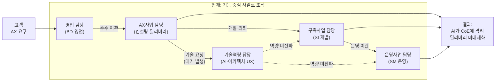
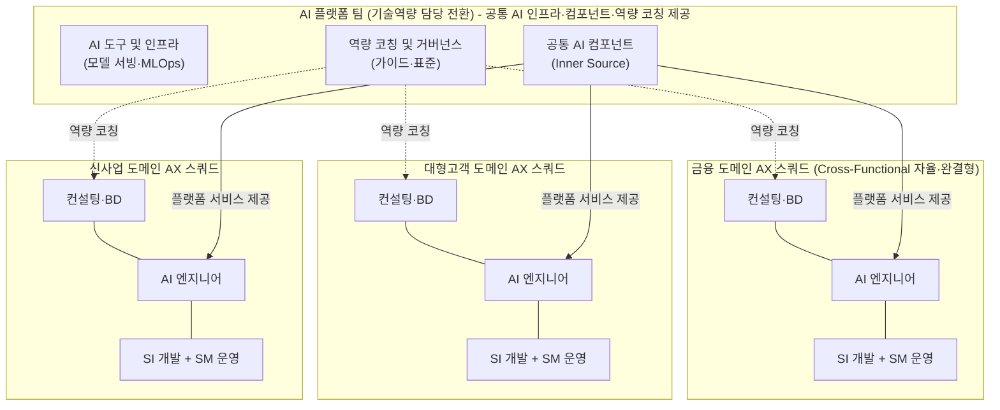
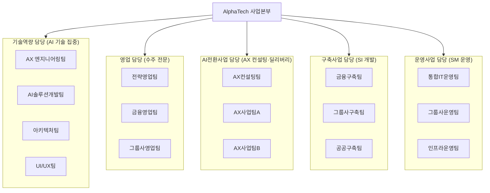
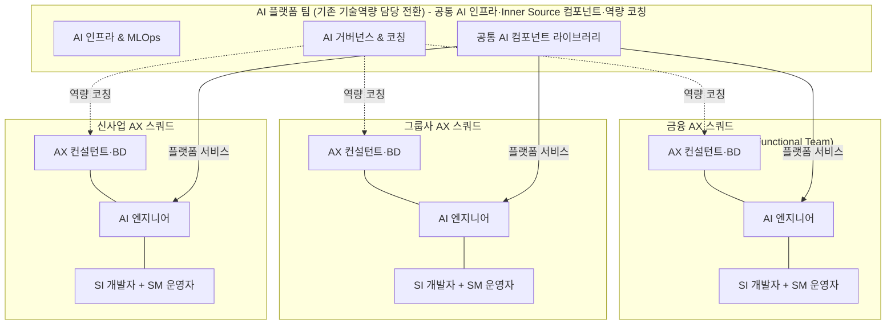
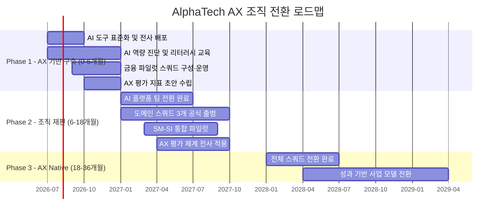
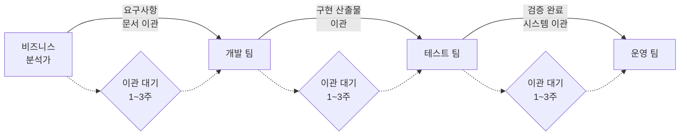
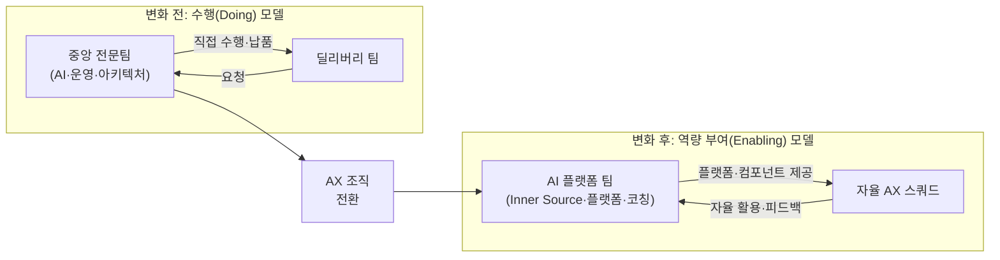
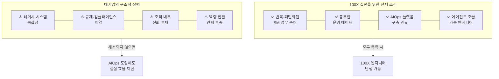

## — 조직 재설계, 일하는 방식의 전환, 그리고 최종 도달점 분석

> 기능 중심 사일로 조직에서 도메인 중심 자율 스쿼드로,  
> AI 도구 도입에서 AI 내재화 조직으로의 근본적 전환 가이드

---

## 목차

1. [AX란 무엇인가 — 도구 도입이 아닌 조직 재편](#1-ax란-무엇인가)
2. [SM·SI 사업 구조의 특수성 — 왜 AX가 더 어려운가](#2-smsi-사업-구조의-특수성)
3. [기능 중심 조직의 구조적 한계 — 콘웨이의 법칙](#3-기능-중심-조직의-구조적-한계)
4. [일하는 방식의 전환 — 구체적 방법론](#4-일하는-방식의-전환)
5. [조직 재설계 — 역콘웨이 전략과 Team Topologies](#5-조직-재설계)
6. [최종 도달점 — 기대 효과와 현실적 리스크 분석](#6-최종-도달점)
- [별첨 1: 가상 대형 SI·SM 기업 사례 — "AlphaTech IT 서비스"](#별첨-1-가상-사례)
- [별첨 2: 변화하는 구조 — 사일로에서 자율 팀으로의 진화](#별첨-2-변화하는-구조)
- [별첨 3: 대기업에서 100X 엔지니어는 탄생할 수 있는가](#별첨-3-100x-엔지니어)

---

## 1. AX란 무엇인가 — 도구 도입이 아닌 조직 재편 {#1-ax란-무엇인가}

### 1.1 AX의 정의와 DX와의 근본적 차이

AI Transformation, 줄여서 AX는 단순히 AI 도구를 도입하거나 일부 업무를 자동화하는 것을 의미하지 않는다. AX는 조직의 운영 방식, 의사결정 구조, 인력의 역할, 그리고 사업 모델 자체를 AI를 중심으로 근본적으로 재편하는 것이다. 이 점에서 AX는 과거의 DX(Digital Transformation)와 본질적으로 다르다.

DX가 기존 아날로그 업무를 디지털 도구로 대체하는 것이었다면, AX는 AI를 비즈니스의 핵심 역량으로 통합하여 이전에는 불가능했던 속도와 방식으로 가치를 창출하는 것이다. 클라우드 이전이나 모바일 앱 구축이 DX의 상징이었다면, AI 네이티브 아키텍처, 에이전틱 AI 자동화, 예측·생성형 분석이 AX의 상징이다.

| 구분 | DX (2015~2023) | AX (2024~) |
|------|---------------|-----------|
| 핵심 전환 | 클라우드 이전·모바일화 | AI 네이티브 아키텍처 구축 |
| 자동화 방식 | RPA·워크플로 자동화 | 에이전틱 AI 자율 자동화 |
| 데이터 활용 | 대시보드·리포팅 | 예측·생성형 AI 분석 |
| 인력 변화 | 디지털 리터러시 강화 | AI 오케스트레이터로 전환 |
| 조직 변화 | IT 팀 강화 | 전사 AI 내재화 |
| 평가 기준 | 디지털 전환율 | AI 생산성 배수, AX 성숙도 |
| 사업 모델 | 효율화 중심 | 성과 기반·AI 구독형 |

### 1.2 숫자로 보는 AX의 현실

2025년 맥킨지의 글로벌 AI 현황 보고서(State of AI 2025)는 충격적인 수치를 제시한다. 전 세계 기업의 88%가 적어도 하나의 비즈니스 기능에서 AI를 정기적으로 활용하고 있다. 그러나 AI로 인해 EBIT(영업이익) 5% 이상의 실질 성과를 달성한 기업, 즉 'AI 고성과 기업'은 전체의 단 6%에 불과하다. 나머지 94%는 AI를 사용하고 있지만 의미 있는 재무적 성과를 내지 못하고 있는 것이다.

이 간극을 만드는 가장 결정적인 요인이 무엇인지 맥킨지는 명확히 밝힌다. AI 고성과 기업의 55%는 AI 도입을 위해 업무 흐름(Workflow)을 근본적으로 재설계했다. 반면 일반 기업에서 이 비율은 20%에 그친다. 즉, AI 성과의 차이는 AI 기술의 우열이 아니라, 워크플로 재설계 여부에 달려 있다는 것이다.

맥킨지는 기업의 90%가 AI 기술에 투자하지만 실제 재무적 성과를 거둔 기업이 40% 수준에 머무는 이유로 '전체 업무 흐름의 재설계 실패'를 꼽는다. SM/SI IT 대기업이 AX를 선언하면서도 성과를 내지 못하는 이유가 바로 여기에 있다. AI 도구를 도입했지만 조직 구조와 일하는 방식을 바꾸지 않았기 때문이다.

맥킨지 AI 고성과 기업의 핵심 특징은 효율화뿐 아니라 성장과 혁신을 목표로 설정하고, AI를 전략 변화의 촉매로 사용하며, 기존 프로세스를 최적화하는 것이 아니라 AI를 전제로 처음부터 재설계한다는 데 있다.

### 1.3 AX의 세 가지 성숙 단계

AX 전환의 성숙도는 세 단계로 구분할 수 있으며, 각 단계는 조직이 AI와 관계 맺는 방식이 근본적으로 다르다.

**1단계 — AI 실험 단계(AI Exploration)**: 특정 팀이나 개인이 ChatGPT, 코딩 보조 도구, AI 요약 도구 등을 활용해 업무 효율을 높이는 단계다. 조직 차원의 전략 없이 개인 차원에서 이루어지며, 대부분의 한국 대기업이 현재 이 단계와 다음 단계 사이에 위치한다.

**2단계 — DOING AX(프로세스 AI 자동화)**: 특정 업무 프로세스에 AI를 체계적으로 통합하는 단계다. AIOps로 IT 운영을 자동화하거나, 바이브코딩으로 개발 생산성을 높이거나, AI 기반 보고서 자동화를 도입하는 것이 이 단계에 해당한다. 그러나 조직 구조 자체는 아직 기존 방식을 유지한다.

**3단계 — BEING AX(조직·사업 재편)**: 조직 구조, 역할 정의, 의사결정 방식, 사업 모델이 AI를 전제로 재설계된 상태다. AI가 특정 팀의 도구가 아니라 모든 팀의 기본 운영 방식이 된 단계다. 글로벌 기준으로 이 단계에 도달한 기업은 전체의 6% 미만으로 추정된다. KPMG가 제시하는 '도입(Enable)–내재화(Embed)–고도화(Evolve)' 프레임워크와도 같은 맥락이다.

---

## 2. SM·SI 사업 구조의 특수성 — 왜 AX가 더 어려운가 {#2-smsi-사업-구조의-특수성}

### 2.1 SM·SI 사업의 이중 구조

SM(System Management, IT 운영·유지보수)과 SI(System Integration, IT 시스템 구축·통합)는 IT 서비스 산업의 두 축이다. 글로벌 시스템 통합 시장은 2025년 기준 약 5,530억 달러 규모이며, 2030년까지 7,640억 달러로 성장할 것으로 예측되며, 이 성장의 핵심 동력은 AI와 클라우드다.

그러나 한국의 SM·SI 대기업은 이 글로벌 성장 기회를 포착하는 데 구조적 어려움을 가지고 있다. 그 이유는 사업 구조 자체에 있다.

SM 사업은 안정성을 최우선 가치로 삼는다. 고객의 IT 시스템이 멈추지 않도록 유지하는 것이 핵심이며, 변화보다 지속성이 중요하다. 반면 SI 사업은 변화를 만드는 것이 본업이다. 새로운 시스템을 구축하고, 기존 시스템을 통합하며, 고객의 비즈니스 변화를 기술로 구현한다.

이 두 사업이 같은 조직 안에서 서로 다른 문화와 리듬으로 운영된다는 것이 AX를 어렵게 만드는 첫 번째 이유다.

### 2.2 인력 투입 기반 사업 모델의 딜레마

SM·SI 대기업의 전통적 사업 모델은 MMD(Man-Month-Day), 즉 투입된 인력과 시간으로 가격을 책정하는 T&M(Time & Materials) 방식이다. 이 모델에서 AI로 생산성이 높아지는 것은 아이러니하게도 사업 수익에 부정적으로 작용한다. 10명이 6개월에 완성할 프로젝트를 AI 도움으로 4명이 3개월에 완성하면, 동일한 결과물에 대해 청구할 수 있는 금액이 절반으로 줄어든다.

이것이 SM·SI 대기업에서 AX가 "성과를 보여줘야 하는 숙제"이면서 동시에 "기존 사업 모델을 흔드는 위협"으로 인식되는 이유다. 이 딜레마를 해결하지 않으면 현장의 AI 도입 동기 자체가 만들어지지 않는다.

### 2.3 AI가 가져오는 SI 사업의 본질적 변화

AI가 만든 변화 중 가장 중요한 것은 고객의 요구사항이 "무슨 시스템을 만들 것인가"에서 "무슨 업무를 가능하게 할 것인가"로 바뀌었다는 점이다. AI 전환에는 기술보다 비즈니스 가치가 더 중요해졌고, 동일한 시스템이라도 AI 기능 유무에 따라 기업의 경쟁력이 달라지는 상황이 됐다.

또한 AI는 구축만으로 가치가 발생하지 않는다. AI 모델은 시간이 지날수록 성능이 저하되고, 데이터 변화로 인해 최신화가 이루어지지 않으면 무용지물이 된다. AI는 만들어지는 순간이 아니라 운영되는 과정에서 문제가 발생하며, 그 문제를 해결하는 능력이 SI 경쟁력의 핵심이 될 수밖에 없다.

이것이 의미하는 바는 중요하다. SI 사업의 가치가 '구축 완료'에서 '지속적 운영·개선'으로 이동한다는 것이다. SM과 SI가 분리된 조직에서는 이 연속성이 구조적으로 끊어진다.

---

## 3. 기능 중심 조직의 구조적 한계 — 콘웨이의 법칙 {#3-기능-중심-조직의-구조적-한계}

### 3.1 콘웨이의 법칙(Conway's Law)

1968년 컴퓨터 과학자 멜빈 콘웨이(Melvin E. Conway)는 다음과 같이 말했다.

> **"시스템을 설계하는 조직은, 그 조직의 의사소통 구조를 본뜬 설계를 만들어낼 수밖에 없다."**

이것이 콘웨이의 법칙이다. 조직이 소통하는 방식이 그대로 소프트웨어 아키텍처에 투영된다는 원리다. 개발팀·운영팀·QA팀이 분리된 조직에서는 시스템도 분리된 구조가 되고, 거대 모놀리식 조직에서는 변경하기 어려운 단일 시스템이 탄생한다. 반대로 기능 간 경계를 허문 자율 팀이 모여 있으면 시스템도 느슨하게 결합된 마이크로서비스 구조가 된다.

역 콘웨이 조작(Inverse Conway Maneuver)은 설계하고자 하는 시스템 구조에 맞춰 조직 구조를 의도적으로 재설계하는 접근법이다. 최근 마이크로서비스, DevOps, 팀 토폴로지 같은 조직 설계 패러다임이 콘웨이의 법칙을 고려한 사례로 많이 언급된다.

### 3.2 현재 기능 중심 조직 구조의 진단

대형 SM·SI 기업의 일반적인 조직은 기능(Function)을 기준으로 분리되어 있다. AI·기술 전문가는 기술 담당 조직에, 영업·BD는 영업 담당 조직에, 컨설팅·딜리버리는 AX사업 담당에, 개발은 구축사업 담당에, 운영은 SM사업 담당에 배치된다.

이 구조는 콘웨이의 법칙에 따라 다음과 같은 시스템을 만들어낸다.

**문제 1 — AI가 기술역량 담당에 갇힌다**: AI 전문가가 한 조직에 집중되어 있으므로, 실제 딜리버리를 담당하는 구축사업 담당이나 운영사업 담당이 AI를 활용하려면 반드시 기술역량 담당을 거쳐야 한다. 요청→검토→우선순위 배정→지원의 과정에서 수 주가 소요되고, 결국 현장에서는 "AI 없이 기존 방식으로 하자"는 선택을 반복하게 된다. 기술역량 담당은 지원 창구가 아닌 병목(Bottleneck)이 된다.

**문제 2 — 수주에서 딜리버리까지 지식이 소실된다**: 영업 담당이 고객과 협의한 AX 방향성이 컨설팅 과정에서 재해석되고, 개발 단계에서 또 다른 방식으로 해석된다. 각 팀 경계를 넘어갈 때마다 정보가 왜곡되는 '전화 게임(Telephone Game)' 현상이 발생한다. 6개월간 쌓은 컨설팅 인사이트가 50페이지 요구사항 문서로 압축되어 개발팀에 전달된다.

**문제 3 — 컨설팅과 개발이 단절된다**: AI 컨설팅팀이 파악한 고객의 핵심 Pain Point, 규제 제약, 핵심 KPI는 조직 경계에서 증발한다. 개발자는 '왜'를 모른 채 '무엇'만 구현한다. AI 솔루션의 설계 의도와 구현 결과 사이의 간극이 벌어진다.

**문제 4 — SM과 SI의 분리로 DevOps·AIOps가 불가능하다**: 같은 고객사의 운영(SM)과 개발(SI)이 서로 다른 담당 조직에 속해 있다. 운영 데이터에서 발견되는 패턴, 반복 장애의 근본 원인, 사용자의 실제 행동 데이터가 개발에 피드백되지 않는다. AIOps를 구축하려면 운영팀과 AI 엔지니어가 같은 팀이어야 하는데, 구조적으로 분리되어 있다.

### 3.3 소프트웨어 3계층 아키텍처와의 유사성

이 기능 중심 조직 구조는 과거 소프트웨어 개발에서 비판받아 온 3계층(Presentation-Business Logic-Data) 아키텍처와 정확히 같은 문제를 가진다. 기술 관점에서는 응집력이 높지만, 비즈니스 기능 관점에서는 응집력이 낮다. 하나의 비즈니스 기능을 변경하려면 여러 계층·여러 팀이 동시에 관여해야 하고, 그 과정에서 시간과 소통 비용이 폭발적으로 증가한다.

기능 변경은 비즈니스 기능의 변경에 초점을 맞추는데, 그 변경이 여러 조직에 분산되어 있다. 조직에 참여하는 팀이 많을수록 시간이 오래 걸리는 것은 수학적으로 불가피하다. 소프트웨어 세계에서 이 문제를 해결하기 위해 마이크로서비스가 등장했듯, 조직 세계에서 이 문제를 해결하기 위해 필요한 것이 '도메인 중심 스쿼드'다.

---

## 4. 일하는 방식의 전환 — 구체적 방법론 {#4-일하는-방식의-전환}

### 4.1 전통적 딜리버리 방식과의 비교

현재 SM·SI 기업의 딜리버리 프로세스는 다음과 같이 작동한다. 영업이 고객 요구를 청취하고 수주하면, 프로젝트를 컨설팅 팀에 인계한다. 컨설팅팀이 분석을 완료하면 기획서를 작성하고 개발 팀에 의뢰한다. 개발팀이 구현을 완료하면 QA를 거쳐 운영팀에 이관한다. 각 단계는 명확한 경계로 나뉘어 있고, 경계를 넘을 때마다 공식 문서와 절차가 필요하다.

AX 시대에 이 프로세스가 가진 가장 심각한 문제는 속도다. 2025년은 기업들이 AI 에이전트의 가능성을 실험하며 초기 효과를 확인한 시기였다. 2026년에는 이러한 실험을 실제 운영 체계로 확장해야 하는 시점이다. 고객이 AI 솔루션을 원할 때 6개월~1년의 기존 SI 프로세스를 거친 결과물은 이미 시장에서 의미를 잃을 수 있다.

| 구분 | 기존 딜리버리 방식 | AX 시대 딜리버리 방식 |
|-----|-----------------|-------------------|
| 요구사항 | 문서화 후 이관 | 스쿼드 내에서 즉각 프로토타이핑 |
| AI 활용 | CoE에 요청 후 대기 | 스쿼드 내 AI 엔지니어가 즉시 구현 |
| 개발 방식 | 전통적 코딩 | 바이브코딩 + AI 검증 |
| SM 장애 대응 | 사람이 감지 후 티켓 처리 | AIOps 자동 감지·진단·복구 |
| 운영→개발 피드백 | 이관 보고서 | 실시간 데이터 피드백 루프 |
| 프로젝트 완료 후 | 운영팀에 이관 | 동일 팀이 계속 운영·개선 |
| 성과 측정 | MMD 기준 투입량 | AI 생산성 배수, 가치 산출량 |

### 4.2 바이브코딩(Vibe Coding)과 SI 딜리버리의 변화

바이브코딩은 개발자가 코드를 직접 작성하는 대신, AI에게 기능의 방향과 맥락을 전달하고 AI가 구현을 담당하는 개발 방식이다. SI 엔지니어의 역할은 "코더"에서 "AI 오케스트레이터"로 변화한다. 도메인 전문성으로 특정 산업의 비즈니스를 깊이 이해하고, AI 활용력으로 프롬프트 작성·AI 에이전트 설계·AI 파이프라인을 구축하며, 고객 소통력으로 AI의 한계를 설명하고 비즈니스 문제를 AI 솔루션으로 번역하는 능력이 핵심이 된다.

이 변화가 SI 현장에 가져오는 실질적 효과는 다음과 같다. 첫째, 프로토타입 작성 시간이 대폭 단축된다. 과거 1주일 걸리던 기능 프로토타입이 하루 내에 만들어지므로, 고객과의 요구사항 논의 자체가 문서 기반에서 실물 기반으로 바뀐다. 둘째, 한 명의 개발자가 커버할 수 있는 기능의 범위가 넓어진다. 이것이 10X 개발자 개념의 핵심이다. 셋째, 기획자와 개발자의 역할 경계가 흐려진다. 기획 의도를 직접 AI에게 전달하고 결과를 확인하는 것이 가능해지기 때문이다.

### 4.3 AIOps와 SM 운영의 패러다임 전환

AIOps(AI for IT Operations)는 AI를 활용하여 IT 운영 업무를 자동화하고 고도화하는 것을 의미한다. 전통적 SM에서 운영 엔지니어는 모니터링 화면을 응시하고, 장애가 발생하면 감지하고, 티켓을 처리하는 방식으로 일한다. AIOps가 도입된 SM에서는 AI가 24시간 365일 이상 징후를 탐지하고, 장애 발생 전 예측하며, 단순 인시던트는 자동으로 해결한다. 운영 엔지니어는 AI가 처리하지 못하는 복잡한 판단과 고위험 의사결정에 집중한다.

이 전환이 가져오는 가장 중요한 변화는 1인당 관리 가능 시스템 수의 폭발적 증가다. 전통적 SM에서 운영 엔지니어 1명이 안정적으로 관리할 수 있는 시스템은 수십 개 수준이다. AIOps가 성숙하면 AI 에이전트가 대부분의 반복 감시와 처리를 담당하므로 1명이 수백 개 이상의 시스템을 담당하는 것이 현실적으로 가능해진다.

2026년 현재 국내 주요 대기업들은 AI가 스스로 업무 프로세스를 깊이 있게 이해하고 목표 달성을 위한 세부 계획을 수립하며 최종 실행 및 피드백까지 전 주기를 자율적으로 완수하는 에이전틱 AI 시스템을 사내에 본격적으로 도입하고 있다.

### 4.4 중앙 집중형 전문 팀에서 분산형 자율 팀으로

전통적 조직에서는 특정 기능(AI 기술, 테스트, 운영 등)을 전담하는 중앙 집중 팀이 다른 팀에 서비스를 제공하는 구조가 일반적이었다. 그러나 이 구조는 병목과 의존성을 만든다.

오늘날 많은 선도 조직에서는 전담 테스트 팀을 배포 팀에 통합하고, 운영 팀의 역할을 '수행'에서 '역량 부여(Enabling)'로 전환하며, AI·데이터 역량을 중앙에 집중시키는 대신 각 딜리버리 팀에 분산시키는 방향으로 변화하고 있다. 이것이 AX 시대에 SM·SI 기업이 지향해야 할 일하는 방식의 핵심이다.

국내 기업의 IT 부서에서 가장 큰 변화는 AI·데이터 역량 강화(46.5%)와 업무 자동화 확대(45.2%)이며, AI 관련 전담 조직 신설과 IT 부서의 전략적 역할 확대가 각각 37.1%, 31.5%의 높은 응답률을 기록했다.

---

## 5. 조직 재설계 — 역콘웨이 전략과 Team Topologies {#5-조직-재설계}

### 5.1 역콘웨이 전략(Inverse Conway Maneuver)의 원리

역콘웨이 전략은 만들고 싶은 시스템 아키텍처가 있다면, 먼저 그 아키텍처에 맞게 조직 구조를 재편하라는 것이다. AX 딜리버리에서 원하는 시스템 구조는 AI가 내재화된 자율적·완결적 서비스다. 그렇다면 조직도 AI가 내재화된 자율적·완결적 팀 구조여야 한다.

기능 중심 사일로 조직에서는 AI가 격리된 파편화된 서비스만 만들어진다. 도메인 중심 Cross-Functional 스쿼드 구조에서는 AI가 자연스럽게 내재화된 통합 서비스가 만들어진다. 이것이 역콘웨이 전략을 SM·SI 조직에 적용해야 하는 이유다.

### 5.2 Team Topologies 프레임워크의 적용

팀 토폴로지는 스트림 정렬(Stream-aligned), 플랫폼(Platform), 권한 부여(Enabling), 난해한 하위시스템(Complicated-subsystem)의 4가지 근본적인 팀 형태를 제시한다. 콘웨이의 법칙을 활용해 명확한 경계를 갖고 느슨하게 결합된 응집 구조를 유지한다.

이 프레임워크를 SM·SI 대기업에 적용하면 다음과 같이 매핑된다.

- **스트림 정렬 팀(Stream-aligned Team)** → 도메인 AX 스쿼드. 특정 고객 도메인(금융, 대형고객, 신사업 등)의 가치 흐름 전체를 수주에서 운영까지 책임지는 팀이다. 컨설턴트, AI 엔지니어, SI 개발자, SM 운영자가 한 팀을 이룬다.
- **플랫폼 팀(Platform Team)** → AI 플랫폼 팀(기존 기술역량 담당 전환). 스쿼드가 AI를 자급자족할 수 있도록 공통 AI 인프라, 모델 서빙, Inner Source 컴포넌트 라이브러리를 제공한다. '직접 만들어주는 팀'에서 '만들 수 있게 지원하는 팀'으로 전환한다.
- **인에이블링 팀(Enabling Team)** → AI CoP(Community of Practice) 운영팀. 각 스쿼드의 AI 역량 향상을 위해 교육, 코칭, 가이드라인을 제공한다.
- **복잡 하위시스템 팀(Complicated-subsystem Team)** → AI 모델 R&D팀. LLM 파인튜닝, 고급 AI 아키텍처 등 특수 기술 전문 팀으로, 꼭 필요한 경우에만 한시적으로 관여한다.

### 5.3 새로운 조직 구조 설계

역콘웨이 전략과 Team Topologies를 적용한 SM·SI 대기업의 새로운 조직 구조는 다음과 같다.

### 5.4 AX 스쿼드의 핵심 원칙

도메인 AX 스쿼드는 다음의 원칙으로 운영된다.

**원칙 1 — 수주에서 운영까지 동일 팀 책임**: 영업이 고객과 논의한 맥락을 동일 팀이 컨설팅, 개발, 운영까지 이어간다. 정보의 단절이 사라지고 도메인 지식이 팀 안에 누적된다.

**원칙 2 — AI 엔지니어는 스쿼드 안에 있다**: AI 역량을 외부에 요청하는 것이 아니라 팀 내에서 자급자족한다. AI 플랫폼 팀이 제공하는 공통 컴포넌트를 활용하여 도메인 특화 AI 솔루션을 빠르게 구현한다.

**원칙 3 — SM과 SI가 같은 팀**: 동일 고객사의 운영과 개발을 같은 스쿼드가 담당한다. 운영 데이터에서 발견되는 패턴이 즉각 개발에 반영되는 피드백 루프가 형성된다. 이것이 AIOps를 현실화하는 조직적 전제조건이다.

**원칙 4 — 자율성과 표준의 균형**: 각 스쿼드는 자신의 도메인에 맞는 의사결정을 자율적으로 내린다. 단, AI 플랫폼 팀이 제공하는 공통 인프라, 보안 표준, 거버넌스 가이드라인은 준수한다.

### 5.5 영업 담당의 역할 재정의

기존 영업 담당 조직은 수주를 담당하고 다른 팀에 이관하는 구조였다. 새로운 구조에서 영업 담당의 BD(Business Development) 역할은 도메인 스쿼드와 훨씬 더 긴밀하게 연결된다. 영업 담당자는 특정 도메인 스쿼드의 BD 역할을 겸하거나, 스쿼드 내 BD 전담 구성원과 함께 고객을 담당한다. 수주 후 다른 팀에 이관하는 것이 아니라, 동일한 맥락이 컨설팅과 개발과 운영으로 자연스럽게 이어진다.

---

## 6. 최종 도달점 — 기대 효과와 현실적 리스크 분석 {#6-최종-도달점}

### 6.1 기대되는 긍정적 변화 (What Goes Right)

**① 딜리버리 속도의 근본적 개선**

팀 간 업무 이관이 사라지고 스쿼드 내에서 요구사항 확인-AI 구현-검증-배포가 이루어지므로, 동일한 기능 구현에 걸리는 리드 타임이 대폭 단축된다. 바이브코딩과 결합하면 기존 수개월의 SI 프로젝트 일정이 수주 단위로 압축될 수 있다. 고객 피드백 사이클이 빨라지면 요구사항 자체의 정확도도 높아진다.

**② AI가 딜리버리 현장에 자연스럽게 내재화**

AI 엔지니어가 스쿼드 안에 있으므로 프로젝트 시작부터 AI가 설계에 포함된다. 완성된 시스템에 AI를 나중에 '붙이는' 방식이 사라진다. 이것이 진짜 AI 네이티브 딜리버리다. SI 기업은 고객의 레거시 시스템 구조를 가장 잘 알고 있고, 데이터 흐름과 업무 프로세스를 누구보다 잘 이해하고 있다는 점에서 AI 내재화에 매우 유리한 위치에 있다.

**③ 고객 도메인 지식의 누적과 진입장벽 형성**

동일 스쿼드가 같은 고객사를 장기적으로 담당하면, 금융 도메인이라면 금융 규제·비즈니스 로직·데이터 특성을 팀이 집적한다. 이 축적된 지식은 경쟁사가 복제하기 어려운 진입장벽이 된다. 특정 산업군에 전략적으로 집중하는 방식으로 경쟁력을 확보할 수 있으며, 기술은 누구나 사용할 수 있지만 기술을 규제 환경에 맞춰 운영할 수 있는 기업은 매우 제한적이다.

**④ SM 사업의 AIOps 효율 혁신**

AIOps가 내재화된 SM 스쿼드는 동일 인력으로 훨씬 많은 시스템을 높은 가용성으로 운영할 수 있다. 야간 장애 대응을 위한 온콜(On-call) 인력 부담이 줄어들고, 해방된 인력은 신사업 개발로 투입된다. 자동 해결 티켓 비율의 증가, MTTR(평균 복구 시간) 단축, 예측 기반 예방 조치 증가가 측정 가능한 성과로 나타난다.

**⑤ 사업 모델의 전환 기반 마련**

인력 투입 기반 T&M 모델에서 벗어나, AI 자동화로 원가를 낮추고 성과 기반 계약으로 전환할 수 있는 기반이 생긴다. 같은 SLA(서비스 수준 협약)를 더 적은 비용으로 제공하거나, 더 높은 서비스 수준을 동일 비용으로 제공하는 것이 가능해진다. 이는 새로운 가격 책정 방식과 사업 모델로 이어진다.

**⑥ AI 역량의 전사적 확산**

기술역량 담당이 AI 플랫폼 팀으로 전환되어 Inner Source 방식으로 AI 컴포넌트를 공유하면, AI 역량이 소수의 전문가에게 집중되는 것이 아니라 전사적으로 확산된다. 각 스쿼드가 공통 플랫폼을 활용하면서 도메인 특화 AI 솔루션을 자체 개발하는 생태계가 형성된다.

### 6.2 현실적 리스크와 부작용 (What Goes Wrong)

**① 전환 과정에서의 극심한 내부 저항**

기능 중심 조직에서 20~30년을 일한 구성원에게 도메인 스쿼드로의 전환은 직업 정체성에 대한 위협으로 느껴진다. "나는 아키텍처 전문가인데 왜 특정 고객사 스쿼드에 들어가야 하나"라는 저항이 반드시 발생한다. 기술역량 담당의 전문가들은 자신의 팀이 플랫폼 팀으로 역할이 바뀌는 것에 강하게 반발할 수 있다. 이 저항을 관리하는 변화 관리(Change Management) 역량이 전환 성패를 좌우한다.

**② 도메인 전문성 확보에 긴 시간이 필요**

스쿼드가 특정 도메인을 제대로 이해하기까지 최소 1~2년이 걸린다. 그 기간 동안 스쿼드는 기존 방식보다 오히려 느리고 비효율적으로 보일 수 있다. 분기별 성과 평가 시스템이 남아있다면 이 과도기가 팀에 혹독하게 작용한다. 조직 전환 초기에 성과를 측정하는 기준 자체도 함께 바꾸지 않으면 실패 원인이 된다.

**③ AI 역량 불균형 심화**

스쿼드별로 AI 활용 역량의 편차가 크면, 일부 스쿼드는 AI를 잘 활용하여 빠른 성과를 내고 다른 스쿼드는 AI 엔지니어가 있어도 유명무실한 상태가 된다. AI 플랫폼 팀의 코칭 역량이 부족하거나, 플랫폼 팀 자체가 과부하 상태라면 이 불균형이 심화된다.

**④ SM 사업의 고용 구조 충돌**

AIOps로 운영 효율이 높아지는 것은 명백한 이점이지만, 동시에 동일한 SLA를 유지하는 데 필요한 인원이 줄어든다는 것을 의미한다. 이 잉여 인력을 AX 사업 개발로 재배치하는 것이 이상적인 시나리오이지만, 현실적으로 구조조정 압력으로 이어지는 경우도 있다. 대규모 SM 고용을 유지해 온 기업의 경우, 이것이 노사 관계와 사회적 책임 측면에서 심각한 이슈가 될 수 있다.

**⑤ 레거시 고객의 변화 수용 저항**

고객사 입장에서도 "담당 팀이 바뀐다"는 것은 불안 요소다. 특히 SM 고객은 안정성과 연속성을 최우선으로 하므로, 스쿼드 재편 과정에서의 담당자 변경이 계약 재검토 빌미가 될 수 있다. 기존 고객 관계를 유지하면서 새로운 조직 구조로 전환하는 방법론이 필요하다.

**⑥ AX 극장(AX Theater) 함정**

개별 직원이 챗봇이나 AI 도구를 활용해 서류 작성을 빨리 끝내더라도 기업 내부의 고정된 결재라인이나 경직된 조직 구조, 의사결정 프로세스가 변하지 않는다면 절약된 시간이 결국 유휴 대기 시간으로 낭비된다. 조직 구조는 그대로 두고 AI 도구만 도입하는 것, 또는 'AX 담당' 조직을 만들었다는 것 자체를 AX로 착각하는 것이 AX 극장이다. AX 극장은 실질적 성과 없이 비용만 증가시키고 구성원의 피로감만 높인다.

**⑦ 데이터 거버넌스와 보안 리스크**

스쿼드가 자율적으로 AI를 활용할수록 고객 데이터의 AI 학습 활용, 모델 환각(Hallucination) 리스크, 보안 취약점 등에 대한 거버넌스 체계가 없으면 심각한 사고로 이어질 수 있다. 특히 금융, 공공, 의료 도메인에서는 AI 출력의 부정확성이 법적·규제적 리스크로 직결된다.

---

### 6.3 성공 조건과 실패 신호

AX 전환의 성공 조건과 실패 신호를 명확히 구분하는 것이 중요하다.

| 성공 신호 | 실패 신호 |
|---------|---------|
| AI 스쿼드가 고객 도메인 지식을 스스로 축적 | AX팀이 따로 존재하고 현업이 의존 |
| AI 플랫폼이 스쿼드에 자급자족 환경 제공 | 모든 AI 요청이 기술팀을 경유 |
| SM 자동화 비율이 분기마다 증가 | AI 도입 후 업무량은 그대로 |
| 딜리버리 리드 타임이 분기마다 단축 | 프로젝트 일정 변화 없음 |
| 운영 데이터가 실시간으로 개발에 반영 | 운영-개발 피드백에 공식 절차 필요 |
| 새로운 성과 기준(AI 생산성 배수)으로 평가 | MMD 기준 평가 체계 유지 |
| 경영진이 직접 AI 활용을 롤모델링 | AI는 실무자들만의 숙제 |

---

## 별첨 1: 가상 대형 SI·SM 기업 사례 — "AlphaTech IT 서비스" {#7-별첨-가상-사례}

> ※ 다음은 한국 굴지의 대기업 계열 SI·SM 기업을 모델로 한 가상의 전환 사례다. 특정 기업의 실명, 실제 조직명, 실명은 사용하지 않는다.

### 기업 개요

AlphaTech IT 서비스(이하 AlphaTech)는 특정 대기업 그룹의 계열 IT 서비스 기업으로, 매출 기준 국내 IT 서비스 시장 상위권에 위치한다. 그룹사 SI·SM을 기반으로 외부 대형 고객사(금융, 제조, 공공 등)로 사업을 확장해 왔으며, 약 1만 5천여 명의 임직원을 보유하고 있다. 주력 사업은 그룹사 SI 구축, IT 운영(SM), 그리고 최근 급성장 중인 AI 솔루션 사업이다.

### 전환 전 조직 구조 (AS-IS)

AlphaTech의 기존 사업본부는 다음과 같이 구성되어 있었다.

**이 구조의 핵심 문제점:**

하나의 AI 도입 프로젝트를 수행하는 데 최소 4개 담당 조직이 순차적으로 관여해야 했다. 영업 담당이 수주하면 AI전환사업 담당이 컨설팅하고, 기술역량 담당에 AI 기술 지원을 요청하며, 구축사업 담당이 개발하고, 운영사업 담당이 인수하는 방식이었다. 이 과정에서 평균 이관 횟수가 3.2회, 단계별 대기 시간이 평균 2~4주씩 발생했으며, 전체 AI 프로젝트의 평균 납기는 8~14개월에 달했다.

특히 AI전환사업 담당의 컨설팅 결과물이 구축사업 담당에 전달될 때 도메인 지식의 약 60%가 문서로 변환되는 과정에서 소실된다는 내부 조사 결과가 있었다. 또한 기술역량 담당의 AI 전문가들은 내부 요청 폭주로 항상 과부하 상태였으며, 요청 처리 대기 시간이 평균 3.5주에 달했다.

### 전환 방향 (TO-BE)

AlphaTech는 역콘웨이 전략을 기반으로 18개월의 조직 전환 로드맵을 수립하고 실행에 들어갔다.

**핵심 전환 방향: 기능 담당 → 고객 도메인 AX 스쿼드**

### 도메인 AX 스쿼드별 구성 및 역할

**금융 AX 스쿼드 (예시)**

금융 도메인을 전담하는 스쿼드로, 대형 은행, 보험사, 증권사 고객을 담당한다. 스쿼드 규모는 15~20명이며, 내부 구성은 다음과 같다.

- AX 컨설턴트 3명: 금융 규제 및 비즈니스 전문가로, 고객의 AI 도입 전략 수립과 수주 활동을 담당한다.
- AI 엔지니어 4명: AI 플랫폼 팀의 공통 컴포넌트를 활용하여 금융 특화 AI 솔루션(AI 신용 평가, 리스크 분석, 사기 탐지, 고객 상담 자동화 등)을 구현한다.
- SI 개발자 6명: 금융 시스템 통합 전문가로, AI 솔루션을 고객 시스템에 통합 구현한다. 바이브코딩 활용으로 개인 생산성이 기존 대비 2~3배 향상되었다.
- SM 운영자 4명: 동일 스쿼드에서 금융 고객사의 IT 운영을 담당한다. 운영 중 발견되는 이상 패턴과 개선 기회가 즉각 AI 엔지니어와 개발자에게 전달된다.
- BD/영업 1명: 기존 영업 담당 조직에서 이동하여 스쿼드 내 영업 기능을 담당한다.

이 스쿼드는 금융 고객에 대해 AX 전략 컨설팅부터 AI 솔루션 개발, IT 운영 및 AIOps까지 전 구간을 자체적으로 처리한다. 새로운 고객 요구사항이 발생하면 스쿼드 내 즉각 논의-설계-프로토타이핑이 이루어지며, 외부 팀에 의뢰하거나 대기하는 과정이 없다.

**그룹사 AX 스쿼드 (예시)**

그룹사 고객의 ERP, SCM, HR 시스템에 AI를 접목하는 역할을 담당한다. 그룹사의 통합 IT 운영과 새로운 AI 기능 개발을 동일 팀이 담당함으로써, 운영 중 발견되는 비효율이 즉시 AI 자동화로 전환되는 사이클을 구현한다. 예를 들어, 그룹사 인사 시스템 운영 중 반복적으로 발생하는 수동 보고서 작성 업무를 AI가 자동화하는 것을 스쿼드가 발견하고 3주 만에 구현하는 것이 가능해진다.

**신사업 AX 스쿼드 (예시)**

특정 수직 도메인에 집중하지 않고, AI 에이전트 기반의 차세대 엔터프라이즈 솔루션, 신규 산업 진출, 대형 공공 AI 프로젝트 등을 담당한다. 가장 실험적이고 창의적인 스쿼드로, AI 플랫폼 팀과 가장 긴밀하게 협력한다.

### AI 플랫폼 팀의 역할 변화

기존 기술역량 담당은 'AI 역량 공급자'로서 모든 AI 요청을 직접 처리했다. AlphaTech의 전환 후 AI 플랫폼 팀은 'AI 역량 내재화 지원자'로 역할이 재정의된다.

구체적으로는 다음과 같은 활동을 한다. 첫째, AI 인프라 및 MLOps 파이프라인을 구축·운영하여 각 스쿼드가 AI 모델을 쉽게 활용할 수 있는 환경을 제공한다. 둘째, 재사용 가능한 AI 컴포넌트 라이브러리를 Inner Source 방식으로 공개하여 모든 스쿼드가 공통 컴포넌트를 기반으로 도메인 특화 AI를 빠르게 개발할 수 있게 한다. 셋째, AI 거버넌스 가이드라인, 프롬프트 엔지니어링 베스트 프랙티스, AI 리터러시 교육을 제공하여 각 스쿼드의 AI 역량을 지속적으로 향상시킨다.

이 전환으로 AI 플랫폼 팀에 대한 외부 요청 대기가 사실상 사라졌다. 각 스쿼드가 공통 컴포넌트를 활용해 도메인 AI를 자급자족하기 때문에, 기존 방식의 "요청→검토→지원" 흐름 자체가 스쿼드 내부의 "논의→구현" 흐름으로 대체된다.

### 평가 체계의 변화

AlphaTech는 조직 구조 전환과 함께 평가 체계를 근본적으로 바꾸었다. 기존의 MMD 기반 투입량 평가를 폐지하고, 다음과 같은 새로운 평가 체계를 도입했다.

**스쿼드 단위 평가 지표:**

- AI 생산성 배수: 동일한 산출물을 내는 데 AI 도입 전 대비 얼마나 적은 시간과 인력이 투입되었는가
- 딜리버리 리드 타임: 고객 요구사항 확정에서 배포까지 걸리는 평균 시간
- 고객 AX 성숙도 향상도: 담당 고객사의 AI 도입 수준이 얼마나 향상되었는가
- SM 자동화율: 도메인 AX 스쿼드가 처리하는 SM 업무 중 AI가 자동 처리하는 비율

**개인 단위 평가 지표:**

- AI 레버리지 지수: 동일 산출물 대비 투입 시간 감소율
- AI 역량 레벨: 활용하는 AI 도구의 수준과 범위 (5단계 인증 체계)
- AI 지식 확산 기여도: CoP 발표, 내부 교육, Inner Source 기여 등

### 전환 로드맵

### 예상 정량적 성과

AlphaTech의 전환 18개월 후 예상되는 정량적 성과는 다음과 같다. 이는 유사한 전환을 경험한 글로벌 SI 기업 사례와 맥킨지 AI 성과 데이터를 기반으로 추정한 것이다.

| 지표 | 전환 전 | 18개월 후 예상 |
|------|--------|-------------|
| AI 프로젝트 평균 납기 | 8~14개월 | 3~6개월 |
| AI 요청 대기 시간 | 평균 3.5주 | 스쿼드 내 즉시 처리 |
| SM 자동화 티켓 비율 | 15~20% | 45~60% |
| 개발자 1인당 월 산출 기능 수 | 기준치 1.0 | 기준치 2.5~3.5 |
| 고객 AX 만족도(NPS) | 기준치 | +25~40점 예상 |
| AI 관련 매출 비중 | 8% | 25~35% 목표 |

### 핵심 교훈과 주의 사항

**반드시 경영진이 앞장서야 한다**: AI 고성과 기업에서 48%의 응답자가 최고경영진이 AI 이니셔티브에 대한 오너십을 보여준다고 강하게 동의했다. 일반 기업에서 이 비율은 16%에 그쳤다. AlphaTech의 경우, CEO가 직접 주 1회 스쿼드 리더들과 만나 AI 활용 사례를 논의하고 장애물을 제거하는 것이 전환 성공의 핵심 요인이었다.

**AI 도구만 도입하면 AX가 아니다**: AI 고성과 기업의 가장 강력한 특징은 기본적인 워크플로 재설계다. 그러나 AI를 사용하는 조직 중 워크플로를 근본적으로 재설계한 곳은 21%에 불과하다. 80%에 가까운 기업은 기존 프로세스 위에 AI를 얹는 방식으로만 접근하고 있다.

**"AX팀을 따로 만드는 것"이 실패 신호다**: AlphaTech는 초기에 별도의 'AX센터'를 만들려는 유혹이 있었으나, 이것이 또 다른 사일로를 만드는 것임을 인식하고 포기했다. AX는 특정 팀이 하는 것이 아니라 모든 스쿼드가 하는 것이어야 한다.

**첫 파일럿 스쿼드의 성공 사례가 전사 전환의 근거다**: 금융 파일럿 스쿼드가 기존 방식 대비 납기 45% 단축, AI 자동화율 52% 달성이라는 구체적 수치를 만들어낸 것이 이사회를 설득하고 전사 전환 예산을 확보하는 결정적 근거가 되었다.

---

## 별첨 2: 변화하는 구조 — 사일로에서 자율 팀으로의 진화 {#8-변화하는-구조}

### 서문: 오래된 조직 방식이 남긴 것

IT 조직이 지금의 모습으로 구조화된 데는 나름의 이유가 있었다. 같은 기술을 다루는 사람들이 모이면 지식이 집중되고, 전문성이 강화되며, 비슷한 문제를 함께 해결할 수 있다. 자바 개발자끼리, 데이터베이스 관리자끼리, 테스터끼리, 운영 엔지니어끼리 팀을 이루는 것은 오랫동안 당연한 조직 설계 원칙으로 받아들여졌다.

그 결과 소프트웨어를 만들고 배포하는 과정은 다음과 같은 순서로 정착되었다. 비즈니스 분석가가 고객과 대화하며 요구사항을 정리하고 문서를 작성한다. 완성된 문서는 개발 팀에 전달된다. 개발자들이 기능을 구현하면 결과물이 테스트 팀으로 넘어간다. 테스트를 통과하면 운영 팀이 시스템을 인수하여 안정적으로 관리하기 시작한다.

이 구조를 보면 하나의 소프트웨어 기능을 만드는 데 몇 개의 팀 경계를 넘어야 하는지 즉각적으로 알 수 있다. 각 경계를 넘을 때마다 공식 문서가 생성되고, 검토 회의가 열리며, 승인 절차가 진행된다. 정보는 번역되고, 맥락은 압축되며, 본래의 의도는 조금씩 희석된다.

---

### 사일로 구조가 만드는 구조적 딜레마

이 기능 중심 조직이 가진 본질적인 문제는 **기술 관점의 응집력**과 **비즈니스 기능 관점의 응집력**이 정반대를 향하고 있다는 것이다. 같은 기술을 가진 사람들이 모여 있으니 기술적 측면에서는 일견 효율적이다. 그러나 하나의 비즈니스 기능을 변경하거나 새롭게 만들려면 반드시 여러 팀이 순차적으로 관여해야 한다.

이것은 소프트웨어 아키텍처의 3계층 구조(Presentation–Business Logic–Data)가 가진 문제와 정확히 같다. UI를 바꾸려면 UI 팀이, 로직을 바꾸려면 백엔드 팀이, 저장 방식을 바꾸려면 DBA가 각각 개입해야 하는 것처럼, 기능 중심 조직에서는 하나의 변경이 여러 팀에 분산된 작업이 된다.

여기에서 하나의 철칙이 도출된다. **소프트웨어의 제작과 변경에 참여하는 팀이 많을수록 소요 시간은 그만큼 길어진다.** 이것은 조직 설계의 실패가 아니라, 이관 단계마다 대기 시간이 누적되는 수학적 사실이다.

SM·SI 기업에서 AI 프로젝트의 평균 납기가 8~14개월에 달하는 이유가 바로 이것이다. 기술이 어렵기 때문이 아니라, 관여하는 조직이 너무 많고 그 사이의 이관 절차가 너무 무겁기 때문이다.

---

### 이미 시작된 변화 1: 전담 테스트 팀의 해체와 통합

조직 사일로가 가져오는 비효율에 대한 답을 산업계는 이미 실천을 통해 찾아가고 있다. 가장 먼저 변화가 시작된 것은 **전담 QA(Quality Assurance) 팀**이다.

수십 년 동안 IT 업계에서 테스트는 독립된 팀의 전문 영역이었다. 개발이 끝난 결과물을 전달받아 검증하고, 결함을 찾아 다시 개발 팀에 돌려보내는 역할이었다. 그러나 오늘날 많은 선도 조직에서 전담 테스트 팀은 과거의 유물이 되었다. 테스트 전문가가 개발 팀 안으로 이동하면서 개발자와 QA 엔지니어가 같은 리듬으로 협력하고, 같은 목표를 향해 함께 일하게 된 것이다.

이 변화가 가져온 효과는 단순한 절차 단축이 아니다. 코드가 작성되는 순간부터 품질이 함께 고려되고, 결함이 발견되면 이관 절차 없이 즉각 수정된다. 릴리즈 기준이 팀 내부에서 합의되므로 "누가 승인해야 한다"는 대기가 사라진다. **딜리버리 속도와 품질이 동시에 높아진다.**

SM·SI AX 맥락에서 이 교훈이 의미하는 바는 명확하다. AI 컨설팅이 끝난 후 개발 팀에 넘기고, 개발이 끝난 후 운영 팀에 넘기는 방식은 전담 테스트 팀 모델과 본질적으로 같은 문제를 가진다. AI 컨설턴트, AI 엔지니어, 개발자, SM 운영자가 처음부터 하나의 팀 안에 있어야 한다.

---

### 이미 시작된 변화 2: DevOps와 운영 책임의 이동

그 다음으로 본격화된 것이 **DevOps** 운동이다. 개발(Development)과 운영(Operations)이 조직적으로 분리되어 있을 때, 두 조직의 목표는 구조적으로 충돌한다. 개발 팀은 새로운 기능을 빠르게 배포하고 싶어하고, 운영 팀은 시스템 안정성을 지키고 싶어한다. 이 갈등은 느린 배포, 잦은 롤백, 개발-운영 간 책임 공방으로 이어진다.

DevOps의 핵심 원리는 이 장벽을 허물어 운영에 대한 책임을 배포 팀 자체로 이동시키는 것이다. "만든 팀이 직접 운영한다(You build it, you run it)"는 원칙이 그것이다. 운영의 고통을 개발자가 직접 경험하게 되면, 운영하기 어려운 설계를 처음부터 피하게 된다. 모니터링, 로깅, 장애 복구 설계가 개발 단계부터 내재화된다.

SM·SI 기업에서 DevOps가 구조적으로 실현되기 어려웠던 이유는 명확하다. SM(운영)과 SI(개발)가 서로 다른 담당 조직에 속해 있기 때문이다. 같은 고객사의 시스템을 운영하는 팀과 개발하는 팀이 분리된 조직에 있으면, "만든 팀이 직접 운영한다"는 DevOps의 원칙이 조직 구조상 원천적으로 불가능하다. 이것이 SM과 SI를 동일 스쿼드로 통합해야 하는 가장 본질적인 이유다.

---

### 이미 시작된 변화 3: 중앙집중화된 전문 팀의 역할 전환

전담 팀이 배포 팀으로 통합되는 흐름 속에서, 기존의 중앙집중화된 전문 팀은 역할 자체를 재정의해야 했다. 변화의 방향은 일관적이다. **'직접 수행하는 팀'에서 '역량을 부여하는 팀(Enabling Team)'으로의 전환이다.**

과거의 중앙 운영 팀은 인프라를 직접 구성하고, 배포를 직접 실행하며, 장애를 직접 처리했다. 변화한 후의 중앙 운영 팀은 배포 팀이 스스로 인프라를 구성할 수 있는 셀프 서비스 플랫폼을 만들고, 배포 자동화 파이프라인을 제공하며, 온보딩 교육과 가이드를 지원한다. 업무의 본질이 '실행'에서 '가능하게 함(Enabling)'으로 이동한 것이다.

이 원리를 SM·SI 기업의 기술역량 담당에 그대로 적용하면 AI 플랫폼 팀의 역할이 도출된다. AI 솔루션을 직접 만들어 납품하는 것이 아니라, 각 스쿼드가 AI를 자체적으로 활용할 수 있도록 플랫폼·도구·컴포넌트·교육을 제공하는 것이다.

이 전환이 실현되면 중앙 전문팀에 대한 요청 대기 시간이 사라진다. 각 스쿼드가 자율적으로 AI를 활용하기 때문이다. 기술역량 담당은 개별 요청 처리에 소모되는 에너지 대신, 더 심화된 AI 인프라와 차세대 컴포넌트 개발에 집중할 수 있다.

---

### 이미 시작된 변화 4: 자율 팀이 전 구간을 책임진다

이 세 가지 변화가 모두 가리키는 방향이 하나로 수렴한다. **독립적이고 자율적인 팀이 소프트웨어와 서비스의 전 구간 생애주기를 책임지는 구조다.**

이것은 단순히 팀 구성을 바꾸는 것이 아니다. 팀이 정렬되는 기준 자체를 바꾸는 것이다. 기술 기능(Java, AI, 운영 등)을 중심으로 정렬하는 것이 아니라, **비즈니스 도메인(금융, 제조, 유통 등)과 가치 흐름을 중심으로 정렬하는 것**이다. 팀이 그 도메인에서 발생하는 모든 작업 — 컨설팅, AI 개발, SI 구축, SM 운영 — 을 처음부터 끝까지 책임진다.

자율 팀이 전 구간을 책임질 때 일어나는 변화는 다음 세 가지로 요약된다.

**요구사항의 명확도가 근본적으로 높아진다.** 수주를 담당한 BD와 컨설턴트, 실제로 구현하는 개발자, 운영 후 피드백을 수집하는 SM 운영자가 모두 같은 팀이다. 고객이 원하는 것이 무엇인지를 팀 전체가 직접 경험하므로, "이걸 왜 만드는지 모른다"는 상황이 구조적으로 사라진다.

**피드백 루프가 즉각적이 된다.** 운영 중 발견된 문제가 별도의 이관 절차 없이 즉각 개발로 연결된다. AI 모델의 성능 저하, 사용자 행동 패턴의 변화, 반복 장애의 근본 원인을 같은 팀이 발견하고 같은 팀이 즉각 대응한다. 이것이 AIOps가 실질적으로 구현되기 위한 조직적 전제조건이다.

**책임의 연속성이 확보된다.** 프로젝트가 완료된 후 운영팀으로 인수인계되는 방식이 아니라, 처음부터 끝까지 같은 팀이 책임진다. AI 솔루션은 배포 이후에도 데이터가 쌓이고 모델이 개선되면서 가치가 증가하는 속성을 가진다. 이 장기적 가치 개선을 담당하는 주체가 처음 컨설팅부터 함께한 팀이라는 것은 AI 품질 관리의 핵심 조건이다.

---

### SM·SI 기업에서 '변화하는 구조'의 의미

이 네 가지 변화 — QA 통합, DevOps, 역량 부여 모델, 자율 팀 — 는 별개의 트렌드가 아니라 하나의 방향을 향한 서로 다른 표현이다. 기술 기능 중심에서 비즈니스 도메인 중심으로, 순차적 이관에서 동시적 협업으로, 중앙집중화된 수행에서 분산된 자율로의 이행이다.

이 방향은 보편적이지만, 속도는 조직마다 다르다. 대형 SM·SI 기업일수록 기존 구조의 관성이 크고, 수천 명이 연결된 프로세스를 바꾸는 것은 기술적 문제가 아닌 조직적·문화적 과제이기 때문이다.

그러나 방향 자체는 선택이 아니다. 고객의 요구사항이 "무슨 시스템을 만들 것인가"에서 "무슨 업무를 가능하게 할 것인가"로 이미 바뀌었다. AI 솔루션은 구축이 완료되는 순간이 아니라 운영되고 학습되는 과정에서 가치가 만들어진다. 이 현실에서 구축과 운영을 분리하는 조직 구조는, 시간이 갈수록 더 큰 경쟁 열위로 이어진다.

변화하는 구조의 최종 목적지는 결국 하나다. **고객의 비즈니스 도메인을 깊이 이해하는 자율 팀이, AI를 내재화한 채로, 수주에서 운영까지 전 구간을 책임지는 조직.** 이것이 SM·SI 대기업이 AX 전환을 통해 도달해야 할 모습이다.

---

## 별첨 3: 대기업에서 100X 엔지니어는 탄생할 수 있는가 {#9-100x-엔지니어}

> 효율의 끝에서 마주치는 것: 기술의 문제인가, 조직과 사회의 문제인가

### 서문: 숫자 앞에 먼저 물어야 할 것

100X 엔지니어라는 개념은 매혹적이다. 한 명의 엔지니어가 AI를 활용하여 과거 100명이 하던 일을 처리한다는 것. 이 개념이 현실화된다면 기업의 원가 구조는 근본적으로 바뀌고, 경쟁의 룰 자체가 달라진다. SM 운영 분야에서 AIOps가 성숙하면 이것이 가장 먼저 현실에 가까워진다는 주장도 있다.

그러나 "가능한가"를 묻기 전에 "어떤 조건에서, 누구에게, 무슨 의미로"를 먼저 물어야 한다. 100X 엔지니어의 탄생은 기술의 문제이기 이전에 조직 구조의 문제이고, 그 이전에 고용과 사회의 문제이기 때문이다. 특히 수천 명의 SM 인력이 암묵적 고용 약속 아래 일하고 있는 한국 대기업 계열 IT 서비스 기업에서 이 질문은 단순한 생산성 논의로 끝나지 않는다.

---

### 1. 10X와 100X는 무엇이 다른가

먼저 개념을 명확히 해야 한다. 10X 엔지니어와 100X 엔지니어는 단순히 배수가 다른 것이 아니라, 질적으로 다른 변화를 말한다.

**10X 엔지니어**는 AI 도구를 활용하여 동일한 일을 10배 빠르게 하는 사람이다. 코드를 직접 작성하는 대신 AI에게 방향을 주고 결과를 검증하며, 아키텍처 설계와 비즈니스 판단에 집중한다. 기존 역할의 연장선에 있는 생산성 향상이다. 사람이 하던 일을 사람이 더 잘 하는 것이다.

**100X 엔지니어**는 다른 차원이다. 자신이 직접 일을 하는 것이 아니라, AI 에이전트 군단을 설계·조율·감독하여 100명이 할 일을 대신 처리하게 하는 사람이다. 핵심 역할이 '실행자'에서 '오케스트레이터'로 바뀐다. 이것은 생산성 향상이 아니라 역할 자체의 전환이다.

이 구분이 중요한 이유는, SM 운영에서 두 개념이 적용되는 맥락이 다르기 때문이다. 10X는 개별 엔지니어의 기술과 도구 활용 역량에서 비롯된다. 100X는 AI 에이전트 인프라(AIOps 플랫폼)가 조직 차원에서 구축되어 있고, 엔지니어가 그것을 관리하는 구조에서 비롯된다. 즉 100X는 개인의 능력이 아니라 시스템과 조직의 문제다.

---

### 2. SM 운영에서 100X가 가장 먼저 현실화되는 이유

대기업 엔지니어링 전반에서 100X를 말하는 것은 아직 과장이다. 고객과 직접 소통해야 하는 컨설팅, 불명확한 요구사항을 해석해야 하는 기획, 복잡한 이해관계를 조율해야 하는 프로젝트 관리는 AI가 아직 대체하기 어려운 영역이다.

그러나 **SM 운영은 다르다.** SM에서 가장 많은 시간과 인력을 소모하는 작업들은 AI 자동화에 극도로 적합한 구조를 가지고 있기 때문이다.

첫째, **반복성과 패턴화**가 높다. 일상적인 SM 업무의 대부분은 정해진 절차에 따라 반복된다. 시스템 상태 모니터링, 임계값 초과 알림 발송, L1 티켓 처리, 정기 보고서 생성이 그것이다. 이런 업무들은 AI가 가장 잘 처리하는 영역이다.

둘째, **데이터가 풍부하고 구조화되어 있다.** SM 환경에는 수년간 누적된 운영 데이터, 인시던트 로그, 성능 지표가 존재한다. AI 모델이 학습하고 패턴을 인식하기에 최적의 환경이다.

셋째, **판단 기준이 명확하다.** 시스템이 정상인지 비정상인지, 장애가 발생했는지 아닌지, 티켓이 어느 팀으로 가야 하는지는 대부분 정의된 기준이 있다. 모호한 판단보다 정해진 룰 기반의 자동화가 가능하다.

이 조건들이 결합될 때 AIOps는 다음과 같은 효율을 만들어낸다.

| SM 업무 영역 | 전통적 방식 | AIOps 도입 후 |
|------------|-----------|--------------|
| 시스템 모니터링 | 엔지니어 1명 = 시스템 20~30개 | 엔지니어 1명 = AI 에이전트로 수백~수천 개 감시 |
| 인시던트 초기 대응 | 모든 알림을 사람이 확인 후 판단 | AIOps 성숙 시 60~80% AI 자동 분류·해결, 사람은 예외 케이스만 |
| 장애 근본 원인 분석 | 숙련 엔지니어 2~4시간 소요 | AI가 수분 내 상관 분석 완료, 사람이 검증 |
| 정기 보고서 작성 | 주 2~4시간 수동 작업 | AI 자동 생성, 사람은 검토·서명 |
| 변경 관리 위험 평가 | 경험 기반 수동 평가 | 과거 변경 이력 기반 AI 위험도 자동 산정 |

이 효율이 복합적으로 작용할 때, "1명이 100명을 대체한다"는 것은 단순한 과장이 아니다. 물론 100이라는 숫자가 정확한 배수를 의미하지는 않는다. 그러나 동일한 SLA를 유지하는 데 필요한 인원이 기존의 10분의 1 이하로 줄어드는 시나리오는 현실적으로 가능하다는 것이, AIOps를 본격 도입한 조직들의 경험이 말해주는 바다.

---

### 3. 대기업에서 100X 엔지니어 탄생을 막는 구조적 장벽

그렇다면 지금 당장 대형 SM·SI 기업에서 100X 엔지니어가 탄생할 수 있는가? 기술적으로는 가능하지만, 조직적·구조적으로는 여러 장벽이 존재한다.

**첫 번째 장벽 — 레거시 시스템의 복잡성**: 대기업 SM 환경은 수십 년에 걸쳐 쌓인 이기종 시스템들이 복잡하게 연결되어 있다. API가 없는 구형 시스템, 문서화되지 않은 연동 구조, 클라우드와 온프레미스가 혼재된 환경에서 AI 에이전트가 완전한 가시성을 확보하는 데는 시간이 걸린다. 100X가 가능한 환경은 데이터가 잘 정제되고 시스템이 표준화된 환경이다. 레거시가 많을수록 이 전제조건 충족에 더 오랜 준비 기간이 필요하다.

**두 번째 장벽 — 규제와 컴플라이언스**: 금융, 공공, 의료 분야 고객의 SM을 담당하는 경우, AI 자동화의 범위와 방식은 규제 당국의 가이드라인을 따라야 한다. 중요 시스템의 변경이나 복구 과정에서 "인간의 판단이 포함되었음"을 증명해야 하는 요건이 있는 경우도 있다. 이것이 완전 자동화의 법적 한계를 만든다.

**세 번째 장벽 — 조직 내부의 신뢰 부재**: 관리자나 고객이 AI의 판단을 신뢰하기까지는 시간이 걸린다. AI가 자동으로 처리한 인시던트가 사후 감사에서 문제가 되거나, AI의 오판으로 인한 장애 확대 사례 한 건이 전체 자동화 추진에 브레이크를 건다. 신뢰는 증명의 누적으로만 쌓이며, 이는 점진적 과정이지 일거에 이루어지지 않는다.

**네 번째 장벽 — 100X를 운용할 수 있는 엔지니어가 없다**: 아이러니하게도, AIOps 플랫폼이 구축되어 있어도 그것을 설계하고, 에이전트를 조율하며, 예외 케이스를 판단하고, 전체 시스템을 지속적으로 개선할 수 있는 엔지니어가 현재 SM 조직 안에 충분하지 않다. 100X 엔지니어는 AI 에이전트를 다루는 새로운 역량을 요구한다. 기존 SM 엔지니어는 그 역량을 가지고 있지 않은 경우가 많다.

결론적으로, 대기업에서 100X 엔지니어의 탄생은 기술이 준비되어도 조직·인력·신뢰·규제의 조건이 함께 충족되어야 실현된다. 그것은 1~2년의 일이 아니라 3~5년의 점진적 전환 과정이다.

---

### 4. 100X 엔지니어가 등장한다면 조직에 무엇이 달라지는가

만약 SM 조직에서 100X 엔지니어가 현실화된다면, 그것은 단순한 생산성 지표의 변화가 아니다. 조직의 작동 원리 자체가 바뀌는 것이다.

**① 성장 가능성의 폭발적 확대**

현재 SM 사업의 성장은 수주 건수에 비례하여 인력이 늘어나는 선형 구조다. 고객이 10배 늘면 인력도 10배 필요하다. 100X 엔지니어가 현실화되면 이 구조가 깨진다. 동일한 인력으로 10배 많은 고객의 시스템을 관리할 수 있다면, 영업에서 수주한 모든 고객을 소화할 수 있는 운영 역량이 생긴다. SM 사업이 규모의 경제를 가질 수 있는 최초의 조건이 만들어지는 것이다.

**② 사업 모델의 근본적 전환 가능성**

인력 투입 기반의 T&M(Time & Materials) 계약에서 성과 기반(Outcome-based) 또는 구독형 계약으로의 전환이 현실화된다. "운영 엔지니어 N명 × 월 단가"가 아니라, "시스템 가용성 99.95% 보장 × 월 정액"이라는 가격 구조가 가능해진다. AI가 처리 비용이 없어지는 것은 아니지만, 인력 비용보다 훨씬 낮은 원가로 같은 서비스 수준을 제공할 수 있다면 마진 구조가 근본적으로 개선된다.

**③ 100X 엔지니어는 전혀 다른 사람이다**

100X가 실현된 환경에서 SM 엔지니어의 역할은 지금과 완전히 다르다. 직접 모니터링하고, 알림을 받고, 티켓을 처리하는 사람이 아니다. AI 에이전트를 설계하고, 에이전트가 처리하지 못하는 복잡한 예외를 판단하며, 전체 AIOps 시스템의 성능을 지속적으로 개선하는 사람이다. 필요한 역량이 "시스템 운영 경험"에서 "AI 에이전트 아키텍처 이해, 데이터 분석, AI 모델 평가"로 바뀐다.

이것이 의미하는 바는 냉정하다. 현재 SM 조직에서 일하는 엔지니어의 상당수가 100X 시대의 역할을 수행할 준비가 되어 있지 않다. 새로운 역할은 기존 역할보다 훨씬 높은 기술 수준을 요구하며, 그 역할을 수행할 수 있는 엔지니어는 극소수다. 100X 엔지니어의 탄생이 곧 나머지 엔지니어들의 잉여화를 의미할 수 있다.

---

### 5. 고용과 사회적 책임: 가장 불편한 질문

이것이 이 논의에서 가장 핵심적이고 가장 불편한 지점이다.

AIOps로 SM 운영 인력이 100X 효율을 낸다는 것은, 동일한 SLA를 유지하는 데 필요한 인원이 대폭 줄어든다는 의미다. 수백 명이 하던 일을 수십 명이 할 수 있게 된다면, 남은 수백 명은 어디로 가는가.

이상적인 시나리오는 재배치다. SM에서 해방된 인력이 AX 사업 개발, AI 솔루션 컨설팅, 신규 고객 영업 지원으로 전환되는 것이다. 실제로 이 경로가 작동하는 기업이 있다. AIOps로 절감된 운영 비용을 AX 사업 확장에 재투자하고, SM에서 역할을 잃은 엔지니어들을 재교육하여 AI 솔루션 사업으로 이동시키는 것이다.

그러나 이 시나리오에는 세 가지 현실적인 걸림돌이 있다.

**걸림돌 1 — 재교육의 한계**: SM 운영 경험이 10년인 엔지니어가 AI 솔루션 아키텍트로 전환하는 것은 이론적으로 가능하지만 현실적으로 어렵다. 재교육에는 시간과 비용이 들고, 모든 사람이 성공적으로 전환할 수 있는 것도 아니다. 특히 나이가 많거나, 특정 기술 영역에 깊이 특화된 엔지니어일수록 전환의 장벽이 높다.

**걸림돌 2 — 타이밍의 불일치**: AIOps 효율화가 만드는 잉여 인력은 즉각적으로 발생하지만, AX 사업 확장을 위한 신규 역량이 필요한 시점은 그보다 나중이다. 기업이 AX 영업을 강화하고, 고객을 확보하며, 실제 프로젝트가 시작되어 인력이 필요해지기까지는 시간이 걸린다. 그 사이의 공백에서 잉여 인력을 어떻게 관리하는가의 문제가 발생한다.

**걸림돌 3 — 하청·파견 구조의 취약성**: 한국 대기업 SM 사업의 상당 부분은 하청·파견 인력으로 운영된다. 이들은 정규직 보호의 테두리 밖에 있으며, AIOps 도입으로 인한 계약 해지의 첫 번째 대상이 된다. 기업은 "정규직 고용을 보호했다"고 할 수 있지만, 실제 운영 현장에서 일하던 수백 명의 비정규·하청 인력이 일자리를 잃는 것은 사회적으로 같은 무게를 가진다.

---

### 6. 기업 앞에 놓인 세 가지 선택

100X 효율이 현실화될 때 기업은 본질적으로 세 가지 선택 중 하나를 해야 한다.

**선택 A — 규모를 키운다**: 효율화로 절감된 원가를 바탕으로 더 낮은 가격 또는 더 높은 서비스 수준을 제공하여 고객을 더 많이 확보한다. SM 사업을 외형 성장의 기반으로 삼는 전략이다. 이 경우 인력은 줄어들지 않고 더 많은 고객을 서비스하는 데 활용된다. 단, 이 전략은 시장이 충분히 크고 영업력이 뒷받침될 때만 작동한다.

**선택 B — 사업 모델을 전환한다**: SM 사업에서 절감된 인력과 비용을 AX 사업에 투입하여, 단순 운영 관리에서 AI 기반 가치 창출 사업으로 도약한다. 이것이 가장 이상적인 시나리오이지만, 동시에 가장 어렵다. SM 엔지니어가 AX 컨설턴트나 AI 솔루션 개발자로 성공적으로 전환하는 데는 수년의 투자가 필요하다.

**선택 C — 인력을 감축한다**: 효율화로 발생한 잉여 인력을 자연 감소나 희망 퇴직, 또는 계약 해지를 통해 줄인다. 단기 원가 절감과 주주 가치 극대화 관점에서는 합리적으로 보이지만, 한국의 대기업 계열 IT 서비스 기업이 가진 사회적 역할과 고용 책임이라는 맥락에서는 큰 대가를 치른다. 기업 이미지, 정부 관계, 노사 관계 모두에 영향을 미친다.

현실에서 대부분의 기업은 이 세 가지를 혼합하여 진행한다. 자연 감소를 활용하고(신규 채용 축소), 일부를 재교육하며, 일부 하청 계약을 갱신하지 않는 방식이다. 이것이 드라마틱한 구조조정보다 현실적이지만, 그 과정에서 일자리를 잃는 사람들의 현실은 달라지지 않는다.

---

### 7. 100X가 가져오는 더 깊은 딜레마: 누가 100X의 과실을 가져가는가

100X 효율이 실현된다고 해서 그것이 자동으로 기업 전체와 사회 전체에 이익이 되는 것은 아니다. 여기에 더 깊은 질문이 있다. **100X의 과실은 누구에게 가는가.**

기업이 AIOps로 동일한 SM 서비스를 10분의 1의 인력으로 제공할 수 있게 된다면, 그 이익은 세 방향으로 흘러갈 수 있다.

첫째는 **고객에게 돌아가는 경우**다. 경쟁이 심화되어 기업들이 가격을 낮추면, 효율화의 이익이 고객에게 전달된다. SM 서비스의 가격이 낮아지는 것이다.

둘째는 **주주에게 돌아가는 경우**다. 동일한 매출에서 인건비가 줄면 영업이익이 높아진다. 효율화의 이익이 배당이나 주가 상승으로 주주에게 집중된다.

셋째는 **잉여 인력을 통해 새로운 가치를 만드는 데 재투자되는 경우**다. 절감된 비용과 인력이 AX 사업 개발, R&D, 교육에 투입되어 기업이 더 높은 가치를 창출하는 단계로 도약한다.

역사적으로 생산성 혁명은 세 방향 모두로 이익이 분산될 때 가장 긍정적인 사회적 결과를 낳았다. 어느 하나로만 집중될 때 — 특히 고용 감소가 가격 인하나 재투자 없이 주주 이익만으로 이어질 때 — 사회적 갈등이 심화된다.

SM·SI 대기업이 100X 효율을 실현하는 과정에서 어떤 선택을 하느냐가, 그 기업이 AI 시대에 어떤 사회적 위치를 가지게 될지를 결정한다.

---

### 8. SM·SI 대기업을 위한 현실적 제언

**제언 1 — 100X는 목표가 아닌 결과다**: 100X 효율을 목표로 삼으면 수단이 구조조정이 된다. 대신 "고객에게 더 높은 서비스 수준을 더 안정적으로 제공한다"를 목표로 삼으면, 100X 효율은 그것을 달성하는 과정에서 자연스럽게 따라온다. 목적을 어디에 두느냐가 100X의 사회적 의미를 결정한다.

**제언 2 — 재교육에 선제적으로 투자하라**: AIOps 도입 전에, 또는 도입 초기에 기존 SM 인력의 역량 전환을 시작해야 한다. 잉여가 발생한 후 재교육을 논의하는 것은 너무 늦다. AI 에이전트 운용, 데이터 분석, AIOps 플랫폼 관리 역량을 기존 SM 엔지니어들이 쌓을 수 있도록 교육 투자를 선행해야 한다. 이 과정에서 모든 사람이 성공적으로 전환하는 것은 아니지만, 기회를 먼저 제공하는 것이 기업의 책임이다.

**제언 3 — 효율화의 속도를 사업 성장의 속도에 맞춰라**: AIOps 도입으로 인력 잉여가 발생하는 속도가 AX 사업 성장으로 새로운 역할이 필요해지는 속도보다 빠르면 문제가 생긴다. 잉여가 생기는 속도를 의도적으로 조절하거나, AX 사업 확장을 가속화하는 방식으로 균형을 맞추어야 한다.

**제언 4 — 하청·파견 인력의 전환도 함께 고민하라**: 정규직만의 전환 계획이 아니라, SM 운영 현장의 협력업체와 파견 인력의 미래도 함께 고려해야 한다. 이것이 진정한 사회적 책임이다.

**제언 5 — 100X 엔지니어 1명보다 AI를 잘 다루는 팀을 키워라**: 극소수의 슈퍼스타 엔지니어보다, AI 에이전트를 이해하고 활용할 수 있는 역량을 가진 엔지니어를 더 넓게 양성하는 것이 조직적으로 더 건강하다. 한 명의 100X보다 열 명의 20X가 조직 리스크 면에서 더 안전하고, 지식 이전과 협업 면에서도 더 효과적이다.

---

### 맺음말: 100X는 기술의 약속이자 선택의 문제다

AIOps가 성숙하고 AI 에이전트 플랫폼이 고도화될수록, SM 운영에서 100X에 가까운 효율이 현실화되는 것은 기술적으로 불가피하다. 조건이 갖추어진 환경에서, 적절한 역량을 가진 엔지니어에게, 이것은 실현된다.

그러나 그것이 기업에 좋은 일인지, 일하는 사람들에게 좋은 일인지, 사회 전체에 좋은 일인지는 기술이 결정하지 않는다. 그 효율화의 과실을 어디에 재투자하느냐, 잉여가 된 인력을 어떻게 대우하느냐, 변화의 속도를 어떻게 조율하느냐는 모두 기업과 그 기업을 이끄는 사람들의 선택이다.

100X 엔지니어의 탄생은 기술의 필연이다. 그것이 가져오는 결과의 성격은 경영의 선택이다.

---

## 결론: 조직 변화 없이 AX는 없다

AX는 기술 투자가 아니라 조직 투자다. AI 도구를 도입하는 것은 AX의 시작이 아닌 준비다. AI 중심의 디지털 전환 가속화와 IT 인재 역량 강화·조직 문화 혁신이 2026년 IT 도전 과제에 대한 핵심 대원칙으로 제시되고 있다.

콘웨이의 법칙이 말해주듯, 조직 구조가 바뀌지 않으면 시스템도 바뀌지 않는다. 기능 중심 사일로 조직을 유지한 채 AI 도구를 배포하면, AI가 격리된 파편화된 서비스만 만들어진다. 비즈니스 도메인 중심의 자율 스쿼드를 구성하고, AI를 그 팀 안에 내재화했을 때 비로소 AI가 딜리버리 전 구간에 스며든 AX가 실현된다.

AI 시대에 SM·SI 대기업의 생존 방정식은 명확하다. 더 빠르고, 더 AI 네이티브하며, 고객의 비즈니스를 더 깊이 이해하는 팀을 만드는 것이다. 그것이 콘웨이의 법칙을 역이용한 조직 재설계의 목적이고, AX 전환의 궁극적 목표다.

---

*작성일자: 2026-06-24*
