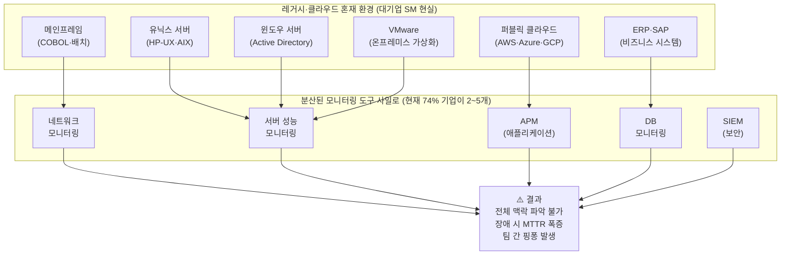
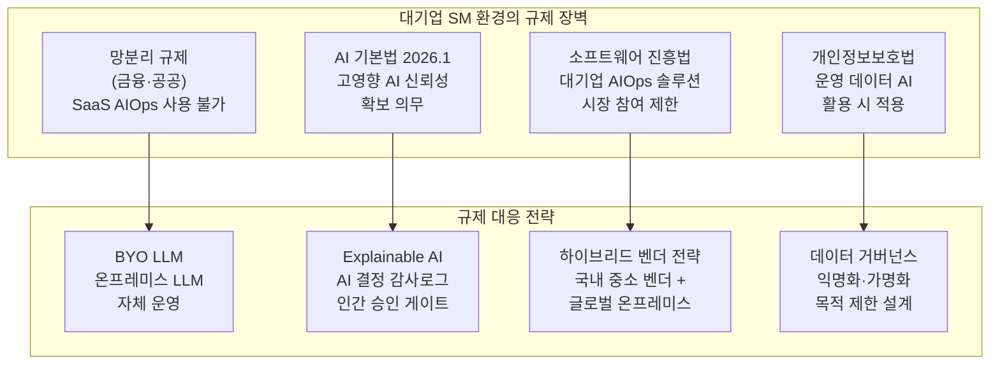
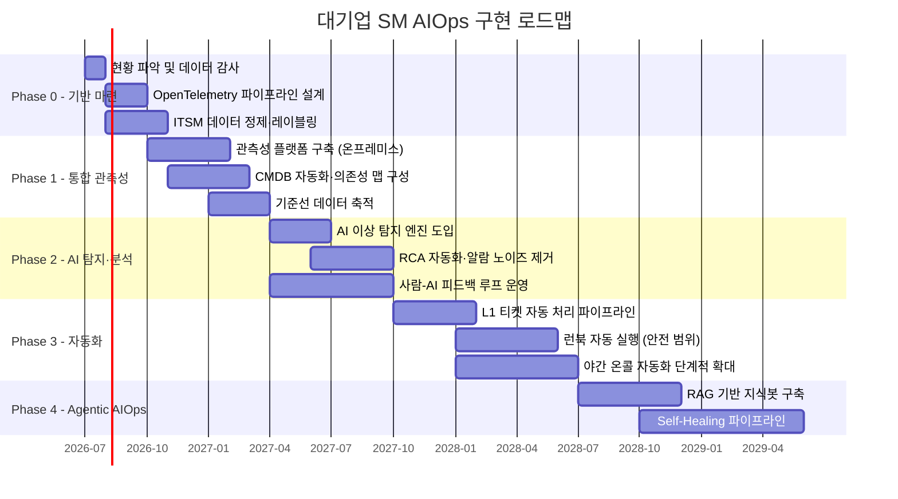

## — 레거시의 늪을 건너 자율 운영으로

> 단순 모니터링 알람 도구를 넘어, 이기종 레거시·규제·하청 구조라는  
> 대기업 SM 환경 고유의 장벽을 직시하고 돌파하는 실전 전략

---

## 목차

1. [AIOps란 무엇인가 — 2026년의 현주소](#1-aiops란-무엇인가)
2. [대기업 SM 환경의 특수성 — 왜 일반 가이드가 통하지 않는가](#2-대기업-sm-환경의-특수성)
3. [관측 가능성(Observability) — AIOps의 실질적 전제 조건](#3-관측-가능성)
4. [규제와 컴플라이언스 — 대기업 AIOps를 가로막는 제도적 장벽](#4-규제와-컴플라이언스)
5. [AIOps 성숙도 모델 — 탐지에서 자율화까지 4단계](#5-aiops-성숙도-모델)
6. [ITSM과 AIOps의 연동 현실](#6-itsm과-aiops-연동)
7. [조직·인력 구조와 야간 온콜 문화](#7-조직-인력-구조)
8. [단계별 구현 로드맵 — Phase 0부터 Agentic AIOps까지](#8-구현-로드맵)
9. [Agentic AIOps — 2026년 이후의 자율 운영](#9-agentic-aiops)
10. [결론 — 2026~2028 골든 타임과 SM 사업의 재정의](#10-결론)

---

## 1. AIOps란 무엇인가 — 2026년의 현주소 {#1-aiops란-무엇인가}

### 1.1 정의와 탄생 배경

AIOps(AI for IT Operations)는 2016년 가트너(Gartner)가 처음 정의한 개념으로, 머신러닝과 빅데이터 분석을 통해 IT 운영 업무를 자동화하고 강화하는 일련의 기술과 방법론을 말한다. 가트너의 정의에 따르면 AIOps 플랫폼은 관찰(데이터 수집 및 처리), 서비스 관리(머신러닝 기반 분석), 실행(자동화)의 세 가지 핵심 기능으로 구성된다.

AIOps가 등장한 배경은 IT 운영 환경의 폭발적 복잡화다. 1990년대와 2000년대 초반, IT 시스템 운영은 비교적 단순했다. 서버 몇 대, 잘 알려진 애플리케이션 몇 개. CPU 사용률이 90%를 넘으면 알림을 보내고, 디스크 여유 공간이 5% 미만이면 누군가 달려가서 처리했다. CMDB(Configuration Management Database)에 모든 것을 수동으로 기록해도 관리가 됐다.

그러나 세상이 바뀌었다. 물리 서버 몇 대가 수백 개의 VM이 됐고, 모놀리식 애플리케이션이 수백 개의 마이크로서비스로 쪼개졌다. 여러 가용 영역에 걸쳐 파드가 배포되고, 서버리스 함수가 이벤트에 반응하며, SaaS API와 온프레미스 시스템이 혼재하는 하이브리드 환경이 됐다. 이 복잡성의 폭발 속에서 사람이 화면을 바라보며 장애를 감지하는 방식은 한계에 부딪혔고, AIOps가 그 해답으로 부상했다.

### 1.2 약속과 실패, 그리고 2026년의 재부상

흥미롭게도 AIOps는 2016년 등장 이후 오랫동안 기대를 충족시키지 못했다. 초기 목표는 여러 관측성 도구에서 오는 신호들을 상관 분석해 알림 노이즈를 줄이는 것이었다. 그러나 비표준화된, 단절된 데이터셋이 문제였다. 온프레미스와 클라우드에서 오는 데이터를 표준화하는 데 막대한 수작업이 필요했고, 로그·메트릭·트레이스·이벤트를 연결하는 표준도 없었다. ROI를 증명하기도 어려웠다.

2026년 현재, AIOps가 원래 약속을 이행할 수 있는 조건이 비로소 갖춰졌다는 평가가 지배적이다. 핵심은 다섯 가지 자동화 능력의 성숙이다.

첫째, 자동 컴포넌트 검색이다. CMDB를 손으로 관리하는 대신 시스템이 스스로 컴포넌트와 관계를 발견한다. 둘째, CMDB 자동 관리다. 발견된 정보를 자동으로 최신 상태로 유지한다. 셋째, AI 기반 이상 탐지다. 단순 임계값이 아닌 패턴 학습으로 진짜 이상을 감지한다. 넷째, 자동 복구다. 알려진 패턴의 장애는 런북(Runbook)을 자동 실행해 사람 없이 복구한다. 다섯째, 자율 운영이다. AI 에이전트가 스스로 판단하고 행동하는 단계로 2025년 이후 본격화되고 있다.

### 1.3 시장 규모와 성장성

IT 관측성 플랫폼 시장은 2025년 기준 약 29억 1천만 달러 규모이며, 2031년까지 69억 3천만 달러로 성장할 전망이다. 연평균 성장률(CAGR)은 15.58%로 IT 시장 전반의 평균을 크게 웃돈다. 특히 AI 운영(AI Operations) 부문은 같은 기간 연평균 22.49% 성장이 예측되며, 관측성 플랫폼 내 모든 세그먼트 중 가장 빠른 성장률을 기록할 것으로 보인다. 아시아태평양 지역은 한국·중국·일본·인도의 디지털 주권법에 힘입어 연평균 19.61% 성장이 전망된다.

가트너는 2026년까지 대기업 중 60% 이상이 AIOps 기반 관측성 플랫폼을 도입할 것으로 전망했으며, OpenTelemetry 프로젝트는 CNCF에서 쿠버네티스 다음으로 활성도가 높은 오픈소스로 자리 잡았다.

국내 시장에서는 제니퍼소프트, 와탭, 엑셈, 브레인즈컴퍼니 등 중소 전문 벤더들이 시장을 주도하고 있다. 대기업 IT 서비스 기업인 LG CNS, 삼성SDS 등도 자사 SM 사업에 AIOps를 내재화하는 방향으로 움직이고 있다. 국내 AIOps 시장이 중소기업 위주로 형성된 이유는 소프트웨어 진흥법 등 법률 규제에 따라 대기업의 시장 참여가 제한되기 때문이다. 이 구조적 특성은 대기업 SM 환경의 AIOps 도입 전략에 중요한 함의를 가진다.

---

## 2. 대기업 SM 환경의 특수성 — 왜 일반 가이드가 통하지 않는가 {#2-대기업-sm-환경의-특수성}

### 2.1 대기업 SM은 다르다

AIOps에 관한 콘텐츠는 넘쳐난다. 그러나 대부분은 클라우드 네이티브 스타트업이나 SaaS 기업의 경험을 바탕으로 한다. 쿠버네티스 위에서 마이크로서비스를 운영하고, Datadog이나 New Relic 같은 SaaS 관측성 도구를 자유롭게 쓰며, 개발과 운영이 같은 팀 안에 있는 환경을 전제로 한다.

한국 대기업 계열 IT 서비스 기업의 SM 환경은 이것과 근본적으로 다르다. 이것을 이해하지 못하면 AIOps 도입 프로젝트는 반드시 실패한다.

### 2.2 이기종 레거시 시스템의 복잡성

대기업 SM 환경의 첫 번째 특수성은 수십 년에 걸쳐 쌓인 이기종 시스템들의 공존이다. 메인프레임(IBM z/OS), 유닉스 서버(HP-UX, AIX, Solaris), 윈도우 서버, 리눅스, 온프레미스 VMware 가상화, 퍼블릭 클라우드(AWS, Azure, GCP), 프라이빗 클라우드가 한 고객사 환경 안에 모두 존재하는 경우가 드물지 않다.

애플리케이션 계층은 더 복잡하다. 20년 전 구축된 COBOL 기반 배치 시스템, 자바 EE 기반 웹 애플리케이션, Oracle EBS·SAP ERP, 최근에 구축된 마이크로서비스 API 게이트웨이가 서로 연동되어 동작한다. 이들의 공통점은 각 시스템이 서로 다른 시대에, 서로 다른 팀이, 서로 다른 기술 스택으로 만들었다는 것이다.

이 환경에서 AIOps를 구현하는 첫 번째 난관은 관측 데이터의 수집 자체다. 클라우드 네이티브 환경에서는 메트릭, 로그, 트레이스를 OpenTelemetry 표준으로 손쉽게 수집할 수 있다. 레거시 시스템에서는 SNMP로 인프라 메트릭을 긁어오고, 파일 기반 로그를 파싱하며, 표준화되지 않은 포맷의 이벤트를 수집해야 한다. 일부 레거시 시스템은 데이터를 외부로 내보내는 인터페이스 자체가 없는 경우도 있다.

기업들이 이미 다양한 모니터링 도구를 사용하고 있지만, 실제 장애 대응 과정에서는 오히려 복잡성이 커진다. 네트워크, 서버, 애플리케이션, 클라우드, 스토리지 등 각 영역을 보는 도구가 분리돼 있어 전체 맥락을 파악하기 어렵다는 것이다. IT팀의 74%가 2~5개의 모니터링 도구를 사용하고, 17%는 5개 이상의 도구를 관리하고 있다.

각 도구가 제 영역의 데이터만 보여주므로, 장애 발생 시 어느 계층에서 문제가 시작됐는지 파악하기 위해 여러 대시보드를 오가며 수동으로 맥락을 연결해야 한다. 이것이 MTTR(평균 복구 시간)이 길어지는 구조적 원인이다.

### 2.3 CMDB의 현실: 없거나, 있어도 믿을 수 없다

AIOps의 기반이 되는 것은 IT 구성 정보다. 어떤 서버가 어떤 애플리케이션을 실행하고, 그 애플리케이션이 어떤 데이터베이스와 연결되며, 어떤 비즈니스 서비스를 지원하는지에 대한 의존성 맵이 없으면 AI가 장애의 근본 원인을 찾아내는 것은 불가능에 가깝다.

이론적으로 CMDB(Configuration Management Database)가 이 역할을 해야 한다. 현실은 냉혹하다. 대형 SM 환경에서 CMDB는 세 가지 상태 중 하나다. 아예 존재하지 않는 경우, 형식적으로 존재하지만 수년 전 정보에서 업데이트가 멈춘 경우, 일부 영역만 커버하고 나머지는 공백인 경우다.

CMDB가 부정확한 이유는 관리의 어려움이다. 시스템 변경, 패치 적용, 신규 서버 추가, 애플리케이션 배포마다 CMDB를 수동으로 업데이트해야 한다. 수백 명의 엔지니어가 수천 개의 시스템을 운영하는 환경에서 이것은 현실적으로 불가능하다. 변경 이후 CMDB 업데이트는 항상 뒤처지고, 결과적으로 CMDB와 실제 운영 환경 사이의 간극이 점점 커진다.

2026년 현재 AIOps가 이 문제에 대한 해법을 제시하고 있다. CMDB를 손으로 관리하는 대신, 시스템이 스스로 컴포넌트와 관계를 발견하는 자동 컴포넌트 검색 기능이 그것이다. 네트워크 트래픽 분석, 에이전트 기반 프로세스 탐지, API 호출 패턴 분석을 통해 AI가 실제 의존성 맵을 자동으로 구성하고 지속적으로 최신화한다. 이것이 AIOps 도입의 첫 번째 현실적 이점이다.

### 2.4 다중 모니터링 도구의 사일로

대형 SM 환경은 역사적으로 각 계층별로 별도의 모니터링 도구를 도입해 왔다. 네트워크 모니터링 도구, 서버 성능 모니터링 도구, 애플리케이션 성능 관리(APM) 도구, 데이터베이스 모니터링 도구, 보안 이벤트 관리(SIEM) 도구가 각각 도입되었다.

이 도구들은 각자의 대시보드, 알림 체계, 데이터 저장소를 가지고 있다. 장애가 발생하면 네트워크 팀은 네트워크 도구를, 인프라 팀은 서버 모니터링 도구를, 애플리케이션 팀은 APM을 각각 들여다본다. 이들이 보는 데이터는 서로 연결되지 않는다. 근본 원인이 네트워크 레이턴시 증가였는데 애플리케이션 팀이 먼저 알림을 받아 코드를 뒤지는 상황이 반복된다.

설문에 참여한 58%의 금융 IT 운영 담당자들이 통합 모니터링 환경 구축을 가장 큰 과제로 꼽았으며, 이는 2위인 장애 원인 파악의 어려움(12%)과 무려 46%p나 차이가 나는 압도적인 수치다. 도구 통합, 즉 단일 가시성 확보가 대기업 SM에서 AIOps 도입의 첫 번째 과제인 이유가 여기에 있다.

### 2.5 하청·파견 인력 구조의 이중성

대기업 SM 사업의 또 다른 특수성은 인력 구조다. 정규직 운영 엔지니어는 주요 의사결정과 고객 대면 업무를 담당하고, 실제 야간 모니터링, 반복적인 L1 인시던트 처리, 정기 점검 업무는 협력업체 파견·하청 인력이 담당하는 구조가 일반적이다.

이 구조는 AIOps 도입에 두 가지 복잡한 함의를 가진다. 하나는 AIOps가 자동화하는 업무가 바로 하청·파견 인력이 담당하는 업무라는 것이다. L1 티켓 자동 처리, 야간 알림 자동 대응, 정기 보고서 자동 생성이 그것이다. AI가 이 업무를 처리하면 협력업체 계약 규모가 줄어든다. 이것은 비용 절감이지만 동시에 협력업체와의 관계와 계약 구조를 흔드는 문제다.

다른 하나는 지식 단절이다. 특정 레거시 시스템에 대한 깊은 운영 지식이 장기 파견 인력에게 집중되어 있는 경우가 많다. 그 지식이 체계적으로 문서화되지 않은 상태에서 AIOps를 구축하면, AI가 학습할 데이터와 규칙 자체가 존재하지 않는다. AIOps 도입 전에 이 암묵지를 명시적 지식으로 전환하는 작업이 선행되어야 한다.

---

## 3. 관측 가능성(Observability) — AIOps의 실질적 전제 조건 {#3-관측-가능성}

### 3.1 모니터링과 관측 가능성은 다르다

2026년 현재, 엔터프라이즈 IT 운영에서 '모니터링(Monitoring)'이라는 단어는 더 이상 현대적인 운영 환경을 충분히 설명하지 못한다. 클라우드 아키텍처는 가상머신 중심의 정적 인프라에서 쿠버네티스, 서버리스, 엣지 컴퓨팅이 결합된 고도로 동적이고 복잡한 하이브리드 메시 구조로 급격히 진화했다. 구성요소가 밀리초 단위로 생성되고 사라지는 환경에서, "지금 살아있는가"를 확인하는 단순 상태 점검은 신호 대비 잡음이 커질 뿐이다. 이제 핵심 질문은 '살아있음(Up/Down)'이 아니라 왜 그런 현상이 발생했는지, 그리고 어떤 방식으로 복구되어야 하는지다.

모니터링이 "무엇이 일어났는가"를 알려준다면, 관측 가능성(Observability)은 "왜 그것이 일어났는가"를 이해할 수 있게 해준다. 이 차이는 실제 장애 대응 과정에서 극명하게 드러난다. 모니터링 도구는 "데이터베이스 응답 시간이 5초를 초과했습니다"라고 알린다. 관측 가능성이 확보된 시스템은 "데이터베이스 응답 시간 초과의 원인은 A 서비스에서 B API를 호출하는 과정에서 특정 쿼리의 실행 계획이 변경되었기 때문이며, 이는 3일 전 인덱스 통계 업데이트 이후 발생한 현상입니다"라고 분석한다.

AIOps는 관측 가능성이 확보된 환경에서만 작동한다. 데이터가 없으면 AI도 없다. 이것이 대기업 SM에서 AIOps 도입의 첫 번째 단계가 항상 관측 가능성 플랫폼 구축이어야 하는 이유다.

### 3.2 메트릭·로그·트레이스 — 관측 가능성의 3축

관측 가능성은 세 가지 신호 유형의 통합으로 구성된다. 이를 'Three Pillars of Observability', 즉 관측 가능성의 세 기둥이라 부른다.

메트릭(Metrics)은 시계열 수치 데이터다. CPU 사용률, 메모리 사용량, 네트워크 트래픽, 응답 시간, 에러율 같은 숫자들이다. 시스템의 건강 상태를 수치로 표현하므로 이상 감지와 예측에 적합하다. 그러나 메트릭만으로는 "왜"를 알 수 없다.

로그(Logs)는 시스템이 생성하는 이벤트 기록이다. 어떤 트랜잭션이 실행됐고, 어떤 오류 메시지가 발생했으며, 어떤 사용자가 어떤 작업을 수행했는지 기록된다. 문제 진단의 핵심 증거이지만, 대기업 환경에서는 하루에 수억 건의 로그가 생성되어 사람이 직접 분석하는 것이 불가능하다. 로그 수집의 가장 큰 과제는 볼륨이다. 시스템은 엄청난 양의 로그를 생성하고, 그 중 일상 운영에 유의미한 것은 일부에 불과하다. 오래된 레거시 시스템의 비구조화된 로그도 골칫거리다.

트레이스(Traces)는 단일 요청이 여러 서비스를 통과하는 전체 여정을 추적한다. 마이크로서비스 환경에서 특히 중요하다. 사용자의 주문 요청이 프론트엔드 서비스→인증 서비스→재고 서비스→결제 서비스→배송 서비스를 순차적으로 거칠 때, 각 서비스에서 얼마나 시간이 걸렸는지, 어느 구간에서 오류가 발생했는지를 한눈에 파악할 수 있게 한다.

금융 IT 담당자들이 원하는 기능은 명확하다. E2E 트랜잭션 실시간 추적(32%)이 1위, 클라우드/온프레미스 통합 관제(16%)가 2위, 장애 자동 탐지 및 알림(11%)이 3위다. 1위와 2위를 관통하는 키워드는 전 구간 가시성, 즉 통합 모니터링이다.

### 3.3 OpenTelemetry — 표준화의 게임 체인저

과거 관측 가능성의 가장 큰 문제는 벤더 종속이었다. Datadog 에이전트를 설치하면 데이터가 Datadog으로만 흐르고, New Relic을 쓰면 New Relic으로만 흐른다. 다른 벤더로 전환하려면 계측 코드, 라이브러리 설정, 대시보드, 알림 모델, 운영 프로세스를 모두 재구축해야 했다.

2026년 아키텍처에서는 애플리케이션이 OpenTelemetry(OTel) 표준으로 데이터를 방출하고, OTel 콜렉터가 이를 중앙에서 수집한 뒤, 필요에 따라 다양한 벤더로 라우팅한다. 이는 기업이 데이터의 소유권을 벤더에게 넘겨주지 않고 유지할 수 있게 하며, 가격 협상력을 확보하는 핵심 수단이 된다.

OpenTelemetry는 CNCF(Cloud Native Computing Foundation)에서 관리하는 오픈소스 표준으로, 쿠버네티스 다음으로 활성도가 높은 프로젝트다. 대기업 SM 환경에서 OpenTelemetry의 의미는 특히 크다. 벤더를 교체하거나 복수의 관측 플랫폼을 사용해도 계측 코드를 다시 작성할 필요가 없다. 또한 온프레미스와 클라우드의 데이터를 동일한 표준으로 수집할 수 있어 이기종 환경의 통합 관측을 현실화한다.

### 3.4 SAP PCE 전환 이후의 가시성 위기

한국 대기업 SM 환경에서 2024~2026년 사이 가장 뜨거운 이슈 중 하나는 SAP PCE(Private Cloud Edition) 전환이다. SAP가 클라우드 전환 정책을 강화하면서 기존 온프레미스 SAP ERP를 SAP S/4HANA PCE로 전환하는 프로젝트가 국내 중견·대기업에서 본격화되고 있다.

SAP PCE 환경에서는 인프라 운영 책임이 SAP 측으로 넘어가는 구조여서, 고객사 IT 팀이 직접 서버 내부를 들여다보기 어렵다. 시스템 병목이 발생해도 원인을 빠르게 파악하기 힘들다는 현장 불만이 나오는 배경이다. 2024년 여름 시작된 국내 한 대기업의 차세대 ERP 전환 프로젝트에서 온프레미스 SAP에서 SAP S/4HANA PCE로 이전하는 과정에서 인프라 성능 가시성 확보가 최대 난제로 부상했고, 장애 발생 시 근본 원인을 신속히 분석하는 체계가 사실상 없는 상태였다.

이것이 의미하는 바는 명확하다. 기존 SM 인력이 서버에 직접 접근하여 성능을 측정하던 방식이 더 이상 불가능해진다. 클라우드로 넘어간 인프라에 대한 가시성을 확보하려면, 애플리케이션 계층부터 데이터베이스, 네트워크, 클라우드 인프라까지 전 구간을 아우르는 엔드투엔드 관측성 플랫폼이 필수가 된다. SAP PCE 전환은 단순한 기술 이전이 아니라 운영 패러다임의 전환을 요구하며, 이것이 AIOps 도입을 더 이상 선택이 아닌 필수로 만드는 또 하나의 동인이다.

---

## 4. 규제와 컴플라이언스 — 대기업 AIOps를 가로막는 제도적 장벽 {#4-규제와-컴플라이언스}

### 4.1 망분리 규제: 가장 높은 장벽

한국 금융권과 공공 분야 SM을 담당하는 기업에게 망분리 규제는 AIOps 도입의 가장 높은 장벽이다. 금융보안원 가이드라인과 전자금융감독규정은 금융회사의 내부 업무망과 인터넷망을 물리적 또는 논리적으로 분리하도록 요구한다.

이 규제가 AIOps에 미치는 영향은 직접적이다. 대부분의 글로벌 SaaS형 관측성 플랫폼(Datadog, New Relic, Dynatrace 등)은 데이터를 클라우드 서버로 전송하는 구조다. 망분리 환경에서는 이 데이터 전송 자체가 불가능하다. 운영 데이터에는 시스템 구성 정보, 애플리케이션 동작 패턴, 사용자 트랜잭션 정보가 포함되어 있어 외부 전송에 엄격한 제한이 적용된다.

결과적으로 금융·공공 SM 환경에서는 SaaS형 AIOps 플랫폼을 그대로 사용할 수 없다. 온프레미스 자체 구축(Self-hosted) 방식이 필수다. Elasticsearch + Grafana + Prometheus 조합을 자체 운영하거나, 글로벌 벤더의 온프레미스 배포 옵션을 선택해야 한다. 금융·의료·제조 분야는 SaaS형 모니터링을 쓸 수 없는 경우가 많다. Grafana Cloud 대신 자체 Grafana + Mimir + Loki 스택을 온프레미스에 배포·운영해본 경험이 있는지 확인해야 한다.

이 제약이 갖는 또 다른 함의는 LLM 활용에 관한 것이다. AI 기반 근본 원인 분석, 자연어 장애 조회, AI 기반 런북 생성을 위해서는 대형 언어 모델(LLM)이 필요하다. 외부 LLM API(ChatGPT, Claude API 등)는 망분리 환경에서 사용할 수 없다. 온프레미스에 배포 가능한 오픈소스 LLM을 자체 운영하거나, 망분리 환경에서 허가된 형태의 AI 서비스를 선택해야 한다. 이것이 'BYO LLM(Bring Your Own LLM)' 전략이 금융·공공 SM 환경에서 AIOps의 핵심 아키텍처 결정이 되는 이유다.

### 4.2 AI 기본법 2026: 새로운 컴플라이언스 요건

2026년 1월부터 AI 기본법이 본격 시행되면서 국내 AI 산업의 새로운 규칙이 세워질 전망이다. 특히 생명, 안전, 기본권에 영향을 미칠 수 있는 '고영향 인공지능'에 대한 신뢰성 확보 의무가 명문화됨에 따라, 기업들에게 규제 준수는 선택이 아닌 필수 생존 전략이 될 것이다.

AIOps 맥락에서 AI 기본법이 갖는 의미는 구체적이다. AI가 자동으로 시스템 변경을 실행하거나, 장애 복구 조치를 취하거나, 서비스 중단 여부를 결정하는 것이 '고영향 AI' 범주에 해당할 수 있다. 이 경우 신뢰성 확보 의무가 적용되며, AI 의사결정 과정의 추적 가능성, 인간 감독 체계, 결정의 설명 가능성이 요구된다.

이것은 Agentic AIOps 구현 시 설계 단계에서부터 반영해야 할 요건이다. AI가 자동으로 실행한 모든 조치에 대한 감사 로그, 인간 승인이 필요한 임계값 정의, AI 결정의 근거를 설명하는 Explainable AI(XAI) 기능이 AIOps 플랫폼의 필수 구성 요소가 된다.

### 4.3 소프트웨어 진흥법과 국내 시장 구조

국내에서 AIOps 제품을 출시한 기업들은 모두 연 매출액 400억원 이하의 중소기업으로 국내 AIOps 시장은 중소기업을 중심으로 형성되어 있다. 국내 AIOps 시장이 중소기업 위주로 형성된 이유는 소프트웨어 진흥법 등 법률 규제에 따라 대기업의 시장 참여가 제한되기 때문이다.

이 구조는 대기업 SM 기업에 복잡한 과제를 안긴다. 자체적으로 AIOps 솔루션을 개발하거나, 국내 중소 벤더의 솔루션을 채택하거나, 글로벌 벤더와 협력하는 세 가지 경로가 있다. 각 경로마다 장단점이 다르다.

자체 개발은 망분리 요건을 완전히 충족하고 자사 환경에 최적화할 수 있지만, 개발·유지보수 비용이 높고 글로벌 기술 발전을 따라가기 어렵다. 국내 중소 벤더 솔루션은 한국 규제 환경을 잘 이해하고 온프레미스 지원이 강점이지만, 기능이 글로벌 벤더 대비 제한될 수 있다. 글로벌 벤더는 기술 선진성이 높지만 망분리 요건 충족을 위한 온프레미스 옵션 확보가 핵심 선택 기준이 된다.

대부분의 대형 SM 기업은 이 세 가지를 혼합하는 전략을 취한다. 공통 관측성 인프라(OpenTelemetry 기반 데이터 파이프라인)는 자체 구축하고, AI 분석 엔진은 국내 규제 적합 벤더를 활용하며, 특정 영역의 전문 기능은 글로벌 벤더의 온프레미스 옵션으로 보완하는 방식이다.

### 4.4 개인정보보호법과 운영 데이터

운영 데이터에는 생각보다 많은 개인정보가 포함될 수 있다. 트랜잭션 로그에는 사용자 ID, 접속 IP, 조회 패턴이 담기고, APM 트레이스에는 사용자 행동 데이터가 포함된다. 이 데이터를 AI 학습에 활용하거나 외부 시스템으로 전송할 때 개인정보보호법 요건이 적용된다.

특히 AI 모델 훈련 목적으로 운영 데이터를 수집하고 활용하는 경우, 데이터 최소화 원칙과 목적 제한 원칙을 고려한 설계가 필요하다. 운영 데이터 익명화·가명화 처리, 데이터 보유 기간 정책, AI 학습 데이터 거버넌스 체계를 AIOps 플랫폼 구축 초기부터 포함시켜야 한다.

---

## 5. AIOps 성숙도 모델 — 탐지에서 자율화까지 4단계 {#5-aiops-성숙도-모델}

### 5.1 성숙도 모델의 필요성

AIOps를 도입한다고 해서 곧바로 자율 운영이 실현되는 것은 아니다. 모든 성공적인 AIOps 구현은 단계적으로 진행된다. 각 단계는 이전 단계의 데이터와 신뢰를 기반으로 한다. 단계를 건너뛰면 실패한다. 대기업 SM 환경에서 AIOps가 "해봤는데 효과 없었다"는 결론으로 끝나는 경우의 대부분은 1단계의 데이터 기반이 불충분한 상태에서 3단계의 자동화를 시도했기 때문이다.

일반적으로 AIOps의 영역을 구분해보면 크게 탐지(Detect), 예측(Predict), 실행(Act)의 영역으로 구분할 수 있다. 여기에 2025년 이후 본격화된 4단계, 자율화(Autonomous/Agentic) 단계를 추가한다.

### 5.2 1단계: 탐지(Detect) — 알람 피로에서 신호로

탐지 단계는 가장 기본적이지만 대기업 SM 환경에서 이것조차 제대로 하지 못하는 경우가 많다. 알람 피로(Alert Fatigue)가 대표적 증상이다. 수천 개의 알람이 쏟아지는 상황에서 운영 엔지니어는 정작 중요한 장애 신호를 놓친다. "늑대가 나타났다"는 경보가 너무 많아 아무도 진지하게 반응하지 않게 되는 것이다.

AI 기반 탐지의 핵심 능력은 세 가지다. 첫째, 이상 탐지(Anomaly Detection)다. 과거의 정상 패턴을 학습하여 해당 패턴에서 벗어나는 상황을 실시간으로 포착한다. 단순 임계값이 아닌 맥락적 판단이 가능하다. 예를 들어 배치 처리 시간대에 CPU 80%는 정상이지만 동일 시간대 평소 대비 갑작스러운 20% 추가 상승은 이상 신호다. 둘째, 노이즈 제거다. 수천 개의 알람 중 상관관계 분석을 통해 동일한 근본 원인에서 비롯된 연쇄 알람들을 하나의 인시던트로 그룹화한다. 장애 발생 시 500개 알람이 쏟아지는 것이 아니라 "데이터베이스 연결 풀 고갈로 인한 20개 서비스 영향"이라는 단일 인시던트로 제시된다. 셋째, 상관관계 분석이다. 서로 다른 시스템에서 발생하는 이벤트 간의 연관성을 파악하여 문제의 징후를 더 정확하게 파악한다.

1단계의 성공 기준은 명확하다. 하루 수천 건의 알람이 수십 건의 의미 있는 인시던트로 압축되어야 한다. 운영 엔지니어가 모든 알람을 확인하는 것이 아니라, AI가 우선순위를 정한 소수의 인시던트에 집중할 수 있어야 한다.

### 5.3 2단계: 예측(Predict) — 장애가 나기 전에

예측 단계는 과거 데이터와 현재 추세를 분석하여 미래에 발생할 가능성이 높은 장애나 성능 저하를 미리 진단하는 것이다. 이 단계에서 비로소 SM의 역할이 사후 대응에서 사전 예방으로 전환되기 시작한다.

주요 예측 능력은 세 가지다. 사전 장애 예측은 기존에 장애가 발생했던 상황에 대한 패턴을 분석하여 실제 장애가 발생하기 전에 선제적으로 인지한다. 예를 들어, 특정 요일 특정 시간대에 반복적으로 장애가 발생한 패턴이 있다면, 그 패턴이 다시 형성되기 시작할 때 경보를 발령한다. 리소스 예측은 과거 데이터와 현재 추세를 분석하여 리소스 확장이 필요한 시점을 미리 예측한다. 캐패시티 플래닝이 데이터 기반으로 바뀐다. 장애 영향 범위 예측은 특정 시스템에 장애가 발생할 경우 어떤 서비스가 영향을 받는지 사전에 파악하는 것이다. 이를 위해 앞서 구축한 의존성 맵이 활용된다.

2단계에서 가장 중요한 것은 데이터 품질과 양이다. 최소 6~12개월의 역사 데이터가 쌓여야 계절성과 트렌드를 학습한 예측 모델이 의미 있는 결과를 낸다. 이것이 AIOps 도입 초기에 데이터 수집 인프라를 선행해야 하는 이유다.

### 5.4 3단계: 실행(Act) — 사람 없이 복구

실행 단계는 AI가 탐지한 인시던트를 자동으로 처리하는 것이다. 이 단계부터 실질적인 인력 효율화가 시작된다. 중요한 것은 모든 인시던트를 자동화하려 해서는 안 된다는 점이다. 패턴이 명확하고 영향 범위가 제한적인 인시던트부터 시작하여 신뢰를 쌓아가는 방식이 현실적이다.

자동화 적합 인시던트의 특성은 명확하다. 반복적으로 발생하는 인시던트, 해결 방법이 정해진 런북이 있는 인시던트, 잘못 실행해도 영향 범위가 제한적인 인시던트가 그것이다. 서버 디스크 정리 스크립트 실행, 애플리케이션 재시작, 특정 캐시 초기화, L1 티켓 자동 분류 및 담당자 배정이 전형적인 예다.

MTTR(평균 복구 시간)이 30분을 초과하는 기업들은 효율적인 인시던트 분류 및 스크립트 자동 실행을 통해 운영 효율성을 개선하고 다운타임을 줄이기 위해 AIOps 솔루션을 점점 더 많이 도입하고 있다. 자동화 파이프라인의 전형적인 구조는 다음과 같다. 이상 감지 발생 → AI 근본 원인 분석(RCA) → 매칭되는 런북 검색 → 자동 실행 (또는 인간 승인 요청) → 결과 검증 → ITSM 티켓 자동 업데이트 → 사후 분석 데이터 축적이다.

국내 제조 대기업의 AIOps 도입 사례에서, 기존 2시간 이상 걸리던 정기 점검 프로세스가 15분 이내로 단축되며 약 87%의 운영 효율 개선을 달성했다. 동일 작업에 필요했던 인력도 100명 이상에서 10명 내외로 최적화되면서 핵심 IT 인력이 반복 업무에서 벗어나 전략적 프로젝트와 고부가가치 업무에 집중할 수 있는 기반을 마련했다.

### 5.5 4단계: 자율화(Autonomous) — Agentic AIOps

2025년 이후 등장한 4번째 단계는 AI 에이전트가 스스로 상황을 판단하고, 계획을 수립하며, 행동하는 자율 운영이다. 단순한 런북 실행을 넘어, AI가 복잡한 다단계 문제를 해결하는 능력이다.

2016년 가트너가 AIOps를 정의한 이후 오랫동안 이 개념은 마케팅 용어로 소비되어 왔으나, 2026년에는 실질적인 에이전트형 AI의 형태로 구현되고 있다. AIOps가 단순한 경고 상관관계 분석에서 자율적인 문제 해결로 전환되고 있는 것이다. 2025년 이후 Agentic AIOps 시대가 본격적으로 도래할 것으로 전망된다.

Agentic AIOps의 핵심 특징은 다단계 추론이다. "데이터베이스 응답 지연"이라는 증상에서 시작하여, AI 에이전트가 메트릭 분석 → 로그 조회 → 실행 계획 분석 → 쿼리 최적화 권고 → 인덱스 상태 확인 → 통계 업데이트 실행 → 결과 검증의 과정을 스스로 추론하고 실행한다. 이 과정에서 각 단계의 결과에 따라 다음 행동을 동적으로 결정한다.

RAG(검색증강생성) 기반 지식봇과 셀프힐링(Self-Healing) 환경 도입도 Agentic AIOps의 핵심 구성 요소다. 과거 인시던트 해결 사례, 런북, 시스템 문서를 RAG 방식으로 검색하여 현재 인시던트 해결에 활용하고, 알려진 문제 유형에 대해서는 사람의 개입 없이 시스템이 스스로 치유(Self-Healing)한다.

```mermaid
flowchart LR
    subgraph STAGE1["1단계: 탐지\n(Detect)"]
        D1["이상 탐지\n(Anomaly Detection)"]
        D2["노이즈 제거\n(Alert Grouping)"]
        D3["상관관계 분석\n(Correlation)"]
    end

    subgraph STAGE2["2단계: 예측\n(Predict)"]
        P1["장애 사전 예측\n(Predictive)"]
        P2["리소스 용량 계획\n(Capacity Planning)"]
        P3["영향 범위 예측\n(Impact Analysis)"]
    end

    subgraph STAGE3["3단계: 실행\n(Act / Automate)"]
        A1["런북 자동 실행\n(Auto Remediation)"]
        A2["L1 티켓 자동 처리\n(Auto Triage)"]
        A3["ITSM 자동 연동\n(ServiceNow)"]
    end

    subgraph STAGE4["4단계: 자율화\n(Agentic AIOps)"]
        G1["다단계 추론\n(Multi-step RCA)"]
        G2["RAG 기반 지식봇\n(Self-Knowledge)"]
        G3["Self-Healing\n(자율 복구)"]
    end

    DATA["운영 데이터\n축적 기반\n(6~12개월 이상)"]

    DATA --> STAGE1
    STAGE1 -->|"신뢰 축적"| STAGE2
    STAGE2 -->|"예측 정확도 검증"| STAGE3
    STAGE3 -->|"자동화 성숙"| STAGE4
```

---

## 6. ITSM과 AIOps의 연동 현실 {#6-itsm과-aiops-연동}

### 6.1 ITSM이 AIOps와 만나야 하는 이유

대기업 SM 환경에서 IT 서비스 관리(ITSM)는 모든 운영 활동의 공식 기록이다. ServiceNow, BMC Remedy, HP Service Manager 등의 ITSM 플랫폼이 인시던트 티켓, 변경 요청, 문제 관리, 서비스 요청을 관리한다. SLA 이행 여부, 장애 이력, 변경 관리 승인 프로세스가 모두 ITSM을 통해 추적된다.

AIOps와 ITSM의 연동은 선택이 아닌 필수다. AIOps가 이상을 감지하고 대응 조치를 취했다면, 그 모든 과정이 ITSM에 공식 기록으로 남아야 한다. 감사(Audit) 요건 때문이기도 하고, SLA 이행의 증거 때문이기도 하다. 또한 ITSM의 과거 티켓 데이터는 AIOps의 학습 자료로 활용되어야 한다. 과거 어떤 증상에서 어떤 해결 방법이 효과적이었는지의 이력이 AI 모델의 핵심 훈련 데이터다.

### 6.2 티켓 자동화 파이프라인

AIOps와 ITSM이 통합된 티켓 자동화 파이프라인은 다음과 같이 작동한다.

첫 번째 단계는 AI 기반 자동 분류다. AIOps가 이상을 감지하면 티켓이 자동 생성된다. AI가 이전 유사 인시던트 패턴을 분석하여 티켓의 심각도(Priority), 카테고리, 담당 팀을 자동으로 분류한다. 사람이 개입하는 것보다 빠르고 일관성 있게 처리된다.

두 번째 단계는 자동 배정이다. 분류된 티켓이 적절한 담당 팀이나 담당자에게 자동으로 배정된다. 야간에 장애가 발생해도 온콜 담당자에게 즉각 알림이 가고, L1 수준의 인시던트는 자동화 런북이 먼저 실행된다.

세 번째 단계는 자동 해결 또는 에스컬레이션이다. 알려진 패턴의 인시던트는 런북 자동 실행으로 해결하고 티켓을 자동 종결한다. 알려지지 않은 패턴이나 복잡한 인시던트는 적절한 레벨로 에스컬레이션된다.

네 번째 단계는 사후 분석 자동화다. 해결된 인시던트에 대해 AI가 사후 분석 보고서 초안을 자동 생성한다. 근본 원인, 영향 범위, 해결 과정, 재발 방지 권고사항이 포함된다. 담당자는 이 초안을 검토하고 수정하여 최종 보고서로 확정한다.

### 6.3 변경 관리와 AI 위험 평가

대기업 SM에서 변경 관리(Change Management)는 매우 중요하다. 잘못된 변경이 장애의 주요 원인이기 때문이다. ITSM의 변경 승인 프로세스는 이 위험을 통제하기 위해 존재하지만, 승인 절차가 복잡하고 느려서 긴급 변경 시 병목이 되는 경우가 많다.

AIOps는 변경 관리의 위험 평가를 자동화할 수 있다. 과거 변경 이력 기반 AI 위험도 자동 산정이 그것이다. 특정 시스템에 대한 특정 유형의 변경이 과거에 장애를 일으킨 비율, 변경이 영향을 미치는 의존 서비스의 수, 변경 예정 시간대의 비즈니스 영향도를 종합하여 변경의 위험 점수를 자동으로 산정한다.

위험 점수가 낮은 표준 변경은 자동 승인이 가능하고, 위험 점수가 높은 변경은 더 많은 검토자의 승인을 요구하는 방식으로 변경 관리 프로세스를 개선할 수 있다. 이는 변경 처리 속도를 높이면서 동시에 고위험 변경에 대한 통제를 강화하는 효과를 낸다.

---

## 7. 조직·인력 구조와 야간 온콜 문화 {#7-조직-인력-구조}

### 7.1 야간 온콜 문화의 실체

한국 대기업 SM 현장에서 야간 온콜은 운영 엔지니어의 삶을 지배하는 현실이다. 24시간 365일 시스템 가용성을 보장해야 하는 SM 계약 조건 아래, 야간과 주말에도 누군가는 항상 당직을 서거나 긴급 연락을 받을 준비를 해야 한다.

야간 온콜의 문제는 단순한 피로 이상이다. 자주 깨는 온콜이 번아웃, 이직률 증가, 집중력 저하로 이어진다는 것은 SRE(Site Reliability Engineering) 커뮤니티에서 잘 알려진 사실이다. 특히 자정부터 새벽 사이에 불필요한 알람으로 깨어나는 경험이 반복되면 엔지니어의 사기와 판단력이 크게 저하된다.

AIOps가 야간 온콜 문화를 어떻게 변화시키는가는 실질적인 중요성을 갖는다. 1단계 탐지에서 AI가 알람 노이즈를 대폭 줄이면, 새벽에 불필요한 알람으로 깨어나는 빈도가 줄어든다. 3단계 자동 실행에서 L1 인시던트가 자동으로 처리되면, 사람이 개입해야 하는 야간 장애 건수가 줄어든다. 4단계 자율화에서 복잡한 인시던트도 AI가 1차 대응을 마친 후 엔지니어를 호출하면, 호출 시점에 이미 원인 분석과 해결 시도가 진행된 상태라 엔지니어가 훨씬 명확한 맥락에서 판단을 내릴 수 있다.

### 7.2 AIOps가 바꾸는 운영 인력 역할

AIOps가 성숙함에 따라 SM 운영 엔지니어의 역할이 변화한다. 이 변화를 이해하고 준비하는 것이 조직 관리의 핵심이다.

현재 많은 SM 엔지니어는 시간의 상당 부분을 반복적인 작업에 쓰고 있다. 모니터링 화면 주시, L1 티켓 처리, 정기 보고서 작성, 패치 적용 후 시스템 확인이 그것이다. AIOps가 이 업무들을 자동화하면 엔지니어의 시간이 확보된다.

이 확보된 시간이 어디로 가야 하는지가 핵심이다. 이상적인 방향은 세 가지다. 첫째, AIOps 시스템 자체의 지속적 개선이다. AI 모델 성능 평가, 런북 업데이트, 자동화 범위 확장 등 AIOps 플랫폼을 더 좋게 만드는 일이다. 둘째, 복잡한 인시던트 대응 역량 강화다. AI가 처리하지 못하는 0.1%의 복잡한 장애를 더 잘 처리하기 위한 역량이다. 셋째, SI와의 협업이다. 운영 중 발견되는 구조적 문제를 개발 팀에 피드백하고, 더 운영하기 좋은 시스템 설계를 요구하는 역할이다.

### 7.3 하청·파견 구조와 AIOps의 충돌

앞서 언급했듯이, 대기업 SM 환경의 실제 운영 인력 상당수는 협력업체 소속 파견·하청 인력이다. AIOps가 자동화하는 업무가 바로 이들이 담당하는 업무이기 때문에, AIOps 도입은 협력업체와의 관계에 직접적인 영향을 미친다.

이 문제를 회피하거나 나중 일로 미루면 AIOps 도입 프로젝트 자체에 저항이 생긴다. 현장의 하청·파견 인력이 AIOps 도입에 비협조적이면 데이터 수집, 런북 작성, AI 학습 데이터 레이블링 등 AIOps 구현에 필수적인 작업들이 진행되지 않는다.

현실적인 접근 방식은 두 가지 원칙의 조합이다. 하나는 투명한 소통이다. AIOps가 업무를 없애는 것이 아니라 반복적인 업무에서 벗어나 더 가치 있는 일을 할 수 있게 해준다는 메시지와 함께, 실제로 어떤 업무가 변화하는지를 명확히 설명해야 한다. 다른 하나는 점진적 전환이다. 즉각적인 인원 감축보다는 자연 감소를 활용하고, 현재 인력이 AIOps 운영 역량을 쌓을 수 있도록 교육 기회를 제공하는 방식이다.

---

## 8. 단계별 구현 로드맵 — Phase 0부터 Agentic AIOps까지 {#8-구현-로드맵}

### 8.1 Phase 0: 데이터 기반 마련 (0~3개월)

모든 AIOps 프로젝트의 실패는 데이터에서 시작된다. 데이터가 없거나 품질이 낮으면 AI도 무의미하다. Phase 0는 AIOps 구현을 위한 데이터 기반을 마련하는 단계다. 이 단계는 눈에 보이는 성과가 없어 경영진을 설득하기 어렵지만, 이 단계를 건너뛴 프로젝트는 반드시 나중에 막힌다.

첫 번째 과제는 현황 파악이다. 현재 어떤 시스템이 있고, 어떤 모니터링 도구가 있으며, 어떤 데이터가 수집되고 있는지를 정확히 파악한다. 특히 CMDB 상태를 점검하여 실제 운영 환경과의 차이를 확인한다.

두 번째 과제는 데이터 파이프라인 설계다. OpenTelemetry 기반의 표준화된 데이터 수집 체계를 설계한다. 레거시 시스템의 데이터를 어떻게 수집할 것인지, 망분리 환경에서 데이터 흐름을 어떻게 구성할 것인지, 데이터 보존 기간은 어떻게 설정할 것인지를 결정한다.

세 번째 과제는 ITSM 데이터 정제다. 과거 인시던트 티켓을 분석하여 AI 학습에 활용 가능한 형태로 정제한다. 반복적으로 발생하는 인시던트 패턴을 식별하고, 이것이 1차 자동화 대상이 된다.

### 8.2 Phase 1: 통합 관측성 구축 (3~9개월)

단일 가시성(Single Pane of Glass)을 확보하는 단계다. 분산된 모니터링 도구들의 데이터를 통합하여 전체 IT 환경을 하나의 화면에서 볼 수 있게 한다. 이 단계의 목표는 AIOps 플랫폼이 작동할 데이터 기반을 완성하는 것이다.

핵심 작업은 세 가지다. 관측성 플랫폼 구축(메트릭·로그·트레이스 통합 수집), CMDB 자동화(자동 컴포넌트 검색으로 의존성 맵 자동 구성), 기준선(Baseline) 확립(각 시스템의 정상 동작 패턴을 AI가 학습할 수 있도록 최소 3개월 이상의 데이터 축적)이다.

이 단계가 완료되면 가시적인 첫 번째 성과가 나타난다. 장애 발생 시 여러 도구를 오가며 원인을 찾던 것이 단일 화면에서 근본 원인을 빠르게 파악할 수 있게 된다. MTTR이 30~50% 단축되는 효과를 여기서 처음 경험한다.

### 8.3 Phase 2: AI 기반 탐지·분석 (9~18개월)

통합된 데이터 위에 AI를 얹는 단계다. 이상 탐지, 알람 노이즈 제거, 상관관계 분석, 근본 원인 분석(RCA) 자동화가 주요 과제다.

이 단계에서 가장 많은 시간이 소요되는 것은 모델 튜닝이다. 초기 AI 탐지는 오탐(False Positive)과 미탐(False Negative)이 많다. 운영 엔지니어가 AI의 탐지 결과에 지속적으로 피드백(맞다/틀리다)을 제공하면서 모델이 개선된다. 이 사람-AI 협업 루프를 최소 3~6개월 운영해야 AI 탐지 결과에 대한 신뢰가 충분히 쌓인다.

이 단계의 성공 지표는 알람 건수 감소율이다. Phase 1 대비 50% 이상의 알람 노이즈 감소, MTTR 추가 단축, 장애 사전 탐지율 향상이 목표다.

### 8.4 Phase 3: 자동화 파이프라인 (18~30개월)

AI가 탐지하고 분석한 인시던트를 자동으로 처리하는 단계다. 처음에는 가장 단순하고 안전한 자동화부터 시작하여 범위를 점진적으로 확대한다.

자동화 수준별 접근이 중요하다. 완전 자동(No Human Required)은 위험 없고 결과가 확실한 경우다. 디스크 정리, 로그 아카이브, 특정 프로세스 재시작이 해당된다. 승인 후 자동(Human-in-the-Loop)은 AI가 조치를 제안하고 엔지니어가 클릭 한 번으로 승인하면 실행한다. 어시스트(AI 보조, Human Execute)는 AI가 분석과 권고를 제공하고 사람이 실행한다. 복잡하거나 위험한 조치가 여기에 해당한다.

국내 규제 환경(AI 기본법)을 고려하면 금융·공공 시스템의 경우 특히 "승인 후 자동" 또는 "어시스트" 수준이 적절하다. 완전 자동의 범위는 규제 당국과 고객사와의 명확한 협의를 통해 정의해야 한다.

### 8.5 Phase 4: Agentic AIOps (30개월 이후)

AI 에이전트가 복잡한 문제를 스스로 추론하고 해결하는 자율 운영 단계다. Phase 3까지의 경험이 충분히 쌓이고, 데이터 품질이 높으며, 조직의 AI 신뢰도가 확립된 후에야 진입 가능하다.

이 단계에서 핵심은 도메인 지식의 AI 내재화다. RAG 기반 지식봇이 과거 인시던트 해결 사례, 시스템 문서, 아키텍처 설계 결정 사항을 학습하여 새로운 문제 상황에서 관련 지식을 즉각 활용한다. Self-Healing은 알려진 문제 패턴에 대해 사람의 개입 없이 시스템이 스스로 복구한다.

---

## 9. Agentic AIOps — 2026년 이후의 자율 운영 {#9-agentic-aiops}

### 9.1 Agentic AIOps의 아키텍처

Agentic AIOps는 단일 AI 모델이 모든 것을 처리하는 것이 아니라, 역할이 분리된 여러 AI 에이전트가 협력하는 멀티 에이전트 구조로 구현된다.

관측 에이전트(Observer Agent)는 메트릭, 로그, 트레이스를 실시간으로 분석하여 이상 신호를 탐지한다. 수집된 신호를 진단 에이전트에게 전달한다. 진단 에이전트(Diagnostician Agent)는 이상 신호를 받아 근본 원인을 추론한다. 의존성 맵과 과거 인시던트 지식베이스를 참조하여 가장 가능성 높은 원인 가설을 수립한다. 실행 에이전트(Executor Agent)는 진단 결과에 기반하여 실제 조치를 실행한다. 위험도가 낮은 조치는 자율 실행하고, 위험도가 높은 조치는 인간 승인을 요청한다. 검증 에이전트(Validator Agent)는 실행된 조치의 결과를 확인한다. 문제가 해결됐는지, 부작용이 발생했는지를 모니터링하고 결과를 기록한다. 학습 에이전트(Learning Agent)는 성공한 해결 방식과 실패한 해결 방식을 기록하여 시스템 전체의 지식 베이스를 지속적으로 개선한다.

### 9.2 BYO LLM 전략: 망분리 환경에서의 AI

대기업 SM의 망분리 환경에서 Agentic AIOps를 구현하기 위해서는 온프레미스에서 실행 가능한 LLM이 필요하다. 이것이 BYO LLM(Bring Your Own LLM) 전략이다.

BYO LLM, 데이터 주권, Self-managed 환경 지원은 금융·공공 등 규제 강한 시장에서 중요한 도입 기준이다. 2026년 현재 온프레미스 배포 가능한 오픈소스 LLM은 실용적인 수준에 도달했다. Llama 3, Mistral, Qwen 등의 모델은 4~8B 파라미터 규모에서 IT 운영 관련 태스크를 처리하기에 충분한 성능을 보인다.

대기업 SM의 BYO LLM 전략은 통상 다음과 같이 설계된다. 범용 추론에는 오픈소스 LLM을 온프레미스에 배포하고, 특정 시스템이나 도메인에 특화된 태스크에는 파인튜닝(Fine-tuning)을 통해 도메인 지식을 주입한다. 회사 내부 운영 문서, 런북, 과거 인시던트 해결 사례는 RAG 방식으로 지식 베이스를 구성하여 LLM이 검색하고 활용할 수 있게 한다.

### 9.3 OpenTelemetry와 데이터 주권

국내 AI Observability 플랫폼에서 글로벌 벤더와 국내 벤더 간 기술 도입 현황, AI 기능 지원, 데이터 주권, 규제 적합성 등이 실무적 IT 의사결정의 핵심 쟁점으로 부상하고 있다.

데이터 주권 관점에서 OpenTelemetry는 대기업 SM에 핵심 전략적 가치를 제공한다. 관측 데이터를 OpenTelemetry 표준으로 수집하면, 이 데이터가 특정 벤더에 종속되지 않는다. 기업이 데이터의 소유권을 유지하면서 분석 플랫폼은 필요에 따라 교체할 수 있다. 이는 망분리 환경에서 데이터를 외부로 보내지 않으면서도 표준화된 파이프라인을 구성하는 핵심 메커니즘이다.

국내 시장에서는 2026~2028년이 AI Observability와 Agentic AIOps 도입의 골든 타임으로 제시되고 있다. 이 시기에 선점하는 기업이 레퍼런스를 확보하고 경쟁 우위를 가져간다.

### 9.4 대기업 SM에서 Agentic AIOps의 현실적 한계

Agentic AIOps에 대한 기대가 높지만, 현실적 한계도 명확히 인식해야 한다.

첫째, 레거시 시스템 한계다. AI 에이전트가 자율적으로 조치를 실행하려면 시스템에 대한 프로그래밍 접근(API, CLI, 자동화 인터페이스)이 필요하다. API가 없는 레거시 시스템에 대해서는 에이전트가 자율 실행을 할 수 없다.

둘째, 신뢰 구축의 시간이다. 자율 운영을 허용하기 위해서는 AI의 판단을 신뢰해야 한다. 이 신뢰는 수개월에서 수년의 검증 과정이 필요하다. "AI가 틀렸을 때의 비용"이 "AI가 맞았을 때의 이득"보다 크다고 느끼는 동안은 자율화 범위가 제한된다.

셋째, 설명 가능성의 요건이다. AI 기본법 등 규제 요건으로 AI의 자율 결정에 대한 설명 가능성이 요구된다. "왜 이 조치를 취했는가"를 사람이 이해할 수 있는 언어로 설명할 수 있어야 한다. 이것이 블랙박스 AI가 아닌 설명 가능한 AI(XAI) 기반의 Agentic AIOps를 요구하는 이유다.

---

## 10. 결론 — 2026~2028 골든 타임과 SM 사업의 재정의 {#10-결론}

### 10.1 대기업 SM의 구조적 전환점

2026년은 대기업 SM 사업에 구조적 전환점이 되는 해다. 세 가지 흐름이 동시에 수렴하고 있다.

첫째, 기술의 성숙이다. AIOps를 구현하기 위한 핵심 기술 — OpenTelemetry 표준화, 온프레미스 배포 가능한 AI 모델, 성숙한 멀티 에이전트 프레임워크 — 이 2025~2026년 사이에 실용적 수준에 도달했다. "기술이 아직 준비되지 않았다"는 이유로 도입을 미루는 것이 더 이상 타당하지 않다.

둘째, 고객의 요구 변화다. SM 고객들이 단순 시스템 가용성 유지를 넘어, AI 기반의 예측적 운영과 비즈니스 통찰을 요구하기 시작했다. 기존 SM 서비스 방식으로는 이 요구를 충족시킬 수 없다.

셋째, 경쟁 압력이다. 글로벌 클라우드 사업자들이 AIOps 기능을 관리형 서비스로 제공하기 시작하면서, 기존 SM 방식의 경쟁력이 급속도로 약화되고 있다. 대기업 계열 IT 서비스 기업이 AIOps를 내재화하지 않으면 경쟁력의 기반이 무너진다.

### 10.2 100X 운영 엔지니어로 가는 경로

AIOps 성숙도에 따라 SM 운영 엔지니어 1명이 관리할 수 있는 시스템 수가 어떻게 변화하는지 구체적으로 살펴보면 다음과 같다.

현재 전통적 SM에서 1명의 엔지니어가 안정적으로 관리할 수 있는 시스템은 평균 20~30개 수준이다. Phase 1(통합 관측성) 단계에서는 단일 화면에서 전체를 볼 수 있게 되어 50~70개로 늘어난다. Phase 2(AI 탐지·분석)에서 알람 노이즈가 줄고 RCA가 자동화되면 100~150개까지 확대된다. Phase 3(자동화 파이프라인)에서 L1 인시던트의 자동 처리가 정착되면 250~400개 시스템 관리가 가능해진다. Phase 4(Agentic AIOps)에서 복잡한 인시던트도 AI 에이전트가 1차 대응을 마치면 관리 가능 시스템이 500개 이상으로 확대된다.

이것이 100X에 가까운 효율 혁신이다. 단, 이 과정에서 엔지니어의 역할이 근본적으로 바뀐다는 것을 다시 강조한다. 화면을 바라보며 알람을 처리하는 역할에서, AIOps 시스템을 설계하고 운영하며 예외 케이스를 판단하는 역할로의 전환이 반드시 수반되어야 한다.

### 10.3 SM 사업 모델의 재정의

AIOps 성숙이 가져오는 가장 큰 기회는 SM 사업 모델의 재정의다. 현재 SM 사업은 인력 투입 시간에 따라 비용을 청구하는 T&M(Time & Materials) 방식이 지배적이다. 이 모델에서 AI 자동화로 인력 효율이 높아지면 청구 금액이 줄어드는 아이러니가 있다.

AIOps가 성숙함에 따라 새로운 가격 모델이 가능해진다. 가용성 기반 계약은 시스템 가용성 99.99% 보장에 월 고정 금액을 청구한다. AI로 운영 원가가 낮아지면 동일한 가용성을 더 낮은 원가로 제공할 수 있으므로 마진이 개선된다. 성과 기반 계약은 MTTR 단축, 장애 건수 감소, AI 자동화율 향상 같은 측정 가능한 성과에 따라 추가 대가를 청구한다. AI 운영 서비스는 기존 시스템 유지보수를 넘어, AI 에이전트 기반의 지능형 운영 서비스 자체를 새로운 사업으로 제공한다.

이 전환의 핵심은 "더 많은 인력을 투입한다"에서 "더 높은 가치를 제공한다"로의 이동이다. AIOps를 통해 동일한 SLA를 더 낮은 원가로 제공하면서, 그 여유를 활용해 AI 기반 운영 인사이트와 예측적 서비스라는 새로운 가치를 고객에게 제공하는 것이다.

### 10.4 시작을 위한 실천 지침

대기업 SM 조직이 AIOps 여정을 시작하기 위한 가장 현실적인 첫 번째 조치들은 다음과 같다.

현황 감사부터 시작하라. 현재 얼마나 많은 모니터링 도구가 있고, 하루에 몇 건의 알람이 발생하며, 그 중 실제 인시던트로 이어지는 비율이 얼마인지를 수치로 파악하라. 이것이 AIOps 도입 전 기준점(Baseline)이 되고 도입 후 성과를 증명하는 근거가 된다.

파일럿 도메인을 선정하라. 전체 SM 환경에 한 번에 AIOps를 적용하려 하지 말고, 데이터가 가장 풍부하고 자동화 영향이 가장 명확한 특정 시스템이나 고객사 도메인을 파일럿으로 선정하라. 성공 사례를 만들어야 경영진의 지원과 현장의 협조를 얻을 수 있다.

OpenTelemetry를 표준으로 채택하라. 신규 시스템과 갱신 시스템부터 OpenTelemetry 기반 데이터 수집을 표준으로 적용하라. 벤더 종속을 피하고 향후 유연성을 확보하는 가장 중요한 아키텍처 결정이다.

ITSM 데이터를 AI 학습 자산으로 인식하라. 과거 수년간의 인시던트 티켓, 런북, 장애 보고서가 AIOps의 가장 핵심적인 학습 자산이다. 이 데이터를 체계적으로 정제하고 구조화하는 것이 AI 모델 품질을 결정한다.

AI 기본법과 망분리 요건을 설계 초기에 반영하라. 나중에 규제 요건을 맞추려 하면 전체 아키텍처를 다시 설계해야 한다. 온프레미스 배포 가능성, BYO LLM 옵션, AI 결정 감사 로그, 인간 승인 게이트를 처음부터 설계에 포함시켜야 한다.

---

### 맺음말: AIOps는 기술 프로젝트가 아닌 운영 패러다임 전환이다

AIOps를 단순한 IT 도구 도입으로 이해하면 실패한다. AIOps는 IT 운영의 패러다임 전체를 바꾸는 전환이다. 사람이 모니터링하고 사람이 대응하는 방식에서, AI가 감지하고 분석하며 자율적으로 대응하는 방식으로의 이동이다. 이 전환에서 사람의 역할은 없어지는 것이 아니라 달라진다. 시스템을 직접 운영하는 역할에서 AI가 운영하는 시스템을 감독하고 개선하는 역할로 바뀐다.

대기업 SM 환경이 가진 이기종 레거시, 망분리 규제, CMDB 부재, 하청·파견 구조라는 장벽들은 AIOps 도입을 어렵게 만들지만 불가능하게 만들지는 않는다. 그 장벽들을 정면으로 인식하고, 단계적으로 넘어가는 로드맵을 가진 조직만이 2026~2028년의 골든 타임을 선점할 수 있다.

레거시의 늪이 깊을수록, 그것을 먼저 건너는 기업의 경쟁 우위가 크다.

---

*작성일자: 2026-06-24*
